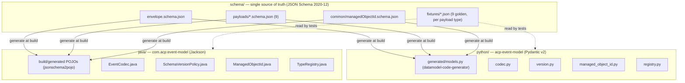
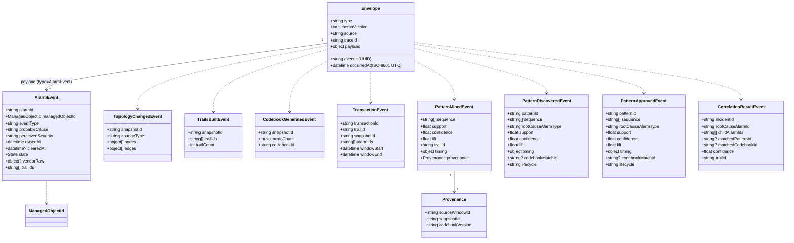
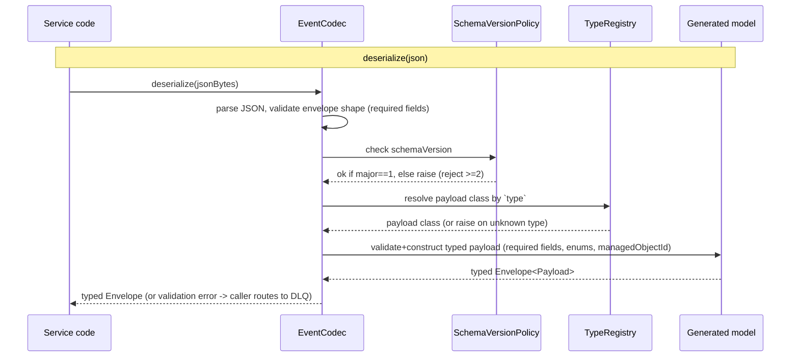
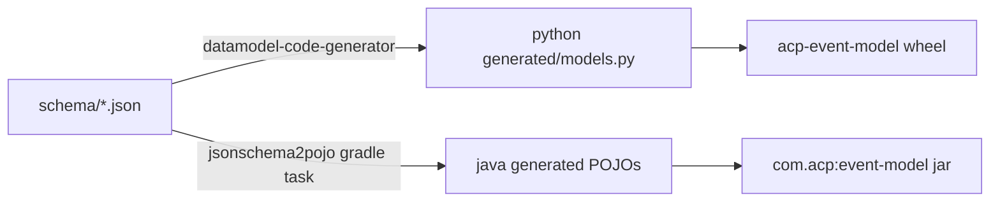

# event-model — Design

> Buildable design for the `libs/event-model` contract library. Built directly to the
> **approved, frozen** `libs/event-model/spec.md` (18 acceptance criteria). This is a **pure
> contract/binding library** — no business or domain logic, no runtime process, no Kafka
> producer/consumer, no HTTP API. One **JSON Schema** is the single source of truth; two
> language bindings (Java, Python/Pydantic) are generated from it.

## Stack

| Concern | Choice | License |
|---|---|---|
| **Single source of truth** | **JSON Schema 2020-12** — one bundle of schema files under `schema/` | — |
| **Python binding** | **Pydantic v2** models, **generated** by `datamodel-code-generator` from the JSON Schema; pip-installable package (`pyproject.toml`, PEP 517 / setuptools) | MIT (datamodel-code-generator), MIT (Pydantic) |
| **Python runtime validation** | Pydantic v2 (field/type/enum validation); `jsonschema` available for raw-schema checks in tests | MIT |
| **Java binding** | **`jsonschema2pojo` Gradle plugin** generates Java POJOs from the same JSON Schema at build time; Jackson `ObjectMapper` for (de)serialization. (Java 17; "records" goal not used — see Design alternatives) | Apache-2.0 (jsonschema2pojo), Apache-2.0 (Jackson) |
| **Java runtime validation** | `networknt/json-schema-validator` (JSON Schema 2020-12) for envelope/version/`managedObjectId` validation against the same schema files | Apache-2.0 |
| **Java build** | Gradle (wrapper), Java 17 (Temurin), JUnit 5 | Apache-2.0 |
| **Python build/test** | Python 3.13, `pytest`, `ruff`, `black` | MIT/BSD |

All dependencies are permissive (Apache-2.0 / MIT / BSD). No GPL/AGPL/BSL.

**Single-source guarantee (criterion 2):** neither binding's model classes are hand-authored.
The Python models and the Java POJOs are both **generated from the same `schema/*.json` files at
build time**. A field change in the schema propagates to both bindings on the next build, with
zero manual edits. The only hand-written code in either binding is the thin, schema-agnostic
helper layer (codec, version check, `managedObjectId` validator, discriminator registry) which
references field/type names but not field lists.

## Task breakdown (from the spec)

Every spec Task (§Tasks 1–6) is realized below and traceable.

| Spec task | Realized by (modules / artifacts / flow) |
|---|---|
| **1. Envelope schema + both bindings** | `schema/envelope.schema.json` (7 fields). Generation produces `Envelope` Pydantic model + `Envelope` Java POJO. Codec helpers (`EventCodec`) serialize/deserialize envelope+payload. → criteria 4, 6 |
| **2. Nine payload schemas, one source, `type`→one payload** | `schema/payloads/*.schema.json` (9 files). Generation produces 9 Pydantic models + 9 Java POJOs. A `type`→payload **discriminator registry** (`TypeRegistry`) maps each `type` string to exactly one payload class. → criteria 1, 2, 4, 5, 10–14 |
| **3. `managedObjectId` scheme** | `schema/common/managedObjectId.schema.json` (`pattern` + enum of 9 known `objectType`s); a `ManagedObjectId` value type + `validate()` in each binding. AlarmEvent.`managedObjectId` references it. → criteria 7, 15, 16 |
| **4. `schemaVersion` validation (reject ≥ 2)** | `SchemaVersionPolicy` in each binding: accept major `1`, reject ≥ `2`, invoked by the codec on deserialize. → criterion 3 |
| **5. (De)serialization helpers** | `EventCodec` in each binding: `serialize(envelope) -> json`, `deserialize(json) -> Envelope[typed payload]`; raises on schema violation / unknown `type` / bad version. → criteria 4, 5, 6 |
| **6. Versioned importable artifacts** | Java Gradle module produces a jar (group `com.acp`, artifact `event-model`, version from repo); Python package `acp-event-model` (pip-installable, versioned). Downstreams pin a version. → criteria 17, 18 |

## Module breakdown



**Per-binding modules (parallel structure, same responsibilities):**

| Module | Responsibility | Hand-written? |
|---|---|---|
| **Generated models** | `Envelope` + 9 payload classes (Pydantic models / Java POJOs) | No — generated from schema |
| **Codec** (`codec.py` / `EventCodec.java`) | `serialize(envelope)→JSON`, `deserialize(JSON)→typed Envelope`; orchestrates version check + discriminator + schema validation | Yes (schema-agnostic) |
| **Version policy** (`version.py` / `SchemaVersionPolicy.java`) | accept major `1`; reject major ≥ `2` | Yes |
| **`managedObjectId`** (`managed_object_id.py` / `ManagedObjectId.java`) | parse/validate `<objectType>:<id>`; expose `objectType`, `id`; `KNOWN_OBJECT_TYPES` constant (9) | Yes |
| **Discriminator registry** (`registry.py` / `TypeRegistry.java`) | `type` string → payload class, 1:1; unknown `type` → error | Yes |
| **Extension surface** | subclass-friendly: payload models are open for subclassing (see Extensibility) | Yes (doc + base classes) |

**Extensibility (no-fork rule).** A service that needs service-local convenience may **subclass**
a generated model in its own codebase (e.g. `class EnrichedAlarmView(AlarmEvent): ...` in Python,
or extend/compose the POJO in Java) **without editing this library**. The contract surface (the
nine payloads + envelope) is closed for modification here but open for extension downstream.
Adding/removing a **wire field** is a contract change to the schema (architecture.md + human
approval), never a subclass. The library ships the generated classes as non-final/extendable and
documents the subclassing pattern in its README.

**No business logic.** The library contains only: schema, generated models, codec, version
gate, id validation, discriminator. No thresholds, no Kafka, no HTTP, no domain rules.

## Data model (the contract)

The "data model" of this library **is** the wire contract. Owned datastore: **none** (the
`schema/` files are the sole authoritative artifact). Envelope + payload relationship:



Field lists are reproduced verbatim from the spec Contract section; the schema files encode
exactly these (no additions, no omissions). **PatternMinedEvent deliberately has no
`rootCauseAlarmType`, `lifecycle`, or `patternId`** (criterion 10) and `trailId` is a top-level
field (criterion 11).

### Canonical wire format (the cross-binding agreement — criterion 1, the critical one)

Both bindings MUST agree on this exact JSON encoding. Defined once here; encoded in the schema
and asserted by golden fixtures.

| Aspect | Rule |
|---|---|
| **Top-level shape** | `{ "eventId", "type", "schemaVersion", "occurredAt", "source", "traceId", "payload": { ... } }` — payload is a **nested object** under `payload`. |
| **Field names** | exact camelCase as in the spec tables; no renaming, no aliasing on the wire. (Python: Pydantic models keep the JSON names; Java: Jackson uses the schema property names.) |
| **`schemaVersion`** | JSON **integer** (`1`), not a string. |
| **Date/time** | **ISO-8601 in UTC with a `Z` suffix**, e.g. `2026-06-08T12:34:56Z` (millis allowed, e.g. `...:56.123Z`). No local offsets; both bindings serialize to `Z`. (`occurredAt`, `raisedAt`, `clearedAt`, `windowStart`, `windowEnd`.) |
| **Enums** | string literals, lowercase as specified: `state` ∈ {`raised`,`cleared`}; `type` ∈ the 9 type strings. |
| **`type` discriminator values** | the exact class names: `AlarmEvent`, `TopologyChangedEvent`, `TrailsBuiltEvent`, `CodebookGeneratedEvent`, `TransactionEvent`, `PatternMinedEvent`, `PatternDiscoveredEvent`, `PatternApprovedEvent`, `CorrelationResultEvent`. |
| **Numbers** | `support`/`confidence`/`lift` are JSON numbers (float); counts (`trailCount`, `scenarioCount`) are integers. |
| **Optional / null** | optional fields (`clearedAt`, `vendorRaw`, `codebookMatchId`, `matchedPatternId`, `matchedCodebookId`) are **omitted** from the JSON when absent (preferred); both bindings MUST accept either omission **or** explicit `null` on input and MUST omit on output (Pydantic `exclude_none`; Jackson `@JsonInclude(NON_NULL)`). |
| **Arrays** | empty arrays are emitted as `[]`, not omitted (e.g. `trailIds: []` pre-enrichment). |
| **`managedObjectId`** | a single JSON string `"<objectType>:<id>"`; not an object. |
| **Unknown extra fields** | both bindings reject unknown top-level/payload fields on strict deserialize (`additionalProperties:false` in schema; Pydantic `extra="forbid"`; Java schema-validate) so generated-model drift is caught. |

## Event handling

**N/A — this is a library, not a runtime service.** It defines the payloads carried on
`alarms.*`, `topology.changed`, `trails.built`, `codebook.generated`, `transactions.clean`,
`patterns.*`, `correlation.results`, but it has **no Kafka consumers or producers** of its own.
Idempotency keys it *defines* for downstream use: `eventId` (envelope) and `alarmId`
(AlarmEvent). DLQ behaviour (poison → `<topic>.dlq`) is implemented by the consuming services,
using this library's deserialization errors as the trigger.

## API contracts

**N/A.** This library exposes no HTTP API and publishes no OpenAPI document — it is an
importable build-time dependency. The JSON Schema (`schema/`) is its contract, checked into the
repo. Any schema change is a contract change (architecture.md update + human approval).

## Integration points (mock vs. real)

**N/A.** No outbound runtime calls; no collaborators; nothing to mock/switch. The only
"integration" is compile-/install-time consumption by downstream services (see Build & run).

## Repository layout

```
libs/event-model/
├── design.md                      # this file
├── spec.md                        # approved contract (frozen)
├── README.md                      # build/import/extend instructions (added in build)
├── schema/                        # SINGLE SOURCE OF TRUTH
│   ├── envelope.schema.json
│   ├── common/
│   │   └── managedObjectId.schema.json
│   ├── payloads/
│   │   ├── AlarmEvent.schema.json
│   │   ├── TopologyChangedEvent.schema.json
│   │   ├── TrailsBuiltEvent.schema.json
│   │   ├── CodebookGeneratedEvent.schema.json
│   │   ├── TransactionEvent.schema.json
│   │   ├── PatternMinedEvent.schema.json
│   │   ├── PatternDiscoveredEvent.schema.json
│   │   ├── PatternApprovedEvent.schema.json
│   │   └── CorrelationResultEvent.schema.json
│   └── fixtures/                  # 9 golden JSON envelopes, one per payload type
│       ├── AlarmEvent.json
│       ├── ... (one per type)
│       └── CorrelationResultEvent.json
├── java/                          # Java binding (own Gradle project)
│   ├── gradlew, gradlew.bat, gradle/wrapper/...
│   ├── build.gradle               # jsonschema2pojo plugin + Jackson + json-schema-validator
│   ├── settings.gradle
│   └── src/
│       ├── main/java/com/acp/eventmodel/   # codec, version, ManagedObjectId, TypeRegistry
│       └── test/java/com/acp/eventmodel/   # JUnit 5 tests (read ../../schema/fixtures)
└── python/                        # Python binding (own package)
    ├── pyproject.toml             # acp-event-model; setuptools; datamodel-code-generator (dev)
    ├── src/acp_event_model/       # generated/models.py, codec.py, version.py,
    │                              #   managed_object_id.py, registry.py
    ├── scripts/generate.py        # runs datamodel-code-generator over ../schema
    └── tests/                     # pytest (read ../schema/fixtures)
```

**Where the shared fixtures live & who owns them:** `libs/event-model/schema/fixtures/` — **one
canonical golden JSON per payload type**, committed once and **owned by the schema (not by either
binding)**. Both bindings' test suites read the *same* files. This is the cross-binding contract
anchor: no cross-language runtime is needed in any single CI job (see Test plan / CI).

## Key flows

### Serialize / deserialize (codec) — both bindings



### Build-time generation (single source → two bindings) — criterion 2



Generation runs **as part of the build** (Gradle `generateJsonSchema2Pojo` task wired before
`compileJava`; Python `scripts/generate.py` invoked from a build hook / documented `make gen` and
committed-then-verified-in-CI). Both targets read the **same** `schema/` directory, so a one-field
schema edit appears in both generated artifacts with no manual edits.

## Design alternatives

| Consideration | Alternatives considered | Chosen + rationale |
|---|---|---|
| **Single source of truth** | (a) JSON Schema → generate both; (b) hand-write both bindings, keep in sync by review; (c) Protobuf/Avro IDL → generate both | **(a) JSON Schema.** Directly satisfies criterion 2 (one change → both bindings, no manual edits). (b) breaks the single-source invariant and is error-prone. (c) Avro/Protobuf implies a registry/IDL the MVP explicitly excludes and changes the wire format from the plain JSON used on Kafka; JSON Schema keeps wire = JSON. |
| **Python generation** | (a) `datamodel-code-generator` → Pydantic v2; (b) hand-written Pydantic; (c) `jsonschema` validation only, dict-based | **(a).** MIT-licensed, mature, produces Pydantic v2 models with validation directly from JSON Schema; preserves single-source. (b) violates single-source. (c) loses typed models the cohort wants. |
| **Java generation** | (a) `jsonschema2pojo` (POJOs) + Jackson; (b) hand-written Java **records** + Jackson; (c) `quicktype` | **(a) jsonschema2pojo POJOs.** Apache-2.0, Gradle-native, regenerates from the same schema at build → single-source intact. **Records were considered** (spec context mentions records) but jsonschema2pojo's record support is limited and would force hand-authoring to get records, breaking single-source — so we accept generated POJOs (constructor + getters, Jackson-serializable) over hand-written records. The wire format is identical either way; the trade-off is internal ergonomics, not contract. (c) quicktype is less Gradle-integrated. |
| **Java runtime validation** | (a) `networknt/json-schema-validator` against the schema; (b) rely only on Jackson binding + bean validation; (c) Everit validator | **(a).** Apache-2.0, JSON Schema 2020-12 support; lets the **same schema files** enforce required-field / enum / `managedObjectId` pattern rules in Java exactly as Pydantic does in Python → consistent cross-binding behaviour (criteria 6–8, 11–16). |
| **Cross-binding agreement test** | (a) golden JSON fixtures read by each binding's own test (no cross-language runtime); (b) one CI job that runs both Java and Python and pipes output between them; (c) a contract-testing framework (Pact) | **(a) golden fixtures.** Simplest, fully deterministic, no polyglot CI job needed: fixtures are the shared truth, each binding asserts serialize-to / deserialize-from them, plus a round-trip in each binding. (b) needs both toolchains in one job and is brittle. (c) Pact targets HTTP/messaging consumer-driven contracts — overkill for a binding library. |
| **`managedObjectId` representation** | (a) wire = single string, parsed to a value type; (b) wire = nested `{objectType,id}` object | **(a) string.** The spec fixes the wire format as `<objectType>:<id>` (a string) and the Simulator/Topology share that literal; a value type wraps it in-memory only. |
| **`schemaVersion` semantics** | (a) integer major only (accept 1, reject ≥2); (b) `"major.minor"` string | **(a) integer.** The spec defines `schemaVersion` as an integer with major-version accept/reject; minor is additive and not encoded separately for MVP. **Note (canonical `alarmType` join key):** adding the required `alarmType` field to `AlarmEvent` and `TransactionEvent.alarms[]` is an additive schema change handled at **major 1** (no `schemaVersion` bump) — consistent with the "minor is additive, not separately encoded for MVP" rule. The field is required (not optional), so producers (Simulator, Enrichment) must populate it before publishing; there is no pre-existing on-the-wire producer for this contract at MVP, so no in-flight payloads break. Flagged for human confirmation in the PR. |
| **Optional-field encoding** | (a) omit when absent; (b) explicit `null` | **(a) omit on output, accept both on input.** Keeps payloads compact and matches `additionalProperties:false`; accepting `null` on input avoids brittle interop. |

## Test plan

Frameworks per CLAUDE.md: **Java → JUnit 5**, **Python → pytest**. Each row maps **one of the 18
acceptance criteria → a named test** (per binding where the criterion says "both bindings"). All
fixture-reading tests load from `libs/event-model/schema/fixtures/`.

### Acceptance criterion → test (unit/contract)

| # | Acceptance criterion | Test (Java / Python) | Asserts |
|---|---|---|---|
| 1 | Wire-format agreement Java↔Python (per payload type) | **Java** `WireFormatAgreementTest.deserializesGoldenFixture_<Type>()` ×9 + `serializesToGoldenFixture_<Type>()` ×9; **Python** `test_wire_format_agreement.py::test_deserialize_golden[<Type>]` ×9 + `test_serialize_matches_golden[<Type>]` ×9 | each binding deserializes each golden fixture to a typed object with identical field values, and re-serializes to JSON canonically equal to the fixture (so both bindings agree on the wire) |
| 2 | Single-source propagation (one schema change → both bindings) | **Java** `GenerationPropagationTest.addedSchemaFieldAppearsInPojo()`; **Python** `test_generation.py::test_added_schema_field_appears_in_model()` | adding an optional field to a copy of a payload schema and regenerating yields the new field on both the Java POJO and the Pydantic model with no hand edits (test drives the generator on a temp schema dir and inspects the generated artifact) |
| 3 | Unknown major `schemaVersion` rejected (accept 1 / reject 2) | **Java** `SchemaVersionPolicyTest.acceptsMajor1() / rejectsMajor2()`; **Python** `test_version.py::test_accepts_v1 / test_rejects_v2` | `schemaVersion=1` deserializes OK; `schemaVersion=2` raises a validation error in both bindings |
| 4 | Envelope round-trip per payload type (9 each) | **Java** `EnvelopeRoundTripTest.roundTrip_<Type>()` ×9; **Python** `test_round_trip.py::test_round_trip[<Type>]` ×9 | serialize(envelope+payload)→JSON→deserialize equals the original (required + optional fields preserved) |
| 5 | `type` discriminates to exactly one payload; unknown `type` rejected | **Java** `TypeRegistryTest.resolves_<Type>()` ×9 + `unknownTypeRejected()`; **Python** `test_registry.py::test_resolves[<Type>]` ×9 + `test_unknown_type_rejected` | each `type` string resolves to exactly its payload class; an unrecognized `type` raises |
| 6 | Required envelope fields enforced (7 fields) | **Java** `EnvelopeRequiredFieldsTest.missing_<field>_rejected()` ×7; **Python** `test_envelope_required.py::test_missing_field_rejected[<field>]` ×7 | omitting any of `eventId,type,schemaVersion,occurredAt,source,traceId,payload` raises in both bindings |
| 7 | `managedObjectId` required on AlarmEvent | **Java** `AlarmEventTest.missingManagedObjectIdRejected()`; **Python** `test_alarm_event.py::test_missing_managed_object_id_rejected` | AlarmEvent without `managedObjectId` raises in both bindings |
| 8 | AlarmEvent `state` enum enforced | **Java** `AlarmEventTest.invalidStateRejected()` + `acceptsRaisedAndCleared()`; **Python** `test_alarm_event.py::test_invalid_state_rejected` / `test_valid_states` | `state` ∉ {raised,cleared} raises; both valid values accepted |
| 9 | AlarmEvent optional fields absent OK | **Java** `AlarmEventTest.optionalFieldsAbsentOk()`; **Python** `test_alarm_event.py::test_optional_fields_absent` | AlarmEvent without `clearedAt`/`vendorRaw` deserializes; fields are absent/null on the object |
| 9a | `alarmType` required on AlarmEvent (canonical join key) | **Java** `AlarmEventTest.missingAlarmTypeRejected()` + round-trip (added by java-dev on this branch); **Python** `test_alarm_event.py::test_alarm_type_required` / `test_alarm_type_present_round_trips` | AlarmEvent without `alarmType` raises; a valid `alarmType` (Knowledge `alarmTypeVocabulary` token) round-trips byte-equal to the fixture; distinct from `eventType`/`probableCause` |
| 10 | PatternMinedEvent carries no RCA/lifecycle/patternId | **Java** `PatternMinedEventTest.noRcaLifecyclePatternIdFields()`; **Python** `test_pattern_mined.py::test_no_rca_lifecycle_patternid` | schema/model define no `rootCauseAlarmType`,`lifecycle`,`patternId`; such input fields are rejected/stripped and never appear in serialized output |
| 11 | PatternMinedEvent provenance nested object + required sub-fields; `trailId` top-level | **Java** `PatternMinedEventTest.provenanceRequired() / provenanceSubFieldsRequired() / trailIdTopLevelRequired()`; **Python** `test_pattern_mined.py::test_provenance_required / test_provenance_subfields_required / test_trailid_top_level` | missing `provenance` or any of `sourceWindowId/snapshotId/codebookVersion` raises; missing top-level `trailId` raises independently |
| 12 | TrailsBuiltEvent required fields | **Java** `TrailsBuiltEventTest.missing_<field>_rejected()` ×3 + `validAccepted()`; **Python** `test_trails_built.py::test_missing_field_rejected[<field>]` ×3 + `test_valid` | missing any of `snapshotId,trailIds,trailCount` raises; full event accepted |
| 13 | CodebookGeneratedEvent required fields | **Java** `CodebookGeneratedEventTest.missing_<field>_rejected()` ×3 + `validAccepted()`; **Python** `test_codebook_generated.py::test_missing_field_rejected[<field>]` ×3 + `test_valid` | missing any of `snapshotId,scenarioCount,codebookId` raises; full event accepted |
| 14 | TransactionEvent required fields (top-level + `alarms[]` sub-fields) | **Java** `TransactionEventTest.missing_<field>_rejected()` ×6 + `validAccepted()` + per-`alarms[]`-sub-field checks (incl. `alarmType`, added by java-dev on this branch); **Python** `test_transaction.py::test_missing_field_rejected[<field>]` ×6 + `test_valid` + `test_alarm_entry_missing_field_rejected[<sub-field>]` (incl. `alarmType`) + `test_alarms_alarm_type_join_key_round_trips` | missing any of `transactionId,trailId,snapshotId,alarmIds,windowStart,windowEnd` raises; full event accepted; each `alarms[]` item requires `alarmId,alarmType,eventType,raisedAt,managedObjectId,perceivedSeverity` |
| 15 | `managedObjectId` valid format accepted | **Java** `ManagedObjectIdTest.validAccepted()` (params: `Port:PE1-LC2-P3`, `FiberSpan:SPAN-AB-01`, all 9 types); **Python** `test_managed_object_id.py::test_valid_accepted` (parametrized) | well-formed `<knownType>:<non-empty-id>` passes validation in both bindings |
| 16 | `managedObjectId` invalid format rejected (4 sub-cases) | **Java** `ManagedObjectIdTest.invalidRejected()` (params: `Switch:X1`, `Port:`, `PE1-LC2-P3`, empty); **Python** `test_managed_object_id.py::test_invalid_rejected` (parametrized, 4 cases) | unknown type, empty id, no-colon, empty string all fail validation in both bindings |
| 17 | Java binding builds cleanly | **CI java job** `./gradlew --no-daemon clean build` in `libs/event-model/java` (asserted green); the compile + JUnit run is the build-artifact proof | clean build from no generated artifacts produces an importable jar, no compile errors |
| 18 | Python binding installs cleanly | **CI python job** `pip install ./libs/event-model/python` then `python -c "import acp_event_model"`; `test_import.py::test_package_imports` | clean install from no generated artifacts produces an importable package, no import errors |

**Coverage check: 18 / 18 criteria mapped to named tests, each in both bindings where the
criterion says "both bindings".**

### E2E scenarios (from this library's point of view)

This unit has no runtime/topic chain; its "end-to-end" is the **cross-binding contract**: an
event produced by one cohort's binding must be losslessly consumable by the other, including
failure paths. These run in CI (each binding's test job) against the shared fixtures.

| # | Scenario | Trigger → path | Expected outcome |
|---|---|---|---|
| 1 | Producer/consumer agree (happy path, all 9 types) | a golden fixture per type is produced by both bindings → both deserialize the same fixture | identical typed objects in both bindings; re-serialized bytes match the committed golden fixture (criteria 1, 4) |
| 2 | AlarmEvent pre-enrichment shape | construct AlarmEvent with `trailIds: []`, no `clearedAt`/`vendorRaw` → serialize → cross-deserialize | empty array emitted as `[]`, optionals omitted, valid `managedObjectId`; both bindings agree (criteria 9, 15) |
| 3 | Poison message — wrong major version | a consumer (either binding) receives `schemaVersion=2` JSON → codec.deserialize | raises validation error (the signal a service uses to route to `<topic>.dlq`); never yields a typed object (criterion 3) |
| 4 | Poison message — unknown `type` | JSON with `type:"FooEvent"` → codec.deserialize | raises; registry resolves no payload class; DLQ-eligible (criterion 5) |
| 5 | Poison message — missing required field / bad enum | AlarmEvent JSON missing `managedObjectId`, or `state:"flapping"` → deserialize | raises in both bindings; DLQ-eligible (criteria 6, 7, 8) |
| 6 | Bad identity binding | AlarmEvent with `managedObjectId:"Switch:X1"` or `"Port:"` → deserialize/validate | rejected — Simulator/Topology identity scheme enforced uniformly (criterion 16) |
| 7 | Schema evolves (single-source) | add an optional field to a payload schema → regenerate → both bindings | new field present in both generated artifacts, no manual edits, old fixtures still deserialize (additive/minor) (criterion 2) |

## Config & observability

**N/A — build-time library.** No environment variables, no thresholds, no secrets, no
integration URLs (per spec Non-functional). No `/health` or `/metrics` (no runtime process).
Observability obligations fall on the consuming services, not the library.

## Build & run

**Java binding**
- Build: `cd libs/event-model/java && ./gradlew --no-daemon clean build` — runs jsonschema2pojo
  generation, compiles, runs JUnit 5 tests, produces `com.acp:event-model:<version>.jar`.
- Consume (downstream Spring service): add the library as a Gradle dependency, e.g.
  `implementation("com.acp:event-model:<version>")` (published to the repo's local/internal
  Maven coordinates), then `import com.acp.eventmodel.*;`.

**Python binding**
- Generate + build: `cd libs/event-model/python && python scripts/generate.py && pip install .`
  (or `pip install ./libs/event-model/python` from repo root) — produces the importable
  `acp_event_model` package.
- Consume (downstream Python service): add `acp-event-model @ <pinned ref>` (path/VCS pin) to the
  service's `requirements.txt`/`pyproject.toml`, then `from acp_event_model import Envelope,
  AlarmEvent, ManagedObjectId, EventCodec`.

**CI (per repo `.github/workflows/ci.yml`):** changes under `libs/event-model/**` already trigger
**both** the `python` and `java` jobs.
- *Java job:* must run `./gradlew build` in `libs/event-model/java` (the current job loops only
  over `services/*`; this design requires adding `libs/event-model/java` to that build loop — a
  CI-script change made in the build PR, **not** a contract change).
- *Python job:* must `pip install ./libs/event-model/python` and run `pytest`/`ruff`/`black` over
  it (the current guard checks for `libs/event-model/src/*.py`; this design's sources live under
  `libs/event-model/python/src/` — the build PR updates the guard/paths accordingly).
- Cross-binding agreement (criterion 1) needs **no polyglot job**: the Java job's tests and the
  Python job's tests each read the **same committed golden fixtures** under
  `libs/event-model/schema/fixtures/`, so agreement is proven without running both languages
  together.

## Flagged contract issues

**None.** The approved spec is complete and internally consistent; this design builds to it
exactly with no new topic/payload/field. (The only CI adjustment noted above is a build-script
path change, not a change to the event contract.)
