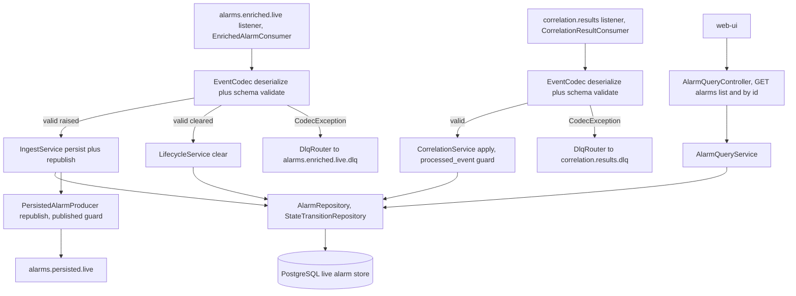
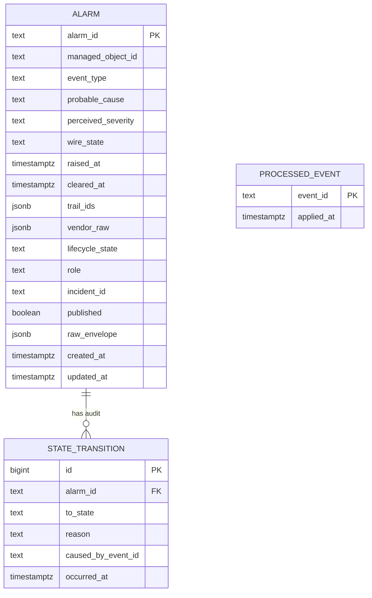
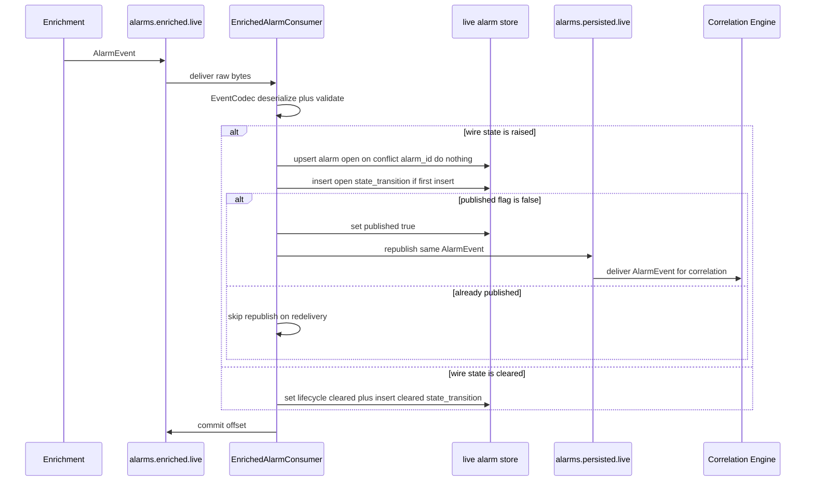
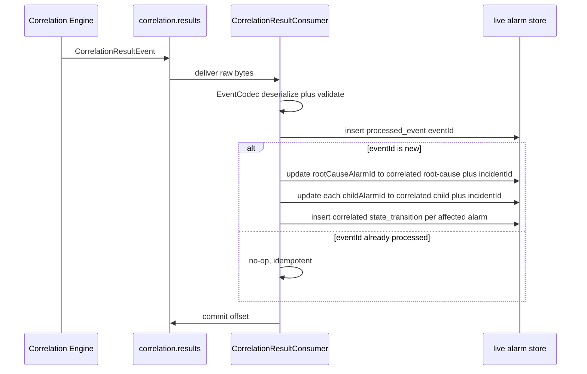
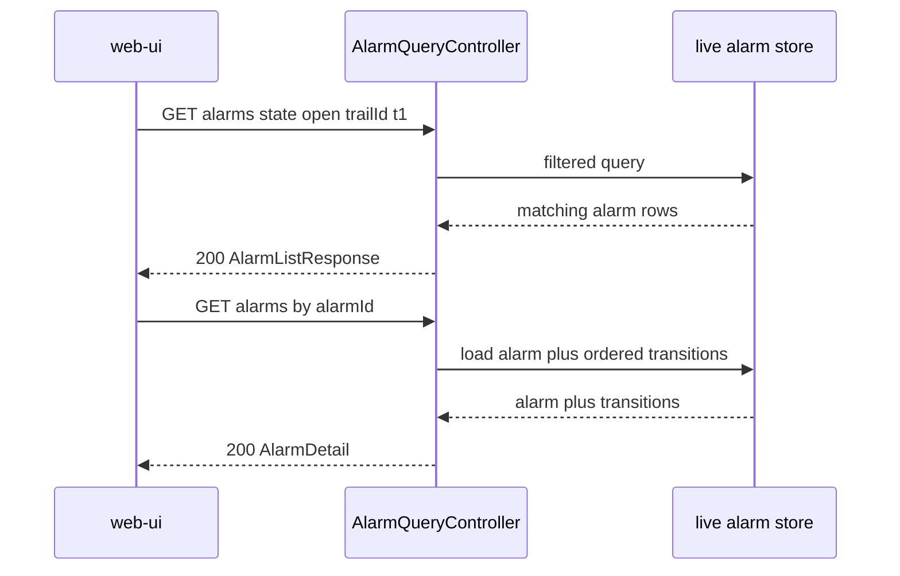
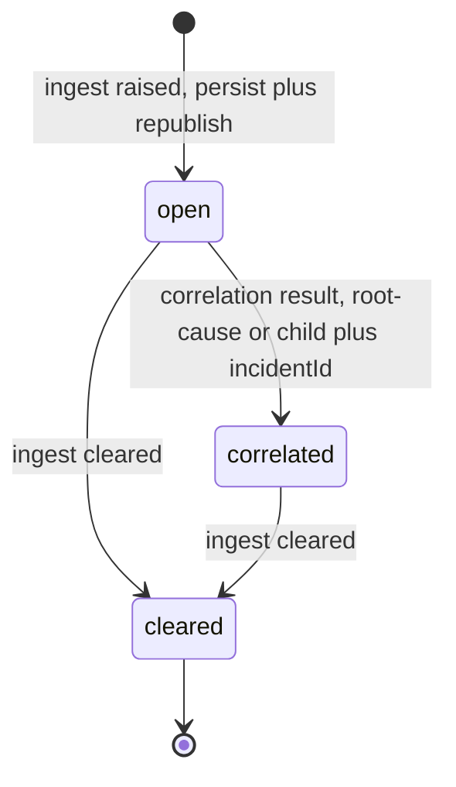

# alarm-manager — Design

Sole owner of **live alarm state**. On the real-time path the Alarm Manager sits **in-line**
between the Enrichment Service and the Correlation Engine: it consumes `alarms.enriched.live`,
persists each live alarm (initial lifecycle state `open`), and republishes the same `AlarmEvent`
on `alarms.persisted.live` for the Correlation Engine. It consumes `correlation.results` to
maintain each alarm's lifecycle (`open` then `correlated` then `cleared`), its correlation-group
role (`root-cause` / `child`), and its incident linkage, and it serves the live alarm query API
to the web-ui. There is **no historical corpus** (MVP live-only). This design realizes every task
and acceptance criterion in the approved, merged `services/alarm-manager/spec.md`.

## Stack

- **Language / runtime:** Java 17 (eclipse-temurin), Spring Boot 3.x.
- **Messaging:** Spring for Apache Kafka (`spring-kafka`) — plain consumer/producer model (no
  Kafka Streams; see Design alternatives). At-least-once delivery; idempotent producer
  (`enable.idempotence=true`, `acks=all`).
- **Persistence:** PostgreSQL (the live alarm store — sole owner), Spring Data JDBC plus Flyway
  for schema migrations. The Alarm Manager is the only writer to this store.
- **Event contract:** `com.acp:event-model` (frozen Java/Jackson binding) — `EventCodec`,
  `SchemaVersionPolicy`, `ManagedObjectId`, generated `AlarmEvent` and `CorrelationResultEvent`
  POJOs. Schema validation is the codec's responsibility; `CodecException`,
  `SchemaVersionException`, `UnknownEventTypeException`, and `ManagedObjectIdException` are the
  DLQ signals.
- **HTTP / API:** Spring Web MVC (blocking) plus springdoc-openapi for the OpenAPI 3.1 document
  at `/openapi.json` and Swagger UI. No outbound HTTP clients (the service makes no synchronous
  calls to collaborators).
- **Build:** Gradle (Java 17 toolchain), JUnit 5 unit/contract tests, Testcontainers
  (PostgreSQL plus Kafka) for integration. Observability via Spring Boot Actuator plus
  Micrometer/Prometheus.
- **Licenses (all permissive):** Spring Boot / Spring Kafka / Spring Data (Apache-2.0), Jackson
  (Apache-2.0), PostgreSQL JDBC driver (BSD-2-Clause), Flyway (Apache-2.0), springdoc-openapi
  (Apache-2.0), Micrometer (Apache-2.0), JUnit 5 (EPL-2.0), Testcontainers (MIT). No GPL/AGPL/BSL.

## Task breakdown (from the spec)

Every spec **Tasks (high-level)** item (1 to 5) is realized below and is traceable to modules
and flows.

| Spec task | Realized by (modules / flow) |
|---|---|
| 1. Consume `alarms.enriched.live`; persist each `AlarmEvent` with lifecycle `open` (idempotent on `alarmId`); republish the same `AlarmEvent` on `alarms.persisted.live` (idempotent, no second emit on redelivery) | `EnrichedAlarmConsumer` (`@KafkaListener` on `alarms.enriched.live`) then `IngestService.persistAndRepublish` — codec-validate, upsert into `alarm` keyed on `alarmId`, write an `open` row to `state_transition`, then `PersistedAlarmProducer.republish` guarded by the `published` flag on the alarm row so a redelivery never re-emits. See Key flow (a). |
| 2. Consume `correlation.results`; mark `rootCauseAlarmId` `correlated` / `root-cause`, mark each `childAlarmIds` `correlated` / `child`, link `incidentId`, audit each change; idempotent on envelope `eventId` | `CorrelationResultConsumer` (`@KafkaListener` on `correlation.results`) then `CorrelationService.apply` — guard on `processed_event(eventId)`, update each affected `alarm` row (state, role, `incidentId`), append a `correlated` `state_transition` per affected alarm. See Key flow (b). |
| 3. Handle clear events: an `AlarmEvent` from `alarms.enriched.live` with wire `state = cleared` transitions the matching alarm to lifecycle `cleared` plus a timestamped audit entry | `EnrichedAlarmConsumer` branches on the codec-bound `AlarmEvent.state`: `raised` then persist+republish path (task 1); `cleared` then `LifecycleService.clear` sets lifecycle `cleared` and appends a `cleared` `state_transition`. See Key flow (a) and the lifecycle state diagram. |
| 4. Serve the live alarm query API for web-ui — list filterable by `state` / `trailId` / `incidentId` / time window; single-alarm full record with lifecycle, role, `incidentId`, ordered transition history (UTC) | `AlarmQueryController` (`GET /alarms`, `GET /alarms/{alarmId}`) then `AlarmQueryService` then `AlarmRepository` filtered queries. springdoc publishes OpenAPI 3.1. See Key flow (c). |
| 5. Route poison messages (schema-invalid or non-processable after retries) to `alarms.enriched.live.dlq` / `correlation.results.dlq`; never drop silently | `DlqRouter` — on `CodecException` / `SchemaVersionException` / `ManagedObjectIdException` / `UnknownEventTypeException` (or exhausted retries) send the raw bytes plus failure-metadata headers to the matching `<topic>.dlq` and commit the offset. See Error handling. |

## Phase applicability (design view)

Matches the canonical phase map in `architecture.md` (alarm-manager row): **Idle / Idle /
Active**. The Alarm Manager has no role in P1 or P2 (it does not consume the history/learning
path topics); all of its work is on the P3 real-time path.

| Phase | Active/Passive/Idle | Modules/handlers exercised | Inputs/Outputs |
|---|---|---|---|
| P1 — Topology onboarding | Idle | None of the Kafka listeners fire (no live alarms flow). `/health`, `/metrics`, `/openapi.json` live; the query API returns an empty result set. | None (dormant) |
| P2 — Pattern learning | Idle | Dormant. The service does **not** subscribe to `alarms.history`, `alarms.enriched`, or `transactions.clean`; the learning path is mined in-flight by other services and persists nothing here. | None (dormant) |
| P3 — Real-time correlation | Active | `EnrichedAlarmConsumer`, `IngestService`, `LifecycleService`, `PersistedAlarmProducer`, `CorrelationResultConsumer`, `CorrelationService`, `AlarmQueryController` / `AlarmQueryService`, `DlqRouter` | In: `alarms.enriched.live`, `correlation.results` (Kafka); Out: `alarms.persisted.live` (Kafka), `alarms.enriched.live.dlq`, `correlation.results.dlq`; Serves: live alarm query API to web-ui |

## Module breakdown



- **`EnrichedAlarmConsumer`** — `@KafkaListener` on `alarms.enriched.live`. Deserializes raw
  bytes via `EventCodec`, confirms envelope `type` is `AlarmEvent`, then branches on the bound
  `AlarmEvent.state`: `raised` then `IngestService.persistAndRepublish`; `cleared` then
  `LifecycleService.clear`. Codec exceptions route to `DlqRouter`.
- **`IngestService`** — idempotent upsert of the alarm into `alarm` keyed on `alarmId` with
  lifecycle `open`, plus a single `open` `state_transition` row on first insert, then calls
  `PersistedAlarmProducer.republish`. The persist and the republish-guard flip occur in one DB
  transaction; the actual Kafka send happens after commit (transactional-outbox-style guard, see
  Design alternatives) so a redelivery cannot double-persist or double-emit.
- **`LifecycleService`** — applies the `cleared` transition and is the shared owner of the
  state-machine validity rules — sets lifecycle `cleared`, appends a `cleared`
  `state_transition`. A clear for an unknown `alarmId` is a no-op recorded in metrics (not an
  error; the raise may not yet have arrived — see Error handling).
- **`PersistedAlarmProducer`** — republishes the **same** `AlarmEvent` (faithful re-serialize of
  the consumed payload via the codec) onto `alarms.persisted.live`, only when the alarm row's
  `published` flag is still false; on success it sets `published = true`. Idempotent producer
  config.
- **`CorrelationResultConsumer`** — `@KafkaListener` on `correlation.results`. Deserializes via
  `EventCodec`, confirms `type` is `CorrelationResultEvent`, then `CorrelationService.apply`.
- **`CorrelationService`** — guarded by `processed_event(eventId)`: inserts the `eventId`
  (unique constraint) first; on conflict the event was already applied and the call is a no-op.
  Otherwise updates the root-cause alarm (state `correlated`, role `root-cause`, `incidentId`)
  and every child alarm (state `correlated`, role `child`, same `incidentId`), appending one
  `correlated` `state_transition` per affected alarm — all in one DB transaction.
- **`AlarmQueryController` / `AlarmQueryService` / `AlarmRepository`** — the read side: filtered
  list and single-alarm full record (joins `state_transition`).
- **`DlqRouter`** — sends offending raw bytes plus failure-metadata headers (`x-dlq-reason`,
  `x-dlq-source-topic`, `traceId` when extractable) to the matching `<topic>.dlq` and commits
  the source offset so processing continues.

## Data model / DB schema

The Alarm Manager **owns** the live alarm store (PostgreSQL, dedicated schema). It is the sole
writer. There is **no corpus and no historical-alarm table**. The store holds each live alarm,
its lifecycle, its denormalized correlation outcome, and an ordered transition audit.

**Ownership note (denormalization).** `incident_id` and `role` are **denormalized** onto the
alarm record. The Correlation Engine remains the **system of record for incidents** (it owns the
Incident Store); the Alarm Manager only reflects the `incidentId` reference plus role tag from
`correlation.results` into the alarm-centric view. The Alarm Manager never creates, owns, or
serves incident records.



**Table `alarm`** (one row per live alarm; idempotency anchor = primary key `alarm_id`):

| Column | Type | Notes |
|---|---|---|
| `alarm_id` | `text` PK | `AlarmEvent.alarmId`; idempotency key for persist plus republish |
| `managed_object_id` | `text` NOT NULL | `AlarmEvent.managedObjectId`, canonical `objectType:id` (validated by codec) |
| `event_type` | `text` NOT NULL | `AlarmEvent.eventType` (X.733) |
| `probable_cause` | `text` NOT NULL | `AlarmEvent.probableCause` |
| `perceived_severity` | `text` NOT NULL | `AlarmEvent.perceivedSeverity` |
| `wire_state` | `text` NOT NULL | last seen `AlarmEvent.state` (`raised` / `cleared`) |
| `raised_at` | `timestamptz` NOT NULL | `AlarmEvent.raisedAt` (used by the time-window filter) |
| `cleared_at` | `timestamptz` NULL | `AlarmEvent.clearedAt` when cleared |
| `trail_ids` | `jsonb` NOT NULL | `AlarmEvent.trailIds` array; GIN-indexed for trail filtering |
| `vendor_raw` | `jsonb` NULL | `AlarmEvent.vendorRaw` pass-through |
| `lifecycle_state` | `text` NOT NULL | Alarm Manager lifecycle: `open` / `correlated` / `cleared` (distinct from `wire_state`) |
| `role` | `text` NOT NULL DEFAULT `none` | `root-cause` / `child` / `none` |
| `incident_id` | `text` NULL | denormalized incident reference from `correlation.results` |
| `published` | `boolean` NOT NULL DEFAULT false | republish-once guard for `alarms.persisted.live` |
| `raw_envelope` | `jsonb` NOT NULL | the exact consumed envelope, so republish re-emits a faithful `AlarmEvent` |
| `created_at` / `updated_at` | `timestamptz` NOT NULL | row audit |

**Table `state_transition`** (append-only audit; one row per lifecycle change):

| Column | Type | Notes |
|---|---|---|
| `id` | `bigint` PK (identity) | surrogate |
| `alarm_id` | `text` NOT NULL FK to `alarm.alarm_id` | |
| `to_state` | `text` NOT NULL | `open` / `correlated` / `cleared` |
| `reason` | `text` NULL | e.g. `ingest`, `correlation`, `clear` |
| `caused_by_event_id` | `text` NULL | envelope `eventId` of the causing event (dedupe trace) |
| `occurred_at` | `timestamptz` NOT NULL | UTC timestamp of the transition |

**Table `processed_event`** (idempotency guard for `correlation.results`):

| Column | Type | Notes |
|---|---|---|
| `event_id` | `text` PK | envelope `eventId`; UNIQUE insert = processed-once guard |
| `applied_at` | `timestamptz` NOT NULL | when applied |

**Keys / indexes / constraints:**
- `alarm.alarm_id` PK — anchors persist idempotency (`INSERT ... ON CONFLICT (alarm_id) DO NOTHING`
  for first-insert; the republish guard uses `published`).
- `idx_alarm_lifecycle_state` on `(lifecycle_state)` — `state` filter.
- `idx_alarm_incident_id` on `(incident_id)` — `incidentId` filter.
- `idx_alarm_raised_at` on `(raised_at)` — time-window filter.
- `gin_alarm_trail_ids` GIN on `(trail_ids)` — `trailId` membership filter.
- `idx_transition_alarm_id` on `state_transition (alarm_id, occurred_at)` — ordered history.
- `processed_event.event_id` PK / UNIQUE — correlation-result idempotency.
- A partial unique guard ensures **at most one** `open` `state_transition` per alarm
  (acceptance #1): unique index on `state_transition (alarm_id)` where `to_state = open`.

## Event handling

- **Consumers:**
  - `alarms.enriched.live` then `EnrichedAlarmConsumer`. **Idempotency / dedupe key:**
    `AlarmEvent.alarmId` (persist via PK upsert; republish via the `published` flag). Branch on
    wire `state` (`raised` then persist+republish; `cleared` then lifecycle clear). **DLQ:**
    `alarms.enriched.live.dlq`.
  - `correlation.results` then `CorrelationResultConsumer`. **Idempotency / dedupe key:**
    envelope `eventId` (`processed_event` unique insert). **DLQ:** `correlation.results.dlq`.
- **Producers:**
  - `alarms.persisted.live` then `PersistedAlarmProducer` — payload type **`AlarmEvent`** from
    `libs/event-model`, the same payload that was consumed (faithful re-serialize from
    `raw_envelope` via `EventCodec`). No new payload is introduced (matches `architecture.md`).

## API contracts / API schema

HTTP surface consumed by **web-ui** (and only web-ui). springdoc generates OpenAPI 3.1 at
`/openapi.json` (plus Swagger UI); the generated document is checked in at
`services/alarm-manager/openapi.json` and is the single source of truth — contract/unit tests
assert the running surface equals the checked-in spec (no drift).

### `GET /alarms` — list / filter live alarms (paginated)

Query parameters (all optional, AND-combined):

| Param | Type | Meaning |
|---|---|---|
| `state` | enum `open` / `correlated` / `cleared` | filter by lifecycle state |
| `trailId` | string | only alarms whose `trailIds` contain this value |
| `incidentId` | string | only alarms linked to this incident |
| `from` | ISO-8601 UTC date-time | `raisedAt` at or after `from` |
| `to` | ISO-8601 UTC date-time | `raisedAt` at or before `to` |
| `page` | integer (default 0) | page index |
| `size` | integer (default 50, max 500) | page size |

Response `200` body (`AlarmListResponse`):
```
{
  "items": [ AlarmSummary, ... ],
  "page": 0, "size": 50, "totalElements": 123, "totalPages": 3
}
```
`AlarmSummary` = `{ alarmId, managedObjectId, eventType, perceivedSeverity, raisedAt,
lifecycleState, role, incidentId, trailIds }`.

Errors: `400` (`ProblemDetail`, RFC 9457) for an invalid `state` enum, malformed `from`/`to`, or
`from` after `to`; `500` for an unexpected server error.

### `GET /alarms/{alarmId}` — single alarm full record

Response `200` body (`AlarmDetail`) = all `AlarmEvent` fields (`alarmId`, `managedObjectId`,
`eventType`, `probableCause`, `perceivedSeverity`, `raisedAt`, `clearedAt`, `state`, `trailIds`,
`vendorRaw`) plus `lifecycleState` (`open` / `correlated` / `cleared`), `role` (`root-cause` /
`child` / `none`), `incidentId`, and `transitions`: an **ordered** array of
`{ toState, reason, occurredAt }` (ascending `occurredAt`, UTC).

Errors: `404` (`ProblemDetail`) when `alarmId` is unknown; `500` otherwise.

### `GET /openapi.json`

Returns `200` with a valid OpenAPI 3.1 document containing the `/alarms` and `/alarms/{alarmId}`
operations.

## Integration points (mock vs. real)

**No outbound HTTP integration points.** The Alarm Manager is a Kafka consumer/producer plus an
HTTP **server**; it makes no synchronous calls to other services (confirmed by the spec
Contract: "APIs/data consumed from other services: None"). Its only collaborators are Kafka
topics (contract-frozen in `libs/event-model` plus `architecture.md`) and PostgreSQL (its own
store). The **web-ui** is an inbound consumer of this service's published OpenAPI; web-ui builds
its client from `services/alarm-manager/openapi.json` (mock for its unit tests, real Alarm
Manager in integration) — that switching lives on the web-ui side, not here. No hard-coded URLs:
Kafka bootstrap servers, the PostgreSQL JDBC URL, and consumer group IDs are all resolved from
environment configuration.

## Key flows (sequence / data-flow diagrams)

### (a) Ingest — persist (open) then republish, plus clear



### (b) Correlation result — lifecycle plus role plus incident



### (c) web-ui live alarm query



## Algorithm logical flow

The core logic is the **lifecycle state machine** plus role tagging plus idempotent persist and
republish. No statistical/ML algorithm (those live in Noise Filter, Pattern Miner, Correlation
Engine). The lifecycle:



Decision logic per consumed message:

1. **Enriched-alarm message.** Deserialize plus validate (codec; rejects unknown major
   `schemaVersion`, malformed `managedObjectId`, missing required fields). If invalid then DLQ.
   - If `state = raised`: `INSERT ... ON CONFLICT (alarm_id) DO NOTHING`; if a row was inserted,
     append the single `open` transition. Then, if `published = false`, set `published = true`
     and emit on `alarms.persisted.live` (after commit). A redelivery finds the row present and
     `published = true` then no second persist, no second transition, no second emit.
   - If `state = cleared`: if the alarm exists and is not already `cleared`, set
     `lifecycle_state = cleared`, set `cleared_at`, append a `cleared` transition. If the
     `alarmId` is unknown, record a `clear_for_unknown_alarm` metric and no-op (the raise may
     arrive later; never drop silently — it is logged).
2. **Correlation-result message.** Deserialize plus validate. If invalid then DLQ. Insert
   `processed_event(eventId)`; on conflict the result was already applied then no-op. Otherwise,
   for `rootCauseAlarmId` set `lifecycle_state = correlated`, `role = root-cause`,
   `incident_id`; for each `childAlarmIds` set `lifecycle_state = correlated`, `role = child`,
   the same `incident_id`; append one `correlated` transition per affected alarm. A `correlated`
   over a `cleared` alarm is permitted by data but does not re-clear it; ordering is tolerated
   (a correlation arriving for a not-yet-persisted alarm records the linkage where the alarm is
   present and counts the absent ones as a metric, never an error — see Error handling).

Parameters are configuration only (Kafka group IDs, retry counts, page-size caps); there are no
domain thresholds, so nothing is read from the Knowledge Service.

## Seed data & examples

N/A — the Alarm Manager generates no seed/fixture/sample data of its own; it derives all state
from consumed `AlarmEvent` and `CorrelationResultEvent` messages. Test fixtures reuse the frozen
`libs/event-model/schema/fixtures/AlarmEvent.json` and `CorrelationResultEvent.json`.

## UI wireframes

N/A — the web-ui renders the live alarm view; the Alarm Manager exposes only the query API
consumed by web-ui.

## Error handling

| Failure mode | Handling |
|---|---|
| Undeserializable / schema-invalid `alarms.enriched.live` message (e.g. missing `alarmId`) | `EventCodec` throws `CodecException`; `DlqRouter` sends raw bytes plus metadata to `alarms.enriched.live.dlq`; **no** alarm persisted, **no** republish (acceptance #12). Logged at WARN with `traceId`. |
| Malformed `managedObjectId` on an `AlarmEvent` | Codec rejects (the `managedObjectId` pattern in the payload schema) then `CodecException` then `alarms.enriched.live.dlq`; nothing persisted (acceptance #15). |
| Unknown major `schemaVersion` (2 or higher) on either topic | `SchemaVersionPolicy.check` throws `SchemaVersionException`; message routed to the matching `<topic>.dlq` with no persist and no republish (acceptance #13). |
| Undeserializable / schema-invalid `correlation.results` message | `CodecException` then `correlation.results.dlq`; no state update. |
| Wrong envelope `type` on a topic (e.g. a non-`AlarmEvent` on `alarms.enriched.live`) | Treated as poison then matching `<topic>.dlq`. |
| Kafka redelivery of an already-persisted alarm | PK upsert plus `published` guard make persist, transition, and republish exactly-once (acceptance #3). |
| Kafka redelivery of an already-applied correlation result | `processed_event(eventId)` unique-insert guard makes the update exactly-once, no duplicate transitions (acceptance #5). |
| Clear for an unknown `alarmId` | No-op plus `clear_for_unknown_alarm` metric plus log (the raise may arrive later). Never an error, never silently lost from observability. |
| Correlation result referencing an alarm not yet persisted | The present alarms are updated; absent ones counted via the `correlation_for_unknown_alarm` metric plus log. The `processed_event` row is still written (the result is considered applied). |
| Transient DB error during persist/update | Spring Kafka retry (bounded, exponential backoff from config); on exhaustion the message goes to the matching `<topic>.dlq`. Offsets are committed only after successful processing or DLQ routing, so nothing is silently dropped. |
| Kafka send failure during republish | The DB transaction (persist plus `published` flip) commits, and the producer send is retried by the idempotent producer; if it ultimately fails, the `published` flag stays the basis for a single re-attempt on the next redelivery (no double-emit). Failures surfaced via metric plus log. |
| Invalid query request (`state` not in enum, bad `from`/`to`, `from` after `to`) | `400` `ProblemDetail` with a structured message; nothing read. |
| `GET /alarms/{alarmId}` unknown id | `404` `ProblemDetail`. |

Nothing is ever silently dropped: every poison message lands on a `<topic>.dlq`, and every
unexpected condition (unknown-alarm clear, unknown-alarm correlation, send failure) is counted
in metrics and logged with the `traceId`.

## Design alternatives

| Consideration | Alternatives considered | Chosen plus rationale |
|---|---|---|
| Stream framework | Kafka Streams vs. plain `spring-kafka` consumer/producer | **Plain `spring-kafka`.** This service is a stateful **DB**-backed persist/republish plus a query API, not a stream-join/window topology; Postgres is the state store, not a Kafka changelog. Plain consumers keep the model simple and consistent with the other non-correlation Spring services. Kafka Streams adds a state-store/topology layer with no benefit here. |
| Republish-once mechanism | (a) `published` boolean flag on the alarm row checked in the same DB tx, send after commit, (b) Kafka transactions / EOS exactly-once across consume plus produce, (c) a separate dedupe topic or store | **(a) `published` flag.** Gives idempotent republish with a single store and simple reasoning; the send-after-commit ordering plus the flag prevents a redelivery from double-emitting. Full Kafka EOS (b) couples consumer plus producer transactions and the downstream Correlation Engine tolerates at-least-once anyway; (c) adds infrastructure. The flag is the minimal correct design. |
| Correlation-result idempotency | `processed_event(eventId)` guard table vs. checking whether the alarm is already `correlated` | **`processed_event` table.** The envelope `eventId` is the spec's idempotency key and is unambiguous even when a result re-states the same incident; inspecting alarm state alone cannot distinguish a genuine re-emit from a legitimate new result for the same alarms. |
| `incidentId` / role storage | Denormalize onto the alarm row vs. a separate `alarm_incident` link table | **Denormalize onto the alarm row.** One incident per alarm in the alarm-centric MVP view; the query API filters/returns by `incidentId` directly and avoids a join. The Correlation Engine remains the incident system-of-record, so this is a read-optimized projection, not a second source of truth. |
| Lifecycle vs. wire state | Reuse `AlarmEvent.state` (`raised`/`cleared`) as lifecycle vs. a separate `lifecycle_state` column | **Separate `lifecycle_state`.** The wire enum has only `raised` and `cleared`; the lifecycle needs a third value `correlated`. Keeping both (`wire_state` plus `lifecycle_state`) preserves the faithful wire value for republish while modelling the richer lifecycle. |
| Clear-before-raise / correlation-before-raise ordering | Reject (DLQ) vs. tolerate (no-op plus metric) | **Tolerate.** At-least-once plus independent topics make out-of-order arrival normal; treating it as poison would lose real signal. Tolerate with observability so the condition is visible but processing continues. |

## Test plan

### Acceptance criterion to test (unit/contract)

All tests are **JUnit 5** (Testcontainers PostgreSQL plus an embedded/Testcontainers Kafka for
the consumer/producer paths).

| # | Acceptance criterion | Test | Asserts |
|---|---|---|---|
| 1 | Valid `AlarmEvent` then persisted `open` with all fields plus single `open` audit entry | `IngestServiceTest.persistsAlarmOpenWithAllFieldsAndSingleOpenTransition` | `alarm` row has `lifecycle_state=open`, `alarmId`/`managedObjectId`/`trailIds`/`raisedAt`/`perceivedSeverity` stored; exactly one `state_transition` with `to_state=open` and a UTC `occurred_at` |
| 2 | Same `AlarmEvent` republished on `alarms.persisted.live`, valid against frozen binding | `PersistedAlarmProducerTest.republishesSameAlarmEventValidAgainstBinding` | a message on `alarms.persisted.live` deserializes via `EventCodec` to an equal `AlarmEvent` (round-trips against the frozen `AlarmEvent` schema) |
| 3 | Same `alarmId` consumed twice then one record plus one republish | `IngestIdempotencyTest.redeliveryProducesNoDoublePersistNoDoubleRepublish` | after two deliveries: exactly one `alarm` row, one `open` transition, exactly one message on `alarms.persisted.live` |
| 4 | `CorrelationResultEvent` then root-cause `correlated`/`root-cause`/`incidentId`, children `correlated`/`child`/same `incidentId`, `correlated` audit per alarm | `CorrelationServiceTest.appliesRootCauseAndChildrenWithIncidentAndAudit` | root-cause row state/role/`incidentId` correct; each child row state/role/`incidentId` correct; one `correlated` transition per affected alarm |
| 5 | Same `eventId` consumed twice then applied once, no duplicate audit | `CorrelationIdempotencyTest.redeliveredEventAppliedExactlyOnce` | after two deliveries: `processed_event` has one row; each affected alarm has exactly one `correlated` transition |
| 6 | `GET /alarms/{alarmId}` for root cause then `correlated`, `root-cause`, `incidentId`, audit has `open` plus `correlated` with distinct UTC timestamps | `AlarmDetailApiTest.returnsCorrelatedRootCauseWithOpenAndCorrelatedTransitions` | response `lifecycleState=correlated`, `role=root-cause`, correct `incidentId`; `transitions` contains an `open` and a `correlated` entry with distinct `occurredAt` |
| 7 | `AlarmEvent` `state=cleared` then lifecycle `cleared` plus `cleared` audit | `LifecycleServiceTest.clearedEventTransitionsAlarmToClearedWithAudit` | alarm `lifecycle_state=cleared`, `cleared_at` set; a `state_transition` with `to_state=cleared` |
| 8 | `GET /alarms?state=open` then only `open` alarms | `AlarmListApiTest.filtersByLifecycleStateOpen` | response contains only `open` alarms; `correlated`/`cleared` absent |
| 9 | `GET /alarms?trailId=...` then only alarms whose `trailIds` contain it | `AlarmListApiTest.filtersByTrailIdMembership` | only alarms with the trail in `trailIds`; other-trail alarms excluded |
| 10 | `GET /alarms?incidentId=...` then only alarms linked to that incident | `AlarmListApiTest.filtersByIncidentId` | only alarms with that `incident_id`; other/none excluded |
| 11 | `GET /alarms?from&to` then only alarms with `raisedAt` in window | `AlarmListApiTest.filtersByRaisedAtTimeWindow` | only alarms with `raisedAt` within the window; outside excluded |
| 12 | Schema-invalid message (missing `alarmId`) then `alarms.enriched.live.dlq`, no persist, no republish | `EnrichedConsumerDlqTest.schemaInvalidAlarmRoutedToDlqNoPersistNoRepublish` | message appears on `alarms.enriched.live.dlq`; `alarm` table empty; nothing on `alarms.persisted.live` |
| 13 | Unknown major `schemaVersion` then DLQ, no persist, no republish | `SchemaVersionDlqTest.unknownMajorVersionRejectedToDlq` | message on the matching `<topic>.dlq`; no row persisted; no republish |
| 14 | `GET /openapi.json` then 200, valid OpenAPI 3.1 with `/alarms` plus `/alarms/{alarmId}` | `OpenApiContractTest.publishesValidOpenApi31WithAlarmPaths` | `200`; body parses as OpenAPI 3.1; contains both path operations; equals the checked-in `openapi.json` |
| 15 | Stored `managedObjectId` conforms to `objectType:id`; malformed then `alarms.enriched.live.dlq` | `ManagedObjectIdValidationTest.malformedManagedObjectIdRoutedToDlqAndStoredIdsConform` | a malformed-`managedObjectId` alarm is DLQ-routed and not persisted; every stored `managed_object_id` matches `ManagedObjectId.PATTERN` |

### E2E scenarios (from this design unit's point of view)

Service-scoped end-to-end paths exercised by the integration stage (real Kafka plus real
PostgreSQL via Testcontainers; the upstream/downstream topics produced/consumed by test
harnesses).

| # | Scenario | Trigger then path | Expected outcome |
|---|---|---|---|
| 1 | Live alarm flows in-line to correlation | Produce an enriched `AlarmEvent` (`state=raised`) on `alarms.enriched.live` | Alarm persisted `open` with one `open` transition; the same `AlarmEvent` appears on `alarms.persisted.live` for the Correlation Engine; `GET /alarms?state=open` returns it |
| 2 | Correlation outcome reflected into live state | Produce a `CorrelationResultEvent` referencing a persisted root cause plus children | Root cause `correlated`/`root-cause`, children `correlated`/`child`, all linked to `incidentId`; `GET /alarms?incidentId=...` returns exactly that group; `GET /alarms/{rootCause}` shows `open` plus `correlated` transitions |
| 3 | Clear path | Produce an `AlarmEvent` `state=cleared` for a persisted alarm | Alarm transitions to `cleared`; `GET /alarms?state=cleared` returns it; `GET /alarms?state=open` no longer returns it |
| 4 | At-least-once redelivery (partial/duplicate path) | Re-deliver the same `alarms.enriched.live` and the same `correlation.results` message | Exactly one alarm row, one republish on `alarms.persisted.live`, one `open` plus one `correlated` transition; no duplicates |
| 5 | Poison message (failure path) | Produce a malformed `AlarmEvent` (missing `alarmId`) and an envelope with `schemaVersion=2` | Both land on the matching `<topic>.dlq`; no rows persisted; no republish; service keeps processing subsequent valid messages |
| 6 | Out-of-order arrival (partial path) | Produce a `CorrelationResultEvent` and a `cleared` `AlarmEvent` for an `alarmId` not yet persisted | No error, no DLQ; `correlation_for_unknown_alarm` / `clear_for_unknown_alarm` metrics increment; a later raise for the same `alarmId` still persists `open` |
| 7 | web-ui contract | web-ui builds its client from `services/alarm-manager/openapi.json` and calls `GET /alarms` plus `GET /alarms/{alarmId}` against the real service | Responses match the published schema (filters, detail with transitions); no drift between running surface and checked-in spec |

## Config & observability

- **Config (env only, no hard-coded values):** `KAFKA_BOOTSTRAP_SERVERS`,
  `ALARM_DB_JDBC_URL` / `ALARM_DB_USER` / `ALARM_DB_PASSWORD`,
  `KAFKA_GROUP_ID_ENRICHED` / `KAFKA_GROUP_ID_CORRELATION`,
  `KAFKA_CONSUMER_MAX_RETRIES` / `KAFKA_RETRY_BACKOFF_MS`, `QUERY_MAX_PAGE_SIZE`. No Knowledge
  Service params are needed (no domain thresholds).
- **`/health`** — Actuator liveness plus readiness (readiness gates on Kafka consumer assignment
  and a DB connection check).
- **`/metrics`** — Prometheus (Micrometer): `alarms_persisted_total`,
  `alarms_republished_total`, `correlation_results_applied_total`, `alarms_cleared_total`,
  `dlq_routed_total{topic}`, `clear_for_unknown_alarm_total`,
  `correlation_for_unknown_alarm_total`, consumer lag, query latency.
- **Logging** — structured JSON; the envelope `traceId` is extracted and propagated into every
  log line (MDC) for cross-service tracing.

## Build & run

- **Build:** `./gradlew build` (Java 17 toolchain) runs JUnit 5 unit/contract tests; the
  `openapi.json` generation/verification task asserts the published surface equals the
  checked-in `services/alarm-manager/openapi.json`. Integration tests use Testcontainers
  (PostgreSQL plus Kafka).
- **Dockerfile:** base `eclipse-temurin:17-jdk`; runs the Spring Boot fat jar; exposes the HTTP
  port (`/health`, `/metrics`, `/openapi.json`, `/alarms`).
- **Compose:** depends on `kafka` and `postgres` (its own schema); all addresses from env.
- **Local run:** `./gradlew bootRun` with `KAFKA_BOOTSTRAP_SERVERS` and `ALARM_DB_JDBC_URL` set;
  Flyway applies the `alarm` / `state_transition` / `processed_event` migrations on startup.
- **README:** documents env vars, topics consumed/produced, the query API, and the DLQ topics.
