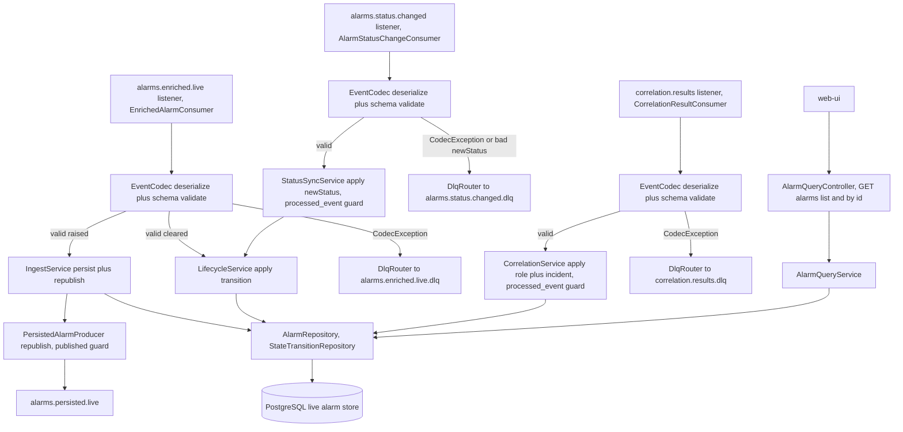
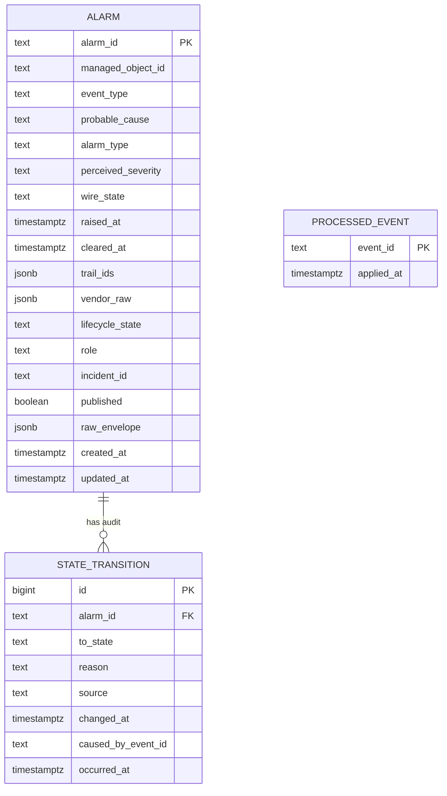
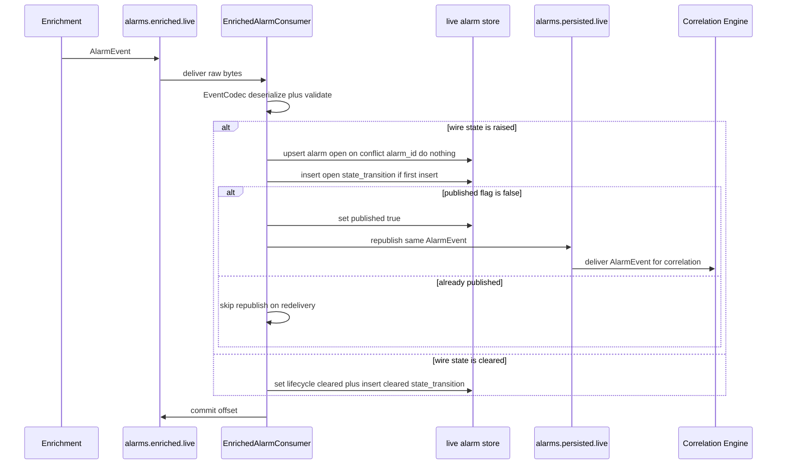
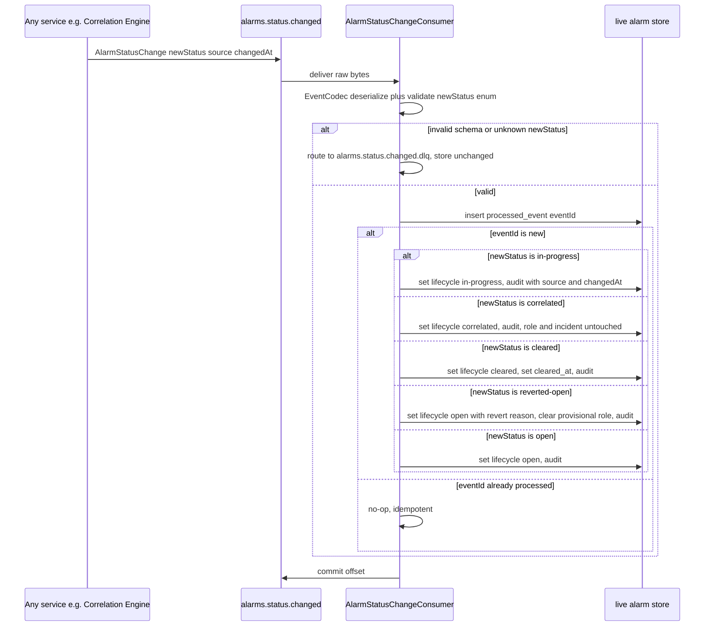
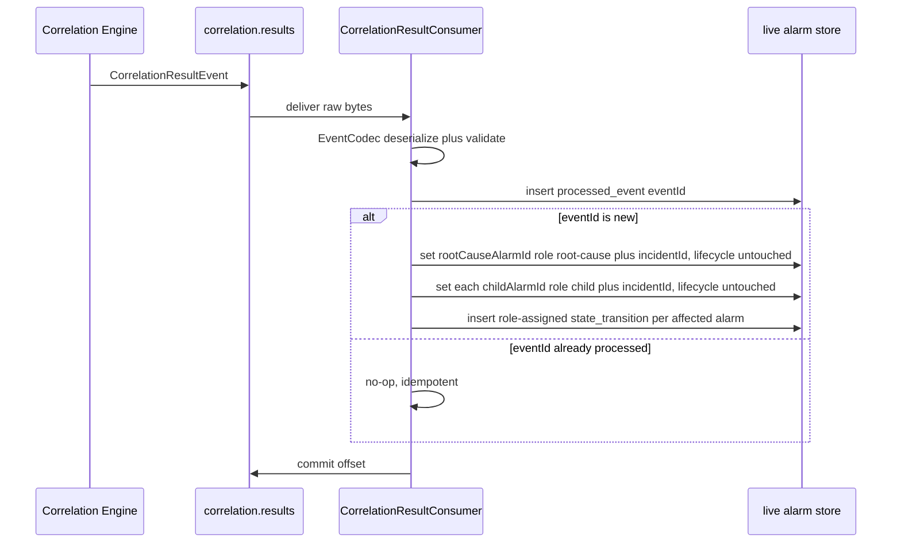
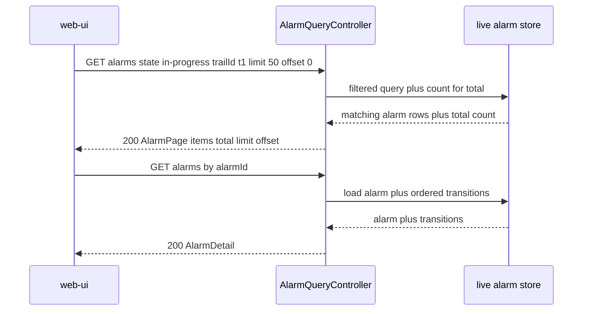
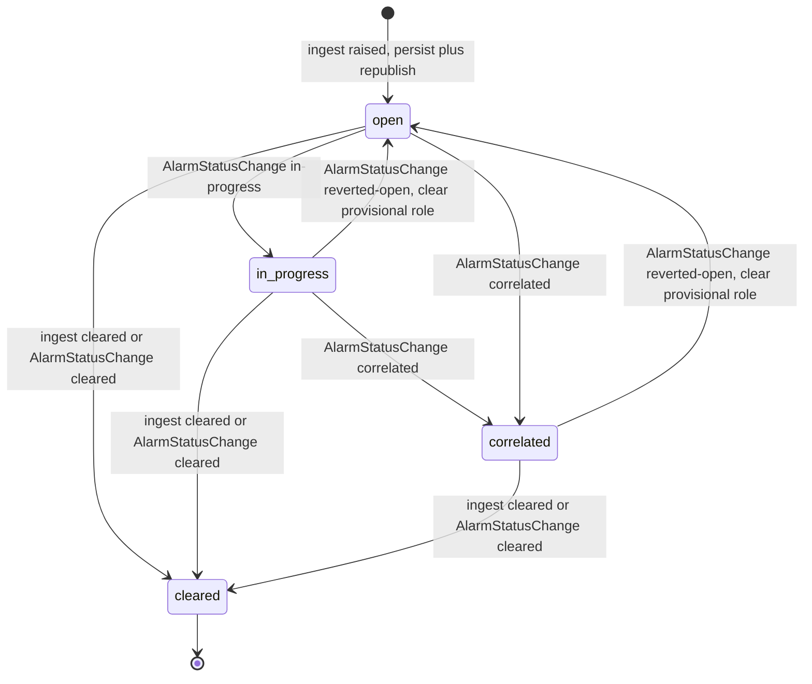

# alarm-manager — Design

Sole owner of **live alarm state**. On the real-time path the Alarm Manager sits **in-line**
between the Enrichment Service and the Correlation Engine: it consumes `alarms.enriched.live`,
persists each live alarm (initial lifecycle state `open`), and republishes the same `AlarmEvent`
on `alarms.persisted.live` for the Correlation Engine. It consumes `alarms.status.changed`
(`AlarmStatusChange`) as the **canonical alarm-status-sync channel**, applying `newStatus`
(`open` / `in-progress` / `correlated` / `cleared` / `reverted-open`) to each alarm's lifecycle
**STATE**, and it consumes `correlation.results` (`CorrelationResultEvent`) as the **canonical
correlation-context channel**, maintaining each alarm's correlation-group **ROLE**
(`root-cause` / `child`) and **incident linkage** (`incidentId`). These two channels are
**complementary**: `AlarmStatusChange` is authoritative for STATE, `CorrelationResultEvent` is
authoritative for ROLE + `incidentId`, reconciled on `alarmId`. It serves the live alarm query
API to the web-ui. There is **no historical corpus** (MVP live-only). This design realizes every
task and acceptance criterion in the approved, merged `services/alarm-manager/spec.md`.

> **Supersedes** the previously merged design (PR #104, branch `design/alarm-manager`): the only
> material change is making `alarms.status.changed` (`AlarmStatusChange`) the canonical
> alarm-status-sync channel that drives lifecycle STATE (incl. the new `in-progress` state and
> the `reverted-open` transition), while `correlation.results` is re-scoped to ROLE + incident
> only. Everything else from the prior design is preserved.

> **Design-readiness fix (this revision).** Persist and return the **canonical `alarmType` join
> token**. The prior design persisted `event_type` and `probable_cause` but silently dropped
> `alarmType` — a **required** `AlarmEvent` field and the platform canonical alarm-type join key
> (`architecture.md`). This revision adds a NOT NULL `alarm_type` column to the live alarm store,
> persists it on ingest, and returns it on the `AlarmSummary` and `AlarmDetail` DTOs, so the join
> key the web-ui/incident views and the alarm-to-incident join rely on is no longer lost.
> **No contract change:** `alarmType` is already on `AlarmEvent` in `libs/event-model`; no new
> topic/payload/field is introduced. Everything else (the `AlarmStatusChange` STATE channel, the
> lifecycle states incl. `in-progress`, the `correlation.results` ROLE + incident role, and the
> `{ items, total, limit, offset }` pagination envelope) is unchanged.

## Stack

- **Language / runtime:** Java 17 (eclipse-temurin), Spring Boot 3.x.
- **Messaging:** Spring for Apache Kafka (`spring-kafka`) — plain consumer/producer model (no
  Kafka Streams; see Design alternatives). At-least-once delivery; idempotent producer
  (`enable.idempotence=true`, `acks=all`).
- **Persistence:** PostgreSQL (the live alarm store — sole owner), Spring Data JDBC plus Flyway
  for schema migrations. The Alarm Manager is the only writer to this store.
- **Event contract:** `com.acp:event-model` (frozen Java/Jackson binding) — `EventCodec`,
  `SchemaVersionPolicy`, `ManagedObjectId`, generated `AlarmEvent`, `CorrelationResultEvent`,
  and `AlarmStatusChange` POJOs. Schema validation is the codec's responsibility;
  `CodecException`, `SchemaVersionException`, `UnknownEventTypeException`, and
  `ManagedObjectIdException` are the DLQ signals.
- **HTTP / API:** Spring Web MVC (blocking) plus springdoc-openapi for the OpenAPI 3.1 document
  at `/openapi.json` and Swagger UI. No outbound HTTP clients (the service makes no synchronous
  calls to collaborators).
- **Build:** Gradle (Java 17 toolchain), JUnit 5 unit/contract tests, Testcontainers
  (PostgreSQL plus Kafka) for integration. Observability via Spring Boot Actuator plus
  Micrometer/Prometheus.
- **Licenses (all permissive):** Spring Boot / Spring Kafka / Spring Data (Apache-2.0), Jackson
  (Apache-2.0), PostgreSQL JDBC driver (BSD-2-Clause), Flyway (Apache-2.0), springdoc-openapi
  (Apache-2.0), Micrometer (Apache-2.0), JUnit 5 (EPL-2.0), Testcontainers (MIT). No GPL/AGPL/BSL.

## Task breakdown (from the spec)

Every spec **Tasks (high-level)** item (1 to 6) is realized below and is traceable to modules
and flows.

| Spec task | Realized by (modules / flow) |
|---|---|
| 1. Consume `alarms.enriched.live`; persist each `AlarmEvent` with lifecycle `open` (idempotent on `alarmId`); republish the same `AlarmEvent` on `alarms.persisted.live` (idempotent, no second emit on redelivery) | `EnrichedAlarmConsumer` (`@KafkaListener` on `alarms.enriched.live`) then `IngestService.persistAndRepublish` — codec-validate, upsert into `alarm` keyed on `alarmId` (persisting **every** required `AlarmEvent` field, including the canonical `alarmType` join token into `alarm_type`, alongside `event_type`/`probable_cause`), write an `open` row to `state_transition`, then `PersistedAlarmProducer.republish` guarded by the `published` flag so a redelivery never re-emits. See Key flow (a). |
| 2. Consume `alarms.status.changed` (`AlarmStatusChange`); apply `newStatus` to lifecycle STATE; audit each transition with `source` and `changedAt`; handle `reverted-open` as a transition back to `open` with a reason and clear in-progress role association; dedupe on envelope `eventId` | `AlarmStatusChangeConsumer` (`@KafkaListener` on `alarms.status.changed`) then `StatusSyncService.apply` — codec-validate (reject unknown `schemaVersion`/`newStatus` to `alarms.status.changed.dlq`), guard on `processed_event(eventId)`, apply `newStatus` to `alarm.lifecycle_state` via `LifecycleService`, append a `state_transition` carrying `source`/`changed_at`/`reason`. See Key flow (b) and the lifecycle state machine. |
| 3. Consume `correlation.results` (`CorrelationResultEvent`); update ROLE + incident linkage only — `root-cause`/`incidentId` for `rootCauseAlarmId`, `child`/same `incidentId` for each `childAlarmIds`; reconcile with STATE by `alarmId`; audit; idempotent on envelope `eventId` | `CorrelationResultConsumer` (`@KafkaListener` on `correlation.results`) then `CorrelationService.applyRoleAndIncident` — guard on `processed_event(eventId)`, update only `role` + `incident_id` (never `lifecycle_state`) on each affected `alarm` row, append a `role-assigned` audit entry per affected alarm. See Key flow (c). |
| 4. Handle clear events arriving via `alarms.enriched.live` (`AlarmEvent.state = cleared`): transition the matching alarm to lifecycle `cleared` + audit (canonical clear path is `AlarmStatusChange`; both handled consistently and idempotently) | `EnrichedAlarmConsumer` branches on the codec-bound `AlarmEvent.state`: `raised` then persist+republish (task 1); `cleared` then `LifecycleService.clear` sets lifecycle `cleared` and appends a `cleared` `state_transition`. The same `LifecycleService` applies `AlarmStatusChange(newStatus=cleared)` (task 2), so both paths converge on one transition rule. See Key flow (a) and the lifecycle state diagram. |
| 5. Serve the live alarm query API — list filterable by `state` (incl. `in-progress`) / `trailId` / `incidentId` / time window; single-alarm full record with lifecycle, role, `incidentId`, ordered transition history (UTC) | `AlarmQueryController` (`GET /alarms`, `GET /alarms/{alarmId}`) then `AlarmQueryService` then `AlarmRepository` filtered queries. springdoc publishes OpenAPI 3.1. See Key flow (d). |
| 6. Route poison messages (schema-invalid or non-processable after retries) to `alarms.enriched.live.dlq` / `correlation.results.dlq` / `alarms.status.changed.dlq`; never drop silently | `DlqRouter` — on `CodecException` / `SchemaVersionException` / `ManagedObjectIdException` / `UnknownEventTypeException` (or exhausted retries) send the raw bytes plus failure-metadata headers to the matching `<topic>.dlq` and commit the offset. See Error handling. |

## Phase applicability (design view)

Matches the canonical phase map in `architecture.md` (alarm-manager row): **Idle / Idle /
Active**. The Alarm Manager has no role in P1 or P2 (it does not consume the history/learning
path topics); all of its work — including the new `AlarmStatusChange` status-sync consumer — is
on the P3 real-time path.

| Phase | Active/Passive/Idle | Modules/handlers exercised | Inputs/Outputs |
|---|---|---|---|
| P1 — Topology onboarding | Idle | None of the Kafka listeners fire (no live alarms flow). `/health`, `/metrics`, `/openapi.json` live; the query API returns an empty result set. | None (dormant) |
| P2 — Pattern learning | Idle | Dormant. The service does **not** subscribe to `alarms.history`, `alarms.enriched`, or `transactions.clean`; the learning path is mined in-flight by other services and persists nothing here. | None (dormant) |
| P3 — Real-time correlation | Active | `EnrichedAlarmConsumer`, `IngestService`, `LifecycleService`, `PersistedAlarmProducer`, **`AlarmStatusChangeConsumer`, `StatusSyncService`** (canonical STATE channel), `CorrelationResultConsumer`, `CorrelationService` (ROLE+incident), `AlarmQueryController` / `AlarmQueryService`, `DlqRouter` | In: `alarms.enriched.live`, **`alarms.status.changed`**, `correlation.results` (Kafka); Out: `alarms.persisted.live` (Kafka), `alarms.enriched.live.dlq`, **`alarms.status.changed.dlq`**, `correlation.results.dlq`; Serves: live alarm query API to web-ui |

## Module breakdown



- **`EnrichedAlarmConsumer`** — `@KafkaListener` on `alarms.enriched.live`. Deserializes raw
  bytes via `EventCodec`, confirms envelope `type` is `AlarmEvent`, then branches on the bound
  `AlarmEvent.state`: `raised` then `IngestService.persistAndRepublish`; `cleared` then
  `LifecycleService.clear`. Codec exceptions route to `DlqRouter` (`alarms.enriched.live.dlq`).
- **`IngestService`** — idempotent upsert of the alarm into `alarm` keyed on `alarmId` with
  lifecycle `open`, persisting **all** required `AlarmEvent` fields — including the canonical
  **`alarmType`** join token into the `alarm_type` column (NOT NULL; alongside `event_type` and
  `probable_cause`) — plus a single `open` `state_transition` row on first insert, then calls
  `PersistedAlarmProducer.republish`. `alarmType` is the **platform canonical alarm-type join
  token** the rest of the correlation chain keys off (pattern mining, codebook signatures,
  `rootCauseAlarmType`, correlation matching); it is **distinct from** `eventType` (the X.733
  category) and `probableCause` (the X.733 probable cause), so it is persisted as its own column
  rather than conflated with either. The persist and the republish-guard flip occur in one DB
  transaction; the actual Kafka send happens after commit (transactional-outbox-style guard, see
  Design alternatives) so a redelivery cannot double-persist or double-emit.
- **`AlarmStatusChangeConsumer`** *(new)* — `@KafkaListener` on `alarms.status.changed`.
  Deserializes raw bytes via `EventCodec`, confirms envelope `type` is `AlarmStatusChange` and
  the major `schemaVersion` is supported, then `StatusSyncService.apply`. Any codec/validation
  failure (incl. an unrecognised `newStatus` enum value or unknown `schemaVersion`) routes to
  `DlqRouter` (`alarms.status.changed.dlq`); the store is not modified and processing continues.
- **`StatusSyncService`** *(new)* — the canonical STATE channel. Guarded by
  `processed_event(eventId)` (unique insert; on conflict the event was already applied — no-op).
  Maps `newStatus` to a lifecycle action and delegates the actual transition to `LifecycleService`
  (the single owner of state-machine validity), passing `source` and `changedAt` from the payload
  so they are recorded on the audit entry:
  - `open` — set `lifecycle_state` to `open`.
  - `in-progress` — set `lifecycle_state` to `in-progress` (the **new** intermediate state).
  - `correlated` — set `lifecycle_state` to `correlated`. ROLE + `incidentId` are **not** touched
    here; they come from `correlation.results` (reconciled on `alarmId`).
  - `cleared` — set `lifecycle_state` to `cleared`, set `cleared_at` to `changedAt`.
  - `reverted-open` — transition back to `open` with audit reason
    `reverted from correlation: instance expired without a match`, and **clear any in-progress
    role association** (reset `role` to `none` only if it was provisionally set by an in-progress
    flow; a final role/`incidentId` already assigned by a completed `CorrelationResultEvent` is
    preserved — see Design alternatives). A status change for an unknown `alarmId` is a no-op
    recorded in metrics (the raise may not yet have arrived; never silently dropped).
- **`LifecycleService`** — the **single owner of the lifecycle state-machine validity rules**.
  Applies a transition (`open` / `in-progress` / `correlated` / `cleared` / revert-to-`open`) to
  the `alarm` row and appends one `state_transition` audit row with `to_state`, `reason`,
  `caused_by_event_id`, `source`, `changed_at`, and `occurred_at`. Used by both
  `StatusSyncService` (canonical status path) and `EnrichedAlarmConsumer` (wire-`cleared` path),
  so all STATE changes flow through one rule set.
- **`PersistedAlarmProducer`** — republishes the **same** `AlarmEvent` (faithful re-serialize of
  the consumed payload via the codec) onto `alarms.persisted.live`, only when the alarm row's
  `published` flag is still false; on success it sets `published = true`. Idempotent producer
  config.
- **`CorrelationResultConsumer`** — `@KafkaListener` on `correlation.results`. Deserializes via
  `EventCodec`, confirms `type` is `CorrelationResultEvent`, then
  `CorrelationService.applyRoleAndIncident`.
- **`CorrelationService`** — the canonical ROLE+incident channel, **scoped to role and incident
  linkage only — it never sets `lifecycle_state`**. Guarded by `processed_event(eventId)`:
  inserts the `eventId` (unique constraint) first; on conflict the event was already applied and
  the call is a no-op. Otherwise updates the root-cause alarm (`role = root-cause`, `incident_id`)
  and every child alarm (`role = child`, same `incident_id`), appending one `role-assigned`
  `state_transition` audit entry per affected alarm — all in one DB transaction. Lifecycle STATE
  is left to `AlarmStatusChange(newStatus=correlated)`.
- **`AlarmQueryController` / `AlarmQueryService` / `AlarmRepository`** — the read side: filtered
  list (state filter now includes `in-progress`) and single-alarm full record (joins
  `state_transition`).
- **`DlqRouter`** — sends offending raw bytes plus failure-metadata headers (`x-dlq-reason`,
  `x-dlq-source-topic`, `traceId` when extractable) to the matching `<topic>.dlq`
  (`alarms.enriched.live.dlq` / `alarms.status.changed.dlq` / `correlation.results.dlq`) and
  commits the source offset so processing continues.

## Data model / DB schema

The Alarm Manager **owns** the live alarm store (PostgreSQL, dedicated schema). It is the sole
writer. There is **no corpus and no historical-alarm table**. The store holds each live alarm,
its lifecycle STATE, its denormalized correlation outcome (ROLE + `incidentId`), and an ordered
transition audit.

**Ownership note (denormalization).** `incident_id` and `role` are **denormalized** onto the
alarm record. The Correlation Engine remains the **system of record for incidents** (it owns the
Incident Store); the Alarm Manager only reflects the `incidentId` reference plus role tag from
`correlation.results` into the alarm-centric view. The Alarm Manager never creates, owns, or
serves incident records.

**Complementary STATE vs. ROLE.** `lifecycle_state` is written only by the STATE channel
(`AlarmStatusChange` via `StatusSyncService`, plus the wire-`cleared` and initial-`open` ingest
paths). `role` + `incident_id` are written only by the ROLE channel (`CorrelationResultEvent` via
`CorrelationService`). The two never write each other's columns, so out-of-order arrival of the
two channels is naturally idempotent and order-independent.



**Table `alarm`** (one row per live alarm; idempotency anchor = primary key `alarm_id`):

| Column | Type | Notes |
|---|---|---|
| `alarm_id` | `text` PK | `AlarmEvent.alarmId`; idempotency key for persist plus republish |
| `managed_object_id` | `text` NOT NULL | `AlarmEvent.managedObjectId`, canonical `objectType:id` (validated by codec) |
| `event_type` | `text` NOT NULL | `AlarmEvent.eventType` (X.733 category) |
| `probable_cause` | `text` NOT NULL | `AlarmEvent.probableCause` (X.733 probable cause) |
| `alarm_type` | `text` NOT NULL | `AlarmEvent.alarmType` — the **platform canonical alarm-type join token** (e.g. `PortDown` / `InterfaceDown` / `LinkDown` / `FiberFault`), required on every ingested `AlarmEvent`. Persisted as its own column, **distinct from** `event_type` and `probable_cause`. NOT NULL because `alarmType` is a required `AlarmEvent` field; the codec rejects an `AlarmEvent` missing it before persistence (so it can never be NULL here). |
| `perceived_severity` | `text` NOT NULL | `AlarmEvent.perceivedSeverity` |
| `wire_state` | `text` NOT NULL | last seen `AlarmEvent.state` (`raised` / `cleared`) |
| `raised_at` | `timestamptz` NOT NULL | `AlarmEvent.raisedAt` (used by the time-window filter) |
| `cleared_at` | `timestamptz` NULL | set when cleared (`AlarmEvent.clearedAt` or `AlarmStatusChange.changedAt`) |
| `trail_ids` | `jsonb` NOT NULL | `AlarmEvent.trailIds` array; GIN-indexed for trail filtering |
| `vendor_raw` | `jsonb` NULL | `AlarmEvent.vendorRaw` pass-through |
| `lifecycle_state` | `text` NOT NULL | Alarm Manager lifecycle STATE; **now one of `open` / `in-progress` / `correlated` / `cleared`** (distinct from `wire_state`); written only by the STATE channel |
| `role` | `text` NOT NULL DEFAULT `none` | `root-cause` / `child` / `none`; written only by the ROLE channel |
| `incident_id` | `text` NULL | denormalized incident reference from `correlation.results` |
| `published` | `boolean` NOT NULL DEFAULT false | republish-once guard for `alarms.persisted.live` |
| `raw_envelope` | `jsonb` NOT NULL | the exact consumed envelope, so republish re-emits a faithful `AlarmEvent` |
| `created_at` / `updated_at` | `timestamptz` NOT NULL | row audit |

**State-set constraint (DDL delta).** The `lifecycle_state` check constraint now admits the new
`in-progress` value. `reverted-open` is **not** a stored state — it is a transition **to** `open`
(distinguished only by the audit `reason`):

```sql
-- migration V2__add_in_progress_state_and_audit_source.sql
ALTER TABLE alarm DROP CONSTRAINT IF EXISTS alarm_lifecycle_state_chk;
ALTER TABLE alarm ADD CONSTRAINT alarm_lifecycle_state_chk
  CHECK (lifecycle_state IN ('open', 'in-progress', 'correlated', 'cleared'));

-- audit table gains the originating source plus the payload changedAt
ALTER TABLE state_transition ADD COLUMN IF NOT EXISTS source     text;
ALTER TABLE state_transition ADD COLUMN IF NOT EXISTS changed_at timestamptz;
```

**Canonical join key (DDL delta).** The live alarm store **persists the canonical `alarmType`
join token** in its own `alarm_type` column, alongside `event_type` and `probable_cause`. Because
`alarmType` is a **required** field on every ingested `AlarmEvent` (the codec rejects an
`AlarmEvent` missing it to the DLQ before persistence), the column is `NOT NULL`:

```sql
-- migration V3__add_alarm_type.sql
-- alarm_type carries AlarmEvent.alarmType, the platform canonical alarm-type join token
-- (distinct from event_type / probable_cause). Required on every AlarmEvent, so NOT NULL.
ALTER TABLE alarm ADD COLUMN IF NOT EXISTS alarm_type text;
-- backfill is N/A for the MVP live-only store (no historical rows); enforce NOT NULL:
ALTER TABLE alarm ALTER COLUMN alarm_type SET NOT NULL;
```

**Table `state_transition`** (append-only audit; one row per lifecycle/role change):

| Column | Type | Notes |
|---|---|---|
| `id` | `bigint` PK (identity) | surrogate |
| `alarm_id` | `text` NOT NULL FK to `alarm.alarm_id` | |
| `to_state` | `text` NOT NULL | `open` / `in-progress` / `correlated` / `cleared` (or `role-assigned` for ROLE-only audit) |
| `reason` | `text` NULL | e.g. `ingest`, `status-sync`, `clear`, `reverted from correlation: instance expired without a match`, `role-assigned` |
| `source` | `text` NULL | **new** — `AlarmStatusChange.source` (the service that fired the change) where the transition came from the status channel |
| `changed_at` | `timestamptz` NULL | **new** — `AlarmStatusChange.changedAt` (when the originator observed the change) |
| `caused_by_event_id` | `text` NULL | envelope `eventId` of the causing event (dedupe trace) |
| `occurred_at` | `timestamptz` NOT NULL | UTC timestamp the Alarm Manager applied the transition |

**Table `processed_event`** (idempotency guard for `correlation.results` **and**
`alarms.status.changed`):

| Column | Type | Notes |
|---|---|---|
| `event_id` | `text` PK | envelope `eventId`; UNIQUE insert = processed-once guard (shared by both event-driven channels) |
| `applied_at` | `timestamptz` NOT NULL | when applied |

**Keys / indexes / constraints:**
- `alarm.alarm_id` PK — anchors persist idempotency (`INSERT ... ON CONFLICT (alarm_id) DO NOTHING`
  for first-insert; the republish guard uses `published`).
- `alarm_lifecycle_state_chk` — admits `open` / `in-progress` / `correlated` / `cleared`.
- `idx_alarm_lifecycle_state` on `(lifecycle_state)` — `state` filter (incl. `in-progress`).
- `idx_alarm_incident_id` on `(incident_id)` — `incidentId` filter.
- `idx_alarm_alarm_type` on `(alarm_type)` — supports incident-view / cross-service queries that
  group or join on the canonical `alarmType` token (no `alarmType` query-filter is exposed by this
  service in the MVP, but the column is indexed because `alarm_type` is the canonical join key the
  incident views and the join to incidents rely on; the index is cheap and forward-looking).
- `idx_alarm_raised_at` on `(raised_at)` — time-window filter.
- `gin_alarm_trail_ids` GIN on `(trail_ids)` — `trailId` membership filter.
- `idx_transition_alarm_id` on `state_transition (alarm_id, occurred_at)` — ordered history.
- `processed_event.event_id` PK / UNIQUE — shared idempotency guard for `correlation.results`
  and `alarms.status.changed`.
- A partial unique guard ensures **at most one** `open`-from-ingest `state_transition` per alarm
  (acceptance #1). The initial `open` audit entry from ingest is distinct from a later
  revert-to-`open` entry (the latter carries `reason = reverted from correlation: ...`); the
  partial unique index is scoped to `to_state = open AND reason = ingest` so a revert does not
  violate it.

## Event handling

- **Consumers:**
  - `alarms.enriched.live` then `EnrichedAlarmConsumer`. **Idempotency / dedupe key:**
    `AlarmEvent.alarmId` (persist via PK upsert; republish via the `published` flag). Branch on
    wire `state` (`raised` then persist+republish; `cleared` then lifecycle clear). **DLQ:**
    `alarms.enriched.live.dlq`.
  - `alarms.status.changed` then `AlarmStatusChangeConsumer` *(new — canonical STATE channel)*.
    **Idempotency / dedupe key:** envelope `eventId` (`processed_event` unique insert). Applies
    `newStatus` to `lifecycle_state` via `LifecycleService`. **DLQ:** `alarms.status.changed.dlq`
    (codec failure, unknown `schemaVersion`, or unrecognised `newStatus`). At-least-once
    delivery; a later authoritative status event wins for STATE.
  - `correlation.results` then `CorrelationResultConsumer` *(re-scoped to ROLE + incident only)*.
    **Idempotency / dedupe key:** envelope `eventId` (`processed_event` unique insert). **DLQ:**
    `correlation.results.dlq`.
- **Producers:**
  - `alarms.persisted.live` then `PersistedAlarmProducer` — payload type **`AlarmEvent`** from
    `libs/event-model`, the same payload that was consumed (faithful re-serialize from
    `raw_envelope` via `EventCodec`). No new payload is introduced (matches `architecture.md`).

**Complementary model / precedence (STATE vs. ROLE), reconciled on `alarmId`.**

- **STATE** (`lifecycle_state`) is owned by `AlarmStatusChange` on `alarms.status.changed`. A
  later authoritative status event wins (last-writer per `eventId` dedupe). `open` to
  `in-progress` to `correlated` are driven by status events; `cleared` and revert-to-`open` too.
- **ROLE + `incidentId`** (`role`, `incident_id`) are owned by `CorrelationResultEvent` on
  `correlation.results`. They are never derived from `AlarmStatusChange`.
- **Reconciliation on `alarmId`** (and `incidentId` for the group). The two channels write
  disjoint columns, so for a given alarm the final record is `state` (from the latest applicable
  status event) plus `role`/`incident_id` (from the correlation result), regardless of arrival
  order. Either may arrive first; both are applied idempotently (`processed_event(eventId)`).
  - If `correlation.results` arrives first: `role`/`incident_id` are set while `lifecycle_state`
    remains its current STATE (e.g. `in-progress`); a later
    `AlarmStatusChange(newStatus=correlated)` flips STATE to `correlated`, leaving role/incident
    intact (AC 18).
  - If `AlarmStatusChange(newStatus=correlated)` arrives first: STATE becomes `correlated`
    immediately; a later `correlation.results` fills in `role`/`incident_id`. The record is
    consistent once both are applied.
  - `reverted-open` (STATE channel) returns STATE to `open` and clears a **provisional**
    in-progress role association; a **final** role/`incidentId` from a completed
    `CorrelationResultEvent` is preserved (Design alternatives — the spec's open-question
    recommendation, adopted here).

## API contracts / API schema

HTTP surface consumed by **web-ui** (and only web-ui). springdoc generates OpenAPI 3.1 at
`/openapi.json` (plus Swagger UI); the generated document is checked in at
`services/alarm-manager/openapi.json` and is the single source of truth — contract/unit tests
assert the running surface equals the checked-in spec (no drift).

### `GET /alarms` — list / filter live alarms (paginated)

Query parameters (all optional, AND-combined):

| Param | Type | Meaning |
|---|---|---|
| `state` | enum `open` / `in-progress` / `correlated` / `cleared` | filter by lifecycle STATE (**`in-progress` now included**) |
| `trailId` | string | only alarms whose `trailIds` contain this value |
| `incidentId` | string | only alarms linked to this incident |
| `from` | ISO-8601 UTC date-time | `raisedAt` at or after `from` |
| `to` | ISO-8601 UTC date-time | `raisedAt` at or before `to` |
| `limit` | integer (default 50, max 500) | page size (echoed back in the response envelope) |
| `offset` | integer (default 0) | number of matching rows to skip (echoed back in the response envelope) |

Response `200` body (`AlarmPage` — the **platform-canonical list-pagination envelope**
`{ items, total, limit, offset }`, P3-G3):
```
{
  "items": [ AlarmSummary, ... ],
  "total": 123,
  "limit": 50,
  "offset": 0
}
```
This is the **same envelope** the Correlation Engine `GET /incidents` returns and the Pattern
Manager `GET /patterns` `PatternPage` returns, so the web-ui streaming view reads **one uniform
envelope** (`.items` / `.total` / `.limit` / `.offset`) across both polled endpoints — `total`
is the count matching the filter (for the streaming/progress view), and `limit` / `offset` are
echoed from the request. The **envelope keys** changed under the pagination fix (was
`{ items, page, size, totalElements, totalPages }`); the item shape `AlarmSummary` was untouched
by that fix and, separately, this readiness fix adds the canonical `alarmType` field to it (see
below) — no other item-shape change.

`AlarmSummary` = `{ alarmId, managedObjectId, eventType, alarmType, perceivedSeverity, raisedAt,
lifecycleState, role, incidentId, trailIds }` (`lifecycleState` now ranges over `open` /
`in-progress` / `correlated` / `cleared`). **`alarmType`** is the canonical alarm-type join token
(persisted from `AlarmEvent.alarmType`), returned so the web-ui live/incident views and the
alarm-to-incident join can key off it; it is **distinct from** `eventType` (X.733 category) and
from `probableCause` (X.733 probable cause, returned in `AlarmDetail`).

Errors: `400` (`ProblemDetail`, RFC 9457) for an invalid `state` enum, malformed `from`/`to`, or
`from` after `to`; `500` for an unexpected server error.

### `GET /alarms/{alarmId}` — single alarm full record

Response `200` body (`AlarmDetail`) = all `AlarmEvent` fields (`alarmId`, `managedObjectId`,
`eventType`, `probableCause`, **`alarmType`**, `perceivedSeverity`, `raisedAt`, `clearedAt`,
`state`, `trailIds`, `vendorRaw`) plus `lifecycleState` (`open` / `in-progress` / `correlated` /
`cleared`), `role` (`root-cause` / `child` / `none`), `incidentId`, and `transitions`: an
**ordered** array of
`{ toState, reason, source, changedAt, occurredAt }` (ascending `occurredAt`, UTC). `source` and
`changedAt` are populated for `AlarmStatusChange`-driven transitions, null otherwise. **`alarmType`**
is the canonical alarm-type join token persisted from `AlarmEvent.alarmType`, surfaced here so the
detail view and the alarm-to-incident join read it directly; it is reported as its own field,
distinct from `eventType` (X.733 category) and `probableCause` (X.733 probable cause).

Errors: `404` (`ProblemDetail`) when `alarmId` is unknown; `500` otherwise.

### `GET /openapi.json`

Returns `200` with a valid OpenAPI 3.1 document containing the `/alarms` and `/alarms/{alarmId}`
operations (the `/alarms` `state` enum includes `in-progress`).

## Integration points (mock vs. real)

**No outbound HTTP integration points.** The Alarm Manager is a Kafka consumer/producer plus an
HTTP **server**; it makes no synchronous calls to other services (confirmed by the spec
Contract: "APIs/data consumed from other services: None"). Its only collaborators are Kafka
topics (contract-frozen in `libs/event-model` plus `architecture.md`) and PostgreSQL (its own
store). The **web-ui** is an inbound consumer of this service's published OpenAPI; web-ui builds
its client from `services/alarm-manager/openapi.json` (mock for its unit tests, real Alarm
Manager in integration) — that switching lives on the web-ui side, not here. No hard-coded URLs:
Kafka bootstrap servers, the PostgreSQL JDBC URL, and consumer group IDs are all resolved from
environment configuration.

## Key flows (sequence / data-flow diagrams)

### (a) Ingest — persist (open) then republish, plus clear



### (b) Status sync — AlarmStatusChange drives lifecycle STATE



### (c) Correlation result — ROLE plus incident only



### (d) web-ui live alarm query



## Algorithm logical flow

The core logic is the **lifecycle state machine** (driven by the STATE channel) plus **role
tagging** (driven by the ROLE channel) plus idempotent persist and republish. No statistical/ML
algorithm (those live in Noise Filter, Pattern Miner, Correlation Engine). The lifecycle STATE
machine:



Note: `reverted-open` is **not** a node — it is the labelled transition back to `open`. ROLE
(`root-cause` / `child` / `none`) and `incidentId` are orthogonal attributes set by the ROLE
channel; they are not states in this machine.

Decision logic per consumed message:

1. **Enriched-alarm message.** Deserialize plus validate (codec; rejects unknown major
   `schemaVersion`, malformed `managedObjectId`, missing required fields). If invalid then
   `alarms.enriched.live.dlq`.
   - If `state = raised`: `INSERT ... ON CONFLICT (alarm_id) DO NOTHING`, writing every required
     `AlarmEvent` field including `alarm_type` (the canonical `alarmType` join token, NOT NULL);
     if a row was inserted, append the single `open` (`reason = ingest`) transition. Then, if
     `published = false`, set
     `published = true` and emit on `alarms.persisted.live` (after commit). A redelivery finds the
     row present and `published = true` then no second persist, no second transition, no second
     emit.
   - If `state = cleared`: if the alarm exists and is not already `cleared`, set
     `lifecycle_state = cleared`, set `cleared_at`, append a `cleared` transition. If the
     `alarmId` is unknown, record a `clear_for_unknown_alarm` metric and no-op.
2. **AlarmStatusChange message** *(new — STATE channel)*. Deserialize plus validate (codec;
   rejects unknown major `schemaVersion` and any `newStatus` outside the frozen enum). If invalid
   then `alarms.status.changed.dlq` and the store is untouched. Else insert
   `processed_event(eventId)`; on conflict no-op. Else apply `newStatus` via `LifecycleService`,
   recording `source` plus `changedAt` in the audit entry:
   - `in-progress` to `lifecycle_state = in-progress`.
   - `correlated` to `lifecycle_state = correlated` (role/incident untouched).
   - `cleared` to `lifecycle_state = cleared`, `cleared_at = changedAt`.
   - `reverted-open` to `lifecycle_state = open` with the revert reason; clear a **provisional**
     in-progress role association (`role = none` if not finalised by a `CorrelationResultEvent`).
   - `open` to `lifecycle_state = open`.
   A status change for an unknown `alarmId` records a `status_for_unknown_alarm` metric and
   no-ops (never an error, never silently dropped).
3. **Correlation-result message** *(ROLE channel)*. Deserialize plus validate. If invalid then
   `correlation.results.dlq`. Insert `processed_event(eventId)`; on conflict no-op. Otherwise, for
   `rootCauseAlarmId` set `role = root-cause`, `incident_id`; for each `childAlarmIds` set
   `role = child`, the same `incident_id`; append one `role-assigned` transition per affected
   alarm. **Lifecycle STATE is never written here.** A correlation arriving for a not-yet-persisted
   alarm records the linkage where present and counts the absent ones as a metric.

Parameters are configuration only (Kafka group IDs, retry counts, page-size caps); there are no
domain thresholds, so nothing is read from the Knowledge Service.

## Seed data & examples

N/A as standalone generation — the Alarm Manager generates no seed/fixture/sample data of its
own; it derives all state from consumed `AlarmEvent`, `AlarmStatusChange`, and
`CorrelationResultEvent` messages. Test fixtures reuse the frozen
`libs/event-model/schema/fixtures/AlarmEvent.json`, `AlarmStatusChange.json`, and
`CorrelationResultEvent.json`.

**Worked example — persisted alarm record (showing the canonical `alarmType`).** A consumed
`AlarmEvent` such as:

```json
{
  "alarmId": "alm-1001",
  "managedObjectId": "Port:ne1-1-1",
  "eventType": "communicationsAlarm",
  "probableCause": "lossOfSignal",
  "alarmType": "PortDown",
  "perceivedSeverity": "critical",
  "raisedAt": "2026-06-13T09:00:00Z",
  "state": "raised",
  "trailIds": ["trail-77"]
}
```

persists to one `alarm` row with `lifecycle_state = open`, `event_type = communicationsAlarm`,
`probable_cause = lossOfSignal`, and **`alarm_type = PortDown`** (the canonical join token,
distinct from the two X.733 fields), plus one `open` `state_transition`. `GET /alarms/alm-1001`
then returns an `AlarmDetail` whose `eventType`, `probableCause`, **`alarmType` (`PortDown`)**,
`lifecycleState`, `role`, `incidentId`, and `transitions` are all populated; the `GET /alarms`
`AlarmSummary` for it likewise carries `alarmType = PortDown`. A second alarm
`{ alarmId: alm-1002, alarmType: LinkDown, ... }` persists `alarm_type = LinkDown` — the
alarm-to-incident join and the codebook/correlation chain key off these `alarmType` tokens.

## UI wireframes

N/A — the web-ui renders the live alarm view; the Alarm Manager exposes only the query API
consumed by web-ui.

## Error handling

| Failure mode | Handling |
|---|---|
| Undeserializable / schema-invalid `alarms.enriched.live` message (e.g. missing `alarmId`) | `EventCodec` throws `CodecException`; `DlqRouter` sends raw bytes plus metadata to `alarms.enriched.live.dlq`; **no** alarm persisted, **no** republish (acceptance #12). Logged at WARN with `traceId`. |
| Malformed `managedObjectId` on an `AlarmEvent` | Codec rejects (the `managedObjectId` pattern in the payload schema) then `CodecException` then `alarms.enriched.live.dlq`; nothing persisted (acceptance #15). |
| Unknown major `schemaVersion` (2 or higher) on any consumed topic | `SchemaVersionPolicy.check` throws `SchemaVersionException`; message routed to the matching `<topic>.dlq` with no persist and no state change (acceptance #13). |
| Schema-invalid `alarms.status.changed` message — missing `alarmId`, or an unrecognised `newStatus` outside the frozen enum | `EventCodec` throws `CodecException`; `DlqRouter` sends raw bytes plus metadata to `alarms.status.changed.dlq`; the live alarm store is **not** modified; processing of subsequent messages continues (acceptance #20). |
| Undeserializable / schema-invalid `correlation.results` message | `CodecException` then `correlation.results.dlq`; no role/incident update. |
| Wrong envelope `type` on a topic (e.g. a non-`AlarmStatusChange` on `alarms.status.changed`) | Treated as poison then matching `<topic>.dlq`. |
| Kafka redelivery of an already-persisted alarm | PK upsert plus `published` guard make persist, transition, and republish exactly-once (acceptance #3). |
| Kafka redelivery of an already-applied `AlarmStatusChange` | `processed_event(eventId)` unique-insert guard makes the STATE update exactly-once, no duplicate transitions. |
| Kafka redelivery of an already-applied correlation result | `processed_event(eventId)` unique-insert guard makes the role/incident update exactly-once, no duplicate transitions (acceptance #5). |
| `AlarmStatusChange` / `cleared` / correlation for an unknown `alarmId` | No-op plus `status_for_unknown_alarm` / `clear_for_unknown_alarm` / `correlation_for_unknown_alarm` metric plus log (the raise may arrive later). Never an error, never silently lost from observability. |
| Out-of-order STATE vs. ROLE arrival for the same alarm | Tolerated: the two channels write disjoint columns and are each idempotent; the record is consistent once both are applied (complementary model). |
| `reverted-open` for an alarm with a finalised role/incident | STATE returns to `open`; provisional in-progress role is cleared but a finalised `CorrelationResultEvent` role/`incidentId` is preserved (acceptance #17 plus Design alternatives). |
| Transient DB error during persist/update | Spring Kafka retry (bounded, exponential backoff from config); on exhaustion the message goes to the matching `<topic>.dlq`. Offsets are committed only after successful processing or DLQ routing. |
| Kafka send failure during republish | The DB transaction (persist plus `published` flip) commits, and the producer send is retried by the idempotent producer; if it ultimately fails, the `published` flag stays the basis for a single re-attempt on the next redelivery (no double-emit). Surfaced via metric plus log. |
| Invalid query request (`state` not in enum, bad `from`/`to`, `from` after `to`) | `400` `ProblemDetail` with a structured message; nothing read. |
| `GET /alarms/{alarmId}` unknown id | `404` `ProblemDetail`. |

Nothing is ever silently dropped: every poison message lands on a `<topic>.dlq`, and every
unexpected condition (unknown-alarm status/clear/correlation, send failure) is counted in metrics
and logged with the `traceId`.

## Design alternatives

| Consideration | Alternatives considered | Chosen plus rationale |
|---|---|---|
| STATE source of truth | (a) `AlarmStatusChange` on `alarms.status.changed` as the canonical STATE channel, (b) keep deriving lifecycle STATE from `correlation.results` (the prior design) | **(a) `AlarmStatusChange`.** The merged spec/contract makes `alarms.status.changed` the generic, non-correlation-specific status-sync channel; it carries `in-progress` and `reverted-open` which `correlation.results` cannot express. STATE and ROLE become cleanly separated, and any service (not just the Correlation Engine) can drive STATE. |
| `GET /alarms` list-pagination envelope (P3-G3) | (a) keep the prior `{ items, page, size, totalElements, totalPages }` Spring-`Page`-style envelope, (b) adopt the **platform-canonical** `{ items, total, limit, offset }` (Pattern Manager `PatternPage`, Correlation Engine `GET /incidents`) | **(b) `{ items, total, limit, offset }`.** The web-ui streaming view polls **both** Correlation Engine `GET /incidents` and Alarm Manager `GET /alarms`; under (a) it had to read two different envelope shapes (a data-integration gap). Standardizing on the one envelope already frozen by Pattern Manager and the Correlation Engine lets the web-ui read one uniform shape (`.items` / `.total` / `.limit` / `.offset`) across both endpoints. Request params move to `limit` / `offset` to match the envelope exactly. The item shape `AlarmSummary` is untouched **by this pagination decision** (the separate `alarmType` row below adds the canonical join token to it). |
| `GET /alarms` request params | (a) keep `page` / `size` request params but return the `{ items, total, limit, offset }` envelope, (b) move request params to **`limit` / `offset`** to match the envelope | **(b) `limit` / `offset`.** Full consistency with the response envelope and with the Pattern Manager `GET /patterns` request params, so the web-ui sends and reads the same vocabulary on every list endpoint; no `page→offset` translation in the client. The existing `state` / `trailId` / `incidentId` / `from` / `to` filters are unchanged. |
| STATE vs. ROLE separation | Single writer touching both `lifecycle_state` and `role`/`incident_id` vs. **disjoint-column** ownership (STATE channel writes `lifecycle_state` only; ROLE channel writes `role`/`incident_id` only) | **Disjoint-column ownership.** Because the two channels never write the same columns, out-of-order, at-least-once arrival of the two events is naturally idempotent and order-independent — no merge/conflict logic, no total-order requirement. Reconciliation is just both applied. |
| `reverted-open` modelling | (a) a stored distinct state, (b) a **transition back to `open`** distinguished by an audit `reason` | **(b) transition to `open` with reason.** Matches the spec exactly (`reverted-open` is not a permanent state), keeps the state set minimal (`open` / `in-progress` / `correlated` / `cleared`), and preserves the full revert history in the audit log. |
| Role-clearing on revert | (a) always clear `role`/`incident_id` on `reverted-open`, (b) clear only a **provisional** in-progress association, preserve a finalised `CorrelationResultEvent` role/incident | **(b).** Adopts the spec's open-question recommendation: a revert means *this* correlation instance expired; a previously completed correlation result remains a real fact about the alarm. Provisional (in-progress) associations are cleared; finalised role/`incidentId` survive. |
| Status idempotency | Shared `processed_event(eventId)` guard table (used by both `correlation.results` and `alarms.status.changed`) vs. inferring from current `lifecycle_state` | **Shared `processed_event` table.** The envelope `eventId` is the spec's idempotency key and is unambiguous; inspecting state alone cannot distinguish a genuine re-emit from a legitimate new status for the same alarm. One guard table serves both event-driven channels. |
| Stream framework | Kafka Streams vs. plain `spring-kafka` consumer/producer | **Plain `spring-kafka`.** A stateful **DB**-backed persist/republish plus a query API, not a stream-join/window topology; Postgres is the state store. Plain consumers keep the model simple and consistent with the other non-correlation Spring services. |
| Republish-once mechanism | (a) `published` boolean flag checked in the same DB tx, send after commit, (b) Kafka EOS exactly-once across consume plus produce, (c) a separate dedupe topic/store | **(a) `published` flag.** Idempotent republish with a single store and simple reasoning; the send-after-commit ordering plus the flag prevents double-emit. Full EOS couples consumer plus producer transactions and the downstream Correlation Engine tolerates at-least-once anyway. |
| `incidentId` / role storage | Denormalize onto the alarm row vs. a separate `alarm_incident` link table | **Denormalize onto the alarm row.** One incident per alarm in the alarm-centric MVP view; the query API filters/returns by `incidentId` directly. The Correlation Engine remains the incident system-of-record, so this is a read-optimized projection. |
| Lifecycle vs. wire state | Reuse `AlarmEvent.state` (`raised`/`cleared`) as lifecycle vs. a separate `lifecycle_state` column | **Separate `lifecycle_state`.** The wire enum has only `raised`/`cleared`; the lifecycle now needs `in-progress` and `correlated` as well. Keeping both preserves the faithful wire value for republish while modelling the richer lifecycle. |
| Persisting `alarmType` | (a) drop it (only persist `event_type` / `probable_cause`, the prior design's gap), (b) conflate it into `event_type` or `probable_cause`, (c) persist it as its own NOT NULL `alarm_type` column and return it on both DTOs | **(c) own `alarm_type` column.** `alarmType` is a **required** `AlarmEvent` field and the **platform canonical alarm-type join token** (the single key pattern mining, codebook signatures, `rootCauseAlarmType`, and correlation matching all join on, per `architecture.md`). Dropping it (a) loses the canonical join key from the live alarm view that the web-ui/incident views and the alarm-to-incident join need; conflating it (b) is wrong because `alarmType` is **distinct from** `eventType` (X.733 category) and `probableCause` (X.733 probable cause). It is `NOT NULL` because the codec rejects an `AlarmEvent` missing it before persistence. No contract change: `alarmType` is already on `AlarmEvent` in `libs/event-model`; this only fixes the store/DTOs to stop silently dropping it. |
| Out-of-order clear/correlation/status before raise | Reject (DLQ) vs. tolerate (no-op plus metric) | **Tolerate.** At-least-once plus independent topics make out-of-order arrival normal; treating it as poison would lose real signal. Tolerate with observability so the condition is visible but processing continues. |

## Test plan

### Acceptance criterion to test (unit/contract)

All tests are **JUnit 5** (Testcontainers PostgreSQL plus an embedded/Testcontainers Kafka for
the consumer/producer paths).

| # | Acceptance criterion | Test | Asserts |
|---|---|---|---|
| 1 | Valid `AlarmEvent` then persisted `open` with all fields (incl. the canonical `alarmType`) plus single `open` audit entry | `IngestServiceTest.persistsAlarmOpenWithAllFieldsIncludingAlarmTypeAndSingleOpenTransition` | `alarm` row has `lifecycle_state=open`, `alarmId`/`managedObjectId`/`trailIds`/`raisedAt`/`perceivedSeverity` stored, **`alarm_type` equals `AlarmEvent.alarmType` (NOT NULL) and is stored distinctly from `event_type`/`probable_cause`** (e.g. `alarm_type=PortDown` while `event_type=communicationsAlarm`); exactly one `state_transition` with `to_state=open` and a UTC `occurred_at` |
| 2 | Same `AlarmEvent` republished on `alarms.persisted.live`, valid against frozen binding | `PersistedAlarmProducerTest.republishesSameAlarmEventValidAgainstBinding` | a message on `alarms.persisted.live` deserializes via `EventCodec` to an equal `AlarmEvent` (round-trips against the frozen `AlarmEvent` schema) |
| 3 | Same `alarmId` consumed twice then one record plus one republish | `IngestIdempotencyTest.redeliveryProducesNoDoublePersistNoDoubleRepublish` | after two deliveries: exactly one `alarm` row, one `open` transition, exactly one message on `alarms.persisted.live` |
| 4 | `CorrelationResultEvent` then root-cause `root-cause`/`incidentId`, children `child`/same `incidentId`, `role-assigned` audit per alarm; STATE untouched | `CorrelationServiceTest.appliesRoleAndIncidentOnlyWithAuditLeavingStateUntouched` | root-cause row `role`/`incident_id` correct; each child row `role`/`incident_id` correct; one `role-assigned` transition per affected alarm; `lifecycle_state` unchanged by this event |
| 5 | Same `eventId` consumed twice then applied once, no duplicate audit | `CorrelationIdempotencyTest.redeliveredEventAppliedExactlyOnce` | after two deliveries: `processed_event` has one row; each affected alarm has exactly one `role-assigned` transition |
| 6 | `GET /alarms/{alarmId}` for root cause then `correlated`, `root-cause`, `incidentId`, the canonical `alarmType`, audit has `open` plus `correlated` with distinct UTC timestamps | `AlarmDetailApiTest.returnsCorrelatedRootCauseWithAlarmTypeAndOpenAndCorrelatedTransitions` | response `lifecycleState=correlated`, `role=root-cause`, correct `incidentId`, **`alarmType` equals the ingested `AlarmEvent.alarmType` and is a field distinct from `eventType`/`probableCause`**; `transitions` contains an `open` and a `correlated` entry with distinct `occurredAt` |
| 7 | `AlarmEvent` `state=cleared` then lifecycle `cleared` plus `cleared` audit | `LifecycleServiceTest.clearedEventTransitionsAlarmToClearedWithAudit` | alarm `lifecycle_state=cleared`, `cleared_at` set; a `state_transition` with `to_state=cleared` |
| 8 | `GET /alarms?state=open` then only `open` alarms | `AlarmListApiTest.filtersByLifecycleStateOpen` | `200` body is the canonical `AlarmPage` envelope — a JSON object with `items`, `total`, `limit`, `offset` (NOT `page`/`size`/`totalElements`/`totalPages`, NOT a bare array); `items` contains only `open` alarms (`in-progress`/`correlated`/`cleared` absent) and `total` equals the filtered count |
| 9 | `GET /alarms?trailId=...` then only alarms whose `trailIds` contain it | `AlarmListApiTest.filtersByTrailIdMembership` | only alarms with the trail in `trailIds`; other-trail alarms excluded |
| 10 | `GET /alarms?incidentId=...` then only alarms linked to that incident | `AlarmListApiTest.filtersByIncidentId` | only alarms with that `incident_id`; other/none excluded |
| 11 | `GET /alarms?from&to` then only alarms with `raisedAt` in window | `AlarmListApiTest.filtersByRaisedAtTimeWindow` | only alarms with `raisedAt` within the window; outside excluded |
| 12 | Schema-invalid message (missing `alarmId`) then `alarms.enriched.live.dlq`, no persist, no republish | `EnrichedConsumerDlqTest.schemaInvalidAlarmRoutedToDlqNoPersistNoRepublish` | message appears on `alarms.enriched.live.dlq`; `alarm` table empty; nothing on `alarms.persisted.live` |
| 13 | Unknown major `schemaVersion` then DLQ, no persist, no state change | `SchemaVersionDlqTest.unknownMajorVersionRejectedToDlq` | message on the matching `<topic>.dlq`; no row persisted; no republish/state change |
| 14 | `GET /openapi.json` then 200, valid OpenAPI 3.1 with `/alarms` plus `/alarms/{alarmId}` | `OpenApiContractTest.publishesValidOpenApi31WithAlarmPaths` | `200`; body parses as OpenAPI 3.1; contains both path operations; `state` enum includes `in-progress`; the `GET /alarms` response schema is the `AlarmPage` envelope `{ items, total, limit, offset }` and the operation declares `limit` / `offset` query params (not `page`/`size`); **the `AlarmSummary` and `AlarmDetail` schemas both declare an `alarmType` property distinct from `eventType`/`probableCause`**; equals the checked-in `openapi.json` |
| 15 | Stored `managedObjectId` conforms to `objectType:id`; malformed then `alarms.enriched.live.dlq` | `ManagedObjectIdValidationTest.malformedManagedObjectIdRoutedToDlqAndStoredIdsConform` | a malformed-`managedObjectId` alarm is DLQ-routed and not persisted; every stored `managed_object_id` matches `ManagedObjectId.PATTERN` |
| 16 | `AlarmStatusChange(newStatus=in-progress)` for a known alarm then `in-progress` plus audit with `source`/`changedAt` | `AlarmStatusChangeConsumerTest.inProgressSetsStateAndAuditsSourceAndChangedAt` | alarm `lifecycle_state=in-progress`; a `state_transition` `to_state=in-progress` carrying `source` and `changed_at` from the payload and a UTC `occurred_at` |
| 17 | `AlarmStatusChange(newStatus=reverted-open)` for an `in-progress` alarm then back to `open`, revert-reason audit, in-progress role cleared | `AlarmStatusChangeConsumerTest.revertedOpenReturnsToOpenWithReasonAndClearsProvisionalRole` | alarm `lifecycle_state=open`; a `state_transition` `to_state=open` whose `reason` notes the revert; a provisional in-progress `role` is reset to `none` (a finalised correlation role is preserved) |
| 18 | Alarm whose role+`incidentId` came from a `CorrelationResultEvent` and whose state was set `correlated` by `AlarmStatusChange` then both correct, reconciled on `alarmId` | `ComplementaryReconciliationTest.stateFromStatusChangeRoleAndIncidentFromCorrelationReconciledOnAlarmId` | after both events (in either order): record has `lifecycle_state=correlated` AND `role`+`incident_id` from the `CorrelationResultEvent`; neither channel overwrote the other's columns |
| 19 | `GET /alarms?state=in-progress` then only `in-progress` alarms | `AlarmListApiTest.filtersByLifecycleStateInProgress` | response contains only `in-progress` alarms; `open`/`correlated`/`cleared` absent |
| 20 | Schema-invalid `AlarmStatusChange` (missing `alarmId` or bad `newStatus`) then `alarms.status.changed.dlq`, store unmodified, processing continues | `AlarmStatusChangeDlqTest.invalidStatusChangeRoutedToDlqStoreUnmodifiedProcessingContinues` | poison message lands on `alarms.status.changed.dlq`; no `alarm` row changed; a subsequent valid `AlarmStatusChange` is still applied |
| 21 (P3-G3) | `GET /alarms` returns the platform-canonical `{ items, total, limit, offset }` list envelope with `limit`/`offset` request params (same shape as Correlation Engine `GET /incidents` / Pattern Manager `PatternPage`), so the web-ui reads one uniform envelope | `AlarmListApiTest.returnsCanonicalItemsTotalLimitOffsetEnvelopeWithLimitOffsetParams` | for a filter matching N alarms with `?limit=L&offset=O`, the `200` body is a JSON object with exactly `items` (array of `AlarmSummary`), `total` (== N, the full filtered count), `limit` (== L), `offset` (== O); it is NOT a JSON array and does NOT contain `page`/`size`/`totalElements`/`totalPages`; `items.length` respects `limit`/`offset` paging; each item retains the unchanged `AlarmSummary` fields |
| 22 (canonical join key) | A consumed `AlarmEvent`'s required `alarmType` is **persisted** in the live alarm store **and returned** on both the `GET /alarms` `AlarmSummary` and the `GET /alarms/{alarmId}` `AlarmDetail` (the canonical alarm-type join token, distinct from `eventType`/`probableCause`) | `AlarmTypeRoundTripTest.alarmTypePersistedAndReturnedOnSummaryAndDetail` | after ingesting an `AlarmEvent` with `alarmType=PortDown` (`eventType=communicationsAlarm`, `probableCause=lossOfSignal`): the `alarm` row has `alarm_type=PortDown` (NOT NULL); `GET /alarms` `AlarmSummary` for it has `alarmType=PortDown`; `GET /alarms/{alarmId}` `AlarmDetail` has `alarmType=PortDown`; in both DTOs `alarmType` is a separate field from `eventType` and `probableCause` and matches the ingested value |

### E2E scenarios (from this design unit's point of view)

Service-scoped end-to-end paths exercised by the integration stage (real Kafka plus real
PostgreSQL via Testcontainers; the upstream/downstream topics produced/consumed by test
harnesses).

| # | Scenario | Trigger then path | Expected outcome |
|---|---|---|---|
| 1 | Live alarm flows in-line to correlation | Produce an enriched `AlarmEvent` (`state=raised`, with a canonical `alarmType` e.g. `PortDown`) on `alarms.enriched.live` | Alarm persisted `open` with one `open` transition and `alarm_type` set from `AlarmEvent.alarmType`; the same `AlarmEvent` (incl. `alarmType`) appears on `alarms.persisted.live` for the Correlation Engine; `GET /alarms?state=open` returns it with `alarmType` populated on the `AlarmSummary` |
| 2 | Active correlation instance — in-progress then correlated | Produce `AlarmStatusChange(in-progress)`, then a `CorrelationResultEvent`, then `AlarmStatusChange(correlated)` for the same alarm | After `in-progress`, `GET /alarms?state=in-progress` returns it; after the correlation result plus `correlated`, the record has `lifecycle_state=correlated`, `role` plus `incidentId` from the result; audit shows `open` then `in-progress` then `correlated` with `source`/`changedAt` populated |
| 3 | Complementary reconciliation, either arrival order | Produce `CorrelationResultEvent` before `AlarmStatusChange(correlated)` for one alarm, and the reverse order for another | Both alarms end with `lifecycle_state=correlated` AND correct `role`/`incidentId`; STATE never overwrote ROLE and vice-versa |
| 4 | Reverted-open (instance expired) | Produce `AlarmStatusChange(in-progress)` then `AlarmStatusChange(reverted-open)` for the same alarm | Alarm returns to `lifecycle_state=open`; audit has a revert-reason entry; `GET /alarms?state=open` returns it; `GET /alarms?state=in-progress` no longer returns it; provisional role cleared |
| 5 | Clear path (both channels) | Produce an `AlarmEvent` `state=cleared`, and separately an `AlarmStatusChange(cleared)`, for persisted alarms | Each alarm transitions to `cleared`; `GET /alarms?state=cleared` returns them; `GET /alarms?state=open` no longer returns them |
| 6 | At-least-once redelivery (partial/duplicate path) | Re-deliver the same `alarms.enriched.live`, `alarms.status.changed`, and `correlation.results` messages | Exactly one alarm row, one republish, one transition per logical change; `processed_event` dedupes the status and correlation events; no duplicates |
| 7 | Poison message (failure path) | Produce a malformed `AlarmEvent` (missing `alarmId`), an envelope with `schemaVersion=2`, and an `AlarmStatusChange` with an unrecognised `newStatus` | Each lands on the matching `<topic>.dlq` (`alarms.enriched.live.dlq` / `alarms.status.changed.dlq`); no rows persisted/modified; service keeps processing subsequent valid messages |
| 8 | Out-of-order arrival (partial path) | Produce a `CorrelationResultEvent`, an `AlarmStatusChange`, and a `cleared` `AlarmEvent` for an `alarmId` not yet persisted | No error, no DLQ; `correlation_for_unknown_alarm` / `status_for_unknown_alarm` / `clear_for_unknown_alarm` metrics increment; a later raise for the same `alarmId` still persists `open` |
| 9 | web-ui contract (uniform pagination envelope, P3-G3) | web-ui builds its client from `services/alarm-manager/openapi.json` and calls `GET /alarms?limit&offset` (incl. `state=in-progress`) plus `GET /alarms/{alarmId}` against the real service, alongside its `GET /incidents` poll | `GET /alarms` returns the **same** `{ items, total, limit, offset }` envelope as Correlation Engine `GET /incidents`, so the streaming view reads `.items`/`.total`/`.limit`/`.offset` uniformly across both polled endpoints; `AlarmSummary` and `AlarmDetail` both carry the canonical `alarmType` join token (distinct from `eventType`/`probableCause`) for the live/incident views and the alarm-to-incident join; detail with transitions incl. `source`/`changedAt`; no drift between running surface and checked-in `openapi.json` |

## Config & observability

- **Config (env only, no hard-coded values):** `KAFKA_BOOTSTRAP_SERVERS`,
  `ALARM_DB_JDBC_URL` / `ALARM_DB_USER` / `ALARM_DB_PASSWORD`,
  `KAFKA_GROUP_ID_ENRICHED` / `KAFKA_GROUP_ID_STATUS` / `KAFKA_GROUP_ID_CORRELATION`,
  `KAFKA_CONSUMER_MAX_RETRIES` / `KAFKA_RETRY_BACKOFF_MS`, `QUERY_MAX_PAGE_SIZE`. No Knowledge
  Service params are needed (no domain thresholds).
- **`/health`** — Actuator liveness plus readiness (readiness gates on Kafka consumer assignment
  for all three consumers and a DB connection check).
- **`/metrics`** — Prometheus (Micrometer): `alarms_persisted_total`,
  `alarms_republished_total`, `status_changes_applied_total{newStatus}`,
  `correlation_results_applied_total`, `alarms_cleared_total`, `dlq_routed_total{topic}`,
  `status_for_unknown_alarm_total`, `clear_for_unknown_alarm_total`,
  `correlation_for_unknown_alarm_total`, consumer lag, query latency.
- **Logging** — structured JSON; the envelope `traceId` is extracted and propagated into every
  log line (MDC) for cross-service tracing.

## Build & run

- **Build:** `./gradlew build` (Java 17 toolchain) runs JUnit 5 unit/contract tests; the
  `openapi.json` generation/verification task asserts the published surface equals the
  checked-in `services/alarm-manager/openapi.json`. Integration tests use Testcontainers
  (PostgreSQL plus Kafka).
- **Dockerfile:** base `eclipse-temurin:17-jdk`; runs the Spring Boot fat jar; exposes the HTTP
  port (`/health`, `/metrics`, `/openapi.json`, `/alarms`).
- **Compose:** depends on `kafka` and `postgres` (its own schema); all addresses from env.
- **Local run:** `./gradlew bootRun` with `KAFKA_BOOTSTRAP_SERVERS` and `ALARM_DB_JDBC_URL` set;
  Flyway applies the `alarm` / `state_transition` / `processed_event` migrations (incl. the
  `in-progress` state and audit `source`/`changed_at` delta, and the `alarm_type` NOT NULL
  column) on startup.
- **README:** documents env vars, topics consumed (`alarms.enriched.live`,
  `alarms.status.changed`, `correlation.results`) / produced (`alarms.persisted.live`), the
  query API, and the DLQ topics (`alarms.enriched.live.dlq`, `alarms.status.changed.dlq`,
  `correlation.results.dlq`).
