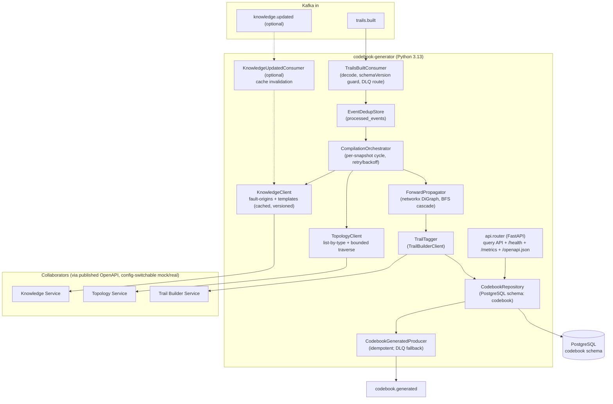
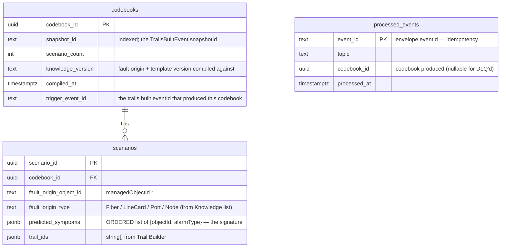
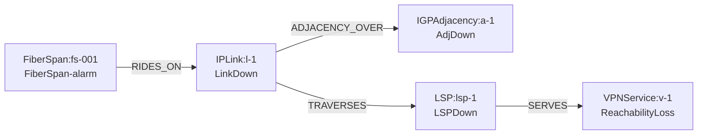
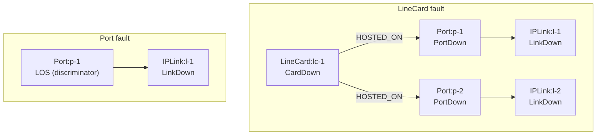

# codebook-generator — Design

Buildable design for the Codebook Generator Service, derived from the approved, merged
`services/codebook-generator/spec.md` (PR #32) and `docs/architecture.md`. The service compiles
the **codebook** — the matrix of *candidate root-cause instance → predicted symptom signature* —
by running Knowledge-authored propagation templates **forward** over the Topology graph closure,
tags each scenario to its trail(s), persists it under a freshly minted `codebookId`, and serves
full signatures to downstream consumers via its own query API.

> **No contract change.** Every topic this design touches (`trails.built`, `codebook.generated`,
> the optional `knowledge.updated`, and the `*.dlq` topics) and every payload
> (`TrailsBuiltEvent`, `CodebookGeneratedEvent`, `KnowledgeUpdatedEvent`) is already in
> `libs/event-model` + `architecture.md`. The query API is this service's **own** HTTP surface
> (it owns its OpenAPI). Outbound collaborator surfaces (Topology, Knowledge, Trail Builder) are
> consumed against their **published OpenAPI**, never authored here. Nothing below invents a new
> topic/payload/field. The two design-time resolutions (alarm-type vocabulary, OQ-2; collaborator
> API shapes, OQ-1/OQ-3) are recorded under *Design-stage resolutions* — they are coordination
> items, not contract changes; if a vocabulary decision ultimately needs a new `libs/event-model`
> field, that is a separate contract change requiring human approval and is flagged at that point.

---

## Stack

| Concern | Choice | License |
|---|---|---|
| Language / runtime | **Python 3.13** | PSF |
| HTTP API + OpenAPI 3.1 | **FastAPI** (+ `uvicorn`) — generates `/openapi.json` + Swagger docs UI | MIT / BSD |
| Graph propagation | **networkx** (in-memory `DiGraph` per fault-origin closure; forward traversal) | BSD-3 |
| Kafka client | **confluent-kafka** (librdkafka; manual-commit consumer, idempotent producer) | Apache-2.0 |
| Event model | **`acp-event-model`** (`libs/event-model` Python/Pydantic binding) — frozen contract | repo |
| DB access | **SQLAlchemy 2.x Core** + **psycopg** (v3) over **PostgreSQL** (schema `codebook`) | MIT / LGPL-permitted-runtime-link / PostgreSQL |
| Migrations | **Alembic** | MIT |
| Outbound HTTP clients (Topology/Knowledge/Trail Builder) | **httpx** | BSD-3 |
| Unit-test collaborator mocks | **respx** (httpx mock transport, stubs from each collaborator's published OpenAPI) | BSD-3 |
| Metrics | **prometheus-client** (`/metrics`) | Apache-2.0 |
| Logging | stdlib `logging` + JSON formatter (`python-json-logger`) | BSD-2 |
| Test framework | **pytest** (unit/contract — per cohort standard; do not substitute) | MIT |
| Lint/format | **ruff** + **black**, full type hints | MIT |

All runtime deps are Apache-2.0 / BSD / MIT / PostgreSQL — no GPL/AGPL/BSL/source-available.

---

## Task breakdown (from the spec)

Every spec Task (§Tasks 1–8) is realized below and is traceable into a module + flow.

| Spec task | Realized by (modules / flow) |
|---|---|
| **1. Consume `trails.built` & trigger compilation** (dedup on `eventId`; DLQ unprocessable) | `consumer.TrailsBuiltConsumer` decodes via `acp_event_model.deserialize` (rejects unknown `schemaVersion`, unknown `type`, malformed payload → `trails.built.dlq`); `dedup.EventDedupStore` checks `processed_events` by `eventId`; on first-sight it invokes `compile.CompilationOrchestrator` for `(snapshotId, trailIds)`. |
| **2. Fetch fault-origin types + propagation templates from Knowledge** | `clients.KnowledgeClient` calls integration points `knowledge-fault-origins` and `knowledge-propagation-templates` (config-switchable mock/real). Results are versioned and cached per `(domain, version)`; cache optionally invalidated by `knowledge.updated` (see *Optional `knowledge.updated`*). Nothing hard-coded. |
| **3. Enumerate fault-origin instances from Topology** | `clients.TopologyClient.list_objects_by_type(type, snapshotId)` via integration point `topology-query` for each type in the fault-origin list, scoped to the trigger `snapshotId` (OQ-3). |
| **4. Propagate templates forward & collect symptom sets** | `propagation.ForwardPropagator` — for each enumerated instance, fetch its bounded **graph closure** (`TopologyClient.traverse(rootId, edgeTypes, snapshotId)`), build a networkx `DiGraph`, run a BFS/worklist forward cascade applying the template rules to accumulate the ordered predicted symptom set (incl. the origin's own alarm). One result = one **scenario row**. See *Algorithm — forward propagation*. |
| **5. Tag each scenario with its trail(s)** | `tagging.TrailTagger` calls `clients.TrailBuilderClient.get_trails_for_object(managedObjectId)` (integration point `trail-builder-trails`) for each symptom's object, unions the `trailIds`, attaches them to the scenario. |
| **6. Persist the codebook (mint `codebookId`)** | `store.CodebookRepository` writes `codebooks` + `scenarios` rows in one transaction under a freshly minted `codebookId` (UUIDv4). A new `snapshotId` ⇒ new codebook + new `codebookId`; prior codebooks for other snapshots are never overwritten. |
| **7. Emit `codebook.generated`** | `producer.CodebookGeneratedProducer` builds a `CodebookGeneratedEvent` (`snapshotId`, `scenarioCount`, `codebookId`) in a `TypedEnvelope`, serializes via `acp_event_model.serialize`, publishes idempotently; failed delivery → `codebook.generated.dlq`. |
| **8. Serve the codebook query API** | `api.router` (FastAPI) exposes `GET /codebooks/{id}`, `/codebooks/{id}/scenarios`, `/codebooks/{id}/scenarios/{scenarioId}`, `GET /codebooks?snapshotId=`, plus `/health`, `/metrics`. Serves **full signatures** to Pattern Manager (reconcile) and Correlation Engine (match). |

---

## Phase applicability (design view)

Restates this service's row of the canonical phase map (`architecture.md`) at the module level.
Consistent with the spec's Phase applicability table.

| Phase | A/P/I | Modules / handlers exercised | Inputs / Outputs |
|---|---|---|---|
| **P1 — Topology onboarding** | **Active** | Full compile path: `TrailsBuiltConsumer` → `EventDedupStore` → `CompilationOrchestrator` → `KnowledgeClient` + `TopologyClient` → `ForwardPropagator` (networkx) → `TrailTagger` → `CodebookRepository` (mint `codebookId`) → `CodebookGeneratedProducer`. The `api.router` is also up (so it can serve as soon as a codebook exists), but it does no *driving* work here. | **In:** `trails.built`; Topology query API (`list objects by type`, `traverse`); Knowledge fault-origins + propagation-templates API; Trail Builder API (`getTrailsForObject`/`getTrail`). **Out:** `codebook.generated` (+ `*.dlq` on failure). |
| **P2 — Pattern learning** | **Passive** | Only `api.router` query endpoints (read path) + `store.CodebookRepository` reads. The consumer/orchestrator/propagator are **dormant** (no `trails.built` arrives — topology is already onboarded). Serves scenario signatures + trail tags + per-scenario RCA (the fault-origin instance/type is the model-based root cause) to **Pattern Manager** for reconcile / authoritative-RCA / explainability. | **In:** codebook query API requests from Pattern Manager. **Out:** query API responses. No topic output. |
| **P3 — Real-time correlation** | **Passive** | Same read path as P2. Serves **full signatures** to **Correlation Engine** for closest-match decode (the engine performs minimum-distance decode; this service only serves data). The codebook was also delivered via `codebook.generated` in P1; the engine may pre-fetch by `codebookId`/`snapshotId`. Compile path dormant. | **In:** codebook query API requests from Correlation Engine. **Out:** query API responses. No topic output. |

**Full-signature fetch (design-stage item, now designed).** The spec flagged that the Correlation
Engine needs full signatures (not the summary event). This is served by
`GET /codebooks/{codebookId}/scenarios` (all scenarios + ordered `predictedSymptoms` +
`trailIds`), optionally filtered by `?trailId=` so the engine reads only the trail-scoped
scenarios relevant to a live symptom set. The summary `CodebookGeneratedEvent` gives the engine
the `codebookId`/`snapshotId` to fetch by. See *API contracts*.

---

## Module breakdown



| Module | Responsibility |
|---|---|
| `consumer.TrailsBuiltConsumer` | Poll `trails.built`, decode via event-model codec, enforce schemaVersion/type/payload validity, route poison → `trails.built.dlq`, manual-commit after success. |
| `consumer.KnowledgeUpdatedConsumer` *(optional)* | If enabled, consume `knowledge.updated`, dedup on `eventId`, invalidate the Knowledge cache; poison → `knowledge.updated.dlq`. |
| `dedup.EventDedupStore` | Idempotency: record/lookup processed `eventId` in `processed_events`; re-delivery is a no-op (existing codebook preserved, summary re-emitted). |
| `compile.CompilationOrchestrator` | Drive one compilation cycle for a `snapshotId`; coordinate clients, propagator, tagger, repo, producer; retry-with-backoff on transient integration failures; on unrecoverable failure route the trigger event to `trails.built.dlq`. |
| `clients.KnowledgeClient` / `TopologyClient` / `TrailBuilderClient` | Typed httpx clients built against each collaborator's published OpenAPI; resolve base URL + `MOCK\|REAL` from config; emit call-latency metrics; retry/backoff. |
| `propagation.ForwardPropagator` | Core algorithm — build closure `DiGraph`, run forward template cascade, return ordered symptom signature. |
| `tagging.TrailTagger` | Resolve `trailIds[]` for each scenario from Trail Builder. |
| `store.CodebookRepository` | Owned PostgreSQL writes/reads (`codebooks`, `scenarios`, `processed_events`); transactional codebook persistence. |
| `producer.CodebookGeneratedProducer` | Build + serialize + idempotently publish `CodebookGeneratedEvent`; DLQ fallback. |
| `api.router` | FastAPI query endpoints + health/metrics/openapi. |
| `config.Settings` | Env-driven config; fail-fast on missing required integration-point URLs. |
| `vocabulary.AlarmTypeVocabulary` | Maps template effect names → canonical alarm-type identifier strings (OQ-2 shared vocabulary), loaded as config/Knowledge data — not hard-coded business strings. |

---

## Data model

Owned datastore: **PostgreSQL, schema `codebook`** (single owner; no other service writes here).



**Keys & indexes**
- `codebooks.codebook_id` PK (UUIDv4, minted per compilation).
- `idx_codebooks_snapshot_id` on `codebooks(snapshot_id)` — supports `GET /codebooks?snapshotId=`.
- `scenarios.scenario_id` PK; FK `scenarios.codebook_id → codebooks.codebook_id` (`ON DELETE CASCADE`).
- `idx_scenarios_codebook` on `scenarios(codebook_id)`; `idx_scenarios_origin` on
  `scenarios(codebook_id, fault_origin_object_id)`.
- GIN index `idx_scenarios_trail_ids` on `scenarios(trail_ids jsonb_path_ops)` — supports
  `?trailId=` filtering for the Correlation Engine's trail-scoped read.
- `processed_events.event_id` PK — idempotency dedup.

**`predicted_symptoms` shape** — an *ordered* JSON array preserving cascade order, each element
`{"objectId": "IPLink:...", "alarmType": "<canonical alarm-type id>"}`. Order matters for
criterion 1 (expected ordered cascade). `alarmType` strings come from `AlarmTypeVocabulary`
(OQ-2), not hard-coded here.

**Regeneration semantics.** A new `snapshotId` (or any re-trigger with a new `eventId`) inserts a
**new** `codebooks` row with a **new** `codebook_id`; previously persisted codebooks are immutable
and untouched. The store is append-only for codebooks; there is no update path that mutates an
existing codebook's scenarios.

---

## Event handling

**Consumers**

| Topic | Handler | Idempotency / dedup | DLQ routing |
|---|---|---|---|
| `trails.built` *(primary trigger)* | `TrailsBuiltConsumer` → `CompilationOrchestrator` | dedup on envelope `eventId` via `processed_events`; re-delivery = no-op (preserve + re-emit summary) | malformed / unknown `schemaVersion`(≥2) / unknown `type` / unrecoverable compile error → `trails.built.dlq` |
| `knowledge.updated` *(optional, design-enabled)* | `KnowledgeUpdatedConsumer` → invalidate Knowledge cache | dedup on `eventId` | poison → `knowledge.updated.dlq` |

Consumer is **manual-commit**: offset committed only after the codebook is persisted (or the
message is DLQ'd), so an at-least-once redelivery after a crash re-enters the dedup gate and
becomes a no-op. Decoding uses `acp_event_model.deserialize`, which already rejects
`schemaVersion ≥ 2` (`SchemaVersionError`), unknown `type` (`UnknownEventTypeError`), and missing
required fields (`CodecError`/`ValidationError`) — each mapped to a DLQ route with a structured
error log carrying `traceId`.

**Producers**

| Topic | Payload (from `libs/event-model`) | Notes |
|---|---|---|
| `codebook.generated` | `CodebookGeneratedEvent` `{snapshotId, scenarioCount, codebookId}` in a `TypedEnvelope` | summary only; full signatures via query API. Producer configured idempotent (`enable.idempotence=true`, `acks=all`). Publish failure → `codebook.generated.dlq`. |

**Optional `knowledge.updated`.** The spec leaves subscribing as a design decision. **Decision:
subscribe, default-off via `KNOWLEDGE_UPDATED_ENABLED` (default `false`).** Rationale: fetch-per-cycle
(default) is simplest and always correct because each compilation re-fetches fault-origins +
templates fresh, capturing the current version. Subscribing is an *optimization* (cache
invalidation to avoid re-fetch on every cycle when Knowledge is static); it adds a consumer +
DLQ. We design the handler and ship it disabled, enabling it only if Knowledge call volume
warrants — no contract change either way (topic/payload already exist).

---

## API contracts

This service **owns** its HTTP surface. FastAPI generates OpenAPI 3.1 at `/openapi.json` (served
live + a Swagger docs UI at `/docs`); the generated document is **checked in** at
`services/codebook-generator/openapi.json`. This spec drives provider-side contract/unit tests
(every response validated against the published schema). A surface change is a contract change.

| Method / path | Purpose | Success | Errors |
|---|---|---|---|
| `GET /codebooks/{codebookId}` | Codebook metadata | `200` `CodebookMetadata` | `404` if unknown id; `422` malformed id |
| `GET /codebooks/{codebookId}/scenarios` (opt. `?trailId=`) | All scenarios + full ordered signatures + trail tags (Correlation Engine match read; trail-scoped when `?trailId=` given) | `200` `ScenarioList` | `404` unknown codebook |
| `GET /codebooks/{codebookId}/scenarios/{scenarioId}` | One scenario's signature + trail tags | `200` `Scenario` | `404` unknown codebook/scenario |
| `GET /codebooks?snapshotId={snapshotId}` | Codebook(s) for a snapshot (Pattern Manager reconcile) | `200` `CodebookMetadata[]` (often one) | `200 []` if none |
| `GET /health` | liveness/readiness (DB + Kafka reachability) | `200`/`503` | — |
| `GET /metrics` | Prometheus exposition | `200` text | — |
| `GET /openapi.json` | OpenAPI 3.1 document | `200` | — |

**Schemas (response shapes).**

```jsonc
// CodebookMetadata
{ "codebookId": "uuid", "snapshotId": "snap-A", "scenarioCount": 42,
  "knowledgeVersion": "1.3.0", "compiledAt": "2026-06-10T12:00:00Z" }

// Scenario
{ "scenarioId": "uuid", "codebookId": "uuid",
  "faultOriginObjectId": "FiberSpan:fs-001", "faultOriginType": "Fiber",
  "predictedSymptoms": [                       // ORDERED — the signature
    {"objectId": "FiberSpan:fs-001", "alarmType": "<FiberSpan-alarm>"},
    {"objectId": "IPLink:l-1",       "alarmType": "<LinkDown>"},
    {"objectId": "IGPAdjacency:a-1", "alarmType": "<AdjDown>"},
    {"objectId": "LSP:lsp-1",        "alarmType": "<LSPDown>"},
    {"objectId": "VPNService:v-1",   "alarmType": "<ReachabilityLoss>"} ],
  "trailIds": ["trail-7"] }

// ScenarioList = { "codebookId": "uuid", "scenarios": [ Scenario, ... ] }
```

`alarmType` values are the canonical OQ-2 vocabulary strings (placeholders shown). `404`/`422`
return RFC-7807-style `{type,title,status,detail}` problem bodies.

---

## Integration points (mock vs. real)

Four outbound integration points, each resolved by env (base URL + `MOCK|REAL` toggle). No
hard-coded URLs. Unit tests stub responses with **respx** from each collaborator's **published
OpenAPI**; integration tests point at the live Docker-Compose service. Same code in both modes.

| Integration point | Collaborator + operation | Config keys | Mock (unit) | Real (integration) |
|---|---|---|---|---|
| `topology-query` | Topology Service — `list objects by type` (enumerate fault-origin instances, `snapshotId`-scoped) + `traverse by edge types (bounded)` (graph closure) | `TOPOLOGY_QUERY_BASE_URL`, `TOPOLOGY_QUERY_MODE` | respx stub from Topology OpenAPI | live Topology |
| `knowledge-fault-origins` | Knowledge Service — current versioned fault-origin type list | `KNOWLEDGE_FAULT_ORIGINS_BASE_URL`, `KNOWLEDGE_FAULT_ORIGINS_MODE` | respx stub | live Knowledge |
| `knowledge-propagation-templates` | Knowledge Service — current versioned propagation templates (per-edge-type rules) | `KNOWLEDGE_PROPAGATION_TEMPLATES_BASE_URL`, `KNOWLEDGE_PROPAGATION_TEMPLATES_MODE` | respx stub | live Knowledge |
| `trail-builder-trails` | Trail Builder — `getTrailsForObject(managedObjectId)`, `getTrail(trailId)` | `TRAIL_BUILDER_BASE_URL`, `TRAIL_BUILDER_MODE` | respx stub | live Trail Builder |

**Fail-fast:** if any required `*_BASE_URL` is unset (regardless of mode), `config.Settings`
raises at startup and the service refuses to boot with a structured configuration error
(criterion 6, second clause).

**Design-stage dependency (OQ-1/OQ-3).** Topology and Trail Builder OpenAPI documents are not yet
frozen on this branch (their spec API surfaces are TBD). The clients + respx stubs are built
against the **operations named in the Solution Design** (`list objects by type`, `traverse by
edge types (bounded)`, `getTrailsForObject`, `getTrail`) and re-bound to the concrete paths/schemas
once those services publish `openapi.json`. The *requirement* (snapshot-scoped enumeration; every
scenario trail-tagged via a Trail Builder call) is firm. A thin `ClientPort` interface isolates the
propagation/tagging logic from the wire shape, so re-binding is local to the client adapter.

---

## Key flows

### Flow A — compile codebook on `trails.built`

```mermaid
sequenceDiagram
  autonumber
  participant K as Kafka (trails.built)
  participant C as TrailsBuiltConsumer
  participant D as EventDedupStore
  participant O as CompilationOrchestrator
  participant KN as KnowledgeClient
  participant TP as TopologyClient
  participant FP as ForwardPropagator (networkx)
  participant TG as TrailTagger / TrailBuilderClient
  participant R as CodebookRepository (Postgres)
  participant P as CodebookGeneratedProducer
  participant CG as Kafka (codebook.generated)

  K->>C: TrailsBuiltEvent {snapshotId, trailIds, trailCount}
  C->>C: deserialize (schemaVersion<2, known type, valid payload)
  alt malformed / unknown schemaVersion / unknown type
    C-->>K: route to trails.built.dlq; commit; continue
  else valid
    C->>D: seen(eventId)?
    alt duplicate
      D-->>C: yes → re-emit summary, commit (no-op)
    else first sight
      C->>O: compile(snapshotId, trailIds, eventId)
      O->>KN: fault-origin types  (knowledge-fault-origins)
      O->>KN: propagation templates (knowledge-propagation-templates)
      loop each fault-origin type
        O->>TP: list objects by type (type, snapshotId)
      end
      loop each enumerated instance
        O->>TP: traverse(rootId, edgeTypes, snapshotId)  %% bounded closure
        O->>FP: propagate(closure, templates, vocabulary)
        FP-->>O: ordered predicted symptom signature
        O->>TG: getTrailsForObject(each symptom objectId)
        TG-->>O: trailIds[]
      end
      O->>R: INSERT codebook(codebookId=uuid, snapshotId) + scenarios (1 txn)
      R-->>O: codebookId, scenarioCount
      O->>D: record(eventId → codebookId)
      O->>P: CodebookGeneratedEvent {snapshotId, scenarioCount, codebookId}
      P->>CG: publish (idempotent)
      alt publish fails
        P-->>CG: route to codebook.generated.dlq
      end
      C-->>K: commit offset
    end
  end
```

On any **transient** integration failure (Topology/Knowledge/Trail Builder), the orchestrator
retries with backoff; if unrecoverable, the trigger event is routed to `trails.built.dlq` (no
partial codebook is persisted — the transaction is all-or-nothing).

### Flow B — codebook query (Pattern Manager reconcile / Correlation Engine match)

```mermaid
sequenceDiagram
  autonumber
  participant PM as Pattern Manager / Correlation Engine
  participant A as api.router (FastAPI)
  participant R as CodebookRepository
  participant DB as PostgreSQL

  Note over PM,A: P2 reconcile (by snapshotId) / P3 match (full signatures)
  PM->>A: GET /codebooks?snapshotId=snap-A
  A->>R: find_by_snapshot(snap-A)
  R->>DB: SELECT ... WHERE snapshot_id=snap-A
  DB-->>R: [codebook meta]
  R-->>A: CodebookMetadata[]
  A-->>PM: 200 [ {codebookId, snapshotId, scenarioCount, ...} ]

  PM->>A: GET /codebooks/{codebookId}/scenarios?trailId=trail-7
  A->>R: scenarios(codebookId, trailId)
  R->>DB: SELECT ... (GIN trail_ids filter)
  DB-->>R: [scenario rows]
  R-->>A: ScenarioList (ordered predictedSymptoms + trailIds)
  A-->>PM: 200 ScenarioList
  Note right of PM: Engine runs minimum-distance decode against these signatures
```



---

## Algorithm — forward propagation (core)

For each enumerated fault-origin instance, the propagator computes the **predicted symptom set**
(the codebook row) by running the Knowledge-authored templates **forward** over that instance's
bounded graph closure. The origin's own alarm is always the first symptom.

**Inputs:** `rootObjectId` (e.g. `FiberSpan:fs-001`), the closure `DiGraph` from
`TopologyClient.traverse` (nodes = typed objects with `managedObjectId`; directed edges labeled by
edge type), the propagation templates (per-edge-type rule: *given an alarm on the source object,
produce a named alarm on the target object*), and the `AlarmTypeVocabulary` (effect-name →
canonical alarm-type id).

**Model.** A template is `(edgeType, sourceCondition, effectAlarmType)`. Propagation is a
**worklist BFS**: each frontier item is `(objectId, inboundAlarmType)`. The origin is seeded with
its own fault alarm; expansion follows out-edges whose type has a template firing on the current
alarm, appending the effect alarm on the neighbour and queueing it. Order of discovery defines the
ordered signature; an object is recorded once per distinct alarm type (dedup on
`(objectId, alarmType)`) to keep the signature finite and stable.

```mermaid
flowchart TD
  S([seed: origin's own fault alarm]) --> Q[/worklist: (objectId, alarmType)/]
  Q --> POP{worklist empty?}
  POP -- yes --> DONE([emit ordered signature])
  POP -- no --> CUR[pop (obj, alarm)]
  CUR --> REC{(obj,alarm) already recorded?}
  REC -- yes --> POP
  REC -- no --> ADD[append (obj, vocab(alarm)) to signature; mark recorded]
  ADD --> EDGES[for each out-edge obj-->nbr of type E]
  EDGES --> RULE{template E fires\non current alarm?}
  RULE -- no --> EDGES
  RULE -- yes --> EFF[effect = template.effectAlarmType\nfor nbr's type]
  EFF --> PUSH[push (nbr, effect) to worklist]
  PUSH --> EDGES
  EDGES --> POP
```

**Fiber-cut cascade (criterion 1).** Seed `FiberSpan:fs-001` with `FiberSpan-alarm`. Templates fire
in sequence over the closure:

```
RIDES_ON        : fault(Fiber)     => LinkDown(IPLink)
ADJACENCY_OVER  : LinkDown(IPLink) => AdjDown(IGPAdjacency)
TRAVERSES       : LinkDown(IPLink) => LSPDown(LSP head-end)
SERVES          : LSPDown(LSP)     => ReachabilityLoss(VPNService)
```

yielding the ordered signature
`[FiberSpan-alarm, LinkDown(IPLink), AdjDown(IGPAdjacency), LSPDown(LSP), ReachabilityLoss(VPNService)]`.



**Line-card vs. port distinguishability (criterion 2).** The `HOSTED_ON` template makes a LineCard
fault fan out to **every** hosted Port (each `PortDown`), then `PortDown => LinkDown(its IPLink)`:

```
fault(LineCard) => PortDown(Port_a), PortDown(Port_b)         [HOSTED_ON, all hosted ports]
PortDown(Port_a) => LinkDown(IPLink_a);  PortDown(Port_b) => LinkDown(IPLink_b)
```

A single **Port** fault seeds only that port's discriminator (`LOS`/port-layer alarm) and a single
`LinkDown` on its one IPLink. Distinguishability falls out structurally:

- the LineCard scenario contains **multiple `PortDown`** entries (one per hosted port) that are
  **absent** from a single-port scenario;
- the Port scenario carries the **`LOS` / port-layer discriminator** alarm for the faulted port at
  the top of its signature, **absent** from the LineCard scenario's top-level origin signature
  (the LineCard's origin alarm is a card-level alarm, and its per-port effects are `PortDown`, not
  the port-origin `LOS`).



**Boundedness & cycles.** Traversal is bounded by the closure Topology returns (edge-type scoped);
the `(objectId, alarmType)` recorded-set prevents revisiting, so cycles/fate-sharing edges
(`MEMBER_OF`, SRLG) cannot loop. `MEMBER_OF` co-failure grouping is read but, per spec, MVP uses
straight-up propagation (protection-aware FRR/ECMP deferred).

**No hard-coded domain.** Edge types, fire conditions, and effect names come entirely from the
Knowledge templates + `AlarmTypeVocabulary` config; the propagator is domain-agnostic graph
machinery. Effect→alarm-type mapping is the OQ-2 vocabulary, coordinated with Knowledge.

---

## Design alternatives

| Consideration | Alternatives | Chosen + rationale |
|---|---|---|
| Graph propagation engine | (a) **networkx in-memory `DiGraph`** per closure; (b) recursive SQL/AGE queries; (c) hand-rolled adjacency BFS | **(a)** — spec mandates *no direct graph access* (Topology owns AGE); closures are small (one fault-origin neighbourhood); networkx gives well-tested BFS/edge-type filtering with a permissive BSD license. (b) violates single-owner; (c) reinvents networkx. |
| Knowledge data freshness | (a) **fetch fault-origins+templates per compilation cycle**; (b) subscribe `knowledge.updated` for cache invalidation; (c) static config | **(a) default, (b) shipped-but-off** — per-cycle fetch is always correct and simplest; `knowledge.updated` invalidation is an optimization behind a flag (no contract change). (c) rejected — violates "read from Knowledge at runtime, nothing hard-coded". |
| Codebook regeneration | (a) **append new `codebookId` per snapshot (immutable)**; (b) upsert/overwrite per snapshot | **(a)** — spec requires a new `codebookId` per snapshot and that regeneration not overwrite a prior snapshot's codebook; immutability also lets `matchedCodebookId` on incidents stay valid. |
| Idempotency store | (a) **DB `processed_events` table**; (b) Kafka-offset-only; (c) in-memory set | **(a)** — survives restarts and gives an at-least-once-safe no-op for redelivery (criterion 5). (b) doesn't prevent re-compile after rebalance; (c) lost on restart. |
| Symptom signature representation | (a) **ordered `jsonb` list of `{objectId, alarmType}`**; (b) unordered set of alarm types; (c) normalized child table | **(a)** — criterion 1 requires *ordered* cascade and per-object identity for trail tagging + engine decode; jsonb keeps a scenario atomic and GIN-indexable for `?trailId=`. (b) loses order/object; (c) over-normalizes read-mostly data. |
| Full-signature delivery to engine | (a) **query API full-signature fetch (+ `?trailId=` scope)**; (b) embed signatures in `codebook.generated` | **(a)** — event-model freezes `CodebookGeneratedEvent` as summary-only; signatures can be large; query API lets the engine fetch trail-scoped subsets. (b) would be a contract change and bloat the topic. |
| Outbound clients | (a) **httpx + respx mocks from collaborator OpenAPI behind a `ClientPort`**; (b) generated SDKs | **(a)** — collaborator OpenAPIs aren't frozen yet (OQ-1/OQ-3); a thin port isolates wire shape so re-binding is local; respx mocks satisfy config-switchable unit testing. |

---

## Test plan

Framework: **pytest** (cohort standard). Collaborator calls mocked with **respx** (stubs from
each producer's published OpenAPI). DB tests use a Postgres test container/fixture; Kafka
interactions are unit-tested against a fake producer/consumer and validated end-to-end in
integration.

### Acceptance criterion → test (unit/contract)

| # | Acceptance criterion | Test | Asserts |
|---|---|---|---|
| 1 | Fiber-cut signature matches expected cascade | `test_fiber_cut_signature_matches_expected_cascade` | With mock Topology (FiberSpan→IPLink→IGPAdjacency/LSP→VPNService closure) + mock Knowledge templates, the FiberSpan scenario's `predictedSymptoms` equals the ordered `[FiberSpan-alarm, LinkDown, AdjDown, LSPDown, ReachabilityLoss]` (vocabulary-mapped). |
| 2 | Line-card vs. port faults distinguishable | `test_linecard_and_port_signatures_are_distinguishable` | LineCard scenario contains ≥2 `PortDown` entries absent from the Port scenario; Port scenario contains the `LOS`/port discriminator absent from the LineCard's top-level signature; signatures are unequal. |
| 3 | Every scenario tagged to ≥1 trail | `test_every_scenario_has_non_empty_trail_ids` | With mock Trail Builder returning ≥1 trailId for any object, every persisted scenario has non-empty `trailIds`. |
| 4 | Regenerate after topology change → new codebook tied to new snapshot | `test_two_snapshots_produce_two_codebooks_with_distinct_ids` | Processing `trails.built` for `snap-A` then `snap-B` yields two `codebooks` rows with distinct `codebookId`; `snap-B` codebook carries `snapshotId=snap-B`; two `CodebookGeneratedEvent`s emitted, each validating against the Pydantic binding with correct `snapshotId`/`codebookId`. |
| 5 | Duplicate `trails.built` (same `eventId`) deduplicated | `test_duplicate_event_id_compiles_and_emits_once` | Same event delivered twice → exactly one codebook compiled and exactly one `codebook.generated` (second delivery is a no-op re-emit / no new row). |
| 6 | All outbound calls via config-switchable integration points; missing URL fails start | `test_full_cycle_runs_in_mock_mode_no_real_http` + `test_missing_integration_url_refuses_to_start` | With all `*_MODE=MOCK`, a full compile completes with zero real HTTP egress (respx asserts only stubbed routes hit); with a required `*_BASE_URL` unset, `Settings` raises and a structured config error is logged. |
| 7 | Query API returns scenario signature + trail tags by `codebookId` | `test_get_scenario_returns_signature_and_trails_validating_openapi` | `GET /codebooks/{id}/scenarios/{scenarioId}` → `200`, correct `predictedSymptoms` + `trailIds`, body validates against checked-in `openapi.json`. |
| 8 | `codebook.generated` validates against frozen binding | `test_codebook_generated_event_validates_against_event_model` | Emitted payload deserializes via `CodebookGeneratedEvent` Pydantic class with no errors; `scenarioCount` equals persisted scenario count; `codebookId` non-empty. |
| 9 | Unknown `schemaVersion` rejected | `test_unknown_schema_version_routed_to_dlq` | A `trails.built` envelope with `schemaVersion>=2` is not processed, routed to `trails.built.dlq`, service does not crash (codec raises `SchemaVersionError`). |
| 10 | Unprocessable `trails.built` → DLQ | `test_malformed_event_routed_to_dlq_and_consumer_continues` | A message missing `snapshotId` routes to `trails.built.dlq`, is not retried indefinitely, and the consumer processes the next valid message. |

Supporting (non-criterion) unit tests: `test_openapi_json_checked_in_matches_app` (published vs.
generated), `test_forward_propagator_dedups_object_alarm_pairs`,
`test_trail_scoped_scenarios_filter_by_trail_id`, `test_processed_events_survive_restart`,
`test_optional_knowledge_updated_invalidates_cache` (when enabled).

### E2E scenarios (from this design unit's point of view)

Service-scoped end-to-end paths the integration-test stage exercises (real Topology/Knowledge/
Trail Builder in Compose where available; otherwise OpenAPI-stub doubles), incl. failure/partial.

| # | Scenario | Trigger → path | Expected outcome |
|---|---|---|---|
| 1 | Fiber-cut compile happy path | `trails.built(snap-A)` → enumerate FiberSpan → traverse → forward-propagate → tag → persist → emit | One codebook minted; fiber-cut scenario carries the expected ordered cascade signature; `codebook.generated(snap-A)` on the bus. |
| 2 | Line-card/port distinguishability end-to-end | `trails.built` over a topology with a LineCard (2 ports) + standalone Port → compile | Persisted scenarios for the LineCard and Port instances are distinguishable (PortDown fan-out vs. LOS discriminator), readable via the query API. |
| 3 | Trail tagging end-to-end | compile with live/stub Trail Builder | Every persisted scenario has ≥1 `trailId`; `GET /scenarios/{id}` returns them. |
| 4 | Regenerate on new snapshot | `trails.built(snap-A)` then `trails.built(snap-B)` | Two immutable codebooks, distinct `codebookId`; `snap-A` codebook unchanged; two summary events emitted. |
| 5 | Duplicate delivery (idempotency) | same `trails.built` `eventId` redelivered after a simulated rebalance | Exactly one codebook + one summary event; offset committed; no duplicate row. |
| 6 | Poison message → DLQ, continue | malformed then valid `trails.built` | Malformed → `trails.built.dlq`; valid next message compiles normally; consumer never stalls. |
| 7 | Schema-version guard | `trails.built` with `schemaVersion=2` | Routed to `trails.built.dlq`; service healthy. |
| 8 | Collaborator unavailability (partial path) | Topology (or Knowledge/Trail Builder) returns 5xx/timeout during compile | Retry-with-backoff; on unrecoverable failure the trigger event → `trails.built.dlq`, no partial codebook persisted, error logged with `traceId`; subsequent events still processed. |
| 9 | Producer failure fallback | `codebook.generated` publish fails after persist | Codebook remains persisted; summary routed to `codebook.generated.dlq`; redelivery of the trigger is a no-op (already-compiled), re-emits summary. |
| 10 | Engine match read (full signatures) | Correlation Engine `GET /codebooks/{id}/scenarios?trailId=trail-7` | Returns trail-scoped scenarios with full ordered signatures for minimum-distance decode. |
| 11 | Pattern Manager reconcile read | `GET /codebooks?snapshotId=snap-A` then per-scenario fetch | Returns the snapshot's codebook metadata + scenario signatures + per-scenario fault-origin RCA. |

---

## Config & observability

**Config (env only; fail-fast on missing required keys).**

| Key | Purpose |
|---|---|
| `KAFKA_BOOTSTRAP_SERVERS`, `KAFKA_CONSUMER_GROUP_ID` | Kafka connection + consumer group |
| `TRAILS_BUILT_TOPIC`, `CODEBOOK_GENERATED_TOPIC`, `*_DLQ` topics | topic names |
| `DB_HOST`/`DB_PORT`/`DB_NAME`/`DB_USER`/`DB_PASSWORD`/`DB_SCHEMA=codebook` | PostgreSQL |
| `TOPOLOGY_QUERY_BASE_URL` / `_MODE`, `KNOWLEDGE_FAULT_ORIGINS_BASE_URL` / `_MODE`, `KNOWLEDGE_PROPAGATION_TEMPLATES_BASE_URL` / `_MODE`, `TRAIL_BUILDER_BASE_URL` / `_MODE` | integration points (`MOCK\|REAL`) |
| `KNOWLEDGE_UPDATED_ENABLED` (default `false`), `KNOWLEDGE_UPDATED_TOPIC` | optional cache-invalidation consumer |
| `ALARM_TYPE_VOCABULARY` (path/ref) | OQ-2 effect→alarm-type mapping (coordinated with Knowledge; not hard-coded) |
| `HTTP_RETRY_MAX`, `HTTP_BACKOFF_MS` | client retry/backoff |
| `LOG_LEVEL` | logging |

**Observability.** `/health` (liveness + readiness: DB + Kafka reachable). `/metrics` Prometheus:
`events_consumed_total`, `events_dlq_total{topic}`, `codebooks_compiled_total`,
`scenarios_generated_total`, `compile_errors_total`,
`integration_call_latency_seconds{integration_point}`, `compile_duration_seconds`. Structured JSON
logs (`level, timestamp, traceId, service, message`) — `traceId` propagated from the envelope.

---

## Build & run

- **Layout:** `services/codebook-generator/src/codebook_generator/{consumer,dedup,compile,clients,propagation,tagging,store,producer,api,vocabulary,config}.py`; `tests/` (pytest); `alembic/`; `openapi.json` checked in.
- **Build/lint/test:** `ruff check . && black --check . && pytest` (CI green is part of DoD).
- **OpenAPI:** generated by FastAPI at `/openapi.json`; a make/CI step dumps it to
  `services/codebook-generator/openapi.json` and a test asserts the checked-in copy matches the app.
- **Dockerfile:** `python:3.13-slim` base (matches repo pin), non-root, installs locked deps,
  runs `uvicorn` for the API + the Kafka consumer loop (single process, async). Compose entry on
  the `integration` branch wires Kafka + PostgreSQL + the real collaborators.
- **Local run:** `MOCK` mode for all four integration points lets the full compile cycle run with
  no live dependencies (criterion 6).

---

## Design-stage resolutions (coordination, not contract changes)

- **OQ-1 — Trail Builder API surface.** `trail-builder-trails` client + respx mock built against
  the Solution-Design operations `getTrailsForObject(managedObjectId)` / `getTrail(trailId)`;
  re-bound to Trail Builder's `openapi.json` once frozen. Requirement (every scenario tagged via a
  Trail Builder call) is firm. Tracked: issue #28.
- **OQ-2 — Shared alarm-type vocabulary.** Signatures use canonical alarm-type identifiers from a
  shared vocabulary coordinated with Knowledge (the template author), surfaced via
  `vocabulary.AlarmTypeVocabulary` (config/Knowledge-loaded, not hard-coded). The §5 effect names
  (`LinkDown`, `AdjDown`, `LSPDown`, `PortDown`, `LOS`, `ReachabilityLoss`) are placeholders until
  confirmed. If a *new* `libs/event-model` field is ultimately required to carry the type, that is
  a contract change requiring human approval — flagged at that point, not assumed here. Tracked: issue #30.
- **OQ-3 — Topology snapshot-scoped enumeration.** `topology-query` client passes `snapshotId` to
  `list objects by type`; re-bound to Topology's `openapi.json` once frozen. If Topology cannot
  scope by `snapshotId`, the design adapts (filter client-side on the returned objects'
  snapshot association). Tracked: issue #31.

## Seed data & examples
**N/A** — this service consumes upstream data (topology via API, templates/fault-origins via
Knowledge, trigger via `trails.built`). Test fixtures (synthetic FiberSpan / LineCard+Port
closures and mock template sets) are defined inline in the pytest suite per criteria 1–2.

## UI wireframes
**N/A** — no UI surface (the human-readable Swagger docs UI at `/docs` is auto-generated from the
OpenAPI document, not a designed UI).
