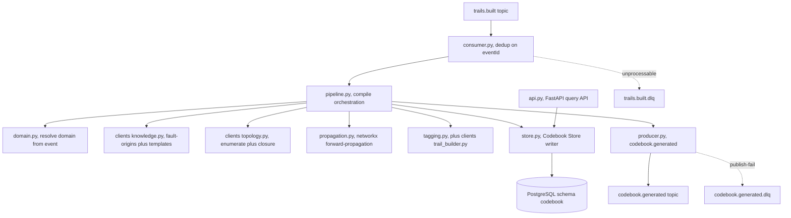
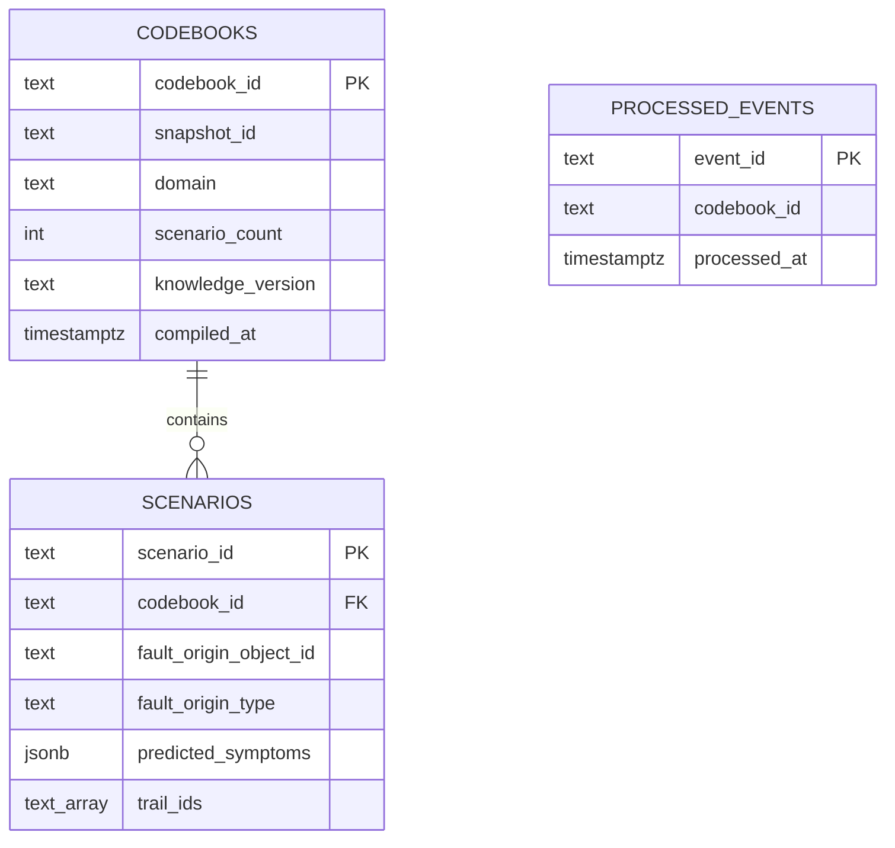
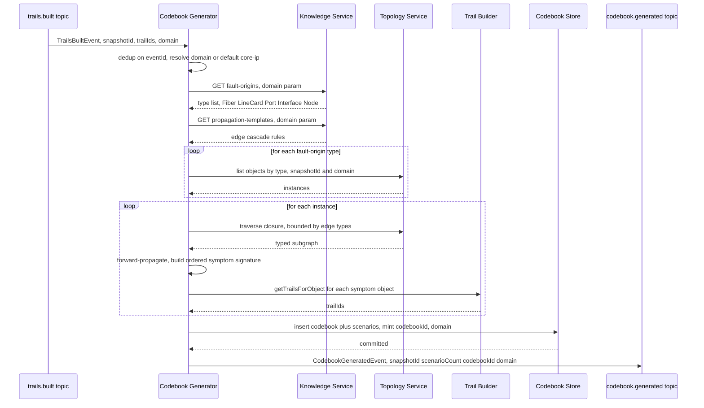
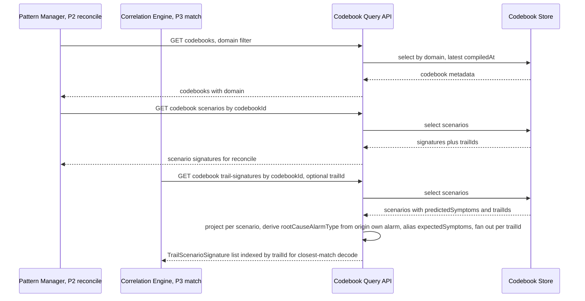
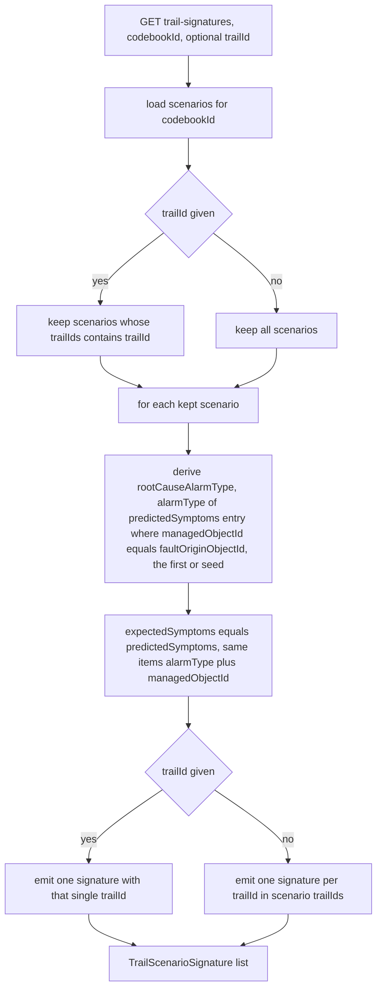
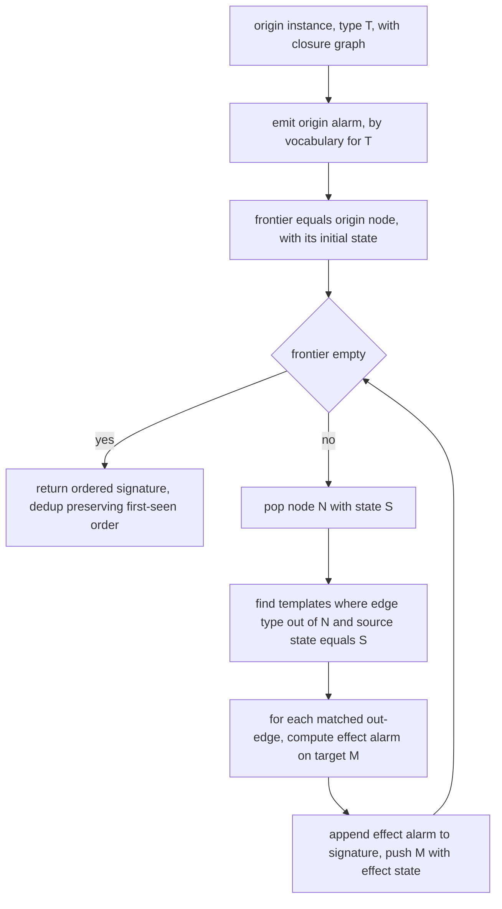

# codebook-generator — Design

> Buildable design for the Codebook Generator Service, authored from the approved, merged
> `spec.md` (PRs #32, #89, #96). Builds on the FROZEN event-model (`TrailsBuiltEvent` and
> `CodebookGeneratedEvent` both carry optional `domain`), the multi-domain contract, and the
> §5 Interface fault-origin model. This is a fresh design; the earlier skeleton PR #79 was
> closed as stale (predated multi-domain / Interface).
>
> **Revision (data-integration fix, P1-G5 / P3-G2):** adds a Correlation-Engine-oriented
> scenario-signature **projection endpoint** `GET /codebooks/{codebookId}/trail-signatures`
> (frozen `TrailScenarioSignature` shape) alongside the native `/scenarios` endpoint, freezes the
> read-API in the published `openapi.json`, and aligns the signature/`rootCauseAlarmType` value
> space to the merged canonical **`alarmType`** vocabulary (Knowledge `alarmTypeVocabulary`, same
> as `AlarmEvent.alarmType`). This is a service-owned read-API addition only — no Kafka topic /
> event-model change (`alarmType` already merged; `CodebookGeneratedEvent` unchanged).

The codebook is a **precomputed model** — a matrix of *candidate-root-cause instance to
predicted-symptom signature*, tagged to trails. It is **not** RCA on real data: matching a live
symptom set against the codebook (P3) and reconciling mined patterns against it (P2) are
**downstream** responsibilities of the Correlation Engine and Pattern Manager. This service
compiles and serves the model only.

---

## Stack

- **Language:** Python 3.13 (cohort: Python — graph workload).
- **Graph / propagation:** `networkx` (BSD-3-Clause) — in-memory directed multigraph built from
  Topology query responses; forward-propagation is a typed-edge traversal over it.
- **HTTP API:** FastAPI (MIT) + Uvicorn (BSD) — serves the codebook query API and publishes
  OpenAPI 3.1 at `/openapi.json` plus Swagger UI at `/docs`.
- **Datastore:** PostgreSQL (PostgreSQL licence) — owned Codebook Store (schema `codebook`).
  Access via SQLAlchemy Core (MIT) + a **`pg8000`** (BSD) pure-Python driver (chosen to keep the
  permissive-only invariant strict — `psycopg` is LGPL; selectable only if licence policy is
  relaxed).
- **Kafka client:** `confluent-kafka` (Apache-2.0) consumer/producer.
- **Event model:** `acp-event-model` (the repo's `libs/event-model` Python/Pydantic binding) —
  the single source of truth for `TrailsBuiltEvent`, `CodebookGeneratedEvent`, the envelope,
  the `schemaVersion` policy, and `managedObjectId`.
- **HTTP client (outbound integration):** `httpx` (BSD) with `respx` (BSD) mock transport for
  unit tests.
- **Lint / format / test:** ruff + black, pytest (all permissive).
- **Metrics:** `prometheus-client` (Apache-2.0).

All runtime dependencies are Apache-2.0 / BSD / MIT / PostgreSQL-licensed. No GPL/AGPL/BSL.

---

## Task breakdown (from the spec)

Every spec task (1 to 9) is realized below and is traceable to concrete modules, data, events,
and flow.

| Spec task | Realized by (modules / flow) |
|---|---|
| **1. Consume `trails.built` and trigger compilation** | `consumer.py` (confluent-kafka consumer, group `codebook-generator`) deserializes via `acp_event_model.deserialize`, dedups on envelope `eventId` in `processed_events` table, and invokes `pipeline.compile_codebook(...)`. Unprocessable messages route to `trails.built.dlq` via `dlq.py`. |
| **2. Resolve domain from the event payload** | `domain.py::resolve_domain(event)` reads `payload.domain`; when absent, returns the configured default `core-ip` (env `DEFAULT_DOMAIN`). No Topology snapshot-metadata call is made for domain resolution (OQ-4 resolved by contract #90). |
| **3. Fetch domain-scoped fault-origins + templates from Knowledge** | `clients/knowledge.py` — two integration points: `knowledge-fault-origins` (`GET /domains/{domain}/fault-origins`) and `knowledge-propagation-templates` (`GET /domains/{domain}/propagation-templates`); both pass `domain` as a path/query param. Responses cached per `(domain, knowledgeVersion)`; never authored here. |
| **4. Enumerate domain-scoped fault-origin instances from Topology** | `clients/topology.py::list_objects_by_type(snapshotId, domain, objectType)` — integration point `topology-query`. Iterates the fault-origin type list (incl. **Interface**); every request carries both `snapshotId` and `domain`. |
| **5. Propagate forward, collect predicted symptom sets** | `propagation.py` (networkx engine) — for each fault-origin instance, fetch its bounded graph closure from Topology, build a typed directed graph, run the domain templates forward, accumulate the ordered predicted symptom set (incl. the origin alarm). Handles Fiber, LineCard, Port, **Interface**, Node distinctly (Algorithm logical flow below). |
| **6. Tag each scenario with its trail(s)** | `tagging.py` — for each symptom `managedObjectId`, call `clients/trail_builder.py::get_trails_for_object(...)`; union the `trailIds`; attach to the scenario. Integration point `trail-builder-trails`. |
| **7. Persist codebook with domain** | `store.py` — inserts one `codebooks` row (fresh `codebookId`, `snapshotId`, `domain` non-null, `scenarioCount`) and N `scenarios` rows in one transaction. New `snapshotId` mints a new `codebookId`; never overwrites a prior snapshot's codebook. |
| **8. Emit `codebook.generated` with domain** | `producer.py` builds a `CodebookGeneratedEvent` (`snapshotId`, `scenarioCount`, `codebookId`, `domain`) via the Pydantic binding, wraps in the envelope, publishes to `codebook.generated`. Failed publish routes to `codebook.generated.dlq`. |
| **9. Serve the domain-scoped query API** | `api.py` (FastAPI) — `GET /codebooks/{codebookId}`, `/codebooks/{codebookId}/scenarios`, `/codebooks/{codebookId}/scenarios/{scenarioId}`, **`/codebooks/{codebookId}/trail-signatures` (CE projection)**, `/codebooks?snapshotId=`, `/codebooks?domain=`, `/codebooks/active?domain=&snapshotId=`, plus `/health` and `/metrics`. `projection.py` builds the CE-oriented `TrailScenarioSignature` from stored scenarios (derive `rootCauseAlarmType`, alias `expectedSymptoms`, fan out per `trailId`). Reads the Codebook Store; every response carries `domain`. OpenAPI 3.1 published + checked in (both `/scenarios` and `/trail-signatures` in it). |

---

## Phase applicability (design view)

Consistent with the canonical phase map (`architecture.md`) and the spec's Phase applicability:
**P1 Active**, **P2 Passive**, **P3 Passive**.

| Phase | Active/Passive/Idle | Modules/handlers exercised | Inputs/Outputs |
|---|---|---|---|
| P1 — Topology onboarding | **Active** | `consumer.py` (trails.built), `domain.py`, `clients/knowledge.py`, `clients/topology.py`, `propagation.py`, `tagging.py`, `clients/trail_builder.py`, `store.py` (write), `producer.py` | In: `trails.built` (snapshotId, trailIds, domain), Topology query API (domain-scoped enumerate + closure), Knowledge fault-origins API, Knowledge templates API, Trail Builder API reads. Out: `codebook.generated` (snapshotId, scenarioCount, codebookId, domain); Codebook Store writes |
| P2 — Pattern learning | **Passive** | `api.py` read endpoints, `store.py` (read). Compilation pipeline dormant unless a new `trails.built` arrives | In: codebook query API requests from Pattern Manager (reconcile; may filter by domain). Out: codebook query API responses (scenario signatures, trail tags, RCA-per-scenario, domain). No topic output |
| P3 — Real-time correlation | **Passive** | `api.py` read endpoints (esp. the CE `trail-signatures` projection + `projection.py` for closest-match decode), `store.py` (read). Compilation pipeline dormant | In: codebook query API requests from Correlation Engine (`GET /codebooks/{id}/trail-signatures` indexed by `trailId`; may filter by domain; codebook id also delivered via `codebook.generated`). Out: `TrailScenarioSignature` responses (`trailId`, `rootCauseAlarmType` vocab token, `expectedSymptoms`), domain, scoped by trail/snapshot. No topic output |

---

## Module breakdown



- **`consumer.py`** — Kafka consumer loop; deserialize, dedup, dispatch, commit-after-success;
  DLQ routing. Manual offset commit only after the pipeline succeeds (at-least-once).
- **`pipeline.py`** — orchestrates one compilation cycle (tasks 2 to 8); transactional persist;
  emits the event last.
- **`domain.py`** — `resolve_domain` (task 2).
- **`clients/knowledge.py`, `clients/topology.py`, `clients/trail_builder.py`** — config-switchable
  HTTP clients (mock/real); built against each producer's published OpenAPI.
- **`propagation.py`** — networkx forward-propagation engine; pure function of (closure graph,
  templates, origin) to ordered symptom signature. No I/O.
- **`tagging.py`** — trail-tag resolution per scenario.
- **`store.py`** — Codebook Store reader/writer (SQLAlchemy Core).
- **`producer.py`** — `codebook.generated` producer + DLQ fallback.
- **`api.py`** — FastAPI app, query endpoints (incl. the CE `trail-signatures` projection),
  `/health`, `/metrics`, `/openapi.json`.
- **`projection.py`** — pure read-time transform: stored `Scenario` to
  `TrailScenarioSignature[]` (derive `rootCauseAlarmType` from the origin's own alarm, alias
  `predictedSymptoms` as `expectedSymptoms`, fan out per `trailId`). No I/O; unit-testable in
  isolation.
- **`vocabulary.py`** — the shared alarm-type vocabulary mapping (see OQ-2 note below).
- **`config.py`** — env-only config; fails fast on missing integration-point URLs.

---

## Data model / DB schema

Owned store: PostgreSQL, schema `codebook`. No other service writes it. Three domain tables plus
an idempotency table.



**`codebook.codebooks`**

| Column | Type | Notes |
|---|---|---|
| `codebook_id` | `text` PK | freshly minted per compilation (`cb-{uuid4}`) |
| `snapshot_id` | `text` NOT NULL | from the triggering `trails.built` |
| `domain` | `text` NOT NULL | first-class; from resolved domain (default `core-ip`) |
| `scenario_count` | `integer` NOT NULL | equals count of related `scenarios` |
| `knowledge_version` | `text` | version of fault-origins/templates used (provenance) |
| `compiled_at` | `timestamptz` NOT NULL DEFAULT now() | |

Indexes (lead with domain): `idx_codebooks_domain_compiled (domain, compiled_at DESC)`,
`idx_codebooks_snapshot (snapshot_id)`. **Regeneration mints a new `codebook_id`** — a new
`snapshot_id` never overwrites a prior snapshot's codebook (no upsert on snapshot).

**`codebook.scenarios`**

| Column | Type | Notes |
|---|---|---|
| `scenario_id` | `text` PK | `{codebook_id}:{fault_origin_object_id}` (stable within a codebook) |
| `codebook_id` | `text` NOT NULL FK to `codebooks` | ON DELETE CASCADE |
| `fault_origin_object_id` | `text` NOT NULL | the candidate-root-cause `managedObjectId` |
| `fault_origin_type` | `text` NOT NULL | e.g. `Fiber`, `LineCard`, `Port`, `Interface`, `Node` |
| `predicted_symptoms` | `jsonb` NOT NULL | ordered list of objects with `alarmType` and `managedObjectId` (the signature; ordering preserved for cascade depth). The **origin's own symptom is first** (`managedObjectId == fault_origin_object_id`). Each `alarmType` is an `alarmType`-**vocabulary token** (see alarm-type value-space note) |
| `trail_ids` | `text[]` NOT NULL | the tagged trails; non-empty when Trail Builder returns trails |

Indexes: `idx_scenarios_codebook (codebook_id)`,
`idx_scenarios_origin (codebook_id, fault_origin_object_id)`.

**`codebook.processed_events`** (idempotency): `event_id` PK, `codebook_id`, `processed_at`.
A `trails.built` whose `event_id` already exists is a no-op — the existing codebook is preserved
and the prior `codebook.generated` is re-emitted (idempotent producer key = `eventId`).

The signature stores both the `alarmType` (from the shared vocabulary) and the
`managedObjectId` of the symptom-bearing object, so Correlation/Pattern Manager can match either
by alarm-type alone (decode) or by object identity, and trail-tagging can resolve each object.

**Two read views over one stored truth.** `predicted_symptoms` is the single persisted symptom
set. The two read APIs surface it under two names for their two consumers:

- The native `GET /codebooks/{codebookId}/scenarios` exposes it as `predictedSymptoms`, keyed by
  `faultOriginObjectId` and carrying `faultOriginType` + `trailIds[]` (for Pattern Manager and
  any object-identity consumer).
- The CE projection `GET /codebooks/{codebookId}/trail-signatures` exposes the **same** list under
  the CE-facing alias **`expectedSymptoms`** (item shape `{ alarmType, managedObjectId }`,
  unchanged), and surfaces a derived **`rootCauseAlarmType`** (the `alarmType` of the
  origin's-own/first `predicted_symptoms` entry — `managedObjectId == fault_origin_object_id` —
  **not** the object-type `fault_origin_type`), fanned out per `trailId`. `expectedSymptoms` is a
  pure rename/projection, not a second stored copy; `rootCauseAlarmType` is derived at read time.
  This is the producer half of the P1-G5 / P3-G2 resolution.

---

## Event handling

- **Consumers:**
  - `trails.built` to `consumer.py`. Dedup key: envelope `eventId` (`processed_events`). Unknown
    major `schemaVersion` (at least 2) rejected via `check_schema_version` to `trails.built.dlq`.
    Malformed/undeserializable or missing `snapshotId` to `trails.built.dlq`. Offset committed
    only after a successful compile + emit (at-least-once; dedup makes redelivery safe).
  - `knowledge.updated` (**design decision: SUBSCRIBED, as a cache-invalidation trigger**). On a
    `KnowledgeUpdatedEvent`, invalidate the cached fault-origins/templates for that event's
    `domain` only (domain-scoped invalidation; the next compile re-fetches). Dedup on `eventId`;
    unprocessable to `knowledge.updated.dlq`. This does **not** trigger recompilation (compilation
    is triggered only by `trails.built`) — it just keeps the per-domain cache fresh. Rationale in
    Design alternatives.
- **Producers:**
  - `codebook.generated` to `CodebookGeneratedEvent` (`snapshotId`, `scenarioCount`, `codebookId`,
    `domain`) from `libs/event-model`. Producer key = `codebookId`. Failed delivery to
    `codebook.generated.dlq` (with the original payload + error metadata).

---

## API contracts / API schema

FastAPI app. OpenAPI 3.1 generated at `/openapi.json`, Swagger UI at `/docs`; the generated
document is checked in at `services/codebook-generator/openapi.json` (a CI check asserts the
checked-in file equals the live `/openapi.json`). The service's own spec drives its
contract/unit tests (response bodies validated against the published schema).

Domain-scoped. All read-only (this service is the sole writer, via the Kafka pipeline).

| Method / path | Request | Response 200 | Errors |
|---|---|---|---|
| `GET /codebooks/{codebookId}` | path `codebookId` | `Codebook` metadata with `codebookId, snapshotId, domain, scenarioCount, knowledgeVersion, compiledAt` | `404` structured `error, detail` when unknown |
| `GET /codebooks/{codebookId}/scenarios` | path `codebookId`; optional query `faultOriginType` | object with `codebookId, domain, scenarios` where each `Scenario` has `scenarioId, faultOriginObjectId, faultOriginType, predictedSymptoms` (list of `alarmType, managedObjectId`), `trailIds` | `404` |
| `GET /codebooks/{codebookId}/scenarios/{scenarioId}` | path | single `Scenario` (incl. `predictedSymptoms` + `trailIds`) | `404` |
| `GET /codebooks/{codebookId}/trail-signatures` _(CE projection)_ | path `codebookId`; optional query `trailId` | object with `codebookId, domain, trailSignatures` — a list of `TrailScenarioSignature` (frozen shape below). With `trailId` set, only signatures whose source scenario's `trailIds[]` contains that `trailId` (fanned out to that single `trailId`); without it, every scenario fanned out across each of its `trailIds[]` | `404` if `codebookId` unknown; `200` empty list if `trailId` matches no scenario |
| `GET /codebooks?snapshotId={snapshotId}` | query `snapshotId` | object with `snapshotId, codebooks` (list for extensibility; typically one) | `200` empty list when none |
| `GET /codebooks?domain={domain}` | query `domain` | object with `domain, codebooks` ordered by `compiledAt` desc | `400` if neither `snapshotId` nor `domain` given on `/codebooks` |
| `GET /codebooks/active?domain={domain}&snapshotId={snapshotId}` | query `domain`, `snapshotId` | the single active `Codebook` metadata for the `(domain, snapshotId)` key | `404` if no codebook for that key |
| `GET /health` | — | `status ok` (readiness checks DB + Kafka) | `503` if not ready |
| `GET /metrics` | — | Prometheus text exposition | — |

`/codebooks` dispatches on the query param (`snapshotId` xor `domain`). Schemas reuse the
`predictedSymptoms` shape from the store; the `CodebookGeneratedEvent` summary fields
(`snapshotId`, `scenarioCount`, `codebookId`, `domain`) map 1:1 to the `Codebook` metadata
object so consumers can correlate the event with the API.

### Correlation-Engine projection — `GET /codebooks/{codebookId}/trail-signatures` (frozen)

The Correlation Engine's codebook-decode fallback (CE design Flow 4 / its `CodebookGeneratorClient`)
consumes per-trail scenario **signatures indexed by `trailId`**, in the shape
`{ trailId, rootCauseAlarmType, expectedSymptoms[] }` (CE Open Q4). The native
`GET /codebooks/{codebookId}/scenarios` shape (keyed by `faultOriginObjectId`, carrying
`faultOriginType` + `predictedSymptoms` + `trailIds[]`) does not match that consumer shape — this
is the divergence flagged as data-integration Blockers **P1-G5** and **P3-G2**. The fix
(product-owner decision) is to **keep the native scenario model and add this CE-oriented
projection endpoint**. It is a **pure read projection over already-persisted scenario data** — no
change to how codebooks are compiled or stored, and the native `/scenarios` endpoint stays for
other consumers (e.g. Pattern Manager reconcile). The frozen response item:

```jsonc
// TrailScenarioSignature
{
  "trailId": "TRAIL-1",                  // single trailId (fan-out — see below)
  "scenarioId": "cb-...:Interface:i1",   // source scenario id (provenance, cross-ref to /scenarios)
  "rootCauseAlarmType": "InterfaceDown", // alarmType-vocabulary token (NOT faultOriginType)
  "expectedSymptoms": [                   // == the scenario's predictedSymptoms (CE-facing alias)
    { "alarmType": "InterfaceDown",   "managedObjectId": "Interface:i1" },
    { "alarmType": "LinkDown",        "managedObjectId": "IPLink:l1" },
    { "alarmType": "AdjDown",         "managedObjectId": "IGPAdjacency:a1" },
    { "alarmType": "LSPDown",         "managedObjectId": "LSP:s1" },
    { "alarmType": "ReachabilityLoss","managedObjectId": "VPN:v1" }
  ]
}
```

Frozen projection rules (these resolve the read-API-shape open questions OQ-1/OQ-3 **for the CE
consumer**; CE-side client wiring is owned by the correlation-engine's own fix, not here):

- **`expectedSymptoms` == the scenario's `predictedSymptoms`** — same underlying data, renamed for
  the consumer. There is **one underlying truth** (`scenarios.predicted_symptoms`); this endpoint
  emits it under the CE-facing name `expectedSymptoms`, each item unchanged as
  `{ alarmType, managedObjectId }`. No second copy is stored or compiled. (The native `/scenarios`
  endpoint continues to call the same field `predictedSymptoms`.)
- **`rootCauseAlarmType` is an `alarmType`-vocabulary token, derived from the scenario** — NOT the
  object-type `faultOriginType`. By the forward-propagation algorithm the **origin's own alarm is
  emitted first** (the seed of the signature), so the projection derives `rootCauseAlarmType` as
  the `alarmType` of the `predictedSymptoms` entry whose `managedObjectId == faultOriginObjectId`
  (the origin's own symptom, which is first/seed). For a `FiberSpan` origin this yields the
  vocabulary token `FiberFault` (not the object type `FiberSpan`); for an `Interface` origin,
  `InterfaceDown`. It is therefore the **same token space** as `AlarmEvent.alarmType` and the
  Pattern Manager's `rootCauseAlarmType`, so codebook-vs-pattern reconciliation and CE matching
  share one join key. (Derivation is deterministic and pure-read; should the origin's own symptom
  be absent, the projection falls back to `predictedSymptoms[0].alarmType`, which is the seed.)
- **Per-trail fan-out** — the native scenario carries `trailIds[]` (a scenario's symptoms may span
  multiple trails). The projection **fans out per trail**: one `TrailScenarioSignature` is emitted
  per `(scenario, trailId)` pair. `GET .../trail-signatures?trailId=T` returns every scenario
  whose `trailIds[]` contains `T`, each surfaced with that single `trailId = T`; the list form
  (no `trailId`) returns every scenario fanned across each of its `trailIds[]`. This is exactly
  the per-`trailId` index the CE wants.

**OpenAPI publication.** The service publishes `openapi.json` (OpenAPI 3.1) at `/openapi.json`,
checked in at `services/codebook-generator/openapi.json`; a CI check asserts the checked-in file
equals the live document. **Both** the native `GET /codebooks/{codebookId}/scenarios` endpoint
**and** this new `GET /codebooks/{codebookId}/trail-signatures` projection (with the frozen
`TrailScenarioSignature` schema above) are in it. The Correlation Engine builds its codebook
client against this published spec — that freezes the **producer** side of CE Open Q4; the
CE-side client wiring is handled in the correlation-engine's own fix.

---

## Integration points (mock vs. real)

Four outbound integration points, each resolved by env (no hard-coded URLs). Each has a base-URL
var and a `MODE` toggle (`MOCK` or `REAL`). Mocks are `respx`/`httpx` mock transports generated
from the collaborator's **published OpenAPI** (used in unit tests); real points to the live
Docker Compose service (integration tests). Same code in both modes.

| Integration point | Collaborator / operation | Config keys | Mock (unit) / Real (integration) |
|---|---|---|---|
| `topology-query` | Topology Service — list objects by type (snapshotId + domain scoped) and bounded traverse by edge type (closure) | `TOPOLOGY_QUERY_URL`, `TOPOLOGY_QUERY_MODE` | Mock = respx stub from Topology OpenAPI / Real = live Topology |
| `knowledge-fault-origins` | Knowledge — domain fault-origin type list | `KNOWLEDGE_FAULT_ORIGINS_URL`, `KNOWLEDGE_FAULT_ORIGINS_MODE` | Mock from Knowledge OpenAPI / Real |
| `knowledge-propagation-templates` | Knowledge — domain propagation templates | `KNOWLEDGE_PROPAGATION_TEMPLATES_URL`, `KNOWLEDGE_PROPAGATION_TEMPLATES_MODE` | Mock / Real |
| `trail-builder-trails` | Trail Builder — `getTrailsForObject(managedObjectId)`, `getTrail(trailId)` | `TRAIL_BUILDER_URL`, `TRAIL_BUILDER_MODE` | Mock / Real |

Topology reads are **API-only** — this service never holds AGE credentials or runs openCypher
(single-owner invariant). Mock responses are **domain-parameterized** (Core IP mock returns
Fiber/LineCard/Port/Interface/Node; a `transport` mock returns its own types) so domain-scoped
behaviour is verified without live services.

**OQ dependencies (design-stage):** the exact Topology `list objects` + `traverse` endpoint
shapes (OQ-3, issue #31) and the Trail Builder `getTrailsForObject` shape (OQ-1, issue #28)
resolve when those services' OpenAPI specs are frozen; the client + mock are then built against
those specs. The integration-point contract (domain-scoped enumerate + closure; trail-per-object
lookup) is firm. If Topology cannot scope by `domain`, the codebook-generator filters client-side
by `objectType` namespace and the constraint is recorded — no behaviour change visible to tests.

---

## Key flows (sequence / data-flow diagrams)

### Flow A — Compile codebook (P1, on `trails.built`)



### Flow B — Codebook query (P2 reconcile, P3 match)



### Flow C — Trail-signatures projection (CE-oriented, read-time)

How one persisted scenario becomes one-or-more `TrailScenarioSignature` items. Pure read
transform; no compile/store change.



---

## Algorithm logical flow

**Forward propagation** is a typed-edge BFS over the per-instance graph closure, driven by the
Knowledge propagation templates (never hard-coded). Inputs: an origin instance, its closure
(typed directed graph from Topology), and the domain templates (each template names an edge type,
a source state, and an effect state on the target type). Output: an ordered predicted symptom
signature (origin alarm first, then effects in cascade order). Parameters (fault-origin set,
templates, edge types) all come from Knowledge.



**Per-fault-origin cascade specifics** (Core IP templates from §5; all alarm-type identifiers
below are `alarmType`-vocabulary tokens per the value-space note):

- **Fiber (fiber-cut):** origin `FiberFault` on the FiberSpan, then `RIDES_ON` gives
  `LinkDown(IPLink)`, then `TRAVERSES` gives `LSPDown(LSP)`, then `SERVES` gives
  `ReachabilityLoss(VPN)`. Signature: `[FiberFault, LinkDown, LSPDown, ReachabilityLoss]`
  (so the projected `rootCauseAlarmType` for a FiberSpan origin is `FiberFault`).
  **No `InterfaceDown`** (distinguishes it from interface/port faults).
- **Interface (interface-fault):** origin `InterfaceDown`, then `TERMINATES` gives
  `LinkDown(IPLink)`; `ADJACENCY_OVER` gives `AdjDown(IGPAdjacency)`; then `TRAVERSES` gives
  `LSPDown`, `SERVES` gives `ReachabilityLoss`. Signature:
  `[InterfaceDown, LinkDown, AdjDown, LSPDown, ReachabilityLoss]`. **Starts at `InterfaceDown`**
  (no `PortDown` above it) — distinguishes it from a port fault.
- **Port (port-fault):** origin `PortDown`, then `HOSTS` gives `InterfaceDown(each Interface)`,
  then the interface cascade (`TERMINATES`, `ADJACENCY_OVER`, and so on). Signature contains
  `PortDown` **above** `InterfaceDown` — distinguishes it from an interface fault (which has no
  `PortDown`).
- **LineCard (line-card-fault):** origin `LineCard-alarm`, then `HOSTED_ON` gives
  `PortDown(each Port)`, then each port's `HOSTS`/interface cascade. Signature contains
  **multiple `PortDown`** entries (one per hosted Port) — distinguishes it from a single Port
  fault.
- **Node:** origin `Node-alarm`, then all hosted LineCards/Ports/Interfaces cascade (node-wide
  closure).

Distinguishability is structural: `InterfaceDown` presence, whether `PortDown` precedes it (port
vs. interface vs. line-card), and the `PortDown` count (line-card vs. port) yield distinct
signatures. `MEMBER_OF` (SRLG fate-sharing) groups co-failing origins but is co-failure grouping,
not a forward cascade edge in MVP (protection-aware FRR/ECMP is out of scope per spec).

**Alarm-type value space (OQ-2 resolved — canonical `alarmType`).** Signature alarm-type tokens
are drawn from the canonical **`alarmType` vocabulary**: the Knowledge-authored, domain-scoped
`alarmTypeVocabulary` (e.g. `PortDown`, `InterfaceDown`, `LinkDown`, `AdjDown`, `LSPDown`,
`ReachabilityLoss`, `LOS`, `FiberFault`). This is the **same value space as `AlarmEvent.alarmType`**
— the merged canonical join key (`AlarmEvent.schema.json`; `architecture.md` Invariants). It is
**distinct from** `eventType` (X.733 category, e.g. `communicationsAlarm`) and `probableCause`
(X.733 probable cause, e.g. `lossOfSignal`); the earlier OQ-2 note that effects mapped to
`eventType` is superseded by the merged `alarmType` contract and no longer applies.

The propagation templates Codebook fetches from Knowledge already carry their
`trigger.alarmType` / `effect.alarmType` as `alarmTypeVocabulary` tokens (the same set the
templates author against per the architecture invariant), so the `predicted_symptoms[].alarmType`
the engine accumulates **are** vocabulary tokens by construction — `vocabulary.py` holds only the
convention that an effect/trigger name is read straight through as the `alarmType` token (no
remapping to `eventType`/`probableCause`). Consequently the projected `rootCauseAlarmType` (the
origin's own `alarmType`) is a vocabulary token too — e.g. `FiberFault` for a `FiberSpan` origin,
`InterfaceDown` for an `Interface` origin — and matches `AlarmEvent.alarmType`, the Pattern
Manager's `rootCauseAlarmType`, and the mined sequence tokens, so codebook-vs-pattern
reconciliation and CE codebook decode share one token space. No new `libs/event-model` field is
introduced (no contract change — `alarmType` is already merged); a future domain needing a new
alarm-type field would be a contract change requiring human approval.

---

## Seed data & examples

N/A — not a seed-data service. A small illustrative fixture used by unit tests (not seed data):
a Core IP closure with `Fiber:f1 RIDES_ON IPLink:l1 TRAVERSES LSP:s1 SERVES VPN:v1`, and
`Port:p1 HOSTS Interface:i1 TERMINATES IPLink:l1`, `Interface:i1 ADJACENCY_OVER
IGPAdjacency:a1`, used to assert the cascade signatures in tests 1 to 3.

## UI wireframes

N/A — no UI; back-end service.

---

## Error handling

| Failure mode | Handling |
|---|---|
| Undeserializable / malformed `trails.built` (e.g. missing `snapshotId`) | Route raw message to `trails.built.dlq` with error metadata; log structured error; commit offset; continue with next message (no infinite retry) |
| Unknown major `schemaVersion` (at least 2) | `check_schema_version` raises; message rejected (not processed) to `trails.built.dlq`; service does not crash |
| Duplicate `eventId` | No-op: existing codebook preserved; prior `codebook.generated` re-emitted; compile runs at most once |
| Integration point unavailable / 5xx (Topology, Knowledge, Trail Builder) | Retry with bounded exponential backoff (config `INTEGRATION_MAX_RETRIES`, `INTEGRATION_BACKOFF_MS`); on exhaustion log structured error and route the triggering `trails.built` to `trails.built.dlq` (no partial codebook persisted — the persist is transactional and only runs on full success) |
| Integration point 4xx (bad request / not found) | Treated as unrecoverable for that compile, route to `trails.built.dlq` with detail; logged |
| `domain` absent on event | Default to `core-ip` (env `DEFAULT_DOMAIN`); logged at info with `domain` field |
| Trail Builder returns no trails for a symptom object | Scenario keeps the union of trails found across its symptoms; if none, `trailIds` is empty (logged as a warning; not fatal). Criterion 4 asserts non-empty when the mock returns at least one |
| `codebook.generated` publish failure | Route payload to `codebook.generated.dlq`; the codebook is already persisted, so it remains queryable; logged |
| Empty enumeration (no fault-origin instances) | Compile a codebook with `scenarioCount` of 0; persist; emit event with count 0 (valid, not an error) |
| API: unknown `codebookId`/`scenarioId` | `404` with structured `error, detail` |
| API: `/codebooks` with neither `snapshotId` nor `domain` | `400` structured error |
| DB unavailable | `/health` returns `503`; consumer pauses (does not commit); retried |

Nothing is silently dropped: every drop is either DLQ-routed or returned as a structured error,
and logged with `traceId`, `domain`, and `snapshotId`.

---

## Design alternatives

| Consideration | Alternatives considered | Chosen + rationale |
|---|---|---|
| Graph representation for propagation | (a) re-query Topology per cascade hop; (b) build an in-memory networkx graph from a bounded closure fetch per instance | (b). networkx keeps propagation a pure in-memory traversal (testable, no I/O in the hot loop); closure is bounded by relevant edge types so it stays small. Fewer round-trips than (a) |
| Domain resolution | (a) Topology snapshot-metadata lookup; (b) read `domain` off the event | (b). Contract #90 puts `domain` on `TrailsBuiltEvent`; reading it avoids a synchronous Topology call (OQ-4). Default `core-ip` covers pre-#90 events |
| `knowledge.updated` subscription | (a) ignore (re-fetch every compile); (b) subscribe for domain-scoped cache invalidation; (c) subscribe and eagerly recompile | (b). Caching fault-origins/templates avoids re-fetching on every compile; domain-scoped invalidation keeps the cache correct without coupling compilation to Knowledge changes. (c) rejected — recompilation is triggered only by `trails.built` (spec), not by Knowledge changes |
| Signature element shape | (a) alarm-type string only; (b) pair of `alarmType` and `managedObjectId` | (b). Correlation needs object identity for trail-scoped decode and Pattern Manager for RCA-per-object; the alarm-type-only view is derivable from (b) |
| Regeneration semantics | (a) upsert by `snapshotId`; (b) always mint a new `codebookId` | (b). Spec requires a new `snapshotId` to mint a new `codebookId` and never overwrite a prior snapshot's codebook; supports historical query and `matchedCodebookId` stability downstream |
| Postgres driver | (a) `psycopg` (LGPL); (b) `pg8000` (BSD) | (b) default — keeps the permissive-only invariant strict (LGPL excluded). `psycopg` selectable only if licence policy is relaxed |
| Trail tagging granularity | (a) tag by origin object only; (b) union trails across all symptom objects | (b). A scenario's symptoms span multiple objects/trails; tagging by the full symptom set yields correct trail membership for decode |
| CE scenario read shape (resolves P1-G5 / P3-G2) | (a) keep only native `/scenarios` and make CE adapt (rename + derive client-side); (b) rename the native field to `expectedSymptoms` and add `rootCauseAlarmType` on the stored scenario; (c) keep the native model and add a separate CE-oriented **projection endpoint** `/trail-signatures` | (c) — the product-owner decision. (a) leaves two contradictory expectations and no checked-in producer contract. (b) churns the native model and the Pattern Manager consumer, and duplicates a derivable field into storage. (c) keeps **one stored truth** (`predicted_symptoms`), serves Pattern Manager unchanged, and gives the CE exactly its `{trailId, rootCauseAlarmType, expectedSymptoms[]}` shape via a pure read projection — both endpoints frozen in one `openapi.json` |
| `rootCauseAlarmType` source | (a) use `faultOriginType` (object type, e.g. `FiberSpan`); (b) add a separate stored root-cause alarm field; (c) derive the origin's own `alarmType` from the signature (the `predictedSymptoms` entry at the origin object, which is the first/seed) | (c). (a) is wrong value space — `faultOriginType` is an object type, not an `alarmType` token, so it would never match `AlarmEvent.alarmType` / pattern `rootCauseAlarmType`. (b) duplicates derivable data. (c) yields a true `alarmTypeVocabulary` token (e.g. `FiberFault`) from data already in the signature, deterministically, with no storage change |
| `expectedSymptoms` materialization | (a) store a second `expectedSymptoms` copy at compile time; (b) project/rename `predictedSymptoms` at read time | (b). One underlying truth avoids drift; the CE-facing name is a thin read-time alias, so there is never a second symptom set to keep in sync |

---

## Test plan

Framework: **pytest** (Python cohort). Integration points mocked via `respx`/`httpx` (from
collaborators' OpenAPI). Codebook Store tested against a Postgres test container (or `pg8000` +
ephemeral DB). Every acceptance criterion maps 1:1 to a named test.

### Acceptance criterion → test (unit/contract)

| # | Acceptance criterion | Test | Asserts |
|---|---|---|---|
| 1 | Fiber-cut signature matches expected cascade | `test_fiber_cut_signature_matches_expected_cascade` | Scenario for `FiberSpan:f1` has ordered symptoms `[FiberFault, LinkDown(IPLink), LSPDown(LSP), ReachabilityLoss(VPN)]` (no `InterfaceDown`); all alarm tokens are `alarmTypeVocabulary` members |
| 2 | Line-card vs port faults produce distinguishable signatures | `test_linecard_and_port_signatures_distinguishable` | LineCard scenario has multiple `PortDown` entries absent from the Port scenario; Port scenario has its port-layer discriminator absent from the LineCard top-level signature |
| 3 | Interface fault-origin scenario matches the interface cascade | `test_interface_fault_signature_matches_expected_cascade` | Scenario for `Interface:i1` has `faultOriginType` of `Interface` and ordered symptoms `[InterfaceDown, LinkDown, AdjDown, LSPDown, ReachabilityLoss]`; differs from fiber-cut (no InterfaceDown) and port-fault (PortDown precedes InterfaceDown there) |
| 4 | Every scenario tagged to at least one trail | `test_every_scenario_has_nonempty_trailids` | With a mock Trail Builder returning at least one trailId per object, every scenario has non-empty `trailIds` |
| 5 | Regeneration produces a new codebook tied to the new snapshotId | `test_regeneration_mints_new_codebook_per_snapshot` | Two events (`snap-A`, `snap-B`) give two records, distinct `codebookId`; `snap-B` record carries `snapshotId` of `snap-B`; two `codebook.generated` events emitted, each validating against `CodebookGeneratedEvent` |
| 6 | Duplicate `trails.built` deduplicated | `test_duplicate_eventid_compiles_once` | Same `eventId` twice gives compile once, emit `codebook.generated` once |
| 7 | All outbound calls via config-switchable integration points | `test_full_cycle_in_mock_mode_no_real_http` + `test_missing_integration_url_fails_startup` | With all `*_MODE=MOCK`, full compile uses mocks (no real HTTP); with any integration URL unset, startup refuses + logs structured config error |
| 8 | Query API returns signature + trail tags by codebookId | `test_get_scenario_returns_signature_and_trails` | `GET /codebooks/{id}/scenarios/{sid}` returns correct `predictedSymptoms` + `trailIds`, `200`, validates against published `openapi.json` |
| 9 | `codebook.generated` carries domain + validates against binding | `test_codebook_generated_event_carries_domain_and_validates` | Emitted payload deserializes via `CodebookGeneratedEvent`; `scenarioCount` matches persisted scenarios; non-empty `codebookId`; `domain` matches triggering event |
| 10 | `domain` read from event — no Topology lookup | `test_domain_read_from_event_no_topology_metadata_call` | With `domain` of `core-ip` on event, snapshot-metadata endpoint receives zero calls (mock assertion) |
| 11 | Unknown `schemaVersion` rejected | `test_unknown_schemaversion_routed_to_dlq` | `schemaVersion` of at least 2 not processed, routed to `trails.built.dlq`, no crash |
| 12 | Unprocessable `trails.built` to DLQ | `test_malformed_trailsbuilt_routed_to_dlq` | Missing `snapshotId` routed to `trails.built.dlq`, not retried indefinitely, consumer continues |
| 13 | Compiled record carries the snapshot's domain | `test_persisted_codebook_and_metadata_carry_domain` | Persisted record `domain` of `core-ip` (non-null); `GET /codebooks/{id}` includes `domain` of `core-ip`, validates against `openapi.json` |
| 14 | Knowledge calls carry domain param | `test_knowledge_calls_include_domain_param` | Both Knowledge integration points called with `domain=core-ip`; no domain-specific data hard-coded |
| 15 | Domain-scoped enumeration to Topology | `test_topology_enumeration_includes_snapshot_and_domain` | Topology `list objects` called with `snapshotId=snap-X` AND `domain=core-ip` (mock assertion) |
| 16 | Domain-scoped query API filters by domain | `test_codebooks_query_filters_by_domain` | Two codebooks (`core-ip` CB-1, `transport` CB-2); `GET /codebooks?domain=core-ip` returns only CB-1; validates against `openapi.json` |
| 17 | Different domain compiles without code change | `test_transport_domain_compiles_with_its_inputs` | With `transport` mock fault-origins/templates/topology, a full `transport` codebook compiles with no code change; persisted `domain` of `transport` |
| 18 | ONE-ACTIVE: one active codebook per `(domain, snapshotId)` | `test_one_active_codebook_per_domain_snapshot` | After compile for `(core-ip, snap-X)`, exactly one active record; `GET /codebooks/active?domain=core-ip&snapshotId=snap-X` returns `200` with the emitted `codebookId`; validates against `openapi.json` |
| 19 | SUPERSEDE: recompiling same key activates the new codebook | `test_recompile_supersedes_prior_active` | `CB-OLD` then `CB-NEW` for the same key: `/codebooks/active` returns `CB-NEW`; exactly one active; both retrievable by `codebookId` |
| 20 | DETERMINISTIC-RETRIEVAL: two active reads return the same codebook | `test_active_retrieval_deterministic` | Two sequential `/codebooks/active` calls return identical `codebookId`; both `200` |

### Acceptance criterion → test — CE trail-signatures projection (P1-G5 / P3-G2 fix)

These new criteria cover the CE-oriented projection endpoint and the alarm-type value-space
alignment. Each maps 1:1 to a named test; `projection.py` is also unit-tested in isolation.

| # | Acceptance criterion | Test | Asserts |
|---|---|---|---|
| 21 | `trail-signatures` returns the frozen shape | `test_trail_signatures_returns_frozen_shape` | `GET /codebooks/{id}/trail-signatures` returns `200` with items shaped `{trailId, scenarioId, rootCauseAlarmType, expectedSymptoms:[{alarmType, managedObjectId}]}`; validates against the published `openapi.json` `TrailScenarioSignature` schema |
| 22 | `rootCauseAlarmType` is the origin's own `alarmType` vocab token | `test_root_cause_alarm_type_is_origin_vocab_token` | For a `FiberSpan:f1` origin, `rootCauseAlarmType == "FiberFault"` (the `alarmType` of the `predictedSymptoms` entry whose `managedObjectId == faultOriginObjectId`); it is NOT `faultOriginType` (`FiberSpan`) and is a member of the domain's `alarmTypeVocabulary` |
| 23 | `expectedSymptoms` equals the scenario's `predictedSymptoms` | `test_expected_symptoms_equals_predicted_symptoms` | For each projected signature, `expectedSymptoms` is item-for-item equal to the source scenario's `predictedSymptoms` (same `alarmType` + `managedObjectId` list, same order) returned by `GET .../scenarios/{scenarioId}` — one underlying truth, just renamed |
| 24 | Per-trail fan-out from `trailIds[]` | `test_trail_signatures_fan_out_per_trail` | A scenario with `trailIds = [T1, T2]` yields two signatures (one with `trailId=T1`, one `T2`); `?trailId=T1` returns only the `T1` signature; `?trailId=T_none` returns `200` empty list |
| 25 | Signature `alarmType` tokens are `alarmTypeVocabulary` members (not eventType/probableCause) | `test_signature_alarm_types_are_vocabulary_tokens` | Every `predictedSymptoms[].alarmType` and projected `rootCauseAlarmType` is a member of the mock domain's `alarmTypeVocabulary`; none equals an X.733 `eventType` (e.g. `communicationsAlarm`) or `probableCause` (e.g. `lossOfSignal`) value |
| 26 | Both endpoints published in `openapi.json` | `test_openapi_publishes_both_scenarios_and_trail_signatures` | The checked-in `services/codebook-generator/openapi.json` equals the live `/openapi.json` and contains BOTH `/codebooks/{codebookId}/scenarios` and `/codebooks/{codebookId}/trail-signatures` paths with their frozen response schemas |

### E2E scenarios (from this design unit's point of view)

Service-scoped end-to-end paths the integration stage exercises (codebook-generator + real
collaborators in Docker Compose), including failure/partial paths.

| # | Scenario | Trigger → path | Expected outcome |
|---|---|---|---|
| 1 | Core IP codebook compile (happy path) | `trails.built(snap-X, core-ip)`, then fetch fault-origins+templates (Knowledge), enumerate incl. Interface (Topology), forward-propagate, tag trails (Trail Builder), persist, emit | One codebook persisted with `domain=core-ip`; `codebook.generated` emitted with matching `scenarioCount`/`codebookId`/`domain`; scenarios queryable via API incl. fiber-cut and interface cascades |
| 2 | Interface-fault scenario present and distinct | same trigger; assert via query API | A scenario with `faultOriginType=Interface` and the `[InterfaceDown,...]` signature exists and differs from the fiber-cut and port-fault scenarios |
| 3 | Regenerate on new snapshot | `trails.built(snap-A)` then `trails.built(snap-B)` | Two codebooks, distinct `codebookId`; both queryable; two `codebook.generated` events |
| 4 | Poison trigger to DLQ, recovery | malformed `trails.built` then a valid one | First to `trails.built.dlq`; second compiles normally; consumer never stalls |
| 5 | Collaborator down (partial path) | Knowledge unavailable during compile | Retries with backoff; on exhaustion the trigger to `trails.built.dlq`, no partial codebook persisted, structured error logged; service stays up |
| 6 | Domain pass-through to downstream | compile `core-ip`, inspect `codebook.generated` | Event carries `domain=core-ip` so Pattern Manager/Correlation get domain without an API lookup |
| 7 | Query serving for P2/P3 | compile, then `GET /codebooks?domain=core-ip`, `/codebooks/{id}/scenarios` | API returns codebook metadata + full signatures + trail tags for reconcile/match |
| 8 | CE trail-signatures projection (P3 decode source) | compile `core-ip`, then `GET /codebooks/{id}/trail-signatures?trailId=T` against the real `codebook-generator` in the integration stack | Returns `TrailScenarioSignature[]` indexed by `trailId`, each `{trailId, scenarioId, rootCauseAlarmType (vocab token), expectedSymptoms[{alarmType, managedObjectId}]}`; `expectedSymptoms` matches the same codebook's `/scenarios` `predictedSymptoms`; the Correlation Engine's codebook client (built from the published `openapi.json`) decodes against it. Resolves P1-G5 / P3-G2 end to end |
| 9 | Active-codebook supersede serving | compile `(core-ip, snap-X)` twice, query `/codebooks/active` between and after | First compile active, then second supersedes; `/codebooks/active` deterministically returns the latest; prior still retrievable by `codebookId` |

---

## Config & observability

**Config (env only; no hard-coded URLs/thresholds/domains):**
`KAFKA_BOOTSTRAP_SERVERS`, `KAFKA_CONSUMER_GROUP` (default `codebook-generator`),
`TRAILS_BUILT_TOPIC`, `CODEBOOK_GENERATED_TOPIC`, `KNOWLEDGE_UPDATED_TOPIC` (optional subscribe),
DLQ topic names; `DATABASE_URL` (Postgres); `DEFAULT_DOMAIN` (default `core-ip`);
`TOPOLOGY_QUERY_URL`/`_MODE`, `KNOWLEDGE_FAULT_ORIGINS_URL`/`_MODE`,
`KNOWLEDGE_PROPAGATION_TEMPLATES_URL`/`_MODE`, `TRAIL_BUILDER_URL`/`_MODE`;
`INTEGRATION_MAX_RETRIES`, `INTEGRATION_BACKOFF_MS`; `LOG_LEVEL`. Startup fails fast (exit non-zero
+ structured error) if any required integration-point URL is unset (criterion 7).

**Observability:**
- `/health` — liveness + readiness (DB reachable, Kafka consumer assigned).
- `/metrics` — Prometheus: `codebook_events_consumed_total`, `codebook_compiled_total`,
  `codebook_scenarios_generated_total`, `codebook_errors_total`, `codebook_dlq_routed_total`,
  and integration-point latency histograms — labelled by `domain` where applicable.
- Structured JSON logs: `level, timestamp, traceId, service, message, domain, snapshotId`.

## Build & run

- **Build:** `pip install -e services/codebook-generator` (or `uv pip install`); lint
  `ruff check` + `black --check`; test `pytest services/codebook-generator/tests`.
- **OpenAPI:** generated at `/openapi.json`; `scripts/dump_openapi.py` writes
  `services/codebook-generator/openapi.json` (CI asserts it matches the live spec). The
  checked-in document includes BOTH the native `/codebooks/{codebookId}/scenarios` endpoint and
  the CE `/codebooks/{codebookId}/trail-signatures` projection (frozen `TrailScenarioSignature`
  schema); the Correlation Engine builds its codebook client against this file.
- **Dockerfile:** base `python:3.13-slim` (pinned per CLAUDE.md); installs the service +
  `libs/event-model` Python binding; entrypoint runs the consumer loop + Uvicorn API.
- **Compose:** entry `codebook-generator` depends on `kafka`, `postgres`; integration-point URLs
  point at the real `topology`, `knowledge`, `trail-builder` services on the `integration` stack;
  `*_MODE=REAL` there, `MOCK` in unit-test CI.
- **Local run:** `uvicorn codebook_generator.api:app` for the API; the consumer is a separate
  entrypoint (`python -m codebook_generator.consumer`); both share `config.py`.
