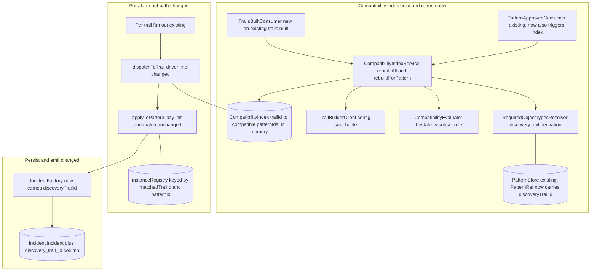
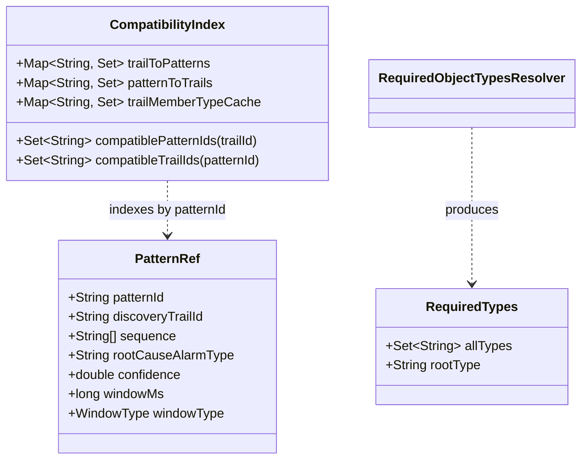
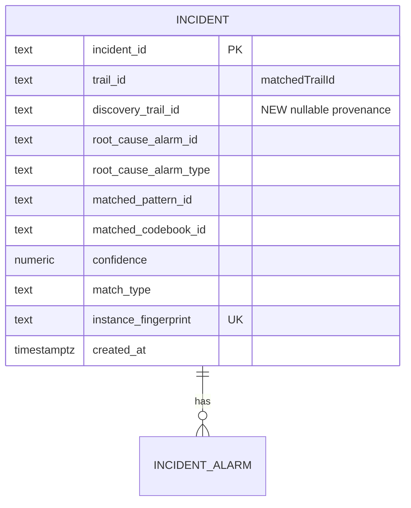
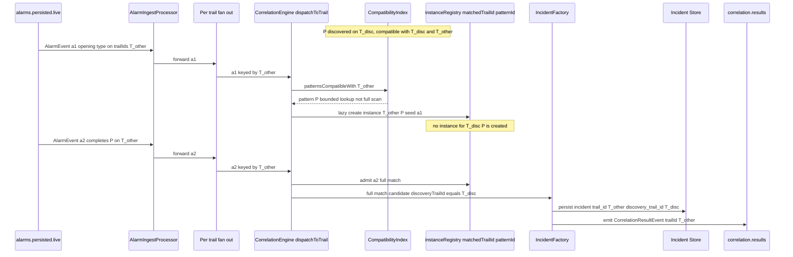
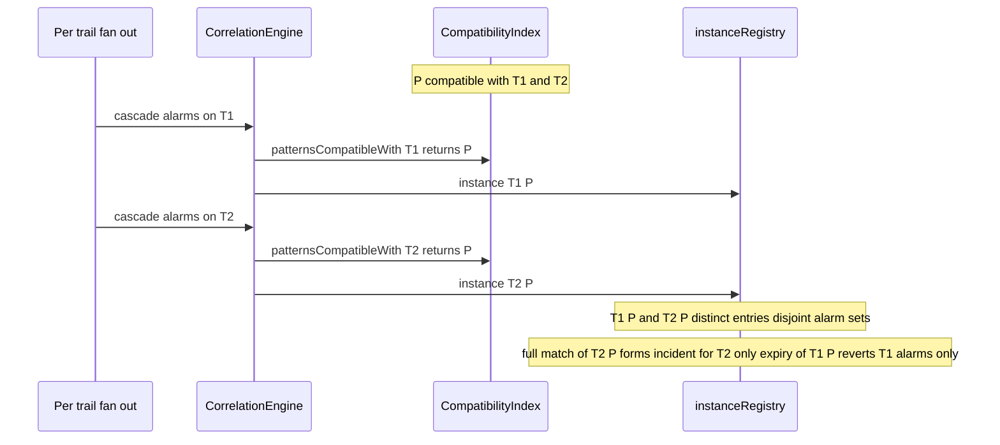
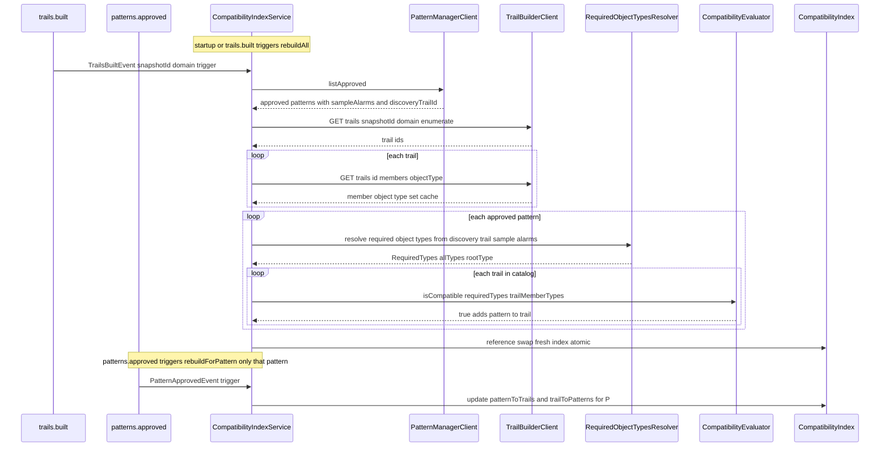
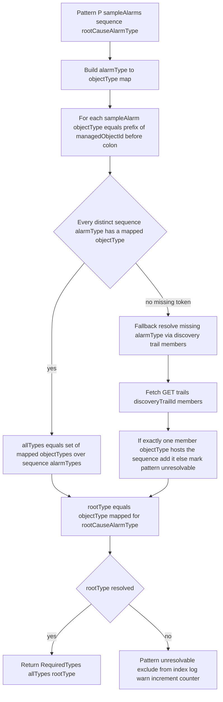

# correlation-engine — Pattern Generalization Design (Refinement)

> **Status:** Buildable refinement of `services/correlation-engine/design.md`.
> Realizes the approved (PR #385) `services/correlation-engine/spec-pattern-generalization.md`
> (AC31–AC45). This document details **only the delta** needed to make an approved pattern
> auto-correlate on **any structurally compatible trail** network-wide, not only its discovery
> trail. Every section of the base `design.md` that is not touched here is unchanged and remains
> authoritative (Incident Store schema, DLQ, idempotency, read API, codebook/conflict/RCA
> internals, Kafka wiring, in-memory instance registry).
>
> **Open questions are already resolved** (per the task brief — settled, not re-opened):
> - **OQ-G1** = hostability subset, area-agnostic; the ROOT alarm's objectType must be present.
>   No IGP-area / SRLG / topological-connectivity bounding.
> - **OQ-G2** = derive each sequence `alarmType`'s required `objectType` from the pattern's
>   **discovery-trail structure** — specifically from `PatternView.sampleAlarms[].managedObjectId`
>   prefix (which is exactly `TrailMember.objectType`), with the discovery-trail members as the
>   cross-check. **No** new Knowledge dependency, **no** affinity table, **no** contract change.
> - **OQ-G3** = Trail Builder `GET /trails?snapshotId&domain` (enumerate) +
>   `GET /trails/{trailId}` (members[].objectType), **batched at index-build**, config-switchable
>   mock/real.
> - **OQ-G4** = CE gains a **new consumer on the existing `trails.built` topic** (no schema
>   change) to refresh the compatibility index. Flagged for architecture-doc awareness below.
> - **OQ-G5/G6/G7/G8** = awareness / no change (see §Contract confirmation).
>
> **No contract change.** This design uses only existing surfaces: `CorrelationResultEvent.trailId`
> (already carries the trail; now always the matched trail — a clarification), the existing
> `PatternView` read model, the existing Trail Builder `GET /trails` + `GET /trails/{id}` API, and
> the existing `trails.built` / `TrailsBuiltEvent` topic (new **consumer**, not a new topic).
> `discoveryTrailId` is internal to CE's own Incident Store + read API. See §Contract confirmation.

---

## Stack

Unchanged from `design.md`: Java 17 (`eclipse-temurin:17-jdk`), Spring Boot 3.x, Gradle, JUnit 5,
Spring Kafka, Spring Web MVC + springdoc-openapi, PostgreSQL (owned `incident` schema) via Spring
Data JDBC + Flyway, Spring `RestClient` for outbound clients, Actuator + Micrometer/Prometheus,
Logback JSON. All licenses Apache-2.0 / MIT / EPL-2.0.

**Additions for this refinement (all permissive, all already in the stack):**

- A new outbound `RestClient` **Trail Builder client** (`TrailBuilderClient`, config-switchable
  mock/real), built against Trail Builder's published `openapi.json` — the same pattern as the
  existing `PatternManagerClient` / `CodebookGeneratorClient` / `KnowledgeClient`.
- A new **`CompatibilityIndex`** in-memory component (thread-safe `ConcurrentMap`s) — same class of
  low-churn, rebuildable reference state as `PatternStore`.
- A new **`TrailsBuiltConsumer`** (`@KafkaListener` on the existing `trails.built` topic).
- Unit tests mock Trail Builder with **WireMock / MockWebServer** stubs generated from Trail
  Builder's published `openapi.json` (`ListTrailsResponse`, `TrailDetail`). Testcontainers cover
  the persistence delta (`discoveryTrailId` column).

---

## Task breakdown (from the spec)

Every refinement Task in `spec-pattern-generalization.md § Tasks` is realized below and traceable
to modules/flows. Base-spec Tasks not restated in the refinement (2, 5, 6, 7, 8-emit, 9, 10) are
unchanged from `design.md` except where the refinement redefines them (Task 8 trailId semantics,
"Record discovery provenance").

| Spec task (refinement) | Realized by (modules / flow) |
|---|---|
| **Task 1 — REDEFINED:** load approved patterns with a network-wide compatibility index; record discovery `trailId` as provenance | `PatternRefreshService.bootstrap()`/`refreshOnApproval()` still fetch approved patterns via `PatternManagerClient.listApproved()` and upsert `PatternRef` (now carrying `discoveryTrailId` = `PatternView.trailId`) into `PatternStore`. **New:** after each refresh, `CompatibilityIndexService.rebuildForPattern(patternRef)` (single-pattern) resolves the pattern's **required objectType multiset** (Task 1a) and computes the pattern's compatible-trail set against the current trail catalog, writing it into the new `CompatibilityIndex`. Bootstrap does a full rebuild (`rebuildAll()`). |
| **Task 1a — NEW:** determine structural compatibility for a pattern | `RequiredObjectTypesResolver.resolve(patternRef)` derives, from the pattern's **discovery-trail structure**, the set of `objectType`s the pattern's `alarmType` sequence requires (see §Algorithm A — required-objectType resolution). `CompatibilityEvaluator.isCompatible(requiredTypes, rootType, trailMemberTypes)` applies the **hostability subset** rule (OQ-G1): a trail is compatible iff its member `objectType` set is a **superset** of the pattern's required `objectType` set, **and** contains the root alarm's `objectType`. Flat single-member hostability; no area/SRLG/connectivity check. |
| **Task 1b — NEW:** refresh the compatibility index on `trails.built` or pattern refresh | `TrailsBuiltConsumer` (new consumer on existing `trails.built`) triggers `CompatibilityIndexService.rebuildAll()` against the new snapshot's trail catalog (re-enumerate via `GET /trails?snapshotId&domain`, re-fetch members, recompute every pattern's compatible-trail set). `PatternApprovedConsumer` triggers `rebuildForPattern(P)` for just the changed pattern. A full rebuild also runs at startup. Rebuilds swap the index atomically (build a fresh map, then reference-swap) so per-alarm lookups never see a half-built index (bounded transition window). |
| **Task 3 — REDEFINED:** fan out incoming alarms using the generalized compatibility index | `CorrelationEngine.dispatchToTrail(alarm, T, now)` changes its **one driver line** from `patternStore.activePatternsOn(T)` (discovery-trail registry) to `compatibilityIndex.patternsCompatibleWith(T)` (compatibility index). Everything downstream (`applyToPattern`, lazy-init, incremental match, fire-and-destroy) is unchanged and keyed by `(matchedTrailId=T, patternId)`. |
| **Task 4 — UNCHANGED semantics, REDEFINED keying:** instance lifecycle keyed by `(matchedTrailId, patternId)` | The instance registry key is already `(trailId, patternId)` in `CorrelationEngine`; under generalization `trailId` = the **matched** trail T (from the alarm's `trailIds[]`), not the discovery trail. Because the same `patternId` can now be reached on many T, the same pattern naturally holds simultaneous independent instances — one per matched trail (AC34/AC45). No code change beyond the driver in Task 3; the `PatternRef` snapshot carried on each instance now also holds `discoveryTrailId` for provenance at fire time. |
| **Task 8 — CLARIFIED trailId semantics:** `CorrelationResultEvent.trailId = matchedTrailId` | `IncidentFactory` already sets `Incident.trailId` from `MatchCandidate.trailId`, which is `instance.trailId()` = the matched trail T. `CorrelationResultEmitter` emits `trailId = incident.trailId()`. Under generalization this is always the matched trail. **No schema change** — the field already exists and already carries the matched trail. |
| **Task NEW:** record discovery provenance on incidents | `PatternRef` gains `discoveryTrailId`; it flows onto `MatchCandidate` (new nullable field, null for codebook matches) then onto `Incident.discoveryTrailId` and the `incident.incident.discovery_trail_id` column. Served on the read API (`GET /incidents/{id}` and list items). **Not** added to `CorrelationResultEvent` (OQ-G6 — no contract change). |

---

## Phase applicability (design view)

Unchanged from the base: correlation-engine is **Idle / Idle / Active** (P1 / P2 / P3). The
generalization capability is entirely a **P3** concern, but with one nuance carried from the spec:
in **P2** the engine may already **consume `trails.built`** to warm the trail catalog / compatibility
index for future use — it performs **no correlation** in P2 (no live alarms, and in an empty
approved-pattern set the index is empty). This is state-warming only, consistent with how the base
design already lets P2 warm `PatternStore` / `CodebookStore`.

| Phase | Active/Passive/Idle | Modules/handlers exercised | Inputs/Outputs |
|---|---|---|---|
| P1 — Topology onboarding | **Idle** | None. `/health`, `/metrics` respond. No approved patterns, no trails, empty compatibility index. | — |
| P2 — Pattern learning | **Idle** (state-warming only) | `TrailsBuiltConsumer` + `CompatibilityIndexService` may warm the trail catalog and (if any patterns already approved) the compatibility index; `PatternApprovedConsumer` warms `PatternStore`. **No correlation** (no live alarms). | In (Kafka): `trails.built`, `patterns.approved`, `codebook.generated`; Calls (API): Trail Builder `GET /trails`, `GET /trails/{id}`, Pattern Manager. Out: — |
| P3 — Real-time correlation | **Active** | Full base pipeline **plus** the generalized fan-out: `CompatibilityIndex` drives `dispatchToTrail`; `TrailsBuiltConsumer` + `PatternApprovedConsumer` keep the index fresh; startup full rebuild. | In (Kafka): `alarms.persisted.live`, `patterns.approved`, `codebook.generated`, **`trails.built` (new)**. Out (Kafka): `correlation.results`, `alarms.status.changed`, `*.dlq`. Calls (API): Pattern Manager, Codebook Generator, Knowledge, **Trail Builder (new)**. Serves (API): `GET /incidents` (now with `discoveryTrailId`), `GET /incidents/{id}`, `GET /stats`. |

---

## Module breakdown (delta)

New/changed modules only (all base modules from `design.md` are unchanged and omitted).



| Module | New/changed | Responsibility |
|---|---|---|
| `TrailBuilderClient` (interface) + `RestTrailBuilderClient` / `MockTrailBuilderClient` | **New** | Config-switchable client for Trail Builder. `listTrailIds(snapshotId, domain)` (paged `GET /trails` -> `ListTrailsResponse.trails[].trailId`), `getTrailMemberTypes(trailId)` (`GET /trails/{id}` -> distinct set of `members[].objectType`). Built + mocked from Trail Builder `openapi.json`. Returns `Optional.empty()` / throws on fetch failure so the caller can skip (AC41). |
| `CompatibilityIndex` | **New** | In-memory index. Two `ConcurrentMap`s: `trailToPatterns : trailId -> Set<patternId>` (the **fan-out lookup**, mirrors `PatternStore.trailIndex`) and `patternToTrails : patternId -> Set<trailId>` (for the observability gauge + per-pattern rebuild). Reference-swappable for atomic rebuild. `patternsCompatibleWith(trailId)` returns the `PatternRef`s (resolved via `PatternStore`) for the index's `patternId`s on that trail. |
| `RequiredObjectTypesResolver` | **New** | Given a `PatternRef` + its discovery-trail structure, computes `RequiredTypes { Set<String> allTypes, String rootType }` — the objectType multiset the pattern needs and the root alarm's objectType (see §Algorithm A). |
| `CompatibilityEvaluator` | **New** | Pure function `isCompatible(RequiredTypes req, Set<String> trailMemberTypes)` = `trailMemberTypes.containsAll(req.allTypes) && trailMemberTypes.contains(req.rootType)`. The hostability-subset rule (OQ-G1). No hidden state; unit-testable in isolation. |
| `CompatibilityIndexService` | **New** | Orchestrates rebuilds. `rebuildAll()`: enumerate current-snapshot trails, fetch each trail's member types once, resolve each approved pattern's `RequiredTypes`, evaluate compatibility, build a fresh `CompatibilityIndex`, reference-swap. `rebuildForPattern(P)`: compute just P's compatible-trail set against the cached trail catalog and update the index for P only. Owns the retry/partial-failure model (AC41) and the observability counters. |
| `PatternStore` / `PatternRef` | **Changed** | `PatternRef` gains `discoveryTrailId` (= existing `trailId` value from `PatternView.trailId`; kept as a distinct accessor for provenance clarity). `PatternStore` continues to key by `patternId` for `RequiredObjectTypesResolver`. The **fan-out driver is now `CompatibilityIndex`**, not `PatternStore.trailIndex` (retained only as a fallback/backward-compat data source and for provenance). |
| `CorrelationEngine.dispatchToTrail` | **Changed (one line)** | Fan-out driver changes from `patternStore.activePatternsOn(trailId)` to `compatibilityIndex.patternsCompatibleWith(trailId)`. Rest of the hot path unchanged. |
| `IncidentFactory` / `MatchCandidate` / `Incident` | **Changed** | Carry `discoveryTrailId` through from the winning pattern instance to the persisted incident + read API. Null for codebook decodes. |
| `TrailsBuiltConsumer` | **New** | `@KafkaListener` on `trails.built`; dedupe on `eventId` (existing `processed_event` ledger, scope `trails.built`); on a new event, trigger `CompatibilityIndexService.rebuildAll()`. DLQ `trails.built.dlq` for poison. |

---

## Data model (delta)

### A. CompatibilityIndex — new in-memory reference state

Same class as `PatternStore.trailIndex`: **low-churn, rebuildable-from-source, in-memory**, no
durability requirement (it is a derived cache; on restart the startup `rebuildAll()` reconstructs it
from Trail Builder + Pattern Manager). No PostgreSQL involvement.

| Index | Backing | Key -> value | Purpose |
|---|---|---|---|
| `trailToPatterns` | `ConcurrentMap<String, Set<String>>` | `trailId` -> set of compatible `patternId` | **Per-alarm fan-out lookup (bounded, AC40).** Given alarm on trail T, one `get(T)` yields the compatible patterns to open/advance. O(1) map lookup; per-alarm cost = O(number of trailIds on the alarm × compatible patterns per trail), independent of total (pattern×trail) pairs. |
| `patternToTrails` | `ConcurrentMap<String, Set<String>>` | `patternId` -> set of compatible `trailId` | Per-pattern rebuild on `patterns.approved`; source of the `compatible_trails_per_pattern` gauge. |
| `trailMemberTypeCache` | `ConcurrentMap<String, Set<String>>` | `trailId` -> distinct member `objectType`s | Cached during `rebuildAll()` so `rebuildForPattern()` need not re-fetch all trails; refreshed wholesale on `trails.built`. |

**Atomic rebuild.** `rebuildAll()` builds a **fresh** `CompatibilityIndex` object (new maps) and
then reference-swaps the volatile field (`this.index = freshIndex`). In-flight per-alarm lookups
read either the old or the new fully-built index, never a half-built one — the bounded transition
window the spec requires (Non-functional / Refresh ordering). `rebuildForPattern(P)` mutates only
P's entry (add/remove P from the relevant `trailToPatterns` sets and replace `patternToTrails[P]`)
under a per-pattern lock; other patterns' lookups are unaffected.

**Ordering guarantee (correctness).** A `patterns.approved` refresh writes P into the index
**before** returning; a `patterns.approved` event is not acked until `rebuildForPattern(P)`
completes, so an approved pattern is never matchable before its compatible-trail set exists
(spec Refresh ordering). Likewise `trails.built` triggers `rebuildAll()` synchronously in the
listener before the offset is committed.



### B. Incident Store (PostgreSQL) — one new column

The owned `incident` schema is otherwise unchanged. One additive migration
(`V<n>__add_discovery_trail_id.sql`):

```sql
ALTER TABLE incident.incident ADD COLUMN discovery_trail_id text NULL;
```

| Column | Type | Notes |
|---|---|---|
| `discovery_trail_id` | `text NULL` | **New (Task NEW / AC44).** The discovery `trailId` of the matched pattern (provenance). `NULL` on codebook-decode incidents (no pattern discovery trail). Read-model/audit only — served on `GET /incidents/{id}` + list items, **never** on `CorrelationResultEvent`. Nullable + additive so existing rows and the frozen contract are unaffected. |

`instance_fingerprint` is unchanged: it hashes `(matchedTrailId, patternId, sorted alarmIds)` — the
matched trail already, so idempotency is per matched-trail occurrence (two trails firing the same
pattern get two distinct fingerprints -> two incidents, which is exactly AC34's intent).



---

## Event handling (delta)

### Consumers — one addition

| Topic | Handler | Payload (event-model) | Idempotency / dedupe | DLQ |
|---|---|---|---|---|
| **`trails.built`** (NEW consumer, existing topic) | `TrailsBuiltConsumer` | `TrailsBuiltEvent` (`snapshotId`, `trailIds[]`, `trailCount`, `domain`) — consumed as a **trigger** only; the payload's `trailIds[]` is a hint, but `rebuildAll()` authoritatively re-enumerates via `GET /trails?snapshotId&domain` | `eventId` (`processed_event` ledger, scope `trails.built`) | `trails.built.dlq` |

- **Consumer group id:** `correlation-engine-trails.built` (platform `"<service>-<topic>"` convention,
  per OQ-G4).
- **No schema change** to `trails.built` / `TrailsBuiltEvent`. This is a **new consumer on an
  existing topic** — flagged for architecture-doc awareness, not a contract change (see §Contract
  confirmation).
- `patterns.approved` (existing consumer) is extended: after `PatternRefreshService.refreshOnApproval()`
  it calls `CompatibilityIndexService.rebuildForPattern(P)` for each changed approved pattern before
  ack.

### Producers — unchanged

`correlation.results` (`CorrelationResultEvent`) and `alarms.status.changed` (`AlarmStatusChange`)
are emitted unchanged. `CorrelationResultEvent.trailId` = matched trail (clarification, not a schema
change). `discoveryTrailId` is **not** on either produced event.

---

## API contracts / API schema (delta)

No new operations. Two existing read-API responses gain one **additive, nullable** field:

- `GET /incidents/{incidentId}` and each item of `GET /incidents` -> `IncidentView` gains
  `discoveryTrailId` (string, nullable) — the provenance trail (AC44). `trailId` continues to be the
  matched trail.

`200 OK` incident item (delta shown):
```json
{
  "incidentId": "INC-...",
  "trailId": "TRAIL-Tmatch",
  "discoveryTrailId": "TRAIL-Tdisc",
  "rootCauseAlarmId": "ALM-...",
  "rootCauseAlarmType": "LOS",
  "childAlarmIds": ["ALM-..."],
  "matchedPatternId": "PAT-...",
  "matchedCodebookId": null,
  "confidence": 0.91,
  "createdAt": "2026-07-04T12:00:00Z"
}
```

springdoc regenerates `openapi.json`; the checked-in `services/correlation-engine/openapi.json` is
updated to include the additive nullable `discoveryTrailId` on `IncidentView`. `OpenApiContractTest`
guards it. This is a **read-API field only** — no Kafka topic/payload/`libs/event-model` change.

---

## Integration points (mock vs. real) — one addition

| Collaborator | Operation used | Config key(s) | Mock / real |
|---|---|---|---|
| **Trail Builder (NEW)** | `GET /trails?snapshotId={s}&domain={d}&limit&offset` -> `ListTrailsResponse{snapshotId,domain,count,trails[TrailSummary{trailId,domain,memberCount,igpArea?,srlgGroup?}]}` (enumerate trails for a snapshot/domain); `GET /trails/{trailId}` -> `TrailDetail{trailId,domain,snapshotId,members[TrailMember{managedObjectId,objectType}],memberCount}` (member object types for compatibility). Both **frozen** in Trail Builder's published `openapi.json`; CE builds its client + mock against that document. Called at **index-build time** (startup, `patterns.approved`, `trails.built`) — **never per-alarm**. | `TRAIL_BUILDER_BASE_URL`, `TRAIL_BUILDER_MODE` (`mock`/`real`; may also honour the global `INTEGRATION_MODE`) | **Mock:** WireMock/MockWebServer stub generated from Trail Builder `openapi.json` (`ListTrailsResponse` + `TrailDetail`). **Real:** compose `trail-builder`. No hard-coded URL. |

The existing Pattern Manager / Codebook Generator / Knowledge integration points are unchanged.
`igpArea` / `srlgGroup` on the trail summaries are **ignored** by the compatibility rule (OQ-G1
area-agnostic) — read but not used, so a future area-bounded rule (post-MVP OQ-G1(c)) needs no
contract change.

---

## Key flows (sequence / data-flow diagrams)

### Flow G1 — Generalized dispatch: an alarm on a non-discovery compatible trail (AC31/AC36/AC43)



### Flow G2 — Same pattern, two trails, simultaneous independent incidents (AC34/AC45)



### Flow G3 — Compatibility index build and refresh (Task 1, 1a, 1b)



---

## Algorithm logical flow

### Algorithm A — required-objectType resolution from the discovery trail (OQ-G2, Task 1a)

**Goal:** for an approved pattern P, produce `RequiredTypes { allTypes, rootType }` — the set of
`objectType`s the pattern's `alarmType` sequence needs a trail to host, and the root alarm's
`objectType` — **without any affinity table, Knowledge dependency, or contract change**, by reading
it off the trail that already hosted the cascade (the discovery trail).

**Inputs (all from existing surfaces):**
- `PatternView.sequence[]` = the ordered `alarmType` tokens (`{alarmType, optional}`).
- `PatternView.rootCauseAlarmType` = the root `alarmType`.
- `PatternView.sampleAlarms[]` = `{alarmType, managedObjectId, ...}` from the discovery-trail
  occurrence — the **direct** `alarmType -> objectType` witness.
- `PatternView.trailId` = the discovery trail (fallback cross-check via Trail Builder members).

**objectType derivation rule (OQ-G2):** an alarm's objectType = the **prefix** of its
`managedObjectId` (`"<objectType>:<id>"`, per `libs/event-model/common/managedObjectId.schema.json`,
`^[A-Za-z][A-Za-z0-9]*:[^:]+$`). This is exactly Trail Builder's `TrailMember.objectType` scheme, so
the pattern's required types and a trail's member types are in **one shared vocabulary** — no
mapping layer.



**Step detail:**
1. Build `alarmType -> objectType` from `sampleAlarms[]`: for each sample, `objectType =
   substringBefore(managedObjectId, ":")`; index by the sample's `alarmType`. (Multiple samples for
   one alarmType agree by construction; take the first / assert equality.)
2. `allTypes` = `{ map[t] : t in distinct(sequence.alarmType) }` — the objectType multiset the
   sequence needs (collapsed to a set for the hostability-subset rule; OQ-G1(d) chose single-member
   hostability, so a set is sufficient).
3. `rootType` = `map[rootCauseAlarmType]` — the root alarm's objectType (OQ-G1: root must be
   present in a compatible trail; the cascade must originate there).
4. **Fallback (robustness, rarely needed):** if a sequence `alarmType` has **no** sample witness,
   resolve it from the discovery trail's member object types (`GET /trails/{discoveryTrailId}`): the
   discovery trail **did** host the pattern, so its member `objectType` set is the superset of the
   pattern's required types. If the missing type cannot be uniquely attributed, mark the pattern
   **unresolvable**, **exclude it from the index** (fail safe — no false-positive matches), log a
   warning, and increment a counter. It is never guessed.
5. This resolution runs **once per pattern at approval/refresh time**, not per alarm and not per
   trail — its output `RequiredTypes` is cached on the `PatternRef`.

### Algorithm B — hostability-subset compatibility (OQ-G1, Task 1a)

Pure predicate, evaluated per (pattern, trail) pair at index-build time:

```
isCompatible(RequiredTypes req, Set<String> trailMemberTypes) :=
        trailMemberTypes.containsAll(req.allTypes)     // trail can host every required object type
     && trailMemberTypes.contains(req.rootType)        // and can host the root (cascade origin)
```

- **No** IGP-area bounding, **no** SRLG bounding, **no** topological-connectivity check (OQ-G1:
  patterns generalize anywhere in the network). `req.rootType ∈ req.allTypes` already, so the second
  clause is technically implied — it is stated explicitly for intent/testability and to keep the
  root requirement obvious if the rule is later relaxed.
- **Discovery trail is trivially compatible (AC33):** the discovery trail hosted the cascade, so its
  member types ⊇ `req.allTypes` and include `req.rootType` by construction — it always passes,
  preserving single-trail behavior as a special case.

### Algorithm C — per-alarm generalized dispatch (Task 3, AC40)

The **only** hot-path change. Complexity is bounded and independent of total (pattern×trail) pairs:

```
onAlarm(alarm, trailIds, now):
  dedupe alarm.alarmId (unchanged)
  for T in trailIds:                                   // O(|trailIds|), typically 1-2
      compatible = compatibilityIndex.patternsCompatibleWith(T)   // O(1) map lookup + set
      for P in compatible:                             // O(compatible patterns on T)
          applyToPattern(alarm, T, P, now)             // unchanged lazy-init / match
```

- Per-alarm cost = `O(|trailIds| × maxCompatiblePatternsPerTrail)` — a **bounded index lookup**, not
  `O(N patterns × M trails)`. AC40's large-index test asserts latency does not scale with total
  index size.
- Everything after the driver line (`applyToPattern`, `evaluateFullMatch`, `fireIncident`,
  `expireDueInstances`, RCA, conflict resolution) is **identical to `design.md`** — RCA is still the
  `rootCauseAlarmType -> alarmType` join over the matched alarms on the matched trail (unchanged per
  occurrence).

### Refresh / partial-failure model (AC41)

- `rebuildAll()` fetches each trail's members once. A trail whose `GET /trails/{id}` **fails**
  (5xx / timeout after bounded retry, or 404) is **omitted** from `trailMemberTypeCache` and
  therefore appears in **no** pattern's compatible set — it is **absent** from the index (not
  wrongly included, not wrongly excluded-with-corruption). Alarms on that trail simply match no
  generalized pattern until a later successful rebuild (conservative safe default; no false-positive
  incidents). `trail_builder_fetch_errors_total` increments.
- Bounded retry: a small fixed retry (config `TRAIL_BUILDER_MAX_RETRIES`, default e.g. 2) with
  backoff per trail; on exhaustion, skip that trail and continue (the rebuild never crashes and never
  yields a silently-empty index for the healthy trails).
- The enumerate call (`GET /trails`) failing entirely means no new catalog this cycle — the previous
  index is **retained** (reference-swap only happens on a successful build), so the engine keeps
  matching on the last-good index (graceful degradation, no corruption).

---

## Error handling (delta)

| Failure mode | Handling |
|---|---|
| Poison `trails.built` message (unparseable / unknown major `schemaVersion`) | Routed to `trails.built.dlq` with error headers; consumer commits past it and continues (same as other consumers, AC19 pattern). Never silently dropped. |
| Trail Builder `GET /trails/{id}` fails for a trail (5xx/timeout/404) | Bounded retry, then **omit that trail** from the index; `trail_builder_fetch_errors_total`++. No corruption, no false positives (AC41). |
| Trail Builder enumerate (`GET /trails`) fails entirely | Abort this rebuild without swapping; retain the last-good index (degrade gracefully). |
| Pattern with an **unresolvable** required objectType (no sample witness + ambiguous discovery-trail fallback) | Exclude the pattern from the index; log warn; `pattern_required_types_unresolved_total`++. The pattern simply does not generalize until data allows resolution — never a guessed/false match. |
| `patterns.approved` refresh fails | Existing behavior retained: prior placements kept; index not updated for that pattern (graceful degradation). |
| Duplicate `trails.built` / `patterns.approved` (redelivery) | `eventId` dedupe via `processed_event`; a redelivered trigger is a no-op (rebuild is idempotent anyway — it converges to the same index). |
| Index rebuild racing per-alarm dispatch | Atomic reference-swap: lookups see old-or-new fully-built index, never partial. Per-pattern updates are per-pattern-locked. |

All other failure modes (DLQ for alarms/patterns/codebook, schemaVersion rejection, validation,
idempotency, algorithm no-match) are unchanged from `design.md`.

---

## Design alternatives

| Consideration | Alternatives considered | Chosen + rationale |
|---|---|---|
| Structural-compatibility rule (OQ-G1) | (a) **hostability subset, area-agnostic, root-present**; (b) hostability + IGP-area bounding; (c) hostability + topological connectivity of required members; (d) multiset hostability (member count ≥ alarm count per type) | **(a) — RESOLVED (settled).** The user's intent is that a learned signature generalizes **anywhere** in the network; area/SRLG/connectivity bounding would re-narrow it. Simple, observable, MVP-right. Root-present makes the cascade able to originate on the trail. (b)/(c) are post-MVP extensibility (OQ-G1 b/c); (d) rejected — single-member hostability is sufficient and cheaper (OQ-G1 d). |
| alarmType -> objectType affinity source (OQ-G2) | (a) new Knowledge endpoint / affinity table; (b) new `objectType` field on `PatternView`; (c) **derive from the pattern's discovery-trail structure — `sampleAlarms[].managedObjectId` prefix, discovery-trail members as fallback** | **(c) — RESOLVED (settled).** No contract change, no new dependency: `managedObjectId` already encodes objectType as its prefix, in the same vocabulary as `TrailMember.objectType`. The discovery trail already hosted the pattern, so it is an authoritative witness. (a)/(b) are contract changes; avoided. |
| Per-trail structure source & timing (OQ-G3) | (a) **batch `GET /trails` + `GET /trails/{id}` at index-build**; (b) eager full-catalog cache on every `trails.built`; (c) on-demand fetch per alarm | **(a) — RESOLVED (settled).** Batch at index-build keeps the per-alarm path a bounded index lookup (AC40) and the fetch cost off the hot path. (c) violates AC40 (per-alarm latency, non-precomputed). (b) is essentially (a) plus caching the whole catalog — adopted as the `trailMemberTypeCache` optimization within (a). |
| Index driver location | (a) extend `PatternStore.trailIndex` to hold compatible trails; (b) **new dedicated `CompatibilityIndex` component**, `PatternStore` keeps discovery-trail placement for provenance | **(b)** — separation of concerns: `PatternStore` = approved-pattern reference (single owner of pattern refs); `CompatibilityIndex` = derived compatibility cache with its own rebuild/atomic-swap lifecycle and observability. Keeps the base `PatternStore` behavior intact for backward compat and provenance; the change to `dispatchToTrail` is a one-line driver swap. |
| Index refresh granularity | (a) full `rebuildAll()` on every trigger; (b) **`rebuildAll()` on `trails.built`/startup, `rebuildForPattern()` on `patterns.approved`** | **(b)** — a topology change can affect every pattern (full rebuild justified); a single new/updated pattern only needs its own compatible-set computed against the cached catalog (cheap, bounded, no re-fetch). Matches spec Task 1b exactly. |
| Rebuild concurrency vs per-alarm dispatch | (a) lock the whole index during rebuild (blocks dispatch); (b) **build fresh + atomic reference-swap** | **(b)** — dispatch never blocks on a rebuild beyond a volatile read; the transition window is bounded (spec Non-functional). (a) would stall the hot path for the duration of a full catalog fetch. |
| Trail Builder fetch failure handling (AC41) | (a) fail the whole rebuild on any trail error; (b) **omit the failing trail, continue**; (c) treat a failing trail as compatible-with-all (fail open) | **(b)** — a single trail's fetch failure must not corrupt the index or halt matching on healthy trails; the failing trail is simply absent (conservative — no false positives). (a) is brittle (one bad trail blocks everything); (c) is dangerous (false-positive incidents). |
| `discoveryTrailId` placement (OQ-G6) | (a) add to `CorrelationResultEvent`; (b) **Incident Store column + read API only** | **(b) — RESOLVED (settled).** No downstream consumer of `correlation.results` needs the discovery trail for MVP; adding it to the event is a contract change. Provenance lives in CE's own store + read API — internal, no contract change. |
| Codebook decode generalization (OQ-G7) | (a) also generalize codebook scenarios across compatible trails; (b) **leave codebook path per-trailId (unchanged)** | **(b) — RESOLVED (settled).** Generalizing codebook decode needs the Codebook Generator to emit trail-generic scenarios — a contract change, out of MVP scope. The codebook path stays as `design.md` has it. |

---

## Test plan

### Acceptance criterion -> test (unit/contract, JUnit 5)

Every AC31–AC45 maps 1:1 to a named JUnit 5 test. Compatibility-index and dispatch tests mock Trail
Builder with a WireMock/MockWebServer stub generated from Trail Builder's published `openapi.json`
(`ListTrailsResponse` + `TrailDetail`). Persistence-touching assertions (AC44) also run against
Testcontainers PostgreSQL. AC-level tests drive `CorrelationEngine` / `CompatibilityIndexService`
directly and advance an injectable `Clock` for expiry, exactly as the base lifecycle tests do.

| # | Acceptance criterion | Test (JUnit 5) | Asserts |
|---|---|---|---|
| 31 | Generalized pattern matches on a non-discovery trail | `GeneralizedMatchTest#patternMatchesOnCompatibleNonDiscoveryTrail` | P discovered on `T_disc`, compatible with `T_other` (mocked `TrailDetail` for `T_other` has all required objectTypes incl. root); full sequence on `T_other` creates instance `(T_other,P)`, full-matches, emits `CorrelationResultEvent` with `trailId=T_other`, `matchedPatternId=P`; **no** instance/incident for `(T_disc,P)`. |
| 32 | Incompatible trail is not a candidate | `IncompatibleTrailTest#trailMissingRequiredObjectTypeIsNotCandidate` | P requires `{A,B,C}`; `T_incompat` members mock `{A,B}` (no C); alarms on `T_incompat` create **no** `(T_incompat,P)` instance; `patternsCompatibleWith(T_incompat)` excludes P. |
| 33 | Discovery trail remains compatible (backward compatibility) | `DiscoveryTrailBackwardCompatTest#discoveryTrailIsAlwaysCompatible` | P's discovery trail `T_disc` is in P's compatible set (its member types ⊇ required incl. root); full sequence on `T_disc` fires an incident with `trailId=T_disc`. |
| 34 | Same pattern, simultaneous independent instances on two trails | `SimultaneousInstancesTest#samePatternTwoTrailsTwoDisjointIncidents` | P compatible with `T1` and `T2`; two concurrent cascades produce instances `(T1,P)` and `(T2,P)`, two `CorrelationResultEvent`s (`trailId=T1`, `trailId=T2`); `childAlarmIds[]` disjoint; no alarm in both. |
| 35 | Instance key is the matched trail, not the discovery trail | `InstanceKeyMatchedTrailTest#keyAndRecordUseMatchedTrailAndProvenanceDiscovery` | Cascade for P (discovery `T_disc`) on `T_match ≠ T_disc`: emitted `CorrelationResultEvent.trailId=T_match`; incident record has `matchedTrailId(trail_id)=T_match` **and** `discoveryTrailId=T_disc`. |
| 36 | Compatibility index consulted, not discovery registry | `CompatibilityIndexDrivenTest#dispatchUsesIndexNotDiscoveryRegistry` | With P compatible with `{T_disc, T_other}`, an alarm on `T_other` dispatches to `(T_other,P)`. Then mock `TrailDetail` for `T_disc` so it becomes **incompatible** and rebuild: alarms on `T_disc` no longer dispatch to P, `T_other` still active — proving the index (not a `T_disc`-keyed registry) drives dispatch. |
| 37 | Index rebuilt on `trails.built` | `IndexRebuildOnTrailsBuiltTest#trailsBuiltRecomputesCompatibleSet` | P compatible with `{T1,T2}`; a `trails.built` event for a snapshot where `T2` is gone (404 / empty members) and a new compatible `T3` exists triggers `rebuildAll()`; after: P compatible with `{T1,T3}`; cascade on `T2` opens no `(T2,P)`; cascade on `T3` opens `(T3,P)`. |
| 38 | Index updated on pattern approval | `IndexUpdateOnApprovalTest#approvedPatternGetsCompatibleSetBeforeMatchable` | Empty approved set; catalog `{T1 compatible, T2 incompatible}` with `P_new`; a `patterns.approved` event triggers `listApproved()` + `rebuildForPattern(P_new)`; afterwards alarms on `T1` dispatch to `(T1,P_new)`, alarms on `T2` do not; P_new is not matchable before its set is written. |
| 39 | affinity drives compatibility — no hard-coded mapping | `AffinityDrivenCompatibilityTest#objectTypesFromSampleAlarmPrefixesNoHardCoding` | Trail Builder mock + `PatternView.sampleAlarms[].managedObjectId` use **non-default** objectType tokens (e.g. `WidgetX:...`); the resolver derives required types from the `managedObjectId` prefixes; trails with matching members are compatible, others not — with **no** code change and no literal objectType in the engine. |
| 40 | Compatibility precomputed — per-alarm dispatch is bounded | `BoundedDispatchTest#perAlarmLookupDoesNotScaleWithIndexSize` | With a large mocked index (N patterns × M trails), per-alarm dispatch performs a single `patternsCompatibleWith(T)` map lookup returning only T's compatible patterns; a spy/counter asserts no full (pattern×trail) scan occurs per alarm and dispatch work is `O(|trailIds|×compatiblePerTrail)`, independent of total index size. |
| 41 | Trail Builder fetch failure does not corrupt the index | `FetchFailureIsolationTest#failingTrailIsAbsentIndexStaysHealthy` | Trail Builder mock returns 500 for `T_fail`, 200 for others; after `rebuildAll()`, `T_fail` is in **no** pattern's compatible set (absent, not wrongly compatible/incompatible); alarms on `T_fail` open no instance; alarms on healthy trails still correlate; `trail_builder_fetch_errors_total` incremented. |
| 42 | Trail Builder integration point is config-switchable | `TrailBuilderModeTest#mockAndRealModesExerciseSamePath` | With `TRAIL_BUILDER_MODE=mock`, the full index-build/compatibility/refresh path runs with no live Trail Builder (WireMock from `openapi.json`); with `TRAIL_BUILDER_MODE=real` the client resolves `TRAIL_BUILDER_BASE_URL`; the same `CompatibilityIndexService` code path is exercised in both; no hard-coded URL. |
| 43 | `CorrelationResultEvent.trailId` = matched trail, not discovery | `ResultTrailIdIsMatchedTrailTest#eventTrailIdEqualsMatchedTrail` | Seed discovery `T_disc ≠ matched `T_match`; every emitted `CorrelationResultEvent.trailId` equals `T_match` (the trail the winning cascade was drawn from), never `T_disc`. |
| 44 | Incident record carries both matchedTrailId and discoveryTrailId | `IncidentProvenanceFieldsTest#getIncidentReturnsMatchedAndDiscoveryTrail` (unit) + `DiscoveryTrailColumnIT` (Testcontainers) | `GET /incidents/{id}` for P (discovery `T_disc`, matched `T_match`) returns `trailId=T_match` **and** `discoveryTrailId=T_disc`; `discoveryTrailId` is a read-API field (present in `openapi.json` `IncidentView`) and **not** on `CorrelationResultEvent`. IT asserts the `incident.incident.discovery_trail_id` column persists and round-trips. |
| 45 | Simultaneous instances of the same pattern don't interfere | `NonInterferenceTest#expiryAndFullMatchIsolatedAcrossTrails` | With `(T1,P)` and `(T2,P)` both in-progress: expiry of `(T1,P)` fires `AlarmStatusChange(reverted-open)` only for `(T1,P)` alarms; full match of `(T2,P)` creates an incident for `T2` only; neither lifecycle event touches the other instance's alarm set. |

### Schema-migration / DB-placement test (Testcontainers PostgreSQL)

| # | What it guards | Test | Asserts |
|---|---|---|---|
| SG1 | `discovery_trail_id` column added additively to `incident.incident` | `DiscoveryTrailMigrationTest#test_discovery_trail_id_column_nullable` | After Flyway runs, `incident.incident` has a nullable `discovery_trail_id text` column; existing rows (pre-migration) tolerate NULL; the column persists and reads back. |

### E2E scenarios (from this design unit's point of view)

Service-scoped end-to-end paths the integration stage exercises (real Kafka + PostgreSQL via
Testcontainers/Compose; Trail Builder + Pattern Manager real in `real` mode, WireMock in CI).

| # | Scenario | Trigger -> path | Expected outcome |
|---|---|---|---|
| G1 | Generalize onto a non-discovery trail | Approve P (discovery `T_disc`); build index; replay P's cascade on a compatible `T_other` on `alarms.persisted.live` | One incident with `trailId=T_other`, `discoveryTrailId=T_disc`, correct root cause; no incident on `T_disc`. |
| G2 | Network-wide fan-out — one signature, many incidents | P compatible with `T1..Tk`; replay k simultaneous cascades | k independent incidents, one per trail, disjoint alarm sets (AC34/AC45 at scale — the intended OQ-G5 behavior). |
| G3 | Topology change refreshes the index | Emit `trails.built` for a new snapshot (a trail removed, a new compatible one added); then replay cascades on removed vs new trail | Removed trail no longer matches; new trail matches — index converged to the new catalog (AC37). |
| G4 | New pattern approval generalizes immediately | Approve a new pattern in Pattern Manager (fires `patterns.approved`); replay its cascade on a different compatible trail | The pattern matches on the compatible trail without a restart — `rebuildForPattern` ran before the event acked (AC38). |
| G5 | Trail Builder partial failure (failure path) | Trail Builder returns 5xx for one trail during rebuild; replay cascades on the failing trail and on healthy trails | Failing trail absent from the index (no false-positive incident); healthy trails still correlate; engine stays healthy; `trail_builder_fetch_errors_total` increments (AC41). |
| G6 | Backward compatibility (discovery-trail-only cascade) | Approve P; replay P's cascade only on its discovery trail `T_disc` | Exactly the base single-trail behavior: one incident with `trailId=T_disc`; discovery trail treated as any compatible trail (AC33). |
| G7 | Poison `trails.built` (failure path) | Send an unparseable `trails.built` message then a valid one | Poison in `trails.built.dlq`; the valid event triggers a successful rebuild; pipeline never halts. |
| G8 | Config-switchable Trail Builder (mock vs real) | Run the index-build path in `mock` (WireMock from Trail Builder `openapi.json`) and in `real` (compose `trail-builder`) | Identical compatibility results; no hard-coded URL; same code path (AC42). |

---

## Config & observability (delta)

**New env / config keys:**
- `TRAIL_BUILDER_BASE_URL` — Trail Builder base URL (no hard-coded default).
- `TRAIL_BUILDER_MODE` (`mock`/`real`; may fall back to the global `INTEGRATION_MODE`).
- `TRAIL_BUILDER_MAX_RETRIES` (default e.g. 2) — bounded per-trail fetch retry (AC41).
- `KAFKA_CONSUMER_GROUP_ID` for the new consumer is `correlation-engine-trails.built`
  (platform convention).

**No threshold values in config** — the compatibility rule is fixed engine behaviour (OQ-G1 is a
fixed MVP rule, not Knowledge policy); the objectType affinity is **derived**, never authored or
hard-coded (AC39).

**New observability (spec § Observability additions):**
- `compatible_trails_per_pattern` — gauge, per-pattern compatible-trail-set size (generalization
  breadth). Sourced from `CompatibilityIndex.patternToTrails`.
- `pattern_generalization_index_refresh_total` — counter, index refreshes triggered by
  `patterns.approved` or `trails.built` (labelled by trigger).
- `trail_builder_fetch_errors_total` — counter, Trail Builder fetch failures during index build.
- `pattern_required_types_unresolved_total` — counter, patterns excluded because required objectTypes
  could not be resolved (Algorithm A step 4).
- `/health` readiness additionally reflects "compatibility index built at least once" so the engine
  is not marked ready before it can generalize (startup `rebuildAll()` succeeded).

All base metrics (`incidents_created_total`, `alarms_processed_total`, `correlated_alarms_total`,
etc.) are unchanged.

---

## Build & run (delta)

- **Build:** `./gradlew build` — compiles, runs JUnit 5 unit/contract tests (incl. AC31–45 +
  SG1), regenerates `openapi.json` and checks it against the checked-in one (now with the additive
  `discoveryTrailId` on `IncidentView`).
- **Migration:** one additive Flyway migration adds `incident.incident.discovery_trail_id`
  (nullable) — applied on startup into the `incident` schema, `public` stays empty.
- **Compose:** the `correlation-engine` service gains `depends_on: trail-builder` and env
  `TRAIL_BUILDER_BASE_URL` / `TRAIL_BUILDER_MODE`, and subscribes to the existing `trails.built`
  topic under group `correlation-engine-trails.built`. No new topic, no new volume (the
  `CompatibilityIndex` is in-memory, rebuilt at startup).
- **README:** documents the new Trail Builder integration point, the new `trails.built` consumer,
  the compatibility index + its refresh triggers, and the new config keys/metrics.

---

## Contract confirmation (invariants + contract-change check)

**No contract change.** Verified against `libs/event-model` and the collaborators' published
`openapi.json`:

| Surface used | Existing? | Evidence |
|---|---|---|
| `CorrelationResultEvent.trailId` = matched trail | **Existing field** | Already present + already carries the incident's trail; generalization only clarifies it is always the matched trail. No schema change. |
| `PatternView` (`sequence[]`, `rootCauseAlarmType`, `trailId`, `sampleAlarms[].{alarmType,managedObjectId}`) | **Existing read model** | Pattern Manager `openapi.json` — `SampleAlarmView` already carries `alarmType` + `managedObjectId`; used to derive objectType affinity (OQ-G2). No new field. |
| Trail Builder `GET /trails?snapshotId&domain`, `GET /trails/{id}` (`TrailDetail.members[].objectType`) | **Existing, frozen API** | Trail Builder `openapi.json` — `ListTrailsResponse` + `TrailDetail` + `TrailMember{managedObjectId,objectType}`. New **consumer** of an existing API; no API change. |
| `trails.built` / `TrailsBuiltEvent` | **Existing topic + payload** | `libs/event-model` `TrailsBuiltEvent.schema.json` (`snapshotId, domain, trailIds, trailCount`) + `docs/architecture.md`. New **consumer on an existing topic** — flagged for architecture-doc awareness (OQ-G4), **not** a contract change (no new topic/payload/field). |
| `discoveryTrailId` | **Internal to CE** | New nullable column in CE's owned `incident` schema + read-API field only. **Not** on `CorrelationResultEvent` (OQ-G6). No `libs/event-model` change. |

**Invariants honoured:** contract-first (depends only on `libs/event-model` + published topic/API
contracts, never another service's code); single owners (CE owns incidents + the compatibility
index; Trail Builder remains the single owner of trail structure — CE only reads it via the API;
Pattern Manager remains the single owner of pattern state); idempotency (`alarmId` / `eventId`
dedupe unchanged; `instance_fingerprint` per matched-trail occurrence); DLQ for the new `trails.built`
consumer; `/health` + `/metrics` extended; permissive licenses only.

**Architecture-doc awareness (OQ-G4 — not a contract change, no separate PR required):** the
correlation-engine row in `docs/architecture.md` currently lists its consumed topics as
`alarms.persisted.live, patterns.approved, codebook.generated`. Adding `trails.built` as a **new
consumer on an existing topic** is a new dependency but introduces **no new topic, payload, or
field**. Per the resolved decision (OQ-G4) this is noted for human awareness in the design; if the
reviewer wants the architecture-doc consumed-topics list updated to reflect the new consumption, that
is a doc edit (not a frozen-contract change) and can accompany the build. **Nothing here requires a
contract-change PR into `main`.** No new field/topic/payload is designed in; had one been required,
it would have been STOPPED and flagged rather than designed around.
