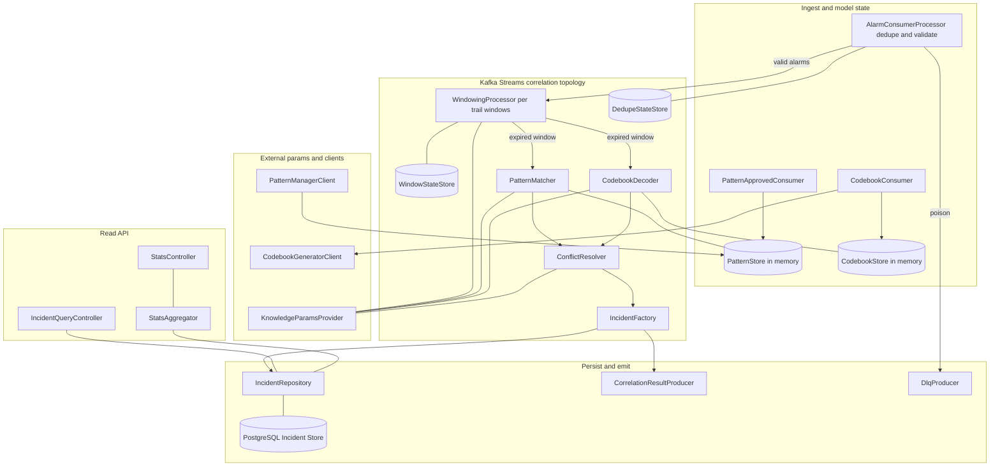
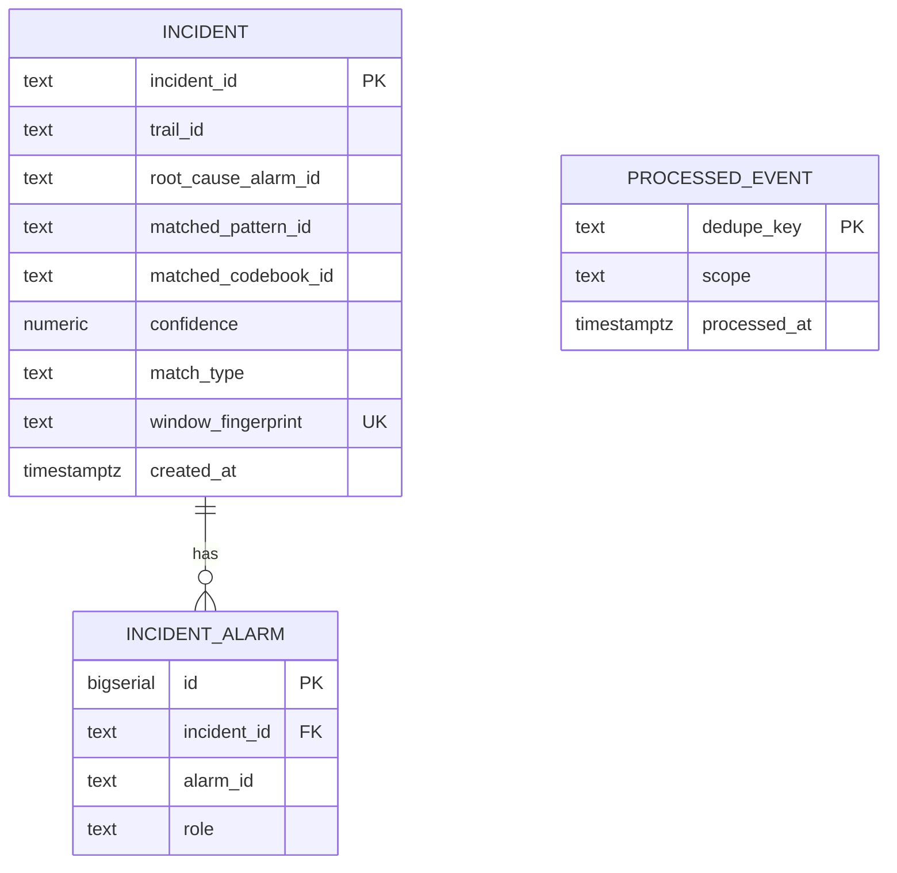
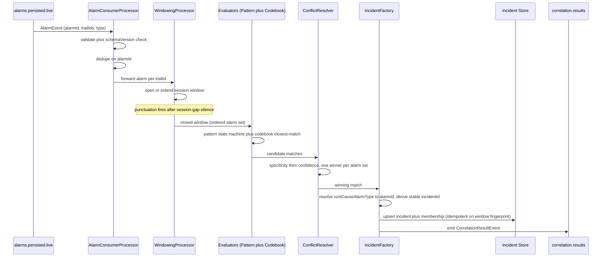
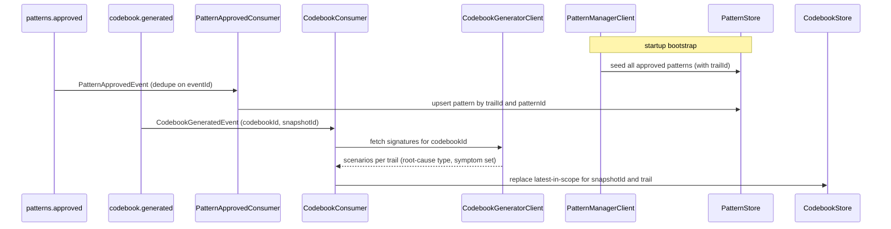
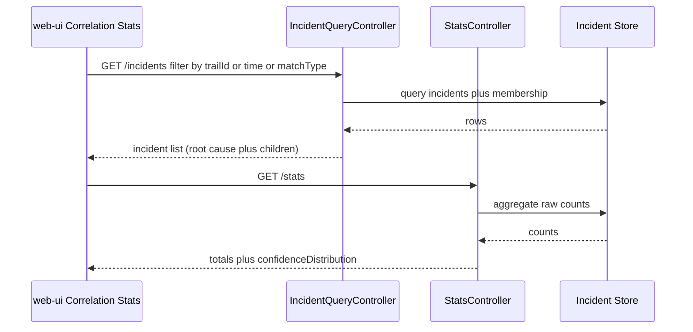
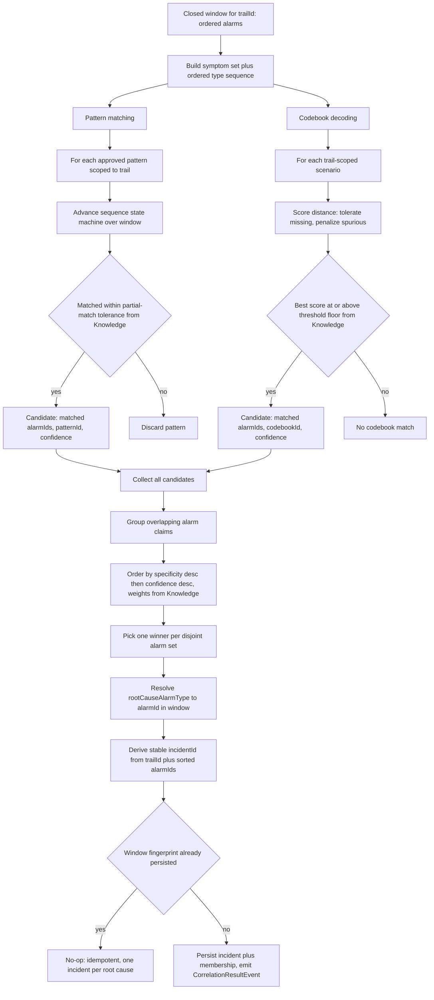

# correlation-engine — Design

Buildable design for the Correlation Engine — the real-time correlation core and **system of
record for incidents** (P3). It consumes live persisted alarms, matches them statefully against
approved patterns + the latest codebook (both sourced from upstream model producers), tags one
root-cause alarm and child alarms per winning match, persists incidents to the Incident Store
(PostgreSQL), and emits `CorrelationResultEvent` on `correlation.results`. It serves a read API
for the web-ui Correlation Stats module.

This design realizes the approved `services/correlation-engine/spec.md`. It introduces **no new
topic, payload, or field** — the contract (`alarms.persisted.live`, `patterns.approved`,
`codebook.generated` in; `correlation.results` out; the four `libs/event-model` payloads) is
frozen and consumed as-is. The one design-stage dependency is the Codebook Generator's read-API
shape (spec Open Question 1 / issue #55), which the engine builds its client + WireMock stub
against once published — not a contract change for this service.

---

## Stack

- **Language / runtime:** Java 17 (`eclipse-temurin:17-jdk`), Spring Boot 3.x.
- **Build:** Gradle (Gradle Wrapper pinned), JUnit 5 (`spring-boot-starter-test`).
- **Stream processing:** **Kafka Streams** (Spring Kafka `spring-kafka` + `kafka-streams`) —
  stateful real-time windowing and matching. The Processor API (not just the DSL) is used for the
  windowing/matching topology because evaluation is triggered on **window-expiry punctuation** and
  needs custom state stores (see Design alternatives).
- **HTTP / API:** Spring Web MVC; **springdoc-openapi** generates and serves OpenAPI 3.1 at
  `/openapi.json` and Swagger UI.
- **Datastore:** PostgreSQL (Incident Store), accessed via Spring Data JDBC / `JdbcTemplate` +
  Flyway for schema migrations.
- **Outbound HTTP clients:** Spring `RestClient` (config-driven base URLs) to Pattern Manager,
  Codebook Generator, Knowledge Service.
- **Observability:** Spring Boot Actuator (`/health` liveness+readiness), Micrometer +
  `micrometer-registry-prometheus` (`/metrics`), structured JSON logs (Logback JSON encoder).
- **Testing:** JUnit 5 (unit/contract), **Testcontainers** (Kafka + PostgreSQL) for integration,
  **MockWebServer / WireMock** stubs generated from collaborators' published OpenAPI for unit
  tests, `kafka-streams-test-utils` `TopologyTestDriver` for deterministic stream-topology tests.
- **Licenses:** all of the above are Apache-2.0 / MIT / EPL-2.0 (Testcontainers MIT, MockWebServer
  Apache-2.0) — permissive only.

---

## Task breakdown (from the spec)

Every spec Task (1–10) is realized below and traceable to modules/flows.

| Spec task | Realized by (modules / flow) |
|---|---|
| 1. Load approved patterns (startup fetch + `patterns.approved` updates), keyed by `trailId` | `PatternStore` (in-memory, thread-safe) loaded at startup by `PatternBootstrapRunner` calling `PatternManagerClient.listApproved()`; refreshed incrementally by `PatternApprovedConsumer`. `trailId` per pattern comes from the Pattern Manager API list response (the event payload carries no `trailId`). |
| 2. Load codebook (record `codebookId`, fetch full signatures, keep latest-in-scope per `snapshotId`/trail) | `CodebookConsumer` handles `codebook.generated`, calls `CodebookGeneratorClient.fetchSignatures(codebookId)`, stores into `CodebookStore` keyed by `(snapshotId, trailId)` keeping the latest version (monotonic replace). |
| 3. Consume + validate `alarms.persisted.live`; dedupe on `alarmId`; DLQ poison; dispatch into windows | `AlarmDeserializer` (event-model Java binding + schemaVersion check), `AlarmConsumerProcessor` (dedupe via `alarmId` state store), `DlqProducer` routing to `alarms.persisted.live.dlq`, then forward into the windowing processor. |
| 4. Maintain per-trail sliding windows with session-gap timeout (from Knowledge) | `WindowingProcessor` (Processor API) keyed by `trailId`; a `WindowStateStore` (Kafka Streams keyed store) holds open windows; punctuation closes a window after silence exceeds the session-gap fetched from `KnowledgeParamsProvider`. |
| 5. Evaluate pattern matching per window (sequence state machine + partial-match tolerance from Knowledge) | `PatternMatcher` advances a per-pattern `SequenceStateMachine` over the window's ordered alarm-type sequence; fires on satisfaction within partial-match tolerance; records matched `alarmId` set + `matchedPatternId`. |
| 6. Evaluate codebook decoding per window (closest-match, tolerate missing / penalize spurious, threshold floors from Knowledge) | `CodebookDecoder` scores the window's symptom set against each trail-scoped scenario via a distance function; selects best scorer above the Knowledge threshold floor; records matched `alarmId` set + `matchedCodebookId`. |
| 7. Resolve conflicts (specificity then confidence, weights from Knowledge); one winner per alarm set | `ConflictResolver` collects all candidate matches for the window, groups overlapping claims, applies deterministic ordering (specificity desc, then confidence desc), picks one winner per disjoint alarm set. |
| 8. Create + persist incident (resolve `rootCauseAlarmType` to `alarmId`, collect children, stable `incidentId`, write Incident Store) | `IncidentFactory` resolves the root-cause alarm instance and derives a deterministic `incidentId`; `IncidentRepository` persists incident + membership rows in PostgreSQL idempotently. |
| 9. Emit `correlation.results` (one `CorrelationResultEvent` per incident, all applicable fields) | `CorrelationResultProducer` builds + emits the event using the event-model Java binding, populating `incidentId`, `rootCauseAlarmId`, `childAlarmIds[]`, `matchedPatternId?`, `matchedCodebookId?`, `confidence`, `trailId`. |
| 10. Serve Incident/Stats read API (OpenAPI 3.1; raw counts; no accuracy) | `IncidentQueryController` (`GET /incidents`, `GET /incidents/{id}`) + `StatsController` (`GET /stats`), backed by `IncidentRepository` and `StatsAggregator`; springdoc publishes `/openapi.json`. RCA accuracy is not computed here. |

---

## Phase applicability (design view)

Consistent with the canonical phase map in `architecture.md` (correlation-engine row:
Idle / Idle / Active).

| Phase | Active/Passive/Idle | Modules/handlers exercised | Inputs/Outputs |
|---|---|---|---|
| P1 — Topology onboarding | **Idle** | None. The service may be deployed but its consumers see no traffic, no approved patterns or codebook exist yet. `/health` and `/metrics` respond. | — |
| P2 — Pattern learning | **Idle** | None of the correlation flow. It does **not** consume any history-path topic (`alarms.enriched`, `transactions.clean`, etc.). It may receive early `codebook.generated` / `patterns.approved` events and warm its `CodebookStore` / `PatternStore`, but performs no correlation work (no live alarms). | — (state-warming only) |
| P3 — Real-time correlation | **Active** | Full pipeline: `AlarmConsumerProcessor` to `WindowingProcessor` to `PatternMatcher` + `CodebookDecoder` to `ConflictResolver` to `IncidentFactory` to `IncidentRepository` + `CorrelationResultProducer`; `PatternApprovedConsumer`, `CodebookConsumer` keep model state fresh; `IncidentQueryController` + `StatsController` serve the web-ui. | In (Kafka): `alarms.persisted.live`, `patterns.approved`, `codebook.generated`. Out (Kafka): `correlation.results`, `*.dlq`. Calls (API): Pattern Manager, Codebook Generator, Knowledge Service. Serves (API): `GET /incidents`, `GET /incidents/{id}`, `GET /stats`. |

---

## Module breakdown



| Module | Responsibility |
|---|---|
| `AlarmConsumerProcessor` | Consume `alarms.persisted.live`; deserialize + validate via event-model binding; reject unknown major `schemaVersion`; dedupe on `alarmId` against `DedupeStateStore`; forward valid alarms into `WindowingProcessor`; route poison to DLQ. |
| `PatternApprovedConsumer` | Consume `patterns.approved`; dedupe on `eventId`; upsert pattern into `PatternStore` keyed by `(trailId, patternId)`. |
| `CodebookConsumer` | Consume `codebook.generated`; dedupe on `eventId`; fetch signatures via `CodebookGeneratorClient`; replace latest-in-scope codebook in `CodebookStore`. |
| `PatternBootstrapRunner` | At startup, call `PatternManagerClient.listApproved()` and seed `PatternStore` (Task 1 startup fetch). |
| `PatternStore` / `CodebookStore` | Thread-safe in-memory reference models for matching; trail-scoped. |
| `WindowingProcessor` | Per-`trailId` session windows in `WindowStateStore`; punctuation closes a window after session-gap silence and triggers evaluation. |
| `PatternMatcher` | Per-pattern `SequenceStateMachine` over the window; partial-match tolerant; produces pattern candidates. |
| `CodebookDecoder` | Closest-match scoring of the window symptom set against trail-scoped scenarios; produces codebook candidates. |
| `ConflictResolver` | Deterministic specificity-then-confidence resolution; one winner per disjoint alarm set. |
| `IncidentFactory` | Resolve root-cause `alarmId`, derive stable `incidentId`, assemble incident + membership. |
| `IncidentRepository` | Idempotent persistence to PostgreSQL. |
| `CorrelationResultProducer` | Emit `CorrelationResultEvent` to `correlation.results`. |
| `DlqProducer` | Route poison messages to `<topic>.dlq`. |
| `KnowledgeParamsProvider` | Fetch + cache session-gap, partial-match tolerance, scoring floors, conflict weights from Knowledge Service. |
| `IncidentQueryController` / `StatsController` / `StatsAggregator` | Read API + raw-count aggregation. |
| `PatternManagerClient` / `CodebookGeneratorClient` | Config-switchable outbound clients (mock/real). |

---

## Data model / DB schema

The Correlation Engine **owns** the Incident Store (PostgreSQL, dedicated schema
`correlation`). It is the system of record for incidents. No other service reads/writes it
directly; the Alarm Manager learns of correlation via `correlation.results` and denormalizes role
onto its own live-alarm store (it does not duplicate the incident here).



**`correlation.incident`** — one row per incident (system of record).

| Column | Type | Notes |
|---|---|---|
| `incident_id` | `text` PK | Stable, deterministic (see idempotency). |
| `trail_id` | `text NOT NULL` | Trail scope of the incident. |
| `root_cause_alarm_id` | `text NOT NULL` | Tagged root-cause alarm. |
| `matched_pattern_id` | `text NULL` | Set when winner is a pattern match. |
| `matched_codebook_id` | `text NULL` | Set when winner is a codebook decode (references `codebookId`). |
| `confidence` | `numeric(5,4) NOT NULL` | In [0,1]. |
| `match_type` | `text NOT NULL` | `pattern` or `codebook` (drives `GET /incidents?matchType=`). |
| `window_fingerprint` | `text NOT NULL UNIQUE` | Hash of `(trailId, sorted alarmIds)`; enforces one-incident-per-root-cause/window idempotency at the DB layer. |
| `created_at` | `timestamptz NOT NULL DEFAULT now()` | Used by time-range filter + stats. |

Note: `match_type` is the authoritative discriminator of which model produced the incident; a
pattern match may also carry a `matched_codebook_id` (the pattern's `codebookMatchId`), so the two
id columns are not mutually exclusive. Indexes: `(trail_id)`, `(created_at)`, `(match_type)`,
`UNIQUE(window_fingerprint)`.

**`correlation.incident_alarm`** — correlation-group membership (root-cause + children).

| Column | Type | Notes |
|---|---|---|
| `id` | `bigserial` PK | |
| `incident_id` | `text NOT NULL` FK to `incident.incident_id` ON DELETE CASCADE | |
| `alarm_id` | `text NOT NULL` | |
| `role` | `text NOT NULL` | `root_cause` or `child`. |

Constraint: `UNIQUE(incident_id, alarm_id)`. Index: `(alarm_id)`.

**`correlation.processed_event`** — idempotency ledger for consumed events deduped on `eventId`
(patterns / codebook). `scope` distinguishes topics; `dedupe_key` is the `eventId`. (Alarm dedup
uses the Kafka Streams `DedupeStateStore`, which is partition-local + RocksDB-backed + changelog
recoverable; the table is for the event-side dedupe that the API must also see.)

> Window/dedupe **stream state** lives in Kafka Streams state stores (RocksDB, changelog-backed),
> not in PostgreSQL. PostgreSQL holds only durable incident records + the event-dedupe ledger.

---

## Event handling

### Consumers

| Topic | Handler | Payload (event-model) | Idempotency / dedupe key | DLQ |
|---|---|---|---|---|
| `alarms.persisted.live` | `AlarmConsumerProcessor` | `AlarmEvent` | `alarmId` (RocksDB `DedupeStateStore`, window-scoped TTL) | `alarms.persisted.live.dlq` |
| `patterns.approved` | `PatternApprovedConsumer` | `PatternApprovedEvent` | `eventId` (`processed_event` ledger) | `patterns.approved.dlq` |
| `codebook.generated` | `CodebookConsumer` | `CodebookGeneratedEvent` | `eventId` (`processed_event` ledger) | `codebook.generated.dlq` |

- **Validation:** every message is decoded through the `libs/event-model` Java binding
  (`EventCodec`). Unknown major `schemaVersion` (2 or higher) and unparseable/invalid payloads are
  poison, routed to the topic's DLQ; the consumer commits past them and continues (Task 3 / AC12).
- **At-least-once + idempotency:** consumers run with `enable.auto.commit=false`, Streams
  `processing.guarantee=at_least_once`, `isolation.level=read_committed`; producers run with
  `enable.idempotence=true`, `acks=all`. Re-delivered alarms hit the dedupe store and are dropped
  before windowing (AC8); re-delivered pattern/codebook events hit the ledger and are no-ops.

### Producers

| Topic | Producer | Payload (event-model) | Notes |
|---|---|---|---|
| `correlation.results` | `CorrelationResultProducer` | `CorrelationResultEvent` | One event per incident created; emitted **after** the incident row is committed (persist-then-emit), keyed by `incidentId`. |
| `*.dlq` | `DlqProducer` | raw bytes + error headers | Poison messages with `x-error`, `x-source-topic`, `x-exception` headers; never silently dropped. |

---

## API contracts / API schema

All request/response shapes reuse `libs/event-model` payloads where applicable
(`CorrelationResultEvent` fields). springdoc-openapi generates the OpenAPI 3.1 document served at
`/openapi.json`; the generated document is checked in to
`services/correlation-engine/openapi.json` and drives provider-side contract/unit tests
(`OpenApiContractTest`). A surface change is a contract change (architecture update + human
approval).

### `GET /incidents`
List incidents. Query params: `trailId?` (string), `from?` / `to?` (ISO-8601), `matchType?`
(`pattern` or `codebook`), `page?` (int, default 0), `size?` (int, default 50, max 500).

`200 OK`:
```json
{
  "items": [
    {
      "incidentId": "INC-...",
      "rootCauseAlarmId": "ALM-...",
      "childAlarmIds": ["ALM-...", "ALM-..."],
      "matchedPatternId": "PAT-... or null",
      "matchedCodebookId": "CODEBOOK-... or null",
      "confidence": 0.91,
      "trailId": "TRAIL-...",
      "createdAt": "2026-06-11T12:00:00Z"
    }
  ],
  "page": 0, "size": 50, "total": 137
}
```
`400` invalid query (bad `matchType` or date) returns a structured error.

### `GET /incidents/{incidentId}`
`200 OK`: a single incident object (same shape as an `items[]` element). `404` if not found.

### `GET /stats`
Aggregate raw counts for the web-ui Correlation Stats module. No accuracy is computed here.

`200 OK`:
```json
{
  "totalAlarmsProcessed": 1280,
  "totalIncidentsCreated": 64,
  "patternMatchCount": 50,
  "codebookMatchCount": 14,
  "confidenceDistribution": { "0.0-0.2": 0, "0.2-0.4": 1, "0.4-0.6": 5, "0.6-0.8": 22, "0.8-1.0": 36 }
}
```
Alarm-reduction ratio = `totalAlarmsProcessed / totalIncidentsCreated` is derivable client-side.

### Error response shape (all 4xx/5xx)
```json
{ "timestamp": "...", "status": 400, "error": "Bad Request", "message": "matchType must be one of pattern, codebook", "path": "/incidents" }
```

### Operational endpoints
- `GET /health` — Actuator liveness + readiness (readiness gates on Kafka Streams RUNNING + DB
  connectivity + Knowledge params loaded + pattern bootstrap complete).
- `GET /metrics` — Prometheus.
- `GET /openapi.json` — OpenAPI 3.1 document.

---

## Integration points (mock vs. real)

No hard-coded collaborator URLs. Each outbound dependency is resolved by env config: a base-URL
key + a global `INTEGRATION_MODE=mock|real`. In `mock`, clients point at a stub
(MockWebServer/WireMock) generated from the collaborator's **published OpenAPI** (unit tests). In
`real`, clients point at the Docker Compose service address (integration).

| Collaborator | Operation used | Config key(s) | Mock / real |
|---|---|---|---|
| **Pattern Manager** | `GET /patterns?lifecycle=approved` returning approved patterns (`patternId`, `sequence[]`, `rootCauseAlarmType`, `trailId`, `confidence`, `codebookMatchId?`) | `PATTERN_MANAGER_BASE_URL`, `INTEGRATION_MODE` | Mock: WireMock stub from Pattern Manager OpenAPI. Real: compose `pattern-manager`. |
| **Codebook Generator** | fetch full scenario signatures for a `codebookId`, indexed by `trailId` (root-cause type + expected symptom set + trail tag). Exact endpoint per its published OpenAPI (spec Open Q1 / #55). | `CODEBOOK_GENERATOR_BASE_URL`, `INTEGRATION_MODE` | Mock: WireMock stub from Codebook Generator OpenAPI. Real: compose `codebook-generator`. |
| **Knowledge Service** | fetch session-gap, partial-match tolerance, scoring threshold floors, conflict-resolution weights | `KNOWLEDGE_BASE_URL`, `INTEGRATION_MODE` | Mock: WireMock stub returning the test's parameter set (AC14). Real: compose `knowledge`. |

`KnowledgeParamsProvider` pulls + caches params with a TTL refresh (the engine consumes only the
three contract topics, so params are pulled, not pushed). All thresholds are sourced here; **none
are hard-coded** (AC14).

---

## Key flows (sequence / data-flow diagrams)

### Flow 1 — Live alarm to incident emit (P3 primary path)



### Flow 2 — Codebook and pattern model refresh



### Flow 3 — Read API (web-ui Correlation Stats)



---

## Algorithm logical flow

The core is per-window evaluation: **pattern matching** and **codebook decoding** run in
parallel over the same closed window, then **conflict resolution** picks one winner per disjoint
alarm set. All thresholds come from `KnowledgeParamsProvider` — nothing is hard-coded.



**Pattern matching (Task 5).** For each pattern scoped to the window's trail, a
`SequenceStateMachine` consumes the window's alarm-type sequence in order. A match fires when the
expected sequence is satisfied allowing up to the Knowledge **partial-match tolerance** of dropped
elements (e.g. N minus 1 of N). Output: matched `alarmId` set, `matchedPatternId`, `confidence`
(the pattern's `confidence`, adjusted for partial coverage).

**Codebook decoding (Task 6).** Distance between observed symptom set O and scenario signature S:
`missingPenalty * count(S minus O) + spuriousPenalty * count(O minus S)`, lower is better. The
best-scoring scenario whose normalized score clears the Knowledge **threshold floor** is the
candidate. This tolerates missing alarms and penalizes spurious ones (AC4). Penalty weights and
floor come from Knowledge.

**Conflict resolution (Task 7).** Candidates (pattern + codebook) that claim overlapping alarm
sets compete. Order deterministically by: (1) **specificity** — number of alarms covered, more
wins; (2) **confidence** — higher wins; weights/order from Knowledge. No random tie-break. Exactly
one winner per disjoint alarm set (AC2).

**One incident per root cause (idempotency).** `incidentId` is derived deterministically from
`(trailId, sorted matched alarmIds)`; the same is hashed into `window_fingerprint`. Re-evaluating
the same set yields the same `incidentId`, and the `UNIQUE(window_fingerprint)` constraint makes
the persist a no-op — guaranteeing one incident per root-cause window (AC8).

---

## Seed data & examples

Unit/contract test fixtures (no generation scripts — this service consumes, it does not generate
synthetic data).

**Approved patterns (from Pattern Manager mock):**
```json
[
  { "patternId": "PAT-FIBER", "trailId": "TRAIL-1",
    "sequence": ["lossOfSignal", "linkDown", "bgpPeerDown"],
    "rootCauseAlarmType": "lossOfSignal", "confidence": 0.87, "codebookMatchId": "SCN-7" }
]
```

**Codebook scenario signatures (from Codebook Generator mock):**
```json
{ "codebookId": "CODEBOOK-2026-06-11-001",
  "scenarios": [
    { "trailId": "TRAIL-1", "rootCauseAlarmType": "lossOfSignal",
      "expectedSymptoms": ["lossOfSignal", "linkDown", "bgpPeerDown"] } ] }
```

**Knowledge params (from Knowledge mock):**
```json
{ "sessionGapSeconds": 30, "partialMatchTolerance": 1,
  "codebookMissingPenalty": 1.0, "codebookSpuriousPenalty": 2.0, "codebookScoreFloor": 0.5,
  "conflictWeights": { "specificity": 1.0, "confidence": 0.5 } }
```

**Input alarm window (fiber-cut storm, one dropped — AC1):** three `AlarmEvent`s on
`alarms.persisted.live` with `trailIds=["TRAIL-1"]`, types `lossOfSignal` (root) + `linkDown` +
(`bgpPeerDown` dropped), arriving within 30s.

**Expected `CorrelationResultEvent`:**
```json
{ "incidentId": "INC-<hash>", "rootCauseAlarmId": "ALM-LOS",
  "childAlarmIds": ["ALM-LINKDOWN"], "matchedPatternId": "PAT-FIBER",
  "matchedCodebookId": null, "confidence": 0.83, "trailId": "TRAIL-1" }
```

---

## Error handling

| Failure mode | Handling |
|---|---|
| Unparseable / invalid message on a consumed topic | Routed to `<topic>.dlq` with error headers; consumer commits past it; next valid message processed uninterrupted (AC12). Never silently dropped. |
| Unknown major `schemaVersion` (2 or higher) | Rejected by the event-model binding, treated as poison, routed to DLQ (per architecture invariant). |
| Bad request to read API (invalid `matchType` or date) | `400` with structured error body. |
| `GET /incidents/{id}` not found | `404` structured error. |
| Knowledge Service unavailable | `KnowledgeParamsProvider` serves last-known cached params and logs a warning; if no params have ever loaded, readiness fails (`/health` not ready) and windows are not evaluated — the engine never invents defaults (no hard-coded thresholds). |
| Codebook Generator unavailable on `codebook.generated` | Fetch retried with backoff; on persistent failure the prior latest-in-scope codebook is retained, the failure is logged + counted (`codebook_fetch_failures_total`); window evaluation continues against patterns + the prior codebook. |
| Pattern Manager unavailable at startup | Bootstrap retries with backoff; readiness stays not-ready until the pattern set is seeded, so the engine does not silently correlate against an empty pattern set. |
| Duplicate alarm (at-least-once redelivery) | Dropped by `DedupeStateStore` before windowing; no duplicate incident (AC8). |
| Duplicate window evaluation / reprocessing | Stable `incidentId` + `UNIQUE(window_fingerprint)` make persist + emit idempotent (one incident per root cause). |
| No match for a window | No incident, no event; window closes; `alarms_processed_total` still counts the alarms (so the reduction ratio reflects un-correlated alarms). Logged at debug. |
| DB write failure | Transaction rolls back; `CorrelationResultEvent` is **not** emitted (persist-then-emit); error logged + counted; the window may be retried. |

All errors are emitted as structured JSON logs with `traceId`; nothing is silently dropped.

---

## Design alternatives

| Consideration | Alternatives considered | Chosen + rationale |
|---|---|---|
| Windowing mechanism | (a) Kafka Streams DSL session window + aggregate; (b) Processor API with a custom keyed `WindowStateStore` + punctuation; (c) external scheduler over a DB-staged buffer | **(b)** — evaluation must trigger on window *expiry* (session-gap silence) and run multi-pattern + codebook scoring with Knowledge params; the Processor API gives explicit control of state + punctuation that the DSL aggregate obscures, while staying inside Kafka Streams for stateful processing. |
| Alarm dedupe store | (a) PostgreSQL ledger; (b) Kafka Streams RocksDB state store (changelog-backed), window-scoped TTL | **(b)** for alarms — high-throughput, partition-local, survives restart via changelog; the PostgreSQL ledger is reserved for low-volume pattern/codebook `eventId` dedupe that the API must also see. |
| `incidentId` generation | (a) random UUID; (b) deterministic hash of `(trailId, sorted alarmIds)` | **(b)** — the spec requires `incidentId` stable across reprocessing of the same window; a deterministic key + `UNIQUE(window_fingerprint)` enforces one-incident-per-root-cause idempotently (AC8). |
| Codebook version alignment | (a) add `codebookId` field to `PatternApprovedEvent`; (b) align by `snapshotId` + trail scope, use latest `codebook.generated` | **(b)** — (a) is a contract change the spec explicitly forbids; latest-in-scope replacement satisfies AC13 with no new field. |
| Thresholds source | (a) application config / defaults; (b) Knowledge Service pull + cache | **(b)** — the invariant forbids hard-coded thresholds; pulling + caching (no `knowledge.updated` consumption) keeps the three-topic contract minimal while AC14 verifies every param is externally sourced. |
| Persist vs. emit ordering | (a) emit then persist; (b) persist then emit | **(b)** — the Incident Store is the system of record; emitting only after a committed incident prevents downstream consumers (Alarm Manager) from seeing an incident the store does not have. |
| RCA accuracy | (a) compute server-side; (b) expose raw counts only | **(b)** — spec/architecture put accuracy at the integration-test/evaluation oracle (vs. Simulator ground truth); the engine exposes counts via `/stats`, no accuracy API. |

---

## Test plan

### Acceptance criterion → test (unit/contract, JUnit 5)

All 14 criteria map 1:1 to a named JUnit 5 test.

| # | Acceptance criterion | Test (JUnit 5) | Asserts |
|---|---|---|---|
| 1 | Fiber-cut storm — one incident, partial match tolerated | `CorrelationFiberCutTest#oneIncidentWithPartialMatch_losIsRootCause` | With a window of LOS + downstream children minus one dropped alarm and Knowledge partial-match tolerance permitting N minus 1 of N, exactly one `CorrelationResultEvent` is produced; `rootCauseAlarmId` is the LOS alarm; `childAlarmIds` are the surviving downstream alarms. |
| 2 | Deterministic conflict resolution — specificity then confidence | `ConflictResolverTest#specificityThenConfidence_deterministicWinner` | Two patterns claim the same window; the higher-specificity pattern wins on every repeated replay; on a specificity tie, higher `confidence` wins; weights read from Knowledge mock (no literals in setup). |
| 3 | Codebook cold-start — closest-match decode without an approved pattern | `CodebookDecodeTest#coldStart_noPattern_codebookMatchOnly` | With no approved pattern covering the window, incident has `matchedCodebookId` set, `matchedPatternId` null, and `rootCauseAlarmId` resolved from the scenario's root-cause designation. |
| 4 | Codebook tolerance — missing and extra alarms | `CodebookDecodeTest#tolerateMissingAndSpurious_selectsBestScenario` | Observed set missing one of S and containing one spurious alarm still selects that scenario as best closest-match and creates an incident (not no-match); floors from Knowledge mock. |
| 5 | `CorrelationResultEvent` schema compliance | `CorrelationResultSchemaTest#emittedEventValidatesAgainstFrozenSchema` | Every emitted event validates against the frozen `CorrelationResultEvent` schema in `libs/event-model`; all required fields present + non-null. |
| 6 | Required fields populated — pattern match | `CorrelationResultFieldsTest#patternMatch_fieldsPopulated` | `matchedPatternId` non-null, `confidence` in [0,1], `trailId` equals the trail of the matched pattern (sourced via the Pattern Manager API list). |
| 7 | Required fields populated — codebook match | `CorrelationResultFieldsTest#codebookMatch_fieldsPopulated` | `matchedCodebookId` non-null, `matchedPatternId` null, `confidence` in [0,1], `trailId` equals the codebook scenario's trail tag. |
| 8 | Idempotency — duplicate alarm | `IdempotencyTest#duplicateAlarmInWindow_singleIncident` | Replaying the same `alarmId` twice in a window yields exactly one incident, not two. |
| 9 | Window alignment — configurable session gap | `WindowingTest#sessionGapFromKnowledge_groupsOrSplits` | With Knowledge session-gap T, alarms within T share a window; alarms beyond T form separate windows; changing T (mock) changes grouping with no code change. |
| 10 | Alarm-reduction ratio computable from stats API | `StatsApiTest#statsExposeRawCountsForReductionRatio` | After replaying K alarms collapsing to I incidents, `GET /stats` returns `totalAlarmsProcessed >= K` and `totalIncidentsCreated == I`; the ratio is derivable without an extra API. |
| 11 | Incident read API — root cause and children | `IncidentApiTest#getIncidentMatchesEmittedEvent` | `GET /incidents/{id}` returns `rootCauseAlarmId` + `childAlarmIds[]` equal to the emitted `CorrelationResultEvent` for the same `incidentId`. |
| 12 | Poison message routing — processing continues | `DlqRoutingTest#poisonAlarmToDlq_nextMessageProcessed` | An unparseable `alarms.persisted.live` message is routed to `alarms.persisted.live.dlq`; the next valid message is processed without halting. |
| 13 | Latest codebook used — newer replaces prior | `CodebookVersioningTest#latestCodebookInScopeWins` | After V1 then V2 `codebook.generated` for the same `snapshotId`/trail, windows beginning after V2 use V2 signatures; a window before V1 uses the then-latest; no `codebookId` on `PatternApprovedEvent` required. |
| 14 | All thresholds from Knowledge — no hard-coded values | `KnowledgeParamsTest#allParamsExternallySourced_changeBehaviour` | Replacing every Knowledge param (session-gap, partial-match tolerance, scoring floors, conflict weights) with non-default values changes matching + conflict outcomes with no code change. |

### E2E scenarios (from this design unit's point of view)

Service-scoped end-to-end paths the integration-test stage exercises (real Kafka + PostgreSQL via
Testcontainers/Compose, real collaborators in `real` mode).

| # | Scenario | Trigger to path | Expected outcome |
|---|---|---|---|
| 1 | Fiber-cut storm to one incident, LOS root cause, partial-match tolerated | Replay fiber-cut alarms on `alarms.persisted.live` with one dropped, then window, pattern match, conflict resolve, persist, emit | Exactly one `CorrelationResultEvent` with LOS as `rootCauseAlarmId`; incident + membership persisted; readable via `GET /incidents/{id}`. |
| 2 | Codebook cold-start (no patterns) | Load only a codebook (no approved patterns), then replay a matching window | Incident emitted with `matchedCodebookId` set, `matchedPatternId` null, correct RCA. |
| 3 | Conflict between two patterns | Two overlapping approved patterns + a window both claim, then resolve | Higher-specificity (then higher-confidence) pattern wins deterministically across repeats. |
| 4 | Codebook hot-swap | V1 then V2 `codebook.generated` for the same scope, then a window after V2 | V2 signatures drive the match (AC13). |
| 5 | Poison alarm (failure path) | Unparseable message followed by a valid one on `alarms.persisted.live` | Poison in `alarms.persisted.live.dlq`; valid message produces its incident; pipeline never halts. |
| 6 | Duplicate redelivery (failure/partial path) | Same `alarmId` redelivered within a window | Single incident; `incidents_created_total` increments once. |
| 7 | Knowledge param change (no-code reconfigure) | Change session-gap + tolerance in Knowledge, then replay | Window grouping + match outcomes change accordingly; no redeploy of engine code. |
| 8 | Dependency-down (failure path) | Codebook Generator returns 5xx on fetch | Prior codebook retained; failure counted; the pattern path still produces incidents; engine stays healthy. |
| 9 | Stats + reduction ratio | Replay K alarms to I incidents, then `GET /stats` | Raw counts expose K and I; the ratio is derivable; per-match-type breakdown correct. |

---

## Config & observability

**Environment / config keys:**
- `KAFKA_BOOTSTRAP_SERVERS`, `KAFKA_APPLICATION_ID` (Streams); idempotency settings
  (`enable.idempotence=true`, `acks=all`, `isolation.level=read_committed`).
- `INTEGRATION_MODE=mock|real`; `PATTERN_MANAGER_BASE_URL`, `CODEBOOK_GENERATOR_BASE_URL`,
  `KNOWLEDGE_BASE_URL`.
- `POSTGRES_URL`, `POSTGRES_USER`, `POSTGRES_PASSWORD`, schema `correlation`.
- `KNOWLEDGE_PARAMS_REFRESH_SECONDS` (cache TTL).
- **No threshold values in config** — session-gap, partial-match tolerance, scoring floors,
  conflict weights are pulled from the Knowledge Service only.

**Knowledge-sourced params:** `sessionGapSeconds`, `partialMatchTolerance`,
`codebookMissingPenalty`, `codebookSpuriousPenalty`, `codebookScoreFloor`, `conflictWeights`.

**Observability:**
- `/health` — Actuator liveness + readiness (Streams RUNNING, DB up, Knowledge params loaded,
  pattern bootstrap complete).
- `/metrics` — Prometheus, exposing at minimum: `incidents_created_total`,
  `alarms_processed_total`, `pattern_match_total`, `codebook_match_total`,
  `window_timeouts_total`, `dlq_routed_total` (plus `codebook_fetch_failures_total`).
- Structured JSON logs (Logback JSON), each line carrying `traceId` + `eventId`/`alarmId` where
  applicable.

---

## Build & run

- **Build:** `./gradlew build` (compiles, runs JUnit 5 unit/contract tests, generates
  `openapi.json` and checks it against the checked-in `services/correlation-engine/openapi.json`).
- **Integration tests:** `./gradlew integrationTest` — Testcontainers spins up Kafka + PostgreSQL;
  collaborators run as WireMock (CI) or real services (`real` mode, Compose).
- **Dockerfile:** multi-stage on `eclipse-temurin:17-jdk` (build) to `eclipse-temurin:17-jre`
  (run); exposes the HTTP port; entrypoint runs the Spring Boot jar; Flyway migrations apply on
  startup.
- **Compose entry:** `correlation-engine` service with `depends_on` Kafka, PostgreSQL,
  `knowledge`, `pattern-manager`, `codebook-generator`; env supplies bootstrap servers, base URLs,
  `INTEGRATION_MODE`, and the PostgreSQL connection. Kafka Streams state stores (RocksDB) persist
  to a mounted volume; changelog topics back them for recovery.
- **README:** documents env keys, the three consumed topics + one produced topic, the read API,
  and local run via Compose.
