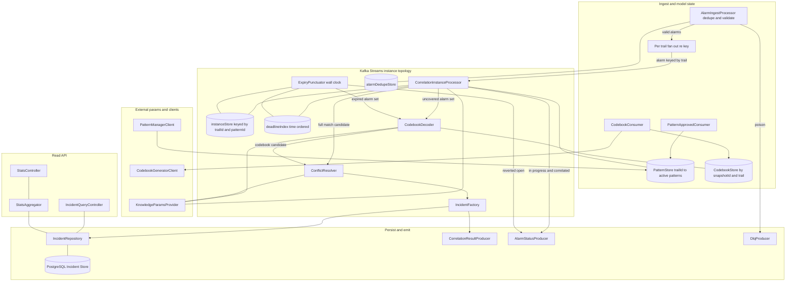
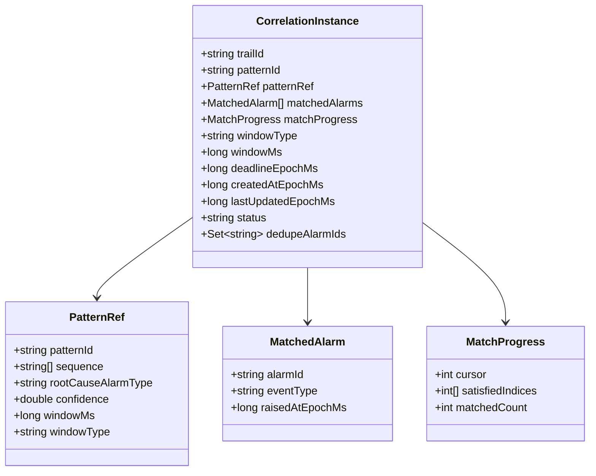
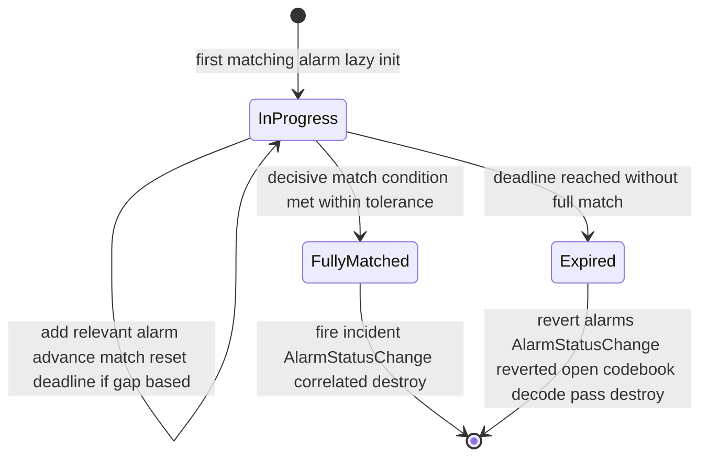
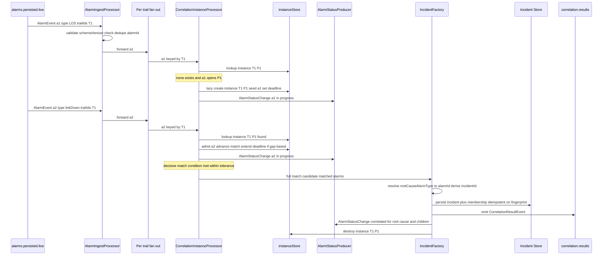
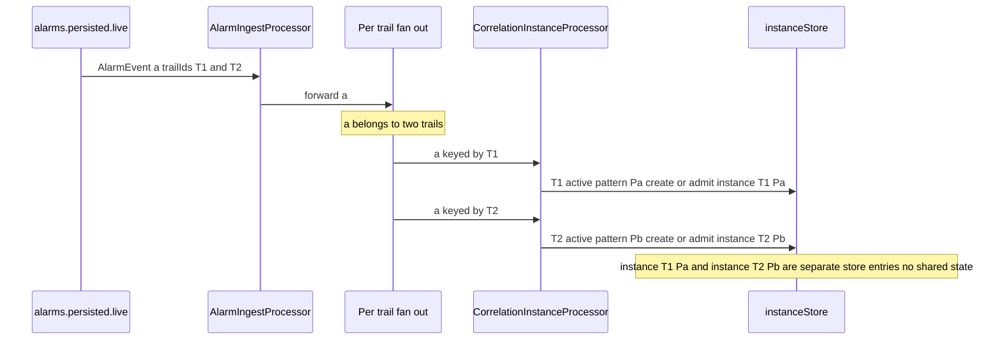
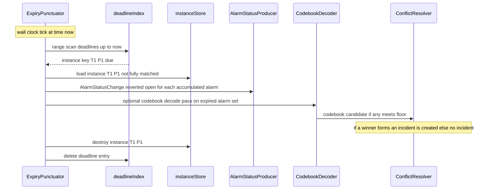
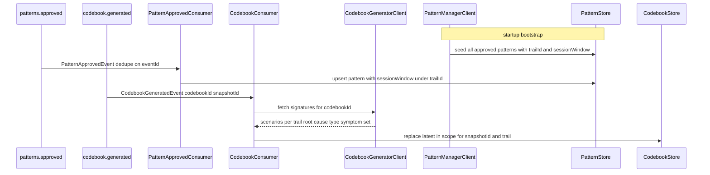
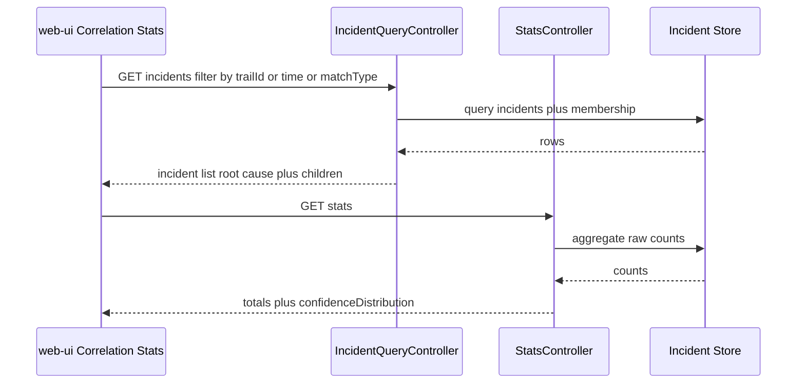
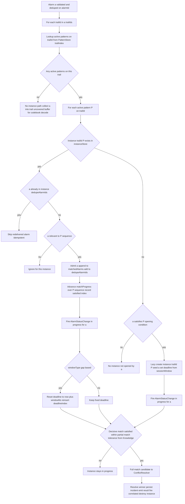

# correlation-engine — Design

Buildable design for the Correlation Engine — the real-time correlation core and **system of
record for incidents** (P3). It consumes live persisted alarms, and correlates them by creating,
advancing, and concluding **correlation instances** — one per `(trailId, patternId)` pair —
against approved patterns and the latest in-scope codebook. A correlation instance is born
**lazily** on the first matching alarm, accumulates alarms and re-matches **incrementally**, and
either **fully matches and fires immediately** (tag root cause, persist incident, emit
`CorrelationResultEvent`, fire `AlarmStatusChange(correlated)`, then **destroy** itself) or its
**per-pattern session window expires** (destroy, no incident, fire `AlarmStatusChange(reverted-open)`).
The same alarm fans out **independently** to each of its trails' active instances. The service
persists incidents to the Incident Store (PostgreSQL) and serves a read API for the web-ui
Correlation Stats module.

This design realizes the re-architected `services/correlation-engine/spec.md` (the
correlation-instance model). It introduces **no new topic, payload, or field** — the contract is
frozen and consumed as-is: in `alarms.persisted.live` (`AlarmEvent`), `patterns.approved`
(`PatternApprovedEvent`, incl. the merged **`sessionWindow`** field), `codebook.generated`
(`CodebookGeneratedEvent`); out `correlation.results` (`CorrelationResultEvent`, unchanged) and
`alarms.status.changed` (the already-merged `AlarmStatusChange`). The per-pattern session window
is read from each pattern's `sessionWindow` field, **not** from the Knowledge Service; the
Knowledge Service supplies match-quality and conflict-resolution parameters only.

> **Supersedes the window-centric design.** This design replaces the prior global per-trail
> session-window topology with the `(trailId, patternId)` correlation-instance model. The Kafka
> Streams stack, Incident Store schema, DLQ, idempotency strategy, stats/read API, and integration
> points are preserved; the **state model and matching algorithm are reworked**.

---

## Stack

- **Language / runtime:** Java 17 (`eclipse-temurin:17-jdk`), Spring Boot 3.x.
- **Build:** Gradle (Gradle Wrapper pinned), JUnit 5 (`spring-boot-starter-test`).
- **Stream processing:** **Kafka Streams** (`spring-kafka` + `kafka-streams`) using the
  **Processor API** (not the DSL). Correlation-instance state lives in a **RocksDB-backed,
  changelog-backed keyed state store** keyed by `(trailId, patternId)`; deadline-driven session
  expiry is fired from a **wall-clock `Punctuator`** over a time-ordered deadline index. The DSL's
  session/tumbling windows are unsuitable because instance lifetime is per-pattern, born lazily,
  and torn down immediately on full match (see Design alternatives).
- **HTTP / API:** Spring Web MVC; **springdoc-openapi** generates and serves OpenAPI 3.1 at
  `/openapi.json` and Swagger UI.
- **Datastore:** PostgreSQL (Incident Store), via Spring Data JDBC / `JdbcTemplate` + Flyway
  migrations.
- **Outbound HTTP clients:** Spring `RestClient` (config-driven base URLs) to Pattern Manager,
  Codebook Generator, Knowledge Service.
- **Observability:** Spring Boot Actuator (`/health` liveness+readiness), Micrometer +
  `micrometer-registry-prometheus` (`/metrics`), structured JSON logs (Logback JSON encoder).
- **Testing:** JUnit 5 (unit/contract), `kafka-streams-test-utils` `TopologyTestDriver` (drives
  punctuation deterministically via wall-clock advance) for instance-lifecycle tests,
  **Testcontainers** (Kafka + PostgreSQL) for integration, **WireMock / MockWebServer** stubs
  generated from collaborators' published OpenAPI for unit tests.
- **Licenses:** all Apache-2.0 / MIT / EPL-2.0 (Testcontainers MIT, MockWebServer Apache-2.0) —
  permissive only.

---

## Task breakdown (from the spec)

Every spec Task (1–10) is realized below and traceable to modules/flows.

| Spec task | Realized by (modules / flow) |
|---|---|
| 1. Load approved patterns (startup fetch + `patterns.approved` updates); record trails-active + per-pattern `sessionWindow` | `PatternBootstrapRunner` calls `PatternManagerClient.listApproved()` at startup; `PatternApprovedConsumer` refreshes incrementally. Both upsert into `PatternStore`, indexed by `trailId -> activePatterns`. Each `PatternRef` carries `sequence`, `rootCauseAlarmType`, `confidence`, and **`sessionWindow {windowMs, type}`**. |
| 2. Load codebook (record `codebookId`, fetch full signatures, keep latest-in-scope per `snapshotId`/trail) | `CodebookConsumer` handles `codebook.generated`, calls `CodebookGeneratorClient.fetchSignatures(codebookId)`, stores into `CodebookStore` keyed by `(snapshotId, trailId)`, monotonic latest-wins replace. |
| 3. Consume + validate + dedupe + DLQ + **fan out** `alarms.persisted.live` | `AlarmDeserializer` (event-model binding + `schemaVersion` check), `AlarmIngestProcessor` (dedupe via `alarmId` store, DLQ poison), then **re-key per trail**: for each `trailId` in `trailIds[]` emit one keyed record into the instance topology — the fan-out. |
| 4. Manage correlation-instance lifecycle (lazy init, in-progress, full-match, session-expiry) | `CorrelationInstanceProcessor` (Processor API) over the `instanceStore` keyed by `(trailId, patternId)`; lazy create, incremental advance, full-match fire-and-destroy; `ExpiryPunctuator` over the `deadlineIndex` destroys expired instances and reverts their alarms. |
| 5. Evaluate codebook decoding (fallback for unmatched alarm sets); threshold floors from Knowledge | `CodebookDecoder` invoked from the **uncovered-alarm path** (no active/covering instance) and on **session-expiry** of an instance; scores the alarm set against trail-scoped scenarios; emits a codebook candidate into `ConflictResolver`. Coexistence model defined in **Algorithm logical flow**. |
| 6. Resolve conflicts (specificity then confidence; weights from Knowledge) | `ConflictResolver` collects candidates (pattern-instance match + codebook candidate) claiming overlapping alarms, orders specificity-desc then confidence-desc, picks one winner. |
| 7. Create + persist incident (resolve `rootCauseAlarmType` to `alarmId`, children, stable `incidentId`, write Incident Store) | `IncidentFactory` resolves root-cause alarm + derives a deterministic `incidentId`; `IncidentRepository` persists incident + membership idempotently. |
| 8. Emit `correlation.results` (one event per incident, all applicable fields) | `CorrelationResultProducer` builds + emits `CorrelationResultEvent` via the event-model binding. |
| 9. Fire `AlarmStatusChange` on `alarms.status.changed` (in-progress / correlated / reverted-open) | `AlarmStatusProducer` fires one `AlarmStatusChange` per alarm per transition, `source = correlation-engine`, `changedAt` = transition time. |
| 10. Serve Incident/Stats read API (OpenAPI 3.1; raw counts; no accuracy) | `IncidentQueryController` (`GET /incidents`, `GET /incidents/{id}`) + `StatsController` (`GET /stats`), backed by `IncidentRepository` + `StatsAggregator`; springdoc publishes `/openapi.json`. |

---

## Phase applicability (design view)

Consistent with the canonical phase map in `architecture.md` (correlation-engine row:
Idle / Idle / Active).

| Phase | Active/Passive/Idle | Modules/handlers exercised | Inputs/Outputs |
|---|---|---|---|
| P1 — Topology onboarding | **Idle** | None. The service may be deployed; consumers see no traffic; no approved patterns/codebook exist. `/health` and `/metrics` respond. | — |
| P2 — Pattern learning | **Idle** | None of the correlation flow. It does **not** consume any history-path topic. It may receive early `codebook.generated` / `patterns.approved` events and warm `CodebookStore` / `PatternStore`, but performs no correlation (no live alarms). | — (state-warming only) |
| P3 — Real-time correlation | **Active** | Full pipeline: `AlarmIngestProcessor` to per-trail fan-out to `CorrelationInstanceProcessor` (lazy-init / incremental match / fire-and-destroy) + `ExpiryPunctuator` (session-expiry revert) to `CodebookDecoder` + `ConflictResolver` to `IncidentFactory` to `IncidentRepository` + `CorrelationResultProducer` + `AlarmStatusProducer`; `PatternApprovedConsumer` / `CodebookConsumer` keep model state fresh; `IncidentQueryController` + `StatsController` serve the web-ui. | In (Kafka): `alarms.persisted.live`, `patterns.approved`, `codebook.generated`. Out (Kafka): `correlation.results`, `alarms.status.changed`, `*.dlq`. Calls (API): Pattern Manager, Codebook Generator, Knowledge Service. Serves (API): `GET /incidents`, `GET /incidents/{id}`, `GET /stats`. |

---

## Module breakdown



| Module | Responsibility |
|---|---|
| `AlarmIngestProcessor` | Consume `alarms.persisted.live`; deserialize + validate via event-model binding; reject unknown major `schemaVersion`; dedupe on `alarmId` against `alarmDedupeStore`; route poison to DLQ; emit the alarm forward for fan-out. |
| `Per-trail fan-out` | For each `trailId` in the alarm's `trailIds[]`, re-key the alarm to that `trailId` so the instance topology is partitioned per trail and the alarm reaches each trail's instances independently (isolation). |
| `PatternApprovedConsumer` | Consume `patterns.approved`; dedupe on `eventId`; upsert `PatternRef` (incl. `sessionWindow`) into `PatternStore` under its `trailId`(s). |
| `CodebookConsumer` | Consume `codebook.generated`; dedupe on `eventId`; fetch signatures; latest-in-scope replace in `CodebookStore`. |
| `PatternBootstrapRunner` | At startup, seed `PatternStore` from `PatternManagerClient.listApproved()` (Task 1 startup fetch). |
| `PatternStore` | Thread-safe reference model. Two indices: `(trailId, patternId) -> PatternRef`, and `trailId -> Set of patternId` (active patterns on a trail — the fan-out driver). |
| `CodebookStore` | Trail-scoped scenario signatures, latest-in-scope per `(snapshotId, trailId)`. |
| `CorrelationInstanceProcessor` | The heart: lazy-create / add-to-existing / incremental sequence advance / window-deadline maintenance / full-match fire-and-destroy. Owns `instanceStore` + `deadlineIndex`. |
| `ExpiryPunctuator` | Wall-clock `Punctuator`; on each tick destroys every instance whose deadline has passed, reverts its alarms, and (per coexistence model) hands the expired alarm set to `CodebookDecoder`. |
| `CodebookDecoder` | Closest-match scoring of an uncovered/expired alarm set against trail-scoped scenarios; produces codebook candidates. |
| `ConflictResolver` | Deterministic specificity-then-confidence resolution among competing candidates; one winner per disjoint alarm set. |
| `IncidentFactory` | Resolve root-cause `alarmId`, derive stable `incidentId`, assemble incident + membership. |
| `IncidentRepository` | Idempotent persistence to PostgreSQL. |
| `CorrelationResultProducer` | Emit `CorrelationResultEvent` to `correlation.results`. |
| `AlarmStatusProducer` | Emit `AlarmStatusChange` to `alarms.status.changed` on the three transitions. |
| `DlqProducer` | Route poison messages to `<topic>.dlq`. |
| `KnowledgeParamsProvider` | Fetch + cache partial-match tolerance, scoring floors, conflict weights from Knowledge Service (**not** session-window). |
| `IncidentQueryController` / `StatsController` / `StatsAggregator` | Read API + raw-count aggregation. |
| `PatternManagerClient` / `CodebookGeneratorClient` | Config-switchable outbound clients (mock/real). |

---

## Data model

This service holds two distinct kinds of state:

1. **Live correlation-instance state** — ephemeral, high-churn, in a Kafka Streams state store
   (RocksDB + changelog). This is the **depth item** the spec calls out (Open Question 2).
2. **Durable incident records** — the system of record, in PostgreSQL.

### A. CorrelationInstance — the in-flight state structure (Open Question 2 resolved)

**Identity.** A correlation instance is uniquely `(trailId, patternId)`. At most one live instance
per pair exists at any time (spec idempotency invariant), enforced by lazy-init + destroy-on-conclude.

**The `CorrelationInstance` record** (the value stored in `instanceStore`):

| Field | Type | Meaning |
|---|---|---|
| `trailId` | string | Trail this instance lives on (part of the key). |
| `patternId` | string | Pattern this instance evaluates (part of the key). |
| `patternRef` | embedded snapshot | The pattern as it was at instance birth: `sequence[]`, `rootCauseAlarmType`, `confidence`, and **`sessionWindow {windowMs, type}`**. Snapshotting at birth makes the instance immune to a mid-flight `patterns.approved` re-publish (isolation + determinism). |
| `matchedAlarms` | ordered list of `{alarmId, eventType, raisedAt}` | The alarms admitted so far, in admission order. Carries enough to resolve root cause and children at fire time, and to revert on expiry. |
| `matchProgress` | `{cursor, satisfiedIndices, matchedCount}` | The sequence state-machine position: `cursor` = next expected position in `patternRef.sequence`; `satisfiedIndices` = which sequence elements have been satisfied (supports partial-match — non-contiguous gaps); `matchedCount` = number of distinct sequence elements satisfied. |
| `windowType` | enum `gap-based` / `fixed` | Copied from `patternRef.sessionWindow.type`. |
| `windowMs` | long | Copied from `patternRef.sessionWindow.windowMs`. |
| `deadlineEpochMs` | long | Absolute wall-clock instant at which this instance expires. `fixed`: `createdAt + windowMs`, never moved. `gap-based`: `lastAdmittedAt + windowMs`, recomputed on every accepted alarm. |
| `createdAtEpochMs` | long | Instance birth time (lazy-init instant). |
| `lastUpdatedEpochMs` | long | Last admission instant (the gap anchor for `gap-based`). |
| `status` | enum `in-progress` | The only persisted live status; `fully-matched` and `expired` are terminal transitions that destroy the record rather than persist. |
| `dedupeAlarmIds` | set of string | alarmIds already admitted to this instance — guards against re-admitting a redelivered alarm into the same instance (AC16). |



**Instance lifecycle (state machine).**



### The registry / indices (where live state lives and how it is found)

Three cooperating indices, all backed by Kafka Streams Processor-API state stores (RocksDB +
changelog, so they survive restart and rebalance). The justification for each:

| Index | Backing | Key to value | Purpose / why this structure |
|---|---|---|---|
| **`instanceStore`** (primary registry) | `KeyValueStore` of String to `CorrelationInstance`, RocksDB + changelog | composite key `trailId patternId` to `CorrelationInstance` | **O(1) add-to-existing lookup** when an alarm relevant to pattern P arrives on trail T. The single source of truth for live instance state; changelog gives restart recovery without a PostgreSQL round-trip on the hot path. |
| **`deadlineIndex`** (expiry timing structure) | `KeyValueStore` over a **range-scannable** key = `deadlineEpochMs` packed with the instance key, RocksDB + changelog | `deadlineEpochMs` big-endian time-ordered to instance key | **Efficient earliest-deadline-first expiry.** RocksDB stores keys sorted, so the `ExpiryPunctuator` does a single forward `range(0, now)` scan to find exactly the due instances — equivalent to a min-heap or timing-wheel head, but persistent and changelog-recoverable. On `gap-based` extension the old deadline key is deleted and a new one inserted (a heap decrease-key then re-insert). |
| **`PatternStore.trailIndex`** (fan-out driver) | in-memory `ConcurrentMap` of String to Set of String, rebuilt from Pattern Manager + `patterns.approved` | `trailId` to set of active `patternId` | **Fan-out lookup:** given an incoming alarm on trail T, enumerate which patterns are active on T, so the engine knows which `(T, P)` instances the alarm must reach (existing ones) or may open (new ones). Pattern set is low-churn reference data, so plain in-memory plus changelog-free is fine (re-derivable from Pattern Manager on restart). |

> **Why a state store and not pure in-memory or PostgreSQL.** Pure in-memory loses all in-flight
> instances on restart (a fiber-cut storm mid-accumulation would silently drop). PostgreSQL on the
> hot path adds a network round-trip per alarm and contends with incident writes. A Kafka Streams
> RocksDB store keyed by `(trailId, patternId)` gives **O(1) per-alarm state access, partition-local
> isolation (no cross-instance bleed), changelog-backed restart recovery, and built-in
> partitioning by trail** — exactly the spec's isolation + idempotency + per-pattern-timing
> constraints. PostgreSQL is reserved for durable incidents only.

**Isolation guarantee.** Because the instance topology is keyed by `(trailId, patternId)` and the
fan-out re-keys per `trailId`, instances on different trails (and different patterns on the same
trail) occupy distinct store entries and distinct stream partitions. One instance's `matchedAlarms`
/ `matchProgress` is physically separate from another's; there is no shared mutable buffer. This
is the structural realization of the spec's isolation invariant (AC2, AC8).

### B. Incident Store (PostgreSQL) — durable system of record

The Correlation Engine **owns** the Incident Store (dedicated schema `correlation`). No other
service reads/writes it directly; the Alarm Manager learns of correlation via `correlation.results`
and denormalizes role onto its own live-alarm store (it does not duplicate the incident here).


**`correlation.incident`** — one row per incident (system of record).

| Column | Type | Notes |
|---|---|---|
| `incident_id` | `text` PK | Stable, deterministic (see idempotency). |
| `trail_id` | `text NOT NULL` | Trail scope of the incident. |
| `root_cause_alarm_id` | `text NOT NULL` | Tagged root-cause alarm. |
| `matched_pattern_id` | `text NULL` | Set when winner is a pattern-instance match. |
| `matched_codebook_id` | `text NULL` | Set when winner is a codebook decode (references `codebookId`). |
| `confidence` | `numeric(5,4) NOT NULL` | In [0,1]. |
| `match_type` | `text NOT NULL` | `pattern` or `codebook` (drives `GET /incidents?matchType=`). |
| `instance_fingerprint` | `text NOT NULL UNIQUE` | Hash of `(trailId, patternId or codebookId, sorted matched alarmIds)`; enforces one-incident-per-`(instance, alarm set)` idempotency at the DB layer. |
| `created_at` | `timestamptz NOT NULL DEFAULT now()` | Used by time-range filter + stats. |

Indexes: `(trail_id)`, `(created_at)`, `(match_type)`, `UNIQUE(instance_fingerprint)`.
`match_type` is the authoritative discriminator; a pattern match may also carry the pattern's
`codebookMatchId` in `matched_codebook_id`, so the two id columns are not mutually exclusive.

**`correlation.incident_alarm`** — correlation-group membership (root-cause + children).

| Column | Type | Notes |
|---|---|---|
| `id` | `bigserial` PK | |
| `incident_id` | `text NOT NULL` FK to `incident.incident_id` ON DELETE CASCADE | |
| `alarm_id` | `text NOT NULL` | |
| `role` | `text NOT NULL` | `root_cause` or `child`. |

Constraint: `UNIQUE(incident_id, alarm_id)`. Index: `(alarm_id)`.

**`correlation.processed_event`** — idempotency ledger for consumed events deduped on `eventId`
(`patterns.approved` / `codebook.generated`). `scope` distinguishes topics; `dedupe_key` is the
`eventId`. Alarm dedupe uses the partition-local RocksDB `alarmDedupeStore` (high volume,
changelog-recoverable); the table is for low-volume event-side dedupe.

> Live **instance / dedupe stream state** lives in Kafka Streams state stores (RocksDB,
> changelog-backed), not in PostgreSQL. PostgreSQL holds only durable incident records + the
> event-dedupe ledger.

---

## Event handling

### Consumers

| Topic | Handler | Payload (event-model) | Idempotency / dedupe key | DLQ |
|---|---|---|---|---|
| `alarms.persisted.live` | `AlarmIngestProcessor` | `AlarmEvent` | `alarmId` (RocksDB `alarmDedupeStore`); plus per-instance `dedupeAlarmIds` | `alarms.persisted.live.dlq` |
| `patterns.approved` | `PatternApprovedConsumer` | `PatternApprovedEvent` | `eventId` (`processed_event` ledger) | `patterns.approved.dlq` |
| `codebook.generated` | `CodebookConsumer` | `CodebookGeneratedEvent` | `eventId` (`processed_event` ledger) | `codebook.generated.dlq` |

- **Validation:** every message is decoded through the `libs/event-model` Java binding
  (`EventCodec`). Unknown major `schemaVersion` and unparseable/invalid payloads are poison,
  routed to the topic's DLQ; the consumer commits past them and continues (AC19).
- **At-least-once + idempotency:** Streams `processing.guarantee=at_least_once`,
  `isolation.level=read_committed`; producers `enable.idempotence=true`, `acks=all`. A redelivered
  alarm hits the dedupe store (and, if its instance is live, the instance's `dedupeAlarmIds`) and
  is dropped before re-admission (AC16). Redelivered pattern/codebook events hit the ledger and are
  no-ops.

### Producers

| Topic | Producer | Payload (event-model) | Notes |
|---|---|---|---|
| `correlation.results` | `CorrelationResultProducer` | `CorrelationResultEvent` | One event per incident; emitted **after** the incident row is committed (persist-then-emit), keyed by `incidentId`. Fields: `incidentId`, `rootCauseAlarmId`, `childAlarmIds[]`, `matchedPatternId?`, `matchedCodebookId?`, `confidence`, `trailId`. Unchanged contract. |
| `alarms.status.changed` | `AlarmStatusProducer` | `AlarmStatusChange` | One event per alarm per transition: `in-progress` on admission, `correlated` on full match (root-cause + children), `reverted-open` on session expiry. Fields `{alarmId, newStatus, source = correlation-engine, changedAt}`. **Not consumed here** — produced only; the Alarm Manager consumes it. |
| `*.dlq` | `DlqProducer` | raw bytes + error headers | Poison messages with `x-error`, `x-source-topic`, `x-exception` headers; never silently dropped. |

**`AlarmStatusProducer` design.** A thin idempotent producer (`enable.idempotence=true`,
`acks=all`, keyed by `alarmId` for per-alarm ordering). It is invoked from exactly three call
sites so that no transition is silently omitted (spec invariant):

1. `CorrelationInstanceProcessor.admit(alarm, instance)` fires `in-progress` for the admitted alarm.
2. `IncidentFactory.fire(winner)` fires `correlated` for the root-cause alarm and every child alarm.
3. `ExpiryPunctuator.expire(instance)` fires `reverted-open` for every alarm in `matchedAlarms`.

Each firing is counted in `alarms_status_changed_total{newStatus}`. The richer correlation context
(incidentId, role, trailId) travels on `CorrelationResultEvent`, not here.

---

## API contracts / API schema

springdoc-openapi generates the OpenAPI 3.1 document served at `/openapi.json`; the generated
document is checked in to `services/correlation-engine/openapi.json` and drives provider-side
contract/unit tests (`OpenApiContractTest`). A surface change is a contract change (architecture
update + human approval). Response field names reuse `libs/event-model` `CorrelationResultEvent`
fields where applicable.

### `GET /incidents`
List incidents. Query params: `trailId?` (string), `from?` / `to?` (ISO-8601), `matchType?`
(`pattern` or `codebook`), `page?` (int, default 0), `size?` (int, default 50, max 500).

`200 OK`:
```json
{
  "items": [
    {
      "incidentId": "INC-...",
      "rootCauseAlarmId": "ALM-...",
      "childAlarmIds": ["ALM-...", "ALM-..."],
      "matchedPatternId": "PAT-... or null",
      "matchedCodebookId": "CODEBOOK-... or null",
      "confidence": 0.91,
      "trailId": "TRAIL-...",
      "createdAt": "2026-06-11T12:00:00Z"
    }
  ],
  "page": 0, "size": 50, "total": 137
}
```
`400` invalid query (bad `matchType` or date) returns a structured error.

### `GET /incidents/{incidentId}`
`200 OK`: a single incident object (same shape as an `items[]` element). `404` if not found.

### `GET /stats`
Aggregate raw counts for the web-ui Correlation Stats module. No accuracy is computed here.

`200 OK`:
```json
{
  "totalAlarmsProcessed": 1280,
  "totalIncidentsCreated": 64,
  "patternMatchCount": 50,
  "codebookMatchCount": 14,
  "confidenceDistribution": { "0.0-0.2": 0, "0.2-0.4": 1, "0.4-0.6": 5, "0.6-0.8": 22, "0.8-1.0": 36 }
}
```
Alarm-reduction ratio = `totalAlarmsProcessed / totalIncidentsCreated` is derivable client-side.

### Error response shape (all 4xx/5xx)
```json
{ "timestamp": "...", "status": 400, "error": "Bad Request", "message": "matchType must be one of pattern, codebook", "path": "/incidents" }
```

### Operational endpoints
- `GET /health` — Actuator liveness + readiness (readiness gates on Kafka Streams RUNNING + DB
  connectivity + Knowledge params loaded + pattern bootstrap complete).
- `GET /metrics` — Prometheus.
- `GET /openapi.json` — OpenAPI 3.1 document.

---

## Integration points (mock vs. real)

No hard-coded collaborator URLs. Each outbound dependency is resolved by env config: a base-URL
key + a global `INTEGRATION_MODE=mock|real`. In `mock`, clients point at a stub
(WireMock/MockWebServer) generated from the collaborator's **published OpenAPI** (unit tests). In
`real`, clients point at the Docker Compose service address (integration).

| Collaborator | Operation used | Config key(s) | Mock / real |
|---|---|---|---|
| **Pattern Manager** | `GET /patterns?lifecycle=approved` returning approved patterns (`patternId`, `sequence[]`, `rootCauseAlarmType`, `trailId`, `confidence`, **`sessionWindow`**, `codebookMatchId?`) | `PATTERN_MANAGER_BASE_URL`, `INTEGRATION_MODE` | Mock: WireMock stub from Pattern Manager OpenAPI. Real: compose `pattern-manager`. |
| **Codebook Generator** | fetch full scenario signatures for a `codebookId`, indexed by `trailId` (root-cause type + expected symptom set + trail tag). Exact endpoint per its published OpenAPI (spec Open Q4 / issue tracked). | `CODEBOOK_GENERATOR_BASE_URL`, `INTEGRATION_MODE` | Mock: WireMock stub from Codebook Generator OpenAPI. Real: compose `codebook-generator`. |
| **Knowledge Service** | fetch partial-match tolerance, scoring threshold floors, conflict-resolution weights (**not** session-window — that is per-pattern from `sessionWindow`) | `KNOWLEDGE_BASE_URL`, `INTEGRATION_MODE` | Mock: WireMock stub returning the test's parameter set. Real: compose `knowledge`. |

`KnowledgeParamsProvider` pulls + caches params with a TTL refresh; all match-quality/conflict
thresholds are sourced here, **none hard-coded** (AC21).

---

## Key flows (sequence / data-flow diagrams)

### Flow 1 — Lazy-init, incremental match, full-match fire-and-destroy (P3 primary path)



### Flow 2 — Multi-trail fan-out (one alarm, two isolated instances)



### Flow 3 — Session-expiry destroy and revert (failure/partial path)



### Flow 4 — Model refresh (patterns + codebook)



### Flow 5 — Read API (web-ui Correlation Stats)



---

## Algorithm logical flow

The core is the **incremental, per-alarm correlation algorithm** running over the
`(trailId, patternId)` instance registry, plus the **deadline-driven expiry** and the **codebook
coexistence** fallback. All match-quality and conflict thresholds come from
`KnowledgeParamsProvider`; the per-instance window comes from the pattern's `sessionWindow`.
Nothing is hard-coded.

### On each alarm from `alarms.persisted.live`



**Step detail (prose).**

1. **Fan-out.** For each `trailId` in `a.trailIds[]`, resolve the active patterns on that trail
   from `PatternStore.trailIndex`. Each trail is processed independently and re-keyed to its own
   partition, so two trails never share instance state (isolation, AC2/AC8).
2. **Per active pattern P on the trail:**
   - If instance `(trailId, P)` **exists**: dedupe `a` against the instance's `dedupeAlarmIds`
     (AC16); if relevant to P's sequence, **admit** it (append to `matchedAlarms`, advance
     `matchProgress`), fire `AlarmStatusChange(in-progress)`, and for **gap-based** windows reset
     the deadline to `now + windowMs` and re-insert into `deadlineIndex` (for **fixed**, leave it).
   - Else if `a` **satisfies P's opening condition** (the first unsatisfied sequence element, or
     P's designated opener): **lazily create** instance `(trailId, P)`, snapshot P's `PatternRef`
     (incl. `sessionWindow`), seed `matchedAlarms=[a]`, set the deadline (`gap-based`:
     `now + windowMs`; `fixed`: `createdAt + windowMs`), insert into `instanceStore` and
     `deadlineIndex`, and fire `AlarmStatusChange(in-progress)` (AC1, AC6).
   - Else: `a` neither matches an existing instance nor opens one for P — ignored for P.
3. **Incremental re-match.** After admitting/seeding, re-evaluate the decisive match condition
   immediately (not buffered, AC3): the sequence is satisfied when `matchProgress.matchedCount`
   covers P's `sequence` length minus at most the Knowledge **partial-match tolerance** (e.g.
   N-1 of N, AC10). If satisfied, the instance is a **full-match candidate** for conflict resolution.
4. **Full-match fire-and-destroy (immediate, no timer).** The winning candidate (from conflict
   resolution) resolves `rootCauseAlarmType` to the specific `alarmId` in `matchedAlarms`, collects
   the rest as children, derives a stable `incidentId`, persists the incident, emits
   `CorrelationResultEvent`, fires `AlarmStatusChange(correlated)` for root-cause + children, then
   **destroys** instance `(trailId, P)` (removes from `instanceStore` + `deadlineIndex`) — AC4.

### On `ExpiryPunctuator` wall-clock tick

The punctuator runs on a `PunctuationType.WALL_CLOCK_TIME` schedule. Each tick:
`range(deadlineIndex, 0 .. now)` returns every instance whose deadline has elapsed without a full
match. For each, fire `AlarmStatusChange(reverted-open)` for **every** alarm in `matchedAlarms`,
run the **codebook coexistence** pass on the expired set (below), then destroy the instance and its
deadline entry. No incident is created from the pattern instance itself (AC5). Per-pattern windows
are independent because each instance carries its own `windowMs`/`type` and its own deadline entry
(AC7).

### Codebook coexistence model (Open Question 1 resolved)

**Chosen model: codebook decode is a fallback that runs when no pattern instance covers the alarm
set — at two trigger points — and its candidate competes in the same conflict resolution as
pattern matches.**

Triggers:
1. **Uncovered alarms.** When an alarm on a trail matches **no** active pattern's opening
   condition and joins **no** existing instance, it lands in a short-lived per-trail
   **uncovered-alarm buffer**. The buffer is decoded against the trail-scoped codebook on the same
   wall-clock punctuation cadence; if the closest-match score clears the Knowledge floor, a
   **codebook candidate** is produced.
2. **Instance expiry.** When a pattern instance expires without a full match, its accumulated
   alarms are handed to the codebook decoder as a salvage decode pass — a partially-correlated set
   that no pattern claimed may still match a known codebook scenario.

**Why this model (vs. always-concurrent codebook decode):** running codebook decode *only* when
patterns do not cover the set keeps the hot path cheap (codebook scoring is O(scenarios) per
decode), avoids systematically duplicating every pattern match with a competing codebook candidate,
and gives a clean precedence story — a confident, specific pattern match is the preferred
explanation; the codebook is the safety net for cold-start (no patterns yet) and for sets that no
pattern decisively matched. Codebook candidates and pattern candidates that **do** overlap on the
same alarms (e.g. an expiry-salvage codebook candidate and a late pattern match for the same trail)
still enter the **same** `ConflictResolver`, so the deterministic specificity-then-confidence rule,
not the trigger, decides the single winner. (Codebook cold-start with no patterns active is AC9;
tolerance for missing/extra alarms is AC12.)

### Codebook decoding (scoring)

Distance between observed symptom set O and scenario signature S:
`missingPenalty * count(S minus O) + spuriousPenalty * count(O minus S)`, lower is better — it
tolerates missing alarms and penalizes spurious ones. The best-scoring scenario whose normalized
score clears the Knowledge **threshold floor** is the candidate; `rootCauseAlarmId` is resolved
from the scenario's `rootCauseAlarmType`. Penalties + floor come from Knowledge (AC12, AC15).

### Conflict resolution

Candidates (pattern-instance matches + codebook candidates) claiming overlapping alarm sets
compete. Order deterministically: (1) **specificity** — number of alarms covered, more wins;
(2) **confidence** — higher wins; weights/order from Knowledge. No random tie-break. Exactly one
winner per disjoint alarm set (AC11).

### Stable incident idempotency

`incidentId` is a deterministic hash of `(trailId, patternId or codebookId, sorted matched
alarmIds)`, also stored as `instance_fingerprint`. Re-evaluating the same matched set for the same
instance yields the same `incidentId`; the `UNIQUE(instance_fingerprint)` constraint makes a
duplicate persist a no-op — guaranteeing one incident per `(instance, alarm set)` (AC16).

---

## Seed data & examples

Unit/contract test fixtures (this service consumes; it does not generate synthetic data).

**Approved patterns (from Pattern Manager mock) — note `sessionWindow`:**
```json
[
  { "patternId": "PAT-FIBER", "trailId": "TRAIL-1",
    "sequence": ["lossOfSignal", "linkDown", "bgpPeerDown"],
    "rootCauseAlarmType": "lossOfSignal", "confidence": 0.87,
    "sessionWindow": { "windowMs": 30000, "type": "gap-based" },
    "codebookMatchId": "SCN-7" },
  { "patternId": "PAT-CARD", "trailId": "TRAIL-1",
    "sequence": ["cardFault", "portDown"],
    "rootCauseAlarmType": "cardFault", "confidence": 0.80,
    "sessionWindow": { "windowMs": 10000, "type": "fixed" } }
]
```
(`PAT-FIBER` and `PAT-CARD` are both active on `TRAIL-1` with **different** windows — AC7.)

**Codebook scenario signatures (from Codebook Generator mock):**
```json
{ "codebookId": "CODEBOOK-2026-06-11-001",
  "scenarios": [
    { "trailId": "TRAIL-1", "rootCauseAlarmType": "lossOfSignal",
      "expectedSymptoms": ["lossOfSignal", "linkDown", "bgpPeerDown"] } ] }
```

**Knowledge params (from Knowledge mock) — no session-window here:**
```json
{ "partialMatchTolerance": 1,
  "codebookMissingPenalty": 1.0, "codebookSpuriousPenalty": 2.0, "codebookScoreFloor": 0.5,
  "conflictWeights": { "specificity": 1.0, "confidence": 0.5 } }
```

**Input alarm sequence (fiber-cut storm, one dropped — AC10):** `AlarmEvent`s on
`alarms.persisted.live` with `trailIds=["TRAIL-1"]`: `lossOfSignal` (root, opens instance),
`linkDown` (admitted), `bgpPeerDown` **dropped**; all within the 30s gap window.

**Expected `CorrelationResultEvent`:**
```json
{ "incidentId": "INC-<hash>", "rootCauseAlarmId": "ALM-LOS",
  "childAlarmIds": ["ALM-LINKDOWN"], "matchedPatternId": "PAT-FIBER",
  "matchedCodebookId": null, "confidence": 0.83, "trailId": "TRAIL-1" }
```

**Expected `AlarmStatusChange` sequence:** `in-progress` for `ALM-LOS`, `in-progress` for
`ALM-LINKDOWN`, then `correlated` for `ALM-LOS` and `ALM-LINKDOWN`.

---

## Error handling

| Failure mode | Handling |
|---|---|
| Unparseable / invalid message on a consumed topic | Routed to `<topic>.dlq` with error headers; consumer commits past it; next valid message processed uninterrupted (AC19). Never silently dropped. |
| Unknown major `schemaVersion` | Rejected by the event-model binding, treated as poison, routed to DLQ (architecture invariant). |
| Bad request to read API (invalid `matchType`/date) | `400` with structured error body. |
| `GET /incidents/{id}` not found | `404` structured error. |
| Knowledge Service unavailable | `KnowledgeParamsProvider` serves last-known cached params + logs a warning; if no params ever loaded, readiness fails (`/health` not ready) and matching is held — the engine never invents defaults (no hard-coded thresholds). Session-window is unaffected — it comes from the pattern. |
| Codebook Generator unavailable on `codebook.generated` | Fetch retried with backoff; on persistent failure the prior latest-in-scope codebook is retained, failure logged + counted (`codebook_fetch_failures_total`); pattern-instance matching continues. |
| Pattern Manager unavailable at startup | Bootstrap retries with backoff; readiness stays not-ready until the pattern set is seeded — the engine does not correlate against an empty pattern set. |
| Duplicate alarm (at-least-once redelivery) | Dropped by `alarmDedupeStore`; if its instance is live, also guarded by `dedupeAlarmIds` — no duplicate admission, no duplicate incident (AC16). |
| Duplicate full-match evaluation / reprocessing | Stable `incidentId` + `UNIQUE(instance_fingerprint)` make persist + emit idempotent (one incident per instance+alarm-set). |
| Instance expires without a match | Destroyed; no incident; `AlarmStatusChange(reverted-open)` per accumulated alarm; optional codebook salvage decode (AC5). |
| Alarm matches no pattern and no instance | Lands in uncovered buffer; codebook decode attempted on the punctuation cadence; if none clears the floor, no incident (alarm still counted in `alarms_processed_total`). |
| DB write failure on incident persist | Transaction rolls back; `CorrelationResultEvent` is **not** emitted (persist-then-emit) and `AlarmStatusChange(correlated)` is not fired; error logged + counted; instance is **not** destroyed so the next event/punctuation can retry. |

All errors are emitted as structured JSON logs with `traceId`; nothing is silently dropped.

---

## Design alternatives

| Consideration | Alternatives considered | Chosen + rationale |
|---|---|---|
| State model | (a) window-centric per-trail session window aggregating all patterns (prior design); (b) **`(trailId, patternId)` correlation instance**, lazy-init, fire-and-destroy | **(b)** — the re-architected spec is instance-centric: per-pattern windows, lazy init, immediate fire on full match, isolation. A single per-trail window cannot express per-pattern `sessionWindow`, lazy birth, or immediate teardown; the instance model maps 1:1 to the spec lifecycle. |
| Instance state location | (a) pure in-memory; (b) PostgreSQL; (c) **Kafka Streams RocksDB state store keyed by `(trailId, patternId)` + changelog** | **(c)** — O(1) per-alarm access, partition-local isolation, changelog restart recovery, natural per-trail partitioning. (a) loses in-flight instances on restart; (b) adds a DB round-trip per alarm and contends with incident writes. |
| Expiry mechanism | (a) DSL session/tumbling window; (b) per-instance `KTable` TTL; (c) **wall-clock `Punctuator` over a time-ordered `deadlineIndex` (range-scan = min-heap head)** | **(c)** — instance lifetime is per-pattern, born lazily, and torn down immediately on full match; the DSL's fixed window semantics cannot model per-pattern gap-based vs fixed deadlines that move on admission. A sorted deadline index gives earliest-deadline-first expiry persistently. |
| Per-pattern window source | (a) global session-gap from Knowledge (prior design); (b) **per-pattern `sessionWindow` from `PatternApprovedEvent`** | **(b)** — the merged contract carries `sessionWindow {windowMs, type}` per pattern; Knowledge supplies match-quality/conflict params only. Two patterns on one trail expire independently (AC7). |
| Codebook coexistence | (a) codebook always runs concurrently with patterns; (b) **codebook as fallback (uncovered + expiry salvage) feeding the same conflict resolver** | **(b)** — keeps the hot path cheap, avoids systematically duplicating every pattern match, gives clean precedence (specific pattern preferred), while still letting overlapping codebook + pattern candidates compete deterministically (AC9, AC11, AC12). |
| Multi-trail fan-out | (a) evaluate all trails in one keyed task; (b) **re-key per trail so each trail is its own partition/instance set** | **(b)** — re-keying per `trailId` makes isolation structural (separate store entries, separate partitions); one alarm cleanly drives independent instances across its trails (AC2, AC8). |
| `incidentId` generation | (a) random UUID; (b) **deterministic hash of `(trailId, patternId/codebookId, sorted alarmIds)`** | **(b)** — the spec requires a stable `incidentId` across reprocessing of the same matched set for the same instance; the hash + `UNIQUE(instance_fingerprint)` enforces one-incident idempotently (AC16). |
| `AlarmStatusChange` vs `CorrelationResultEvent` | (a) put correlation context on `alarms.status.changed`; (b) **minimal `AlarmStatusChange` for status, rich context on `CorrelationResultEvent`** | **(b)** — matches the merged contract: `AlarmStatusChange` is a generic `{alarmId, newStatus, source, changedAt}` signal; incident linkage/role stays on `CorrelationResultEvent` (AC22). |
| Persist vs. emit ordering | (a) emit then persist; (b) **persist then emit** | **(b)** — the Incident Store is the system of record; emitting only after a committed incident prevents downstream consumers from seeing an incident the store lacks. |
| RCA accuracy | (a) compute server-side; (b) **expose raw counts only** | **(b)** — spec/architecture put accuracy at the integration-test/evaluation oracle (vs. Simulator ground truth); the engine exposes counts via `/stats`, no accuracy API. |

---

## Test plan

### Acceptance criterion → test (unit/contract, JUnit 5)

All 22 criteria map 1:1 to a named JUnit 5 test. Instance-lifecycle tests use the
`TopologyTestDriver`, advancing wall-clock time to drive punctuation deterministically.

| # | Acceptance criterion | Test (JUnit 5) | Asserts |
|---|---|---|---|
| 1 | Lazy-init — first matching alarm creates exactly one instance | `LazyInitTest#firstMatchingAlarmCreatesExactlyOneInstance` | No instance for (T1,P1) before the first alarm; after the first alarm matching P1's opening condition, exactly one (T1,P1) instance exists in `instanceStore`. |
| 2 | Multi-trail fan-out — two independent instances | `MultiTrailFanOutTest#oneAlarmTwoTrailsTwoIsolatedInstances` | An alarm with `trailIds=[T1,T2]` (Pa on T1, Pb on T2) creates instance(T1,Pa) and instance(T2,Pb); the two store entries are distinct and neither's state is visible to the other. |
| 3 | Add-to-existing — second alarm joins the existing instance | `AddToExistingTest#secondRelevantAlarmJoinsExistingInstance` | With (T,P) open, a second relevant alarm is admitted to the same instance and the match re-evaluated; exactly one (T,P) instance exists after both alarms. |
| 4 | Full-match fires and destroys immediately | `FullMatchFireAndDestroyTest#fullMatchFiresImmediatelyAndDestroysInstance` | On full match, exactly one incident persisted, exactly one `CorrelationResultEvent`, `AlarmStatusChange(correlated)` for every alarm, and no live (T,P) instance remains — with no wall-clock advance. |
| 5 | Session-expiry destroys instance and reverts alarms | `SessionExpiryRevertTest#expiryDestroysInstanceRevertsAlarmsNoIncident` | Advancing wall-clock past the instance deadline without full match destroys the instance, creates no incident, emits no `CorrelationResultEvent` for the set, and fires `AlarmStatusChange(reverted-open)` per accumulated alarm. |
| 6 | In-progress status on alarm admission | `InProgressStatusTest#admissionFiresExactlyOneInProgressStatus` | Admitting an alarm fires exactly one `AlarmStatusChange` with `newStatus=in-progress`, matching `alarmId`, `source=correlation-engine`. |
| 7 | Per-pattern session windows are independent | `PerPatternWindowTest#twoPatternsExpireAtTheirOwnWindows` | With P1 `windowMs=W1` and P2 `windowMs=W2` (W1 not equal W2) on the same trail, instance(T,P1) expires at W1 and instance(T,P2) at W2; neither expiry uses the other's duration. |
| 8 | Isolation — concurrent instances produce independent incidents | `IsolationTest#concurrentInstancesDisjointChildAlarms` | Two simultaneous sequences from different topology parts produce two incidents with disjoint `childAlarmIds[]`; no alarm appears in both. |
| 9 | Codebook cold-start — decode without an active pattern instance | `CodebookColdStartTest#noPatternCodebookMatchOnly` | With a matching alarm set on a trail but no active pattern instance, an incident is created with `matchedCodebookId` set, `matchedPatternId` null, and `rootCauseAlarmId` resolved from the scenario's root-cause designation. |
| 10 | Fiber-cut storm — one incident, partial match tolerated | `FiberCutStormTest#oneIncidentLosRootCausePartialTolerated` | LOS + N downstream with one dropped and Knowledge tolerance permitting N-1 of N yields exactly one `CorrelationResultEvent`; `rootCauseAlarmId`=LOS; `childAlarmIds[]`=surviving downstream. |
| 11 | Deterministic conflict resolution — specificity then confidence | `ConflictResolverTest#specificityThenConfidenceDeterministicWinner` | Two patterns claim the same set; higher-specificity pattern wins on every replay; on a specificity tie higher `confidence` wins; weights from Knowledge mock (no literals in setup). |
| 12 | Codebook tolerance — missing and extra alarms | `CodebookToleranceTest#missingAndSpuriousSelectsBestScenario` | Observed set missing one of S and containing one spurious alarm still selects that scenario as best closest-match and creates an incident; floors from Knowledge mock. |
| 13 | `CorrelationResultEvent` schema compliance | `CorrelationResultSchemaTest#emittedEventValidatesAgainstFrozenSchema` | Every emitted event validates against the frozen schema; required fields (`incidentId`, `rootCauseAlarmId`, `childAlarmIds`, `confidence`, `trailId`) present + non-null. |
| 14 | Required fields populated — pattern match | `CorrelationResultFieldsTest#patternMatchFieldsPopulated` | `matchedPatternId` non-null, `confidence` in [0,1], `trailId` equals the matched pattern's `trailId`. |
| 15 | Required fields populated — codebook match | `CorrelationResultFieldsTest#codebookMatchFieldsPopulated` | `matchedCodebookId` non-null, `matchedPatternId` null, `confidence` in [0,1], `trailId` equals the codebook scenario's trail tag. |
| 16 | Idempotency — duplicate alarm, no duplicate instance/incident | `IdempotencyTest#duplicateAlarmSingleAdmissionSingleIncident` | Replaying the same `alarmId` twice while (T,P) is active processes it once; the instance's alarm set contains it once; exactly one incident if full-match. |
| 17 | Alarm-reduction ratio computable from stats API | `StatsApiTest#statsExposeRawCountsForReductionRatio` | After K alarms collapsing to I incidents, `GET /stats` returns `totalAlarmsProcessed>=K` and `totalIncidentsCreated==I`; ratio derivable without an extra API. |
| 18 | Incident read API — root cause and children | `IncidentApiTest#getIncidentMatchesEmittedEvent` | `GET /incidents/{id}` returns `rootCauseAlarmId` + `childAlarmIds[]` equal to the emitted `CorrelationResultEvent` for the same `incidentId`. |
| 19 | Poison message routing — processing continues | `DlqRoutingTest#poisonAlarmToDlqNextMessageProcessed` | An unparseable `alarms.persisted.live` message is routed to `alarms.persisted.live.dlq`; the next valid message is processed without halting. |
| 20 | Latest codebook used — newer replaces prior | `CodebookVersioningTest#latestCodebookInScopeWins` | After V1 then V2 for the same `snapshotId`/trail, evaluations beginning after V2 use V2 signatures; no `codebookId` on `PatternApprovedEvent` required. |
| 21 | All match-quality thresholds from Knowledge — no hard-coded | `KnowledgeParamsTest#allMatchParamsExternallySourcedChangeBehaviour` | Replacing every Knowledge param (partial-match tolerance, scoring floors, conflict weights) with non-default values changes matching + conflict outcomes with no code change. (Session-window excluded — per-pattern.) |
| 22 | `AlarmStatusChange` schema compliance | `AlarmStatusChangeSchemaTest#emittedEventValidatesAgainstFrozenSchema` | Every emitted `AlarmStatusChange` validates against the frozen schema; `alarmId`, `newStatus`, `source`, `changedAt` present; `source=correlation-engine`. |

### E2E scenarios (from this design unit's point of view)

Service-scoped end-to-end paths the integration-test stage exercises (real Kafka + PostgreSQL via
Testcontainers/Compose, real collaborators in `real` mode).

| # | Scenario | Trigger to path | Expected outcome |
|---|---|---|---|
| 1 | Fiber-cut storm to one incident, LOS root cause, partial-match tolerated | Replay fiber-cut alarms on `alarms.persisted.live` with one dropped → lazy-init, incremental admit, full-match fire | Exactly one `CorrelationResultEvent` with LOS root cause; incident readable via `GET /incidents/{id}`; `AlarmStatusChange(in-progress)` then `(correlated)` observed on `alarms.status.changed`. |
| 2 | Multi-trail fan-out | One alarm with `trailIds=[T1,T2]`, distinct active patterns per trail | Two independent instances; if both complete, two incidents with disjoint child sets. |
| 3 | Session-expiry revert (failure/partial path) | Open an instance, then withhold further alarms past the window | No incident; `AlarmStatusChange(reverted-open)` per accumulated alarm; `instance_session_expirations_total` increments. |
| 4 | Codebook cold-start (no patterns) | Load only a codebook (no approved patterns), replay a matching set | Incident emitted with `matchedCodebookId` set, `matchedPatternId` null, correct RCA. |
| 5 | Conflict between two patterns | Two overlapping approved patterns both claim a set | Higher-specificity (then higher-confidence) pattern wins deterministically across repeats. |
| 6 | Codebook hot-swap | V1 then V2 `codebook.generated` for the same scope, then a matching set | V2 signatures drive the decode (AC20). |
| 7 | Poison alarm (failure path) | Unparseable message then a valid one on `alarms.persisted.live` | Poison in `alarms.persisted.live.dlq`; valid message produces its incident; pipeline never halts. |
| 8 | Duplicate redelivery (failure/partial path) | Same `alarmId` redelivered while an instance is live | Single admission; single incident; `incidents_created_total` increments once. |
| 9 | Knowledge param change (no-code reconfigure) | Change partial-match tolerance + conflict weights in Knowledge, replay | Match + conflict outcomes change accordingly; no engine code redeploy. |
| 10 | Per-pattern window independence | Two patterns with different `sessionWindow.windowMs` on one trail, partial fills | Each instance expires at its own window; one may fire while the other reverts. |
| 11 | Dependency-down (failure path) | Codebook Generator returns 5xx on fetch | Prior codebook retained; failure counted; pattern path still produces incidents; engine stays healthy. |
| 12 | Stats + reduction ratio | Replay K alarms to I incidents, then `GET /stats` | Raw counts expose K and I; ratio derivable; per-match-type breakdown correct. |

---

## Config & observability

**Environment / config keys:**
- `KAFKA_BOOTSTRAP_SERVERS`, `KAFKA_APPLICATION_ID` (Streams); idempotency settings
  (`enable.idempotence=true`, `acks=all`, `isolation.level=read_committed`,
  `processing.guarantee=at_least_once`).
- `INSTANCE_PUNCTUATION_INTERVAL_MS` — wall-clock cadence of `ExpiryPunctuator` (a tuning knob, not
  a threshold; instance deadlines themselves come from each pattern's `sessionWindow`).
- `INTEGRATION_MODE=mock|real`; `PATTERN_MANAGER_BASE_URL`, `CODEBOOK_GENERATOR_BASE_URL`,
  `KNOWLEDGE_BASE_URL`.
- `POSTGRES_URL`, `POSTGRES_USER`, `POSTGRES_PASSWORD`, schema `correlation`.
- `KNOWLEDGE_PARAMS_REFRESH_SECONDS` (cache TTL).
- **No threshold values in config** — partial-match tolerance, scoring floors, conflict weights are
  pulled from the Knowledge Service; **session-window comes from the pattern's `sessionWindow`**.

**Knowledge-sourced params:** `partialMatchTolerance`, `codebookMissingPenalty`,
`codebookSpuriousPenalty`, `codebookScoreFloor`, `conflictWeights`. (Session-window is **not**
here.)

**Observability:**
- `/health` — Actuator liveness + readiness (Streams RUNNING, DB up, Knowledge params loaded,
  pattern bootstrap complete).
- `/metrics` — Prometheus, exposing at minimum: `incidents_created_total`,
  `alarms_processed_total`, `pattern_match_total`, `codebook_match_total`,
  `instance_session_expirations_total`, `alarms_status_changed_total` (labelled by `newStatus`),
  `dlq_routed_total`, and an `active_instances` gauge (live `instanceStore` size); plus
  `codebook_fetch_failures_total`.
- Structured JSON logs (Logback JSON), each line carrying `traceId` + `alarmId`/`eventId`/
  `(trailId, patternId)` where applicable.

---

## Build & run

- **Build:** `./gradlew build` (compiles, runs JUnit 5 unit/contract tests, generates
  `openapi.json` and checks it against the checked-in `services/correlation-engine/openapi.json`).
- **Integration tests:** `./gradlew integrationTest` — Testcontainers spins up Kafka + PostgreSQL;
  collaborators run as WireMock (CI) or real services (`real` mode, Compose).
- **Dockerfile:** multi-stage on `eclipse-temurin:17-jdk` (build) to `eclipse-temurin:17-jre`
  (run); exposes the HTTP port; entrypoint runs the Spring Boot jar; Flyway migrations apply on
  startup.
- **Compose entry:** `correlation-engine` service with `depends_on` Kafka, PostgreSQL, `knowledge`,
  `pattern-manager`, `codebook-generator`; env supplies bootstrap servers, base URLs,
  `INTEGRATION_MODE`, PostgreSQL connection. Kafka Streams state stores (RocksDB) persist to a
  mounted volume; changelog topics back `instanceStore`, `deadlineIndex`, and `alarmDedupeStore`
  for recovery.
- **README:** documents env keys, the three consumed topics + two produced topics
  (`correlation.results`, `alarms.status.changed`), the read API, and local run via Compose.
