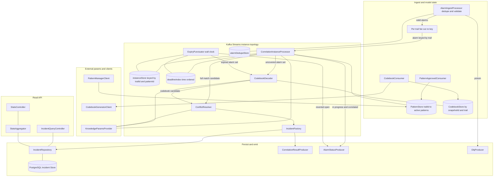
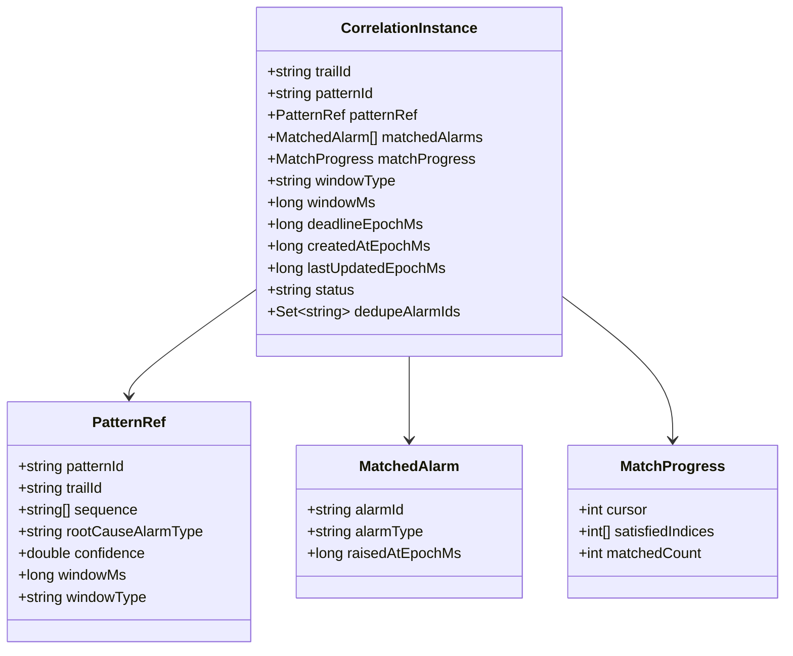
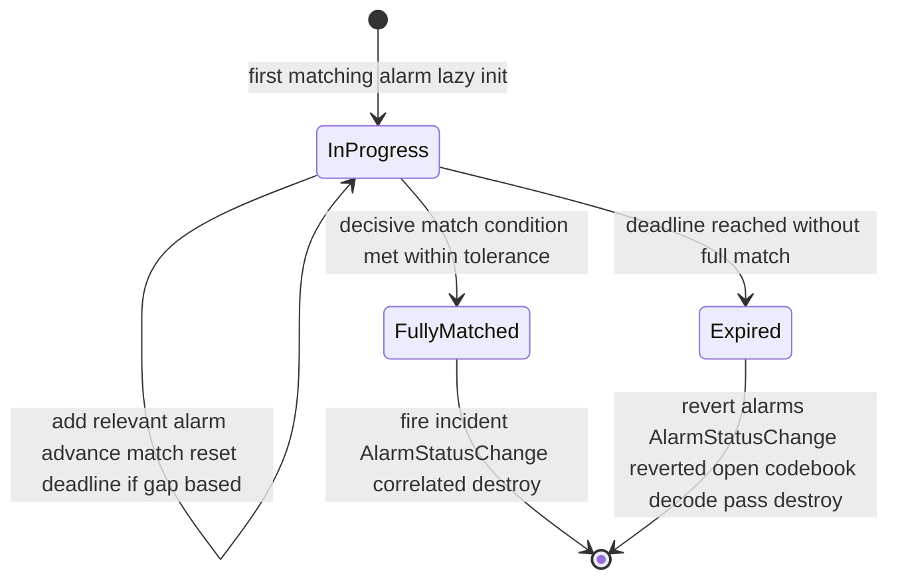
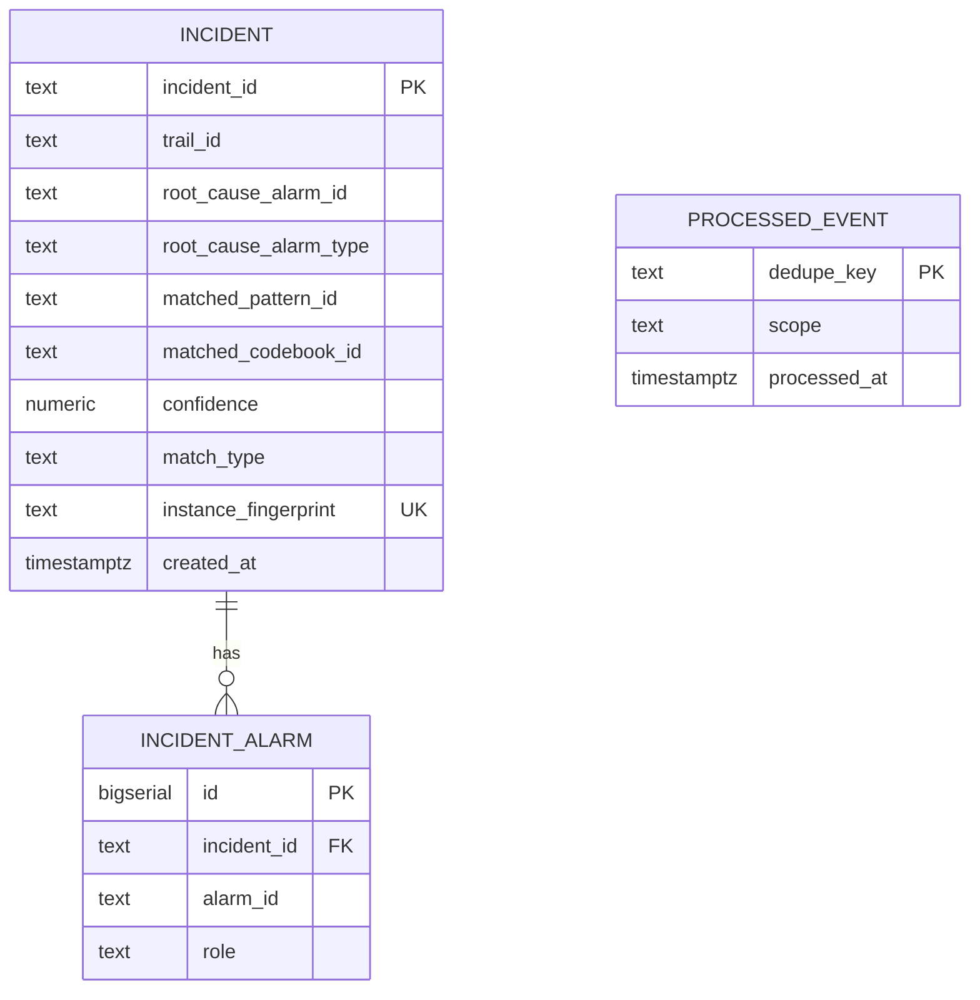
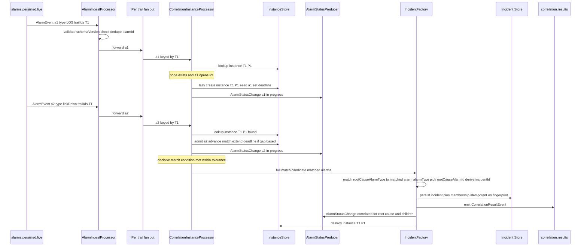
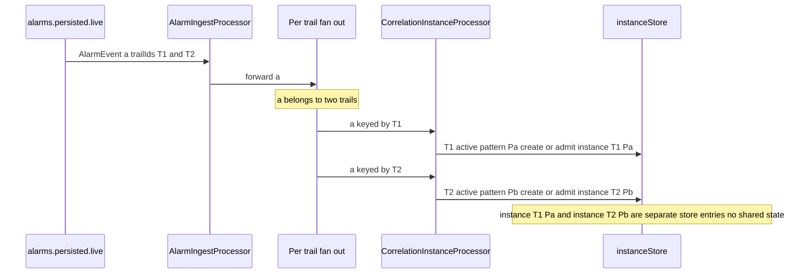
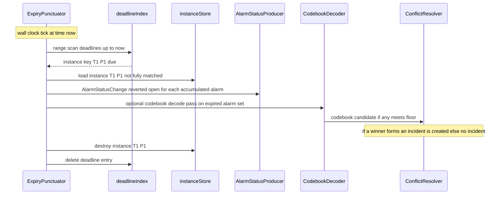
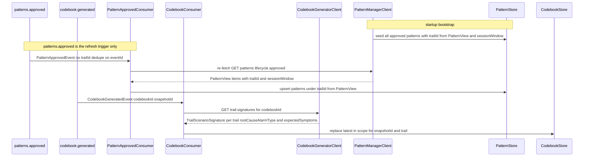
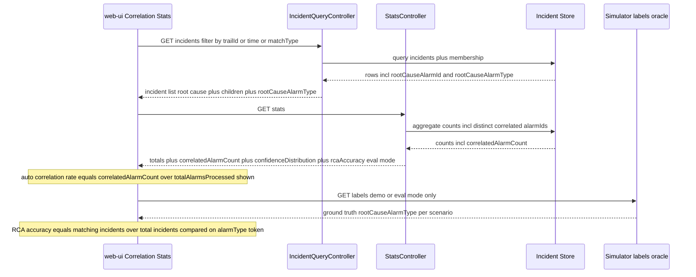
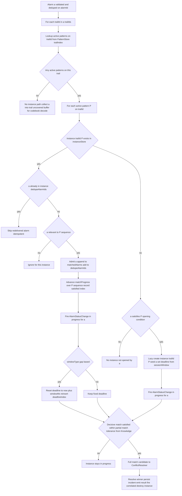

# correlation-engine — Design

Buildable design for the Correlation Engine — the real-time correlation core and **system of
record for incidents** (P3). It consumes live persisted alarms, and correlates them by creating,
advancing, and concluding **correlation instances** — one per `(trailId, patternId)` pair —
against approved patterns and the latest in-scope codebook. A correlation instance is born
**lazily** on the first matching alarm, accumulates alarms and re-matches **incrementally**, and
either **fully matches and fires immediately** (tag root cause, persist incident, emit
`CorrelationResultEvent`, fire `AlarmStatusChange(correlated)`, then **destroy** itself) or its
**per-pattern session window expires** (destroy, no incident, fire `AlarmStatusChange(reverted-open)`).
The same alarm fans out **independently** to each of its trails' active instances. The service
persists incidents to the Incident Store (PostgreSQL) and serves a read API for the web-ui
Correlation Stats module.

This design realizes the re-architected `services/correlation-engine/spec.md` (the
correlation-instance model). It introduces **no new topic, payload, or field** — the contract is
frozen and consumed as-is: in `alarms.persisted.live` (`AlarmEvent`), `patterns.approved`
(`PatternApprovedEvent`, incl. the merged **`sessionWindow`** field), `codebook.generated`
(`CodebookGeneratedEvent`); out `correlation.results` (`CorrelationResultEvent`, unchanged) and
`alarms.status.changed` (the already-merged `AlarmStatusChange`). The per-pattern session window
is read from each pattern's `sessionWindow` field, **not** from the Knowledge Service; the
Knowledge Service supplies match-quality and conflict-resolution parameters only, read from its
**frozen** `GET /domains/{domain}/model-params/{recordId}` endpoint (the seeded
`core-ip/modelParams/correlation-engine` record). Two derivations are made explicit in this design:
(1) `CorrelationResultEvent.rootCauseAlarmId` is derived by resolving the winning match's
`rootCauseAlarmType` token against the matched alarms' **`alarmType`** join key; (2) a
`patterns.approved` event is only a **refresh trigger** — each pattern's `trailId` (for
`(trailId, patternId)` instance keying) comes from the Pattern Manager read API's
`PatternView.trailId`, since the frozen `PatternApprovedEvent` carries no `trailId`. None of this
adds or changes any topic, payload, or field.

This revision also closes the three **MVP-achievability** findings on the engine (the P3 rows of
`docs/mvp-achievability.md`), all as **read-API fields + design notes** — no topic, payload, or
field is added or changed (`CorrelationResultEvent` and `AlarmStatusChange` are frozen and emitted
as-is):
- **D1 — auto-correlation fraction is measurable + shown.** `GET /stats` adds a
  **`correlatedAlarmCount`** (distinct alarms placed into a correlated incident) alongside the
  existing `totalAlarmsProcessed`, so the headline **auto-correlation rate** =
  `correlatedAlarmCount / totalAlarmsProcessed` is **derivable from the response** and rendered by
  the web-ui — the explicit metric that demonstrates the ~60% target (previously emergent only).
- **D2 — RCA accuracy is a shown number, not only evaluated-offline.** Every incident's RCA tag
  (`rootCauseAlarmId` plus the matched pattern/codebook, `confidence`, and the resolved
  `rootCauseAlarmType`) is served on the incident read API and emitted on `CorrelationResultEvent`,
  so when ground truth is available (integration/eval/demo mode) **RCA accuracy** = `incidents
  whose tagged rootCauseAlarmId matches the ground-truth root cause divided by total incidents` is
  **computable and displayable** by the web-ui from `GET /incidents` plus the Simulator `/labels`
  oracle. `GET /stats` also exposes an **eval-mode `rcaAccuracy`** field, populated only when the
  engine is run with the labels oracle wired (null in pure production). The engine still does
  **not** own ground truth or compute accuracy at production runtime — it exposes exactly what the
  oracle and UI need.
- **E1 — P2/P3 train-serve representation asymmetry is documented + resolved.** Patterns are mined
  in P2 from DBSCAN-cleaned, session-split `transactions.clean`, but matched in P3 against the
  **raw, noisy** `alarms.persisted.live` stream (the Noise Filter is idle in P3). The engine's
  matching is **designed to be noise-tolerant** for exactly this reason (partial-match tolerance
  plus a spurious-alarm penalty plus per-`(trailId, patternId)` instance windowing that ignores
  unrelated interleaved noise), and the measurable expectation is asserted **on the noisy live
  stream against ground truth** — not on cleaned data — so the ~60% target holds under realistic
  conditions. See **Algorithm logical flow → P2/P3 representation + noise tolerance**.

> **Supersedes the window-centric design.** This design replaces the prior global per-trail
> session-window topology with the `(trailId, patternId)` correlation-instance model. The Kafka
> Streams stack, Incident Store schema, DLQ, idempotency strategy, stats/read API, and integration
> points are preserved; the **state model and matching algorithm are reworked**.

---

## Stack

- **Language / runtime:** Java 17 (`eclipse-temurin:17-jdk`), Spring Boot 3.x.
- **Build:** Gradle (Gradle Wrapper pinned), JUnit 5 (`spring-boot-starter-test`).
- **Stream processing:** **Kafka Streams** (`spring-kafka` + `kafka-streams`) using the
  **Processor API** (not the DSL). Correlation-instance state lives in a **RocksDB-backed,
  changelog-backed keyed state store** keyed by `(trailId, patternId)`; deadline-driven session
  expiry is fired from a **wall-clock `Punctuator`** over a time-ordered deadline index. The DSL's
  session/tumbling windows are unsuitable because instance lifetime is per-pattern, born lazily,
  and torn down immediately on full match (see Design alternatives).
- **HTTP / API:** Spring Web MVC; **springdoc-openapi** generates and serves OpenAPI 3.1 at
  `/openapi.json` and Swagger UI.
- **Datastore:** PostgreSQL (Incident Store) in the owned schema `incident`, via Spring Data JDBC /
  `JdbcTemplate` + Flyway (Apache-2.0) migrations. Flyway is scoped to the `incident` schema
  (`spring.flyway.schemas=incident`, `spring.flyway.default-schema=incident`); the first migration
  is `V1__create_incident_schema.sql` = `CREATE SCHEMA IF NOT EXISTS incident;`.
- **Outbound HTTP clients:** Spring `RestClient` (config-driven base URLs) to Pattern Manager,
  Codebook Generator, Knowledge Service.
- **Observability:** Spring Boot Actuator (`/health` liveness+readiness), Micrometer +
  `micrometer-registry-prometheus` (`/metrics`), structured JSON logs (Logback JSON encoder).
- **Testing:** JUnit 5 (unit/contract), `kafka-streams-test-utils` `TopologyTestDriver` (drives
  punctuation deterministically via wall-clock advance) for instance-lifecycle tests,
  **Testcontainers** (Kafka + PostgreSQL) for integration, **WireMock / MockWebServer** stubs
  generated from collaborators' published OpenAPI for unit tests.
- **Licenses:** all Apache-2.0 / MIT / EPL-2.0 (Testcontainers MIT, MockWebServer Apache-2.0) —
  permissive only.

---

## Task breakdown (from the spec)

Every spec Task (1–10) is realized below and traceable to modules/flows.

| Spec task | Realized by (modules / flow) |
|---|---|
| 1. Load approved patterns (startup fetch + `patterns.approved` updates); record trails-active + per-pattern `sessionWindow` | `PatternBootstrapRunner` calls `PatternManagerClient.listApproved()` at startup; `PatternApprovedConsumer` treats each `patterns.approved` event as a **refresh trigger** and **re-fetches the approved pattern set via `PatternManagerClient.listApproved()`** (`GET /patterns?lifecycle=approved`). The **`trailId`** placing each pattern on its trail(s) for `(trailId, patternId)` keying comes from **`PatternView.trailId`** on the read API — **not** from the event (the frozen `PatternApprovedEvent` carries no `trailId`; trail placement is structurally impossible from the event alone). Both paths upsert into `PatternStore`, indexed by `trailId -> activePatterns`. Each `PatternRef` carries `trailId`, `sequence`, `rootCauseAlarmType`, `confidence`, and **`sessionWindow {windowMs, type}`** — all from `PatternView`. |
| 2. Load codebook (record `codebookId`, fetch full signatures, keep latest-in-scope per `snapshotId`/trail) | `CodebookConsumer` handles `codebook.generated`, calls `CodebookGeneratorClient.fetchTrailSignatures(codebookId)` against the Codebook Generator's **published `GET /codebooks/{codebookId}/trail-signatures` projection** (per scenario fanned out per `trailId`: `{ trailId, scenarioId, rootCauseAlarmType, expectedSymptoms[] }`), stores into `CodebookStore` keyed by `(snapshotId, trailId)`, monotonic latest-wins replace. Resolves CE Open Q4 (consumer side of P1-G5 / P3-G2). |
| 3. Consume + validate + dedupe + DLQ + **fan out** `alarms.persisted.live` | `AlarmDeserializer` (event-model binding + `schemaVersion` check), `AlarmIngestProcessor` (dedupe via `alarmId` store, DLQ poison), then **re-key per trail**: for each `trailId` in `trailIds[]` emit one keyed record into the instance topology — the fan-out. |
| 4. Manage correlation-instance lifecycle (lazy init, in-progress, full-match, session-expiry) | `CorrelationInstanceProcessor` (Processor API) over the `instanceStore` keyed by `(trailId, patternId)`; lazy create, incremental advance, full-match fire-and-destroy; `ExpiryPunctuator` over the `deadlineIndex` destroys expired instances and reverts their alarms. |
| 5. Evaluate codebook decoding (fallback for unmatched alarm sets); threshold floors from Knowledge | `CodebookDecoder` invoked from the **uncovered-alarm path** (no active/covering instance) and on **session-expiry** of an instance; scores the alarm set against trail-scoped scenarios; emits a codebook candidate into `ConflictResolver`. Coexistence model defined in **Algorithm logical flow**. |
| 6. Resolve conflicts (specificity then confidence; weights from Knowledge) | `ConflictResolver` collects candidates (pattern-instance match + codebook candidate) claiming overlapping alarms, orders specificity-desc then confidence-desc, picks one winner. |
| 7. Create + persist incident (resolve `rootCauseAlarmType` to `alarmId`, children, stable `incidentId`, write Incident Store) | `IncidentFactory` resolves the root-cause `alarmId` by matching the winning match's `rootCauseAlarmType` token against the matched alarms' **`alarmType`** field (the canonical join key on `AlarmEvent`; **not** `eventType`/`probableCause`) — the matched alarm whose `alarmType == rootCauseAlarmType` supplies `rootCauseAlarmId`, the rest become children — and derives a deterministic `incidentId`; `IncidentRepository` persists incident + membership idempotently. |
| 8. Emit `correlation.results` (one event per incident, all applicable fields) | `CorrelationResultProducer` builds + emits `CorrelationResultEvent` via the event-model binding. |
| 9. Fire `AlarmStatusChange` on `alarms.status.changed` (in-progress / correlated / reverted-open) | `AlarmStatusProducer` fires one `AlarmStatusChange` per alarm per transition, `source = correlation-engine`, `changedAt` = transition time. |
| 10. Serve Incident/Stats read API (OpenAPI 3.1; raw counts + auto-correlation + shown RCA) | `IncidentQueryController` (`GET /incidents`, `GET /incidents/{id}` — each item now carries `rootCauseAlarmType` for token-space RCA comparison) + `StatsController` (`GET /stats` — keeps the raw counts and **adds** `correlatedAlarmCount` for the **auto-correlation rate** (D1) and an eval-mode `rcaAccuracy` field (D2)), backed by `IncidentRepository` + `StatsAggregator`; springdoc publishes `/openapi.json`. RCA accuracy stays externally/UI-computable from the per-incident tag + Simulator `/labels`; the engine owns no ground truth at runtime. |

---

## Phase applicability (design view)

Consistent with the canonical phase map in `architecture.md` (correlation-engine row:
Idle / Idle / Active).

| Phase | Active/Passive/Idle | Modules/handlers exercised | Inputs/Outputs |
|---|---|---|---|
| P1 — Topology onboarding | **Idle** | None. The service may be deployed; consumers see no traffic; no approved patterns/codebook exist. `/health` and `/metrics` respond. | — |
| P2 — Pattern learning | **Idle** | None of the correlation flow. It does **not** consume any history-path topic. It may receive early `codebook.generated` / `patterns.approved` events and warm `CodebookStore` / `PatternStore`, but performs no correlation (no live alarms). | — (state-warming only) |
| P3 — Real-time correlation | **Active** | Full pipeline: `AlarmIngestProcessor` to per-trail fan-out to `CorrelationInstanceProcessor` (lazy-init / incremental match / fire-and-destroy) + `ExpiryPunctuator` (session-expiry revert) to `CodebookDecoder` + `ConflictResolver` to `IncidentFactory` to `IncidentRepository` + `CorrelationResultProducer` + `AlarmStatusProducer`; `PatternApprovedConsumer` / `CodebookConsumer` keep model state fresh; `IncidentQueryController` + `StatsController` serve the web-ui. | In (Kafka): `alarms.persisted.live`, `patterns.approved`, `codebook.generated`. Out (Kafka): `correlation.results`, `alarms.status.changed`, `*.dlq`. Calls (API): Pattern Manager, Codebook Generator, Knowledge Service. Serves (API): `GET /incidents`, `GET /incidents/{id}`, `GET /stats`. |

---

## Module breakdown



| Module | Responsibility |
|---|---|
| `AlarmIngestProcessor` | Consume `alarms.persisted.live`; deserialize + validate via event-model binding; reject unknown major `schemaVersion`; dedupe on `alarmId` against `alarmDedupeStore`; route poison to DLQ; emit the alarm forward for fan-out. |
| `Per-trail fan-out` | For each `trailId` in the alarm's `trailIds[]`, re-key the alarm to that `trailId` so the instance topology is partitioned per trail and the alarm reaches each trail's instances independently (isolation). |
| `PatternApprovedConsumer` | Consume `patterns.approved`; dedupe on `eventId`; treat the event as a **refresh trigger** and **re-fetch the approved pattern set via `PatternManagerClient.listApproved()`** (`GET /patterns?lifecycle=approved`); upsert each `PatternRef` (incl. `sessionWindow`) into `PatternStore` under its **`trailId` taken from `PatternView.trailId`** (the event carries no `trailId` — the read API is the source of trail placement). |
| `CodebookConsumer` | Consume `codebook.generated`; dedupe on `eventId`; fetch the per-trail signatures via `CodebookGeneratorClient.fetchTrailSignatures(codebookId)` (the published `GET /codebooks/{codebookId}/trail-signatures` projection); latest-in-scope replace in `CodebookStore`. |
| `PatternBootstrapRunner` | At startup, seed `PatternStore` from `PatternManagerClient.listApproved()` (Task 1 startup fetch). |
| `PatternStore` | Thread-safe reference model. Two indices: `(trailId, patternId) -> PatternRef`, and `trailId -> Set of patternId` (active patterns on a trail — the fan-out driver). |
| `CodebookStore` | Trail-scoped scenario signatures (`TrailScenarioSignature` = `{ trailId, scenarioId, rootCauseAlarmType, expectedSymptoms[{alarmType, managedObjectId}] }` from the trail-signatures projection), latest-in-scope per `(snapshotId, trailId)`. |
| `CorrelationInstanceProcessor` | The heart: lazy-create / add-to-existing / incremental sequence advance / window-deadline maintenance / full-match fire-and-destroy. Owns `instanceStore` + `deadlineIndex`. |
| `ExpiryPunctuator` | Wall-clock `Punctuator`; on each tick destroys every instance whose deadline has passed, reverts its alarms, and (per coexistence model) hands the expired alarm set to `CodebookDecoder`. |
| `CodebookDecoder` | Closest-match scoring of an uncovered/expired alarm set against trail-scoped scenarios; produces codebook candidates. |
| `ConflictResolver` | Deterministic specificity-then-confidence resolution among competing candidates; one winner per disjoint alarm set. |
| `IncidentFactory` | Resolve the root-cause `alarmId` by matching the winning match's `rootCauseAlarmType` token to the matched alarm whose **`alarmType`** equals it (join on `AlarmEvent.alarmType`, not `eventType`/`probableCause`); derive stable `incidentId`; assemble incident + membership (root-cause + children). |
| `IncidentRepository` | Idempotent persistence to PostgreSQL. |
| `CorrelationResultProducer` | Emit `CorrelationResultEvent` to `correlation.results`. |
| `AlarmStatusProducer` | Emit `AlarmStatusChange` to `alarms.status.changed` on the three transitions. |
| `DlqProducer` | Route poison messages to `<topic>.dlq`. |
| `KnowledgeParamsProvider` | Fetch + cache partial-match tolerance, scoring floors, conflict weights from the Knowledge Service's frozen `GET /domains/{domain}/model-params/{recordId}` endpoint (`recordId = core-ip/modelParams/correlation-engine`), parsing the versioned-record `payload.params[]` by dotted key (`match.partialMatchTolerance`, `codebook.missingPenalty`, `codebook.spuriousPenalty`, `codebook.scoreFloor`, `conflict.weights.specificity`, `conflict.weights.confidence`). **Not** session-window (that is per-pattern). |
| `IncidentQueryController` / `StatsController` / `StatsAggregator` | Read API + raw-count aggregation. |
| `PatternManagerClient` / `CodebookGeneratorClient` / `KnowledgeClient` | Config-switchable outbound clients (mock/real). `KnowledgeClient` is built against the Knowledge `openapi.json` `model-params/{recordId}` operation. |

---

## Data model

This service holds two distinct kinds of state:

1. **Live correlation-instance state** — ephemeral, high-churn, in a Kafka Streams state store
   (RocksDB + changelog). This is the **depth item** the spec calls out (Open Question 2).
2. **Durable incident records** — the system of record, in PostgreSQL.

### A. CorrelationInstance — the in-flight state structure (Open Question 2 resolved)

**Identity.** A correlation instance is uniquely `(trailId, patternId)`. At most one live instance
per pair exists at any time (spec idempotency invariant), enforced by lazy-init + destroy-on-conclude.

**The `CorrelationInstance` record** (the value stored in `instanceStore`):

| Field | Type | Meaning |
|---|---|---|
| `trailId` | string | Trail this instance lives on (part of the key). |
| `patternId` | string | Pattern this instance evaluates (part of the key). |
| `patternRef` | embedded snapshot | The pattern as it was at instance birth (taken from the Pattern Manager `PatternView` at refresh/bootstrap): `trailId`, `sequence[]`, `rootCauseAlarmType`, `confidence`, and **`sessionWindow {windowMs, type}`**. Snapshotting at birth makes the instance immune to a mid-flight `patterns.approved`-triggered refresh (isolation + determinism). |
| `matchedAlarms` | ordered list of `{alarmId, alarmType, raisedAt}` | The alarms admitted so far, in admission order. Carries the **`alarmType`** of each alarm — the canonical join key used at fire time to resolve `rootCauseAlarmType -> rootCauseAlarmId` and to tag children — and enough to revert on expiry. |
| `matchProgress` | `{cursor, satisfiedIndices, matchedCount}` | The sequence state-machine position: `cursor` = next expected position in `patternRef.sequence`; `satisfiedIndices` = which sequence elements have been satisfied (supports partial-match — non-contiguous gaps); `matchedCount` = number of distinct sequence elements satisfied. |
| `windowType` | enum `gap-based` / `fixed` | Copied from `patternRef.sessionWindow.type`. |
| `windowMs` | long | Copied from `patternRef.sessionWindow.windowMs`. |
| `deadlineEpochMs` | long | Absolute wall-clock instant at which this instance expires. `fixed`: `createdAt + windowMs`, never moved. `gap-based`: `lastAdmittedAt + windowMs`, recomputed on every accepted alarm. |
| `createdAtEpochMs` | long | Instance birth time (lazy-init instant). |
| `lastUpdatedEpochMs` | long | Last admission instant (the gap anchor for `gap-based`). |
| `status` | enum `in-progress` | The only persisted live status; `fully-matched` and `expired` are terminal transitions that destroy the record rather than persist. |
| `dedupeAlarmIds` | set of string | alarmIds already admitted to this instance — guards against re-admitting a redelivered alarm into the same instance (AC16). |



**Instance lifecycle (state machine).**



### The registry / indices (where live state lives and how it is found)

Three cooperating indices, all backed by Kafka Streams Processor-API state stores (RocksDB +
changelog, so they survive restart and rebalance). The justification for each:

| Index | Backing | Key to value | Purpose / why this structure |
|---|---|---|---|
| **`instanceStore`** (primary registry) | `KeyValueStore` of String to `CorrelationInstance`, RocksDB + changelog | composite key `trailId patternId` to `CorrelationInstance` | **O(1) add-to-existing lookup** when an alarm relevant to pattern P arrives on trail T. The single source of truth for live instance state; changelog gives restart recovery without a PostgreSQL round-trip on the hot path. |
| **`deadlineIndex`** (expiry timing structure) | `KeyValueStore` over a **range-scannable** key = `deadlineEpochMs` packed with the instance key, RocksDB + changelog | `deadlineEpochMs` big-endian time-ordered to instance key | **Efficient earliest-deadline-first expiry.** RocksDB stores keys sorted, so the `ExpiryPunctuator` does a single forward `range(0, now)` scan to find exactly the due instances — equivalent to a min-heap or timing-wheel head, but persistent and changelog-recoverable. On `gap-based` extension the old deadline key is deleted and a new one inserted (a heap decrease-key then re-insert). |
| **`PatternStore.trailIndex`** (fan-out driver) | in-memory `ConcurrentMap` of String to Set of String, rebuilt from Pattern Manager + `patterns.approved` | `trailId` to set of active `patternId` | **Fan-out lookup:** given an incoming alarm on trail T, enumerate which patterns are active on T, so the engine knows which `(T, P)` instances the alarm must reach (existing ones) or may open (new ones). Pattern set is low-churn reference data, so plain in-memory plus changelog-free is fine (re-derivable from Pattern Manager on restart). |

> **Why a state store and not pure in-memory or PostgreSQL.** Pure in-memory loses all in-flight
> instances on restart (a fiber-cut storm mid-accumulation would silently drop). PostgreSQL on the
> hot path adds a network round-trip per alarm and contends with incident writes. A Kafka Streams
> RocksDB store keyed by `(trailId, patternId)` gives **O(1) per-alarm state access, partition-local
> isolation (no cross-instance bleed), changelog-backed restart recovery, and built-in
> partitioning by trail** — exactly the spec's isolation + idempotency + per-pattern-timing
> constraints. PostgreSQL is reserved for durable incidents only.

**Isolation guarantee.** Because the instance topology is keyed by `(trailId, patternId)` and the
fan-out re-keys per `trailId`, instances on different trails (and different patterns on the same
trail) occupy distinct store entries and distinct stream partitions. One instance's `matchedAlarms`
/ `matchProgress` is physically separate from another's; there is no shared mutable buffer. This
is the structural realization of the spec's isolation invariant (AC2, AC8).

### B. Incident Store (PostgreSQL) — durable system of record

The Correlation Engine **owns** the Incident Store — a dedicated PostgreSQL schema named
`incident` in the shared PostgreSQL instance (per the `architecture.md` separation-by-schema
convention). All three tables are qualified into it: `incident.incident` (the incident
system-of-record table), `incident.incident_alarm`, and `incident.processed_event`. **Naming
note:** the **schema** is `incident` and one of its **tables** is also `incident`; the
system-of-record table is therefore always written `incident.incident` (schema.table), and every
reference below is schema-qualified so the schema and the table are never confused. No other
service reads/writes this schema directly; the Alarm Manager learns of correlation via the
`correlation.results` topic and denormalizes role onto its own live-alarm store (it does not
duplicate the incident here).

**Schema creation & Flyway placement.** Flyway runs on startup configured to this schema only —
`spring.flyway.schemas=incident` and `spring.flyway.default-schema=incident`, so the migration
baseline and the per-schema `incident.flyway_schema_history` ledger live in `incident`, and
**nothing is created in `public`** in the shared PostgreSQL. The **first migration**
(`V1__create_incident_schema.sql`) is `CREATE SCHEMA IF NOT EXISTS incident;`; subsequent
migrations create the three schema-qualified tables, keys, constraints, and indexes below.



**`incident.incident`** (schema `incident`, table `incident`) — one row per incident (system of record).

| Column | Type | Notes |
|---|---|---|
| `incident_id` | `text` PK | Stable, deterministic (see idempotency). |
| `trail_id` | `text NOT NULL` | Trail scope of the incident. |
| `root_cause_alarm_id` | `text NOT NULL` | Tagged root-cause alarm. |
| `root_cause_alarm_type` | `text NOT NULL` | **(D2)** Canonical `alarmType` token of the root-cause alarm — the winning match's `rootCauseAlarmType`, captured at fire time (same token used to resolve `root_cause_alarm_id`). Stored as a read-model field so `GET /incidents` can serve it and RCA accuracy is computed on the canonical token space without re-fetching the alarm. Not on `CorrelationResultEvent` (read-API only). |
| `matched_pattern_id` | `text NULL` | Set when winner is a pattern-instance match. |
| `matched_codebook_id` | `text NULL` | The **codebook artifact id** (`codebookId` from `CodebookGeneratedEvent`) of the active codebook used when the incident was formed by a codebook decode. **Not** a scenario id. Emitted verbatim as `CorrelationResultEvent.matchedCodebookId`. See matchedCodebookId semantics. |
| `confidence` | `numeric(5,4) NOT NULL` | In [0,1]. |
| `match_type` | `text NOT NULL` | `pattern` or `codebook` (drives `GET /incidents?matchType=`). |
| `instance_fingerprint` | `text NOT NULL UNIQUE` | Hash of `(trailId, patternId or codebookId, sorted matched alarmIds)`; enforces one-incident-per-`(instance, alarm set)` idempotency at the DB layer. |
| `created_at` | `timestamptz NOT NULL DEFAULT now()` | Used by time-range filter + stats. |

Indexes: `(trail_id)`, `(created_at)`, `(match_type)`, `UNIQUE(instance_fingerprint)`.
`match_type` is the authoritative discriminator. `matched_codebook_id` holds the **codebook
artifact id** (`codebookId`) only, and only on a **codebook-decode** incident — it is **not**
sourced from a pattern's scenario-level `codebookMatchId`. On a pattern-match incident
`matched_pattern_id` is set and `matched_codebook_id` is `NULL` (see matchedCodebookId semantics —
P3-G4). The pattern's own `codebookMatchId` (a codebook **scenario** reference used during Pattern
Manager reconciliation) is deliberately **not** copied here, to avoid conflating a scenario id with
a codebook artifact id.

**`incident.incident_alarm`** (schema `incident`, table `incident_alarm`) — correlation-group membership (root-cause + children).

| Column | Type | Notes |
|---|---|---|
| `id` | `bigserial` PK | |
| `incident_id` | `text NOT NULL` FK to `incident.incident(incident_id)` (schema `incident`, table `incident`, column `incident_id`) ON DELETE CASCADE | |
| `alarm_id` | `text NOT NULL` | |
| `role` | `text NOT NULL` | `root_cause` or `child`. |

Constraint: `UNIQUE(incident_id, alarm_id)`. Index: `(alarm_id)`.

> **`correlatedAlarmCount` derivation (D1).** `StatsAggregator` computes `correlatedAlarmCount` as
> `COUNT(DISTINCT alarm_id)` over `incident.incident_alarm` — every distinct alarm that holds a
> root-cause or child role in some committed incident, counted once (the `UNIQUE(incident_id,
> alarm_id)` constraint plus the `DISTINCT` make an alarm appearing in multiple incidents or roles
> count once toward the correlated set). `totalAlarmsProcessed` is the distinct-`alarmId` ingest
> count (the `alarms_processed_total` source). The auto-correlation rate is the ratio of the two —
> both numerator and denominator come from the engine's own owned state, so the shown number is
> self-contained and reproducible.

**`incident.processed_event`** (schema `incident`, table `processed_event`) — idempotency ledger for consumed events deduped on `eventId`
(`patterns.approved` / `codebook.generated`). `scope` distinguishes topics; `dedupe_key` is the
`eventId`. Alarm dedupe uses the partition-local RocksDB `alarmDedupeStore` (high volume,
changelog-recoverable); the table is for low-volume event-side dedupe.

> Live **instance / dedupe stream state** lives in Kafka Streams state stores (RocksDB,
> changelog-backed), not in PostgreSQL. PostgreSQL holds only durable incident records + the
> event-dedupe ledger.

---

## Event handling

### Consumers

| Topic | Handler | Payload (event-model) | Idempotency / dedupe key | DLQ |
|---|---|---|---|---|
| `alarms.persisted.live` | `AlarmIngestProcessor` | `AlarmEvent` | `alarmId` (RocksDB `alarmDedupeStore`); plus per-instance `dedupeAlarmIds` | `alarms.persisted.live.dlq` |
| `patterns.approved` | `PatternApprovedConsumer` | `PatternApprovedEvent` (**refresh trigger only** — `trailId` is fetched from the Pattern Manager read API, not read off this payload) | `eventId` (`processed_event` ledger) | `patterns.approved.dlq` |
| `codebook.generated` | `CodebookConsumer` | `CodebookGeneratedEvent` | `eventId` (`processed_event` ledger) | `codebook.generated.dlq` |

- **Validation:** every message is decoded through the `libs/event-model` Java binding
  (`EventCodec`). Unknown major `schemaVersion` and unparseable/invalid payloads are poison,
  routed to the topic's DLQ; the consumer commits past them and continues (AC19).
- **At-least-once + idempotency:** Streams `processing.guarantee=at_least_once`,
  `isolation.level=read_committed`; producers `enable.idempotence=true`, `acks=all`. A redelivered
  alarm hits the dedupe store (and, if its instance is live, the instance's `dedupeAlarmIds`) and
  is dropped before re-admission (AC16). Redelivered pattern/codebook events hit the ledger and are
  no-ops.

### Producers

| Topic | Producer | Payload (event-model) | Notes |
|---|---|---|---|
| `correlation.results` | `CorrelationResultProducer` | `CorrelationResultEvent` | One event per incident; emitted **after** the incident row is committed (persist-then-emit), keyed by `incidentId`. Fields: `incidentId`, `rootCauseAlarmId`, `childAlarmIds[]`, `matchedPatternId?`, `matchedCodebookId?`, `confidence`, `trailId`. Unchanged contract. |
| `alarms.status.changed` | `AlarmStatusProducer` | `AlarmStatusChange` | One event per alarm per transition: `in-progress` on admission, `correlated` on full match (root-cause + children), `reverted-open` on session expiry. Fields `{alarmId, newStatus, source = correlation-engine, changedAt}`. **Not consumed here** — produced only; the Alarm Manager consumes it. |
| `*.dlq` | `DlqProducer` | raw bytes + error headers | Poison messages with `x-error`, `x-source-topic`, `x-exception` headers; never silently dropped. |

**`AlarmStatusProducer` design.** A thin idempotent producer (`enable.idempotence=true`,
`acks=all`, keyed by `alarmId` for per-alarm ordering). It is invoked from exactly three call
sites so that no transition is silently omitted (spec invariant):

1. `CorrelationInstanceProcessor.admit(alarm, instance)` fires `in-progress` for the admitted alarm.
2. `IncidentFactory.fire(winner)` fires `correlated` for the root-cause alarm and every child alarm.
3. `ExpiryPunctuator.expire(instance)` fires `reverted-open` for every alarm in `matchedAlarms`.

Each firing is counted in `alarms_status_changed_total{newStatus}`. The richer correlation context
(incidentId, role, trailId) travels on `CorrelationResultEvent`, not here.

---

## API contracts / API schema

springdoc-openapi generates the OpenAPI 3.1 document served at `/openapi.json`; the generated
document is checked in to `services/correlation-engine/openapi.json` and drives provider-side
contract/unit tests (`OpenApiContractTest`). The checked-in `openapi.json` freezes `GET /incidents`
(the canonical **`IncidentPage` envelope** `{ items, total, limit, offset }` — P3-G3),
`GET /incidents/{incidentId}`, and `GET /stats`. A surface change is a contract change (architecture
update + human approval). Response field names reuse `libs/event-model` `CorrelationResultEvent`
fields where applicable. This revision adds three **read-API fields** to the checked-in schema —
`rootCauseAlarmType` on the incident item (D2), and `correlatedAlarmCount` (D1) + eval-mode
`rcaAccuracy` (D2) on `Stats` — which are HTTP read-API additions only; **no Kafka topic, payload,
or `libs/event-model` schema changes** (`CorrelationResultEvent` and `AlarmStatusChange` stay
frozen and are emitted unchanged).

### `GET /incidents`
List incidents. Query params: `trailId?` (string), `from?` / `to?` (ISO-8601), `matchType?`
(`pattern` or `codebook`), `limit?` (int, default 50, max 500), `offset?` (int, default 0).

Returns the **canonical platform list-pagination envelope** `IncidentPage`
`{ items, total, limit, offset }` (P3-G3 fix — same envelope key set as Pattern Manager's
`PatternPage`; see Design alternatives). `total` is the filtered count; `limit`/`offset` are echoed.

`200 OK` (`IncidentPage`):
```json
{
  "items": [
    {
      "incidentId": "INC-...",
      "rootCauseAlarmId": "ALM-...",
      "rootCauseAlarmType": "LOS",
      "childAlarmIds": ["ALM-...", "ALM-..."],
      "matchedPatternId": "PAT-... or null",
      "matchedCodebookId": "CODEBOOK-... or null",
      "confidence": 0.91,
      "trailId": "TRAIL-...",
      "createdAt": "2026-06-11T12:00:00Z"
    }
  ],
  "total": 137, "limit": 50, "offset": 0
}
```
Consumers (web-ui) read `.items` (plus `.total`/`.limit`/`.offset`) — never a top-level array.
`400` invalid query (bad `matchType` or date) returns a structured error.

> **`rootCauseAlarmType` on the read API (D2 enabler — read-API field, not a contract change).**
> Each incident item carries `rootCauseAlarmType` — the canonical `alarmType` token of the
> root-cause alarm, the same value the engine already resolved when it picked `rootCauseAlarmId`
> (see **Root-cause `alarmId` resolution**). It is **persisted on the incident row** (a stored
> read-model column, derived at fire time) and surfaced here so the web-ui / evaluation oracle can
> compute **RCA accuracy on the canonical token space** — comparing this `rootCauseAlarmType`
> directly to the Simulator label's `rootCauseAlarmType` — without re-fetching the alarm to look up
> its type. This is purely an **incident read-API + read-model field**; it is **not** added to the
> frozen `CorrelationResultEvent` schema (which keeps `rootCauseAlarmId` as the on-the-wire root
> cause; the oracle can equally resolve that id to its `alarmType` via the alarm stream/labels). No
> event-model or topic change.

### `GET /incidents/{incidentId}`
`200 OK`: a single incident object (same shape as an `items[]` element). `404` if not found.

### `GET /stats`
Aggregate counts for the web-ui Correlation Stats module. The previously-frozen **raw counts are
kept unchanged**; this revision **adds** two fields so the two headline P3 numbers — the
**auto-correlation rate** (D1) and **RCA accuracy** (D2) — become derivable/shown rather than only
emergent or offline.

`200 OK`:
```json
{
  "totalAlarmsProcessed": 1280,
  "correlatedAlarmCount": 768,
  "totalIncidentsCreated": 64,
  "patternMatchCount": 50,
  "codebookMatchCount": 14,
  "confidenceDistribution": { "0.0-0.2": 0, "0.2-0.4": 1, "0.4-0.6": 5, "0.6-0.8": 22, "0.8-1.0": 36 },
  "rcaAccuracy": null
}
```

Field semantics:

| Field | Type | Meaning |
|---|---|---|
| `totalAlarmsProcessed` | int | Distinct live `alarmId`s consumed from `alarms.persisted.live` (post-dedupe). Unchanged. |
| `correlatedAlarmCount` | int | **(D1, new)** Distinct `alarmId`s that became part of a correlated incident — i.e. an alarm counted at most once across the root-cause + child roles it holds in committed incidents. This is the numerator of the auto-correlation rate. |
| `totalIncidentsCreated` | int | Distinct committed incidents. Unchanged. |
| `patternMatchCount` / `codebookMatchCount` | int | Incidents by winning-match type. Unchanged. |
| `confidenceDistribution` | object | Bucketed incident confidence. Unchanged. |
| `rcaAccuracy` | number or null | **(D2, new, eval-mode only)** When the engine is run with the Simulator labels oracle wired (the `RCA_EVAL` integration/demo profile), the server-side fraction of incidents whose tagged `rootCauseAlarmId` resolves to the ground-truth root cause; **`null` in pure production** (no ground truth at runtime). The UI may instead compute the same number client-side from `GET /incidents` + the Simulator `/labels` oracle. |

**Auto-correlation rate (D1) — the metric that demonstrates the ~60% target.** It is
**`correlatedAlarmCount / totalAlarmsProcessed`** (alarms that became part of a correlated incident
divided by total live alarms processed), derivable directly from this response and shown by the
web-ui. This is distinct from the **alarm-reduction ratio** =
`totalAlarmsProcessed / totalIncidentsCreated` (also still derivable) — the two must not be
conflated (an explicit `docs/mvp-achievability.md` warning: reduction is a different quantity and
cannot stand in for the correlated fraction). The integration oracle asserts the auto-correlation
rate against the `~0.60` target on the noisy live stream (see Test plan / E2E and
`integration-thresholds.yaml`'s `correlatedFraction`/`autoCorrelationRate`).

**RCA accuracy (D2) — made a shown number.** RCA accuracy = `incidents whose tagged
rootCauseAlarmId matches the ground-truth root cause / total incidents`, compared on the canonical
`alarmType` join-token space (the engine's emitted `rootCauseAlarmId` resolves to an `alarmType`,
compared to the Simulator label's `rootCauseAlarmType`). Because ground truth lives in the
Simulator oracle (not the engine at runtime), the engine exposes everything needed to **show** it
in two interchangeable ways: (a) the **per-incident RCA tag** on `GET /incidents` / the emitted
`CorrelationResultEvent` lets the web-ui (or the oracle) compute accuracy whenever `/labels` is
available — the demo path; and (b) the **eval-mode `rcaAccuracy` field** above lets the engine
serve the already-computed fraction when run with the labels oracle wired. Either way the strongest
power number is **displayable on the dashboard**, not buried in an offline report. The engine still
neither owns ground truth nor computes accuracy in production (`rcaAccuracy` is `null` there) — no
ground-truth label feed and no server-side accuracy store is introduced in production mode.

### Canonical list-pagination envelope (platform standard — P3-G3)

CE's `GET /incidents` is frozen to the platform-wide canonical list-pagination envelope
**`{ items, total, limit, offset }`** — the same key set as Pattern Manager's `PatternPage`
(P2-GAP-08 SSoT) and web-ui's `RunStatsPage`. This is the single shape every read-API list on the
platform shares, so consumers (web-ui's streaming/dashboard delta-diff) read `.items` uniformly and
never special-case per-producer envelopes.

> **Required alignment for the next step (not changed here):** Alarm Manager's `GET /alarms`
> currently returns a divergent envelope `{ items, page, size, totalElements, totalPages }`. To
> close P3-G3 end-to-end, Alarm Manager **must adopt this same `{ items, total, limit, offset }`
> envelope**, and web-ui (which models `GET /incidents` as a bare `[IncidentVM]` array today) must
> adopt the `IncidentPage` envelope on its CE client. Those edits land in the alarm-manager /
> web-ui step; here we freeze **CE's** `/incidents` to the canonical shape and record the standard.

### Error response shape (all 4xx/5xx)
```json
{ "timestamp": "...", "status": 400, "error": "Bad Request", "message": "matchType must be one of pattern, codebook", "path": "/incidents" }
```

### Operational endpoints
- `GET /health` — Actuator liveness + readiness (readiness gates on Kafka Streams RUNNING + DB
  connectivity + Knowledge params loaded + pattern bootstrap complete).
- `GET /metrics` — Prometheus.
- `GET /openapi.json` — OpenAPI 3.1 document.

---

## Integration points (mock vs. real)

No hard-coded collaborator URLs. Each outbound dependency is resolved by env config: a base-URL
key + a global `INTEGRATION_MODE=mock|real`. In `mock`, clients point at a stub
(WireMock/MockWebServer) generated from the collaborator's **published OpenAPI** (unit tests). In
`real`, clients point at the Docker Compose service address (integration).

| Collaborator | Operation used | Config key(s) | Mock / real |
|---|---|---|---|
| **Pattern Manager** | `GET /patterns?lifecycle=approved` returning the `PatternPage` envelope of `PatternView` items (`patternId`, `sequence[]`, `rootCauseAlarmType`, **`trailId`**, `confidence`, **`sessionWindow`**, `codebookMatchId?`). Called at startup **and on every `patterns.approved` event** (the event is the refresh trigger; this read API is the **source of `trailId`** for `(trailId, patternId)` keying — P3-G1, since `PatternApprovedEvent` carries no `trailId`). | `PATTERN_MANAGER_BASE_URL`, `INTEGRATION_MODE` | Mock: WireMock stub from Pattern Manager OpenAPI (`PatternView.trailId` populated). Real: compose `pattern-manager`. |
| **Codebook Generator** | `GET /codebooks/{codebookId}/trail-signatures?trailId={trailId}` — the **CE-oriented trail-signatures projection** (Codebook Generator design, frozen): a list of `TrailScenarioSignature` `{ trailId, scenarioId, rootCauseAlarmType (alarmType-vocab token), expectedSymptoms: [{alarmType, managedObjectId}] }`, fanned out one per `(scenario, trailId)`. CE keys the result by `trailId`. This **resolves CE Open Q4** (consumer side of P1-G5 / P3-G2): the producer published this exact shape in its `openapi.json`; the CE client is built against it. | `CODEBOOK_GENERATOR_BASE_URL`, `INTEGRATION_MODE` | Mock: WireMock/MockWebServer stub generated from Codebook Generator's **published `openapi.json`** (`trail-signatures` operation) for unit tests. Real: compose `codebook-generator`. |
| **Knowledge Service** | **`GET /domains/{domain}/model-params/{recordId}`** with `recordId = core-ip/modelParams/correlation-engine` (URL-encoded `core-ip%2FmodelParams%2Fcorrelation-engine`) — the **frozen** versioned-record endpoint. Returns the envelope `{domain, recordType, recordId, version, isCurrent, payload{paramSet:"correlation-engine", params[]}}`; CE reads `payload.params[]` by **dotted key**: `match.partialMatchTolerance` (partial-match tolerance), `codebook.missingPenalty` / `codebook.spuriousPenalty` / `codebook.scoreFloor` (scoring threshold floors), `conflict.weights.specificity` / `conflict.weights.confidence` (conflict-resolution weights). **No** session-window param is present (that is per-pattern from `sessionWindow`). The seeded `correlation-engine` record exists in the Knowledge seed pack, so CE runs off it out of the box. | `KNOWLEDGE_BASE_URL`, `KNOWLEDGE_DOMAIN` (default `core-ip`), `INTEGRATION_MODE` | Mock: WireMock/MockWebServer stub generated from the Knowledge **published `openapi.json`** (`model-params/{recordId}` operation), returning the versioned-record envelope with the test's param set. Real: compose `knowledge`. |

`KnowledgeParamsProvider` pulls + caches params with a TTL refresh; all match-quality/conflict
thresholds are sourced here, **none hard-coded** (AC21).

---

## Key flows (sequence / data-flow diagrams)

### Flow 1 — Lazy-init, incremental match, full-match fire-and-destroy (P3 primary path)



### Flow 2 — Multi-trail fan-out (one alarm, two isolated instances)



### Flow 3 — Session-expiry destroy and revert (failure/partial path)



### Flow 4 — Model refresh (patterns + codebook)



### Flow 5 — Read API (web-ui Correlation Stats)



---

## Algorithm logical flow

The core is the **incremental, per-alarm correlation algorithm** running over the
`(trailId, patternId)` instance registry, plus the **deadline-driven expiry** and the **codebook
coexistence** fallback. All match-quality and conflict thresholds come from
`KnowledgeParamsProvider`; the per-instance window comes from the pattern's `sessionWindow`.
Nothing is hard-coded.

### On each alarm from `alarms.persisted.live`



**Step detail (prose).**

1. **Fan-out.** For each `trailId` in `a.trailIds[]`, resolve the active patterns on that trail
   from `PatternStore.trailIndex`. Each trail is processed independently and re-keyed to its own
   partition, so two trails never share instance state (isolation, AC2/AC8).
2. **Per active pattern P on the trail:**
   - If instance `(trailId, P)` **exists**: dedupe `a` against the instance's `dedupeAlarmIds`
     (AC16); if relevant to P's sequence, **admit** it (append to `matchedAlarms`, advance
     `matchProgress`), fire `AlarmStatusChange(in-progress)`, and for **gap-based** windows reset
     the deadline to `now + windowMs` and re-insert into `deadlineIndex` (for **fixed**, leave it).
   - Else if `a` **satisfies P's opening condition** (the first unsatisfied sequence element, or
     P's designated opener): **lazily create** instance `(trailId, P)`, snapshot P's `PatternRef`
     (incl. `sessionWindow`), seed `matchedAlarms=[a]`, set the deadline (`gap-based`:
     `now + windowMs`; `fixed`: `createdAt + windowMs`), insert into `instanceStore` and
     `deadlineIndex`, and fire `AlarmStatusChange(in-progress)` (AC1, AC6).
   - Else: `a` neither matches an existing instance nor opens one for P — ignored for P.
3. **Incremental re-match.** After admitting/seeding, re-evaluate the decisive match condition
   immediately (not buffered, AC3): the sequence is satisfied when `matchProgress.matchedCount`
   covers P's `sequence` length minus at most the Knowledge **partial-match tolerance** (e.g.
   N-1 of N, AC10). If satisfied, the instance is a **full-match candidate** for conflict resolution.
4. **Full-match fire-and-destroy (immediate, no timer).** The winning candidate (from conflict
   resolution) resolves its `rootCauseAlarmType` token to the specific `alarmId` in `matchedAlarms`
   by matching it against each matched alarm's **`alarmType`** (the canonical join key on
   `AlarmEvent`; **not** `eventType` or `probableCause`) — the matched alarm whose `alarmType`
   equals `rootCauseAlarmType` supplies `rootCauseAlarmId` (see **Root-cause `alarmId` resolution**
   below) — collects the rest as children, derives a stable `incidentId`, persists the incident,
   emits `CorrelationResultEvent`, fires `AlarmStatusChange(correlated)` for root-cause + children, then
   **destroys** instance `(trailId, P)` (removes from `instanceStore` + `deadlineIndex`) — AC4.

### On `ExpiryPunctuator` wall-clock tick

The punctuator runs on a `PunctuationType.WALL_CLOCK_TIME` schedule. Each tick:
`range(deadlineIndex, 0 .. now)` returns every instance whose deadline has elapsed without a full
match. For each, fire `AlarmStatusChange(reverted-open)` for **every** alarm in `matchedAlarms`,
run the **codebook coexistence** pass on the expired set (below), then destroy the instance and its
deadline entry. No incident is created from the pattern instance itself (AC5). Per-pattern windows
are independent because each instance carries its own `windowMs`/`type` and its own deadline entry
(AC7).

### Codebook coexistence model (Open Question 1 resolved)

**Chosen model: codebook decode is a fallback that runs when no pattern instance covers the alarm
set — at two trigger points — and its candidate competes in the same conflict resolution as
pattern matches.**

Triggers:
1. **Uncovered alarms.** When an alarm on a trail matches **no** active pattern's opening
   condition and joins **no** existing instance, it lands in a short-lived per-trail
   **uncovered-alarm buffer**. The buffer is decoded against the trail-scoped codebook on the same
   wall-clock punctuation cadence; if the closest-match score clears the Knowledge floor, a
   **codebook candidate** is produced.
2. **Instance expiry.** When a pattern instance expires without a full match, its accumulated
   alarms are handed to the codebook decoder as a salvage decode pass — a partially-correlated set
   that no pattern claimed may still match a known codebook scenario.

**Why this model (vs. always-concurrent codebook decode):** running codebook decode *only* when
patterns do not cover the set keeps the hot path cheap (codebook scoring is O(scenarios) per
decode), avoids systematically duplicating every pattern match with a competing codebook candidate,
and gives a clean precedence story — a confident, specific pattern match is the preferred
explanation; the codebook is the safety net for cold-start (no patterns yet) and for sets that no
pattern decisively matched. Codebook candidates and pattern candidates that **do** overlap on the
same alarms (e.g. an expiry-salvage codebook candidate and a late pattern match for the same trail)
still enter the **same** `ConflictResolver`, so the deterministic specificity-then-confidence rule,
not the trigger, decides the single winner. (Codebook cold-start with no patterns active is AC9;
tolerance for missing/extra alarms is AC12.)

### Codebook decoding (scoring)

The decoder reads each trail-scoped `TrailScenarioSignature` from `CodebookStore` — the CE-facing
projection (`{ trailId, scenarioId, rootCauseAlarmType, expectedSymptoms[{alarmType, managedObjectId}] }`)
fetched from the Codebook Generator's `GET /codebooks/{codebookId}/trail-signatures` endpoint. The
scoring is over **`alarmType` vocabulary tokens**:

- **Observed set O** = the multiset of `alarmType` tokens of the live alarms in the uncovered/expired
  alarm set on the trail (`AlarmEvent.alarmType` — the canonical join-key token).
- **Scenario signature S** = the multiset of `expectedSymptoms[].alarmType` tokens of a scenario.
  Both O and S live in the **same vocabulary** (`AlarmEvent.alarmType` == `expectedSymptoms[].alarmType`
  == `rootCauseAlarmType`), so the comparison is a direct token-set comparison — no value-space
  translation is needed (this is the point of the projection's vocab alignment).

Distance: `missingPenalty * count(S minus O) + spuriousPenalty * count(O minus S)`, lower is
better — it tolerates missing alarms (the spec's closest-match tolerance) and penalizes spurious
ones. The best-scoring scenario whose normalized score clears the Knowledge **threshold floor** is
the candidate; `rootCauseAlarmId` is resolved by matching the scenario's `rootCauseAlarmType` token
to the specific live alarm in O carrying that `alarmType`. Penalties + floor come from Knowledge
(AC12, AC15). `matchedCodebookId` on the resulting incident is set to the **`codebookId`** of the
active codebook the signatures were fetched from (see matchedCodebookId semantics, below).

### Conflict resolution

Candidates (pattern-instance matches + codebook candidates) claiming overlapping alarm sets
compete. Order deterministically: (1) **specificity** — number of alarms covered, more wins;
(2) **confidence** — higher wins; weights/order from Knowledge. No random tie-break. Exactly one
winner per disjoint alarm set (AC11).

### Root-cause `alarmId` resolution (`rootCauseAlarmType` to `rootCauseAlarmId`)

The published `CorrelationResultEvent.rootCauseAlarmId` is **derived**, not carried by the match.
The winning match (pattern instance or codebook scenario) supplies a `rootCauseAlarmType` — an
**`alarmType`-vocabulary token** (from `PatternView.rootCauseAlarmType` or
`TrailScenarioSignature.rootCauseAlarmType`), **not** an alarm instance. `IncidentFactory` resolves
it to the concrete root-cause alarm instance as follows:

1. Take the winning match's `rootCauseAlarmType` token `R`.
2. Scan the matched alarm set (`matchedAlarms` for a pattern instance, observed set `O` for a
   codebook decode) for the alarm whose **`alarmType`** field equals `R`.
   - `AlarmEvent.alarmType` is the **canonical, now-populated join key** — the same vocabulary as
     `PatternView.rootCauseAlarmType`, `TrailScenarioSignature.rootCauseAlarmType`, and
     `expectedSymptoms[].alarmType`. The resolution joins on **`alarmType` only** — **never** on
     `eventType` (X.733 category) or `probableCause` (X.733 probable cause), which are not the join
     key and may collide across distinct alarm types.
3. That alarm's **`alarmId`** becomes `rootCauseAlarmId`; every other matched `alarmId` becomes a
   child (`childAlarmIds[]`). The winning token `R` is also **persisted on the incident row as
   `root_cause_alarm_type`** (the D2 read-model field) so `GET /incidents` can serve it and RCA
   accuracy is computed on the canonical token space without an alarm re-fetch; it is **not** added
   to `CorrelationResultEvent`.
4. If more than one matched alarm carries `alarmType == R`, the earliest-`raisedAt` instance is
   chosen deterministically (stable across replays); if none does, no incident is formed from that
   candidate (logged + counted) — the match cannot name a root cause and is discarded rather than
   emitting a wrong `rootCauseAlarmId`.

This makes the derivation explicit and correct (AC10, AC26): the token-to-instance resolution is
purely on `alarmType`, so it is robust to alarms that share `eventType`/`probableCause` but differ
in `alarmType`.

### P2/P3 representation + noise tolerance (train-serve asymmetry — E1 resolved)

There is a deliberate **representation asymmetry** between how patterns are *learned* (P2) and how
they are *applied* (P3), and it is called out here so it is not a silent risk:

- **Train (P2):** patterns are mined by the Pattern Miner from `transactions.clean` — alarms that
  the **Noise Filter has already DBSCAN-cleaned** (statistical noise removed) and **session-split**
  into clean, ordered, storm-collapsed transactions. The mined `sequence[]` is therefore a clean
  ordered signature drawn from a denoised, grouped representation.
- **Serve (P3):** the Correlation Engine matches those same patterns against
  `alarms.persisted.live` — the **raw, noisy** live stream. **In P3 the Noise Filter and Pattern
  Miner are idle** (they are P2/history-path only), so the live alarms reaching CE are **not**
  DBSCAN-grouped: real cascade alarms are interleaved with background and noise-class alarms, and a
  cascade symptom may be dropped or arrive late. Matching a clean-trained sequence against this
  noisy stream is the representation mismatch that can depress real match accuracy.

**Why the engine does not need a P3 re-clean — the matching is designed to be noise-tolerant.**
The mismatch is absorbed by three mechanisms already in this design, which together make a clean
mined sequence recoverable from the noisy live stream without re-running DBSCAN at serve time:

1. **Partial-match tolerance (missing alarms).** A `(trailId, patternId)` instance fires when its
   matched count covers the pattern `sequence` length minus at most the Knowledge
   `match.partialMatchTolerance` (e.g. N-1 of N), so a dropped or late cascade symptom does not
   block the full match.
2. **Spurious-alarm penalty / non-contiguous advance (extra alarms).** Interleaved background and
   noise alarms that are **not** part of the pattern's sequence are simply not admitted to the
   instance (they fail the per-pattern relevance/opening test); the codebook decode path applies an
   explicit `codebook.spuriousPenalty` for tokens present in the observation but absent from the
   signature. Unrelated alarms therefore neither join the instance nor derail the sequence advance.
3. **Per-`(trailId, patternId)` instance windowing (natural noise rejection).** Because state is
   keyed per `(trailId, patternId)` and scoped to that pattern's `sessionWindow`, an instance only
   ever sees alarms relevant to its own pattern on its own trail. Unrelated interleaved noise on the
   same trail lives outside the instance entirely — the instance window is a structural filter that
   ignores it, which is the serve-time analogue of P2's session-split + DBSCAN grouping.

**Measurable expectation (not a silent assumption).** The resolution is to **measure the asymmetry
away**, not to assert it away. The auto-correlation rate (D1) and RCA accuracy (D2) are evaluated
**on the raw noisy `alarms.persisted.live` stream against the Simulator ground-truth labels** —
**not** on cleaned data — so the `~0.60` auto-correlation target and the `≥0.80` RCA-accuracy
target are asserted under realistic P3 conditions where noise and background are interleaved (see
Test plan E2E scenario "noisy-stream auto-correlation + RCA" and `integration-thresholds.yaml`). If
either rate falls short under noise, the lever is **`match.partialMatchTolerance` (from Knowledge)
tuned to cascade depth** — a data/config change, no code change.

**Documented enhancement (out of scope for MVP).** A stronger mitigation — an optional **live
pre-filter** in front of CE (a lightweight flap/dedup or a streaming DBSCAN approximation that
re-creates the P2 grouping on the live path) — would narrow the asymmetry further. It is recorded
here as a future enhancement only; for the MVP the noise-tolerant matching above **plus** the
measurable-on-the-noisy-stream expectation is the resolution. Adding such a pre-filter would be a
new pipeline stage (and likely a new topic) — a contract change — so it is **not** introduced here.

### Stable incident idempotency

`incidentId` is a deterministic hash of `(trailId, patternId or codebookId, sorted matched
alarmIds)`, also stored as `instance_fingerprint`. Re-evaluating the same matched set for the same
instance yields the same `incidentId`; the `UNIQUE(instance_fingerprint)` constraint makes a
duplicate persist a no-op — guaranteeing one incident per `(instance, alarm set)` (AC16).

### `matchedCodebookId` semantics (P3-G4 — clarification, no schema change)

`CorrelationResultEvent.matchedCodebookId` and `PatternApprovedEvent.codebookMatchId` have
**different granularities** and must not be conflated (the P3-G4 ambiguity). The frozen schema
descriptions already state the distinction; this design pins down precisely what CE writes:

| Field | Owner / carrier | Granularity | What it references |
|---|---|---|---|
| `CorrelationResultEvent.matchedCodebookId` | **CE output** (this service) | codebook **artifact** id | The `codebookId` from `CodebookGeneratedEvent` — the version of the codebook whose `trail-signatures` produced the decode. |
| `PatternApprovedEvent.codebookMatchId` | Pattern Manager output | codebook **scenario** match reference | A scenario-level reference recorded during Pattern Manager's codebook-vs-pattern reconciliation. Used **upstream**, not by CE's incident emission. |

**What CE writes into `matchedCodebookId`:** on a **codebook-decode** incident, CE sets
`matchedCodebookId` = the `codebookId` of the **active codebook** (the one whose trail-signatures
were fetched and scored — `CodebookStore`'s latest-in-scope `codebookId` for that `(snapshotId,
trailId)`). It is the **codebook artifact id**, never a `scenarioId` and never the matched pattern's
`codebookMatchId`. On a **pattern-match** incident, `matchedCodebookId` is **null** (the winner is a
pattern; `matchedPatternId` carries the pattern). CE never derives `matchedCodebookId` from a
pattern's `codebookMatchId`.

> **Doc follow-up (flagged, not done here):** the distinction is already reflected in the frozen
> schema descriptions (`CorrelationResultEvent.matchedCodebookId` = "references codebookId from
> CodebookGeneratedEvent"; `CodebookGeneratedEvent.codebookId` = "referenced as matchedCodebookId
> in CorrelationResultEvent"; `PatternApprovedEvent.codebookMatchId` = "Matched codebook scenario,
> if any"), so **no schema change is required**. If a future reviewer wants the contrast stated even
> more explicitly in `architecture.md` or a schema description, that is a **separate, tiny
> event-model/docs PR into `main`** — out of scope for this CE design change, which makes **no**
> schema or topic change.

---

## Seed data & examples

Unit/contract test fixtures (this service consumes; it does not generate synthetic data).

**Approved patterns (from the Pattern Manager `GET /patterns?lifecycle=approved` mock — `PatternView` items, carrying `trailId`; `sessionWindow` noted):**
```json
{ "items": [
  { "patternId": "PAT-FIBER", "trailId": "TRAIL-1",
    "sequence": ["lossOfSignal", "linkDown", "bgpPeerDown"],
    "rootCauseAlarmType": "lossOfSignal", "confidence": 0.87,
    "sessionWindow": { "windowMs": 30000, "type": "gap-based" },
    "codebookMatchId": "SCN-7", "lifecycle": "approved" },
  { "patternId": "PAT-CARD", "trailId": "TRAIL-1",
    "sequence": ["cardFault", "portDown"],
    "rootCauseAlarmType": "cardFault", "confidence": 0.80,
    "sessionWindow": { "windowMs": 10000, "type": "fixed" }, "lifecycle": "approved" }
], "total": 2, "limit": 50, "offset": 0 }
```
(`PAT-FIBER` and `PAT-CARD` are both active on `TRAIL-1` with **different** windows — AC7. The
**`trailId`** here is read off `PatternView.trailId`, not off `PatternApprovedEvent` — a
`patterns.approved` event is only the trigger to re-issue this read, Q7/P3-G1.)

**Codebook trail-signatures (from Codebook Generator mock — the `GET /codebooks/{codebookId}/trail-signatures` projection shape):**
```json
{ "codebookId": "CODEBOOK-2026-06-11-001",
  "domain": "core-ip",
  "trailSignatures": [
    { "trailId": "TRAIL-1",
      "scenarioId": "CODEBOOK-2026-06-11-001:Interface:i1",
      "rootCauseAlarmType": "lossOfSignal",
      "expectedSymptoms": [
        { "alarmType": "lossOfSignal", "managedObjectId": "Interface:i1" },
        { "alarmType": "linkDown",     "managedObjectId": "IPLink:l1" },
        { "alarmType": "bgpPeerDown",  "managedObjectId": "BGPPeer:p1" } ] } ] }
```
(`expectedSymptoms[].alarmType` and `rootCauseAlarmType` are the same `AlarmEvent.alarmType`
vocabulary the live alarms carry — the decoder scores on these tokens directly. The mock is
generated from the Codebook Generator's published `openapi.json`.)

**Knowledge params (from the Knowledge mock — the frozen `GET /domains/core-ip/model-params/core-ip%2FmodelParams%2Fcorrelation-engine` versioned-record envelope; dotted keys; no session-window param):**
```json
{
  "domain": "core-ip",
  "recordType": "modelParams",
  "recordId": "core-ip/modelParams/correlation-engine",
  "version": "v1",
  "isCurrent": true,
  "payload": {
    "paramSet": "correlation-engine",
    "params": [
      { "key": "match.partialMatchTolerance",   "type": "integer", "value": 1,   "min": 0,   "max": 100 },
      { "key": "codebook.missingPenalty",        "type": "number",  "value": 1.0, "min": 0.0, "max": 100.0 },
      { "key": "codebook.spuriousPenalty",       "type": "number",  "value": 2.0, "min": 0.0, "max": 100.0 },
      { "key": "codebook.scoreFloor",            "type": "number",  "value": 0.5, "min": 0.0, "max": 1.0 },
      { "key": "conflict.weights.specificity",   "type": "number",  "value": 1.0, "min": 0.0, "max": 100.0 },
      { "key": "conflict.weights.confidence",    "type": "number",  "value": 0.5, "min": 0.0, "max": 100.0 }
    ]
  }
}
```
(`KnowledgeParamsProvider` reads these by dotted key into its internal
`{partialMatchTolerance, codebookMissingPenalty, codebookSpuriousPenalty, codebookScoreFloor,
conflictWeights{specificity, confidence}}` value object. The mock is generated from the Knowledge
Service's published `openapi.json` `model-params/{recordId}` operation. **No session-window param
is present** — that is per-pattern from `sessionWindow`.)

**Input alarm sequence (fiber-cut storm, one dropped — AC10):** `AlarmEvent`s on
`alarms.persisted.live` with `trailIds=["TRAIL-1"]`: `lossOfSignal` (root, opens instance),
`linkDown` (admitted), `bgpPeerDown` **dropped**; all within the 30s gap window.

**Expected `CorrelationResultEvent`:**
```json
{ "incidentId": "INC-<hash>", "rootCauseAlarmId": "ALM-LOS",
  "childAlarmIds": ["ALM-LINKDOWN"], "matchedPatternId": "PAT-FIBER",
  "matchedCodebookId": null, "confidence": 0.83, "trailId": "TRAIL-1" }
```

**Expected `AlarmStatusChange` sequence:** `in-progress` for `ALM-LOS`, `in-progress` for
`ALM-LINKDOWN`, then `correlated` for `ALM-LOS` and `ALM-LINKDOWN`.

---

## Error handling

| Failure mode | Handling |
|---|---|
| Unparseable / invalid message on a consumed topic | Routed to `<topic>.dlq` with error headers; consumer commits past it; next valid message processed uninterrupted (AC19). Never silently dropped. |
| Unknown major `schemaVersion` | Rejected by the event-model binding, treated as poison, routed to DLQ (architecture invariant). |
| Bad request to read API (invalid `matchType`/date) | `400` with structured error body. |
| `GET /incidents/{id}` not found | `404` structured error. |
| Knowledge Service unavailable / `GET /domains/{domain}/model-params/{recordId}` errors | `KnowledgeParamsProvider` serves last-known cached params + logs a warning; if no params ever loaded (the seeded `core-ip/modelParams/correlation-engine` record never fetched), readiness fails (`/health` not ready) and matching is held — the engine never invents defaults (no hard-coded thresholds). Session-window is unaffected — it comes from the pattern. |
| Codebook Generator unavailable on `codebook.generated` | Fetch retried with backoff; on persistent failure the prior latest-in-scope codebook is retained, failure logged + counted (`codebook_fetch_failures_total`); pattern-instance matching continues. |
| Pattern Manager unavailable at startup or on a `patterns.approved`-triggered refresh | Bootstrap/refresh retries with backoff. At startup readiness stays not-ready until the pattern set is seeded (the engine does not correlate against an empty pattern set). On a refresh trigger, if the read-API re-fetch fails the prior in-memory `PatternStore` (with its `trailId` placements from the last good `PatternView`) is retained and the failure is logged + counted — a missed refresh degrades gracefully rather than dropping trail placement. |
| Winning match names a `rootCauseAlarmType` with no matching alarm in the set | No alarm carries `alarmType == rootCauseAlarmType`: the candidate cannot name a root cause; it is discarded (logged + counted), no incident is emitted with a guessed/empty `rootCauseAlarmId`. Resolution is on `alarmType` only — `eventType`/`probableCause` are never substituted. |
| Duplicate alarm (at-least-once redelivery) | Dropped by `alarmDedupeStore`; if its instance is live, also guarded by `dedupeAlarmIds` — no duplicate admission, no duplicate incident (AC16). |
| Duplicate full-match evaluation / reprocessing | Stable `incidentId` + `UNIQUE(instance_fingerprint)` make persist + emit idempotent (one incident per instance+alarm-set). |
| Instance expires without a match | Destroyed; no incident; `AlarmStatusChange(reverted-open)` per accumulated alarm; optional codebook salvage decode (AC5). |
| Alarm matches no pattern and no instance | Lands in uncovered buffer; codebook decode attempted on the punctuation cadence; if none clears the floor, no incident (alarm still counted in `alarms_processed_total`). |
| DB write failure on incident persist | Transaction rolls back; `CorrelationResultEvent` is **not** emitted (persist-then-emit) and `AlarmStatusChange(correlated)` is not fired; error logged + counted; instance is **not** destroyed so the next event/punctuation can retry. |

All errors are emitted as structured JSON logs with `traceId`; nothing is silently dropped.

---

## Design alternatives

| Consideration | Alternatives considered | Chosen + rationale |
|---|---|---|
| State model | (a) window-centric per-trail session window aggregating all patterns (prior design); (b) **`(trailId, patternId)` correlation instance**, lazy-init, fire-and-destroy | **(b)** — the re-architected spec is instance-centric: per-pattern windows, lazy init, immediate fire on full match, isolation. A single per-trail window cannot express per-pattern `sessionWindow`, lazy birth, or immediate teardown; the instance model maps 1:1 to the spec lifecycle. |
| Instance state location | (a) pure in-memory; (b) PostgreSQL; (c) **Kafka Streams RocksDB state store keyed by `(trailId, patternId)` + changelog** | **(c)** — O(1) per-alarm access, partition-local isolation, changelog restart recovery, natural per-trail partitioning. (a) loses in-flight instances on restart; (b) adds a DB round-trip per alarm and contends with incident writes. |
| Expiry mechanism | (a) DSL session/tumbling window; (b) per-instance `KTable` TTL; (c) **wall-clock `Punctuator` over a time-ordered `deadlineIndex` (range-scan = min-heap head)** | **(c)** — instance lifetime is per-pattern, born lazily, and torn down immediately on full match; the DSL's fixed window semantics cannot model per-pattern gap-based vs fixed deadlines that move on admission. A sorted deadline index gives earliest-deadline-first expiry persistently. |
| Per-pattern window source | (a) global session-gap from Knowledge (prior design); (b) **per-pattern `sessionWindow` from `PatternApprovedEvent`** | **(b)** — the merged contract carries `sessionWindow {windowMs, type}` per pattern; Knowledge supplies match-quality/conflict params only. Two patterns on one trail expire independently (AC7). |
| Codebook coexistence | (a) codebook always runs concurrently with patterns; (b) **codebook as fallback (uncovered + expiry salvage) feeding the same conflict resolver** | **(b)** — keeps the hot path cheap, avoids systematically duplicating every pattern match, gives clean precedence (specific pattern preferred), while still letting overlapping codebook + pattern candidates compete deterministically (AC9, AC11, AC12). |
| Multi-trail fan-out | (a) evaluate all trails in one keyed task; (b) **re-key per trail so each trail is its own partition/instance set** | **(b)** — re-keying per `trailId` makes isolation structural (separate store entries, separate partitions); one alarm cleanly drives independent instances across its trails (AC2, AC8). |
| `incidentId` generation | (a) random UUID; (b) **deterministic hash of `(trailId, patternId/codebookId, sorted alarmIds)`** | **(b)** — the spec requires a stable `incidentId` across reprocessing of the same matched set for the same instance; the hash + `UNIQUE(instance_fingerprint)` enforces one-incident idempotently (AC16). |
| `AlarmStatusChange` vs `CorrelationResultEvent` | (a) put correlation context on `alarms.status.changed`; (b) **minimal `AlarmStatusChange` for status, rich context on `CorrelationResultEvent`** | **(b)** — matches the merged contract: `AlarmStatusChange` is a generic `{alarmId, newStatus, source, changedAt}` signal; incident linkage/role stays on `CorrelationResultEvent` (AC22). |
| Persist vs. emit ordering | (a) emit then persist; (b) **persist then emit** | **(b)** — the Incident Store is the system of record; emitting only after a committed incident prevents downstream consumers from seeing an incident the store lacks. |
| Auto-correlation metric (D1) | (a) leave it emergent (only `totalAlarmsProcessed`/`totalIncidentsCreated` raw counts, infer the fraction); (b) add a server-computed **`correlatedAlarmCount`** (distinct alarms in incidents) so the rate `correlatedAlarmCount / totalAlarmsProcessed` is derivable + shown | **(b)** — the ~60% auto-correlation target needs an explicit, gated number, and reduction (alarms/incidents) is a *different* quantity that cannot stand in for it. `correlatedAlarmCount` (distinct alarm_ids in `incident_alarm`) is the missing numerator; it is computed from the engine's own owned state, added to `/stats` only, no event/contract change. (a) leaves the headline inferred, not measured. |
| RCA accuracy exposure (D2) | (a) keep it "evaluated offline" — engine returns raw counts only, accuracy lives in the integration report; (b) compute + store accuracy server-side in production (needs a ground-truth feed = new API surface, out of scope); (c) **expose the per-incident RCA tag (`rootCauseAlarmId` + `rootCauseAlarmType` + matched pattern/codebook + confidence) on the read API so the UI/oracle compute accuracy when `/labels` is available, plus an eval-mode `rcaAccuracy` field populated only with the labels oracle wired** | **(c)** — RCA accuracy is the strongest power number and must be *shown*, not buried offline; but the engine must not own ground truth at runtime. (c) makes the number displayable on the dashboard (demo path = UI computes from `GET /incidents` + Simulator `/labels`; eval path = server `rcaAccuracy` when the oracle is wired) while keeping production free of any ground-truth feed (`rcaAccuracy` null). (a) hides the number; (b) introduces an out-of-scope ground-truth API surface. No event/contract change — `rootCauseAlarmType` is a read-model/read-API field only. |
| P2/P3 train-serve asymmetry (E1) | (a) ignore it (silent risk — train on DBSCAN-cleaned `transactions.clean`, serve on raw noisy `alarms.persisted.live`); (b) add a live pre-filter / streaming DBSCAN before CE to re-create the P2 grouping; (c) **rely on the engine's built-in noise tolerance (partial-match tolerance + spurious penalty + per-`(trailId,patternId)` instance windowing) and assert the rates on the noisy live stream against ground truth** | **(c)** — for MVP the matching is already designed noise-tolerant for exactly this mismatch, and the resolution is to *measure* it away by asserting auto-correlation + RCA accuracy on the raw noisy stream (not cleaned data), with `match.partialMatchTolerance` as the data/config lever. (b) is a stronger mitigation but is a new pipeline stage + likely a new topic (a contract change) — recorded as a documented future enhancement, not built here. (a) leaves a silent risk. No contract change. |
| Codebook signature fetch shape (CE Open Q4 / P1-G5 / P3-G2) | (a) consume native `GET /codebooks/{id}/scenarios` (`{scenarioId, faultOriginObjectId, faultOriginType, predictedSymptoms[], trailIds[]}`) and adapt client-side (rename, derive root cause, fan out `trailIds`); (b) **consume the producer's CE-oriented `GET /codebooks/{id}/trail-signatures` projection** (`{trailId, scenarioId, rootCauseAlarmType, expectedSymptoms[]}`, already fanned out per trail) | **(b)** — the Codebook Generator's merged fix publishes exactly the per-`trailId` `{trailId, rootCauseAlarmType, expectedSymptoms[]}` shape CE wanted, with `rootCauseAlarmType`/`expectedSymptoms[].alarmType` in the `AlarmEvent.alarmType` vocabulary. CE builds its client + mock against that published `openapi.json` — one stored truth on the producer, no client-side adaptation, and a shared join key. (a) re-creates the value-space/field-name divergence the projection was added to remove. |
| List-pagination envelope (P3-G3) | (a) keep CE's `{ items, page, size, total }`; (b) Alarm Manager's `{ items, page, size, totalElements, totalPages }`; (c) **the platform-canonical `{ items, total, limit, offset }`** (Pattern Manager `PatternPage`, web-ui `RunStatsPage`) | **(c)** — the streaming view polls CE `/incidents` and AM `/alarms` together and already consumes `{ items, total, limit, offset }` for patterns + run-stats. Standardizing on that one envelope lets web-ui read `.items`/`.total`/`.limit`/`.offset` uniformly with no per-producer special-casing. (a)/(b) keep two divergent shapes. (Alarm Manager + web-ui adopt the same envelope in the next step.) |
| `matchedCodebookId` value (P3-G4) | (a) write the matched pattern's `codebookMatchId` (a scenario id); (b) **write the active codebook's `codebookId` (artifact id) on codebook-decode incidents, null otherwise** | **(b)** — the frozen `CorrelationResultEvent.matchedCodebookId` description says it references `codebookId`. Writing a scenario id (the pattern's `codebookMatchId` granularity) would invite a wrong join. CE sets it to the codebook artifact id of the active codebook used by the decode; never from a pattern's scenario reference. Description-level clarification only — no schema change. |
| Knowledge match-quality / conflict params fetch (Q3) | (a) leave it under-specified ("fetch tolerance/floors/weights" with no path/shape); (b) invent a CE-specific Knowledge path/payload; (c) **pin to the frozen `GET /domains/{domain}/model-params/{recordId}` versioned-record endpoint with the seeded `core-ip/modelParams/correlation-engine` record and its dotted param keys** | **(c)** — Knowledge already froze one versioned-record `model-params/{recordId}` operation and **seeds** a `correlation-engine` `modelParams` record (`match.partialMatchTolerance`, `codebook.missingPenalty`/`spuriousPenalty`/`scoreFloor`, `conflict.weights.specificity`/`confidence`). CE reads exactly those dotted keys from the versioned envelope — out of the box, no manual authoring, no hard-coded defaults. (a) leaves the integration unbuildable; (b) would be an unapproved Knowledge contract change. No contract change. |
| Root-cause `alarmId` derivation join key (Q4) | (a) resolve `rootCauseAlarmType` against `eventType`; (b) against `probableCause`; (c) **against `AlarmEvent.alarmType`** | **(c)** — `alarmType` is the **canonical join key** now populated on `AlarmEvent` and shared by `PatternView.rootCauseAlarmType`, `TrailScenarioSignature.rootCauseAlarmType`, and `expectedSymptoms[].alarmType`. `eventType` (X.733 category) and `probableCause` (X.733 probable cause) are not the join key and collide across alarm types, so (a)/(b) would mis-tag the root cause. CE matches the winning match's `rootCauseAlarmType` token to the matched alarm whose `alarmType` equals it, picks that `alarmId` as `rootCauseAlarmId`. No contract change. |
| Pattern-refresh trail placement source (Q7) | (a) read `trailId` off the `patterns.approved` event; (b) add `trailId` to `PatternApprovedEvent` (contract change); (c) **treat `patterns.approved` as a refresh trigger and obtain `trailId` from the Pattern Manager read API (`PatternView.trailId`)** | **(c)** — the frozen `PatternApprovedEvent` carries **no** `trailId`, so (a) is structurally impossible; (b) would be an unapproved event-model schema change. Pattern Manager already surfaces `PatternView.trailId` on `GET /patterns?lifecycle=approved` for exactly this (P3-G1). CE re-fetches the approved set on each event and keys instances by `PatternView.trailId`. Event = trigger; read API = source of `trailId`. No contract change. |

---

## Test plan

### Acceptance criterion → test (unit/contract, JUnit 5)

All 30 criteria map 1:1 to a named JUnit 5 test. Instance-lifecycle tests use the
`TopologyTestDriver`, advancing wall-clock time to drive punctuation deterministically.
(Criteria 23–25 are the earlier data-integration-fix criteria: codebook trail-signatures client +
decode, the canonical `IncidentPage` envelope, and `matchedCodebookId` semantics. Criteria 26–27
are the design-readiness fixes: `rootCauseAlarmId` resolved via `alarmType` (Q4), and pattern-refresh
trail placement sourced from the read API (Q7). Q3 — the frozen Knowledge `model-params/{recordId}`
endpoint + dotted keys — is exercised by AC21. **Criteria 28–30 are the MVP-achievability fixes:**
the auto-correlation fraction derivable from `GET /stats` (D1), RCA accuracy computable/shown from
the per-incident RCA tag + the eval-mode `rcaAccuracy` field (D2), and the rates holding on the
**noisy live stream** against ground truth — the P2/P3 train-serve resolution (E1). AC30's
noisy-stream rate threshold is asserted at the integration stage; its engine-scoped unit test
proves the noise-tolerant match fires within the `sessionWindow` on a seeded-cascade-plus-noise
fixture.)

| # | Acceptance criterion | Test (JUnit 5) | Asserts |
|---|---|---|---|
| 1 | Lazy-init — first matching alarm creates exactly one instance | `LazyInitTest#firstMatchingAlarmCreatesExactlyOneInstance` | No instance for (T1,P1) before the first alarm; after the first alarm matching P1's opening condition, exactly one (T1,P1) instance exists in `instanceStore`. |
| 2 | Multi-trail fan-out — two independent instances | `MultiTrailFanOutTest#oneAlarmTwoTrailsTwoIsolatedInstances` | An alarm with `trailIds=[T1,T2]` (Pa on T1, Pb on T2) creates instance(T1,Pa) and instance(T2,Pb); the two store entries are distinct and neither's state is visible to the other. |
| 3 | Add-to-existing — second alarm joins the existing instance | `AddToExistingTest#secondRelevantAlarmJoinsExistingInstance` | With (T,P) open, a second relevant alarm is admitted to the same instance and the match re-evaluated; exactly one (T,P) instance exists after both alarms. |
| 4 | Full-match fires and destroys immediately | `FullMatchFireAndDestroyTest#fullMatchFiresImmediatelyAndDestroysInstance` | On full match, exactly one incident persisted, exactly one `CorrelationResultEvent`, `AlarmStatusChange(correlated)` for every alarm, and no live (T,P) instance remains — with no wall-clock advance. |
| 5 | Session-expiry destroys instance and reverts alarms | `SessionExpiryRevertTest#expiryDestroysInstanceRevertsAlarmsNoIncident` | Advancing wall-clock past the instance deadline without full match destroys the instance, creates no incident, emits no `CorrelationResultEvent` for the set, and fires `AlarmStatusChange(reverted-open)` per accumulated alarm. |
| 6 | In-progress status on alarm admission | `InProgressStatusTest#admissionFiresExactlyOneInProgressStatus` | Admitting an alarm fires exactly one `AlarmStatusChange` with `newStatus=in-progress`, matching `alarmId`, `source=correlation-engine`. |
| 7 | Per-pattern session windows are independent | `PerPatternWindowTest#twoPatternsExpireAtTheirOwnWindows` | With P1 `windowMs=W1` and P2 `windowMs=W2` (W1 not equal W2) on the same trail, instance(T,P1) expires at W1 and instance(T,P2) at W2; neither expiry uses the other's duration. |
| 8 | Isolation — concurrent instances produce independent incidents | `IsolationTest#concurrentInstancesDisjointChildAlarms` | Two simultaneous sequences from different topology parts produce two incidents with disjoint `childAlarmIds[]`; no alarm appears in both. |
| 9 | Codebook cold-start — decode without an active pattern instance | `CodebookColdStartTest#noPatternCodebookMatchOnly` | With a matching alarm set on a trail but no active pattern instance, the engine fetches per-trail signatures via the `GET /codebooks/{id}/trail-signatures` mock, scores the live alarms' `alarmType` tokens against `expectedSymptoms[].alarmType`, and creates an incident with `matchedCodebookId` = the active `codebookId`, `matchedPatternId` null, and `rootCauseAlarmId` resolved from the scenario's `rootCauseAlarmType` token. |
| 10 | Fiber-cut storm — one incident, partial match tolerated | `FiberCutStormTest#oneIncidentLosRootCausePartialTolerated` | LOS + N downstream with one dropped and Knowledge tolerance permitting N-1 of N yields exactly one `CorrelationResultEvent`; `rootCauseAlarmId`=LOS; `childAlarmIds[]`=surviving downstream. |
| 11 | Deterministic conflict resolution — specificity then confidence | `ConflictResolverTest#specificityThenConfidenceDeterministicWinner` | Two patterns claim the same set; higher-specificity pattern wins on every replay; on a specificity tie higher `confidence` wins; weights from Knowledge mock (no literals in setup). |
| 12 | Codebook tolerance — missing and extra alarms | `CodebookToleranceTest#missingAndSpuriousSelectsBestScenario` | Observed set missing one of S and containing one spurious alarm still selects that scenario as best closest-match and creates an incident; floors from Knowledge mock. |
| 13 | `CorrelationResultEvent` schema compliance | `CorrelationResultSchemaTest#emittedEventValidatesAgainstFrozenSchema` | Every emitted event validates against the frozen schema; required fields (`incidentId`, `rootCauseAlarmId`, `childAlarmIds`, `confidence`, `trailId`) present + non-null. |
| 14 | Required fields populated — pattern match | `CorrelationResultFieldsTest#patternMatchFieldsPopulated` | `matchedPatternId` non-null, `confidence` in [0,1], `trailId` equals the matched pattern's `trailId`. |
| 15 | Required fields populated — codebook match | `CorrelationResultFieldsTest#codebookMatchFieldsPopulated` | `matchedCodebookId` non-null **and equal to the active codebook's `codebookId`** (the artifact id, not a scenarioId, not the pattern's `codebookMatchId`), `matchedPatternId` null, `confidence` in [0,1], `trailId` equals the codebook scenario's trail tag. |
| 16 | Idempotency — duplicate alarm, no duplicate instance/incident | `IdempotencyTest#duplicateAlarmSingleAdmissionSingleIncident` | Replaying the same `alarmId` twice while (T,P) is active processes it once; the instance's alarm set contains it once; exactly one incident if full-match. |
| 17 | Alarm-reduction ratio computable from stats API | `StatsApiTest#statsExposeRawCountsForReductionRatio` | After K alarms collapsing to I incidents, `GET /stats` returns `totalAlarmsProcessed>=K` and `totalIncidentsCreated==I`; ratio derivable without an extra API. |
| 18 | Incident read API — root cause and children | `IncidentApiTest#getIncidentMatchesEmittedEvent` | `GET /incidents/{id}` returns `rootCauseAlarmId` + `childAlarmIds[]` equal to the emitted `CorrelationResultEvent` for the same `incidentId`. |
| 19 | Poison message routing — processing continues | `DlqRoutingTest#poisonAlarmToDlqNextMessageProcessed` | An unparseable `alarms.persisted.live` message is routed to `alarms.persisted.live.dlq`; the next valid message is processed without halting. |
| 20 | Latest codebook used — newer replaces prior | `CodebookVersioningTest#latestCodebookInScopeWins` | After V1 then V2 for the same `snapshotId`/trail, evaluations beginning after V2 use V2 signatures; no `codebookId` on `PatternApprovedEvent` required. |
| 21 | All match-quality thresholds from Knowledge — no hard-coded | `KnowledgeParamsTest#allMatchParamsExternallySourcedChangeBehaviour` | `KnowledgeParamsProvider` fetches the **frozen** `GET /domains/core-ip/model-params/core-ip%2FmodelParams%2Fcorrelation-engine` versioned-record envelope and reads the dotted keys (`match.partialMatchTolerance`, `codebook.missingPenalty`/`spuriousPenalty`/`scoreFloor`, `conflict.weights.specificity`/`confidence`); replacing every param with non-default values changes matching + conflict outcomes with no code change. (Session-window excluded — per-pattern; absent from the record.) |
| 22 | `AlarmStatusChange` schema compliance | `AlarmStatusChangeSchemaTest#emittedEventValidatesAgainstFrozenSchema` | Every emitted `AlarmStatusChange` validates against the frozen schema; `alarmId`, `newStatus`, `source`, `changedAt` present; `source=correlation-engine`. |
| 23 | Codebook client fetches the trail-signatures projection and decodes (P1-G5/P3-G2) | `CodebookTrailSignaturesClientTest#fetchesTrailSignaturesAndDecodesOnAlarmTypeTokens` | On `codebook.generated`, `CodebookGeneratorClient` calls `GET /codebooks/{codebookId}/trail-signatures` (mock from the Codebook Generator `openapi.json`); the parsed `TrailScenarioSignature` carries `trailId`, `scenarioId`, `rootCauseAlarmType`, `expectedSymptoms[{alarmType, managedObjectId}]`; a decode scores the live `alarmType` tokens against `expectedSymptoms[].alarmType` and selects the best scenario. |
| 24 | `GET /incidents` returns the canonical `{ items, total, limit, offset }` envelope (P3-G3) | `IncidentPageEnvelopeTest#listReturnsItemsTotalLimitOffsetEnvelope` | The `200` body is a JSON object with `items` (array of incidents), `total` (filtered count), `limit`, `offset` — **not** a bare array and **not** `{page,size,total}`; `limit`/`offset` are echoed; validates against the `IncidentPage` schema in the checked-in `openapi.json`. |
| 25 | `matchedCodebookId` carries the `codebookId` on a codebook-decode incident (P3-G4) | `MatchedCodebookIdSemanticsTest#codebookDecodeWritesActiveCodebookId` | A codebook-decode incident's `matchedCodebookId` equals the active codebook's `codebookId` (the `CodebookGeneratedEvent` artifact id), is **not** a scenarioId and **not** the matched pattern's `codebookMatchId`; a pattern-match incident has `matchedCodebookId == null`. |
| 26 | `rootCauseAlarmId` derived by resolving `rootCauseAlarmType` against matched alarms' `alarmType` (Q4) | `RootCauseResolutionTest#rootCauseResolvesOnAlarmTypeNotEventTypeOrProbableCause` | Given a winning match with `rootCauseAlarmType=R` and a matched set in which exactly one alarm has `alarmType=R` (other alarms share identical `eventType`/`probableCause` but carry different `alarmType`), the emitted `rootCauseAlarmId` equals that alarm's `alarmId`; the remaining matched `alarmId`s are in `childAlarmIds[]`; flipping `eventType`/`probableCause` does not change the selection (join is on `alarmType` only). |
| 27 | Pattern-refresh trail placement comes from the read API, not the event (Q7/P3-G1) | `PatternRefreshTrailFromReadApiTest#approvedEventTriggersReadApiRefetchAndTrailFromPatternView` | A `patterns.approved` event payload with **no** `trailId` triggers `PatternApprovedConsumer` to re-fetch `GET /patterns?lifecycle=approved` (Pattern Manager mock returning `PatternView` items with `trailId=T`); after refresh, pattern P is active on trail `T` in `PatternStore.trailIndex` and the next opening alarm on `T` lazily creates instance `(T, P)`; the `trailId` originated from `PatternView.trailId`, never from the event. |
| 28 | Auto-correlation fraction derivable from `GET /stats` (D1) | `AutoCorrelationStatsTest#statsExposeCorrelatedAlarmCountForAutoCorrelationRate` | After replaying A live alarms where C distinct alarms land in committed incidents, `GET /stats` returns `totalAlarmsProcessed==A` and `correlatedAlarmCount==C` (an alarm in two incidents/roles counted once); `correlatedAlarmCount / totalAlarmsProcessed` yields the auto-correlation rate, derivable from one response and distinct from the reduction ratio; the field is present in the checked-in `openapi.json` `Stats` schema. |
| 29 | RCA accuracy computable + shown from incident API + labels oracle (D2) | `RcaAccuracyExposureTest#incidentCarriesRootCauseAlarmTypeAndEvalModeStatsAccuracy` | Each `GET /incidents` item and `GET /incidents/{id}` carries `rootCauseAlarmId` **and** `rootCauseAlarmType` (the tagged root cause's `alarmType` token); given a labels fixture, RCA accuracy = matching incidents over total is computable on the token space; with `RCA_EVAL_MODE=on` + the labels-oracle mock wired, `GET /stats.rcaAccuracy` returns that same fraction, and with `RCA_EVAL_MODE=off` `rcaAccuracy` is `null` and no labels feed is consulted; `CorrelationResultEvent` is unchanged (no `rootCauseAlarmType`/`rcaAccuracy` on the wire). |
| 30 | Rates hold on the noisy live stream against ground truth — train-serve resolution (E1) | `NoisyStreamMatchToleranceTest#seededCascadePlusNoiseFiresIncidentWithinSessionWindow` (unit) + `NoisyStreamRatesIT` (integration) | **Unit:** a seeded cascade interleaved with the default background/noise mix on `alarms.persisted.live` (no DBSCAN pre-clean) still fires exactly one incident within the pattern's `sessionWindow` — unrelated noise is not admitted to the `(trailId, patternId)` instance, a dropped symptom is tolerated by `match.partialMatchTolerance`, the correct `rootCauseAlarmId` is tagged. **Integration:** on a full noisy P3 replay vs the Simulator labels, the auto-correlation rate (AC28) and RCA accuracy (AC29) meet `integration-thresholds.yaml` (`~0.60` auto-correlation, `≥0.80` RCA) — measured on raw noisy data, not cleaned data. |

### Schema migration / DB-placement tests (Flyway, Testcontainers PostgreSQL)

DB-readiness coverage for the owned `incident` schema. These run against a Testcontainers
PostgreSQL with Flyway applied as on startup; they guard the schema name, the schema-scoped
migration, and that nothing leaks into `public`.

| # | What it guards | Test (JUnit 5) | Asserts |
|---|---|---|---|
| S1 | `incident` schema is created by the first migration | `SchemaMigrationTest#test_schema_incident_created` | After Flyway runs, `information_schema.schemata` contains a schema named `incident` (created by `V1__create_incident_schema.sql`); no schema named `correlation` exists. |
| S2 | All three tables land in the `incident` schema, not `public` | `SchemaMigrationTest#test_tables_in_incident_schema` | `information_schema.tables` shows `incident.incident`, `incident.incident_alarm`, `incident.processed_event` (`table_schema='incident'`); none of these tables exist in `public`. |
| S3 | Flyway history ledger is scoped to `incident`, `public` stays empty | `SchemaMigrationTest#test_flyway_history_in_incident_schema_public_empty` | `incident.flyway_schema_history` exists; `public` contains no application tables and no `flyway_schema_history` (confirms `flyway.schemas`/`default-schema`=`incident`). |
| S4 | The `incident_alarm` FK targets `incident.incident(incident_id)` unambiguously | `SchemaMigrationTest#test_incident_alarm_fk_targets_incident_incident` | The FK on `incident.incident_alarm.incident_id` references `incident.incident(incident_id)` (schema-qualified target), with `ON DELETE CASCADE` — resolving to the table `incident` inside schema `incident`, never the schema as a whole. |

### E2E scenarios (from this design unit's point of view)

Service-scoped end-to-end paths the integration-test stage exercises (real Kafka + PostgreSQL via
Testcontainers/Compose, real collaborators in `real` mode).

| # | Scenario | Trigger to path | Expected outcome |
|---|---|---|---|
| 1 | Fiber-cut storm to one incident, LOS root cause, partial-match tolerated | Replay fiber-cut alarms on `alarms.persisted.live` with one dropped → lazy-init, incremental admit, full-match fire | Exactly one `CorrelationResultEvent` with LOS root cause; incident readable via `GET /incidents/{id}`; `AlarmStatusChange(in-progress)` then `(correlated)` observed on `alarms.status.changed`. |
| 2 | Multi-trail fan-out | One alarm with `trailIds=[T1,T2]`, distinct active patterns per trail | Two independent instances; if both complete, two incidents with disjoint child sets. |
| 3 | Session-expiry revert (failure/partial path) | Open an instance, then withhold further alarms past the window | No incident; `AlarmStatusChange(reverted-open)` per accumulated alarm; `instance_session_expirations_total` increments. |
| 4 | Codebook cold-start (no patterns) | Load only a codebook (no approved patterns); CE fetches `GET /codebooks/{id}/trail-signatures`; replay a matching alarm set | Incident emitted with `matchedCodebookId` = the active codebook's `codebookId` (artifact id), `matchedPatternId` null, RCA resolved from the scenario's `rootCauseAlarmType` token (scored on `expectedSymptoms[].alarmType` vs live `alarmType`). |
| 5 | Conflict between two patterns | Two overlapping approved patterns both claim a set | Higher-specificity (then higher-confidence) pattern wins deterministically across repeats. |
| 6 | Codebook hot-swap | V1 then V2 `codebook.generated` for the same scope, then a matching set | V2 signatures drive the decode (AC20). |
| 7 | Poison alarm (failure path) | Unparseable message then a valid one on `alarms.persisted.live` | Poison in `alarms.persisted.live.dlq`; valid message produces its incident; pipeline never halts. |
| 8 | Duplicate redelivery (failure/partial path) | Same `alarmId` redelivered while an instance is live | Single admission; single incident; `incidents_created_total` increments once. |
| 9 | Knowledge param change (no-code reconfigure) | `PUT` a new version of `core-ip/modelParams/correlation-engine` in Knowledge (e.g. raise `match.partialMatchTolerance`, change `conflict.weights.*`), then replay; CE re-reads via `GET /domains/core-ip/model-params/core-ip%2FmodelParams%2Fcorrelation-engine` | Match + conflict outcomes change accordingly; no engine code redeploy; params sourced from the frozen `model-params/{recordId}` endpoint only. |
| 10 | Per-pattern window independence | Two patterns with different `sessionWindow.windowMs` on one trail, partial fills | Each instance expires at its own window; one may fire while the other reverts. |
| 11 | Dependency-down (failure path) | Codebook Generator returns 5xx on fetch | Prior codebook retained; failure counted; pattern path still produces incidents; engine stays healthy. |
| 12 | Stats + reduction ratio | Replay K alarms to I incidents, then `GET /stats` | Raw counts expose K and I; ratio derivable; per-match-type breakdown correct. |
| 13 | List-envelope contract for web-ui (P3-G3) | After incidents exist, `GET /incidents?limit=L&offset=O` against the real service | Body is the canonical `{ items, total, limit, offset }` envelope (not a bare array, not `{page,size,total}`); `total` = filtered count; `limit`/`offset` echoed; matches the checked-in `openapi.json`; web-ui's CE client reads `.items` uniformly with its `PatternPage`/`RunStatsPage` clients. |
| 14 | Codebook decode against real Codebook Generator (P1-G5/P3-G2) | In `real` mode, `codebook.generated` then a no-pattern matching set on a trail | CE fetches `GET /codebooks/{id}/trail-signatures` from the live Codebook Generator, decodes on `alarmType` tokens, and emits an incident whose `matchedCodebookId` = the live `codebookId`; no field-name/value-space mismatch (producer + consumer share the projection shape and vocabulary). |
| 15 | Pattern-refresh trail placement from the read API (Q7/P3-G1) | In `real` mode, approve a pattern in Pattern Manager (fires `patterns.approved` with no `trailId`), then replay an opening alarm on that trail | CE consumes the event as a trigger, re-fetches `GET /patterns?lifecycle=approved` from the live Pattern Manager, picks up `PatternView.trailId`, and lazily creates the `(trailId, patternId)` instance on that trail — proving trail placement comes from the read API, not the event. |
| 16 | Root-cause resolution on `alarmType` (Q4) | Replay a matched set where the root-cause alarm shares `eventType`/`probableCause` with a child but has the distinguishing `alarmType` token | The emitted `CorrelationResultEvent.rootCauseAlarmId` is the alarm whose `alarmType` equals the match's `rootCauseAlarmType`; children are the rest — the result is unchanged when `eventType`/`probableCause` are permuted. |
| 17 | Knowledge params from the frozen endpoint + seed (Q3) | In `real` mode against the live Knowledge Service with only the seeded `core-ip` pack, start CE and replay a partial-match scenario | CE reads `GET /domains/core-ip/model-params/core-ip%2FmodelParams%2Fcorrelation-engine` (the seeded `correlation-engine` record), applies `match.partialMatchTolerance`/`codebook.*`/`conflict.weights.*`, and correlates out of the box — no manual param authoring, no hard-coded thresholds. |
| 18 | Noisy-stream auto-correlation + RCA on raw live data (D1 + D2 + E1) | In `real` mode, run the Simulator `p3-demo` profile (seeded cascades interleaved with the default background/noise mix) onto `alarms.persisted.live`, then read `GET /stats` + `GET /incidents` and join the Simulator `/labels` oracle | Incidents fire on the noisy stream within `sessionWindow`; `correlatedAlarmCount / totalAlarmsProcessed` (D1 auto-correlation rate) meets `~0.60`; RCA accuracy (from per-incident `rootCauseAlarmType` vs `/labels`, and from `GET /stats.rcaAccuracy` when `RCA_EVAL_MODE=on`) meets `≥0.80` — rates measured on raw noisy data, not cleaned, demonstrating the train-serve asymmetry is resolved by noise-tolerant matching. |
| 19 | RCA accuracy shown on the dashboard, not offline (D2) | After incidents exist (eval/demo), the web-ui reads `GET /incidents` (per-incident `rootCauseAlarmId` + `rootCauseAlarmType`) and the Simulator `/labels`; separately `GET /stats` with `RCA_EVAL_MODE=on` | RCA accuracy is rendered as a dashboard number computed from `GET /incidents` + `/labels`, and matches the engine-served `GET /stats.rcaAccuracy`; in production (`RCA_EVAL_MODE=off`) `rcaAccuracy` is `null` and the UI falls back to the labels-join computation only when ground truth is available. |
| 20 | Auto-correlation rate not conflated with reduction ratio (D1) | Replay a scenario, read `GET /stats` | The UI computes both `correlatedAlarmCount / totalAlarmsProcessed` (auto-correlation) and `totalAlarmsProcessed / totalIncidentsCreated` (reduction) and shows them as distinct numbers; the auto-correlation rate is the one gated against `~0.60`. |

---

## Config & observability

**Environment / config keys:**
- `KAFKA_BOOTSTRAP_SERVERS`, `KAFKA_APPLICATION_ID` (Streams); idempotency settings
  (`enable.idempotence=true`, `acks=all`, `isolation.level=read_committed`,
  `processing.guarantee=at_least_once`).
- `INSTANCE_PUNCTUATION_INTERVAL_MS` — wall-clock cadence of `ExpiryPunctuator` (a tuning knob, not
  a threshold; instance deadlines themselves come from each pattern's `sessionWindow`).
- `INTEGRATION_MODE=mock|real`; `PATTERN_MANAGER_BASE_URL`, `CODEBOOK_GENERATOR_BASE_URL`,
  `KNOWLEDGE_BASE_URL`, `KNOWLEDGE_DOMAIN` (default `core-ip`).
- `POSTGRES_URL`, `POSTGRES_USER`, `POSTGRES_PASSWORD`; owned schema `incident` (Flyway configured
  with `spring.flyway.schemas=incident` + `spring.flyway.default-schema=incident`, so the
  `flyway_schema_history` ledger and all objects land in `incident`, never `public`).
- `KNOWLEDGE_PARAMS_REFRESH_SECONDS` (cache TTL).
- `RCA_EVAL_MODE=off|on` (default `off`) and `SIMULATOR_LABELS_URL` — **eval/demo only** (D2). When
  `on`, `StatsController` resolves each incident's `root_cause_alarm_type` against the Simulator
  `/labels` oracle and serves the computed `rcaAccuracy`; when `off` (production) `rcaAccuracy` is
  `null` and no labels feed is consulted. This toggle never affects correlation behaviour — it only
  governs whether the engine computes the already-shown accuracy number server-side vs. leaving the
  web-ui to compute it from `GET /incidents` + `/labels`.
- **No threshold values in config** — partial-match tolerance, scoring floors, conflict weights are
  pulled from the Knowledge Service via the frozen `GET /domains/{KNOWLEDGE_DOMAIN}/model-params/core-ip%2FmodelParams%2Fcorrelation-engine` endpoint; **session-window comes from the pattern's `sessionWindow`** (via the Pattern Manager read API).

**Knowledge-sourced params** (read from the frozen `GET /domains/{domain}/model-params/{recordId}` versioned-record envelope, `recordId = core-ip/modelParams/correlation-engine`, by dotted key): `match.partialMatchTolerance`, `codebook.missingPenalty`, `codebook.spuriousPenalty`, `codebook.scoreFloor`, `conflict.weights.specificity`, `conflict.weights.confidence`. (Session-window is **not** here — it is per-pattern.)

**Observability:**
- `/health` — Actuator liveness + readiness (Streams RUNNING, DB up, Knowledge params loaded,
  pattern bootstrap complete).
- `/metrics` — Prometheus, exposing at minimum: `incidents_created_total`,
  `alarms_processed_total`, **`correlated_alarms_total`** (distinct alarms placed into incidents —
  the D1 numerator; auto-correlation rate = `correlated_alarms_total / alarms_processed_total`),
  `pattern_match_total`, `codebook_match_total`, `instance_session_expirations_total`,
  `alarms_status_changed_total` (labelled by `newStatus`), `dlq_routed_total`, and an
  `active_instances` gauge (live `instanceStore` size); plus `codebook_fetch_failures_total`. RCA
  accuracy is **not** a production metric (no ground truth at runtime); it is a shown read-API/UI
  number (D2) and an `integration-thresholds.yaml` oracle metric.
- Structured JSON logs (Logback JSON), each line carrying `traceId` + `alarmId`/`eventId`/
  `(trailId, patternId)` where applicable.

---

## Build & run

- **Build:** `./gradlew build` (compiles, runs JUnit 5 unit/contract tests, generates
  `openapi.json` and checks it against the checked-in `services/correlation-engine/openapi.json`).
- **Integration tests:** `./gradlew integrationTest` — Testcontainers spins up Kafka + PostgreSQL;
  collaborators run as WireMock (CI) or real services (`real` mode, Compose).
- **Dockerfile:** multi-stage on `eclipse-temurin:17-jdk` (build) to `eclipse-temurin:17-jre`
  (run); exposes the HTTP port; entrypoint runs the Spring Boot jar; Flyway migrations apply on
  startup into the `incident` schema (`V1__create_incident_schema.sql` first; `flyway.schemas`/
  `default-schema`=`incident`), so the shared PostgreSQL `public` schema stays empty.
- **Compose entry:** `correlation-engine` service with `depends_on` Kafka, PostgreSQL, `knowledge`,
  `pattern-manager`, `codebook-generator`; env supplies bootstrap servers, base URLs,
  `INTEGRATION_MODE`, PostgreSQL connection. Kafka Streams state stores (RocksDB) persist to a
  mounted volume; changelog topics back `instanceStore`, `deadlineIndex`, and `alarmDedupeStore`
  for recovery.
- **README:** documents env keys, the three consumed topics + two produced topics
  (`correlation.results`, `alarms.status.changed`), the read API, and local run via Compose.
