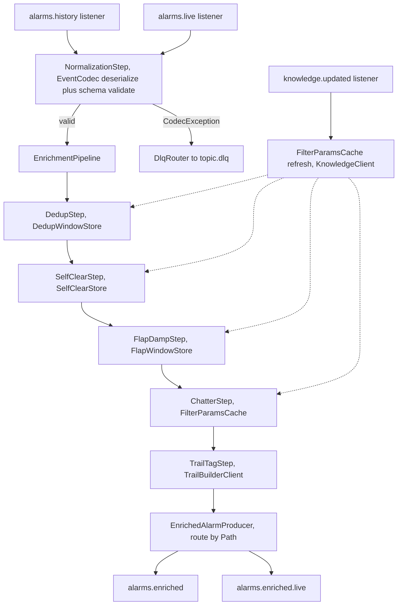
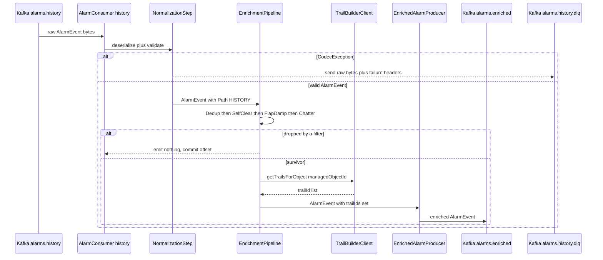
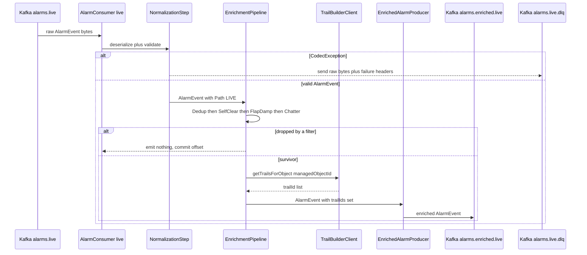
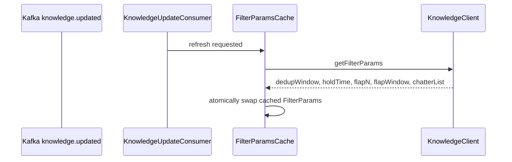
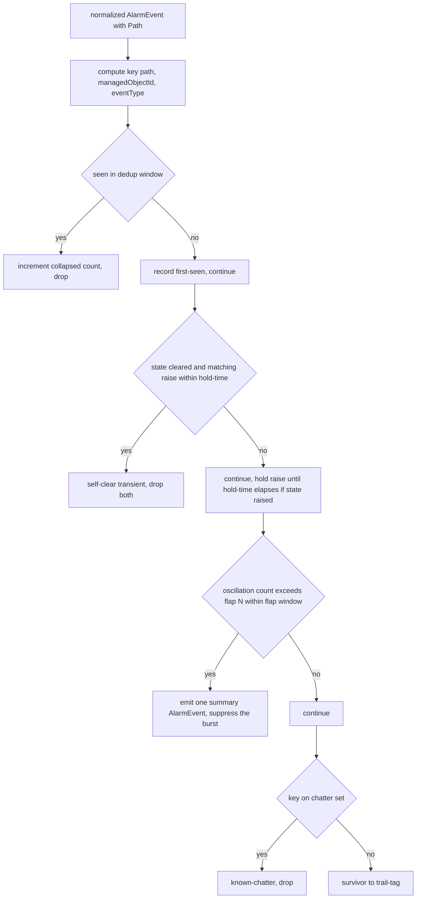

# enrichment — Design

First-stage alarm processing for the platform: normalize, deduplicate, deterministic
noise-filter, and trail-tag raw alarms, emitting enriched `AlarmEvent`s. Active in **both
P2 (history path) and P3 (live path)** — the only service Active in two runtime phases, with
one codebase serving both. This design realizes every task and acceptance criterion in the
approved, merged `services/enrichment/spec.md`.

## Stack

- **Language / runtime:** Java 17 (eclipse-temurin), Spring Boot 3.x.
- **Messaging:** Spring for Apache Kafka (`spring-kafka`) — plain consumer/producer model
  (no Kafka Streams; see Design alternatives). At-least-once delivery; idempotent producer
  (`enable.idempotence=true`, `acks=all`).
- **Event contract:** `com.acp:event-model` (frozen Java/Jackson binding) — `EventCodec`,
  `SchemaVersionPolicy`, `ManagedObjectId`, generated `AlarmEvent` POJO. Schema validation is
  the codec's responsibility; `CodecException` and its subtypes are the DLQ signal.
- **HTTP clients (outbound):** Spring `RestClient` (blocking) for Trail Builder and Knowledge,
  with **Resilience4j** for retry plus circuit-breaker. Clients are generated from each
  collaborator's published **OpenAPI 3.1** spec (no dependency on collaborator source).
- **Windowed state:** in-process bounded per-key state (Caffeine-backed time-bounded maps)
  for dedup, self-clear, and flap detection. No external store (see Data model).
- **Build:** Gradle (Java 17 toolchain), JUnit 5 unit/contract tests, Testcontainers for
  integration. Observability via Spring Boot Actuator plus Micrometer/Prometheus.
- **Licenses:** all permissive — Spring Boot/Spring Kafka (Apache-2.0), Jackson (Apache-2.0),
  Resilience4j (Apache-2.0), Caffeine (Apache-2.0), Micrometer (Apache-2.0), JUnit 5 (EPL-2.0),
  Testcontainers (MIT), WireMock (Apache-2.0). No GPL/AGPL/BSL.

## Task breakdown (from the spec)

Every spec **Tasks (high-level)** item is realized below and is traceable to modules and flows.

| Spec task | Realized by (modules / flow) |
|---|---|
| 1. Consume raw `AlarmEvent` from `alarms.history` and `alarms.live` and normalize to the canonical schema | `AlarmConsumer` (two `@KafkaListener`s, one per input topic) plus `NormalizationStep` — deserialize via `event-model` `EventCodec`, validate against the frozen `AlarmEvent` schema, coerce to canonical wire form (UTC `Z` datetimes, lowercase enums) |
| 2. Deduplicate: count-collapse repeated identical alarms on `(managedObjectId, eventType)` within a sliding window | `DedupStep` over `DedupWindowStore` (per-key first-seen timestamp plus collapsed count); window size from Knowledge |
| 3. Self-clear suppression: discard transients that raise and clear within hold-time | `SelfClearStep` over `SelfClearStore` (per-key pending raise plus hold-timer); hold-time from Knowledge |
| 4. Flap-damping: oscillation over N within window collapses to one summary `AlarmEvent` (existing fields only) | `FlapDampStep` over `FlapWindowStore` (per-key raise/clear oscillation counter); N and window from Knowledge; summary shape per the resolved Open question 1 below |
| 5. Known-chatter removal: drop alarms whose `(managedObjectId, eventType)` is on the Knowledge chatter list | `ChatterStep` consulting the cached `FilterParams.chatterSet` |
| 6. Trail-tag each survivor with `trailIds` via Trail Builder `getTrailsForObject(managedObjectId)` | `TrailTagStep` calling `TrailBuilderClient.getTrailsForObject` (Resilience4j-wrapped); sets `AlarmEvent.trailIds` |
| 7. Emit each survivor on the correct output topic (`alarms.enriched` for history, `alarms.enriched.live` for live) | `EnrichedAlarmProducer` — the routing key (history/live) is carried through the pipeline by the `Path` it entered on; the producer maps `Path.HISTORY` to `alarms.enriched` and `Path.LIVE` to `alarms.enriched.live` |
| 8. Consume `knowledge.updated` and refresh filter parameters from the Knowledge API | `KnowledgeUpdateConsumer` (`@KafkaListener` on `knowledge.updated`) triggers `FilterParamsCache.refresh()` calling `KnowledgeClient.getFilterParams()`; cache also primes on startup |
| 10. Route undeserializable / schema-violating messages to the per-topic DLQ | `DlqRouter` — on `CodecException` from `EventCodec`, send the raw bytes to `alarms.history.dlq` or `alarms.live.dlq` (matching the source topic) and continue |

> The spec's task list numbers 1-8 then 10 (no 9 in the spec); all present items are realized.
> Acceptance criterion 9 ("same instance handles both paths") is realized structurally by the
> single deployment hosting both listeners and one shared `EnrichmentPipeline` bean.

## Phase applicability (design view)

Matches the canonical phase map in `architecture.md` (enrichment row): **Idle / Active / Active**.

| Phase | Active/Passive/Idle | Modules/handlers exercised | Inputs/Outputs |
|---|---|---|---|
| P1 — Topology onboarding | Idle | None of the alarm listeners fire (no alarms flow). `FilterParamsCache` may still prime on startup but performs no enrichment. Health/metrics endpoints live. | None (dormant) |
| P2 — Pattern learning | Active | `AlarmConsumer` (history listener), full `EnrichmentPipeline` (Normalize, Dedup, SelfClear, FlapDamp, Chatter, TrailTag), `EnrichedAlarmProducer` (history route), `KnowledgeUpdateConsumer`, `TrailBuilderClient`, `KnowledgeClient`, `DlqRouter` | In: `alarms.history` (Kafka), Trail Builder `getTrailsForObject`, Knowledge filter-params API, `knowledge.updated`; Out: `alarms.enriched` (Kafka), `alarms.history.dlq` |
| P3 — Real-time correlation | Active | Same modules; `AlarmConsumer` (live listener) and `EnrichedAlarmProducer` (live route). Identical pipeline code and instance. | In: `alarms.live` (Kafka), Trail Builder `getTrailsForObject`, Knowledge filter-params API, `knowledge.updated`; Out: `alarms.enriched.live` (Kafka), `alarms.live.dlq` |

In a deployment serving both phases simultaneously, both listeners are active concurrently in
the same process; each message carries its origin `Path` so the producer routes its output
correctly.

## Module breakdown

- **`AlarmConsumer`** — two `@KafkaListener` methods (history, live). Each receives raw bytes
  plus the source topic, hands to `NormalizationStep`, and on success injects the `Path` and
  drives the shared `EnrichmentPipeline`.
- **`NormalizationStep`** — wraps `event-model` `EventCodec.deserialize`; returns a validated
  `AlarmEvent` or raises `CodecException` (routed to DLQ). Confirms the envelope `type` is
  `AlarmEvent` and the major `schemaVersion` is supported (codec rejects version 2 or higher).
- **`EnrichmentPipeline`** — ordered composition of `DedupStep`, `SelfClearStep`,
  `FlapDampStep`, `ChatterStep`, `TrailTagStep`. Each step returns one of: pass-through alarm,
  drop (emit nothing), or replace (a summary alarm). One shared bean used by both listeners.
- **`*WindowStore`** beans — bounded, time-expiring per-key state (Caffeine). Keys are
  `(managedObjectId, eventType)` plus the originating `Path` so history and live state never mix.
- **`FilterParamsCache`** — holds the current `FilterParams` (dedup window, hold-time, flap N,
  flap window, chatter set) fetched from the Knowledge API; primed on startup; refreshed on
  `knowledge.updated`. Read by Dedup, SelfClear, FlapDamp, Chatter — no threshold is hard-coded.
- **`TrailBuilderClient`** / **`KnowledgeClient`** — Resilience4j-wrapped HTTP clients built
  from each collaborator's published OpenAPI; base URL plus `mock|real` toggle from config.
- **`EnrichedAlarmProducer`** — serializes the enriched `AlarmEvent` via the codec and sends to
  the topic chosen by `Path`. Idempotent producer config.
- **`DlqRouter`** — sends offending raw bytes (plus failure metadata headers) to the matching
  `<topic>.dlq` and commits the source offset so processing continues.
- **`KnowledgeUpdateConsumer`** — listens to `knowledge.updated` and triggers cache refresh.

## Data model / DB schema

**N/A — no owned store.** Enrichment owns no relational/graph datastore (consistent with
`architecture.md` "Data stores & ownership", where the live alarm store is owned by the Alarm
Manager and historical alarms are mined in-flight, not persisted). It holds only **transient,
bounded, in-process windowed state** needed for dedup, self-clear, and flap detection:

| Store (in-memory) | Key | Value | Expiry |
|---|---|---|---|
| `DedupWindowStore` | `(path, managedObjectId, eventType)` | first-seen timestamp plus collapsed count | dedup-window duration (from Knowledge) |
| `SelfClearStore` | `(path, managedObjectId, eventType)` | pending raise timestamp plus the held raise alarm | hold-time duration (from Knowledge) |
| `FlapWindowStore` | `(path, managedObjectId, eventType)` | rolling oscillation count plus window-start timestamp plus first raise alarm | flap-window duration (from Knowledge) |

State is ephemeral by design: on restart the windows reset (the next duplicate/transient/flap
is re-evaluated from scratch). This is acceptable because windows are short and the platform is
at-least-once, not exactly-once; no durability guarantee is promised for windowed collapsing.
There is intentionally no schema to version, no `snapshotId`, and no persisted dedupe table —
envelope/alarm idempotency is handled by the in-window key, not a database.

## Event handling

**Consumers**

| Topic | Handler | Idempotency / dedupe | DLQ routing |
|---|---|---|---|
| `alarms.history` | `AlarmConsumer.onHistory` then pipeline (Path HISTORY) | Envelope `eventId` guards exact redelivery, alarm `alarmId` plus `(managedObjectId, eventType)` window guards alarm dedup | `alarms.history.dlq` on `CodecException` or unsupported major `schemaVersion` |
| `alarms.live` | `AlarmConsumer.onLive` then pipeline (Path LIVE) | same as above | `alarms.live.dlq` |
| `knowledge.updated` | `KnowledgeUpdateConsumer.onUpdate` then `FilterParamsCache.refresh` | refresh is idempotent (full re-fetch, last-writer-wins); no per-event side effect | not applicable — a malformed `knowledge.updated` logs a warning and leaves the last-good cache in place (it never blocks alarm processing) |

Idempotency detail: Kafka is at-least-once, so the same envelope can be redelivered. A small
recently-seen `eventId` set (bounded, time-expiring) short-circuits exact redelivery before the
pipeline; alarm-level dedup is the `(managedObjectId, eventType)` window from task 2. Dedupe is
on both `eventId` (envelope) and `alarmId` (payload) per the platform invariant.

**Producers**

| Topic | Payload (from `libs/event-model`) | Notes |
|---|---|---|
| `alarms.enriched` | `AlarmEvent` (envelope `type=AlarmEvent`) | history survivors; `source=enrichment`, `traceId` propagated from the input envelope |
| `alarms.enriched.live` | `AlarmEvent` | live survivors; `traceId` propagated |

The producer always emits a schema-valid `AlarmEvent` (re-validated by the codec on serialize):
all required fields present, `managedObjectId` matching `<objectType>:<id>`, `trailIds` a
non-null array (empty `[]` allowed).

## API contracts / API schema

**N/A — no HTTP surface.** Enrichment is a pure Kafka stream processor; it exposes no REST
business API and therefore publishes **no business OpenAPI document**. It exposes only the
operational endpoints required of every service:

- `GET /actuator/health` — liveness plus readiness (readiness gated on Kafka connectivity and
  on `FilterParamsCache` having primed at least once).
- `GET /actuator/prometheus` — Micrometer/Prometheus metrics.

The service's *contract* is therefore entirely the Kafka topic contracts plus the frozen
`AlarmEvent` payload in `libs/event-model`; any change to that payload is a contract change
requiring `architecture.md` plus human approval (none is needed here). Because it exposes no
business HTTP API, the "publish OpenAPI for collaborators" obligation does not apply to its
inbound surface; it still consumes collaborators against *their* published OpenAPI (below).

## Integration points (mock vs. real)

No hard-coded URLs — every outbound dependency resolves by env/config with a `mock|real` toggle.

| Collaborator plus operation | Config keys | mock (unit) | real (integration) |
|---|---|---|---|
| **Trail Builder `getTrailsForObject(managedObjectId)`** returning a `trailId` list | `TRAIL_BUILDER_BASE_URL`, `TRAIL_BUILDER_MODE` | WireMock/MockWebServer stub generated from Trail Builder's published OpenAPI 3.1 spec | real Trail Builder at its Docker Compose address on the integration branch |
| **Knowledge filter-params** returning dedup window, hold-time, flap N, flap window, chatter list | `KNOWLEDGE_BASE_URL`, `KNOWLEDGE_MODE` | WireMock stub generated from Knowledge's published OpenAPI 3.1 spec | real Knowledge Service |

The Trail Builder may now return trails whose members include `Interface` objects (per the
recent topology model change); enrichment is **agnostic to trail composition** — it attaches
whatever `trailId` list the API returns to `AlarmEvent.trailIds` and makes no assumption about
member types. This keeps enrichment domain-agnostic, operating on any alarm.

## Key flows (sequence / data-flow diagrams)

### Enrich pipeline — history path (P2)

### Enrich pipeline — live path (P3)

Both flows are the **same pipeline bean and the same instance**; only the entry listener and the
`Path` differ, which selects the output topic. This is what makes acceptance criteria 7, 8, 9
hold structurally.

### Filter-params refresh

## Algorithm logical flow

The deterministic filter pipeline. Every threshold (dedup window, hold-time, flap N, flap
window, chatter set) is read from `FilterParamsCache` (sourced from Knowledge) — **none are
hard-coded**. Steps run in a fixed order; the first step that drops or replaces an alarm
short-circuits the rest.

**Step semantics**

1. **Dedup (count-collapse).** First alarm for the key within the window passes and records a
   first-seen timestamp; subsequent identical-key alarms within the window are dropped while a
   `collapsedCount` is incremented (exposed as a metric). When the window elapses the key is
   evicted and the next alarm starts a fresh window.
2. **Self-clear suppression (hold-time).** A `raised` alarm is held for `holdTime`; if a matching
   `cleared` for the same key arrives within `holdTime`, the pair is a transient and **nothing is
   emitted**. If the hold-time elapses with no clear, the held `raised` alarm is released to the
   rest of the pipeline. A clear arriving at `holdTime + 1` is **not** suppressed (criterion 11).
3. **Flap-damping (N within window).** Counts raise/clear oscillations per key; when the count
   **exceeds N** within `flapWindow`, the burst is collapsed into a single **summary**
   `AlarmEvent`. An oscillation of `N - 1` is **not** damped (criterion 11).
4. **Known-chatter removal.** If `(managedObjectId, eventType)` is in `chatterSet`, drop.

**Flap-summary shape (resolves design Open question 1 / GH #40 — existing fields only, no
contract change):** the summary reuses the **first** oscillation's identity and fields, with
`alarmId` = the first alarm's `alarmId` (stable, idempotent — re-running the same burst yields
the same summary id), `state = raised`, `raisedAt` = first raise time, and `perceivedSeverity`,
`eventType`, `probableCause`, `managedObjectId` carried from the first alarm. The oscillation
count and window are placed under `vendorRaw` (the open pass-through map) as `flapCount` and
`flapWindowSeconds`. No new top-level `AlarmEvent` field is introduced, so **no contract change
is required**. `trailIds` is set by the downstream TrailTag step like any survivor.

## Seed data & examples

**N/A** — enrichment generates no seed/topology/fixture data (that is the Simulator's role).
Test fixtures are small hand-authored `AlarmEvent` envelopes (e.g. two duplicates on one key, a
raise plus clear transient pair, an N plus 1 oscillation burst, a chatter-listed alarm) plus
stubbed Trail Builder / Knowledge responses; these are illustrative test inputs, not owned seed
data.

## UI wireframes

**N/A** — enrichment has no UI (back-end stream processor).

## Error handling

First-class. Nothing is ever silently dropped without a metric plus a structured log line.

| Failure mode | Handling | Surfaced as |
|---|---|---|
| Undeserializable bytes (malformed JSON) | `EventCodec` raises `CodecException`, `DlqRouter` sends raw bytes plus headers to the matching `<topic>.dlq`, offset committed, processing continues | DLQ message, error log, `dlq_messages_total` metric |
| Unknown major `schemaVersion` (2 or higher) | `SchemaVersionPolicy` via codec rejects with `SchemaVersionException` (a `CodecException` subtype), routed to `<topic>.dlq` exactly as above | DLQ message, error log, metric with reason label |
| `AlarmEvent` schema-invalid (missing required field, bad `managedObjectId`, wrong enum) | codec validation fails with `CodecException`, routed to `<topic>.dlq` | DLQ message, error log, metric |
| **Trail Builder unavailable / error** (resolves design Open question 2 / GH #42) | Resilience4j retry with backoff up to a configured max (`TRAIL_BUILDER_MAX_RETRIES`), on continued failure the alarm is routed to the matching `<topic>.dlq` (NOT emitted with empty `trailIds`, and NOT silently dropped). Rationale below. | DLQ message, error log, `trail_lookup_failures_total`, open-circuit metric |
| Knowledge filter-params fetch fails | Refresh keeps the last-good cached `FilterParams`, if the cache has never primed at startup then readiness stays down (the service does not enrich with unknown thresholds), retry on next `knowledge.updated` or scheduled refresh | error log, readiness down until first prime, metric |
| Duplicate or redelivered envelope (at-least-once) | recently-seen `eventId` short-circuit plus the `(managedObjectId, eventType)` dedup window | dedupe metric, no downstream duplicate |
| Filter drops (self-clear, chatter, dedup-collapse) | intended outcome — emit nothing, increment the per-filter `filtered_total` counter | metric plus debug log, no error |
| Producer send failure | idempotent producer retries, on unrecoverable failure the consumer offset is not committed so the message is reprocessed (at-least-once) | error log, metric |

**Why retry-then-DLQ for Trail Builder unavailability (GH #42):** downstream consumers depend on
trail context — the Noise Filter uses trail grouping for DBSCAN and the Correlation Engine matches
patterns/codebook scoped by trail. Emitting with empty `trailIds` would let trail-less alarms
flow silently and degrade RCA/clustering quality without any operator signal (option a, rejected).
Retry-and-hold (option c) introduces an unbounded hold buffer and ordering complexity the MVP does
not plan for (rejected). **Retry-then-DLQ (option b, bounded)** preserves correctness (no alarm is
processed without its real trail context), gives operators an explicit DLQ signal plus a metric, and
keeps recovery to a replay. The DLQ used is the **input** topic's DLQ (`alarms.history.dlq` or
`alarms.live.dlq`) so reprocessing re-enters the pipeline from the original source.

## Design alternatives

| Consideration | Alternatives considered | Chosen plus rationale |
|---|---|---|
| Stream-processing model | Kafka Streams (DSL/Processor API with RocksDB state stores) vs. plain `spring-kafka` consumer/producer plus in-process windowed state | **Plain spring-kafka plus in-process state.** Windows are short and state is intentionally ephemeral (no durability promised); Kafka Streams adds RocksDB, changelog topics, and repartitioning overhead for state we do not need to survive restarts. The two-listeners-one-pipeline shape (criterion 9) is simpler without a Streams topology per path. |
| Windowed-state store | External Redis vs. Kafka Streams state store vs. in-process Caffeine time-expiring maps | **In-process Caffeine.** No owned store invariant, transient short windows, no cross-instance sharing needed for the MVP (single instance per phase). Avoids a new infra dependency. |
| Trail Builder failure policy (GH #42) | (a) emit empty `trailIds` (b) DLQ (c) retry-and-hold | **(b) retry-then-DLQ.** Preserves downstream trail-context correctness with an explicit operator signal, see Error handling rationale. |
| Flap-summary identity (GH #40) | new synthetic `alarmId` vs. first alarm `alarmId`, new flag field vs. `vendorRaw` metadata | **First alarm `alarmId` plus `vendorRaw.flapCount/flapWindowSeconds`, state raised.** Deterministic/idempotent id, no new contract field, downstream can detect a flap-summary via `vendorRaw` without a schema change. |
| Output routing | topic name embedded in message header vs. carried `Path` enum through the pipeline | **`Path` enum.** Type-safe, set at the listener, drives both the output-topic choice and the DLQ choice, no reliance on a mutable header. |
| Dedup vs. flap ordering | run flap before dedup vs. dedup before flap | **Dedup first.** Count-collapse of identical `(managedObjectId, eventType)` reduces noise the flap counter would otherwise inflate, self-clear then flap then chatter follows, with the cheapest set-membership (chatter) last before the network call. |
| Concurrency of per-key state | partition-affine single-threaded vs. concurrent maps with per-key locking | **Concurrent time-expiring maps keyed by (path, managedObjectId, eventType).** Kafka partitions already affine a key to one consumer thread for ordering, the concurrent map handles the two-listener concurrency safely. |

## Test plan

### Acceptance criterion to test (JUnit 5, unit/contract)

Every spec acceptance criterion maps 1:1 to a named JUnit 5 test. Tests use a Kafka test
harness (embedded/Testcontainers) plus WireMock stubs for Trail Builder and Knowledge.

| # | Acceptance criterion | Test (JUnit 5) | Asserts |
|---|---|---|---|
| 1 | Dedup collapses duplicates on composite key | `DedupStepTest.collapsesDuplicateCompositeKeyWithinWindow` | two same `(managedObjectId, eventType)` within the window produce exactly one `alarms.enriched` message, not two |
| 2 | Dedup does not collapse distinct keys | `DedupStepTest.keepsDistinctEventTypesForSameObject` | two same-`managedObjectId` different-`eventType` within the window produce two separate output messages |
| 3 | Flap-damping produces a single summary | `FlapDampStepTest.collapsesOscillationToSingleSummary` | a burst raising/clearing more than N times within the window yields exactly one summary `AlarmEvent` (state raised, `vendorRaw.flapCount` set), not the full sequence |
| 4 | Self-clear suppression removes transients | `SelfClearStepTest.suppressesTransientClearedWithinHoldTime` | a raise plus clear within hold-time emits no output for that alarm |
| 5 | Known-chatter removal drops listed alarms | `ChatterStepTest.dropsAlarmOnKnowledgeChatterList` | an alarm whose `(managedObjectId, eventType)` is on the Knowledge mock chatter list is not emitted |
| 6 | Every survivor carries correct `trailIds` | `TrailTagStepTest.setsTrailIdsFromTrailBuilder` plus `TrailTagStepTest.setsEmptyArrayWhenTrailBuilderReturnsNone` | emitted `trailIds` exactly equals the Trail Builder mock response (non-empty when trails returned, empty array when none) |
| 7 | History path lands on `alarms.enriched` | `RoutingTest.historyAlarmEmittedOnEnrichedTopic` | an `alarms.history` input survivor appears on `alarms.enriched` and not on `alarms.enriched.live` |
| 8 | Live path lands on `alarms.enriched.live` | `RoutingTest.liveAlarmEmittedOnEnrichedLiveTopic` | an `alarms.live` input survivor appears on `alarms.enriched.live` and not on `alarms.enriched` |
| 9 | Same instance handles both paths | `SameInstanceBothPathsTest.singleInstanceProcessesHistoryAndLive` | one running context with both listeners processes a history alarm and a live alarm to their respective output topics with no separate deployment |
| 10 | Output validates against frozen `AlarmEvent` binding | `OutputContractTest.emittedAlarmDeserializesWithEventModelBinding` | any emitted message deserializes via `event-model` `EventCodec`: required fields present, `managedObjectId` matches the scheme, `trailIds` a non-null array |
| 11 | Thresholds read from Knowledge, not hard-coded | `KnowledgeDrivenThresholdsTest.holdTimePlusOneNotSuppressedAndNMinusOneNotDamped` plus `KnowledgeDrivenThresholdsTest.changingMockValuesChangesOutcome` | with hold-time T and flap N from the mock, a clear at T plus 1s is NOT suppressed and an N minus 1 oscillation is NOT damped, changing the mock values changes filtering with no code change |
| 12 | Poison messages routed to DLQ | `DlqRoutingTest.malformedJsonRoutedToDlqAndProcessingContinues` plus `DlqRoutingTest.unknownMajorSchemaVersionRoutedToDlq` | a malformed or `schemaVersion`-2 message on `alarms.history` lands on `alarms.history.dlq` and a subsequent valid message is still processed (no crash) |

### E2E scenarios (from this design unit's point of view)

Service-scoped end-to-end paths exercised by the integration stage (real Kafka, real Trail
Builder, real Knowledge on the integration branch), including failure/partial paths.

| # | Scenario | Trigger to path | Expected outcome |
|---|---|---|---|
| 1 | History happy path | Simulator replays `alarms.history` with mixed duplicates, transients, flaps, chatter, and clean alarms, Knowledge primed, Trail Builder up | only survivors appear on `alarms.enriched`, each with correct `trailIds`, duplicate/transient/flap/chatter counts reflected in metrics, output schema-valid |
| 2 | Live happy path | Simulator replays `alarms.live` similarly | survivors on `alarms.enriched.live` only, same enrichment behaviour, `traceId` propagated |
| 3 | Both paths concurrently, one instance | history and live streams flowing at once into one running instance | each output lands on the correct topic, per-path windowed state does not cross-contaminate (a history key does not dedup against a live key) |
| 4 | Knowledge re-tune at runtime | operator updates hold-time/flap/chatter then `knowledge.updated` fires | filtering outcome changes for alarms after the refresh with no redeploy, before-refresh alarms used the prior values |
| 5 | Trail Builder outage (failure path) | Trail Builder down while alarms flow | after bounded retries, affected alarms land on the input topic DLQ (`alarms.history.dlq` or `alarms.live.dlq`), failure metric increments, no trail-less alarm is emitted, on recovery a DLQ replay re-enriches them |
| 6 | Poison message resilience (failure path) | a malformed and a `schemaVersion`-2 message injected on `alarms.live` amid valid alarms | both poison messages on `alarms.live.dlq`, valid alarms continue to `alarms.enriched.live`, service stays healthy |
| 7 | Knowledge unavailable at startup (partial path) | start enrichment with Knowledge down | readiness stays down (no enrichment with unknown thresholds), once Knowledge is reachable and the cache primes, readiness flips up and processing begins |

## Config & observability

**Config (all via env, no hard-coded URLs/thresholds):**

| Env var | Purpose |
|---|---|
| `KAFKA_BOOTSTRAP_SERVERS` | Kafka cluster |
| `TRAIL_BUILDER_BASE_URL`, `TRAIL_BUILDER_MODE` (`mock`/`real`) | Trail Builder integration point |
| `TRAIL_BUILDER_MAX_RETRIES`, `TRAIL_BUILDER_RETRY_BACKOFF_MS` | Resilience4j retry policy |
| `KNOWLEDGE_BASE_URL`, `KNOWLEDGE_MODE` (`mock`/`real`) | Knowledge integration point |
| `ENRICHMENT_HISTORY_TOPIC`, `ENRICHMENT_LIVE_TOPIC`, output/dlq topic names | topic overrides (defaults match `architecture.md`) |

Filter parameters — dedup window, hold-time, flap N, flap window, chatter list — are NOT env
vars, they are fetched from the Knowledge API and refreshed on `knowledge.updated` (criterion 11).

**Observability:**

- `GET /actuator/health` — liveness plus readiness (readiness gated on Kafka connectivity and a
  primed `FilterParamsCache`).
- `GET /actuator/prometheus` — Micrometer metrics: `alarms_consumed_total{path}`,
  `alarms_emitted_total{path}`, `filtered_total{filter=dedup|self_clear|flap|chatter}`,
  `dlq_messages_total{topic,reason}`, `trail_lookup_failures_total`, `knowledge_refresh_total`,
  pipeline latency timer, circuit-breaker state gauges.
- Structured JSON logs with the envelope `traceId` propagated on every line.

## Build & run

- **Build:** `./gradlew --no-daemon clean build` (Java 17 toolchain) — runs JUnit 5 unit/contract
  tests with WireMock stubs and an embedded/Testcontainers Kafka, produces a runnable Spring Boot
  jar. Depends on the published `com.acp:event-model` jar.
- **Dockerfile (`eclipse-temurin:17-jdk` build stage, `:17-jre` runtime):** multi-stage —
  build stage runs `./gradlew build`, runtime stage copies the boot jar, exposes the Actuator
  port (`/actuator/health`, `/actuator/prometheus`), and sets `ENTRYPOINT ["java","-jar","app.jar"]`.
  All config comes from env, a Compose entry wires `KAFKA_BOOTSTRAP_SERVERS`, the Trail Builder
  and Knowledge base URLs, and `*_MODE=real` on the integration branch.
- **Local run:** `docker compose up enrichment` against the integration stack (real Kafka,
  Trail Builder, Knowledge), or run the jar with `*_MODE=mock` for isolated local testing.
