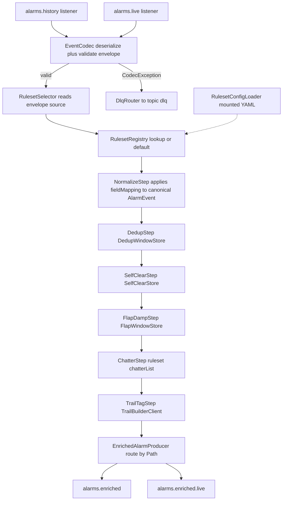
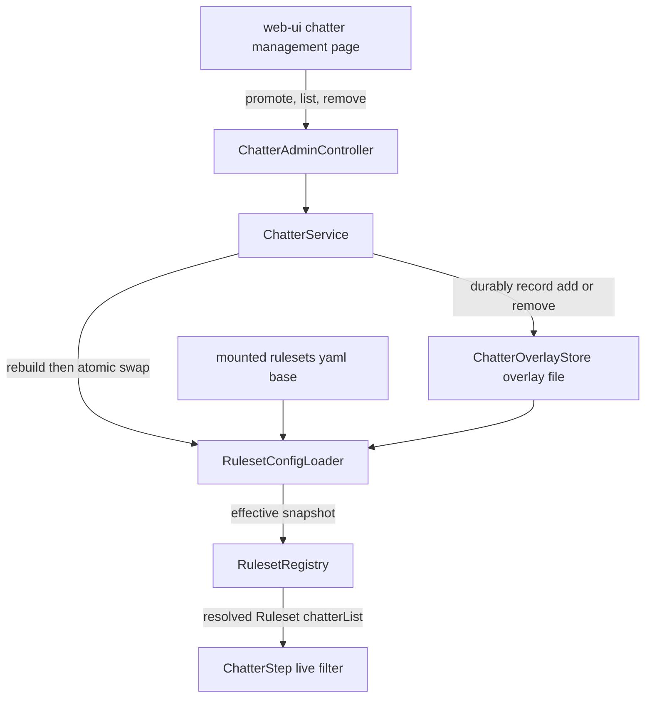
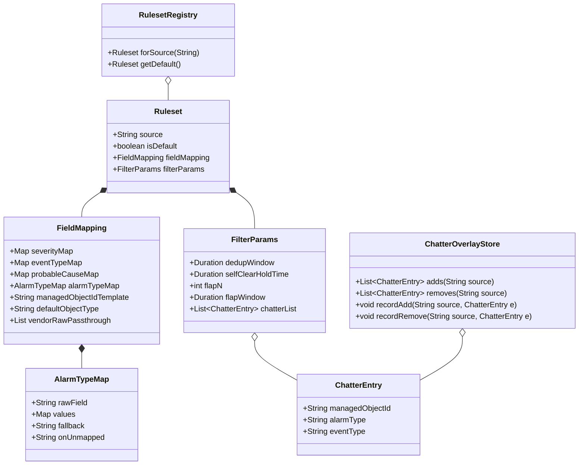
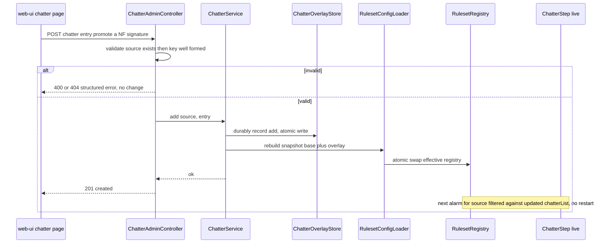
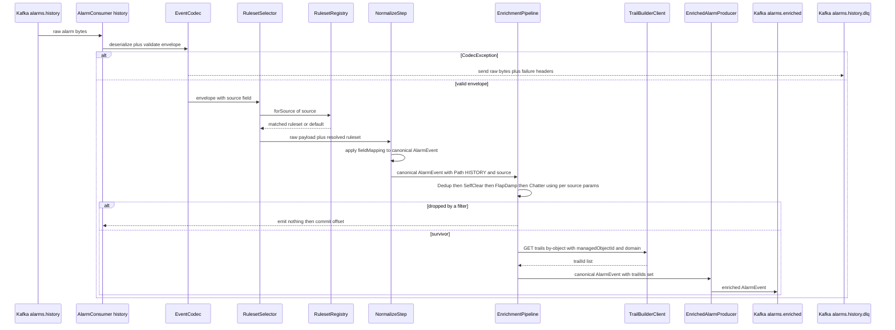
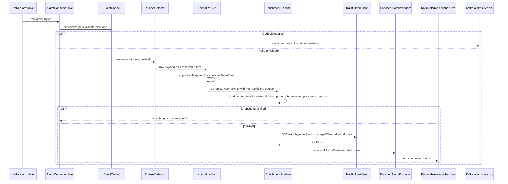
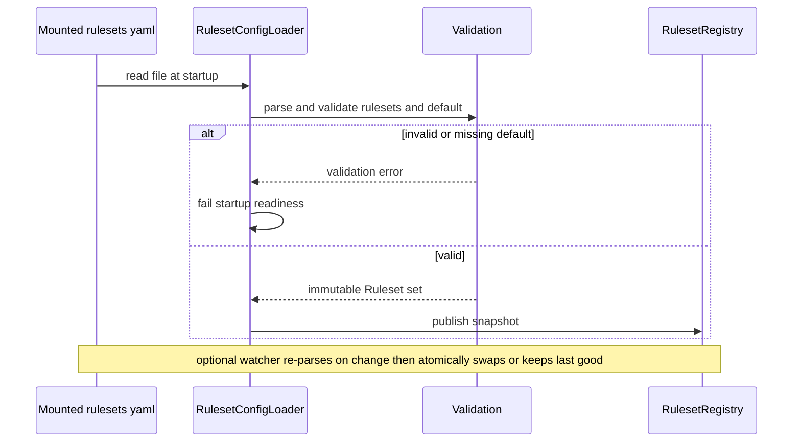
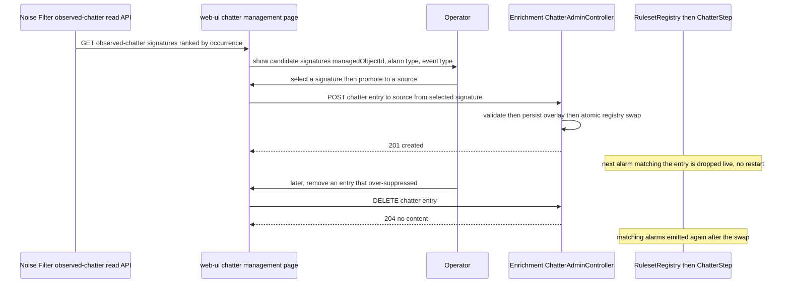
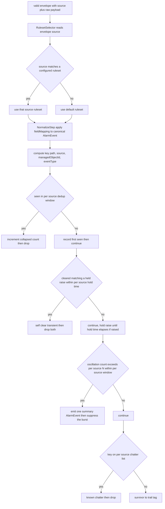

# enrichment — Design

First-stage alarm processing for the platform: a **source-aware, configuration-driven
normalizer**. Different ingestion sources (NMS/vendor feeds) inject raw alarms in different
formats; Enrichment selects a **per-source ruleset**, applies that ruleset's field mapping to
produce the single canonical `AlarmEvent`, runs a fixed deterministic filter pipeline using
that ruleset's per-source parameters, trail-tags survivors, and emits canonical `AlarmEvent`s.
Active in **both P2 (history path) and P3 (live path)** — the only service Active in two runtime
phases, with one codebase serving both. This design realizes every task and acceptance criterion
in the approved, merged `services/enrichment/spec.md`.

> **Supersedes the prior design (PR #100).** That design was authored against the pre-revision
> spec (Knowledge-sourced filter params, a `knowledge.updated` consumer, a `KnowledgeClient`).
> This rework reflects the merged source-ruleset spec: per-source rulesets are Enrichment's
> **own** configuration (no Knowledge dependency for pipeline params), the normalizer is
> source-aware, and the output is canonical regardless of source.
>
> **This revision adds the consumer side of the noise→live chatter feedback loop (Step F).**
> The Noise Filter records observed-noise/chatter signatures and serves them on its own read
> API; the web-ui chatter-management page shows them; the **operator promotes** a selected
> signature into a source's known-chatter list by calling **Enrichment's new chatter-management
> HTTP API** (this design's `ChatterAdminController`). Enrichment applies the promotion **live**
> — the chatter list stays **Enrichment-owned** per-source ruleset config and the existing
> ruleset hot-reload path makes a promoted entry take effect with **no restart**. This is
> Enrichment's **first published HTTP business surface** (OpenAPI 3.1 at `/openapi.json`). It
> adds **no Kafka topic and no `event-model` change** — the chatter list is existing config and
> the API is a service-owned HTTP surface. The fixed pipeline stages/order, per-source mapping,
> `NormalizeStep` `alarmType` population, the frozen Trail-Builder by-object client, DLQ
> routing, and Phase applicability are **unchanged**; only the chatter *list* becomes editable.

## Stack

- **Language / runtime:** Java 17 (eclipse-temurin), Spring Boot 3.x.
- **Messaging:** Spring for Apache Kafka (`spring-kafka`) — plain consumer/producer model
  (no Kafka Streams; see Design alternatives). At-least-once delivery; idempotent producer
  (`enable.idempotence=true`, `acks=all`).
- **Event contract:** `com.acp:event-model` (frozen Java/Jackson binding) — `EventCodec`,
  `SchemaVersionPolicy`, `ManagedObjectId`, generated envelope plus `AlarmEvent` POJO. Schema
  validation is the codec's responsibility; `CodecException` and its subtypes are the DLQ signal.
- **Configuration binding:** Spring Boot `@ConfigurationProperties` over a mounted YAML rulesets
  file (`SnakeYAML`, already a Spring Boot dependency). Optional hot-reload via a file watcher
  (see Config model) — owned entirely by Enrichment, never Knowledge.
- **HTTP clients (outbound):** Spring `RestClient` (blocking) for Trail Builder, with
  **Resilience4j** for retry plus circuit-breaker. The client is generated from Trail Builder's
  published **OpenAPI 3.1** spec (no dependency on collaborator source).
- **HTTP server (inbound, NEW):** Spring Web MVC `@RestController` for the chatter-management API,
  with **springdoc-openapi** publishing **OpenAPI 3.1** at `/openapi.json` (+ Swagger UI). The
  generated `services/enrichment/openapi.json` is checked in as the contract source of truth.
- **Windowed state:** in-process bounded per-key state (Caffeine-backed time-bounded maps) for
  dedup, self-clear, and flap detection, keyed to include the resolved source. No external store
  (see Data model).
- **Build:** Gradle (Java 17 toolchain), JUnit 5 unit/contract tests, Testcontainers for
  integration. Observability via Spring Boot Actuator plus Micrometer/Prometheus.
- **Licenses:** all permissive — Spring Boot/Spring Kafka/Spring Web (Apache-2.0), Jackson
  (Apache-2.0), SnakeYAML (Apache-2.0), springdoc-openapi (Apache-2.0), Resilience4j (Apache-2.0),
  Caffeine (Apache-2.0), Micrometer (Apache-2.0), JUnit 5 (EPL-2.0), Testcontainers (MIT), WireMock
  (Apache-2.0). No GPL/AGPL/BSL.

## Task breakdown (from the spec)

Every spec **Tasks (high-level)** item is realized below and traceable to modules and flows.

| Spec task | Realized by (modules / flow) |
|---|---|
| 1. Select the matching per-source ruleset for each incoming alarm, or the default when no source-specific match is found | `RulesetSelector` reads the envelope `source` field, looks it up in `RulesetRegistry`; on miss returns the `default` ruleset. Selection happens before any other stage. |
| 2. Apply the field-mapping portion of the matched ruleset to translate raw fields into the canonical `AlarmEvent` | `NormalizeStep` applies `Ruleset.fieldMapping` (severity-code map, eventType map, **alarmType map**, managedObjectId construction template, probableCause map, vendorRaw pass-through) and emits a canonical `AlarmEvent` validated against the frozen `event-model` binding. The required canonical `alarmType` join token is set from the source's `alarmTypeMap` (see NormalizeStep and Config model). |
| 3. Deduplicate: count-collapse repeated identical alarms on `(managedObjectId, eventType)` within the per-source dedup window | `DedupStep` over `DedupWindowStore` keyed `(source, managedObjectId, eventType)`; window size from `Ruleset.filterParams.dedupWindow` |
| 4. Self-clear suppression using the per-source hold-time | `SelfClearStep` over `SelfClearStore`; hold-time from `Ruleset.filterParams.selfClearHoldTime` |
| 5. Flap-damping using per-source N/window then one summary `AlarmEvent` (existing fields only) | `FlapDampStep` over `FlapWindowStore`; N and window from `Ruleset.filterParams.flapN` / `flapWindow`; summary shape per resolved Open question #40 below |
| 6. Known-chatter removal using the per-source chatter list | `ChatterStep` consulting `Ruleset.filterParams.chatterList` for the resolved source |
| 7. Trail-tag each survivor with `trailIds` via Trail Builder `getTrailsForObject(managedObjectId)` | `TrailTagStep` calling `TrailBuilderClient.getTrailsForObject(managedObjectId, domain)` against the **frozen** `GET /trails/by-object?managedObjectId={moId}&domain={domain}` contract (Resilience4j-wrapped); sets `AlarmEvent.trailIds` from the response `trailIds[]` |
| 8. Emit each survivor on the correct output topic (`alarms.enriched` for history, `alarms.enriched.live` for live) | `EnrichedAlarmProducer` — the `Path` (HISTORY/LIVE) the alarm entered on selects the output topic |
| 9. Route undeserializable / schema-violating messages to the per-topic DLQ | `DlqRouter` — on `CodecException` from `EventCodec`, send raw bytes to `alarms.history.dlq` or `alarms.live.dlq` (matching the source topic) and continue |
| 10. Serve a chatter-management HTTP API (read + write) over a source's known-chatter list; persist edits and hot-apply them live | `ChatterAdminController` (Spring `@RestController`, springdoc OpenAPI 3.1) backed by `ChatterOverlayStore` (durable per-source chatter overlay) and `RulesetConfigLoader.applyChatterEdit(...)` (atomic registry swap). `GET /api/v1/sources/{source}/chatter` lists entries, `POST` adds one, `DELETE` removes one. The entry mirrors the `ChatterStep` chatter key `(managedObjectId?, alarmType?, eventType)`. Persisted to a chatter overlay store layered on the YAML; the existing hot-reload swap makes a promoted/removed entry filter live with no restart. See **API contracts / API schema** and **Chatter edit persistence and hot-apply** below. |

> The fixed stage order (spec "Processing stages are fixed") is: select ruleset then Normalize
> (mapping) then Dedup then SelfClear then FlapDamp then Chatter then TrailTag then Emit.
> Configuration supplies the mapping and parameters consumed inside these stages; it never adds,
> removes, reorders, or plugs in stages.
>
> Acceptance criterion 9 ("same instance handles both paths") is realized structurally by the
> single deployment hosting both listeners and one shared `EnrichmentPipeline` bean.

## Phase applicability (design view)

Matches the canonical phase map in `architecture.md` (enrichment row): **Idle / Active / Active**.

| Phase | Active/Passive/Idle | Modules/handlers exercised | Inputs/Outputs |
|---|---|---|---|
| P1 — Topology onboarding | Idle (pipeline) / Passive (chatter API) | No alarm listeners fire (no alarms flow). `RulesetRegistry` loads rulesets on startup but performs no enrichment. Health/metrics live. The `ChatterAdminController` is served (chatter management is phase-independent operator administration). | In/Out: chatter management API (web-ui); else dormant |
| P2 — Pattern learning | Active | `AlarmConsumer` (history listener), `RulesetSelector`, full `EnrichmentPipeline` (Normalize, Dedup, SelfClear, FlapDamp, Chatter, TrailTag), `EnrichedAlarmProducer` (history route), `TrailBuilderClient`, `DlqRouter`, `RulesetRegistry`; `ChatterAdminController` served (operator promotes NF-observed chatter; takes effect on the live filter path) | In: `alarms.history` (Kafka), Trail Builder `getTrailsForObject`, chatter API (web-ui); Out: `alarms.enriched` (Kafka), `alarms.history.dlq` |
| P3 — Real-time correlation | Active | Same modules; `AlarmConsumer` (live listener) and `EnrichedAlarmProducer` (live route). Identical pipeline code and instance. `ChatterAdminController` served. | In: `alarms.live` (Kafka), Trail Builder `getTrailsForObject`, chatter API (web-ui); Out: `alarms.enriched.live` (Kafka), `alarms.live.dlq` |

In a deployment serving both phases simultaneously, both listeners are active concurrently in the
same process; each alarm carries its origin `Path` (selecting the output topic) and its resolved
`source` (partitioning windowed state).

The **chatter-management API is phase-independent**: it is an operator administration surface
(promote/list/remove chatter entries) served whenever the service is up. A promotion edits the
per-source ruleset config and hot-applies, so it influences the **live** filter path (P2 history
and P3 live alike) without a restart. The API itself emits/consumes no Kafka.

## Module breakdown



- **`AlarmConsumer`** — two `@KafkaListener` methods (history, live). Each receives raw bytes plus
  the source topic, hands to the codec, and on success injects the `Path` and drives the shared
  `EnrichmentPipeline`.
- **`RulesetConfigLoader`** — loads the mounted YAML rulesets file at startup into immutable
  `Ruleset` objects, validates each (well-formed mapping, sane parameters, exactly one `default`),
  and publishes them into `RulesetRegistry`. Optionally watches the file for hot-reload (see
  Config model). Bad config fails startup readiness (see Error handling).
- **`RulesetRegistry`** — holds all `Ruleset`s indexed by source identifier, plus the mandatory
  `default` ruleset. Immutable snapshot, atomically swapped on reload. Read by `RulesetSelector`.
- **`RulesetSelector`** — given the deserialized envelope, reads the envelope `source` field and
  returns `registry.forSource(source)`, falling back to `registry.getDefault()` when no
  source-specific ruleset matches (criterion 13). Always returns exactly one `Ruleset`.
- **`NormalizeStep`** — the single place per-source field mapping is applied. Takes the raw alarm
  payload plus the resolved `Ruleset.fieldMapping` and produces a canonical `AlarmEvent`
  (severity/eventType/probableCause translation, **canonical `alarmType` translation via
  `alarmTypeMap`**, `managedObjectId` construction, `vendorRaw` pass-through). **It sets the
  REQUIRED canonical `AlarmEvent.alarmType` join token** from the source's `alarmTypeMap`
  (raw-alarm-type to `alarmTypeVocabulary` token); see the `alarmType` population rule below. All
  downstream stages and the output operate only on this canonical form (canonical-output
  invariant). `alarmType` is the canonical join token used by mining, codebook signatures,
  `rootCauseAlarmType`, and correlation matching — **distinct from** `eventType` (the X.733
  category) and `probableCause` (the X.733 probable cause).

  **`alarmType` population rule (REQUIRED field).** Each per-source `fieldMapping.alarmTypeMap`
  maps that source's raw alarm-type identifier to a canonical token from the domain's Knowledge
  `alarmTypeVocabulary` (`FiberFault`, `LOS`, `PortDown`, `InterfaceDown`, `LinkDown`, `AdjDown`,
  `LSPDown`, `ReachabilityLoss`). `NormalizeStep` reads the raw alarm-type value from the field
  named by `alarmTypeMap.rawField` (e.g. `rawEventType`/`rawAlarmType`), looks it up in the
  source's `alarmTypeMap.values`, and sets `AlarmEvent.alarmType` to the mapped token. Behaviour
  when the raw alarm-type is **unmapped** is governed by `alarmTypeMap.onUnmapped`:
  - `default` (recommended, the configured `alarmTypeMap.fallback` token, e.g. a domain-sensible
    catch-all) — set `alarmType` to the fallback vocabulary token and increment
    `alarmtype_fallback_total{source}`. Guarantees every emitted alarm carries a valid token.
  - `dlq` — route the alarm to the input topic's DLQ with reason `alarmtype_unmapped` (used by
    deployments that prefer to surface gaps rather than mask them). Never emit an alarm without
    `alarmType`.
  In **all** cases an emitted `AlarmEvent` carries a non-null `alarmType` that is a member of the
  domain's `alarmTypeVocabulary`; the codec re-validates `alarmType` is present on serialize
  (canonical-output invariant). The fallback token itself MUST be a valid vocabulary token, and
  config validation rejects an `alarmTypeMap` whose values/fallback are not vocabulary tokens.

  > **UPDATE (FIX #2) — the `alarmTypeVocabulary` is now Knowledge-sourced, not hard-coded.** The
  > validation vocabulary is fetched at startup from the Knowledge Service (the single source of
  > truth for the authored domain vocabulary) via a read-only `KnowledgeClient`:
  > `GET /domains/{domain}/alarm-type-vocabulary` — served by Knowledge's generic list endpoint
  > `GET /domains/{domain}/{recordType}` (recordType = kebab `alarm-type-vocabulary`, NO `/api/v1`),
  > returning a LIST of `RecordResponse` envelopes; Enrichment reads the current element's
  > `payload.alarmTypes[]` (envelope-vs-payload lesson). This corrects the prior defect where the
  > vocabulary was a hard-coded **8-token** set (`AlarmTypeVocabulary.CORE_IP`), which would have
  > rejected the ~22 non-MVP tokens of the real **30-token** Core IP vocabulary and blocked a
  > correct simulator identity ruleset. If Knowledge is unreachable at startup the client degrades
  > to a documented offline **30-token** fallback (`AlarmTypeVocabulary.CORE_IP_FALLBACK`, mirroring
  > `core-ip/alarm-type-vocabulary/default`) with a logged **warning** — it never silently runs on a
  > truncated set. This is the domain **vocabulary** only; it does **not** reintroduce a Knowledge
  > dependency for pipeline tuning params (dedup/flap/self-clear thresholds remain Enrichment-owned
  > ruleset config per the Configuration-ownership invariant). The integration point is
  > config-switchable (`KNOWLEDGE_BASE_URL`, `KNOWLEDGE_MODE=mock|real`, bounded timeouts) exactly
  > like the Trail Builder point; its path is verified against Knowledge's published OpenAPI by
  > `KnowledgeClientContractTest`. The eight-token list quoted above is now illustrative only — the
  > authoritative value space is Knowledge's `alarm-type-vocabulary` record.
- **`EnrichmentPipeline`** — ordered composition of `DedupStep`, `SelfClearStep`, `FlapDampStep`,
  `ChatterStep`, `TrailTagStep`. Each step reads the resolved `Ruleset.filterParams`. Each returns
  one of: pass-through, drop (emit nothing), or replace (a summary alarm). One shared bean used by
  both listeners.
- **`*WindowStore`** beans — bounded, time-expiring per-key state (Caffeine). Keys are
  `(source, managedObjectId, eventType)` plus the originating `Path`, so history/live state never
  mix and per-source windows are independent (criterion 11).
- **`TrailBuilderClient`** — Resilience4j-wrapped HTTP client against Trail Builder's **frozen**
  `getTrailsForObject` contract: `GET /trails/by-object?managedObjectId={moId}&domain={domain}` →
  `{ managedObjectId, domain, trailIds: string[] }`. Enrichment passes the alarm's
  `managedObjectId` and its `domain`, and sets `AlarmEvent.trailIds` from the response `trailIds[]`
  (empty `[]` when none). Base URL plus `mock|real` toggle from config; the mock stub is generated
  from Trail Builder's checked-in `openapi.json`.
- **`EnrichedAlarmProducer`** — serializes the enriched canonical `AlarmEvent` via the codec and
  sends to the topic chosen by `Path`. Idempotent producer config.
- **`DlqRouter`** — sends offending raw bytes (plus failure metadata headers) to the matching
  `<topic>.dlq` and commits the source offset so processing continues.
- **`ChatterAdminController`** (NEW) — Spring `@RestController` serving the chatter-management
  HTTP API (springdoc-generated OpenAPI 3.1 at `/openapi.json`, checked into
  `services/enrichment/openapi.json`). `GET /api/v1/sources/{source}/chatter` lists the source's
  chatter entries; `POST` adds an entry (operator-promoted NF signature); `DELETE` removes one.
  Validates the source exists and the entry has a well-formed chatter key (`eventType` required;
  at least one of `managedObjectId`/`alarmType`), then delegates to `ChatterService`. It does
  **not** call the Noise Filter; promotion is operator-mediated (the web-ui calls this API).
- **`ChatterService` + `ChatterOverlayStore`** (NEW) — `ChatterService` orchestrates a chatter
  edit: it (1) durably records the add/remove in `ChatterOverlayStore` (a small append-only
  per-source overlay file, see Chatter edit persistence), then (2) asks `RulesetConfigLoader`
  to rebuild the effective registry snapshot (base YAML rulesets + overlay merged) and
  **atomically swap** it into `RulesetRegistry`. The merge layers each source's effective
  `chatterList` = base YAML entries plus overlay adds, minus overlay removes. Because the live
  `ChatterStep` reads `chatterList` from the resolved `Ruleset` in the (now swapped) registry,
  the promoted/removed entry takes effect on the very next alarm — no restart. The overlay is
  the durable home, so edits survive restart; only the **chatter list** is editable this way —
  field mappings and filter parameters remain edited via the mounted YAML.

The component diagram below adds the chatter-edit path (the alarm pipeline is unchanged):



## Data model / state stores

**N/A — no owned domain store.** Enrichment owns no relational/graph datastore (consistent with
`architecture.md` "Data stores & ownership": the live alarm store is owned by the Alarm Manager,
historical alarms are mined in-flight). It holds only **transient, bounded, in-process windowed
state** for dedup, self-clear, and flap detection. The per-source rulesets are **configuration**,
not a datastore (loaded from a mounted file, see Config model).

The **chatter overlay** (`ChatterOverlayStore`) added by this revision is likewise **configuration,
not a domain datastore**: a small per-source file recording operator chatter edits (adds/removes),
layered onto the mounted YAML's `chatterList`. It carries no alarm payloads — only chatter keys —
and is the durable home that makes promoted entries survive restart. It is single-owned by
Enrichment (the chatter list is Enrichment-owned ruleset config); no other service reads or writes
it. There is still no relational/graph store, no `snapshotId`, and no persisted alarm corpus.

The window stores partition by the resolved source so each source's filter parameters apply
independently:

| Store (in-memory) | Key | Value | Expiry |
|---|---|---|---|
| `DedupWindowStore` | `(path, source, managedObjectId, eventType, state)` | first-seen timestamp plus collapsed count | per-source dedup-window duration |
| `SelfClearStore` | `(path, source, managedObjectId, eventType)` | pending raise timestamp plus the held raise alarm | per-source hold-time duration |
| `FlapWindowStore` | `(path, source, managedObjectId, eventType)` | rolling oscillation count plus window-start timestamp plus first raise alarm | per-source flap-window duration |

> **Dedup is state-aware; self-clear/flap are not — by design.** The `DedupWindowStore` key
> includes the alarm `state` because the dedup stage count-collapses *repeated **identical** alarms*
> (spec criterion 1 / task 3): a `raised` and a `cleared` on the same `(managedObjectId, eventType)`
> are **not** identical and MUST NOT collapse together. If `state` were omitted, a `cleared` would be
> dropped as a "duplicate" of an earlier `raised` and never reach the self-clear / flap stages,
> defeating self-clear suppression (criterion 4) and flap-damping (criterion 3). The `SelfClearStore`
> and `FlapWindowStore` keys deliberately **omit** `state` so they can correlate a raise with its
> later clear (self-clear pairs the two; flap counts the oscillation across states). Criteria 1 and 2
> are unaffected: two same-state duplicates still collapse, and two different `eventType`s still pass
> separately.

> **UPDATE (FIX #3) — windowing is over the alarm's logical `raisedAt` (event time), not
> wall-clock arrival.** All three windowed stages (`DedupStep`, `SelfClearStep`, `FlapDampStep`)
> measure their window against the alarm's own `raisedAt` timestamp, not the wall-clock arrival
> time. The "timestamp" columns above are therefore the alarm's `raisedAt`, not `clock.instant()`.
> Rationale: the spec's dedup is "repeated identical alarms **within the per-source dedup window**"
> — the window is over *alarm time*. In **P2 HISTORY** mode the Simulator batch-replays the whole
> corpus in &lt;1s wall-clock while the alarms' `raisedAt` span ~22h; wall-clock windowing wrongly
> collapsed alarms hours apart as "duplicates" (observed: 2459 alarms, incl. 1642 signal, wrongly
> deduped → whole-corpus signal retention 3.8%). Windowing on `raisedAt` dedups by logical alarm
> time; in **P3 LIVE** mode `raisedAt` ≈ wall-clock arrival, so the behaviour is identical there.
> The parsing helper `EventTime` resolves `raisedAt` (ISO-8601) and falls back to the injected
> `Clock` if it is absent/unparseable (well-defined, never throws inside a stage). `SelfClearStep`
> matches a clear to its held raise on **event time** (the clear's `clearedAt`/`raisedAt` vs the
> raise's `raisedAt`), but its **release sweep** for an un-cleared held raise stays on the
> **wall-clock** `Clock` so held state is flushed in bounded real time regardless of replay speed.



The effective `FilterParams.chatterList` for a source = the mounted YAML's `chatterList` entries
**plus** the overlay's recorded adds, **minus** the overlay's recorded removes. **`ChatterStep`
behaviour is unchanged**: it matches on the existing chatter key `(managedObjectId, eventType)` —
both required for a match. `ChatterEntry` keeps that match key and adds an **optional `alarmType`**
field carried verbatim from the promoted Noise Filter signature for provenance/display (it is not
part of the match — the canonical `alarmType` would already be reflected via the `(managedObjectId,
eventType)` an operator promotes). The NF observed-chatter signature key the operator promotes from
is `(managedObjectId?, alarmType, eventType, trailId?)`; on promotion the `trailId` context is
dropped (Enrichment's chatter match is object/type-scoped, never trail-scoped) and the
`managedObjectId` + `eventType` form the match key (a signature with a NULL `managedObjectId` is a
source-level/type-level candidate — see API validation below).

State is ephemeral by design: on restart the windows reset; the next duplicate/transient/flap is
re-evaluated from scratch. Acceptable because windows are short and the platform is at-least-once,
not exactly-once. There is no schema to version, no `snapshotId`, and no persisted dedupe table.

## Config model (per-source rulesets — NEW)

Per-source rulesets are **Enrichment's own technical configuration** (spec "Configuration
ownership invariant"). They are NOT served by, fetched from, or refreshed via the Knowledge
Service. They are supplied as a mounted YAML file whose path is given by env
`ENRICHMENT_RULESETS_FILE` (default `/config/rulesets.yaml`).

### Source-identification mechanism (resolves [DESIGN-STAGE] open question #3)

**Chosen: use the event envelope `source` field as the ruleset selector, with a documented
fallback to the `default` ruleset when the value matches no configured source.**

Rationale:
- The envelope already carries `source` (`libs/event-model` `envelope.schema.json`, required
  field). It uniquely identifies the originating feed, so **no event-model or `AlarmEvent`
  contract change is required** — satisfying open-question constraint (b).
- A single equality lookup (`registry.forSource(envelope.source)`) selects **exactly one**
  ruleset per alarm, deterministically, satisfying constraint (a). No match-rule predicate engine
  is needed; predicates over arbitrary alarm fields would add a config DSL and the risk of zero or
  multiple matches, both of which violate constraint (a).
- Unmatched sources fall back to the built-in `default` ruleset (never DLQ, never dropped),
  satisfying constraint (c) / acceptance criterion 13.

**Note on the envelope `source` semantics.** The envelope schema describes `source` as
"Originating service name". For raw alarms entering on `alarms.history`/`alarms.live`, the
producing feed (Simulator domain pack, or a future real NMS ingestion adapter) sets `source` to
the **feed/source identifier** (e.g. `nms-alpha`, `vendor-beta`). This is consistent use of the
existing field — the originating producer names itself — and requires **no contract change**.
Enrichment treats `source` as an opaque selector string and matches it against ruleset keys; the
ruleset configuration documents which `source` values the deployment expects. A missing match is
handled gracefully by the default ruleset, not an error.

> No contract change is being designed around here: the selector reuses the existing required
> envelope `source` field exactly as defined. If a future requirement needed a *dedicated* alarm
> source field distinct from the envelope producer, that would be flagged to the human as a
> contract change — it is not needed for this design.

### Ruleset file format

```yaml
# /config/rulesets.yaml — Enrichment-owned configuration
defaultRuleset: default        # name of the ruleset used when no source matches
rulesets:
  - source: default            # MANDATORY built-in fallback ruleset
    fieldMapping:
      defaultObjectType: Node
      managedObjectIdTemplate: "{objectType}:{rawObjectId}"
      severityMap: { "1": CRITICAL, "2": MAJOR, "3": MINOR, "4": WARNING, "5": CLEARED }
      eventTypeMap: {}         # identity passthrough when empty
      probableCauseMap: {}
      # canonical alarmType (REQUIRED on every AlarmEvent) -- raw alarm-type to vocab token
      alarmTypeMap:
        rawField: rawAlarmType          # raw payload field carrying the source alarm-type id
        fallback: ReachabilityLoss      # vocab token used when a raw value is unmapped
        onUnmapped: default             # default | dlq
        values:
          "1": ReachabilityLoss
          "2": LinkDown
          "3": InterfaceDown
      vendorRawPassthrough: ["*"]  # carry the whole raw payload into vendorRaw
    filterParams:
      dedupWindow: 30s
      selfClearHoldTime: 15s
      flapN: 5
      flapWindow: 60s
      chatterList: []
  - source: nms-alpha
    fieldMapping:
      defaultObjectType: Interface
      managedObjectIdTemplate: "Interface:{ne}-{ifIndex}"
      severityMap: { CRIT: CRITICAL, MAJ: MAJOR, MIN: MINOR, WARN: WARNING, CLR: CLEARED }
      eventTypeMap: { LINK_DOWN: communicationsAlarm, LOS: communicationsAlarm }
      probableCauseMap: { LINK_DOWN: linkDown, LOS: lossOfSignal }
      # nms-alpha raw alarm-type tokens to canonical alarmTypeVocabulary tokens
      alarmTypeMap:
        rawField: rawEventType
        fallback: ReachabilityLoss
        onUnmapped: default
        values:
          LINK_DOWN: LinkDown
          LOS: LOS
          PORT_DOWN: PortDown
          IF_DOWN: InterfaceDown
      vendorRawPassthrough: ["ne", "ifIndex", "rawSeverity", "vendorCode"]
    filterParams:
      dedupWindow: 20s
      selfClearHoldTime: 5s       # short, aggressively suppresses transients
      flapN: 3
      flapWindow: 45s
      chatterList:
        - { managedObjectId: "Interface:edge1-12", eventType: linkDown }
  - source: vendor-beta
    fieldMapping:
      defaultObjectType: Port
      managedObjectIdTemplate: "Port:{chassis}-{slot}-{port}"
      severityMap: { P1: CRITICAL, P2: MAJOR, P3: MINOR, P4: WARNING, OK: CLEARED }
      eventTypeMap: { "port-fault": equipmentAlarm, "card-fault": equipmentAlarm }
      probableCauseMap: { "port-fault": equipmentMalfunction }
      # vendor-beta raw alarm-type tokens to canonical alarmTypeVocabulary tokens
      alarmTypeMap:
        rawField: rawAlarmType
        fallback: ReachabilityLoss
        onUnmapped: default
        values:
          "port-fault": PortDown
          "card-fault": FiberFault
          "los": LOS
      vendorRawPassthrough: ["chassis", "slot", "port", "code"]
    filterParams:
      dedupWindow: 60s
      selfClearHoldTime: 120s     # long, holds transients far longer than nms-alpha
      flapN: 8
      flapWindow: 180s
      chatterList: []
```

- **`fieldMapping`** translates raw source fields into canonical `AlarmEvent` fields:
  - `severityMap` — raw severity code to canonical `perceivedSeverity` (X.733 value).
  - `eventTypeMap` / `probableCauseMap` — raw strings to canonical `eventType` (X.733 category) /
    `probableCause` (X.733 probable cause) (empty map = identity passthrough).
  - `alarmTypeMap` — **the canonical alarm-type join-key mapping (drives the REQUIRED
    `AlarmEvent.alarmType` field).** Fields: `rawField` (the raw payload field that carries the
    source's alarm-type id), `values` (raw-alarm-type to canonical `alarmTypeVocabulary` token —
    `FiberFault`/`LOS`/`PortDown`/`InterfaceDown`/`LinkDown`/`AdjDown`/`LSPDown`/`ReachabilityLoss`),
    `fallback` (the vocab token used for unmapped raw values), and `onUnmapped` (`default` = use
    `fallback`; `dlq` = route the alarm to the input DLQ with reason `alarmtype_unmapped`). Every
    emitted alarm carries a valid vocab token in `alarmType`. This is **distinct from**
    `eventTypeMap` (X.733 category) and `probableCauseMap` (X.733 probable cause) — `alarmType` is
    the single token mining, codebook signatures, and correlation join on.
  - `managedObjectIdTemplate` — builds the canonical `objectType:id` from raw fields referenced by
    `{name}` placeholders, resolved from the raw payload; `defaultObjectType` used when the
    template references `{objectType}` and the raw payload omits it.
  - `vendorRawPassthrough` — which raw keys (or `*` for all) are carried verbatim into the
    `vendorRaw` pass-through map.
- **`filterParams`** are the per-source pipeline parameters consumed by the fixed filter stages.

> **UPDATE (FIX #1) — shipped `simulator` identity profile.** The platform's own producer (the
> Simulator) emits `AlarmEvent`s on `alarms.history`/`alarms.live` with envelope `source:
> "simulator"` and **already-canonical** payload fields (managedObjectId in `Type:Id` form, a
> canonical `alarmType` vocabulary token in the `alarmType` field, canonical `eventType`/
> `probableCause`, canonical lowercase `perceivedSeverity`, ISO-8601 `raisedAt`, `state`
> raised/cleared). The shipped `config/rulesets.yaml` therefore includes a `simulator` ruleset that
> is an **identity / passthrough** profile: empty `severityMap`/`eventTypeMap`/`probableCauseMap`
> (identity), and an `alarmTypeMap` with `rawField: alarmType` mapping each of the 30 canonical
> tokens to itself. Without it, `source: simulator` fell through to the `default` ruleset whose
> `alarmTypeMap.rawField` (`rawAlarmType`) is absent from the simulator payload, collapsing **every**
> simulator alarm's `alarmType` to the fallback token (observed: everything became
> `ReachabilityLoss`). This is Enrichment-owned config (not a contract or code change) but is part of
> the shipped default profile so the platform's own source is handled out of the box.

### Loading and hot-reload

- **Load at startup.** `RulesetConfigLoader` parses the YAML, validates it (see Error handling),
  builds immutable `Ruleset`s, and publishes a registry snapshot. If the file is missing,
  unparseable, or has no `default` ruleset, **startup readiness fails** — the service does not
  enrich with unknown/ambiguous configuration.
- **Hot-reload (optional, Knowledge-free).** When `ENRICHMENT_RULESETS_RELOAD=true`, a file
  watcher (`WatchService`) re-parses on change; on success it **atomically swaps** the registry
  snapshot (last-writer-wins), on validation failure it **keeps the last-good snapshot** and logs
  an error plus increments `ruleset_reload_failures_total` (never partially applies, never falls
  back to Knowledge). Reload affects only alarms processed after the swap. This is wholly internal
  to Enrichment; there is no `knowledge.updated` consumer and **no Knowledge dependency for
  pipeline params**. (FIX #2 adds a read-only `KnowledgeClient` used ONLY to fetch the domain
  `alarmTypeVocabulary` at startup for validation — the vocabulary value space is authored in
  Knowledge; this is not a filter-parameter dependency. See the "alarmType population rule" UPDATE.)

### Chatter edit persistence and hot-apply (NEW — the promote/manage write path)

The chatter-management API mutates **only** a source's known-chatter list. The store and the
hot-apply mechanism:

**Store choice — a small chatter overlay layered on the YAML (not in-place YAML rewrite).** The
edit is persisted to a per-source **overlay file** (`ENRICHMENT_CHATTER_OVERLAY_FILE`, default
`/config/chatter-overlay.json`, on a writable mounted volume). An add appends an entry; a remove
records a tombstone. The effective registry is built by **merging** the read-only base
`rulesets.yaml` (`chatterList` + all field mappings/params) with the overlay (adds minus removes)
per source. Rationale below (see Design alternatives DA "chatter edit store"): rewriting the mounted
YAML in place risks corrupting hand-authored config (comments/anchors lost on round-trip), races
the file watcher, and conflates operator promotions with authored base config. The overlay keeps
the base YAML read-only and authoritative for mappings/params, makes operator chatter edits durable
and separable, and is trivial to validate. The overlay is **Enrichment-owned config**, single-owner,
no other service touches it.

**Persist + hot-apply sequence (durable, no restart):**
1. `ChatterAdminController` validates the request (source exists in the base registry; entry has
   `eventType` + `managedObjectId`; well-formed) and calls `ChatterService.add/remove(source, entry)`.
2. `ChatterService` durably writes the add/remove to `ChatterOverlayStore` (atomic file write:
   write-temp-then-rename, fsync) — the change is now persistent and survives restart.
3. `ChatterService` asks `RulesetConfigLoader.rebuildSnapshot()` to recompute the effective
   `Ruleset` set (base YAML + overlay) and **atomically swap** it into `RulesetRegistry` — the same
   atomic-swap path used by the YAML file watcher.
4. The live `ChatterStep` reads `chatterList` from the resolved `Ruleset` in the registry, so the
   **very next alarm** for that source is filtered against the updated list — **no restart**. A
   promoted signature starts being dropped immediately; a removed entry stops being dropped.
5. On restart, `RulesetConfigLoader` loads base YAML **and** replays the overlay into the initial
   snapshot, so promotions are not lost (criterion 20).

Concurrency: chatter edits are serialized through `ChatterService` (a single writer lock around the
overlay write + snapshot rebuild); the registry swap is atomic so in-flight alarms see either the
old or new immutable snapshot, never a partial one. A failed overlay write or rebuild leaves the
last-good registry active and returns a `5xx` (see Error handling) — the edit is all-or-nothing.



## Event handling

**Consumers**

| Topic | Handler | Idempotency / dedupe | DLQ routing |
|---|---|---|---|
| `alarms.history` | `AlarmConsumer.onHistory` then select ruleset then pipeline (Path HISTORY) | Envelope `eventId` guards exact redelivery; alarm `alarmId` plus the `(source, managedObjectId, eventType)` window guards alarm dedup | `alarms.history.dlq` on `CodecException` or unsupported major `schemaVersion` |
| `alarms.live` | `AlarmConsumer.onLive` then select ruleset then pipeline (Path LIVE) | same as above | `alarms.live.dlq` |

There is **no `knowledge.updated` consumer** — filter parameters are per-source config owned by
Enrichment, refreshed (if at all) by the file watcher, not by a Knowledge event.

Idempotency detail: Kafka is at-least-once. A small recently-seen `eventId` set (bounded,
time-expiring) short-circuits exact redelivery before the pipeline; alarm-level dedup is the
`(source, managedObjectId, eventType)` window from task 3. Dedupe is on both `eventId` (envelope)
and `alarmId` (payload) per the platform invariant.

**Producers**

| Topic | Payload (from `libs/event-model`) | Notes |
|---|---|---|
| `alarms.enriched` | `AlarmEvent` (envelope `type=AlarmEvent`) | history survivors; `source=enrichment` on the *output* envelope, `traceId` propagated from the input envelope |
| `alarms.enriched.live` | `AlarmEvent` | live survivors; `traceId` propagated |

> The input envelope `source` (the feed identity) is used only for ruleset selection; the
> **output** envelope `source` is `enrichment` (this service is now the originator). The raw feed
> identity, if needed, is preserved in `vendorRaw` via `vendorRawPassthrough`.

The producer always emits a schema-valid canonical `AlarmEvent` (re-validated by the codec on
serialize): all required fields present — including a non-null **`alarmType`** drawn from the
domain's `alarmTypeVocabulary` (set by `NormalizeStep` from the source's `alarmTypeMap`) —
`managedObjectId` matching `<objectType>:<id>`, `trailIds` a non-null array (empty `[]` allowed).
This holds regardless of source (canonical-output invariant).

## API contracts / API schema

**Chatter-management API — Enrichment's first published HTTP business surface.** Enrichment is
primarily a Kafka stream processor; this revision adds one small read+write HTTP surface for
managing a source's known-chatter list (the promote/manage surface of the noise→live chatter
loop). It is published as **OpenAPI 3.1** at `GET /openapi.json` (springdoc) with Swagger UI at
`/swagger-ui.html`, and the generated `services/enrichment/openapi.json` is **checked in** as the
single source of truth (it drives Enrichment's own provider contract tests and the web-ui's
generated client — collaborators build against this spec, never against source). Per the
`architecture.md` API-contract convention, this new HTTP surface is itself a contract addition
approved via this design+spec PR gate; it adds **no Kafka topic and no `event-model` change**.

Base path `/api/v1`. All bodies JSON.

| Operation | Path + method | Request | Response |
|---|---|---|---|
| List a source's chatter entries | `GET /api/v1/sources/{source}/chatter` | path `source` | `200` `ChatterListResponse`; `404` `Error` if `source` is not a configured ruleset |
| Add (promote) a chatter entry | `POST /api/v1/sources/{source}/chatter` | path `source`, body `ChatterEntry` | `201` `ChatterEntry` (the stored entry); `400` `Error` (malformed key); `404` `Error` (unknown source); `409` `Error` (entry already present) |
| Remove a chatter entry | `DELETE /api/v1/sources/{source}/chatter` | path `source`, body `ChatterEntry` (the key to remove) | `204` no content; `400` `Error`; `404` `Error` (unknown source or entry not present) |

**Schemas** (OpenAPI 3.1; the chatter key mirrors what `ChatterStep` matches on):

```
ChatterEntry:
  managedObjectId: string        # REQUIRED for the match key (e.g. "Interface:edge1-12")
  eventType:       string        # REQUIRED for the match key (canonical X.733 category)
  alarmType:       string | null # OPTIONAL provenance, carried from the promoted NF signature
  promotedFrom:    string | null # OPTIONAL free-text provenance note (e.g. "nf-observed-chatter")

ChatterListResponse:
  source:  string
  entries: ChatterEntry array    # effective list = base YAML + overlay adds - overlay removes
  total:   integer

Error:
  code:    string                # e.g. "unknown_source", "malformed_entry", "duplicate_entry"
  message: string
```

- **Validation.** `POST`/`DELETE` require a well-formed match key: `managedObjectId` **and**
  `eventType` both present and non-blank (that is exactly what `ChatterStep` matches on). A
  request missing either → `400 malformed_entry`, no config change. `source` not in the registry →
  `404 unknown_source`. `POST` of an already-present entry → `409 duplicate_entry` (idempotent
  no-op semantics also acceptable at implementation, but the design surfaces `409` for operator
  clarity). The optional `alarmType`/`promotedFrom` are stored as provenance and never affect the
  match. An NF signature with a NULL `managedObjectId` (source/type-level chatter) is **not
  directly promotable** to a live drop rule here (the match needs `managedObjectId`); the web-ui
  surfaces this as not-yet-promotable for the MVP — Enrichment's match key is unchanged.
- **Persistence + hot-apply.** Every successful write persists to the chatter overlay and triggers
  an atomic registry rebuild+swap, so the change is durable and live with no restart (see "Chatter
  edit persistence and hot-apply").
- **Read-only of NF.** This API does not call the Noise Filter. The web-ui reads NF's
  `GET /api/v1/observed-chatter` (the NF read API) and **writes** promotions to **this** Enrichment
  API; promotion is operator-mediated.

**Operational endpoints (unchanged):**

- `GET /actuator/health` — liveness plus readiness (readiness gated on Kafka connectivity and on
  `RulesetRegistry` having loaded a valid ruleset set including a `default`).
- `GET /actuator/prometheus` — Micrometer/Prometheus metrics.

The service's Kafka *contract* remains the topic contracts plus the frozen `AlarmEvent` payload in
`libs/event-model`; any change to that payload is a contract change requiring `architecture.md`
plus human approval (none is needed here — the chatter list is existing Enrichment-owned config).

## Integration points (mock vs. real)

No hard-coded URLs — the one outbound dependency resolves by env/config with a `mock|real` toggle.
(The Knowledge integration point from the prior design is **removed**.)

| Collaborator plus operation | Config keys | mock (unit) | real (integration) |
|---|---|---|---|
| **Trail Builder `getTrailsForObject(managedObjectId, domain)`** — frozen `GET /trails/by-object?managedObjectId={moId}&domain={domain}` returning `{ managedObjectId, domain, trailIds: string[] }` | `TRAIL_BUILDER_BASE_URL`, `TRAIL_BUILDER_MODE` | WireMock/MockWebServer stub generated from Trail Builder's checked-in `openapi.json` | real Trail Builder at its Docker Compose address on the integration branch |

**Frozen Trail Builder `getTrailsForObject` contract (no TBD).** Enrichment calls the now-frozen
sub-resource path and shape exactly:

- **Request:** `GET /trails/by-object?managedObjectId={moId}&domain={domain}` — **both** query
  params required. Enrichment passes the survivor alarm's `managedObjectId` and its `domain`.
- **Response:** `{ managedObjectId: string, domain: string, trailIds: string[] }` — `trailIds` is a
  possibly-empty array. Enrichment sets `AlarmEvent.trailIds` directly from `trailIds[]` (empty
  `[]` when none).
- **`domain` source:** for the Core IP MVP the domain is `core-ip`, supplied via env
  `ENRICHMENT_DOMAIN` (default `core-ip`) and passed on every `getTrailsForObject` call. This keeps
  Enrichment multi-domain-ready (the MVP builds only the Core IP domain pack) without a contract
  change — the `domain` is a config value Enrichment already knows, not a new alarm field.

The `openapi.json` file itself is a build-time artifact (the WireMock stub and the generated
client are produced from Trail Builder's checked-in OpenAPI); at design stage this frozen path +
param + response shape is the binding contract. Enrichment is **agnostic to trail composition** —
it attaches whatever `trailIds[]` the API returns to `AlarmEvent.trailIds` and makes no assumption
about trail member object types. This keeps enrichment domain-agnostic.

**Trail Builder remains Enrichment's only outbound integration point — the chatter API adds none.**
The chatter-management API is a purely **inbound** surface (the web-ui calls it); Enrichment does
not call any service to serve it. The **web-ui** is the inbound consumer: it builds its chatter
client from Enrichment's checked-in `services/enrichment/openapi.json` (never from Enrichment
source) and resolves Enrichment's base URL via its own config (`mock|real` toggle, mock generated
from this published OpenAPI for the web-ui's unit tests). The web-ui separately reads the Noise
Filter `GET /api/v1/observed-chatter` read API for the candidate signatures it promotes. No
Enrichment→NF and no NF→Enrichment call exists — promotion is operator-mediated through the web-ui.

## Key flows (sequence / data-flow diagrams)

### Enrich pipeline with source-ruleset selection — history path (P2)



### Enrich pipeline — live path (P3)



Both flows are the **same pipeline bean and the same instance**; only the entry listener and the
`Path` differ, which selects the output topic. This is what makes acceptance criteria 7, 8, 9
hold structurally.

### Ruleset load and hot-reload (Knowledge-free)



### Noise to live chatter feedback loop (Step F — consumer side)

End-to-end view of the operator-mediated promotion loop from this design unit's vantage point.
The Noise Filter is the read-only producer of observed-chatter signatures; the operator (via the
web-ui) promotes one into a source's known-chatter list through **Enrichment's** API; Enrichment
applies it live.



This loop adds **no Kafka topic and no event-model change**: the NF→web-ui hop is NF's existing
read API, the web-ui→Enrichment hop is this new HTTP surface, and the chatter list is existing
Enrichment-owned ruleset config.

## Algorithm logical flow

Two parts: ruleset selection, then the fixed deterministic filter pipeline. Every threshold
(dedup window, hold-time, flap N, flap window, chatter set) and every field mapping is read from
the **resolved per-source `Ruleset`** — **none are hard-coded, none come from Knowledge**. Stages
run in a fixed order; the first step that drops or replaces an alarm short-circuits the rest.



**Step semantics**

1. **Ruleset selection.** Equality lookup of envelope `source` in `RulesetRegistry`; miss to the
   `default` ruleset. Exactly one ruleset resolved per alarm.
2. **Normalize (per-source mapping).** Apply `fieldMapping`: translate raw severity via
   `severityMap`, raw eventType via `eventTypeMap`, raw cause via `probableCauseMap`; **set the
   REQUIRED canonical `alarmType` via the source's `alarmTypeMap`** (raw alarm-type from
   `alarmTypeMap.rawField` to a vocab token; unmapped handled per `onUnmapped` = `fallback` token or
   DLQ); build `managedObjectId` from `managedObjectIdTemplate`; carry raw keys per
   `vendorRawPassthrough` into `vendorRaw`; set `state`/`raisedAt`/`clearedAt`/`alarmId` from the
   source fields per mapping. Output is a canonical `AlarmEvent` validated against the frozen binding
   (which requires `alarmType`). All subsequent stages operate only on canonical fields. `alarmType`
   is the canonical join token, **distinct from** `eventType` (X.733 category) and `probableCause`
   (X.733 probable cause).
3. **Dedup (count-collapse).** First alarm for `(path, source, managedObjectId, eventType)` within
   the per-source window passes and records first-seen; subsequent identical-key alarms within the
   window are dropped while `collapsedCount` increments (metric). Window eviction starts a fresh
   window.
4. **Self-clear suppression (per-source hold-time).** A `raised` alarm is held for the source's
   `selfClearHoldTime`; a matching `cleared` within hold-time is a transient, **emit nothing**.
   Hold elapses with no clear, release the held `raised`. A clear at `holdTime + 1` is **not**
   suppressed. Because hold-time is per source, the same logical transient is suppressed under a
   short-hold source and emitted under a long-hold source (criterion 11).
5. **Flap-damping (per-source N within window).** Counts raise/clear oscillations per key; when the
   count **exceeds the source's N** within the source's `flapWindow`, collapse the burst into one
   **summary** `AlarmEvent`. An oscillation of `N - 1` is **not** damped.
6. **Known-chatter removal.** If `(managedObjectId, eventType)` is on the source's `chatterList`,
   drop.

**Flap-summary shape (resolves design Open question #40 — existing fields only, no contract
change):** the summary reuses the **first** oscillation's identity — `alarmId` = the first
alarm's `alarmId` (stable, idempotent: re-running the same burst yields the same summary id),
`state = raised`, `raisedAt` = first raise time; `perceivedSeverity`, `eventType`,
`probableCause`, `alarmType`, `managedObjectId` carried from the first alarm. The oscillation count and window
go under `vendorRaw` as `flapCount` and `flapWindowSeconds`. No new top-level `AlarmEvent` field
is introduced — **no contract change required**. `trailIds` is set by the downstream TrailTag step.

## Seed data and examples

Enrichment generates no seed/topology data (that is the Simulator's role). It does own its
**ruleset configuration**, so worked examples of that config and its effect are given here.

### Example: same logical transient, two sources (criterion 11)

A transient that raises then clears 8 seconds later (raise at `t`, clear at `t+8s`):

- From **`nms-alpha`** (`selfClearHoldTime: 5s`): an 8s clear is past the 5s hold so the held
  raise has already been released, so the alarm is **emitted** (not suppressed). A transient
  clearing within 5s would be suppressed.
- From **`vendor-beta`** (`selfClearHoldTime: 120s`): an 8s clear is well within the 120s hold, so
  it is **suppressed**.

The criterion-11 test injects the same raise+clear transient (clear at raise + 8s) on `nms-alpha`
(hold 5s, 8s clear is outside, **emitted**) and on `vendor-beta` (hold 120s, 8s clear inside,
**suppressed**), proving per-source parameters apply independently. The point is the same alarm
shape yields different outcomes purely from per-source config.

### Example: same logical alarm, two source mappings then identical canonical output (criterion 12)

Raw from `nms-alpha`:
```json
{ "eventId": "11111111-1111-1111-1111-111111111111", "type": "AlarmEvent",
  "schemaVersion": 1, "occurredAt": "2026-06-11T10:00:00Z", "source": "nms-alpha",
  "traceId": "t-a",
  "payload": { "alarmId": "a-1", "rawSeverity": "CRIT", "rawEventType": "LINK_DOWN",
    "ne": "edge1", "ifIndex": "12", "state": "raised", "raisedAt": "2026-06-11T10:00:00Z" } }
```
Raw from `vendor-beta`:
```json
{ "eventId": "22222222-2222-2222-2222-222222222222", "type": "AlarmEvent",
  "schemaVersion": 1, "occurredAt": "2026-06-11T10:00:00Z", "source": "vendor-beta",
  "traceId": "t-b",
  "payload": { "alarmId": "b-1", "rawSeverity": "P1", "rawAlarmType": "port-fault",
    "chassis": "c9", "slot": "3", "port": "7", "state": "raised", "raisedAt": "2026-06-11T10:00:00Z" } }
```
Both normalize to canonical `AlarmEvent`s with `perceivedSeverity: CRITICAL` (via each source's
`severityMap`), valid `<objectType>:<id>` `managedObjectId`s (`Interface:edge1-12`,
`Port:c9-3-7`), **a valid canonical `alarmType` token set from each source's `alarmTypeMap`**
(`nms-alpha` `LINK_DOWN` → `LinkDown`; `vendor-beta` `port-fault` → `PortDown` — both members of
the `alarmTypeVocabulary`), and no raw source-specific severity/alarm-type codes in canonical
fields (raw values live only under `vendorRaw`). The two canonical outputs (envelope `source`
overwritten to `enrichment`, `trailIds` set by TrailTag):

```json
{ "eventId": "1a000001-1111-4111-8111-000000000001", "type": "AlarmEvent",
  "schemaVersion": 1, "occurredAt": "2026-06-11T10:00:00Z", "source": "enrichment",
  "traceId": "t-a",
  "payload": { "alarmId": "a-1", "managedObjectId": "Interface:edge1-12",
    "eventType": "communicationsAlarm", "probableCause": "linkDown", "alarmType": "LinkDown",
    "perceivedSeverity": "CRITICAL", "raisedAt": "2026-06-11T10:00:00Z", "state": "raised",
    "vendorRaw": { "ne": "edge1", "ifIndex": "12", "rawSeverity": "CRIT" },
    "trailIds": ["trail-7a3f"] } }
```
```json
{ "eventId": "2b000002-2222-4222-8222-000000000002", "type": "AlarmEvent",
  "schemaVersion": 1, "occurredAt": "2026-06-11T10:00:00Z", "source": "enrichment",
  "traceId": "t-b",
  "payload": { "alarmId": "b-1", "managedObjectId": "Port:c9-3-7",
    "eventType": "equipmentAlarm", "probableCause": "equipmentMalfunction", "alarmType": "PortDown",
    "perceivedSeverity": "CRITICAL", "raisedAt": "2026-06-11T10:00:00Z", "state": "raised",
    "vendorRaw": { "chassis": "c9", "slot": "3", "port": "7" },
    "trailIds": ["trail-9c1d"] } }
```
This demonstrates source-specific handling — including the per-source raw-alarm-type to canonical
`alarmType` mapping — fully absorbed inside Enrichment.

### Example: unmatched source then default ruleset (criterion 13)

A raw alarm with `source: "feed-unknown"` matches no configured ruleset, so `RulesetSelector`
returns `default`, `NormalizeStep` applies the default `severityMap` (`"1".."5"`),
`managedObjectIdTemplate`, and the default `alarmTypeMap` (raw alarm-type to vocab token, with the
`fallback` token for an unmapped raw value), and a valid canonical `AlarmEvent` carrying a valid
`alarmType` vocab token is emitted (not DLQ, not dropped).

Test fixtures are otherwise small hand-authored raw alarms (duplicate pair on a key, a transient
raise+clear, an `N+1` oscillation burst, a chatter-listed alarm) plus a stubbed Trail Builder
response and a small in-test `rulesets.yaml` with at least `nms-alpha`, `vendor-beta`, and
`default`.

## UI wireframes

**N/A** — enrichment has no UI (back-end stream processor). The web-ui chatter-management page that
calls this design's chatter API is owned and wireframed by the **web-ui** service, not here.

## Multi-stream / enrichment-profile extension point (Scope note)

The per-source `Ruleset` **already IS** a full, independent per-stream pipeline: its own field
mapping (+ `alarmTypeMap`), its own filter/dedup/self-clear/flap parameters, **and** its own
known-chatter list, with windowed state keyed by `(path, source, managedObjectId, eventType)`.
`RulesetSelector` routes each alarm to exactly one such ruleset, and the window stores are keyed by
`source`, so **different alarm streams (different NMS/vendor sources) are normalized, deduped,
filtered, and chatter-suppressed concurrently and independently** — each by its own ruleset. The
per-source ruleset is therefore the platform's multi-stream **"enrichment profile"** model in all
but name; the chatter-management API edits each profile's chatter list independently per source.

**MVP scope:** the MVP ships exactly **one profile** (the `core-ip` `default`, with `nms-alpha`/
`vendor-beta` as illustrative sources), but the `RulesetRegistry` / `RulesetSelector` / per-source
state-keying **already support N profiles** — adding a profile is purely a config addition (a new
`source` block + optional overlay), no code change.

**Documented post-MVP enhancement (designed-for, not built now):** an **explicit "enrichment
profile" renaming** of the per-source ruleset, **profile selection on (source AND domain)** (not
source alone), and **per-profile domain-awareness** (e.g. a profile carrying its own `domain` for
the Trail Builder call instead of the single `ENRICHMENT_DOMAIN`). These are recorded as the
extension direction so the seam is explicit; they are **not** in this design's build scope and add
no MVP work. This note renames nothing and builds no N-profile selection — it documents the
extension point that the existing registry/selector/state-keying already provide.

## Error handling

First-class. Nothing is ever silently dropped without a metric plus a structured log line.

| Failure mode | Handling | Surfaced as |
|---|---|---|
| Undeserializable bytes (malformed JSON) | `EventCodec` raises `CodecException`; `DlqRouter` sends raw bytes plus headers to the matching `<topic>.dlq`; offset committed; processing continues | DLQ message, error log, `dlq_messages_total` |
| Unknown major `schemaVersion` (2 or higher) | `SchemaVersionPolicy` via codec rejects with `SchemaVersionException` (a `CodecException` subtype), routed to `<topic>.dlq` as above | DLQ message, error log, metric with reason label |
| `AlarmEvent` schema-invalid output (mapping produced a missing/invalid required field, bad `managedObjectId`, **missing/invalid `alarmType`**, wrong enum) | codec validation fails on serialize, routed to `<topic>.dlq` with reason `normalize_invalid`; never emit a non-canonical alarm | DLQ message, error log, `normalize_failures_total` |
| **Unmapped raw alarm-type** (the source's `alarmTypeMap` has no entry for the raw value) | per `alarmTypeMap.onUnmapped`: `default` sets `alarmType` to the configured `fallback` vocab token and emits normally; `dlq` routes the alarm to the input `<topic>.dlq` with reason `alarmtype_unmapped`. Never emit an alarm without a valid `alarmType` token | `alarmtype_fallback_total{source}` (default mode) or DLQ message + `dlq_messages_total{reason="alarmtype_unmapped"}` (dlq mode), debug/error log |
| **Unmatched source** | `RulesetSelector` returns the built-in `default` ruleset; the alarm is processed normally and a canonical `AlarmEvent` (with a valid `alarmType` via the default `alarmTypeMap`) is emitted | `ruleset_default_fallback_total{source}` counter, debug log; never DLQ, never dropped |
| **Bad ruleset config at startup** (missing file, unparseable YAML, no `default` ruleset, malformed mapping/params) | `RulesetConfigLoader` fails validation, **startup readiness stays down**; the service does not enrich with unknown/ambiguous config | readiness down, error log, startup failure metric |
| **Bad ruleset config on hot-reload** | keep the last-good registry snapshot, never partially apply | error log, `ruleset_reload_failures_total`, last-good config stays active |
| **Trail Builder unavailable / error** (resolves design Open question #42) | Resilience4j retry with backoff up to `TRAIL_BUILDER_MAX_RETRIES`; on continued failure the alarm is routed to the matching `<topic>.dlq` (NOT emitted with empty `trailIds`, NOT silently dropped). Rationale below. | DLQ message, error log, `trail_lookup_failures_total`, open-circuit gauge |
| Duplicate or redelivered envelope (at-least-once) | recently-seen `eventId` short-circuit plus the `(source, managedObjectId, eventType)` dedup window | dedupe metric, no downstream duplicate |
| Filter drops (self-clear, chatter, dedup-collapse) | intended outcome, emit nothing, increment the per-filter `filtered_total` counter | metric plus debug log, no error |
| Producer send failure | idempotent producer retries; on unrecoverable failure the consumer offset is not committed so the message is reprocessed (at-least-once) | error log, metric |
| **Chatter API — malformed entry / unknown source / duplicate** | `ChatterAdminController` validation rejects before any write: missing `managedObjectId`/`eventType` → `400 malformed_entry`; `source` not in registry → `404 unknown_source`; `POST` of an existing entry → `409 duplicate_entry`; `DELETE` of an absent entry → `404`. No configuration changes on any rejection | structured `Error` body, `chatter_api_rejected_total{reason}` metric, info log |
| **Chatter API — overlay write or registry rebuild fails** | the edit is all-or-nothing: if the overlay atomic write or the snapshot rebuild/swap fails, the last-good registry stays active and the API returns `500`; nothing partially applied | `500 chatter_edit_failed`, error log, `chatter_edit_failures_total`; last-good config stays live |
| **Chatter overlay corrupt/unreadable at startup** | `RulesetConfigLoader` logs the error and starts from the **base YAML only** (chatter promotions from that overlay are skipped, not fatal — the pipeline still enriches), surfacing a readiness warning + metric so the operator can repair/re-promote | readiness warning, error log, `chatter_overlay_load_failures_total`; base config still serves |

**Why retry-then-DLQ for Trail Builder unavailability (GH #42):** downstream consumers depend on
trail context — the Noise Filter uses trail grouping for DBSCAN and the Correlation Engine matches
patterns/codebook scoped by trail. Emitting with empty `trailIds` would let trail-less alarms flow
silently and degrade RCA/clustering quality with no operator signal (option a, rejected).
Retry-and-hold (option c) introduces an unbounded hold buffer and ordering complexity the MVP does
not plan for (rejected). **Retry-then-DLQ (option b, bounded)** preserves correctness, gives an
explicit DLQ signal plus metric, and keeps recovery to a replay. The DLQ used is the **input**
topic's DLQ so reprocessing re-enters the pipeline from the original source.

## Design alternatives

| Consideration | Alternatives considered | Chosen plus rationale |
|---|---|---|
| Source-identification mechanism (GH open question #3) | (a) envelope `source` field equality lookup, (b) match-rule predicate DSL over arbitrary alarm fields, (c) a dedicated new alarm `source` field | **(a) envelope `source` equality.** Already a required envelope field (no contract change), deterministically selects exactly one ruleset with a clean `default` fallback. A predicate DSL risks zero/multiple matches and adds config complexity; a new field is an unnecessary contract change. |
| Where filter params / chatter live | Knowledge Service (prior design) vs. Enrichment-owned per-source config | **Enrichment-owned per-source rulesets.** Spec "Configuration ownership invariant": per-source pipeline adaptability is Enrichment's technical config, not authored domain knowledge. Removes the `knowledge.updated` consumer for filter params. (FIX #2: a read-only `KnowledgeClient` is re-introduced ONLY to fetch the domain `alarmTypeVocabulary` for validation — a vocabulary, not a tuning param — degrading to an offline fallback if Knowledge is down.) |
| Ruleset config format | env-var soup vs. single mounted YAML file vs. per-source files | **One mounted YAML file** (`@ConfigurationProperties` plus SnakeYAML). Structured nested mappings/lists do not fit flat env vars; a single file is simplest to mount, validate, and hot-reload. |
| Hot-reload | none (restart to change) vs. file-watch atomic swap vs. Knowledge-driven refresh | **Optional file-watch atomic swap, Knowledge-free.** Allows retuning without redeploy while keeping config ownership inside Enrichment; Knowledge-driven refresh is explicitly out per the spec invariant. |
| Stream-processing model | Kafka Streams (DSL/Processor API plus RocksDB) vs. plain `spring-kafka` plus in-process windowed state | **Plain spring-kafka plus in-process state.** Windows are short and state is intentionally ephemeral; Kafka Streams adds RocksDB/changelog/repartition overhead for state we do not need to survive restarts. Two-listeners-one-pipeline (criterion 9) is simpler. |
| Windowed-state key | `(managedObjectId, eventType)` vs. include `source` | **Include `source` (and `path`).** Per-source parameters mean two sources may have different windows for the same object; keying by source keeps each source's windowing independent and prevents cross-source/cross-path contamination (criterion 11). |
| Trail Builder failure policy (GH #42) | (a) emit empty `trailIds`, (b) retry-then-DLQ, (c) retry-and-hold | **(b) retry-then-DLQ.** Preserves downstream trail-context correctness with an explicit operator signal (see Error handling). |
| Flap-summary identity (GH #40) | new synthetic `alarmId` vs. first alarm `alarmId`; new flag field vs. `vendorRaw` metadata | **First alarm `alarmId` plus `vendorRaw.flapCount/flapWindowSeconds`, state raised.** Deterministic/idempotent id, no new contract field. |
| Output routing | topic name in a message header vs. carried `Path` enum | **`Path` enum.** Type-safe, set at the listener, drives output-topic and DLQ choice, no reliance on a mutable header. |
| Chatter promotion mechanism (Step F) | (a) NF auto-promotes via a Kafka topic/event, (b) NF calls Enrichment, (c) operator-mediated: web-ui reads NF, writes to a new Enrichment HTTP API | **(c) operator-mediated Enrichment HTTP API.** Locked product decision: promotion is a human judgement call (NF candidates are not auto-applied). (a) would need a new topic/event-model change (explicitly disallowed); (b) couples NF→Enrichment against the contract-first rule and removes the human gate. (c) keeps the chatter list Enrichment-owned, adds no Kafka/event-model change, and puts the operator in the loop. |
| Chatter list owner | move chatter to Knowledge vs. keep Enrichment-owned per-source config | **Keep Enrichment-owned.** The chatter list is a per-source pipeline-adaptability concern (technical, ruleset-scoped), not authored domain policy — the spec's Configuration-ownership invariant. Knowledge owns the `alarmTypeVocabulary` value space, not per-source filter lists. |
| Chatter edit persistence store | (a) rewrite the mounted `rulesets.yaml` in place, (b) a small chatter **overlay** file merged onto the YAML, (c) a new relational store | **(b) overlay file.** In-place YAML rewrite loses comments/anchors on round-trip, races the file watcher, and conflates operator promotions with hand-authored base config; a relational store is overkill for a small key list and would read like a domain datastore (it is config). The overlay keeps base YAML read-only/authoritative for mappings+params, makes chatter edits durable + separable + easy to validate, and survives restart. |
| Hot-apply mechanism for a chatter edit | restart to apply vs. reuse the existing atomic registry rebuild+swap | **Reuse the atomic rebuild+swap.** The ruleset hot-reload path already swaps an immutable registry snapshot atomically; a chatter edit rebuilds (base + overlay) and swaps the same way, so the promoted entry filters on the next alarm with no restart and no partial state. |
| Chatter entry match key | extend `ChatterStep` to also match `alarmType`/`trailId` from the NF signature vs. keep the existing `(managedObjectId, eventType)` match | **Keep `(managedObjectId, eventType)`.** The task fixes `ChatterStep` behaviour as unchanged; only the *list* becomes editable. The NF signature's `alarmType` is stored as optional provenance (not matched) and its `trailId` context is dropped (Enrichment chatter is object/type-scoped, not trail-scoped). |

## Test plan

### Acceptance criterion to test (JUnit 5, unit/contract)

Every spec acceptance criterion (20 total) maps 1:1 to a named JUnit 5 test. Tests use a Kafka
test harness (embedded/Testcontainers), a WireMock stub for Trail Builder (serving the frozen
`GET /trails/by-object` path), a small in-test `rulesets.yaml` (sources `nms-alpha`, `vendor-beta`,
plus `default`, each carrying an `alarmTypeMap`), a temp chatter-overlay file, and Spring
`MockMvc`/`@WebMvcTest` plus a springdoc OpenAPI assertion for the chatter API (criteria 18–20).

| # | Acceptance criterion | Test (JUnit 5) | Asserts |
|---|---|---|---|
| 1 | Dedup collapses duplicates on composite key | `DedupStepTest.collapsesDuplicateCompositeKeyWithinWindow` | two same `(managedObjectId, eventType)` within the per-source window produce exactly one `alarms.enriched` message, not two |
| 2 | Dedup does not collapse distinct keys | `DedupStepTest.keepsDistinctEventTypesForSameObject` | two same-`managedObjectId` different-`eventType` within the window produce two separate output messages |
| 3 | Flap-damping produces a single summary | `FlapDampStepTest.collapsesOscillationToSingleSummary` | a burst raising/clearing more than the per-source N within the window yields exactly one summary `AlarmEvent` (state raised, `vendorRaw.flapCount` set), not the full sequence |
| 4 | Self-clear suppression removes transients | `SelfClearStepTest.suppressesTransientClearedWithinHoldTime` | a raise plus clear within the per-source hold-time emits no output for that alarm |
| 5 | Known-chatter removal drops listed alarms | `ChatterStepTest.dropsAlarmOnPerSourceChatterList` | an alarm whose `(managedObjectId, eventType)` is on the active per-source ruleset chatter list is not emitted |
| 6 | Every survivor carries correct `trailIds` | `TrailTagStepTest.setsTrailIdsFromTrailBuilder` plus `TrailTagStepTest.setsEmptyArrayWhenTrailBuilderReturnsNone` | the client calls the **frozen** `GET /trails/by-object?managedObjectId={moId}&domain={domain}` path with the alarm's `managedObjectId` and configured `domain`; emitted `trailIds` exactly equals the response `trailIds[]` (non-empty when trails returned, empty array when none) |
| 7 | History path lands on `alarms.enriched` | `RoutingTest.historyAlarmEmittedOnEnrichedTopic` | an `alarms.history` survivor appears on `alarms.enriched` and not on `alarms.enriched.live` |
| 8 | Live path lands on `alarms.enriched.live` | `RoutingTest.liveAlarmEmittedOnEnrichedLiveTopic` | an `alarms.live` survivor appears on `alarms.enriched.live` and not on `alarms.enriched` |
| 9 | Same instance handles both paths | `SameInstanceBothPathsTest.singleInstanceProcessesHistoryAndLive` | one running context with both listeners processes a history alarm and a live alarm to their respective output topics with no separate deployment |
| 10 | Output validates against frozen `AlarmEvent` binding | `OutputContractTest.emittedAlarmDeserializesWithEventModelBinding` | any emitted message deserializes via `event-model` `EventCodec`: required fields present (including a non-null `alarmType`), `managedObjectId` matches the scheme, `trailIds` a non-null array |
| 11 | Per-source filter parameters govern filtering for that source | `PerSourceFilterParamsTest.sameTransientSuppressedForSourceAEmittedForSourceB` | the same transient alarm shape is suppressed under a short-hold source and emitted under a long-hold source, proving per-source params apply independently |
| 12 | Each source normalized by its own field mapping | `PerSourceMappingTest.differentSeverityCodesNormalizeToSameCanonicalSeverity` | a `CRIT` alarm from source A and a `P1` alarm from source B both emit `perceivedSeverity=CRITICAL`, and no source-specific raw severity codes appear in canonical fields |
| 13 | Unmatched source falls back to the default ruleset | `DefaultRulesetFallbackTest.unmatchedSourceUsesDefaultAndEmitsCanonical` | an alarm whose `source` matches no ruleset is normalized by the `default` ruleset and emitted as a valid canonical `AlarmEvent`, not DLQ-ed or dropped |
| 14 | Canonical-output invariant holds across sources | `CanonicalOutputAcrossSourcesTest.allSourcesEmitValidCanonicalAlarmEvents` | alarms from at least two sources each emit `AlarmEvent`s that deserialize against the frozen binding with all required fields present (including `alarmType`), confirming source handling is fully absorbed |
| 15 | Poison messages routed to DLQ | `DlqRoutingTest.malformedJsonRoutedToDlqAndProcessingContinues` plus `DlqRoutingTest.unknownMajorSchemaVersionRoutedToDlq` | a malformed or `schemaVersion`-2 message on `alarms.history` lands on `alarms.history.dlq` and a subsequent valid message is still processed (no crash) |
| 16 | Every emitted `AlarmEvent` carries a valid `alarmType` from the source's `alarmTypeMap` | `AlarmTypePopulationTest.emittedAlarmTypeIsVocabTokenFromSourceMap` plus `AlarmTypePopulationTest.sourceXRawTypeMapsToConfiguredToken` | an alarm from `nms-alpha` with raw alarm-type `LINK_DOWN` emits `alarmType=LinkDown`, and one from `vendor-beta` with `port-fault` emits `alarmType=PortDown`; every emitted alarm's `alarmType` is a member of the `alarmTypeVocabulary` and is driven by the resolved source's `alarmTypeMap`; an unmapped raw value uses the configured `fallback` token (or DLQ in `dlq` mode) and never emits without `alarmType` |
| 17 | Trail-tag calls the frozen by-object path with `domain` | `TrailTagClientContractTest.callsFrozenByObjectPathWithManagedObjectIdAndDomain` | the `TrailBuilderClient` issues `GET /trails/by-object?managedObjectId={moId}&domain={domain}` (both params present, `domain` = configured `ENRICHMENT_DOMAIN`) and sets `trailIds` from the frozen `{ managedObjectId, domain, trailIds[] }` response |
| 18 | Chatter API lists a source's chatter entries | `ChatterApiTest.getReturnsSourceChatterEntries` plus `ChatterApiTest.getUnknownSourceReturns404` | `GET /api/v1/sources/nms-alpha/chatter` returns exactly the source's effective entries (base YAML + overlay) as `(managedObjectId, eventType[, alarmType])`; an empty source returns `entries:[]`; an unknown source returns `404 unknown_source` |
| 19 | Promoting a chatter entry hot-applies to the live filter path | `ChatterPromotionHotApplyTest.postedEntryDroppedOnLivePathWithoutRestart` | an alarm matching `(managedObjectId, eventType)` is emitted **before** the add; after `POST`ing that entry to the source (which persists to the overlay and swaps the registry) the same alarm is **dropped** by `ChatterStep` — within one running context, no restart; the added key matches what `ChatterStep` matches on |
| 20 | Removing a chatter entry stops filtering, and edits survive restart | `ChatterRemovalTest.deletedEntryEmittedAgain` plus `ChatterDurabilityTest.promotedEntrySurvivesReload` plus `ChatterApiTest.malformedEntryReturns400AndNoChange` | after `DELETE` the matching alarm is emitted again; after reloading the registry (reread base + overlay) a previously promoted entry is still present (not lost); a `POST` missing `managedObjectId`/`eventType` returns `400 malformed_entry` and changes no configuration |

### E2E scenarios (from this design unit's point of view)

Service-scoped end-to-end paths exercised by the integration stage (real Kafka, real Trail
Builder on the integration branch; rulesets supplied from a mounted file), including
failure/partial paths.

| # | Scenario | Trigger to path | Expected outcome |
|---|---|---|---|
| 1 | Multi-source history happy path | Simulator replays `alarms.history` with alarms from `nms-alpha` and `vendor-beta` (mixed duplicates, transients, flaps, chatter, clean), Trail Builder up | each source normalized by its own ruleset, per-source filters applied, only survivors on `alarms.enriched`, each with correct `trailIds`, all output canonical and schema-valid |
| 2 | Multi-source live happy path | Simulator replays `alarms.live` similarly | survivors on `alarms.enriched.live` only, same per-source enrichment, `traceId` propagated |
| 3 | Both paths concurrently, one instance | history and live streams flowing at once into one instance | each output on the correct topic; per-source-and-path windowed state does not cross-contaminate (a history `nms-alpha` key does not dedup against a live or `vendor-beta` key) |
| 4 | Unmatched source fallback | inject alarms with `source=feed-unknown` amid known sources | unmatched alarms normalized by the `default` ruleset and emitted canonical; `ruleset_default_fallback_total` increments; nothing DLQ-ed for the unmatched-source reason |
| 5 | Ruleset hot-reload (Knowledge-free) | operator edits the mounted `rulesets.yaml` (e.g. retunes `nms-alpha` hold-time) with reload enabled | filtering outcome changes for alarms after the atomic swap with no redeploy and no Knowledge involvement; pre-swap alarms used prior values; a bad edit keeps the last-good config |
| 6 | Trail Builder outage (failure path) | Trail Builder down while alarms flow | after bounded retries, affected alarms land on the input-topic DLQ, failure metric increments, no trail-less alarm is emitted; on recovery a DLQ replay re-enriches them |
| 7 | Poison message resilience (failure path) | a malformed and a `schemaVersion`-2 message injected on `alarms.live` amid valid alarms | both poison messages on `alarms.live.dlq`, valid alarms continue to `alarms.enriched.live`, service stays healthy |
| 8 | Bad ruleset config at startup (partial path) | start enrichment with a rulesets file that omits the `default` ruleset | readiness stays down (no enrichment with invalid config); once a valid file (including `default`) is mounted and loaded, readiness flips up and processing begins |
| 9 | Canonical `alarmType` join-key across sources (happy + partial) | replay multi-source alarms incl. mapped raw alarm-types and one unmapped raw alarm-type per source's `alarmTypeMap` | every emitted `alarms.enriched`/`alarms.enriched.live` `AlarmEvent` carries a valid `alarmTypeVocabulary` token: `nms-alpha LINK_DOWN → LinkDown`, `vendor-beta port-fault → PortDown`; the unmapped raw value uses the configured `fallback` token (default mode) so downstream mining/codebook/correlation can join on `alarmType`; no alarm is emitted without `alarmType` |
| 10 | Trail-tag against the frozen by-object contract (integration) | survivors flow with real Trail Builder up | Enrichment calls `GET /trails/by-object?managedObjectId=&domain=` and the emitted `trailIds[]` equals the real Trail Builder response for that object+domain |
| 11 | Noise to live chatter promotion loop (happy path) | alarms for an object flow and are emitted; operator (test client, standing in for the web-ui reading NF's observed-chatter) `POST`s that `(managedObjectId, eventType)` to the source's chatter API; the same alarm flows again | before the promotion the alarm is emitted; after the promotion (persisted to overlay, registry swapped) the same alarm is **dropped live on the running instance** with no restart; `GET` reflects the new entry; `filtered_total{filter="chatter"}` increments |
| 12 | Chatter edit durability + removal (partial/recovery path) | after promoting an entry, restart enrichment; then `DELETE` the entry | after restart the promoted entry is still present (overlay replayed) and still suppressing matching alarms; after `DELETE` the matching alarm is emitted again; a malformed `POST` is rejected `400` and leaves config unchanged |

## Config and observability

**Config (all via env / mounted file, no hard-coded URLs/thresholds):**

| Env var | Purpose |
|---|---|
| `KAFKA_BOOTSTRAP_SERVERS` | Kafka cluster |
| `TRAIL_BUILDER_BASE_URL`, `TRAIL_BUILDER_MODE` (`mock`/`real`) | Trail Builder integration point |
| `TRAIL_BUILDER_MAX_RETRIES`, `TRAIL_BUILDER_RETRY_BACKOFF_MS` | Resilience4j retry policy |
| `ENRICHMENT_RULESETS_FILE` | path to the mounted per-source rulesets YAML (default `/config/rulesets.yaml`) |
| `ENRICHMENT_RULESETS_RELOAD` (`true`/`false`) | enable file-watch hot-reload |
| `ENRICHMENT_CHATTER_OVERLAY_FILE` | path to the writable chatter overlay file (default `/config/chatter-overlay.json`) where chatter-API promotions/removals are persisted |
| `ENRICHMENT_DOMAIN` | domain passed to Trail Builder `getTrailsForObject` AND to the Knowledge vocabulary fetch (default `core-ip`) |
| `ENRICHMENT_HISTORY_TOPIC`, `ENRICHMENT_LIVE_TOPIC`, output/dlq topic names | topic overrides (defaults match `architecture.md`) |
| `KNOWLEDGE_BASE_URL`, `KNOWLEDGE_MODE` | Knowledge integration point (FIX #2) — base URL + `mock\|real` for the startup `alarmTypeVocabulary` fetch (defaults `http://knowledge:8080`, `real`); bounded by `KNOWLEDGE_CONNECT_TIMEOUT_MS` / `KNOWLEDGE_READ_TIMEOUT_MS` so an unreachable Knowledge degrades to the offline fallback quickly |
| `SERVER_PORT` | HTTP port serving the chatter API, `/openapi.json`, Swagger UI, and Actuator |

Per-source filter **parameters** (dedup window, hold-time, flap N/window, chatter list) and field
mappings live **only** in the rulesets file owned by Enrichment — **not** env vars and **not**
the Knowledge Service. FIX #2 adds `KNOWLEDGE_*` config, but ONLY for fetching the domain
`alarmTypeVocabulary` (the authored vocabulary value space, single-sourced in Knowledge) used to
validate ruleset `alarmTypeMap` tokens — not for any pipeline tuning parameter.

**Observability:**

- `GET /actuator/health` — liveness plus readiness (readiness gated on Kafka connectivity and a
  valid loaded ruleset set including a `default`).
- `GET /actuator/prometheus` — Micrometer metrics: `alarms_consumed_total{path,source}`,
  `alarms_emitted_total{path,source}`, `filtered_total{filter,source}`,
  `ruleset_default_fallback_total{source}`, `normalize_failures_total{source}`,
  `alarmtype_fallback_total{source}`, `dlq_messages_total{topic,reason}`, `trail_lookup_failures_total`,
  `ruleset_reload_failures_total`, plus the chatter-API metrics `chatter_edits_total{source,op}`,
  `chatter_api_rejected_total{reason}`, `chatter_edit_failures_total`,
  `chatter_overlay_load_failures_total`, pipeline latency timer, circuit-breaker state gauges.
- `GET /openapi.json` — published OpenAPI 3.1 for the chatter API (springdoc); Swagger UI at
  `/swagger-ui.html`. The generated doc is checked into `services/enrichment/openapi.json`.
- Structured JSON logs with the envelope `traceId` propagated on every line; chatter-API edits are
  logged with the source, op, and entry key for an audit trail.

## Build and run

- **Build:** `./gradlew --no-daemon clean build` (Java 17 toolchain) is the single green gate (DoD).
  `check` (and therefore `build`) wires in, in addition to the fast unit `test` task:
  - **`test`** — JUnit 5 unit/contract tests with a WireMock Trail Builder stub, an in-test rulesets
    file + temp chatter overlay, and `MockMvc` chatter-API tests, followed by JaCoCo coverage
    verification (line gate 70%).
  - **`integrationTest`** (tag `integration`) — the real deployed entrypoint test: boots the full
    Spring Boot context against a **real in-JVM Kafka broker** (`@EmbeddedKafka` — no Docker
    required, so it runs in CI) with a mounted rulesets file and a WireMock Trail Builder, then
    asserts the HTTP server (Actuator + chatter API + `/openapi.json`) and the Kafka consumers run
    concurrently and that an alarm produced to `alarms.history` is enriched onto `alarms.enriched`
    over the real broker.
  - **`verifyOpenApi`** (tag `openapi-gen`) — boots the context and asserts the served springdoc
    document, after deterministic normalisation (recursively key-sorted + static placeholder server
    URL), is **byte-identical** to the checked-in `services/enrichment/openapi.json`, failing the
    build on drift. `generateOpenApi` regenerates that file with the same normalisation so it is
    byte-stable across runs and the drift check is meaningful.

  Produces a runnable Spring Boot jar. Depends on the published `com.acp:event-model` jar.
- **Dockerfile (`eclipse-temurin:17-jdk` build stage, `:17-jre` runtime):** multi-stage — build
  stage runs `./gradlew build`, runtime stage copies the boot jar, exposes the HTTP port
  (chatter API, `/openapi.json`, Swagger UI, `/actuator/health`, `/actuator/prometheus`), and sets
  `ENTRYPOINT ["java","-jar","app.jar"]`. All config comes from env; the rulesets YAML is mounted
  at `ENRICHMENT_RULESETS_FILE` and the **writable** chatter overlay at
  `ENRICHMENT_CHATTER_OVERLAY_FILE` (so promotions are durable across container restarts). A
  Compose entry wires `KAFKA_BOOTSTRAP_SERVERS`, the Trail Builder base URL,
  `TRAIL_BUILDER_MODE=real`, the mounted rulesets file, and the overlay volume on the integration
  branch.
- **Local run:** `docker compose up enrichment` against the integration stack (real Kafka, Trail
  Builder) with a mounted `rulesets.yaml`, or run the jar with `TRAIL_BUILDER_MODE=mock` for
  isolated local testing.
