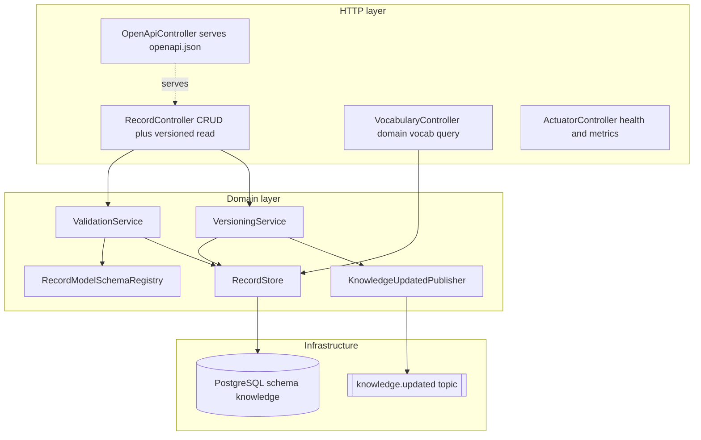
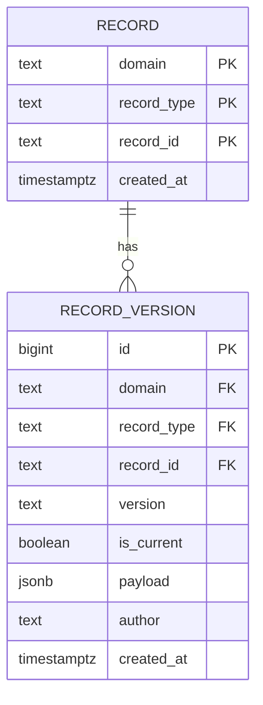
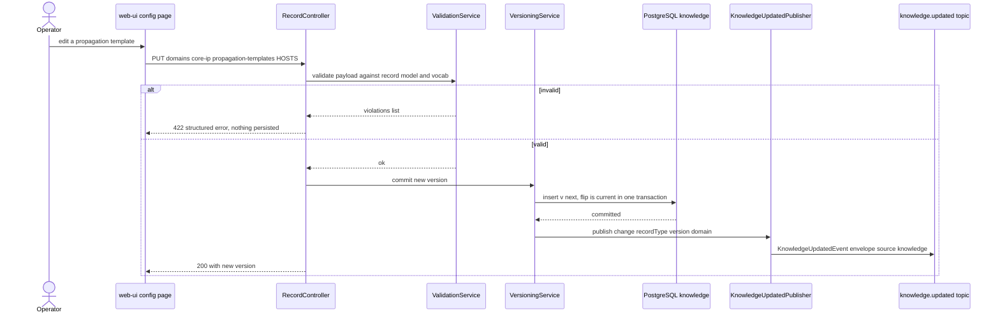
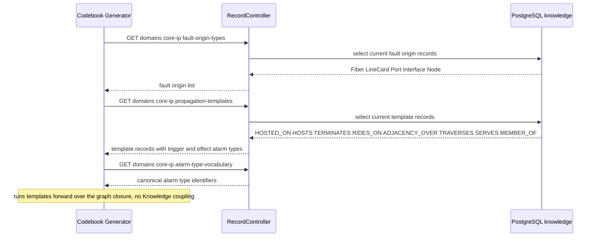
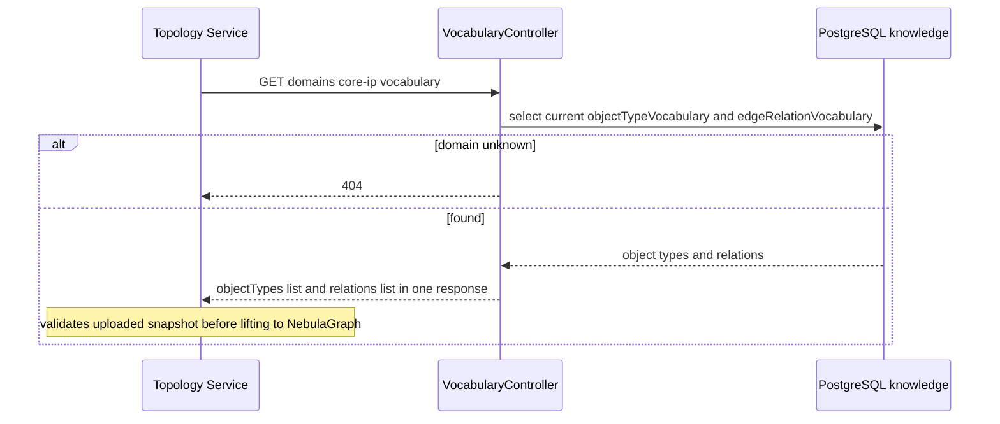
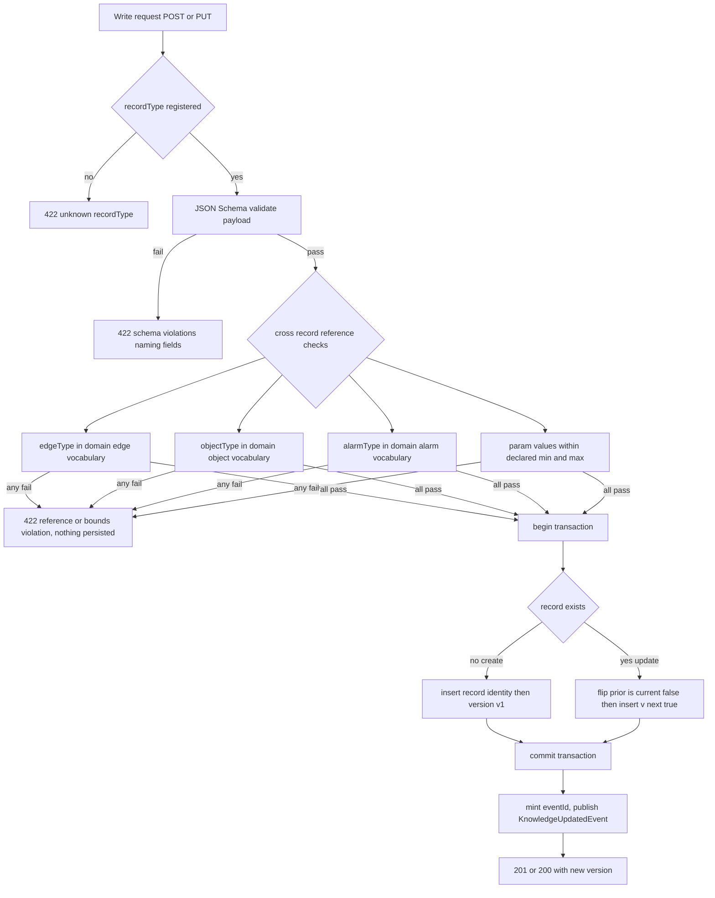

# knowledge — Design

## Stack

- **Language / runtime:** Java 17 (`eclipse-temurin:17-jdk`), Spring Boot 3.x.
- **Build:** Gradle (Kotlin DSL), JUnit 5.
- **Web / API:** Spring Web (MVC), `springdoc-openapi` (Apache-2.0) to publish **OpenAPI 3.1**
  at `/openapi.json` plus a Swagger UI. The generated document is also checked in at
  `services/knowledge/openapi.json`.
- **Persistence:** PostgreSQL (logical schema `knowledge`), Spring Data JDBC + Flyway
  (Apache-2.0) migrations. `jsonb` columns for record payloads.
- **JSON-Schema validation:** `networknt/json-schema-validator` (Apache-2.0) — every record
  payload is validated on write against the per-`recordType` JSON Schema bundled with the
  service (the record ontology, below). No domain literals in code; the schemas + seed data
  carry the domain knowledge.
- **Kafka:** Spring Kafka producer for `knowledge.updated` (idempotent producer config). No
  consumers (Knowledge consumes nothing from Kafka).
- **Observability:** Spring Boot Actuator `/health`; Micrometer + Prometheus registry
  (Apache-2.0) `/metrics`; structured JSON logs via `logstash-logback-encoder` (Apache-2.0 / MIT).
- **Event-model dependency:** `libs/event-model` (Java binding) — the single source of truth for
  the `Envelope` and the `KnowledgeUpdatedEvent` payload. The service depends on this library and
  on the `knowledge.updated` topic contract only — never on another service's source.

All licenses above are permissive (Apache-2.0 / MIT), per the platform invariant.

---

## The rule ontology (central design)

Knowledge stores **all** authored domain knowledge as a single, consistent **record model**.
Every record — regardless of which of the seven types it is — has the **same envelope shape**:

```
(domain, recordType, recordId, version, isCurrent, payload, validation status, audit fields)
```

`recordType` is **data, not a code enum**: it is a registered string with an associated JSON
Schema (the "record-model schema") that the payload is validated against on write. This is the
mechanism that makes the model *consistent* (one storage/version/CRUD path for all seven types),
*repeatable* (every record authored and validated the same way), and *expandable* (a new domain,
a new protocol-adjacency layer, or a cross-domain edge is **new records**, never new code).

The seven `recordType`s:

| # | recordType | Owner-consumer | Purpose |
|---|---|---|---|
| 1 | `propagationTemplate` | Codebook Generator | One authored cascade rule `EDGE: trigger => effect`. |
| 2 | `faultOriginType` | Codebook Generator | One object type that can be a root cause. |
| 3 | `trailPolicy` | Trail Builder | The trail-closure rule set (bound + SRLG + edge set). |
| 4 | `modelParams` | Noise Filter, Pattern Miner, Pattern Manager, Correlation Engine | A named, bounded tuning-param set (one `paramSet` per consumer). |
| 5 | `objectTypeVocabulary` | Topology | The valid `objectType` token set for a domain. |
| 6 | `edgeRelationVocabulary` | Topology | The valid edge `relation` token set for a domain. |
| 7 | `attributeCatalogue` | Noise Filter, Trail Builder, Codebook Generator | Well-known device/connection attribute keys. |
| (cross-cutting) | `alarmTypeVocabulary` | Codebook Generator (OQ-3) | **THE authoritative value space for the canonical `AlarmEvent.alarmType` join key** (and template `effect`/`trigger.alarmType`); distinct from `eventType` (X.733 category) and `probableCause`. |

> **Note on `alarmTypeVocabulary`.** The spec calls out seven *primary* record types but also
> identifies (OQ-3) that propagation-template effects must reference a **canonical alarm-type
> identifier vocabulary** shared with the Codebook Generator. This design realizes that shared
> vocabulary as an **eighth record of the same record model** — `alarmTypeVocabulary` — authored,
> versioned, validated, and served identically to the other seven. It introduces **no new topic,
> no new event payload, and no event-model change**: it is the same `knowledge.updated` envelope
> with `recordType = "alarmTypeVocabulary"`. This is purely an additional registered `recordType`
> (data), so it stays within the spec's "extensible, open record model" and the existing
> `KnowledgeUpdatedEvent` contract. See **Design alternatives** for why a record (not a hard-coded
> enum) is correct, and the contract-change note at the end confirming this is not a contract change.

> **`alarmTypeVocabulary` is THE authoritative value space for the canonical
> `AlarmEvent.alarmType` join key (binding — gap P1-G6).** The event-model now carries a
> **dedicated** canonical alarm-type field, `AlarmEvent.alarmType` (merged on `main`; mirrored on
> `TransactionEvent.alarms[].alarmType`). `architecture.md` (**Invariants**) pins it as *the single
> canonical alarm-type token the whole correlation chain joins on* and pins its **value space** to
> *the Knowledge-authored, domain-scoped `alarmTypeVocabulary`*. This design makes that binding
> explicit and one-directional: **every alarm-type token used anywhere in the platform's
> mining → codebook → correlation chain is a member of the domain's `alarmTypeVocabulary`.**
> Concretely, the single token set served by this record is the value space for:
> - `AlarmEvent.alarmType` (Simulator/Enrichment populate it from this vocabulary before publishing);
> - `TransactionEvent.alarms[].alarmType` (mirrored from `AlarmEvent.alarmType`, mined into sequences);
> - the Codebook Generator's `predictedSymptoms[].alarmType` (scenario signatures);
> - Pattern Manager's / codebook `rootCauseAlarmType`;
> - the propagation-template `trigger.alarmType` / `effect.alarmType` tokens authored **here**
>   (these are the *same* set — see the cross-record validation below).
>
> Because the templates' `trigger.alarmType`/`effect.alarmType` are validated **on write** against
> this `alarmTypeVocabulary` (validation step D3, below) and the Codebook Generator reads both the
> templates and this vocabulary from this service, the entire chain provably shares **one** token
> set — there is no second, divergent list anywhere. This write-validation cross-check is what
> *guarantees* the whole mining→codebook→correlation chain shares one token set.
>
> **SUPERSEDES the earlier gap text.** An earlier design-gap note proposed binding the template
> effect identifier to `AlarmEvent.eventType`. **That is superseded.** The correct binding is
> **`effect.alarmType` / `trigger.alarmType` == `AlarmEvent.alarmType`** (the NEW dedicated field)
> — **not** `eventType` (which stays the X.733 *category*, e.g. `communicationsAlarm`) and **not**
> `probableCause` (X.733 probable cause, e.g. `lossOfSignal`). The `alarmTypeVocabulary` tokens are
> the canonical `alarmType` tokens (`PortDown`, `InterfaceDown`, `LinkDown`, ...), **not**
> probableCause-style tokens (`lossOfSignal`/`linkDown` lowercase) and **not** X.733 categories.

### 1. Propagation-template record schema (the formalized rule)

The spec authors templates in the notation `EDGE_TYPE: trigger(Type) => effect(Type)`. This
design turns that notation into a **machine-validated record** with explicit fields, so the
Codebook Generator reads it as a firm contract instead of parsing prose. Each notation line is
exactly **one** `propagationTemplate` record.

JSON Schema (bundled as `recordmodel/propagationTemplate.schema.json`):

```json
{
  "$id": "knowledge/recordmodel/propagationTemplate",
  "type": "object",
  "additionalProperties": false,
  "required": ["edgeType", "trigger", "effect", "traversal"],
  "properties": {
    "edgeType":          { "type": "string", "pattern": "^[A-Za-z][A-Za-z0-9_]*$" },
    "trigger": {
      "type": "object",
      "additionalProperties": false,
      "required": ["objectType", "alarmType"],
      "properties": {
        "objectType": { "type": "string", "pattern": "^[A-Za-z][A-Za-z0-9]*$" },
        "alarmType":  { "type": "string", "pattern": "^[A-Za-z][A-Za-z0-9]*$" }
      }
    },
    "effect": {
      "type": "object",
      "additionalProperties": false,
      "required": ["objectType", "alarmType"],
      "properties": {
        "objectType": { "type": "string", "pattern": "^[A-Za-z][A-Za-z0-9]*$" },
        "alarmType":  { "type": "string", "pattern": "^[A-Za-z][A-Za-z0-9]*$" }
      }
    },
    "traversal": {
      "type": "object",
      "additionalProperties": false,
      "required": ["direction", "cardinality"],
      "properties": {
        "direction":   { "enum": ["forward", "reverse"] },
        "cardinality": { "enum": ["each-target", "single-target", "co-failure-group"] }
      }
    },
    "ordering":   { "type": "integer", "minimum": 0 },
    "description": { "type": "string" }
  }
}
```

Field semantics:

| Field | Meaning | Example (the `HOSTS` line) |
|---|---|---|
| `edgeType` | The graph relation traversed (must exist in this domain's `edgeRelationVocabulary`). | `HOSTS` |
| `trigger.objectType` / `trigger.alarmType` | The cause: object type + canonical alarm type that fires the rule. | `Port` / `PortDown` |
| `effect.objectType` / `effect.alarmType` | The result: object type + canonical alarm type produced on the target(s). | `Interface` / `InterfaceDown` |
| `traversal.direction` | Whether the edge is traversed forward (cause-to-effect) or reverse. | `forward` |
| `traversal.cardinality` | `each-target` (fan-out to every neighbour, e.g. "each Interface on the port"), `single-target` (one neighbour, e.g. "its IPLink"), or `co-failure-group` (`MEMBER_OF` fate-sharing). | `each-target` |
| `ordering` | Optional explicit cascade position (the Codebook Generator may instead derive order from the graph). | `1` |

The record envelope adds `domain`, `recordId`, `version`. So the full Core IP `HOSTS` record is:

```json
{
  "domain": "core-ip",
  "recordType": "propagationTemplate",
  "recordId": "core-ip/propagationTemplate/HOSTS",
  "version": "v1",
  "payload": {
    "edgeType": "HOSTS",
    "trigger": { "objectType": "Port",      "alarmType": "PortDown" },
    "effect":  { "objectType": "Interface", "alarmType": "InterfaceDown" },
    "traversal": { "direction": "forward", "cardinality": "each-target" },
    "ordering": 1,
    "description": "PortDown(Port) => InterfaceDown(each Interface on the port)"
  }
}
```

**Cross-record validation on write** (beyond the JSON Schema): `edgeType` must be present in the
domain's current `edgeRelationVocabulary`; `trigger.objectType` and `effect.objectType` must be in
the domain's current `objectTypeVocabulary`; `trigger.alarmType` and `effect.alarmType` must be in
the domain's current `alarmTypeVocabulary`. This is the OQ-3 "shared vocabulary" seam made firm —
template effect names are **guaranteed** to be canonical alarm-type strings the Codebook Generator
already knows. Validation is **driven by the referenced records**, never by a hard-coded Core IP
list (so acceptance criteria 16/17 hold for any domain).

The `trigger.alarmType`/`effect.alarmType` value space is **exactly** the domain's
`alarmTypeVocabulary` — the same set that is the value space for `AlarmEvent.alarmType` (gap
P1-G6). So a template can only ever name an alarm type the canonical join key can carry, and the
codebook signatures the Codebook Generator compiles from these templates necessarily use tokens a
live `AlarmEvent.alarmType` can equal. This cross-check (validation step D3) is the single
mechanism that keeps the **template effects / codebook signatures / mined sequences / live
`alarmType` / `rootCauseAlarmType`** on one token set. It binds to `alarmType`, **not** to
`eventType` (X.733 category) and **not** to `probableCause`.

### 2. Fault-origin-type record schema

```json
{
  "$id": "knowledge/recordmodel/faultOriginType",
  "type": "object",
  "additionalProperties": false,
  "required": ["objectType"],
  "properties": {
    "objectType":  { "type": "string", "pattern": "^[A-Za-z][A-Za-z0-9]*$" },
    "originAlarmType": { "type": "string", "pattern": "^[A-Za-z][A-Za-z0-9]*$" },
    "description": { "type": "string" }
  }
}
```

`objectType` must be in the domain's `objectTypeVocabulary`; `originAlarmType` (the alarm the
origin emits itself, e.g. `InterfaceDown` for an `Interface` origin) must be in the
`alarmTypeVocabulary`. Core IP set: `Fiber`, `LineCard`, `Port`, `Interface`, `Node`.

### 3. Alarm-type-vocabulary record schema (the Codebook seam)

```json
{
  "$id": "knowledge/recordmodel/alarmTypeVocabulary",
  "type": "object",
  "additionalProperties": false,
  "required": ["alarmTypes"],
  "properties": {
    "alarmTypes": {
      "type": "array", "minItems": 1, "uniqueItems": true,
      "items": { "type": "string", "pattern": "^[A-Za-z][A-Za-z0-9]*$" }
    }
  }
}
```

One record per domain holds the canonical alarm-type identifier set. Core IP set:
`PortDown`, `InterfaceDown`, `LinkDown`, `AdjDown`, `LSPDown`, `ReachabilityLoss`, `LOS`,
`FiberFault` (the discriminators referenced by templates and codebook signatures). This is the
single authoritative list against which all `propagationTemplate` effect/trigger alarm types are
validated — resolving the Codebook Generator's `AlarmTypeVocabulary` seam (OQ-3).

**This is the value space for the canonical `AlarmEvent.alarmType` field (gap P1-G6).** Per
`architecture.md` the dedicated `AlarmEvent.alarmType` join key (mirrored on
`TransactionEvent.alarms[].alarmType`, propagated into codebook `predictedSymptoms[].alarmType`
and `rootCauseAlarmType`, matched at correlation) draws its values **from this record**. Knowledge
authors the tokens; every producer/consumer in the chain is constrained to them. The Core IP set
above is the union the propagation cascade actually emits as `effect.alarmType` plus the
self-originated `faultOriginType.originAlarmType` values (e.g. `LOS` originated by a `FiberSpan`,
`FiberFault` by a `LineCard`/`Fiber`), so the seed vocabulary covers every token the cascade uses.
The vocabulary tokens are the **canonical `alarmType` tokens** — they are **not** probableCause
tokens (`lossOfSignal`/`linkDown` lowercase) and **not** X.733 `eventType` categories.

### 4. Object-type and edge-relation vocabulary record schemas

Both are a token set. The **object-type** tokens use the strict `managedObjectId` token format
`^[A-Za-z][A-Za-z0-9]*$` (no underscore — they are `managedObjectId` `objectType` tokens). The
**edge-relation** tokens use the relation-name form `^[A-Za-z][A-Za-z0-9_]*$` (relations like
`HOSTED_ON` contain underscores).

```json
{
  "$id": "knowledge/recordmodel/objectTypeVocabulary",
  "type": "object", "additionalProperties": false, "required": ["objectTypes"],
  "properties": {
    "objectTypes": { "type": "array", "minItems": 1, "uniqueItems": true,
      "items": { "type": "string", "pattern": "^[A-Za-z][A-Za-z0-9]*$" } }
  }
}
```

```json
{
  "$id": "knowledge/recordmodel/edgeRelationVocabulary",
  "type": "object", "additionalProperties": false, "required": ["relations"],
  "properties": {
    "relations": { "type": "array", "minItems": 1, "uniqueItems": true,
      "items": { "type": "string", "pattern": "^[A-Za-z][A-Za-z0-9_]*$" } }
  }
}
```

Criteria 5/2 reject an `objectTypes` entry failing the strict token check (e.g. `123Invalid`,
starts with a digit). Criteria 6/3 reject a `relations` entry failing the relation-name form.

### 5. Trail-policy record schema

```json
{
  "$id": "knowledge/recordmodel/trailPolicy",
  "type": "object", "additionalProperties": false,
  "required": ["closureEdgeTypes", "boundary", "srlgRule"],
  "properties": {
    "closureEdgeTypes": { "type": "array", "minItems": 1, "uniqueItems": true,
      "items": { "type": "string", "pattern": "^[A-Za-z][A-Za-z0-9_]*$" } },
    "boundary": {
      "type": "object", "additionalProperties": false, "required": ["type"],
      "properties": {
        "type": { "enum": ["igp-area", "none"] },
        "attributeKey": { "type": "string" }
      }
    },
    "srlgRule": {
      "type": "object", "additionalProperties": false, "required": ["mode"],
      "properties": {
        "mode": { "enum": ["union-members", "none"] },
        "srlgEdgeType": { "type": "string", "pattern": "^[A-Za-z][A-Za-z0-9_]*$" }
      }
    }
  }
}
```

`closureEdgeTypes` and `srlgRule.srlgEdgeType` must be in the domain's `edgeRelationVocabulary`.

### 6. Model-params record schema (open, bounded set)

A `modelParams` record is a **named** parameter set (`paramSet`) with **per-parameter bounded
declarations**. The set is open (extensible like criterion 16) — a consumer's new param is a new
entry, not a code change — but every entry declares its bounds so writes are validated
(criterion 10).

```json
{
  "$id": "knowledge/recordmodel/modelParams",
  "type": "object", "additionalProperties": false,
  "required": ["paramSet", "params"],
  "properties": {
    "paramSet": { "type": "string", "pattern": "^[A-Za-z][A-Za-z0-9-]*$" },
    "params": {
      "type": "array", "minItems": 1,
      "items": {
        "type": "object", "additionalProperties": false,
        "required": ["key", "type", "value"],
        "properties": {
          "key":   { "type": "string", "pattern": "^[A-Za-z][A-Za-z0-9_.]*$" },
          "type":  { "enum": ["number", "integer", "string", "boolean", "object"] },
          "value": {},
          "min":   { "type": "number" },
          "max":   { "type": "number" },
          "unit":  { "type": "string" }
        }
      }
    }
  }
}
```

Bounds enforcement: when a param declares `min`/`max`, the write validator rejects an out-of-range
`value` with HTTP 422 naming the param (criterion 10, e.g. `minSupport` outside `[0,1]`). The
**exact MVP seed param sets** (Noise Filter DBSCAN + features, Pattern Miner adaptive window +
PrefixSpan) are in **Seed data**, resolving OQ-2's remaining design detail.

### 7. Attribute-catalogue record schema (descriptive — OQ-4)

```json
{
  "$id": "knowledge/recordmodel/attributeCatalogue",
  "type": "object", "additionalProperties": false,
  "required": ["deviceKeys", "connectionKeys"],
  "properties": {
    "deviceKeys":     { "type": "array", "items": { "$ref": "#/$defs/key" } },
    "connectionKeys": { "type": "array", "items": { "$ref": "#/$defs/key" } }
  },
  "$defs": {
    "key": {
      "type": "object", "additionalProperties": false, "required": ["key"],
      "properties": {
        "key":         { "type": "string", "pattern": "^[A-Za-z][A-Za-z0-9_]*$" },
        "valueForm":   { "enum": ["string", "number", "enum", "boolean"] },
        "allowed":     { "type": "array", "items": { "type": "string" } },
        "description": { "type": "string" }
      }
    }
  }
}
```

**OQ-4 resolution:** the catalogue is **descriptive**. The Knowledge Service validates only the
catalogue record's own shape (key-name token format, value-form enums). It does **not** enforce
the catalogue against live topology snapshots or live alarms — that enforcement is out of scope
(matches the spec's "Out of scope" line and architecture's "descriptive, not identity").

### Onboarding a new domain / new protocol layer — purely records

Because validation is record-driven (template `edgeType`/`objectType`/`alarmType` are checked
against *that domain's* vocabulary records), the entire onboarding is a data operation:

1. Author the domain's `objectTypeVocabulary`, `edgeRelationVocabulary`, `alarmTypeVocabulary`.
2. Author `faultOriginType` records (object types that can be root causes).
3. Author `propagationTemplate` records (cascade rules, one per `EDGE: trigger => effect` line).
4. Author `trailPolicy`, `modelParams`, `attributeCatalogue`.

No code, no event-model, no topic change. A **new protocol-adjacency layer** (e.g. BGP/OSPF) in
the *same* Core IP domain is the same operation at a smaller scale: add a `BGPAdjacency` object
type, an `ADJACENCY_OVER_BGP` relation, alarm types, and a `propagationTemplate`. The concrete
worked records are in **Seed data**.

---

## Task breakdown (from the spec)

| Spec task | Realized by (modules / flow) |
|---|---|
| 1. Store and version knowledge records (all 7 types; each write mints a new immutable version; old versions retrievable; domain-scoped) | `RecordStore` + `VersioningService` over the unified `knowledge.record` + `knowledge.record_version` tables (see Data model). Same path for all `recordType`s. |
| 2. Validate edits before persistence (edge type known, fault-origin is a known object type, params in-bounds, token format) — driven by referenced types, not a Core IP list | `ValidationService`: JSON-Schema validation against the per-`recordType` record-model schema + cross-record reference checks (edge/object/alarm-type membership in the domain's vocabulary records) + param-bounds checks. Structured 422, no partial write (single TX). |
| 3. Serve current and pinned versions via API (all 7 types; current or specific version) | `RecordController` read endpoints: `GET .../{recordId}` (current via `is_current` pointer) and `GET .../{recordId}/versions/{version}`. |
| 4. Serve domain vocabulary + attribute catalogue for Topology validation (single query of object-type + edge-relation set) | `VocabularyController` to `GET /domains/{domain}/vocabulary` returns both current vocabulary sets in one response; 404 for unknown domain. |
| 5. Emit `knowledge.updated` on every successful change (all 7 types incl. vocab/catalogue) | `KnowledgeUpdatedPublisher` (idempotent Spring Kafka producer) fires inside the same logical unit-of-work as the version commit, after commit, carrying `recordType`, `recordId`, `version`, `domain`. |
| 6. Scope knowledge by domain (every record tagged; future domain authorable without code change) | `domain` is a first-class column on every record; all controllers are domain-scoped; validation reads the *target domain's* vocabulary records (criteria 14, 16, 17). |

Every spec task is realized; nothing dropped or re-scoped.

---

## Phase applicability (design view)

The Knowledge Service is **Passive in all three runtime phases** (consistent with the canonical
phase map in `architecture.md` and the spec). It serves authored knowledge on demand and emits
`knowledge.updated` on edits; it drives no phase work. Because records are editable at any time
via the web-ui config page, `knowledge.updated` can fire in any phase.

| Phase | Active/Passive/Idle | Modules/handlers exercised | Inputs/Outputs |
|---|---|---|---|
| P1 — Topology onboarding | Passive | `VocabularyController` (Topology snapshot validation), `RecordController` read (Trail Builder reads `trailPolicy`; Codebook Generator reads `faultOriginType` + `propagationTemplate` + `alarmTypeVocabulary`; attribute catalogue reads). `RecordController` write + `KnowledgeUpdatedPublisher` if an operator edits a record. | In: — (no Kafka consumption). Out: versioned read responses on request; `knowledge.updated` on any edit. |
| P2 — Pattern learning | Passive | `RecordController` read of `modelParams` via `GET .../model-params/{recordId}` (Noise Filter `core-ip/modelParams/noise-filter`; Pattern Miner `core-ip/modelParams/pattern-miner`; **Pattern Manager** `core-ip/modelParams/pattern-manager` — RCA/reconciliation + structural-validation params) and attribute catalogue (Noise Filter feature keys). Write path + publisher on any param edit. | In: — . Out: read responses; `knowledge.updated` on any edit. |
| P3 — Real-time correlation | Passive | `RecordController` read of `modelParams` via `GET .../model-params/{recordId}` by the real-time **Correlation Engine** (`core-ip/modelParams/correlation-engine` — match-quality + conflict params, **not** session-window). Write path + publisher on any edit. | In: — . Out: read responses; `knowledge.updated` on any edit. |

No module is fully dormant across phases — the read API is exercised in every phase; the write +
publish path is exercised whenever an operator edits a record (possible in any phase).

---

## Module breakdown



- **RecordController** — generic CRUD + versioned read for all eight `recordType`s. Routes are
  domain-scoped: `/domains/{domain}/{recordType}`.
- **VocabularyController** — the dedicated single-call vocabulary query for Topology
  (`GET /domains/{domain}/vocabulary`).
- **RecordModelSchemaRegistry** — loads the bundled per-`recordType` JSON Schemas (the ontology
  above) at startup; maps `recordType` to schema. Registering a new `recordType` is adding a
  schema resource (data/config), not code.
- **ValidationService** — runs (a) JSON-Schema validation, (b) cross-record reference checks
  against the target domain's current vocabulary records, (c) param-bounds checks. Produces a
  structured `ValidationError` list or passes.
- **VersioningService** — mints the next version, flips the `is_current` pointer atomically,
  triggers the post-commit publish.
- **RecordStore** — Spring Data JDBC repository over the two tables.
- **KnowledgeUpdatedPublisher** — builds the `Envelope` + `KnowledgeUpdatedEvent` payload and
  produces to `knowledge.updated` with an idempotent producer.

---

## Data model / DB schema

**Decision (see Design alternatives): a unified record table with a `jsonb` payload**, validated
on write against the per-`recordType` schema — *not* per-`recordType` tables. The spec is explicit
that "the schema is template-driven, not hard-coded per Core IP type"; a unified table makes
adding a `recordType` (or a domain) a data operation, gives every type one identical
CRUD/versioning/`is_current` path, and lets `knowledge.updated` emission be one code path.

Two tables: a stable **record identity** row, and an append-only **version** row. The current
version is the version row whose `is_current = true` for that record (exactly one per record).



```sql
CREATE SCHEMA IF NOT EXISTS knowledge;

-- Stable identity of a knowledge record (one row per logical record).
CREATE TABLE knowledge.record (
    domain        TEXT NOT NULL,
    record_type   TEXT NOT NULL,
    record_id     TEXT NOT NULL,
    created_at    TIMESTAMPTZ NOT NULL DEFAULT now(),
    PRIMARY KEY (domain, record_type, record_id)
);

-- Append-only versions. Each successful write inserts a new row and flips is_current.
CREATE TABLE knowledge.record_version (
    id            BIGINT GENERATED ALWAYS AS IDENTITY PRIMARY KEY,
    domain        TEXT NOT NULL,
    record_type   TEXT NOT NULL,
    record_id     TEXT NOT NULL,
    version       TEXT NOT NULL,        -- e.g. v1, v2, ... (monotone per record)
    is_current    BOOLEAN NOT NULL DEFAULT TRUE,
    payload       JSONB NOT NULL,       -- validated against recordmodel/<record_type>.schema.json
    author        TEXT,                 -- from the edit context (web-ui user)
    created_at    TIMESTAMPTZ NOT NULL DEFAULT now(),
    FOREIGN KEY (domain, record_type, record_id)
        REFERENCES knowledge.record (domain, record_type, record_id),
    UNIQUE (domain, record_type, record_id, version)
);

-- Exactly one current version per record (partial unique index).
CREATE UNIQUE INDEX uq_record_current
    ON knowledge.record_version (domain, record_type, record_id)
    WHERE is_current;

-- Fast domain-scoped + type-scoped current reads (the consumer read path).
CREATE INDEX ix_version_domain_type_current
    ON knowledge.record_version (domain, record_type)
    WHERE is_current;
```

**Versioning representation.** `version` is `v{n}` minted monotonically per `(domain, record_type,
record_id)`: create to `v1`; each update inserts `v{n+1}` and atomically sets the previous
`is_current = false` and the new one `true` inside one transaction. Old versions stay rows
(immutable) and are retrievable by `(record_id, version)` — criterion 11 (pin v1 after two
updates). No row is ever updated in place except the `is_current` flip.

**Idempotency / `eventId`.** `eventId` is a fresh UUID minted per `knowledge.updated` *emission*
and tied to the specific version change; it is **not** regenerated on producer retry of the same
change (the publisher holds the minted `eventId` for the unit-of-work), so a consumer dedupes on
it (criterion 15). Knowledge itself consumes nothing, so there is no consumer-side dedupe table.

---

## Event handling

- **Consumers:** none. Knowledge consumes no Kafka topic (spec "Out of scope"; architecture phase
  map). Therefore **no DLQ** is owned by this service, and there is no unknown-`schemaVersion`
  rejection path (that applies to consumers).
- **Producers:**

| Topic | Payload type (from `libs/event-model`) | When |
|---|---|---|
| `knowledge.updated` | `KnowledgeUpdatedEvent` (envelope `type = KnowledgeUpdatedEvent`, `source = knowledge`) | Exactly once per validated, persisted create/update of any of the eight `recordType`s. |

Payload mapping (matches the frozen schema — `recordType`, `version`, `domain` required;
`recordId` optional, populated here because writes are always record-specific):

```json
{
  "eventId": "f1e2...uuid",
  "type": "KnowledgeUpdatedEvent",
  "schemaVersion": 1,
  "occurredAt": "2026-06-12T10:00:00Z",
  "source": "knowledge",
  "traceId": "...",
  "payload": {
    "recordType": "objectTypeVocabulary",
    "recordId":   "core-ip/objectTypeVocabulary/default",
    "version":    "v2",
    "domain":     "core-ip"
  }
}
```

**Producer config (idempotent):** `enable.idempotence=true`, `acks=all`,
`max.in.flight.requests.per.connection=5`, `retries` bounded by delivery-timeout, key =
`recordId` (so all versions of a record land on one partition in order). The `eventId` is minted
before the send and reused across producer-internal retries. Emission happens **after** the DB
transaction commits (publish only what is durably persisted); if the DB commits but the broker is
unreachable, the send is retried with backoff and the failure is logged + counted
(`knowledge_updated_publish_failures_total`) — the persisted change is the source of truth and
consumers will re-fetch on the next successful event or on their own refresh.

---

## API contracts / API schema

All routes are domain-scoped and `recordType`-generic. `{recordType}` is the path segment for one
of the eight types: `propagation-templates`, `fault-origin-types`, `trail-policies`,
`model-params`, `object-type-vocabulary`, `edge-relation-vocabulary`, `attribute-catalogue`,
`alarm-type-vocabulary`.

| Method + path | Body / params | Success | Errors |
|---|---|---|---|
| `POST /domains/{domain}/{recordType}` | record payload (per ontology schema) | `201` + `{recordId, version: "v1", domain, recordType, payload}` | `422` structured validation error |
| `PUT /domains/{domain}/{recordType}/{recordId}` | record payload | `200` + `{recordId, version: "v{n}", ...}` | `404` unknown record; `422` validation |
| `GET /domains/{domain}/{recordType}` | optional `?recordId=` filter | `200` list of current records for the domain+type | — |
| `GET /domains/{domain}/{recordType}/{recordId}` | — | `200` current version | `404` |
| `GET /domains/{domain}/{recordType}/{recordId}/versions/{version}` | — | `200` pinned version | `404` |
| `GET /domains/{domain}/vocabulary` | — | `200` `{domain, objectTypes:[...], relations:[...], version}` (both current sets, one call — **frozen shape**, see below) | `404` unknown domain |
| `GET /domains/{domain}/model-params/{recordId}` | — | `200` current `modelParams` record (versioned envelope + `payload.params[]` with **real dotted keys** — **frozen shape**, see below) | `404` |
| `GET /domains/{domain}/model-params/{recordId}/versions/{version}` | — | `200` pinned `modelParams` record | `404` |
| `PUT /domains/{domain}/model-params/{recordId}` | `modelParams` payload (real dotted keys) | `200` + new version (immutable, `is_current` flips) | `404`; `422` validation/out-of-bounds |
| `GET /openapi.json` | — | `200` OpenAPI 3.1 document | — |
| `GET /swagger-ui` | — | Swagger UI | — |

**Consumer-facing convenience reads** (same data, named for the integration points the consumers
declare — all resolve to the generic store):

- Codebook Generator: `GET /domains/{domain}/fault-origin-types`,
  `GET /domains/{domain}/propagation-templates`, `GET /domains/{domain}/alarm-type-vocabulary`.
- Trail Builder: `GET /domains/{domain}/trail-policies` (current trail policy).
- **Model-params consumers (each fetches its own `paramSet` via the same frozen read API):**
  - Noise Filter — `GET /domains/{domain}/model-params/core-ip%2FmodelParams%2Fnoise-filter`.
  - Pattern Miner — `GET /domains/{domain}/model-params/core-ip%2FmodelParams%2Fpattern-miner`.
  - **Correlation Engine** — `GET /domains/{domain}/model-params/core-ip%2FmodelParams%2Fcorrelation-engine`
    (match-quality + conflict params; **not** session-window).
  - **Pattern Manager** — `GET /domains/{domain}/model-params/core-ip%2FmodelParams%2Fpattern-manager`
    (RCA/reconciliation + structural-validation params; session-window derivation calls Knowledge **not at all**).
  - All also accept `?paramSet=...` to list and `.../versions/{version}` to pin. **No new endpoint
    is added for any of these — the unified frozen `model-params/{recordId}` read API covers all four.**
- Topology: `GET /domains/{domain}/vocabulary`.

### Frozen integration contracts (gaps P1-G11, P2-GAP-07)

Three read/write surfaces are **hard-depended-upon by other services** and are therefore frozen
here with exact shapes and **published in the checked-in `services/knowledge/openapi.json`**, which
those services build their clients against (mock from this OpenAPI for their unit tests, real
Knowledge in integration). A change to any of these shapes is a contract change requiring
`architecture.md` update + human approval (per the spec).

#### A. `GET /domains/{domain}/vocabulary` — Topology snapshot pre-validation (P1-G11, FROZEN)

The Topology Service hard-depends on this single call at ingest to validate an uploaded snapshot's
`objectType`/`relation` tokens before lifting it into the graph (fail-closed if Knowledge is
unavailable). The earlier open item *"exact path/shape is design-stage on Knowledge's side"* is
**resolved** — the path, request, and response are now frozen:

- **Path / method:** `GET /domains/{domain}/vocabulary` (path param `domain`, e.g. `core-ip`).
- **Request:** no body, no query params.
- **Response `200`** (both current vocabulary sets in **one** call):

```json
{
  "domain": "core-ip",
  "objectTypes": ["Node","LineCard","Port","Interface","IPLink","IGPAdjacency",
    "LSP","VPNService","FiberSpan","SRLG","Site"],
  "relations": ["HOSTED_ON","HOSTS","TERMINATES","RIDES_ON","ADJACENCY_OVER",
    "TRAVERSES","SERVES","MEMBER_OF","LOCATED_AT"],
  "version": "v1"
}
```

`objectTypes` is the current `objectTypeVocabulary` token set; `relations` is the current
`edgeRelationVocabulary` token set; `version` is an opaque snapshot identifier the caller may pin
or log (here the current version of the underlying vocabulary records; if the two records differ in
version the field reports the composite current-read marker). **Response `404`** for an unknown
domain. These two token sets are the **single source** Topology validates snapshots against
(gap P1-G3 — see Seed data); the Simulator's domain pack is contract-tested to be a subset of this
served vocabulary rather than carrying an independent list.

**Contract test note:** a provider-side JUnit contract test (`VocabularyEndpointContractTest`)
asserts the operation exists in the published `openapi.json` with exactly this response schema
(`domain`, `objectTypes[]`, `relations[]`, `version`), that the live `core-ip` response contains
`Interface`/`HOSTS`/`TERMINATES`, and that an unknown domain returns `404`. Topology builds its
`KnowledgeVocabClient` against this frozen shape.

#### B. Model-params read + edit — web-ui config edit (P2-GAP-07, FROZEN; Knowledge is SSoT)

The web-ui edits model params **through Knowledge** — **Knowledge's API is the single source of
truth** for the path and the payload. There is **no** `/knowledge/model-params` path and **no**
flat camelCase keys (`dbscanEps`, `sessionWindowGapSeconds`, ...). The real, frozen surfaces are:

- **Read current:** `GET /domains/{domain}/model-params/{recordId}`
  (e.g. `GET /domains/core-ip/model-params/core-ip%2FmodelParams%2Fnoise-filter`). Also
  `GET /domains/{domain}/model-params` to list, and `.../versions/{version}` to pin a version.
- **Edit (versioned write):** `PUT /domains/{domain}/model-params/{recordId}` with the **versioned
  record payload** — write semantics are immutable: a successful write mints a new `version` and
  flips `is_current` (it does **not** mutate in place). Out-of-bounds values are rejected `422`.

The record payload uses the **real dotted/structured param keys** exactly as they live in the
`modelParams` records (see Seed data) — `dbscan.epsilon`, `dbscan.minSamples`,
`window.sizeSeconds`, `prefixspan.minSupport`, `prefixspan.maxPatternLength`,
`window.adaptive.baseGapSeconds`, etc. Read response / write request body shape:

```json
{
  "domain": "core-ip",
  "recordType": "modelParams",
  "recordId": "core-ip/modelParams/noise-filter",
  "version": "v3",
  "isCurrent": true,
  "payload": {
    "paramSet": "noise-filter",
    "params": [
      { "key": "dbscan.epsilon",      "type": "number",  "value": 0.5, "min": 0.0, "max": 100.0 },
      { "key": "dbscan.minSamples",   "type": "integer", "value": 3,   "min": 1,   "max": 1000 },
      { "key": "window.sizeSeconds",  "type": "integer", "value": 60,  "min": 1,   "max": 86400, "unit": "s" }
    ]
  }
}
```

The Pattern Miner set (`prefixspan.minSupport`, `prefixspan.maxPatternLength`,
`window.adaptive.baseGapSeconds`, the named tempo profiles, ...) follows the same envelope with
`paramSet = "pattern-miner"`. The **Correlation Engine** set (`match.partialMatchTolerance`,
`codebook.missingPenalty`/`codebook.spuriousPenalty`/`codebook.scoreFloor`,
`conflict.weights.specificity`/`conflict.weights.confidence`) and the **Pattern Manager** set
(`structural.maxHops`/`structural.strictness`/`structural.flagVsReject`, `rca.*`,
`reconciliation.overlapThreshold`) follow the **same envelope and same frozen read endpoint** with
`paramSet = "correlation-engine"` / `paramSet = "pattern-manager"` (full records in **Seed data**)
— so all four named consumers read through the one frozen surface, no per-consumer endpoint.
**The web-ui builds its Knowledge client from this published
`openapi.json`** — it uses `/domains/{domain}/model-params/{recordId}`, sends the versioned record
payload with the real dotted keys, and handles the new-version/`is_current` write semantics (the
web-ui alignment is done on the web-ui side; here the SSoT endpoints + payloads are unambiguous).

**Contract test note:** `ModelParamsEndpointContractTest` asserts the read returns the versioned
envelope with the dotted-key `params[]` payload, the `PUT` mints a new version (old version still
retrievable), and an out-of-bounds value (e.g. `prefixspan.minSupport = 1.5`) is rejected `422`
naming the param.

**Structured validation error body** (HTTP 422, no partial write):

```json
{
  "error": "validation_failed",
  "recordType": "propagationTemplate",
  "domain": "core-ip",
  "violations": [
    { "field": "edgeType", "rule": "edge-type-in-vocabulary",
      "message": "edge type UNKNOWN_EDGE is not in the core-ip edge-relation vocabulary" }
  ]
}
```

**OpenAPI generation & contract tests.** `springdoc-openapi` generates the OpenAPI 3.1 document
from the controllers + DTOs at runtime (`/openapi.json`); a Gradle task exports it to the
checked-in `services/knowledge/openapi.json`. The checked-in document is the provider contract:
a JUnit provider-side contract test (criterion 13) asserts `/openapi.json` is valid OpenAPI 3.1,
contains `GET`/`POST`/`PUT` for each of the eight record types, the vocabulary query operation,
and a versioned-read operation accepting a `version` path parameter — and that the live
implementation satisfies it. The published document additionally pins the three **frozen
integration contracts** above: `GET /domains/{domain}/vocabulary` with the
`{domain, objectTypes[], relations[], version}` response (Topology client), and the
`GET`/`PUT` `model-params/{recordId}` operations with the versioned-record payload shape (web-ui
client). A CI check fails the build if the generated document drifts from the checked-in
`openapi.json` (any drift is a contract change requiring `architecture.md` update + human approval,
per the spec).

---

## Integration points (mock vs. real)

Knowledge exposes **no outbound HTTP integration points** — it is a server and a Kafka producer
only (spec Contract). It has no collaborator base URLs to switch. The only outbound dependency is
the Kafka broker (bootstrap servers from `KAFKA_BOOTSTRAP_SERVERS`) and PostgreSQL (coordinates
from env). Downstream consumers declare *Knowledge* as a config-switchable integration point on
**their** side (mock from this service's published `openapi.json` for their unit tests, real
Knowledge in integration); that toggle lives in each consumer, not here. So: **N/A — no outbound
service integration points** to configure in this service.

---

## Key flows (sequence / data-flow diagrams)

### Flow A — Authoring: edit, validate, version, emit



### Flow B — Consumer read: Codebook Generator compiles a domain



### Flow C — Topology snapshot pre-validation (single vocabulary call)



---

## Algorithm logical flow

The non-trivial logic is the **write-validation + versioning** path (there is no ML algorithm).



**Versioning / current-pointer logic.** Next version = `v{maxN+1}` from existing version rows for
the record. The partial unique index `uq_record_current` guarantees at most one `is_current` row,
so the flip-then-insert is atomic and concurrent writers to the same record serialize on it (a
losing writer retries). Reads without a version use the `is_current` row; reads with a version
read the immutable historical row.

Which cross-record checks apply per `recordType`: `propagationTemplate` to D1+D2+D3;
`faultOriginType` to D2 (and D3 for `originAlarmType`); `trailPolicy` to D1 (closure + SRLG edge
types); `modelParams` to D4; vocabulary records to token-format only (already in JSON Schema);
`attributeCatalogue` to shape only (OQ-4 descriptive).

---

## Seed data & examples

Seed records are loaded by an idempotent Flyway/`CommandLineRunner` seeder (`SEED_ON_STARTUP=true`,
default true for local/dev) that POSTs the Core IP domain pack through the *same* validated write
path (so the seed is dogfood-validated). All seed records are `domain = core-ip`, `version = v1`.

### Core IP vocabularies

```json
{ "recordType": "objectTypeVocabulary", "recordId": "core-ip/objectTypeVocabulary/default",
  "payload": { "objectTypes": ["Node","LineCard","Port","Interface","IPLink",
    "IGPAdjacency","LSP","VPNService","FiberSpan","SRLG","Site"] } }

{ "recordType": "edgeRelationVocabulary", "recordId": "core-ip/edgeRelationVocabulary/default",
  "payload": { "relations": ["HOSTED_ON","HOSTS","TERMINATES","RIDES_ON","ADJACENCY_OVER",
    "TRAVERSES","SERVES","MEMBER_OF","LOCATED_AT"] } }

{ "recordType": "alarmTypeVocabulary", "recordId": "core-ip/alarmTypeVocabulary/default",
  "payload": { "alarmTypes": ["PortDown","InterfaceDown","LinkDown","AdjDown","LSPDown",
    "ReachabilityLoss","LOS","FiberFault"] } }
```

**Single source for snapshot-token validation (gap P1-G3).** The seeded `core-ip`
`objectTypeVocabulary` and `edgeRelationVocabulary` above are the **authoritative token sets**
against which the Topology Service validates an uploaded snapshot (via
`GET /domains/core-ip/vocabulary`) before lifting it into the graph — there is no second
authoritative list. The Simulator's `core-ip` domain pack does **not** carry an independent copy;
it derives from / is contract-tested to be a **subset** of this served vocabulary (the Simulator
alignment is handled in the Simulator's own fix). This keeps the snapshot `objectType`/`relation`
tokens, Knowledge's served vocabulary, and Topology's validator on one set, so a token divergence
is caught at design/contract time rather than failing ingest closed at integration time.

**Single source for the canonical `alarmType` join key (gap P1-G6).** The seeded `core-ip`
`alarmTypeVocabulary` above is likewise the **authoritative value space** for `AlarmEvent.alarmType`
(and its mirrors/derivations down the chain). The 8 tokens are exactly the set the propagation
cascade emits — `effect.alarmType` across the seeded templates yields
`{PortDown, InterfaceDown, LinkDown, AdjDown, LSPDown, ReachabilityLoss}` and the
`faultOriginType.originAlarmType` self-origin values add `{LOS, FiberFault}` (and `InterfaceDown`) —
so the vocabulary covers every token the cascade actually uses, with no probableCause-style or
X.733-category tokens introduced.

### Core IP fault-origin types

`Fiber`, `LineCard`, `Port`, `Interface`, `Node` (each a `faultOriginType` record). Example with
its own origin alarm:

```json
{ "recordType": "faultOriginType", "recordId": "core-ip/faultOriginType/Interface",
  "payload": { "objectType": "Interface", "originAlarmType": "InterfaceDown",
    "description": "L3 interface; originates InterfaceDown and cascades independently" } }
```

### Core IP propagation templates (the full chain, formalized)

One record per notation line:

```json
[
 { "recordType":"propagationTemplate","recordId":"core-ip/propagationTemplate/HOSTED_ON",
   "payload":{ "edgeType":"HOSTED_ON",
     "trigger":{"objectType":"LineCard","alarmType":"FiberFault"},
     "effect":{"objectType":"Port","alarmType":"PortDown"},
     "traversal":{"direction":"forward","cardinality":"each-target"},"ordering":0,
     "description":"fault(LineCard) => PortDown(each Port)" } },

 { "recordType":"propagationTemplate","recordId":"core-ip/propagationTemplate/HOSTS",
   "payload":{ "edgeType":"HOSTS",
     "trigger":{"objectType":"Port","alarmType":"PortDown"},
     "effect":{"objectType":"Interface","alarmType":"InterfaceDown"},
     "traversal":{"direction":"forward","cardinality":"each-target"},"ordering":1,
     "description":"PortDown(Port) => InterfaceDown(each Interface on the port)" } },

 { "recordType":"propagationTemplate","recordId":"core-ip/propagationTemplate/TERMINATES",
   "payload":{ "edgeType":"TERMINATES",
     "trigger":{"objectType":"Interface","alarmType":"InterfaceDown"},
     "effect":{"objectType":"IPLink","alarmType":"LinkDown"},
     "traversal":{"direction":"forward","cardinality":"single-target"},"ordering":2,
     "description":"InterfaceDown(Interface) => LinkDown(its IPLink)" } },

 { "recordType":"propagationTemplate","recordId":"core-ip/propagationTemplate/RIDES_ON",
   "payload":{ "edgeType":"RIDES_ON",
     "trigger":{"objectType":"FiberSpan","alarmType":"FiberFault"},
     "effect":{"objectType":"IPLink","alarmType":"LinkDown"},
     "traversal":{"direction":"forward","cardinality":"each-target"},"ordering":2,
     "description":"fault(Fiber) => LinkDown(IPLink)" } },

 { "recordType":"propagationTemplate","recordId":"core-ip/propagationTemplate/ADJACENCY_OVER",
   "payload":{ "edgeType":"ADJACENCY_OVER",
     "trigger":{"objectType":"Interface","alarmType":"InterfaceDown"},
     "effect":{"objectType":"IGPAdjacency","alarmType":"AdjDown"},
     "traversal":{"direction":"forward","cardinality":"each-target"},"ordering":3,
     "description":"InterfaceDown(Interface) => AdjDown(IGPAdjacency on that interface)" } },

 { "recordType":"propagationTemplate","recordId":"core-ip/propagationTemplate/TRAVERSES",
   "payload":{ "edgeType":"TRAVERSES",
     "trigger":{"objectType":"IPLink","alarmType":"LinkDown"},
     "effect":{"objectType":"LSP","alarmType":"LSPDown"},
     "traversal":{"direction":"forward","cardinality":"each-target"},"ordering":4,
     "description":"LinkDown(IPLink) => LSPDown(LSP head-end)" } },

 { "recordType":"propagationTemplate","recordId":"core-ip/propagationTemplate/SERVES",
   "payload":{ "edgeType":"SERVES",
     "trigger":{"objectType":"LSP","alarmType":"LSPDown"},
     "effect":{"objectType":"VPNService","alarmType":"ReachabilityLoss"},
     "traversal":{"direction":"forward","cardinality":"each-target"},"ordering":5,
     "description":"LSPDown(LSP) => ReachabilityLoss(VPN)" } },

 { "recordType":"propagationTemplate","recordId":"core-ip/propagationTemplate/MEMBER_OF",
   "payload":{ "edgeType":"MEMBER_OF",
     "trigger":{"objectType":"IPLink","alarmType":"LinkDown"},
     "effect":{"objectType":"IPLink","alarmType":"LinkDown"},
     "traversal":{"direction":"forward","cardinality":"co-failure-group"},"ordering":2,
     "description":"co-failure grouping (SRLG fate sharing)" } }
]
```

### Core IP trail policy

```json
{ "recordType":"trailPolicy","recordId":"core-ip/trailPolicy/default",
  "payload":{
    "closureEdgeTypes":["HOSTED_ON","HOSTS","TERMINATES","RIDES_ON","ADJACENCY_OVER",
      "TRAVERSES","SERVES"],
    "boundary":{"type":"igp-area","attributeKey":"igpArea"},
    "srlgRule":{"mode":"union-members","srlgEdgeType":"MEMBER_OF"} } }
```

### Core IP model-params (the cross-consumer seed set — resolves OQ-2)

**Four** `modelParams` records — **one per named consumer** that reads tuning params from
Knowledge — named by consumer `paramSet`, every entry bounded. The platform's mining,
noise-filtering, structural-validation/RCA, and real-time-correlation use cases therefore all
**run out of the box** off the seed pack; no consumer has to invent a default for a param it
sources from Knowledge.

| `paramSet` / seeded `recordId` | Consumer (named in `application-design.md`) | Use case it powers |
|---|---|---|
| `core-ip/modelParams/noise-filter` | Noise Filter | DBSCAN storm clustering (P2) |
| `core-ip/modelParams/pattern-miner` | Pattern Miner | PrefixSpan sequence mining + adaptive window (P2) |
| `core-ip/modelParams/correlation-engine` | **Correlation Engine** | match-quality + conflict resolution (P3) |
| `core-ip/modelParams/pattern-manager` | **Pattern Manager** | RCA ordering + structural validation (P2) |

```json
{ "recordType":"modelParams","recordId":"core-ip/modelParams/noise-filter",
  "payload":{ "paramSet":"noise-filter", "params":[
    {"key":"dbscan.epsilon","type":"number","value":0.5,"min":0.0,"max":100.0},
    {"key":"dbscan.minSamples","type":"integer","value":3,"min":1,"max":1000},
    {"key":"window.sizeSeconds","type":"integer","value":60,"min":1,"max":86400,"unit":"s"},
    {"key":"feature.attributeKeys","type":"object",
      "value":["equipmentType","vendor","model"]},
    {"key":"feature.hopDistance.enabled","type":"boolean","value":false},
    {"key":"feature.objectTypeLayer.enabled","type":"boolean","value":true} ] } }

{ "recordType":"modelParams","recordId":"core-ip/modelParams/pattern-miner",
  "payload":{ "paramSet":"pattern-miner", "params":[
    {"key":"prefixspan.minSupport","type":"number","value":0.3,"min":0.0,"max":1.0},
    {"key":"prefixspan.maxPatternLength","type":"integer","value":10,"min":1,"max":100},
    {"key":"prefixspan.maxSequenceCount","type":"integer","value":1000,"min":1,"max":1000000},
    {"key":"window.adaptive.baseGapSeconds","type":"number","value":5.0,"min":0.001,"max":3600.0,"unit":"s"},
    {"key":"window.adaptive.gapMultiplier","type":"number","value":3.0,"min":1.0,"max":100.0},
    {"key":"window.adaptive.tempoPercentile","type":"number","value":95.0,"min":1.0,"max":100.0},
    {"key":"window.adaptive.profiles","type":"object",
      "value":{"fast":0.5,"slow":30.0,"default":5.0}},
    {"key":"codebookVersion","type":"string","value":"current"} ] } }

{ "recordType":"modelParams","recordId":"core-ip/modelParams/correlation-engine",
  "payload":{ "paramSet":"correlation-engine", "params":[
    {"key":"match.partialMatchTolerance","type":"integer","value":1,"min":0,"max":100},
    {"key":"codebook.missingPenalty","type":"number","value":1.0,"min":0.0,"max":100.0},
    {"key":"codebook.spuriousPenalty","type":"number","value":2.0,"min":0.0,"max":100.0},
    {"key":"codebook.scoreFloor","type":"number","value":0.5,"min":0.0,"max":1.0},
    {"key":"conflict.weights.specificity","type":"number","value":1.0,"min":0.0,"max":100.0},
    {"key":"conflict.weights.confidence","type":"number","value":0.5,"min":0.0,"max":100.0} ] } }

{ "recordType":"modelParams","recordId":"core-ip/modelParams/pattern-manager",
  "payload":{ "paramSet":"pattern-manager", "params":[
    {"key":"structural.maxHops","type":"integer","value":4,"min":1,"max":64},
    {"key":"structural.strictness","type":"string","value":"lenient"},
    {"key":"structural.flagVsReject","type":"string","value":"flag"},
    {"key":"rca.dependencyOrderingWeight","type":"number","value":1.0,"min":0.0,"max":100.0},
    {"key":"rca.timestampWeight","type":"number","value":0.5,"min":0.0,"max":100.0},
    {"key":"reconciliation.overlapThreshold","type":"number","value":0.5,"min":0.0,"max":1.0} ] } }
```

These seed values cover exactly what each named consumer's design reads:

- **Noise Filter** (`paramSet = "noise-filter"`): DBSCAN `epsilon`/`minSamples`, coarse
  `window.sizeSeconds`, the Knowledge-sourced feature attribute set, the soft hop-distance toggle,
  object-type-layer toggle.
- **Pattern Miner** (`paramSet = "pattern-miner"`): PrefixSpan `minSupport`, `maxPatternLength`,
  `maxSequenceCount`, the **adaptive** session-window params (base/fallback gap, gap multiplier,
  tempo percentile, named tempo profiles `fast`/`slow`/`default`), and `codebookVersion`.
- **Correlation Engine** (`paramSet = "correlation-engine"`): the exact match-quality + conflict
  set its design names — `match.partialMatchTolerance` (the N-1-of-N partial-match tolerance,
  AC10), the codebook closest-match `codebook.missingPenalty` / `codebook.spuriousPenalty` /
  `codebook.scoreFloor` (the scoring **threshold floor**, AC12), and the conflict-resolution
  weights `conflict.weights.specificity` / `conflict.weights.confidence` (AC11). These map exactly
  onto the `{partialMatchTolerance, codebookMissingPenalty, codebookSpuriousPenalty,
  codebookScoreFloor, conflictWeights{specificity, confidence}}` set the engine's
  `KnowledgeParamsProvider` pulls; **session-window is deliberately absent** — that is per-pattern,
  not a Knowledge param.
- **Pattern Manager** (`paramSet = "pattern-manager"`): its **structural-validation** params
  — `structural.maxHops` (bounded-BFS depth), `structural.strictness` (`lenient`/`strict`,
  MVP default `lenient`), `structural.flagVsReject` (MVP default `flag`) — plus the **RCA /
  reconciliation** params it reads (`rca.dependencyOrderingWeight`, `rca.timestampWeight`,
  `reconciliation.overlapThreshold`). **Session-window derivation reads NONE of these** — Pattern
  Manager derives `sessionWindow` purely from the mined `timing`, with no Knowledge call.

Out-of-bounds writes (e.g. `prefixspan.minSupport = 1.5`, `codebook.scoreFloor = 1.5`,
`structural.maxHops = 0`) are rejected by D4 (criterion 10), naming the offending param.

**Covering read endpoint per named consumer (no new endpoint — the frozen unified read API
serves all four).** Every named consumer fetches its set through the **same frozen** read surface
`GET /domains/{domain}/model-params/{recordId}` (current) or
`GET /domains/{domain}/model-params/{recordId}/versions/{version}` (pinned), and edits via
`PUT /domains/{domain}/model-params/{recordId}` (web-ui SSoT). The coverage is explicit:

| Named consumer | Frozen read endpoint it calls | Seeded `recordId` returned |
|---|---|---|
| Noise Filter | `GET /domains/core-ip/model-params/{recordId}` | `core-ip/modelParams/noise-filter` |
| Pattern Miner | `GET /domains/core-ip/model-params/{recordId}` | `core-ip/modelParams/pattern-miner` |
| **Correlation Engine** | `GET /domains/core-ip/model-params/{recordId}` | `core-ip/modelParams/correlation-engine` |
| **Pattern Manager** | `GET /domains/core-ip/model-params/{recordId}` | `core-ip/modelParams/pattern-manager` |

So each named Knowledge consumer has both a **covering endpoint** (the unified frozen read API)
and a **seeded record** behind it — no new topic, no new payload, no new OpenAPI operation.

### Core IP attribute catalogue

```json
{ "recordType":"attributeCatalogue","recordId":"core-ip/attributeCatalogue/default",
  "payload":{
    "deviceKeys":[
      {"key":"vendor","valueForm":"string"},
      {"key":"model","valueForm":"string"},
      {"key":"equipmentType","valueForm":"enum","allowed":["router","switch","olt","dwdm"]},
      {"key":"role","valueForm":"string"},
      {"key":"capacity","valueForm":"number"}],
    "connectionKeys":[
      {"key":"linkType","valueForm":"string"},
      {"key":"capacity","valueForm":"number"},
      {"key":"protectionRole","valueForm":"enum","allowed":["working","protect"]}] } }
```

### Second example — onboarding a new domain / new protocol layer (records only)

To illustrate the extension model (criteria 16, 17), a second illustrative domain `transport-otn`
plus a same-domain BGP protocol-layer extension are authored entirely as records:

```json
// New domain transport-otn: its own vocabularies + one template, no code change.
{ "recordType":"objectTypeVocabulary","recordId":"transport-otn/objectTypeVocabulary/default",
  "payload":{ "objectTypes":["OTNNode","ODUPath","OCHTrail","Site"] } }
{ "recordType":"edgeRelationVocabulary","recordId":"transport-otn/edgeRelationVocabulary/default",
  "payload":{ "relations":["CARRIED_OVER","LOCATED_AT"] } }
{ "recordType":"alarmTypeVocabulary","recordId":"transport-otn/alarmTypeVocabulary/default",
  "payload":{ "alarmTypes":["ODUDown","OCHDown"] } }
{ "recordType":"propagationTemplate","recordId":"transport-otn/propagationTemplate/CARRIED_OVER",
  "payload":{ "edgeType":"CARRIED_OVER",
    "trigger":{"objectType":"OCHTrail","alarmType":"OCHDown"},
    "effect":{"objectType":"ODUPath","alarmType":"ODUDown"},
    "traversal":{"direction":"forward","cardinality":"each-target"},
    "description":"OCHDown(OCHTrail) => ODUDown(each ODUPath)" } }

// Same-domain new protocol layer (BGP) added to core-ip purely as records:
//   1. extend objectTypeVocabulary with BGPAdjacency
//   2. extend edgeRelationVocabulary with ADJACENCY_OVER_BGP
//   3. extend alarmTypeVocabulary with BGPAdjDown
//   4. add one propagationTemplate:
{ "recordType":"propagationTemplate","recordId":"core-ip/propagationTemplate/ADJACENCY_OVER_BGP",
  "payload":{ "edgeType":"ADJACENCY_OVER_BGP",
    "trigger":{"objectType":"Interface","alarmType":"InterfaceDown"},
    "effect":{"objectType":"BGPAdjacency","alarmType":"BGPAdjDown"},
    "traversal":{"direction":"forward","cardinality":"each-target"},
    "description":"InterfaceDown(Interface) => BGPAdjDown(BGPAdjacency on that interface)" } }
```

No event-model, topic, or service-code change for either — Knowledge is the designated protocol-
layering / domain extension point.

---

## UI wireframes

The **web-ui owns the config screen**; Knowledge only serves the API it calls. Sketch of the
editing surface this service backs (for designer/consumer alignment — not built here):

```
+--------------------------------------------------------------+
|  Config / Knowledge   [domain: core-ip v]                    |
+-------------------+------------------------------------------+
| Record types      |  Propagation templates (current)         |
|  Propagation tmpl |  +------------------------------------+   |
|  Fault origins    |  | HOSTS  PortDown(Port) gives Inter.. |   |
|  Trail policy     |  |        Down(each Interface) v1      |   |
|  Model params     |  | TERMINATES InterfaceDown gives Lnk |   |
|  Object vocab     |  +------------------------------------+   |
|  Edge vocab       |  [ Edit ]  [ New record ]  [ History ]   |
|  Alarm-type vocab |                                          |
|  Attribute catlg  |  Editor (validates on Save):             |
|                   |   edgeType   [HOSTS............v]         |
|                   |   trigger    obj[Port] alarm[PortDown]   |
|                   |   effect     obj[Interface] alarm[Int..] |
|                   |   cardinality [each-target v]            |
|                   |   [ Save ]  -> 422 errors shown inline    |
+-------------------+------------------------------------------+
```

- Reads: `GET /domains/{domain}/{recordType}` (list current), `.../versions/{version}` (History).
- Writes: `POST`/`PUT`; inline display of the structured `422` violations.
- The dropdowns for `edgeType`/`objectType`/`alarmType` are populated from the vocabulary
  endpoints, so the editor only offers valid tokens (mirrors server validation).

---

## Error handling

| Failure mode | Handling | Caller sees / logged |
|---|---|---|
| Payload fails JSON-Schema (missing field, bad enum, bad token format) | Reject before any write; single TX never opened | `422` structured `violations` naming each field + rule; logged at WARN |
| Object-type vocabulary entry fails `^[A-Za-z][A-Za-z0-9]*$` (e.g. `123Invalid`) | Reject | `422` naming the offending entry (criterion 5); nothing persisted |
| Edge-relation vocabulary entry fails token format | Reject | `422` naming the entry (criterion 6); nothing persisted |
| Template references unknown edge type / object type / alarm type | Cross-record check D1/D2/D3 fails | `422` `edge-type-in-vocabulary` etc. naming field + rule (criterion 9); nothing persisted |
| Model param out of declared bounds (e.g. `minSupport` 1.5) | Check D4 fails | `422` naming the param + its bound (criterion 10); nothing persisted |
| `PUT` to a non-existent record | — | `404` |
| Unknown domain on vocabulary query | — | `404` (criterion 7) |
| Concurrent update to the same record | Partial-unique-index serialization; loser retries or gets `409` | `409` conflict (retryable) — never two current rows |
| DB commits but Kafka broker unreachable | Persisted change is source of truth; producer retries with backoff; `eventId` reused (no duplicate event on retry); counter `knowledge_updated_publish_failures_total` | nothing lost; structured ERROR log; consumers re-fetch on next event/refresh |
| Poison/invalid Kafka message | **N/A — Knowledge consumes no topic**, so there is no DLQ and no unknown-`schemaVersion` rejection path here | — |

No request ever silently drops: every rejection returns a structured body; every publish failure
is logged + counted. There is no partial write — validation precedes the single transaction.

---

## Design alternatives

| Consideration | Alternatives considered | Chosen + rationale |
|---|---|---|
| Record storage shape | (A) per-`recordType` tables with typed columns; (B) unified `record` + `record_version` table with `jsonb` payload validated on write | **B.** The spec mandates "template-driven, not hard-coded per Core IP type." Unified table gives one CRUD/versioning/`is_current`/publish path for all eight types, makes a new `recordType` or domain a *data* operation (register a schema), and matches the open record model. Per-type tables would re-introduce code per type — the exact anti-pattern the spec forbids. Trade-off: less column-level DB typing, recovered by JSON-Schema validation on write. |
| Alarm-type vocabulary (OQ-3 seam) | (A) hard-coded enum in code shared by copy with Codebook Generator; (B) an `alarmTypeVocabulary` **record** of the same record model | **B.** A record keeps the canonical alarm-type set domain-scoped, versioned, and authorable without code change — and templates validate their effect/trigger alarm types against it, making the Codebook contract firm. (A) would couple two services to a code constant and break domain extensibility. No new topic/payload — it reuses `knowledge.updated`. |
| Versioning representation | (A) mutate a `current` row + a separate history table; (B) append-only version rows with a partial-unique `is_current` pointer | **B.** Append-only is immutable (old versions are literal rows, trivially pinned — criterion 11), the partial-unique index enforces exactly-one-current atomically, and there is no copy-to-history step that can diverge. |
| Validation engine | (A) bespoke Java validators per type; (B) JSON-Schema (`networknt`) per `recordType` + a thin cross-record reference layer | **B.** JSON-Schema is data (a resource file), so registering a `recordType` adds a schema, not validator code; cross-record checks (vocabulary membership, bounds) are the only Java logic and are generic. Keeps the "no Core IP literals in code" invariant. |
| Emit timing | (A) emit inside the DB transaction; (B) emit after commit | **B.** Publishing only durably-committed changes avoids emitting an event for a rolled-back write. The (rare) commit-then-broker-down window is handled by producer retry + the fact that the store is the source of truth and consumers re-fetch. |
| `eventId` lifetime | (A) regenerate per send attempt; (B) mint once per change, reuse across producer retries | **B.** Required for consumer idempotency (criterion 15): the same logical change must carry a stable `eventId` so a redelivered event is recognised as a duplicate. |

---

## Test plan

### Acceptance criterion to test (unit/contract, JUnit 5; Testcontainers PostgreSQL for persistence/integration)

| # | Acceptance criterion | Test | Asserts |
|---|---|---|---|
| 1 | CRUD + versioning for the four original record types | `CrudVersioningOriginalTypesTest.createAndUpdate_mintsAndRetainsVersions` | Creating template, fault-origin, trail-policy, model-params each returns `v1`; updating each returns `v2` while `v1` remains retrievable. |
| 2 | CRUD + versioning for object-type vocabulary incl. `Interface` | `ObjectTypeVocabularyCrudTest.createUpdate_andInterfacePresent` | Create returns `v1`; adding a token returns `v2`, `v1` retrievable; `Interface` present and passes token format. |
| 3 | CRUD + versioning for edge-relation vocabulary incl. `HOSTS`/`TERMINATES` | `EdgeRelationVocabularyCrudTest.createUpdate_andHostsTerminatesPresent` | Create to `v1`, update to `v2`, `v1` retrievable; `HOSTS` and `TERMINATES` present and pass token format. |
| 4 | CRUD + versioning for attribute catalogue | `AttributeCatalogueCrudTest.createUpdate_versions` | Create to `v1`; adding a key to `v2`; `v1` retrievable. |
| 5 | Object-type entry fails token format to 422, named, nothing persisted | `ObjectTypeVocabularyValidationTest.rejects123Invalid` | `POST` with `123Invalid` to `422`, body names the entry; store unchanged. |
| 6 | Edge-relation entry fails token format to 422 | `EdgeRelationVocabularyValidationTest.rejectsBadToken` | `POST`/`PUT` with bad token to `422`, body names the entry; nothing persisted. |
| 7 | Vocabulary query serves object-type + edge-relation sets; 404 unknown domain | `VocabularyQueryTest.returnsBothSets_and404Unknown` | `GET /domains/core-ip/vocabulary` returns both complete current sets; unknown domain to `404`. |
| 8 | `knowledge.updated` emitted for vocab/catalogue changes, conformant payload | `KnowledgeUpdatedVocabCatalogueTest.emitsConformantEvent` | Exactly one message per create/update of object/edge-vocab or catalogue; envelope `eventId` non-null UUID, `type=KnowledgeUpdatedEvent`, `source=knowledge`, valid `occurredAt`; payload `recordType`, non-empty `version`, non-empty `domain`, `recordId` = changed record. |
| 9 | Invalid edit — unknown edge type to 422 | `TemplateValidationTest.rejectsUnknownEdgeType` | Template with `UNKNOWN_EDGE` to `422`, body names field + rule; nothing persisted. |
| 10 | Invalid edit — out-of-bounds param to 422 | `ModelParamsValidationTest.rejectsOutOfBoundsMinSupport` | `minSupport` below 0 or above 1 to `422`, body names the param; nothing persisted. |
| 11 | Version pinning — retrieve a specific version | `VersionPinningTest.pinV1_currentReturnsV2` | After two updates, `GET .../versions/v1` returns v1 content; `GET` current returns v2. |
| 12 | `knowledge.updated` on every validated change (original four types), schema-valid | `KnowledgeUpdatedOriginalTypesTest.emitsAndValidatesAgainstFrozenSchema` | Exactly one message per change; envelope fields as in #8; payload validates against `KnowledgeUpdatedEvent.schema.json`; `recordId` = changed record. |
| 13 | Published OpenAPI 3.1 served and matches operations | `OpenApiContractTest.servesValidSpecWithAllOperations` | `GET /openapi.json` is valid OpenAPI 3.1; includes `GET`/`POST`/`PUT` per record type, the vocabulary query, a versioned-read with version param; provider satisfies the contract. |
| 14 | Domain-scoped records carry + filter by domain | `DomainScopingTest.recordCarriesDomain_andFilterIsolates` | Record created `core-ip` returns `domain:"core-ip"`; domain filter returns only that domain's records. |
| 15 | Duplicate `eventId` is idempotent | `EventIdIdempotencyTest.sameEventIdRecognisedAsDuplicate` | The `eventId` for a change is a stable UUID (not regenerated on retry); a second presentation to a dedupe check is a duplicate. |
| 16 | Non-Core-IP domain vocab + catalogue CRUD/fetch | `ExtensibleDomainVocabTest.otherDomainCrudAndFetch` | `other-domain` object/edge vocab + catalogue create/update/retrieve (current+pinned)/filter; not rejected for non-`core-ip` domain. |
| 17 | Non-Core-IP domain template CRUD/fetch | `ExtensibleDomainTemplateTest.otherDomainTemplateCrud` | `other-domain` template create/update/retrieve/filter; edge-type validated against *that domain's* vocabulary, not a Core IP list; not rejected for domain alone. |
| 18 | `Interface` present as fault-origin type in Core IP | `InterfaceFaultOriginTest.interfaceCrudAccepted` | `faultOriginType` `Interface`/`core-ip` create/retrieve/update accepted; not rejected as unknown. |
| 19 | Core IP templates include interface-cascade steps | `InterfaceCascadeTemplatesTest.hostsTerminatesAdjacencyOver` | `HOSTS` (PortDown to InterfaceDown each), `TERMINATES` (InterfaceDown to LinkDown), `ADJACENCY_OVER` with cause `InterfaceDown` all created/retrieved; all three in the domain-scoped template list. |
| 20 | Vocabulary query returns `Interface`, `HOSTS`, `TERMINATES` | `VocabularyQueryInterfaceTest.containsInterfaceHostsTerminates` | `GET /domains/core-ip/vocabulary` object-type set contains `Interface`; relation set contains `HOSTS` and `TERMINATES`. |

All 20 criteria map 1:1 to a named JUnit 5 test.

### Data-integration binding tests (gaps P1-G6, P1-G11, P2-GAP-07, P1-G3)

These derive from the data-integration fixes (binding to the merged `alarmType` contract and
freezing the depended-upon read/edit surfaces). Each maps to a named JUnit 5 test; none requires an
event-model change.

| # | Binding / frozen contract | Test | Asserts |
|---|---|---|---|
| G6a | `alarmTypeVocabulary` is the value space for template `trigger.alarmType`/`effect.alarmType` | `AlarmTypeValueSpaceTest.templateAlarmTypeMustBeInVocabulary` | A template whose `effect.alarmType` is **not** in the domain's `alarmTypeVocabulary` is rejected `422` (rule `alarm-type-in-vocabulary`); a template using a vocabulary token (e.g. `InterfaceDown`) is accepted. Validation D3 binds to `alarmType`, not `eventType`/`probableCause`. |
| G6b | Seed `alarmTypeVocabulary` covers every token the seeded cascade uses | `AlarmTypeVocabularyCoverageTest.seedCoversCascadeTokens` | The union of seeded template `effect.alarmType` + `faultOriginType.originAlarmType` values is a subset of the seeded `core-ip` `alarmTypeVocabulary` (`PortDown,InterfaceDown,LinkDown,AdjDown,LSPDown,ReachabilityLoss,LOS,FiberFault`); no probableCause/lowercase token present. |
| G11 | `GET /domains/{domain}/vocabulary` frozen shape | `VocabularyEndpointContractTest.returnsFrozenShapeAndPublishedInOpenApi` | The live `core-ip` response is `{domain, objectTypes[], relations[], version}` (contains `Interface`,`HOSTS`,`TERMINATES`); the operation + response schema are present in the checked-in `openapi.json`; unknown domain to `404`. |
| GAP07a | Model-params read returns the versioned record payload with real dotted keys | `ModelParamsReadContractTest.returnsVersionedRecordWithDottedKeys` | `GET /domains/core-ip/model-params/{recordId}` returns the `{domain,recordType,recordId,version,isCurrent,payload{paramSet,params[]}}` envelope with keys `dbscan.epsilon`/`prefixspan.minSupport` (not flat camelCase); operation present in `openapi.json`. |
| GAP07b | Model-params edit is a versioned write through Knowledge (SSoT) | `ModelParamsEditContractTest.putMintsNewVersion_oldRetrievable_boundsEnforced` | `PUT /domains/core-ip/model-params/{recordId}` mints a new version (old version still retrievable via `.../versions/{v}`); an out-of-bounds value (`prefixspan.minSupport=1.5`) to `422` naming the param. |
| G3 | Seeded vocabularies are the single source Topology validates against | `VocabularySingleSourceTest.servedVocabIsAuthoritativeSet` | The `GET .../vocabulary` `objectTypes`/`relations` exactly equal the seeded `core-ip` `objectTypeVocabulary`/`edgeRelationVocabulary` records (the authoritative set a Simulator-pack subset check / Topology validator key off — one served source, no independent copy). |
| SEED-CE | Correlation Engine seed `modelParams` present + covered by the frozen read API | `CorrelationEngineParamsSeedTest.seedServedAndBounded` | `GET /domains/core-ip/model-params/core-ip%2FmodelParams%2Fcorrelation-engine` returns a versioned record with `paramSet=correlation-engine` and the params `match.partialMatchTolerance`, `codebook.missingPenalty`/`spuriousPenalty`/`scoreFloor`, `conflict.weights.specificity`/`confidence`; **no** session-window param present; an out-of-bounds write (`codebook.scoreFloor=1.5`) to `422`. |
| SEED-PM | Pattern Manager seed `modelParams` present + covered by the frozen read API | `PatternManagerParamsSeedTest.seedServedAndBounded` | `GET /domains/core-ip/model-params/core-ip%2FmodelParams%2Fpattern-manager` returns a versioned record with `paramSet=pattern-manager` and the structural-validation params `structural.maxHops`/`structural.strictness`/`structural.flagVsReject` plus `rca.*` and `reconciliation.overlapThreshold`; an out-of-bounds write (`structural.maxHops=0`) to `422`. |
| SEED-COV | Every named Knowledge consumer has a covering endpoint + a seeded record | `NamedConsumerCoverageTest.allFourParamSetsServedByFrozenReadApi` | All four `paramSet`s (`noise-filter`, `pattern-miner`, `correlation-engine`, `pattern-manager`) resolve through the **one** frozen `GET /domains/core-ip/model-params/{recordId}` operation published in `openapi.json`; no additional model-params operation exists. |

### E2E scenarios (from this design unit's point of view)

| # | Scenario | Trigger → path | Expected outcome |
|---|---|---|---|
| 1 | Author edit publishes a refresh trigger | Operator `PUT` of a propagation template, validate, version `v2`, emit | `200` `v2`; exactly one `knowledge.updated` with `recordType=propagationTemplate`, `recordId`, `version=v2`, `domain=core-ip`; v1 still retrievable. |
| 2 | Topology pre-validation round-trip | Topology `GET /domains/core-ip/vocabulary` against the seeded store | One response with full object-type set (incl. `Interface`) + relation set (incl. `HOSTS`,`TERMINATES`); unknown domain to `404`. |
| 3 | Codebook compile read path | Codebook Generator reads fault-origins + templates + alarm-type vocabulary for `core-ip` | Returns 5 fault origins (incl. `Interface`), the 8 templates with canonical trigger/effect alarm types, and the alarm-type vocabulary they reference — enough to compile the interface cascade InterfaceDown to LinkDown to AdjDown to LSPDown to ReachabilityLoss. |
| 4 | Validation failure path (no partial write) | `POST` template with `UNKNOWN_EDGE` and a model-params `minSupport=1.5` | Both to `422` with structured violations; store row count unchanged; no `knowledge.updated` emitted. |
| 5 | New-domain onboarding by records only | `POST` `transport-otn` vocabularies + template, then read them back | All created/retrieved/filtered by domain with no code change; their `knowledge.updated` events carry `domain=transport-otn`. |
| 6 | Publish-failure resilience | Kafka broker down at emit time after a committed `PUT` | DB shows `v2` (source of truth); producer retries with backoff; `knowledge_updated_publish_failures_total` increments; on broker recovery a single event with the original `eventId` is delivered (no duplicate logical change). |

| 7 | alarmType value-space binding holds end-to-end | Author a template with `effect.alarmType` outside the vocabulary, then one inside it | First `422` (`alarm-type-in-vocabulary`); second accepted. Codebook reading templates + `alarm-type-vocabulary` sees one token set that a live `AlarmEvent.alarmType` can equal — no eventType/probableCause divergence. |
| 8 | Topology vocabulary pre-validation against the frozen contract | Topology client calls `GET /domains/core-ip/vocabulary` (frozen shape) before snapshot ingest | One response `{domain,objectTypes[],relations[],version}`; Topology validates the snapshot tokens as a subset; unknown domain to `404` (Topology fails closed). |
| 9 | web-ui edits model params through Knowledge as SSoT | web-ui reads `GET /domains/core-ip/model-params/{recordId}`, edits `dbscan.epsilon`, `PUT`s the versioned payload | Read/write use the real dotted-key versioned record (not `/knowledge/model-params` flat keys); `PUT` mints a new version, old version pinned-retrievable; out-of-bounds rejected `422`. |
| 10 | Correlation Engine + Pattern Manager run out of the box off the seed pack | With only the seeded Core IP pack, Correlation Engine fetches `core-ip/modelParams/correlation-engine` and Pattern Manager fetches `core-ip/modelParams/pattern-manager` via the frozen read API | Each named consumer gets its complete bounded param set on first read — CE its match-quality/conflict params (no session-window), PM its structural-validation + RCA/reconciliation params — so the correlation + structural-validation use cases run with no manual param authoring and no hard-coded defaults. |

These exercise the success path, the Topology/Codebook hand-offs, the validation/partial-failure
path, the extensibility path, the producer-down partial path, the **alarmType value-space binding
(P1-G6)**, the **frozen vocabulary contract (P1-G11)**, and the **model-params SSoT edit
(P2-GAP-07)**.

---

## Config & observability

Env config (no hard-coded values; the records themselves are the authoritative home of domain
thresholds/vocabulary/catalogue — data, not literals):

| Env var | Purpose |
|---|---|
| `DB_URL`, `DB_USER`, `DB_PASSWORD` | PostgreSQL coordinates (`knowledge` schema) |
| `KAFKA_BOOTSTRAP_SERVERS` | Kafka producer for `knowledge.updated` |
| `KNOWLEDGE_UPDATED_TOPIC` | topic name (default `knowledge.updated`) |
| `SEED_ON_STARTUP` | load the Core IP seed pack via the validated write path (default true in dev) |
| `SERVER_PORT` | HTTP port |

- **`/health`** — Actuator (DB + Kafka producer health indicators).
- **`/metrics`** — Micrometer/Prometheus: `knowledge_records_total{recordType,domain}`,
  `knowledge_writes_total{recordType,result}`, `knowledge_validation_failures_total{rule}`,
  `knowledge_updated_published_total`, `knowledge_updated_publish_failures_total`,
  HTTP server metrics.
- **Logs** — structured JSON (logstash encoder): every write (received, validation result, version
  minted), every publish (success/failure with `eventId`), with `domain`/`recordType`/`recordId`.

---

## Build & run

- **Build:** `./gradlew :services:knowledge:build` (JUnit 5; Testcontainers spin a PostgreSQL for
  persistence/integration tests; an embedded Kafka or Testcontainers Kafka for producer tests).
- **OpenAPI export:** `./gradlew :services:knowledge:generateOpenApi` regenerates and writes
  `services/knowledge/openapi.json`; a CI check fails on drift from the checked-in copy.
- **Dockerfile:** `eclipse-temurin:17-jdk` base; multi-stage Gradle build to a runnable jar;
  exposes `SERVER_PORT`; `/health` as the container healthcheck.
- **Compose:** a `knowledge` service entry depending on `postgres` and `kafka`, env wired to the
  Compose addresses; Flyway runs migrations + the seed loader on startup.
- **Local run:** `docker compose up knowledge` (with `postgres`, `kafka`); browse `/swagger-ui`;
  `GET /domains/core-ip/vocabulary` to confirm the seed pack loaded.
