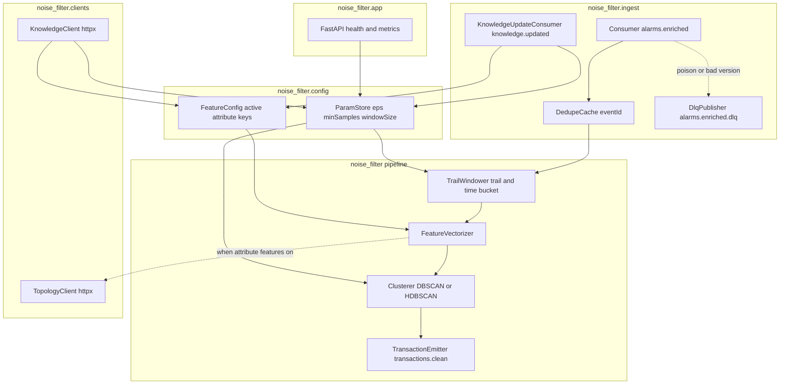
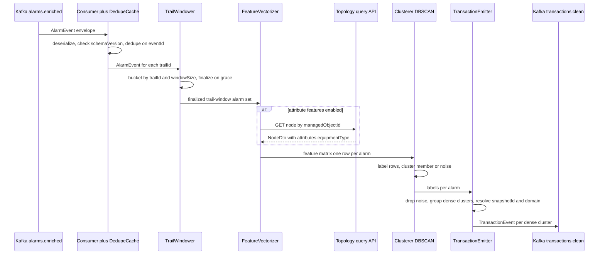
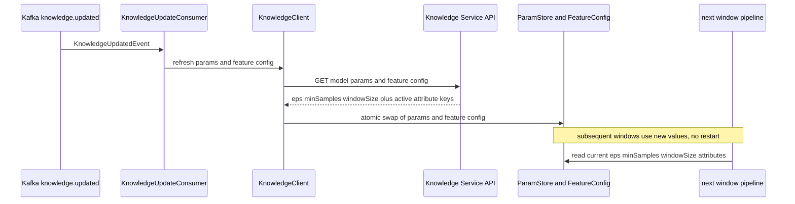
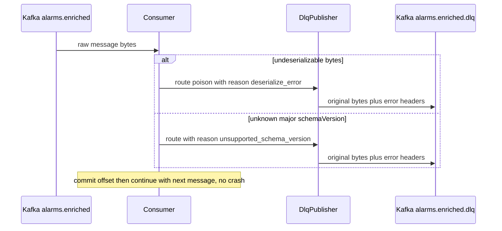
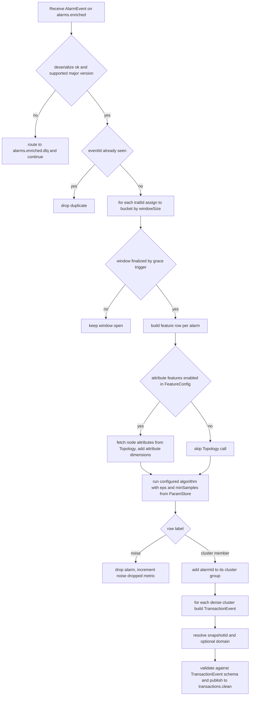

# noise-filter — Design

Buildable design for the **Noise Filter**, derived from the approved, merged
`services/noise-filter/spec.md` (PR #54 + PR #82) and `docs/architecture.md`. The service is the
Phase-2 statistical cleaning step on the **history path**: it consumes enriched, trail-tagged
alarms from `alarms.enriched`, groups them per trail within coarse time windows, runs DBSCAN per
trail-window to separate dense incident clusters from sparse outliers, drops the noise, and emits
each dense cluster as a `TransactionEvent` on `transactions.clean` for the Pattern Miner.

> **No contract change.** This design depends only on `libs/event-model` (`acp_event_model`
> Python/Pydantic binding: `AlarmEvent` in, `TransactionEvent` out) and on two **published** HTTP
> contracts it consumes as a client — the Knowledge Service model-params/feature-config API and the
> Topology Service node query API (`GET /topology/nodes/{managedObjectId}` returning a
> `NodeDto` whose `attributes` map carries `equipmentType` etc.). Both are backed by approved specs
> /designs; no new topic, payload, field, or OpenAPI surface is invented. The four spec Open
> Questions are all `[DESIGN-STAGE]` and are resolved below (DA-6, DA-7, DA-8 and the snapshotId
> flow). No hard-coded thresholds: `eps`, `minSamples`, `windowSize` and the active attribute
> feature set all come from the Knowledge Service.

## Stack

| Concern | Choice | License |
|---|---|---|
| Language / runtime | Python 3.13 | PSF |
| Clustering | scikit-learn `DBSCAN` (default); `hdbscan` available as a config-selectable algorithm | scikit-learn BSD-3, hdbscan BSD-3 |
| Numerics / feature matrix | NumPy | BSD-3 |
| Event contract | `acp_event_model` (frozen `libs/event-model` Python/Pydantic binding) | repo-internal |
| Kafka client | `confluent-kafka` (librdkafka) consumer + producer | Apache-2.0 |
| Validation / models | Pydantic v2 (via `acp_event_model`) | MIT |
| HTTP clients (Knowledge, Topology) | `httpx` | BSD-3 |
| Health / metrics surface | FastAPI + `uvicorn`; `prometheus-client` | MIT / BSD-3 / Apache-2.0 |
| Structured logging | `structlog` (JSON renderer) | Apache-2.0/MIT |
| Lint / format / test | `ruff`, `black`, `pytest` | MIT |
| Packaging / build | `pyproject.toml` (hatchling), Docker `python:3.13-slim` | — |

All components are permissive (MIT / BSD / Apache-2.0 / PSF) per the licensing invariant. DBSCAN is
deterministic for a fixed feature matrix and fixed params, satisfying the spec reproducibility
requirement. `hdbscan` is selectable but **off by default** (DA-1).

## Task breakdown (from the spec)

Every spec **Task (high-level)** maps 1:1 into the design below. Module names use the package root
`noise_filter.*`.

| Spec task | Realized by (modules / flow) |
|---|---|
| 1. Ingest `alarms.enriched` | `noise_filter.ingest.Consumer` (confluent-kafka) then `acp_event_model.deserialize` then `check_schema_version`. Dedup on `eventId` via `noise_filter.ingest.DedupeCache`. Unknown major `schemaVersion` and undeserializable bytes routed to `alarms.enriched.dlq`. (Key flow 1; Error handling EH-1, EH-2, EH-3) |
| 2. Partition into trail-windows | `noise_filter.windowing.TrailWindower`: for each `AlarmEvent` and each `trailId` in its `trailIds[]`, assign to a coarse tumbling time bucket of width `windowSize` (Knowledge param) keyed by `(trailId, bucketIndex)`. A window finalizes on a time/grace trigger then is handed to the pipeline. (Key flow 1; Algorithm flow step A) |
| 3. Feature-vectorize alarms | `noise_filter.features.FeatureVectorizer` builds a numeric row per alarm from relative timestamp, object-type layer (from the `managedObjectId` type prefix), `eventType`, `perceivedSeverity`, plus — when enabled by Knowledge feature config — device/connection attributes (e.g. `equipmentType`) fetched per `managedObjectId` from the Topology query API via `noise_filter.clients.TopologyClient`. Active attribute set comes solely from `noise_filter.config.FeatureConfig` (Knowledge-sourced); Topology call is skipped when all attribute features are off. (Algorithm flow steps B, C; Integration points) |
| 4. Run DBSCAN per trail-window | `noise_filter.cluster.Clusterer` runs `DBSCAN(eps, min_samples)` (params from Knowledge) over the per-window feature matrix; labels each row as a cluster member (label at least 0) or noise (label minus 1). `hdbscan` selectable via config. (Algorithm flow step D) |
| 5. Emit cleaned groups | `noise_filter.emit.TransactionEmitter`: for each dense cluster build a `TransactionEvent` (`transactionId`=fresh UUID, `trailId`, `snapshotId` resolved via DA-7, `alarmIds[]`=cluster members deduped, `windowStart`/`windowEnd`, optional `domain`), wrap in the envelope, validate, publish to `transactions.clean`. (Key flow 1; Algorithm flow step E) |
| 6. Refresh Knowledge parameters | `noise_filter.clients.KnowledgeClient` + `noise_filter.config.ParamStore`: load params + feature config at startup; on `knowledge.updated` (consumed via `noise_filter.ingest.KnowledgeUpdateConsumer`) re-fetch and hot-swap the in-memory `ParamStore` so subsequent windows use new values without restart. (Key flow 2; DA-8) |
| 7. Handle errors | `noise_filter.ingest.DlqPublisher` routes poison/unparseable and unknown-`schemaVersion` messages to `alarms.enriched.dlq`; all drops (noise points, DLQ routes, skipped attribute lookups) are logged with structured context. (Error handling section) |

## Phase applicability (design view)

Consistent with the canonical phase map (`architecture.md` noise-filter row: P1 Idle / P2 Active /
P3 Idle) and the spec Phase-applicability table.

| Phase | Active/Passive/Idle | Modules/handlers exercised | Inputs/Outputs |
|---|---|---|---|
| P1 — Topology onboarding | **Idle** | None on the critical path. Process may be up (so `/health` and `/metrics` respond) but the `alarms.enriched` consumer receives nothing; no windows finalize; no Knowledge/Topology calls are driven. | In: — . Out: — . |
| P2 — Pattern learning | **Active** (primary phase) | Full pipeline: `Consumer` then `DedupeCache` then `TrailWindower` then `FeatureVectorizer` (with `TopologyClient` when attribute features enabled) then `Clusterer` (DBSCAN) then `TransactionEmitter`; `KnowledgeClient`/`ParamStore` for params/feature config; `KnowledgeUpdateConsumer` for hot refresh; `DlqPublisher` for errors. | In: `alarms.enriched` (`AlarmEvent`), `knowledge.updated` (`KnowledgeUpdatedEvent`); reads Knowledge model-params/feature-config API and (conditionally) Topology node query API. Out: `transactions.clean` (`TransactionEvent`); `alarms.enriched.dlq` on poison/unknown-version. |
| P3 — Real-time correlation | **Idle** (history path only) | None. Live alarms (`alarms.enriched.live` / `alarms.persisted.live`) are **not** consumed and never DBSCAN-clustered. Live noise rejection is handled deterministically by Enrichment and by the Correlation Engine noise-tolerant pattern/codebook match, not here. No live-path module is defined. | In: — . Out: — . |

DBSCAN is a Phase-2 *training-data* cleaner. The deliberate P3-Idle decision and its rationale are
in the spec Out-of-scope/Phase tables; this design adds no live-path code path that would let the
service drift Active in P3.

## Module breakdown

| Module | Responsibility |
|---|---|
| `noise_filter.app` | Process entrypoint: wires config, clients, consumers, the FastAPI app (`/health`, `/metrics`), and the run loop. Refuses to start if Knowledge params cannot be loaded (spec Error handling). |
| `noise_filter.ingest.Consumer` | Subscribes `alarms.enriched`; deserializes via `acp_event_model`; manual offset commit after successful processing (at-least-once). |
| `noise_filter.ingest.KnowledgeUpdateConsumer` | Subscribes `knowledge.updated`; triggers `ParamStore`/`FeatureConfig` refresh (DA-8). |
| `noise_filter.ingest.DedupeCache` | Bounded TTL set of seen `eventId`s; second delivery of an `eventId` is dropped before windowing. |
| `noise_filter.ingest.DlqPublisher` | Publishes the original bytes plus a structured `reason`/`error` header to `alarms.enriched.dlq`. |
| `noise_filter.windowing.TrailWindower` | Maintains per-`(trailId, bucketIndex)` open windows keyed by `windowSize`; finalizes a window on a wall-clock/grace trigger and yields its alarm set. |
| `noise_filter.features.FeatureVectorizer` | Builds the feature matrix for a finalized window (numeric encoding + optional attribute dimensions); requests attributes from `TopologyClient` only when `FeatureConfig` enables at least one attribute key. |
| `noise_filter.cluster.Clusterer` | Runs the configured algorithm (DBSCAN default) over the matrix; returns label per row. |
| `noise_filter.emit.TransactionEmitter` | Groups cluster-member rows into `TransactionEvent`s, resolves `snapshotId` + `domain`, validates, publishes to `transactions.clean`. |
| `noise_filter.config.ParamStore` | Thread-safe holder of `eps`, `minSamples`, `windowSize`, `algorithm`; hot-swappable. |
| `noise_filter.config.FeatureConfig` | Thread-safe holder of the active attribute key set + per-key encoding; hot-swappable. |
| `noise_filter.clients.KnowledgeClient` | `httpx` client built against the Knowledge OpenAPI; fetches model params + feature config; retry-with-backoff. |
| `noise_filter.clients.TopologyClient` | `httpx` client built against the Topology OpenAPI; fetches `NodeDto.attributes` by `managedObjectId`; instantiated only when an attribute feature is enabled. |
| `noise_filter.metrics` | Prometheus collectors (counters/gauges/histograms enumerated in Config and observability). |

## Data model / DB schema

**N/A — no owned store.** The Noise Filter is stateless over the window lifecycle. It owns no
PostgreSQL schema and never touches Apache AGE. The only state is **ephemeral, in-process**:

- `TrailWindower` open windows (`(trailId, bucketIndex)` then list of in-window alarm refs), evicted
  when the window finalizes.
- `DedupeCache` recently-seen `eventId`s (bounded TTL set; idempotency only, not durable history).

Durability and replay come from Kafka (at-least-once delivery, consumer offsets). Per the MVP
"live only, no historical corpus" rule, history-path alarms are mined in-flight and persisted
nowhere by this service. No schema, tables, indexes, or migrations are defined.

## Event handling

**Consumers**

| Topic | Payload | Handler | Idempotency / dedupe | DLQ |
|---|---|---|---|---|
| `alarms.enriched` | `AlarmEvent` | `Consumer` then `DedupeCache` then `TrailWindower` | dedupe on envelope `eventId` (TTL cache); duplicate dropped before windowing so an `alarmId` appears at most once in a window | `alarms.enriched.dlq` for undeserializable bytes and unknown major `schemaVersion` |
| `knowledge.updated` | `KnowledgeUpdatedEvent` | `KnowledgeUpdateConsumer` | refresh is idempotent (re-fetch then replace); duplicate events cause a harmless re-fetch | none (a refresh failure logs then retries; a bad event is logged, not DLQ-routed, because it carries no alarm to lose) |

**Producers**

| Topic | Payload | Producer | Notes |
|---|---|---|---|
| `transactions.clean` | `TransactionEvent` (`transactionId`, `trailId`, `snapshotId`, `alarmIds[]`, `windowStart`, `windowEnd`, optional `domain`) | `TransactionEmitter` | one event per dense cluster per trail-window; `alarmIds` non-empty; envelope `eventId` = fresh UUID, `source` = `noise-filter`, `traceId` carried from a representative input alarm where available. Noise-labeled alarms are dropped, never emitted. |
| `alarms.enriched.dlq` | original message bytes + structured error headers | `DlqPublisher` | poison / unknown-version routing |

`domain` on `TransactionEvent` is **optional** (event-model #90). It is carried/derived from the
trail context (the same source as `snapshotId`, DA-7); when unknown it is omitted and downstream
consumers default to the single MVP domain. The Noise Filter never invents a domain value.

## API contracts / API schema

**N/A — no HTTP business surface.** The Noise Filter is a pure Kafka consumer/producer pipeline. It
publishes **no** OpenAPI 3.1 business document and exposes no REST business operation. The only HTTP
endpoints are operational:

- `GET /health` — liveness/readiness. Ready only once Knowledge params + feature config have
  loaded and Kafka consumer/producer are connected. Returns `200` with `status ok` or `503`.
- `GET /metrics` — Prometheus text exposition.

Adding any business HTTP surface in future would be a contract change (per spec). The service wire
contract is solely the `acp_event_model` binding (envelope + `AlarmEvent` in, `TransactionEvent`
out). The two HTTP surfaces it **consumes as a client** are covered under Integration points.

## Integration points (mock vs. real)

No hard-coded URLs; every collaborator base URL and mock/real toggle comes from env. Mock = a stub
generated from the collaborator published OpenAPI 3.1 spec (unit tests); real = the live service
(integration).

| Collaborator + operation | Config keys | mock / real toggle |
|---|---|---|
| **Knowledge Service** — fetch DBSCAN model params (`eps`, `minSamples`, `windowSize`, `algorithm`) and the **feature config** (which attribute keys are active + their encoding) | `KNOWLEDGE_SERVICE_URL` | `KNOWLEDGE_CLIENT_MODE` of mock or real. Mock stub generated from the Knowledge OpenAPI; real Knowledge Service in integration. |
| **Topology Service** — `GET /topology/nodes/{managedObjectId}` returning `NodeDto` with fields managedObjectId, objectType, domain, name, attributes, snapshotId; the `attributes` map supplies `equipmentType`/`vendor`/`model` | `TOPOLOGY_SERVICE_URL` | `TOPOLOGY_CLIENT_MODE` of mock or real. **Client instantiated only when at least one attribute feature is enabled** in `FeatureConfig`; fully bypassed otherwise. Mock stub from the Topology OpenAPI; real Topology Service in integration. |

**Trail Builder** is *not* a runtime call for trail resolution — `trailIds[]` arrive already stamped
on each `AlarmEvent` by Enrichment (spec Out-of-scope). It is consulted only for `snapshotId`
provenance (DA-7), itself config-switchable; the leading choice avoids a live call entirely.

Both the Topology node-attribute query and the Knowledge model-params/feature-config reads are
backed by approved Topology/Knowledge specs/designs (Topology `GET /topology/nodes/{managedObjectId}`
returns `attributes`; Knowledge serves model params + an attribute catalogue including
`equipmentType` as a Noise-Filter clustering feature). **No contract gap** — design may proceed.

## Key flows (sequence / data-flow diagrams)

### Flow 1 — P2 clean path: enriched alarms to a clean transaction

### Flow 2 — runtime Knowledge param and feature-config refresh

### Flow 3 — poison / unknown-version to DLQ (failure path)

## Algorithm logical flow

DBSCAN per trail-window. Parameters `eps`, `minSamples`, `windowSize`, `algorithm`, and the active
attribute key set are **all read from `ParamStore`/`FeatureConfig`** (sourced from Knowledge) — none
is hard-coded.

**Feature vector per alarm (one matrix row).** Numeric encoding so DBSCAN distance is meaningful:

1. **Relative timestamp** — `raisedAt` minus `windowStart`, in seconds (scaled). Captures temporal
   density of a cascade.
2. **Object-type layer** — ordinal/one-hot of the `objectType` prefix parsed from `managedObjectId`
   (`<objectType>:<id>` scheme), e.g. `FiberSpan`, `IPLink`, `Port`. Captures dependency-graph layer
   (Open Question 1: richer graph-position features such as hop depth are deferred; see DA-5).
3. **Alarm type** — encoding of `eventType`.
4. **Severity** — ordinal of `perceivedSeverity` (X.733 ordering).
5. **Optional attribute dimensions** — one dimension per **enabled** attribute key in `FeatureConfig`
   (e.g. `equipmentType`), value encoded from the Topology `NodeDto.attributes` map. Absent when no
   attribute feature is enabled; missing/unknown values degrade gracefully (EH-5).

Continuous features are standardized so `eps` is in a stable space. DBSCAN labels each row as a
cluster member (label at least 0) or noise (label minus 1); only dense clusters survive into
`TransactionEvent`s. For a fixed matrix + fixed params the labeling is deterministic (reproducibility
requirement).

## Seed data & examples

**N/A.** The Noise Filter generates no seed/fixture data of its own and is not the Simulator. Test
inputs are synthetic `AlarmEvent` fixtures built in `pytest` from the `acp_event_model` binding
(e.g. the fiber-cut cascade `LOS` then `LinkDown` then `AdjDown` then `LSPDown` plus injected chatty
alarms), and Simulator-oracle-derived windows for the effectiveness criterion (AC-9). These are
test fixtures, not owned seed data, and live under `services/noise-filter/tests/fixtures/`.

## UI wireframes

**N/A.** This is a back-end Kafka pipeline service with no UI. The web-ui owns all screens.

## Error handling

First-class. Nothing is silently dropped except DBSCAN-labeled noise points, which are dropped **by
design** and counted in metrics + logged at debug with the dropped `alarmId`s.

| ID | Failure mode | Handling | Surfaced as |
|---|---|---|---|
| EH-1 | Poison / unparseable message on `alarms.enriched` (malformed JSON, fails `acp_event_model.deserialize`) | Route original bytes + `reason=deserialize_error` header to `alarms.enriched.dlq`, commit offset, continue. No crash. | DLQ message + `WARN` JSON log + `nf_dlq_total` with reason label |
| EH-2 | Unknown **major** `schemaVersion` (`check_schema_version` raises) | Route to `alarms.enriched.dlq` with `reason=unsupported_schema_version` + structured log; continue. | DLQ message + `WARN` log + counter |
| EH-3 | Valid envelope but semantically invalid `AlarmEvent` (e.g. missing `trailIds`, malformed `managedObjectId`) | Route to DLQ with `reason=validation_error`; continue. | DLQ message + `WARN` log + counter |
| EH-4 | Knowledge Service unavailable **at startup** (cannot load params/feature config) | Retry with backoff; **service does not become ready / does not start** until params load (spec). `/health` returns `503`. | `/health` 503 + `ERROR` log; process stays not-ready |
| EH-5 | Topology Service unavailable/errors **when attribute features enabled** | Degrade: skip the attribute dimension(s) for the affected `managedObjectId` (vector built without them), log the skip; the alarm is still clustered on the base features. Optional short retry/backoff before degrade. Never drops the alarm; never blocks the window. | `WARN` log + `nf_topology_attr_skip_total` counter |
| EH-6 | Knowledge refresh (`knowledge.updated`) fetch fails | Keep the previous in-memory params/feature config (last-good), retry with backoff; do **not** crash or process with empty config. | `WARN` log + `nf_knowledge_refresh_failures_total` counter |
| EH-7 | Duplicate delivery (same `eventId`) | `DedupeCache` drops the duplicate before windowing so an `alarmId` appears at most once per window/transaction. | `nf_duplicates_dropped_total` counter |
| EH-8 | `snapshotId` unresolvable for a finalized window (DA-7 source returns nothing) | Window is held/retried briefly; if still unresolved, the cluster is **not** emitted with a fabricated id — it is logged as `WARN` and counted; never emit an invalid `TransactionEvent`. | `WARN` log + `nf_snapshot_unresolved_total` counter |
| EH-9 | DBSCAN yields no dense cluster for a window (all noise / too few points) | No `TransactionEvent` emitted for that window (correct: nothing dense). Counted. | `nf_windows_no_cluster_total` counter |
| EH-10 | Produce to `transactions.clean` fails | Producer retry/backoff; on persistent failure the input offset is **not** committed so the window is reprocessed (at-least-once) — duplicates downstream are tolerated by the Miner. | `ERROR` log + `nf_produce_failures_total` counter |

Every emitted `TransactionEvent` is validated against the `TransactionEvent` schema before publish;
a validation failure is treated as a code bug (EH-3 class, logged `ERROR`), never published.

## Design alternatives

| Consideration | Alternatives considered | Chosen + rationale |
|---|---|---|
| DA-1 Clustering algorithm | (a) scikit-learn `DBSCAN`; (b) `hdbscan`; (c) k-means | **DBSCAN default, hdbscan config-selectable.** Spec names DBSCAN and allows HDBSCAN. DBSCAN with Knowledge-supplied `eps`/`minSamples` directly matches the spec params and is deterministic and simple; k-means rejected (needs a fixed cluster count and has no noise label). hdbscan kept selectable via `algorithm` param for windows where a single global `eps` is awkward, but off by default to keep behaviour predictable and Knowledge-param-driven. |
| DA-2 Feature set / encoding | (a) timestamp + layer + type + severity only; (b) plus optional device attributes (`equipmentType`/`vendor`/`model`); (c) embeddings | **(b).** Spec mandates the base four and the *config-driven optional* attribute features. Embeddings rejected (opaque, non-deterministic, no Knowledge-driven control). Attribute dimensions are added only when `FeatureConfig` enables them, so the default stays lightweight and Topology is not called needlessly. |
| DA-3 Windowing | (a) coarse tumbling time buckets per trail; (b) Kafka-Streams-style session windows; (c) global time window across all trails | **(a) per-trail coarse tumbling buckets of `windowSize`.** Spec scopes DBSCAN *per trail-window* and explicitly leaves session/gap finalization to the Pattern Miner (out-of-scope). Global windows rejected (would mix trails and defeat trail scoping). Session windows rejected (that is the Miner job). |
| DA-4 Topology call granularity | (a) per-alarm `GET /topology/nodes/{moId}`; (b) batch per window; (c) local cache | **(a) per `managedObjectId` with a short-TTL in-process cache.** Matches the published Topology operation shape exactly; the cache collapses repeated lookups within/near a window without inventing a batch endpoint (no contract change). Only used when an attribute feature is enabled. |
| DA-5 Graph-position richness (OQ1) | (a) object-type prefix only; (b) add hop-depth/propagation-depth features | **(a) for the MVP.** Spec OQ1 marks richer graph-position as design-stage and *not* covered by this update; adding hop-depth would need extra Topology/Trail traversal. Deferred (tracked #48); the design leaves a clean extension point in `FeatureVectorizer`. |
| DA-6 `knowledge.updated` wiring (OQ3) | (a) subscribe to `knowledge.updated` topic; (b) poll Knowledge API on a timer | **(a) subscribe.** Spec AC-8 requires runtime refresh *after a `knowledge.updated` event is received*. Subscribing gives immediate, event-driven refresh with no polling lag; params are still fetched from the Knowledge API (the event is only the trigger). No `architecture.md` consumer-map change is required at spec stage; this is a wiring choice (reflected as a consumed trigger only). |
| DA-7 `snapshotId` provenance (OQ2) | (a) Trail Builder `getTrail(trailId)` returns the snapshot in scope; (b) carry snapshot on the trail context cached at window open | **(a) via Trail Builder `getTrail(trailId)`, config-switchable + cached.** `AlarmEvent` does not carry `snapshotId`; the service already scopes per trail, so resolving it from the trail context is the natural, contract-free source (no `AlarmEvent` field added). Cached per `trailId` to avoid per-window calls. If unresolved, EH-8 applies (never fabricate). |
| DA-8 Param hot-swap | (a) atomic replace of an immutable `ParamStore` snapshot read at window start; (b) per-field mutation | **(a) atomic snapshot replace.** Each finalized window reads one consistent params snapshot; refresh swaps the whole snapshot atomically, avoiding a window seeing half-old/half-new values. |
| DA-9 Kafka client | (a) `confluent-kafka`; (b) `aiokafka`; (c) `kafka-python` | **(a) confluent-kafka.** librdkafka-backed, robust manual offset control for at-least-once + DLQ, permissive (Apache-2.0). Aligns with explicit idempotent consumption. |

## Test plan

### Acceptance criterion to test (unit/contract — pytest)

Every spec acceptance criterion maps 1:1 to a named pytest test.

| # | Acceptance criterion (spec) | Test | Asserts |
|---|---|---|---|
| 1 | Noise drop — chatty alarm removed | `test_chatty_alarm_dropped_from_cascade` | Window = fiber-cut cascade (LOS, LinkDown, AdjDown, LSPDown) + 1 coincidental chatty alarm; exactly one `TransactionEvent` emitted whose `alarmIds` contains the four cascade ids and **not** the chatty id. |
| 2 | Cluster preserved intact | `test_cascade_cluster_preserved_intact` | Window = only the cascade alarms; one `TransactionEvent` whose `alarmIds` contains **every** cascade alarm; none dropped. |
| 3 | DBSCAN params from Knowledge change results | `test_dbscan_params_from_knowledge_change_results` | Same input window, two mock-Knowledge param sets: tight (small `eps`, high `minSamples`) yields fewer/no dense clusters; loose (large `eps`, low `minSamples`) yields at least one cluster. Proves no hard-coded threshold and Knowledge is the sole source. |
| 4 | `TransactionEvent` schema validity | `test_transaction_event_validates_against_schema` | Every emitted `TransactionEvent` validates against the `libs/event-model` `TransactionEvent` JSON Schema; all required fields present; `alarmIds` non-empty. |
| 5 | Idempotency on duplicate `eventId` | `test_duplicate_event_id_processed_once` | Same `AlarmEvent` (identical `eventId`) delivered twice; the alarm id appears exactly once in the output `TransactionEvent`; `nf_duplicates_dropped_total` increments. |
| 6 | Poison message to DLQ | `test_poison_message_routed_to_dlq` | Malformed-JSON message published to `alarms.enriched.dlq` with `reason=deserialize_error`; consumer continues with the next message without crashing. |
| 7 | Unknown `schemaVersion` to DLQ | `test_unknown_schema_version_routed_to_dlq` | Envelope with unsupported major `schemaVersion` routed to `alarms.enriched.dlq` with `reason=unsupported_schema_version` + structured log; continues. |
| 8 | Knowledge param refresh at runtime | `test_knowledge_param_refresh_changes_labeling` | After a `knowledge.updated` event, mock Knowledge returns new params; the same fixed input window produces a changed cluster labeling without restart. |
| 9 | Noise-filter effectiveness measurable | `test_noise_filter_effectiveness_meets_thresholds` | Synthetic window with N injected noise + M real cascade alarms (Simulator oracle); output contains at least `ceil(M*0.9)` real alarm ids and at most `floor(N*0.1)` noise ids. |
| 10 | Attribute feature config-driven (inclusion + exclusion) | `test_attribute_feature_config_driven_inclusion_and_exclusion` | With `equipmentType` enabled in mock Knowledge feature config: feature matrix has an `equipmentType` dimension and alarms with distinct `equipmentType` separate into different clusters; `TopologyClient` is called. With it disabled: no such dimension and `TopologyClient` is **not** called. Proves no attribute key is hard-coded. |

Supporting unit tests (design behaviour, not 1:1 to a criterion): `test_topology_unavailable_degrades_skips_attribute` (EH-5), `test_snapshot_unresolved_not_emitted` (EH-8), `test_window_all_noise_emits_nothing` (EH-9), `test_per_trail_windowing_isolation` (DA-3), `test_health_not_ready_until_params_loaded` (EH-4), `test_param_snapshot_atomic_swap` (DA-8).

### E2E scenarios (from the Noise Filter point of view)

Run against the integration stack (real Kafka, real Knowledge + Topology) during the integration
stage; trigger via the upstream `alarms.enriched` topic (fed by Simulator then Enrichment) and assert
on `transactions.clean` / `alarms.enriched.dlq`.

| # | Scenario | Trigger then path | Expected outcome |
|---|---|---|---|
| 1 | Cascade in, clean transaction out | Enriched fiber-cut cascade + injected chatty alarms on `alarms.enriched` then windowing then DBSCAN then emit | One `TransactionEvent` on `transactions.clean` with the cascade ids, chatty alarm dropped; schema-valid. |
| 2 | Attribute-feature-driven separation (real Topology) | Knowledge feature config enables `equipmentType`; window of alarms on objects with distinct `equipmentType`; service fetches `GET /topology/nodes/{moId}` from real Topology | Clusters split along `equipmentType`; with the feature disabled in Knowledge, Topology is not called and the split disappears. |
| 3 | Runtime param refresh | Edit DBSCAN params in real Knowledge then `knowledge.updated` emitted then next windows | Cluster labeling for an equivalent input changes without restarting the service. |
| 4 | Poison + unknown-version isolation (failure path) | Inject a malformed message and an unsupported-`schemaVersion` message interleaved with valid alarms | Both land on `alarms.enriched.dlq` with the right `reason`; valid alarms still produce `TransactionEvent`s; service stays healthy. |
| 5 | Topology down, graceful degrade (partial path) | Attribute features enabled, Topology Service stopped, valid alarms flowing | Alarms still clustered on base features (attribute dimension skipped); `nf_topology_attr_skip_total` rises; transactions still emitted; no crash, no alarm loss. |
| 6 | Duplicate delivery | Same `AlarmEvent` `eventId` replayed (consumer rebalance / at-least-once) | Output transaction references the alarm id once; `nf_duplicates_dropped_total` increments. |
| 7 | Effectiveness oracle | Simulator-labeled window (known N noise / M real) end-to-end | Computed transaction satisfies AC-9 thresholds against the oracle; feeds the section-10 effectiveness metric. |

## Config & observability

**Environment variables** (no hard-coded thresholds; algorithm params come from Knowledge):

| Var | Purpose |
|---|---|
| `KAFKA_BOOTSTRAP_SERVERS` | Kafka brokers |
| `KAFKA_CONSUMER_GROUP_ID` | consumer group for `alarms.enriched` (+ `knowledge.updated`) |
| `KNOWLEDGE_SERVICE_URL` | Knowledge base URL |
| `KNOWLEDGE_CLIENT_MODE` | `mock` (OpenAPI stub) or `real` |
| `TOPOLOGY_SERVICE_URL` | Topology base URL |
| `TOPOLOGY_CLIENT_MODE` | `mock` or `real`; client created only when an attribute feature is enabled |
| `LOG_LEVEL` | structured-log level |
| `HTTP_PORT` | port for `/health`, `/metrics` (default 8080) |

`eps`, `minSamples`, `windowSize`, `algorithm`, and the active attribute key set + encodings are
**Knowledge Service parameters**, loaded at startup and hot-refreshed on `knowledge.updated`. The
optional `snapshotId`-provenance and dedupe-TTL knobs default sanely and are env-overridable.

**Observability**
- `GET /health` — readiness gated on params loaded + Kafka connected (503 otherwise).
- `GET /metrics` — Prometheus. Collectors: `nf_alarms_consumed_total`, `nf_windows_finalized_total`,
  `nf_clusters_emitted_total`, `nf_noise_points_dropped_total`, `nf_transactions_emitted_total`,
  `nf_duplicates_dropped_total`, `nf_dlq_total` (reason label), `nf_topology_attr_skip_total`,
  `nf_knowledge_refresh_total` / `nf_knowledge_refresh_failures_total`,
  `nf_snapshot_unresolved_total`, `nf_windows_no_cluster_total`, `nf_produce_failures_total`,
  `nf_dbscan_duration_seconds` (histogram), `nf_window_size_alarms` (histogram).
- Structured JSON logs (`structlog`): one line per finalized window (trail, window bounds, alarm
  count, cluster count, noise dropped), per DLQ route (reason + offset), per Knowledge refresh, per
  Topology degrade. No plain-text log lines in production. `traceId` propagated from input alarms.

## Build & run

- **Layout:** `services/noise-filter/` with `pyproject.toml` (hatchling), `src/noise_filter/`,
  `tests/` (pytest, fixtures under `tests/fixtures/`), `Dockerfile`, `README.md`, and a Compose
  entry in the root stack. Depends on the `acp_event_model` Python package from `libs/event-model`.
- **Install/dev:** `pip install -e .[dev]` (or `uv`); `ruff check . && black --check . && pytest`.
- **Lint/format:** `ruff` + `black` (CLAUDE.md Python conventions), full type hints.
- **Test:** `pytest` — unit/contract with mock Knowledge/Topology stubs generated from the
  collaborators published OpenAPI specs; `TransactionEvent`s validated against the `libs/event-model`
  schema. Integration E2E runs against the real stack.
- **Container:** `python:3.13-slim` base; install the package + `acp_event_model`; entrypoint runs
  `python -m noise_filter.app`. Exposes `HTTP_PORT` for `/health` + `/metrics`. Compose entry wires
  Kafka, Knowledge, Topology via the env vars above.
- **Run locally:** set the env vars (point clients at `mock` for an offline run or `real` against the
  Compose stack) and `python -m noise_filter.app`.
