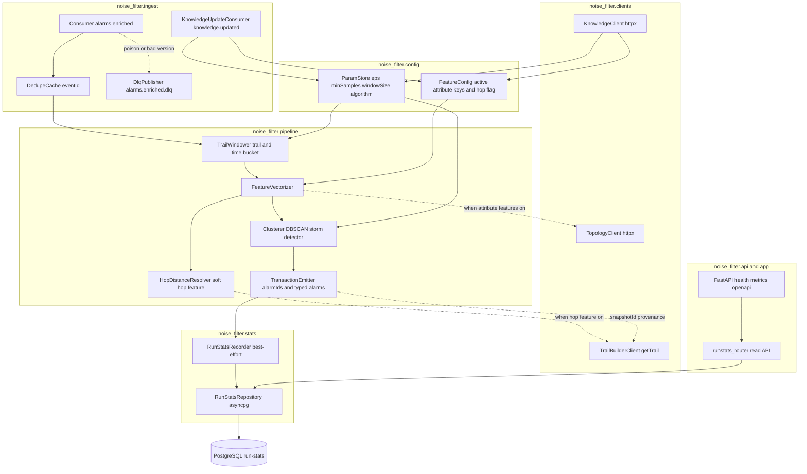
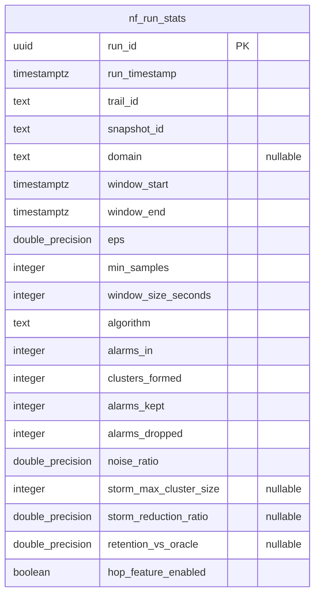
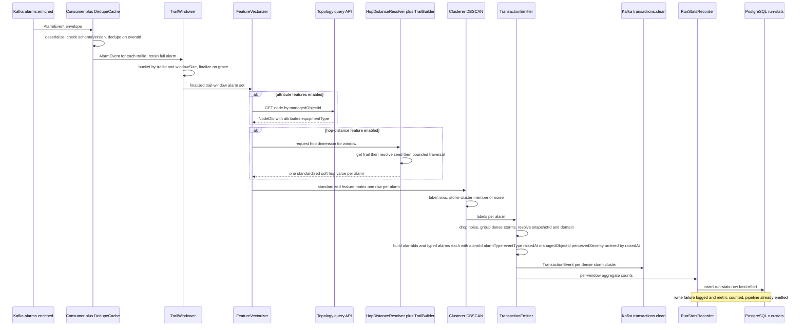
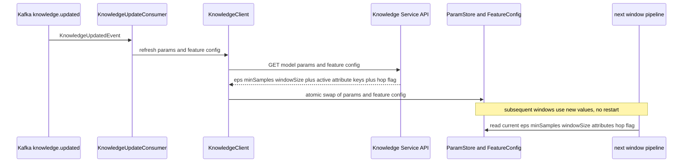
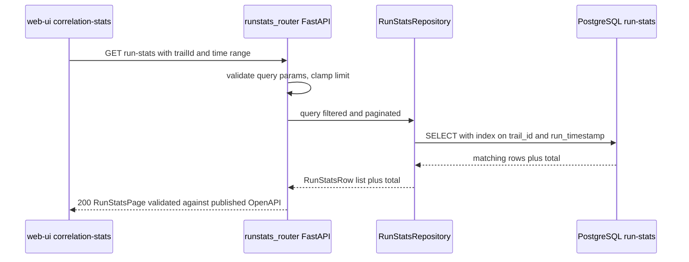
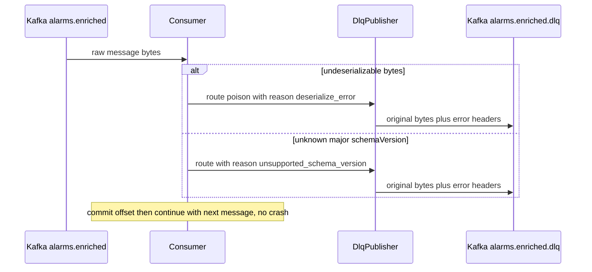
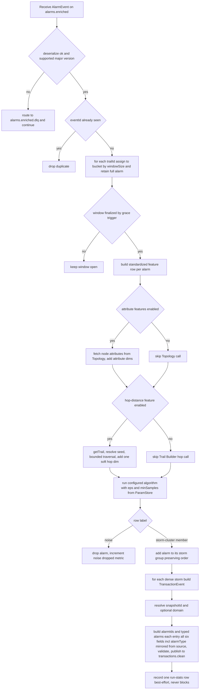

# noise-filter — Design

Buildable design for the **Noise Filter**, derived from the approved, merged
`services/noise-filter/spec.md` (PR #54 + #82 + **#113** run-stats/storm/hop-distance rework)
and `docs/architecture.md`. The service's **primary mission is alarm storm reduction**: when a
single fault detonates a large post-dedup burst of alarms rippling across a trail, the service
recognises that burst as ONE storm and emits it as ONE clean `TransactionEvent` capturing the
cascade — while dropping coincidental alarms riding along in the flood. It is the Phase-2
statistical cleaning step on the **history path**: it consumes enriched, trail-tagged alarms
from `alarms.enriched`, groups them per trail within coarse time windows, runs DBSCAN per
trail-window to separate dense **storm/cascade clusters** from sparse outliers, drops the noise,
and emits each dense cluster as a `TransactionEvent` (now carrying the typed `alarms[]` detail)
on `transactions.clean` for the Pattern Miner. New in this rework: a soft, config-driven
**topology hop-distance feature**, and a lightweight NF-owned **PostgreSQL run-stats store** with
a read-only **OpenAPI 3.1 HTTP API** consumed by the web-ui.

> **No new contract introduced by this design.** The design depends only on `libs/event-model`
> (`acp_event_model` Python/Pydantic binding: `AlarmEvent` in, `TransactionEvent` out — and it now
> **populates the already-merged typed `alarms[]` array** on `TransactionEvent`, a contract that
> was merged into `main` independently, not by this design) and on three **published** HTTP
> contracts it consumes as a client — the Knowledge Service model-params/feature-config API, the
> Topology Service node query API, and the **Trail Builder `getTrail(trailId)` API** (for
> `snapshotId` provenance and hop-distance seed resolution). It **adds a service-owned PostgreSQL
> run-stats store and a read-only HTTP read API** — both single-owner, internal, no Kafka topic,
> no event-model change. No new topic, payload, or event-model field is invented. The seven spec
> Open Questions are all `[DESIGN-STAGE]`/`[RESOLVED]` and are resolved below (DA-6, DA-7, DA-8,
> DA-10, DA-11, DA-12 and the snapshotId/seed flows). No hard-coded thresholds: `eps`,
> `minSamples`, `windowSize`, the active attribute feature set, and the hop-distance feature on/off
> flag all come from the Knowledge Service.
>
> **Branch note (supersedes PR #101).** This design supersedes the open design PR #101. The
> `libs/event-model/**`, `docs/architecture.md`, `docker-compose.yml` and related changes visible
> in this branch's diff are **byte-identical inherited-from-`main` noise** — the prior design
> branch was behind `main`; this rework branch merged `main` in to pick up the typed `alarms[]`
> contract and the NebulaGraph/Trail-Builder contract docs. The only authored change is
> `services/noise-filter/design.md`.

## Stack

| Concern | Choice | License |
|---|---|---|
| Language / runtime | Python 3.13 | PSF |
| Clustering | scikit-learn `DBSCAN` (default); `hdbscan` available as a config-selectable algorithm | scikit-learn BSD-3, hdbscan BSD-3 |
| Numerics / feature matrix | NumPy | BSD-3 |
| Event contract | `acp_event_model` (frozen `libs/event-model` Python/Pydantic binding) — incl. the typed `TransactionEvent.alarms[]` array | repo-internal |
| Kafka client | `confluent-kafka` (librdkafka) consumer + producer | Apache-2.0 |
| Validation / models | Pydantic v2 (via `acp_event_model`) | MIT |
| HTTP clients (Knowledge, Topology, Trail Builder) | `httpx` | BSD-3 |
| HTTP server (health, metrics, run-stats read API) | FastAPI + `uvicorn` | MIT / BSD-3 |
| Metrics | `prometheus-client` | Apache-2.0 |
| PostgreSQL access (run-stats store) | `asyncpg` (chosen for strictly-permissive licensing; psycopg3 is LGPL) | Apache-2.0 |
| Schema migration | `yoyo-migrations` — versioned SQL migrations applied at startup | Apache-2.0 |
| Structured logging | `structlog` (JSON renderer) | Apache-2.0/MIT |
| Lint / format / test | `ruff`, `black`, `pytest`, `testcontainers[postgres]` (integration), `schemathesis` (OpenAPI contract test) | MIT / Apache-2.0 |
| Packaging / build | `pyproject.toml` (hatchling), Docker `python:3.13-slim` | — |

All components are permissive (MIT / BSD / Apache-2.0 / PSF) per the licensing invariant.
**psycopg3 is LGPL**; to keep the dependency tree strictly permissive the run-stats store uses
**`asyncpg` (Apache-2.0)**. DBSCAN is deterministic for a fixed feature matrix and fixed params,
satisfying the spec reproducibility requirement. `hdbscan` is selectable but **off by default**
(DA-1).

## Task breakdown (from the spec)

Every spec **Task (high-level)** (1–9) maps into the design below. Module names use the package
root `noise_filter.*`.

| Spec task | Realized by (modules / flow) |
|---|---|
| 1. Ingest `alarms.enriched` | `noise_filter.ingest.Consumer` (confluent-kafka) then `acp_event_model.deserialize` then `check_schema_version`. Dedup on `eventId` via `noise_filter.ingest.DedupeCache`. Unknown major `schemaVersion` and undeserializable bytes routed to `alarms.enriched.dlq`. (Flow 1; EH-1, EH-2, EH-3) |
| 2. Partition into trail-windows | `noise_filter.windowing.TrailWindower`: for each `AlarmEvent` and each `trailId` in its `trailIds[]`, assign to a coarse tumbling time bucket of width `windowSize` (Knowledge param) keyed by `(trailId, bucketIndex)`. A window finalizes on a time/grace trigger then is handed to the pipeline. (Flow 1; Algorithm step A) |
| 3. Feature-vectorize alarms | `noise_filter.features.FeatureVectorizer` builds a standardized numeric row per alarm from relative timestamp (primary storm-density signal), object-type layer, `eventType`, `perceivedSeverity`; plus — when enabled by Knowledge feature config — (a) device/connection attribute dimensions from `noise_filter.clients.TopologyClient`, and (b) **one soft hop-distance dimension** from the trail seed via `noise_filter.features.HopDistanceResolver` + `noise_filter.clients.TrailBuilderClient`. Active feature set comes solely from `noise_filter.config.FeatureConfig` (Knowledge-sourced); Topology/Trail-Builder calls are skipped when their features are off. (Algorithm steps B, C; Integration points; DA-10) |
| 4. Run DBSCAN per trail-window | `noise_filter.cluster.Clusterer` runs `DBSCAN(eps, min_samples)` (params from Knowledge) over the per-window feature matrix; labels each row as a storm-cluster member (label at least 0) or noise (label minus 1). `hdbscan` selectable. Dense clusters = storms from one propagating fault. (Algorithm step D; DA-1) |
| 5. Emit cleaned groups | `noise_filter.emit.TransactionEmitter`: for each dense cluster (storm) build a `TransactionEvent` (`transactionId`=fresh UUID, `trailId`, `snapshotId` resolved via DA-7, `alarmIds[]`=cluster members in arrival order, **`alarms[]`=ordered typed per-alarm detail built from the in-hand enriched AlarmEvents — each entry the full SIX required fields `alarmId`, `alarmType`, `eventType`, `raisedAt`, `managedObjectId`, `perceivedSeverity`, every one copied verbatim from the source AlarmEvent (`alarmType` is a pass-through mirror, never derived or altered)**, `windowStart`/`windowEnd`, optional `domain`), wrap in the envelope, validate, publish to `transactions.clean`. (Flow 1; Algorithm step E; DA-13) |
| 6. Record run-stats | `noise_filter.stats.RunStatsRecorder` writes ONE aggregate row per finalized trail-window execution to the NF-owned PostgreSQL run-stats table via `noise_filter.stats.RunStatsRepository`. **Best-effort / non-blocking**: the emit in task 5 has already happened; a write failure is logged + metric-counted and the pipeline continues. (Flow 1; Data model; Algorithm step F; DA-12; EH-11) |
| 7. Refresh Knowledge parameters | `noise_filter.clients.KnowledgeClient` + `noise_filter.config.ParamStore`/`FeatureConfig`: load params + feature config at startup; on `knowledge.updated` (consumed via `noise_filter.ingest.KnowledgeUpdateConsumer`) re-fetch and hot-swap the in-memory stores so subsequent windows use new values without restart. (Flow 2; DA-6, DA-8) |
| 8. Handle errors | `noise_filter.ingest.DlqPublisher` routes poison/unparseable and unknown-`schemaVersion` messages to `alarms.enriched.dlq`; all drops (noise points, DLQ routes, skipped attribute lookups, stats-write failures) are logged with structured context. (Error handling section) |
| 9. Serve run-stats read API | `noise_filter.api.runstats_router` (FastAPI) serves the read-only run-stats list/query endpoints, backed by `RunStatsRepository`; OpenAPI 3.1 generated and checked into `services/noise-filter/openapi.json`. Supports filtering by `trailId` and time range over `runTimestamp`. (API contracts; Flow 3; DA-11) |

## Phase applicability (design view)

Consistent with the canonical phase map (`architecture.md` noise-filter row: P1 Idle / P2 Active /
P3 Idle-pipeline) and the spec Phase-applicability table. New in this rework: **P3 is
Idle (pipeline) but Passive (read API)** — the run-stats read API remains queryable by web-ui in
P3 even though the clustering pipeline is dormant.

| Phase | Active/Passive/Idle | Modules/handlers exercised | Inputs/Outputs |
|---|---|---|---|
| P1 — Topology onboarding | **Idle** | None on the critical path. Process may be up (so `/health`, `/metrics`, and the run-stats read API respond) but the `alarms.enriched` consumer receives nothing; no windows finalize; no Knowledge/Topology/Trail-Builder calls are driven; no run-stats rows written. | In: — . Out: — . (Read API returns empty result sets.) |
| P2 — Pattern learning | **Active** (primary phase) | Full pipeline: `Consumer` then `DedupeCache` then `TrailWindower` then `FeatureVectorizer` (with `TopologyClient` and/or `HopDistanceResolver`+`TrailBuilderClient` when those features enabled) then `Clusterer` (DBSCAN) then `TransactionEmitter` then `RunStatsRecorder`; `KnowledgeClient`/`ParamStore`/`FeatureConfig` for params; `KnowledgeUpdateConsumer` for hot refresh; `DlqPublisher` for errors; the run-stats read API serves accumulating rows. | In: `alarms.enriched` (`AlarmEvent`), `knowledge.updated` (`KnowledgeUpdatedEvent`); reads Knowledge API and (conditionally) Topology + Trail Builder APIs. Out: `transactions.clean` (`TransactionEvent` with typed `alarms[]`); `alarms.enriched.dlq`; writes run-stats rows (best-effort); serves read API. |
| P3 — Real-time correlation | **Idle (pipeline); Passive (read API)** | Pipeline modules dormant — live alarms (`alarms.enriched.live`) are **not** consumed or DBSCAN-clustered (live noise rejection is handled deterministically by Enrichment and by the Correlation Engine noise-tolerant match). The **run-stats read API (`api.runstats_router`) remains served** for web-ui queries over the P2-accumulated history. | In: — (no Kafka). Out: — (no Kafka). Serves: run-stats read API (queried by web-ui). |

DBSCAN is a Phase-2 *training-data* cleaner; storm reduction produces storm-collapsed sequences for
the Miner. The deliberate P3-Idle-pipeline decision and its rationale are in the spec; this design
adds no live-path code path that would let the pipeline drift Active in P3, while keeping the read
API available.

## Module breakdown



| Module | Responsibility |
|---|---|
| `noise_filter.app` | Process entrypoint: wires config, clients, consumers, the PostgreSQL pool, the FastAPI app (`/health`, `/metrics`, `/openapi.json`, run-stats router), and the run loop. Runs migrations on start. Refuses to become ready if Knowledge params cannot be loaded. The DB being unreachable does **not** block startup of the pipeline (stats are best-effort), but the read API reports degraded. |
| `noise_filter.ingest.Consumer` | Subscribes `alarms.enriched`; deserializes via `acp_event_model`; manual offset commit after successful processing (at-least-once). |
| `noise_filter.ingest.KnowledgeUpdateConsumer` | Subscribes `knowledge.updated`; triggers `ParamStore`/`FeatureConfig` refresh (DA-6). |
| `noise_filter.ingest.DedupeCache` | Bounded TTL set of seen `eventId`s; second delivery of an `eventId` is dropped before windowing. |
| `noise_filter.ingest.DlqPublisher` | Publishes the original bytes plus a structured `reason`/`error` header to `alarms.enriched.dlq`. |
| `noise_filter.windowing.TrailWindower` | Maintains per-`(trailId, bucketIndex)` open windows keyed by `windowSize`; finalizes on a wall-clock/grace trigger; yields the window's alarm set **with the full enriched `AlarmEvent` objects retained** (so the emitter can populate `alarms[]`). |
| `noise_filter.features.FeatureVectorizer` | Builds the standardized feature matrix for a finalized window (base dims + optional attribute dims + optional one hop-distance dim); requests attributes/hop-distance only when `FeatureConfig` enables them. |
| `noise_filter.features.HopDistanceResolver` | Resolves the trail seed/root (via `TrailBuilderClient.getTrail`) and computes the bounded hop-distance of each alarm's managed object from that seed along the trail's dependency edges; returns one standardized soft dimension. Never gates/drops (DA-10). |
| `noise_filter.cluster.Clusterer` | Runs the configured algorithm (DBSCAN default) over the matrix; returns label per row. Dense clusters = storms. |
| `noise_filter.emit.TransactionEmitter` | Groups storm-cluster rows into `TransactionEvent`s; builds ordered `alarmIds[]` AND ordered typed `alarms[]` from the in-hand enriched alarms; resolves `snapshotId` + `domain`; validates against the `TransactionEvent` schema; publishes to `transactions.clean`. Returns the per-window aggregate counts to the recorder. |
| `noise_filter.stats.RunStatsRecorder` | Assembles one `RunStatsRow` per finalized window (identity + params + counts + storm/retention stats) and writes it via the repository **best-effort, off the emit critical path** (EH-11). |
| `noise_filter.stats.RunStatsRepository` | `asyncpg`-backed data access: `insert_run(row)` and the read queries used by the API. Single owner of the run-stats schema. |
| `noise_filter.api.runstats_router` | FastAPI read-only router: list/query run-stats with `trailId` / time-range filters + pagination; response models drive the published OpenAPI. |
| `noise_filter.config.ParamStore` | Thread-safe holder of `eps`, `minSamples`, `windowSize`, `algorithm`; hot-swappable. |
| `noise_filter.config.FeatureConfig` | Thread-safe holder of the active attribute key set + per-key encoding + the **hop-distance on/off flag** + traversal bound; hot-swappable. |
| `noise_filter.clients.KnowledgeClient` | `httpx` client built against the Knowledge OpenAPI; fetches model params + feature config; retry-with-backoff. |
| `noise_filter.clients.TopologyClient` | `httpx` client built against the Topology OpenAPI; fetches `NodeDto.attributes` by `managedObjectId`; instantiated only when an attribute feature is enabled. |
| `noise_filter.clients.TrailBuilderClient` | `httpx` client built against the Trail Builder OpenAPI; calls `getTrail(trailId)` to obtain the trail's member list, dependency edges, seed/root, and `snapshotId`; instantiated only when the hop-distance feature is enabled OR for `snapshotId` provenance. |
| `noise_filter.metrics` | Prometheus collectors (enumerated in Config and observability). |

## Data model / DB schema

**Owned store: ONE PostgreSQL table** — `nf_run_stats` — in an NF-owned schema `noise_filter`
(single-owner per the architecture convention; written only by this service's pipeline, read by
this service's API). It stores **only aggregate counts + params + scope per finalized
trail-window execution**: NO per-alarm rows, NO feature vectors, NO dropped-alarm IDs. This is
lightweight operational telemetry, not a historical alarm corpus, and does not violate the
"live-only, no historical corpus" rule (it stores zero alarm payloads).

The ephemeral in-process window/dedupe state (the `TrailWindower` open windows and the
`DedupeCache`) is separate and **not** persisted; durability/replay of the input stream is Kafka's
(at-least-once delivery + consumer offsets).



**DDL (migration `0001_run_stats.sql`, applied by `yoyo` at startup):**

```sql
CREATE SCHEMA IF NOT EXISTS noise_filter;

CREATE TABLE IF NOT EXISTS noise_filter.nf_run_stats (
    run_id                  UUID            PRIMARY KEY,
    run_timestamp           TIMESTAMPTZ     NOT NULL DEFAULT now(),
    trail_id                TEXT            NOT NULL,
    snapshot_id             TEXT            NOT NULL,
    domain                  TEXT            NULL,           -- optional; null => single MVP domain
    window_start            TIMESTAMPTZ     NOT NULL,
    window_end              TIMESTAMPTZ     NOT NULL,
    -- DBSCAN params actually used for this execution (Knowledge-sourced; never hard-coded)
    eps                     DOUBLE PRECISION NOT NULL,
    min_samples             INTEGER         NOT NULL,
    window_size_seconds     INTEGER         NOT NULL,
    algorithm               TEXT            NOT NULL,       -- dbscan | hdbscan
    -- aggregate counts for this execution
    alarms_in               INTEGER         NOT NULL CHECK (alarms_in >= 0),
    clusters_formed         INTEGER         NOT NULL CHECK (clusters_formed >= 0),
    alarms_kept             INTEGER         NOT NULL CHECK (alarms_kept >= 0),
    alarms_dropped          INTEGER         NOT NULL CHECK (alarms_dropped >= 0),
    noise_ratio             DOUBLE PRECISION NOT NULL,      -- alarms_dropped / alarms_in (0 when alarms_in = 0)
    -- storm-scale + retention stats (nullable: only meaningful for some runs)
    storm_max_cluster_size  INTEGER         NULL,           -- size of the largest storm cluster
    storm_reduction_ratio   DOUBLE PRECISION NULL,          -- alarms_in / clusters_formed (null when clusters_formed = 0)
    retention_vs_oracle     DOUBLE PRECISION NULL,          -- kept_valid / oracle_valid, when an oracle label is available
    hop_feature_enabled     BOOLEAN         NOT NULL DEFAULT false
);

-- query-performance indexes for the read API (filter by trailId and/or runTimestamp range)
CREATE INDEX IF NOT EXISTS ix_nf_run_stats_trail_time
    ON noise_filter.nf_run_stats (trail_id, run_timestamp DESC);
CREATE INDEX IF NOT EXISTS ix_nf_run_stats_time
    ON noise_filter.nf_run_stats (run_timestamp DESC);
```

Design decisions for the spec's design-stage OQ #6 (schema finalization): `noise_ratio` and the
ratio columns are `DOUBLE PRECISION` (test assertions allow floating-point tolerance, AC-11);
`run_id` is a service-minted UUID (idempotent — a re-finalized window from a consumer rebalance
re-inserts with `ON CONFLICT (run_id) DO NOTHING`, see EH-11); `domain` is nullable (OQ #5 absent
field handling — the read API surfaces it as `null`); migrations are versioned SQL applied at
startup. Storm/retention columns are nullable so they cost nothing on runs where they are not
computed.

## Event handling

**Consumers**

| Topic | Payload | Handler | Idempotency / dedupe | DLQ |
|---|---|---|---|---|
| `alarms.enriched` | `AlarmEvent` | `Consumer` then `DedupeCache` then `TrailWindower` | dedupe on envelope `eventId` (TTL cache); duplicate dropped before windowing so an `alarmId` appears at most once in a window | `alarms.enriched.dlq` for undeserializable bytes and unknown major `schemaVersion` |
| `knowledge.updated` | `KnowledgeUpdatedEvent` | `KnowledgeUpdateConsumer` | refresh is idempotent (re-fetch then replace); duplicate events cause a harmless re-fetch | none (a refresh failure logs then retries; a bad event is logged, not DLQ-routed, because it carries no alarm to lose) |

**Producers**

| Topic | Payload | Producer | Notes |
|---|---|---|---|
| `transactions.clean` | `TransactionEvent` (`transactionId`, `trailId`, `snapshotId`, `alarmIds[]`, **`alarms[]` typed**, `windowStart`, `windowEnd`, optional `domain`) | `TransactionEmitter` | ONE event per dense storm cluster per trail-window; `alarmIds` non-empty; **`alarms[]` non-empty, ordered identically to `alarmIds`**, each entry carries the full SIX required fields `alarmId`, `alarmType`, `eventType`, `raisedAt`, `managedObjectId`, `perceivedSeverity` mirrored verbatim from the in-hand enriched `AlarmEvent` (incl. `alarmType` — the canonical Knowledge `alarmTypeVocabulary` token, copied as-is, never derived); envelope `eventId`=fresh UUID, `source`=`noise-filter`, `traceId` carried from a representative input alarm. Noise-labeled alarms are dropped, never emitted. |
| `alarms.enriched.dlq` | original message bytes + structured error headers | `DlqPublisher` | poison / unknown-version routing |

**Typed `alarms[]` population (folded from the merged contract).** The NF holds the full enriched
`AlarmEvent` objects for every alarm in a finalized window (the `TrailWindower` retains them, not
just their IDs). For each dense storm cluster the `TransactionEmitter` therefore builds **both**
`alarmIds[]` and the typed `alarms[]` directly — for each cluster member it copies the full SIX
required fields `alarmId`, `alarmType`, `eventType`, `raisedAt`, `managedObjectId`,
`perceivedSeverity` from the source `AlarmEvent`. **`alarmType` (a canonical Knowledge
`alarmTypeVocabulary` token — the single join key the Pattern Miner/codebook/correlation use) is
copied verbatim from the in-hand enriched `AlarmEvent.alarmType`: the Noise Filter is a
pass-through mirror and does not derive, infer, or alter it.** The
two arrays are the **same set in the same order** (sorted by `raisedAt` then `alarmId` for stable
ordering — the Pattern Miner mines ordered sequences). No separate alarm-detail lookup is needed
downstream. Both arrays are in `TransactionEvent.required` per the merged schema, and each
`alarms[]` item's `required[]` is the SIX fields `alarmId`, `alarmType`, `eventType`, `raisedAt`,
`managedObjectId`, `perceivedSeverity`; so emission fails the design's own pre-publish schema
validation (caught as a code bug, EH-3 class) if either array is empty/mismatched OR if any
`alarms[]` entry omits a required field — `alarmType` included.

`domain` on `TransactionEvent` is **optional**. It is carried/derived from the trail context
(the same `getTrail(trailId)` source as `snapshotId`, DA-7); when unknown it is omitted and
downstream consumers default to the single MVP domain. The Noise Filter never invents a domain.

## API contracts / API schema

**The Noise Filter now exposes its FIRST HTTP business surface** (beyond `/health` and `/metrics`):
a **read-only run-stats API**, published as **OpenAPI 3.1** at `GET /openapi.json` and checked
into `services/noise-filter/openapi.json` as the single source of truth. FastAPI generates the
spec from the typed Pydantic response models; the service's own contract test validates live
responses against the checked-in spec (AC-12), and web-ui builds its client against it. The
**`services/noise-filter/openapi.json` file is a build-time artifact**: it is generated from the
Pydantic models and checked in at build time — the design freezes the run-stats read-API SHAPE
(operations, query params, and response schemas) in the prose/tables below, which is the
authoritative contract at design stage; the file itself need not exist at design time.

**Operations** (resolving spec design-stage OQ #5 — endpoint shape):

| Method + path | Purpose | Query params | Response |
|---|---|---|---|
| `GET /api/v1/run-stats` | List recent run-stats rows, newest first | `trailId` (optional, exact match), `from` (optional, ISO-8601, inclusive lower bound on `runTimestamp`), `to` (optional, ISO-8601, inclusive upper bound), `limit` (optional, default 50, max 500), `offset` (optional, default 0) | `200` `RunStatsPage` |
| `GET /api/v1/run-stats/{runId}` | Fetch one row by id | — | `200` `RunStatsRow`; `404` `Error` if absent |
| `GET /health` | liveness/readiness | — | `200` `{status: ok}` or `503` |
| `GET /metrics` | Prometheus text exposition | — | `200` text |
| `GET /openapi.json` | published OpenAPI 3.1 doc | — | `200` |

**Response schemas** (field names map to the DDL columns; types per OpenAPI 3.1):

```
RunStatsRow:
  runId: string (uuid)            runTimestamp: string (date-time)
  trailId: string                 snapshotId: string
  domain: string OR null          windowStart: string (date-time)
  windowEnd: string (date-time)   eps: number
  minSamples: integer             windowSize: integer        algorithm: string
  alarmsIn: integer               clustersFormed: integer
  alarmsKept: integer             alarmsDropped: integer      noiseRatio: number
  stormMaxClusterSize: integer OR null   stormReductionRatio: number OR null
  retentionVsOracle: number OR null      hopFeatureEnabled: boolean

RunStatsPage:
  items: RunStatsRow array        total: integer
  limit: integer                  offset: integer

Error:
  code: string                    message: string
```

- **Read-only.** No POST/PUT/PATCH/DELETE — run-stats rows are written exclusively by the pipeline.
- **Validation errors** (bad `limit`, malformed `from`/`to`) return `422` (FastAPI default) with a
  structured body.
- **Sort order**: `runTimestamp DESC` (newest first), tie-broken by `run_id`. **Pagination**:
  `limit`/`offset`, `total` returned so the web-ui can page. **Max result set**: `limit` capped at
  500.
- Per the architecture convention, a change to this surface is a **contract change** requiring an
  `architecture.md`/spec update + human approval. This design introduces the surface as specified;
  it adds no Kafka topic and no event-model field.

## Integration points (mock vs. real)

No hard-coded URLs; every collaborator base URL and mock/real toggle comes from env. Mock = a stub
generated from the collaborator's published OpenAPI 3.1 spec (unit tests); real = the live service
(integration). The PostgreSQL store is resolved by URL.

| Collaborator + operation | Config keys | mock / real toggle |
|---|---|---|
| **Knowledge Service** — fetch DBSCAN params (`eps`, `minSamples`, `windowSize`, `algorithm`) and the **feature config** (active attribute keys + encodings + the **hop-distance on/off flag** + traversal bound) | `KNOWLEDGE_SERVICE_URL` | `KNOWLEDGE_CLIENT_MODE` mock or real. Mock stub from Knowledge OpenAPI; real in integration. |
| **Topology Service** — `GET /topology/nodes/{managedObjectId}` returning `NodeDto` (`managedObjectId`, `objectType`, `domain`, `name`, `attributes`, `snapshotId`); `attributes` supplies `equipmentType`/`vendor`/`model` | `TOPOLOGY_SERVICE_URL` | `TOPOLOGY_CLIENT_MODE` mock or real. **Client instantiated only when at least one attribute feature is enabled**; fully bypassed otherwise. |
| **Trail Builder** — `getTrail(trailId)` returning the trail's member objects, dependency edges, **seed/root**, and `snapshotId` | `TRAIL_BUILDER_URL` | `TRAIL_BUILDER_CLIENT_MODE` mock or real. **Client instantiated only when the hop-distance feature is enabled OR when `snapshotId` provenance needs it**; fully bypassed when neither applies. Mock stub from Trail Builder OpenAPI; real in integration. |
| **PostgreSQL run-stats store** (NF-owned) | `NOISE_FILTER_DB_URL` | Not mock/real in the client sense; in unit tests backed by a `testcontainers` PostgreSQL (or an in-memory stand-in repository); in integration the shared PostgreSQL service. The write path is **always best-effort**; the read API depends on the store being reachable. |

**Contract-gap checks (resolving OQ #4 and OQ #7).**
- *Topology (OQ #4):* the Topology Service's published OpenAPI exposes `GET /topology/nodes/{managedObjectId}`
  returning a `NodeDto` whose `attributes` map carries `equipmentType` etc. — sufficient for the
  attribute feature. No contract gap.
- *Trail Builder (OQ #7):* the design **requires** the Trail Builder's published `getTrail(trailId)`
  response to expose (a) the trail member objects, (b) the dependency edges between them, and (c) a
  **seed/root (fault-origin) field**, plus the `snapshotId` in scope. The architecture lists Trail
  Builder serving `getTrail` and Knowledge serving a **fault-origin list**; the seed is resolved as
  in DA-10 below. **If the published `getTrail` response lacks the seed/root and edge information**
  needed for hop-distance, that is a **Trail Builder contract gap requiring human resolution before
  the hop-distance feature is implemented** (a Trail Builder spec change, NOT a noise-filter spec
  change) — the hop-distance feature is config-gated off until then, and the rest of the pipeline
  proceeds. This is flagged here, not designed around.

## Key flows (sequence / data-flow diagrams)

### Flow 1 — P2 storm-reduction path: enriched alarms to a clean transaction plus run-stats



### Flow 2 — runtime Knowledge param and feature-config refresh



### Flow 3 — run-stats read API (web-ui query, Passive in P2 and P3)



### Flow 4 — poison / unknown-version to DLQ (failure path)



## Algorithm logical flow

**Storm reduction is the headline.** Trail-windowing is the coarse relational filter; DBSCAN's
dense-cluster detection is the **storm/cascade detector**. A storm — a large post-dedup burst from
ONE propagating fault — is **temporally dense** (alarms arrive within a short window: the relative
timestamp is the primary feature) and **trail-localised** (same trail). Such a dense region becomes
ONE DBSCAN cluster and collapses into ONE `TransactionEvent`; coincidental alarms riding along in
the flood fall outside cluster density and are dropped. A storm of N alarms from one fault yields a
volume reduction of `alarms_in / clusters_formed` (recorded as `storm_reduction_ratio`), targeting
the platform's alarm-reduction at least 5x metric (AC-15). Subtle outlier removal is the
**secondary** function; flood control is primary.

All parameters (`eps`, `minSamples`, `windowSize`, `algorithm`), the active attribute key set, and
the **hop-distance on/off flag** are read from `ParamStore`/`FeatureConfig` (Knowledge-sourced) —
none is hard-coded.



### Feature vector per alarm (one matrix row)

Numeric encoding so DBSCAN distance is meaningful. Continuous features are standardized so `eps`
is in a stable space:

1. **Relative timestamp** — `raisedAt` minus `windowStart`, in seconds (scaled). **The primary
   storm-density signal** — storms are temporally tight.
2. **Object-type layer** — ordinal/one-hot of the `objectType` prefix parsed from `managedObjectId`
   (`<objectType>:<id>` scheme), e.g. `FiberSpan`, `IPLink`, `Port`. Captures dependency-graph layer.
3. **Alarm type** — encoding of `eventType`.
4. **Severity** — ordinal of `perceivedSeverity` (X.733 ordering).
5. **Optional attribute dimensions** — one dimension per **enabled** attribute key in `FeatureConfig`
   (e.g. `equipmentType`), value encoded from the Topology `NodeDto.attributes` map. Absent when no
   attribute feature is enabled; missing/unknown values degrade gracefully (EH-5).
6. **Optional soft hop-distance dimension (this rework)** — **exactly ONE** standardized dimension,
   present only when the hop-distance feature is enabled in `FeatureConfig`. Value = the propagation
   hop-distance of the alarm's managed object from the trail's fault-origin/seed, computed by
   `HopDistanceResolver` (below). It influences cluster **density** only; it is **NEVER a hard
   gate** — there is no drop-beyond-N-hops rule (spec out-of-scope). Its primary benefit: separating
   two near-simultaneous faults on the same trail (distinct origins yield distinct hop profiles)
   into distinct storm clusters rather than conflating them (AC-18).

### Hop-distance feature mechanism (resolves spec OQ #7 — fault-origin/seed resolution + traversal)

When the hop-distance feature is enabled, for each finalized trail-window:

1. **Resolve the trail context** once per `trailId` via `TrailBuilderClient.getTrail(trailId)`
   (cached per trail for the window's lifetime; the same call provides `snapshotId`, DA-7). The
   response yields the trail's member objects, the directed **dependency edges** among them, and a
   **seed/root (fault-origin)** marker.
2. **Resolve the seed.** Preference order: (a) the explicit seed/root field on the `getTrail`
   response if present; else (b) the trail member whose `managedObjectId` is in the
   Knowledge-Service **fault-origin list** for the domain (architecture lists Knowledge serving a
   fault-origin list); else (c) the topological root of the dependency DAG (the node with no
   incoming dependency edge). The chosen strategy is config-bounded and logged.
3. **Bounded traversal.** Compute, per alarm's `managedObjectId`, the shortest hop-distance from the
   seed along the dependency edges (BFS), bounded by `hopTraversalMaxDepth` from feature config; a
   node beyond the bound or not reachable gets the bound value (NOT dropped — soft, retention-biased).
4. **Standardize** the per-alarm hop value into the single feature dimension.

**Retention bias is paramount here.** Because the NF is a one-way lossy gate, a dropped real
cascade member is unrecoverable. The hop dimension is tuned toward KEEPING doubtful alarms: it
only nudges density, never excludes. The retention-floor guardrail (at least 0.95 against the
Simulator oracle) is enforced in tests (AC-16) and is made visible/CI-gatable by the
`retention_vs_oracle` run-stats column; enabling the feature must not push retention below 0.95.

For a fixed matrix + fixed params (incl. a fixed `getTrail` response in mock mode) the labeling is
deterministic (reproducibility requirement).

## Seed data & examples

**N/A — no owned seed data.** The Noise Filter generates no seed/fixture data of its own and is
not the Simulator. Test inputs are synthetic `AlarmEvent` fixtures built in `pytest` from the
`acp_event_model` binding (e.g. the fiber-cut cascade `LOS` then `LinkDown` then `AdjDown` then
`LSPDown`, storm bursts of at least 10 alarms, two-fault windows, plus injected chatty alarms), and
Simulator-oracle-derived windows for the effectiveness/retention criteria (AC-9, AC-16). Mock
Trail Builder/Topology/Knowledge responses are stubs generated from the collaborators' published
OpenAPI specs. These are test fixtures under `services/noise-filter/tests/fixtures/`, not owned
seed data.

## UI wireframes

**N/A.** This is a back-end service. The web-ui owns all screens; it consumes the run-stats read
API (this design's published OpenAPI) in its existing correlation-stats module. That module's
implementation is a web-ui spec/design concern.

## Error handling

First-class. Nothing is silently dropped except DBSCAN-labeled noise points, which are dropped **by
design** and counted in metrics + logged at debug with the dropped `alarmId`s.

| ID | Failure mode | Handling | Surfaced as |
|---|---|---|---|
| EH-1 | Poison / unparseable message on `alarms.enriched` (malformed JSON, fails `acp_event_model.deserialize`) | Route original bytes + `reason=deserialize_error` header to `alarms.enriched.dlq`, commit offset, continue. No crash. | DLQ message + `WARN` JSON log + `nf_dlq_total` with reason label |
| EH-2 | Unknown **major** `schemaVersion` (`check_schema_version` raises) | Route to `alarms.enriched.dlq` with `reason=unsupported_schema_version` + structured log; continue. | DLQ message + `WARN` log + counter |
| EH-3 | Valid envelope but semantically invalid `AlarmEvent` (e.g. missing `trailIds`, malformed `managedObjectId`) | Route to DLQ with `reason=validation_error`; continue. A `TransactionEvent` that fails schema validation pre-publish (e.g. empty/mismatched `alarms[]`) is a code bug — logged `ERROR`, never published. | DLQ message + `WARN`/`ERROR` log + counter |
| EH-4 | Knowledge Service unavailable **at startup** (cannot load params/feature config) | Retry with backoff; **service does not become ready** until params load. `/health` returns `503`. | `/health` 503 + `ERROR` log; process stays not-ready |
| EH-5 | Topology Service unavailable/errors **when attribute features enabled** | Degrade: skip the attribute dimension(s) for the affected `managedObjectId`; the alarm is still clustered on the base features. Never drops the alarm; never blocks the window. | `WARN` log + `nf_topology_attr_skip_total` counter |
| EH-6 | Knowledge refresh (`knowledge.updated`) fetch fails | Keep the previous in-memory params/feature config (last-good), retry with backoff; do **not** crash or process with empty config. | `WARN` log + `nf_knowledge_refresh_failures_total` counter |
| EH-7 | Duplicate delivery (same `eventId`) | `DedupeCache` drops the duplicate before windowing so an `alarmId` appears at most once per window/transaction (and once in `alarmIds[]`/`alarms[]`). | `nf_duplicates_dropped_total` counter |
| EH-8 | `snapshotId` unresolvable for a finalized window (Trail Builder returns nothing) | Window held/retried briefly; if still unresolved, the cluster is **not** emitted with a fabricated id — logged `WARN` and counted; never emit an invalid `TransactionEvent`. | `WARN` log + `nf_snapshot_unresolved_total` counter |
| EH-9 | DBSCAN yields no dense cluster for a window (all noise / too few points) | No `TransactionEvent` emitted for that window (correct). A run-stats row is still recorded (`clusters_formed=0`, `storm_reduction_ratio=null`). Counted. | `nf_windows_no_cluster_total` counter |
| EH-10 | Produce to `transactions.clean` fails | Producer retry/backoff; on persistent failure the input offset is **not** committed so the window is reprocessed (at-least-once); the `run_id` UUID makes the run-stats re-insert idempotent. | `ERROR` log + `nf_produce_failures_total` counter |
| EH-11 | **Run-stats write to PostgreSQL fails** (DB unavailable / write error) | **Best-effort, non-blocking**: the `TransactionEvent`(s) were already emitted in task 5; the recorder catches the exception **off the emit critical path**, logs a structured error, increments the failure counter, and the pipeline continues with the next window. No unhandled exception, no stall. Re-insert is idempotent via `ON CONFLICT (run_id) DO NOTHING`. | `ERROR` log + `nf_stats_write_failures_total` counter |
| EH-12 | Trail Builder unavailable/errors **when hop-distance feature enabled** | Degrade: skip the single hop dimension for the affected window (matrix built without it), log + count; alarms still clustered on the remaining features. Never drops alarms, never hard-gates — retention bias preserved. | `WARN` log + `nf_hop_feature_skip_total` counter |
| EH-13 | Read-API query while DB unreachable | The read endpoints return `503` with a structured `Error` body; `/health` reports the store as degraded. The (best-effort) write path is unaffected. | `503` + `ERROR` log + `nf_runstats_read_errors_total` |
| EH-14 | Invalid read-API query params (bad `limit`, malformed `from`/`to`) | FastAPI validation returns `422` with a structured body; no DB call made. | `422` response |

## Design alternatives

| Consideration | Alternatives considered | Chosen + rationale |
|---|---|---|
| DA-1 Clustering / storm-detector algorithm | (a) scikit-learn `DBSCAN`; (b) `hdbscan`; (c) k-means | **DBSCAN default, hdbscan config-selectable.** DBSCAN's dense-region detection IS the storm detector and yields a noise label; Knowledge-supplied `eps`/`minSamples` map directly to the spec params and it is deterministic. k-means rejected (fixed cluster count, no noise label, cannot model one-storm). hdbscan kept selectable for awkward-`eps` windows, off by default. |
| DA-2 Feature set / encoding | (a) base four only; (b) plus optional device attributes; (c) plus the soft hop dim; (d) embeddings | **(b)+(c), all config-gated.** Spec mandates the base four + config-driven optional attribute features + the soft hop-distance feature. Embeddings rejected (opaque, non-deterministic, no Knowledge control). Attribute and hop dims are added only when `FeatureConfig` enables them, keeping the default lightweight and avoiding needless Topology/Trail-Builder calls. |
| DA-3 Windowing | (a) coarse tumbling time buckets per trail; (b) Kafka-Streams-style session windows; (c) global window across trails | **(a) per-trail coarse tumbling buckets of `windowSize`.** Spec scopes DBSCAN per trail-window and leaves session/gap finalization to the Miner. Global windows mix trails (defeats trail scoping); session windows are the Miner's job. |
| DA-4 Topology call granularity | (a) per-`managedObjectId` GET with short-TTL cache; (b) batch per window; (c) local cache only | **(a) per-`managedObjectId` with a short-TTL in-process cache.** Matches the published Topology operation exactly; the cache collapses repeated lookups without inventing a batch endpoint. Only used when an attribute feature is enabled. |
| DA-5 Storm framing | (a) treat storm reduction as a *side effect* of generic clustering; (b) make storm reduction the *explicit central goal*, with cascade-density features and a recorded reduction ratio | **(b).** Spec's PRIMARY mission is storm reduction. The relative-timestamp dimension is the primary signal, `storm_reduction_ratio` is a first-class recorded stat (AC-15), and the algorithm section is framed as storm/cascade detection — not generic outlier removal. |
| DA-6 `knowledge.updated` wiring (OQ #3) | (a) subscribe to `knowledge.updated`; (b) poll Knowledge on a timer | **(a) subscribe.** AC-8 requires refresh after a `knowledge.updated` event; subscribing gives immediate event-driven refresh with no polling lag; params still fetched from the Knowledge API. Wiring choice only — no architecture consumer-map change required. |
| DA-7 `snapshotId` provenance (OQ #2) | (a) Trail Builder `getTrail(trailId)` returns the snapshot in scope; (b) carry snapshot on trail context cached at window open | **(a) via `getTrail(trailId)`, cached per trail.** `AlarmEvent` carries no `snapshotId`; the service already scopes per trail; `getTrail` is the natural contract-free source (same call as the hop seed). Cached to avoid per-window calls. Unresolved goes to EH-8 (never fabricate). |
| DA-8 Param hot-swap | (a) atomic replace of an immutable snapshot read at window start; (b) per-field mutation | **(a) atomic snapshot replace.** Each finalized window reads one consistent snapshot; refresh swaps the whole snapshot atomically, avoiding half-old/half-new reads. |
| DA-9 Kafka client | (a) `confluent-kafka`; (b) `aiokafka`; (c) `kafka-python` | **(a) confluent-kafka.** librdkafka-backed, robust manual offset control for at-least-once + DLQ, permissive (Apache-2.0). |
| DA-10 Hop-distance seed resolution + traversal (OQ #7) | (a) explicit seed/root field on `getTrail`; (b) Knowledge fault-origin list; (c) topological DAG root; (d) skip if seed absent | **(a) with (b) then (c) fallback; (d) only via the contract-gap flag.** Resolve the seed from the explicit `getTrail` seed/root field; fall back to the Knowledge fault-origin list, then the DAG root. Hop-distance is a **bounded BFS** capped at `hopTraversalMaxDepth`; unreachable/over-bound nodes get the bound value (kept, never dropped). If `getTrail` exposes neither seed nor edges, that is a flagged **Trail Builder contract gap** for human resolution (feature stays off) — NOT designed around. Strictly SOFT and retention-biased. |
| DA-11 Run-stats read-API shape (OQ #5) | (a) `GET /api/v1/run-stats` list + `GET /run-stats/{id}` with `trailId`/`from`/`to`/`limit`/`offset`; (b) a single GraphQL endpoint; (c) per-trail nested paths | **(a) REST list+by-id with query filters, newest-first, `limit`/`offset` paging (`limit` capped at 500).** Simple, cache-friendly, trivially expressible in OpenAPI 3.1 for the web-ui client; matches the spec's list/query recent runs, filter by trailId/time range. GraphQL rejected (overkill for one read model). `domain` surfaced as nullable per OQ #5. |
| DA-12 Run-stats write placement (best-effort) | (a) write synchronously after emit but in a guarded try/except off the critical path; (b) write before emit; (c) async queue/worker | **(a) guarded write strictly AFTER emit.** Spec mandates best-effort/non-blocking — emit must never depend on the DB. Writing after emit guarantees a DB failure cannot block `transactions.clean` (EH-11). An async queue (c) was rejected as over-engineering for one lightweight row per window; the guarded post-emit write is simplest and provably non-blocking. |
| DA-13 Typed `alarms[]` population | (a) emitter builds `alarms[]` from the in-hand enriched `AlarmEvent`s; (b) downstream lookup of alarm detail by id | **(a) populate directly.** The NF already holds the full enriched alarms in the window (the `TrailWindower` retains them), so it mirrors the full SIX required fields `alarmId`, `alarmType`, `eventType`, `raisedAt`, `managedObjectId`, `perceivedSeverity` into the ordered `alarms[]` with zero extra lookups — `alarmType` (the canonical Knowledge `alarmTypeVocabulary` token) copied verbatim from the source `AlarmEvent.alarmType` as a pass-through mirror — exactly the intent of the merged contract. `alarmIds[]` retained, same order. |
| DA-14 PostgreSQL driver | (a) `psycopg3`; (b) `asyncpg`; (c) `psycopg2` | **(b) asyncpg (Apache-2.0).** psycopg3 is LGPL; the licensing invariant prefers strictly permissive deps, so asyncpg is chosen. Connection pooling + simple parameterized SQL (no ORM) keeps the one-table store minimal. |
| DA-15 Schema migration | (a) `yoyo-migrations` versioned SQL at startup; (b) hand-run DDL; (c) Alembic | **(a) yoyo (Apache-2.0).** Versioned, idempotent, runs at startup; lighter than Alembic for a single-table schema; avoids the SQLAlchemy ORM dependency. |

## Test plan

### Acceptance criterion to test (unit/contract — pytest)

Every spec acceptance criterion (1–18) maps 1:1 to a named pytest test.

| # | Acceptance criterion (spec) | Test | Asserts |
|---|---|---|---|
| 1 | Noise drop — chatty alarm removed | `test_chatty_alarm_dropped_from_cascade` | Window = fiber-cut cascade (LOS, LinkDown, AdjDown, LSPDown) + 1 coincidental chatty alarm; exactly one `TransactionEvent` whose `alarmIds` contains the four cascade ids and **not** the chatty id. |
| 2 | Cluster preserved intact | `test_cascade_cluster_preserved_intact` | Window = only the cascade alarms; one `TransactionEvent` whose `alarmIds` contains **every** cascade alarm; none dropped. |
| 3 | DBSCAN params from Knowledge change results | `test_dbscan_params_from_knowledge_change_results` | Same input window, two mock-Knowledge param sets: tight (small `eps`, high `minSamples`) yields fewer/no dense clusters; loose yields at least one. Proves no hard-coded threshold; Knowledge is sole source. |
| 4 | `TransactionEvent` schema validity (incl. typed `alarms[]`) | `test_transaction_event_validates_against_schema` | Every emitted `TransactionEvent` validates against the `libs/event-model` `TransactionEvent` JSON Schema; all top-level required fields present incl. non-empty `alarmIds` AND non-empty typed `alarms[]`, AND **every `alarms[]` entry carries all SIX required per-alarm fields — `alarmId`, `alarmType`, `eventType`, `raisedAt`, `managedObjectId`, `perceivedSeverity` — each correctly typed, with `alarmType` a non-empty token mirrored from the source `AlarmEvent.alarmType`** (a payload missing `alarmType` on any entry fails validation and is never published). |
| 5 | Idempotency on duplicate `eventId` | `test_duplicate_event_id_processed_once` | Same `AlarmEvent` (identical `eventId`) delivered twice; the alarm id appears exactly once in the output (in `alarmIds[]` and `alarms[]`); `nf_duplicates_dropped_total` increments. |
| 6 | Poison message to DLQ | `test_poison_message_routed_to_dlq` | Malformed-JSON message routed to `alarms.enriched.dlq` with `reason=deserialize_error`; consumer continues without crashing. |
| 7 | Unknown `schemaVersion` to DLQ | `test_unknown_schema_version_routed_to_dlq` | Envelope with unsupported major `schemaVersion` routed to DLQ with `reason=unsupported_schema_version` + structured log; continues. |
| 8 | Knowledge param refresh at runtime | `test_knowledge_param_refresh_changes_labeling` | After a `knowledge.updated` event, mock Knowledge returns new params; the same fixed input window produces a changed cluster labeling without restart. |
| 9 | Noise-filter effectiveness measurable | `test_noise_filter_effectiveness_meets_thresholds` | Synthetic window with N injected noise + M real cascade alarms (Simulator oracle); output contains at least `ceil(M*0.9)` real ids and at most `floor(N*0.1)` noise ids. |
| 10 | Attribute feature config-driven (inclusion + exclusion) | `test_attribute_feature_config_driven_inclusion_and_exclusion` | With `equipmentType` enabled: matrix has an `equipmentType` dim, alarms with distinct values separate into different clusters, `TopologyClient` called. With it disabled: no such dim and `TopologyClient` NOT called. Proves no attribute key hard-coded. |
| 11 | Run-stats row correctness | `test_run_stats_row_correctness` | One window execution writes exactly one row with `alarmsIn`=window total, `alarmsDropped`=`alarmsIn`-`alarmsKept`, `alarmsKept`=ids emitted across all `TransactionEvent`s, `clustersFormed`=dense cluster count, `noiseRatio`=`alarmsDropped/alarmsIn` (float tolerance), and `eps`/`minSamples`/`windowSize`/`algorithm` matching the params used. |
| 12 | Run-stats read API returns rows + validates against OpenAPI | `test_run_stats_read_api_returns_rows_and_validates_openapi` | After completed executions wrote rows, `GET /api/v1/run-stats` returns those rows with matching field values; each response validates against the checked-in OpenAPI 3.1 spec (all required fields present + correctly typed; via `schemathesis`/`jsonschema`). |
| 13 | Stats-write failure does not block emission | `test_stats_write_failure_does_not_block_emission` | With the run-stats write configured to fail (DB down / simulated error), the service still emits the expected `TransactionEvent`(s), logs a structured error, increments `nf_stats_write_failures_total`, and raises no unhandled exception / does not stall. |
| 14 | Run-stats query by `trailId` returns matching subset | `test_run_stats_query_by_trail_id_returns_subset` | With rows for two distinct `trailId`s, `GET /api/v1/run-stats?trailId=...` returns only that trail's rows and excludes the other. |
| 15 | Storm reduction — single fault collapses to ONE group | `test_storm_reduction_single_fault_one_transaction` | Simulated storm of at least 10 alarms from a SINGLE fault on one trail emits exactly ONE `TransactionEvent`; recorded `alarmsIn/clustersFormed` (`storm_reduction_ratio`) at least 5; run-stats row has `alarmsIn`=N and `clustersFormed`=1. |
| 16 | Retention floor holds with hop-distance feature enabled | `test_retention_floor_holds_with_hop_feature_enabled` | Simulator-labeled window (M valid cascade ids), hop-distance feature ENABLED in mock Knowledge, Trail Builder in mock mode: emitted `TransactionEvent`(s) contain at least `ceil(M*0.95)` valid cascade ids — enabling the feature does not drop members below the 0.95 floor. |
| 17 | Long cascade preserved whole — no fragmentation/truncation | `test_long_cascade_preserved_whole` | Multi-hop cascade with legitimate inter-layer timing gaps (fiber-cut root then LinkDown then AdjDown later then LSPDown) emits ONE `TransactionEvent` whose `alarmIds[]` contains ALL alarms incl. late-arriving far-hop ones; not fragmented; late alarms not labeled noise. |
| 18 | Concurrent faults on same trail go to separate groups | `test_concurrent_faults_separate_transaction_groups` | Window with TWO near-simultaneous faults on the SAME trail (distinct origins yield distinct hop-distance profiles) emits TWO distinct `TransactionEvent`s, one per fault cluster, sharing no alarm ids (hop-distance feature enabled). |

**Supporting unit tests** (design behaviour, not 1:1 to a criterion):
`test_typed_alarms_array_populated_and_ordered` (DA-13: `alarms[]` mirrors `alarmIds[]` 1:1 in the
same order, each entry carries the SIX typed required fields — `alarmId`, `alarmType`, `eventType`,
`raisedAt`, `managedObjectId`, `perceivedSeverity` — round-tripped verbatim from the source
`AlarmEvent`, and specifically asserts each entry's `alarmType` equals the source
`AlarmEvent.alarmType` (pass-through mirror, not derived)),
`test_topology_unavailable_degrades_skips_attribute` (EH-5),
`test_trail_builder_unavailable_degrades_skips_hop_dim` (EH-12),
`test_snapshot_unresolved_not_emitted` (EH-8),
`test_window_all_noise_emits_nothing_but_records_stats` (EH-9),
`test_hop_distance_never_hard_gates` (DA-10: an alarm beyond `hopTraversalMaxDepth` is kept, never dropped),
`test_run_stats_query_by_time_range` (read-API `from`/`to` filter),
`test_run_stats_read_api_db_unreachable_returns_503` (EH-13),
`test_run_stats_insert_idempotent_on_run_id` (EH-10/EH-11 `ON CONFLICT DO NOTHING`),
`test_migrations_apply_idempotently` (DA-15),
`test_per_trail_windowing_isolation` (DA-3),
`test_health_not_ready_until_params_loaded` (EH-4),
`test_param_snapshot_atomic_swap` (DA-8).

### E2E scenarios (from the Noise Filter point of view)

Run against the integration stack (real Kafka, real Knowledge + Topology + Trail Builder, real
PostgreSQL) during the integration stage; trigger via the upstream `alarms.enriched` topic (fed by
Simulator then Enrichment) and assert on `transactions.clean` / `alarms.enriched.dlq` / the
run-stats read API.

| # | Scenario | Trigger then path | Expected outcome |
|---|---|---|---|
| 1 | Storm in, ONE clean transaction out, run-stats recorded | Enriched fiber-cut storm (at least 10 alarms) on `alarms.enriched` then windowing then DBSCAN then emit then record | ONE `TransactionEvent` on `transactions.clean` with the cascade `alarmIds[]` AND ordered typed `alarms[]` (every entry carrying all six required fields incl. a valid `alarmType` mirrored from the source enriched `AlarmEvent`); schema-valid; chatty alarms dropped; ONE run-stats row with `clustersFormed=1`, `storm_reduction_ratio` at least 5; visible via the read API. |
| 2 | Concurrent faults separated by hop-distance (real Trail Builder) | Hop feature enabled in real Knowledge; window with two near-simultaneous faults (distinct origins) on one trail; service calls `getTrail` and computes hop-distance | TWO distinct `TransactionEvent`s, one per fault, sharing no alarm ids; retention of valid cascade members at least 0.95 (read-API `retentionVsOracle` confirms). |
| 3 | Attribute-feature separation (real Topology) | Knowledge enables `equipmentType`; window of alarms on objects with distinct `equipmentType`; service fetches `GET /topology/nodes/{moId}` | Clusters split along `equipmentType`; with the feature disabled in Knowledge, Topology not called and the split disappears. |
| 4 | Runtime param refresh | Edit DBSCAN params in real Knowledge then `knowledge.updated` emitted then next windows | Cluster labeling for an equivalent input changes without restart; new params recorded in subsequent run-stats rows. |
| 5 | Poison + unknown-version isolation (failure path) | Inject a malformed message and an unsupported-`schemaVersion` message interleaved with valid alarms | Both land on `alarms.enriched.dlq` with the right `reason`; valid alarms still produce `TransactionEvent`s; service stays healthy. |
| 6 | Topology down, graceful degrade (partial path) | Attribute features enabled, Topology stopped, valid alarms flowing | Alarms still clustered on base features (attribute dim skipped); `nf_topology_attr_skip_total` rises; transactions still emitted; no crash/loss. |
| 7 | Trail Builder down with hop feature on, graceful degrade (partial path) | Hop feature enabled, Trail Builder stopped, valid alarms flowing | Hop dim skipped for affected windows; `nf_hop_feature_skip_total` rises; alarms still clustered + emitted (never hard-gated); no alarm loss; retention preserved. |
| 8 | Stats-write failure does not block emission (partial path) | PostgreSQL stopped while valid storms flow | `TransactionEvent`s still emitted to `transactions.clean`; `nf_stats_write_failures_total` rises; structured errors logged; pipeline does not stall; read API returns 503 until DB returns. |
| 9 | Run-stats read API end-to-end (Passive) | After P2 runs, web-ui-style queries `GET /api/v1/run-stats?trailId=...&from=...&to=...` | Returns the recorded rows for that trail/time window, newest first, paginated, validating against the published OpenAPI; remains queryable in P3 after the pipeline is idle. |
| 10 | Duplicate delivery | Same `AlarmEvent` `eventId` replayed (consumer rebalance / at-least-once) | Output transaction references the alarm id once (in both arrays); `nf_duplicates_dropped_total` increments; re-finalized window re-inserts run-stats idempotently. |
| 11 | Effectiveness oracle | Simulator-labeled window (known N noise / M real) end-to-end | Computed transaction satisfies AC-9 thresholds against the oracle; `retentionVsOracle` recorded; feeds the effectiveness metric. |

## Config & observability

**Environment variables** (no hard-coded thresholds; algorithm params + feature flags come from
Knowledge):

| Var | Purpose |
|---|---|
| `KAFKA_BOOTSTRAP_SERVERS` | Kafka brokers |
| `KAFKA_CONSUMER_GROUP_ID` | consumer group for `alarms.enriched` (+ `knowledge.updated`) |
| `KNOWLEDGE_SERVICE_URL` / `KNOWLEDGE_CLIENT_MODE` | Knowledge base URL; `mock` (OpenAPI stub) or `real` |
| `TOPOLOGY_SERVICE_URL` / `TOPOLOGY_CLIENT_MODE` | Topology base URL; `mock` or `real`; client created only when an attribute feature is enabled |
| `TRAIL_BUILDER_URL` / `TRAIL_BUILDER_CLIENT_MODE` | Trail Builder base URL; `mock` or `real`; client created only when the hop-distance feature is enabled or `snapshotId` provenance needs it |
| `NOISE_FILTER_DB_URL` | PostgreSQL connection URL for the NF-owned run-stats store |
| `LOG_LEVEL` | structured-log level |
| `HTTP_PORT` | port for `/health`, `/metrics`, `/openapi.json`, run-stats read API (default 8080) |

`eps`, `minSamples`, `windowSize`, `algorithm`, the active attribute key set + encodings, the
**hop-distance on/off flag** and `hopTraversalMaxDepth` are **Knowledge Service parameters**,
loaded at startup and hot-refreshed on `knowledge.updated`. Dedupe-TTL and read-API `limit`
defaults default sanely and are env-overridable.

**Observability**
- `GET /health` — readiness gated on params loaded + Kafka connected (503 otherwise); reports the
  run-stats store as `ok|degraded` (degraded does not fail liveness — stats are best-effort).
- `GET /metrics` — Prometheus. Collectors: `nf_alarms_consumed_total`, `nf_windows_finalized_total`,
  `nf_clusters_emitted_total`, `nf_noise_points_dropped_total`, `nf_transactions_emitted_total`,
  `nf_storm_reduction_ratio` (histogram), `nf_duplicates_dropped_total`, `nf_dlq_total` (reason
  label), `nf_topology_attr_skip_total`, `nf_hop_feature_skip_total`,
  `nf_knowledge_refresh_total` / `nf_knowledge_refresh_failures_total`,
  `nf_snapshot_unresolved_total`, `nf_windows_no_cluster_total`, `nf_produce_failures_total`,
  `nf_stats_write_failures_total`, `nf_runstats_read_errors_total`,
  `nf_dbscan_duration_seconds` (histogram), `nf_window_size_alarms` (histogram).
- Structured JSON logs (`structlog`): one line per finalized window (trail, window bounds, alarm
  count, cluster count, noise dropped, storm reduction ratio), per DLQ route, per Knowledge refresh,
  per Topology/Trail-Builder degrade, per stats-write failure. No plain-text log lines in
  production. `traceId` propagated from input alarms.

## Build & run

- **Layout:** `services/noise-filter/` with `pyproject.toml` (hatchling), `src/noise_filter/`,
  `migrations/` (yoyo SQL), `openapi.json` (checked-in published spec), `tests/` (pytest, fixtures
  under `tests/fixtures/`), `Dockerfile`, `README.md`, and a Compose entry in the root stack.
  Depends on the `acp_event_model` Python package from `libs/event-model`.
- **Install/dev:** `pip install -e .[dev]` (or `uv`); `ruff check . && black --check . && pytest`.
- **Lint/format:** `ruff` + `black` (CLAUDE.md Python conventions), full type hints.
- **Test:** `pytest` — unit/contract with mock Knowledge/Topology/Trail-Builder stubs generated
  from the collaborators' published OpenAPI specs; `TransactionEvent`s validated against the
  `libs/event-model` schema; run-stats store backed by `testcontainers` PostgreSQL (or an in-memory
  repository stand-in) for unit tests; the read API validated against the checked-in `openapi.json`
  via `schemathesis`. Integration E2E runs against the real stack.
- **Container:** `python:3.13-slim` base; install the package + `acp_event_model`; entrypoint runs
  `python -m noise_filter.app` (which applies yoyo migrations then starts the pipeline + HTTP
  server). Exposes `HTTP_PORT`. Compose entry wires Kafka, Knowledge, Topology, Trail Builder, and
  **PostgreSQL** via the env vars above.
- **Run locally:** set the env vars (point clients at `mock` for an offline run or `real` against
  the Compose stack; set `NOISE_FILTER_DB_URL` to a local PostgreSQL) and `python -m noise_filter.app`.
