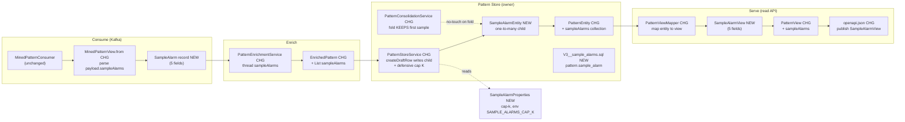
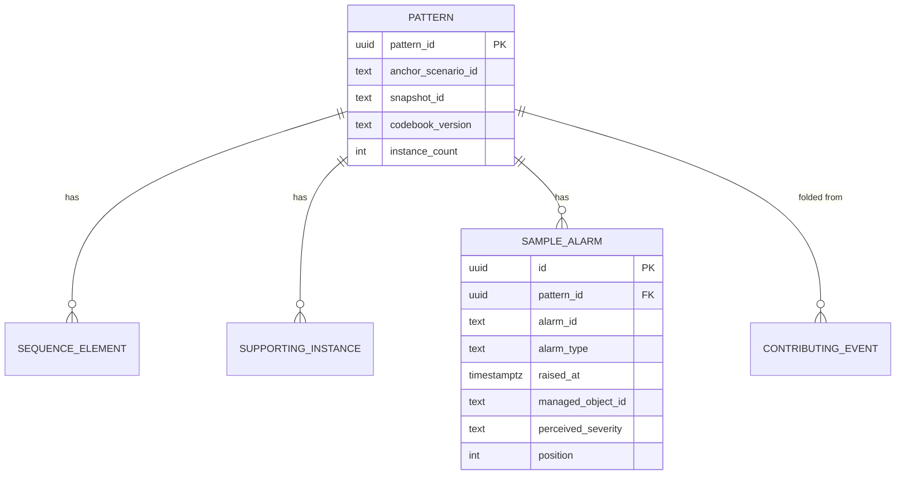
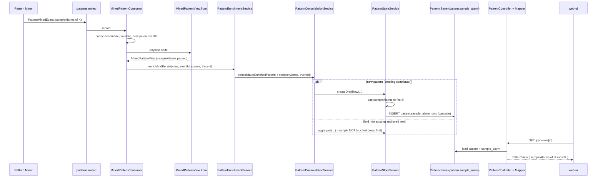
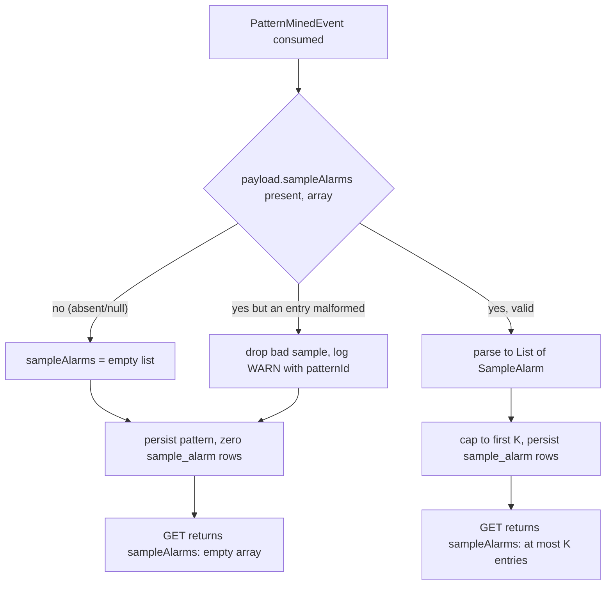

# pattern-manager — Design: Pattern Sample Alarm References

> **Status: DRAFT — awaiting human approval (design gate).**
> This is an **enhancement design**, not a replacement of the base `design.md`. It realizes the
> approved+merged `services/pattern-manager/spec-sample-alarms.md` (PR #346). It is a **focused
> ADD** onto the existing base + anchor-consolidation design: consume the (already-frozen)
> `PatternMinedEvent.sampleAlarms[]`, persist a bounded, member-alarm sample per pattern in the
> Pattern Store, and serve it as a new `sampleAlarms[]` field on `PatternView`. It **mirrors the
> existing `supportingInstances` flow** (child entity, cascade+orphanRemoval, mapper, openapi) and
> does **not** restructure any existing module.

> **No event-model contract change.** `PatternMinedEvent.sampleAlarms[]` (5 fields: `alarmId`,
> `alarmType`, `raisedAt`, `managedObjectId`, `perceivedSeverity`) is **already frozen on `main`**
> (contract PR #349) and the Pattern Miner already **emits** it (#352). This design is the
> **pattern-manager half only**: CONSUME → PERSIST → SERVE. The **only** contract surface this
> design touches is the pattern-manager's own **read-API `openapi.json`** — adding `sampleAlarms[]`
> to `PatternView` — which is the **intended, human-approved read-API change per OQ-SA-1**
> (spec Contract-sequence Step 4). Nothing else needs a contract change; if anything did, this
> design would STOP and flag it per the CONVENTIONS contract-change procedure. It does not.

> **Build prerequisite (call-out, not a design decision).** The `pattern-manager` branch's
> bundled `libs/event-model` is **behind `main`** and lacks `sampleAlarms`/the `SampleAlarm`
> item shape — verified: `PatternMinedEvent.schema.json` on `pattern-manager` has 0 occurrences of
> `sampleAlarms`, `main` has it. Before build, the branch must **sync `libs/event-model` to
> `main`** with a surgical `git checkout origin/main -- libs/event-model` (exactly as done for
> pattern-manager #341 and pattern-miner #352) so the typed `PatternMinedEvent` and the raw payload
> node both carry `sampleAlarms`. This is a build step, listed under **Build & run**. It is **not**
> a contract change — it is catching the branch's vendored copy up to the already-frozen `main`
> contract.

---

## Stack

Unchanged from the base `design.md`:

- **Language / runtime:** Java 17 (`eclipse-temurin:17-jdk`).
- **Framework:** Spring Boot 3.x (Spring Web MVC, Spring for Apache Kafka, Spring Data JPA).
- **Datastore:** PostgreSQL, logical schema `pattern`; **Flyway** migrations (this design adds one
  additive `V3__sample_alarms.sql`).
- **Event model:** `libs/event-model` Java binding (`EventCodec`, typed `PatternMinedEvent` now
  carrying `sampleAlarms[]` after the branch-sync build step). The consumer already works off the
  **raw payload `JsonNode`** for the open provenance/timing maps, so it reads `sampleAlarms`
  directly from JSON regardless of the POJO binding — the same pattern used for `provenance`.
- **OpenAPI:** springdoc-openapi 3.1 at `/openapi.json` + checked-in `services/pattern-manager/openapi.json`,
  drift-gated by `OpenApiExportTest`.
- **Tests:** JUnit 5 (unit/contract); Testcontainers (integration, `@Tag("integration")`).

New permissive-licensed libs: **none** (all reuse existing dependencies).

---

## Task breakdown (from the spec)

Every task in `spec-sample-alarms.md` (Tasks 1–5) is realized below and traceable.

| Spec task | Realized by (modules / flow) |
|---|---|
| **1. Receive and persist sample alarm records for each mined pattern.** | `MinedPatternConsumer` (unchanged wiring) → `MinedPatternView.from(payload, mapper)` gains a `sampleAlarms` parse (reads the `payload.sampleAlarms` array, maps each object to a new `SampleAlarm` record). `PatternEnrichmentService.enrichAndPersist` threads `List<SampleAlarm>` into `EnrichedPattern`. `PatternStoreService.createDraftRow` writes the sample as a new `SampleAlarmEntity` one-to-many child of `PatternEntity` (cascade + orphanRemoval, mirroring `supportingInstances`). Absent array → empty list → zero child rows, pattern still persisted (backward-compat). |
| **2. Bound the stored sample (configurable `K`).** | New `SampleAlarmProperties` (`@ConfigurationProperties(prefix = "pattern-manager.sample-alarms")`, key `cap-k`, env `SAMPLE_ALARMS_CAP_K`, documented default). `PatternStoreService` **defensively re-caps** to the first `K` entries at ingest — even though the miner already caps (K). No hard-coded value in pattern-manager. |
| **3. Serve sample alarms via the pattern read API.** | New `SampleAlarmView` record (5 fields) added to `PatternView.sampleAlarms`. `PatternViewMapper` maps each `SampleAlarmEntity` → `SampleAlarmView`, ordered deterministically. Returned by **both** `GET /patterns` (in each `PatternPage.items[]`) and `GET /patterns/{patternId}`. `openapi.json` regenerated to publish `SampleAlarmView` + the `sampleAlarms` field. |
| **4. Handle absent sample gracefully (empty `[]`, not null/absent).** | `PatternView.sampleAlarms` is a non-null `List<SampleAlarmView>`; the mapper emits `List.of()` (never null) when the pattern has no sample rows. Present-and-empty on every item, list and single. |
| **5. Reconcile `anchorScenarioId` → `codebookMatchId` (related cleanup).** | Handled in the existing `ReconciliationService` / codebook-override path: when a supporting instance / provenance carries a populated `anchorScenarioId` and the standard codebook-override finds no match, propagate `anchorScenarioId` into the persisted `codebookMatchId`. Internal to the existing enrichment pipeline; no contract change. (AC-SA-8.) |

**Consolidation-fold sample rule (the key design decision — see Design alternatives DA-1).**
Anchor-consolidation folds multiple mined events (each with its own `sampleAlarms[]`) into ONE
pattern row. The rule: **the pattern keeps ONE bounded sample = the FIRST contributing event's
sample** (the creating contributor). Later folds do **not** append/replace/union the sample — the
sample is set **only** on `createDraftRow` and left untouched by `aggregate(...)`. This is
deterministic, bounded (never grows past `K` across folds), and idempotent/replay-safe (tied to the
existing `contributing_event` / `processed_event` guards: a re-delivered event is a fold no-op and
never re-touches the sample). It deliberately **avoids** the `sequence_element` INSERT-before-DELETE
dup-key trap, because on a fold the sample child collection is **never replaced** — there is no
`clear()`+re-add and therefore no orphan-DELETE/INSERT ordering hazard.

---

## Phase applicability (design view)

Matches the spec's Phase applicability and the canonical phase map (`architecture.md`).

| Phase | Active/Passive/Idle | Modules/handlers exercised | Inputs/Outputs |
|---|---|---|---|
| P1 — Topology onboarding | **Idle** (no change from base) | none (dormant) | — |
| P2 — Pattern learning | **Active** | `MinedPatternConsumer` → `MinedPatternView.from` (now parses `sampleAlarms`) → `PatternEnrichmentService` → `PatternStoreService.createDraftRow` (persists `SampleAlarmEntity` child, capped at `K`); consolidation fold **keeps** the first sample. Read: `PatternController` → `PatternViewMapper` serves `sampleAlarms[]`. | In: `patterns.mined` (`PatternMinedEvent` now carrying optional `sampleAlarms[]`). Out: `GET /patterns`, `GET /patterns/{id}` with `sampleAlarms[]` on each `PatternView`. `patterns.discovered`/`patterns.approved` **unchanged** (sample NOT added). |
| P3 — Real-time correlation | **Passive** (no change from base) | Read API only (`PatternController`/`PatternViewMapper`) still serves `sampleAlarms[]` on reads; sample is review evidence only, not used by the Correlation Engine. | Serves: pattern read API with `sampleAlarms[]`. Does **not** affect `patterns.approved` or `PatternApprovedEvent`. |

---

## Module breakdown

New/changed components (everything else in the base design is unchanged). New = **[NEW]**,
changed = **[CHG]**.



- **[NEW] `SampleAlarm`** (`enrichment/SampleAlarm.java`) — immutable record `{alarmId, alarmType,
  raisedAt (OffsetDateTime), managedObjectId, perceivedSeverity}`. Mirrors `SupportingInstance`.
- **[NEW] `SampleAlarmEntity`** (`store/entity/SampleAlarmEntity.java`) — `@Entity @Table(name =
  "sample_alarm", schema = "pattern")`, `@ManyToOne` on `PatternEntity`, mirrors
  `SupportingInstanceEntity` (surrogate `id` PK, `pattern_id` FK, the 5 columns). `raisedAt` mapped
  as `OffsetDateTime` (`timestamptz`).
- **[NEW] `SampleAlarmView`** (`api/dto/SampleAlarmView.java`) — read DTO record with the 5 fields;
  `raisedAt` serialized ISO-8601 UTC.
- **[NEW] `SampleAlarmProperties`** (`config/SampleAlarmProperties.java`) — `cap-k` (default a
  documented value; see Config), plus `perOccurrence` note (OQ-SA-4; per-pattern total is the MVP
  choice — DA-2).
- **[CHG] `MinedPatternView`** — `from(...)` parses `payload.sampleAlarms` into `List<SampleAlarm>`
  (empty when absent/null/not-array). Record gains a `sampleAlarms` component.
- **[CHG] `EnrichedPattern`** — gains `List<SampleAlarm> sampleAlarms`.
- **[CHG] `PatternEntity`** — gains a `@OneToMany(cascade = ALL, orphanRemoval = true, EAGER)`
  `sampleAlarms` collection (mirrors `supportingInstances`).
- **[CHG] `PatternStoreService.createDraftRow`** — after supporting instances, writes the sample:
  `setSampleAlarms(entity, enriched.sampleAlarms())` capped at `K`. **Not** called on fold.
- **[CHG] `PatternConsolidationService.aggregate`** — explicitly does **not** touch the sample
  collection (documented no-op; the fold keeps the creating contributor's sample).
- **[CHG] `PatternViewMapper`** — maps `SampleAlarmEntity` → `SampleAlarmView`; `PatternView` gains
  `sampleAlarms`.
- **[CHG] `openapi.json`** — regenerated (`-DupdateOpenApi=true`) to add `SampleAlarmView` schema
  and `PatternView.sampleAlarms`.

---

## Data model / DB schema

Owned store: **Pattern Store (PostgreSQL, schema `pattern`)** — Pattern Manager is the sole owner.
This design adds **one additive** child table, `pattern.sample_alarm`, mirroring
`pattern.supporting_instance`. New Flyway migration **`V3__sample_alarms.sql`** (never edits V1/V2).

```sql
-- V3__sample_alarms.sql
-- A bounded, representative sample of the real member alarms a pattern was mined from
-- (operator XAI / trust). Sourced from PatternMinedEvent.sampleAlarms[] (already frozen on main).
-- Mirrors pattern.supporting_instance: surrogate PK, pattern_id FK ON DELETE CASCADE, no cross-
-- service ownership change. Zero rows when the mined event carried no sampleAlarms (backward-compat).
CREATE TABLE pattern.sample_alarm (
    id                 UUID PRIMARY KEY,
    pattern_id         UUID NOT NULL REFERENCES pattern.pattern (pattern_id) ON DELETE CASCADE,
    alarm_id           TEXT NOT NULL,
    alarm_type         TEXT NOT NULL,
    raised_at          TIMESTAMPTZ NOT NULL,
    managed_object_id  TEXT NOT NULL,
    perceived_severity TEXT NOT NULL,
    position           INT NOT NULL,           -- deterministic serve order (miner sample order)
    UNIQUE (pattern_id, position)
);

CREATE INDEX idx_sample_alarm_pattern ON pattern.sample_alarm (pattern_id);
```

Notes:
- The 5 spec fields are all `NOT NULL` (the frozen `SampleAlarm` schema `required`s all 5).
- `position` gives a stable serve order and a `UNIQUE (pattern_id, position)` so the sample cannot
  silently duplicate within a pattern. Because the sample is written **only once at create** and
  **never replaced on a fold** (DA-1), the `sequence_element` INSERT-before-DELETE trap **cannot**
  arise here — there is no `clear()`+re-add of this collection. (The `position` UNIQUE is a
  belt-and-braces guard, documented as such.)
- **Idempotency** is provided upstream by `processed_event` (eventId dedupe) + the anchored
  `contributing_event` fold-guard: a redelivered event never re-enters the write path, so no sample
  rows are re-inserted (AC-SA-7). No new dedupe key is needed on `sample_alarm`.
- **Bounded:** at most `K` rows per pattern (cap enforced at ingest; DA-2 = per-pattern total).



---

## Event handling

- **Consumers:** `patterns.mined` → `MinedPatternConsumer` (**unchanged wiring**). It now
  additionally surfaces `payload.sampleAlarms` via `MinedPatternView.from`. Idempotency/dedupe key:
  `eventId` (`processed_event`) + the anchored `contributing_event` fold-guard — **unchanged**;
  the sample persistence rides inside the same DB transaction, so it inherits the existing
  idempotency (AC-SA-7). DLQ: `patterns.mined.dlq` for poison/unknown-type/unsupported-`schemaVersion`
  — **unchanged**. A **malformed `sampleAlarms[]`** on an otherwise-valid event is **non-fatal**:
  the pattern persists, the bad sample is dropped, `sampleAlarms` served as `[]`, logged at WARN
  with `patternId` (spec Error handling). It does **not** DLQ the whole event.
- **Producers:** `patterns.discovered` (`PatternDiscoveredEvent`), `patterns.approved`
  (`PatternApprovedEvent`) — **unchanged; sample alarms are NOT added to either event** (spec
  Out-of-scope). No new topics.

---

## API contracts / API schema

HTTP surface change is **additive** on the existing read endpoints; no new endpoint (OQ-SA-1 =
field on `PatternView`, not a sub-endpoint).

- `GET /patterns` → `200 PatternPage { items: PatternView[], total, limit, offset }` — each item
  now carries `sampleAlarms`.
- `GET /patterns/{patternId}` → `200 PatternView` (or `404` unknown id — unchanged) — carries
  `sampleAlarms`.

**`PatternView` gains (additive):**

```jsonc
"sampleAlarms": {
  "type": "array",
  "items": { "$ref": "#/components/schemas/SampleAlarmView" }
}
```

**New `SampleAlarmView` schema (published in `openapi.json`):**

```jsonc
"SampleAlarmView": {
  "properties": {
    "alarmId":           { "type": "string" },
    "alarmType":         { "type": "string" },
    "raisedAt":          { "type": "string", "format": "date-time" },
    "managedObjectId":   { "type": "string" },
    "perceivedSeverity": { "type": "string" }
  }
}
```

- **`sampleAlarms` is always present** on every `PatternView` (list and single) — empty `[]` when
  no sample captured, never null/absent (AC-SA-4/5b).
- **OpenAPI generation/publication:** springdoc serves the live `/openapi.json`; the checked-in
  `services/pattern-manager/openapi.json` is the SSoT, drift-gated by `OpenApiExportTest`. The
  **regen step** is `./gradlew test -DupdateOpenApi=true` (or the repo's `generateOpenApi` task),
  which rewrites the checked-in file from the live document; the added `sampleAlarms`/`SampleAlarmView`
  then appear and the drift gate passes. Servers stay pinned to `"/"` (unchanged). This regen is the
  **intended, human-approved read-API contract change** (spec Step 4) — the design must commit the
  regenerated `openapi.json`.

---

## Integration points (mock vs. real)

No new outbound integration point (Option A introduces none; all sample data arrives embedded in
`PatternMinedEvent`). Existing points (Topology, Knowledge, Codebook) are **unchanged** — config-
switchable mock (from each collaborator's OpenAPI, unit tests) / real (integration), no hard-coded
URLs. The sample-cap `K` is env/config (`SAMPLE_ALARMS_CAP_K`), not a collaborator call.

---

## Key flows (sequence / data-flow diagrams)

### Primary success path — mined event with `sampleAlarms[]` → persist → serve



### Backward-compat / partial path — event WITHOUT `sampleAlarms`, and malformed sample



---

## Algorithm logical flow

N/A — no non-trivial algorithm is introduced. The consolidation-fold **sample rule** is a
deterministic "keep the first contributor's bounded sample" policy (write-once at create, no-op on
fold), covered under Task breakdown + Design alternatives DA-1, not an algorithm. The existing RCA /
structural / session-window / anchor-consolidation algorithms are unchanged and covered in the base
`design.md`.

---

## Seed data & examples

N/A as a service — but a representative fixture is used across the unit/contract tests. Example
inbound payload fragment and served response:

**Inbound `PatternMinedEvent.payload` fragment (K-bounded sample from the miner):**

```jsonc
{
  "trailId": "trail:ospf-area0:7",
  "sequence": ["FiberFault", "LinkDown", "PortDown"],
  "provenance": { "anchorScenarioId": "scenario-42", "snapshotId": "snap-9",
                  "codebookVersion": "cb-3", "sourceWindowId": "sw:trail:ospf-area0:7:ab12" },
  "sampleAlarms": [
    { "alarmId": "alm-1001", "alarmType": "FiberFault", "raisedAt": "2026-06-20T14:03:11Z",
      "managedObjectId": "OpticalPort:lon-agg-1/xe-0/0/3", "perceivedSeverity": "critical" },
    { "alarmId": "alm-1002", "alarmType": "LinkDown", "raisedAt": "2026-06-20T14:03:12Z",
      "managedObjectId": "Interface:lon-agg-1/ge-0/0/1", "perceivedSeverity": "major" },
    { "alarmId": "alm-1003", "alarmType": "PortDown", "raisedAt": "2026-06-20T14:03:13Z",
      "managedObjectId": "Port:lon-core-2/et-1/1/2", "perceivedSeverity": "major" }
  ]
}
```

**Served `PatternView.sampleAlarms` (same 3, `K >= 3`):** identical 5-field objects, `raisedAt`
ISO-8601 UTC, each `managedObjectId` matching `<objectType>:<id>`, each `alarmType` a member of the
pattern's `sequence[]`.

---

## UI wireframes

N/A — pattern-manager is a back-end service. The web-ui consumes `sampleAlarms[]` to replace its
current "per-alarm detail not yet served" note; that rendering is a separate web-ui work item
(downstream unlock in the spec), out of scope for this design.

---

## Error handling

| Failure mode | Handling |
|---|---|
| Poison / malformed envelope, unknown event type on `patterns.mined` | `patterns.mined.dlq` + ACK (unchanged). Never restarts, never silently drops. |
| Unsupported major `schemaVersion` | `EventCodec` rejects → DLQ + ACK (unchanged). |
| **`sampleAlarms[]` malformed** (bad entry / not an array) on an otherwise-valid event | **Non-fatal.** Pattern persists; the offending sample is dropped (best-effort parse); `sampleAlarms` served as `[]`; logged at **WARN** with `patternId` + source context. Does **not** DLQ the whole event (spec Error handling). |
| `sampleAlarms[]` absent (older miner / no alarms in window) | Backward-compat: pattern persists, zero `sample_alarm` rows, served as `[]` (AC-SA-4/5b). |
| Transient collaborator failure (Topology/Knowledge) during enrich | Exception propagates → offset uncommitted → redelivered (unchanged); on redelivery the dedupe/fold guards make sample persistence idempotent (no dup rows). |
| Duplicate / redelivered `eventId` | `processed_event` gate (unexplained) + `contributing_event` fold-guard (anchored) short-circuit before any sample write → no duplicate `sample_alarm` rows (AC-SA-7). |
| Sample exceeds cap `K` | Defensively truncated to first `K` at ingest (AC-SA-6); at most `K` rows persisted/served. |
| Unknown `patternId` on read | `404` (unchanged). |
| Empty result (`GET /patterns`, no patterns) | `200 PatternPage { items: [], total: 0 }` (unchanged). |

Nothing about sample alarms ever causes a valid pattern to be dropped or a whole event to DLQ.

---

## Design alternatives

| Consideration | Alternatives considered | Chosen + rationale |
|---|---|---|
| **DA-1 Consolidation-fold sample behaviour** (the key decision) | (a) **Keep the FIRST/creating contributor's sample** (write-once at create, fold = no-op); (b) **Union/append** samples across all folded events (re-cap to K); (c) **Replace** with the latest fold's sample; (d) keep the **representative** contributor's sample (the one owning the representative sequence). | **(a) Keep first, bounded.** Deterministic and order-insensitive in the common single-run case; bounded — the sample **never grows past `K`** across folds; **idempotent/replay-safe by construction** — the sample is written once inside `createDraftRow` and the fold path (`aggregate`) never touches the collection, so a re-delivered event (fold no-op) cannot duplicate/re-append rows. Critically it **sidesteps the `sequence_element` INSERT-before-DELETE dup-key trap** (#342) entirely, because there is no `clear()`+re-add of the sample collection on a fold. (b) Union re-introduces exactly that replace-collection hazard **and** unbounded growth pressure. (c) Replace churns the DB on every fold, is non-deterministic under reordering, and is not replay-safe. (d) ties the sample to the representative-sequence tie-break (which CAN change on a later fold) — that would mean re-writing the sample collection on a fold, re-introducing the replace hazard for marginal operator value. One representative real occurrence is what OQ-SA-4/OQ-SA-5 identify as most useful for review. |
| **DA-2 Cap scope — per-pattern total vs. per-occurrence** (OQ-SA-4) | Per-pattern total across occurrences; per-occurrence (one representative occurrence's alarms). | **Per-pattern total, cap `K`.** With DA-1 (keep first contributor's sample) the persisted sample already **is** a single representative occurrence's alarms (the creating event), so a per-pattern total cap is both the simplest and effectively per-occurrence in practice. No unbounded growth; a single documented `K`. |
| **DA-3 Persist the sample column-wise vs. child table** | JSONB column on `pattern.pattern`; dedicated child table `pattern.sample_alarm`. | **Child table**, mirroring `supporting_instance`/`sequence_element`. Consistent with the existing store shape, queryable/orderable (`position`), FK `ON DELETE CASCADE` cleans up with the pattern, and gives a natural `UNIQUE (pattern_id, position)` bound guard. A JSONB blob would diverge from the established pattern and lose per-row constraints. |
| **DA-4 Read the sample from the typed POJO vs. the raw payload node** | Bind `sampleAlarms` off the generated `PatternMinedEvent` POJO; parse off the raw `payload` `JsonNode` in `MinedPatternView.from`. | **Raw `JsonNode`**, matching how the consumer already reads `provenance`/`timing`. Uniform with the existing intake; resilient to POJO-binding lag; simple null/array-guarded parse for backward-compat. |
| **DA-5 Defensive re-cap in pattern-manager** (miner already caps) | Trust the miner's cap only; re-cap defensively at ingest. | **Re-cap defensively** to first `K`. Cheap, keeps the store bound authoritative on the owning side, satisfies AC-SA-6 deterministically regardless of producer behaviour. No hard-coded value — `K` from config. |

---

## Test plan

### Acceptance criterion → test (unit/contract)

All tests are **JUnit 5** (per the spec / CLAUDE.md). Read-API tests use the `PatternController` +
`PatternViewMapper` slice with a seeded Pattern Store fixture; ingest tests drive
`MinedPatternView.from` / `PatternEnrichmentService` / `PatternStoreService`.

| # | Acceptance criterion | Test | Asserts |
|---|---|---|---|
| AC-SA-1 | `GET /patterns/{id}` returns non-empty `sampleAlarms`; each entry has all 5 fields non-null, `raisedAt` ISO-8601 UTC, `managedObjectId` `<objectType>:<id>`. | `SampleAlarmReadApiTest#singlePatternReturnsSampleWithSchema` | Response `sampleAlarms` non-empty; each entry's 5 fields non-null; `raisedAt` parses as ISO-8601 UTC; `managedObjectId` matches scheme. |
| AC-SA-2 | Each sample alarm's `alarmType` is a member of the pattern's `sequence[]`. | `SampleAlarmReadApiTest#sampleAlarmTypesAreSequenceMembers` | Every returned `sampleAlarms[i].alarmType` ∈ `sequence[].alarmType`. |
| AC-SA-3 | Each returned `managedObjectId` conforms to `<objectType>:<id>` (exactly one colon, objectType `^[A-Za-z][A-Za-z0-9]*$`, id non-empty). | `SampleAlarmReadApiTest#managedObjectIdConformsToScheme` | Regex/format assertion on each entry. |
| AC-SA-4 | No sample captured → `sampleAlarms` present and `[]` (not null/absent). | `SampleAlarmReadApiTest#absentSampleServedAsEmptyList` | Field present, is empty array, not null. |
| AC-SA-5 | `GET /patterns` list carries `sampleAlarms` on every item (one with, one without), same content as single-get. | `SampleAlarmReadApiTest#listResponseCarriesSampleOnEveryItem` | Both items have the field; content matches `GET /patterns/{id}`; empty-sample item is `[]`. |
| AC-SA-5a | Mined event WITH `sampleAlarms[]` → persisted; `GET /patterns/{id}` returns them. | `SampleAlarmIngestTest#persistsAndServesSampleFromEvent` | After consume, `sample_alarm` rows present; read API returns the same records. |
| AC-SA-5b | Mined event with NO `sampleAlarms` → pattern persisted, zero sample rows, served `[]`. | `SampleAlarmIngestTest#backwardCompatNoSampleField` | Pattern persisted; sample count 0; response `sampleAlarms: []`. |
| AC-SA-6 | `K=3`, event with 5 sample entries → at most 3 stored and served. | `SampleAlarmCapTest#capsSampleToK` (`K=3` via config) | Stored count ≤ 3; API count ≤ 3. |
| AC-SA-7 | Same `eventId` processed twice → no duplicate sample rows. | `SampleAlarmIdempotencyTest#redeliveryDoesNotDuplicate` | Sample count after 2nd pass == after 1st. |
| AC-SA-8 | `provenance.anchorScenarioId` set, no codebook match → `codebookMatchId` = `anchorScenarioId`; served in read API. | `AnchorScenarioReconciliationTest#propagatesAnchorToCodebookMatchId` (mock Codebook returns no match; `anchorScenarioId="scenario-42"`) | Persisted `codebookMatchId == "scenario-42"`; field present in read response. |
| AC-SA-9 | `GET /patterns/{id}` (sample present) validates against updated `openapi.json` incl. `sampleAlarms`/`SampleAlarmView`. | `SampleAlarmOpenApiContractTest#singleResponseValidatesAgainstSpec` | Response validates against checked-in `openapi.json` schema. |
| AC-SA-10 | `GET /patterns` list validates against updated `openapi.json` incl. `sampleAlarms` on each item. | `SampleAlarmOpenApiContractTest#listResponseValidatesAgainstSpec` | List response validates against spec. |

Plus a **drift gate** (existing `OpenApiExportTest`): the regenerated `openapi.json` must match the
served document — guards that `SampleAlarmView` + `PatternView.sampleAlarms` are published and pinned.

### E2E scenarios (from this design unit's point of view)

Service-scoped end-to-end paths exercised by the integration stage. The core one is an
**integration-tagged Testcontainers test against real Postgres** (real Flyway V1+V2+V3, real cascade,
real dedupe), mirroring `PatternConsolidationServiceIT`.

| # | Scenario | Trigger → path | Expected outcome |
|---|---|---|---|
| E1 | **Mined event with sample → persist → serve** (`SampleAlarmPersistenceIT`, `@Tag("integration")`, real Postgres). | Consume `PatternMinedEvent` with `sampleAlarms` (3 of K) → enrich → `createDraftRow` → `GET /patterns/{id}`. | 3 rows in `pattern.sample_alarm`; read API returns the 3 with all 5 fields, ISO-8601 `raisedAt`, `<objectType>:<id>` `managedObjectId`. |
| E2 | **Redelivery is idempotent** (same IT). | Process the same `eventId` twice. | Sample count unchanged after 2nd pass; no dup rows (belt-and-braces `UNIQUE (pattern_id, position)` never trips). |
| E3 | **Consolidation fold keeps ONE bounded sample** (same IT). | Two mined events, same `anchorScenarioId` (different `eventId`), each with its own `sampleAlarms` → both folded into one row. | One pattern row; `sample_alarm` = the FIRST contributor's sample only; count ≤ K; second event's sample NOT appended (no replace-collection dup-key error). |
| E4 | **Backward-compat: event without sample** (same IT). | Consume `PatternMinedEvent` with no `sampleAlarms` field. | Pattern persisted; zero `sample_alarm` rows; `GET /patterns/{id}` → `sampleAlarms: []`. |
| E5 | **Malformed sample is non-fatal** (partial path). | Consume valid event whose `sampleAlarms` has a malformed entry. | Pattern persisted; bad sample dropped; served `[]`; WARN logged with `patternId`; event NOT sent to DLQ. |
| E6 | **Contract conformance across the stack** (drift + schema validation). | Regenerate `openapi.json`; validate live `GET /patterns` + `GET /patterns/{id}` responses against it. | Both validate incl. `sampleAlarms`/`SampleAlarmView`; `OpenApiExportTest` drift gate green. |

---

## Config & observability

- **`pattern-manager.sample-alarms.cap-k`** — env `SAMPLE_ALARMS_CAP_K`, the per-pattern cap `K`
  (DA-2). Documented default (design recommendation: **`K = 10`** — enough distinct member alarms
  for a NOC operator to trust a multi-step sequence while bounding store growth; **no hard-coded
  value in code** — read from config). `SampleAlarmProperties` supplies the default exactly as
  `SessionWindowProperties` does. Added to `application.yml` under the existing `pattern-manager:`
  tree.
- **Observability (unchanged):** `/health`, `/metrics` (Micrometer/Prometheus), structured JSON
  logs. Sample-ingest issues logged at **WARN** with `patternId` + source. (Optional micrometer
  counter `pattern_sample_alarms_persisted_total` may be added; not required by an AC.)

---

## Build & run

- **Build prerequisite (do first):** sync the branch's vendored event-model to `main` so
  `PatternMinedEvent` carries `sampleAlarms` —
  `git checkout origin/main -- libs/event-model` (surgical, as in #341/#352). This is the ONLY thing
  needed for the typed payload + raw node to expose the field. **Not a contract change** — it
  catches the branch up to the already-frozen `main` contract.
- **Migration:** add `V3__sample_alarms.sql` (additive; Flyway runs V1→V2→V3).
- **OpenAPI regen (required, part of the read-API change):** `./gradlew test -DupdateOpenApi=true`
  (or `generateOpenApi`) to rewrite `services/pattern-manager/openapi.json` with `SampleAlarmView` +
  `PatternView.sampleAlarms`; commit the regenerated file. Servers stay pinned to `"/"`.
- **Build/test:** `./gradlew build` (JUnit 5 unit/contract). Integration:
  `./gradlew test -DincludeIntegration=true` runs the `@Tag("integration")` `SampleAlarmPersistenceIT`
  (Testcontainers Postgres).
- **Run:** unchanged — Dockerfile (`eclipse-temurin:17-jdk`) + Compose entry; env from config.
