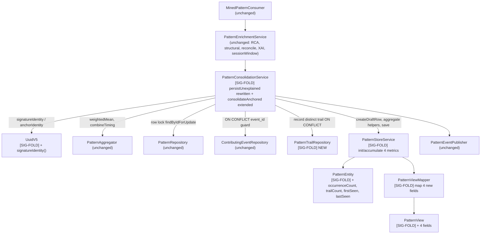
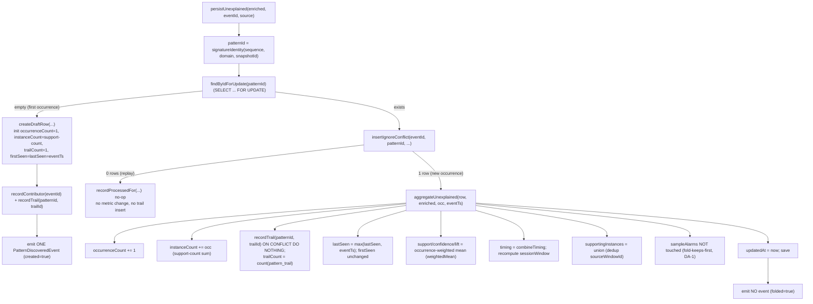
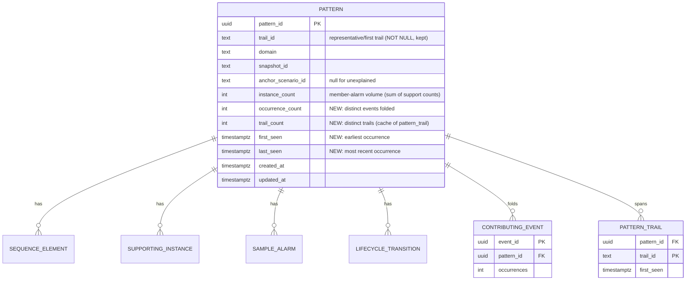
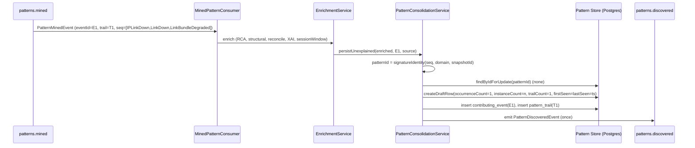
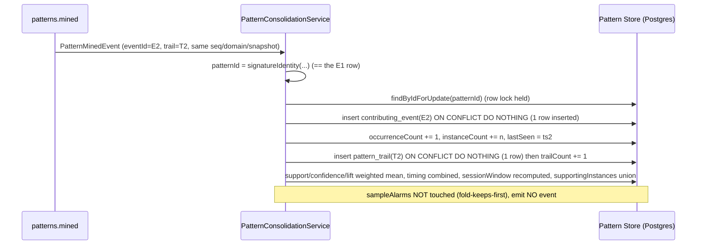
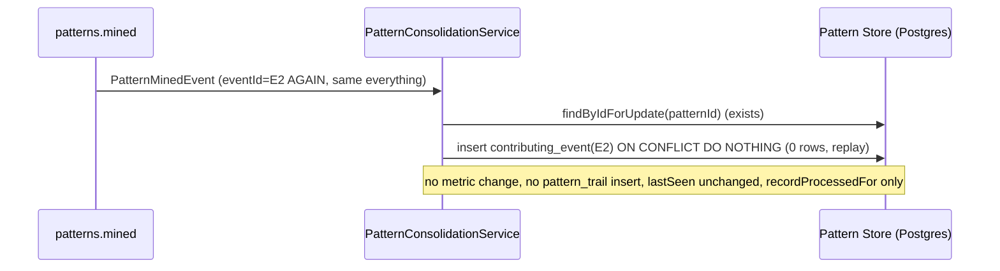
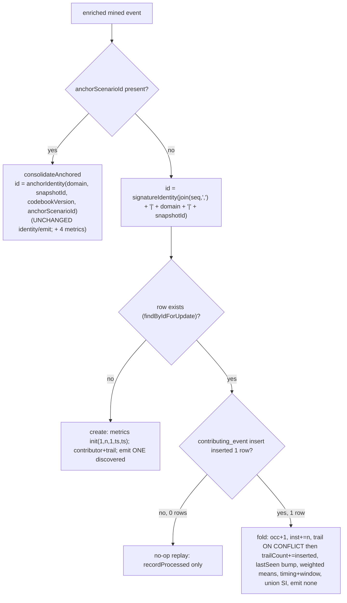
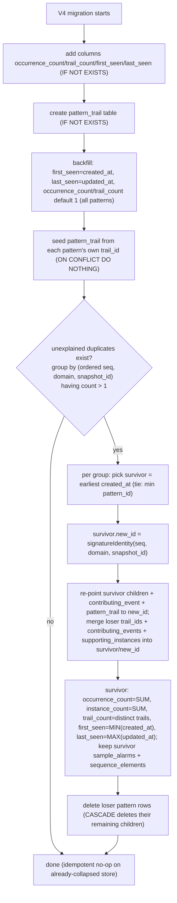

# pattern-manager — Design: Unexplained-Pattern Signature Fold (Cross-Trail Deduplication)

> **Status: DRAFT — awaiting human approval (design gate).**
> This is an **enhancement design**, not a replacement of the base `design.md`. It realizes the
> approved+merged `services/pattern-manager/spec-signature-fold.md` (spec PR #358, merged into
> `pattern-manager`). It is a **focused change to the consolidation/persistence layer** — it does
> **not** restructure any existing module. NEW/CHANGED items are tagged **[SIG-FOLD]**.

> **The problem (confirmed in code + live DB).** The unexplained path of
> `PatternConsolidationService.persistUnexplained` mints `patternId` as
> `UuidV5.perEventIdentity(trailId, sequence, sourceWindowId, snapshotId)` — a **per-occurrence,
> per-trail** key. Because `sourceWindowId` is a fresh per-window hash and `trailId` is per-trail,
> **every recurrence of the same cascade shape — and the same cascade on a different trail — mints a
> new row.** And `persistUnexplained` treats an existing row as an **idempotent no-op** — it never
> aggregates. Live evidence: `IPLinkDown -> LinkDown -> LinkBundleDegraded` exists as **12 rows across
> 11 trails**. The anchored path already solves the analogous problem correctly
> (`anchorIdentity(domain, snapshotId, codebookVersion, anchorScenarioId)` folds cross-trail +
> aggregates). This design makes the **unexplained** path consistent with the **anchored** path:
> **one pattern per cascade signature**, with occurrence/extent/impact metrics.

> **No event-model contract change.** `PatternMinedEvent`, `PatternDiscoveredEvent`,
> `PatternApprovedEvent` and the topics (`patterns.mined`, `patterns.discovered`,
> `patterns.approved`, `patterns.mined.dlq`) are **unchanged**. The **only** contract surface this
> design touches is the pattern-manager's own **read-API `openapi.json`** — adding four additive
> fields (`occurrenceCount`, `trailCount`, `firstSeen`, `lastSeen`) to `PatternView` and updating the
> `instanceCount` description. This is the **intended, human-approved read-API change** (issues #357
> for the fields / #356 for the migration; both CLOSED/approved). Nothing else needs a contract
> change; if anything did, this design would STOP and flag it per the CONVENTIONS contract-change
> procedure. **It does not** (see "Contract & invariants" below).

> **Build prerequisite (call-out, not a design decision).** The task brief flags that the
> `pattern-manager` branch's bundled `libs/event-model` may be **behind `main`** (the #341-style
> sync). **Verified for this branch:** `git diff --name-status origin/pattern-manager origin/main --
> libs/event-model` is **empty** — the branch's `libs/event-model` is already **in sync with `main`**
> (the #341 + #354 syncs already landed on `pattern-manager`). So no sync is required for THIS
> enhancement. As a defensive **build step**, the dev agent must re-verify sync before build and, if
> the branch has since drifted behind `main`, run the surgical
> `git checkout origin/main -- libs/event-model` (exactly as #341/#354). This is a build step, not a
> contract change. See **Build & run**.

---

## Stack

Unchanged from the base `design.md`:

- **Language / runtime:** Java 17 (`eclipse-temurin:17-jdk`).
- **Framework:** Spring Boot 3.x (Spring Web MVC, Spring for Apache Kafka, Spring Data JPA).
- **Datastore:** PostgreSQL, logical schema `pattern`; **Flyway** migrations (this design adds one
  additive `V4__signature_fold.sql`).
- **Licenses:** all permissive (Apache-2.0 Spring/Kafka/Jackson/PostgreSQL-JDBC, MIT/EPL AssertJ/JUnit,
  Apache-2.0 Testcontainers). No new dependency introduced.
- **Test frameworks:** JUnit 5 (unit/contract); Testcontainers + real Postgres (integration-tagged).

---

## Task breakdown (from the spec)

The spec's 7 tasks map 1:1 into this design. Every spec task is realized and traceable.

| Spec task | Realized by (modules / flow) |
|---|---|
| **1. Derive the cascade signature identity for unexplained patterns** | New `UuidV5.signatureIdentity(sequence, domain, snapshotId)`; `persistUnexplained` calls it instead of `perEventIdentity(...)`. `trailId` + `sourceWindowId` dropped from the key. Name-string format specified below. |
| **2. Fold an occurrence into an existing signature row** | `persistUnexplained` rewritten to MIRROR `consolidateAnchored`: `findByIdForUpdate` (row lock) → `contributingEventRepository.insertIgnoreConflict` (fold guard) → `aggregateUnexplained(...)`. Reuses `PatternAggregator.weightedMean` / `combineTiming`, `addSupportingInstances` (union), `SessionWindowDeriver`, fold-keeps-first samples. Adds occurrence/trail/instance/lastSeen accumulation. |
| **3. Create a new signature row for a first occurrence** | `persistUnexplained` create branch: `createDraftRow(...)` (unchanged enrichment pipeline — RCA/structural/reconcile/XAI already ran upstream) + initialise `occurrenceCount=1`, `instanceCount=support-count`, `trailCount=1`, `firstSeen=lastSeen=eventTs`; record contributing event + contributing trail; emit ONE `PatternDiscoveredEvent`. |
| **4. Ensure replay safety for the unexplained fold** | The `contributing_event` `INSERT ... ON CONFLICT (event_id) DO NOTHING` guard blocks the entire aggregate + trail-set step on replay — `occurrenceCount`/`instanceCount`/`trailCount`/`lastSeen` unchanged, `pattern_trail` not re-inserted. Same mechanism as the anchored path. |
| **5. Extend the anchored fold to populate impact-metric fields** | `consolidateAnchored` + `aggregate(...)` extended to maintain the 4 new fields (create → init; fold → accumulate) and record `pattern_trail` per contributor. Anchor identity + event emission unchanged. |
| **6. Deliver the one-time Flyway collapse migration** | `V4__signature_fold.sql`: additive columns + `pattern_trail` table + backfill of the 4 metrics on existing rows + the **one-time collapse** of duplicate unexplained rows (group by ordered sequence + domain + snapshotId), recomputing the survivor's `pattern_id` to `signatureIdentity`, re-pointing/merging FK children, cascade-deleting losers. Idempotent. |
| **7. Surface the impact-metric fields via the read API** | `PatternView` + `PatternViewMapper` extended with the 4 fields; `openapi.json` regenerated (`OpenApiExportTest` drift gate); `instanceCount` description updated. |

**Everything else is preserved unchanged** (spec "Preserve all existing behavior"): anchored
consolidation identity/emission, RCA, structural validation, reconciliation, lifecycle, `PatternPage`
envelope, `sampleAlarms` serving, `supportingInstances`, `processed_event`/`contributing_event`
idempotency, DLQ, `sessionWindow` derivation.

---

## Phase applicability (design view)

Matches the spec's phase table and the canonical phase map in `docs/architecture.md`. This
enhancement only changes P2-active behaviour internally; P1/P3 roles are unchanged.

| Phase | Active/Passive/Idle | Modules/handlers exercised | Inputs/Outputs |
|---|---|---|---|
| P1 — Topology onboarding | Idle | dormant | — |
| P2 — Pattern learning | **Active** | `MinedPatternConsumer` → `PatternEnrichmentService` → **`PatternConsolidationService.persistUnexplained` (rewritten to fold)** + `consolidateAnchored` (extended metrics) → `PatternStoreService`; `PatternEventPublisher` (one discovered event per UNIQUE signature). | In: `patterns.mined` (`PatternMinedEvent`) — unchanged. Out: `patterns.discovered` (one per unique cascade signature, not one per occurrence — reduced volume, same schema); `patterns.approved` — unchanged. |
| P3 — Real-time correlation | Passive | `PatternController` / `PatternQueryService` / `PatternViewMapper` serve the read API; Pattern Store now has **fewer rows** (one per signature) each carrying the 4 impact metrics. | Serves: `GET /patterns`, `GET /patterns/{id}` — additive `PatternView` fields, fewer rows, richer metrics. |

---

## Module breakdown

Only the consolidation/persistence layer changes. Component interactions:



New/changed units:

- **`UuidV5.signatureIdentity(sequence, domain, snapshotId)`** — [SIG-FOLD] new identity function
  (below). `perEventIdentity` is retired from the live path but kept in the class + its unit test
  until removed, to avoid churn (dead-code removal is a build-time housekeeping item).
- **`PatternConsolidationService`** — `persistUnexplained` rewritten from no-op-on-existing to the
  full fold; a new `aggregateUnexplained` helper (or the existing `aggregate` generalized) is called;
  `consolidateAnchored`/`aggregate` extended to maintain the 4 metrics + `pattern_trail`.
- **`PatternStoreService`** — `createDraftRow` initialises the 4 metrics; new helper
  `recordTrail(patternId, trailId)` delegates to the new repo; `save` unchanged.
- **`PatternTrailEntity` + `PatternTrailRepository`** — [SIG-FOLD] new `pattern.pattern_trail`
  association (distinct-trail set).
- **`PatternEntity`** — [SIG-FOLD] 4 new columns + getters/setters.
- **`PatternView` + `PatternViewMapper`** — [SIG-FOLD] 4 new fields.

---

## [SIG-FOLD] Signature identity for unexplained patterns

Replace `UuidV5.perEventIdentity(trailId, sequence, sourceWindowId, snapshotId)` with:

```
public static UUID signatureIdentity(List<String> sequence, String domain, String snapshotId) {
    String name = String.join(",", sequence) + "|" + nz(domain) + "|" + nz(snapshotId);
    return from(name);           // same RFC-4122 v5 (SHA-1) + NAMESPACE as anchorIdentity
}
```

- **Exact name-string format:** `join(sequence, ",") + "|" + domain + "|" + snapshotId`.
  - `join(sequence, ",")` — ordered `alarmType` tokens, comma-separated. **Repeats and order are
    significant** (no normalization — OQ-SF-2 DEFERRED): `["A","B","A"]` → `"A,B,A"`; `["B","A","C"]`
    → `"B,A,C"` — distinct from `"A,B,C"`.
  - `domain` and `snapshotId` are `nz()`-guarded (empty string when null) exactly as `anchorIdentity`,
    so the two identity functions share the null-handling and namespace.
- **`trailId` and `sourceWindowId` are DROPPED** from the key — that is the whole fix: the same
  cascade shape from any trail / any window maps to the SAME `patternId`.
- **`anchorIdentity(domain, snapshotId, codebookVersion, anchorScenarioId)` is UNCHANGED** (already
  cross-trail). The two never collide: the anchor name has 4 `|`-separated parts, the signature name
  has 3, and the token sets differ (a sequence-comma-join vs an anchor id) — plus the existing
  `UuidV5Test.anchorAndPerEventIdentitiesDoNotCollide` is extended to cover
  anchor-vs-signature non-collision.

**Separator-collision note.** The join separator `,` and field separator `|` are the same characters
the anchor path already uses; `alarmType` tokens are a controlled vocabulary that contains neither
`,` nor `|` (they are enum-style identifiers such as `IPLinkDown`). A distinct sequence therefore
always yields a distinct joined string. This matches the existing `perEventIdentity` join, so no new
collision surface is introduced.

---

## [SIG-FOLD] Unified fold (persistUnexplained mirrors consolidateAnchored)

`persistUnexplained` is rewritten to the SAME shape as `consolidateAnchored`:



Key equivalences with the anchored path (spec: "mirror the anchored aggregate"):

- **occurrence weight `occ`** = `Math.max(1, enriched.instanceCount())` — same as the anchored path;
  used both for the weighted mean and as the `instanceCount` increment (member-alarm volume). This
  keeps `instanceCount` = total member-alarm volume (sum of mined support counts).
- **Row lock** via `findByIdForUpdate` (was a plain `findById` in the old no-op path).
- **Fold guard** via `contributingEventRepository.insertIgnoreConflict(eventId, patternId,
  anchorScenarioId=null, occ, support, now)` — the `anchor_scenario_id` column is already nullable, so
  unexplained contributing events store `null` there. 0 rows ⇒ replay ⇒ no-op (no metric change, no
  trail insert). 1 row ⇒ genuinely new occurrence ⇒ aggregate.
- **Representative sequence:** unchanged — the signature guarantees identical sequences across all
  contributors, so `shouldReplaceRepresentative` will never fire a replace (weights differ but the
  sequence is byte-identical). The representative-weight bookkeeping still runs for parity; it is a
  no-op replace. No new logic.
- **Samples:** **fold-keeps-first** — `aggregate` deliberately does NOT touch `sample_alarm` (reuses
  the #354 DA-1 rule that also sidesteps the #342 dup-key trap). AC-SF-8.
- **Emit rule:** create ⇒ one `PatternDiscoveredEvent`; fold/no-op ⇒ none. `ConsolidationOutcome`
  (created/folded/noop) already drives this in the consumer/publisher — no publisher change.

**One shared aggregate.** The anchored `aggregate(row, e, occ)` and the unexplained fold differ only
in that the anchored path already summed `instanceCount` (its `oldOcc = row.getInstanceCount()`).
To honour "occurrenceCount counts events, not alarms", the design splits the two counters:
`occurrenceCount` (events) is incremented by exactly 1 per genuine fold; `instanceCount` (alarms)
continues to be `oldInstance + occ`. The weighted-mean **weights** remain the member-alarm counts
(`oldInstance`, `occ`) — this preserves the anchored path's existing AC-C* semantics exactly (the
anchored path already weights by `instanceCount`). The new `occurrenceCount` is a pure event tally,
orthogonal to the weighting.

> **Consistency guarantee (anchored regression-safety):** `aggregate` is extended by ADDING
> `occurrenceCount += 1`, `trailCount` maintenance, and `firstSeen`/`lastSeen` — it does **not** alter
> the existing support/confidence/lift/timing/instanceCount math. Existing anchored AC-C1..C8 tests
> continue to pass unchanged (AC-SF-11).

---

## [SIG-FOLD] Distinct-trail tracking mechanism — `pattern_trail` child table (chosen)

`trailCount` must be the count of **DISTINCT** trails a signature spans, and must be idempotent under
re-delivered trails. Chosen mechanism: a child association table.

```sql
CREATE TABLE pattern.pattern_trail (
    pattern_id  UUID NOT NULL REFERENCES pattern.pattern (pattern_id) ON DELETE CASCADE,
    trail_id    TEXT NOT NULL,
    first_seen  TIMESTAMPTZ NOT NULL,
    PRIMARY KEY (pattern_id, trail_id)
);
CREATE INDEX idx_pattern_trail_pattern ON pattern.pattern_trail (pattern_id);
```

- **On every genuine fold/create:** `INSERT INTO pattern.pattern_trail (...) ON CONFLICT
  (pattern_id, trail_id) DO NOTHING` for the contributing `trailId`.
- **`trailCount`** is maintained as a **denormalized counter column on `pattern`**, incremented by the
  number of rows the `ON CONFLICT` insert actually inserted (0 or 1) — so the served value needs no
  `COUNT(*)`, and it is guaranteed equal to the distinct row count because the insert returns 1 only
  on a genuinely new trail. (The `pattern_trail` table is the source of truth; the counter is a cache
  the migration and every fold keep in lock-step. A `count(*)` fallback is available and the IT
  cross-checks `trailCount == count(pattern_trail)`.)
- **Idempotency:** the whole aggregate step (including the `pattern_trail` insert) sits *after* the
  `contributing_event` guard, so a re-delivered `eventId` never reaches it — the same trail is not
  re-added and `trailCount` does not move (AC-SF-9/AC-SF-15). Even if a genuinely NEW `eventId`
  carries an already-seen `trailId` (a second occurrence on the same trail), the `pattern_trail`
  `ON CONFLICT` keeps `trailCount` correct while `occurrenceCount` still increments — exactly the
  AC-SF-13 distinction.

**Rationale vs alternatives** (also in Design alternatives): a **plain integer counter** cannot dedupe
a re-delivered/repeat trail — it would over-count `trailCount` when the same trail contributes twice
(AC-SF-13 fails) or on any replay that slipped the guard. An **array/set column** (`text[]`) works but
makes "insert-if-absent" a read-modify-write under the row lock (larger write amplification, no unique
constraint enforcing distinctness). An **HLL/approximate counter** is lossy — the spec requires an
**accurate** distinct count. The **child table + `ON CONFLICT` + maintained counter** gives an exact,
idempotent, index-backed distinct count that mirrors the existing `contributing_event`/
`supporting_instance` child-table pattern already in the codebase.

---

## Data model / DB schema

Owned store: **PostgreSQL, schema `pattern`** (Pattern Manager is the sole writer). This design is
**additive** to V1/V2/V3 — it adds 4 columns to `pattern.pattern`, one new table `pattern.pattern_trail`,
and a one-time collapse (below). ER (new/changed elements tagged):



### New columns on `pattern.pattern`

| Column | Type | Semantics |
|---|---|---|
| `occurrence_count` | `INT NOT NULL DEFAULT 1 CHECK (occurrence_count >= 1)` | # distinct contributing eventIds folded. Events, not alarms. |
| `trail_count` | `INT NOT NULL DEFAULT 1 CHECK (trail_count >= 1)` | # DISTINCT trails the signature spans (cache of `count(pattern_trail)`). |
| `first_seen` | `TIMESTAMPTZ NOT NULL DEFAULT now()` (backfilled = `created_at`) | earliest occurrence; set on create, never changed. |
| `last_seen` | `TIMESTAMPTZ NOT NULL DEFAULT now()` (backfilled = `updated_at`) | most recent occurrence; bumped each genuine fold. |

`instance_count` keeps its meaning + its `CHECK (instance_count > 0)`. All four are populated for
**both** anchored and unexplained patterns.

### `PatternEntity.trail_id` decision — keep NOT NULL, representative/first trail (chosen)

The column stays `TEXT NOT NULL`, set to the **first/creating contributor's `trailId`** (a
representative/primary trail). Real spread is carried by `trailCount` + `pattern_trail`.

- **Why not nullable:** the web-ui `PatternView.trailId` is a required non-optional `string`
  (verified: `services/web-ui/src/app/api/models.ts` — `trailId: string`), and the Correlation Engine
  reads `trailId` (P3-G1). Making the column nullable would serve `trailId: null` and break those
  consumers — a behaviour change the spec explicitly forbids ("ensure the read API / web-ui isn't
  broken"). Keeping it non-null + representative-first is fully backward-compatible: existing
  consumers keep a valid `trailId`, and the new `trailCount` conveys the true cross-trail spread.
- **Deterministic representative:** the first contributor to CREATE the row owns `trail_id`; folds
  never change it (mirrors fold-keeps-first for samples). This is stable and replay-safe.
- **V4 handling:** the column is left NOT NULL; the collapse keeps the **survivor's** existing
  `trail_id` (the earliest-by-`created_at` row), which is already a valid representative. No migration
  change to the column's nullability.

### `openapi.json` — additive PatternView fields (below in API contracts).

---

## Event handling

- **Consumers — unchanged:** `patterns.mined` → `MinedPatternConsumer` → enrich → consolidate.
  Idempotency/dedupe key `eventId` (`processed_event` gate) + the fold guard (`contributing_event`
  `ON CONFLICT (event_id)`). Poison/invalid → `patterns.mined.dlq`, ACK.
- **Producers — unchanged schema, reduced volume:** `patterns.discovered` (`PatternDiscoveredEvent`) —
  now emitted **once per unique cascade signature** (on the create) rather than once per occurrence;
  `patterns.approved` (`PatternApprovedEvent`) unchanged. No new topic/payload/field.

---

## API contracts / API schema

`GET /patterns` and `GET /patterns/{patternId}` return `PatternView` (inside the `PatternPage`
envelope for the list). **Additive** change: four new fields on `PatternView`, plus an `instanceCount`
description update.

`PatternView` (new fields in **bold**):

```
{
  "patternId": "string",
  "trailId": "string",                 // representative/first trail (unchanged, non-null)
  "sequence": [ SequenceElementView ],
  "rootCauseAlarmType": "string",
  "support": 0.0, "confidence": 0.0, "lift": 0.0,
  "timing": { ... },
  "sessionWindow": { "windowMs": 0, "type": "gap-based|fixed" },
  "codebookMatchId": "string|null",
  "reconcileStatus": "confirmed|merged|unexplained",
  "structurallyValidated": true, "structuralValidationReason": "string|null",
  "instanceCount": 0,                  // description updated (see below)
  "occurrenceCount": 0,                // NEW integer int32
  "trailCount": 0,                     // NEW integer int32
  "firstSeen": "2026-07-03T12:00:00Z", // NEW date-time
  "lastSeen":  "2026-07-03T12:05:00Z", // NEW date-time
  "supportingInstances": [ SupportingInstanceView ],
  "sampleAlarms": [ SampleAlarmView ],
  "lifecycle": "draft|approved|deprecated|rejected",
  "domain": "string|null",
  "createdAt": "date-time", "updatedAt": "date-time"
}
```

- `occurrenceCount`, `trailCount` → JSON Schema `{"type":"integer","format":"int32"}`.
- `firstSeen`, `lastSeen` → `{"type":"string","format":"date-time"}`.
- **`instanceCount` description** updated to: "total number of individual alarm instances across all
  folded occurrences (sum of per-occurrence mined support counts); see also occurrenceCount for the
  number of distinct occurrences folded."
- No field removed or renamed; existing consumers unaffected. Status/error codes unchanged
  (200 OK; 404 `PatternNotFoundException` for a missing id; validation errors as today).

**OpenAPI generation:** unchanged mechanism — springdoc serves live `/openapi.json`;
`OpenApiExportTest` compares it to the checked-in `services/pattern-manager/openapi.json` and FAILS on
drift. The dev regenerates via `-DupdateOpenApi=true` (or `./gradlew generateOpenApi`) and commits.
`servers` stays pinned to `"/"`. The new fields flow automatically from the `PatternView` record +
`@Schema` description on `instanceCount`.

---

## Integration points (mock vs. real)

Unchanged. Topology / Codebook Generator / Knowledge Service integration points, their config keys,
and the mock|real toggle are untouched — this design does not add or change any outbound call. The
fold is internal to the Pattern Store. (No hard-coded URLs; resolution by env/config as before.)

---

## Key flows (sequence diagrams)

### Flow 1 — first occurrence of a cascade signature (create + emit)



### Flow 2 — same signature, new trail/window (fold, no emit)



### Flow 3 — idempotent replay (no-op)



---

## Algorithm logical flow

### Signature identity + fold decision



### Collapse-migration logic (V4)



---

## [SIG-FOLD] V4 collapse migration — detailed approach

`V4__signature_fold.sql`. Two parts: **(A) additive schema + backfill** (safe on any store, including
the clean dev/test store — this is what the AC-SF-16/anchored tests and a fresh install exercise), and
**(B) the one-time collapse** of legacy duplicate unexplained rows (production upgrade path).

### Part A — additive schema + universal backfill (idempotent)

- `ALTER TABLE pattern.pattern ADD COLUMN IF NOT EXISTS occurrence_count INT NOT NULL DEFAULT 1
  CHECK (occurrence_count >= 1)` (and `trail_count` the same; `first_seen`/`last_seen`
  `TIMESTAMPTZ NOT NULL DEFAULT now()`).
- `CREATE TABLE IF NOT EXISTS pattern.pattern_trail (...)` (DDL above).
- Backfill existing rows: `UPDATE pattern.pattern SET first_seen = created_at, last_seen = updated_at`
  (occurrence_count/trail_count remain 1 for a not-yet-collapsed row).
- Seed `pattern_trail` from each pattern's own `trail_id`:
  `INSERT INTO pattern.pattern_trail (pattern_id, trail_id, first_seen)
   SELECT pattern_id, trail_id, created_at FROM pattern.pattern
   ON CONFLICT (pattern_id, trail_id) DO NOTHING`.

Because `ADD COLUMN IF NOT EXISTS` / `CREATE TABLE IF NOT EXISTS` / `ON CONFLICT` are all no-ops when
already applied, Part A is idempotent. (Flyway's checksum guard also prevents a re-run of a versioned
migration; the `IF NOT EXISTS` guards are the belt-and-braces so the same SQL is safe if the DDL is
run manually or the migration is baselined.)

### Part B — one-time collapse of legacy duplicate unexplained rows

**The hard part: the survivor's `pattern_id` must change** from the legacy `perEventIdentity(...)`
value to the new `signatureIdentity(sequence, domain, snapshotId)` value, because the running service
will look the pattern up by the NEW id. FK children must follow the survivor to the new id; loser rows'
children must be merged in or cascade-deleted.

Executed inside the migration transaction, per unexplained group
`g = (ordered sequence, domain, snapshot_id)` with `count(*) > 1`. "Ordered sequence" is derived by
aggregating `sequence_element` with `string_agg(alarm_type, ',' ORDER BY position)` per pattern, so the
grouping key is exactly the signature name-string.

Steps (expressed as SQL CTEs; a `plpgsql DO $$` block iterating groups is the concrete form):

1. **Compute the signature key + new id per pattern.** A CTE `sig` maps each unexplained `pattern_id`
   to its `(seq_csv, domain, snapshot_id)` and to `new_id = uuid_v5(NAMESPACE, seq_csv||'|'||domain||'|'||snapshot_id)`.
   - **UUIDv5 in SQL:** a small immutable `pattern.uuid_v5(namespace uuid, name text)` SQL function is
     added by the migration (SHA-1 over the 16 namespace bytes + UTF-8 name, then set version=5 /
     variant bits) — byte-for-byte identical to `UuidV5.from(...)` so the migrated id equals what the
     running service computes. (Uses `pgcrypto`'s `digest(..., 'sha1')`; `CREATE EXTENSION IF NOT
     EXISTS pgcrypto`.) This function's equivalence to the Java `UuidV5` is pinned by a unit test
     (below).
2. **Pick the survivor per group:** the row with `MIN(created_at)` (tie-break `MIN(pattern_id::text)`),
   which also owns the kept `sample_alarms`, `sequence_element` children, and representative `trail_id`.
3. **Aggregate the group onto the survivor's new id:**
   - `occurrence_count = SUM(occurrence_count)` over the group (pre-collapse each is 1, or its
     already-folded value — the SUM is correct either way).
   - `instance_count = SUM(instance_count)`.
   - `first_seen = MIN(created_at)`, `last_seen = MAX(updated_at)`.
   - `support/confidence/lift`: instance-weighted mean over the group (same weighting as the runtime
     fold), computed with `SUM(metric * instance_count)/SUM(instance_count)` — so a collapsed row equals
     what re-mining through the fold would produce.
4. **Re-point + merge FK children onto `new_id`:**
   - `contributing_event`: `UPDATE ... SET pattern_id = new_id WHERE pattern_id IN (group)`. `event_id`
     is globally unique (PK) so no conflict; every group member's contributing events survive → the
     runtime `occurrenceCount` and `count(contributing_event)` stay consistent post-collapse.
   - `pattern_trail`: re-point all group members' trail rows to `new_id`
     `... ON CONFLICT (pattern_id, trail_id) DO NOTHING` (dedups trails across losers) →
     `trail_count = (SELECT count(*) FROM pattern_trail WHERE pattern_id = new_id)` = distinct trails.
   - `supporting_instance`: re-point to `new_id`, then dedup on `source_window_id` (keep MIN(id) per
     `(new_id, source_window_id)`, delete the rest) → union semantics matching the runtime fold.
   - `sequence_element` + `sample_alarm`: **keep the survivor's only** (fold-keeps-first). The survivor
     already owns them under its OLD id; they are re-pointed to `new_id` with it (step 5). Loser rows'
     `sequence_element`/`sample_alarm` are cascade-deleted in step 6.
   - `lifecycle_transition`: re-point the survivor's to `new_id`; losers' cascade-delete (their audit
     rows for redundant discovered-events are discarded — acceptable, the surviving pattern keeps its
     own draft-discovered audit row).
5. **Re-key the survivor to `new_id`:** update the survivor `pattern` row's `pattern_id = new_id` and
   set the aggregated metrics (step 3). Its already-re-pointed children (steps 4) now hang off
   `new_id`. Because `new_id` is derived deterministically and no other row uses it, the PK update is
   safe. (Order: re-point children referencing the survivor's old id to `new_id` FIRST, then update the
   survivor PK — or defer FK checks; the `DO` block does children-then-parent within one tx.)
6. **Delete the loser `pattern` rows** (`WHERE pattern_id IN (group) AND pattern_id <> survivor_old_id`
   — after their `contributing_event`/`pattern_trail`/`supporting_instance` were re-pointed away and
   their `sequence_element`/`sample_alarm`/`lifecycle_transition` remain to be cascade-deleted). The
   `ON DELETE CASCADE` FKs remove the losers' remaining children. Nothing dangles.

**Anchored rows are excluded** from Part B (they never duplicated; `anchor_scenario_id IS NOT NULL`
rows are skipped by the grouping `WHERE anchor_scenario_id IS NULL`). They still get Part A's backfill
+ `pattern_trail` seed, so anchored rows also expose the 4 fields (AC-SF-16).

**Idempotency of Part B (AC-SF-18):** after a first run every unexplained group has exactly one row
whose `pattern_id` already equals `signatureIdentity(...)`, so the `HAVING count(*) > 1` group filter
selects nothing on a second run — the collapse body executes zero groups and is a pure no-op. Part A's
`IF NOT EXISTS`/`ON CONFLICT` guards are likewise no-ops. (In normal operation Flyway's version
ledger prevents re-running V4 at all; the `HAVING`/guards make the SQL itself safe if replayed.)

**Dev/test note (spec):** the dev/test store is cleared and re-mined, which produces the correct result
from the runtime fold without needing Part B. The migration must therefore also be a clean no-op on an
**empty / already-correct** store — Part A's guards + Part B's `HAVING count(*) > 1` guarantee that.

---

## Error handling

Unchanged from base + the fold specifics:

- **Poison / invalid message** (malformed JSON, missing field, unknown type, unsupported major
  `schemaVersion`) → `MinedPatternConsumer` routes raw bytes to `patterns.mined.dlq` + ACK. Never
  restarts, never silently drops. Unchanged.
- **Dependency down / transient collaborator error** during enrichment → exception propagates, offset
  not committed, event redelivered after recovery. The signature fold is idempotent so redelivery
  re-folds safely. Unchanged.
- **Mid-fold DB failure** → the whole fold (row lock + `contributing_event` insert +
  `pattern_trail` insert + metric aggregate + `processed_event` insert) is ONE `@Transactional` unit;
  a failure rolls it all back (including `occurrenceCount`/`trailCount`/`pattern_trail`), the offset is
  not committed, and the redelivered event re-folds cleanly (the guard makes the retry a no-op or a
  correct single fold). No partial metric increment can persist.
- **Idempotency / duplicate processing** → `processed_event` gate (consumer) + `contributing_event`
  `ON CONFLICT (event_id)` guard (fold). A replay never increments `occurrenceCount`/`instanceCount`/
  `trailCount`/`lastSeen` and never re-inserts `pattern_trail`.
- **Validation (read API)** → `GET /patterns/{id}` for a missing id → 404 via
  `PatternNotFoundException` (unchanged).
- **Migration failure** → the V4 migration runs in a transaction; any failure aborts the whole
  migration and Flyway marks it failed (startup fails fast — the operator sees it, no half-collapsed
  store). The `DO` block per-group work is inside the migration tx.
- **Algorithm edge cases:** empty/absent `domain`/`snapshotId` → `nz()` yields `""`, a valid (if
  degenerate) signature — same as the anchor path's null handling; no NPE. A signature that has never
  been seen simply creates. A fold on a signature whose sample/sequence somehow diverged cannot occur
  (identical signature ⇒ identical sequence by construction).

Nothing silently drops: poison → DLQ (logged `error`/`errorClass`), transient → redeliver, replay →
logged `action=noop`, fold → logged `action=fold`, create → `action=create`.

---

## Observability

Structured JSON at INFO per consolidation outcome (spec Non-functional):
`pattern_consolidated action=create|fold|noop patternId=... signature=<join(seq,',')|domain|snapshotId>
domain=... snapshotId=...` and, on fold, `occurrenceCount=... trailCount=... lastSeen=...`. Consistent
with the existing anchored-path log line (which already logs `action=create|fold`). `/health` +
`/metrics` unchanged. No new config keys (the signature components are intrinsic to the event —
spec Config: "no new configurable parameters").

---

## Design alternatives

| Consideration | Alternatives considered | Chosen + rationale |
|---|---|---|
| Distinct-trail tracking | (a) plain `trail_count` integer counter; (b) `text[]` set column on `pattern`; (c) HLL/approximate counter; (d) **`pattern_trail` child table + `ON CONFLICT` + maintained counter** | **(d).** (a) can't dedupe a re-delivered/repeat trail (AC-SF-13 & replay fail). (b) forces read-modify-write under the row lock, no DB-enforced distinctness. (c) is lossy; spec needs an *accurate* distinct count. (d) gives an exact, idempotent, index-backed distinct count, mirrors the existing `contributing_event`/`supporting_instance` child-table idiom, and the migration can derive `trail_count` from it directly. |
| `PatternEntity.trail_id` for cross-trail patterns | (a) make it nullable; (b) **keep NOT NULL = representative/first trail**; (c) drop the column | **(b).** web-ui `PatternView.trailId` is a required non-optional `string` and the CE reads `trailId` — (a) serves `null` and breaks them (spec forbids). (c) is a removal = a breaking read-API change. (b) is fully backward-compatible: consumers keep a valid `trailId`; `trailCount` conveys real spread. |
| Fold-guard reuse vs new dedup table | (a) new unexplained-only dedup table; (b) **reuse `contributing_event` (`anchor_scenario_id` nullable)** | **(b).** The spec says "the existing processed_event/contributing_event mechanism applies; no new dedup mechanism". `contributing_event.anchor_scenario_id` is already nullable, so unexplained folds store `null` there — same table, same `ON CONFLICT (event_id)` guard, one code path. |
| Survivor identity in the collapse | (a) keep survivor's old `perEventIdentity` id + add a redirect; (b) **re-key survivor `pattern_id` to `signatureIdentity`, re-point children**; (c) insert a fresh row + copy | **(b).** The running service looks patterns up by `signatureIdentity`, so the surviving row MUST carry that id or it would be invisible + re-created. (a) needs an id-redirect layer the code doesn't have. (c) risks losing the survivor's kept `sample_alarms`/`sequence_element` provenance + PK churn. (b) re-keys in place, children follow, losers cascade-delete — the migrated store is byte-identical to a freshly re-mined one. |
| `occurrenceCount` vs reuse `instanceCount` | (a) reuse `instanceCount` for occurrences; (b) **add `occurrenceCount` (events) alongside `instanceCount` (alarms)** | **(b)** — mandated by OQ-SF-3 (#357). They count different things: `occurrenceCount` = # events folded, `instanceCount` = total member-alarm volume. Separate fields (AC-SF-13) + updated `instanceCount` description. |
| UUIDv5 in the migration | (a) precompute new ids in Java + feed to SQL; (b) **SQL `pattern.uuid_v5` function via pgcrypto**, pinned equal to Java `UuidV5` by a unit test | **(b).** Pure-SQL keeps the migration self-contained + re-runnable by Flyway/ops without a Java pre-step; pgcrypto is a permissive, standard Postgres extension. Equivalence to `UuidV5.from` is guaranteed by a dedicated equivalence test so the migrated id == the runtime id. |

---

## Test plan

Test frameworks: **JUnit 5** (unit/contract), **Testcontainers + real Postgres** (integration-tagged,
`@Tag("integration")`). Every acceptance criterion AC-SF-1..19 maps to one test.

### Acceptance criterion → test (unit/contract)

| # | Acceptance criterion | Test | Asserts |
|---|---|---|---|
| AC-SF-1 | Same sequence, different trails+windows → 1 row, instanceCount = sum | `PatternConsolidationServiceIT.signatureFoldsAcrossTrails` (IT) | after 2 events differing only in trailId/sourceWindowId: `patternRepository.count()==1`; row `instanceCount == n1+n2` |
| AC-SF-2 | Same sequence, different windows, same trail → 1 row, summed | `...signatureFoldsAcrossWindowsSameTrail` (IT) | 2 events same trailId, diff sourceWindowId → 1 row; `instanceCount == n1+n2` |
| AC-SF-3 | Different sequences → 2 rows | `...differentSequencesStayDistinct` (IT) | `[IPLinkDown,LinkDown]` vs `[IPLinkDown,LinkDown,LinkBundleDegraded]` → 2 rows, distinct patternId |
| AC-SF-4 | Order significant → 2 rows | `UuidV5Test.signatureIsOrderSignificant` (unit) + `...orderIsSignificant` (IT) | `signatureIdentity([A,B,C]) != signatureIdentity([B,A,C])`; IT → 2 rows |
| AC-SF-5 | Repeats significant → 2 rows | `UuidV5Test.signatureRepeatsSignificant` (unit) + `...repeatsAreSignificant` (IT) | `signatureIdentity([A,B,A]) != signatureIdentity([A,B])`; IT → 2 rows |
| AC-SF-6 | Fold aggregates occurrence-weighted metrics | `PatternConsolidationServiceTest.unexplainedFoldWeightedMean` (unit, mocked repos) or IT `...foldAggregatesWeightedMetrics` | after (inst=3,supp=0.6)+(inst=2,supp=0.4): `instanceCount==5`; `support≈0.52` within 1e-9 |
| AC-SF-7 | One discovered event for first, none for fold | `MinedPatternConsumerTest.unexplainedEmitsOncePerSignature` (unit) | capture published msgs; 2 same-signature events → exactly 1 `PatternDiscoveredEvent` |
| AC-SF-8 | Fold-keeps-first sample alarms | `...foldKeepsFirstSampleAlarms` (IT) | event1 sample=[alarmA], event2 sample=[alarmB] → `GET` returns sampleAlarms == [alarmA] only |
| AC-SF-9 | Idempotent replay — no double-count | `...replayDoesNotDoubleCount` (IT) | process E2; record occ/inst/trail; re-process E2 → all three unchanged |
| AC-SF-10 | Different snapshotId → 2 rows | `UuidV5Test.signatureSnapshotScoped` (unit) + IT `...differentSnapshotStaysDistinct` | `signatureIdentity(seq,dom,s1) != (...,s2)`; IT → 2 rows |
| AC-SF-11 | Anchored path unchanged (identity + emission) | `PatternConsolidationServiceTest.anchoredIdentityUnchanged` + existing `PatternConsolidationServiceIT` AC-C1..C8 still green | anchored id == `anchorIdentity(...)`; trailId/sourceWindowId not in key; existing anchored tests pass |
| AC-SF-12 | Live-evidence: 12 events / 11 trails → 1 row, occ=12, trail=11, schema-valid | `...liveEvidenceTwelveOccurrencesElevenTrails` (IT) | publish 12 events (11 distinct trailIds) → 1 row; `GET` → occurrenceCount==12, trailCount==11; validate vs openapi.json |
| AC-SF-13 | occurrenceCount vs trailCount distinct | `...occurrenceCountAndTrailCountAreDistinct` (IT) | 3 events: 2 on trail-X, 1 on trail-Y → occurrenceCount==3, trailCount==2 |
| AC-SF-14 | firstSeen/lastSeen set + updated | `...firstAndLastSeenTracked` (IT) | event T1 then T2>T1 → firstSeen==T1, lastSeen==T2 |
| AC-SF-15 | Replay does not update lastSeen | `...replayDoesNotBumpLastSeen` (IT) | process E@T1; record lastSeen; redeliver E → lastSeen unchanged |
| AC-SF-16 | Anchored patterns expose all 4 fields | `...anchoredExposesImpactFields` (IT) + `PatternViewMapperTest.mapsImpactFields` (unit) | anchored event → `GET` returns occurrenceCount/trailCount/firstSeen/lastSeen non-null; schema-valid |
| AC-SF-17 | Collapse migration → correct aggregates | `V4CollapseMigrationIT.collapsesDuplicatesWithCorrectAggregates` (IT, in-container Flyway) | insert N synthetic dup rows (distinct trailIds); run V4 → 1 row; occ=Σocc, inst=Σinst, trail=distinct, firstSeen=MIN(created_at), lastSeen=MAX(updated_at); survivor sample kept; survivor id == signatureIdentity |
| AC-SF-18 | Collapse migration idempotent | `V4CollapseMigrationIT.migrationIsIdempotent` (IT) | run V4; snapshot state; run V4 again → state identical |
| AC-SF-19 | openapi.json has 4 fields + updated instanceCount desc | `SignatureFoldOpenApiContractTest.patternViewHasImpactFields` (unit/contract) + `OpenApiExportTest` (drift) | parse checked-in openapi.json → PatternView has occurrenceCount/trailCount (integer int32), firstSeen/lastSeen (string date-time), instanceCount present with updated description; no field removed/renamed |

Supporting (non-AC but required) tests:
- `UuidV5Test.signatureAndAnchorDoNotCollide` — `signatureIdentity(...) != anchorIdentity(...)` and
  `!= perEventIdentity(...)` (identity-space separation).
- `UuidV5SqlEquivalenceIT` — the migration's `pattern.uuid_v5(namespace, name)` SQL function returns
  the SAME UUID as Java `UuidV5.from(name)` for a sample of names (pins the collapse survivor id to the
  runtime id).
- `PatternTrailRepositoryTest` / covered in IT — `ON CONFLICT (pattern_id, trail_id) DO NOTHING`
  dedupes; `trailCount` counter stays equal to `count(pattern_trail)`.

### E2E scenarios (from this design unit's point of view — integration-test stage)

| # | Scenario | Trigger → path | Expected outcome |
|---|---|---|---|
| 1 | Cross-trail cascade fold (motivating case) | 12 `PatternMinedEvent` for `[IPLinkDown,LinkDown,LinkBundleDegraded]`, 11 distinct trails → consumer → enrich → `persistUnexplained` fold | Pattern Store has exactly 1 row; `GET /patterns/{id}` → occurrenceCount=12, trailCount=11, instanceCount=Σ, firstSeen/lastSeen correct; exactly 1 `PatternDiscoveredEvent` emitted |
| 2 | Distinct shapes stay distinct | events for `[A,B]`, `[B,A]`, `[A,B,A]`, `[A,B]` (diff snapshot) → fold path | 4 distinct rows (order + repeats + snapshot all significant); no cross-fold |
| 3 | Idempotent redelivery (partial/replay path) | a folded eventId redelivered (Kafka at-least-once) | no metric moves, no trail re-added, lastSeen frozen, no extra discovered event; `action=noop` logged |
| 4 | Anchored path regression + metrics | anchored `PatternMinedEvent` across sub-runs | one row, anchored identity, occurrence-weighted metrics unchanged (AC-C1..C8), AND occurrenceCount/trailCount/firstSeen/lastSeen populated |
| 5 | Production upgrade via collapse migration | pre-seed a store with N legacy duplicate unexplained rows (perEventIdentity ids) → run V4 on startup | 1 row per signature with correct aggregates + `pattern_trail` populated + survivor re-keyed to signatureIdentity; a subsequent live fold of the SAME signature increments the collapsed row (not a new row); re-run V4 = no-op |
| 6 | Poison / DLQ (failure path, preserved) | malformed / unknown-type message on `patterns.mined` | routed to `patterns.mined.dlq`, ACKed, no pattern row, fold logic never reached |

---

## Config & observability

- **Config:** no new keys (spec). Signature components are intrinsic to the event.
- **/health, /metrics:** unchanged.
- **Logging:** `action=create|fold|noop` + `patternId` + `signature` + `domain` + `snapshotId`; on
  fold also `occurrenceCount`/`trailCount`/`lastSeen` (structured JSON, INFO).

## Build & run

- **Build prerequisite (verify, then act if needed):** confirm the branch's `libs/event-model` is in
  sync with `main` — `git diff --name-status origin/pattern-manager origin/main -- libs/event-model`.
  **Verified empty at design time (already in sync).** If it has since drifted behind `main`, run the
  surgical `git checkout origin/main -- libs/event-model` before building (as #341/#354). Not a
  contract change.
- **Build:** `./gradlew build` (Java 17). Regenerate openapi after adding the 4 `PatternView` fields:
  run `OpenApiExportTest` with `-DupdateOpenApi=true` (or `./gradlew generateOpenApi`) and commit the
  refreshed `services/pattern-manager/openapi.json`; the normal build's drift gate then passes.
- **Integration tests:** `@Tag("integration")` Testcontainers tests (real Postgres, real Flyway
  V1+V2+V3+V4) run via `-DincludeIntegration=true` and in the integration stack; they are the live
  catch-net for the fold + migration round-trip.
- **Migrations applied by Flyway on startup:** V1 → V2 → V3 → **V4** (this design). V4 is additive +
  the one-time collapse; idempotent.
- **Docker/Compose:** unchanged entry; the new migration ships in
  `src/main/resources/db/migration/V4__signature_fold.sql`.
