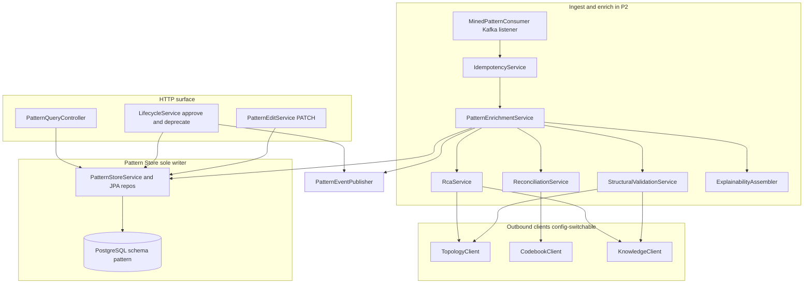
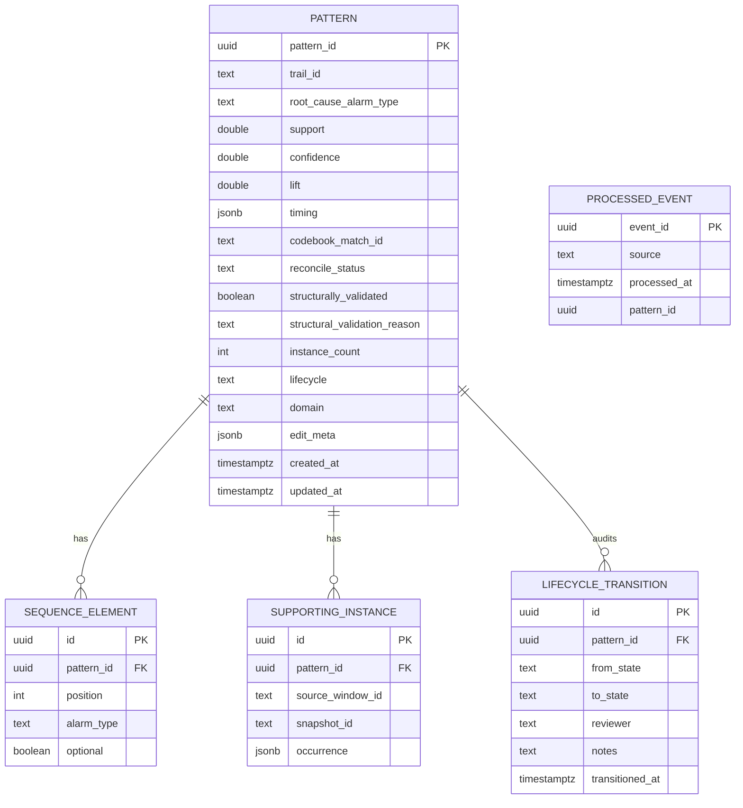
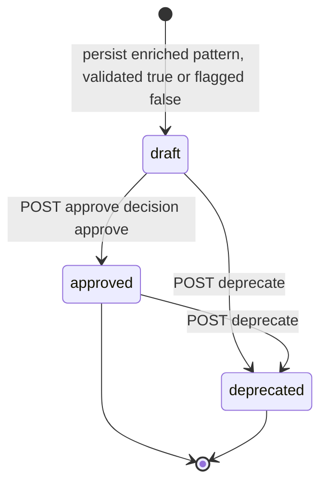
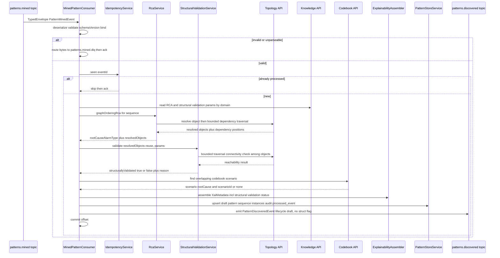
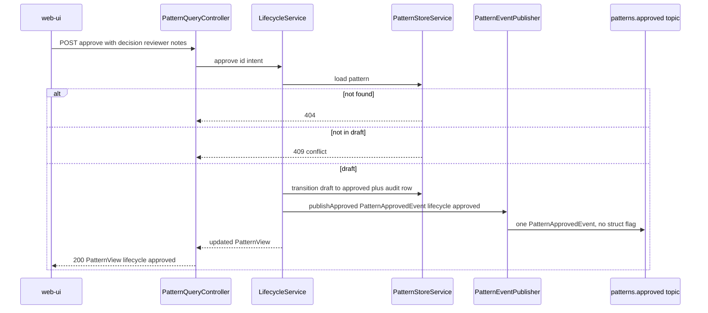
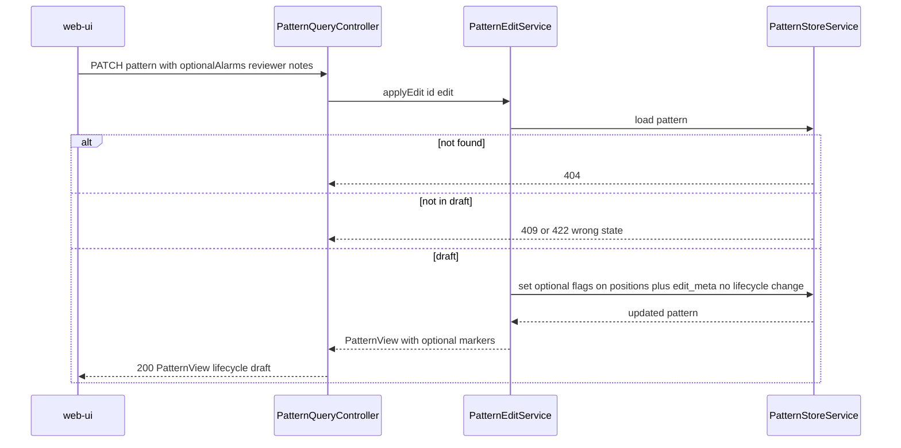
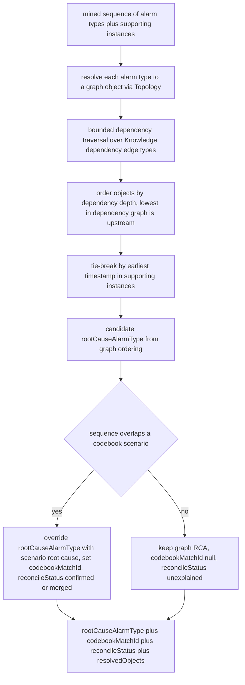
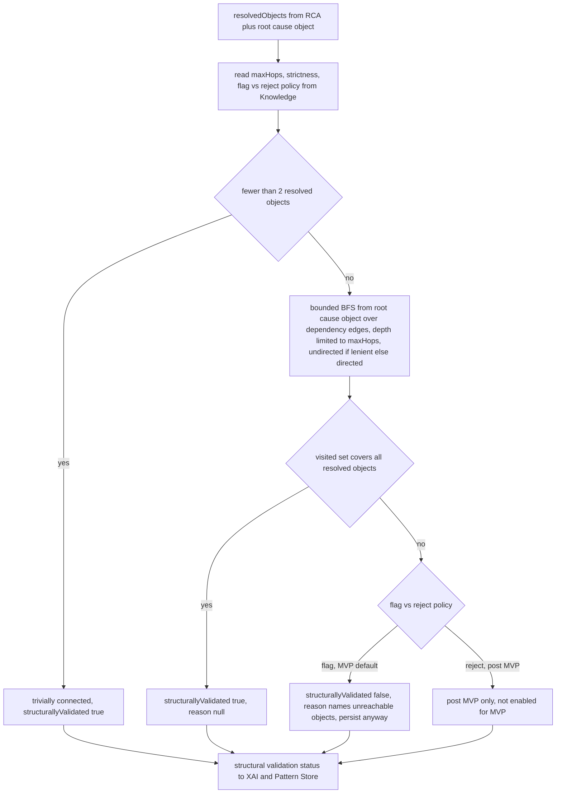

# pattern-manager — Design

Buildable design for the Pattern Manager — the single owner of the full pattern domain. It
consumes mined sequences (`patterns.mined`), enriches them with RCA, **structural validation**,
codebook reconciliation and explainability metadata, persists them in the Pattern Store
(PostgreSQL) as `draft`, drives the human-approval lifecycle through its API, and is the sole
emitter of `PatternDiscoveredEvent` and `PatternApprovedEvent`. It contains **no ML** — mining is
wholly owned by the Pattern Miner.

This design realizes the approved `services/pattern-manager/spec.md` (13 tasks, 17 acceptance
criteria) and honours the canonical phase map in `docs/architecture.md` (P1 Idle / P2 Active /
P3 Passive). It introduces **no contract change**: all consumed/produced payloads
(`PatternMinedEvent`, `PatternDiscoveredEvent`, `PatternApprovedEvent`) and topics
(`patterns.mined`, `patterns.discovered`, `patterns.approved`, `patterns.mined.dlq`) already
exist in `libs/event-model` and `docs/architecture.md`, and remain **frozen and unchanged**. The
new structural-validation status (`structurallyValidated` + `structuralValidationReason`) is
**internal** — it lives only in the Pattern Store and the read API, exactly as the operator-edit
metadata does, and is deliberately **not** added to either frozen event. The HTTP surface,
Pattern Store schema, and integration points are internal design and not contract changes.

Structural validation reuses the **same Topology Service API integration point** (object
resolution + bounded dependency traversal) that RCA already uses — so it requires **no new
Topology endpoint** and therefore **no contract change** (OQ-3 resolution, below). The topology
store is NebulaGraph-backed, but that is fully abstracted behind the Topology Service API; the
Pattern Manager never touches the topology graph directly.

## Stack

- **Language / runtime:** Java 17 (`eclipse-temurin:17-jdk`), per CLAUDE.md Java pin.
- **Framework:** Spring Boot 3.x (Spring Web MVC, Spring for Apache Kafka, Spring Data JPA).
- **Datastore:** PostgreSQL (Pattern Store; logical schema `pattern`). Flyway for schema
  migrations. PostgreSQL JDBC driver.
- **Event model:** `libs/event-model` Java binding (`com.acp.eventmodel.EventCodec`,
  `TypedEnvelope`, generated `PatternMinedEvent` / `PatternDiscoveredEvent` /
  `PatternApprovedEvent` POJOs). The codec validates the envelope, enforces the
  `schemaVersion` policy (accept major 1, reject 2 and above), and binds the typed payload.
- **HTTP client (outbound):** Spring `RestClient` (WebFlux-free, blocking) for Topology,
  Codebook Generator and Knowledge calls; clients built against each collaborator's published
  OpenAPI, base URLs from config.
- **OpenAPI:** springdoc-openapi (OpenAPI 3.1) at `/openapi.json` + Swagger UI; the generated
  document is checked in to `services/pattern-manager/openapi.json`.
- **Observability:** Spring Boot Actuator (`/health`, `/metrics` Prometheus via Micrometer);
  structured JSON logs (Logback JSON encoder) with `traceId`, `patternId`.
- **Build:** Gradle (Java 17 toolchain). **Tests:** JUnit 5 (unit/contract); Testcontainers
  (PostgreSQL plus Kafka) plus WireMock (collaborator stubs) for integration. Per CLAUDE.md — do
  not substitute the framework.
- **Licenses:** all of the above are Apache-2.0 / EPL-2.0 / MIT — permissive only. No ML
  libraries; no NebulaGraph driver (topology is read via API only).

## Task breakdown (from the spec)

Every spec task (1 through 13) is realized below and is traceable to modules, data, events,
and flow. Task 3 (structural validation) is **new** in the reworked spec; tasks renumber after it.

| Spec task | Realized by (modules / flow) |
|---|---|
| 1. Consume `patterns.mined`: validate, dedupe on `eventId`, extract sequence/metrics/`trailId`/timing/provenance | `MinedPatternConsumer` (Spring Kafka listener) calls `EventCodec.deserialize` (envelope plus payload validation plus schemaVersion policy); `IdempotencyService` checks the `processed_event` table on `eventId`; on success the typed `PatternMinedEvent` is handed to `PatternEnrichmentService`. |
| 2. Perform RCA (graph ordering): map alarm types to graph objects via Topology API, designate lowest-in-dependency plus earliest-timestamp as `rootCauseAlarmType` | `RcaService.graphOrderingRca(...)` resolves each sequence alarm type to a graph object and bounded dependency position via `TopologyClient`, then applies the ordering algorithm (see Algorithm logical flow). Parameters from `KnowledgeClient`. **RCA is unchanged** — structural-first, as before. The set of resolved objects (`ResolvedObject[]`) it produces is captured and **handed to the new structural-validation step** so no Topology call is repeated. |
| 3. **Perform structural validation (NEW):** using the objects already resolved during RCA, verify they form a connected dependency path; flag-and-persist on failure; params from Knowledge | `StructuralValidationService.validate(resolvedObjects, params)` runs **after** RCA and **before** persistence. It reuses the `ResolvedObject[]` from RCA (no redundant Topology fetch) and, via the **same** `TopologyClient` bounded-traversal operation, checks connectivity under Knowledge-sourced params (max-hops, strictness, flag-vs-reject). Outputs `structurallyValidated` (boolean) + `structuralValidationReason` (null on pass). MVP policy = **FLAG** (always persist). This is a **separate step from RCA**. |
| 4. Apply codebook RCA override: test sequence overlap via Codebook API, replace RCA plus record `codebookMatchId` | `ReconciliationService.matchCodebook(...)` (via `CodebookClient`) finds an overlapping scenario; if present, `RcaService` takes the scenario's designated root cause as the authoritative `rootCauseAlarmType` and records `codebookMatchId`. Unchanged by this rework. |
| 5. Reconcile against codebook: confirm match, merge complementary appendages, flag no-model-explanation | `ReconciliationService` classifies the result as `CONFIRMED` (scenario match), `MERGED` (complementary appendage merged) or `UNEXPLAINED` (no scenario, so `codebookMatchId` null, `reconcileStatus = unexplained`). Unchanged. |
| 6. Assemble explainability metadata: instanceCount, support/confidence/lift, timing stats, codebook overlap ref, **structural-validation status**, supporting example instances | `ExplainabilityAssembler` builds the `XaiMetadata` value object (instanceCount, metrics, `timing`, `codebookMatchId`, `reconcileStatus`, `structurallyValidated`, `structuralValidationReason`, `supportingInstances` from the event provenance). |
| 7. Persist to Pattern Store with lifecycle `draft`; assign stable `patternId` | `PatternStoreService.persistDraft(...)` writes the `pattern` row (lifecycle `draft`, including the two new structural-validation columns), its `supporting_instance` rows, and a `lifecycle_transition` audit row; `patternId` is a deterministic UUIDv5 over `(trailId, sequence, sourceWindowId, snapshotId)` for upsert idempotency. |
| 8. Emit `patterns.discovered`: one `PatternDiscoveredEvent` per persisted draft | `PatternEventPublisher.publishDiscovered(...)` builds a `TypedEnvelope` of `PatternDiscoveredEvent` (`lifecycle = draft`) via `EventCodec.serialize` and sends to `patterns.discovered`. The event **does not** carry the structural-validation flag (frozen schema). |
| 9. Serve the pattern read API (list draft with XAI, get by id, list approved, filter by lifecycle); serve approved to Correlation Engine | `PatternQueryController` — `GET /patterns` (filter `lifecycle`, pagination), `GET /patterns/{patternId}`; backed by `PatternQueryService` reading the Pattern Store. The XAI response now includes `structurallyValidated` + `structuralValidationReason`. The same `GET /patterns?lifecycle=approved` serves the Correlation Engine. |
| 10. Process approval intent: validate `draft`, transition to `approved`, record timestamp | `POST /patterns/{patternId}/approve` calls `LifecycleService.approve(...)` which validates current state `draft`, transitions to `approved`, writes a `lifecycle_transition` audit row, then triggers task 12. |
| 11. Process operator edits (placeholder): per-alarm `optional` flags on a `draft` pattern | `PATCH /patterns/{patternId}` calls `PatternEditService.applyEdit(...)` which validates `draft`, persists `optional` markers into `sequence_element.optional` (plus reviewer/notes into edit metadata), returns the updated record. Edit metadata stays internal — never added to `PatternApprovedEvent`. Unchanged. |
| 12. Emit `patterns.approved`: one `PatternApprovedEvent` per approval transition | `PatternEventPublisher.publishApproved(...)` builds a `TypedEnvelope` of `PatternApprovedEvent` (`lifecycle = approved`) and sends to `patterns.approved`. Sole producer; the web-ui only signals via the API. The event **does not** carry the structural-validation flag (frozen schema). |
| 13. Support deprecation: `draft` or `approved` to `deprecated`, record timestamp | `POST /patterns/{patternId}/deprecate` calls `LifecycleService.deprecate(...)` which validates current state in (`draft`, `approved`), transitions to `deprecated`, writes a `lifecycle_transition` audit row. Unchanged. |

## Phase applicability (design view)

Consistent with the canonical phase map (`docs/architecture.md`: P1 Idle / P2 Active / P3
Passive) and the spec's Phase applicability table.

| Phase | Active/Passive/Idle | Modules/handlers exercised | Inputs/Outputs |
|---|---|---|---|
| P1 — Topology onboarding | Idle | None. The Kafka consumer is subscribed but `patterns.mined` carries no traffic in P1 and no patterns exist; the HTTP read API returns empty result sets. The service is deployed and healthy but drives and serves no domain work. | In: — . Out: — |
| P2 — Pattern learning | Active | `MinedPatternConsumer`, `IdempotencyService`, `PatternEnrichmentService` (`RcaService`, **`StructuralValidationService`**, `ReconciliationService`, `ExplainabilityAssembler`), `PatternStoreService`, `PatternEventPublisher` (discovered plus approved); HTTP: `PatternQueryController`, `LifecycleService` (approve/deprecate), `PatternEditService`. Calls `TopologyClient` (RCA plus structural validation, same client), `CodebookClient`, `KnowledgeClient`. | In: `patterns.mined` (Kafka); approval-intent / edit / deprecate via HTTP API. Out: `patterns.discovered`, `patterns.approved` (Kafka). Serves: read API (web-ui). Calls: Topology, Codebook Generator, Knowledge APIs. |
| P3 — Real-time correlation | Passive | `PatternQueryController` only (read path; serves the structural-validation flag in XAI metadata). No Kafka consumption or production; no enrichment, no lifecycle changes driven internally. | In: — . Out: read API responses (`GET /patterns?lifecycle=approved` to Correlation Engine at startup/refresh; web-ui pattern reads). No topic I/O. |

## Module breakdown



- **MinedPatternConsumer** — Spring Kafka listener on `patterns.mined`; deserialize via
  `EventCodec`; on parse/validation/schemaVersion failure route raw bytes to
  `patterns.mined.dlq`; on success delegate to enrichment after the idempotency gate.
- **IdempotencyService** — checks/records `eventId` in `processed_event`; the consumer is
  manual-ack and only commits the offset after the enrichment plus persist plus emit succeed and
  the `eventId` is recorded (within one DB transaction).
- **PatternEnrichmentService** — orchestrates RCA, **then structural validation**, then
  reconcile/override, then XAI, then persist draft, then emit `patterns.discovered`. Stateless
  beyond the Pattern Store. It threads the `ResolvedObject[]` produced by RCA into the
  structural-validation step so the Topology resolution is computed once.
- **RcaService** — graph-ordering RCA plus codebook-override RCA (Algorithm logical flow below).
  **Unchanged** by this rework; it now additionally returns the `ResolvedObject[]` it already
  computed (the alarm-type-to-object map plus dependency positions) for reuse downstream.
- **StructuralValidationService (NEW)** — takes the RCA-resolved `ResolvedObject[]` and the
  Knowledge-sourced validation params; checks whether the objects form a connected dependency
  path via the same `TopologyClient` bounded traversal; returns `structurallyValidated` +
  `structuralValidationReason`. Holds **no** thresholds of its own. MVP policy is flag-and-persist.
- **ReconciliationService** — codebook match classification (CONFIRMED / MERGED / UNEXPLAINED).
  Unchanged.
- **ExplainabilityAssembler** — assembles the `XaiMetadata` value object, now including the
  structural-validation status.
- **PatternStoreService** — the **sole writer** to the Pattern Store; upserts patterns
  (including the two new columns), supporting instances, sequence elements, lifecycle-transition
  audit rows.
- **PatternEventPublisher** — sole producer of `PatternDiscoveredEvent` and
  `PatternApprovedEvent`. Neither event carries the structural-validation flag.
- **PatternQueryController / LifecycleService / PatternEditService** — the HTTP surface
  (read, approve, deprecate, edit). The read path serves the structural-validation flag.
- **TopologyClient / CodebookClient / KnowledgeClient** — outbound `RestClient` instances,
  config-switchable (mock from collaborator OpenAPI in unit tests; real in integration). The
  **same** `TopologyClient` serves both RCA and structural validation.

## Data model / DB schema

Owned datastore: **PostgreSQL Pattern Store** (logical schema `pattern`). Pattern Manager is the
**sole writer**. `patternId` is the upsert key (UUIDv5 over the mining provenance, so a
redelivered mined event maps to the same row); `processed_event` carries the `eventId` dedupe
set.

The rework adds two columns to `pattern`: **`structurally_validated BOOLEAN NOT NULL`** and
**`structural_validation_reason TEXT NULL`** (non-null exactly when `structurally_validated` is
false). These are internal — surfaced via the read API only, never on the frozen events.



Concrete columns, keys, constraints and indexes:

- **`pattern`** — `pattern_id UUID PK`; `trail_id TEXT NOT NULL`; `root_cause_alarm_type TEXT NOT
  NULL`; `support/confidence/lift DOUBLE PRECISION NOT NULL`; `timing JSONB NOT NULL` (median
  inter-arrival plus timeframe, opaque map per the contract); `codebook_match_id TEXT NULL`
  (null means no model explanation); `reconcile_status TEXT NOT NULL CHECK IN (confirmed, merged,
  unexplained)`; **`structurally_validated BOOLEAN NOT NULL`** (true means the resolved objects
  form a connected dependency path); **`structural_validation_reason TEXT NULL`** with constraint
  `CHECK (structurally_validated = TRUE OR structural_validation_reason IS NOT NULL)` (a reason is
  always present when the flag is false); `instance_count INT NOT NULL CHECK greater than 0`;
  `lifecycle TEXT NOT NULL CHECK IN (draft, approved, deprecated) DEFAULT draft`; `domain TEXT
  NULL` (from provenance.domain; null defaults to the MVP domain); `edit_meta JSONB NULL`
  (reviewer/notes for the last edit, internal only); `created_at/updated_at TIMESTAMPTZ NOT NULL`.
  Indexes: `idx_pattern_lifecycle (lifecycle)` for `GET /patterns?lifecycle=...`;
  `idx_pattern_structval (structurally_validated)` for surfacing flagged patterns in review.
- **`sequence_element`** — ordered alarm types; `UNIQUE (pattern_id, position)`; `optional BOOLEAN
  NOT NULL DEFAULT FALSE` (the edit placeholder); ordering reconstructs the sequence for events.
- **`supporting_instance`** — example occurrences from the Miner provenance (may be zero rows);
  `occurrence JSONB` holds the raw provenance occurrence reference.
- **`lifecycle_transition`** — audit log; one row per transition (draft to approved, draft to
  deprecated, approved to deprecated) with `transitioned_at` non-null; index
  `idx_transition_pattern (pattern_id)`.
- **`processed_event`** — `event_id UUID PK` is the idempotency set; written in the same
  transaction as the `pattern` upsert so a redelivered `eventId` is a no-op (criterion 10).

The `structurally_validated` / `structural_validation_reason`, `optional` markers and `edit_meta`
are all **internal** — they feed the read API (and Correlation matching considerations post-MVP),
and are deliberately **not** serialized into `PatternDiscoveredEvent` / `PatternApprovedEvent`
(both have `additionalProperties:false`). Adding any of them to an event is a contract change.

### Lifecycle state machine

A failed structural validation does **not** affect the lifecycle: the pattern still enters
`draft` (flag-and-persist for MVP). The flag only annotates the record for operator review.



## Event handling

- **Consumers:**
  - `patterns.mined` to `MinedPatternConsumer`. Idempotency/dedupe key: envelope `eventId`
    (checked against `processed_event`). Manual ack: the offset is committed only after
    enrichment plus persist plus emit plus `eventId` record succeed in one DB transaction. DLQ
    routing: a message that fails JSON parse, envelope/payload schema validation, the
    `schemaVersion` policy, or POJO binding is published to **`patterns.mined.dlq`** (key plus
    original bytes plus an `error` header) and acked, so the consumer continues without blocking
    the partition (criterion 11). A well-formed event whose collaborator call fails transiently
    (Topology/Codebook/Knowledge down) is **retried with backoff, not sent to the DLQ** — it is
    not a poison message (see Error handling).
- **Producers:**
  - `patterns.discovered` carries `PatternDiscoveredEvent` (`libs/event-model`), one per newly
    persisted draft pattern, `lifecycle = draft`. Built and validated by `EventCodec.serialize`.
    Carries **no** structural-validation field (frozen schema).
  - `patterns.approved` carries `PatternApprovedEvent` (`libs/event-model`), one per approval
    transition, `lifecycle = approved`. **Pattern Manager is the sole producer**; the web-ui
    signals approval only via `POST /patterns/{patternId}/approve`, never by publishing to the
    topic. The publish happens in the same processing action as the lifecycle transition. Carries
    **no** structural-validation field (frozen schema).

Envelope fields on emission: fresh `eventId` (UUID), `type` is the payload type, `schemaVersion`
is 1, `occurredAt` is now (ISO-8601 UTC), `source` is `pattern-manager`, `traceId` propagated
from the originating mined event (discovered) or generated for an API-initiated approval
(approved).

## API contracts / API schema

HTTP surface (Spring Web MVC). OpenAPI 3.1 published at `/openapi.json` via springdoc, Swagger
UI at `/swagger-ui`, and the generated document checked in at
`services/pattern-manager/openapi.json`. The service's own published spec drives contract/unit
tests (request/response schema validation plus provider-side verification). A change to this
surface is a contract change requiring `docs/architecture.md` plus human approval.

Response shapes reuse the `libs/event-model` pattern fields where applicable and add the
internal XAI/edit/lifecycle fields, now including the structural-validation status. Common
`PatternView` body:

```
PatternView {
  patternId: string (uuid)
  sequence: SequenceElement[]   # each {alarmType: string, optional: boolean}
  rootCauseAlarmType: string
  support: number
  confidence: number
  lift: number
  timing: object                # median inter-arrival plus timeframe
  codebookMatchId: string|null
  reconcileStatus: "confirmed"|"merged"|"unexplained"
  structurallyValidated: boolean
  structuralValidationReason: string|null   # non-null exactly when structurallyValidated is false
  instanceCount: integer (greater than 0)
  supportingInstances: SupportingInstance[]   # each {sourceWindowId, snapshotId, occurrence}
  lifecycle: "draft"|"approved"|"deprecated"
  domain: string|null
  createdAt: string (date-time)
  updatedAt: string (date-time)
}
```

| Method plus path | Request body | Success response | Errors |
|---|---|---|---|
| `GET /patterns` | query: `lifecycle?` (`draft`/`approved`/`deprecated`), `limit?` (default 50), `offset?` (default 0), `sort?` (`createdAt`/`lift`, default `-createdAt`) | `200 PatternPage { items: PatternView[], total: integer, limit, offset }` (each item carries `structurallyValidated` plus `structuralValidationReason`) | `400` invalid `lifecycle`/`sort` enum |
| `GET /patterns/{patternId}` | — | `200 PatternView` (full XAI incl. `supportingInstances`, `structurallyValidated`, `structuralValidationReason`) | `404` unknown `patternId` |
| `POST /patterns/{patternId}/approve` | `ApprovalIntent { decision: approve or reject, reviewer: string, notes?: string }` | `200 PatternView` (lifecycle `approved` when `approve`; unchanged plus rejection recorded when `reject`) | `404` unknown id, `409` not in `draft`, `422` invalid decision/missing reviewer |
| `PATCH /patterns/{patternId}` | `PatternEdit { optionalAlarms: integer[] positions, reviewer: string, notes?: string }` | `200 PatternView` (`optional` markers reflected) | `404` unknown id, `409` not in `draft`, `422` invalid positions |
| `POST /patterns/{patternId}/deprecate` | `DeprecateIntent { reviewer: string, notes?: string }` | `200 PatternView` (lifecycle `deprecated`) | `404` unknown id, `409` not in (`draft`, `approved`) |

OQ-2 (issue #46, `design-stage`) resolved here: **offset-based pagination** — `limit`/`offset`
query params with a `PatternPage` envelope `{ items, total, limit, offset }` and `sort`
defaulting to `-createdAt`. Rationale under Design alternatives.

Error responses use a structured JSON body `{ timestamp, status, error, message, patternId? }`
(no stack traces; never a silent 200).

## Integration points (mock vs. real)

All outbound base URLs and the `mock|real` toggle resolve from environment config — no hard-coded
URLs. Mock means a stub generated from the collaborator's **published OpenAPI** (WireMock /
MockWebServer) used in unit/contract tests; real means the live service (Docker Compose address)
in integration.

| Collaborator plus operation | Config key(s) | Mock / real |
|---|---|---|
| **Topology Service** — resolve an alarm-type's object plus bounded dependency traversal, **for both RCA and structural validation (same client/operations)**: `GET /topology/nodes/{managedObjectId}` and `GET /topology/traversal` (start, edgeType, depth) | `topology.base-url`, `integration.mode` | mock (WireMock from `services/topology/openapi.json`) / real Topology |
| **Codebook Generator** — reconcile plus RCA override: `GET /codebooks?domain=...` then `GET /codebooks/{codebookId}/scenarios` to find a sequence-overlapping scenario (its `scenarioId` becomes `codebookMatchId`, its designated root cause) | `codebook.base-url`, `integration.mode` | mock (WireMock from `services/codebook-generator/openapi.json`) / real Codebook Generator |
| **Knowledge Service** — RCA/reconciliation params (dependency-ordering weights, reconciliation thresholds) **and structural-validation params (connectivity strictness, max traversal hops, flag-vs-reject policy)**: model-params versioned-read endpoint, scoped by `domain` | `knowledge.base-url`, `integration.mode` | mock (WireMock from `services/knowledge/openapi.json`) / real Knowledge |

Clients are built against the collaborator's checked-in `openapi.json`, never their source.

**OQ-3 resolution (Topology API sufficiency — no contract change).** Structural validation needs
exactly the two operations RCA already uses: node lookup (`GET /topology/nodes/{managedObjectId}`)
and bounded dependency traversal (`GET /topology/traversal` with `start`, `edgeType`, `depth`).
RCA already resolves every sequence alarm type to its object and traverses dependency edges to a
bounded depth; structural validation **reuses the `ResolvedObject[]` RCA produced and the same
bounded-traversal operation** to test reachability among those objects. No new Topology endpoint
is required, so this is **not** a contract change. (The Topology Service's `openapi.json` is not
yet checked into the repo; the clients are stubbed in unit tests against the assumed
node-lookup + bounded-traversal surface above, and the integration stage binds to the real
Topology service once its OpenAPI is published. If, on publication, the Topology API turns out
**not** to expose a bounded dependency traversal sufficient for both RCA and this validation,
that gap is a contract change to be escalated to the human per CONVENTIONS — it is **not**
designed around here.)

## Key flows (sequence / data-flow diagrams)

### Flow A — patterns.mined to enriched draft plus patterns.discovered (with structural validation)



### Flow B — UI approval intent to patterns.approved



### Flow C — UI edit PATCH on a draft pattern



## Algorithm logical flow

Two algorithms run per mined pattern: **RCA** (unchanged) then **structural validation** (new,
separate step). Both read parameters from Knowledge (never hard-coded) and both use the same
Topology bounded-traversal operation; the resolved-objects set is computed once in RCA and reused.

### RCA (unchanged — structural-first ordering plus codebook override)

RCA combines a **graph-ordering rule** (default) with a **codebook override** (authoritative when
a scenario matches), then a **reconciliation classification**.



RCA additionally returns the **`resolvedObjects`** map (alarm type to `managedObjectId` plus
dependency position) so the structural-validation step does not re-call Topology for resolution.

### Structural validation (NEW — connected-dependency-path check)

Runs **after** RCA, **before** persistence. It answers a different question from RCA: RCA picks
*which* alarm type is the root cause; structural validation asks whether the pattern's objects are
*topologically coherent at all* — i.e. whether they form a connected sub-path in the dependency
graph or are disjoint (a likely statistical artifact). The outcome only sets a flag; for MVP it
never blocks persistence.

**Connectivity criterion (OQ-3 design decision).** A pattern's resolved objects are
`structurallyValidated = true` iff, treating the dependency edges as an **undirected** graph and
bounding each traversal at `maxHops` (Knowledge-sourced), **every** resolved object is reachable
from a single **common origin** object within `maxHops` — i.e. the objects all lie in one
connected component anchored at the RCA root-cause object, with shared intermediate
(non-alarm-bearing) nodes allowed to bridge them. Concretely: take the RCA root-cause object as
the origin; run a bounded BFS over dependency edges (max depth `maxHops`); the pattern passes iff
the visited set covers all resolved objects. This is the **reachable from a common origin within
max-hops** interpretation, chosen over strict pairwise-sequential adjacency (see Design
alternatives). `strictness` (Knowledge-sourced) selects whether traversal is undirected
(lenient, the MVP default — any dependency relation connects) or strictly directed downstream
from the origin (strict). On failure the `structuralValidationReason` names the disconnected
object(s), e.g. objects R7 not reachable from root FiberSpan within 3 hops.



Logical steps:

1. **Reuse resolution** — take the `resolvedObjects` and the root-cause object from RCA; do not
   re-fetch from Topology.
2. **Read params** — `maxHops`, `strictness` (lenient/strict), and `flagVsReject` policy from the
   Knowledge model-params (scoped by domain). For MVP, `flagVsReject = flag` always.
3. **Trivial case** — fewer than two distinct resolved objects: trivially connected,
   `structurallyValidated = true`.
4. **Bounded traversal** — BFS from the root-cause object over the Knowledge dependency edge
   types, capped at `maxHops`; undirected when `strictness = lenient` (MVP default), directed
   downstream when `strictness = strict`. (Implemented via the same `GET /topology/traversal`
   bounded operation RCA uses.)
5. **Coverage test** — pass iff the visited set covers every resolved object.
6. **Outcome** — pass: `structurallyValidated = true`, reason null. Fail under `flag` policy:
   `structurallyValidated = false`, `structuralValidationReason` set, **pattern still persisted as
   draft**. (`reject` is a post-MVP option, not enabled.)

Outputs: `structurallyValidated` (boolean) + `structuralValidationReason` (nullable), folded into
the `XaiMetadata` and persisted.

## Seed data & examples

N/A — the Pattern Manager owns no seed/fixture/sample-data generation. Test fixtures
(`PatternMinedEvent` samples, collaborator stub responses, Topology traversal mock graphs for
connected vs. disjoint cases) live in the test sources, not as shipped seed data.

## UI wireframes

N/A — the web-ui renders the pattern-review/XAI views (Cytoscape/charts per architecture section
6.11), including the structural-validation flag (objects not dependency-connected — possible
statistical artifact). The Pattern Manager only serves the structured data
(`structurallyValidated` + `structuralValidationReason`) via its read API.

## Error handling

| Failure mode | Handling | Surfaced as |
|---|---|---|
| Unparseable/poison `patterns.mined` (bad JSON, missing required field e.g. `sequence`, `additionalProperties` violation, bind failure) | `EventCodec.deserialize` throws; consumer publishes original bytes plus an `error` header to **`patterns.mined.dlq`**, then acks and continues to the next message — never restarts, never silently drops | DLQ record; ERROR log with `eventId` if extractable |
| Unknown major `schemaVersion` (2 and above) | `SchemaVersionPolicy.check` rejects in the codec, treated as poison, routed to `patterns.mined.dlq` | DLQ record; ERROR log |
| Duplicate `eventId` (Kafka at-least-once redelivery) | `IdempotencyService` finds the `eventId` in `processed_event`, skips enrichment, no second pattern row, acks | INFO log duplicate eventId skipped; exactly one pattern row |
| Topology / Codebook / Knowledge **unavailable or 5xx** for a well-formed event (including the structural-validation traversal call) | Retry with bounded exponential backoff (RestClient plus retry policy); on exhaustion **do not DLQ** (the event is valid) — leave the offset uncommitted so the message is redelivered after the dependency recovers; metric `pm_collaborator_failures_total` increments | WARN/ERROR log; no offset commit; consumer lag visible in metrics |
| Codebook returns **no overlapping scenario** (algorithm no-match) | Not an error — `reconcileStatus = unexplained`, `codebookMatchId` null, graph-ordering RCA retained | INFO log; pattern persisted as draft |
| Topology cannot resolve an alarm type to an object | RCA falls back to **earliest-timestamp** tie-break alone for that element; if no object resolves at all, the graph-ordering candidate defaults to the earliest-timestamp alarm type; logged. Structural validation treats an unresolved object as **not connected** (it cannot be in the visited set), contributing `structurallyValidated = false` with a reason naming it | WARN log; pattern still persisted |
| **Structural validation fails** (objects not dependency-connected within max-hops) | **Not an error** under MVP flag policy — persist the pattern with `structurally_validated = false` and a non-null reason; surfaced in XAI for operator review | INFO log structural validation outcome; pattern persisted as draft |
| `approve`/`deprecate`/`edit` on **wrong lifecycle state** | `LifecycleService`/`PatternEditService` reject: not `draft` for approve/edit gives `409`; invalid decision/positions/missing reviewer gives `422` | Structured JSON error body; no state change, no event emitted |
| `GET /patterns/{patternId}` unknown id | `404` with structured error body | JSON error |
| Invalid `lifecycle`/`sort` query enum | `400` with structured error body | JSON error |
| Off-contract outbound event (in-memory POJO violates schema) | `EventCodec.serialize` validates before send and throws, so the publish aborts and the message is not emitted | ERROR log; alerted via metric |

Nothing is ever silently dropped: poison messages go to the DLQ, transient dependency failures
trigger redelivery, validation failures return a structured error, and a structurally-invalid
pattern is persisted-and-flagged (never discarded) for MVP.

## Design alternatives

| Consideration | Alternatives considered | Chosen plus rationale |
|---|---|---|
| **Structural validation as a step** | (A) fold the connectivity check into RCA; (B) a separate step after RCA, before persist, reusing RCA's resolved objects | **B** — the spec mandates structural validation be **distinct** from RCA (RCA designates the root cause; validation checks whole-pattern coherence). A separate `StructuralValidationService` keeps RCA unchanged, makes the flag independently testable, and lets it reuse the `ResolvedObject[]` RCA already produced (no redundant Topology fetch). |
| **Connectivity criterion** (OQ-3) | (A) strict pairwise-sequential adjacency (each object directly depends on the next in the mined order); (B) reachable from a common origin (RCA root) within max-hops via dependency edges, shared intermediate nodes allowed | **B** — real dependency paths bridge alarm-bearing objects through intermediate nodes (e.g. a fiber span and an LSP relate through a link and an interface), so strict adjacency (A) would over-reject legitimate patterns. Reachable from a common origin within max-hops matches a connected dependency path while tolerating intermediate hops, and is cheap (one bounded BFS from the root object). |
| **Directed vs undirected traversal** | (A) strictly directed downstream from origin; (B) undirected; (C) Knowledge-selectable | **C with undirected as the MVP default** — `strictness` param chooses; lenient/undirected is the MVP default because a mined sequence may list alarms in an order that does not match strict dependency direction, and we want to flag only genuinely disjoint sets. Strict directed remains available via Knowledge for tightening later — no hard-coded choice. |
| **Reject vs flag on failure** (OQ-4) | (A) hard auto-reject (discard, do not persist); (B) flag-and-persist (`structurallyValidated:false`) | **B for MVP** — preserves operator oversight (human-in-the-loop approval already exists) and avoids discarding possibly-real patterns; the spec fixes the MVP default as flag. Auto-reject is a post-MVP option gated behind the Knowledge `flagVsReject` policy and a human product decision; it is **not** enabled and would change acceptance criteria. |
| **Where the flag lives** | (A) add `structurallyValidated` to `PatternDiscoveredEvent`/`PatternApprovedEvent`; (B) internal only (Pattern Store plus read API) | **B** — both events are frozen (`additionalProperties:false`); adding a field is a contract change. The spec explicitly keeps the flag internal, mirroring how the operator-edit metadata is handled. The web-ui reads it via the read API; downstream consumers do not need it. |
| **Reusing RCA's Topology resolution** | (A) structural validation re-resolves objects itself; (B) RCA returns `resolvedObjects`, validation reuses them | **B** — the spec says reuse the objects already resolved during RCA; re-fetching would double Topology load and risk inconsistency between the two steps. RCA's return type is extended with the resolved-objects map. |
| `patternId` assignment | (A) random UUIDv4 per consume; (B) DB sequence; (C) deterministic UUIDv5 over mining provenance `(trailId, sequence, sourceWindowId, snapshotId)` | **C** — a deterministic id makes the consume-plus-persist idempotent under Kafka redelivery without a separate lookup (criterion 10) and ties a pattern stably to its mining origin. |
| Idempotency mechanism | (A) `eventId` set only; (B) deterministic `patternId` upsert only; (C) both | **C** — `processed_event` short-circuits re-processing (avoids re-calling collaborators and re-emitting `patterns.discovered`); the UUIDv5 upsert makes the DB write itself idempotent as a safety net. |
| RCA override precedence | (A) graph ordering wins; (B) codebook always wins when present; (C) confidence-weighted blend | **B** — the spec mandates the codebook scenario is authoritative when the sequence overlaps; graph ordering is the default only when no scenario matches. |
| DLQ vs retry for collaborator-down | (A) DLQ on any failure; (B) retry-and-redeliver for transient, DLQ only for poison | **B** — a valid event blocked by a transient dependency outage (including the structural-validation traversal) is not poison; DLQ would lose it. |
| Edit placeholder representation | (A) new event field; (B) `optional` flags on `sequence_element` plus internal `edit_meta`, never on the event | **B** — the frozen `PatternApprovedEvent` has `additionalProperties:false`; the spec keeps edit metadata internal. |
| Pagination (OQ-2 / issue 46) | (A) cursor-based; (B) offset-based `limit`/`offset` with a `PatternPage` envelope | **B** — the pattern corpus is small (human-reviewable counts), the UI needs `total` for review progress, offset paging is simpler for the table. |
| Approval plus emit atomicity | (A) emit then transition; (B) transition then emit in the same action; (C) transactional outbox | **B** for the MVP — transition then publish in the same action; outbox (C) is post-MVP hardening if exactly-once across DB and Kafka becomes mandatory. |
| Kafka offset commit | (A) auto-commit; (B) manual ack after persist plus emit | **B** — manual ack guarantees the pattern is persisted and `patterns.discovered` emitted before the offset advances; a crash mid-processing redelivers and idempotency dedupes. |

## Test plan

### Acceptance criterion to test (unit/contract — JUnit 5)

| # | Acceptance criterion | Test | Asserts |
|---|---|---|---|
| 1 | Fiber-cut sequence LOS LinkDown AdjDown LSPDown; Topology stub maps LOS to a FiberSpan with no upstream dependency plus earliest timestamp gives `rootCauseAlarmType = LOS` | `RcaServiceTest.graphOrderingPicksLowestDependencyEarliestTimestamp` | Persisted pattern `rootCauseAlarmType` equals LOS given the Topology mock plus earliest timestamp |
| 2 | Sequence overlaps codebook scenario designating LineCardFault (Codebook stub returns scenario with non-null id), so override RCA, `rootCauseAlarmType = LineCardFault`, `codebookMatchId` set | `RcaServiceTest.codebookOverrideReplacesGraphRcaAndSetsMatchId` | `rootCauseAlarmType` equals LineCardFault and `codebookMatchId` equals scenarioId (overrides graph candidate) |
| 3 | High `support`, low `lift` spurious co-occurrence, persisted with `codebookMatchId` absent (no model explanation), `lift` equals the low event value | `ReconciliationServiceTest.noCodebookMatchFlagsUnexplainedPreservesLift` | `codebookMatchId` is null, `reconcileStatus` is unexplained, persisted `lift` equals the event lift |
| 4 | Any processed event gives all XAI fields present: `instanceCount` greater than 0, `support`, `confidence`, `lift`, `timing` (median inter-arrival plus timeframe), `codebookMatchId` (null if none), `structurallyValidated` (boolean), `structuralValidationReason` (non-null when false), `supportingInstances` (may be empty) | `ExplainabilityAssemblerTest.assemblesAllRequiredXaiFieldsInclStructuralValidation` | All fields populated; `instanceCount` greater than 0; `timing` has both keys; `structurallyValidated` present; reason non-null exactly when false; `supportingInstances` list present, possibly empty |
| 5 | Processed without approval gives `lifecycle = draft` and is returned by `GET /patterns?lifecycle=draft` | `PatternQueryControllerTest.draftPatternReturnedByLifecycleDraftFilter` | Persisted `lifecycle` is draft; the filter response contains the `patternId` |
| 6 | Emitted `PatternDiscoveredEvent` deserializes via Java binding; required fields non-null; `lifecycle` is draft (and carries no structural-validation field) | `PatternEventPublisherTest.discoveredEventRoundTripsAndIsDraftNoStructField` | `EventCodec.deserialize` succeeds; `patternId`/`sequence`/`rootCauseAlarmType`/`support`/`confidence`/`lift`/`timing`/`lifecycle` non-null; `lifecycle` equals draft; serialized JSON has no `structurallyValidated` key |
| 7 | `POST /approve` with approve on a `draft` pattern gives lifecycle approved plus exactly one `PatternApprovedEvent` in the same action | `LifecycleServiceTest.approveTransitionsToApprovedAndEmitsExactlyOneEvent` | Store `lifecycle` is approved; exactly one record on `patterns.approved` (mock producer captor) |
| 8 | Emitted `PatternApprovedEvent` deserializes via Java binding; `lifecycle` is approved; required fields non-null (and carries no structural-validation field) | `PatternEventPublisherTest.approvedEventRoundTripsAndIsApprovedNoStructField` | `EventCodec.deserialize` succeeds; `lifecycle` equals approved; all required fields non-null; serialized JSON has no `structurallyValidated` key |
| 9 | `POST /deprecate` on an approved pattern gives deprecated plus non-null transition timestamp; subsequent `GET ?lifecycle=approved` excludes it | `LifecycleServiceTest.deprecateApprovedRemovesFromApprovedListing` | Store `lifecycle` is deprecated; `lifecycle_transition.transitioned_at` non-null; not in approved query result |
| 10 | Two identical `patterns.mined` with the same `eventId` give exactly one pattern row after both | `MinedPatternConsumerIdempotencyTest.duplicateEventIdProducesSingleRow` | Pattern row count for that mining origin is 1; the second message acked without re-emit |
| 11 | Malformed `patterns.mined` (`sequence` absent) is routed to `patterns.mined.dlq`, processing continues | `MinedPatternConsumerDlqTest.malformedEventGoesToDlqAndConsumerContinues` | One record on `patterns.mined.dlq`; the next valid message is processed; no consumer restart |
| 12 | `GET /patterns` plus `GET /patterns/{id}` responses validate against published OpenAPI 3.1; unknown id gives 404 | `OpenApiContractTest.listAndGetValidateAgainstSchemaAndUnknownIdIs404` | List plus get bodies validate against `openapi.json` (incl. `structurallyValidated`/`structuralValidationReason` fields); GET unknown id returns 404 |
| 13 | `GET /patterns?lifecycle=approved` contains only approved; no draft/deprecated | `PatternQueryControllerTest.approvedFilterReturnsOnlyApproved` | Every item in the response has `lifecycle` equal to approved |
| 14 | `PATCH /patterns/{id}` marking an alarm optional on a draft persists the edit (reflected by GET), lifecycle unchanged; the same edit on a non-draft is rejected (409/422) | `PatternEditServiceTest.editDraftMarksOptionalAndRejectsNonDraft` | After edit, GET shows `optional` true on the position, `lifecycle` is draft; editing an approved/deprecated pattern returns 409/422 |
| 15 | Alarm-type objects form a connected dependency path (each reachable within configured max-hops) gives `structurallyValidated = true`, persisted normally as draft | `StructuralValidationServiceTest.connectedObjectsValidatedTrueAndPersistedNormally` | With a Topology mock where all resolved objects are reachable from the root within max-hops, `structurallyValidated` is true, `structuralValidationReason` is null, lifecycle is draft, pattern persisted |
| 16 | Topologically disjoint objects (no dependency path within max-hops) give `structurallyValidated = false` plus non-null reason, lifecycle draft, and the flag/reason appear in `GET /patterns/{id}` metadata | `StructuralValidationServiceTest.disjointObjectsFlaggedFalseWithReasonAndSurfacedInReadApi` | With a Topology mock where an object is unreachable, `structurallyValidated` is false, `structuralValidationReason` non-null, lifecycle draft, pattern persisted; a subsequent `GET /patterns/{id}` returns `structurallyValidated=false` and the reason string |
| 17 | For a fixed mined pattern and fixed Topology mock, changing the Knowledge structural-validation params (e.g. reducing max-hops) flips the outcome true to false — no hard-coded threshold | `StructuralValidationServiceTest.knowledgeMaxHopsChangeFlipsValidationOutcome` | Same pattern + Topology mock: with the larger max-hops from Knowledge mock the outcome is `structurallyValidated=true`; reducing max-hops via the Knowledge mock yields `structurallyValidated=false` — confirming the threshold comes from Knowledge, not code |

Supporting (non-1:1) unit tests: `KnowledgeParamsClientTest` (RCA **and** structural-validation
params resolved from Knowledge, not hard-coded), `TopologyClientMockTest` /
`CodebookClientMockTest` (clients built from collaborators' OpenAPI via WireMock),
`IdempotencyServiceTest`, `PatternStoreServiceTest` (upsert idempotency on `patternId`; the two
new columns persisted and the `structural_validation_reason` non-null-when-false constraint
enforced), `StructuralValidationServiceTest.trivialSingleObjectIsValidatedTrue` (the fewer-than-two
objects trivial case), `StructuralValidationServiceTest.rcaResolvedObjectsAreReusedNoRefetch`
(asserts no second Topology resolution call beyond RCA's).

### E2E scenarios (from this design unit's point of view)

Service-scoped end-to-end paths exercised by the integration stage (Testcontainers Kafka plus
PostgreSQL; real Topology/Codebook/Knowledge or their compose stand-ins).

| # | Scenario | Trigger to path | Expected outcome |
|---|---|---|---|
| 1 | Fiber-cut storm RCA (graph ordering), connected topology | `patterns.mined` LOS LinkDown AdjDown LSPDown, objects dependency-connected, no codebook match, consume then RCA via Topology then structural validation (pass) then reconcile (none) then XAI then persist draft then `patterns.discovered` | Draft pattern with `rootCauseAlarmType` LOS, `codebookMatchId` null, `reconcileStatus` unexplained, `structurallyValidated` true; one `PatternDiscoveredEvent` (draft, no struct field) on the bus |
| 2 | Codebook RCA override | `patterns.mined` whose sequence overlaps a LineCardFault scenario, consume then RCA override via Codebook then structural validation then persist draft then `patterns.discovered` | Draft pattern with `rootCauseAlarmType` LineCardFault, `codebookMatchId` is the scenario id, `reconcileStatus` confirmed |
| 3 | Spurious-pattern flag (statistical) | `patterns.mined` high support low lift, objects **disjoint** in topology, no scenario, consume then structural validation (fail) then reconcile UNEXPLAINED then persist | Draft pattern `codebookMatchId` null, `lift` preserved, `structurallyValidated` false with reason; surfaced via `GET /patterns/{id}` for UI review (both the lift and the structural flag warn the operator) |
| 4 | Full approval lifecycle | After scenario 1: `POST /patterns/{id}/approve` with approve, transition then `patterns.approved` | `lifecycle` approved; one `PatternApprovedEvent` (approved, no struct field); `GET ?lifecycle=approved` includes it; Correlation Engine can read it |
| 5 | Edit placeholder then approve | `PATCH /patterns/{id}` mark alarm optional on draft, then approve | GET reflects `optional` on draft; `PatternApprovedEvent` carries **no** edit field and **no** struct field (contract intact); lifecycle approved |
| 6 | Deprecation removes from active set | `POST /patterns/{id}/deprecate` on an approved pattern | `lifecycle` deprecated; `GET ?lifecycle=approved` no longer lists it; audit row written |
| 7 | Poison message to DLQ (partial path) | malformed `patterns.mined` then a valid one | Malformed goes to `patterns.mined.dlq`; the valid one is processed normally; no stuck partition |
| 8 | Idempotent redelivery (partial path) | same `eventId` delivered twice | Exactly one pattern row; exactly one `patterns.discovered` for that origin |
| 9 | Collaborator-down (partial path) | Topology/Codebook/Knowledge unreachable for a valid event (incl. the structural-validation traversal call) | No DLQ; offset uncommitted; on recovery the event processes to a draft pattern with a structural-validation outcome; `pm_collaborator_failures_total` incremented |
| 10 | Wrong-state guard (partial path) | `approve`/`edit` on an already-approved pattern | 409/422; no lifecycle change; no `PatternApprovedEvent` emitted |
| 11 | Structural-validation params from Knowledge (partial path) | same mined pattern and Topology graph, run twice with different Knowledge `maxHops` | Run with larger max-hops: `structurallyValidated` true; run with smaller max-hops: `structurallyValidated` false — outcome driven by Knowledge, both persisted as draft |

## Config & observability

- **Config (env / Knowledge):** `KAFKA_BOOTSTRAP_SERVERS`, `KAFKA_CONSUMER_GROUP`
  (`pattern-manager`), `SPRING_DATASOURCE_URL/USERNAME/PASSWORD` (Pattern Store),
  `TOPOLOGY_BASE_URL`, `CODEBOOK_BASE_URL`, `KNOWLEDGE_BASE_URL`, `INTEGRATION_MODE`
  (`mock` or `real`). RCA/reconciliation params (dependency edge-type set, codebook-overlap
  threshold, ordering weights) **and structural-validation params (connectivity strictness, max
  traversal hops, flag-vs-reject policy)** are read from the **Knowledge Service** — no hard-coded
  thresholds. No hard-coded URLs or credentials.
- **Health:** `/health` (Actuator liveness plus readiness; readiness gates on DB plus Kafka).
- **Metrics:** `/metrics` (Prometheus via Micrometer): `pm_mined_consumed_total`,
  `pm_dlq_total`, `pm_duplicate_skipped_total`, `pm_patterns_discovered_total`,
  `pm_patterns_approved_total`, `pm_collaborator_failures_total`,
  `pm_structural_validation_total{result=pass|flag}` (structural-validation outcomes),
  enrichment latency timer.
- **Logging:** structured JSON (Logback), every line carries `traceId` and where applicable
  `patternId`; lifecycle transitions and structural-validation outcomes logged at INFO, errors
  at ERROR.

## Build & run

- **Build:** `./gradlew :services:pattern-manager:build` (Java 17 toolchain; JUnit 5 unit plus
  contract tests; Testcontainers integration tests in the integration profile).
- **OpenAPI:** generated by springdoc; `./gradlew :services:pattern-manager:generateOpenApi`
  writes/refreshes `services/pattern-manager/openapi.json` (checked in; CI verifies it matches
  the running surface — including the `structurallyValidated`/`structuralValidationReason` fields).
- **Docker:** multi-stage `Dockerfile` (`eclipse-temurin:17-jdk` build to `17-jre` runtime);
  Compose entry depends on Kafka plus PostgreSQL; env supplies broker, datasource, collaborator
  base URLs, and `INTEGRATION_MODE`.
- **Local run:** `docker compose up pattern-manager` (with `kafka`, `postgres`, and either
  mocked collaborators or the real Topology/Codebook/Knowledge services on the `integration`
  branch).
- **DB migrations:** Flyway runs the `pattern` schema migrations on startup (including the
  migration adding `structurally_validated` and `structural_validation_reason`).
