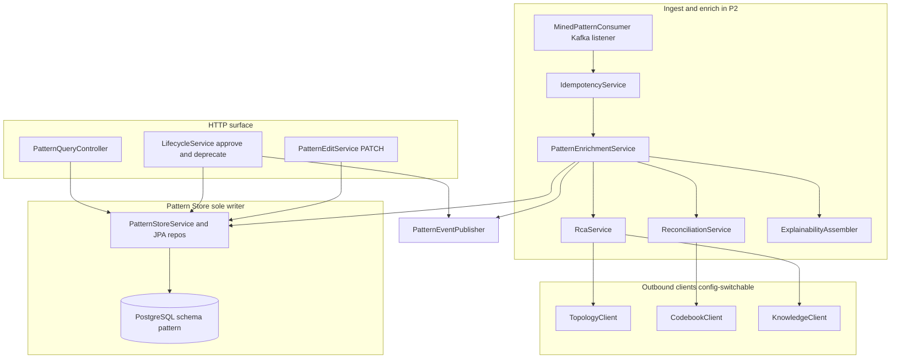
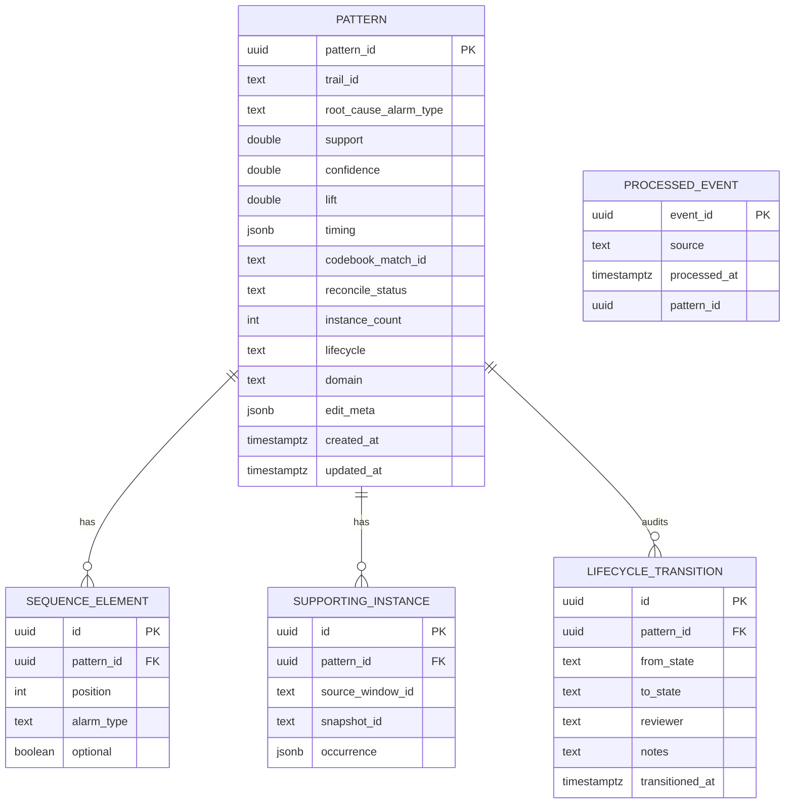
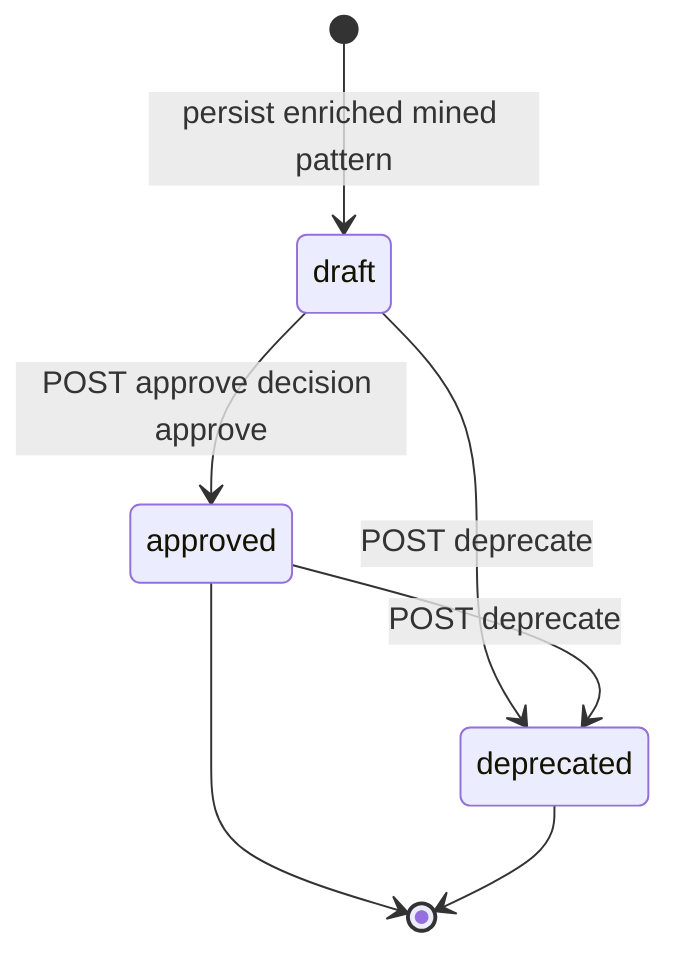
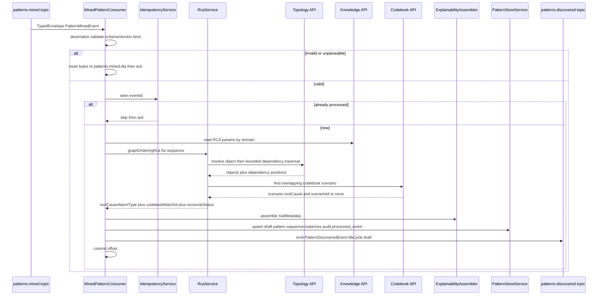
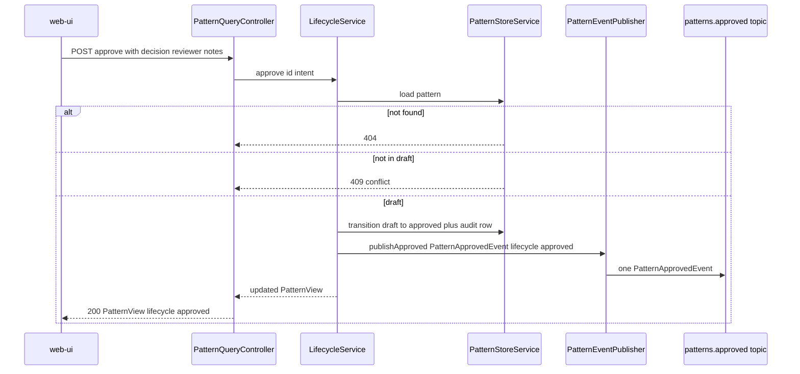
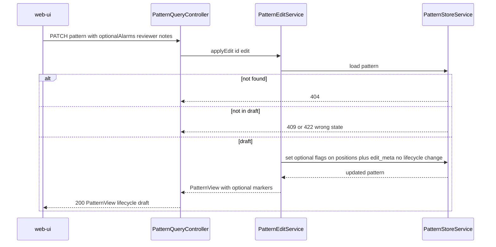
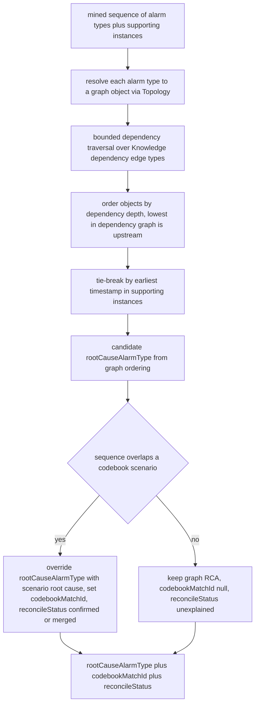

# pattern-manager — Design

Buildable design for the Pattern Manager — the single owner of the full pattern domain. It
consumes mined sequences (`patterns.mined`), enriches them with RCA, codebook reconciliation
and explainability metadata, persists them in the Pattern Store (PostgreSQL) as `draft`, drives
the human-approval lifecycle through its API, and is the sole emitter of `PatternDiscoveredEvent`
and `PatternApprovedEvent`. It contains **no ML** — mining is wholly owned by the Pattern Miner.

This design realizes the approved `services/pattern-manager/spec.md` (12 tasks, 14 acceptance
criteria) and honours the canonical phase map in `docs/architecture.md` (P1 Idle / P2 Active /
P3 Passive). It introduces **no contract change**: all consumed/produced payloads
(`PatternMinedEvent`, `PatternDiscoveredEvent`, `PatternApprovedEvent`) and topics
(`patterns.mined`, `patterns.discovered`, `patterns.approved`, `patterns.mined.dlq`) already
exist in `libs/event-model` and `docs/architecture.md`. The HTTP surface, Pattern Store schema,
and integration points are internal design and not contract changes.

## Stack

- **Language / runtime:** Java 17 (`eclipse-temurin:17-jdk`), per CLAUDE.md Java pin.
- **Framework:** Spring Boot 3.x (Spring Web MVC, Spring for Apache Kafka, Spring Data JPA).
- **Datastore:** PostgreSQL (Pattern Store; logical schema `pattern`). Flyway for schema
  migrations. PostgreSQL JDBC driver.
- **Event model:** `libs/event-model` Java binding (`com.acp.eventmodel.EventCodec`,
  `TypedEnvelope`, generated `PatternMinedEvent` / `PatternDiscoveredEvent` /
  `PatternApprovedEvent` POJOs). The codec validates the envelope, enforces the
  `schemaVersion` policy (accept major 1, reject 2 and above), and binds the typed payload.
- **HTTP client (outbound):** Spring `RestClient` (WebFlux-free, blocking) for Topology,
  Codebook Generator and Knowledge calls; clients built against each collaborator's published
  OpenAPI, base URLs from config.
- **OpenAPI:** springdoc-openapi (OpenAPI 3.1) at `/openapi.json` + Swagger UI; the generated
  document is checked in to `services/pattern-manager/openapi.json`.
- **Observability:** Spring Boot Actuator (`/health`, `/metrics` Prometheus via Micrometer);
  structured JSON logs (Logback JSON encoder) with `traceId`, `patternId`.
- **Build:** Gradle (Java 17 toolchain). **Tests:** JUnit 5 (unit/contract); Testcontainers
  (PostgreSQL plus Kafka) plus WireMock (collaborator stubs) for integration. Per CLAUDE.md — do
  not substitute the framework.
- **Licenses:** all of the above are Apache-2.0 / EPL-2.0 / MIT — permissive only. No ML
  libraries; no Apache AGE driver (topology is read via API only).

## Task breakdown (from the spec)

Every spec task (1 through 12) is realized below and is traceable to modules, data, events,
and flow.

| Spec task | Realized by (modules / flow) |
|---|---|
| 1. Consume `patterns.mined`: validate, dedupe on `eventId`, extract sequence/metrics/`trailId`/timing/provenance | `MinedPatternConsumer` (Spring Kafka listener) calls `EventCodec.deserialize` (envelope plus payload validation plus schemaVersion policy); `IdempotencyService` checks the `processed_event` table on `eventId`; on success the typed `PatternMinedEvent` is handed to `PatternEnrichmentService`. |
| 2. Perform RCA (graph ordering): map alarm types to graph objects via Topology API, designate lowest-in-dependency plus earliest-timestamp as `rootCauseAlarmType` | `RcaService.graphOrderingRca(...)` resolves each sequence alarm type to a graph object and bounded dependency position via `TopologyClient`, then applies the ordering algorithm (see Algorithm logical flow). Parameters from `KnowledgeClient`. |
| 3. Apply codebook RCA override: test sequence overlap via Codebook API, replace RCA plus record `codebookMatchId` | `ReconciliationService.matchCodebook(...)` (via `CodebookClient`) finds an overlapping scenario; if present, `RcaService` takes the scenario's designated root cause as the authoritative `rootCauseAlarmType` and records `codebookMatchId`. |
| 4. Reconcile against codebook: confirm match, merge complementary appendages, flag no-model-explanation | `ReconciliationService` classifies the result as `CONFIRMED` (scenario match), `MERGED` (complementary appendage merged) or `UNEXPLAINED` (no scenario, so `codebookMatchId` null, `reconcileStatus = unexplained`). |
| 5. Assemble explainability metadata: instanceCount, support/confidence/lift, timing stats, codebook overlap ref, supporting example instances | `ExplainabilityAssembler` builds the `XaiMetadata` value object (instanceCount, metrics, `timing`, `codebookMatchId`, `reconcileStatus`, `supportingInstances` from the event provenance). |
| 6. Persist to Pattern Store with lifecycle `draft`; assign stable `patternId` | `PatternStoreService.persistDraft(...)` writes the `pattern` row (lifecycle `draft`), its `supporting_instance` rows, and a `lifecycle_transition` audit row; `patternId` is a deterministic UUIDv5 over `(trailId, sequence, sourceWindowId, snapshotId)` for upsert idempotency. |
| 7. Emit `patterns.discovered`: one `PatternDiscoveredEvent` per persisted draft | `PatternEventPublisher.publishDiscovered(...)` builds a `TypedEnvelope` of `PatternDiscoveredEvent` (`lifecycle = draft`) via `EventCodec.serialize` and sends to `patterns.discovered`. |
| 8. Serve the pattern read API (list draft with XAI, get by id, list approved, filter by lifecycle); serve approved to Correlation Engine | `PatternQueryController` — `GET /patterns` (filter `lifecycle`, pagination), `GET /patterns/{patternId}`; backed by `PatternQueryService` reading the Pattern Store. The same `GET /patterns?lifecycle=approved` serves the Correlation Engine. |
| 9. Process approval intent: validate `draft`, transition to `approved`, record timestamp | `POST /patterns/{patternId}/approve` calls `LifecycleService.approve(...)` which validates current state `draft`, transitions to `approved`, writes a `lifecycle_transition` audit row, then triggers task 11. |
| 10. Process operator edits (placeholder): per-alarm `optional` flags on a `draft` pattern | `PATCH /patterns/{patternId}` calls `PatternEditService.applyEdit(...)` which validates `draft`, persists `optional` markers into `sequence_element.optional` (plus reviewer/notes into edit metadata), returns the updated record. Edit metadata stays internal — never added to `PatternApprovedEvent`. |
| 11. Emit `patterns.approved`: one `PatternApprovedEvent` per approval transition | `PatternEventPublisher.publishApproved(...)` builds a `TypedEnvelope` of `PatternApprovedEvent` (`lifecycle = approved`) and sends to `patterns.approved`. Sole producer; the web-ui only signals via the API. |
| 12. Support deprecation: `draft` or `approved` to `deprecated`, record timestamp | `POST /patterns/{patternId}/deprecate` calls `LifecycleService.deprecate(...)` which validates current state in (`draft`, `approved`), transitions to `deprecated`, writes a `lifecycle_transition` audit row. |

## Phase applicability (design view)

Consistent with the canonical phase map (`docs/architecture.md`: P1 Idle / P2 Active / P3
Passive) and the spec's Phase applicability table.

| Phase | Active/Passive/Idle | Modules/handlers exercised | Inputs/Outputs |
|---|---|---|---|
| P1 — Topology onboarding | Idle | None. The Kafka consumer is subscribed but `patterns.mined` carries no traffic in P1 and no patterns exist; the HTTP read API returns empty result sets. The service is deployed and healthy but drives and serves no domain work. | In: — . Out: — |
| P2 — Pattern learning | Active | `MinedPatternConsumer`, `IdempotencyService`, `PatternEnrichmentService` (`RcaService`, `ReconciliationService`, `ExplainabilityAssembler`), `PatternStoreService`, `PatternEventPublisher` (discovered plus approved); HTTP: `PatternQueryController`, `LifecycleService` (approve/deprecate), `PatternEditService`. Calls `TopologyClient`, `CodebookClient`, `KnowledgeClient`. | In: `patterns.mined` (Kafka); approval-intent / edit / deprecate via HTTP API. Out: `patterns.discovered`, `patterns.approved` (Kafka). Serves: read API (web-ui). Calls: Topology, Codebook Generator, Knowledge APIs. |
| P3 — Real-time correlation | Passive | `PatternQueryController` only (read path). No Kafka consumption or production; no enrichment, no lifecycle changes driven internally. | In: — . Out: read API responses (`GET /patterns?lifecycle=approved` to Correlation Engine at startup/refresh; web-ui pattern reads). No topic I/O. |

## Module breakdown



- **MinedPatternConsumer** — Spring Kafka listener on `patterns.mined`; deserialize via
  `EventCodec`; on parse/validation/schemaVersion failure route raw bytes to
  `patterns.mined.dlq`; on success delegate to enrichment after the idempotency gate.
- **IdempotencyService** — checks/records `eventId` in `processed_event`; the consumer is
  manual-ack and only commits the offset after the enrichment plus persist plus emit succeed and
  the `eventId` is recorded (within one DB transaction).
- **PatternEnrichmentService** — orchestrates RCA, then reconcile/override, then XAI, then
  persist draft, then emit `patterns.discovered`. Stateless beyond the Pattern Store.
- **RcaService** — graph-ordering RCA plus codebook-override RCA (Algorithm logical flow below).
- **ReconciliationService** — codebook match classification (CONFIRMED / MERGED / UNEXPLAINED).
- **ExplainabilityAssembler** — assembles the `XaiMetadata` value object.
- **PatternStoreService** — the **sole writer** to the Pattern Store; upserts patterns,
  supporting instances, sequence elements, lifecycle-transition audit rows.
- **PatternEventPublisher** — sole producer of `PatternDiscoveredEvent` and
  `PatternApprovedEvent`.
- **PatternQueryController / LifecycleService / PatternEditService** — the HTTP surface
  (read, approve, deprecate, edit).
- **TopologyClient / CodebookClient / KnowledgeClient** — outbound `RestClient` instances,
  config-switchable (mock from collaborator OpenAPI in unit tests; real in integration).

## Data model / DB schema

Owned datastore: **PostgreSQL Pattern Store** (logical schema `pattern`). Pattern Manager is the
**sole writer**. `patternId` is the upsert key (UUIDv5 over the mining provenance, so a
redelivered mined event maps to the same row); `processed_event` carries the `eventId` dedupe
set.



Concrete columns, keys, constraints and indexes:

- **`pattern`** — `pattern_id UUID PK`; `trail_id TEXT NOT NULL`; `root_cause_alarm_type TEXT NOT
  NULL`; `support/confidence/lift DOUBLE PRECISION NOT NULL`; `timing JSONB NOT NULL` (median
  inter-arrival plus timeframe, opaque map per the contract); `codebook_match_id TEXT NULL`
  (null means no model explanation); `reconcile_status TEXT NOT NULL CHECK IN (confirmed, merged,
  unexplained)`; `instance_count INT NOT NULL CHECK greater than 0`; `lifecycle TEXT NOT NULL
  CHECK IN (draft, approved, deprecated) DEFAULT draft`; `domain TEXT NULL` (from
  provenance.domain; null defaults to the MVP domain); `edit_meta JSONB NULL` (reviewer/notes for
  the last edit, internal only); `created_at/updated_at TIMESTAMPTZ NOT NULL`.
  Index: `idx_pattern_lifecycle (lifecycle)` for `GET /patterns?lifecycle=...`.
- **`sequence_element`** — ordered alarm types; `UNIQUE (pattern_id, position)`; `optional BOOLEAN
  NOT NULL DEFAULT FALSE` (the edit placeholder); ordering reconstructs the sequence for events.
- **`supporting_instance`** — example occurrences from the Miner provenance (may be zero rows);
  `occurrence JSONB` holds the raw provenance occurrence reference.
- **`lifecycle_transition`** — audit log; one row per transition (draft to approved, draft to
  deprecated, approved to deprecated) with `transitioned_at` non-null; index
  `idx_transition_pattern (pattern_id)`.
- **`processed_event`** — `event_id UUID PK` is the idempotency set; written in the same
  transaction as the `pattern` upsert so a redelivered `eventId` is a no-op (criterion 10).

The `optional` markers and `edit_meta` are **internal** — they feed the read API and Correlation
matching considerations post-MVP, and are deliberately **not** serialized into
`PatternApprovedEvent` (which has `additionalProperties:false`).

### Lifecycle state machine



## Event handling

- **Consumers:**
  - `patterns.mined` to `MinedPatternConsumer`. Idempotency/dedupe key: envelope `eventId`
    (checked against `processed_event`). Manual ack: the offset is committed only after
    enrichment plus persist plus emit plus `eventId` record succeed in one DB transaction. DLQ
    routing: a message that fails JSON parse, envelope/payload schema validation, the
    `schemaVersion` policy, or POJO binding is published to **`patterns.mined.dlq`** (key plus
    original bytes plus an `error` header) and acked, so the consumer continues without blocking
    the partition (criterion 11). A well-formed event whose collaborator call fails transiently
    (Topology/Codebook/Knowledge down) is **retried with backoff, not sent to the DLQ** — it is
    not a poison message (see Error handling).
- **Producers:**
  - `patterns.discovered` carries `PatternDiscoveredEvent` (`libs/event-model`), one per newly
    persisted draft pattern, `lifecycle = draft`. Built and validated by `EventCodec.serialize`.
  - `patterns.approved` carries `PatternApprovedEvent` (`libs/event-model`), one per approval
    transition, `lifecycle = approved`. **Pattern Manager is the sole producer**; the web-ui
    signals approval only via `POST /patterns/{patternId}/approve`, never by publishing to the
    topic. The publish happens in the same processing action as the lifecycle transition.

Envelope fields on emission: fresh `eventId` (UUID), `type` is the payload type, `schemaVersion`
is 1, `occurredAt` is now (ISO-8601 UTC), `source` is `pattern-manager`, `traceId` propagated
from the originating mined event (discovered) or generated for an API-initiated approval
(approved).

## API contracts / API schema

HTTP surface (Spring Web MVC). OpenAPI 3.1 published at `/openapi.json` via springdoc, Swagger
UI at `/swagger-ui`, and the generated document checked in at
`services/pattern-manager/openapi.json`. The service's own published spec drives contract/unit
tests (request/response schema validation plus provider-side verification). A change to this
surface is a contract change requiring `docs/architecture.md` plus human approval.

Response shapes reuse the `libs/event-model` pattern fields where applicable and add the
internal XAI/edit/lifecycle fields. Common `PatternView` body:

```
PatternView {
  patternId: string (uuid)
  sequence: SequenceElement[]   # each {alarmType: string, optional: boolean}
  rootCauseAlarmType: string
  support: number
  confidence: number
  lift: number
  timing: object                # median inter-arrival plus timeframe
  codebookMatchId: string|null
  reconcileStatus: "confirmed"|"merged"|"unexplained"
  instanceCount: integer (greater than 0)
  supportingInstances: SupportingInstance[]   # each {sourceWindowId, snapshotId, occurrence}
  lifecycle: "draft"|"approved"|"deprecated"
  domain: string|null
  createdAt: string (date-time)
  updatedAt: string (date-time)
}
```

| Method plus path | Request body | Success response | Errors |
|---|---|---|---|
| `GET /patterns` | query: `lifecycle?` (`draft`/`approved`/`deprecated`), `limit?` (default 50), `offset?` (default 0), `sort?` (`createdAt`/`lift`, default `-createdAt`) | `200 PatternPage { items: PatternView[], total: integer, limit, offset }` | `400` invalid `lifecycle`/`sort` enum |
| `GET /patterns/{patternId}` | — | `200 PatternView` (full XAI incl. `supportingInstances`) | `404` unknown `patternId` |
| `POST /patterns/{patternId}/approve` | `ApprovalIntent { decision: approve or reject, reviewer: string, notes?: string }` | `200 PatternView` (lifecycle `approved` when `approve`; unchanged plus rejection recorded when `reject`) | `404` unknown id, `409` not in `draft`, `422` invalid decision/missing reviewer |
| `PATCH /patterns/{patternId}` | `PatternEdit { optionalAlarms: integer[] positions, reviewer: string, notes?: string }` | `200 PatternView` (`optional` markers reflected) | `404` unknown id, `409` not in `draft`, `422` invalid positions |
| `POST /patterns/{patternId}/deprecate` | `DeprecateIntent { reviewer: string, notes?: string }` | `200 PatternView` (lifecycle `deprecated`) | `404` unknown id, `409` not in (`draft`, `approved`) |

OQ-2 (issue #46, `design-stage`) resolved here: **offset-based pagination** — `limit`/`offset`
query params with a `PatternPage` envelope `{ items, total, limit, offset }` and `sort`
defaulting to `-createdAt`. Rationale under Design alternatives.

Error responses use a structured JSON body `{ timestamp, status, error, message, patternId? }`
(no stack traces; never a silent 200).

## Integration points (mock vs. real)

All outbound base URLs and the `mock|real` toggle resolve from environment config — no hard-coded
URLs. Mock means a stub generated from the collaborator's **published OpenAPI** (WireMock /
MockWebServer) used in unit/contract tests; real means the live service (Docker Compose address)
in integration.

| Collaborator plus operation | Config key(s) | Mock / real |
|---|---|---|
| **Topology Service** — resolve an alarm-type's object plus bounded dependency position for RCA: `GET /topology/nodes/{managedObjectId}` and `GET /topology/traversal` (start, edgeType, depth) | `topology.base-url`, `integration.mode` | mock (WireMock from `services/topology/openapi.json`) / real Topology |
| **Codebook Generator** — reconcile plus RCA override: `GET /codebooks?domain=...` then `GET /codebooks/{codebookId}/scenarios` to find a sequence-overlapping scenario (its `scenarioId` becomes `codebookMatchId`, its designated root cause) | `codebook.base-url`, `integration.mode` | mock (WireMock from `services/codebook-generator/openapi.json`) / real Codebook Generator |
| **Knowledge Service** — RCA/reconciliation params (dependency-ordering weights, reconciliation thresholds): model-params versioned-read endpoint, scoped by `domain` | `knowledge.base-url`, `integration.mode` | mock (WireMock from `services/knowledge/openapi.json`) / real Knowledge |

Clients are built against the collaborator's checked-in `openapi.json`, never their source. The
alarm-type to `managedObjectId` resolution is bounded: RCA needs each sequence alarm type mapped
to a representative graph object within the trail scope and its upstream-dependency position; the
Topology client uses node lookup plus a bounded traversal over dependency edge types supplied by
the Knowledge params (e.g. `RIDES_ON`, `TERMINATES`, `ADJACENCY_OVER`), not hard-coded.

## Key flows (sequence / data-flow diagrams)

### Flow A — patterns.mined to enriched draft plus patterns.discovered



### Flow B — UI approval intent to patterns.approved



### Flow C — UI edit PATCH on a draft pattern



## Algorithm logical flow

RCA combines a **graph-ordering rule** (default) with a **codebook override** (authoritative when
a scenario matches), then a **reconciliation classification**. All thresholds/weights and the
dependency edge-type set come from the Knowledge model-params (never hard-coded).



Logical steps:

1. **Resolve** — for each alarm type in the sequence, resolve a representative graph object
   (`managedObjectId`) within the `trailId` scope via Topology node lookup.
2. **Dependency position** — bounded traversal over the Knowledge-authored dependency edge types
   gives each object an upstream-dependency depth within the group.
3. **Order** — the alarm type whose object has **no upstream dependency within the group** (lowest
   in the dependency graph) is the graph-ordering root-cause candidate.
4. **Tie-break** — corroborate with the **earliest timestamp** among supporting instances; if the
   ordering is ambiguous, earliest-timestamp decides.
5. **Codebook override** — call Codebook Generator: if the sequence overlaps a known scenario
   (overlap ratio at least the Knowledge-configured threshold), replace the graph RCA with the
   scenario's designated root cause and set `codebookMatchId = scenarioId`. Classify
   `reconcileStatus` `confirmed` (full match) or `merged` (complementary appendage merged).
6. **Flag unexplained** — no overlapping scenario means keep the graph RCA, `codebookMatchId`
   null, `reconcileStatus = unexplained` (no model explanation; the UI surfaces this with the
   lift).

Outputs: `rootCauseAlarmType`, `codebookMatchId?`, `reconcileStatus`, plus the assembled
`XaiMetadata`.

## Seed data & examples

N/A — the Pattern Manager owns no seed/fixture/sample-data generation. Test fixtures
(`PatternMinedEvent` samples, collaborator stub responses) live in the test sources, not as
shipped seed data.

## UI wireframes

N/A — the web-ui renders the pattern-review/XAI views (Cytoscape/charts per architecture section
6.11). The Pattern Manager only serves the structured data via its read API.

## Error handling

| Failure mode | Handling | Surfaced as |
|---|---|---|
| Unparseable/poison `patterns.mined` (bad JSON, missing required field e.g. `sequence`, `additionalProperties` violation, bind failure) | `EventCodec.deserialize` throws; consumer publishes original bytes plus an `error` header to **`patterns.mined.dlq`**, then acks and continues to the next message — never restarts, never silently drops | DLQ record; ERROR log with `eventId` if extractable |
| Unknown major `schemaVersion` (2 and above) | `SchemaVersionPolicy.check` rejects in the codec, treated as poison, routed to `patterns.mined.dlq` | DLQ record; ERROR log |
| Duplicate `eventId` (Kafka at-least-once redelivery) | `IdempotencyService` finds the `eventId` in `processed_event`, skips enrichment, no second pattern row, acks | INFO log duplicate eventId skipped; exactly one pattern row |
| Topology / Codebook / Knowledge **unavailable or 5xx** for a well-formed event | Retry with bounded exponential backoff (RestClient plus retry policy); on exhaustion **do not DLQ** (the event is valid) — leave the offset uncommitted so the message is redelivered after the dependency recovers; metric `pm_collaborator_failures_total` increments | WARN/ERROR log; no offset commit; consumer lag visible in metrics |
| Codebook returns **no overlapping scenario** (algorithm no-match) | Not an error — `reconcileStatus = unexplained`, `codebookMatchId` null, graph-ordering RCA retained | INFO log; pattern persisted as draft |
| Topology cannot resolve an alarm type to an object | RCA falls back to **earliest-timestamp** tie-break alone for that element; if no object resolves at all, the graph-ordering candidate defaults to the earliest-timestamp alarm type; logged | WARN log; pattern still persisted |
| `approve`/`deprecate`/`edit` on **wrong lifecycle state** | `LifecycleService`/`PatternEditService` reject: not `draft` for approve/edit gives `409`; invalid decision/positions/missing reviewer gives `422` | Structured JSON error body; no state change, no event emitted |
| `GET /patterns/{patternId}` unknown id | `404` with structured error body | JSON error |
| Invalid `lifecycle`/`sort` query enum | `400` with structured error body | JSON error |
| Off-contract outbound event (in-memory POJO violates schema) | `EventCodec.serialize` validates before send and throws, so the publish aborts and the message is not emitted | ERROR log; alerted via metric |

Nothing is ever silently dropped: poison messages go to the DLQ, transient dependency failures
trigger redelivery, and validation failures return a structured error.

## Design alternatives

| Consideration | Alternatives considered | Chosen plus rationale |
|---|---|---|
| `patternId` assignment | (A) random UUIDv4 per consume; (B) DB sequence; (C) deterministic UUIDv5 over mining provenance `(trailId, sequence, sourceWindowId, snapshotId)` | **C** — a deterministic id makes the consume-plus-persist idempotent under Kafka redelivery without a separate lookup (criterion 10) and ties a pattern stably to its mining origin. UUIDv4 would create duplicate rows on redelivery unless guarded solely by `eventId`; we keep both guards (UUIDv5 upsert plus `processed_event`). |
| Idempotency mechanism | (A) `eventId` set only; (B) deterministic `patternId` upsert only; (C) both | **C** — `processed_event` short-circuits re-processing (avoids re-calling collaborators and re-emitting `patterns.discovered`), and the UUIDv5 upsert makes the DB write itself idempotent as a safety net. |
| RCA override precedence | (A) graph ordering wins; (B) codebook always wins when present; (C) confidence-weighted blend | **B** — the spec mandates that the codebook scenario is authoritative when the sequence overlaps; the codebook is the model-based ground truth. Graph ordering is the default only when no scenario matches. A blend adds tuning surface with no spec mandate. |
| DLQ vs. retry for collaborator-down | (A) DLQ on any failure; (B) retry-and-redeliver for transient, DLQ only for poison | **B** — a valid event blocked by a transient dependency outage is not poison; sending it to the DLQ would lose it or require manual replay. We DLQ only messages that can never succeed (malformed/contract-violating). |
| Edit placeholder representation | (A) new event field; (B) `optional` flags on `sequence_element` plus internal `edit_meta`, never on the event | **B** — the frozen `PatternApprovedEvent` has `additionalProperties:false`; adding an edit field is a contract change. The spec explicitly keeps edit metadata internal (Pattern Store plus read API). Correlation-side handling of optional alarms is a documented post-MVP enhancement. |
| Pagination (OQ-2 / issue 46) | (A) cursor-based; (B) offset-based `limit`/`offset` with a `PatternPage` envelope | **B** — the pattern corpus is small (human-reviewable counts), the UI needs `total` for review progress, and offset paging is simpler for the web-ui table; cursor paging's benefit (stable paging over high-churn large sets) does not apply here. |
| Approval plus emit atomicity | (A) emit then transition; (B) transition then emit in the same action; (C) transactional outbox | **B** for the MVP — transition the Pattern Store row, then publish in the same processing action; the emit failure path logs and alerts and the transition is auditable for replay. A transactional outbox (C) is the post-MVP hardening if exactly-once across DB and Kafka becomes a hard requirement. |
| Kafka offset commit | (A) auto-commit; (B) manual ack after persist plus emit | **B** — manual ack guarantees the pattern is persisted and `patterns.discovered` emitted before the offset advances, so a crash mid-processing redelivers (and idempotency dedupes). Auto-commit risks losing a mined event on crash. |

## Test plan

### Acceptance criterion to test (unit/contract — JUnit 5)

| # | Acceptance criterion | Test | Asserts |
|---|---|---|---|
| 1 | Fiber-cut sequence LOS LinkDown AdjDown LSPDown; Topology stub maps LOS to a FiberSpan with no upstream dependency plus earliest timestamp gives `rootCauseAlarmType = LOS` | `RcaServiceTest.graphOrderingPicksLowestDependencyEarliestTimestamp` | Persisted pattern `rootCauseAlarmType` equals LOS given the Topology mock plus earliest timestamp |
| 2 | Sequence overlaps codebook scenario designating LineCardFault (Codebook stub returns scenario with non-null id), so override RCA, `rootCauseAlarmType = LineCardFault`, `codebookMatchId` set | `RcaServiceTest.codebookOverrideReplacesGraphRcaAndSetsMatchId` | `rootCauseAlarmType` equals LineCardFault and `codebookMatchId` equals scenarioId (overrides graph candidate) |
| 3 | High `support`, low `lift` spurious co-occurrence, persisted with `codebookMatchId` absent (no model explanation), `lift` equals the low event value | `ReconciliationServiceTest.noCodebookMatchFlagsUnexplainedPreservesLift` | `codebookMatchId` is null, `reconcileStatus` is unexplained, persisted `lift` equals the event lift |
| 4 | Any processed event gives all XAI fields present: `instanceCount` greater than 0, `support`, `confidence`, `lift`, `timing` (median inter-arrival plus timeframe), `codebookMatchId` (null if none), `supportingInstances` (may be empty) | `ExplainabilityAssemblerTest.assemblesAllRequiredXaiFields` | All fields populated; `instanceCount` greater than 0; `timing` has both keys; `supportingInstances` list present, possibly empty |
| 5 | Processed without approval gives `lifecycle = draft` and is returned by `GET /patterns?lifecycle=draft` | `PatternQueryControllerTest.draftPatternReturnedByLifecycleDraftFilter` | Persisted `lifecycle` is draft; the filter response contains the `patternId` |
| 6 | Emitted `PatternDiscoveredEvent` deserializes via Java binding; required fields non-null; `lifecycle` is draft | `PatternEventPublisherTest.discoveredEventRoundTripsAndIsDraft` | `EventCodec.deserialize` succeeds; `patternId`/`sequence`/`rootCauseAlarmType`/`support`/`confidence`/`lift`/`timing`/`lifecycle` non-null; `lifecycle` equals draft |
| 7 | `POST /approve` with approve on a `draft` pattern gives lifecycle approved plus exactly one `PatternApprovedEvent` in the same action | `LifecycleServiceTest.approveTransitionsToApprovedAndEmitsExactlyOneEvent` | Store `lifecycle` is approved; exactly one record on `patterns.approved` (mock producer captor) |
| 8 | Emitted `PatternApprovedEvent` deserializes via Java binding; `lifecycle` is approved; required fields non-null | `PatternEventPublisherTest.approvedEventRoundTripsAndIsApproved` | `EventCodec.deserialize` succeeds; `lifecycle` equals approved; all required fields non-null |
| 9 | `POST /deprecate` on an approved pattern gives deprecated plus non-null transition timestamp; subsequent `GET ?lifecycle=approved` excludes it | `LifecycleServiceTest.deprecateApprovedRemovesFromApprovedListing` | Store `lifecycle` is deprecated; `lifecycle_transition.transitioned_at` non-null; not in approved query result |
| 10 | Two identical `patterns.mined` with the same `eventId` give exactly one pattern row after both | `MinedPatternConsumerIdempotencyTest.duplicateEventIdProducesSingleRow` | Pattern row count for that mining origin is 1; the second message acked without re-emit |
| 11 | Malformed `patterns.mined` (`sequence` absent) is routed to `patterns.mined.dlq`, processing continues | `MinedPatternConsumerDlqTest.malformedEventGoesToDlqAndConsumerContinues` | One record on `patterns.mined.dlq`; the next valid message is processed; no consumer restart |
| 12 | `GET /patterns` plus `GET /patterns/{id}` responses validate against published OpenAPI 3.1; unknown id gives 404 | `OpenApiContractTest.listAndGetValidateAgainstSchemaAndUnknownIdIs404` | List plus get bodies validate against `openapi.json`; GET unknown id returns 404 |
| 13 | `GET /patterns?lifecycle=approved` contains only approved; no draft/deprecated | `PatternQueryControllerTest.approvedFilterReturnsOnlyApproved` | Every item in the response has `lifecycle` equal to approved |
| 14 | `PATCH /patterns/{id}` marking an alarm optional on a draft persists the edit (reflected by GET), lifecycle unchanged; the same edit on a non-draft is rejected (409/422) | `PatternEditServiceTest.editDraftMarksOptionalAndRejectsNonDraft` | After edit, GET shows `optional` true on the position, `lifecycle` is draft; editing an approved/deprecated pattern returns 409/422 |

Supporting (non-1:1) unit tests: `KnowledgeParamsClientTest` (params resolved from Knowledge,
not hard-coded), `TopologyClientMockTest` / `CodebookClientMockTest` (clients built from
collaborators' OpenAPI via WireMock), `IdempotencyServiceTest`, `PatternStoreServiceTest`
(upsert idempotency on `patternId`).

### E2E scenarios (from this design unit's point of view)

Service-scoped end-to-end paths exercised by the integration stage (Testcontainers Kafka plus
PostgreSQL; real Topology/Codebook/Knowledge or their compose stand-ins).

| # | Scenario | Trigger to path | Expected outcome |
|---|---|---|---|
| 1 | Fiber-cut storm RCA (graph ordering) | `patterns.mined` LOS LinkDown AdjDown LSPDown, no codebook match, consume then RCA via Topology then reconcile via Codebook (none) then XAI then persist draft then `patterns.discovered` | Draft pattern with `rootCauseAlarmType` LOS, `codebookMatchId` null, `reconcileStatus` unexplained; one `PatternDiscoveredEvent` (draft) on the bus |
| 2 | Codebook RCA override | `patterns.mined` whose sequence overlaps a LineCardFault scenario, consume then RCA override via Codebook then persist draft then `patterns.discovered` | Draft pattern with `rootCauseAlarmType` LineCardFault, `codebookMatchId` is the scenario id, `reconcileStatus` confirmed |
| 3 | Spurious-pattern flag | `patterns.mined` high support low lift, no scenario, consume then reconcile UNEXPLAINED then persist | Draft pattern `codebookMatchId` null, `lift` preserved, surfaced via `GET /patterns/{id}` for UI review |
| 4 | Full approval lifecycle | After scenario 1: `POST /patterns/{id}/approve` with approve, transition then `patterns.approved` | `lifecycle` approved; one `PatternApprovedEvent` (approved); `GET ?lifecycle=approved` includes it; Correlation Engine can read it |
| 5 | Edit placeholder then approve | `PATCH /patterns/{id}` mark alarm optional on draft, then approve | GET reflects `optional` on draft; `PatternApprovedEvent` carries **no** edit field (contract intact); lifecycle approved |
| 6 | Deprecation removes from active set | `POST /patterns/{id}/deprecate` on an approved pattern | `lifecycle` deprecated; `GET ?lifecycle=approved` no longer lists it; audit row written |
| 7 | Poison message to DLQ (partial path) | malformed `patterns.mined` then a valid one | Malformed goes to `patterns.mined.dlq`; the valid one is processed normally; no stuck partition |
| 8 | Idempotent redelivery (partial path) | same `eventId` delivered twice | Exactly one pattern row; exactly one `patterns.discovered` for that origin |
| 9 | Collaborator-down (partial path) | Topology/Codebook unreachable for a valid event | No DLQ; offset uncommitted; on recovery the event processes to a draft pattern; `pm_collaborator_failures_total` incremented |
| 10 | Wrong-state guard (partial path) | `approve`/`edit` on an already-approved pattern | 409/422; no lifecycle change; no `PatternApprovedEvent` emitted |

## Config & observability

- **Config (env / Knowledge):** `KAFKA_BOOTSTRAP_SERVERS`, `KAFKA_CONSUMER_GROUP`
  (`pattern-manager`), `SPRING_DATASOURCE_URL/USERNAME/PASSWORD` (Pattern Store),
  `TOPOLOGY_BASE_URL`, `CODEBOOK_BASE_URL`, `KNOWLEDGE_BASE_URL`, `INTEGRATION_MODE`
  (`mock` or `real`). RCA/reconciliation params (dependency edge-type set, codebook-overlap
  threshold, ordering weights) are read from the **Knowledge Service** — no hard-coded
  thresholds. No hard-coded URLs or credentials.
- **Health:** `/health` (Actuator liveness plus readiness; readiness gates on DB plus Kafka).
- **Metrics:** `/metrics` (Prometheus via Micrometer): `pm_mined_consumed_total`,
  `pm_dlq_total`, `pm_duplicate_skipped_total`, `pm_patterns_discovered_total`,
  `pm_patterns_approved_total`, `pm_collaborator_failures_total`, enrichment latency timer.
- **Logging:** structured JSON (Logback), every line carries `traceId` and where applicable
  `patternId`; lifecycle transitions logged at INFO, errors at ERROR.

## Build & run

- **Build:** `./gradlew :services:pattern-manager:build` (Java 17 toolchain; JUnit 5 unit plus
  contract tests; Testcontainers integration tests in the integration profile).
- **OpenAPI:** generated by springdoc; `./gradlew :services:pattern-manager:generateOpenApi`
  writes/refreshes `services/pattern-manager/openapi.json` (checked in; CI verifies it matches
  the running surface).
- **Docker:** multi-stage `Dockerfile` (`eclipse-temurin:17-jdk` build to `17-jre` runtime);
  Compose entry depends on Kafka plus PostgreSQL; env supplies broker, datasource, collaborator
  base URLs, and `INTEGRATION_MODE`.
- **Local run:** `docker compose up pattern-manager` (with `kafka`, `postgres`, and either
  mocked collaborators or the real Topology/Codebook/Knowledge services on the `integration`
  branch).
- **DB migrations:** Flyway runs the `pattern` schema migrations on startup.
