# pattern-manager — Design

> **EVOLUTION (P2 live-verified P2 blocker fix — ANCHOR-IDENTITY consolidation).** The Pattern Miner
> now processes a P2 corpus in **multiple bounded sub-runs** (its trail-aligned batch-cap fix,
> `design/pattern-miner-batch-cap`), so the **same fault-origin** (same
> `provenance.anchorScenarioId`) can be mined in more than one sub-run and emit **more than one
> `PatternMinedEvent`** for one real pattern. Pattern Manager currently dedupes only on `eventId`
> (idempotency) and mints `patternId` as a UUIDv5 over `(trailId, sequence, sourceWindowId,
> snapshotId)` — i.e. **per mined event** — so two mined events for one `anchorScenarioId` would
> persist as **two draft patterns** (an over-count). This evolution adds **anchor-identity
> consolidation**: mined patterns sharing the same `anchorScenarioId` (within a
> `(domain, snapshotId, codebookVersion)` scope) **consolidate into ONE Pattern Store pattern**,
> aggregating occurrences/support across the contributing mined events; **unexplained**
> (`anchorScenarioId` null/absent) patterns do **not** consolidate by anchor (each stays distinct).
> It **replaces** the "one draft per mined event" behaviour for anchored patterns, is **idempotent and
> replay-safe** (a re-delivered mined event never double-counts), and also fixes a **latent** over-count
> that exists even without batching (multiple mined sequences for one fault-origin collapse to one
> discovered pattern). NEW/CHANGED sections are tagged **[ANCHOR-CONSOL]**. **No contract change:** the
> `anchorScenarioId` field already exists on `PatternMinedEvent.provenance` (merged, PR #331);
> consolidation is internal to the Pattern Store + read API — no new topic/payload/field (see the
> no-contract-change note below).

> **[ANCHOR-CONSOL] No contract change; relationship to ReconciliationService MERGED.** Consolidation
> is **internal**: it changes how many Pattern Store rows one fault-origin produces and how their
> occurrences/support aggregate — the frozen `PatternDiscoveredEvent`/`PatternApprovedEvent` shapes and
> topics are **unchanged**, and `anchorScenarioId` is already on the frozen `PatternMinedEvent`. It is
> **distinct from** codebook `MERGED` reconciliation: `MERGED` merges a mined pattern's *complementary
> appendage* into a matched **codebook scenario** at the *symptom-chain* level (a reconciliation
> classification about codebook explanation); **anchor-consolidation** collapses *multiple mined events
> for the same fault-origin anchor* into one *Pattern Store identity* (a persistence-identity concern,
> upstream of and orthogonal to reconciliation). A consolidated pattern is still reconciled and
> classified `CONFIRMED`/`MERGED`/`UNEXPLAINED` exactly as before — consolidation decides *which row*
> the mined event folds into; reconciliation decides *that row's codebook explanation*. They do not
> overlap and neither replaces the other.

Buildable design for the Pattern Manager — the single owner of the full pattern domain. It
consumes mined sequences (`patterns.mined`), enriches them with RCA, **structural validation**,
codebook reconciliation and explainability metadata, **derives a per-pattern session-window rule
(`sessionWindow`) from the mined timing statistics**, persists everything in the Pattern Store
(PostgreSQL) as `draft`, drives the human-approval lifecycle through its API, and is the sole
emitter of `PatternDiscoveredEvent` and `PatternApprovedEvent` (both now carrying `sessionWindow`).
It contains **no ML** — mining is wholly owned by the Pattern Miner.

This design realizes the approved `services/pattern-manager/spec.md` (14 tasks, 22 acceptance
criteria) and honours the canonical phase map in `docs/architecture.md` (P1 Idle / P2 Active /
P3 Passive). It introduces **no contract change**: all consumed/produced payloads
(`PatternMinedEvent`, `PatternDiscoveredEvent`, `PatternApprovedEvent`) and topics
(`patterns.mined`, `patterns.discovered`, `patterns.approved`, `patterns.mined.dlq`) already
exist in `libs/event-model` and `docs/architecture.md`, and remain **frozen and unchanged**. The
`sessionWindow` field ({`windowMs`, `type`}) is already part of the **merged** `libs/event-model`
contract — required on both `PatternDiscoveredEvent` and `PatternApprovedEvent` and defined by
`common/sessionWindow.schema.json` — so populating it here **uses the merged contract** and is
**not** a new contract change. The Pattern Manager derives and populates it; the descriptive
`timing` field the Pattern Miner produces passes through unchanged and is never modified or
re-emitted.

The new structural-validation status (`structurallyValidated` + `structuralValidationReason`) is
**internal** — it lives only in the Pattern Store and the read API, exactly as the operator-edit
metadata does, and is deliberately **not** added to either frozen event. The HTTP surface,
Pattern Store schema, and integration points are internal design and not contract changes.

**Data-integration fixes folded into this design (no contract change).** Five data-integration
gaps from `docs/design-gaps.md` are resolved here, all within the Pattern Manager's owned read API
+ derivation, with **no Kafka topic or event-model payload change**:
- **P3-G1** — `trailId` is surfaced on `PatternView` (read API + `openapi.json`), giving the
  Correlation Engine its per-pattern `trailId` (for `(trailId, patternId)` keying) **from the read
  API, not from `PatternApprovedEvent`** — which deliberately stays unchanged.
- **P2-GAP-04** — `rootCauseAlarmType` (events + `PatternView` + RCA output) is bound to the
  canonical **`alarmType` vocabulary** (Knowledge `alarmTypeVocabulary`), the same join key as
  `AlarmEvent.alarmType` and codebook `predictedSymptoms[].alarmType`.
- **P2-GAP-05 / Q11** — the `sessionWindow` derivation pins exact `timing` keys/units, fixes
  `cv = stddevInterArrivalMs / medianInterArrivalMs`, and gives a self-consistent worked example
  (resolving OQ-5). The Pattern Miner now emits the four pinned ms keys natively
  (`timeframeMs`, `medianInterArrivalMs`, `maxInterArrivalMs`, `stddevInterArrivalMs`) and the merged
  `PatternMinedEvent.json` fixture matches, so the deriver reads them **directly** — the
  `SESSION_WINDOW_TIMING_ALIASES` default is **empty/identity** (no aliasing or unit conversion by
  default; the alias map is an optional escape hatch only). The open `timing` object is unchanged,
  so this is not an event-model change.
- **P2-GAP-06** — the `PATCH /patterns/{id}` body is frozen as
  `{ sequenceFlags: [{ index, optional }], reviewer, notes? }` in `openapi.json`.
- **P2-GAP-08** — `GET /patterns` is frozen to return the **`PatternPage` envelope**
  `{ items, total, limit, offset }`, not a bare array.
The published `openapi.json` (OpenAPI 3.1, at `/openapi.json`, checked in at
`services/pattern-manager/openapi.json`) is the SSoT for all of the above; consumer-side alignment
(web-ui) is handled in the web-ui fix.

**Session-window summary (OQ-5 resolution, detailed under Algorithm logical flow).** For every
mined pattern the Pattern Manager derives `sessionWindow = {windowMs, type}` deterministically and
**purely** from `PatternMinedEvent.timing` — with **no** Knowledge-Service input. `windowMs` is a
documented margin over the pattern's observed timeframe, bounded to sane limits; `type` is
`gap-based` by default and `fixed` only when the mined inter-arrivals are tightly periodic. The
derivation happens **once**, at intake/persist, and the persisted value is reused for **both**
emitted events — so an approved pattern's `sessionWindow` is byte-for-byte the value first
persisted at draft. The derivation constants are documented derivation parameters (env-overridable
with documented defaults), **not** hard-coded business thresholds.

Structural validation reuses the **same Topology Service API integration point** (object
resolution + bounded dependency traversal) that RCA already uses — so it requires **no new
Topology endpoint** and therefore **no contract change** (OQ-3 resolution, below). The topology
store is NebulaGraph-backed, but that is fully abstracted behind the Topology Service API; the
Pattern Manager never touches the topology graph directly.

## Stack

- **Language / runtime:** Java 17 (`eclipse-temurin:17-jdk`), per CLAUDE.md Java pin.
- **Framework:** Spring Boot 3.x (Spring Web MVC, Spring for Apache Kafka, Spring Data JPA).
- **Datastore:** PostgreSQL (Pattern Store; logical schema `pattern`). Flyway for schema
  migrations. PostgreSQL JDBC driver.
- **Event model:** `libs/event-model` Java binding (`com.acp.eventmodel.EventCodec`,
  `TypedEnvelope`, generated `PatternMinedEvent` / `PatternDiscoveredEvent` /
  `PatternApprovedEvent` POJOs). The codec validates the envelope, enforces the
  `schemaVersion` policy (accept major 1, reject 2 and above), and binds the typed payload.
- **HTTP client (outbound):** Spring `RestClient` (WebFlux-free, blocking) for Topology,
  Codebook Generator and Knowledge calls; clients built against each collaborator's published
  OpenAPI, base URLs from config.
- **OpenAPI:** springdoc-openapi (OpenAPI 3.1) at `/openapi.json` + Swagger UI; the generated
  document is checked in to `services/pattern-manager/openapi.json`.
- **Observability:** Spring Boot Actuator (`/health`, `/metrics` Prometheus via Micrometer);
  structured JSON logs (Logback JSON encoder) with `traceId`, `patternId`.
- **Build:** Gradle (Java 17 toolchain). **Tests:** JUnit 5 (unit/contract); Testcontainers
  (PostgreSQL plus Kafka) plus WireMock (collaborator stubs) for integration. Per CLAUDE.md — do
  not substitute the framework.
- **Licenses:** all of the above are Apache-2.0 / EPL-2.0 / MIT — permissive only. No ML
  libraries; no NebulaGraph driver (topology is read via API only).

## Task breakdown (from the spec)

Every spec task (1 through 14) is realized below and is traceable to modules, data, events,
and flow. Task 3 (structural validation) and Task 7 (session-window derivation) are the **new**
steps; the emit/serve tasks now additionally carry/serve `sessionWindow`.

| Spec task | Realized by (modules / flow) |
|---|---|
| 1. Consume `patterns.mined`: validate, dedupe on `eventId`, extract sequence/metrics/`trailId`/timing/provenance | `MinedPatternConsumer` (Spring Kafka listener) calls `EventCodec.deserialize` (envelope plus payload validation plus schemaVersion policy); `IdempotencyService` checks the `processed_event` table on `eventId`; on success the typed `PatternMinedEvent` (including its `timing` and `provenance.anchorScenarioId`) is handed to `PatternEnrichmentService`. **[ANCHOR-CONSOL]** the `eventId` dedupe is retained unchanged (Kafka at-least-once idempotency — a *re-delivered* mined event is dropped before any aggregation, so consolidation never double-counts a redelivery); anchor-identity consolidation is a **distinct, second** collapse over *different* mined events that share one `anchorScenarioId` (see the two-level model in [ANCHOR-CONSOL] Algorithm). |
| 2. Perform RCA (graph ordering): map alarm types to graph objects via Topology API, designate lowest-in-dependency plus earliest-timestamp as `rootCauseAlarmType` | `RcaService.graphOrderingRca(...)` resolves each sequence alarm type to a graph object and bounded dependency position via `TopologyClient`, then applies the ordering algorithm (see Algorithm logical flow). Parameters from `KnowledgeClient`. **RCA is unchanged** — structural-first, as before. The set of resolved objects (`ResolvedObject[]`) it produces is captured and **handed to the structural-validation step** so no Topology call is repeated. |
| 3. **Perform structural validation:** using the objects already resolved during RCA, verify they form a connected dependency path; flag-and-persist on failure; params from Knowledge | `StructuralValidationService.validate(resolvedObjects, params)` runs **after** RCA and **before** persistence. It reuses the `ResolvedObject[]` from RCA (no redundant Topology fetch) and, via the **same** `TopologyClient` bounded-traversal operation, checks connectivity under Knowledge-sourced params (max-hops, strictness, flag-vs-reject). Outputs `structurallyValidated` (boolean) + `structuralValidationReason` (null on pass). MVP policy = **FLAG** (always persist). This is a **separate step from RCA**. |
| 4. Apply codebook RCA override: test sequence overlap via Codebook API, replace RCA plus record `codebookMatchId` | `ReconciliationService.matchCodebook(...)` (via `CodebookClient`) finds an overlapping scenario; if present, `RcaService` takes the scenario's designated root cause as the authoritative `rootCauseAlarmType` and records `codebookMatchId`. Unchanged by this rework. |
| 5. Reconcile against codebook: confirm match, merge complementary appendages, flag no-model-explanation | `ReconciliationService` classifies the result as `CONFIRMED` (scenario match), `MERGED` (complementary appendage merged) or `UNEXPLAINED` (no scenario, so `codebookMatchId` null, `reconcileStatus = unexplained`). Unchanged. |
| 6. Assemble explainability metadata: instanceCount, support/confidence/lift, timing stats, codebook overlap ref, **structural-validation status**, supporting example instances | `ExplainabilityAssembler` builds the `XaiMetadata` value object (instanceCount, metrics, `timing`, `codebookMatchId`, `reconcileStatus`, `structurallyValidated`, `structuralValidationReason`, **`sessionWindow`**, `supportingInstances` from the event provenance). `sessionWindow` is folded into XAI so the read API exposes it (criterion 21). |
| 7. **Derive session window (NEW):** from the mined `timing` statistics compute `sessionWindow` ({`windowMs` integer greater than 0, `type` gap-based or fixed); deterministic, data-driven, no Knowledge input, no undocumented magic numbers | `SessionWindowDeriver.derive(timing)` runs once at intake (before persist), reading **only** `PatternMinedEvent.timing` (no `KnowledgeClient` call). It computes `windowMs` as a documented margin over the observed timeframe, clamped to documented bounds, and selects `type` from the inter-arrival regularity (see Algorithm logical flow / OQ-5). Pure function: same `timing` in gives same `sessionWindow` out. The result is attached to the pattern record (and to XAI) and persisted; `timing` itself is left unchanged. |
| 8. Persist to Pattern Store with lifecycle `draft`; assign stable `patternId` | `PatternStoreService.persistDraft(...)` writes the `pattern` row (lifecycle `draft`, including the structural-validation columns and the two new **`session_window_ms`** / **`session_window_type`** columns), its `supporting_instance` rows, and a `lifecycle_transition` audit row. **[ANCHOR-CONSOL] `patternId` derivation changes for anchored patterns:** for a mined event with a non-null `provenance.anchorScenarioId`, `patternId` is a deterministic UUIDv5 over the **anchor-identity key** `(domain, snapshotId, codebookVersion, anchorScenarioId)` — so **all** mined events for one fault-origin (across sub-runs) map to the **same** `pattern` row, which the new `PatternConsolidationService` **upserts + aggregates** (see [ANCHOR-CONSOL] Algorithm). For an **unexplained** event (`anchorScenarioId` null/absent) `patternId` keeps the per-event UUIDv5 over `(trailId, sequence, sourceWindowId, snapshotId)` — each unexplained cascade stays distinct. The persisted `sessionWindow` is the single source reused by both emitted events (recomputed on aggregation from the combined timing — see below). |
| 9. Emit `patterns.discovered`: one `PatternDiscoveredEvent` per persisted draft, carrying `sessionWindow` | `PatternEventPublisher.publishDiscovered(...)` builds a `TypedEnvelope` of `PatternDiscoveredEvent` (`lifecycle = draft`, **`sessionWindow = {windowMs, type}`** read from the persisted record) via `EventCodec.serialize` and sends to `patterns.discovered`. `EventCodec.serialize` validates `sessionWindow` against the merged schema before send (criterion 19). The event **does not** carry the structural-validation flag (frozen schema). **[ANCHOR-CONSOL] emit-once-per-identity for anchored patterns:** `publishDiscovered` fires **only when the consolidation upsert CREATED a new `pattern` row** (first contributing mined event for that anchor identity). When a later sub-run's mined event **aggregates into an existing** anchored row, the row is updated (occurrences/support recomputed) but **no** duplicate `PatternDiscoveredEvent` is emitted for the same `patternId` — so one fault-origin yields exactly one discovered event. (A re-emit-on-material-change policy is a documented alternative; MVP emits once on create — see [ANCHOR-CONSOL] Design alternatives.) Unexplained patterns emit one discovered event per distinct pattern as before. |
| 10. Serve the pattern read API (list draft with XAI incl. `sessionWindow`, get by id incl. `sessionWindow`, list approved incl. `sessionWindow`, filter by lifecycle); serve approved to Correlation Engine | `PatternQueryController` — `GET /patterns` (filter `lifecycle`, pagination), `GET /patterns/{patternId}`; backed by `PatternQueryService` reading the Pattern Store. The response and XAI metadata now include `structurallyValidated` + `structuralValidationReason` and **`sessionWindow`** ({`windowMs`, `type`}) (criterion 21). The same `GET /patterns?lifecycle=approved` serves the Correlation Engine the `sessionWindow` it uses to govern correlation-instance lifetime. |
| 11. Process approval intent (`decision: approve or reject`): validate `draft`; on **approve** transition to `approved` and record timestamp; on **reject** transition to the terminal `rejected` state and record timestamp (Q1) | `POST /patterns/{patternId}/approve` calls `LifecycleService.decide(...)` which validates current state `draft`. On `decision = approve` it transitions to `approved`, writes a `lifecycle_transition` audit row (`draft` to `approved`), then triggers task 13 (emit `PatternApprovedEvent`). On `decision = reject` (Q1) it transitions to the distinct terminal state **`rejected`**, writes a `lifecycle_transition` audit row (`draft` to `rejected`, with `reviewer`/`notes`), and **emits no event** — the reject is an internal Pattern-Store + read-API outcome only. A rejected pattern is never served by `GET /patterns?lifecycle=approved`. Either decision on a non-`draft` pattern is `409`. |
| 12. Process operator edits (placeholder): per-position `optional` flags on a `draft` pattern via the **frozen** `PatternEdit` body `{ sequenceFlags: [{ index, optional }], reviewer, notes? }` | `PATCH /patterns/{patternId}` calls `PatternEditService.applyEdit(...)` which validates `draft`, maps each `sequenceFlags[].index` to a `sequence_element.position` and sets that element's `optional` (plus reviewer/notes into edit metadata), returns the updated record. Out-of-range `index` gives `422`. Edit metadata stays internal — never added to `PatternApprovedEvent`. **`sessionWindow` is read-only — this endpoint never edits it** (OQ-6 post-MVP). |
| 13. Emit `patterns.approved`: one `PatternApprovedEvent` per approval transition, carrying `sessionWindow` | `PatternEventPublisher.publishApproved(...)` builds a `TypedEnvelope` of `PatternApprovedEvent` (`lifecycle = approved`, **`sessionWindow` read from the persisted record — the same value emitted at discovery**) and sends to `patterns.approved`. `EventCodec.serialize` validates `sessionWindow` before send (criterion 20). Sole producer; the web-ui only signals via the API. The event **does not** carry the structural-validation flag (frozen schema). |
| 14. Support deprecation: `draft` or `approved` to `deprecated`, record timestamp | `POST /patterns/{patternId}/deprecate` calls `LifecycleService.deprecate(...)` which validates current state in (`draft`, `approved`), transitions to `deprecated`, writes a `lifecycle_transition` audit row. Unchanged. |

## Phase applicability (design view)

Consistent with the canonical phase map (`docs/architecture.md`: P1 Idle / P2 Active / P3
Passive) and the spec's Phase applicability table.

| Phase | Active/Passive/Idle | Modules/handlers exercised | Inputs/Outputs |
|---|---|---|---|
| P1 — Topology onboarding | Idle | None. The Kafka consumer is subscribed but `patterns.mined` carries no traffic in P1 and no patterns exist; the HTTP read API returns empty result sets. The service is deployed and healthy but drives and serves no domain work. | In: — . Out: — |
| P2 — Pattern learning | Active | `MinedPatternConsumer`, `IdempotencyService`, `PatternEnrichmentService` (`RcaService`, **`StructuralValidationService`**, `ReconciliationService`, `ExplainabilityAssembler`, **`SessionWindowDeriver`**), **`PatternConsolidationService`**, `PatternStoreService`, `PatternEventPublisher` (discovered plus approved, both carrying `sessionWindow`); HTTP: `PatternQueryController`, `LifecycleService` (approve/deprecate), `PatternEditService`. Calls `TopologyClient` (RCA plus structural validation, same client), `CodebookClient`, `KnowledgeClient`. `SessionWindowDeriver` calls **no** collaborator (pure over `timing`). | In: `patterns.mined` (Kafka, with `timing`); approval-intent / edit / deprecate via HTTP API. Out: `patterns.discovered`, `patterns.approved` (Kafka, both with `sessionWindow`). Serves: read API (web-ui, incl. `sessionWindow`). Calls: Topology, Codebook Generator, Knowledge APIs. |
| P3 — Real-time correlation | Passive | `PatternQueryController` only (read path; serves the structural-validation flag and `sessionWindow` in XAI metadata). No Kafka consumption or production; no enrichment, no derivation, no lifecycle changes driven internally. | In: — . Out: read API responses (`GET /patterns?lifecycle=approved` to Correlation Engine at startup/refresh, carrying `sessionWindow`; web-ui pattern reads). No topic I/O. |

## Module breakdown

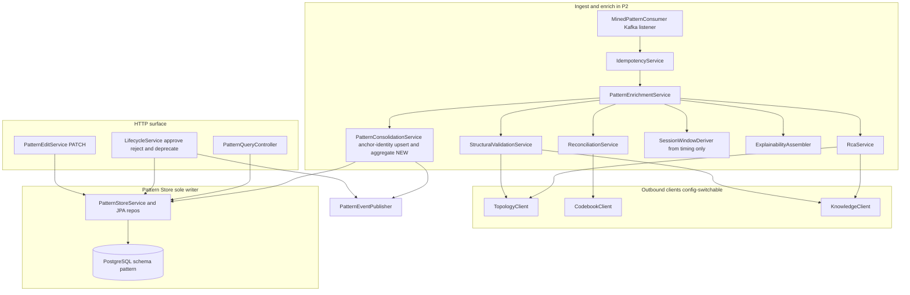

- **MinedPatternConsumer** — Spring Kafka listener on `patterns.mined`; deserialize via
  `EventCodec`; on parse/validation/schemaVersion failure route raw bytes to
  `patterns.mined.dlq`; on success delegate to enrichment after the idempotency gate.
- **IdempotencyService** — checks/records `eventId` in `processed_event`; the consumer is
  manual-ack and only commits the offset after the enrichment plus persist plus emit succeed and
  the `eventId` is recorded (within one DB transaction).
- **PatternEnrichmentService** — orchestrates RCA, **then structural validation**, then
  reconcile/override, **then session-window derivation**, then XAI, then persist draft, then emit
  `patterns.discovered`. Stateless beyond the Pattern Store. It threads the `ResolvedObject[]`
  produced by RCA into the structural-validation step so the Topology resolution is computed once,
  and hands the mined `timing` to `SessionWindowDeriver`.
- **RcaService** — graph-ordering RCA plus codebook-override RCA (Algorithm logical flow below).
  **Unchanged** by this rework; it now additionally returns the `ResolvedObject[]` it already
  computed (the alarm-type-to-object map plus dependency positions) for reuse downstream.
- **StructuralValidationService (NEW)** — takes the RCA-resolved `ResolvedObject[]` and the
  Knowledge-sourced validation params; checks whether the objects form a connected dependency
  path via the same `TopologyClient` bounded traversal; returns `structurallyValidated` +
  `structuralValidationReason`. Holds **no** thresholds of its own. MVP policy is flag-and-persist.
- **ReconciliationService** — codebook match classification (CONFIRMED / MERGED / UNEXPLAINED).
  Unchanged.
- **SessionWindowDeriver (NEW)** — a **pure, deterministic** function `derive(timing)` to
  `SessionWindow{windowMs, type}`. Reads **only** the mined `PatternMinedEvent.timing` — it does
  **not** call Knowledge, Topology or Codebook, and holds no business thresholds (only documented
  derivation constants, env-overridable with documented defaults). Same `timing` input always
  produces the same window (criterion 18). Output is attached to the pattern record and to XAI and
  is the single source reused by both emitted events. See Algorithm logical flow (OQ-5).
- **ExplainabilityAssembler** — assembles the `XaiMetadata` value object, now including the
  structural-validation status **and the derived `sessionWindow`**.
- **PatternStoreService** — the **sole writer** to the Pattern Store; upserts patterns
  (including the two new columns), supporting instances, sequence elements, lifecycle-transition
  audit rows.
- **PatternConsolidationService (NEW [ANCHOR-CONSOL])** — decides the **pattern identity** for an
  enriched mined event and folds it into the Pattern Store:
  - **Anchored** (`anchorScenarioId != null`): computes the **anchor-identity `patternId`**
    (UUIDv5 over `(domain, snapshotId, codebookVersion, anchorScenarioId)`) and does an
    **atomic upsert-with-aggregation** on that row inside the same DB transaction as the
    `processed_event` insert. First contributing event **creates** the `draft` row and records
    which mined `eventId`s contributed (a `contributing_event` set); each subsequent event with the
    same identity **aggregates** — sums occurrences, combines support/confidence/lift, unions
    supporting instances, keeps the representative sequence — **without** re-counting an already
    contributing `eventId` (replay-safe). Emits `patterns.discovered` only on create.
  - **Unexplained** (`anchorScenarioId == null/absent`): no anchor consolidation — falls back to the
    existing per-event UUIDv5 identity so each unexplained cascade persists as its own distinct
    draft. (Sole owner rule preserved — still only PatternStoreService writes; consolidation is the
    identity/aggregation policy in front of it.)
- **PatternEventPublisher** — sole producer of `PatternDiscoveredEvent` and
  `PatternApprovedEvent`. **Both events carry `sessionWindow` ({`windowMs`, `type`}) read from the
  persisted Pattern Store record** (the approved value equals the value emitted at discovery);
  `EventCodec.serialize` validates `sessionWindow` against the merged schema before send. Neither
  event carries the structural-validation flag.
- **PatternQueryController / LifecycleService / PatternEditService** — the HTTP surface
  (read, approve/reject, deprecate, edit). The read path serves the structural-validation flag.
  `LifecycleService.decide(...)` handles the `approve`/`reject` decision: approve transitions
  `draft` to `approved` and emits `PatternApprovedEvent`; **reject transitions `draft` to the
  terminal `rejected` state and emits no event** (Q1).
- **TopologyClient / CodebookClient / KnowledgeClient** — outbound `RestClient` instances,
  config-switchable (mock from collaborator OpenAPI in unit tests; real in integration). The
  **same** `TopologyClient` serves both RCA and structural validation.

## Data model / DB schema

Owned datastore: **PostgreSQL Pattern Store** (logical schema `pattern`). Pattern Manager is the
**sole writer**. `patternId` is the upsert key; `processed_event` carries the `eventId` dedupe set.

**[ANCHOR-CONSOL] `patternId` derivation is now anchor-aware:**
- **Anchored** patterns — `patternId = UUIDv5(namespace, "{domain}|{snapshotId}|{codebookVersion}|{anchorScenarioId}")`,
  the **anchor identity**. Every mined event for one fault-origin (across sub-runs) maps to this one
  row, which is upserted-and-aggregated.
- **Unexplained** patterns — `patternId = UUIDv5(namespace, "{trailId}|{sequence}|{sourceWindowId}|{snapshotId}")`,
  the **per-event identity** (the previous scheme), so each unexplained cascade stays a distinct row.

Two structures support consolidation:
- The **`pattern`** row gains an aggregate view: `instance_count`, `support`, `confidence`, `lift`
  and `timing` become **running aggregates** over the contributing mined events (see the aggregation
  rules in [ANCHOR-CONSOL] Algorithm). No new column is needed for the aggregate metrics (they reuse
  the existing metric columns), but a small **`contributing_event`** child table records which mined
  `eventId`s have already been folded in (so re-aggregation is idempotent and auditable).

The structural-validation rework added two columns to `pattern`:
**`structurally_validated BOOLEAN NOT NULL`** and **`structural_validation_reason TEXT NULL`**
(non-null exactly when `structurally_validated` is false). These are internal — surfaced via the
read API only, never on the frozen events.

This session-window rework adds two further columns to `pattern`:
**`session_window_ms BIGINT NOT NULL CHECK (session_window_ms greater than 0)`** and
**`session_window_type TEXT NOT NULL CHECK IN (gap-based, fixed)`** — the derived `sessionWindow`,
persisted once at intake and read-only in MVP. Unlike the structural-validation flag, these **are**
served on the frozen events (`PatternDiscoveredEvent` / `PatternApprovedEvent` both require
`sessionWindow` per the merged contract) and on the read API / XAI. `BIGINT` is used so `windowMs`
can hold large millisecond values without overflow; it is mapped to the JSON-Schema `integer`
`windowMs` on emission.

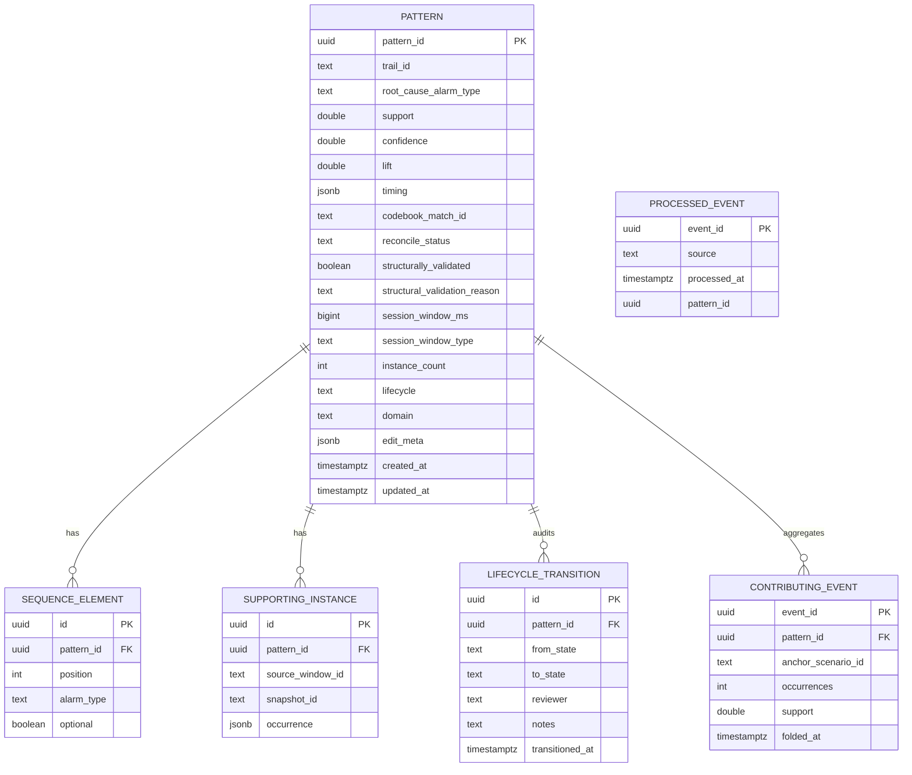

Concrete columns, keys, constraints and indexes:

- **`pattern`** — `pattern_id UUID PK`; `trail_id TEXT NOT NULL`; `root_cause_alarm_type TEXT NOT
  NULL`; `support/confidence/lift DOUBLE PRECISION NOT NULL`; `timing JSONB NOT NULL` (median
  inter-arrival plus timeframe, opaque map per the contract); `codebook_match_id TEXT NULL`
  (null means no model explanation); `reconcile_status TEXT NOT NULL CHECK IN (confirmed, merged,
  unexplained)`; **`structurally_validated BOOLEAN NOT NULL`** (true means the resolved objects
  form a connected dependency path); **`structural_validation_reason TEXT NULL`** with constraint
  `CHECK (structurally_validated = TRUE OR structural_validation_reason IS NOT NULL)` (a reason is
  always present when the flag is false); **`session_window_ms BIGINT NOT NULL CHECK
  (session_window_ms > 0)`** and **`session_window_type TEXT NOT NULL CHECK IN (gap-based, fixed)`**
  (the derived `sessionWindow`; persisted once at intake; read-only in MVP); `instance_count INT
  NOT NULL CHECK greater than 0`;
  `lifecycle TEXT NOT NULL CHECK IN (draft, approved, deprecated, rejected) DEFAULT draft`
  (**`rejected`** added per Q1 — a draft the operator rejected at review; a distinct terminal
  state, never served and emitting no event); `domain TEXT
  NULL` (from provenance.domain; null defaults to the MVP domain); `edit_meta JSONB NULL`
  (reviewer/notes for the last edit, internal only); `created_at/updated_at TIMESTAMPTZ NOT NULL`.
  Indexes: `idx_pattern_lifecycle (lifecycle)` for `GET /patterns?lifecycle=...`;
  `idx_pattern_structval (structurally_validated)` for surfacing flagged patterns in review.
- **`sequence_element`** — ordered alarm types; `UNIQUE (pattern_id, position)`; `optional BOOLEAN
  NOT NULL DEFAULT FALSE` (the edit placeholder); ordering reconstructs the sequence for events.
- **`supporting_instance`** — example occurrences from the Miner provenance (may be zero rows);
  `occurrence JSONB` holds the raw provenance occurrence reference.
- **`lifecycle_transition`** — audit log; one row per transition (draft to approved, draft to
  rejected, draft to deprecated, approved to deprecated) with `transitioned_at` non-null; index
  `idx_transition_pattern (pattern_id)`. The **draft to rejected** row is the persisted audit
  outcome of a reject decision (Q1).
- **`processed_event`** — `event_id UUID PK` is the idempotency set; written in the same
  transaction as the `pattern` upsert so a redelivered `eventId` is a no-op (criterion 10).
- **[ANCHOR-CONSOL] `pattern` additions** — a nullable **`anchor_scenario_id TEXT NULL`** column
  (the fault-origin anchor; null for unexplained patterns) with index `idx_pattern_anchor
  (anchor_scenario_id)`; the metric columns (`support`, `confidence`, `lift`, `instance_count`,
  `timing`) are **running aggregates** for anchored rows (recomputed on each fold-in). The anchor
  identity `(domain, snapshot_id, codebook_version, anchor_scenario_id)` is unique per anchored row
  by construction of `patternId` — enforced by the `pattern_id` PK (so concurrent folds of the same
  anchor serialize on the row via `SELECT ... FOR UPDATE`).
- **[ANCHOR-CONSOL] `contributing_event`** — `event_id UUID PK`, `pattern_id UUID FK -> pattern`,
  `anchor_scenario_id TEXT`, `occurrences INT`, `support DOUBLE PRECISION`, `folded_at TIMESTAMPTZ
  NOT NULL`. One row per mined `eventId` that has been folded into an anchored pattern. **Idempotency
  guard:** an `INSERT ... ON CONFLICT (event_id) DO NOTHING` before aggregating means a re-delivered
  or replayed mined event whose `eventId` is already present is **not folded again** — the aggregate
  is left unchanged (no double-count), complementing the `processed_event` gate. `idx_contrib_pattern
  (pattern_id)` supports re-aggregation/audit.

The `structurally_validated` / `structural_validation_reason`, `optional` markers and `edit_meta`
are all **internal** — they feed the read API (and Correlation matching considerations post-MVP),
and are deliberately **not** serialized into `PatternDiscoveredEvent` / `PatternApprovedEvent`
(both have `additionalProperties:false`). Adding any of them to an event is a contract change. By
contrast, **`session_window_ms` / `session_window_type` ARE part of the frozen events** — they
populate the merged-contract `sessionWindow` ({`windowMs`, `type`}) required on both events — so
serializing them is using the existing contract, not changing it.

### Lifecycle state machine

A failed structural validation does **not** affect the lifecycle: the pattern still enters
`draft` (flag-and-persist for MVP). The flag only annotates the record for operator review.

**Reject outcome (Q1 — `rejected` is a distinct terminal state).** The approval-intent body
exposes `decision: approve or reject`. A **reject** decision on a `draft` pattern transitions it to
a distinct terminal lifecycle state **`rejected`** (not to `approved`, and not to `deprecated`).
`rejected` is chosen as a separate terminal state — rather than reusing `deprecated` — because it
records a different, audit-meaningful operator judgement: the operator reviewed a *draft* and
decided the pattern is **not valid / should never be served**, whereas `deprecated` means a
**previously-approved** (or draft) pattern is being retired. Keeping them distinct makes the review
audit trail unambiguous (rejected-at-review vs retired) and lets the read API filter the two apart.
Semantics of `rejected`:
- It is **terminal** — no transition leaves it (no approve, no deprecate, no edit).
- It is **never served to the Correlation Engine** — `GET /patterns?lifecycle=approved` excludes it
  (only `approved` patterns are served), exactly as `draft` and `deprecated` are excluded.
- It is **visible in the read API for audit** — `GET /patterns?lifecycle=rejected` lists rejected
  patterns and `GET /patterns/{id}` returns one, with the reject recorded as a
  `lifecycle_transition` audit row (`from_state = draft`, `to_state = rejected`, plus `reviewer`,
  `notes`, `transitioned_at`).
- It **emits no Kafka event** — reject produces **no `PatternApprovedEvent`** (and no other event),
  so it is purely an internal Pattern-Store lifecycle change plus a read-API value. The frozen
  `PatternApprovedEvent` and `PatternDiscoveredEvent` schemas are therefore **unchanged** —
  `rejected` is never a value carried on a frozen event (a rejected pattern was only ever a `draft`,
  which already emitted its `PatternDiscoveredEvent`, and approval is the only thing that emits
  `PatternApprovedEvent`). **No contract change.**

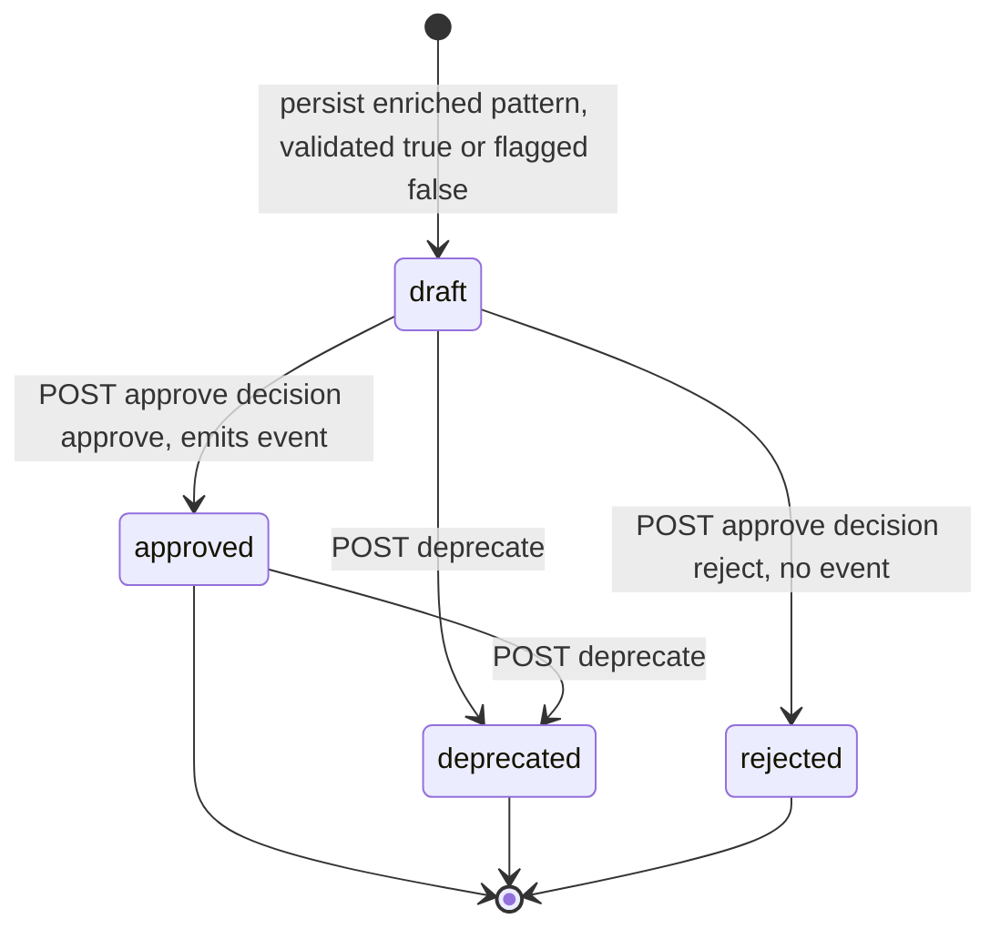

## Event handling

- **Consumers:**
  - `patterns.mined` to `MinedPatternConsumer`. Idempotency/dedupe key: envelope `eventId`
    (checked against `processed_event`). Manual ack: the offset is committed only after
    enrichment plus persist plus emit plus `eventId` record succeed in one DB transaction. DLQ
    routing: a message that fails JSON parse, envelope/payload schema validation, the
    `schemaVersion` policy, or POJO binding is published to **`patterns.mined.dlq`** (key plus
    original bytes plus an `error` header) and acked, so the consumer continues without blocking
    the partition (criterion 11). A well-formed event whose collaborator call fails transiently
    (Topology/Codebook/Knowledge down) is **retried with backoff, not sent to the DLQ** — it is
    not a poison message (see Error handling).
- **Producers:**
  - `patterns.discovered` carries `PatternDiscoveredEvent` (`libs/event-model`), one per newly
    persisted draft pattern, `lifecycle = draft`, **`sessionWindow = {windowMs, type}`** read from
    the persisted record. Built and validated by `EventCodec.serialize` (which enforces the merged
    `sessionWindow` schema — `windowMs` integer, `type` in {gap-based, fixed}). Carries **no**
    structural-validation field (frozen schema).
  - `patterns.approved` carries `PatternApprovedEvent` (`libs/event-model`), one per approval
    transition, `lifecycle = approved`, **`sessionWindow`** read from the persisted record — the
    **same value emitted at discovery** (derivation runs once at intake; approval never re-derives).
    **Pattern Manager is the sole producer**; the web-ui signals approval only via
    `POST /patterns/{patternId}/approve`, never by publishing to the topic. The publish happens in
    the same processing action as the lifecycle transition. Carries **no** structural-validation
    field (frozen schema).

Envelope fields on emission: fresh `eventId` (UUID), `type` is the payload type, `schemaVersion`
is 1, `occurredAt` is now (ISO-8601 UTC), `source` is `pattern-manager`, `traceId` propagated
from the originating mined event (discovered) or generated for an API-initiated approval
(approved).

## API contracts / API schema

HTTP surface (Spring Web MVC). OpenAPI 3.1 published at `/openapi.json` via springdoc, Swagger
UI at `/swagger-ui`, and the generated document **checked in at
`services/pattern-manager/openapi.json` as the single source of truth (SSoT)** for the shapes the
web-ui and the Correlation Engine consume. The service's own published spec drives contract/unit
tests (request/response schema validation plus provider-side verification). A change to this
surface is a contract change requiring `docs/architecture.md` plus human approval.

**Frozen-as-SSoT (this integration-fix design).** The published `openapi.json` freezes, as the one
authoritative shape:
- **`GET /patterns`** returns the **`PatternPage` envelope** `{ items: PatternView[], total, limit,
  offset }` — never a bare array (P2-GAP-08).
- **`GET /patterns/{patternId}`** returns a full **`PatternView`** (P3-G1 + P2-GAP-04 below).
- **`PatternView`** carries **`trailId`** (P3-G1 — the CE's per-pattern `trailId` source, since the
  frozen `PatternApprovedEvent` cannot carry it) and **`rootCauseAlarmType` as an `alarmType`
  vocabulary token** (P2-GAP-04), in addition to `sequence`, `support`/`confidence`/`lift`,
  `sessionWindow`, `codebookMatchId`, `reconcileStatus`, `structurallyValidated` +
  `structuralValidationReason`, `timing`, `lifecycle`, `instanceCount`, `supportingInstances`.
- **`PATCH /patterns/{patternId}`** accepts the **frozen `PatternEdit` body**
  `{ sequenceFlags: [{ index, optional }], reviewer, notes? }` (P2-GAP-06).
The web-ui and Correlation Engine clients are generated from this `openapi.json` and align to it
(the web-ui consumer-side alignment is handled in the web-ui fix). All of the above are internal
HTTP-surface SSoT freezes; **none** adds or changes any Kafka topic or event-model payload.

Response shapes reuse the `libs/event-model` pattern fields where applicable and add the
internal XAI/edit/lifecycle fields, now including the structural-validation status. Common
`PatternView` body:

`PatternView` is the **canonical item shape** (SSoT) served by the read API and frozen in the
checked-in `openapi.json`. The Correlation Engine reads `trailId` + `sessionWindow` from it; the
web-ui reads the full XAI set. It is **fully specified** as:

```
PatternView {
  patternId: string (uuid)
  trailId: string                # P3-G1: the trail this pattern was mined from (PatternMinedEvent.trailId)
  sequence: SequenceElement[]   # each {alarmType: string, optional: boolean}; alarmType is an alarmType-vocabulary token
  rootCauseAlarmType: string    # P2-GAP-04: an alarmType-vocabulary token (same space as AlarmEvent.alarmType)
  support: number
  confidence: number
  lift: number
  timing: object                # the descriptive mined timing (median inter-arrival plus timeframe); open object
  sessionWindow: { windowMs: integer (greater than 0), type: "gap-based"|"fixed" }   # derived, read-only in MVP
  codebookMatchId: string|null
  reconcileStatus: "confirmed"|"merged"|"unexplained"
  structurallyValidated: boolean
  structuralValidationReason: string|null   # non-null exactly when structurallyValidated is false
  instanceCount: integer (greater than 0)
  supportingInstances: SupportingInstance[]   # each {sourceWindowId, snapshotId, occurrence}
  lifecycle: "draft"|"approved"|"deprecated"|"rejected"   # rejected = a draft rejected at review (Q1), terminal, never served
  domain: string|null
  createdAt: string (date-time)
  updatedAt: string (date-time)
}
```

**`trailId` on `PatternView` (P3-G1 — solved WITHOUT any event-model change).** The frozen
`PatternApprovedEvent` (and `PatternDiscoveredEvent`) schemas carry **no `trailId`** and we
deliberately **do not add one** (that would be a contract change). Instead `trailId` is a **frozen
field on `PatternView`** in the read API + published `openapi.json`. The Pattern Manager always has
it: it is `PatternMinedEvent.trailId` (a required top-level field on the consumed event), persisted
as the `pattern.trail_id` column. **The Correlation Engine obtains each approved pattern's
`trailId` from this read API** (`GET /patterns?lifecycle=approved` at bootstrap, and
`GET /patterns/{id}`) to key its correlation instances on `(trailId, patternId)` — **not** from the
`PatternApprovedEvent`. This is the single defined source of per-pattern `trailId` for the CE.

**`PatternPage` envelope (P2-GAP-08 — SSoT).** `GET /patterns` returns an **envelope object**, not
a bare array. Frozen shape:

```
PatternPage {
  items: PatternView[]
  total: integer    # total matching the filter, for review-progress
  limit: integer    # echoed page size
  offset: integer   # echoed page offset
}
```

Consumers (web-ui) read `.items` (plus `.total`/`.limit`/`.offset`), never a top-level array. This
envelope is frozen in `openapi.json`.

**`PatternEdit` PATCH body (P2-GAP-06 — one canonical body, frozen).** The `PATCH /patterns/{id}`
request body is frozen as:

```
PatternEdit {
  sequenceFlags: [ { index: integer (>= 0), optional: boolean } ]   # per-position optional markers
  reviewer: string
  notes?: string
}
```

**Chosen `sequenceFlags: [{index, optional}]` over the prior `optionalAlarms: integer[]`** — it is
the body the web-ui already sends, and it is the more expressive and extensible shape: each flag
names a sequence position (`index`) and its boolean `optional` state, so an edit can both **set and
clear** `optional` on specific positions in one request (a bare `int[]` of positions can only
express the set-to-true case and is ambiguous about clears), and the per-position object can carry
future per-element flags without another contract change. The web-ui aligns to this frozen body;
`sessionWindow` remains **not** an editable field (read-only, OQ-6).

| Method plus path | Request body | Success response | Errors |
|---|---|---|---|
| `GET /patterns` | query: `lifecycle?` (`draft`/`approved`/`deprecated`/`rejected` — `rejected` exposes rejected drafts for audit, Q1), `limit?` (default 50), `offset?` (default 0), `sort?` (`createdAt`/`lift`, default `-createdAt`) | `200 PatternPage { items: PatternView[], total: integer, limit, offset }` (the frozen **envelope** — not a bare array; each item is a full `PatternView` incl. `trailId`, `rootCauseAlarmType` vocab token, `sessionWindow`, `structurallyValidated`/`structuralValidationReason`) | `400` invalid `lifecycle`/`sort` enum |
| `GET /patterns/{patternId}` | — | `200 PatternView` (full XAI incl. `trailId`, `supportingInstances`, `structurallyValidated`, `structuralValidationReason`, `sessionWindow`) | `404` unknown `patternId` |
| `POST /patterns/{patternId}/approve` | `ApprovalIntent { decision: approve or reject, reviewer: string, notes?: string }` | `200 PatternView` — lifecycle `approved` when `decision = approve` (and one `PatternApprovedEvent` emitted); lifecycle **`rejected`** when `decision = reject` (Q1 — terminal, audit row written, **no event emitted**) | `404` unknown id, `409` not in `draft`, `422` invalid decision/missing reviewer |
| `PATCH /patterns/{patternId}` | **frozen** `PatternEdit { sequenceFlags: [{ index: integer (at least 0), optional: boolean }], reviewer: string, notes?: string }` (per-position optional markers; no `sessionWindow` field — read-only in MVP, OQ-6) | `200 PatternView` (`optional` markers reflected per `index`; `sessionWindow` unchanged) | `404` unknown id, `409` not in `draft`, `422` invalid `index` (out of range)/missing reviewer |
| `POST /patterns/{patternId}/deprecate` | `DeprecateIntent { reviewer: string, notes?: string }` | `200 PatternView` (lifecycle `deprecated`) | `404` unknown id, `409` not in (`draft`, `approved`) |

OQ-2 (issue #46, `design-stage`) resolved here: **offset-based pagination** — `limit`/`offset`
query params with a `PatternPage` envelope `{ items, total, limit, offset }` and `sort`
defaulting to `-createdAt`. Rationale under Design alternatives.

Error responses use a structured JSON body `{ timestamp, status, error, message, patternId? }`
(no stack traces; never a silent 200).

## Integration points (mock vs. real)

All outbound base URLs and the `mock|real` toggle resolve from environment config — no hard-coded
URLs. Mock means a stub generated from the collaborator's **published OpenAPI** (WireMock /
MockWebServer) used in unit/contract tests; real means the live service (Docker Compose address)
in integration.

| Collaborator plus operation | Config key(s) | Mock / real |
|---|---|---|
| **Topology Service** — resolve an alarm-type's object plus bounded dependency traversal, **for both RCA and structural validation (same client/operations)**: `GET /topology/nodes/{managedObjectId}` and `GET /topology/traversal` (start, edgeType, depth) | `topology.base-url`, `integration.mode` | mock (WireMock from `services/topology/openapi.json`) / real Topology |
| **Codebook Generator** — reconcile plus RCA override: `GET /codebooks?domain=...` then `GET /codebooks/{codebookId}/scenarios` to find a sequence-overlapping scenario (its `scenarioId` becomes `codebookMatchId`, its designated root cause) | `codebook.base-url`, `integration.mode` | mock (WireMock from `services/codebook-generator/openapi.json`) / real Codebook Generator |
| **Knowledge Service** — RCA/reconciliation params (dependency-ordering weights, reconciliation thresholds) **and structural-validation params (connectivity strictness, max traversal hops, flag-vs-reject policy)**: model-params versioned-read endpoint, scoped by `domain`. **Session-window derivation calls Knowledge NOT at all** — it is derived purely from the mined `timing` (see Algorithm logical flow) | `knowledge.base-url`, `integration.mode` | mock (WireMock from `services/knowledge/openapi.json`) / real Knowledge |

Clients are built against the collaborator's checked-in `openapi.json`, never their source.

**OQ-3 resolution (Topology API sufficiency — no contract change).** Structural validation needs
exactly the two operations RCA already uses: node lookup (`GET /topology/nodes/{managedObjectId}`)
and bounded dependency traversal (`GET /topology/traversal` with `start`, `edgeType`, `depth`).
RCA already resolves every sequence alarm type to its object and traverses dependency edges to a
bounded depth; structural validation **reuses the `ResolvedObject[]` RCA produced and the same
bounded-traversal operation** to test reachability among those objects. No new Topology endpoint
is required, so this is **not** a contract change. (The Topology Service's `openapi.json` is not
yet checked into the repo; the clients are stubbed in unit tests against the assumed
node-lookup + bounded-traversal surface above, and the integration stage binds to the real
Topology service once its OpenAPI is published. If, on publication, the Topology API turns out
**not** to expose a bounded dependency traversal sufficient for both RCA and this validation,
that gap is a contract change to be escalated to the human per CONVENTIONS — it is **not**
designed around here.)

## Key flows (sequence / data-flow diagrams)

### Flow A — patterns.mined to enriched draft plus patterns.discovered (with structural validation and session-window derivation)

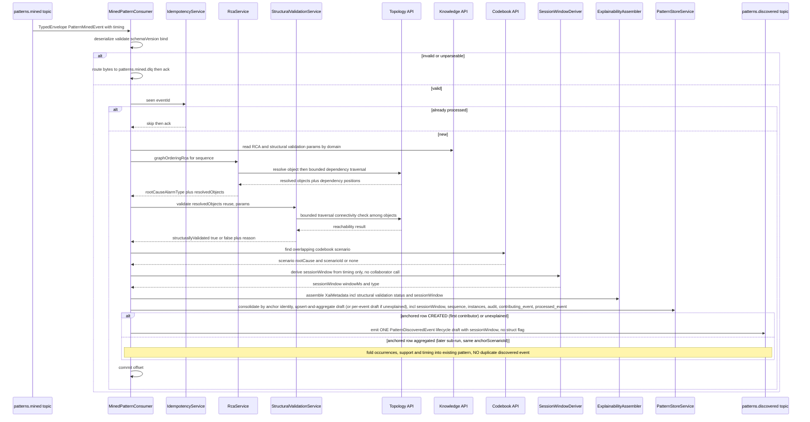

### Flow B — UI approval intent (approve or reject) to patterns.approved

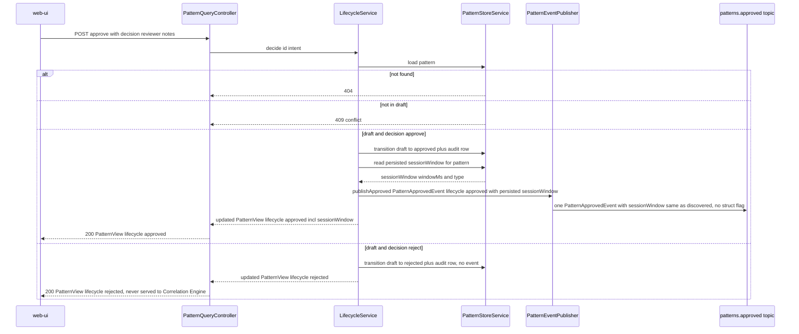

### Flow C — UI edit PATCH on a draft pattern

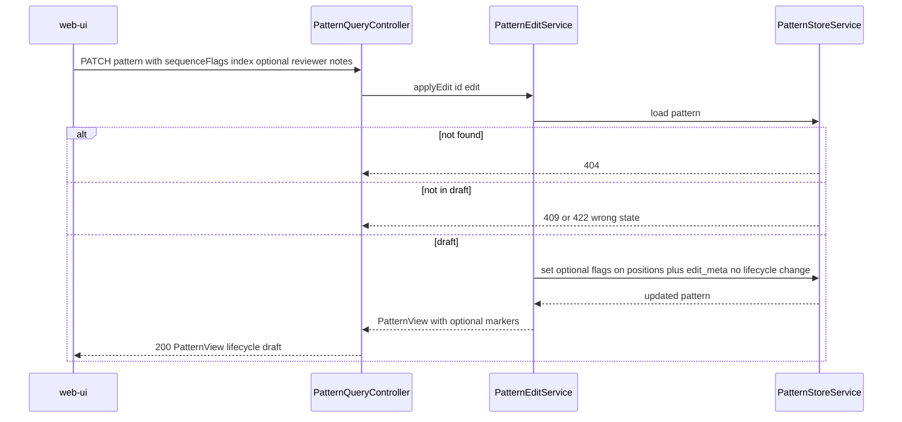

## Algorithm logical flow

Three algorithms run per mined pattern: **RCA** (unchanged), **structural validation** (separate
step), then **session-window derivation** (new, pure over `timing`). RCA and structural validation
read parameters from Knowledge (never hard-coded) and both use the same Topology bounded-traversal
operation; the resolved-objects set is computed once in RCA and reused. Session-window derivation
reads **no** Knowledge/Topology/Codebook input — only the mined `timing` — and is fully
deterministic.

### RCA (unchanged — structural-first ordering plus codebook override)

RCA combines a **graph-ordering rule** (default) with a **codebook override** (authoritative when
a scenario matches), then a **reconciliation classification**.

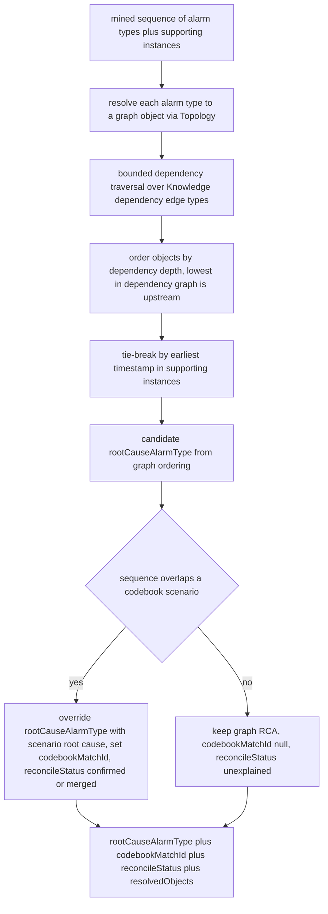

RCA additionally returns the **`resolvedObjects`** map (alarm type to `managedObjectId` plus
dependency position) so the structural-validation step does not re-call Topology for resolution.

**`rootCauseAlarmType` value space — canonical `alarmType` vocabulary token (P2-GAP-04).**
`rootCauseAlarmType` (on `PatternDiscoveredEvent`/`PatternApprovedEvent`, in `PatternView`, and as
the RCA / codebook-override output) is an **`alarmType`-vocabulary token** drawn from the domain's
**Knowledge `alarmTypeVocabulary`** (e.g. `FiberFault`, `LinkDown`, `LOS`, `InterfaceDown`,
`AdjDown`, `LSPDown`) — the **same** value space as `AlarmEvent.alarmType` (the merged canonical
join key, #134) and as the codebook's `predictedSymptoms[].alarmType` / scenario root-cause
`alarmType`. It is the `alarmType` of the **designated root-cause alarm** — **not** a
`probableCause` value (e.g. `lossOfSignal`/`linkDown`) and **not** an `eventType` (X.733 category,
e.g. `communicationsAlarm`). Sharing one token space is exactly what makes pattern↔codebook
reconciliation/override (the codebook overlap test and the RCA override both compare on this token)
and Correlation-Engine RCA tagging join correctly end-to-end.

- **Where it comes from.** Because the merged `AlarmEvent.alarmType` is the single join key, the
  mined `PatternMinedEvent.sequence[]` tokens are themselves `alarmType` vocabulary tokens (the
  Pattern Miner mines on `alarmType` per the merged contract). RCA designates the root-cause alarm
  and emits **that alarm's `alarmType` token verbatim** as `rootCauseAlarmType` — no translation to
  `probableCause` or `eventType`. When the codebook override fires, the scenario's designated
  root-cause `alarmType` (also a vocabulary token) replaces it, staying in the same space.
- **Fixtures/examples.** The repo's frozen `PatternMinedEvent.json` fixture currently shows a
  `probableCause`-style root-cause-ish value (`sequence` of `lossOfSignal`/`linkDown`/`bgpPeerDown`)
  — that is the **pre-#134 value space and is NOT the canonical one**. Per the merged contract, all
  Pattern Manager fixtures and examples (mined-input stubs, persisted `rootCauseAlarmType`,
  `PatternDiscovered`/`PatternApproved` payloads, `PatternView` responses) **use `alarmType`
  vocabulary tokens** (e.g. `rootCauseAlarmType = "FiberFault"`/`"LOS"`/`"LinkDown"`), consistent
  with the codebook signatures and the Correlation Engine. This is the Pattern Manager design
  binding the value space; it adds **no** event-model field and is **not** a contract change (the
  value space was fixed by the merged #134 `alarmType` join key).

### Structural validation (NEW — connected-dependency-path check)

Runs **after** RCA, **before** persistence. It answers a different question from RCA: RCA picks
*which* alarm type is the root cause; structural validation asks whether the pattern's objects are
*topologically coherent at all* — i.e. whether they form a connected sub-path in the dependency
graph or are disjoint (a likely statistical artifact). The outcome only sets a flag; for MVP it
never blocks persistence.

**Connectivity criterion (OQ-3 design decision).** A pattern's resolved objects are
`structurallyValidated = true` iff, treating the dependency edges as an **undirected** graph and
bounding each traversal at `maxHops` (Knowledge-sourced), **every** resolved object is reachable
from a single **common origin** object within `maxHops` — i.e. the objects all lie in one
connected component anchored at the RCA root-cause object, with shared intermediate
(non-alarm-bearing) nodes allowed to bridge them. Concretely: take the RCA root-cause object as
the origin; run a bounded BFS over dependency edges (max depth `maxHops`); the pattern passes iff
the visited set covers all resolved objects. This is the **reachable from a common origin within
max-hops** interpretation, chosen over strict pairwise-sequential adjacency (see Design
alternatives). `strictness` (Knowledge-sourced) selects whether traversal is undirected
(lenient, the MVP default — any dependency relation connects) or strictly directed downstream
from the origin (strict). On failure the `structuralValidationReason` names the disconnected
object(s), e.g. objects R7 not reachable from root FiberSpan within 3 hops.

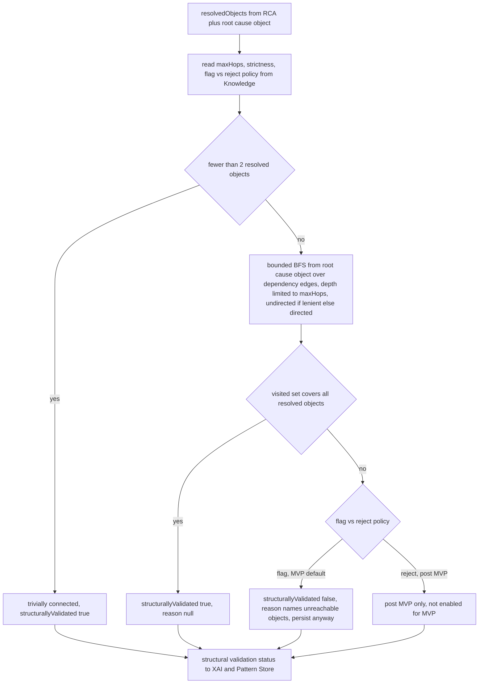

Logical steps:

1. **Reuse resolution** — take the `resolvedObjects` and the root-cause object from RCA; do not
   re-fetch from Topology.
2. **Read params** — `maxHops`, `strictness` (lenient/strict), and `flagVsReject` policy from the
   Knowledge model-params (scoped by domain). For MVP, `flagVsReject = flag` always.
3. **Trivial case** — fewer than two distinct resolved objects: trivially connected,
   `structurallyValidated = true`.
4. **Bounded traversal** — BFS from the root-cause object over the Knowledge dependency edge
   types, capped at `maxHops`; undirected when `strictness = lenient` (MVP default), directed
   downstream when `strictness = strict`. (Implemented via the same `GET /topology/traversal`
   bounded operation RCA uses.)
5. **Coverage test** — pass iff the visited set covers every resolved object.
6. **Outcome** — pass: `structurallyValidated = true`, reason null. Fail under `flag` policy:
   `structurallyValidated = false`, `structuralValidationReason` set, **pattern still persisted as
   draft**. (`reject` is a post-MVP option, not enabled.)

Outputs: `structurallyValidated` (boolean) + `structuralValidationReason` (nullable), folded into
the `XaiMetadata` and persisted.

### Session-window derivation (NEW — OQ-5 resolution)

Runs **once** at intake, after reconcile/override and before persistence, on the `timing`
statistics carried on `PatternMinedEvent`. It produces the operational `sessionWindow`
({`windowMs`, `type`}) the Correlation Engine uses to bound each correlation instance's lifetime —
distinct from the descriptive `timing`. It is a **pure deterministic function** of `timing` only:
no Knowledge/Topology/Codebook input, and the same `timing` always yields the same `sessionWindow`
(criterion 18). The only constants are documented **derivation parameters** (env-overridable, with
the documented defaults below) — they are not Knowledge-sourced business thresholds.

**Timing sub-fields consumed — pinned keys + units (OQ-5 (c); P2-GAP-05).**
`PatternMinedEvent.timing` is, in the frozen `libs/event-model` contract, an **open object**
(`"type":"object", "additionalProperties": true`) with **no declared sub-fields** — it is
loosely typed. The Pattern Manager's derivation therefore **requires** a specific, pinned set of
keys and units, declared here as a **cross-service contract-of-shape** the Pattern Miner must
populate. These are the canonical keys the deriver reads, **all in milliseconds (`Ms` suffix)**:

| Pinned `timing` key (PM requires) | Unit | Role | Required? |
|---|---|---|---|
| `timeframeMs` | integer ms | Observed span from the first to the last alarm of a supporting instance — the dominant signal for window length. | Primary (fallback if absent) |
| `medianInterArrivalMs` | number ms | **Median** gap between consecutive alarms in the sequence — the `cv` denominator. | Primary (drives `type`) |
| `maxInterArrivalMs` | number ms | Largest observed inter-arrival gap — the gap-floor input. | Optional |
| `stddevInterArrivalMs` | number ms | Standard deviation of inter-arrival gaps — the `cv` numerator. | Optional |

> **Producer / consumer agreement on the ms keys (Q11 — the alias map default is now identity).**
> The Pattern Miner's design (`services/pattern-miner/design.md`, P2-GAP-10) now emits
> **exactly** these four canonical sub-fields on the open `timing` object —
> `timeframeMs`, `medianInterArrivalMs`, `maxInterArrivalMs`, `stddevInterArrivalMs`, **all in
> milliseconds**, with **median** (not mean) — and the merged `libs/event-model`
> `PatternMinedEvent.json` fixture carries the same four ms keys. **Producer, consumer, and fixture
> therefore agree on the real key names and units**, so the deriver reads these four keys
> **directly**, with **no aliasing and no seconds-to-ms conversion required** (this matches the
> Pattern Miner's own E2E check that the consumer derives a valid `sessionWindow` "without a
> key-alias remap and without any seconds-to-ms conversion"). Because `timing` is an open object
> (`additionalProperties: true`) and these are the keys both sides emit/read, this is **not a
> schema/contract change** — the deriver simply reads the agreed ms keys.
>
> **`SESSION_WINDOW_TIMING_ALIASES` — default empty (identity).** The legacy
> `{ meanInterArrivalSeconds, stdDevSeconds }` (seconds, mean) shape is **no longer emitted by the
> Pattern Miner**, so the deriver needs **no aliasing for the live contract**. The
> `SESSION_WINDOW_TIMING_ALIASES` config key therefore **defaults to empty `{}` (identity)** — the
> deriver reads `timeframeMs` / `medianInterArrivalMs` / `maxInterArrivalMs` / `stddevInterArrivalMs`
> verbatim. The alias map remains an **escape hatch only**: an operator may, via config, supply a
> mapping (e.g. `{"meanInterArrivalSeconds":"medianInterArrivalMs", "stdDevSeconds":"stddevInterArrivalMs"}`
> plus the `*Seconds`-to-ms `×1000` normalisation) if some non-conformant producer ever emits the
> legacy shape — but by **default no aliasing or unit conversion is applied** because the producer
> and consumer already agree. This makes the documented default correct against the real Miner
> output. The `cv` basis (`cv = stddevInterArrivalMs / medianInterArrivalMs`) and the formula below
> read these same real keys directly.

Missing **optional** keys degrade gracefully via the documented fallbacks below; `timeframeMs` and
`medianInterArrivalMs` (read directly — no aliasing needed by default) are the two relied-on
signals.

**Derivation parameters (documented; defaults; env-overridable — NOT hard-coded magic numbers).**

| Parameter | Default | Meaning |
|---|---|---|
| `SESSION_WINDOW_MARGIN_FACTOR` | `1.5` | Multiplier applied to the observed timeframe so the window is comfortably longer than the typical pattern duration (allows late/jittered alarms to still match). |
| `SESSION_WINDOW_MIN_MS` | `5000` (5 s) | Lower clamp — a window is never shorter than this, so a degenerate or near-instant timeframe still yields a usable window. |
| `SESSION_WINDOW_MAX_MS` | `1800000` (30 min) | Upper clamp — a window never exceeds this, bounding how long a correlation instance is held open. |
| `SESSION_WINDOW_GAP_FLOOR_FACTOR` | `2.0` | For gap-based windows, the window is at least this multiple of `maxInterArrivalMs`, so the idle-gap timeout never closes the instance mid-pattern. |
| `SESSION_WINDOW_CV_FIXED_THRESHOLD` | `0.5` | Coefficient-of-variation cutoff for `type` selection. `cv` **strictly less than** this -> `fixed`; `cv` **greater than or equal to** this (or unknown spread) -> `gap-based`. The boundary is explicit: at exactly `cv = 0.5` the result is `gap-based` (the `< 0.5` test is strict). |

**windowMs formula (OQ-5 (a)) — single deterministic expression.** All inputs in milliseconds
(after the alias/unit normalisation above). The whole formula is:

```
windowMs = clamp(
             max( ceil(timeframeMs × SESSION_WINDOW_MARGIN_FACTOR),
                  ceil(maxInterArrivalMs × SESSION_WINDOW_GAP_FLOOR_FACTOR) ),
             SESSION_WINDOW_MIN_MS,
             SESSION_WINDOW_MAX_MS )
```

Step by step:

1. `marginBase = ceil(timeframeMs × SESSION_WINDOW_MARGIN_FACTOR)` (margin over the observed span).
2. `gapFloor = ceil(maxInterArrivalMs × SESSION_WINDOW_GAP_FLOOR_FACTOR)` when `maxInterArrivalMs`
   is present, else `0` — so an idle-gap timeout never closes the instance mid-pattern.
3. `base = max(marginBase, gapFloor)`.
4. `windowMs = clamp(base, SESSION_WINDOW_MIN_MS, SESSION_WINDOW_MAX_MS)` — always a positive
   integer in the documented bounds.

**Worked example (internally consistent).** Given pinned timing
`timeframeMs = 3000`, `maxInterArrivalMs = 2000`, `medianInterArrivalMs = 1000`,
`stddevInterArrivalMs = 500`, with the default params:

- `marginBase = ceil(3000 × 1.5) = 4500`.
- `gapFloor = ceil(2000 × 2.0) = 4000`.
- `base = max(4500, 4000) = 4500`.
- `windowMs = clamp(4500, 5000, 1800000) = 5000` (raised to the MIN floor).
- `cv = stddevInterArrivalMs / medianInterArrivalMs = 500 / 1000 = 0.5`; the test is **strict**
  `cv < 0.5`, and `0.5 < 0.5` is **false**, so `type = gap-based`.

Result: `sessionWindow = { windowMs: 5000, type: "gap-based" }` — a self-consistent derivation
where the formula, the pinned field names, and the `cv = stddev/median` basis all agree.

**Fallback (OQ-5, insufficient timing).** If `timeframeMs` is absent, zero, or non-positive
(e.g. a single-instance pattern with no observable span), the deriver falls back to
`base = SESSION_WINDOW_MIN_MS` (then still applies the gap floor and clamp). This guarantees a
valid `windowMs greater than 0` for every pattern — the derivation never fails or emits a
non-positive window. The fallback is logged at DEBUG.

**type selection (OQ-5 (b)).** Compute the coefficient of variation of inter-arrivals
**`cv = stddevInterArrivalMs / medianInterArrivalMs`** (standard deviation over **median** — the
consistent basis) when both keys are present and `medianInterArrivalMs greater than 0`:

- `cv` **strictly less than** `SESSION_WINDOW_CV_FIXED_THRESHOLD` -> **`fixed`** (alarms arrive
  tightly periodically, so a fixed-duration window from instance start is appropriate).
- `cv` **greater than or equal to** the threshold, **or** the spread is unknown
  (`stddevInterArrivalMs` absent) -> **`gap-based`** (the default — alarms are bursty/variable, so
  an idle-gap window that extends on each new matching alarm best fits the pattern, and is the safe
  default when spread is unknown). The boundary is explicit and deterministic: at exactly
  `cv = 0.5` (with the default `0.5` threshold) the strict `< 0.5` test fails, so the type is
  **`gap-based`**.

`gap-based` is the documented **default** because mined alarm storms are typically bursty and
variable, and because choosing it when spread is unknown avoids prematurely closing a correlation
instance.

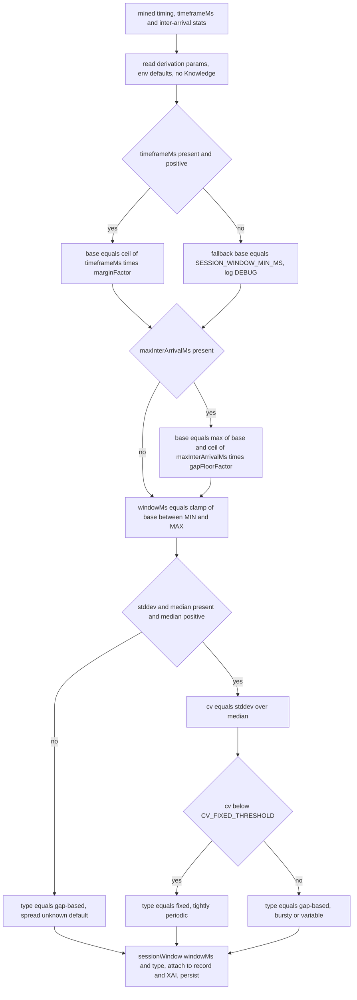

Logical steps:

1. **Read params** — derivation parameters from env (documented defaults above); **no** Knowledge
   call.
2. **Compute base window** — `ceil(timeframeMs × marginFactor)`; if `timeframeMs` is missing or
   non-positive, use the `SESSION_WINDOW_MIN_MS` fallback.
3. **Apply gap floor** — if `maxInterArrivalMs` is present, raise the base to at least
   `ceil(maxInterArrivalMs × gapFloorFactor)`.
4. **Clamp** — `windowMs = clamp(base, MIN, MAX)`; always a positive integer in bounds.
5. **Select type** — `cv = stddev / median` (when available): `fixed` if `cv` below the threshold,
   else `gap-based`; `gap-based` is the default when spread is unknown.
6. **Output** — `sessionWindow = {windowMs, type}`, folded into `XaiMetadata`, persisted on the
   pattern record, and reused verbatim by both emitted events.

**Determinism.** Every input is a value read from the consumed event plus fixed env constants; no
clock, randomness, or external call participates. The same `timing` therefore always produces the
same `sessionWindow` (criterion 18). Derivation runs **once** at intake; approval and read never
re-derive — they read the persisted value (criterion 20).

**Pinned shape — producer and consumer agree (P2-GAP-05 / Q11).** The deriver's required `timing`
keys are **pinned** above: `timeframeMs` + `medianInterArrivalMs` (primary, ms, **median**) and
optional `maxInterArrivalMs` + `stddevInterArrivalMs` (ms). The Pattern Miner (`pattern-miner`
design, P2-GAP-10) **now emits exactly these four ms keys** with **median** (not mean), and the
merged `libs/event-model` `PatternMinedEvent.json` fixture carries the same four ms keys — so the
producer, the consumer, and the contract fixture **agree** on key names and units. The deriver
therefore reads `timeframeMs` / `medianInterArrivalMs` / `maxInterArrivalMs` / `stddevInterArrivalMs`
**directly**, with **no aliasing and no seconds-to-ms conversion by default**
(`SESSION_WINDOW_TIMING_ALIASES` defaults to empty/identity — see above). The `cv` basis is
`cv = stddevInterArrivalMs / medianInterArrivalMs` and the `windowMs` formula reads these same real
keys, so the documented derivation, the worked example, and the configured default are all correct
against the real Miner output. Because `timing` stays an **open object** (`additionalProperties:
true`) and these are the keys both sides emit/read, **no event-model field/schema change is
introduced** — no new field, no `additionalProperties` flip. The alias map remains only an
optional escape hatch for a hypothetical non-conformant producer; under the live contract it is a
no-op. The insufficient-timing fallback (below) still covers thin `timing`. This fully resolves
OQ-5.

### [ANCHOR-CONSOL] Anchor-identity consolidation (NEW — the P2 over-count fix)

**Problem restated.** With the Miner's trail-aligned batch cap, one fault-origin (one
`provenance.anchorScenarioId`) can be mined in **several sub-runs** and emit several
`PatternMinedEvent`s. Under the previous per-event `patternId`, each became its own draft — an
over-count. (This latent over-count exists even without batching: any run that emits more than one
mined sequence for one fault-origin over-counts.) Consolidation collapses them to **one** Pattern
Store pattern per fault-origin identity.

**Two independent levels of collapse — do not conflate them.**
1. **`eventId` idempotency (unchanged).** A *re-delivered copy of the same mined event* (same
   `eventId`, Kafka at-least-once) is dropped by the `processed_event` gate *before* enrichment —
   never counted at all.
2. **[ANCHOR-CONSOL] anchor consolidation (new).** *Different* mined events (distinct `eventId`s)
   that share one `anchorScenarioId` within a `(domain, snapshotId, codebookVersion)` scope are
   folded into one anchored `pattern` row and their occurrences/support aggregated.

**Identity + scope.** The consolidation key is `(domain, snapshotId, codebookVersion,
anchorScenarioId)`. Scoping to `snapshotId` + `codebookVersion` means a **new topology snapshot or a
recompiled codebook** re-mints identity — patterns learned under different graph/codebook contexts do
**not** silently merge (correct: they are different fault models). Unexplained events
(`anchorScenarioId == null/absent`) are **excluded** from anchor consolidation and keep the per-event
identity — an unexplained cascade has no fault-origin to consolidate on, and merging distinct
unexplained cascades would fabricate a pattern.

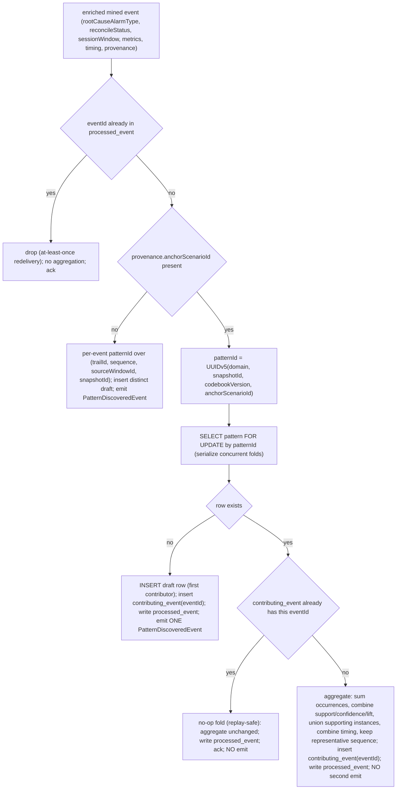

**Aggregation rules (define exactly how).** Let the row already aggregate `n` contributing events
with instance count `N = sum occurrences`; a new event `e` contributes `n_e` occurrences (its
`instanceCount` from provenance/supporting-instances, at least 1).
- **occurrences / instanceCount:** `instance_count := N + n_e` (a plain **sum** — the total observed
  occurrences of the fault-origin across sub-runs).
- **support:** the Miner's `support` is a per-sub-run fraction, so raw fractions are **not** additively
  comparable. Aggregate as an **occurrence-weighted mean**: `support := (support_old * N + support_e *
  n_e) / (N + n_e)` — the corpus-level support of the fault-origin, weight by how many occurrences each
  contributor saw. Deterministic and order-independent for the final value.
- **confidence:** same **occurrence-weighted mean** as support (a probability-like ratio; weight by
  occurrences).
- **lift:** **occurrence-weighted mean** as well (a ratio metric; a weighted mean keeps it comparable
  and avoids double-counting). Documented rationale: for MVP a weighted mean is a defensible,
  order-independent combiner; a full re-derivation of lift from joint/marginal counts is a post-MVP
  refinement (the raw per-sub-run counts are not carried on the frozen event, so exact re-derivation
  is not available without a contract change — explicitly **not** requested).
- **timing:** combine the ms `timing` sub-keys as an **occurrence-weighted mean** of
  `timeframeMs`/`medianInterArrivalMs`/`maxInterArrivalMs`(**max** for max)/`stddevInterArrivalMs`, then
  re-run `SessionWindowDeriver.derive(combinedTiming)` so the persisted `sessionWindow` reflects the
  **combined** tempo. Because the deriver is a pure function of `timing`, the recomputed `sessionWindow`
  is deterministic for a given final aggregate.
- **supporting instances:** **union** the `supportingInstances[]` across contributors (dedup on
  `sourceWindowId`), so XAI shows all observed occurrences.
- **representative sequence:** keep **one** representative — the sequence from the contributor with the
  highest occurrence-weighted support, tie-broken by longest sequence then lexicographic (deterministic).
  All contributors share the same `anchorScenarioId`, so their sequences are variants of one cascade;
  the representative is that fault-origin's canonical signature. The alternative (union/superset sequence)
  is rejected — see Design alternatives.
- **rootCauseAlarmType / codebookMatchId / reconcileStatus / structurallyValidated:** taken from the
  **first (create) contributor** and left stable across folds (they are properties of the fault-origin
  identity, already agreed across contributors since they share the anchor + snapshot + codebook); a
  later fold does not flip them. (If a later contributor disagrees — should not happen within one
  anchor+snapshot+codebook scope — the create value wins and the divergence is logged at WARN for audit.)

**Idempotency + replay safety (the crux).** The fold is guarded by `contributing_event.event_id`
(`INSERT ... ON CONFLICT DO NOTHING`) **and** the enclosing `processed_event.event_id` gate, both in
**one DB transaction** with the `SELECT ... FOR UPDATE` on the pattern row. So:
- a **re-delivered** mined event (same `eventId`) is dropped by `processed_event` — never folded;
- even if it slipped past (belt-and-braces), `contributing_event` `ON CONFLICT DO NOTHING` makes the
  fold a **no-op** — the aggregate is unchanged;
- because occurrences are a **sum over the distinct contributing `eventId` set**, and each `eventId`
  can contribute **at most once**, the final aggregate is a deterministic function of the *set* of
  contributing events — **order-independent and double-count-free** under any at-least-once replay.

This satisfies "same `anchorScenarioId` across sub-runs consolidates to ONE Pattern Store pattern with
summed occurrences" and "idempotent re-delivery does not double-count".

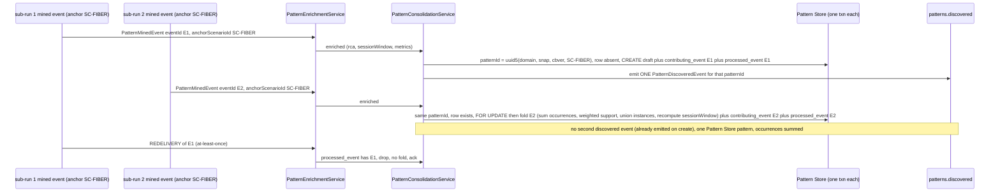

## Seed data & examples

N/A — the Pattern Manager owns no seed/fixture/sample-data generation. Test fixtures
(`PatternMinedEvent` samples, collaborator stub responses, Topology traversal mock graphs for
connected vs. disjoint cases) live in the test sources, not as shipped seed data.

## UI wireframes

N/A — the web-ui renders the pattern-review/XAI views (Cytoscape/charts per architecture section
6.11), including the structural-validation flag (objects not dependency-connected — possible
statistical artifact). The Pattern Manager only serves the structured data
(`structurallyValidated` + `structuralValidationReason`) via its read API.

## Error handling

| Failure mode | Handling | Surfaced as |
|---|---|---|
| Unparseable/poison `patterns.mined` (bad JSON, missing required field e.g. `sequence`, `additionalProperties` violation, bind failure) | `EventCodec.deserialize` throws; consumer publishes original bytes plus an `error` header to **`patterns.mined.dlq`**, then acks and continues to the next message — never restarts, never silently drops | DLQ record; ERROR log with `eventId` if extractable |
| Unknown major `schemaVersion` (2 and above) | `SchemaVersionPolicy.check` rejects in the codec, treated as poison, routed to `patterns.mined.dlq` | DLQ record; ERROR log |
| Duplicate `eventId` (Kafka at-least-once redelivery) | `IdempotencyService` finds the `eventId` in `processed_event`, skips enrichment, no second pattern row, no fold, acks | INFO log duplicate eventId skipped; exactly one pattern row; aggregate unchanged |
| **[ANCHOR-CONSOL] Same `anchorScenarioId` in a later sub-run (distinct `eventId`)** | Not an error — `PatternConsolidationService` folds it into the existing anchored row: `SELECT ... FOR UPDATE`, `contributing_event ON CONFLICT DO NOTHING`, aggregate occurrences/support/timing, recompute `sessionWindow`; **no** duplicate `PatternDiscoveredEvent`. Concurrent folds of one anchor serialize on the row lock | INFO log `pattern_consolidated` (patternId, anchorScenarioId, contributors, instanceCount); one pattern row |
| **[ANCHOR-CONSOL] Contributing event races / partial-txn failure mid-fold** | The fold (row lock + `contributing_event` insert + aggregate + `processed_event` insert) is **one DB transaction**; a failure rolls it back, the offset is not committed, and the mined event is redelivered and re-folded safely (the `contributing_event` guard makes the retry idempotent) | ERROR log; no offset commit; safe replay |
| **[ANCHOR-CONSOL] Enriched anchored event whose create-contributor metadata (rootCause/reconcile) would diverge on a later fold** | Create-contributor values win and are held stable across folds (they are properties of the shared anchor+snapshot+codebook identity); a divergent later fold is logged for audit but does not flip persisted RCA | WARN log `anchor_fold_divergence`; aggregate metrics still fold; RCA/reconcile stable |
| Topology / Codebook / Knowledge **unavailable or 5xx** for a well-formed event (including the structural-validation traversal call) | Retry with bounded exponential backoff (RestClient plus retry policy); on exhaustion **do not DLQ** (the event is valid) — leave the offset uncommitted so the message is redelivered after the dependency recovers; metric `pm_collaborator_failures_total` increments | WARN/ERROR log; no offset commit; consumer lag visible in metrics |
| Codebook returns **no overlapping scenario** (algorithm no-match) | Not an error — `reconcileStatus = unexplained`, `codebookMatchId` null, graph-ordering RCA retained | INFO log; pattern persisted as draft |
| Topology cannot resolve an alarm type to an object | RCA falls back to **earliest-timestamp** tie-break alone for that element; if no object resolves at all, the graph-ordering candidate defaults to the earliest-timestamp alarm type; logged. Structural validation treats an unresolved object as **not connected** (it cannot be in the visited set), contributing `structurallyValidated = false` with a reason naming it | WARN log; pattern still persisted |
| **Structural validation fails** (objects not dependency-connected within max-hops) | **Not an error** under MVP flag policy — persist the pattern with `structurally_validated = false` and a non-null reason; surfaced in XAI for operator review | INFO log structural validation outcome; pattern persisted as draft |
| **Session-window timing insufficient** (e.g. `timeframeMs` absent/zero, single-instance pattern) | **Not an error** — the deriver applies the documented fallback (`base = SESSION_WINDOW_MIN_MS`, then gap-floor + clamp), always yielding a valid `windowMs greater than 0` and a valid `type` (`gap-based` default). Derivation never throws and never blocks persistence | DEBUG log session-window derivation result incl. fallback note; pattern persisted with a valid `sessionWindow` |
| `approve`/`reject`/`deprecate`/`edit` on **wrong lifecycle state** | `LifecycleService`/`PatternEditService` reject: not `draft` for approve/reject/edit gives `409` (including any decision on an already `approved`/`rejected`/`deprecated` pattern — `rejected` is terminal); invalid decision/positions/missing reviewer gives `422` | Structured JSON error body; no state change, no event emitted |
| **Reject decision** on a `draft` pattern (Q1) | **Not an error** — `LifecycleService.decide` transitions `draft` to the terminal `rejected` state, writes a `draft` to `rejected` audit row, emits **no** event; the pattern is excluded from `GET /patterns?lifecycle=approved` and surfaced under `GET /patterns?lifecycle=rejected` for audit | INFO log reject outcome; `200 PatternView` lifecycle `rejected`; no `PatternApprovedEvent` |
| `GET /patterns/{patternId}` unknown id | `404` with structured error body | JSON error |
| Invalid `lifecycle`/`sort` query enum | `400` with structured error body | JSON error |
| Off-contract outbound event (in-memory POJO violates schema) | `EventCodec.serialize` validates before send and throws, so the publish aborts and the message is not emitted | ERROR log; alerted via metric |

Nothing is ever silently dropped: poison messages go to the DLQ, transient dependency failures
trigger redelivery, validation failures return a structured error, and a structurally-invalid
pattern is persisted-and-flagged (never discarded) for MVP.

## Design alternatives

| Consideration | Alternatives considered | Chosen plus rationale |
|---|---|---|
| **Structural validation as a step** | (A) fold the connectivity check into RCA; (B) a separate step after RCA, before persist, reusing RCA's resolved objects | **B** — the spec mandates structural validation be **distinct** from RCA (RCA designates the root cause; validation checks whole-pattern coherence). A separate `StructuralValidationService` keeps RCA unchanged, makes the flag independently testable, and lets it reuse the `ResolvedObject[]` RCA already produced (no redundant Topology fetch). |
| **Connectivity criterion** (OQ-3) | (A) strict pairwise-sequential adjacency (each object directly depends on the next in the mined order); (B) reachable from a common origin (RCA root) within max-hops via dependency edges, shared intermediate nodes allowed | **B** — real dependency paths bridge alarm-bearing objects through intermediate nodes (e.g. a fiber span and an LSP relate through a link and an interface), so strict adjacency (A) would over-reject legitimate patterns. Reachable from a common origin within max-hops matches a connected dependency path while tolerating intermediate hops, and is cheap (one bounded BFS from the root object). |
| **Directed vs undirected traversal** | (A) strictly directed downstream from origin; (B) undirected; (C) Knowledge-selectable | **C with undirected as the MVP default** — `strictness` param chooses; lenient/undirected is the MVP default because a mined sequence may list alarms in an order that does not match strict dependency direction, and we want to flag only genuinely disjoint sets. Strict directed remains available via Knowledge for tightening later — no hard-coded choice. |
| **Reject vs flag on failure** (OQ-4) | (A) hard auto-reject (discard, do not persist); (B) flag-and-persist (`structurallyValidated:false`) | **B for MVP** — preserves operator oversight (human-in-the-loop approval already exists) and avoids discarding possibly-real patterns; the spec fixes the MVP default as flag. Auto-reject is a post-MVP option gated behind the Knowledge `flagVsReject` policy and a human product decision; it is **not** enabled and would change acceptance criteria. |
| **Where the flag lives** | (A) add `structurallyValidated` to `PatternDiscoveredEvent`/`PatternApprovedEvent`; (B) internal only (Pattern Store plus read API) | **B** — both events are frozen (`additionalProperties:false`); adding a field is a contract change. The spec explicitly keeps the flag internal, mirroring how the operator-edit metadata is handled. The web-ui reads it via the read API; downstream consumers do not need it. |
| **Reusing RCA's Topology resolution** | (A) structural validation re-resolves objects itself; (B) RCA returns `resolvedObjects`, validation reuses them | **B** — the spec says reuse the objects already resolved during RCA; re-fetching would double Topology load and risk inconsistency between the two steps. RCA's return type is extended with the resolved-objects map. |
| **Session-window source of truth** (OQ-5) | (A) derive from a Knowledge policy/param; (B) derive deterministically from the mined `timing` only | **B** — the spec mandates session-window be **data-driven from the mined timing with no Knowledge input** (kept distinct from the Knowledge-sourced structural-validation params). A pure `timing`-only function is deterministic and testable, and keeps the window an emergent property of the observed pattern rather than an authored knob. |
| **windowMs formula** (OQ-5 (a)) | (A) a multiple of median inter-arrival; (B) a margin over the observed timeframe, gap-floored by max inter-arrival, clamped; (C) a fixed constant | **B** — the timeframe is the natural span the window must cover end-to-end; a margin (`1.5x`) tolerates jitter/late alarms, the max-inter-arrival gap floor (`2x`) stops an idle-gap timeout closing the instance mid-pattern, and the MIN/MAX clamp bounds degenerate/huge values. (A) alone ignores total span; (C) is not data-driven. All constants are documented, env-overridable derivation params — not hard-coded thresholds. |
| **type selection** (OQ-5 (b)) | (A) always `gap-based`; (B) always `fixed`; (C) choose from inter-arrival regularity (coefficient of variation) with `gap-based` default | **C** — bursty/variable storms suit a `gap-based` window that extends on each match; tightly periodic patterns suit a `fixed` window. The coefficient-of-variation cutoff (`0.5`) classifies them deterministically; `gap-based` is the default when spread is unknown (safest — avoids closing an instance early). Always-one-type (A/B) discards a real signal already present in `timing`. |
| **Insufficient-timing fallback** (OQ-5) | (A) fail/DLQ the event; (B) emit a non-positive/zero window; (C) documented `SESSION_WINDOW_MIN_MS` fallback | **C** — a valid mined pattern must not be lost just because its timeframe is unobservable; emitting a zero/negative window would violate the schema (`windowMs` must be a positive integer in practice). The MIN-MS fallback always yields a usable, schema-valid window and the event still flows. |
| **When derivation runs / event consistency** (criterion 20) | (A) derive at intake and persist, reuse for both events; (B) re-derive at approval time | **A** — deriving once at intake and persisting guarantees the approved event's `sessionWindow` is byte-identical to the discovered event's (criterion 20), avoids a second computation, and makes the persisted record the single source of truth. (B) risks drift if derivation params change between discovery and approval. |
| **sessionWindow editability** (OQ-6) | (A) operator-editable via `PATCH`; (B) derived and read-only in MVP | **B** — the spec fixes `sessionWindow` as derived and read-only for MVP; making it editable would add an editable field and likely a new contract on `PatternApprovedEvent`, a spec-level change requiring human approval (OQ-6). The `PATCH` placeholder edits only `optional` markers; it never touches `sessionWindow`. |
| `patternId` assignment | (A) random UUIDv4 per consume; (B) DB sequence; (C) deterministic UUIDv5 over mining provenance `(trailId, sequence, sourceWindowId, snapshotId)`; (D) **[ANCHOR-CONSOL] anchor-aware**: UUIDv5 over `(domain, snapshotId, codebookVersion, anchorScenarioId)` for anchored patterns, UUIDv5 over `(trailId, sequence, sourceWindowId, snapshotId)` for unexplained | **D** (evolves C) — (C) mints a distinct id per mined event, so one fault-origin mined in several sub-runs over-counts as several drafts. Keying anchored patterns on the **anchor identity** makes all sub-runs of one fault-origin map to one row (consolidation) while still being deterministic + redelivery-idempotent (criterion 10). Unexplained patterns keep the per-event identity (no anchor to collapse on). |
| **[ANCHOR-CONSOL] consolidation scope** | (A) by `anchorScenarioId` alone; (B) by `(domain, snapshotId, codebookVersion, anchorScenarioId)`; (C) global by `anchorScenarioId` across all snapshots/codebooks | **B** — scenario ids are only unique within a codebook/snapshot; (A)/(C) would merge fault models learned under different topology snapshots or recompiled codebooks — different fault contexts that must stay distinct. Scoping to snapshot + codebook version re-mints identity correctly when the graph/codebook changes. |
| **[ANCHOR-CONSOL] unexplained consolidation** | (A) also consolidate unexplained by some key; (B) each unexplained cascade stays distinct (per-event identity) | **B** — an unexplained cascade has no fault-origin anchor; merging distinct unexplained cascades would fabricate a pattern that no scenario explains and hide genuinely different unexplained shapes. Each stays its own draft for operator review. |
| **[ANCHOR-CONSOL] metric aggregation** | (A) sum raw per-sub-run support/confidence/lift; (B) occurrence-weighted mean (sum only occurrences/instances); (C) re-derive lift/confidence from raw joint/marginal counts | **B** — occurrences/instances are additive (a plain sum = total observed), but support/confidence/lift are *ratios* — summing them is meaningless. An occurrence-weighted mean gives the corpus-level value and is order-independent (deterministic on the final contributor set). (C) needs raw counts not carried on the frozen event — unavailable without a contract change we explicitly do **not** request. |
| **[ANCHOR-CONSOL] representative sequence on aggregation** | (A) keep one representative (highest weighted-support contributor, tie longest then lexicographic); (B) union/superset of all contributors' sequences | **A** — all contributors share one `anchorScenarioId`, so their sequences are variants of one canonical cascade; a single representative is that fault-origin's signature. (B) risks manufacturing a superset chain never actually observed, distorting RCA and CE matching. Deterministic tie-break keeps it stable under any arrival order. |
| **[ANCHOR-CONSOL] emit policy on aggregation** | (A) emit `PatternDiscoveredEvent` only on create (first contributor); (B) re-emit on every material aggregate change; (C) emit per mined event (status quo, over-counts) | **A** for MVP — one fault-origin yields exactly one discovered event (the review unit is the pattern, not each sub-run). (C) is the bug being fixed. (B) (re-emit on material change) is noted as a post-MVP option if the UI needs live occurrence updates; it needs consumer-side idempotency on `patternId` and is not required for MVP. |
| **[ANCHOR-CONSOL] relationship to codebook MERGED** | (A) treat anchor-consolidation as the same mechanism as `ReconciliationService.MERGED`; (B) keep them distinct | **B** — `MERGED` is a *reconciliation classification* (a mined pattern's complementary appendage folded into a matched **codebook scenario** at the symptom-chain level, deciding codebook explanation). Anchor-consolidation is a *persistence-identity* collapse (multiple mined events for one fault-origin folded into one Pattern Store row), upstream of and orthogonal to reconciliation. A consolidated row is still independently classified CONFIRMED/MERGED/UNEXPLAINED. Conflating them would wrongly gate consolidation on a codebook match (anchored-but-unreconciled patterns still need consolidating). |
| **[ANCHOR-CONSOL] fold idempotency mechanism** | (A) `processed_event` (`eventId`) only; (B) `processed_event` + `contributing_event` guard + row lock, one txn | **B** — `processed_event` already stops a re-delivered *same* event, but the fold must also be double-count-safe against any belt-and-braces replay: `contributing_event ON CONFLICT DO NOTHING` guarantees each `eventId` folds at most once, so the aggregate is a deterministic function of the distinct contributing-event set; the `SELECT ... FOR UPDATE` serializes concurrent folds of one anchor. |
| Idempotency mechanism | (A) `eventId` set only; (B) deterministic `patternId` upsert only; (C) both | **C** — `processed_event` short-circuits re-processing (avoids re-calling collaborators and re-emitting `patterns.discovered`); the UUIDv5 upsert makes the DB write itself idempotent as a safety net. |
| RCA override precedence | (A) graph ordering wins; (B) codebook always wins when present; (C) confidence-weighted blend | **B** — the spec mandates the codebook scenario is authoritative when the sequence overlaps; graph ordering is the default only when no scenario matches. |
| DLQ vs retry for collaborator-down | (A) DLQ on any failure; (B) retry-and-redeliver for transient, DLQ only for poison | **B** — a valid event blocked by a transient dependency outage (including the structural-validation traversal) is not poison; DLQ would lose it. |
| Edit placeholder representation | (A) new event field; (B) `optional` flags on `sequence_element` plus internal `edit_meta`, never on the event | **B** — the frozen `PatternApprovedEvent` has `additionalProperties:false`; the spec keeps edit metadata internal. |
| **PATCH edit body shape** (P2-GAP-06) | (A) `optionalAlarms: integer[]` (flat positions); (B) `sequenceFlags: [{ index, optional }]` (per-position objects) | **B** — frozen as THE body. It is the shape the web-ui already sends, and it is more expressive/extensible: it can both set and clear `optional` per position (a flat `int[]` only sets-true and is ambiguous about clears) and can carry future per-element flags without another contract change. The web-ui aligns to it; `sessionWindow` stays non-editable. |
| **Source of per-pattern `trailId` for the CE** (P3-G1) | (A) add `trailId` to `PatternApprovedEvent`; (B) surface `trailId` on the `PatternView` read API | **B** — the events are frozen (`additionalProperties:false`); adding `trailId` is a contract change. The Pattern Manager already has `trailId` from `PatternMinedEvent.trailId` (persisted as `pattern.trail_id`), so it exposes it on `PatternView` and the CE reads it at bootstrap from `GET /patterns?lifecycle=approved`. Solves the CE's `(trailId, patternId)` keying with no event-model change. |
| **`rootCauseAlarmType` value space** (P2-GAP-04) | (A) `probableCause`-style token (`lossOfSignal`); (B) X.733 `eventType` category; (C) the canonical `alarmType` vocabulary token | **C** — must be the same join key as `AlarmEvent.alarmType` (merged #134) and the codebook `predictedSymptoms[].alarmType`, or pattern↔codebook reconciliation/override and CE RCA tagging silently fail to join. RCA emits the designated root-cause alarm's `alarmType` token verbatim; fixtures/examples use vocab tokens. No new field — the value space was fixed by the merged contract. |
| **`timing` sub-field shape for derivation** (P2-GAP-05 / Q11) | (A) read whatever the open `timing` object happens to contain; (B) pin the four required ms keys (`timeframeMs`, `medianInterArrivalMs`, optional `maxInterArrivalMs`/`stddevInterArrivalMs`, `cv = stddev/median`) as the contract-of-shape and read them directly, with the alias map as an opt-in escape hatch | **B** — `PatternMinedEvent.timing` is an open object with no declared sub-fields, and the Pattern Miner now emits **exactly** these four ms keys (median, not mean), matched by the merged `PatternMinedEvent.json` fixture. Producer, consumer and fixture agree, so the deriver reads the ms keys **directly with no aliasing or seconds-to-ms conversion** — `SESSION_WINDOW_TIMING_ALIASES` defaults to empty/identity, so the documented default is correct against the real Miner output; the alias map remains only as an optional escape hatch for a hypothetical non-conformant producer. Pinning the keys keeps the derivation deterministic and testable. No event-model field/schema change (the open `timing` object is unchanged). |
| Pagination (OQ-2 / issue 46) | (A) cursor-based; (B) offset-based `limit`/`offset` with a `PatternPage` envelope | **B** — the pattern corpus is small (human-reviewable counts), the UI needs `total` for review progress, offset paging is simpler for the table. The envelope `{ items, total, limit, offset }` is frozen as SSoT (P2-GAP-08); consumers read `.items`, never a bare array. |
| Approval plus emit atomicity | (A) emit then transition; (B) transition then emit in the same action; (C) transactional outbox | **B** for the MVP — transition then publish in the same action; outbox (C) is post-MVP hardening if exactly-once across DB and Kafka becomes mandatory. |
| Kafka offset commit | (A) auto-commit; (B) manual ack after persist plus emit | **B** — manual ack guarantees the pattern is persisted and `patterns.discovered` emitted before the offset advances; a crash mid-processing redelivers and idempotency dedupes. |
| **Reject decision outcome** (Q1) | (A) leave the reject with no persisted state change (just record notes, lifecycle stays `draft`); (B) reuse the existing `deprecated` terminal state for a reject; (C) add a distinct terminal `rejected` lifecycle state | **C** — the approval-intent enum already exposes `reject`, so the reject must have a concrete persisted outcome. (A) is unacceptable — a rejected pattern would stay `draft` and keep showing up in the review queue, with no terminal record. (B) conflates two different operator judgements: `deprecated` means a previously-approved (or draft) pattern is being retired, whereas a reject means a draft was judged invalid at review and should never be served — collapsing them loses audit meaning and makes the review queue ambiguous. **(C)** adds `rejected` to the `pattern.lifecycle` CHECK constraint and the state machine (`draft` to `rejected`, terminal); it is never served to the Correlation Engine (`GET /patterns?lifecycle=approved` excludes it) and is visible via `GET /patterns?lifecycle=rejected` for audit. It emits **no** Kafka event (reject produces no `PatternApprovedEvent`), so the frozen events are unchanged and there is **no contract change** — `rejected` is purely internal Pattern-Store state plus a read-API value. |

## Test plan

### Acceptance criterion to test (unit/contract — JUnit 5)

| # | Acceptance criterion | Test | Asserts |
|---|---|---|---|
| 1 | Fiber-cut sequence LOS LinkDown AdjDown LSPDown; Topology stub maps LOS to a FiberSpan with no upstream dependency plus earliest timestamp gives `rootCauseAlarmType = LOS` | `RcaServiceTest.graphOrderingPicksLowestDependencyEarliestTimestamp` | Persisted pattern `rootCauseAlarmType` equals LOS given the Topology mock plus earliest timestamp; **LOS is an `alarmType` vocabulary token** (the assertion uses canonical-vocab tokens, P2-GAP-04) |
| 1b (P2-GAP-04) | `rootCauseAlarmType` is an `alarmType`-vocabulary token (same space as `AlarmEvent.alarmType` and codebook `predictedSymptoms[].alarmType`), NOT a `probableCause` value nor an `eventType` | `RcaServiceTest.rootCauseAlarmTypeIsAlarmTypeVocabularyToken` | Given a mined `sequence[]` of vocab tokens (e.g. `[LOS, LinkDown, ...]`), the designated `rootCauseAlarmType` is one of those `sequence` tokens (a member of the Knowledge `alarmTypeVocabulary` test fixture), never a `probableCause`/`eventType` string; under codebook override the scenario root-cause token is also a vocab token. Persisted + emitted value equals an `alarmType` token |
| 2 | Sequence overlaps codebook scenario designating LineCardFault (Codebook stub returns scenario with non-null id), so override RCA, `rootCauseAlarmType = LineCardFault`, `codebookMatchId` set | `RcaServiceTest.codebookOverrideReplacesGraphRcaAndSetsMatchId` | `rootCauseAlarmType` equals LineCardFault and `codebookMatchId` equals scenarioId (overrides graph candidate) |
| 3 | High `support`, low `lift` spurious co-occurrence, persisted with `codebookMatchId` absent (no model explanation), `lift` equals the low event value | `ReconciliationServiceTest.noCodebookMatchFlagsUnexplainedPreservesLift` | `codebookMatchId` is null, `reconcileStatus` is unexplained, persisted `lift` equals the event lift |
| 4 | Any processed event gives all XAI fields present: `instanceCount` greater than 0, `support`, `confidence`, `lift`, `timing` (median inter-arrival plus timeframe), `codebookMatchId` (null if none), `structurallyValidated` (boolean), `structuralValidationReason` (non-null when false), `supportingInstances` (may be empty) | `ExplainabilityAssemblerTest.assemblesAllRequiredXaiFieldsInclStructuralValidation` | All fields populated; `instanceCount` greater than 0; `timing` has both keys; `structurallyValidated` present; reason non-null exactly when false; `supportingInstances` list present, possibly empty |
| 5 | Processed without approval gives `lifecycle = draft` and is returned by `GET /patterns?lifecycle=draft` | `PatternQueryControllerTest.draftPatternReturnedByLifecycleDraftFilter` | Persisted `lifecycle` is draft; the filter response contains the `patternId` |
| 6 | Emitted `PatternDiscoveredEvent` deserializes via Java binding; required fields non-null incl. `sessionWindow`; `lifecycle` is draft (and carries no structural-validation field) | `PatternEventPublisherTest.discoveredEventRoundTripsAndIsDraftNoStructField` | `EventCodec.deserialize` succeeds; `patternId`/`sequence`/`rootCauseAlarmType`/`support`/`confidence`/`lift`/`timing`/`sessionWindow`/`lifecycle` non-null; `lifecycle` equals draft; serialized JSON has no `structurallyValidated` key |
| 7 | `POST /approve` with approve on a `draft` pattern gives lifecycle approved plus exactly one `PatternApprovedEvent` in the same action | `LifecycleServiceTest.approveTransitionsToApprovedAndEmitsExactlyOneEvent` | Store `lifecycle` is approved; exactly one record on `patterns.approved` (mock producer captor) |
| 22 (Q1) | `POST /approve` with `decision = reject` on a `draft` pattern transitions it to the terminal `rejected` state, records the transition timestamp, emits **no** `PatternApprovedEvent`, the pattern is **not** returned by `GET /patterns?lifecycle=approved`, and is returned by `GET /patterns?lifecycle=rejected` | `LifecycleServiceTest.rejectTransitionsToRejectedTerminalNoEventNotServed` | After `decision = reject` on a draft, store `lifecycle` is `rejected`; a `lifecycle_transition` row `draft` to `rejected` with non-null `transitioned_at`; **zero** records on `patterns.approved` (mock producer captor); `GET ?lifecycle=approved` excludes the `patternId`; `GET ?lifecycle=rejected` includes it; a subsequent approve/reject/deprecate/edit on the rejected pattern returns `409` (terminal) |
| 8 | Emitted `PatternApprovedEvent` deserializes via Java binding; `lifecycle` is approved; required fields non-null incl. `sessionWindow` (and carries no structural-validation field) | `PatternEventPublisherTest.approvedEventRoundTripsAndIsApprovedNoStructField` | `EventCodec.deserialize` succeeds; `lifecycle` equals approved; all required fields non-null incl. `sessionWindow`; serialized JSON has no `structurallyValidated` key |
| 9 | `POST /deprecate` on an approved pattern gives deprecated plus non-null transition timestamp; subsequent `GET ?lifecycle=approved` excludes it | `LifecycleServiceTest.deprecateApprovedRemovesFromApprovedListing` | Store `lifecycle` is deprecated; `lifecycle_transition.transitioned_at` non-null; not in approved query result |
| 10 | Two identical `patterns.mined` with the same `eventId` give exactly one pattern row after both | `MinedPatternConsumerIdempotencyTest.duplicateEventIdProducesSingleRow` | Pattern row count for that mining origin is 1; the second message acked without re-emit; **[ANCHOR-CONSOL]** the aggregate (occurrences/support) is unchanged by the redelivery (no fold), and no `contributing_event` row is added twice |
| 11 | Malformed `patterns.mined` (`sequence` absent) is routed to `patterns.mined.dlq`, processing continues | `MinedPatternConsumerDlqTest.malformedEventGoesToDlqAndConsumerContinues` | One record on `patterns.mined.dlq`; the next valid message is processed; no consumer restart |
| 12 | `GET /patterns` plus `GET /patterns/{id}` responses validate against published OpenAPI 3.1; unknown id gives 404 | `OpenApiContractTest.listAndGetValidateAgainstSchemaAndUnknownIdIs404` | List body validates as the **`PatternPage` envelope** `{ items, total, limit, offset }` (P2-GAP-08 — NOT a bare array) and `get` body as a `PatternView`, both against `openapi.json` (incl. `trailId`, `rootCauseAlarmType`, `structurallyValidated`/`structuralValidationReason`, `sessionWindow`); GET unknown id returns 404 |
| 12b (P2-GAP-08) | `GET /patterns` returns the `PatternPage` envelope object, not a top-level array | `PatternQueryControllerTest.listReturnsPatternPageEnvelopeNotBareArray` | The 200 body is a JSON object with `items` (array of `PatternView`), `total`, `limit`, `offset`; it is NOT a JSON array; `total` reflects the filtered count and `limit`/`offset` are echoed; validates against the `PatternPage` schema in `openapi.json` |
| 12c (P3-G1) | `PatternView` on both `GET /patterns` and `GET /patterns/{id}` includes `trailId` (the CE's per-pattern `trailId` source) | `PatternQueryControllerTest.patternViewIncludesTrailIdFromMinedEvent` | For a pattern mined from `PatternMinedEvent.trailId = T`, every `PatternView` in the list `items` and the single-get body has `trailId == T` (= persisted `pattern.trail_id`); the `trailId` field is present in the `openapi.json` `PatternView` schema and a `?lifecycle=approved` query returns it for CE bootstrap |
| 13 | `GET /patterns?lifecycle=approved` contains only approved; no draft/deprecated | `PatternQueryControllerTest.approvedFilterReturnsOnlyApproved` | Every item in the response has `lifecycle` equal to approved |
| 14 | `PATCH /patterns/{id}` marking an alarm optional on a draft persists the edit (reflected by GET), lifecycle unchanged; the same edit on a non-draft is rejected (409/422) | `PatternEditServiceTest.editDraftMarksOptionalAndRejectsNonDraft` | After edit with the **frozen** body `{ sequenceFlags: [{ index, optional }], reviewer, notes? }`, GET shows `optional` true on the flagged position, `lifecycle` is draft; editing an approved/deprecated pattern returns 409/422 |
| 14b (P2-GAP-06) | `PATCH /patterns/{id}` accepts the frozen `PatternEdit` body `{ sequenceFlags: [{index, optional}], reviewer, notes? }` and validates against the published OpenAPI | `PatternEditServiceTest.patchAcceptsFrozenSequenceFlagsBodyAndValidatesAgainstOpenApi` | A request with `sequenceFlags` (per-position `{index, optional}` objects) is accepted (200), each `index` maps to a `sequence_element.position` and sets/clears its `optional`; the request body validates against the `PatternEdit` schema in `openapi.json`; an out-of-range `index` returns 422; the legacy `optionalAlarms` shape is NOT part of the frozen schema |
| 15 | Alarm-type objects form a connected dependency path (each reachable within configured max-hops) gives `structurallyValidated = true`, persisted normally as draft | `StructuralValidationServiceTest.connectedObjectsValidatedTrueAndPersistedNormally` | With a Topology mock where all resolved objects are reachable from the root within max-hops, `structurallyValidated` is true, `structuralValidationReason` is null, lifecycle is draft, pattern persisted |
| 16 | Topologically disjoint objects (no dependency path within max-hops) give `structurallyValidated = false` plus non-null reason, lifecycle draft, and the flag/reason appear in `GET /patterns/{id}` metadata | `StructuralValidationServiceTest.disjointObjectsFlaggedFalseWithReasonAndSurfacedInReadApi` | With a Topology mock where an object is unreachable, `structurallyValidated` is false, `structuralValidationReason` non-null, lifecycle draft, pattern persisted; a subsequent `GET /patterns/{id}` returns `structurallyValidated=false` and the reason string |
| 17 | For a fixed mined pattern and fixed Topology mock, changing the Knowledge structural-validation params (e.g. reducing max-hops) flips the outcome true to false — no hard-coded threshold | `StructuralValidationServiceTest.knowledgeMaxHopsChangeFlipsValidationOutcome` | Same pattern + Topology mock: with the larger max-hops from Knowledge mock the outcome is `structurallyValidated=true`; reducing max-hops via the Knowledge mock yields `structurallyValidated=false` — confirming the threshold comes from Knowledge, not code |
| 18 | Given known timing, derived `sessionWindow` has `windowMs` positive integer and `type` in {gap-based, fixed}; re-deriving the identical timing gives the identical window (deterministic) | `SessionWindowDeriverTest.derivesPositiveWindowAndValidTypeDeterministically` | `derive(timing)` returns `windowMs greater than 0` (integer) and `type` in {gap-based, fixed}; calling `derive` twice with the same `timing` returns equal `windowMs` and equal `type` |
| 18b (P2-GAP-05) | Derivation reads the **pinned ms timing keys** (`timeframeMs`, `medianInterArrivalMs`, optional `maxInterArrivalMs`, `stddevInterArrivalMs`) and the worked example is internally consistent: `timing {timeframeMs:3000, maxInterArrivalMs:2000, medianInterArrivalMs:1000, stddevInterArrivalMs:500}` gives `windowMs = clamp(max(ceil(3000×1.5)=4500, ceil(2000×2.0)=4000), 5000, 1800000) = 5000` and `cv = 500/1000 = 0.5`, strict `< 0.5` false, so `type = gap-based` | `SessionWindowDeriverTest.pinnedTimingKeysProduceConsistentWorkedExampleAndBoundaryCv` | `derive` on the pinned-key fixture returns exactly `{ windowMs: 5000, type: "gap-based" }`; `cv` is computed as `stddevInterArrivalMs/medianInterArrivalMs`; the `cv == 0.5` boundary resolves to `gap-based` (strict `<`) |
| 18c (Q11) | With the **default** (empty/identity) `SESSION_WINDOW_TIMING_ALIASES`, the deriver reads the Pattern Miner's real ms keys (`timeframeMs`, `medianInterArrivalMs`, `maxInterArrivalMs`, `stddevInterArrivalMs`) **directly — no aliasing, no seconds-to-ms conversion** — and derives a valid `sessionWindow` | `SessionWindowDeriverTest.realMinerMsKeysReadDirectlyWithDefaultEmptyAliasMap` | Given the canonical Miner `timing` (the four ms keys, e.g. the merged `PatternMinedEvent.json` fixture values) and the **default empty alias map**, `derive` returns a `windowMs greater than 0` and valid `type` computed straight from those keys, with `cv = stddevInterArrivalMs/medianInterArrivalMs`; **no alias substitution and no `×1000` conversion** is applied; identical input yields identical output (deterministic) |
| 18d (Q11 — escape hatch) | The seconds-alias remap applies **only when explicitly configured** (it is off by default); a configured legacy alias map normalises `{ meanInterArrivalSeconds, stdDevSeconds }` to ms and still derives a valid `sessionWindow` | `SessionWindowDeriverTest.legacySecondsAliasAppliesOnlyWhenConfigured` | With `SESSION_WINDOW_TIMING_ALIASES` left at its **default empty**, a `{ meanInterArrivalSeconds, stdDevSeconds }` payload yields **no** aliased keys (those names are ignored, `timeframeMs`-absent fallback applies); when the alias map is **explicitly configured** to map those legacy names plus `*Seconds`-to-ms `×1000`, the same payload normalises to ms and derives a deterministic valid `windowMs greater than 0` / `type` — proving aliasing is opt-in, not the default |
| 19 | Any processed `PatternMinedEvent` gives a `PatternDiscoveredEvent` carrying `sessionWindow` ({`windowMs` integer greater than 0, `type` gap-based or fixed) that validates against the frozen `PatternDiscoveredEvent` JSON Schema | `PatternEventPublisherTest.discoveredEventCarriesValidSessionWindow` | Emitted event has non-null `sessionWindow` with `windowMs greater than 0` and valid `type`; `EventCodec.serialize`/schema validation against `PatternDiscoveredEvent.schema.json` (and `common/sessionWindow.schema.json`) passes |
| 20 | An approved pattern's emitted `PatternApprovedEvent` `sessionWindow` equals the persisted Pattern Store value (`windowMs greater than 0`, valid `type`) and validates against the frozen `PatternApprovedEvent` JSON Schema | `PatternEventPublisherTest.approvedEventSessionWindowEqualsPersistedAndValidates` | The `sessionWindow` on the approved event equals the row's `session_window_ms`/`session_window_type` (also equal to the value on the discovered event for the same pattern); `windowMs greater than 0`, valid `type`; schema validation against `PatternApprovedEvent.schema.json` passes |
| 21 | `GET /patterns/{id}` for an existing pattern returns `sessionWindow` ({`windowMs`, `type`}) in the record and XAI metadata; response validates against the published OpenAPI 3.1 schema | `PatternQueryControllerTest.getByIdReturnsSessionWindowAndValidatesAgainstOpenApi` | The 200 body includes `sessionWindow` with `windowMs` and `type` (and it appears in the XAI metadata block) plus `trailId` and a vocab-token `rootCauseAlarmType`; the body validates against the published `openapi.json` `PatternView` schema |

### [ANCHOR-CONSOL] New/changed behavior to test (unit/contract)

The consolidation fix adds no new spec AC (the emitted event shapes and lifecycle ACs are unchanged);
its new behaviours are covered by these tests. AC-10 above is **extended** to assert the aggregate is
untouched by redelivery.

| # | New/changed behavior | Test | Asserts |
|---|---|---|---|
| AC-C1 | Same `anchorScenarioId` across two sub-runs (distinct `eventId`s) consolidates to **ONE** Pattern Store pattern with **summed occurrences**. | `PatternConsolidationServiceTest.sameAnchorAcrossSubRunsConsolidatesToOneRowSumsOccurrences` | Feed two enriched mined events with the same `(domain, snapshotId, codebookVersion, anchorScenarioId)` but different `eventId`/`sourceWindowId`; exactly **one** `pattern` row exists; its `patternId == UUIDv5(anchor identity)`; `instance_count == occ1 + occ2`; two `contributing_event` rows; support is the occurrence-weighted mean of the two. |
| AC-C2 | Consolidation emits exactly **one** `PatternDiscoveredEvent` for the fault-origin (on create, not on fold). | `PatternConsolidationServiceTest.onlyOneDiscoveredEventPerAnchorIdentity` | After both sub-run events, a mock producer captor has exactly one `PatternDiscoveredEvent` for that `patternId` (emitted on the first/create event); the second (fold) emits none. |
| AC-C3 | **Idempotent re-delivery does not double-count** (the crux). | `PatternConsolidationServiceTest.redeliveredMinedEventDoesNotDoubleCount` | Deliver event E1 (anchor A), then **re-deliver E1** (same `eventId`); `instance_count`/support are identical to the single-delivery value; `contributing_event` has one row for E1; `processed_event` gate + `ON CONFLICT DO NOTHING` both proven (belt-and-braces: even bypassing the `processed_event` gate, the `contributing_event` guard keeps the fold a no-op). |
| AC-C4 | **Unexplained** (`anchorScenarioId` null/absent) patterns do **not** consolidate by anchor — each stays distinct. | `PatternConsolidationServiceTest.unexplainedPatternsStayDistinctNotConsolidated` | Two enriched events with `anchorScenarioId == null` and different `sourceWindowId` produce **two** distinct `pattern` rows (per-event UUIDv5), each with its own discovered event; no anchor fold occurs. |
| AC-C5 | Consolidation scope re-mints identity across snapshot/codebook. | `PatternConsolidationServiceTest.differentSnapshotOrCodebookVersionDoesNotMerge` | Same `anchorScenarioId` but different `snapshotId` (or different `codebookVersion`) produces **two** distinct rows — fault models from different contexts are not merged. |
| AC-C6 | Aggregation rules are correct + deterministic + order-independent. | `PatternConsolidationServiceTest.aggregationRulesWeightedMeanSumAndOrderIndependent` | occurrences summed; support/confidence/lift are occurrence-weighted means; `maxInterArrivalMs` is the max; supporting instances unioned (dedup on `sourceWindowId`); the representative sequence is the highest-weighted-support contributor (deterministic tie-break); folding the same set of events in the reverse order yields byte-identical final aggregates. |
| AC-C7 | `sessionWindow` is recomputed from the combined timing on aggregation. | `PatternConsolidationServiceTest.sessionWindowRecomputedFromCombinedTiming` | After a fold, the persisted `session_window_ms`/`type` equals `SessionWindowDeriver.derive(combinedTiming)` for the aggregated `timing`; both emitted-event paths would read this recomputed value; deterministic. |
| AC-C8 | Concurrent folds of one anchor serialize (no lost update). | `PatternConsolidationServiceIT.concurrentFoldsOfOneAnchorSerializeNoLostUpdate` (Testcontainers Postgres) | Two threads fold two distinct events for one anchor concurrently; the row lock (`SELECT ... FOR UPDATE`) serializes them; final `instance_count == occ1 + occ2` (no lost update); both `contributing_event` rows present. |
| AC-C9 | End-to-end pattern-set (~8-10, 50-60% coverage) preserved **after** consolidation. | `PatternManagerConsolidationIT.p2CorpusConsolidatesToGroundTruthPatternSet` (integration, with the sub-run-emitting Miner) | Feeding the full P2 corpus's `patterns.mined` (emitted across sub-runs by the batch-capped Miner) yields a consolidated Pattern Store whose **distinct anchored patterns map 1:1 to ground-truth fault-origins** (8-10), with coverage 50-60% — i.e. sub-run splitting + consolidation reproduces the single-run pattern set; over-count is gone. |

Supporting (non-1:1) unit tests: `KnowledgeParamsClientTest` (RCA **and** structural-validation
params resolved from Knowledge, not hard-coded), `TopologyClientMockTest` /
`CodebookClientMockTest` (clients built from collaborators' OpenAPI via WireMock),
`IdempotencyServiceTest`, `PatternStoreServiceTest` (upsert idempotency on `patternId`; the
structural-validation columns and the new `session_window_ms`/`session_window_type` columns
persisted; the `structural_validation_reason` non-null-when-false constraint and the
`session_window_ms greater than 0` / `session_window_type` enum constraints enforced),
`StructuralValidationServiceTest.trivialSingleObjectIsValidatedTrue` (the fewer-than-two objects
trivial case), `StructuralValidationServiceTest.rcaResolvedObjectsAreReusedNoRefetch` (asserts no
second Topology resolution call beyond RCA's),
`SessionWindowDeriverTest.timeframeMarginGapFloorAndClampApplied` (windowMs formula: margin over
timeframe, gap floor from max inter-arrival, MIN/MAX clamp),
`SessionWindowDeriverTest.lowCvSelectsFixedHighCvAndUnknownSpreadSelectGapBased` (type selection
rule), `SessionWindowDeriverTest.missingOrZeroTimeframeFallsBackToMinMsAndStaysPositive` (the
insufficient-timing fallback yields a valid positive window),
`SessionWindowDeriverTest.derivationUsesNoCollaborator` (asserts no Knowledge/Topology/Codebook
call during derivation),
`PatternQueryServiceTest.patternViewMapsTrailIdRootCauseVocabAndSessionWindow` (the `PatternView`
mapper carries `trailId` from `pattern.trail_id`, a vocab-token `rootCauseAlarmType`, and the
persisted `sessionWindow`), `OpenApiContractTest.patternPageEnvelopeAndPatternEditBodyFrozen`
(the checked-in `openapi.json` declares `GET /patterns` -> `PatternPage` envelope and
`PATCH /patterns/{id}` -> `PatternEdit { sequenceFlags, reviewer, notes? }`, both as the
frozen SSoT shapes; the document matches the running surface).

### E2E scenarios (from this design unit's point of view)

Service-scoped end-to-end paths exercised by the integration stage (Testcontainers Kafka plus
PostgreSQL; real Topology/Codebook/Knowledge or their compose stand-ins).

| # | Scenario | Trigger to path | Expected outcome |
|---|---|---|---|
| 1 | Fiber-cut storm RCA (graph ordering), connected topology | `patterns.mined` LOS LinkDown AdjDown LSPDown with timing, objects dependency-connected, no codebook match, consume then RCA via Topology then structural validation (pass) then session-window derivation then reconcile (none) then XAI then persist draft then `patterns.discovered` | Draft pattern with `rootCauseAlarmType` LOS, `codebookMatchId` null, `reconcileStatus` unexplained, `structurallyValidated` true, a persisted `sessionWindow` (`windowMs greater than 0`, valid `type`); one `PatternDiscoveredEvent` (draft, carrying `sessionWindow`, no struct field) on the bus |
| 2 | Codebook RCA override | `patterns.mined` whose sequence overlaps a LineCardFault scenario, consume then RCA override via Codebook then structural validation then persist draft then `patterns.discovered` | Draft pattern with `rootCauseAlarmType` LineCardFault, `codebookMatchId` is the scenario id, `reconcileStatus` confirmed |
| 3 | Spurious-pattern flag (statistical) | `patterns.mined` high support low lift, objects **disjoint** in topology, no scenario, consume then structural validation (fail) then reconcile UNEXPLAINED then persist | Draft pattern `codebookMatchId` null, `lift` preserved, `structurallyValidated` false with reason; surfaced via `GET /patterns/{id}` for UI review (both the lift and the structural flag warn the operator) |
| 4 | Full approval lifecycle | After scenario 1: `POST /patterns/{id}/approve` with approve, transition then `patterns.approved` | `lifecycle` approved; one `PatternApprovedEvent` (approved, no struct field) whose `sessionWindow` **equals the value on the scenario-1 discovered event / the persisted record**; `GET ?lifecycle=approved` includes it with `sessionWindow`; Correlation Engine can read the `sessionWindow` |
| 5 | Edit placeholder then approve | `PATCH /patterns/{id}` mark alarm optional on draft, then approve | GET reflects `optional` on draft; `sessionWindow` is **unchanged** by the edit (read-only); `PatternApprovedEvent` carries **no** edit field and **no** struct field (contract intact) and the unchanged `sessionWindow`; lifecycle approved |
| 6 | Deprecation removes from active set | `POST /patterns/{id}/deprecate` on an approved pattern | `lifecycle` deprecated; `GET ?lifecycle=approved` no longer lists it; audit row written |
| 7 | Poison message to DLQ (partial path) | malformed `patterns.mined` then a valid one | Malformed goes to `patterns.mined.dlq`; the valid one is processed normally; no stuck partition |
| 8 | Idempotent redelivery (partial path) | same `eventId` delivered twice | Exactly one pattern row; exactly one `patterns.discovered` for that origin |
| 9 | Collaborator-down (partial path) | Topology/Codebook/Knowledge unreachable for a valid event (incl. the structural-validation traversal call) | No DLQ; offset uncommitted; on recovery the event processes to a draft pattern with a structural-validation outcome; `pm_collaborator_failures_total` incremented |
| 10 | Wrong-state guard (partial path) | `approve`/`edit` on an already-approved pattern | 409/422; no lifecycle change; no `PatternApprovedEvent` emitted |
| 11 | Structural-validation params from Knowledge (partial path) | same mined pattern and Topology graph, run twice with different Knowledge `maxHops` | Run with larger max-hops: `structurallyValidated` true; run with smaller max-hops: `structurallyValidated` false — outcome driven by Knowledge, both persisted as draft |
| 12 | Session-window derive, persist, serve, emit-consistency | `patterns.mined` with known timing then consume then derive then persist then `patterns.discovered` then approve then `patterns.approved` then `GET /patterns/{id}` | The persisted `sessionWindow` (`windowMs greater than 0`, valid `type`) equals the value on `PatternDiscoveredEvent`, on `PatternApprovedEvent`, and in the `GET /patterns/{id}` body and XAI metadata — all four identical; no Knowledge call was made during derivation |
| 13 | Session-window fallback for thin timing (partial path) | `patterns.mined` whose `timing` has no/zero `timeframeMs` (single-instance) | The pattern is persisted with a valid `sessionWindow` (`windowMs` equals the clamped MIN-MS fallback, `type` gap-based default); both emitted events carry the valid `sessionWindow`; nothing is DLQ-ed or dropped |
| 14 | CE bootstrap reads `trailId` from the read API (P3-G1) | approve a pattern, then `GET /patterns?lifecycle=approved` as the Correlation Engine would at bootstrap | The `PatternPage.items[]` each carry `trailId` (= the mined `PatternMinedEvent.trailId`), plus `patternId`, `sequence`, `rootCauseAlarmType` (vocab token), `confidence`, `sessionWindow` — the exact set the CE keys `(trailId, patternId)` on; no `PatternApprovedEvent` was relied on for `trailId` |
| 15 | Frozen PATCH body + PatternPage envelope (P2-GAP-06 / P2-GAP-08) | `GET /patterns?lifecycle=draft` then `PATCH /patterns/{id}` with `{ sequenceFlags:[{index,optional}], reviewer, notes }` | List response is the `PatternPage` envelope (`items`/`total`/`limit`/`offset`); the PATCH with the frozen `sequenceFlags` body is accepted and reflected on a subsequent `GET /patterns/{id}`; both bodies validate against the checked-in `openapi.json` |
| 16 | Real Miner ms timing keys read directly (Q11) | `patterns.mined` whose `timing` is the canonical Miner shape — the four ms keys `{ timeframeMs, medianInterArrivalMs, maxInterArrivalMs, stddevInterArrivalMs }` (as the merged `PatternMinedEvent.json` fixture / live Pattern Miner emit) — with the **default empty** alias map | The deriver reads the four ms keys **directly, with no aliasing and no seconds-to-ms conversion**, derives a deterministic valid `sessionWindow` (`cv = stddev/median`), persists and emits it; pattern flows end-to-end with no DLQ — confirming producer/consumer byte-alignment on the real ms keys (no alias remap needed) |
| 17 | Reject decision lifecycle (Q1, partial path) | After scenario 1: `POST /patterns/{id}/approve` with `decision = reject` | `lifecycle` becomes `rejected` (terminal); a `draft` to `rejected` audit row is written; **no `PatternApprovedEvent`** is emitted; `GET ?lifecycle=approved` does not list it (never served to the Correlation Engine); `GET ?lifecycle=rejected` lists it for audit; a subsequent approve/reject/deprecate/edit returns `409` |
| 18 | **[ANCHOR-CONSOL] Same fault-origin mined in two sub-runs consolidates to one pattern** | Publish two `patterns.mined` events (distinct `eventId`s, same `(domain, snapshotId, codebookVersion, anchorScenarioId)`, different `sourceWindowId`) — the batch-cap sub-run shape | Exactly one draft `pattern` row with `patternId == UUIDv5(anchor identity)`, `instance_count` = sum of the two occurrences, support/timing aggregated, `sessionWindow` recomputed; exactly one `PatternDiscoveredEvent` on the bus; `GET /patterns/{id}` shows the aggregated occurrences and unioned supporting instances |
| 19 | **[ANCHOR-CONSOL] Idempotent redelivery does not double-count (partial path)** | Redeliver one of scenario-18's mined events (same `eventId`) | The aggregate is unchanged (no extra fold, no extra `contributing_event`); still one pattern row; no duplicate discovered event; nothing DLQ-ed |
| 20 | **[ANCHOR-CONSOL] Unexplained cascades stay distinct (partial path)** | Publish two `patterns.mined` with `anchorScenarioId` null/absent and different `sourceWindowId` | Two distinct draft rows (per-event identity), two discovered events; no anchor consolidation applied to unexplained patterns |
| 21 | **[ANCHOR-CONSOL] End-to-end pattern set preserved after consolidation** | Run the full P2 corpus through the batch-capped Miner (sub-runs) into the Pattern Manager | The consolidated Pattern Store's distinct anchored patterns map 1:1 to ground-truth fault-origins (8-10), coverage 50-60% — the sub-run split does not inflate the pattern count; AC-19/AC-20 quality (Miner) is reproduced post-consolidation |

## Config & observability

- **Config (env / Knowledge):** `KAFKA_BOOTSTRAP_SERVERS`, `KAFKA_CONSUMER_GROUP`
  (`pattern-manager`), `SPRING_DATASOURCE_URL/USERNAME/PASSWORD` (Pattern Store),
  `TOPOLOGY_BASE_URL`, `CODEBOOK_BASE_URL`, `KNOWLEDGE_BASE_URL`, `INTEGRATION_MODE`
  (`mock` or `real`). RCA/reconciliation params (dependency edge-type set, codebook-overlap
  threshold, ordering weights) **and structural-validation params (connectivity strictness, max
  traversal hops, flag-vs-reject policy)** are read from the **Knowledge Service** — no hard-coded
  thresholds. No hard-coded URLs or credentials.
- **Session-window derivation params (env, NOT Knowledge):** `SESSION_WINDOW_MARGIN_FACTOR`
  (default `1.5`), `SESSION_WINDOW_MIN_MS` (default `5000`), `SESSION_WINDOW_MAX_MS` (default
  `1800000`), `SESSION_WINDOW_GAP_FLOOR_FACTOR` (default `2.0`),
  `SESSION_WINDOW_CV_FIXED_THRESHOLD` (default `0.5`, strict `<` boundary), and
  `SESSION_WINDOW_TIMING_ALIASES` (**default empty `{}` / identity — Q11**). The Pattern Miner now
  emits the four canonical ms keys natively (`timeframeMs`, `medianInterArrivalMs`,
  `maxInterArrivalMs`, `stddevInterArrivalMs`) and the merged `PatternMinedEvent.json` fixture
  matches, so **the deriver reads them directly with no aliasing or unit conversion** — the default
  alias map is therefore **empty/identity** (correct against the real Miner output). The map is
  retained only as an optional escape hatch (an operator may configure a mapping plus
  `*Seconds`-to-ms `×1000` normalisation if a non-conformant producer ever emits the legacy
  `{ meanInterArrivalSeconds, stdDevSeconds }` shape); it applies **nothing by default**. These are
  documented derivation constants with the defaults above — env-overridable but never
  Knowledge-sourced, keeping session-window derivation data-driven from the mined `timing` alone. The
  **pinned required timing keys** the formula reads are `timeframeMs` + `medianInterArrivalMs` (and
  optional `maxInterArrivalMs` + `stddevInterArrivalMs`), all ms, and the `cv` basis is
  `stddevInterArrivalMs / medianInterArrivalMs` (P2-GAP-05 / Q11).
- **Health:** `/health` (Actuator liveness plus readiness; readiness gates on DB plus Kafka).
- **Metrics:** `/metrics` (Prometheus via Micrometer): `pm_mined_consumed_total`,
  `pm_dlq_total`, `pm_duplicate_skipped_total`, `pm_patterns_discovered_total`,
  `pm_patterns_approved_total`, `pm_collaborator_failures_total`,
  `pm_structural_validation_total{result=pass|flag}` (structural-validation outcomes),
  `pm_session_window_derived_total{type=gap-based|fixed,fallback=true|false}` (session-window
  derivation outcomes by type and whether the timing fallback was used), enrichment latency timer.
  **[ANCHOR-CONSOL]** `pm_pattern_consolidated_total{action=create|fold}` (anchored patterns created
  vs folded into an existing anchor), `pm_anchor_fold_noop_total` (redelivery/replay folds skipped by
  the `contributing_event` guard — proving no double-count), `pm_unexplained_patterns_total`
  (distinct unexplained drafts).
- **Logging:** structured JSON (Logback), every line carries `traceId` and where applicable
  `patternId`; lifecycle transitions and structural-validation outcomes logged at INFO, the
  session-window derivation result (`windowMs`, `type`, fallback flag) at DEBUG, errors at ERROR.
  **[ANCHOR-CONSOL]** `pattern_consolidated` (patternId, anchorScenarioId, action create/fold,
  contributors, instanceCount) at INFO; `anchor_fold_noop` (redelivery skipped) at DEBUG;
  `anchor_fold_divergence` (create-vs-later RCA/reconcile mismatch within one anchor scope) at WARN.

## Build & run

- **Build:** `./gradlew :services:pattern-manager:build` (Java 17 toolchain; JUnit 5 unit plus
  contract tests; Testcontainers integration tests in the integration profile).
- **OpenAPI:** published as **OpenAPI 3.1 at `/openapi.json`** and **checked in at
  `services/pattern-manager/openapi.json`** (the SSoT for the web-ui + Correlation Engine consumers).
  It freezes `GET /patterns` (the `PatternPage` envelope), `GET /patterns/{id}`, and
  `PATCH /patterns/{id}` (the frozen `PatternEdit { sequenceFlags, reviewer, notes? }` body), with
  `PatternView` carrying `trailId` (P3-G1), the `alarmType`-vocab `rootCauseAlarmType` (P2-GAP-04),
  `sessionWindow`, `structurallyValidated`/`structuralValidationReason`, and the full XAI set.
  springdoc generates it; `./gradlew :services:pattern-manager:generateOpenApi` writes/refreshes the
  checked-in file and CI verifies it matches the running surface.
- **Docker:** multi-stage `Dockerfile` (`eclipse-temurin:17-jdk` build to `17-jre` runtime);
  Compose entry depends on Kafka plus PostgreSQL; env supplies broker, datasource, collaborator
  base URLs, and `INTEGRATION_MODE`.
- **Local run:** `docker compose up pattern-manager` (with `kafka`, `postgres`, and either
  mocked collaborators or the real Topology/Codebook/Knowledge services on the `integration`
  branch).
- **DB migrations:** Flyway runs the `pattern` schema migrations on startup (including the
  migration adding `structurally_validated` / `structural_validation_reason` and the migration
  adding `session_window_ms` / `session_window_type` with their `> 0` and enum check constraints).
