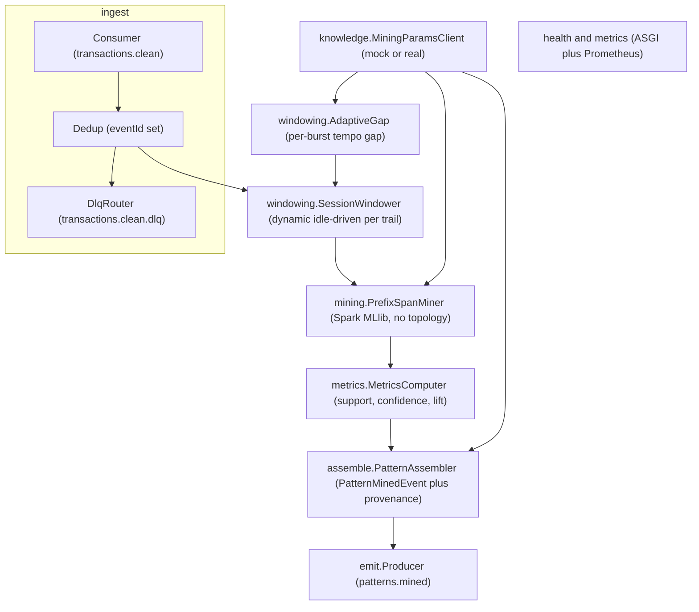
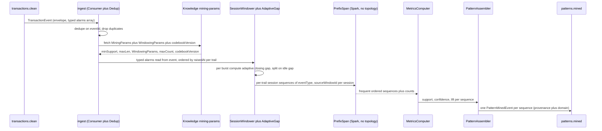
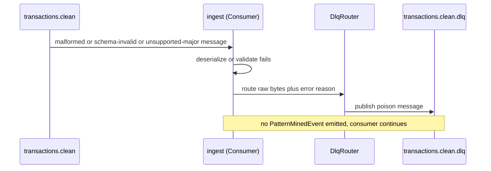
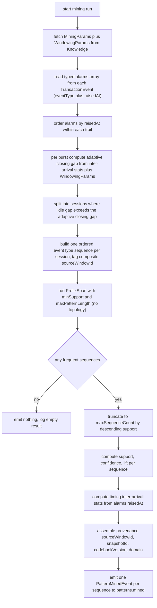

# pattern-miner — Design

> **Scope of this service (paramount boundary).** pattern-miner is **ML execution only**:
> dynamic activity/idle session-windowing + PrefixSpan mining of frequent ordered alarm-type
> sequences, with support/confidence/lift and provenance, emitted on `patterns.mined`. It holds
> **no pattern state** — **no RCA**, no `rootCauseAlarmType`, no `patternId`, no `lifecycle`, no
> codebook reconciliation, no explainability (XAI), and no Pattern Store. All of those belong
> exclusively to the Pattern Manager (§6.9). This boundary is enforced by the frozen
> `PatternMinedEvent` schema (`extra="forbid"`) and is asserted by the test plan.

> **No topology access (boundary preserved).** PrefixSpan runs as **pure sequence mining** over
> the resulting per-trail sessions. The Miner never touches the NebulaGraph topology graph — the
> Topology Service is its sole owner. Topology structural validation of mined patterns is a
> separate Pattern Manager concern, not done here.

> **Contract status — typed `alarms[]` consumed; issue #99 RESOLVED.** The previous design
> isolated alarm-detail resolution behind an `AlarmDetailResolver` seam because the old
> `TransactionEvent` carried only `alarmIds[]` (no per-alarm `eventType`/`raisedAt`). That
> contract gap is **closed**: the frozen `TransactionEvent` now carries an **ordered, typed
> `alarms[]`** array (each entry `{alarmId, eventType, raisedAt, managedObjectId,
> perceivedSeverity}`, all required), populated by the Noise Filter from the enriched AlarmEvents
> it already holds. **The `AlarmDetailResolver` seam is removed.** The Miner builds its session
> sequences (`eventType` items) and its timing/inter-arrival statistics + windowing decisions
> (`raisedAt`) **directly from `TransactionEvent.alarms[]`** — no separate alarm-detail lookup or
> resolver. **Issue #99 is RESOLVED** by the already-merged `alarms[]` contract; this design
> **consumes** it and introduces **no new event-model / contract change**.

## Stack

- **Language:** Python 3.13 (cohort pin per `CLAUDE.md`).
- **Mining engine:** **PySpark + Spark MLlib `PrefixSpan`** (Apache-2.0) for frequent
  ordered-sequence mining over the session-windowed sequences.
- **Runtime:** runs as a **stateless Spark job inside its own Docker container**
  (`python:3.13-slim` base + a pinned Spark runtime). **Spark/PySpark is not installed locally** —
  all Spark execution happens container-only (per `CLAUDE.md` and the spec). Unit tests run under
  **pytest** and do not require a Spark cluster (the algorithm core is exercised against `pyspark`
  in `local[*]` mode, provisioned only inside the test/CI container).
- **Kafka client:** `confluent-kafka` (Apache-2.0) or `kafka-python` (Apache-2.0) for the
  consumer/producer/DLQ loop. (Mining is batch; Kafka is the transport for transactions in and
  patterns out.)
- **Event model:** `acp-event-model` (the repo's Python/Pydantic binding) — the single source of
  truth for `TransactionEvent` (with its typed `alarms[]` of `Alarm`), `PatternMinedEvent`,
  `Provenance`, the envelope, and the codec.
- **Knowledge client:** `httpx` (BSD/MIT-family permissive) built against the Knowledge Service's
  published OpenAPI 3.1 spec; `respx` (BSD) for the unit-test mock.
- **HTTP for `/health` + `/metrics`:** a minimal ASGI app (`starlette`/`fastapi`, MIT) +
  `prometheus-client` (Apache-2.0). No business HTTP surface.
- **Lint/format/typing:** ruff + black + type hints; **pytest** for unit/contract tests.
- All dependencies are permissive (MIT / Apache-2.0 / BSD).

## Task breakdown (from the spec)

Every spec **Task (high-level)** is realized below; none is dropped or re-scoped.

| Spec task | Realized by (modules / flow) |
|---|---|
| 1. Consume `transactions.clean`, dedupe `TransactionEvent` on envelope `eventId` (at-least-once). | `ingest.Consumer` reads `transactions.clean`, deserializes via `acp_event_model.codec.deserialize`; `ingest.Dedup` tracks processed `eventId`s for the current run and silently acks+drops duplicates. |
| 2. Fetch current mining params (min-support, max-pattern-length, **windowing adaptation params incl. base/fallback gap**, max-sequence-count, `codebookVersion` in scope) from Knowledge before each run; no hard-coded thresholds. | `knowledge.MiningParamsClient` calls the Knowledge mining-params endpoint (config-switchable mock/real); returns a typed `MiningParams` carrying `minSupport`, `maxPatternLength`, a typed **`WindowingParams`** (adaptation params + base/fallback gap), `maxSequenceCount`, and `codebookVersion`. Values flow into windowing + PrefixSpan + provenance. No threshold literal exists in source/default config. |
| 3. Apply a **dynamic, activity/idle-driven session window** per trail: pool per-trail alarms, split on idle gaps; the closing gap **adapts to each burst's tempo** (fast cascade vs. slow-developing get different boundaries); all params Knowledge-sourced incl. base/fallback gap. | `windowing.SessionWindower` reads each `TransactionEvent.alarms[]` (ordered typed alarms), pools them per `trailId`, orders by `raisedAt`, and splits into sessions where the inter-arrival gap exceeds an **adaptive closing gap** computed per burst by `windowing.AdaptiveGap` from the `WindowingParams`. Each session gets a composite `sourceWindowId`. (Mechanism resolved below — Algorithm logical flow → Windowing.) |
| 4. Run PrefixSpan (Spark MLlib) over the session-windowed, trail-scoped sequences yielding all frequent ordered subsequences meeting min-support; **pure sequence mining, no topology**. | `mining.PrefixSpanMiner` builds the Spark `sequences` DataFrame (one row per session = ordered list of single-item `eventType` sets), runs `PrefixSpan(minSupport, maxPatternLength)`, and reads back `freqSequences`, truncated to `maxSequenceCount`. No topology graph is consulted. |
| 5. Compute support, confidence, lift for each discovered sequence (MVP metrics; no conviction). | `metrics.MetricsComputer` computes `support` (relative frequency), `confidence` (conditional probability of the sequence given its prefix), and `lift` (over the independence baseline) from PrefixSpan frequency counts + per-item marginals. `conviction` is **not** computed and not in the schema. |
| 6. Assemble a `PatternMinedEvent` per sequence: `sequence`, `support`, `confidence`, `lift`, `trailId`, `timing`, `provenance` (`sourceWindowId`, `snapshotId`, `codebookVersion`) — no RCA/lifecycle fields. | `assemble.PatternAssembler` builds a `PatternMinedEvent` (Pydantic) per discovered sequence; `timing` = inter-arrival statistics computed from the per-alarm `raisedAt` in `alarms[]` within matching sessions; `provenance` carries the composite `sourceWindowId`, the `snapshotId` from the source transaction, `codebookVersion` from the Knowledge response, and `domain` propagated from the transaction. RCA/lifecycle/patternId are structurally impossible (schema forbids extras). |
| 7. Emit one `PatternMinedEvent` on `patterns.mined` per discovered sequence. | `emit.Producer` wraps each `PatternMinedEvent` in an envelope (`type="PatternMinedEvent"`, `schemaVersion=1`, `source="pattern-miner"`, propagated `traceId`) and produces to `patterns.mined`. |
| 8. Route unprocessable (poison) messages to `transactions.clean.dlq`. | `ingest.DlqRouter` catches deserialize/validation failures and unknown major `schemaVersion`, publishes the raw bytes + a structured error header to `transactions.clean.dlq`, and continues. |

## Phase applicability (design view)

Consistent with the canonical phase map in `docs/architecture.md` (row: `pattern-miner` — Idle /
Active / Idle).

| Phase | Active/Passive/Idle | Modules/handlers exercised | Inputs/Outputs |
|---|---|---|---|
| P1 — Topology onboarding | Idle | All modules dormant. No consumer loop drives work; only `/health` answers. | — |
| P2 — Pattern learning | **Active** | `ingest.Consumer` + `Dedup` + `DlqRouter`; `knowledge.MiningParamsClient`; `windowing.SessionWindower` + `windowing.AdaptiveGap`; `mining.PrefixSpanMiner` (Spark `local`/cluster); `metrics.MetricsComputer`; `assemble.PatternAssembler`; `emit.Producer`. | In: `transactions.clean` (`TransactionEvent` with typed `alarms[]`) + Knowledge mining-params API. Out: `patterns.mined` (`PatternMinedEvent`), `transactions.clean.dlq`. |
| P3 — Real-time correlation | Idle | All mining modules dormant — mining is offline/learning-only; approved patterns are served by the Pattern Manager to the Correlation Engine. Only `/health` and `/metrics` answer. | — |

## Module breakdown



- **ingest.Consumer** — subscribes to `transactions.clean`, deserializes via the event-model codec.
- **ingest.Dedup** — set of processed envelope `eventId`s for the current run; duplicates are
  acked and dropped (criterion 7).
- **ingest.DlqRouter** — routes undeserializable / schema-invalid / unsupported-major messages to
  `transactions.clean.dlq` (criterion 8).
- **knowledge.MiningParamsClient** — fetches `MiningParams` (min-support, max-pattern-length,
  `WindowingParams`, max-sequence-count, `codebookVersion`) before a run; config-switchable
  mock/real.
- **windowing.SessionWindower** — reads each `TransactionEvent.alarms[]` (ordered typed alarms),
  pools alarms per `trailId`, orders by `raisedAt`, and splits into **dynamic, idle-driven**
  sessions. **Reads `eventType` and `raisedAt` directly from `alarms[]` — no resolver.**
- **windowing.AdaptiveGap** — computes the **closing idle gap per burst** from the burst's own
  inter-arrival statistics and the Knowledge `WindowingParams`, so different tempos get different
  boundaries (mechanism below).
- **mining.PrefixSpanMiner** — Spark MLlib `PrefixSpan` over the session sequences (pure sequence
  mining; no topology).
- **metrics.MetricsComputer** — support / confidence / lift from frequency counts + marginals.
- **assemble.PatternAssembler** — builds `PatternMinedEvent` + `Provenance` (incl. `domain`);
  `timing` from `alarms[].raisedAt`.
- **emit.Producer** — envelopes and produces to `patterns.mined`.
- **health/metrics** — `/health`, `/metrics` only (no business HTTP).

## Data model / DB schema

**N/A — stateless Spark job, no owned datastore.** pattern-miner persists no pattern state: it
mines, emits, and forgets (spec: "emits and forgets"; "Data owned: —"). The only in-memory state
is the per-run `Dedup` set of processed `eventId`s, used solely for idempotency within a run (not a
durable store). No PostgreSQL/NebulaGraph schema is owned — the Pattern Store belongs exclusively
to the Pattern Manager.

## Event handling

- **Consumers:**
  - `transactions.clean` to `ingest.Consumer`. Payload type: `TransactionEvent` (event-model),
    now carrying the ordered typed **`alarms[]`** (`{alarmId, eventType, raisedAt,
    managedObjectId, perceivedSeverity}`) consumed directly.
    **Idempotency/dedupe key:** envelope **`eventId`** (criterion 7) — duplicates are acked +
    dropped.
    **DLQ routing:** deserialize failure, `TransactionEvent` schema-validation failure, or
    unsupported major `schemaVersion` to `transactions.clean.dlq` (criterion 8).
- **Producers:**
  - `patterns.mined` from `emit.Producer`. Payload type: **`PatternMinedEvent`** (event-model),
    **one event per discovered sequence** (task 7 / criterion 1). Envelope:
    `type="PatternMinedEvent"`, `schemaVersion=1`, `source="pattern-miner"`, `traceId` propagated
    from the originating transaction envelope where available.
  - `transactions.clean.dlq` from `ingest.DlqRouter` (poison messages, raw bytes + structured
    error header).
- **Provenance + domain propagation:** `provenance.sourceWindowId` = the composite session
  reference (see Windowing); `provenance.snapshotId` = the source `TransactionEvent`'s
  `snapshotId`; `provenance.codebookVersion` = the Knowledge mining-params response value;
  `provenance.domain` = the source transaction's `domain`, carried through unchanged so
  multi-domain provenance is preserved.

## API contracts / API schema

**N/A — no business HTTP surface; no published OpenAPI spec.** pattern-miner is a stateless Spark
job. It exposes only operational endpoints:

- `GET /health` returns `200 {"status":"ok"}` (liveness/readiness; reports Kafka + Knowledge
  reachability).
- `GET /metrics` returns Prometheus exposition format.

These are operational, not a contract surface, so **no OpenAPI 3.1 document is published** (spec:
"no HTTP API surface beyond `/health` and `/metrics`; no OpenAPI spec is published"). The service's
**inbound** contracts are the Kafka topic + event-model payloads (`TransactionEvent` with typed
`alarms[]` in, `PatternMinedEvent` out); its **outbound** synchronous contract (Knowledge
mining-params) is built against the **Knowledge Service's** published OpenAPI spec (see
Integration points).

## Integration points (mock vs. real)

| Collaborator + operation | Config key(s) | Mock (unit) | Real (integration) |
|---|---|---|---|
| **Knowledge Service — mining-params** (min-support, max-pattern-length, windowing adaptation params incl. base/fallback gap, max-sequence-count, `codebookVersion`) | `KNOWLEDGE_BASE_URL`, `KNOWLEDGE_CLIENT_MODE` (`mock`/`real`) | `respx`-backed stub generated from the **Knowledge Service published OpenAPI 3.1 spec** | Live Knowledge Service at the Docker Compose address, resolved from env |

- No hard-coded URLs; base URL + mock/real toggle come from env (spec Non-functional / Config).
- The exact endpoint path and response shape are taken from the Knowledge Service's **published
  OpenAPI** at build time (spec OQ #1 / #45 — design-stage, resolved against the published spec,
  not against assumptions here).
- **No alarm-detail integration point exists.** The former `AlarmDetailResolver` seam is removed;
  the typed `alarms[]` arrive in-band on the `TransactionEvent`, so there is no lookup/join/API for
  alarm detail (issue #99 RESOLVED by the merged contract).

## Key flows (sequence / data-flow diagrams)

### Primary success path (P2 mining run)



### Poison-message / DLQ path



## Algorithm logical flow

The Miner reads all tunables from **Knowledge** (never hard-coded): `minSupport`,
`maxPatternLength`, `WindowingParams` (adaptation params + base/fallback gap), `maxSequenceCount`.
Inputs: a batch of `TransactionEvent`s (per trail), each carrying the **ordered typed `alarms[]`**.
Output: zero or more `PatternMinedEvent`s.



### Windowing (resolves spec OQ #50 — dynamic activity/idle session windowing)

**Inputs come from the event, not a resolver.** The Miner reads the ordered, typed `alarms[]`
**directly off each `TransactionEvent`** — `eventType` is the PrefixSpan item and `raisedAt` drives
both timing and windowing. There is no `alarmId` to detail lookup (issue #99 RESOLVED by the merged
`alarms[]` contract).

**Chosen finalize semantics.** The Miner treats `TransactionEvent`s as **inputs to re-window**,
not as already-final sessions (the Miner owns the final boundary, per §6.8). Per trail it pools the
typed alarms across the run's transactions, orders them by `raisedAt`, and splits them into
**activity sessions**: a session is a contiguous burst of activity that **closes when the trail
falls idle** — i.e. when the inter-arrival gap to the next alarm exceeds an **adaptive closing
gap** computed for that burst.

**Chosen adaptive-gap mechanism (the OQ#50 decision): a hybrid — Knowledge-supplied tempo-class
floor plus data-driven per-burst derivation.** For each candidate burst the closing gap is:

```text
closingGap(burst) = clamp(
    multiplier * percentile(interArrivals(burst), p),     # data-driven, tempo-tracking
    lower = profileFloor(burst.tempoClass),               # Knowledge per-tempo-class floor
    upper = maxClosingGap                                  # Knowledge ceiling
)
```

where, **all from Knowledge `WindowingParams`** (no literals in code):
- `multiplier` and `p` (e.g. `multiplier=4`, `p=50` is "4 times the median intra-burst
  inter-arrival");
- a small set of named **tempo-class profiles** (`fast`, `slow`, `default`) each giving a
  `profileFloor` (and optional ceiling), keyed by the burst's observed tempo class;
- `baseGap` — the **base/fallback gap** used when a burst has too few alarms to derive a stable
  percentile (e.g. fewer than `minBurstSamples` inter-arrivals) **or** when no tempo-class profile
  matches; and `maxClosingGap` as the ceiling.

**Why this hybrid.** A single fixed global gap (the old design) over-splits a slow-developing
condition (alarms minutes apart get cut at every gap) and merges a fast cascade (sub-second
propagation never exceeds a slow-calibrated gap, so distinct incidents fuse). Pinning the gap to a
**multiple of the burst's own median inter-arrival** makes it **track each burst's tempo**: a fast
burst yields a small gap (kept whole, not split), a slow burst yields a large gap (kept whole, not
truncated) — satisfying criterion 10. The Knowledge tempo-class **floor** prevents the data-driven
gap from collapsing to noise on tiny bursts and lets operators bias `fast`/`slow` classes; the
`baseGap` fallback guarantees a defined, Knowledge-sourced boundary when there is insufficient data
or no profile (so **no hard-coded default**, criteria 9 and 12). The clamp keeps it bounded.

**Tempo-class assignment.** Each burst's tempo class is derived from its observed median
inter-arrival against Knowledge-supplied class thresholds (also in `WindowingParams`); if a trail
declares a class (a future Knowledge attribute) that declared class is honoured, else the observed
one is used. No class is hard-coded.

**Idle split (criterion 11).** Because the closing gap is calibrated to the intra-burst tempo, a
genuine idle period between two bursts — by construction longer than any intra-burst inter-arrival —
exceeds the closing gap and **splits the trail into separate sessions** (one per burst), while
alarms inside a burst stay together.

**`sourceWindowId` for adaptive sessions.** Each session is assigned a **composite
`sourceWindowId`** = deterministic hash of `trailId` plus session `start`/`end` `raisedAt` plus
`snapshotId`, recorded in provenance. This is stable for a given input plus boundary and
distinguishes the multiple sessions a single trail/transaction can yield.

**Metrics.**
- `support` = (count of sessions containing the ordered sequence) / (total sessions in scope) — the
  observed frequency (criterion 1 asserts this equals the observed frequency within tolerance).
- `confidence` = P(full sequence given its longest proper prefix) from PrefixSpan frequency counts.
- `lift` = observed joint support / product of the constituent marginal supports (independence
  baseline); a spurious high-support co-occurrence yields `lift` near 1.0 (criterion 2).
- `conviction` is **deliberately not computed** (out of MVP; not in the frozen schema).

**No pattern state.** The flow ends at emit. There is no RCA step, no codebook reconciliation, no
lifecycle assignment, no topology access, and nothing is persisted — those are out of scope
(Pattern Manager).

## Seed data & examples

**N/A.** pattern-miner generates no seed/fixture corpus of its own. Test inputs are synthetic
`TransactionEvent` batches with **typed `alarms[]`** populated inline (each `{alarmId, eventType,
raisedAt, managedObjectId, perceivedSeverity}`) constructed in the test suite — including the
Simulator-style injected fiber-cut sequence `["lossOfSignal","linkDown","bgpPeerDown"]`, a spurious
low-lift co-occurrence, a fast-tempo and a slow-tempo burst, and a two-burst idle-split trail —
described inline in the Test plan rather than as a standalone seed dataset. No resolver fake is
needed (alarm detail is in-band).

## UI wireframes

**N/A.** pattern-miner has no UI; pattern review/approve/edit screens belong to web-ui (against the
Pattern Manager).

## Error handling

| Failure mode | Handling | Surfaced as |
|---|---|---|
| Message bytes are not valid JSON / not a valid envelope | `DlqRouter` to `transactions.clean.dlq`, raw bytes + error header; consumer continues (criterion 8) | DLQ message + JSON error log; no `PatternMinedEvent` |
| Payload fails `TransactionEvent` schema validation (`extra="forbid"`, missing required field incl. a missing/ill-typed `alarms[]` entry, bad type) | Same as above, to `transactions.clean.dlq` (criterion 8) | DLQ message + error log; no emit |
| Unsupported major `schemaVersion` (codec rejects major at least 2) | Treated as poison, to `transactions.clean.dlq` with reason `unsupported_schema_version` | DLQ message + error log; no emit |
| Duplicate envelope `eventId` (at-least-once redelivery) | `Dedup` drops it; message acked, no reprocessing (criterion 7) | Silent drop + debug log; no emit |
| Knowledge Service unavailable / errors (transient) | `MiningParamsClient` retries with config-driven back-off; on exhaustion the run **fails fast** (does not mine with stale or default thresholds — no hard-coded fallback, incl. no hard-coded windowing gap) | Error log + run-failure metric; offsets not advanced past unmined transactions so the run can retry |
| A burst has too few inter-arrivals to derive a stable percentile, or no tempo-class profile matches | The Knowledge-sourced `baseGap`/`profileFloor` fallback applies (defined behaviour, not an error); no hard-coded default | Debug log + fallback-gap-used metric |
| PrefixSpan yields no frequent sequence at the current `minSupport` | Emit nothing; log empty result; this is a valid outcome, not an error | Empty-result log + metric |
| Spark job failure (executor/driver error mid-run) | The run is treated as not-committed: source offsets are not committed for the failed batch; the job exits non-zero so the orchestrator/container can restart and re-consume (at-least-once + `eventId` dedupe make replay safe) | Error log + non-zero exit + failure metric |

Nothing is **silently** dropped except confirmed duplicates (criterion 7) and explicit empty mining
results; every other failure is logged and either DLQ-routed or fails the run.

## Design alternatives

| Consideration | Alternatives considered | Chosen + rationale |
|---|---|---|
| **Source of per-alarm `eventType` / `raisedAt`** | (a) consume the typed `alarms[]` now carried in-band on `TransactionEvent`; (b) keep the old `AlarmDetailResolver` seam and resolve `alarmId` to detail out-of-band (lookup API / co-consume `alarms.enriched` / enrich the contract). | **(a) consume `alarms[]` in-band.** The contract gap that motivated the resolver (issue #99) is **closed** — `TransactionEvent` now carries ordered typed `alarms[]`, populated by the Noise Filter. The resolver seam is therefore **removed**; the Miner reads `eventType`/`raisedAt` directly off the event. No new consumer, no extra phase-map dependency, no contract change. (b) is now dead weight and is deleted. |
| **Session-window finalize plus adaptive-gap mechanism (spec OQ#50)** | (a) single fixed global `sessionGap`; (b) Knowledge per-tempo-class gap profiles only; (c) data-driven gap from each burst's own inter-arrival distribution only; (d) **hybrid** — Knowledge tempo-class floor plus data-driven per-burst derivation, clamped, with a Knowledge `baseGap` fallback. | **(d) hybrid.** (a) cannot satisfy criterion 10/11 — one gap over-splits slow bursts and merges fast cascades. (b) alone is rigid (a burst off-profile is mis-cut and needs operator pre-classification). (c) alone is unstable on tiny bursts (a 2-alarm burst has no robust percentile) and ungoverned. The hybrid tracks each burst's own tempo (data-driven core), is floored/ceilinged and biasable by Knowledge tempo classes, and falls back to a Knowledge `baseGap` when data is insufficient — adaptive, fully Knowledge-parameterized, no hard-coded gap. `sourceWindowId` becomes a composite session reference. |
| **Mining engine** | (a) Spark MLlib `PrefixSpan`; (b) SPMF or pure-Python sequence miner; (c) FP-Growth (unordered itemsets). | **(a) PrefixSpan (Spark MLlib).** The spec mandates PrefixSpan and ordered sequences; Spark gives scale-out for the historical corpus and is the cohort PySpark choice. (c) FP-Growth loses ordering (wrong algorithm class); (b) does not scale and is off-spec. PrefixSpan stays **pure sequence mining over sessions — no topology**. |
| **Stateless job vs. long-running Streams app** | (a) batch Spark job run per learning window; (b) a long-running streaming windower. | **(a) stateless batch job.** The spec and architecture classify the Miner as a stateless, container-only Spark job active only in P2; batch matches the offline learning phase and keeps it stateless (no owned store). |
| **Dedupe scope** | (a) per-run in-memory `eventId` set; (b) durable dedupe store. | **(a) in-memory.** The service owns no datastore (stateless); at-least-once replay safety comes from `eventId` dedupe within a run plus idempotent re-mining (same input yields same patterns). A durable store would violate the no-owned-store invariant for this service. |
| **Knowledge-unavailable behaviour** | (a) fail the run; (b) mine with last-known/default thresholds (incl. a default gap). | **(a) fail fast plus retry.** Mining with stale/default thresholds (or a default windowing gap) would reintroduce hard-coded behaviour (forbidden) and could emit patterns under wrong boundaries; failing the run and retrying preserves no-hard-coded-thresholds. |

## Test plan

### Acceptance criterion → test (unit/contract)

All tests are **pytest**. Spark-dependent tests run in `local[*]` mode inside the test container.
Test inputs are `TransactionEvent`s with **typed `alarms[]`** populated inline — no resolver fake.

| # | Acceptance criterion | Test | Asserts |
|---|---|---|---|
| 1 | Injected fiber-cut sequence is recovered with correct support. | `test_fiber_cut_sequence_recovered_with_support` | Given transactions whose `alarms[]` repeat `["lossOfSignal","linkDown","bgpPeerDown"]`, at least one emitted `PatternMinedEvent.sequence` equals that ordered list and its `support` equals the observed session frequency within float tolerance. |
| 2 | Spurious high-support, low-lift co-occurrence is surfaced with its computed lift. | `test_spurious_cooccurrence_surfaced_with_low_lift` | For two frequently co-occurring `eventType`s that are statistically independent, a `PatternMinedEvent` is emitted and its `lift` is approximately 1.0 (within tolerance), enabling downstream flagging. |
| 3 | Raising min-support above a sequence support removes it; lowering it back restores it. | `test_min_support_threshold_filters_and_restores` | With the Knowledge mock returning a high `minSupport`, the borderline sequence is absent from emitted events for the window; with a lowered `minSupport`, the same input re-emits it. |
| 4 | Every emitted event validates against the frozen `PatternMinedEvent` model; all required fields present, no extras. | `test_emitted_event_validates_against_frozen_model` | Each emitted event round-trips through `acp_event_model` `PatternMinedEvent.model_validate`; required fields (`sequence`,`support`,`confidence`,`lift`,`trailId`,`timing`,`provenance`) present and typed; injecting an extra field raises `ValidationError`. |
| 5 | No emitted event carries `rootCauseAlarmType`, `patternId`, or `lifecycle`; constructing one with such a field raises `ValidationError`. | `test_no_rca_or_lifecycle_fields_on_output` | Emitted payload dicts contain none of those keys; `PatternMinedEvent(**{...,"rootCauseAlarmType":"x"})` and the `patternId`/`lifecycle` variants each raise `ValidationError` (enforced by `extra="forbid"`). |
| 6 | `provenance` carries `sourceWindowId`, `snapshotId`, `codebookVersion` (all non-empty); `codebookVersion` equals the Knowledge response value; missing sub-field fails validation. | `test_provenance_present_and_codebook_version_from_knowledge` | Every emitted `provenance` has the three non-empty sub-fields; `sourceWindowId` is the composite session reference; `codebookVersion` equals the Knowledge mock value; constructing `Provenance` without a required sub-field raises `ValidationError`. Plus `test_provenance_domain_propagated_from_transaction` asserts `provenance.domain` equals the source `TransactionEvent.domain`. |
| 7 | A duplicate `eventId` in the current run emits no event and is silently dropped/acked. | `test_duplicate_event_id_dropped` | Feeding the same envelope `eventId` twice yields the mined events only once; the second is acked with no additional emit; a dedupe-drop metric increments. |
| 8 | An undeserializable / schema-invalid message is routed to `transactions.clean.dlq` and produces no event. | `test_poison_message_routed_to_dlq` | A malformed-JSON message and a schema-invalid `TransactionEvent` (incl. a missing/ill-typed `alarms[]` entry) each land on `transactions.clean.dlq` with an error reason; no `PatternMinedEvent` is emitted; the consumer continues. (Companion: `test_unsupported_schema_version_routed_to_dlq`.) |
| 9 | Min-support, max-pattern-length, **windowing adaptation params incl. base/fallback gap**, max-sequence-count read exclusively from Knowledge; no windowing-gap value or threshold literal in source/default config. | `test_no_hardcoded_thresholds` + `test_thresholds_sourced_from_knowledge` | A source/config scan finds no numeric threshold or windowing-gap literal for those params; runtime asserts the values used by windowing/PrefixSpan are exactly the Knowledge mock returned values, and changing the mock changes mining behaviour. |
| 10 | Two trails with markedly different inter-arrival tempos get **different appropriate** session boundaries — fast burst kept whole (not over-split), slow burst kept whole (not truncated). | `test_different_tempo_trails_get_appropriate_boundaries` | Build trail A as a single fast burst (sub-second inter-arrivals) and trail B as a single slow burst (minutes apart). After windowing, **trail A yields exactly one session** (the adaptive gap calibrated to its tempo is not exceeded) **and trail B yields exactly one session** (its large adaptive gap is not exceeded). A single fixed slow-calibrated gap would split A, and a fast-calibrated fixed gap would split B — asserting per-tempo adaptation, not one global gap. |
| 11 | A single trail with two bursts separated by a clear idle period (longer than any intra-burst gap) splits into **exactly two** sessions; intra-burst alarms stay together. | `test_idle_period_splits_trail_into_two_sessions` | Build one trail with burst-1, a long idle gap, then burst-2 (each intra-burst inter-arrival small). Windowing produces **exactly two sessions**, burst-1's alarms all in session 1 and burst-2's all in session 2, with no further intra-burst split. |
| 12 | Changing the Knowledge windowing configuration and reprocessing the **same** inputs yields **different** session boundaries — proving adaptation is Knowledge-governed, nothing hard-coded. | `test_knowledge_windowing_config_changes_boundaries` | Reprocess a fixed alarm-event set twice with two different `WindowingParams` from the Knowledge mock (e.g. different `baseGap`/`multiplier`); the resulting session boundaries (count and/or membership) differ; under identical params they are identical (deterministic), confirming boundaries are a pure function of Knowledge-sourced params plus input. |
| — (typed `alarms[]`, no resolver) | Session sequences + timing are built directly from `TransactionEvent.alarms[]` — no alarm-detail resolver/lookup. | `test_sequences_and_timing_built_from_typed_alarms` | The PrefixSpan input items equal the `alarms[].eventType` values in `raisedAt` order, and `timing` inter-arrival stats are computed from `alarms[].raisedAt`; no resolver/lookup/HTTP-join is invoked (there is no such collaborator), and removing `alarms[]` makes the event fail schema validation and DLQ-route (not a resolver call). |

Every spec acceptance criterion (1–12) maps to a named pytest test above, plus the typed-`alarms[]`
no-resolver test.

### E2E scenarios (from this design unit's point of view)

Exercised by the integration stage against real collaborators (Kafka + Knowledge in Compose). The
typed `alarms[]` arrive in-band on `transactions.clean` (produced by the Noise Filter); there is no
alarm-detail collaborator.

| # | Scenario | Trigger → path | Expected outcome |
|---|---|---|---|
| 1 | Fiber-cut storm mined end to end | Publish a `transactions.clean` batch whose `alarms[]` contain the injected fiber-cut sequence; consume → fetch Knowledge params → window → PrefixSpan → emit | A `PatternMinedEvent` on `patterns.mined` with `sequence=["lossOfSignal","linkDown","bgpPeerDown"]`, correct support, and full provenance (incl. `codebookVersion` from Knowledge). |
| 2 | Spurious co-occurrence flagged downstream | Publish transactions with an independent frequent pair | A `PatternMinedEvent` emitted with `lift` near 1.0, available for the Pattern Manager to flag. |
| 3 | Threshold change re-shapes output | Run, then change Knowledge `minSupport`, re-run same input | Borderline sequence disappears then reappears across runs, proving Knowledge-driven thresholds. |
| 4 | Dynamic tempo windowing end to end | Publish one trail as a fast burst and another as a slow burst in the same run | Each trail mines as a single coherent session — the fast cascade is not over-split and the slow build-up is not truncated — proving per-tempo adaptive windowing on the real path. |
| 5 | Idle split end to end | Publish a single trail carrying two bursts separated by a clear idle period | The Miner emits patterns scoped to two distinct sessions (distinct `sourceWindowId`s), confirming the idle gap closes the first burst and opens the second. |
| 6 | Windowing config change re-shapes boundaries | Reprocess a fixed input after updating Knowledge `WindowingParams` | Resulting session boundaries (and thus emitted patterns/`sourceWindowId`s) differ from the prior config, with no service restart/code change — windowing is Knowledge-governed. |
| 7 | Poison message isolation | Publish a malformed message (and one missing `alarms[]`) interleaved with valid ones | Poison messages land on `transactions.clean.dlq`; valid transactions still mine and emit; no crash. |
| 8 | At-least-once redelivery | Redeliver an already-consumed `eventId` | No duplicate `PatternMinedEvent`; dedupe metric increments. |
| 9 | Knowledge down (failure path) | Stop Knowledge, publish a transaction | Run fails fast with retries and back-off; no event emitted under stale/default thresholds or a default gap; offsets not advanced so it retries when Knowledge returns. |
| 10 | No-RCA / no-topology boundary holds end to end | Inspect every emitted `patterns.mined` event and the service's dependencies | No event carries `rootCauseAlarmType`/`patternId`/`lifecycle`; the service makes no call to the Topology graph — RCA, lifecycle, and topology validation remain the Pattern Manager's job. |

## Config & observability

- **Config (env):** `KAFKA_BOOTSTRAP_SERVERS`, `TRANSACTIONS_CLEAN_TOPIC` (default
  `transactions.clean`), `PATTERNS_MINED_TOPIC` (default `patterns.mined`), `DLQ_TOPIC` (default
  `transactions.clean.dlq`), `CONSUMER_GROUP_ID`, `KNOWLEDGE_BASE_URL`, `KNOWLEDGE_CLIENT_MODE`
  (`mock`/`real`), `KNOWLEDGE_RETRY_MAX`, `KNOWLEDGE_RETRY_BACKOFF_MS`, `SPARK_MASTER` (e.g.
  `local[*]` in tests; cluster in deployment), `LOG_LEVEL`. **No mining-threshold or
  windowing-gap env vars** — those come only from Knowledge.
- **Mining params (from Knowledge, never code):** `minSupport`, `maxPatternLength`,
  `WindowingParams` (tempo-class profiles with floors, `multiplier`, percentile `p`, class
  thresholds, `baseGap` fallback, `maxClosingGap` ceiling, `minBurstSamples`), `maxSequenceCount`,
  `codebookVersion`.
- **Observability:** `GET /health` (liveness/readiness incl. Kafka + Knowledge reachability);
  `GET /metrics` (Prometheus): counters for consumed / deduped-dropped / DLQ-routed /
  patterns-emitted / mining-runs / mining-failures / fallback-gap-used, and gauges for last-run
  session count, sequence count, and duration. **Structured JSON logs** for: message consumed,
  duplicate dropped, DLQ routed, params fetched, **session window finalized (with the adaptive gap
  used and tempo class per burst)**, mining run started/completed (with sequence count), events
  emitted, and every error.

## Build & run

- **Build/lint/test:** `ruff check`, `black --check`, `pytest` (unit/contract).
- **Container-only Spark.** Spark/PySpark is **not installed locally** — all Spark execution (and
  Spark-dependent tests) runs **inside the container**. The `Dockerfile` is `python:3.13-slim` plus
  a pinned Spark runtime (a JRE + the Spark distribution, or a Spark-on-Python base image with
  PySpark pinned), installs the service + `acp-event-model`, and runs the stateless mining job.
  Local developers run unit tests via the test container, not on the host.
- **Run (P2):** the container is started for the learning phase; it consumes `transactions.clean`,
  windows, mines, emits `patterns.mined`, and exits (or idles) when the batch/window is drained. It
  has a Docker Compose entry and depends on Kafka + the Knowledge Service.
- **Idle phases (P1/P3):** the container runs no mining; only `/health` (and `/metrics`) respond.
