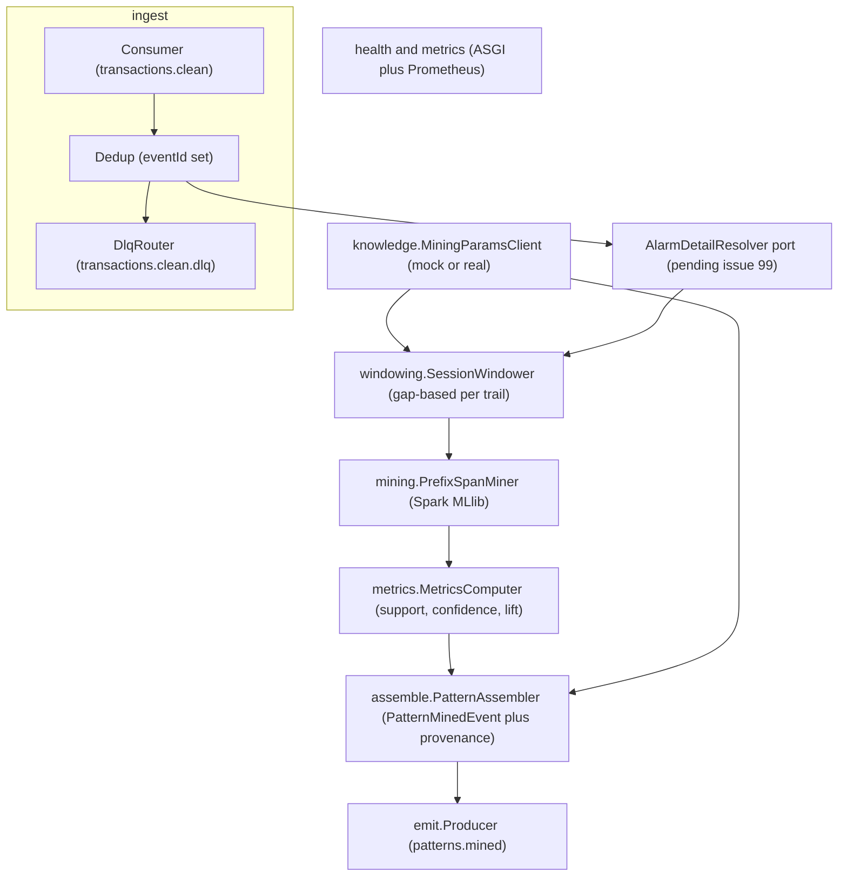
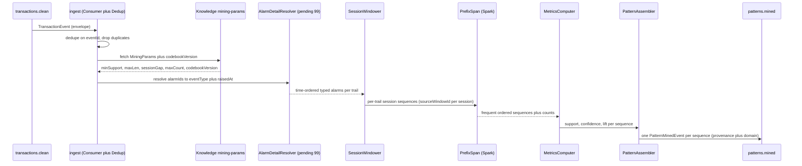
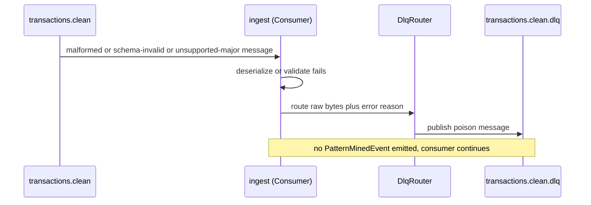
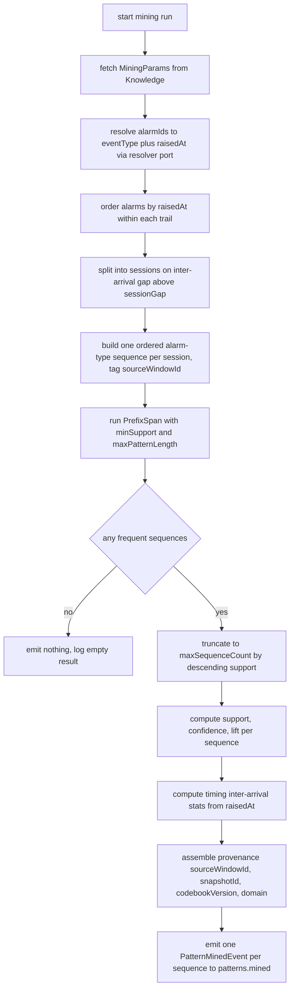

# pattern-miner — Design

> **Scope of this service (paramount boundary).** pattern-miner is **ML execution only**:
> session-windowing + PrefixSpan mining of frequent ordered alarm-type sequences, with
> support/confidence/lift and provenance, emitted on `patterns.mined`. It holds **no pattern
> state** — **no RCA**, no `rootCauseAlarmType`, no `patternId`, no `lifecycle`, no codebook
> reconciliation, no explainability (XAI), and no Pattern Store. All of those belong exclusively
> to the Pattern Manager (§6.9). This boundary is enforced by the frozen `PatternMinedEvent`
> schema (`extra="forbid"`) and is asserted by the test plan.

> **OPEN DEPENDENCY (flagged, not designed around) — issue #99.** PrefixSpan mines ordered
> alarm-**type** sequences and the `timing` object needs per-alarm `raisedAt`, but the frozen
> `TransactionEvent` carries only `alarmIds[]` (no per-alarm `eventType`, no per-alarm
> `raisedAt`). How the Miner resolves `alarmId` to `(eventType, raisedAt)` is a **contract /
> ownership decision pending a human** (issue #99, label `service:pattern-miner`). This design
> documents everything that is **not** blocked and isolates the unresolved resolution behind a
> single seam — the **AlarmDetailResolver** port (see Module breakdown). The design does **not**
> invent a new topic/payload/field to close the gap; the chosen resolution (and any
> `architecture.md`/event-model change it implies) is its own PR into `main`, merged first, drafted
> only when a human asks. All flows/tests below treat the resolver as an injected dependency so the
> rest of the service is buildable now and the seam is swapped once #99 is decided.

## Stack

- **Language:** Python 3.13 (cohort pin per `CLAUDE.md`).
- **Mining engine:** **PySpark + Spark MLlib `PrefixSpan`** (Apache-2.0) for frequent
  ordered-sequence mining.
- **Runtime:** runs as a **stateless Spark job inside its own Docker container** (`python:3.13-slim`
  base + a pinned Spark runtime). **Spark/PySpark is not installed locally** — all Spark execution
  happens container-only (per `CLAUDE.md` and the spec). Unit tests run under **pytest** and do not
  require a Spark cluster (the algorithm core is exercised against `pyspark` in `local[*]` mode,
  provisioned only inside the test/CI container).
- **Kafka client:** `confluent-kafka` (Apache-2.0) or `kafka-python` (Apache-2.0) for the
  consumer/producer/DLQ loop. (Mining is batch; Kafka is the transport for transactions in and
  patterns out.)
- **Event model:** `acp-event-model` (the repo's Python/Pydantic binding) — the single source of
  truth for `TransactionEvent`, `PatternMinedEvent`, `Provenance`, the envelope, and the codec.
- **Knowledge client:** `httpx` (BSD/MIT-family permissive) generated/validated against the
  Knowledge Service's published OpenAPI 3.1 spec; `respx` (BSD) for the unit-test mock.
- **HTTP for `/health` + `/metrics`:** a minimal ASGI app (`starlette`/`fastapi`, MIT) +
  `prometheus-client` (Apache-2.0). No business HTTP surface.
- **Lint/format/typing:** ruff + black + type hints; **pytest** for unit/contract tests.
- All dependencies are permissive (MIT / Apache-2.0 / BSD).

## Task breakdown (from the spec)

Every spec **Task (high-level)** is realized below; none is dropped or re-scoped.

| Spec task | Realized by (modules / flow) |
|---|---|
| 1. Consume `transactions.clean`, dedupe `TransactionEvent` on envelope `eventId` (at-least-once). | `ingest.Consumer` reads `transactions.clean`, deserializes via `acp_event_model.codec.deserialize`; `ingest.Dedup` tracks processed `eventId`s for the current run/session and silently acks+drops duplicates. |
| 2. Fetch current mining params (min-support, max-pattern-length, session-gap, max-sequence-count, `codebookVersion` in scope) from Knowledge before each run; no hard-coded thresholds. | `knowledge.MiningParamsClient` calls the Knowledge mining-params endpoint (config-switchable mock/real); returns a typed `MiningParams` (incl. `codebookVersion`). Values flow into windowing + PrefixSpan + provenance. No threshold literal exists in source/default config. |
| 3. Apply a gap-based session window (per trail) to finalize sequence boundaries. | `windowing.SessionWindower` groups resolved, time-ordered alarm events per `trailId` and splits them into sessions on an inter-arrival gap exceeding `sessionGap` (from Knowledge). Each session gets a `sourceWindowId`. (Per spec OQ #50, the chosen finalize semantics are documented under "Algorithm logical flow → Windowing".) |
| 4. Run PrefixSpan (Spark MLlib) over session-windowed, trail-scoped sequences yielding all frequent ordered subsequences meeting min-support. | `mining.PrefixSpanMiner` builds the Spark `sequences` DataFrame (one row per session = ordered list of single-item alarm-type sets), runs `PrefixSpan(minSupport, maxPatternLength)`, and reads back `freqSequences`, truncated to `maxSequenceCount`. |
| 5. Compute support, confidence, lift for each discovered sequence (MVP metrics; no conviction). | `metrics.MetricsComputer` computes `support` (relative frequency), `confidence` (conditional probability of the sequence given its prefix), and `lift` (over the independence baseline) from PrefixSpan frequency counts + per-item marginals. `conviction` is **not** computed and not in the schema. |
| 6. Assemble a `PatternMinedEvent` per sequence: `sequence`, `support`, `confidence`, `lift`, `trailId`, `timing`, `provenance` (`sourceWindowId`, `snapshotId`, `codebookVersion`, optional `domain`) — no RCA/lifecycle fields. | `assemble.PatternAssembler` builds a `PatternMinedEvent` (Pydantic) per discovered sequence; `timing` = inter-arrival statistics computed from the resolved per-alarm `raisedAt` within matching sessions; `provenance` carries `sourceWindowId`, the `snapshotId` from the source transaction, `codebookVersion` from the Knowledge response, and `domain` propagated from the transaction. RCA/lifecycle/patternId are structurally impossible (schema forbids extras). |
| 7. Emit one `PatternMinedEvent` on `patterns.mined` per discovered sequence. | `emit.Producer` wraps each `PatternMinedEvent` in an envelope (`type="PatternMinedEvent"`, `schemaVersion=1`, `source="pattern-miner"`, propagated `traceId`) and produces to `patterns.mined`. |
| 8. Route unprocessable (poison) messages to `transactions.clean.dlq`. | `ingest.DlqRouter` catches deserialize/validation failures and unknown major `schemaVersion`, publishes the raw bytes + a structured error header to `transactions.clean.dlq`, and continues. |

## Phase applicability (design view)

Consistent with the canonical phase map in `docs/architecture.md` (row: `pattern-miner` — Idle /
Active / Idle).

| Phase | Active/Passive/Idle | Modules/handlers exercised | Inputs/Outputs |
|---|---|---|---|
| P1 — Topology onboarding | Idle | All modules dormant. No consumer loop drives work; only `/health` answers. | — |
| P2 — Pattern learning | **Active** | `ingest.Consumer` + `Dedup` + `DlqRouter`; `knowledge.MiningParamsClient`; `AlarmDetailResolver` (seam, pending #99); `windowing.SessionWindower`; `mining.PrefixSpanMiner` (Spark `local`/cluster); `metrics.MetricsComputer`; `assemble.PatternAssembler`; `emit.Producer`. | In: `transactions.clean` (`TransactionEvent`) + Knowledge mining-params API. Out: `patterns.mined` (`PatternMinedEvent`), `transactions.clean.dlq`. |
| P3 — Real-time correlation | Idle | All mining modules dormant — mining is offline/learning-only; approved patterns are served by the Pattern Manager to the Correlation Engine. Only `/health` and `/metrics` answer. | — |

## Module breakdown

- **ingest.Consumer** — subscribes to `transactions.clean`, deserializes via the event-model codec.
- **ingest.Dedup** — set of processed envelope `eventId`s for the current run/session; duplicates are
  acked and dropped (criterion 7).
- **ingest.DlqRouter** — routes undeserializable / schema-invalid / unsupported-major messages to
  `transactions.clean.dlq` (criterion 8).
- **knowledge.MiningParamsClient** — fetches `MiningParams` (min-support, max-pattern-length,
  session-gap, max-sequence-count, `codebookVersion`) before a run; config-switchable mock/real.
- **AlarmDetailResolver (port)** — the **single seam** that maps each `alarmId` to
  `(eventType, raisedAt)`. Its concrete implementation is **pending issue #99**; the rest of the
  service depends only on this interface, so it is buildable and testable now via a fake/in-memory
  resolver, and swapped to the human-decided source once #99 lands.
- **windowing.SessionWindower** — gap-based per-trail session windowing over time-ordered resolved
  alarms.
- **mining.PrefixSpanMiner** — Spark MLlib `PrefixSpan` over the session sequences.
- **metrics.MetricsComputer** — support / confidence / lift from frequency counts + marginals.
- **assemble.PatternAssembler** — builds `PatternMinedEvent` + `Provenance` (incl. `domain`).
- **emit.Producer** — envelopes and produces to `patterns.mined`.
- **health/metrics** — `/health`, `/metrics` only (no business HTTP).

## Data model / DB schema

**N/A — stateless Spark job, no owned datastore.** pattern-miner persists no pattern state: it
mines, emits, and forgets (spec: "emits and forgets"; "Data owned: —"). The only in-memory state is
the per-run/per-session `Dedup` set of processed `eventId`s, used solely for idempotency within a run
(not a durable store). No PostgreSQL/AGE schema is owned — the Pattern Store belongs exclusively to
the Pattern Manager.

## API contracts / API schema

**N/A — no business HTTP surface; no published OpenAPI spec.** pattern-miner is a stateless Spark
job. It exposes only operational endpoints:

- `GET /health` returns `200 {"status":"ok"}` (liveness/readiness; reports Kafka + Knowledge reachability).
- `GET /metrics` returns Prometheus exposition format.

These are operational, not a contract surface, so **no OpenAPI 3.1 document is published** (spec:
"no HTTP API surface beyond `/health` and `/metrics`; no OpenAPI spec is published"). The service's
**inbound** contracts are the Kafka topic + event-model payloads (`TransactionEvent` in,
`PatternMinedEvent` out); its **outbound** synchronous contract (Knowledge mining-params) is built
against the **Knowledge Service's** published OpenAPI spec (see Integration points).

## Event handling

- **Consumers:**
  - `transactions.clean` to `ingest.Consumer`. Payload type: `TransactionEvent` (event-model).
    **Idempotency/dedupe key:** envelope **`eventId`** (criterion 7) — duplicates are acked + dropped.
    **DLQ routing:** deserialize failure, `TransactionEvent` schema-validation failure, or
    unsupported major `schemaVersion` to `transactions.clean.dlq` (criterion 8).
- **Producers:**
  - `patterns.mined` from `emit.Producer`. Payload type: **`PatternMinedEvent`** (event-model),
    **one event per discovered sequence** (task 7 / criterion 1). Envelope: `type="PatternMinedEvent"`,
    `schemaVersion=1`, `source="pattern-miner"`, `traceId` propagated from the originating
    transaction envelope where available.
  - `transactions.clean.dlq` from `ingest.DlqRouter` (poison messages, raw bytes + structured error
    header).
- **Provenance + domain propagation:** `provenance.snapshotId` = the source `TransactionEvent`'s
  `snapshotId`; `provenance.codebookVersion` = the Knowledge mining-params response value;
  `provenance.domain` = the source transaction's `domain` (optional field #90), carried through
  unchanged so multi-domain provenance is preserved.

## Integration points (mock vs. real)

| Collaborator + operation | Config key(s) | Mock (unit) | Real (integration) |
|---|---|---|---|
| **Knowledge Service — mining-params** (min-support, max-pattern-length, session-gap, max-sequence-count, `codebookVersion`) | `KNOWLEDGE_BASE_URL`, `KNOWLEDGE_CLIENT_MODE` (`mock`/`real`) | `respx`-backed stub generated from the **Knowledge Service published OpenAPI 3.1 spec** | Live Knowledge Service at the Docker Compose address, resolved from env |

- No hard-coded URLs; base URL + mock/real toggle come from env (spec Non-functional / Config).
- The exact endpoint path and response shape are taken from the Knowledge Service's **published
  OpenAPI** at build time (spec OQ #1 / #45 — design-stage, resolved against the published spec, not
  against assumptions here).
- **AlarmDetailResolver** is *not* a frozen integration point — its source is the subject of
  **issue #99** and is intentionally left as a swappable port (see the OPEN DEPENDENCY note).

## Key flows (sequence / data-flow diagrams)

### Primary success path (P2 mining run)

### Poison-message / DLQ path

## Algorithm logical flow

The Miner reads all tunables from **Knowledge** (never hard-coded): `minSupport`,
`maxPatternLength`, `sessionGap`, `maxSequenceCount`. Inputs: a batch of `TransactionEvent`s
(per trail). Output: zero or more `PatternMinedEvent`s.

**Windowing (resolves spec OQ #50 — session-window finalize semantics).** Chosen semantics:
the Miner treats `TransactionEvent`s as **inputs to re-window**, not as already-final sessions. Per
trail, it pools the resolved alarms across the transactions in the run, orders them by `raisedAt`,
and **splits into sessions on a gap larger than `sessionGap`** (gap-based, per trail; the Miner owns
the final boundary decision, per §6.8). Each resulting session is one PrefixSpan input sequence and
is assigned a **composite `sourceWindowId`** (deterministic hash of `trailId` + session
start/end), recorded in provenance. (Rationale and the 1:1 alternative are in Design alternatives.)
This choice depends on per-alarm `raisedAt`, which is the unresolved input from **issue #99**;
the windowing logic itself is implemented and unit-tested against the resolver fake.

**Metrics.**
- `support` = (count of sessions containing the ordered sequence) / (total sessions in scope) — the
  observed frequency (criterion 1 asserts this equals the observed frequency within tolerance).
- `confidence` = P(full sequence given its longest proper prefix) from PrefixSpan frequency counts.
- `lift` = observed joint support / product of the constituent marginal supports (independence
  baseline); a spurious high-support co-occurrence yields `lift` near 1.0 (criterion 2).
- `conviction` is **deliberately not computed** (out of MVP; not in the frozen schema).

**No pattern state.** The flow ends at emit. There is no RCA step, no codebook reconciliation, no
lifecycle assignment, and nothing is persisted — those are out of scope (Pattern Manager).

## Seed data & examples

**N/A.** pattern-miner generates no seed/fixture corpus of its own. Test inputs are synthetic
`TransactionEvent` batches (with a paired resolver fake mapping `alarmId` to `eventType`/`raisedAt`)
constructed in the test suite — including the Simulator-style injected fiber-cut sequence
`["lossOfSignal","linkDown","bgpPeerDown"]` and a spurious low-lift co-occurrence — described inline
in the Test plan rather than as a standalone seed dataset.

## UI wireframes

**N/A.** pattern-miner has no UI; pattern review/approve/edit screens belong to web-ui (against the
Pattern Manager).

## Error handling

| Failure mode | Handling | Surfaced as |
|---|---|---|
| Message bytes are not valid JSON / not a valid envelope | `DlqRouter` to `transactions.clean.dlq`, raw bytes + error header; consumer continues (criterion 8) | DLQ message + JSON error log; no `PatternMinedEvent` |
| Payload fails `TransactionEvent` schema validation (`extra="forbid"`, missing field, bad type) | Same as above, to `transactions.clean.dlq` (criterion 8) | DLQ message + error log; no emit |
| Unsupported major `schemaVersion` (codec rejects major at least 2) | Treated as poison, to `transactions.clean.dlq` with reason `unsupported_schema_version` | DLQ message + error log; no emit |
| Duplicate envelope `eventId` (at-least-once redelivery) | `Dedup` drops it; message acked, no reprocessing (criterion 7) | Silent drop + debug log; no emit |
| Knowledge Service unavailable / errors (transient) | `MiningParamsClient` retries with config-driven back-off; on exhaustion the run **fails fast** (does not mine with stale or default thresholds — no hard-coded fallback) | Error log + run-failure metric; offsets not advanced past unmined transactions so the run can retry |
| PrefixSpan yields no frequent sequence at the current `minSupport` | Emit nothing; log empty result; this is a valid outcome, not an error | Empty-result log + metric |
| Spark job failure (executor/driver error mid-run) | The run is treated as not-committed: source offsets are not committed for the failed batch; the job exits non-zero so the orchestrator/container can restart and re-consume (at-least-once + `eventId` dedupe make replay safe) | Error log + non-zero exit + failure metric |
| `AlarmDetailResolver` cannot resolve an `alarmId` (e.g. unknown id) once #99 is implemented | The resolution mechanism and its missing-id policy are decided with #99; until then the seam is a fake. The design reserves either "skip the unresolved alarm with a counter metric" or "DLQ the transaction" as the two candidate policies, to be fixed when #99 lands. | (pending #99) |

Nothing is **silently** dropped except confirmed duplicates (criterion 7) and explicit empty mining
results; every other failure is logged and either DLQ-routed or fails the run.

## Design alternatives

| Consideration | Alternatives considered | Chosen + rationale |
|---|---|---|
| **alarmId to (eventType, raisedAt) resolution** | (a) enrich `TransactionEvent` to embed typed/ordered alarms (event-model contract change); (b) co-consume `alarms.enriched` and join by `alarmId` (adds a 2nd consumer plus phase-map change); (c) a lookup API (no current owner of historical alarm detail in P2). | **None chosen here — flagged as issue #99.** All three carry a contract/ownership implication, so per the contract-change procedure this is escalated for a human decision; the design isolates the choice behind the `AlarmDetailResolver` port so the rest of the service is buildable and the seam is swapped once decided. Not designed around. |
| **Session-window finalize semantics (spec OQ #50)** | (a) treat each `TransactionEvent` 1:1 as a finalized session (`sourceWindowId = transactionId`); (b) re-window: pool per-trail alarms and split on `sessionGap`. | **(b) re-window.** PrefixSpan benefits from coherent gap-bounded sessions, and the Miner owns the final boundary decision (§6.8); a Noise-Filter coarse window may merge or split incident bursts differently than the learning session needs. `sourceWindowId` becomes a composite session reference. (a) is simpler but cedes the boundary decision the spec assigns to the Miner. |
| **Mining engine** | (a) Spark MLlib `PrefixSpan`; (b) SPMF or pure-Python sequence miner; (c) FP-Growth (unordered itemsets). | **(a) PrefixSpan (Spark MLlib).** The spec mandates PrefixSpan and ordered sequences; Spark gives scale-out for the historical corpus and is the cohort PySpark choice. (c) FP-Growth loses ordering (wrong algorithm class); (b) does not scale and is off-spec. |
| **Stateless job vs. long-running Streams app** | (a) batch Spark job run per learning window; (b) a long-running streaming windower. | **(a) stateless batch job.** The spec and architecture classify the Miner as a stateless, container-only Spark job active only in P2; batch matches the offline learning phase and keeps it stateless (no owned store). |
| **Dedupe scope** | (a) per-run/per-session in-memory `eventId` set; (b) durable dedupe store. | **(a) in-memory.** The service owns no datastore (stateless); at-least-once replay safety comes from `eventId` dedupe within a run plus idempotent re-mining (same input yields same patterns). A durable store would violate the no-owned-store invariant for this service. |
| **Knowledge-unavailable behaviour** | (a) fail the run; (b) mine with last-known/default thresholds. | **(a) fail fast plus retry.** Mining with stale/default thresholds would reintroduce hard-coded behaviour (forbidden) and could emit patterns under wrong thresholds; failing the run and retrying preserves no-hard-coded-thresholds. |

## Test plan

### Acceptance criterion to test (unit/contract)

All tests are **pytest**. Spark-dependent tests run in `local[*]` mode inside the test container.

| # | Acceptance criterion | Test | Asserts |
|---|---|---|---|
| 1 | Injected fiber-cut sequence is recovered with correct support. | `test_fiber_cut_sequence_recovered_with_support` | Given transactions whose resolved alarms contain repeated `["lossOfSignal","linkDown","bgpPeerDown"]`, at least one emitted `PatternMinedEvent.sequence` equals that ordered list and its `support` equals the observed session frequency within float tolerance. |
| 2 | Spurious high-support, low-lift co-occurrence is surfaced with its computed lift. | `test_spurious_cooccurrence_surfaced_with_low_lift` | For two frequently co-occurring alarm types that are statistically independent, a `PatternMinedEvent` is emitted and its `lift` is approximately 1.0 (within tolerance), enabling downstream flagging. |
| 3 | Raising min-support above a sequence support removes it; lowering it back restores it. | `test_min_support_threshold_filters_and_restores` | With the Knowledge mock returning a high `minSupport`, the borderline sequence is absent from emitted events for the window; with a lowered `minSupport`, the same input re-emits it. |
| 4 | Every emitted event validates against the frozen `PatternMinedEvent` model; all required fields present, no extras. | `test_emitted_event_validates_against_frozen_model` | Each emitted event round-trips through `acp_event_model` `PatternMinedEvent.model_validate`; required fields (`sequence`,`support`,`confidence`,`lift`,`trailId`,`timing`,`provenance`) present and typed; injecting an extra field raises `ValidationError`. |
| 5 | No emitted event carries `rootCauseAlarmType`, `patternId`, or `lifecycle`; constructing one with such a field raises `ValidationError`. | `test_no_rca_or_lifecycle_fields_on_output` | Emitted payload dicts contain none of those keys; `PatternMinedEvent(**{...,"rootCauseAlarmType":"x"})` and the `patternId`/`lifecycle` variants each raise `ValidationError` (enforced by `extra="forbid"`). |
| 6 | `provenance` carries `sourceWindowId`, `snapshotId`, `codebookVersion` (all non-empty); `codebookVersion` equals the Knowledge response value; missing sub-field fails validation. | `test_provenance_present_and_codebook_version_from_knowledge` | Every emitted `provenance` has the three non-empty sub-fields; `codebookVersion` equals the value the Knowledge mock returned for the run; constructing `Provenance` without a required sub-field raises `ValidationError`. Plus `test_provenance_domain_propagated_from_transaction` asserts `provenance.domain` equals the source `TransactionEvent.domain`. |
| 7 | A duplicate `eventId` in the current session emits no event and is silently dropped/acked. | `test_duplicate_event_id_dropped` | Feeding the same envelope `eventId` twice yields the mined events only once; the second is acked with no additional emit; a dedupe-drop metric increments. |
| 8 | An undeserializable / schema-invalid message is routed to `transactions.clean.dlq` and produces no event. | `test_poison_message_routed_to_dlq` | A malformed-JSON message and a schema-invalid `TransactionEvent` each land on `transactions.clean.dlq` with an error reason; no `PatternMinedEvent` is emitted; the consumer continues. (Companion: `test_unsupported_schema_version_routed_to_dlq`.) |
| 9 | Min-support, max-pattern-length, session-gap, max-sequence-count read exclusively from Knowledge; no threshold literal in source/default config. | `test_no_hardcoded_thresholds` + `test_thresholds_sourced_from_knowledge` | A source/config scan finds no numeric threshold literal for the four params; runtime asserts the four values used by windowing/PrefixSpan are exactly the Knowledge mock returned values, and changing the mock changes mining behaviour. |

### E2E scenarios (from this design unit's point of view)

Exercised by the integration stage against real collaborators (Kafka + Knowledge in Compose; the
`AlarmDetailResolver` real implementation is gated on #99 and uses the agreed source once decided).

| # | Scenario | Trigger to path | Expected outcome |
|---|---|---|---|
| 1 | Fiber-cut storm mined end to end | Publish a `transactions.clean` batch containing the injected fiber-cut sequence, then consume, fetch Knowledge params, resolve, window, PrefixSpan, emit | A `PatternMinedEvent` on `patterns.mined` with `sequence=["lossOfSignal","linkDown","bgpPeerDown"]`, correct support, and full provenance (incl. `codebookVersion` from Knowledge). |
| 2 | Spurious co-occurrence flagged downstream | Publish transactions with an independent frequent pair | A `PatternMinedEvent` is emitted with `lift` near 1.0, available for the Pattern Manager to flag. |
| 3 | Threshold change re-shapes output | Run, then change Knowledge `minSupport`, re-run same input | Borderline sequence disappears then reappears across runs, proving Knowledge-driven thresholds (no hard-coding). |
| 4 | Poison message isolation | Publish a malformed message interleaved with valid ones | Poison message lands on `transactions.clean.dlq`; valid transactions still mine and emit; no crash. |
| 5 | At-least-once redelivery | Redeliver an already-consumed `eventId` | No duplicate `PatternMinedEvent`; dedupe metric increments. |
| 6 | Knowledge down (failure path) | Stop Knowledge, publish a transaction | Run fails fast with retries and back-off, no event emitted under stale or default thresholds; offsets not advanced so it retries when Knowledge returns. |
| 7 | No-RCA boundary holds end to end | Inspect every emitted `patterns.mined` event | No event carries `rootCauseAlarmType`/`patternId`/`lifecycle`; RCA and lifecycle remain the Pattern Manager job. |

## Config & observability

- **Config (env):** `KAFKA_BOOTSTRAP_SERVERS`, `TRANSACTIONS_CLEAN_TOPIC` (default
  `transactions.clean`), `PATTERNS_MINED_TOPIC` (default `patterns.mined`), `DLQ_TOPIC` (default
  `transactions.clean.dlq`), `CONSUMER_GROUP_ID`, `KNOWLEDGE_BASE_URL`, `KNOWLEDGE_CLIENT_MODE`
  (`mock`/`real`), `KNOWLEDGE_RETRY_MAX`, `KNOWLEDGE_RETRY_BACKOFF_MS`, `SPARK_MASTER` (e.g.
  `local[*]` in tests; cluster in deployment), `LOG_LEVEL`. **No mining-threshold env vars** — those
  come only from Knowledge.
- **Mining params (from Knowledge, never code):** `minSupport`, `maxPatternLength`, `sessionGap`,
  `maxSequenceCount`, `codebookVersion`.
- **Observability:** `GET /health` (liveness/readiness incl. Kafka + Knowledge reachability);
  `GET /metrics` (Prometheus): counters for consumed / deduped-dropped / DLQ-routed /
  patterns-emitted / mining-runs / mining-failures, and gauges for last-run sequence count and
  duration. **Structured JSON logs** for: message consumed, duplicate dropped, DLQ routed,
  params fetched, session window finalized, mining run started/completed (with sequence count),
  events emitted, and every error.

## Build & run

- **Build/lint/test:** `ruff check`, `black --check`, `pytest` (unit/contract).
- **Container-only Spark.** Spark/PySpark is **not installed locally** — all Spark execution
  (and Spark-dependent tests) runs **inside the container**. The `Dockerfile` is
  `python:3.13-slim` plus a pinned Spark runtime (a JRE + the Spark distribution, or a
  Spark-on-Python base image with PySpark pinned), installs the service + `acp-event-model`, and
  runs the stateless mining job. Local developers run unit tests via the test container, not on the
  host.
- **Run (P2):** the container is started for the learning phase; it consumes `transactions.clean`,
  mines, emits `patterns.mined`, and exits (or idles) when the batch/window is drained. It has a
  Docker Compose entry and depends on Kafka + the Knowledge Service.
- **Idle phases (P1/P3):** the container runs no mining; only `/health` (and `/metrics`) respond.
