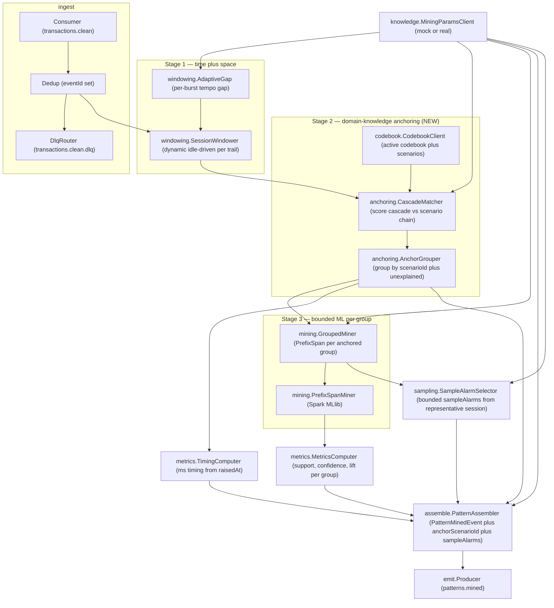
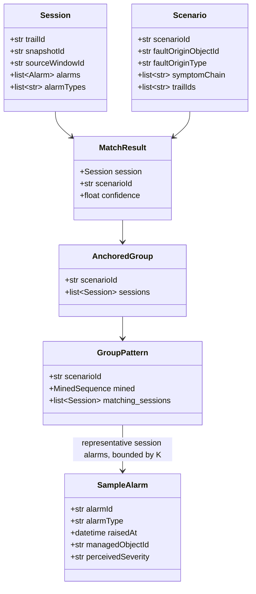
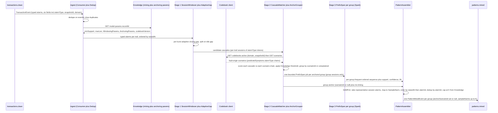
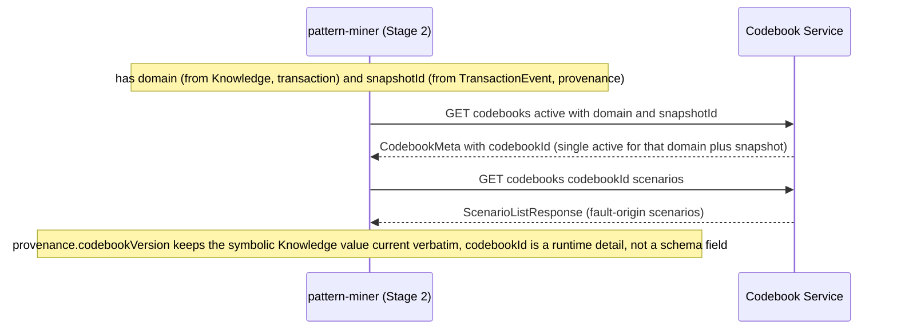
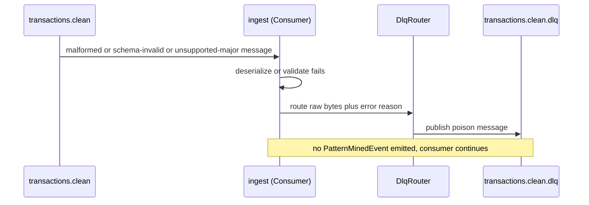
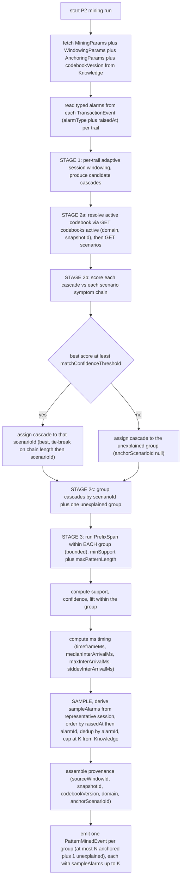
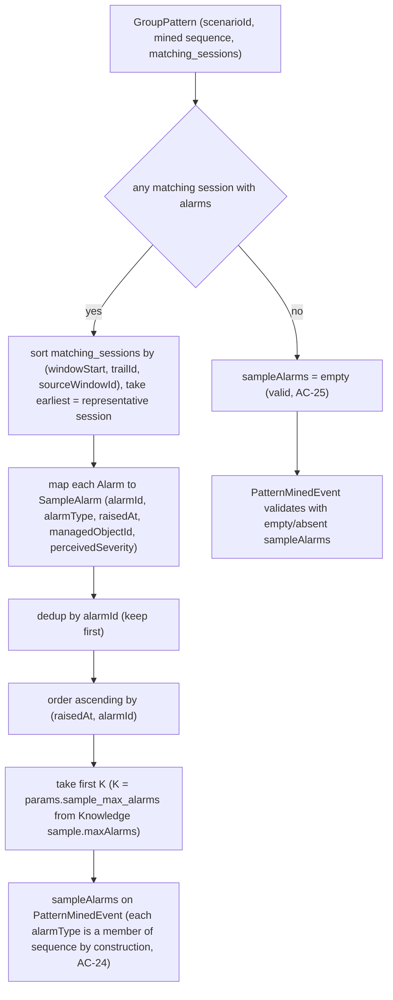
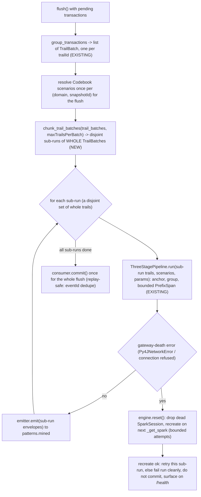

# pattern-miner — Design

> **EVOLUTION (P2 live-verified P2 blocker fix — trail-aligned batch cap + SparkContext resilience).**
> The 3-stage redesign below is algorithmically validated live (at anchoring threshold 0.3 cascades
> anchor to the correct fault-origin scenarios and Stage-3 per-group PrefixSpan produces accurate
> grounded patterns), **but the miner cannot EMIT on real batches**: the mining run pools the WHOLE
> flush's transactions (all ~46 trails) into one Spark collect, OOM-killing the 2g driver JVM
> (`Py4JNetworkError: Answer from Java side is empty` / connection refused, java process count to 0);
> after the OOM the cached `SparkSession` does **not** self-heal, so every subsequent run fails until
> container restart. Only tiny batches (1 and 9 transactions) ever emitted. This evolution adds two
> coordinated fixes, both **internal** (no contract change — see the batch-cap note below): a
> **trail-aligned batch cap** that bounds each mining RUN by a max number of WHOLE TRAILS (never
> splitting a trail across runs, so a fault cascade is never fragmented and per-run support is not
> diluted), processing a larger flush as multiple bounded **sub-runs** (each = a disjoint set of whole
> trails, each doing anchor to group to PrefixSpan to emit to commit independently, replay-safe under
> at-least-once + eventId dedupe); and **SparkContext resilience** so a driver OOM/death recreates the
> Spark session before the next run (or fails the run cleanly and surfaces it) — never a silent
> permanent wedge. The relevant NEW/CHANGED sections are tagged **[BATCH-CAP]** throughout; the
> 3-stage discovery logic (Stages 1/2/3, anchoring, output contract) is **unchanged**.

> **[BATCH-CAP] No contract change.** The trail cap is an operational batching knob (like the existing
> `BATCH_FLUSH_SECONDS`), sourced from env/config with an optional Knowledge override — NOT a mining
> threshold, so it is **not** on the mining/anchoring critical path and needs no new required field.
> The emitted `PatternMinedEvent` shape (incl. `provenance.anchorScenarioId`) is **unchanged**;
> sub-runs emit the **same event shape** the single run did — just in bounded batches. Because the same
> `anchorScenarioId` can now appear in more than one sub-run's `patterns.mined` output,
> **pattern-manager** gains **anchor-identity consolidation** (its own design evolution,
> `design/pattern-manager-anchor-consolidation`) to collapse those into one Pattern Store pattern. No
> new topic, payload, or field is introduced by either part. This part flags **no** contract change.

> **EVOLUTION (sampleAlarms[] XAI member-alarm evidence — focused ADD).** This design adds one
> capability on top of the 3-stage pipeline: when the miner assembles each `PatternMinedEvent` per
> anchored group it now also populates the optional `sampleAlarms[]` field with a **bounded,
> representative subset of the real member alarms** of the pattern's supporting session, so operators
> downstream (pattern-manager to web-ui) can see the concrete alarm instances behind the abstract
> alarm-type sequence (XAI). Each sample carries the five fields already present on
> `TransactionEvent.alarms[]` items: `{alarmId, alarmType, raisedAt, managedObjectId,
> perceivedSeverity}`. The sample is drawn from alarms the run **already holds in memory** (the
> `Session.alarms` of the group's representative session) — **no new Kafka input, no new topic, no
> fabrication, no new state**. The cap **K** is Knowledge-sourced (a new dotted key
> `sample.maxAlarms`; no hard-coded literal). Sampling is **deterministic** (same input to same
> sample) so re-mining is replay-safe. The NEW/CHANGED sections for this are tagged **[SAMPLE]**
> throughout; Stages 1/2/3 discovery, anchoring, batch-cap, and the emitted event shape are otherwise
> **unchanged**.

> **[SAMPLE] No contract change; event-model branch-sync is a build prerequisite.**
> `PatternMinedEvent.sampleAlarms[]` (an optional array of `SampleAlarm{alarmId, alarmType, raisedAt,
> managedObjectId, perceivedSeverity}`, `extra="forbid"`, NOT in `required`) is **already landed in
> `libs/event-model` on `main` via PR #349**, backward-compatible. This design **emits** it and
> introduces **no new event-model/contract change** — no new topic, payload shape, or required field.
> **Build prerequisite (not a contract decision):** the `pattern-miner` branch's *bundled*
> `libs/event-model` is currently BEHIND `main` and does **not** yet carry `sampleAlarms`/`SampleAlarm`
> on the Python `PatternMinedEvent` binding. The build must **sync `libs/event-model` to `main`** — the
> same surgical event-model sync done for pattern-manager via PR #341 — **before** the field can be
> referenced in code or tests (so `acp_event_model.PatternMinedEvent` has `sampleAlarms` and
> `SampleAlarm` importable and the emitted field validates). This is an implementation step, not a new
> contract change; the contract is already frozen on `main`.

> **Based on the not-yet-merged resolved spec (PR #332).** This design is authored against
> `services/pattern-miner/spec.md` as it stands on `spec/pattern-miner-3stage-resolved` (OQ-1/OQ-2
> resolved; OQ-3 resolved here). It should merge **after** spec PR #332 merges into `pattern-miner`.
> The three-stage discovery this design realizes supersedes the previous global-PrefixSpan design.

> **Scope of this service (paramount boundary).** pattern-miner is **ML execution + domain-knowledge
> anchoring** for the Pattern Learning phase (P2): three stages — (1) time+space session windowing,
> (2) domain-knowledge anchoring against Codebook fault-origin scenarios, (3) bounded PrefixSpan
> **per anchored group** — emitting one `PatternMinedEvent` per anchored fault-origin (plus one for
> the unexplained group) on `patterns.mined`. It holds **no pattern state** — **no RCA**, no
> `rootCauseAlarmType`, no `patternId`, no `lifecycle`, no codebook *reconciliation* (Stage 2 only
> *anchors* against the codebook; full reconciliation is the Pattern Manager's), no explainability
> (XAI), and no Pattern Store. Those belong exclusively to the Pattern Manager. This boundary is
> enforced by the frozen `PatternMinedEvent` schema (`extra="forbid"`) and asserted by the test plan.

> **No topology-graph access (boundary preserved; Codebook read is the only new dependency).** Stage 2
> adds a **Codebook client** (OQ-1 = Option A) that reads fault-origin scenarios over HTTP. It reads
> **scenarios only** — it does NOT touch the NebulaGraph topology graph (Topology Service's sole
> ownership) and grants no graph access. Trail scoping is still taken from
> `TransactionEvent.trailId`, never by querying the graph.

> **Output contract already landed (do NOT change).** `PatternMinedEvent.provenance.anchorScenarioId`
> (optional/nullable string; null/absent = unexplained) is already in `libs/event-model` on `main`
> (PR #331) — both the JSON Schema and the Python `Provenance` binding
> (`anchorScenarioId: str | None = None`, `extra="forbid"`). This design **emits** it from Stage 2's
> anchor result and introduces **no new event-model/contract change**.

## Stack

- **Language:** Python 3.13 (cohort pin per `CLAUDE.md`).
- **Mining engine (Stage 3):** **PySpark + Spark MLlib `PrefixSpan`** (Apache-2.0) for frequent
  ordered-sequence mining — now run **per anchored group** (bounded), not globally. Runs
  container-only (Spark/PySpark not installed locally); the pure-Python `local` engine
  (`mining.local_engine`) gives identical semantics for the local unit gate.
- **Runtime:** stateless Spark job inside its own Docker container (`python:3.13-slim` + pinned
  Spark runtime).
- **Kafka client:** `confluent-kafka` / `kafka-python` (Apache-2.0) for the consumer/producer/DLQ loop.
- **Event model:** `acp-event-model` (Python/Pydantic binding) — source of truth for
  `TransactionEvent` (typed `alarms[]`), `PatternMinedEvent`, `Provenance` (incl.
  `anchorScenarioId`), **`SampleAlarm`** (the `sampleAlarms[]` item type — 5 fields, `extra="forbid"`),
  the envelope, and the codec. **[SAMPLE]** requires the `main`-synced event-model (PR #349 field;
  synced onto this branch per the build prerequisite above).
- **HTTP clients (integration points):** `httpx` (permissive) for the **Knowledge client**
  (`knowledge.MiningParamsClient`, existing) and the **new Codebook client** (`codebook.CodebookClient`);
  `respx` (BSD) for both unit-test mocks, generated against each collaborator's published
  `openapi.json`.
- **HTTP for `/health` + `/metrics`:** minimal ASGI app (`starlette`/`fastapi`, MIT) +
  `prometheus-client` (Apache-2.0). No business HTTP surface.
- **Lint/format/typing:** ruff + black + type hints; **pytest** for unit/contract tests.
- All dependencies are permissive (MIT / Apache-2.0 / BSD).

## Task breakdown (from the spec)

Every spec **Task (high-level)** is realized below; none is dropped or re-scoped. The 3-stage respec
adds Stage 2 (anchoring) and re-scopes Stage 3 (bounded PrefixSpan per group).

| Spec task | Realized by (modules / flow) |
|---|---|
| 1. Consume `transactions.clean`, dedupe `TransactionEvent` on envelope `eventId` (at-least-once). | `ingest.Consumer` reads `transactions.clean`, deserializes via `acp_event_model.codec`; `ingest.Dedup` tracks processed `eventId`s for the current run and silently acks+drops duplicates. **Unchanged.** |
| 2. Fetch mining **and anchoring** params from Knowledge before each run (min-support, max-pattern-length, windowing adaptation params incl. base/fallback gap, max-sequence-count, **domain-anchoring matching confidence threshold**, **grouping keys**, `codebookVersion` in scope); no hard-coded thresholds. | `knowledge.MiningParamsClient` calls the frozen `GET /domains/{domain}/model-params/{recordId}`, maps `payload.params[]` dotted keys into typed `MiningParams`. **Extended:** `MiningParams` gains an `AnchoringParams` block (`anchoring.matchConfidenceThreshold`, `anchoring.groupingKeys`, `anchoring.scoringMethod`, `anchoring.tieBreak`, scorer weights) + `codebookVersion`. **[SAMPLE] also extended:** `MiningParams` gains a typed `sample_max_alarms: int` field mapped from the new Knowledge dotted key **`sample.maxAlarms`** (K, the sample-alarm cap). Parsed by `MiningParamsClient` exactly like the other dotted keys (`_require(m, KEY_SAMPLE_MAX_ALARMS)` — required, no code default, so replacing the Knowledge mock's K changes behaviour with no code change). No threshold/cap literal in source/default config. |
| 3. **Stage 1 — Time + space correlation.** Dynamic activity/idle session window per trail: pool per-trail alarms ordered by `raisedAt`, split at idle gaps; the closing gap adapts to each burst's tempo; all params Knowledge-sourced incl. base/fallback gap. | `windowing.SessionWindower` + `windowing.AdaptiveGap` (**EXISTS, kept as-is** — see Algorithm logical flow → Stage 1). Output = per-trail **candidate cascades** (`Session`s), each an ordered `alarmType`-token sequence with a composite `sourceWindowId`. This output feeds Stage 2. |
| 4. **Stage 2 — Domain-knowledge anchoring.** For each candidate cascade, fetch domain fault-origin scenarios from the Codebook (via pattern-miner's Codebook client, built against Codebook OpenAPI), resolve the active codebook (OQ-3), call `GET /codebooks/{codebookId}/scenarios`, match the cascade's ordered `alarmType` sequence against each scenario's `predictedSymptoms[].alarmType` chain, assign the best match if confidence at/above the Knowledge threshold else "unexplained"; group cascades by anchor. | **NEW** `codebook.CodebookClient` (resolves `codebookVersion="current"` to `codebookId` via `GET /codebooks/active?domain=&snapshotId=` then `GET /codebooks/{id}/scenarios`) + `anchoring.CascadeMatcher` (scores each cascade against each scenario chain, applies the Knowledge threshold + tie-break) + `anchoring.AnchorGrouper` (groups by `scenarioId`, with the null/unexplained group). Records `provenance.anchorScenarioId`. See Algorithm logical flow → Stage 2. |
| 5. **Stage 3 — ML pattern definition.** Run PrefixSpan (Spark MLlib) **within each anchored group** (bounded, not globally) to learn the group's canonical ordered `alarmType` signature, support, confidence, lift; also within the unexplained group if non-empty. | `mining.PrefixSpanMiner` (**EXISTS**) is **re-scoped**: `mining.GroupedMiner` iterates anchored groups and runs `PrefixSpanMiner` **per group** over that group's sessions only. `metrics.MetricsComputer` computes support/confidence/lift **relative to the group**. Bounded scope removes the global-mining OOM (JVM kernel-kill on dense global sessions). |
| 6. Assemble one `PatternMinedEvent` per anchored group carrying `sequence`, `support`, `confidence`, `lift`, `trailId`(s), `timing` (ms inter-arrival stats), `provenance` (`sourceWindowId`, `snapshotId`, `codebookVersion`, **`anchorScenarioId`**), **and [SAMPLE] `sampleAlarms[]`**. Unexplained group to `anchorScenarioId` null/absent. | `assemble.PatternAssembler` (**EXTENDED**) sets `provenance.anchorScenarioId` = the group's matched `scenarioId` (or `None`). `timing` via `metrics.TimingComputer` (ms keys, unchanged). **[SAMPLE] NEW:** a `sampling.SampleAlarmSelector` derives `sampleAlarms[]` from the group's **representative session** (`GroupPattern.matching_sessions[0]`, chosen deterministically — see [SAMPLE] flow), maps each `Alarm` to a `SampleAlarm{alarmId, alarmType, raisedAt, managedObjectId, perceivedSeverity}`, orders by `(raisedAt, alarmId)` ascending, dedups by `alarmId`, and applies the Knowledge cap K (`params.sample_max_alarms`). The result (possibly empty) is passed to `PatternMinedEvent(sampleAlarms=...)`; empty gives `sampleAlarms=[]` (or omitted) — still valid. |
| 7. Emit each `PatternMinedEvent` on `patterns.mined` (one per anchored group + one unexplained if non-empty). | `emit.Producer` envelopes each event (`type="PatternMinedEvent"`, `schemaVersion=1`, `source="pattern-miner"`, propagated `traceId`) and produces to `patterns.mined`. |
| 8. Route any unprocessable (poison) message to `transactions.clean.dlq`. | `ingest.DlqRouter` catches deserialize/validation failures + unknown major `schemaVersion`, publishes raw bytes + structured error header to `transactions.clean.dlq`, continues. **Unchanged.** |

**[BATCH-CAP] New realizations (evolve tasks 3-7's batching; the discovery logic per task is unchanged).**

| Spec task (batching aspect) | Realized by (modules / flow) — [BATCH-CAP] |
|---|---|
| 3-7 (per-run scope). A mining RUN must be bounded so its Spark collect fits the driver heap, **without splitting any trail** across runs. | **NEW** `assemble.chunk_trail_batches(trail_batches, max_trails_per_batch)` in `assemble.py` partitions the run's `list[TrailBatch]` (already one whole `TrailBatch` per `trailId` from the existing `group_transactions`) into **disjoint sub-runs**, each holding **at most `maxTrailsPerBatch` WHOLE `TrailBatch`es** (never a fraction of one). `app.py`'s `flush()` iterates the sub-run chunks and runs the **existing** `ThreeStagePipeline.run(...)` + `emitter.emit(...)` **per sub-run**, committing offsets only after all sub-runs of the flush succeed (at-least-once + `eventId` dedupe keep replay safe). Each sub-run does anchor to group to PrefixSpan to emit independently; the Codebook scenario set is fetched once per `(domain, snapshotId)` and reused across that flush's sub-runs. |
| 2 (config source). The trail cap is a batching knob, not a mining threshold. | `Settings.max_trails_per_batch` (env `MAX_TRAILS_PER_BATCH`, default **8**) in `config.py`, plus an **optional** Knowledge override `batching.maxTrailsPerBatch` mapped by `MiningParamsClient` into `MiningParams.max_trails_per_batch` (env is the fallback when Knowledge omits it). Justified default (see Config): busiest single trail approx 90 txns / up to 76 sessions mines fine; 8 whole trails keeps the per-sub-run collect within a few hundred sessions, safely under the 2g driver envelope, with headroom below the ~46-trail whole-flush that OOMs. |
| 3-7 (resilience). A driver OOM/gateway death must not wedge the service forever. | **NEW** SparkContext resilience: `mining/spark_engine.py` gains a `reset()` (drops the cached dead session); `mining/engine.py`'s `PrefixSpanEngine` protocol gains `reset()`/`is_healthy()`; the local engine implements them as no-ops. `app.py`'s per-sub-run `try/except` detects a **gateway-death** class error (`Py4JNetworkError`, `Py4JError`, connection-refused `OSError`) and, before the next sub-run/flush, calls `engine.reset()` so `_get_spark()` recreates a fresh `SparkSession` (bounded recreate attempts from config). If recreation cannot succeed within the deadline, the run **fails cleanly** (offsets not committed, non-zero health) — surfaced on `/health` and a `spark-recreate-failures` metric — never a silent permanent wedge. |

## Phase applicability (design view)

Consistent with the canonical phase map in `docs/architecture.md` (row `pattern-miner`: Idle /
Active / Idle).

| Phase | Active/Passive/Idle | Modules/handlers exercised | Inputs/Outputs |
|---|---|---|---|
| P1 — Topology onboarding | Idle | All modules dormant; only `/health` answers. | — |
| P2 — Pattern learning | **Active** | `ingest.Consumer`+`Dedup`+`DlqRouter`; `knowledge.MiningParamsClient`; **`codebook.CodebookClient`**; `windowing.SessionWindower`+`AdaptiveGap` (Stage 1); **`anchoring.CascadeMatcher`+`AnchorGrouper` (Stage 2)**; `mining.GroupedMiner`+`PrefixSpanMiner` (Stage 3); `metrics.MetricsComputer`+`TimingComputer`; **`sampling.SampleAlarmSelector`**; `assemble.PatternAssembler`; `emit.Producer`. | In: `transactions.clean` (`TransactionEvent`); Knowledge mining+anchoring params API; **Codebook scenarios API** (`GET /codebooks/active`, `GET /codebooks/{id}/scenarios`). Out: `patterns.mined` (`PatternMinedEvent`), `transactions.clean.dlq`. |
| P3 — Real-time correlation | Idle | All mining/anchoring modules dormant — mining is offline/learning-only; approved patterns are served by the Pattern Manager. Only `/health` + `/metrics` answer. | — |

## Module breakdown



- **ingest.Consumer / Dedup / DlqRouter** — as before (consume, dedupe on `eventId`, DLQ poison).
- **knowledge.MiningParamsClient** — fetches `MiningParams` (mining + windowing + **anchoring**
  params + `codebookVersion`) before a run; config-switchable mock/real. **Extended** with the
  anchoring block.
- **windowing.SessionWindower + AdaptiveGap** — Stage 1 (existing). Produces per-trail candidate
  cascades (`Session`s). Not redesigned.
- **codebook.CodebookClient** (NEW) — resolves the active codebook for `(domain, snapshotId)` and
  fetches its fault-origin scenarios; config-switchable mock/real against the Codebook OpenAPI.
- **anchoring.CascadeMatcher** (NEW) — scores each candidate cascade's ordered `alarmType` sequence
  against each scenario's `predictedSymptoms[].alarmType` chain; applies the Knowledge match-confidence
  threshold + tie-break; returns the best-matching `scenarioId` or `None` (unexplained).
- **anchoring.AnchorGrouper** (NEW) — groups candidate cascades by assigned `scenarioId` (one group
  per fault-origin) plus a single unexplained (`None`) group.
- **mining.GroupedMiner** (NEW thin driver) — iterates anchored groups; for each runs
  `PrefixSpanMiner` over **that group's sessions only** (bounded scope) and selects the group's
  representative pattern.
- **mining.PrefixSpanMiner** (existing) — Spark MLlib `PrefixSpan` over a set of sessions; now
  invoked per group.
- **metrics.MetricsComputer / TimingComputer** — support/confidence/lift computed **within the group**;
  ms `timing` from `alarms[].raisedAt` (keys unchanged).
- **sampling.SampleAlarmSelector** (**[SAMPLE] NEW**) — pure Python, no Spark. Given a `GroupPattern`
  and the Knowledge cap K, selects the group's **representative session** deterministically
  (`matching_sessions[0]` — the earliest by window start, see [SAMPLE] flow), maps its `Session.alarms`
  (typed `Alarm`s) into `SampleAlarm`s, orders by `(raisedAt, alarmId)` ascending, dedups by `alarmId`,
  truncates to the first K, and returns `list[SampleAlarm]` (empty when the session has no alarms). No
  fabrication, no persistence, no HTTP — derives entirely from in-run session data.
- **assemble.PatternAssembler** (extended) — builds `PatternMinedEvent` + `Provenance`; sets
  `provenance.anchorScenarioId` from the group's anchor; **[SAMPLE]** sets `sampleAlarms=` the
  `SampleAlarmSelector` output.
- **emit.Producer** — envelopes + produces to `patterns.mined`.

## Data model / DB schema

**N/A — no owned store.** pattern-miner is a stateless Spark job: it mines, emits, and forgets (spec
"Data owned: None"). The only in-memory state is the per-run `Dedup` set of processed `eventId`s
(idempotency within a run) and the per-run cached Codebook scenario list (fetched once per run, not
persisted). No PostgreSQL/NebulaGraph schema is owned — the Pattern Store belongs exclusively to the
Pattern Manager; the topology graph to the Topology Service; the codebook store to the Codebook
Service.

The transient in-run data shapes (not persisted) are:



(`MatchResult.scenarioId` / `AnchoredGroup.scenarioId` / `GroupPattern.scenarioId` are `None` for the
unexplained group.)

**[SAMPLE]** `SampleAlarm` is the `libs/event-model` payload item type (5 fields, `extra="forbid"`);
it is **not** an owned persisted entity — it is derived in-memory at emit time from the
`GroupPattern.matching_sessions[0].alarms` (real `Alarm`s already held in the run) and carried on the
emitted `PatternMinedEvent.sampleAlarms[]`. Nothing about the sample is stored — the miner stays
"emit and forget".

## Event handling

- **Consumers:**
  - `transactions.clean` to `ingest.Consumer`. Payload: `TransactionEvent` (event-model), ordered
    typed `alarms[]` with six required fields (`{alarmId, alarmType, eventType, raisedAt,
    managedObjectId, perceivedSeverity}`). Sequence item = **`alarmType`** (canonical join token; not
    `eventType`, not `probableCause`). **Idempotency/dedupe key:** envelope **`eventId`** —
    duplicates acked + dropped (AC-15). **DLQ routing:** deserialize failure, schema-validation
    failure, or unsupported major `schemaVersion` to `transactions.clean.dlq` (AC-16).
- **Producers:**
  - `patterns.mined` from `emit.Producer`. Payload: **`PatternMinedEvent`**, **one per anchored
    group** (plus one unexplained if non-empty) — AC-10. Envelope: `type="PatternMinedEvent"`,
    `schemaVersion=1`, `source="pattern-miner"`, `traceId` propagated where available. **[SAMPLE]**
    each event may carry an optional **`sampleAlarms[]`** (up to K `SampleAlarm` items, each with
    `{alarmId, alarmType, raisedAt, managedObjectId, perceivedSeverity}`) — a bounded, representative
    subset of the pattern's real member alarms for downstream XAI. Optional (not in `required`);
    absent/empty when no sample could be captured (AC-25). The field is already frozen on `main`
    (PR #349) — no contract change.
  - `transactions.clean.dlq` from `ingest.DlqRouter` (poison messages; raw bytes + structured error
    header).
- **Provenance:** `sourceWindowId` = the group's representative session reference; `snapshotId` =
  source `TransactionEvent.snapshotId`; `codebookVersion` = Knowledge mining-params value (symbolic,
  e.g. `"current"`); `domain` = source transaction's `domain`; **`anchorScenarioId`** = the group's
  matched `scenarioId` (or `None`/absent for the unexplained group).

## API contracts / API schema

**N/A — no business HTTP surface; no published OpenAPI spec.** pattern-miner exposes only
operational endpoints:

- `GET /health` returns `200 {"status":"ok"}` (liveness/readiness; reports Kafka + Knowledge +
  **Codebook** reachability).
- `GET /metrics` returns Prometheus exposition format.

The service's **inbound** contracts are the Kafka topic + event-model payloads; its **outbound**
synchronous contracts are the Knowledge and Codebook services' published `openapi.json` (see
Integration points). No OpenAPI document is published for pattern-miner.

## Integration points (mock vs. real)

| Collaborator + operation | Endpoint (published shape) | Config key(s) | Mock (unit) | Real (integration) |
|---|---|---|---|---|
| **Knowledge — mining + anchoring params** | `GET /domains/{domain}/model-params/{recordId}` returns the versioned-record envelope `payload.params[]` with dotted keys `prefixspan.*`, `window.adaptive.*`, **`anchoring.matchConfidenceThreshold`**, **`anchoring.groupingKeys`**, **`anchoring.scoringMethod`**, **`anchoring.tieBreak`**, `codebookVersion`. `404` unknown domain/record. | `KNOWLEDGE_BASE_URL`, `KNOWLEDGE_CLIENT_MODE` (`mock`/`real`), `KNOWLEDGE_DOMAIN`, `KNOWLEDGE_MODEL_PARAMS_RECORD_ID` | `respx` stub generated from the Knowledge published `openapi.json` | Live Knowledge Service at the Compose address from env |
| **Codebook — active codebook resolution** (NEW) | `GET /codebooks/active?domain={domain}&snapshotId={snapshotId}` returns `CodebookMeta {codebookId, snapshotId, domain, scenarioCount, active?, …}`. Both query params **required** (verified against `/openapi.json`). `404` if no active codebook for `(domain, snapshotId)`. | `CODEBOOK_BASE_URL`, `CODEBOOK_CLIENT_MODE` (`mock`/`real`), `CODEBOOK_RETRY_MAX`, `CODEBOOK_RETRY_BACKOFF_MS` | `respx` stub generated from the Codebook published `openapi.json` | Live Codebook Service at the Compose address from env |
| **Codebook — fault-origin scenarios** (NEW) | `GET /codebooks/{codebookId}/scenarios` returns `ScenarioListResponse {codebookId, domain, scenarios:[{scenarioId, faultOriginObjectId, faultOriginType, predictedSymptoms:[{alarmType, managedObjectId}], trailIds:[…]}]}`. `404` unknown codebook. | (as above) | `respx` stub returning the scenario list | Live Codebook Service |

- **No hard-coded URLs.** All base URLs + `mock`/`real` toggles + `domain` come from env. No
  domain-specific literal (alarm type, fault-origin name, scenarioId) appears anywhere in source or
  default config (spec Non-functional / AC-17).
- **Both Codebook endpoints and the scenario shape are verified against the live Codebook
  `/openapi.json`** (`GET /codebooks/active` requires `domain`+`snapshotId`; scenario shape carries
  `scenarioId`, `faultOriginObjectId`, `faultOriginType`, `predictedSymptoms[]`, `trailIds[]`). The
  client and its respx mock are generated against that published spec — never against Codebook
  source.

## Key flows (sequence / data-flow diagrams)

### Primary success path — 3-stage P2 mining run



### OQ-3 resolution — codebookVersion "current" to concrete codebookId



### Poison-message / DLQ path



## Algorithm logical flow

The Miner reads all tunables from **Knowledge** (never hard-coded): `minSupport`, `maxPatternLength`,
`maxSequenceCount`, `WindowingParams`, and the new `AnchoringParams`
(`matchConfidenceThreshold`, `groupingKeys`, `scoringMethod`, `tieBreak`, scorer weights); the
fault-origin scenario set from **Codebook**. Inputs: a batch of `TransactionEvent`s with typed
`alarms[]`. Output: one `PatternMinedEvent` per anchored group (+ one unexplained if non-empty).



### Stage 1 — Time + space correlation (EXISTING, retained unchanged)

Stage 1 is the already-built dynamic activity/idle session windowing (`windowing.SessionWindower`,
`windowing.AdaptiveGap`) — this design **retains it as-is** and does not redesign it beyond what the
respec requires. Summary of the retained mechanism (full detail unchanged from the merged design):

- Per trail, pool the typed `alarms[]` across the run, order by `raisedAt`.
- Compute a per-burst **adaptive closing gap**:
  `closingGap = clamp(gapMultiplier * median(interArrivals), lower=profileFloor(tempoClass), upper=maxClosingGap)`,
  with a Knowledge `baseGap` fallback when a burst has too few samples (below `minBurstSamples`) or
  no tempo-class profile matches. The split gap is **sized on the median (p50)** for robustness;
  `tempoPercentile` is used only to **classify** the burst's tempo (floor/ceiling selection).
- Split the trail into sessions where the inter-arrival gap exceeds the closing gap. Each session is
  a **candidate cascade** with a composite `sourceWindowId` (deterministic hash of
  `trailId`+session start/end `raisedAt`+`snapshotId`).

**Output to Stage 2:** the set of candidate cascades (`Session`s), each carrying its ordered
`alarmType` token list (from `alarms[].alarmType`), its `alarms[]` (for later timing), its `trailId`,
`snapshotId`, and `sourceWindowId`. AC-1/AC-2/AC-3 assert Stage 1 behaviour and are unchanged.

### Stage 2 — Domain-knowledge anchoring (NEW) — the accuracy crux

**Goal:** assign each candidate cascade to exactly one fault-origin identity (a Codebook
`scenarioId`) or to "unexplained", so that the emitted pattern set is small and accurate — **zero
over-split** (one ground-truth fault-origin to one group) and **zero over-merge** (one group to one
fault-origin).

**2a. Resolve the codebook and fetch scenarios (OQ-3 resolved).**
The miner already knows `domain` (Knowledge/transaction) and `snapshotId` (on every
`TransactionEvent`, propagated into provenance). It resolves the active codebook with the **existing**
endpoint `GET /codebooks/active?domain={domain}&snapshotId={snapshotId}` returning
`CodebookMeta.codebookId` (the Codebook store guarantees a single active codebook per
`(domain, snapshotId)`), then fetches `GET /codebooks/{codebookId}/scenarios`. The symbolic
`codebookVersion="current"` from Knowledge is **recorded verbatim** into `provenance.codebookVersion`;
the concrete `codebookId` is a runtime detail, not a schema field. **No Codebook API change is
required** (see OQ-3 below). Scenarios are fetched **once per run** and cached in memory. Each
scenario's canonical fault-origin signature is its ordered `predictedSymptoms[].alarmType` list — the
**symptom chain**.

**2b. Match a cascade against a scenario chain.**
Let `C` = the alarmType tokens of the cascade ordered by `raisedAt`, and `S` = a scenario's ordered
`predictedSymptoms[].alarmType` chain. The scorer is selected by the Knowledge-sourced
`anchoring.scoringMethod` (default `ordered_subsequence_jaccard`), computing a match confidence in
`[0, 1]`. The chosen (default) score combines **ordered-chain coverage** and **set overlap** — this
pairing is what delivers no-over-split AND no-over-merge:

```text
# de-duplicate consecutive repeats in C first (storms repeat a token); keep order.
lcs_ratio  = LCS(C_ordered, S) / len(S)                  # how much of the chain, IN ORDER, the cascade contains
jaccard    = size(set(C) intersect set(S)) / size(set(C) union set(S))   # penalizes extra unrelated tokens
confidence = w_order * lcs_ratio + w_jaccard * jaccard   # w_order + w_jaccard = 1, both from Knowledge (default 0.7 / 0.3)
```

Why this shape hits the accuracy target:
- **`lcs_ratio` (ordered coverage) prevents over-split.** Two cascades from the *same* fault-origin
  that manifest slightly differently (a missing/reordered symptom, extra noise-cluster remnant) still
  both cover most of the *same* ordered chain, so both clear the threshold against the *same* scenario
  and land in the **same** group — one pattern, not two. Matching on the codebook's fault-origin chain
  (a stable, authored identity) rather than on the raw mined shape is exactly what removes over-split:
  variants of one fault-origin collapse to one anchor.
- **`jaccard` (set overlap, incl. the union denominator) prevents over-merge.** A cascade that
  contains one scenario's chain *plus* many unrelated tokens (or partially overlaps two scenarios) is
  penalized by the union denominator, so it does not spuriously merge into a fault-origin it doesn't
  belong to; and the **best-single-scenario** assignment (argmax, one anchor per cascade) means a
  cascade is never placed in two groups. One group therefore maps to one fault-origin.
- The **threshold** (`anchoring.matchConfidenceThreshold`, from Knowledge) is the dividing line
  between "confidently this fault-origin" and "unexplained". Because it is Knowledge-sourced, tuning
  it (AC-7) changes anchored-vs-unexplained with **no code change**.

**2c. Assign and group.**
For each cascade, compute confidence against every scenario and pick the **argmax**. If the max
confidence is at/above `matchConfidenceThreshold`, assign the cascade to that scenario's `scenarioId`
(**tie-break**, from Knowledge `anchoring.tieBreak`, default: longer scenario chain wins, then
lexicographically smallest `scenarioId` — deterministic). Otherwise assign to the **unexplained**
group (`scenarioId = None`). Then `AnchorGrouper` groups all cascades by their assigned key: one group
per distinct `scenarioId`, plus at most one unexplained group. **Grouping keys** are the Knowledge
`anchoring.groupingKeys` (default `["scenarioId"]`) — domain-agnostic and configurable.

This yields **at most N+1 groups** for N distinct anchored fault-origins (AC-10), and by construction
no cascade appears in two groups (AC-4/AC-5/AC-20).

### Stage 3 — Bounded ML pattern definition (re-scoped EXISTING)

`mining.GroupedMiner` iterates the anchored groups. For **each** group it runs the existing
`mining.PrefixSpanMiner` (Spark MLlib `PrefixSpan`) over **only that group's** session sequences
(ordered lists of `alarmType` tokens), with `minSupport` / `maxPatternLength` from Knowledge:

- **Bounded scope removes the OOM.** Global PrefixSpan on the full dense session corpus was
  kernel-killed (JVM OOM) and produced ~2,592 frequent sub-fragments. Running it **per anchored
  group** (each group is a small, homogeneous set of one fault-origin's cascades) bounds both memory
  and the frequent-sequence lattice — the primary reason the 3-stage approach is both accurate *and*
  tractable.
- **Representative pattern per group.** Within a group, PrefixSpan yields frequent ordered
  `alarmType` subsequences; `GroupedMiner` selects the group's **representative** learned pattern —
  the maximal frequent ordered sequence meeting `minSupport` (truncated to `maxSequenceCount` /
  `maxPatternLength`) — which is that fault-origin's canonical signature. That single representative
  becomes the group's one `PatternMinedEvent` (AC-9, AC-10, AC-20).
- **Metrics within the group.** `support` = frequency of the sequence **within the group's sessions**;
  `confidence` = P(sequence given its longest proper prefix) within the group; `lift` = joint support
  / product of marginals within the group. `conviction` is not computed (not in the frozen schema).
- The **unexplained** group runs PrefixSpan the same way if non-empty, producing one
  `PatternMinedEvent` with `anchorScenarioId` null/absent (AC-21).
- **Token = `alarmType`.** The PrefixSpan item is always `alarms[].alarmType` (canonical join token),
  never `eventType` (X.733 category) or `probableCause` (AC-9).

### Timing statistics (contract-of-shape on the open `timing` object — unchanged from merged design)

`metrics.TimingComputer` emits **exactly** four ms sub-fields on the open `timing` object, computed
per group from `alarms[].raisedAt`, aggregated over the group's matching sessions:

| Key | Units | Definition |
|---|---|---|
| `timeframeMs` | ms | `max(raisedAt) minus min(raisedAt)` per matching session, median over sessions. |
| `medianInterArrivalMs` | ms | Median consecutive-alarm gap within the sequence, over the group's sessions. |
| `maxInterArrivalMs` | ms | Max consecutive-alarm gap over the group's sessions. |
| `stddevInterArrivalMs` | ms | Stddev of consecutive-alarm gaps over the group's sessions. |

Inter-arrivals are computed **within** a session (never across the idle boundary). Thin/degenerate
occurrences yield `0` for the affected keys; the schema `timing` object stays open
(`additionalProperties:true`) — **no event-model schema change**. These are the exact keys/units the
Pattern Manager `SessionWindowDeriver` consumes (AC-18).

### [SAMPLE] Sample-alarm selection (bounded XAI member-alarm evidence)

**Goal.** For each emitted `PatternMinedEvent`, attach a small, deterministic, representative set of
the pattern's **real member alarms** — concrete evidence behind the abstract `sequence` — bounded by
a Knowledge-sourced cap **K**. The sample is derived entirely from alarms the run already holds
(`GroupPattern.matching_sessions[*].alarms`, real `Alarm`s from the consumed `TransactionEvent`s);
there is **no new input, no fabrication, no persistence**.

**Where the alarms come from (source of truth).** Stage 3 already returns, per anchored group, a
`GroupPattern` whose `matching_sessions: list[Session]` are the sessions whose ordered `alarmType`
token list contains the group's representative `sequence`. Each `Session` holds the full typed
`alarms: tuple[Alarm, ...]` (5 fields available on each — `alarmId`, `alarmType`, `raisedAt`,
`managedObjectId`, `perceivedSeverity`). The sample is drawn from these. Because the sampled alarms
come from a session whose token list contains the representative `sequence`, **every sampled
`alarmType` is a member of the session's sequence, hence a member of the pattern's `sequence`** —
this holds **by construction** (AC-24), no filtering needed.

**Which session/occurrence to sample (OQ-SA-2 resolved — deterministic, single occurrence).** A
pattern may have several supporting sessions across trails/windows. The selector samples from **one
deterministically-chosen representative session** — `GroupPattern.matching_sessions[0]` — so the
sample corresponds to **one real, single occurrence** of the cascade (coherent evidence, not a
cross-occurrence mash-up) and is **reproducible**. To make "[0]" stable regardless of iteration
order, the selector first sorts `matching_sessions` by `(session_window_start_raisedAt, trailId,
sourceWindowId)` ascending and takes the earliest — i.e. the **earliest-by-window-start** supporting
occurrence. Rationale: (a) determinism/replay-safety — the same input always yields the same
representative session and therefore the same sample (idempotent re-mining, AC-"deterministic"); (b)
the earliest occurrence is the least likely to be a truncated tail of a longer burst; (c) it is a
single real occurrence, so the operator sees a coherent cascade, not alarms stitched from different
times/trails.

**Ordering + dedup + cap (OQ-SA-2 resolved).** Within the chosen session:
1. **Map** each `Alarm` to a `SampleAlarm{alarmId, alarmType, raisedAt, managedObjectId,
   perceivedSeverity}` (the 5 event-model fields; drop `eventType` which is not on `SampleAlarm`).
2. **Dedup** by `alarmId` (keep first occurrence) — guards against any repeated `alarmId` before the
   cap so K distinct alarms are shown.
3. **Order** ascending by `(raisedAt, alarmId)` — chronological within the occurrence, `alarmId` as a
   stable deterministic tie-break for equal timestamps.
4. **Cap** to the first **K** entries (`params.sample_max_alarms`). When the session has K or fewer
   distinct alarms, all are included; when more, exactly K.

**K — the Knowledge cap (OQ-SA-1 resolved).**
- **Dotted key:** `sample.maxAlarms` (integer), authored in the same Knowledge model-params record
  (`core-ip/modelParams/pattern-miner`) that already carries `prefixspan.*`, `window.adaptive.*`,
  and `anchoring.*`. Mapped by `MiningParamsClient` into a typed `MiningParams.sample_max_alarms:
  int` via a new `KEY_SAMPLE_MAX_ALARMS = "sample.maxAlarms"` constant. Read like every other param
  (`int(_require(m, KEY_SAMPLE_MAX_ALARMS))`) — **required, no code default** (AC-26). There is **no
  `K` / cap literal anywhere in source or default config**; a `test_no_hardcoded_thresholds`-style
  scan asserts this, and swapping the Knowledge mock's `sample.maxAlarms` changes the emitted array
  length with no code change (AC-23/AC-26).
- **Recommended authored default (Knowledge record value, not a code default):** **`10`**. Rationale:
  the sample is evidence for a human reviewer — roughly 5-15 concrete alarms is enough to judge a
  cascade's plausibility without flooding the web-ui card; 10 aligns with the per-pattern type-span
  band (10-20 in `integration-thresholds.yaml`) so a typical pattern's distinct member alarms are
  representable. This value lives **only** in the Knowledge record (the Knowledge owner authors
  `sample.maxAlarms=10` for `core-ip`); if Knowledge does not yet carry the key, the build adds it to
  the Knowledge model-params record — a Knowledge-record data change, **not** a pattern-miner code
  default and **not** a contract change.
- **Bound scope (OQ-SA-1 resolved — per emitted event):** K bounds the **final assembled
  `sampleAlarms[]` on each emitted `PatternMinedEvent`** (i.e. per anchored group / per pattern
  identity), **not** per session. The contract field is a single flat array that is the pattern's
  evidence, so one bounded list per pattern is the natural unit; and since the sample is drawn from a
  single representative session, "per event" and "per that session" coincide — the cap is applied
  once, to the final array. Justification: the operator reviews one pattern and wants one bounded,
  coherent evidence list for it, not K-per-session multiplied across occurrences.

**Empty / edge case (AC-25).** If the representative session has no alarms (or, defensively, no
matching session exists), the selector returns `[]`. `PatternMinedEvent(sampleAlarms=[])` (or
omitting the field) is valid — `sampleAlarms` is optional and not in `required`. The event still
emits; no error is raised.

**Determinism / replay-safety.** Every step above is a pure, order-stable function of the in-run
session data: representative-session choice (sorted, earliest), dedup (first-by-alarmId), ordering
(`(raisedAt, alarmId)`), and cap (first K). Re-mining the same input therefore yields a
**byte-identical `sampleAlarms[]`** — consistent with the miner's stateless "emit and forget" and
at-least-once + `eventId`-dedupe replay model. No Spark is involved: selection is pure Python over
`Session.alarms`, so it is fully testable without a Spark runtime.



### [BATCH-CAP] Trail-aligned batch cap + SparkContext resilience (the P2 blocker fix)

**Why the OOM happens (verified corpus shape).** The flush pools all transactions, `group_transactions`
returns one `TrailBatch` per `trailId` (46 distinct trails, 18-90 txns/trail, median 48), and the
**existing** `flush()` runs `ThreeStagePipeline.run(ALL 46 trail_batches)` in one pass — so the Stage-3
per-group PrefixSpan `.collect()` (in `spark_engine.run`) materializes sessions pooled from all 46
trails at once, blowing the 2g driver heap. The busiest single trail (approx 90 txns / up to 76
sessions) mines fine alone — it is the **pooling of all trails** that OOMs. The cap bounds each collect
to at-most-`maxTrailsPerBatch` trails' sessions (a few hundred), well inside the driver envelope.

**Why the cap is by WHOLE TRAILS, not record count.** A trail is the natural mining unit: one trail's
sessions carry one fault cascade's full symptom chain. A **record cap** could cut a trail mid-cascade,
fragmenting a cascade across two runs — that would dilute per-run support (a cascade's freq/sessions
would be split), corrupt Stage-2 anchoring (a partial chain scores lower and may fall to "unexplained"),
and violate the accuracy target. Capping by **whole trails** means every trail's sessions stay intact
in exactly one sub-run, so for that trail the cascade is never fragmented and its per-run support is
**not diluted**. A single trail that alone exceeds the cap is still processed **whole** in its own
sub-run (the cap is a *max whole trails per sub-run*, and the verified busiest trail fits the heap).



**Offset commit + replay safety.** Offsets for the flush are committed **once, after all sub-runs
succeed**. If a middle sub-run fails (Codebook down, Spark death that cannot recreate), the flush is
not committed and the whole flush replays; already-emitted sub-run events are harmless because
`eventId` dedupe (miner-side) drops re-consumed transactions and pattern-manager's **anchor-identity
consolidation** (companion design) collapses any re-emitted anchored patterns — so at-least-once
redelivery never double-counts. (Committing per-sub-run is an alternative considered and rejected —
see Design alternatives — because it complicates partial-flush bookkeeping for no correctness gain
given downstream consolidation.)

**Support is per-sub-run but NOT diluted per cascade.** `support`/sessions-in-run for an anchored
group are computed over that sub-run's sessions. Because a trail is never split, every session of a
given cascade that lands in a sub-run is present for that cascade's support in that sub-run — the
cascade is intact. What changes vs. the single-run design is only that the **same fault-origin may be
anchored in more than one sub-run** (if its trails are spread across chunks), producing more than one
`PatternMinedEvent` for one real pattern. That is resolved **downstream** by pattern-manager
anchor-consolidation (which sums occurrences and combines support across the contributing mined
events) — the miner deliberately does **not** try to re-pool trails to force one event, because that
would re-introduce the unbounded collect the cap exists to prevent.

**SparkContext resilience (no silent wedge).** The cached `SparkSession` in `spark_engine` survives a
driver OOM as a **dead handle** — the current code keeps using it, so every later run fails until
container restart. The fix: on a detected gateway-death error class the per-sub-run handler calls
`engine.reset()` (nulls the cached session); the next `_get_spark()` builds a fresh session (bounded by
`SPARK_RECREATE_MAX_ATTEMPTS` with `SPARK_RECREATE_BACKOFF_MS`). If recreation succeeds the sub-run is
retried; if it exhausts attempts the run **fails cleanly** — offsets uncommitted, `spark-recreate-failures`
metric incremented, and `/health` reflects the Spark subsystem as not-ready (self-heals to ready on the
next successful session build; readiness never latches DOWN, per the Startup-Robustness Standard). The
container process stays up and keeps consuming; nothing is silently swallowed. The cap is the **primary**
fix (it prevents the OOM); resilience is the **safety net** for any residual death (e.g. an unusually
dense single trail or an external kill) — we do not "design around" the OOM by only catching it.

## Seed data & examples

**N/A — pattern-miner generates no seed corpus.** Test inputs are synthetic `TransactionEvent`
batches with typed `alarms[]` populated inline, plus **Codebook scenario fixtures** (respx-served,
generated against the Codebook `openapi.json`) and **Knowledge param fixtures** (respx-served).
Illustrative fixtures used by the test plan:

**Codebook scenario fixture (two distinct fault-origins) — domain-agnostic, served by the mock:**

```json
{
  "codebookId": "cb-001", "domain": "core-ip",
  "scenarios": [
    {"scenarioId": "SC-FIBER", "faultOriginObjectId": "obj-fiber-1", "faultOriginType": "FiberCut",
     "predictedSymptoms": [{"alarmType": "FiberFault", "managedObjectId": "obj-fiber-1"},
                           {"alarmType": "LinkDown", "managedObjectId": "obj-link-1"},
                           {"alarmType": "AdjDown", "managedObjectId": "obj-rtr-1"}],
     "trailIds": ["trail-a", "trail-b"]},
    {"scenarioId": "SC-CARD", "faultOriginObjectId": "obj-card-1", "faultOriginType": "CardFail",
     "predictedSymptoms": [{"alarmType": "PortDown", "managedObjectId": "obj-card-1"},
                           {"alarmType": "InterfaceDown", "managedObjectId": "obj-if-1"}],
     "trailIds": ["trail-c"]}
  ]
}
```

**Worked anchoring example.** Cascade `C1 = [FiberFault, LinkDown, AdjDown]` (trail-a) vs `SC-FIBER`
chain `[FiberFault, LinkDown, AdjDown]`: `lcs_ratio = 3/3 = 1.0`, `jaccard = 3/3 = 1.0`, confidence
`= 0.7*1.0 + 0.3*1.0 = 1.0` at/above threshold to anchored to `SC-FIBER`. A second cascade
`C2 = [FiberFault, AdjDown]` (trail-b, one symptom missing) vs `SC-FIBER`: `lcs_ratio = 2/3` approx
`0.67`, `jaccard = 2/3` approx `0.67`, confidence approx `0.67` — if threshold is `0.5`, **also**
anchored to `SC-FIBER` (same group as C1 to **zero over-split**). A cascade `C3 = [Xyz, Abc]` matches
no chain well (confidence below threshold) to **unexplained**. Result: two anchored groups
(`SC-FIBER`, `SC-CARD`) + one unexplained to three `PatternMinedEvent`s.

**Worked timing example (ms keys):** session `raisedAt` `12:00:00.000 / 12:00:04.000 / 12:00:09.000`
gives gaps `4000, 5000` ms, span `9000` ms, so
`{timeframeMs:9000, medianInterArrivalMs:4500, maxInterArrivalMs:5000, stddevInterArrivalMs:500}`.

**[SAMPLE] Worked sample-alarm example.** The fiber-cut group's representative session (earliest by
window start) holds real member alarms:

```text
Alarm(alarmId=a-3, alarmType=AdjDown,    raisedAt=12:00:09Z, managedObjectId=router:r1,  perceivedSeverity=major)
Alarm(alarmId=a-1, alarmType=FiberFault, raisedAt=12:00:00Z, managedObjectId=fiber:f1,   perceivedSeverity=critical)
Alarm(alarmId=a-2, alarmType=LinkDown,   raisedAt=12:00:04Z, managedObjectId=link:l1,    perceivedSeverity=major)
Alarm(alarmId=a-1, alarmType=FiberFault, raisedAt=12:00:00Z, managedObjectId=fiber:f1,   perceivedSeverity=critical)  # dup alarmId
```

With Knowledge `sample.maxAlarms = 10` (K): dedup by `alarmId` drops the repeated `a-1`; order by
`(raisedAt, alarmId)` gives `a-1, a-2, a-3`; 3 <= K so all are kept. Emitted:

```json
"sampleAlarms": [
  {"alarmId": "a-1", "alarmType": "FiberFault", "raisedAt": "2026-01-01T12:00:00Z", "managedObjectId": "fiber:f1", "perceivedSeverity": "critical"},
  {"alarmId": "a-2", "alarmType": "LinkDown",   "raisedAt": "2026-01-01T12:00:04Z", "managedObjectId": "link:l1",  "perceivedSeverity": "major"},
  {"alarmId": "a-3", "alarmType": "AdjDown",    "raisedAt": "2026-01-01T12:00:09Z", "managedObjectId": "router:r1","perceivedSeverity": "major"}
]
```

Every `alarmType` here (`FiberFault`, `LinkDown`, `AdjDown`) is a member of the pattern `sequence`
`[FiberFault, LinkDown, AdjDown]` — by construction (AC-24). Change the mock's `sample.maxAlarms` to
`2` and re-mine the same input: the array becomes exactly `[a-1, a-2]` (first K in the same order),
no code change (AC-23/AC-26). Re-mining the same input always reproduces the identical array
(deterministic).

## UI wireframes

**N/A.** pattern-miner has no UI; pattern review/approve/edit belong to web-ui (against the Pattern
Manager).

## Error handling

| Failure mode | Handling | Surfaced as |
|---|---|---|
| Message bytes not valid JSON / not a valid envelope | `DlqRouter` to `transactions.clean.dlq`, raw bytes + error header; consumer continues (AC-16) | DLQ message + JSON error log; no emit |
| Payload fails `TransactionEvent` schema validation (`extra="forbid"`, missing/ill-typed `alarms[]`) | to `transactions.clean.dlq` (AC-16) | DLQ message + error log; no emit |
| Unsupported major `schemaVersion` (codec rejects major at least 2) | to `transactions.clean.dlq`, reason `unsupported_schema_version` | DLQ message + error log; no emit |
| Duplicate envelope `eventId` (at-least-once redelivery) | `Dedup` drops it; acked, no reprocessing (AC-15) | Silent drop + debug log; no emit |
| Knowledge Service unavailable/erroring (transient) | `MiningParamsClient` retries with config-driven back-off; on exhaustion the **run fails fast** (no stale/default thresholds — no hard-coded fallback) | Error log + run-failure metric; offsets not advanced so the run can retry |
| **Codebook Service unavailable/erroring (transient)** (NEW) | `CodebookClient` retries with config-driven back-off (`CODEBOOK_RETRY_*`); on exhaustion the **run fails fast** — Stage 2 cannot anchor without scenarios, and mining must not proceed unanchored (that would re-introduce the global-mining defect the respec corrects). Per OQ-1 con: if Codebook is down during a P2 run, the run fails/degrades by design. | Error log + run-failure metric; offsets not advanced; retries when Codebook returns |
| **No active codebook for `(domain, snapshotId)`** (`GET /codebooks/active` returns 404) (NEW) | Run **fails fast** with a clear `no_active_codebook` reason — anchoring cannot proceed; the P2 run is retried once the codebook is compiled for that snapshot. **Never** falls back to unanchored global mining. | Error log + run-failure metric; offsets not advanced |
| **A cascade matches no scenario at/above threshold** (NEW) | **Not an error** — assigned to the unexplained group and emitted as a `PatternMinedEvent` with `anchorScenarioId` null/absent (AC-6, AC-21). | Info log (unexplained count) + `unexplained-cascades` metric |
| **[SAMPLE] No member alarms capturable for a pattern** (representative session empty, or no matching session) | **Not an error** — `SampleAlarmSelector` returns `[]`; the event emits with `sampleAlarms=[]` (or the field omitted). Optional field, not in `required`; validates fine (AC-25). | Debug log (`sample_alarms_empty`) + `sample-alarms-empty` metric; event still emitted |
| **[SAMPLE] Knowledge model-params record missing `sample.maxAlarms`** | `MiningParamsClient._require` raises `KnowledgeError` — the **run fails fast** (same fail-fast as any missing required param; never substitute a code default for K, AC-26). Fixed by authoring `sample.maxAlarms` in the Knowledge record. | Error log + run-failure metric; offsets not advanced |
| A burst has too few inter-arrivals for a stable median, or no tempo-class profile matches | Knowledge `baseGap`/`profileFloor` fallback applies (defined behaviour, not an error) | Debug log + fallback-gap-used metric |
| PrefixSpan yields no frequent sequence for a group at the current `minSupport` | Group emits no pattern; log empty-group result; valid outcome | Empty-group log + metric |
| Spark job failure (executor/driver error mid-run) | Run treated as not-committed: source offsets not committed; job exits non-zero so the container restarts and re-consumes (`eventId` dedupe makes replay safe) | Error log + non-zero exit + failure metric |
| **[BATCH-CAP] Driver OOM / Py4J gateway death mid-sub-run** (`Py4JNetworkError`, `Py4JError`, connection-refused `OSError`) | Detected as a gateway-death class error; `engine.reset()` drops the dead cached `SparkSession`; the next `_get_spark()` recreates it (bounded by `SPARK_RECREATE_MAX_ATTEMPTS`/`SPARK_RECREATE_BACKOFF_MS`). On success the sub-run is retried; the flush's offsets stay uncommitted until all sub-runs succeed. On recreate exhaustion the run **fails cleanly** — uncommitted, replayable — and `/health` marks Spark not-ready (self-heals on next successful build). **Never** a silent permanent wedge and **never** unanchored/unbounded fallback. | Error log + `spark-recreate-attempts` / `spark-recreate-failures` metrics + `/health` Spark-not-ready; process stays up and keeps consuming |
| **[BATCH-CAP] A flush accumulates more than `maxTrailsPerBatch` trails' worth** | `chunk_trail_batches` splits it into disjoint whole-trail sub-runs; each sub-run mines + emits + is counted; offsets commit once after the last sub-run. Not an error — the designed bounded path. | INFO log per sub-run (`sub_run_index`, `trails_in_sub_run`) + `mining-sub-runs` metric |

Nothing is **silently** dropped except confirmed duplicates (AC-15) and explicit empty results;
every other failure is logged and either DLQ-routed or fails the run.

## Design alternatives

| Consideration | Alternatives considered | Chosen + rationale |
|---|---|---|
| **Where Stage 2 anchoring lives** | (a) in pattern-miner (Codebook client added); (b) in pattern-manager. | **(a) — resolved by the human (OQ-1 Option A).** Co-locates the anchor-then-mine loop; `patterns.mined` carries fully-anchored results; pattern-manager receives clean per-fault-origin inputs. Con (accepted): a new Codebook dependency + run fails if Codebook is down during P2. |
| **`codebookVersion="current"` to `codebookId` resolution (OQ-3)** | (a) `GET /codebooks/active?domain=&snapshotId=` using the miner's known `(domain, snapshotId)`; (b) request a Codebook change to accept `codebookVersion="current"`; (c) a resolve-by-domain-only endpoint. | **(a) — existing endpoints, no contract change.** The miner already has `domain` + `snapshotId` (snapshotId is on every `TransactionEvent` and in provenance). `GET /codebooks/active` **requires both** params (verified) and the store returns the single active codebook for that `(domain, snapshotId)`. So `"current"` is resolved *by snapshot*, kept verbatim in `provenance.codebookVersion`. (b)/(c) would be Codebook contract changes — unnecessary and therefore **not** requested. |
| **Cascade-to-scenario matching score** | (a) pure ordered-subsequence (LCS ratio) only; (b) pure set Jaccard only; (c) **weighted LCS-ratio + Jaccard** (chosen); (d) edit distance / DTW. | **(c).** (a) alone can over-merge (a cascade whose extra noise tokens contain a chain scores high). (b) alone loses order (two different fault-origins with the same token set become indistinguishable to over-merge). (c) combines ordered coverage (over-split guard) with set-overlap-with-union (over-merge guard) — the pairing that hits zero-over-split + zero-over-merge. (d) is heavier and no more accurate on short symptom chains. Scorer is selectable via `anchoring.scoringMethod` so a domain can override without code change. |
| **PrefixSpan scope** | (a) global over the full session corpus (the old, defective design); (b) **per anchored group** (bounded). | **(b).** Global PrefixSpan produced ~2,592 fragments and OOM-killed the JVM. Per-group bounds the lattice + memory and yields the group's canonical signature — accurate, small, tractable. Spec forbids global PrefixSpan. |
| **Codebook-down behaviour** | (a) fail the run + retry; (b) proceed with unanchored global mining; (c) proceed with a cached codebook. | **(a).** (b) re-introduces the global-mining defect (forbidden by spec). (c) needs an owned durable store (violates the no-owned-store invariant). Fail-fast + retry preserves accuracy and statelessness. |
| **Codebook scenario fetch frequency** | (a) once per run (cached in memory); (b) per cascade. | **(a).** The active codebook is constant within a run (single `snapshotId`); fetch once, cache in memory (not persisted). (b) would be N times redundant HTTP for no benefit. |
| **Grouping key** | (a) fixed `scenarioId`; (b) Knowledge-sourced `anchoring.groupingKeys` (default `["scenarioId"]`). | **(b).** Keeps grouping domain-agnostic and future-flexible (e.g. group by `faultOriginType` for a domain that authors multiple scenarios per type) with no code change. Default is `scenarioId` to one group per fault-origin scenario. |
| **Source of per-alarm detail / mined-sequence token / windowing (carried from merged design)** | consume typed `alarms[]` in-band; token = `alarmType`; hybrid median-sized adaptive gap. | **Unchanged** — already resolved in the merged design (issue #99 closed; `alarmType` is the canonical join token; hybrid adaptive windowing). Retained verbatim. |
| **`timing` keys/units** | keep as-is (ms canonical keys on the open object). | **Unchanged** — the P2-GAP-10 alignment stands; no schema change. |
| **[BATCH-CAP] Batch-cap unit** | (a) **whole trails** per sub-run (chosen); (b) raw record/transaction count; (c) session count; (d) no cap, raise driver memory only. | **(a).** (b)/(c) can cut a trail mid-cascade — fragmenting a fault cascade across sub-runs, diluting its per-run support and mis-anchoring a partial chain (accuracy regression). (a) keeps each trail's sessions intact in one sub-run (cascade never fragmented, support not diluted) while bounding the collect. (d) is fragile on a 7.7GB host and leaves the unbounded-batch design gap (a bigger corpus OOMs again). The natural mining unit is the trail. |
| **[BATCH-CAP] Cap parameter source** | (a) env/config with optional Knowledge override (chosen); (b) Knowledge-only (a mining threshold); (c) hard-coded. | **(a).** The cap is an **operational batching knob** (like `BATCH_FLUSH_SECONDS`) that trades throughput vs. driver-heap safety — not a domain mining threshold. Env default keeps it deployable without a Knowledge round-trip; an optional Knowledge `batching.maxTrailsPerBatch` lets an operator tune it centrally. (c) is forbidden (magic number). (b) would wrongly couple an infra knob to domain params and block startup on Knowledge for a non-domain value. |
| **[BATCH-CAP] Offset commit granularity** | (a) once per flush after all sub-runs (chosen); (b) once per sub-run. | **(a).** Per-flush commit keeps the replay unit = the flush (simple, matches the existing single-run commit). (b) would advance offsets mid-flush, needing extra bookkeeping to avoid re-mining committed sub-runs on a later failure — no correctness benefit because downstream anchor-consolidation + `eventId` dedupe already make re-emit harmless. |
| **[BATCH-CAP] Spark-death recovery** | (a) recreate the SparkSession on detected gateway death, retry bounded, else fail clean + surface on /health (chosen); (b) only catch + swallow the error; (c) let the container crash and rely on restart. | **(a).** (b) leaves the dead cached session and silently drops the run (a wedge) — explicitly disallowed. (c) loses in-flight uncommitted work each time and is slow on a memory-constrained host. (a) self-heals within the process (readiness never latches DOWN), retries bounded, and only fails clean (uncommitted, replayable) when recreation truly cannot succeed — no silent permanent wedge. The cap is still the primary fix; this is the safety net. |
| **[BATCH-CAP] Forcing one event per fault-origin in the miner** | (a) let sub-runs each emit for a shared anchor + consolidate in pattern-manager (chosen); (b) re-pool all trails of a fault-origin into one run so the miner emits once. | **(a).** (b) re-introduces an unbounded collect (a busy fault-origin could span many trails), defeating the cap. Consolidation is a Pattern-Store concern (single owner = pattern-manager) and also fixes a **latent** over-count that exists even without batching. The miner stays a stateless emitter. |
| **[SAMPLE] Which supporting session to sample from** | (a) **the group's representative session, earliest by window start** (chosen); (b) union alarms across all supporting sessions; (c) the session with highest anchor confidence; (d) the most recent session. | **(a).** (b) mixes alarms from different times/trails into one list — the "evidence" is no longer a real single occurrence and its ordering is ambiguous. (c) requires threading per-session confidence into `GroupPattern` (extra plumbing) for no operator benefit and is less obviously reproducible. (d) picks a tail that may be truncated. (a) yields one **coherent real occurrence**, is trivially **deterministic** (sort + earliest), and needs no new per-session metadata — the representative session is already `GroupPattern.matching_sessions[0]` after a stable sort. |
| **[SAMPLE] Bound scope of K** | (a) **per emitted event / per pattern** (chosen); (b) per supporting session; (c) per occurrence then merged. | **(a).** The contract field is one flat array = the pattern's evidence, so the operator wants one bounded list per pattern. Since the sample comes from a single representative session, per-event and per-session coincide — K is applied once to the final array. (b)/(c) would over-produce (K x sessions) then need re-truncation, adding complexity for no benefit. |
| **[SAMPLE] Ordering + dedup of the sample** | (a) **dedup by alarmId, then order by (raisedAt, alarmId), then cap** (chosen); (b) cap first then order; (c) no dedup; (d) order by severity. | **(a).** Dedup-before-cap guarantees K **distinct** alarms are shown (a repeated `alarmId` would otherwise waste a slot). Chronological `(raisedAt, alarmId)` shows the cascade as it unfolded (most useful for XAI) with a stable tie-break for equal timestamps (determinism). (b) could truncate before ordering, dropping the earliest alarms. (c) risks duplicate evidence. (d) loses the cascade's temporal story and severity is not a stable total order. |
| **[SAMPLE] Cap K parameter source** | (a) **Knowledge dotted key `sample.maxAlarms`, required, no code default** (chosen); (b) env var; (c) hard-coded constant. | **(a).** K governs how much domain evidence is surfaced — a domain/knowledge concern, so it belongs in the Knowledge model-params record alongside `prefixspan.*`/`anchoring.*`, keyed by domain (a second domain authors its own K, zero code change). (c) is a forbidden magic number (AC-26). (b) would put a domain-tunable value in infra config, splitting the param source; and it is not an operational batching knob (unlike `MAX_TRAILS_PER_BATCH`) — it changes what operators see. Recommended authored value in the `core-ip` record: `10`. |
| **[SAMPLE] Where sample-alarm selection lives** | (a) **a new pure `sampling.SampleAlarmSelector`, called by `assemble._build_event`** (chosen); (b) inline inside `_build_event`; (c) inside `GroupedMiner`. | **(a).** A small pure module is independently unit-testable **without Spark** (selection is pure Python over `Session.alarms`), keeps `_build_event` readable, and matches the reusable-template shape (generic, config-driven, no domain literals). (b) muddies the assembler. (c) couples sampling to the Spark-backed miner, forcing Spark into sample tests unnecessarily. |

## Test plan

All tests are **pytest**. Spark-dependent tests run via the `local` engine (identical semantics) or
`local[*]` inside the test container. Knowledge params and Codebook scenarios are served by **respx**
mocks generated from each collaborator's published `openapi.json`. Domain values in fixtures are
illustrative — never literals in source/config.

### Acceptance criterion to test (unit/contract)

| # | Acceptance criterion | Test | Asserts |
|---|---|---|---|
| AC-1 | Fast vs slow trails get different appropriate session boundaries (fast kept whole, slow kept whole). | `test_stage1_different_tempo_trails_get_appropriate_boundaries` | Trail A (sub-second bursts) yields exactly one session; trail B (minutes-apart) yields exactly one session — a single fixed gap would split one of them; proves per-tempo adaptation. |
| AC-2 | One trail, two bursts split by a clear idle period gives exactly two sessions; intra-burst alarms stay together. | `test_stage1_idle_period_splits_trail_into_two_sessions` | Windowing yields exactly two sessions; burst-1 alarms all in session 1, burst-2 in session 2; no further intra-burst split. |
| AC-3 | Changing Knowledge windowing config re-shapes boundaries on the same input. | `test_stage1_knowledge_windowing_config_changes_boundaries` | Reprocess a fixed input with two `WindowingParams` from the mock gives differing session boundaries (count/membership); identical params give identical boundaries (deterministic), proving no hard-coded gap. |
| AC-4 | Cascades matching two distinct scenarios are anchored to the correct distinct fault-origins; groups distinct, no cascade in both (zero over-merge). | `test_stage2_distinct_scenarios_anchor_to_distinct_groups` | Given cascades clearly matching `SC-FIBER` vs `SC-CARD` (mock scenarios), each cascade's `provenance.anchorScenarioId` equals the correct `scenarioId`; the two groups share no cascade. |
| AC-5 | One scenario manifesting in multiple cascades (different trails) gives one group, one event, same `anchorScenarioId` (zero over-split). | `test_stage2_same_scenario_multi_trail_single_group` | Two cascades (variant shapes, different trails) both anchor to the same `scenarioId` to one `PatternMinedEvent` with that `anchorScenarioId`; not split into two anchored groups. |
| AC-6 | Cascade with no confident match goes to unexplained group, event with `anchorScenarioId` null/absent (not forced to closest match). | `test_stage2_unexplained_cascade_not_forced_to_closest` | A cascade whose best confidence is below threshold is NOT assigned to the argmax scenario; it lands in the unexplained group; its emitted event has `anchorScenarioId` null/absent. |
| AC-7 | Match-confidence threshold read exclusively from Knowledge; changing the mock threshold changes anchored-vs-unexplained, no code change. | `test_stage2_threshold_sourced_from_knowledge_changes_outcome` | Same cascade + scenarios: with a high mock threshold gives unexplained; with a low mock threshold gives anchored to `scenarioId`; only the mock value changed. |
| AC-8 | Scenario set sourced from Codebook (domain-scoped); changing the Codebook mock scenarios changes which cascades anchor to which fault-origin, no code change. | `test_stage2_scenario_set_sourced_from_codebook_changes_anchoring` | With scenario set A the cascade anchors to `SC-FIBER`; with a different mock set (different `scenarioId`s/`predictedSymptoms`) it anchors differently or becomes unexplained; only the Codebook mock changed. |
| AC-9 | PrefixSpan within a fiber-cut group emits an event whose `sequence` equals the ordered `alarmType` chain (from `predictedSymptoms`, not a literal) and `support` equals observed frequency in that group (within tolerance). | `test_stage3_group_sequence_and_support` | For the anchored fiber-cut group, an emitted `PatternMinedEvent.sequence` equals the ordered `alarmType` tokens (built from `alarms[].alarmType`, not `eventType`/`probableCause`) and `support` equals the within-group frequency within float tolerance. |
| AC-10 | Per-group PrefixSpan gives total emitted events at most (distinct anchored groups + unexplained); N fault-origins all anchored gives at most N+1 events. | `test_stage3_event_count_bounded_by_groups` | For a run producing N anchored groups (+ optional unexplained), the count of `patterns.mined` events is at most N+1 — not the count of frequent subsequences across the corpus. |
| AC-11 | Raising `minSupport` above a group sequence's support removes it; lowering restores it. | `test_stage3_min_support_filters_and_restores_within_group` | High mock `minSupport` gives the borderline within-group sequence absent from that group's event; lowered `minSupport` gives the same input re-emitting it. |
| AC-12 | Every emitted event validates against the frozen `PatternMinedEvent` model; anchored events carry non-null string `anchorScenarioId`; unexplained carries null/absent; absence does not fail validation. | `test_output_validates_and_anchor_field_semantics` | Each event round-trips `PatternMinedEvent.model_validate`; required fields present/typed; anchored gives `provenance.anchorScenarioId` a non-empty str; unexplained gives None/absent still validating (field not in `provenance.required`). |
| AC-13 | No event carries `rootCauseAlarmType`, `patternId`, or `lifecycle`; `extra="forbid"` enforces. | `test_no_rca_or_lifecycle_fields_on_output` | Emitted dicts contain none of those keys; constructing `PatternMinedEvent`/`Provenance` with such a field raises `ValidationError`. |
| AC-14 | `provenance` carries `sourceWindowId`, `snapshotId`, `codebookVersion` (all non-empty); `codebookVersion` equals Knowledge value; anchored gives `anchorScenarioId` equal to matched scenario's `scenarioId`. | `test_provenance_fields_and_anchor_matches_scenario` | Every event's provenance has the three non-empty sub-fields; `codebookVersion` equals the mock value; for anchored events `anchorScenarioId` equals the `scenarioId` the cascade was matched against. Companion `test_provenance_domain_propagated`. |
| AC-15 | Duplicate `eventId` in the run emits nothing; silently acked/dropped. | `test_duplicate_event_id_dropped` | Feeding the same `eventId` twice yields events once; second acked, no extra emit; dedupe metric increments. |
| AC-16 | Undeserializable/schema-invalid message goes to `transactions.clean.dlq`, no event. | `test_poison_message_routed_to_dlq` | Malformed JSON and schema-invalid `TransactionEvent` (incl. missing/ill-typed `alarms[]`) each land on the DLQ with a reason; no emit; consumer continues. Companion `test_unsupported_schema_version_routed_to_dlq`. |
| AC-17 | No threshold literal (min-support, windowing gap, match confidence, grouping key) in source/default config; all flow from Knowledge/Codebook; changed mocks change behaviour. | `test_no_hardcoded_thresholds` (+ `test_thresholds_sourced_from_knowledge`) | Source/config scan finds no threshold/gap/confidence/grouping literal; runtime asserts the values used equal the Knowledge/Codebook mock values and changing a mock changes behaviour. |
| AC-18 | `timing` carries exactly `timeframeMs`, `medianInterArrivalMs`, `maxInterArrivalMs`, `stddevInterArrivalMs` (ms); old seconds keys absent. | `test_timing_emits_ms_keys` (+ `test_median_inter_arrival_used_not_mean`) | For the worked example the four ms keys equal `{9000,4500,5000,500}`; `meanInterArrivalSeconds`/`stdDevSeconds` absent; validates against the open `timing` schema; median (not mean) proven with an asymmetric gap set. |
| AC-19 | On the Simulator P2 corpus: pattern-set size in `distinct_patterns_min..max` (8-10), each span in `per_pattern_type_span_min..max` (10-20), coverage in `pattern_coverage_min..max` (50-60%); bounds from `integration-thresholds.yaml`. | `test_int_pattern_set_size_span_coverage` (integration) | The integration harness runs the full 3-stage pipeline over the Simulator corpus and asserts the three metrics fall within the yaml-sourced ranges; numeric bounds read from `integration-thresholds.yaml`, not hard-coded. |
| AC-20 | On the same corpus: zero over-split (no ground-truth fault-origin gives more than one anchored event) and zero over-merge (no anchored event spanning more than one ground-truth fault-origin). | `test_int_zero_over_split_zero_over_merge` (integration) | Against the Simulator ground-truth oracle: map each anchored event to ground-truth fault-origins; assert a 1:1 mapping (each ground-truth origin gives exactly one event; each event gives exactly one origin). |
| AC-21 | Unexplained cascades emitted as an "unexplained" event (if non-empty), do not inflate the anchored count, do not fail the run; distinguishable by `anchorScenarioId` null/absent. | `test_int_unexplained_group_emitted_and_distinguishable` (integration) + unit `test_unexplained_group_does_not_inflate_count` | The unexplained event has `anchorScenarioId` null/absent; the anchored-count metric excludes it; the run completes without error. |
| **AC-22** | **[SAMPLE]** For a group whose representative session has at least one alarm, `sampleAlarms[]` is present and non-empty; every entry carries all five fields (`alarmId`, `alarmType`, `raisedAt` ISO-8601, `managedObjectId` in `<objectType>:<id>`, `perceivedSeverity`) all non-empty; the event validates against `PatternMinedEvent` with `sampleAlarms` present. | `test_sample_alarms_present_with_five_fields_and_validates` | Assemble an event for a non-empty representative session; assert `payload.sampleAlarms` is non-empty; each item is a `SampleAlarm` with the 5 non-empty fields (`raisedAt` an aware datetime, `managedObjectId` matches `^[^:]+:.+`); `PatternMinedEvent.model_validate(payload_dict)` succeeds with `sampleAlarms` present. |
| **AC-23** | **[SAMPLE]** Session with more than K alarms gives at most K entries; K-or-fewer gives all; K comes from the Knowledge mock — changing K changes the length with no code change. | `test_sample_alarms_bounded_by_knowledge_k` | With mock `sample.maxAlarms=2` and a 5-alarm session, `len(sampleAlarms)==2` (the first 2 in `(raisedAt, alarmId)` order); with `sample.maxAlarms=10` and the same session, `len==5` (all). Only the Knowledge mock value changed between the two assertions; identical selector code. |
| **AC-24** | **[SAMPLE]** Every `alarmType` in `sampleAlarms[]` is a member of the pattern's `sequence[]`. | `test_sample_alarm_types_subset_of_sequence` | For each emitted event, `{s.alarmType for s in sampleAlarms} <= set(payload.sequence)` — asserted across the anchored fiber-cut group and a second group; holds by construction (samples drawn from a session containing the representative sequence). |
| **AC-25** | **[SAMPLE]** No capturable member alarms (empty/absent representative session) gives `sampleAlarms` omitted or empty; event still validates; no error. | `test_sample_alarms_empty_case_still_validates` | Build a `GroupPattern` whose representative session has no alarms (and a defensive no-matching-session variant); assert the selector returns `[]`, `PatternMinedEvent(sampleAlarms=[])` validates, a variant omitting the field validates (`sampleAlarms is None`), and no exception is raised. |
| **AC-26** | **[SAMPLE]** K is read exclusively from Knowledge and is not a literal anywhere in source/default config; replacing the mock K changes the max array length with no code change. | `test_no_hardcoded_thresholds` (extended to scan for a sample-cap literal) + `test_sample_cap_sourced_from_knowledge` | The source/config scan (existing `test_no_hardcoded_thresholds`) finds no integer sample-cap literal in `sampling.py`/`assemble.py`/`config.py`/`knowledge.py`; `MiningParams.sample_max_alarms` equals the Knowledge mock's `sample.maxAlarms`; a missing `sample.maxAlarms` in the mock raises `KnowledgeError` (no code default). |
| **AC-det** | **[SAMPLE]** Sampling is deterministic — re-mining the same input yields a byte-identical `sampleAlarms[]` (replay-safe/idempotent). | `test_sample_alarms_deterministic_on_repeat` | Run the selector/assembler twice over the same input (sessions supplied in a shuffled order to prove stability), assert the two `sampleAlarms[]` lists are equal element-for-element (representative-session choice, dedup, ordering, and cap are all order-stable). |

Every spec acceptance criterion (AC-1 through AC-26) maps to a named pytest test above (plus the
determinism test `AC-det` per the spec's replay-safety requirement). Supplementary
unit tests retained from the merged design: `test_sequence_built_from_alarm_type_not_event_type`,
`test_sequences_and_timing_built_from_typed_alarms`, and the Codebook-client contract tests below.

### [BATCH-CAP] New/changed behavior to test (unit/contract)

The batch-cap fix adds no spec AC (the emitted output shape and the AC-1..21 discovery behaviour are
unchanged); its new behaviours are covered by these tests. AC-10 (bounded event count) and AC-19/AC-20
(pattern-set quality) remain the correctness anchors — the cap must **not** change them.

| # | New/changed behavior | Test | Asserts |
|---|---|---|---|
| BC-1 | A flush of more than `maxTrailsPerBatch` trails produces multiple **bounded sub-runs**, each of which mines and emits (no OOM). | `test_chunk_produces_multiple_bounded_subruns_each_emits` | Given 46 `TrailBatch`es and `maxTrailsPerBatch=8`, `chunk_trail_batches` yields ceil(46/8)=6 sub-runs; running the pipeline per sub-run (local engine) emits from each non-empty sub-run; every sub-run's session pool size is at-most-cap-trails' sessions (bounded-collect assertion). |
| BC-2 | **A trail is never split across sub-runs** (whole-trail integrity). | `test_chunk_never_splits_a_trail` | Every `TrailBatch` from the input appears in **exactly one** sub-run and byte-identically (same `trail_id`, same pooled `alarms`); the union of sub-runs equals the input set; intersection of any two sub-runs is empty. |
| BC-3 | Per-cascade support is **not diluted** by chunking (whole-trail keeps a cascade intact). | `test_support_not_diluted_when_trail_kept_whole` | For a fault-origin whose trails all land in one sub-run, the emitted event's `support`/session count equals the single-run value on the same trails; a would-be record-split control (record cap) is shown to change it — proving the whole-trail choice preserves support. |
| BC-4 | Cap is Knowledge-overridable but env-defaulted; no hard-coded magic number. | `test_max_trails_per_batch_config_and_knowledge_override` | Default comes from `MAX_TRAILS_PER_BATCH` env; when Knowledge returns `batching.maxTrailsPerBatch`, that value is used for chunking; no integer cap literal exists in mining/pipeline source (scan). |
| BC-5 | Offsets commit **once per flush after all sub-runs**; replay-safe. | `test_offsets_committed_once_after_all_subruns` | With a stubbed consumer, `commit()` is called exactly once per flush and only after the last sub-run emits; a forced mid-flush failure leaves `commit()` uncalled (whole flush replays). |
| BC-6 | Gateway-death mid-sub-run **recreates** the Spark session before the next run (no wedge). | `test_spark_gateway_death_triggers_reset_and_recreate` | A `SparkPrefixSpanEngine` whose `run` raises `Py4JNetworkError` once: the handler calls `engine.reset()`, the next `_get_spark()` builds a new session, and the sub-run then succeeds; `spark-recreate-attempts` increments. Companion `test_engine_reset_nulls_cached_session`. |
| BC-7 | Recreate exhaustion **fails the run cleanly** and surfaces on `/health` (no silent wedge). | `test_spark_recreate_exhaustion_fails_clean_and_health_not_ready` | With recreation always failing (bounded attempts), the run does not commit offsets, `spark-recreate-failures` increments, `/health` reports Spark not-ready; the process keeps consuming; a later successful build flips `/health` back to ready (readiness never latches DOWN). |
| BC-8 | A single trail larger than the cap is still processed **whole** in its own sub-run. | `test_oversized_single_trail_processed_whole` | A `TrailBatch` bigger than `maxTrailsPerBatch`-equivalent forms its own sub-run undivided; it still mines + emits; no split. |
| BC-9 | Bounded sub-runs preserve AC-10/AC-19/AC-20 (accuracy unchanged). | `test_subruns_preserve_bounded_count_and_quality` (unit-level over a small corpus) + reuse `test_int_pattern_set_size_span_coverage`, `test_int_zero_over_split_zero_over_merge` (integration, post-consolidation) | Over a corpus split into sub-runs, the union of emitted events (before consolidation) covers every fault-origin; per-sub-run event count is still at-most-(anchored groups + unexplained); pattern-set quality holds after downstream consolidation. |

### Codebook client contract tests (respx against Codebook `openapi.json`)

| Test | Asserts |
|---|---|
| `test_codebook_client_resolves_active_by_domain_snapshot` | `CodebookClient.resolve_codebook_id(domain, snapshotId)` issues `GET /codebooks/active?domain=&snapshotId=` (respx) and returns `CodebookMeta.codebookId`; a 404 raises the error mapped to a fail-fast run (OQ-3 path). |
| `test_codebook_client_fetches_scenarios` | `CodebookClient.get_scenarios(codebookId)` issues `GET /codebooks/{codebookId}/scenarios` and parses the `ScenarioListResponse` into typed `Scenario`s with ordered `symptomChain` equal to `predictedSymptoms[].alarmType`. |
| `test_codebook_client_retries_then_fails_fast` | On repeated 5xx/transport errors the client retries per `CODEBOOK_RETRY_*` then raises; the run fails fast (no unanchored mining). |
| `test_codebook_client_mock_matches_published_openapi` | The respx mock's request paths/params and response bodies conform to the Codebook `openapi.json` (paths, required query params `domain`+`snapshotId`, `ScenarioListResponse` shape). |

### E2E scenarios (from this design unit's point of view)

Exercised by the integration stage against real collaborators (Kafka + Knowledge + **Codebook** in
Compose). `alarms[]` arrive in-band on `transactions.clean`.

| # | Scenario | Trigger to path | Expected outcome |
|---|---|---|---|
| 1 | 3-stage fiber-cut storm mined end to end | Publish a `transactions.clean` batch whose `alarms[]` carry a fiber-cut chain; consume, Knowledge params, Stage 1 window, Stage 2 resolve codebook + anchor, Stage 3 per-group PrefixSpan, emit | One `PatternMinedEvent` for the fiber-cut group with `sequence` equal to the `alarmType` chain, `provenance.anchorScenarioId` equal to the fiber-cut `scenarioId`, `codebookVersion` from Knowledge, correct within-group support. |
| 2 | Zero over-split / zero over-merge on the P2 corpus | Run the full Simulator P2 corpus through the pipeline | Anchored events map 1:1 to ground-truth fault-origins (AC-20); pattern-set size/span/coverage within `integration-thresholds.yaml` (AC-19). |
| 3 | Unexplained group end to end | Include cascades matching no scenario in the corpus | One unexplained `PatternMinedEvent` with `anchorScenarioId` null/absent; anchored count unchanged; run succeeds (AC-21). |
| 4 | OQ-3 resolution end to end | The run resolves `codebookVersion="current"` via `GET /codebooks/active?domain=&snapshotId=` using the run's `snapshotId` | The correct active codebook's scenarios are used; `provenance.codebookVersion` equals `"current"` (verbatim); anchoring reflects that codebook's scenarios. |
| 5 | Anchoring threshold change re-shapes output | Change Knowledge `anchoring.matchConfidenceThreshold`, re-run same input | Cascades move between anchored and unexplained across runs, with no code change (AC-7). |
| 6 | Codebook scenario change re-shapes anchoring | Change the Codebook's scenarios (different `scenarioId`s/chains), re-run | Cascades anchor to different fault-origins / become unexplained, no code change (AC-8). |
| 7 | Bounded mining removes OOM | Run a dense corpus that previously OOM-killed global PrefixSpan | Per-group bounded PrefixSpan completes without OOM; small accurate pattern set emitted. |
| 7a | **[BATCH-CAP] Larger-than-cap flush emits via multiple bounded sub-runs (no driver OOM)** | Publish the full 46-trail / ~1,500-alarm P2 corpus in one flush window (the shape that OOM-killed the single collect) with `maxTrailsPerBatch=8` | The flush is chunked into 6 whole-trail sub-runs; each anchors to groups to PrefixSpan to emit independently; `patterns.mined` grows (`patterns.mined` counter increments); no `Py4JNetworkError`/driver OOM; offsets commit once after the last sub-run. |
| 7b | **[BATCH-CAP] No trail split, no support dilution end to end** | Same run, inspect emitted events vs. the corpus | Every trail's alarms appear under a single sub-run; each fault-origin's per-sub-run support matches the whole-trail expectation (not a diluted fraction); after pattern-manager consolidation the pattern set stays ~8-10 with 50-60% coverage (AC-19/AC-20 hold). |
| 7c | **[BATCH-CAP] SparkContext self-heals after a forced driver death** | Inject a driver OOM/kill (e.g. constrain memory / kill the java child) during a sub-run, then continue publishing | The service recreates the Spark session on the next run and resumes emitting without a container restart; `/health` dips Spark-not-ready then recovers; `spark-recreate-*` metrics move; no permanent wedge. |
| 8 | Codebook down (failure path) | Stop Codebook, publish a transaction | Run fails fast with retries/back-off; no event emitted; offsets not advanced so it retries when Codebook returns; never falls back to unanchored global mining. |
| 9 | No active codebook for snapshot | Publish a transaction under a `snapshotId` with no compiled codebook | Run fails fast with `no_active_codebook`; retries after the codebook is compiled; no unanchored mining. |
| 10 | Knowledge down (failure path) | Stop Knowledge, publish a transaction | Run fails fast with retries/back-off; no event under stale/default thresholds; offsets not advanced. |
| 11 | Poison message isolation | Interleave a malformed message (and one missing `alarms[]`) with valid ones | Poison to `transactions.clean.dlq`; valid transactions still mine and emit; no crash. |
| 12 | At-least-once redelivery | Redeliver an already-consumed `eventId` | No duplicate event; dedupe metric increments. |
| 13 | No-RCA / no-topology boundary holds | Inspect every emitted event + the service's outbound calls | No event carries `rootCauseAlarmType`/`patternId`/`lifecycle`; the service makes no Topology-graph call (only Codebook scenario reads + Knowledge params). |
| 14 | Timing keys consumed by Pattern Manager (P2-GAP-10) | Emitted `patterns.mined` event flows into a real Pattern Manager `SessionWindowDeriver` (or deriver-shaped reader) | `timing` carries the four ms keys; the consumer derives a valid `sessionWindow` with no key-alias remap and no seconds-to-ms conversion. |
| 15 | **[SAMPLE] Member-alarm evidence flows end to end (XAI)** | Publish a fiber-cut `transactions.clean` batch; consume, mine, emit; a real (or deriver-shaped) `patterns.mined` reader inspects the event | The emitted `PatternMinedEvent.sampleAlarms[]` is non-empty, bounded by the Knowledge `sample.maxAlarms` (K), each item has the 5 fields, every `alarmType` is a member of `sequence`, and it validates against the `main`-synced event-model — ready for pattern-manager to carry to web-ui as evidence (AC-22/AC-23/AC-24). |
| 16 | **[SAMPLE] Changing K re-shapes the sample; no code change** | Set Knowledge `sample.maxAlarms` to a small K, re-run the same input | `sampleAlarms[]` length drops to at most K in the same `(raisedAt, alarmId)` order; only the Knowledge record changed; re-running the identical input reproduces the identical sample (deterministic) (AC-23/AC-26/AC-det). |
| 17 | **[SAMPLE] Empty-sample edge case still emits a valid event** | Feed a pattern whose representative session yields no capturable alarms | The event emits with `sampleAlarms` empty/absent and still validates; no error, no dropped event (AC-25). |

## Config & observability

- **Config (env):** existing — `KAFKA_BOOTSTRAP_SERVERS`, `TRANSACTIONS_CLEAN_TOPIC`,
  `PATTERNS_MINED_TOPIC`, `DLQ_TOPIC`, `CONSUMER_GROUP_ID`, `KNOWLEDGE_BASE_URL`,
  `KNOWLEDGE_CLIENT_MODE`, `KNOWLEDGE_DOMAIN`, `KNOWLEDGE_MODEL_PARAMS_RECORD_ID`,
  `KNOWLEDGE_RETRY_MAX`, `KNOWLEDGE_RETRY_BACKOFF_MS`, `SPARK_MASTER`, `MINING_ENGINE`,
  `BATCH_FLUSH_SECONDS`, `LOG_LEVEL`, `HTTP_PORT`. **NEW (Codebook):** `CODEBOOK_BASE_URL` (default
  `http://codebook-generator:8080`), `CODEBOOK_CLIENT_MODE` (`mock`/`real`), `CODEBOOK_RETRY_MAX`,
  `CODEBOOK_RETRY_BACKOFF_MS`. **No mining/anchoring-threshold or windowing-gap env vars** — those
  come only from Knowledge/Codebook.
  **NEW [BATCH-CAP]:** `MAX_TRAILS_PER_BATCH` (default **8**), `SPARK_RECREATE_MAX_ATTEMPTS`
  (default `3`), `SPARK_RECREATE_BACKOFF_MS` (default `2000`). `MAX_TRAILS_PER_BATCH` is an
  **operational batching knob** (like `BATCH_FLUSH_SECONDS`), NOT a mining threshold; an optional
  Knowledge `batching.maxTrailsPerBatch` overrides the env default when present. **Default-8
  justification:** the verified busiest single trail (approx 90 txns / up to 76 sessions) mines fine
  alone; 8 whole trails keeps a sub-run's Stage-3 collect within a few hundred sessions — safely under
  the 2g driver heap — while the whole-flush of ~46 trails OOMs. 8 gives headroom below that boundary
  without over-fragmenting into too many tiny sub-runs (throughput). No cap literal lives in mining/
  pipeline logic.
- **[BATCH-CAP] observability additions:** counters `mining-sub-runs`, `spark-recreate-attempts`,
  `spark-recreate-failures`; gauge `last-flush-sub-run-count`; `/health` reports a **Spark subsystem
  readiness** flag (not-ready after recreate exhaustion, self-heals to ready on the next successful
  session build — never latches DOWN). Structured logs add `sub_run_index`, `trails_in_sub_run` per
  sub-run and a `spark_session_recreated` event on recovery.
- **Mining + anchoring params (from Knowledge, never code):** `minSupport`, `maxPatternLength`,
  `maxSequenceCount`, `WindowingParams` (tempo profiles/floors, `gapMultiplier`, `tempoPercentile`,
  class thresholds, `baseGap`, `maxClosingGap`, `minBurstSamples`), **`AnchoringParams`**
  (`matchConfidenceThreshold`, `groupingKeys`, `scoringMethod`, `tieBreak`, scorer weights
  `w_order`/`w_jaccard`), `codebookVersion`, and **[SAMPLE] `sample.maxAlarms`** (K, the sample-alarm
  cap — required, no code default; recommended authored value for `core-ip`: **10**). Fault-origin
  scenario set from **Codebook**. **No `sample.maxAlarms` env var** — K is a domain/knowledge value,
  not an operational knob, so it lives only in the Knowledge record.
- **[SAMPLE] observability additions:** counter `sample-alarms-empty` (patterns emitted with no
  capturable sample); gauge/histogram `sample-alarms-length` (K-bounded array length per event);
  structured log `sample_alarms_selected` (`representative_source_window_id`, `sample_count`, `k`) on
  each emit, and `sample_alarms_empty` on the empty edge case.
- **Observability:** `GET /health` (liveness/readiness incl. Kafka + Knowledge + **Codebook**
  reachability); `GET /metrics` (Prometheus): counters for consumed / deduped-dropped / DLQ-routed /
  patterns-emitted / mining-runs / mining-failures / fallback-gap-used / **codebook-fetch-failures** /
  **cascades-anchored** / **cascades-unexplained**, gauges for last-run session count, **anchored
  group count**, per-group sequence count, duration. **Structured JSON logs** for: message consumed,
  duplicate dropped, DLQ routed, params fetched, **codebook resolved (codebookId, scenarioCount)**,
  session window finalized (adaptive gap + tempo class per burst), **anchoring outcome per cascade
  (confidence + matched scenarioId or "unexplained")**, per-group mining started/completed (sequence
  count), events emitted (incl. the ms `timing` stats and `anchorScenarioId`), and every error.

## Build & run

- **[SAMPLE] Build prerequisite — sync `libs/event-model` to `main` FIRST.** The `pattern-miner`
  branch's bundled `libs/event-model` is behind `main` and does **not** yet carry `SampleAlarm` /
  `PatternMinedEvent.sampleAlarms` on the Python binding. Before writing sample-alarm code or tests,
  **sync `libs/event-model` on this branch up to `main`** (the surgical event-model sync done for
  pattern-manager via PR #341) so `from acp_event_model import SampleAlarm` and
  `PatternMinedEvent(sampleAlarms=...)` are importable and the emitted field validates. This is an
  implementation step, **not** a contract change (the field is already frozen on `main`, PR #349).
- **[SAMPLE] Knowledge record data change (not a contract change).** Author `sample.maxAlarms` (e.g.
  `10`) in the `core-ip/modelParams/pattern-miner` Knowledge record so `MiningParamsClient` can read
  K. This is a Knowledge-record data edit coordinated with the Knowledge owner — no schema/topic/
  event-model change.
- **Build/lint/test:** `ruff check`, `black --check`, `pytest` (unit/contract). Codebook + Knowledge
  client tests run via respx (no live services). **[SAMPLE]** sample-selection tests run as pure
  Python (no Spark) over synthetic `Session`s / `GroupPattern`s; only the PrefixSpan-dependent tests
  need the engine.
- **Container-only Spark.** Spark/PySpark is not installed locally — all Spark execution (and
  Spark-dependent Stage-3 tests) runs inside the container; local unit gate uses the `local` engine.
  The `Dockerfile` (`python:3.13-slim` + pinned Spark runtime) installs the service +
  `acp-event-model` and runs the stateless job.
- **Run (P2):** the container consumes `transactions.clean`, runs the 3 stages, emits
  `patterns.mined`, and idles/exits when the window is drained. Compose entry depends on Kafka +
  Knowledge Service + **Codebook Service (codebook-generator)**.
- **Idle phases (P1/P3):** no mining; only `/health` + `/metrics` respond.

## Domain extensibility (how a second domain works with zero code change)

The whole pipeline is **domain-agnostic** — every domain-specific input flows from Knowledge (params)
and Codebook (scenarios), both keyed by `{domain}`:

- **Alarm vocabulary / cascade shapes:** never in source — the mined `sequence` tokens are whatever
  `alarms[].alarmType` values arrive; scenario chains are whatever the Codebook returns.
- **Fault-origin scenario set:** authored in the Codebook per `{domain}`/`{snapshotId}`; the miner
  fetches them at runtime via the domain-scoped active-codebook resolution.
- **Matching threshold, scorer, weights, tie-break, grouping keys:** all in Knowledge
  `AnchoringParams` per `{domain}`.
- **Windowing + mining params:** all in Knowledge per `{domain}`.
- **[SAMPLE] Sample-alarm cap K (`sample.maxAlarms`):** in Knowledge per `{domain}` — a second domain
  authors its own K with zero code change.

**Onboarding a second domain (e.g. `optical`):** (1) author its Knowledge model-params record
(`{domain}/modelParams/pattern-miner`) with its windowing/mining/anchoring params; (2) author its
Codebook fault-origin scenarios for its snapshot(s); (3) run pattern-miner with
`KNOWLEDGE_DOMAIN=optical` (or the domain carried on its transactions) — **no code change**. No
domain-specific alarm type, fault-origin name, threshold, or scenarioId exists as a literal anywhere
in source or default config (AC-17). The Codebook client + `CascadeMatcher` + `AnchorGrouper` are
generic, config-driven components (the reusable template per CLAUDE.md's shared-code rule) —
domain/business logic lives in Knowledge + Codebook, not in pattern-miner's code.
