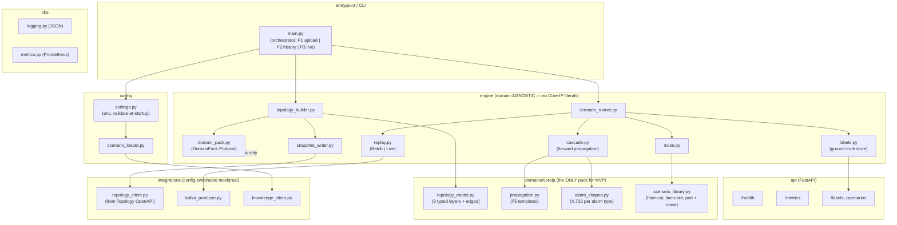
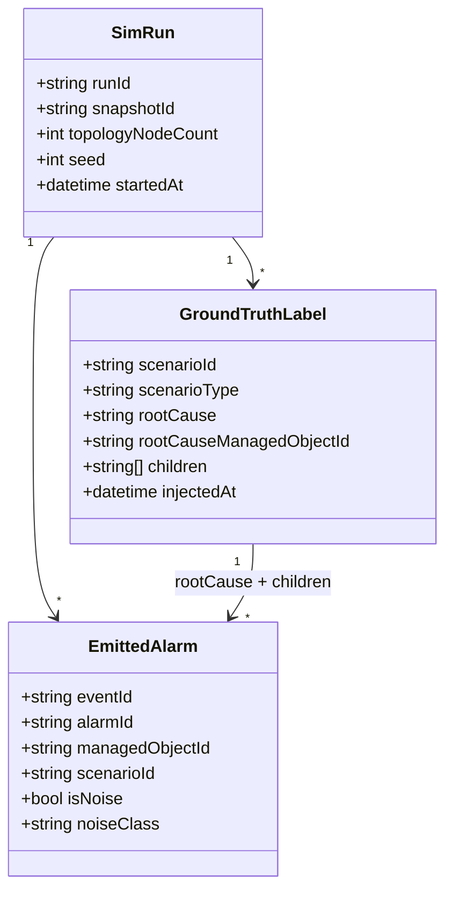
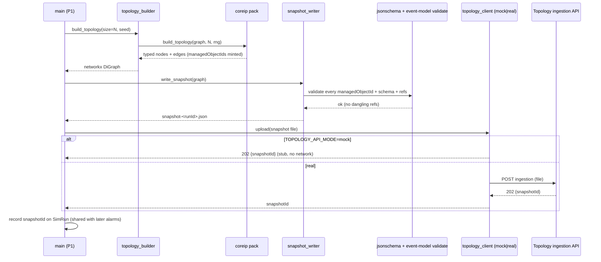
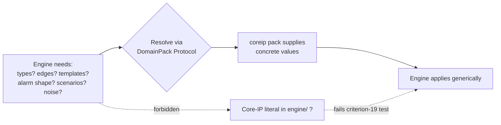

# simulator — Design

> Buildable design for the `simulator` service (Python cohort). Built from the approved, merged
> `services/simulator/spec.md`. Honours the platform invariants in `CLAUDE.md` and the contracts in
> `docs/architecture.md` and the frozen `libs/event-model` Python binding (`acp-event-model`).

## Stack

- **Language / runtime:** Python 3.13 (pinned per CLAUDE.md / CI).
- **Topology generation:** [`networkx`](https://networkx.org/) (BSD-3) — typed multi-layer graph
  construction + closure traversal for cascade propagation.
- **Event model / validation:** `acp-event-model` (the frozen `libs/event-model` Python/Pydantic v2
  binding) — `AlarmEvent`, `Envelope`/`TypedEnvelope`, `serialize`, `ManagedObjectId`/`validate`,
  `KNOWN_OBJECT_TYPES`. No payload field is hand-authored here; the binding is the single source of
  truth for the envelope, the `AlarmEvent` shape, and the `managedObjectId` scheme.
- **Kafka producer:** [`confluent-kafka`](https://pypi.org/project/confluent-kafka/) (Apache-2.0)
  Python client (librdkafka). `kafka-python` (Apache-2.0) is the fallback if a pure-Python client is
  preferred for the test rig; chosen → `confluent-kafka` for `acks=all` idempotent producer config.
- **HTTP surface (ground-truth + control):** [`FastAPI`](https://fastapi.tiangolo.com/) (MIT) +
  `uvicorn` (BSD-3). FastAPI auto-generates the OpenAPI 3.1 document served at `/openapi.json`.
- **Topology ingestion client:** `httpx` (BSD-3) HTTP client built **against Topology's published
  OpenAPI 3.1** (no dependency on Topology source). Mock vs. real is config-switchable.
- **Snapshot-file & config validation:** `jsonschema` (MIT) against the versioned snapshot schema;
  Pydantic models for scenario/config files.
- **Metrics:** `prometheus-client` (Apache-2.0) → `/metrics`.
- **Logging:** stdlib `logging` + a JSON formatter (structured JSON on stdout).
- **Lint / format / test:** `ruff` + `black`; **pytest** (cohort-standard unit/contract runner).

All dependencies are permissive (MIT / BSD / Apache-2.0). No GPL/AGPL/copyleft components.

## Task breakdown (from the spec)

Every spec Task (1–9) is realized below and traceable to concrete modules/flows.

| Spec task | Realized by (modules / flow) |
|---|---|
| **1. Generate typed multi-layer topology (Core IP pack), configurable size, stable `managedObjectId`s** | `engine/topology_builder.py` drives a `networkx` `DiGraph`; the **Core IP domain pack** (`domains/coreip/topology_model.py`) supplies the nine object types + layer-construction rules. IDs minted via `acp_event_model.ManagedObjectId` → `<objectType>:<id>`. Size from `TOPOLOGY_NODE_COUNT`. |
| **2. Generate snapshot file (versioned contract) + upload to Topology ingestion API (client from OpenAPI; config-switchable mock/real)** | `engine/snapshot_writer.py` serializes the graph to the snapshot JSON (validated against `schema/topology-snapshot.schema.json`); `integrations/topology_client.py` is an `httpx` client generated from Topology's published OpenAPI, selected by `TOPOLOGY_API_MODE` (`mock`/`real`) + `TOPOLOGY_API_BASE_URL`. |
| **3. Load fault-scenario configs (local files or Knowledge Service)** | `config/scenario_loader.py` resolves scenario defs, jitter, noise mix from local files (default/mock) or the Knowledge Service (`integrations/knowledge_client.py`), switchable by `KNOWLEDGE_MODE`. Validated at startup. |
| **4. Inject labeled fault scenarios (root cause → cascade per §5 templates, jitter); record `{rootCause, children}`** | `engine/scenario_runner.py` + `engine/cascade.py` run the pack's propagation templates forward over the graph closure with jitter; `engine/labels.py` records the ground-truth label per scenario. Templates supplied by `domains/coreip/propagation.py`. |
| **5. Inject background noise (≥3 noise classes), configurable rate/mix** | `engine/noise.py` interleaves noise alarms from the pack's noise generators (`domains/coreip/noise.py`); rate/mix from config. Noise alarms are excluded from every label's `children` set. |
| **6. Replay in history (batch → `alarms.history`) or live (wall-clock paced → `alarms.live`)** | `engine/replay.py` with two strategies: `BatchReplay` (fire-and-flush) and `LiveReplay` (wall-clock paced via `PACING_MULTIPLIER`). Topic selected by mode. `integrations/kafka_producer.py` emits `TypedEnvelope[AlarmEvent]`. |
| **7. Make ground-truth labels retrievable for evaluation** | **Decision (OQ-2): both** — labels are written to a **flat JSONL file** at end-of-run (`labels.export_to_file`) **and** served by a small read-only **FastAPI** surface (`api/labels_api.py`). File export is the canonical, no-broker oracle source; REST is convenience. OpenAPI 3.1 published + `openapi.json` checked in. |
| **8. Domain-pack interface — object/edge types, templates, alarm shapes, scenario library supplied by the pack; no domain leakage into engine** | `engine/domain_pack.py` defines the `DomainPack` `Protocol`; `domains/coreip/` is the only implementation. The engine imports the Protocol only; criterion-19 test asserts no Core-IP literals in `engine/`. |
| **9. `/health` + `/metrics` + structured JSON logs** | `api/health.py`, `api/metrics.py` (FastAPI routes); `obs/logging.py` JSON formatter; `obs/metrics.py` Prometheus registry. |

## Phase applicability (design view)

The Simulator is **Active in all three runtime phases** and is the evaluation oracle throughout
(consistent with the spec phase table and the canonical phase map in `architecture.md` row
"simulator").

| Phase | Active/Passive/Idle | Modules/handlers exercised | Inputs/Outputs |
|---|---|---|---|
| **P1 — Topology onboarding** | **Active** | `engine/topology_builder`, `engine/snapshot_writer`, `integrations/topology_client` (upload). Replay/cascade modules dormant. | Out: topology snapshot **file** → Topology ingestion API (HTTP upload, mock/real). No Kafka. |
| **P2 — Pattern learning** | **Active** | `config/scenario_loader`, `engine/scenario_runner`, `engine/cascade`, `engine/noise`, `engine/labels`, `engine/replay:BatchReplay`, `integrations/kafka_producer`. Topology builder dormant (snapshot already uploaded; same graph reused for ID sharing). | Out: `alarms.history` (`AlarmEvent`, batch). Label export written. |
| **P3 — Real-time correlation** | **Active** | Same scenario/cascade/noise/label modules + `engine/replay:LiveReplay` (wall-clock paced). | Out: `alarms.live` (`AlarmEvent`, wall-clock paced). Label export written. |

The ground-truth labels persisted in P2/P3 and the integration thresholds (see below) are the oracle
the `integration-test` harness asserts across all phases.

## Module breakdown

The codebase is split into a **domain-agnostic engine** and a **swappable domain pack**. This split
is the structural realization of spec Task 8 / criterion 19.



- **`engine/domain_pack.py`** — the `DomainPack` `Protocol`: `object_types()`, `edge_relations()`,
  `build_topology(graph, size, rng)`, `propagation_templates()`, `alarm_shape(alarm_type)`,
  `scenario_library()`, `noise_classes()`. The engine depends only on this Protocol.
- **`engine/topology_builder.py`** — asks the pack to populate a `networkx` `DiGraph` of typed nodes
  and typed edges; mints `managedObjectId`s. Domain-agnostic: it never names a Core-IP type.
- **`engine/cascade.py`** — given a root-cause node + the pack's propagation templates, walks the
  graph closure (BFS over the template-relevant edge relations) producing the ordered child alarm
  set. The §5 logic (see Algorithm logical flow) lives in template *data* from the pack; the
  traversal is generic.
- **`engine/labels.py`** — the ground-truth store (see Data model). One record per injected scenario:
  `{scenarioId, scenarioType, rootCause, children, snapshotId}`.
- **`domains/coreip/`** — the only concrete pack: the nine typed layers + edges, the §5 propagation
  templates, the X.733 alarm shapes, the scenario library (fiber-cut, line-card-fault, port-fault +
  ≥3 noise classes).

## Data model / DB schema

**Decision (OQ-2 / "Data owned"): file-based, no relational store.** The Simulator is a short-lived
generation/replay job, not a long-running data service; a relational DB adds operational weight with
no query need. The two owned artifacts are written to a run-scoped output directory
(`SIM_OUTPUT_DIR`, default `/data/sim`):

1. **Topology snapshot file** — `snapshot-<runId>.json` (the versioned contract; schema below).
2. **Ground-truth label export** — `labels-<runId>.jsonl` (one JSON object per scenario) + an
   in-process index served by the labels API.

The label record model (Pydantic, internal):



- `scenarioType` ∈ `{fiber-cut, line-card-fault, port-fault}`; `rootCause` is the root-cause
  alarm's `alarmId`; `children` is the list of causally-downstream alarm `alarmId`s.
- `EmittedAlarm.scenarioId` is null for noise; `isNoise=true` ⇒ `noiseClass` set; noise alarms
  (`isNoise=true`) appear in no label's `children`, which is what makes them identifiable as noise
  (criterion 6).

### Topology snapshot file schema (versioned contract)

**Decision (OQ-4): the snapshot schema lives in a per-producer `schema/` dir,
`services/simulator/schema/topology-snapshot.schema.json`**, *not* under `libs/event-model/`.
Rationale: the event-model is the Kafka envelope/payload contract; the snapshot is a file/API
hand-off (not a topic), so co-locating it with the producer keeps event-model focused while still
versioning the contract. The Topology Service consumes the same schema as its ingestion contract;
any change to it remains a contract change requiring an `architecture.md` update + human approval
(per spec Contract section).

The schema mirrors the structure the Topology Service ingestion API expects:

```json
{
  "$schema": "https://json-schema.org/draft/2020-12/schema",
  "$id": "https://acp/simulator/topology-snapshot.schema.json",
  "title": "TopologySnapshotFile",
  "type": "object",
  "additionalProperties": false,
  "required": ["schemaVersion", "domain", "nodes", "edges"],
  "properties": {
    "schemaVersion": { "type": "integer", "const": 1 },
    "domain": { "type": "string", "const": "core-ip" },
    "nodes": {
      "type": "array",
      "items": {
        "type": "object",
        "additionalProperties": false,
        "required": ["managedObjectId", "objectType"],
        "properties": {
          "managedObjectId": { "type": "string", "pattern": "^(Node|LineCard|Port|IPLink|IGPAdjacency|LSP|VPNService|FiberSpan|SRLG):[^:]+$" },
          "objectType": { "enum": ["Node","LineCard","Port","IPLink","IGPAdjacency","LSP","VPNService","FiberSpan","SRLG"] },
          "attributes": { "type": "object" }
        }
      }
    },
    "edges": {
      "type": "array",
      "items": {
        "type": "object",
        "additionalProperties": false,
        "required": ["from", "to", "relation"],
        "properties": {
          "from": { "type": "string", "pattern": "^(Node|LineCard|Port|IPLink|IGPAdjacency|LSP|VPNService|FiberSpan|SRLG):[^:]+$" },
          "to": { "type": "string", "pattern": "^(Node|LineCard|Port|IPLink|IGPAdjacency|LSP|VPNService|FiberSpan|SRLG):[^:]+$" },
          "relation": { "enum": ["HOSTED_ON","RIDES_ON","ADJACENCY_OVER","TRAVERSES","SERVES","MEMBER_OF"] }
        }
      }
    }
  }
}
```

The `managedObjectId` pattern is identical to the frozen event-model `managedObjectId.schema.json`;
the engine reuses `acp_event_model.validate` so the two never drift. Referential integrity (every
edge endpoint resolves to a node in `nodes[]`; no dangling references) is enforced by
`snapshot_writer` post-build validation (criteria 1, 14).

## Event handling

- **Consumers:** **none.** The Simulator is a pure Kafka producer (spec Contract: "Consumes (Kafka):
  none"). There is no inbound stream, hence **no DLQ** (spec Non-functional confirms this). `*.dlq`
  routing is N/A for this service.
- **Producers:**
  - `alarms.history` — `TypedEnvelope[AlarmEvent]`, batch (history mode).
  - `alarms.live` — `TypedEnvelope[AlarmEvent]`, wall-clock paced (live mode).
  - Both carry the frozen `AlarmEvent` payload (envelope `source="simulator"`, `type="AlarmEvent"`,
    `schemaVersion=1`). Serialized via `acp_event_model.serialize`.
- **Idempotency:** every emitted event gets a fresh UUID `eventId` (envelope) and a unique `alarmId`
  (payload) so at-least-once redelivery is dedupable downstream on `eventId`/`alarmId`. Producer is
  configured `enable.idempotence=true`, `acks=all`. **Re-runs with the same `SIM_SEED`** reproduce
  the same *cascade structure and timing* (deterministic generation, OQ-3 decision below) but mint
  **new** `eventId`/`alarmId` per run (spec Non-functional: "re-runs SHOULD produce new ids"), so a
  replayed corpus never collides with a prior run's ids.

## API contracts / API schema

The Simulator exposes a **small read-only HTTP surface** (FastAPI) for ground-truth retrieval +
liveness/metrics. OpenAPI 3.1 is auto-generated by FastAPI and served at `/openapi.json`; the
generated document is checked in as `services/simulator/openapi.json` (authoritative surface; any
change is a contract change). Request/response models are Pydantic.

| Method | Path | Request | Response (200) | Errors |
|---|---|---|---|---|
| GET | `/health` | — | `{"status":"ok","kafka":"connected","run":"<runId|idle>"}` | `503` if startup incomplete or Kafka connection lost |
| GET | `/metrics` | — | Prometheus text exposition (`Content-Type: text/plain`); ≥1 metric e.g. `simulator_alarms_emitted_total` | — |
| GET | `/openapi.json` | — | OpenAPI 3.1 document | — |
| GET | `/labels` | query `?scenarioId=` optional | `GroundTruthLabel[]` — `{scenarioId, scenarioType, rootCause, rootCauseManagedObjectId, children[]}` | `404` unknown `scenarioId` |
| GET | `/labels/{scenarioId}` | path | one `GroundTruthLabel` | `404` |
| GET | `/scenarios` | — | scenario-def summary (type, root-cause object type, expected child count) | — |
| POST | `/runs` (optional control) | `{mode:"history"|"live", config?}` | `{runId}` accepted `202` | `400` invalid config, `409` run in progress |

`/labels` is the REST mirror of the canonical JSONL file export; the integration oracle MAY use
either. No write endpoints expose alarm content (read-only oracle).

## Integration points (mock vs. real)

No collaborator URL is hard-coded; all resolve from env. Mock = a stub generated from the
collaborator's **published OpenAPI** (used in unit tests); real = the live service (integration).

| Collaborator + operation | Config key(s) | mock | real |
|---|---|---|---|
| **Topology Service — ingestion API** (upload snapshot file; lift → AGE → `topology.changed`) | `TOPOLOGY_API_MODE` (`mock`\|`real`), `TOPOLOGY_API_BASE_URL` | local stub generated from Topology's published OpenAPI 3.1 — records the uploaded file, returns a synthetic `{snapshotId}` 202; never contacts a real service | `httpx` client → `TOPOLOGY_API_BASE_URL` ingestion endpoint |
| **Knowledge Service — scenario config** (optional read of scenario/jitter/noise params) | `KNOWLEDGE_MODE` (`local`\|`real`), `KNOWLEDGE_API_BASE_URL` | `local` = read scenario/threshold config from local files (default) | `real` = fetch from Knowledge Service API |
| **Kafka** (produce `alarms.history`/`alarms.live`) | `KAFKA_BOOTSTRAP_SERVERS` | embedded/in-memory producer double in unit tests | real broker in integration |

The Topology upload client is built **against Topology's published OpenAPI, never its source**
(invariant: contract-first, no cross-service code coupling). `TOPOLOGY_API_MODE` switching requires
no code change (criterion 15).

## Key flows (sequence / data-flow diagrams)

### (a) P1 — topology generation → snapshot file → upload to Topology ingestion API



### (b) P2 — labeled scenario generation → cascade + noise → batch replay to `alarms.history`

```mermaid
sequenceDiagram
  participant CLI as main (P2 history)
  participant SL as scenario_loader
  participant SR as scenario_runner
  participant C as cascade (forward-prop)
  participant N as noise
  participant L as labels
  participant R as BatchReplay
  participant KP as kafka_producer
  participant K as Kafka alarms.history

  CLI->>SL: load(scenarios, jitter, noiseMix)
  SL-->>CLI: scenario defs + params
  loop each scenario
    SR->>C: propagate(rootCauseNode, templates, graph, jitter)
    C-->>SR: ordered [rootCauseAlarm, childAlarm...]
    SR->>L: record {rootCause, children}
  end
  SR->>N: generate noise (>=3 classes, configured rate)
  N-->>SR: noise alarms (not in any label.children)
  SR->>R: merged, time-ordered alarm stream
  loop each alarm
    R->>KP: serialize TypedEnvelope[AlarmEvent]
    KP->>K: produce -> alarms.history (acks=all, idempotent)
  end
  R-->>CLI: counts; L.export_to_file(labels-<runId>.jsonl)
```

### (c) P3 — live replay to `alarms.live` (wall-clock paced)

```mermaid
sequenceDiagram
  participant CLI as main (P3 live)
  participant SR as scenario_runner
  participant R as LiveReplay
  participant Clock as wall clock
  participant KP as kafka_producer
  participant K as Kafka alarms.live

  CLI->>SR: build labeled+noise stream (same as P2)
  SR-->>R: time-ordered alarms with relative offsets
  loop each alarm i
    R->>Clock: sleep(offset_i * PACING_MULTIPLIER + jitter)
    Clock-->>R: elapsed
    R->>KP: serialize TypedEnvelope[AlarmEvent]
    KP->>K: produce -> alarms.live
  end
  Note over R,K: zero events to alarms.history; inter-event delay > 0 for pacing>0
```

## Algorithm logical flow

Two non-trivial algorithms: the **§5 forward-propagation cascade** and the **domain-pack
abstraction** boundary.

### Cascade / scenario generation (forward propagation per §5 templates)

Inputs: a chosen `rootCauseNode` (type ∈ fault-origins `{Fiber, LineCard, Port, Node}` from the
pack), the pack's per-edge-relation propagation templates, the `networkx` graph, and jitter params
(from config/Knowledge — never hard-coded). Output: an ordered alarm list + a `{rootCause, children}`
label.

```mermaid
flowchart TD
  A[Pick scenario from library:<br/>fiber-cut | line-card-fault | port-fault] --> B[Select root-cause object<br/>of the scenario's fault-origin type]
  B --> C[Emit root-cause alarm<br/>X.733 shape from pack.alarm_shape]
  C --> D[Seed BFS frontier with root-cause node]
  D --> E{Frontier empty?}
  E -- yes --> Z[Return ordered alarms +<br/>label rootCause + children]
  E -- no --> F[Pop node, find outgoing edges<br/>whose relation has a template]
  F --> G[Apply template per edge relation:<br/>RIDES_ON Fiber to LinkDown IPLink<br/>HOSTED_ON LineCard to PortDown to LinkDown<br/>ADJACENCY_OVER LinkDown to AdjDown<br/>TRAVERSES LinkDown to LSPDown<br/>SERVES LSPDown to ReachabilityLoss VPN]
  G --> H[Emit child alarm w/ X.733 shape;<br/>raisedAt = parent.raisedAt + base_delay + jitter]
  H --> I[Add child node to frontier;<br/>append child alarmId to label.children]
  I --> E
```

Notes:
- Jitter is applied per inter-alarm gap: `delay = base_delay + gauss(0, jitter_stddev_ms)`. With
  `jitter_stddev_ms=0` the cascade is deterministic (criterion 12). `MEMBER_OF` (SRLG) fate-sharing
  expands a single fiber/link fault to all co-grouped links before propagating onward.
- All template data and alarm X.733 shapes come from the pack; `cascade.py` only walks edges and
  applies whatever template the pack provides → engine stays domain-agnostic (criterion 19).

### Domain-pack abstraction (engine vs. Core-IP pack)



Decision logic: the engine **never branches on a domain type name**; it iterates over
`pack.object_types()`, `pack.edge_relations()`, and `pack.propagation_templates()`. Adding a new
domain = adding a new `DomainPack` implementation, no engine edit.

## Seed data & examples

The simulator's heart: generation/seed scripts + config knobs + concrete worked output.

### Generation scripts & knobs

- **Entry point:** `python -m simulator.main --phase {p1|p2|p3}` (or `--mode {upload|history|live}`).
  All knobs are env/config (no hard-coded values):

| Knob | Env var | Example | Effect |
|---|---|---|---|
| Topology size | `TOPOLOGY_NODE_COUNT` | `20` (range 10–200) | number of `Node`s; line cards/ports/links scale per pack ratios |
| Random seed | `SIM_SEED` | `42` | **OQ-3 decision: deterministic generation supported** — same seed → same topology + cascade structure + timing offsets; ids still fresh per run |
| Timing jitter | `JITTER_STDDEV_MS` | `0` or `500` | std-dev of per-gap delay noise |
| Noise rate/mix | `NOISE_RATE`, `NOISE_MIX` | `0.0`..`0.4`, `flapping:0.4,transient:0.3,chatty:0.2,coincidental:0.1` | fraction of total alarms that are noise + class weights |
| Scenario selection | `SCENARIOS` | `fiber-cut,line-card-fault,port-fault` | which scenarios to inject |
| Replay pacing | `PACING_MULTIPLIER` | `1.0` (live only) | wall-clock scale of inter-event delays |

`scenario_loader` validates: jitter ≥ 0, noise rate ∈ [0,1], scenarios ⊆ pack library, node count ∈
[10,200]. Missing required config (e.g. `KAFKA_BOOTSTRAP_SERVERS`) → fatal structured-log error +
non-zero exit before any emission (criterion 18).

### Worked example — topology snapshot file fragment (small N, fiber-cut-ready)

`snapshot-run42.json` (excerpt; ids minted via the `<objectType>:<id>` scheme):

```json
{
  "schemaVersion": 1,
  "domain": "core-ip",
  "nodes": [
    { "managedObjectId": "Node:PE1",            "objectType": "Node",         "attributes": {"role": "PE"} },
    { "managedObjectId": "Node:P1",             "objectType": "Node",         "attributes": {"role": "P"} },
    { "managedObjectId": "LineCard:PE1-LC2",    "objectType": "LineCard" },
    { "managedObjectId": "Port:PE1-LC2-P3",     "objectType": "Port" },
    { "managedObjectId": "Port:P1-LC1-P1",      "objectType": "Port" },
    { "managedObjectId": "IPLink:PE1_P1",       "objectType": "IPLink" },
    { "managedObjectId": "IGPAdjacency:PE1_P1", "objectType": "IGPAdjacency" },
    { "managedObjectId": "LSP:PE1-PE9-1",       "objectType": "LSP" },
    { "managedObjectId": "VPNService:CUST-A",   "objectType": "VPNService" },
    { "managedObjectId": "FiberSpan:F-PE1-P1",  "objectType": "FiberSpan" },
    { "managedObjectId": "SRLG:SRLG-7",         "objectType": "SRLG" }
  ],
  "edges": [
    { "from": "LineCard:PE1-LC2",   "to": "Port:PE1-LC2-P3",     "relation": "HOSTED_ON" },
    { "from": "FiberSpan:F-PE1-P1", "to": "IPLink:PE1_P1",       "relation": "RIDES_ON" },
    { "from": "IPLink:PE1_P1",      "to": "IGPAdjacency:PE1_P1", "relation": "ADJACENCY_OVER" },
    { "from": "IPLink:PE1_P1",      "to": "LSP:PE1-PE9-1",       "relation": "TRAVERSES" },
    { "from": "LSP:PE1-PE9-1",      "to": "VPNService:CUST-A",   "relation": "SERVES" },
    { "from": "SRLG:SRLG-7",        "to": "IPLink:PE1_P1",       "relation": "MEMBER_OF" }
  ]
}
```

### Worked example — fiber-cut cascade `AlarmEvent` records + ground-truth label

A `fiber-cut` on `FiberSpan:F-PE1-P1` propagates `RIDES_ON → ADJACENCY_OVER → TRAVERSES → SERVES`.
Each emitted envelope (`source="simulator"`, fresh `eventId`); payload is the frozen `AlarmEvent`:

```json
{ "eventId":"a1...","type":"AlarmEvent","schemaVersion":1,"occurredAt":"2026-06-10T10:00:00Z","source":"simulator","traceId":"sc-fiber-001",
  "payload":{ "alarmId":"ALM-FC-0001","managedObjectId":"FiberSpan:F-PE1-P1","eventType":"communicationsAlarm","probableCause":"lossOfSignal","perceivedSeverity":"critical","raisedAt":"2026-06-10T10:00:00.000Z","state":"raised","trailIds":[] } }

{ "eventId":"a2...","type":"AlarmEvent","schemaVersion":1,"occurredAt":"2026-06-10T10:00:00Z","source":"simulator","traceId":"sc-fiber-001",
  "payload":{ "alarmId":"ALM-FC-0002","managedObjectId":"IPLink:PE1_P1","eventType":"communicationsAlarm","probableCause":"linkDown","perceivedSeverity":"critical","raisedAt":"2026-06-10T10:00:00.420Z","state":"raised","trailIds":[] } }

{ "eventId":"a3...","type":"AlarmEvent","schemaVersion":1,"occurredAt":"2026-06-10T10:00:01Z","source":"simulator","traceId":"sc-fiber-001",
  "payload":{ "alarmId":"ALM-FC-0003","managedObjectId":"IGPAdjacency:PE1_P1","eventType":"communicationsAlarm","probableCause":"adjacencyDown","perceivedSeverity":"major","raisedAt":"2026-06-10T10:00:00.880Z","state":"raised","trailIds":[] } }

{ "eventId":"a4...","type":"AlarmEvent","schemaVersion":1,"occurredAt":"2026-06-10T10:00:01Z","source":"simulator","traceId":"sc-fiber-001",
  "payload":{ "alarmId":"ALM-FC-0004","managedObjectId":"LSP:PE1-PE9-1","eventType":"communicationsAlarm","probableCause":"lspDown","perceivedSeverity":"major","raisedAt":"2026-06-10T10:00:01.310Z","state":"raised","trailIds":[] } }

{ "eventId":"a5...","type":"AlarmEvent","schemaVersion":1,"occurredAt":"2026-06-10T10:00:01Z","source":"simulator","traceId":"sc-fiber-001",
  "payload":{ "alarmId":"ALM-FC-0005","managedObjectId":"VPNService:CUST-A","eventType":"qualityOfServiceAlarm","probableCause":"reachabilityLoss","perceivedSeverity":"critical","raisedAt":"2026-06-10T10:00:01.790Z","state":"raised","trailIds":[] } }
```

Ground-truth label (one record in `labels-run42.jsonl`):

```json
{ "scenarioId":"sc-fiber-001","scenarioType":"fiber-cut",
  "rootCause":"ALM-FC-0001","rootCauseManagedObjectId":"FiberSpan:F-PE1-P1",
  "children":["ALM-FC-0002","ALM-FC-0003","ALM-FC-0004","ALM-FC-0005"] }
```

A noise alarm emitted in the same run (e.g. flapping on an unrelated port) carries its own `alarmId`
and appears in **no** label's `children`, so the oracle classifies it as noise:

```json
{ "eventId":"n1...","type":"AlarmEvent","schemaVersion":1,"occurredAt":"2026-06-10T10:00:00Z","source":"simulator","traceId":"noise-0001",
  "payload":{ "alarmId":"NSE-0001","managedObjectId":"Port:P3-LC1-P7","eventType":"qualityOfServiceAlarm","probableCause":"thresholdCrossed","perceivedSeverity":"warning","raisedAt":"2026-06-10T10:00:00.250Z","state":"raised","trailIds":[] } }
```

### Noise classes (≥3, from the pack's library)

| Class | Behaviour |
|---|---|
| `flapping` | rapid raised/cleared pairs on one object |
| `self-clearing transient` | a `raised` followed shortly by a `cleared` (no operator action) |
| `chatty standing` | repeated `raised` on a standing condition, never matching a cascade |
| `coincidental unrelated` | a lone real-looking alarm on an object outside any injected scenario |

## Integration thresholds (test oracle — owned by this spec)

The Simulator owns the metric **definitions**; the numeric MVP targets are **config, not literals**
(resolved from `INTEGRATION_THRESHOLDS` env / a checked-in `integration-thresholds.yaml` consumed by
the integration harness — criterion 20). The design exposes ground truth so the oracle can compute
each metric:

| Metric | How the design makes it computable | MVP target |
|---|---|---|
| RCA accuracy | `/labels` (or JSONL) gives `rootCause` per scenario; oracle compares to `rootCauseAlarmId` in `correlation.results` | ≥ 0.80 |
| Alarm-reduction ratio | count emitted alarms (metric `simulator_alarms_emitted_total`) ÷ incidents in `correlation.results` | ≥ 5× |
| Noise-filter removal | noise alarms are tagged (label-absence) so oracle counts injected-noise removed by Noise Filter | ≥ 0.90 |
| Noise-filter retention | scenario alarms (in some label) retained after Noise Filter | ≥ 0.95 |
| Pattern quality | injected scenario signatures (from labels) vs. patterns recovered by Pattern Miner | ≥ 0.80 |

These thresholds are surfaced to (not asserted by) the simulator; the `integration-test` harness
reads them from config and asserts them.

## Error handling

| Failure mode | Handling |
|---|---|
| **Missing/invalid required config** (e.g. no `KAFKA_BOOTSTRAP_SERVERS`, node count out of range, jitter < 0, unknown scenario) | Validate at startup; emit one structured JSON error log; **exit non-zero before emitting any event** (criterion 18). |
| **Invalid scenario config from Knowledge/file** | `scenario_loader` rejects with a clear error naming the bad field; aborts the run (no partial emission). |
| **Topology ingestion API unavailable / non-2xx** | `topology_client` retries with bounded exponential backoff (configurable attempts); on exhaustion logs structured error, marks `/health` non-200, and fails the P1 run with non-zero exit. No silent success. |
| **Snapshot validation failure** (dangling ref, bad `managedObjectId`, schema mismatch) | `snapshot_writer` raises before upload; run aborts; nothing uploaded. |
| **Event serialization / payload-validation failure** | `acp_event_model.serialize`/`AlarmEvent` raises `ValidationError`; the offending alarm is logged with its scenarioId and the run fails (a generation bug must not silently drop an alarm). |
| **Kafka producer error** (broker down, delivery failure) | producer delivery callback logs structured error, increments `simulator_produce_errors_total`, marks `/health` non-200; bounded retry via librdkafka; persistent failure fails the run non-zero. |
| **Live-replay pacing failure** (clock skew / oversleep) | pacing computed against a monotonic clock; if a gap is missed it is logged (gauge `simulator_pacing_drift_ms`) and the next event proceeds — pacing degrades gracefully, never crashes. |
| **No DLQ** | N/A — the Simulator consumes no Kafka stream (pure producer); spec confirms no inbound DLQ. |
| **schemaVersion** | Producer only ever emits `schemaVersion=1`; rejection of `>=2` is a consumer concern, N/A here. |

Nothing is ever silently dropped: every generated alarm is either emitted or fails the run loudly.

## Design alternatives

| Consideration | Alternatives considered | Chosen + rationale |
|---|---|---|
| Ground-truth retrieval (OQ-2) | (a) REST only; (b) flat file only; (c) queryable DB | **File (canonical) + thin REST mirror.** File is broker-free and trivially consumed by the integration oracle and CI artifacts; REST adds convenient query without forcing a DB. DB rejected — no query/scale need for a short-lived job. |
| Deterministic replay (OQ-3) | (a) always random; (b) optional seed | **Optional `SIM_SEED` (deterministic generation), fresh ids per run.** Determinism makes regression/CI reproducible; fresh `eventId`/`alarmId` keeps idempotency honest and avoids cross-run collisions (satisfies spec's "SHOULD produce new ids"). |
| Snapshot schema location (OQ-4) | (a) under `libs/event-model/`; (b) producer `schema/` dir | **`services/simulator/schema/`.** Event-model is the Kafka contract; the snapshot is a file/API hand-off, so co-locating with the producer keeps event-model focused. Still versioned + change = contract change. |
| Domain extensibility | (a) config-data-only pack; (b) Python `Protocol` pack interface | **`Protocol` interface (`domains/coreip` impl).** Allows code-level generators (graph topology, X.733 shapes) the engine can't express in pure data, while keeping the engine domain-agnostic and testable for "no Core-IP literals". |
| Kafka client | (a) `kafka-python`; (b) `confluent-kafka` | **`confluent-kafka`** for first-class `enable.idempotence`/`acks=all` and delivery callbacks (librdkafka); `kafka-python` retained as a lighter test double option. |
| Cascade traversal | (a) recursive per-template; (b) generic BFS over template-relevant edges | **Generic BFS** — single domain-agnostic walker driven by pack template data; supports SRLG fate-sharing and avoids per-template engine code. |
| Live pacing clock | (a) `time.sleep` on relative offsets; (b) monotonic-scheduler | **Monotonic-clock scheduler** — drift-aware, degrades gracefully, measurable via `simulator_pacing_drift_ms`. |

## Test plan

### Acceptance criterion → test (unit/contract — pytest)

| # | Acceptance criterion | Test | Asserts |
|---|---|---|---|
| 1 | Topology snapshot valid & internally consistent | `test_snapshot_internally_consistent` | N=20 build → every Node id `Node:<id>`; every LineCard→existing Node, Port→existing LineCard, IPLink→two existing Ports, SRLG→existing IPLinks; no dangling refs |
| 2 | `managedObjectId` shared between snapshot & alarms | `test_alarm_moids_subset_of_snapshot` | every emitted alarm `managedObjectId` ∈ snapshot node ids |
| 3 | `managedObjectId` conforms to frozen scheme | `test_all_moids_pass_event_model_validator` | every snapshot + alarm moid passes `acp_event_model.validate` (objectType ∈ KNOWN_OBJECT_TYPES, non-empty id) |
| 4 | Fiber-cut cascade correct | `test_fiber_cut_cascade_matches_templates` | root alarm on `FiberSpan`; children include `LinkDown`(IPLink), `AdjDown`(IGPAdjacency), `LSPDown`(LSP), `ReachabilityLoss`/`VPNloss`(VPNService); label root=FiberSpan alarm, children=all downstream |
| 5 | Line-card & port faults producible & distinguishable | `test_linecard_and_port_scenarios_distinct` | line-card-fault root objectType=`LineCard` (HOSTED_ON cascade), port-fault root objectType=`Port`; labels differ in rootCause object type |
| 6 | ≥3 noise classes generated | `test_at_least_three_noise_classes` | with noise enabled, ≥3 distinct noise classes emitted; each noise alarm absent from every label.children |
| 7 | Emitted alarms validate vs frozen `AlarmEvent` | `test_emitted_alarms_validate_against_event_model` | every payload constructs as `AlarmEvent` w/o ValidationError; required fields present; `state` ∈ {raised,cleared} |
| 8 | History lands on `alarms.history` | `test_history_mode_targets_history_topic` | history mode → all alarms on `alarms.history`, zero on `alarms.live` |
| 9 | Live lands on `alarms.live` with pacing | `test_live_mode_targets_live_topic_with_pacing` | live mode → all on `alarms.live`, zero on `alarms.history`; inter-event delay > 0 for pacing>0 |
| 10 | Ground-truth labels retrievable | `test_ground_truth_labels_retrievable` | after run, label retrievable (file + `/labels`); `rootCause`=injected root alarmId; `children`=downstream alarmIds |
| 11 | Topology size configurable, no hard-coded count | `test_topology_size_configurable` | runs N=10 and N=50 → ~10 and ~50 nodes; no default count compiled in (config-driven) |
| 12 | Timing jitter configurable, no hard-coded value | `test_jitter_configurable` | `jitter_stddev_ms=0` → deterministic intervals; `=500` → varied intervals; distributions differ measurably |
| 13 | Noise mix configurable, no hard-coded rate | `test_noise_mix_configurable` | rate 0 → zero noise; non-zero → noise present; two mixes → statistically different noise:scenario ratios |
| 14 | Snapshot validates vs topology-file schema | `test_snapshot_validates_against_schema` | any-run snapshot passes `jsonschema` validation against `topology-snapshot.schema.json`; all required fields + refs well-formed |
| 15 | Topology ingestion config-switchable | `test_topology_api_mode_switch` | `TOPOLOGY_API_MODE=mock` → stub used, no real call; `=real` → contacts `TOPOLOGY_API_BASE_URL`; switch needs no code change |
| 16 | `/health` 200 when running | `test_health_endpoint` | GET `/health` → 200 when started+Kafka up; non-200 before startup / on lost Kafka |
| 17 | `/metrics` Prometheus format | `test_metrics_endpoint` | GET `/metrics` → 200, `text/plain`, ≥1 metric incl. `simulator_alarms_emitted_total` |
| 18 | Config validation fails fast | `test_missing_required_config_aborts` | start w/o required env → structured JSON error log + non-zero exit, zero events emitted |
| 19 | Domain-pack separation — no Core-IP literals in engine | `test_engine_has_no_coreip_literals` | `DomainPack` Protocol exists; engine source contains no Core-IP object-type/template/alarm/scenario literals (static scan of `engine/`) |
| 20 | Integration thresholds owned by spec, from config | `test_thresholds_sourced_from_config` | the five thresholds present in harness config (0.80/5/0.90/0.95/0.80), not hard-coded literals in service code |

### E2E scenarios (from this design unit's point of view)

| # | Scenario | Trigger → path | Expected outcome |
|---|---|---|---|
| 1 | **P1 happy path** (mock Topology) | `--phase p1`, `TOPOLOGY_API_MODE=mock`, N=20 | snapshot file written + validated; stub receives it, returns `snapshotId`; `/health` 200 |
| 2 | **P1 with real Topology** (integration stack) | `--phase p1`, `mode=real` against running Topology | Topology lifts to AGE, mints `snapshotId`, emits `topology.changed`; simulator records the same `snapshotId` |
| 3 | **P2 history corpus → oracle** | `--phase p2`, fiber-cut+line-card+port + noise | all alarms on `alarms.history`; labels file written; downstream noise-filter/pattern-miner can be scored against labels |
| 4 | **P3 live paced stream** | `--phase p3`, `PACING_MULTIPLIER=1.0` | alarms on `alarms.live` with non-zero inter-event delays; labels retrievable; correlation oracle can compute RCA/reduction |
| 5 | **Shared-identity invariant** end-to-end | run P1 then P2 with same `SIM_SEED` | every alarm moid present in the uploaded snapshot (criterion 2 across phases) |
| 6 | **Failure — Topology ingestion down** | `--phase p1`, real mode, endpoint unreachable | bounded retries, structured error, `/health` non-200, non-zero exit, nothing falsely reported uploaded |
| 7 | **Failure — broker unavailable** | `--phase p2`, bad `KAFKA_BOOTSTRAP_SERVERS` | produce errors logged + counted; `/health` non-200; run fails non-zero; no silent drop |
| 8 | **Failure — invalid scenario config** | unknown scenario / negative jitter | startup validation aborts run with structured error, zero events emitted |
| 9 | **Noise-only / scenario-only edges** | `NOISE_RATE=0` then high noise | rate 0 → zero noise alarms; high → labels still pure (noise never in `children`) |

## Config & observability

- **Env config (validated at startup; no hard-coded values):** `KAFKA_BOOTSTRAP_SERVERS`,
  `TOPOLOGY_API_MODE`, `TOPOLOGY_API_BASE_URL`, `KNOWLEDGE_MODE`, `KNOWLEDGE_API_BASE_URL`,
  `TOPOLOGY_NODE_COUNT`, `SCENARIOS`, `JITTER_STDDEV_MS`, `NOISE_RATE`, `NOISE_MIX`,
  `PACING_MULTIPLIER`, `SIM_SEED`, `SIM_OUTPUT_DIR`, `INTEGRATION_THRESHOLDS`, `HTTP_PORT`,
  `LOG_LEVEL`. Missing required → structured error + non-zero exit.
- **`/health`** — 200 when started + Kafka connected; non-200 otherwise.
- **`/metrics`** — Prometheus exposition incl. `simulator_alarms_emitted_total{topic,scenario}`,
  `simulator_scenarios_injected_total`, `simulator_noise_alarms_total{class}`,
  `simulator_produce_errors_total`, `simulator_pacing_drift_ms`, `simulator_snapshot_nodes`.
- **Logging** — structured JSON on stdout (one object per line): `ts, level, event, runId,
  scenarioId?, msg`.

## Build & run

- **Layout:** `services/simulator/src/simulator/{main.py, config/, engine/, domains/coreip/,
  integrations/, api/, obs/}`, `services/simulator/schema/topology-snapshot.schema.json`,
  `services/simulator/openapi.json`, `services/simulator/tests/`.
- **Build/test:** `ruff check . && black --check . && pytest` (Python 3.13).
- **Dockerfile:** `python:3.13-slim` base (per CI pins); installs `acp-event-model` from
  `libs/event-model/python`; `CMD` runs `python -m simulator.main`. Compose entry wires
  `KAFKA_BOOTSTRAP_SERVERS` + `TOPOLOGY_API_BASE_URL` to the integration stack.
- **Local run:** `TOPOLOGY_API_MODE=mock KAFKA_BOOTSTRAP_SERVERS=localhost:9092
  TOPOLOGY_NODE_COUNT=20 python -m simulator.main --phase p2`.

## UI wireframes

N/A — backend/CLI service (no web-ui surface).
