# simulator — Design

> Buildable design for the `simulator` service (Python cohort). Built from the approved, merged
> `services/simulator/spec.md`. Honours the platform invariants in `CLAUDE.md` and the contracts in
> `docs/architecture.md` and the frozen `libs/event-model` Python binding (`acp-event-model`).

## Stack

- **Language / runtime:** Python 3.13 (pinned per CLAUDE.md / CI).
- **Topology generation:** [`networkx`](https://networkx.org/) (BSD-3) — typed multi-layer graph
  construction + closure traversal for cascade propagation.
- **Event model / validation:** `acp-event-model` (the frozen `libs/event-model` Python/Pydantic v2
  binding) — `AlarmEvent`, `Envelope`/`TypedEnvelope`, `serialize`, `ManagedObjectId`/`validate`,
  `KNOWN_OBJECT_TYPES`. No payload field is hand-authored here; the binding is the single source of
  truth for the envelope, the `AlarmEvent` shape, and the `managedObjectId` scheme.
- **Kafka producer:** [`confluent-kafka`](https://pypi.org/project/confluent-kafka/) (Apache-2.0)
  Python client (librdkafka). `kafka-python` (Apache-2.0) is the fallback if a pure-Python client is
  preferred for the test rig; chosen → `confluent-kafka` for `acks=all` idempotent producer config.
- **HTTP surface (ground-truth + control):** [`FastAPI`](https://fastapi.tiangolo.com/) (MIT) +
  `uvicorn` (BSD-3). FastAPI auto-generates the OpenAPI 3.1 document served at `/openapi.json`.
- **Topology ingestion client:** `httpx` (BSD-3) HTTP client built **against Topology's published
  OpenAPI 3.1** (no dependency on Topology source). Mock vs. real is config-switchable.
- **Snapshot-file & config validation:** `jsonschema` (MIT) against the versioned snapshot schema;
  Pydantic models for scenario/config files.
- **Metrics:** `prometheus-client` (Apache-2.0) → `/metrics`.
- **Logging:** stdlib `logging` + a JSON formatter (structured JSON on stdout).
- **Lint / format / test:** `ruff` + `black`; **pytest** (cohort-standard unit/contract runner).

All dependencies are permissive (MIT / BSD / Apache-2.0). No GPL/AGPL/copyleft components.

## Task breakdown (from the spec)

Every spec Task (1–20) is realized below and traceable to concrete modules/flows. Tasks 13–20 are
the **additive P3 topology-and-pattern-driven synthesis** mode — a new `synth` sub-mode that leaves
generate/ingest/export and P1/P2 untouched. The full P3 design (modules, data, algorithm, flows,
alternatives, error handling, tests) is in **[P3 topology-and-pattern-driven synthesis
(additive mode)](#p3-topology-and-pattern-driven-synthesis-additive-mode)** below; the table rows
13–20 point into it.

| Spec task | Realized by (modules / flow) |
|---|---|
| **1. Generate typed multi-layer topology (Core IP pack), configurable size, stable `managedObjectId`s** | `engine/topology_builder.py` drives a `networkx` `DiGraph`; the **Core IP domain pack** (`domains/coreip/topology_model.py`) supplies the object types + layer-construction rules. The pack emits **`Site` nodes** (the domain-agnostic Site object type, geo attributes) drawn from a **grounded geo catalogue of ≥10 distinct telco PoP cities** (`domains/coreip/geo_catalogue.py` — fix B4) and places each device in a site via a **`LOCATED_AT`** edge, emits **`Interface` nodes** (L3 endpoints) on ports via **`HOSTS`** (Port→Interface) with each interface **`TERMINATES`**-ing its `IPLink` and the IGP adjacency generated **between interfaces** (`ADJACENCY_OVER` Interface→IGPAdjacency, per §5 #91). It populates the well-known **device/connection `attributes`** keys (grounded values) **including the catalogued `igpArea` device key** (fix B2) — each `Node` (and the `Interface`s it hosts) is assigned a grounded IGP area (`area-0` backbone + `area-1`/`area-2`/… edge areas), so the Knowledge `trailPolicy/default` `boundary={type:'igp-area', attributeKey:'igpArea'}` resolves to a real, populated dimension. IDs minted via `acp_event_model.ManagedObjectId` → generic `<objectType>:<id>`. Size from `TOPOLOGY_NODE_COUNT`; site count / devices-per-site from `SITE_COUNT` / `DEVICES_PER_SITE`; interfaces-per-port from `INTERFACES_PER_PORT` (default 1); IGP-area count from `IGP_AREA_COUNT`. |
| **2. Generate snapshot file (versioned contract) + upload to Topology ingestion API (client from OpenAPI; config-switchable mock/real)** | `engine/snapshot_writer.py` serializes the graph to the snapshot JSON, validated against the **single canonical `services/topology/schema/snapshot.schema.json`** (Topology-owned; no independent Simulator copy); `integrations/topology_client.py` is an `httpx` client generated from Topology's published OpenAPI, `POST /topology/snapshots`, reading `snapshotId` from the frozen **200 `SnapshotIngestResponse`**, selected by `TOPOLOGY_API_MODE` (`mock`/`real`) + `TOPOLOGY_API_BASE_URL`. |
| **3. Load fault-scenario configs (local files or Knowledge Service); demo volume profiles** | `config/scenario_loader.py` resolves scenario defs, jitter, noise mix from local files (default/mock) or the Knowledge Service (`integrations/knowledge_client.py`), switchable by `KNOWLEDGE_MODE`. `config/demo_profiles.py` (fix B3) supplies the **named demo profiles** `p1-demo`/`p2-demo`/`p3-demo` — each a bundle of overridable DEFAULTS (a `TOTAL_ALARMS` target + scenario set + node/site/noise/background settings) selected by `DEMO_PROFILE`; any individual env var still overrides the profile value. Validated at startup. |
| **4. Inject labeled fault scenarios (root cause → cascade per §5 templates, jitter); record `{rootCause, children}`** | `engine/scenario_runner.py` + `engine/cascade.py` run the pack's propagation templates forward over the graph closure with jitter, **fan-out (`each-target`) and SRLG fate-sharing (`co-failure-group`)**, producing a **10-20-distinct-`alarmType` symptom set per scenario** (fix B1). `engine/labels.py` records the ground-truth label per scenario, **incl. the root-cause `alarmType` token (`rootCauseAlarmType`)** so the RCA oracle compares on the canonical join token. Every emitted `AlarmEvent` carries its **canonical `alarmType`** token drawn from the pack's `alarm_type_vocabulary()` (the **29-token expanded Core IP set** authored in Knowledge — `FiberCut`/`LOS`/`LOF`/`OpticalPowerLow`/`FiberFault`, `PortDown`/`LineCardFault`/`CRCErrors`/`PortFlapping`/`LinkBundleDegraded`, `InterfaceDown`/`InterfaceErrors`/`IPLinkDown`/`LinkDown`, `ISISAdjacencyDown`/`AdjDown`/`OSPFAdjacencyDown`/`BGPPeerDown`/`RouteFlap`/`LDPSessionDown`, `LSPDown`/`FRRSwitchover`/`TETunnelDown`, `VPNReachabilityLoss`/`ReachabilityLoss`/`ServiceDegraded`, `Congestion`/`QueueDrop`/`HighLatency`) set from the pack's alarm shape; `alarmType` is the cross-source canonical join key, **distinct from `eventType` (X.733 category) and `probableCause` (X.733 probable cause)**. Templates (the 28 Knowledge `propagationTemplate` records) + per-alarm `alarmType` supplied by `domains/coreip/propagation.py` + `domains/coreip/alarm_shapes.py`. |
| **5. Inject background noise (≥3 noise classes), configurable rate/mix** | `engine/noise.py` interleaves noise alarms from the pack's noise generators (`domains/coreip/noise.py`); rate/mix from config. Noise alarms are excluded from every label's `children` set. |
| **6. Replay in history (batch → `alarms.history`) or live (wall-clock paced → `alarms.live`)** | `engine/replay.py` with two strategies: `BatchReplay` (fire-and-flush) and `LiveReplay` (wall-clock paced via `PACING_MULTIPLIER`). Topic selected by mode. `integrations/kafka_producer.py` emits `TypedEnvelope[AlarmEvent]`. |
| **7. Make ground-truth labels retrievable for evaluation** | **Decision (OQ-2): both** — labels are written to a **flat JSONL file** at end-of-run (`labels.export_to_file`) **and** served by a small read-only **FastAPI** surface (`api/labels_api.py`). File export is the canonical, no-broker oracle source; REST is convenience. OpenAPI 3.1 published + `openapi.json` checked in. |
| **8. Domain-pack interface — object/edge types, templates, alarm shapes, scenario library supplied by the pack; no domain leakage into engine** | `engine/domain_pack.py` defines the `DomainPack` `Protocol`; `domains/coreip/` is the only implementation. The pack **declares the domain vocabulary** the snapshot is built from: its **object-type set** (the Core-IP layers — incl. **`Interface`** — **plus the domain-agnostic `Site`**), its **edge-relation vocabulary** (the Core-IP relations — incl. **`HOSTS`** and **`TERMINATES`** — **plus `LOCATED_AT`**), the **`domain` identifier** (`core-ip`) stamped on the snapshot, and the **well-known `attributes` keys** it populates on devices/connections — the same vocabulary Topology validates against (authored canonically in Knowledge; the pack must align — its object-type/relation set matches the seeded `core-ip` `objectTypeVocabulary`/`edgeRelationVocabulary`, its `alarm_type_vocabulary()` is a subset of the **29-token** `core-ip/alarmTypeVocabulary/default`, its propagation templates mirror the **28** `core-ip/propagationTemplate` records, and its `attribute_keys()` include the catalogued **`igpArea`** device key). `domains/coreip/scenario_library.py` declares the **9 grounded fault scenarios** (one per Knowledge `faultOriginType` + SRLG co-failure) and `domains/coreip/geo_catalogue.py` the **≥10 grounded telco sites**. The engine imports the Protocol only; criterion-19 test asserts no Core-IP literals in `engine/`. |
| **9. `/health` + `/metrics` + structured JSON logs** | `api/health.py`, `api/metrics.py` (FastAPI routes); `obs/logging.py` JSON formatter; `obs/metrics.py` Prometheus registry. |
| **10. Ingest mode — skip generation, replay a pre-created dataset verbatim** | `ingest/corpus_loader.py` (loader/validator) loads the pre-created files and the engine's *generation* stage is **skipped**: for P1 it loads the **topology snapshot file** (`INGEST_TOPOLOGY_FILE` / `--topology-file`), validates against the **canonical `services/topology/schema/snapshot.schema.json`** (reusing `engine/snapshot_writer`'s validator) and uploads it via the **existing** `integrations/topology_client` (no `topology_builder` run); for P2/P3 it loads the **alarm corpus file** (`INGEST_ALARMS_FILE` / `--alarms-file`), reconstructs each `TypedEnvelope[AlarmEvent]` via `acp_event_model` (validating the frozen `AlarmEvent` incl. `alarmType`), and replays it **verbatim** through the **existing** `engine/replay.py` (`BatchReplay` to `alarms.history` / `LiveReplay` to `alarms.live`) — `scenario_runner`/`cascade`/`noise` are **not** invoked; and it loads the **labels file** (`INGEST_LABELS_FILE` / `--labels-file`) into the **existing** `engine/labels.py` store so `/labels` plus the oracle work unchanged. Malformed input fails fast (criteria 36-39). Mode selected by `SIM_MODE=ingest` / `--ingest`. |
| **11. Export mode — generate-and-export round-trip** | `engine/snapshot_writer` already writes the snapshot file (reused as the ingestible topology file); `engine/labels.export_to_file` already writes the labels file (reused); **new** `ingest/corpus_writer.py` writes the **alarm corpus file** (`EXPORT_CORPUS_FILE` / `--export-corpus`) — the ordered emitted `TypedEnvelope[AlarmEvent]` stream plus target topic, JSONL, in emit order, tapped at the **same `kafka_producer` emit point** so the file is exactly what went on the wire. Round-trip: generate then export then ingest reproduces the same stream (criterion 40). |
| **12. Surface generate / ingest / export in the CLI** | `main.py` CLI gains the mode selector plus per-file flags (`--ingest`, `--topology-file`, `--alarms-file`, `--labels-file`, `--export-corpus`) with env equivalents (`SIM_MODE`, `INGEST_TOPOLOGY_FILE`, `INGEST_ALARMS_FILE`, `INGEST_LABELS_FILE`, `EXPORT_CORPUS_FILE`); `config/settings.py` validates the mode/file combination per phase at startup (fail-fast). Usage documents generate vs. ingest, which files, which phase/topic (criterion 41). |
| **13. Fetch + validate deployed topology + trail + approved-pattern state (P3)** | New `synth/p3_fetch.py` orchestrates three new config-switchable clients — `integrations/pattern_manager_client.py` (`GET /patterns?lifecycle=approved` → `PatternView[]`), `integrations/trail_builder_client.py` (`GET /trails/{trailId}` → `TrailDetail.members[]`), `integrations/topology_snapshot_client.py` (`GET /topology/snapshots` → `SnapshotSummaryDto[]`) — each mirroring `integrations/topology_client.py`'s mock/real make-client pattern, stubs generated from the collaborators' **published OpenAPI**. Fails fast (before any emission) on empty/inconsistent state. See [P3 §Fetch](#p3-fetch--validate-deployed-state-task-13) (AC 32, 33, 44). |
| **14. Persist the fetched P3 config snapshot for reuse** | `synth/p3_config_snapshot.py` writes a single versioned JSON **P3 config snapshot** file under `SIM_OUTPUT_DIR` (`P3_CONFIG_SNAPSHOT_PATH`), holding the topology snapshot summary, resolved trail members, and approved patterns; a later run loads it with **zero** API calls (validated on load, fail-fast if stale/corrupt). See [P3 §Config snapshot](#p3-config-snapshot--persistence-format-oq-p3-2-task-14) (AC 34, 42). |
| **15. Synthesize pattern-aligned cascades on real trails** | `synth/aligned_synth.py` maps each `sequence[i].alarmType` → a real trail member via the pack's **alarmType→objectType affinity table** (`domains/coreip/p3_placement.py`, OQ-P3-1) + trail fallback, emits a wall-clock-paced cascade using the pattern's `timing`/`sessionWindow`, marks the `rootCauseAlarmType` alarm as root cause, and records a P3 cascade label. See [P3 §Aligned cascades](#p3-aligned-cascade-synthesis-tasks-15-17--oq-p3-1-oq-p3-4) (AC 35, 36, 37). |
| **16. Synthesize the non-aligned remainder (mix)** | `synth/nonaligned_synth.py` produces the `1 − P3_ALIGNED_FRACTION` remainder as a **configurable mix** (OQ-P3-3): truncated/partial pattern cascades, random single alarms on real topology objects, and the existing noise machinery (`engine/noise.py`) — all on real `managedObjectId`s, each labeled `partial-cascade`/`non-aligned`/`noise`. See [P3 §Non-aligned mix](#p3-non-aligned-remainder-oq-p3-3-task-16) (AC 38, 39). |
| **17. Emit the synthesized P3 stream wall-clock-paced on `alarms.live`** | Reuses the **existing** `engine/replay:LiveReplay` (topic `alarms.live`, frozen `AlarmEvent`, fresh `eventId` per emit) fed the interleaved aligned+non-aligned `SynthAlarm` stream ordered by `raisedAt`. No new topic, no event-model change. See [P3 §Emit](#p3-emit--interleave-task-17) (AC 40). |
| **18. Expose P3 ground-truth labels for oracle evaluation** | `synth/p3_labels.py` records per-cascade `P3CascadeLabel {patternId, trailId, rootCauseAlarmId, rootCauseAlarmType, childAlarmIds, scenarioType}` + a per-run `P3RunSummary {totalAlarms, alignedAlarms, nonAlignedAlarms, alignedFraction}`, both persisted (JSONL) and served via the **existing** `/labels` surface (extended with `GET /labels/p3-summary`). See [P3 §Labels + KPI](#p3-ground-truth-labels--kpi-verification-task-18) (AC 43). |
| **19. Support seeded + fresh randomization** | `synth/*` draw from a single `random.Random(P3_RNG_SEED)`; absent seed → fresh `random.randrange` (logged). Determinism is exercised **only** by placement/ordering/`alarmId`/`raisedAt`, never by the persisted config snapshot. See [P3 §Reproducibility](#p3-reproducibility--seeding-task-19--oq-3) (AC 41). |
| **20. Surface P3 synthesis in the CLI** | `main.py`/`cli.py` gain a `synth` mode (`--synth` / `SIM_MODE=synth`, or `--phase p3 --synth`) + options `--p3-aligned-fraction`, `--p3-total-alarms`, `--p3-rng-seed`, `--p3-config-snapshot-path` (env equivalents `P3_*`); fail-fast on missing required P3 config. See [P3 §CLI](#p3-cli--config-surface-task-20) (AC 46). |

## Phase applicability (design view)

The Simulator is **Active in all three runtime phases** and is the evaluation oracle throughout
(consistent with the spec phase table and the canonical phase map in `architecture.md` row
"simulator").

| Phase | Active/Passive/Idle | Modules/handlers exercised | Inputs/Outputs |
|---|---|---|---|
| **P1 — Topology onboarding** | **Active** | `engine/topology_builder`, `engine/snapshot_writer`, `integrations/topology_client` (upload). Replay/cascade modules dormant. | Out: topology snapshot **file** → Topology ingestion API (HTTP upload, mock/real). No Kafka. |
| **P2 — Pattern learning** | **Active** | `config/scenario_loader`, `engine/scenario_runner`, `engine/cascade`, `engine/noise`, `engine/labels`, `engine/replay:BatchReplay`, `integrations/kafka_producer`. Topology builder dormant (snapshot already uploaded; same graph reused for ID sharing). | Out: `alarms.history` (`AlarmEvent`, batch). Label export written. |
| **P3 — Real-time correlation** | **Active** | **(a) existing replay sub-mode:** scenario/cascade/noise/label modules + `engine/replay:LiveReplay` (or ingest corpus → `LiveReplay`). **(b) P3 synthesis sub-mode (additive):** `synth/p3_fetch` (Pattern Manager / Trail Builder / Topology snapshot clients) → `synth/p3_config_snapshot` → `synth/aligned_synth` + `synth/nonaligned_synth` → `synth/p3_labels` → **reuses** `engine/replay:LiveReplay`. The P3 clients are **only** instantiated in the synthesis sub-mode (AC 45). | (a) Out: `alarms.live` (`AlarmEvent`, wall-clock paced). (b) In: Topology `GET /topology/snapshots`, Trail Builder `GET /trails/{trailId}`, Pattern Manager `GET /patterns?lifecycle=approved` (config-switchable mock/real), optionally the persisted P3 config snapshot file. Out: `alarms.live` + P3 label store. |

The ground-truth labels persisted in P2/P3 (incl. the P3 synthesis cascade labels + run summary) and
the integration thresholds (see below) are the oracle the `integration-test` harness asserts across
all phases.

**Ingest mode (design view) — per phase.** Ingest **replaces the generation stage** within each
phase; the phase role (Active) and outputs (topic/upload) are unchanged. The modules exercised
differ only in their *source*:

| Phase | Generate-mode modules | Ingest-mode modules (generation skipped) | Output (same) |
|---|---|---|---|
| **P1** | `topology_builder` → `snapshot_writer` → `topology_client` | `ingest/corpus_loader` loads **topology file**, validates vs canonical schema, → `topology_client` (`topology_builder` dormant) | Topology ingestion API upload |
| **P2** | `scenario_runner`/`cascade`/`noise`/`labels` → `BatchReplay` | `ingest/corpus_loader` loads **alarm corpus file** + **labels file** → `BatchReplay` (synthesizer dormant) | `alarms.history` |
| **P3** | same synthesizer → `LiveReplay` | `ingest/corpus_loader` loads **alarm corpus file** + **labels file** → `LiveReplay` (synthesizer dormant) | `alarms.live` |

Export (generate-mode only) taps the emit point in any of P1/P2/P3: P1 reuses the written snapshot
file; P2/P3 additionally write the **alarm corpus file** via `ingest/corpus_writer` and reuse the
labels export.

## Module breakdown

The codebase is split into a **domain-agnostic engine** and a **swappable domain pack**. This split
is the structural realization of spec Task 8 / criterion 19.

> **The synthesizer.** The engine modules `topology_builder`, `cascade`, `scenario_runner`,
> `noise`, and `labels` collectively form the **synthesizer** — the component that turns *config +
> the domain pack* into the topology snapshot and the labeled, evaluation-grade alarm corpus.
> Everywhere this design says "the synthesizer", it means these engine modules acting together
> (driven by the seeded RNG and the pack's grounded model). `replay` then ships what the
> synthesizer produced; `integrations` move it onto Kafka / the Topology API.

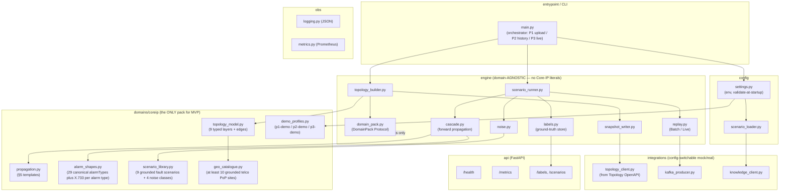

- **`engine/domain_pack.py`** — the `DomainPack` `Protocol`: `domain_id()` (e.g. `core-ip`),
  `object_types()` (includes `Interface` and the domain-agnostic `Site`), `edge_relations()` (includes
  `HOSTS`, `TERMINATES`, and `LOCATED_AT`), `attribute_keys()` (the well-known device/connection keys the pack populates),
  `build_topology(graph, size, rng)`, `propagation_templates()`, `alarm_shape(alarm_type)`,
  `alarm_type_vocabulary()` (the canonical `alarmType` token set the pack emits — must be a subset
  of the domain's **29-token** Knowledge `alarmTypeVocabulary`), `scenario_library()` (the **9
  grounded fault scenarios**), `noise_classes()`, `geo_sites()` (the **≥10 grounded telco PoP
  sites**), and `igp_areas(node_count)` (the grounded IGP-area assignment).
  `object_types()`/`edge_relations()`/`attribute_keys()`/`alarm_type_vocabulary()`/`domain_id()` are
  the **domain vocabulary** the snapshot + alarms are stamped/validated with; the engine depends only
  on this Protocol. `alarm_shape(alarm_type)` returns the full shape for one canonical `alarmType`
  token — its `alarmType` (the join key), plus the X.733 `eventType`/`probableCause`/`perceivedSeverity`
  — so every alarm the engine emits carries the required `alarmType`.
- **`engine/topology_builder.py`** — asks the pack to populate a `networkx` `DiGraph` of typed nodes
  and typed edges (including `Site` nodes + `LOCATED_AT` edges and `Interface` nodes + `HOSTS`/
  `TERMINATES` edges), copying each node/edge's `attributes` map through (incl. the per-`Node`/
  per-`Interface` **`igpArea`** the pack assigns via `pack.igp_areas(...)`); mints `managedObjectId`s.
  Domain-agnostic: it never names a Core-IP type, the `Site`/`Interface` type, a relation literal, or
  an attribute key — it iterates `pack.object_types()`/`pack.edge_relations()`/`pack.attribute_keys()`.
- **`engine/cascade.py`** — given a root-cause node + the pack's propagation templates, walks the
  graph closure (BFS over the template-relevant edge relations) producing the ordered child alarm
  set. The §5 logic (see Algorithm logical flow) lives in template *data* from the pack; the
  traversal is generic.
- **`engine/labels.py`** — the ground-truth store (see Data model). One record per injected scenario:
  `{scenarioId, scenarioType, rootCause, rootCauseManagedObjectId, rootCauseAlarmType, children,
  snapshotId}`. `rootCauseAlarmType` is the root-cause alarm's canonical `alarmType` token (the join
  key the RCA oracle compares against `correlation.results.rootCauseAlarmType`), recorded from the
  same alarm-shape the root alarm was emitted with — so the oracle compares like-for-like on the
  canonical token, not on `probableCause`.
- **`domains/coreip/`** — the only concrete pack: the typed Core-IP layers + edges **plus `Site`
  nodes and `LOCATED_AT` edges and `Interface` nodes + `HOSTS`/`TERMINATES` edges** (Port HOSTS
  Interface; Interface TERMINATES IPLink; `ADJACENCY_OVER` runs Interface→IGPAdjacency, per §5 #91),
  the well-known `attributes` keys on devices (`vendor`, `model`,
  `equipmentType`, `role`, `capacity`, **`igpArea`**) and connections (`linkType`, `capacity`,
  `protectionRole`), the **28** §5 propagation templates (mirroring the seeded
  `core-ip/propagationTemplate` records — the original 8 + the 20 co-symptom/sub-chain records that
  lengthen each cascade), the **canonical `alarmType` tokens** + their X.733 alarm shapes (each
  shape pairs an `alarmType` join token with its X.733 `eventType`/`probableCause`/`perceivedSeverity`),
  the **9-scenario library** (`fiber-cut`, `line-card-fault`, `port-fault`, `interface-fault`,
  `node-failure`, `ip-link-failure`, `lsp-te-failure`, `routing-adjacency-failure`,
  `srlg-shared-risk-failure` + ≥3 noise classes — see *Scenario library* below), the
  **`geo_catalogue.py`** of ≥10 grounded telco PoP sites, and the **`igp_areas`** assignment. It
  declares `domain_id() == "core-ip"`, the full object-type/relation/attribute vocabulary stamped on
  the snapshot (object types incl. `Interface`/`Site`; relations incl. `HOSTS`/`TERMINATES`/
  `LOCATED_AT`; attribute keys incl. `igpArea`), and the canonical **`alarm_type_vocabulary()`** =
  the **29 expanded tokens** `{LOS, LOF, OpticalPowerLow, FiberCut, FiberFault, PortDown,
  LineCardFault, CRCErrors, PortFlapping, LinkBundleDegraded, InterfaceDown, InterfaceErrors,
  IPLinkDown, LinkDown, ISISAdjacencyDown, AdjDown, OSPFAdjacencyDown, BGPPeerDown, RouteFlap,
  LDPSessionDown, LSPDown, FRRSwitchover, TETunnelDown, VPNReachabilityLoss, ReachabilityLoss,
  ServiceDegraded, Congestion, QueueDrop, HighLatency}` (= the domain's Knowledge
  `alarmTypeVocabulary` — the value space every emitted `AlarmEvent.alarmType` is drawn from). These
  `alarmType` tokens are the canonical join tokens, **not** the lowercase X.733 `probableCause`
  tokens (`lossOfSignal`/`linkDown`) and **not** the X.733 `eventType` categories.
  `Site`/`LOCATED_AT` are domain-agnostic and reused by any future pack; the geo/attribute *values*
  are Core-IP grounded.
- **`ingest/corpus_loader.py`** (new — the ingest loader/validator) — when `SIM_MODE=ingest`, loads
  the pre-created files and **bypasses the generation stage**: (P1) reads the topology snapshot file,
  validates it against the **canonical `services/topology/schema/snapshot.schema.json`** + every
  `managedObjectId` via `acp_event_model.validate` (reusing `snapshot_writer`'s validator), then
  hands it to `topology_client` for upload; (P2/P3) streams the alarm corpus JSONL, reconstructs each
  `TypedEnvelope[AlarmEvent]` via `acp_event_model` (frozen-binding validation incl. required
  `alarmType`), and yields the ordered stream to `replay.py`; loads the labels JSONL into
  `engine/labels.py` so `/labels` + the oracle work. It **never** invokes `topology_builder`,
  `scenario_runner`, `cascade`, or `noise`. Fail-fast on malformed input (criteria 36-39).
- **`ingest/corpus_writer.py`** (new — the export corpus writer) — when `EXPORT_CORPUS_FILE` is set
  in a *generate* run, writes the **alarm corpus file**: one JSONL line per emitted
  `TypedEnvelope[AlarmEvent]` in emit order with the target topic, tapped at the **same point**
  `kafka_producer` serializes/emits, so the file is exactly the wire stream. Reuses
  `acp_event_model.serialize` (no new serialization). The snapshot file (from `snapshot_writer`) and
  labels file (from `labels.export_to_file`) are reused as-is for the round-trip — only the corpus
  writer is new.

### Scenario library — 9 grounded fault scenarios, each spanning 10-20 alarm types (fix B1)

The pack ships **9 distinct grounded Core IP fault scenarios** (the mvp-achievability gate flagged the
prior 4 as too small to *demonstrate* the "8-10 patterns each spanning 10-20 alarm types" target).
Each scenario is **one fault origin** drawn from a Knowledge `faultOriginType` record (the 7
single-origin records) plus the two structural composites the Codebook Generator instantiates over the
topology (`srlg-shared-risk-failure` via `MEMBER_OF` co-failure, and the multi-port `line-card-fault`
fan-out). Each cascade walks the **28 propagation templates** forward over the bounded closure with
fan-out (`each-target`) and SRLG fate-sharing, yielding a **10-20-distinct-`alarmType` symptom set**
(the deepest, `fiber-cut`, makes up to ~24 types available; the demo profile's closure depth / IGP-area
bound selects a 10-20-type slice). The scenarios collectively cover the bulk of the signal volume —
the **~50-60% pattern-coverage** target (the rest is `BACKGROUND_FRACTION` + `NOISE_RATE`).

| # | Scenario (`scenarioType`) | Fault origin (Knowledge `faultOriginType`) | Root `alarmType` | Cascade head (canonical `alarmType`s, abbreviated) | Distinct-type span |
|---|---|---|---|---|---|
| 1 | `fiber-cut` | `FiberSpan` | `FiberCut` | `FiberCut` to `LOS`/`LOF`/`OpticalPowerLow` to `LinkDown`/`IPLinkDown`/`LinkBundleDegraded` to routing fan-out to `LSPDown`/`FRRSwitchover`/`TETunnelDown` to service/QoS tail | ~18-24 (deepest) |
| 2 | `line-card-fault` | `LineCard` | `LineCardFault` | `LineCardFault` to `PortDown`/`PortFlapping` (each hosted port) to `InterfaceDown`/`CRCErrors`/`InterfaceErrors` to `LinkDown` to routing to LSP to service | ~14-20 (multi-port fan-out) |
| 3 | `port-fault` | `Port` | `PortDown` | `PortDown` to `InterfaceDown`/`CRCErrors`/`InterfaceErrors` to `LinkDown`/`IPLinkDown` to routing to LSP to service | ~10-15 |
| 4 | `interface-fault` | `Interface` | `InterfaceDown` | `InterfaceDown` to `LinkDown`/`IPLinkDown` and `ISISAdjacencyDown`/`OSPFAdjacencyDown`/`AdjDown` to `LSPDown` to service | ~10-15 |
| 5 | `node-failure` | `Node` | `LOS` | node-level `LOS` to all hosted line cards/ports to `InterfaceDown` to `LinkDown` to routing to LSP to service (widest fan-out) | ~14-20 |
| 6 | `ip-link-failure` | `IPLink` | `IPLinkDown` | `IPLinkDown`/`LinkDown` to `LinkBundleDegraded` (SRLG/bundle) and `LSPDown`/`FRRSwitchover`/`TETunnelDown` to `VPNReachabilityLoss`/`ServiceDegraded`/`Congestion`/`QueueDrop`/`HighLatency` | ~10-14 (routing entry) |
| 7 | `lsp-te-failure` | `LSP` | `LSPDown` | `LSPDown`/`FRRSwitchover`/`TETunnelDown` to `ReachabilityLoss`/`VPNReachabilityLoss`/`ServiceDegraded`/`Congestion`/`QueueDrop`/`HighLatency` | ~6-10 (service entry) |
| 8 | `routing-adjacency-failure` | `Interface` (routing-emphasis) | `InterfaceDown` | `InterfaceDown` to the **full routing fan-out** `ISISAdjacencyDown`/`OSPFAdjacencyDown`/`AdjDown`/`BGPPeerDown`/`RouteFlap`/`LDPSessionDown` to `LSPDown` to service | ~12-16 (IGP/BGP/LDP) |
| 9 | `srlg-shared-risk-failure` | `FiberSpan` + `SRLG` (`MEMBER_OF` co-failure) | `FiberCut` | `FiberCut` fate-shares to **all SRLG co-member** `IPLink`s (`LinkDown`/`LinkBundleDegraded`) to multi-link routing/LSP/service cascade (broadest co-failure) | ~16-22 (fate-sharing) |

Each scenario is injected `SCENARIO_INSTANCES` times (multiple grounded instances → minable support);
each instance is an independent cascade (fresh ids, possibly a different fault-origin instance) but the
**same ordered canonical `alarmType` signature** the downstream chain mines on. `SCENARIOS` selects a
subset (1-9) for subset runs; the default is all 9. Scenario 8 (`routing-adjacency-failure`) is an
`Interface`-origin scenario whose template selection emphasizes the multi-protocol routing templates
(`#isis`/`#ospf`/`#bgp`/`#route` + `LDPSessionDown`) so it is distinct from `interface-fault` (which
emphasizes the link/LSP path). The pack keeps every scenario's emitted token set a subset of its
`alarm_type_vocabulary()` — and therefore of the seeded Knowledge `alarmTypeVocabulary`.

### Geo-site catalogue — ≥10 grounded telco PoP sites (fix B4)

`domains/coreip/geo_catalogue.py` holds a fixed catalogue of **at least 10 distinct, grounded telco
PoP cities**, each with a real-ish `{name, latitude, longitude, region}` (no reused or fabricated
coords). The catalogue is the value source for `Site` node attributes; `SITE_COUNT=N` selects the
**first N distinct** catalogue entries (N ≤ catalogue size), so `SITE_COUNT=10` yields **10 distinct
grounded sites** (asserted by criterion 30). Illustrative entries:

| `name` | `latitude` | `longitude` | `region` |
|---|---|---|---|
| London Docklands | 51.5033 | -0.0195 | UK-South |
| Manchester Central | 53.4779 | -2.2426 | UK-North |
| Amsterdam Zuidoost | 52.3105 | 4.9447 | EU-West |
| Frankfurt am Main | 50.1109 | 8.6821 | EU-Central |
| Paris Aubervilliers | 48.9145 | 2.3819 | EU-West |
| Madrid Alcobendas | 40.5400 | -3.6420 | EU-South |
| Milan Caldera | 45.4642 | 9.1900 | EU-South |
| Stockholm Kista | 59.4030 | 17.9510 | EU-North |
| Dublin Citywest | 53.2870 | -6.4290 | IE |
| Warsaw Wola | 52.2330 | 20.9840 | EU-East |
| Zurich Glattbrugg | 47.4290 | 8.5640 | CH |
| Vienna Floridsdorf | 48.2570 | 16.4000 | AT |

The catalogue holds **12 entries** (≥10 with headroom), all distinct cities with distinct
coordinates. If a configured `SITE_COUNT` exceeds the catalogue size, startup validation fails fast
(criterion 18) rather than reusing/fabricating coordinates.

## Data model / DB schema

**Decision (OQ-2 / "Data owned"): file-based, no relational store.** The Simulator is a short-lived
generation/replay job, not a long-running data service; a relational DB adds operational weight with
no query need. The two owned artifacts are written to a run-scoped output directory
(`SIM_OUTPUT_DIR`, default `/data/sim`):

1. **Topology snapshot file** — `snapshot-<runId>.json` (the versioned contract; schema below).
2. **Ground-truth label export** — `labels-<runId>.jsonl` (one JSON object per scenario) + an
   in-process index served by the labels API.

The label record model (Pydantic, internal):

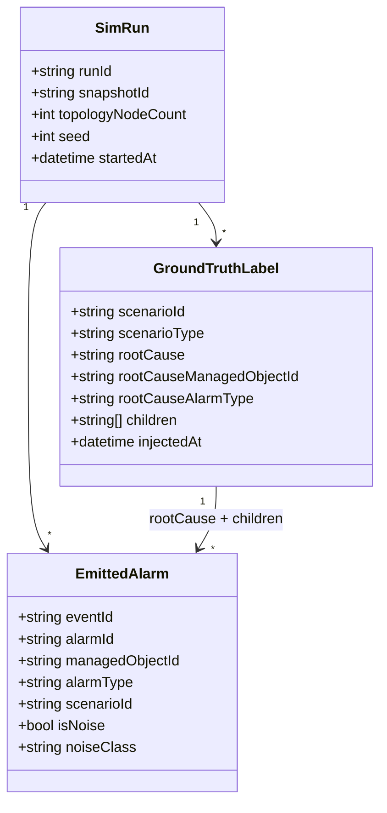

- `scenarioType` ∈ the **9-scenario** set `{fiber-cut, line-card-fault, port-fault, interface-fault,
  node-failure, ip-link-failure, lsp-te-failure, routing-adjacency-failure, srlg-shared-risk-failure}`;
  `rootCause` is the root-cause
  alarm's `alarmId`; `rootCauseAlarmType` is the root-cause alarm's **canonical `alarmType`** token
  (a Knowledge `alarmTypeVocabulary` member — e.g. `FiberCut` for fiber-cut, `InterfaceDown` for
  interface-fault, `LineCardFault` for line-card-fault, `IPLinkDown` for ip-link-failure,
  `LSPDown` for lsp-te-failure, `LOS` for node-failure), recorded so the RCA-accuracy oracle compares the injected root cause to
  `correlation.results.rootCauseAlarmType` on the **same token space** (not on `probableCause`);
  `children` is the list of causally-downstream alarm `alarmId`s. Each `EmittedAlarm.alarmType` is
  the alarm's canonical join token, so the oracle can also key the minable signature / ground-truth
  off `alarmType` rather than `probableCause`.
- `EmittedAlarm.scenarioId` is null for noise; `isNoise=true` ⇒ `noiseClass` set; noise alarms
  (`isNoise=true`) appear in no label's `children`, which is what makes them identifiable as noise
  (criterion 6).

### Topology snapshot file schema (versioned contract — single canonical source)

**Decision (OQ-4 — resolved to the frozen Topology contract): the snapshot file schema has ONE
canonical source, `services/topology/schema/snapshot.schema.json`, owned by the Topology Service
(the validating owner). The Simulator validates its generated snapshot file against THAT same file
— it keeps NO independent copy of the schema.** Rationale: the event-model is the Kafka
envelope/payload contract; the snapshot is a file/API hand-off (not a topic), and the consuming
owner (Topology) already publishes the single schema its ingestion endpoint validates against.
Co-locating a second copy under the Simulator would risk drift between producer and validator, so
the Simulator's `snapshot_writer` loads and validates against the **canonical Topology schema**
(vendored/synced from `services/topology/schema/snapshot.schema.json` at build time, never
re-authored). Any change to that schema remains a contract change requiring an `architecture.md`
update + human approval (per spec Contract section).

> **No new contract change here.** The required **`AlarmEvent.alarmType`** field is **already merged**
> on `main` (`libs/event-model/schema/payloads/AlarmEvent.schema.json` lists `alarmType` in
> `required[]`; `architecture.md` Invariants pin it as the canonical join key with value space =
> Knowledge `alarmTypeVocabulary`). This design only makes the Simulator **populate** that existing
> required field — it adds no topic, payload, field, or OpenAPI surface. The frozen Topology ingestion
> contract (`POST /topology/snapshots` → **200 `SnapshotIngestResponse`**) and the single canonical
> snapshot schema are **also already merged/frozen** (Topology design P1-G1); the Simulator aligns to
> them. `Site`, the `LOCATED_AT` relation, the **`Interface`** object type, the
> **`HOSTS`/`TERMINATES`** relations (and `ADJACENCY_OVER` running between interfaces), the
> domain-agnostic `managedObjectId` scheme, and the well-known device/connection `attributes` keys are
> all already in the **merged multi-domain + Interface contract** (event-model #81 + the §5 Interface
> model #91 + the `architecture.md` "Topology snapshot file" / "Domain extensibility" sections).
> `alarmType` is the canonical join key (value space = Knowledge `alarmTypeVocabulary`);
> `Interface`/`HOSTS`/`TERMINATES` are **domain vocabulary** (authored in Knowledge, validated by
> Topology), not an event-model surface — the produced `AlarmEvent` and snapshot file stay conforming.
> This design only generates **conforming** data against the contract's already-published vocabulary —
> it adds no topic, payload, field, or OpenAPI surface beyond the merged contract.

The canonical schema (`services/topology/schema/snapshot.schema.json`, owned by Topology) is the
structure the ingestion API expects — `required: [schemaVersion, domain, nodes, edges]`, each node
`{managedObjectId, objectType, name?, attributes?}` and each edge `{from, to, relation, attributes?}`
under the generic `^[A-Za-z][A-Za-z0-9]*:[^:]+$` `managedObjectId` pattern. The schema deliberately
**does NOT enum the `objectType`/`relation` tokens** (it requires only the generic id pattern and a
non-empty `objectType`/`relation`); the per-domain object-type/relation vocabulary (incl. `Site`,
`Interface`, `LOCATED_AT`, `HOSTS`, `TERMINATES`) is validated **semantically by Topology against the
domain's Knowledge vocabulary** at ingest, not by this JSON Schema. The Simulator therefore (a)
JSON-Schema-validates its generated file against the canonical Topology schema, and (b) constrains
the `objectType`/`relation` tokens it emits to the **domain pack's vocabulary** — which the pack
keeps aligned to the Knowledge vocabulary Topology validates against — so a generated file Topology
accepts is produced by construction.

The `managedObjectId` pattern matches the **domain-agnostic** scheme `^[A-Za-z][A-Za-z0-9]*:[^:]+$`
in the merged event-model `managedObjectId.schema.json` (#81) — the engine reuses
`acp_event_model.validate` so the two never drift. The `objectType`/`relation` tokens the Simulator
emits (incl. the domain-agnostic **`Site`** / **`LOCATED_AT`** and the Core-IP **`Interface`** object
type with the **`HOSTS`**/**`TERMINATES`** relations) and the well-known `attributes` keys come from
the **domain pack's vocabulary**, the same vocabulary Topology validates the upload against (authored
canonically in Knowledge). **Well-known `attributes` keys** — devices: `vendor`, `model`,
`equipmentType`, `role`, `capacity`, **`igpArea`** (the catalogued IGP-area device key — fix B2,
emitted on each `Node` and the `Interface`s it hosts); connections: `linkType`, `capacity`,
`protectionRole`; `Site`: `name`, `latitude`, `longitude`, `region`. The set is open (extensible per
domain), so `attributes` stays an open object. Referential integrity (every edge endpoint resolves to
a node in `nodes[]`;
every device has exactly one `LOCATED_AT` edge to a `Site`; every `Port` `HOSTS` ≥1 `Interface` and
each `Interface` `TERMINATES` exactly one `IPLink`; the IGP adjacency is `ADJACENCY_OVER` an
`Interface`, never a `Port`/`IPLink` directly; no dangling references) is enforced by
`snapshot_writer` post-build validation (criteria 1, 14, 25, 26, 28).

#### `igpArea` emission (fix B2 — makes the Knowledge area-bound real)

The pack partitions the topology into a few grounded **IGP areas** and stamps an **`igpArea` device
attribute** on every `Node` (and on each `Interface` that node hosts), e.g. one `area-0` backbone plus
`area-1`/`area-2`/… edge areas (`IGP_AREA_COUNT`, default 3). Assignment is grounded: backbone-role
nodes (`P`/`RR`) land in `area-0`; PE/peering nodes land in a numbered edge area; an interface inherits
its host node's area (an interface that crosses an area boundary takes the lower-numbered area, the
backbone convention). Without this, `igpArea` was **inert** — the mvp-achievability gate flagged that
the seeded `trailPolicy/default` bounds closure on `boundary={type:'igp-area', attributeKey:'igpArea'}`
but **no P1 producer populated `igpArea`**, so Trail Builder's load-bearing area-prune could not fire
and trails spanned the whole connected component (AC-2 "no whole-network trail" violated on real data).
Emitting a grounded `igpArea` (now a catalogued device key in the Knowledge `attributeCatalogue`)
closes that cross-service inconsistency: Topology carries it as a generic node/interface attribute, and
Trail Builder bounds closure on it against **Simulator-generated** data (not igpArea-injected
fixtures). `igpArea` is a **descriptive attribute value**, not an event-model surface — no contract
change. Criterion 31 asserts every `Node` (and its `Interface`s) carries a non-empty `igpArea` and that
at least one `area-0` backbone area plus at least one numbered edge area are present.

### Alarm corpus file (exported artifact / ingest input — versioned contract, Simulator-owned)

The third owned artifact (added for export/ingest): `corpus-<runId>.jsonl`. It is a **file artifact,
not a Kafka topic** — the ordered emitted alarm stream serialized to disk so a generated run can be
**replayed verbatim** later. **No new event-model surface:** each line wraps the **frozen
`AlarmEvent` payload** inside the existing `TypedEnvelope`, plus a tiny file-level envelope recording
the target topic and the emit ordinal (so the ingest replays the same alarms on the same topic, in
order). The corpus file format is versioned (`corpusVersion`) and owned by the Simulator.

**Format.** A JSONL file: an optional first **header line** (`{"corpusVersion":1,
"sourceRunId":"...", "phase":"p2", "topic":"alarms.history", "count":N}`) followed by **N record
lines**, each:

```json
{ "seq": 0, "topic": "alarms.history", "envelope": { "eventId":"a1...", "type":"AlarmEvent", "schemaVersion":1, "occurredAt":"2026-06-10T10:00:00Z", "source":"simulator", "traceId":"sc-fiber-001", "payload": { "alarmId":"ALM-FC-0001", "managedObjectId":"FiberSpan:F-PE1-P1", "alarmType":"FiberFault", "eventType":"communicationsAlarm", "probableCause":"lossOfSignal", "perceivedSeverity":"critical", "raisedAt":"2026-06-10T10:00:00.000Z", "state":"raised", "trailIds":[] } } }
```

- `seq` is the emit ordinal (0-based) — preserves verbatim **order** on replay.
- `topic` is the topic the alarm was emitted on (`alarms.history` for P2, `alarms.live` for P3) — so
  ingest replays each alarm on the same topic without re-deciding.
- `envelope` is the **exact `TypedEnvelope[AlarmEvent]`** as serialized by `acp_event_model.serialize`
  — `payload` is the frozen `AlarmEvent` (incl. required `alarmType`). On **ingest**, the loader
  re-validates each `payload` against the frozen binding and replays it **verbatim** (preserving
  `alarmId`/`alarmType`/`managedObjectId`/`trailIds`/`raisedAt`/severity/order), **minting a fresh
  envelope `eventId`** per replay run so a re-ingest never collides with a prior run's events.

The corpus is the input shape for ingest (`--alarms-file`) and the output shape for export
(`--export-corpus`); the same writer/loader pair guarantees round-trip fidelity (criterion 40). A
record line whose `envelope.payload` fails frozen-binding validation (e.g. missing `alarmType`)
aborts ingest before any emission (criterion 38).

The ingest/export data model (the exported/ingested artifacts and how they relate to a run):

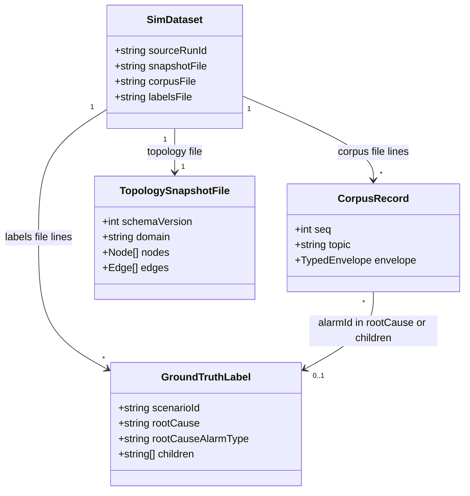

## Event handling

- **Consumers:** **none.** The Simulator is a pure Kafka producer (spec Contract: "Consumes (Kafka):
  none"). There is no inbound stream, hence **no DLQ** (spec Non-functional confirms this). `*.dlq`
  routing is N/A for this service.
- **Producers:**
  - `alarms.history` — `TypedEnvelope[AlarmEvent]`, batch (history mode — generate **or** ingest).
  - `alarms.live` — `TypedEnvelope[AlarmEvent]`, wall-clock paced (live mode — generate **or**
    ingest).
  - Both carry the frozen `AlarmEvent` payload (envelope `source="simulator"`, `type="AlarmEvent"`,
    `schemaVersion=1`). Serialized via `acp_event_model.serialize`. **Every payload includes the
    required canonical `alarmType`** token (a `alarmTypeVocabulary` member from the pack's
    `alarm_shape`, or — in ingest mode — the `alarmType` already on the ingested corpus payload)
    alongside `eventType`/`probableCause` — the Simulator is the **origin** of these
    alarms and is therefore one of the two `alarmType` populators (with Enrichment), per the
    `architecture.md` alarmType invariant. **Ingest mode produces the same two topics with the same
    frozen `AlarmEvent` payload — no new topic, no payload change.**
- **Idempotency:** every emitted event gets a fresh UUID `eventId` (envelope) and a unique `alarmId`
  (payload) so at-least-once redelivery is dedupable downstream on `eventId`/`alarmId`. Producer is
  configured `enable.idempotence=true`, `acks=all`. **Re-runs with the same `SIM_SEED`** reproduce
  the same *cascade structure and timing* (deterministic generation, OQ-3 decision below) but mint
  **new** `eventId`/`alarmId` per run (spec Non-functional: "re-runs SHOULD produce new ids"), so a
  replayed corpus never collides with a prior run's ids. **Ingest replay** likewise mints a **fresh
  envelope `eventId`** per replayed event while preserving the ingested `AlarmEvent` payload
  (incl. `alarmId`/`alarmType`/`managedObjectId`/`raisedAt`) — so re-ingesting the same corpus many
  times never collides on `eventId`, and downstream dedupe on `eventId`/`alarmId` stays honest.

## API contracts / API schema

The Simulator exposes a **small read-only HTTP surface** (FastAPI) for ground-truth retrieval +
liveness/metrics. OpenAPI 3.1 is auto-generated by FastAPI and served at `/openapi.json`; the
generated document is checked in as `services/simulator/openapi.json` (authoritative surface; any
change is a contract change). Request/response models are Pydantic.

| Method | Path | Request | Response (200) | Errors |
|---|---|---|---|---|
| GET | `/health` | — | `{"status":"ok","kafka":"connected","run":"<runId|idle>"}` | `503` if startup incomplete or Kafka connection lost |
| GET | `/metrics` | — | Prometheus text exposition (`Content-Type: text/plain`); ≥1 metric e.g. `simulator_alarms_emitted_total` | — |
| GET | `/openapi.json` | — | OpenAPI 3.1 document | — |
| GET | `/labels` | query `?scenarioId=` optional | `GroundTruthLabel[]` — **frozen shape** `{scenarioId, scenarioType, rootCause, rootCauseManagedObjectId, rootCauseAlarmType, children[]}` | `404` unknown `scenarioId` |
| GET | `/labels/{scenarioId}` | path | one `GroundTruthLabel` (same frozen shape) | `404` |
| GET | `/scenarios` | — | scenario-def summary (type, root-cause object type, root-cause `alarmType`, expected child count) | — |
| GET | `/labels/p3-summary` | — | **(P3 synth)** `P3RunSummary {totalAlarms, alignedAlarms, nonAlignedAlarms, alignedFraction}` for the last synth run | `404` if no synth run |
| POST | `/runs` (optional control) | `{mode:"history"|"live", config?}` | `{runId}` accepted `202` | `400` invalid config, `409` run in progress |

**P3 synth labels are additive on the same surface.** In `synth` mode `/labels` returns the
per-cascade records with the additive P3 fields `{patternId, trailId, rootCauseAlarmId,
rootCauseAlarmType, childAlarmIds, scenarioType}` (the existing frozen generate/ingest shape is a
subset; the P3 fields are added for synth records only — no breaking change to the existing shape),
and `GET /labels/p3-summary` exposes the run summary so the 60-70% KPI is directly computable
(AC 43). The checked-in `openapi.json` is regenerated to include `/labels/p3-summary` +
`P3RunSummary`/`P3CascadeLabel` schemas; the drift-guard test re-freezes it. This is the Simulator's
**own** OpenAPI surface (self-owned) — not a collaborator contract change.

**`/labels` response is frozen** at `{scenarioId, scenarioType, rootCause, rootCauseManagedObjectId,
rootCauseAlarmType, children[]}`. `rootCauseAlarmType` is the canonical `alarmType` token of the
injected root cause (a Knowledge `alarmTypeVocabulary` member), added so the RCA-accuracy oracle can
compare the injected root cause to `correlation.results.rootCauseAlarmId` / `rootCauseAlarmType` on
the **same token space** (like-for-like, not `probableCause`). `/labels` is the REST mirror of the
canonical JSONL file export (which carries the identical fields); the integration oracle MAY use
either. No write endpoints expose alarm content (read-only oracle).

## Integration points (mock vs. real)

No collaborator URL is hard-coded; all resolve from env. Mock = a stub generated from the
collaborator's **published OpenAPI** (used in unit tests); real = the live service (integration).

| Collaborator + operation | Config key(s) | mock | real |
|---|---|---|---|
| **Topology Service — ingestion API** (`POST /topology/snapshots`; upload snapshot file; lift → graph → `topology.changed`) | `TOPOLOGY_API_MODE` (`mock`\|`real`), `TOPOLOGY_API_BASE_URL` | local stub generated from Topology's published OpenAPI 3.1 — records the uploaded file, returns a synthetic **200** `SnapshotIngestResponse` `{snapshotId, domain, status, nodeCount, edgeCount, changeType}`; never contacts a real service | `httpx` client `POST {TOPOLOGY_API_BASE_URL}/topology/snapshots` → reads `snapshotId` from the **200** `SnapshotIngestResponse` body |
| **Knowledge Service — scenario config** (optional read of scenario/jitter/noise params) | `KNOWLEDGE_MODE` (`local`\|`real`), `KNOWLEDGE_API_BASE_URL` | `local` = read scenario/threshold config from local files (default) | `real` = fetch from Knowledge Service API |
| **Kafka** (produce `alarms.history`/`alarms.live`) | `KAFKA_BOOTSTRAP_SERVERS` | embedded/in-memory producer double in unit tests | real broker in integration |
| **[P3 synth] Pattern Manager — approved patterns** (`GET /patterns?lifecycle=approved` → `PatternView[]`) | `PATTERN_MANAGER_API_MODE` (`mock`\|`real`), `PATTERN_MANAGER_API_BASE_URL` | `respx` stub from PM's published `openapi.json` — returns `PatternView[]` (`trailId`, `SequenceElementView[]`, `rootCauseAlarmType`, `timing`, `SessionWindowView`); call-counted | `httpx` `GET {base}/patterns?lifecycle=approved` (paged) |
| **[P3 synth] Trail Builder — trail members** (`GET /trails/{trailId}` → `TrailDetail.members[]`) | `TRAIL_BUILDER_API_MODE`, `TRAIL_BUILDER_API_BASE_URL` | `respx` stub from TB's published `openapi.json` — returns `TrailDetail` w/ `members[]` of `TrailMember {managedObjectId, objectType}`; 404 path testable; call-counted | `httpx` `GET {base}/trails/{trailId}` |
| **[P3 synth] Topology — snapshot listing** (`GET /topology/snapshots` → `SnapshotSummaryDto[]`) | `TOPOLOGY_API_MODE`, `TOPOLOGY_API_BASE_URL` (shared w/ P1 upload) | `respx` stub from Topology's published `openapi.json` — returns `SnapshotListDto.snapshots[]`; call-counted | `httpx` `GET {base}/topology/snapshots?domain=core-ip` |

**P3 integration points are only instantiated in `synth` mode** (AC 45): in generate/ingest/export
none of the three P3 clients are constructed. All are config-switchable with no code change (AC 44);
mocks are stubs from the collaborators' **published OpenAPI** (contract-first — no cross-service
source coupling). **No contract change:** `PatternView`/`SequenceElementView`/`SessionWindowView`,
`TrailDetail`/`TrailMember {managedObjectId, objectType}`, and `SnapshotListDto`/`SnapshotSummaryDto`
are all **already published + verified** on the collaborators' frozen OpenAPI — consumed as-is.

The Topology upload client is built **against Topology's published OpenAPI, never its source**
(invariant: contract-first, no cross-service code coupling). `TOPOLOGY_API_MODE` switching requires
no code change (criterion 15).

**Frozen ingestion contract (Topology P1-G1).** The Simulator's upload aligns exactly to Topology's
**frozen** ingestion operation: `POST /topology/snapshots` with the snapshot file as the JSON body,
returning **HTTP 200** (synchronous — `snapshotId` is minted inline during the lift, **not** 202
async) with body `SnapshotIngestResponse { snapshotId, domain, status, nodeCount, edgeCount,
changeType }`. The client reads **`snapshotId` from the 200 body** and records it on the `SimRun` so
later P2/P3 alarms share the same `snapshotId` identity. The Simulator validates its generated file
against the **single canonical schema `services/topology/schema/snapshot.schema.json`** (Topology
owns + publishes it; the Simulator keeps no independent copy) before upload, so Topology's ingest
JSON-Schema check passes by construction. (The earlier Simulator assumption of a `202 {snapshotId}`
bare body is corrected here to the frozen `200 SnapshotIngestResponse`.)

## Key flows (sequence / data-flow diagrams)

### (a) P1 — topology generation → snapshot file → upload to Topology ingestion API

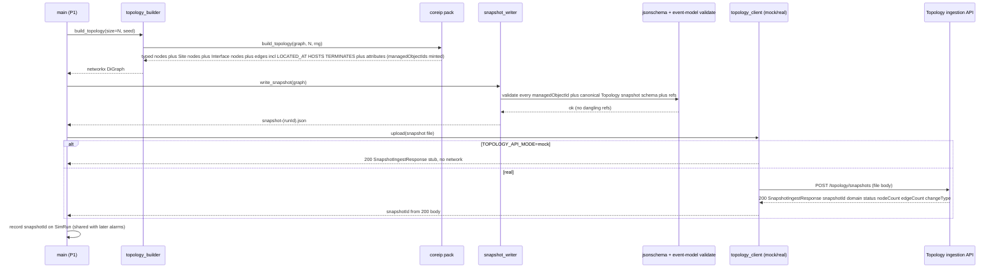

### (b) P2 — labeled scenario generation → cascade + noise → batch replay to `alarms.history`

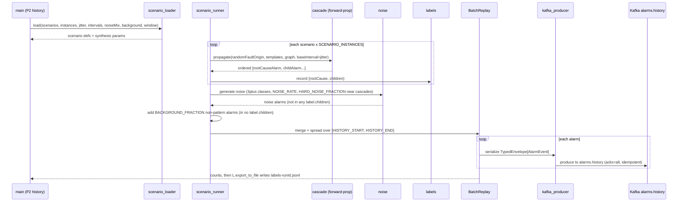

P2 batch timing: relative inter-event gaps (`BASE_INTERVAL_MS`/`BACKGROUND_INTERVAL_MS` + jitter)
are computed first, then the whole ordered stream is **mapped onto the `[HISTORY_START,
HISTORY_END]` wall-clock window** so each alarm's `raisedAt`/`occurredAt` falls inside the
configured historical window (batch emit is still fire-and-flush — the window sets the timestamps,
not the emit rate). P3 instead uses live wall-clock + `PACING_MULTIPLIER` (below).

### (c) P3 — live replay to `alarms.live` (wall-clock paced)

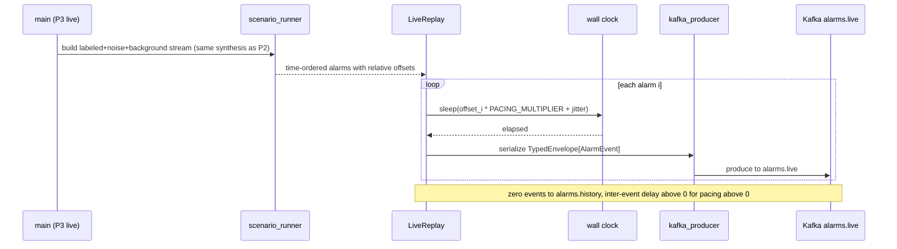

### (d) Ingest mode — skip generation, replay a pre-created dataset verbatim (P1/P2/P3)

Ingest **reuses the upload path (P1) and the replay path (P2/P3)** but feeds them from pre-created
files instead of the generator. `topology_builder`/`scenario_runner`/`cascade`/`noise` are never
called.

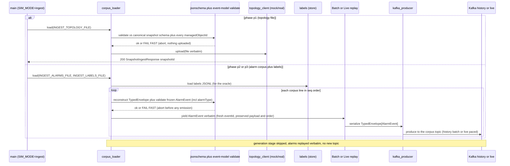

### (e) Generate-and-export round-trip — generate once, replay many

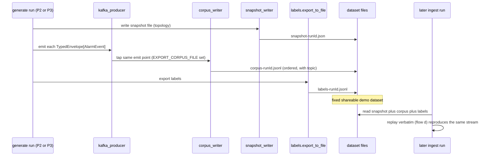

## Algorithm logical flow

Two non-trivial algorithms: the **§5 forward-propagation cascade** and the **domain-pack
abstraction** boundary.

### Cascade / scenario generation (forward propagation per §5 templates)

Inputs: a chosen `rootCauseNode` (type ∈ fault-origins `{FiberSpan, LineCard, Port, Interface, Node,
IPLink, LSP}` from the pack — the 7 Knowledge `faultOriginType` records), the pack's per-edge-relation
propagation templates (the **28** records — multiple records may share one edge relation and emit
different effect `alarmType`s, so one hop adds several co-symptom types), the `networkx` graph, and
jitter params (from config/Knowledge — never hard-coded). Output: an ordered alarm list + a
`{rootCause, children}` label.

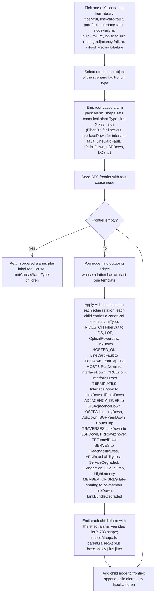

Notes:
- The template effect names (the **29-token** set — `FiberCut`/`LOS`/`LOF`/`OpticalPowerLow`,
  `PortDown`/`PortFlapping`/`CRCErrors`, `InterfaceDown`/`InterfaceErrors`/`LinkDown`/`IPLinkDown`/
  `LinkBundleDegraded`, `ISISAdjacencyDown`/`OSPFAdjacencyDown`/`AdjDown`/`BGPPeerDown`/`RouteFlap`/
  `LDPSessionDown`, `LSPDown`/`FRRSwitchover`/`TETunnelDown`, `ReachabilityLoss`/`VPNReachabilityLoss`/
  `ServiceDegraded`/`Congestion`/`QueueDrop`/`HighLatency`) **are the canonical `alarmType` tokens** —
  each is set on the emitted `AlarmEvent.alarmType` (the join key), alongside the X.733
  `eventType`/`probableCause` the pack's `alarm_shape` returns. `rootCauseAlarmType` on the label is
  the root alarm's `alarmType` token. Because multiple templates share one edge relation, a single hop
  contributes several distinct effect types — this is what lets one cascade span 10-20 types.
- Jitter is applied per inter-alarm gap: `delay = base_delay + gauss(0, jitter_stddev_ms)`. With
  `jitter_stddev_ms=0` the cascade is deterministic (criterion 12). `MEMBER_OF` (SRLG) fate-sharing
  expands a single fiber/link fault to all co-grouped links before propagating onward.
- All template data, the canonical `alarmType` tokens, and the X.733 alarm shapes come from the
  pack; `cascade.py` only walks edges and applies whatever template/shape the pack provides → engine
  stays domain-agnostic (criterion 19).

### Randomization scope (what is random, how it stays grounded)

Everything stochastic in the synthesizer is driven by **one seeded RNG** (`SIM_SEED` → a single
`random.Random`/`numpy.random.Generator` threaded through `topology_builder`, `scenario_runner`,
`cascade`, and `noise`). Same seed → identical run (criterion 12 determinism). Every random choice
is **bounded by the pack's grounded model** so the §5 propagation grounding is never violated.

| What is randomized | How | Grounding constraint (never violated) |
|---|---|---|
| **Fault-origin instance** per scenario | RNG picks uniformly among the **valid fault-origin-type instances** the pack exposes for that scenario (a `FiberSpan` for fiber-cut/srlg-shared-risk, a `LineCard` for line-card-fault, a `Port` for port-fault, an `Interface` for interface-fault/routing-adjacency-failure, a `Node` for node-failure, an `IPLink` for ip-link-failure, an `LSP` for lsp-te-failure) | only object instances of the scenario's declared fault-origin type are eligible; cascade then follows the pack templates — no impossible origin |
| **Child-alarm timing** | `delay = BASE_INTERVAL_MS + gauss(0, JITTER_STDDEV_MS)` per inter-alarm gap | delay clamped ≥ 0; ordering still respects the causal BFS — a child never precedes its parent |
| **Noise placement / object / class / timing** | RNG selects noise class per `NOISE_MIX`, the target object, and the time offset; `HARD_NOISE_FRACTION` decides near-cascade vs. clearly-separate placement | noise objects/shapes come from the pack's noise library; a noise alarm is **never** added to any label's `children` (criterion 6) |
| **Scenario-instance ordering / interleaving** | the `SCENARIO_INSTANCES` copies of each scenario and the background alarms are interleaved on the timeline by the RNG | each instance is an independent cascade with its own ids; interleaving never merges two scenarios' children |
| **Background-alarm objects / timing** | RNG places `BACKGROUND_FRACTION` of alarms on random in-topology objects at `BACKGROUND_INTERVAL_MS` spacing | background alarms are valid X.733 alarms on real objects but belong to no scenario → in no label's `children` |

Because every choice is constrained to pack-valid instances and the cascade always replays the §5
templates over the real graph closure, **randomization produces variety, never an impossible
cascade or an off-contract alarm shape**. The chosen fault-origin instances, child timing, noise,
and interleaving differ run-to-run only when the seed differs.

### Synthesis strategy / evaluation-grade data (P2 / P3)

The synthesizer does **not** emit an arbitrary alarm soup — it deliberately produces a corpus that
**strongly exercises the downstream learning + noise services** and is **sufficient to compute the
§10 thresholds meaningfully**. Three properties are engineered in, all config-driven with smart
defaults (a default run is evaluation-grade without tuning):

1. **Repeated pattern instances (minable support).** Each of the **9 selected scenarios** is injected
   `SCENARIO_INSTANCES` times (**default 8**, range 5–10). The **Pattern Miner uses PrefixSpan**,
   which only mines a sequence whose support clears a minimum-support threshold — a *single*
   instance of a cascade can never be mined. Injecting N≈8 grounded repetitions of each scenario
   signature **guarantees minable support** for every injected pattern, so pattern quality
   (recovered ÷ injected, §10 ≥ 0.80) is measurable rather than vacuously zero. Each instance is an
   independent cascade (fresh ids, possibly different fault-origin instance) but the **same ordered
   canonical `alarmType` signature** (the join token the downstream chain mines on — not
   `probableCause`), which is exactly what PrefixSpan recovers. With 9 distinct scenarios each
   spanning 10-20 distinct `alarmType`s, the corpus presents **8-10 distinct minable patterns of
   10-20 types** — the MVP P2 magnitude target the gate flagged as a Gap under the old 4-scenario pack.

2. **Fair share of non-pattern / background alarms.** `BACKGROUND_FRACTION` (**default 0.3**) of
   emitted alarms belong to **no injected pattern** — valid alarms on real objects that appear in
   **no** label's `children`. This forces pattern learning to *discriminate signal from background*
   (a corpus of pure cascades would let any miner "win" trivially) and makes the alarm-reduction
   metric (§10 ≥ 5×) meaningful: there is genuine volume to reduce. This extends the existing noise
   mechanism (label-absence ⇒ not signal) into a deliberate, tunable background fraction.

3. **Evaluation-grade noise for DBSCAN (hard cases).** The **Noise Filter clusters with DBSCAN**
   (dense incident clusters vs. sparse outliers). Easy, clearly-separate noise is trivially
   filtered and would over-state effectiveness. So `HARD_NOISE_FRACTION` (**default 0.4**) of noise
   is placed **near a cascade in time and/or on a topology-adjacent object** — sitting close to a
   dense incident cluster so DBSCAN must separate it under stress — while the remainder is
   clearly-separate easy noise. This stresses both removal (§10 ≥ 0.90) and retention (real alarms
   kept, §10 ≥ 0.95): a filter that just deletes everything near a cluster fails retention; one
   that keeps everything fails removal.

**Sufficiency for the §10 thresholds.** Putting the three together, a default P2/P3 run yields:
enough *repeated* pattern instances to recover (pattern quality), enough *labeled* scenarios to
score root-cause matches (RCA accuracy), enough *background volume* to reduce (alarm-reduction),
and enough *hard+easy noise* to remove while retaining signal (noise-filter removal/retention). The
ground-truth labels (§ Data model) and the per-class noise tagging are the oracle that lets the
integration harness compute each metric.

### Volume control — `TOTAL_ALARMS` target + named demo profiles (fix B3)

The mvp-achievability gate flagged the volume as **un-pinned**: total alarm count was the emergent
product of scenario count × `SCENARIO_INSTANCES` × fan-out ÷ `signal_fraction`, with shipped defaults
landing ~350 rather than the demo's ~1000 (P2) / ~500 (P3), and no single knob to hit a target. Two
mechanisms close this:

1. **`TOTAL_ALARMS` target knob.** When set, the synthesizer **solves for the synthesis parameters that
   approximately hit the target total**. It computes the expected per-scenario cascade size from the
   selected scenarios' template fan-out over the chosen topology (a deterministic estimate from the
   pack model + node/interface counts), then chooses `SCENARIO_INSTANCES` and the background/noise
   counts so that
   `total ≈ Σ(scenario_instances × expected_cascade_size) ÷ signal_fraction`
   where `signal_fraction = 1 − BACKGROUND_FRACTION − NOISE_RATE`. The solve clamps
   `SCENARIO_INSTANCES` to its valid range (≥5 so support stays minable) and logs the resolved
   parameters. The emitted `simulator_alarms_emitted_total` metric is then asserted to be within a
   tolerance band of `TOTAL_ALARMS` (criterion 32). `TOTAL_ALARMS` unset → behaviour is the prior
   emergent product (back-compatible).

2. **Named, configurable demo profiles.** `config/demo_profiles.py` ships three checked-in profiles —
   bundles of **overridable** DEFAULTS selected by `DEMO_PROFILE`. A profile sets `TOTAL_ALARMS`, the
   scenario set, node/site/interface counts, and noise/background fractions to **repeatably hit the
   demo numbers**; **any individual env var still overrides** the profile's value (profiles are
   defaults, not locks), and `SCENARIOS` can select a **subset** (1-2 scenarios) for a focused run.

| Profile (`DEMO_PROFILE`) | Phase | `TOTAL_ALARMS` | Noise | Scenarios | Topology pins |
|---|---|---|---|---|---|
| `p1-demo` | P1 | — (no alarms) | — | — | `SITE_COUNT=10`, `TOPOLOGY_NODE_COUNT=50`, `INTERFACES_PER_PORT=2`, `IGP_AREA_COUNT=3` — 10 distinct grounded sites with ~5 devices each (non-trivial site drill-down) |
| `p2-demo` | P2 | **~1000** | **~20%** (`NOISE_RATE=0.2`, `HARD_NOISE_FRACTION=0.4`) | all 9 | `TOPOLOGY_NODE_COUNT=50`, `SITE_COUNT=10`, `BACKGROUND_FRACTION=0.25`, `SCENARIO_INSTANCES` solved for the target, 24h history window |
| `p3-demo` | P3 | **~500** | ~20% | all 9 | same topology; live-paced (`PACING_MULTIPLIER=1.0`); `SCENARIO_INSTANCES` solved for ~500 |

`p2-demo` lands **~1000 alarms with ~20% noise** and ~55% of volume covered by the 9 mined patterns;
`p3-demo` lands **~500 live alarms** reusing the same scenario signatures so the Correlation Engine has
the learned patterns to match. The profiles are **pinned in `integration-thresholds.yaml`** (the
resolved `TOTAL_ALARMS` band + noise fraction) so the demo volumes are repeatable and asserted by the
integration harness (criteria 32, 33). A run with **no profile + no `TOTAL_ALARMS`** still produces an
evaluation-grade default corpus (back-compatible); a **subset run** (`SCENARIOS=fiber-cut` +
`DEMO_PROFILE` overridden or unset) synthesizes a different, smaller dataset — different syntheses are
first-class. `p1-demo` is the P1 topology profile: `SITE_COUNT=10` over 50 nodes yields **10 distinct
grounded sites with a few devices each**, so the web-ui site drill-down to the device graph is
non-trivial (fix B4).

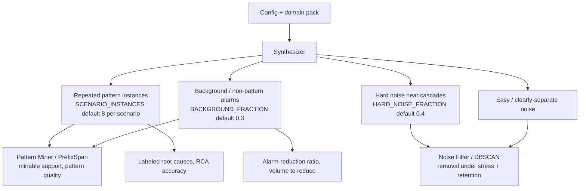

### Domain-pack abstraction (engine vs. Core-IP pack)

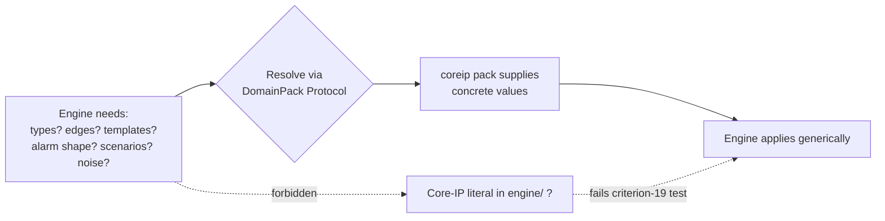

Decision logic: the engine **never branches on a domain type name**; it iterates over
`pack.object_types()`, `pack.edge_relations()`, and `pack.propagation_templates()`. Adding a new
domain = adding a new `DomainPack` implementation, no engine edit.

## Seed data & examples

The simulator's heart: generation/seed scripts + config knobs + concrete worked output.

### CLI usage (the uniform interface)

There is **one CLI** — `python -m simulator.main` — with a **phase selector** and a **data-source
mode** (`generate` — the default — vs. `ingest`). The phase chooses *what the run does* (P1 upload /
P2 history / P3 live); the **mode** chooses *where the topology/alarms come from* — synthesized
(generate) or loaded from pre-created files (ingest). Generate can additionally **export** its
dataset to files. Everything else is env config (see the authoritative defaults table in *Config &
observability*). `--help` prints exactly this usage and exits `0`. (The `python -m simulator.main`
entrypoint is aliased as `sim` in the container/README; usages below show both.)

```text
usage: python -m simulator.main --phase {p1,p2,p3}
                                [--ingest | SIM_MODE=ingest]        # data source: ingest pre-created files
                                [--mode {upload,history,live}]      # phase-action alias (upload=p1, history=p2, live=p3)
                                [--config PATH] [--dry-run] [--help]
       # generate-mode export (round-trip):
                                [--export-corpus PATH]              # write the emitted alarm stream to a corpus file
       # ingest-mode inputs (skip generation):
                                [--topology-file PATH]              # pre-created snapshot to upload (P1)
                                [--alarms-file PATH]                # pre-created alarm corpus to replay (P2/P3)
                                [--labels-file PATH]                # matching ground-truth labels (P2/P3)

One simulator, three phases x two data-source modes:

GENERATE (default — synthesize, optionally export):
  --phase p1   build the typed Core-IP topology, write the versioned snapshot file,
               upload it to the Topology ingestion API (mock/real per env). No Kafka.
  --phase p2   synthesize the labeled corpus (scenarios x N + background + noise),
               BATCH-replay it to alarms.history over the history window, write labels.
  --phase p3   synthesize the same stream, replay to alarms.live wall-clock paced.
  --export-corpus PATH
               (generate p2/p3) ALSO write the ordered emitted alarm stream to a
               corpus file (JSONL, with topic) for later verbatim re-ingest. The
               snapshot file (p1) and labels file (p2/p3) are always written, so a
               generate run with --export-corpus produces a full re-ingestible dataset.

INGEST (--ingest or SIM_MODE=ingest — skip generation, replay pre-created files verbatim):
  --phase p1 --topology-file PATH
               load a pre-created snapshot file (NOT generated), validate it against
               the canonical snapshot.schema.json, and upload it via the existing
               ingestion client. The topology builder is not run.
  --phase p2 --alarms-file PATH --labels-file PATH
               load a pre-created alarm corpus and replay it VERBATIM to alarms.history
               (batch) — scenario/cascade/noise synthesis is skipped; load the labels
               so the oracle works.
  --phase p3 --alarms-file PATH --labels-file PATH
               same, replayed to alarms.live wall-clock paced.

Options:
  --mode {upload,history,live}  Optional explicit alias for the phase action
                                (upload=p1, history=p2, live=p3). If both --phase
                                and --mode are given they must agree, else exit 2.
  --config PATH                 Path to a scenario/config file (overrides the
                                KNOWLEDGE_MODE=local default file location).
  --dry-run                     Build/load + validate + log the planned run (counts,
                                time window, target topic) WITHOUT emitting or
                                uploading. Verifies config + input files; exits 0 if valid.
  --help                        Print this usage and exit 0.

Exit codes:
  0   success (run completed, or --help, or --dry-run on valid config)
  2   invalid CLI usage (bad/missing --phase, conflicting --phase/--mode, or
      --ingest without the file(s) the phase requires)
  3   invalid or missing required config / malformed ingest input (validated at
      startup; structured-log error, ZERO events emitted) — see criteria 18, 38
  4   dependency failure (Topology ingestion API unreachable after bounded retry,
      or Kafka broker unreachable / persistent produce failure) — run fails loudly
```

Every exit path emits a structured JSON log line. Any non-zero exit before emission guarantees
zero events were produced (criteria 18, 38). Runnable straight from this doc — including the
**round-trip** (generate once, replay many):

```bash
# GENERATE P1 — build + upload topology against a mock Topology (no broker needed)
TOPOLOGY_API_MODE=mock python -m simulator.main --phase p1

# GENERATE P2 — evaluation-grade history corpus to alarms.history (all defaults; minimal env)
KAFKA_BOOTSTRAP_SERVERS=localhost:9092 python -m simulator.main --phase p2

# GENERATE P3 — live paced stream to alarms.live
KAFKA_BOOTSTRAP_SERVERS=localhost:9092 python -m simulator.main --phase p3

# ROUND-TRIP — generate once, export the dataset (snapshot + corpus + labels) ...
TOPOLOGY_API_MODE=mock SIM_OUTPUT_DIR=out python -m simulator.main --phase p1
KAFKA_BOOTSTRAP_SERVERS=localhost:9092 SIM_OUTPUT_DIR=out \
  python -m simulator.main --phase p2 --export-corpus out/p2-corpus.jsonl
#   -> out/snapshot-<runId>.json, out/p2-corpus.jsonl, out/labels-<runId>.jsonl

# ... then INGEST the SAME fixed dataset later (verbatim, generation skipped):
TOPOLOGY_API_MODE=mock python -m simulator.main --ingest --phase p1 \
  --topology-file out/snapshot-<runId>.json
KAFKA_BOOTSTRAP_SERVERS=localhost:9092 python -m simulator.main --ingest --phase p2 \
  --alarms-file out/p2-corpus.jsonl --labels-file out/labels-<runId>.jsonl
# (equivalent env form: SIM_MODE=ingest INGEST_ALARMS_FILE=... INGEST_LABELS_FILE=...)

# P3 SYNTH — read deployed topology+trails+approved patterns, synthesize a live stream
#   (full cycle: fetch from the running services, persist the config snapshot, then synth)
KAFKA_BOOTSTRAP_SERVERS=localhost:9092 SIM_OUTPUT_DIR=out \
  PATTERN_MANAGER_API_MODE=real PATTERN_MANAGER_API_BASE_URL=http://pattern-manager:8080 \
  TRAIL_BUILDER_API_MODE=real   TRAIL_BUILDER_API_BASE_URL=http://trail-builder:8080 \
  TOPOLOGY_API_MODE=real        TOPOLOGY_API_BASE_URL=http://topology:8080 \
  python -m simulator.main --synth --p3-aligned-fraction 0.65 --p3-total-alarms 500
#   -> emits to alarms.live; writes out/p3-config-snapshot.json + out/p3-labels-<runId>.jsonl

#   (standalone / repeatable: reuse the persisted config, no re-fetch, seeded + reproducible)
KAFKA_BOOTSTRAP_SERVERS=localhost:9092 python -m simulator.main --synth \
  --p3-config-snapshot-path out/p3-config-snapshot.json --p3-rng-seed 42
# (equivalent env form: SIM_MODE=synth P3_ALIGNED_FRACTION=0.65 P3_TOTAL_ALARMS=500 P3_RNG_SEED=42)
```

### Generation scripts & knobs

All knobs are env/config (no hard-coded values). The authoritative **DEFAULTS table** is in
*Config & observability* below — every knob has a default, and **defaults apply when a var is not
provided**, so `python -m simulator.main --phase p2` runs an evaluation-grade demo with minimal
env (only `KAFKA_BOOTSTRAP_SERVERS`). Summary of the knob groups:

| Knob group | Env var(s) | Effect |
|---|---|---|
| **Data-source mode** | `SIM_MODE` (`generate`\|`ingest`) / `--ingest` | `generate` (default) synthesizes; `ingest` skips generation and replays pre-created files |
| **Ingest topology file** | `INGEST_TOPOLOGY_FILE` / `--topology-file` | (P1 ingest) pre-created snapshot file to validate + upload verbatim (no builder run) |
| **Ingest alarms file** | `INGEST_ALARMS_FILE` / `--alarms-file` | (P2/P3 ingest) pre-created alarm corpus (JSONL) to replay verbatim (no synthesizer run) |
| **Ingest labels file** | `INGEST_LABELS_FILE` / `--labels-file` | (P2/P3 ingest) matching ground-truth labels loaded so the oracle works |
| **Export corpus file** | `EXPORT_CORPUS_FILE` / `--export-corpus` | (generate P2/P3) write the ordered emitted alarm stream to a re-ingestible corpus file |
| Topology size | `TOPOLOGY_NODE_COUNT` | number of `Node`s; line cards/ports/links scale per pack ratios |
| Site count | `SITE_COUNT` | number of `Site` nodes generated (geo attrs); devices distributed across them via `LOCATED_AT` |
| Devices per site | `DEVICES_PER_SITE` | target devices placed per site (rounds out as node count varies) |
| Interfaces per port | `INTERFACES_PER_PORT` | number of `Interface` (L3 endpoint) nodes the pack `HOSTS` on each `Port` (§5 #91); each `TERMINATES` an `IPLink` and carries the IGP adjacency |
| Random seed | `SIM_SEED` | **OQ-3 decision: deterministic generation supported** — same seed reproduces topology, cascade structure, timing offsets, and all RNG-driven choices; ids still fresh per run. Unset → random seed, logged so the run stays reproducible by re-supplying it |
| Timing jitter | `JITTER_STDDEV_MS` | std-dev of per-gap delay noise (Gaussian, applied on top of the base interval) |
| Inter-arrival interval | `BASE_INTERVAL_MS`, `BACKGROUND_INTERVAL_MS` | base inter-event spacing inside a cascade, and mean spacing between background/non-pattern alarms (jitter applied on top) |
| Noise rate/mix | `NOISE_RATE`, `NOISE_MIX` | fraction of total alarms that are noise + class weights |
| Background fraction | `BACKGROUND_FRACTION` | fraction of emitted alarms belonging to no injected pattern (signal-vs-background discrimination) |
| Scenario selection | `SCENARIOS` | which scenarios to inject |
| Scenario-instance count | `SCENARIO_INSTANCES` | how many times **each** selected scenario is injected (drives minable pattern support) |
| History time window | `HISTORY_START`, `HISTORY_END` (or `HISTORY_DURATION`) | P2 wall-clock window the historical alarms are spread over |
| Replay pacing | `PACING_MULTIPLIER` | wall-clock scale of inter-event delays (live only) |
| Hard-noise fraction | `HARD_NOISE_FRACTION` | fraction of noise placed *near* a cascade in time/object (DBSCAN stress) vs. clearly-separate easy noise |

`settings` / `scenario_loader` validate (fail-fast, criterion 18): jitter ≥ 0, base/background
interval > 0, noise rate ∈ [0,1], `BACKGROUND_FRACTION` ∈ [0,1], `HARD_NOISE_FRACTION` ∈ [0,1],
`SCENARIO_INSTANCES` ≥ 1 (≥5 when solved for `TOTAL_ALARMS`), scenarios ⊆ the 9-scenario pack
library, node count ∈ [10,200], `SITE_COUNT` ∈ [1, min(node count, geo-catalogue size = 12)] (and
`DEVICES_PER_SITE` ≥ 1 when set), `INTERFACES_PER_PORT` ∈ [1,8], `IGP_AREA_COUNT` ∈ [1,8],
`TOTAL_ALARMS` (when set) ≥ the minable floor (`5 × selected-scenario-count × min-cascade-size ÷
signal_fraction`), `DEMO_PROFILE` ∈ {`p1-demo`,`p2-demo`,`p3-demo`}, and (P2)
`HISTORY_START` < `HISTORY_END`. A `SITE_COUNT` above the geo-catalogue size or an infeasible
`TOTAL_ALARMS` fails fast rather than reusing/fabricating coordinates or producing a sub-minable
corpus. Missing required config (e.g. `KAFKA_BOOTSTRAP_SERVERS`) → fatal
structured-log error + non-zero exit (`3`) before any emission (criterion 18).

**Ingest-mode validation (fail-fast).** When `SIM_MODE=ingest`: the phase's required file(s) must be
present — P1 requires `INGEST_TOPOLOGY_FILE`; P2/P3 require `INGEST_ALARMS_FILE` (and
`INGEST_LABELS_FILE` for the oracle) — else exit `2` (usage). `settings` rejects combining ingest
inputs with generation knobs in a way that contradicts (e.g. `--ingest` + `--export-corpus` →
usage error; you ingest *or* generate-and-export, not both in one run). The ingested **snapshot** is
JSON-Schema-validated against the canonical `snapshot.schema.json` + every `managedObjectId` via
`acp_event_model.validate`; the ingested **corpus** is validated line-by-line — each
`envelope.payload` must construct as a frozen `AlarmEvent` (incl. required `alarmType`); the
**labels** file must parse to the frozen label shape and its `alarmId`s should resolve in the corpus.
Any malformed line / schema failure aborts the run with a structured error **before any emission or
upload** (exit `3`, criteria 36, 38).

### Worked example — topology snapshot file fragment (small N, fiber-cut-ready)

`snapshot-run42.json` carries the `domain` identifier; **`Site` nodes** with geo attributes,
**devices LOCATED_AT a site**, and the well-known device/connection `attributes` keys are all
present (ids in the generic `<objectType>:<id>` scheme):

```json
{
  "schemaVersion": 1,
  "domain": "core-ip",
  "nodes": [
    { "managedObjectId": "Site:LON-01",         "objectType": "Site",         "attributes": {"name": "London Docklands", "latitude": 51.5033, "longitude": -0.0195, "region": "UK-South"} },
    { "managedObjectId": "Site:MAN-01",         "objectType": "Site",         "attributes": {"name": "Manchester Central", "latitude": 53.4779, "longitude": -2.2426, "region": "UK-North"} },
    { "managedObjectId": "Node:PE1",            "objectType": "Node",         "attributes": {"vendor": "Acme", "model": "XR-9000", "equipmentType": "router", "role": "PE", "capacity": "1.6Tbps", "igpArea": "area-1"} },
    { "managedObjectId": "Node:P1",             "objectType": "Node",         "attributes": {"vendor": "Acme", "model": "XR-9000", "equipmentType": "router", "role": "P", "capacity": "1.6Tbps", "igpArea": "area-0"} },
    { "managedObjectId": "LineCard:PE1-LC2",    "objectType": "LineCard",     "attributes": {"vendor": "Acme", "model": "LC-48x100G", "equipmentType": "lineCard", "role": "transport", "capacity": "4.8Tbps"} },
    { "managedObjectId": "Port:PE1-LC2-P3",     "objectType": "Port",         "attributes": {"vendor": "Acme", "model": "QSFP28", "equipmentType": "port", "role": "core", "capacity": "100G"} },
    { "managedObjectId": "Port:P1-LC1-P1",      "objectType": "Port",         "attributes": {"vendor": "Acme", "model": "QSFP28", "equipmentType": "port", "role": "core", "capacity": "100G"} },
    { "managedObjectId": "Interface:PE1-LC2-P3-if0", "objectType": "Interface", "attributes": {"name": "TenGigE0/2/0/3", "addressFamily": "ipv4", "role": "core", "igpArea": "area-1"} },
    { "managedObjectId": "Interface:P1-LC1-P1-if0",  "objectType": "Interface", "attributes": {"name": "TenGigE0/1/0/1", "addressFamily": "ipv4", "role": "core", "igpArea": "area-0"} },
    { "managedObjectId": "IPLink:PE1_P1",       "objectType": "IPLink" },
    { "managedObjectId": "IGPAdjacency:PE1_P1", "objectType": "IGPAdjacency" },
    { "managedObjectId": "LSP:PE1-PE9-1",       "objectType": "LSP" },
    { "managedObjectId": "VPNService:CUST-A",   "objectType": "VPNService" },
    { "managedObjectId": "FiberSpan:F-PE1-P1",  "objectType": "FiberSpan" },
    { "managedObjectId": "SRLG:SRLG-7",         "objectType": "SRLG" }
  ],
  "edges": [
    { "from": "Node:PE1",           "to": "Site:LON-01",         "relation": "LOCATED_AT" },
    { "from": "Node:P1",            "to": "Site:MAN-01",         "relation": "LOCATED_AT" },
    { "from": "LineCard:PE1-LC2",   "to": "Port:PE1-LC2-P3",     "relation": "HOSTED_ON" },
    { "from": "Port:PE1-LC2-P3",    "to": "Interface:PE1-LC2-P3-if0", "relation": "HOSTS" },
    { "from": "Port:P1-LC1-P1",     "to": "Interface:P1-LC1-P1-if0",  "relation": "HOSTS" },
    { "from": "Interface:PE1-LC2-P3-if0", "to": "IPLink:PE1_P1", "relation": "TERMINATES" },
    { "from": "Interface:P1-LC1-P1-if0",  "to": "IPLink:PE1_P1", "relation": "TERMINATES" },
    { "from": "FiberSpan:F-PE1-P1", "to": "IPLink:PE1_P1",       "relation": "RIDES_ON",       "attributes": {"linkType": "fiber", "capacity": "100G", "protectionRole": "working"} },
    { "from": "Interface:PE1-LC2-P3-if0", "to": "IGPAdjacency:PE1_P1", "relation": "ADJACENCY_OVER" },
    { "from": "IPLink:PE1_P1",      "to": "LSP:PE1-PE9-1",       "relation": "TRAVERSES" },
    { "from": "LSP:PE1-PE9-1",      "to": "VPNService:CUST-A",   "relation": "SERVES" },
    { "from": "SRLG:SRLG-7",        "to": "IPLink:PE1_P1",       "relation": "MEMBER_OF" }
  ]
}
```

`Site:LON-01` carries geo attributes (`name`/`latitude`/`longitude`/`region`) from the **grounded
geo catalogue** (≥10 distinct telco PoP cities — fix B4); each device node carries the well-known
device keys (`vendor`/`model`/`equipmentType`/`role`/`capacity`) **plus the grounded `igpArea`**
(here `P1` is the backbone `area-0`, the `PE1` PE router is the edge `area-1` — fix B2) and is
placed in a site via a `LOCATED_AT` edge; the `Interface`s inherit their host node's `igpArea`;
connection edges carry `linkType`/`capacity`/`protectionRole` where sensible.
`SITE_COUNT`/`DEVICES_PER_SITE` control how many sites are generated (from the catalogue, distinct
coords) and how devices distribute across them; `IGP_AREA_COUNT` controls the IGP-area partition;
attribute *values* are pack-grounded (the geo catalogue + realistic vendors/models/regions,
config-influenced where useful).

The fragment also shows the §5 #91 **Interface layer**: `Port:PE1-LC2-P3` `HOSTS`
`Interface:PE1-LC2-P3-if0` (an L3 endpoint, default `INTERFACES_PER_PORT=1`), that interface
`TERMINATES` `IPLink:PE1_P1`, and the IGP adjacency is `ADJACENCY_OVER` the **interface**
(`Interface:PE1-LC2-P3-if0 → IGPAdjacency:PE1_P1`), **not** the port or the link directly — IGP/BGP
sessions run between interfaces. The peer side mirrors it (`Port:P1-LC1-P1` HOSTS
`Interface:P1-LC1-P1-if0`, which also TERMINATES the same `IPLink`). `INTERFACES_PER_PORT` (default
1) sets how many interfaces each port hosts; interface `attributes` carry descriptive keys (`name`,
`addressFamily`, `role`) from the pack catalogue.

### Worked example — fiber-cut cascade `AlarmEvent` records + ground-truth label

A `fiber-cut` on `FiberSpan:F-PE1-P1` propagates `RIDES_ON → TRAVERSES → SERVES` (LinkDown →
LSPDown → ReachabilityLoss); the interfaces terminating the down link also lose their adjacency
(`TERMINATES`/`ADJACENCY_OVER` from the affected interfaces drives the `AdjDown`). Each emitted
envelope (`source="simulator"`, fresh `eventId`); payload is the frozen `AlarmEvent`. **Every
payload carries the required canonical `alarmType`** join token (a `alarmTypeVocabulary` member),
distinct from `eventType` (X.733 category) and `probableCause` (X.733 probable cause):

```json
{ "eventId":"a1...","type":"AlarmEvent","schemaVersion":1,"occurredAt":"2026-06-10T10:00:00Z","source":"simulator","traceId":"sc-fiber-001",
  "payload":{ "alarmId":"ALM-FC-0001","managedObjectId":"FiberSpan:F-PE1-P1","alarmType":"FiberFault","eventType":"communicationsAlarm","probableCause":"lossOfSignal","perceivedSeverity":"critical","raisedAt":"2026-06-10T10:00:00.000Z","state":"raised","trailIds":[] } }

{ "eventId":"a2...","type":"AlarmEvent","schemaVersion":1,"occurredAt":"2026-06-10T10:00:00Z","source":"simulator","traceId":"sc-fiber-001",
  "payload":{ "alarmId":"ALM-FC-0002","managedObjectId":"IPLink:PE1_P1","alarmType":"LinkDown","eventType":"communicationsAlarm","probableCause":"linkDown","perceivedSeverity":"critical","raisedAt":"2026-06-10T10:00:00.420Z","state":"raised","trailIds":[] } }

{ "eventId":"a3...","type":"AlarmEvent","schemaVersion":1,"occurredAt":"2026-06-10T10:00:01Z","source":"simulator","traceId":"sc-fiber-001",
  "payload":{ "alarmId":"ALM-FC-0003","managedObjectId":"IGPAdjacency:PE1_P1","alarmType":"AdjDown","eventType":"communicationsAlarm","probableCause":"adjacencyDown","perceivedSeverity":"major","raisedAt":"2026-06-10T10:00:00.880Z","state":"raised","trailIds":[] } }

{ "eventId":"a4...","type":"AlarmEvent","schemaVersion":1,"occurredAt":"2026-06-10T10:00:01Z","source":"simulator","traceId":"sc-fiber-001",
  "payload":{ "alarmId":"ALM-FC-0004","managedObjectId":"LSP:PE1-PE9-1","alarmType":"LSPDown","eventType":"communicationsAlarm","probableCause":"lspDown","perceivedSeverity":"major","raisedAt":"2026-06-10T10:00:01.310Z","state":"raised","trailIds":[] } }

{ "eventId":"a5...","type":"AlarmEvent","schemaVersion":1,"occurredAt":"2026-06-10T10:00:01Z","source":"simulator","traceId":"sc-fiber-001",
  "payload":{ "alarmId":"ALM-FC-0005","managedObjectId":"VPNService:CUST-A","alarmType":"ReachabilityLoss","eventType":"qualityOfServiceAlarm","probableCause":"reachabilityLoss","perceivedSeverity":"critical","raisedAt":"2026-06-10T10:00:01.790Z","state":"raised","trailIds":[] } }
```

Each alarm's `alarmType` (e.g. `FiberFault` on the `FiberSpan`, `LinkDown` on the `IPLink`) is the
canonical join token; `eventType`/`probableCause` keep their X.733 meanings (`communicationsAlarm`/
`lossOfSignal`). Ground-truth label (one record in `labels-run42.jsonl`), now carrying the
root-cause canonical `alarmType` token (`rootCauseAlarmType`):

```json
{ "scenarioId":"sc-fiber-001","scenarioType":"fiber-cut",
  "rootCause":"ALM-FC-0001","rootCauseManagedObjectId":"FiberSpan:F-PE1-P1","rootCauseAlarmType":"FiberFault",
  "children":["ALM-FC-0002","ALM-FC-0003","ALM-FC-0004","ALM-FC-0005"] }
```

A noise alarm emitted in the same run (e.g. flapping on an unrelated port) still carries the
**required canonical `alarmType`** (a valid `alarmTypeVocabulary` token — noise is identified by its
**absence from any label's `children`**, never by a distinct alarmType), its own `alarmId`, and
appears in **no** label's `children`, so the oracle classifies it as noise:

```json
{ "eventId":"n1...","type":"AlarmEvent","schemaVersion":1,"occurredAt":"2026-06-10T10:00:00Z","source":"simulator","traceId":"noise-0001",
  "payload":{ "alarmId":"NSE-0001","managedObjectId":"Port:P3-LC1-P7","alarmType":"PortDown","eventType":"qualityOfServiceAlarm","probableCause":"thresholdCrossed","perceivedSeverity":"warning","raisedAt":"2026-06-10T10:00:00.250Z","state":"raised","trailIds":[] } }
```

### Worked example — interface-fault cascade `AlarmEvent` records + ground-truth label (§5 #91)

`Interface` is a first-class fault origin. An `interface-fault` on `Interface:PE1-LC2-P3-if0`
propagates `TERMINATES → ADJACENCY_OVER → TRAVERSES → SERVES` — i.e.
`InterfaceDown ⇒ LinkDown ⇒ AdjDown` (the adjacency on that interface), with `LinkDown` then
fanning out to `LSPDown` and `ReachabilityLoss`. The root alarm sits on the `Interface`, not the
port or link:

```json
{ "eventId":"i1...","type":"AlarmEvent","schemaVersion":1,"occurredAt":"2026-06-10T11:00:00Z","source":"simulator","traceId":"sc-iface-001",
  "payload":{ "alarmId":"ALM-IF-0001","managedObjectId":"Interface:PE1-LC2-P3-if0","alarmType":"InterfaceDown","eventType":"communicationsAlarm","probableCause":"interfaceDown","perceivedSeverity":"major","raisedAt":"2026-06-10T11:00:00.000Z","state":"raised","trailIds":[] } }

{ "eventId":"i2...","type":"AlarmEvent","schemaVersion":1,"occurredAt":"2026-06-10T11:00:00Z","source":"simulator","traceId":"sc-iface-001",
  "payload":{ "alarmId":"ALM-IF-0002","managedObjectId":"IPLink:PE1_P1","alarmType":"LinkDown","eventType":"communicationsAlarm","probableCause":"linkDown","perceivedSeverity":"critical","raisedAt":"2026-06-10T11:00:00.410Z","state":"raised","trailIds":[] } }

{ "eventId":"i3...","type":"AlarmEvent","schemaVersion":1,"occurredAt":"2026-06-10T11:00:00Z","source":"simulator","traceId":"sc-iface-001",
  "payload":{ "alarmId":"ALM-IF-0003","managedObjectId":"IGPAdjacency:PE1_P1","alarmType":"AdjDown","eventType":"communicationsAlarm","probableCause":"adjacencyDown","perceivedSeverity":"major","raisedAt":"2026-06-10T11:00:00.880Z","state":"raised","trailIds":[] } }

{ "eventId":"i4...","type":"AlarmEvent","schemaVersion":1,"occurredAt":"2026-06-10T11:00:01Z","source":"simulator","traceId":"sc-iface-001",
  "payload":{ "alarmId":"ALM-IF-0004","managedObjectId":"LSP:PE1-PE9-1","alarmType":"LSPDown","eventType":"communicationsAlarm","probableCause":"lspDown","perceivedSeverity":"major","raisedAt":"2026-06-10T11:00:01.300Z","state":"raised","trailIds":[] } }

{ "eventId":"i5...","type":"AlarmEvent","schemaVersion":1,"occurredAt":"2026-06-10T11:00:01Z","source":"simulator","traceId":"sc-iface-001",
  "payload":{ "alarmId":"ALM-IF-0005","managedObjectId":"VPNService:CUST-A","alarmType":"ReachabilityLoss","eventType":"qualityOfServiceAlarm","probableCause":"reachabilityLoss","perceivedSeverity":"critical","raisedAt":"2026-06-10T11:00:01.760Z","state":"raised","trailIds":[] } }
```

Ground-truth label (root cause is the `Interface`; `rootCauseAlarmType` is `InterfaceDown`):

```json
{ "scenarioId":"sc-iface-001","scenarioType":"interface-fault",
  "rootCause":"ALM-IF-0001","rootCauseManagedObjectId":"Interface:PE1-LC2-P3-if0","rootCauseAlarmType":"InterfaceDown",
  "children":["ALM-IF-0002","ALM-IF-0003","ALM-IF-0004","ALM-IF-0005"] }
```

**Line-card cascade now traverses the interface step.** A `line-card-fault` on
`LineCard:PE1-LC2` cascades `HOSTED_ON ⇒ PortDown`, then `HOSTS ⇒ InterfaceDown` (each interface
on each port), then `TERMINATES ⇒ LinkDown` and `ADJACENCY_OVER ⇒ AdjDown` — i.e. the full
`PortDown ⇒ InterfaceDown ⇒ LinkDown ⇒ AdjDown` chain — then `TRAVERSES ⇒ LSPDown` and
`SERVES ⇒ ReachabilityLoss`. The label root is the `LineCard` alarm and `children` includes the
`PortDown`, `InterfaceDown`, `LinkDown`, `AdjDown`, `LSPDown`, and `ReachabilityLoss` alarms — the
`InterfaceDown` step is the addition over the pre-#91 chain.

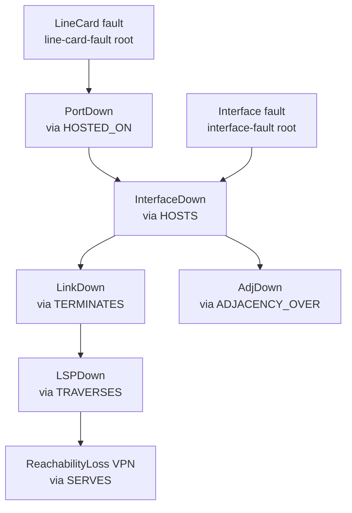

### Noise classes (≥3, from the pack's library)

| Class | Behaviour |
|---|---|
| `flapping` | rapid raised/cleared pairs on one object |
| `self-clearing transient` | a `raised` followed shortly by a `cleared` (no operator action) |
| `chatty standing` | repeated `raised` on a standing condition, never matching a cascade |
| `coincidental unrelated` | a lone real-looking alarm on an object outside any injected scenario |

## Integration thresholds (test oracle — owned by this spec)

The Simulator owns the metric **definitions**; the numeric MVP targets are **config, not literals**
(resolved from `INTEGRATION_THRESHOLDS` env / a checked-in `integration-thresholds.yaml` consumed by
the integration harness — criterion 20). The design exposes ground truth so the oracle can compute
each metric:

| Metric | How the design makes it computable | MVP target |
|---|---|---|
| RCA accuracy | `/labels` (or JSONL) gives `rootCause` (alarmId) **and `rootCauseAlarmType`** (canonical join token) per scenario; oracle compares to `rootCauseAlarmId` / `rootCauseAlarmType` in `correlation.results` on the same token space | ≥ 0.80 |
| Alarm-reduction ratio | count emitted alarms (metric `simulator_alarms_emitted_total`) ÷ incidents in `correlation.results` | ≥ 5× |
| Noise-filter removal | noise alarms are tagged (label-absence) so oracle counts injected-noise removed by Noise Filter | ≥ 0.90 |
| Noise-filter retention | scenario alarms (in some label) retained after Noise Filter | ≥ 0.95 |
| Pattern quality | injected scenario signatures (from labels) vs. patterns recovered by Pattern Miner | ≥ 0.80 |
| **Distinct patterns × per-pattern span** (fix B1) | count of distinct labeled scenario signatures and the distinct-`alarmType` span of each (from `/labels` + the per-alarm `alarmType` records) | **8-10 patterns, each 10-20 distinct types** |
| **`p2-demo` total volume** (fix B3) | `simulator_alarms_emitted_total` after a `DEMO_PROFILE=p2-demo` run | **~1000 (± tolerance), ~20% noise** |
| **`p3-demo` live volume** (fix B3) | `simulator_alarms_emitted_total{topic="alarms.live"}` after a `DEMO_PROFILE=p3-demo` run | **~500 (± tolerance)** |
| **Pattern coverage of volume** (fix B1) | scenario (in-some-label) alarms ÷ total emitted | **~50-60%** |
| **Distinct grounded sites** (fix B4) | distinct `Site` nodes with distinct grounded geo at `SITE_COUNT=10` | **= 10 distinct** |

These thresholds are surfaced to (not asserted by) the simulator; the `integration-test` harness
reads them from `integration-thresholds.yaml` and asserts them. The `p2-demo`/`p3-demo` volume bands
and the noise fraction are **pinned in that file** so the demo numbers are repeatable and gated.

## Error handling

| Failure mode | Handling |
|---|---|
| **Missing/invalid required config** (e.g. no `KAFKA_BOOTSTRAP_SERVERS`, node count out of range, jitter < 0, unknown scenario) | Validate at startup; emit one structured JSON error log; **exit non-zero before emitting any event** (criterion 18). |
| **Invalid scenario config from Knowledge/file** | `scenario_loader` rejects with a clear error naming the bad field; aborts the run (no partial emission). |
| **Topology ingestion API unavailable / non-2xx** | `topology_client` retries with bounded exponential backoff (configurable attempts); on exhaustion logs structured error, marks `/health` non-200, and fails the P1 run with non-zero exit. No silent success. |
| **Snapshot validation failure** (dangling ref, bad `managedObjectId`, schema mismatch) | `snapshot_writer` raises before upload; run aborts; nothing uploaded. |
| **Event serialization / payload-validation failure** | `acp_event_model.serialize`/`AlarmEvent` raises `ValidationError`; the offending alarm is logged with its scenarioId and the run fails (a generation bug must not silently drop an alarm). |
| **Kafka producer error** (broker down, delivery failure) | producer delivery callback logs structured error, increments `simulator_produce_errors_total`, marks `/health` non-200; bounded retry via librdkafka; persistent failure fails the run non-zero. |
| **Live-replay pacing failure** (clock skew / oversleep) | pacing computed against a monotonic clock; if a gap is missed it is logged (gauge `simulator_pacing_drift_ms`) and the next event proceeds — pacing degrades gracefully, never crashes. |
| **No DLQ** | N/A — the Simulator consumes no Kafka stream (pure producer); spec confirms no inbound DLQ. The ingest files are local inputs, not a Kafka stream — a malformed line fails the run fast (below), it is not dead-lettered. |
| **schemaVersion** | Producer only ever emits `schemaVersion=1`; rejection of `>=2` is a consumer concern, N/A here. An ingested corpus line with an unknown major `schemaVersion`, or whose `payload` fails the frozen `AlarmEvent` binding, is rejected at load and **fails the ingest run** before any emission. |
| **Malformed ingest input** (bad JSON line, snapshot schema mismatch, corpus payload missing `alarmType`, label `alarmId` not in corpus) | `corpus_loader` validates the snapshot vs the canonical schema and each corpus `payload` vs the frozen binding; the first failure logs a structured error naming the file + line/field, increments `simulator_ingest_validation_errors_total`, and **aborts before any emission or upload** (exit 3, criteria 36, 38). Nothing is replayed from a partially-valid file. |
| **Missing required ingest file for the phase** | (`--ingest` P1 without `--topology-file`, or P2/P3 without `--alarms-file`/`--labels-file`) → usage error, exit 2, no emission. |

Nothing is ever silently dropped: every generated **or ingested** alarm is either emitted (verbatim,
for ingest) or fails the run loudly.

## Design alternatives

| Consideration | Alternatives considered | Chosen + rationale |
|---|---|---|
| Ground-truth retrieval (OQ-2) | (a) REST only; (b) flat file only; (c) queryable DB | **File (canonical) + thin REST mirror.** File is broker-free and trivially consumed by the integration oracle and CI artifacts; REST adds convenient query without forcing a DB. DB rejected — no query/scale need for a short-lived job. |
| Deterministic replay (OQ-3) | (a) always random; (b) optional seed | **Optional `SIM_SEED` (deterministic generation), fresh ids per run.** Determinism makes regression/CI reproducible; fresh `eventId`/`alarmId` keeps idempotency honest and avoids cross-run collisions (satisfies spec's "SHOULD produce new ids"). |
| Snapshot schema location (OQ-4) | (a) under `libs/event-model/`; (b) independent producer `schema/` copy; (c) single canonical Topology-owned schema | **(c) single canonical `services/topology/schema/snapshot.schema.json`.** Event-model is the Kafka contract; the snapshot is a file/API hand-off whose **consuming owner (Topology) already publishes the one schema its ingest validates against**. The Simulator validates against THAT same file (synced at build time) rather than keeping a second copy — eliminating producer/validator drift. (b) rejected: an independent copy can silently diverge from the validating owner. Still versioned + change = contract change. |
| Domain extensibility | (a) config-data-only pack; (b) Python `Protocol` pack interface | **`Protocol` interface (`domains/coreip` impl).** Allows code-level generators (graph topology, X.733 shapes) the engine can't express in pure data, while keeping the engine domain-agnostic and testable for "no Core-IP literals". |
| Kafka client | (a) `kafka-python`; (b) `confluent-kafka` | **`confluent-kafka`** for first-class `enable.idempotence`/`acks=all` and delivery callbacks (librdkafka); `kafka-python` retained as a lighter test double option. |
| Cascade traversal | (a) recursive per-template; (b) generic BFS over template-relevant edges | **Generic BFS** — single domain-agnostic walker driven by pack template data; supports SRLG fate-sharing and avoids per-template engine code. |
| Live pacing clock | (a) `time.sleep` on relative offsets; (b) monotonic-scheduler | **Monotonic-clock scheduler** — drift-aware, degrades gracefully, measurable via `simulator_pacing_drift_ms`. |
| Site placement (#81) | (a) one global site; (b) random device-to-site; (c) `SITE_COUNT`/`DEVICES_PER_SITE` even spread | **Even spread driven by `SITE_COUNT`/`DEVICES_PER_SITE`** — yields realistic site-level grouping the web-ui can visualize, keeps every device placed (exactly one `LOCATED_AT`), and is config-tunable; single-site is a `SITE_COUNT=1` special case. `Site`/`LOCATED_AT` live in the pack as domain-agnostic types so no engine branch. |
| Attribute values (#81) | (a) hard-coded constants; (b) fully-random strings; (c) small grounded catalogue | **Grounded catalogue in the pack** — realistic vendor/model/equipmentType/region values (config-influenced) so downstream features (e.g. Noise Filter `equipmentType`) are meaningful, while keeping `attributes` descriptive (never identity). Hard-coded rejected (no variety); random strings rejected (not grounded, breaks feature realism). |
| Interface layer + adjacency anchoring (#91) | (a) keep `ADJACENCY_OVER` on `IPLink` (pre-#91); (b) interfaces but adjacency still on the link; (c) full §5 Interface layer with adjacency on the interface | **Full §5 Interface layer** — `Port` `HOSTS` `Interface`, `Interface` `TERMINATES` `IPLink`, `ADJACENCY_OVER` runs **between interfaces**; `Interface` is a first-class fault origin. Matches the merged #91 model so the generated topology + cascades exercise the real interface step (PortDown⇒InterfaceDown⇒LinkDown⇒AdjDown) the downstream services learn against. (a)/(b) rejected — they would mis-anchor the adjacency and skip the interface fault origin, drifting from the authored Knowledge vocabulary Topology validates. `Interface`/`HOSTS`/`TERMINATES` live in the pack (domain vocabulary), so the engine stays domain-agnostic. |
| Interfaces per port (#91) | (a) fixed 1; (b) random; (c) `INTERFACES_PER_PORT` knob (default 1) | **`INTERFACES_PER_PORT` knob, default 1** — one L3 endpoint per port is the realistic Core-IP default and keeps the worked example simple, while the knob lets a run generate multiple sub-interfaces per port for richer cascades without code change. Fixed-1 rejected (no flexibility); fully-random rejected (non-reproducible without a seed and harder to assert). |
| Canonical join token for ground-truth / minable signature | (a) key off `probableCause` (X.733); (b) key off `eventType` (X.733 category); (c) key off the canonical `alarmType` join token | **(c) `alarmType`.** `architecture.md` pins `alarmType` as the **single canonical join key** the whole mining → codebook → correlation chain joins on (its value space = Knowledge `alarmTypeVocabulary`); `correlation.results.rootCauseAlarmType` is on that token space. Keying the emitted-alarm join token + the label `rootCauseAlarmType` + the minable signature off `alarmType` lets the RCA oracle compare like-for-like. (a)/(b) rejected — `probableCause`/`eventType` are X.733 fields with different meanings and would mis-align the oracle and the mined signature against the canonical chain. |
| `/labels` carries the root-cause join token (Q1) | (a) keep `{...,children[]}` only; (b) add `rootCauseAlarmType`; (c) embed full per-child `alarmType` arrays | **(b) add `rootCauseAlarmType`** (and each `EmittedAlarm` already carries its `alarmType`). RCA accuracy compares the injected root cause to `correlation.results.rootCauseAlarmType` — the label must expose the root-cause token to compare on the same space. (a) rejected (no token to compare). (c) deferred — children's `alarmType`s are available via the per-alarm records / minable signature; a per-child array on the label is redundant for the RCA oracle, kept out to keep the frozen `/labels` shape minimal. |
| Scenario-pack size (fix B1) | (a) keep the 4 scenarios; (b) re-baseline the target to "4 patterns of 5-7 types"; (c) extend to 9 grounded scenarios over the expanded 29-token vocabulary / 28 templates | **(c) 9 grounded scenarios.** The mvp-achievability gate marked the 4-scenario pack a hard Gap for the "8-10 patterns × 10-20 types" target (arithmetically impossible on the old 8-token vocab). Per the locked product-owner decision (extend the pack), the pack ships **one scenario per Knowledge `faultOriginType` (7) + SRLG co-failure + line-card fan-out**, each spanning 10-20 distinct types over the seeded 28 templates. (a)/(b) rejected — they leave the demonstration materially thinner than the MVP target. This is **pack content aligned to the already-merged expanded Knowledge vocabulary** — no contract/event-model change. |
| Volume control (fix B3) | (a) leave volume emergent; (b) one rigid 1000-alarm config; (c) a `TOTAL_ALARMS` target knob + overridable named demo profiles | **(c) target knob + profiles.** The gate flagged volume as un-pinned (defaults landed ~350, never asserted ~1000/~500). A `TOTAL_ALARMS` knob solves `SCENARIO_INSTANCES`/background to approximately hit a target, and `p1-demo`/`p2-demo`/`p3-demo` profiles pin the demo numbers as **overridable** defaults (subset-runnable). (a) rejected (not repeatable, un-assertable); (b) rejected (rigid — no subset/override). Profiles + the band are pinned in `integration-thresholds.yaml`. |
| Geo-site grounding (fix B4) | (a) reuse a 2-3 site placeholder catalogue; (b) generate random coords; (c) a fixed catalogue of ≥10 distinct grounded telco PoP cities | **(c) ≥10 grounded sites (12 shipped).** The gate flagged that `SITE_COUNT=10` over a 2-3 entry placeholder catalogue would reuse/fabricate coords. A 12-entry catalogue of distinct telco PoP cities (lat/long/region) means `SITE_COUNT=10` yields **10 distinct grounded sites**; `p1-demo` pins `SITE_COUNT=10` over 50 nodes for non-trivial drill-down. (a) rejected (reuse), (b) rejected (not grounded). |
| `igpArea` emission (fix B2) | (a) leave `igpArea` unpopulated (boundary inert); (b) set `trailPolicy boundary:{type:'none'}` (defer area-bounding); (c) emit a grounded per-`Node`/`Interface` `igpArea` | **(c) emit grounded `igpArea`.** The gate flagged the area-bound as inert — the seeded `trailPolicy` bounds on `igpArea` but no P1 producer populated it, so Trail Builder's area-prune could not fire (whole-network trails on real data). `igpArea` is now a catalogued device key (Knowledge fix A2); the pack emits a grounded area per node/interface (`area-0` backbone + numbered edge areas). (a) rejected (keeps the bug), (b) rejected (loses the designed area-bounding the demo needs). Descriptive attribute value — no contract change. |
| **Ingest data source — skip generation vs. always generate** | (a) keep generate-only; (b) a separate "replayer" service/tool; (c) a `SIM_MODE=ingest` that **reuses** the existing upload + replay paths fed from files | **(c) ingest mode reusing the existing paths.** The product-owner needs a fixed dataset replayed verbatim ("generate once, replay many"). Reusing `topology_client` (upload) and `replay.py` (Batch/Live) means ingest is the **same wire behaviour** as generate, just a different source — no duplicated emit/upload logic, same topics, same frozen payload, **no new contract**. (a) rejected (no fixed-dataset replay). (b) rejected — a second service duplicates the producer/upload paths and the topic ownership, violating single-owner and contract-first; the Simulator already owns these topics + the upload client. |
| **Alarm corpus file format** | (a) raw `AlarmEvent` payloads only (lose envelope/topic/order); (b) a custom packed/binary format; (c) JSONL of the emitted `TypedEnvelope[AlarmEvent]` + topic + seq | **(c) JSONL of the emitted envelopes + topic + seq.** Wrapping the **already-emitted** `TypedEnvelope` (frozen `AlarmEvent` payload) keeps validation identical to the wire (same `acp_event_model`), preserves verbatim order (`seq`) and target topic, and is trivially diffable/shareable. (a) rejected — losing the topic/order/envelope makes a faithful re-ingest impossible and would need a re-decision at replay; (b) rejected — opaque, no win for these volumes, breaks "diffable demo dataset". No new payload shape ⇒ no event-model change. |
| **Round-trip export point** | (a) re-serialize from the in-memory label/alarm model after the run; (b) tap the **same `kafka_producer` emit point** during the run | **(b) tap the emit point.** Writing exactly what `kafka_producer` serialized guarantees the exported corpus **is** the wire stream (byte-for-byte envelopes, same order), so ingest reproduces it identically (criterion 40). (a) rejected — a separate re-serialization path can drift from what was actually emitted (jitter/order/severity), breaking round-trip fidelity. |
| **Fresh vs. preserved ids on ingest replay** | (a) replay with the original `eventId`s; (b) fresh envelope `eventId` per replay, preserved `AlarmEvent` payload (incl. `alarmId`) | **(b) fresh `eventId`, preserved payload.** Re-ingesting the same corpus many times with the original `eventId`s would make every replay look like an at-least-once redelivery and let downstream `eventId` dedupe silently drop the whole replay. Minting a fresh envelope `eventId` per replay (while preserving `alarmId`/`alarmType`/`managedObjectId`/`raisedAt`) keeps each replay a distinct, non-colliding run — matching the spec's "re-runs SHOULD produce new ids" — while the alarm content is verbatim. |

## Test plan

### Acceptance criterion → test (unit/contract — pytest)

| # | Acceptance criterion | Test | Asserts |
|---|---|---|---|
| 1 | Topology snapshot valid & internally consistent | `test_snapshot_internally_consistent` | N=20 build → every Node id `Node:<id>`; every LineCard→existing Node, Port→existing LineCard, IPLink→two existing Ports, SRLG→existing IPLinks; every device has one `LOCATED_AT`→existing `Site`; no dangling refs |
| 2 | `managedObjectId` shared between snapshot & alarms | `test_alarm_moids_subset_of_snapshot` | every emitted alarm `managedObjectId` ∈ snapshot node ids |
| 3 | `managedObjectId` conforms to the (now domain-agnostic) scheme | `test_all_moids_pass_event_model_validator` | every snapshot + alarm moid (incl. `Site:*`) passes `acp_event_model.validate` under the generic `<objectType>:<id>` scheme (objectType `^[A-Za-z][A-Za-z0-9]*$`, non-empty colon-free id) |
| 4 | Fiber-cut cascade correct | `test_fiber_cut_cascade_matches_templates` | root alarm on `FiberSpan` with `alarmType=FiberFault`; children carry the canonical effect `alarmType`s `LinkDown`(IPLink), `AdjDown`(IGPAdjacency), `LSPDown`(LSP), `ReachabilityLoss`(VPNService); label root=FiberSpan alarm, `rootCauseAlarmType=FiberFault`, children=all downstream |
| 5 | Line-card & port faults producible & distinguishable | `test_linecard_and_port_scenarios_distinct` | line-card-fault root objectType=`LineCard` (HOSTED_ON⇒HOSTS⇒TERMINATES cascade incl. the `InterfaceDown` step), port-fault root objectType=`Port` (HOSTS⇒TERMINATES cascade); labels differ in rootCause object type and `rootCauseAlarmType`; both produce an `InterfaceDown` `alarmType` child |
| 6 | ≥3 noise classes generated | `test_at_least_three_noise_classes` | with noise enabled, ≥3 distinct noise classes emitted; each noise alarm absent from every label.children |
| 7 | Emitted alarms validate vs frozen `AlarmEvent` (required fields incl. `alarmType`) | `test_emitted_alarms_validate_against_event_model` | every payload constructs as `AlarmEvent` w/o ValidationError; **all required fields present incl. `alarmType`** (`alarmId, managedObjectId, eventType, probableCause, alarmType, perceivedSeverity, raisedAt, state, trailIds`); `state` ∈ {raised,cleared}; a payload missing `alarmType` raises ValidationError |
| 7a | **Every emitted `AlarmEvent.alarmType` is a valid canonical vocabulary token** (Q4/Q7) | `test_every_alarm_has_valid_alarm_type_token` | across a full run, **every** emitted alarm (scenario root, scenario child, noise, background) has a non-empty `alarmType` ∈ the pack's `alarm_type_vocabulary()` (a subset of Knowledge `alarmTypeVocabulary`); `alarmType` differs from `eventType` and `probableCause` (distinct token spaces) |
| 8 | History lands on `alarms.history` | `test_history_mode_targets_history_topic` | history mode → all alarms on `alarms.history`, zero on `alarms.live` |
| 9 | Live lands on `alarms.live` with pacing | `test_live_mode_targets_live_topic_with_pacing` | live mode → all on `alarms.live`, zero on `alarms.history`; inter-event delay > 0 for pacing>0 |
| 10 | Ground-truth labels retrievable | `test_ground_truth_labels_retrievable` | after run, label retrievable (file + `/labels`); `rootCause`=injected root alarmId; `children`=downstream alarmIds |
| 10a | **`/labels` carries `rootCauseAlarmType`** (Q1) | `test_labels_carry_root_cause_alarm_type` | every `/labels` and JSONL record includes `rootCauseAlarmType`; its value is a canonical `alarmTypeVocabulary` token and **equals the `alarmType` of the alarm identified by `rootCause`** (like-for-like with `correlation.results.rootCauseAlarmType`); `/labels` response matches the frozen shape `{scenarioId, scenarioType, rootCause, rootCauseManagedObjectId, rootCauseAlarmType, children[]}` (validated against checked-in `openapi.json`) |
| 11 | Topology size configurable, no hard-coded count | `test_topology_size_configurable` | runs N=10 and N=50 → ~10 and ~50 nodes; no default count compiled in (config-driven) |
| 12 | Timing jitter configurable, no hard-coded value | `test_jitter_configurable` | `jitter_stddev_ms=0` → deterministic intervals; `=500` → varied intervals; distributions differ measurably |
| 13 | Noise mix configurable, no hard-coded rate | `test_noise_mix_configurable` | rate 0 → zero noise; non-zero → noise present; two mixes → statistically different noise:scenario ratios |
| 14 | Snapshot validates vs the **canonical Topology** topology-file schema | `test_snapshot_validates_against_schema` | any-run snapshot passes `jsonschema` validation against the **single canonical `services/topology/schema/snapshot.schema.json`** (no independent Simulator copy; incl. `Site`/`LOCATED_AT`/`attributes`); all required fields + refs well-formed (criterion 27 adds the Site-specific assertions) |
| 15 | Topology ingestion config-switchable | `test_topology_api_mode_switch` | `TOPOLOGY_API_MODE=mock` → stub used, no real call; `=real` → `POST {TOPOLOGY_API_BASE_URL}/topology/snapshots`; switch needs no code change |
| 15a | **Ingestion reads `snapshotId` from the frozen 200 `SnapshotIngestResponse`** (Q3) | `test_ingestion_reads_snapshot_id_from_200_response` | upload returns **HTTP 200** (not 202) with body `{snapshotId, domain, status, nodeCount, edgeCount, changeType}`; the client reads `snapshotId` from that 200 body and records it on the `SimRun`; the stub is generated from Topology's published `openapi.json` so the contract is enforced; a 202 or a bare body would fail the test |
| 16 | `/health` 200 when running | `test_health_endpoint` | GET `/health` → 200 when started+Kafka up; non-200 before startup / on lost Kafka |
| 17 | `/metrics` Prometheus format | `test_metrics_endpoint` | GET `/metrics` → 200, `text/plain`, ≥1 metric incl. `simulator_alarms_emitted_total` |
| 18 | Config validation fails fast | `test_missing_required_config_aborts` | start w/o required env → structured JSON error log + non-zero exit, zero events emitted |
| 19 | Domain-pack separation — no Core-IP literals in engine | `test_engine_has_no_coreip_literals` | `DomainPack` Protocol exists; engine source contains no Core-IP object-type/template/alarm/scenario literals (static scan of `engine/`) |
| 20 | Integration thresholds owned by spec, from config | `test_thresholds_sourced_from_config` | the five thresholds present in harness config (0.80/5/0.90/0.95/0.80), not hard-coded literals in service code |

**Design-added criteria (synthesis strategy — not new contract, internal generation behaviour).**
These cover the new evaluation-grade synthesis knobs; the spec's 1–20 mapping above is unchanged.

| # | Acceptance criterion (design-added) | Test | Asserts |
|---|---|---|---|
| 21 | **Scenario-instance count drives minable support — configurable, default minable.** Each selected scenario is injected `SCENARIO_INSTANCES` times; default (8) yields ≥ minimum-support repetitions of each scenario signature. | `test_scenario_instances_repeats_signature` | `SCENARIO_INSTANCES=N` → exactly N labels per scenario type; each instance shares the same ordered canonical `alarmType` signature (the join token, not `probableCause`) with fresh ids; default ≥ 5 (PrefixSpan-minable) |
| 22 | **Background fraction configurable; background alarms are non-pattern.** A configurable fraction of emitted alarms belong to no injected pattern and appear in no label's `children`. | `test_background_fraction_configurable` | `BACKGROUND_FRACTION=0` → no background alarms; `=0.3` → ~30% of emitted alarms in no label.children; vary fraction → measurably different background:signal ratio |
| 23 | **Hard noise is placed near cascades for DBSCAN stress.** A configurable fraction of noise is placed near a cascade in time and/or on a topology-adjacent object; the rest is clearly separate. | `test_hard_noise_fraction_near_cascade` | `HARD_NOISE_FRACTION=0.4` → ~40% of noise alarms within a near-cascade time/object window of a scenario; remainder clearly separated; still in no label.children |
| 24 | **History timestamps fall inside the configured window.** P2 alarms' `raisedAt` lie within `[HISTORY_START, HISTORY_END]`. | `test_history_timestamps_within_window` | with a set window, every emitted P2 alarm `raisedAt` ∈ window; invalid window (`START ≥ END`) fails fast (exit 3) |
| 25 | **Generated topology includes `Site` nodes + `LOCATED_AT` edges (configurable).** The pack emits `Site` nodes (geo attrs) and a `LOCATED_AT` edge per device into a site; counts driven by `SITE_COUNT`/`DEVICES_PER_SITE`. | `test_topology_has_sites_and_located_at` | snapshot has ≥1 `Site` node carrying `name`/`latitude`/`longitude`/`region`; every device node has exactly one `LOCATED_AT` edge whose `to` is a `Site`; `SITE_COUNT=N` → N sites; no device unplaced |
| 26 | **Devices carry the well-known `attributes` keys (grounded).** Device nodes carry `vendor`/`model`/`equipmentType`/`role`/`capacity`; connection edges carry `linkType`/`capacity`/`protectionRole` where sensible, with pack-grounded values. | `test_device_and_connection_attributes_present` | every device node has the device well-known keys with non-empty pack-catalogue values; connection edges carry the connection keys where the pack populates them; values drawn from the grounded catalogue (not random strings) |
| 27 | **Snapshot validates against the canonical topology-file schema incl. Site/LOCATED_AT/attributes.** The generated snapshot (with sites, `LOCATED_AT`, attributes) passes the canonical Topology schema and the domain-agnostic `managedObjectId` validator. | `test_snapshot_with_sites_validates` | full snapshot passes `jsonschema` against the **canonical `services/topology/schema/snapshot.schema.json`** (generic id pattern + non-empty `objectType`/`relation`; the `Site`/`LOCATED_AT` tokens are emitted from the pack vocabulary and validated **semantically by Topology**, not by a JSON-Schema enum); every `managedObjectId` (incl. `Site:*`) passes `acp_event_model.validate` under the generic `<objectType>:<id>` scheme; `domain == "core-ip"` |
| 28 | **Generated topology includes `Interface` nodes + `HOSTS`/`TERMINATES` edges (§5 #91, configurable).** The pack emits `Interface` nodes on ports (`Port` `HOSTS` `Interface`), each `Interface` `TERMINATES` its `IPLink`, and the IGP adjacency runs `ADJACENCY_OVER` an `Interface` (not a `Port`/`IPLink`); count per port driven by `INTERFACES_PER_PORT` (default 1). | `test_topology_has_interfaces_and_hosts_terminates` | snapshot has ≥1 `Interface` node; every `Interface` has exactly one incoming `HOSTS` from a `Port` and ≥1 `TERMINATES` to an existing `IPLink`; every `ADJACENCY_OVER` edge originates at an `Interface` (never a `Port`/`IPLink`); `INTERFACES_PER_PORT=N` → N interfaces per port; passes the canonical schema (generic id pattern; `Interface`/`HOSTS`/`TERMINATES` tokens validated semantically by Topology against its domain vocabulary) + `acp_event_model.validate` for every `Interface:*` moid; no dangling refs |
| 29 | **Interface-fault scenario produces the InterfaceDown→LinkDown→AdjDown cascade with ground-truth label (§5 #91).** The pack's scenario library includes `interface-fault`; injecting it yields a cascade rooted on an `Interface` whose `children` follow `TERMINATES ⇒ ADJACENCY_OVER ⇒ TRAVERSES ⇒ SERVES`. | `test_interface_fault_cascade_matches_templates` | `interface-fault` selectable in `SCENARIOS`; root alarm objectType=`Interface` (`interfaceDown`); children include `LinkDown`(IPLink), `AdjDown`(IGPAdjacency), `LSPDown`(LSP), `ReachabilityLoss`(VPNService) in causal order; label `rootCause`=Interface alarm, `rootCauseManagedObjectId` an `Interface:*`, `children`=all downstream; distinct from fiber-cut/line-card/port labels by root object type |

**MVP-grounding criteria (fixes B1-B5 — pack content + config + ground-truth; no contract change).**

| # | Acceptance criterion (MVP-grounding) | Test | Asserts |
|---|---|---|---|
| 30 | **Pack ships 9 distinct grounded scenarios, each spanning 10-20 distinct `alarmType`s (fix B1).** The scenario library has 9 grounded scenarios (one per Knowledge `faultOriginType` + SRLG + line-card fan-out); each injected scenario's symptom set spans **at least 10 and at most ~24 distinct canonical `alarmType` tokens**. | `test_pack_has_9_scenarios_each_10_to_20_types` | `pack.scenario_library()` returns the 9 named scenarios; for each, a single injected instance's distinct-`alarmType` count over the layered fixture topology is in `[10, 24]` (deepest `fiber-cut`/`srlg-shared-risk` near 18-24, shallower near 10-14); every emitted token ∈ the 29-token `alarm_type_vocabulary()`; the 9 root `alarmType`s are distinct per scenario |
| 31 | **Every Node (and its Interfaces) carries a grounded `igpArea`; backbone + edge areas present (fix B2).** The pack assigns a grounded `igpArea` device attribute to each `Node` and the `Interface`s it hosts; at least one `area-0` backbone area and one numbered edge area exist. | `test_igp_area_emitted_on_nodes_and_interfaces` | every `Node` node has a non-empty `igpArea` ∈ the pack's area set; every `Interface` inherits its host node's `igpArea`; ≥1 node in `area-0` and ≥1 in a numbered edge area; `IGP_AREA_COUNT=N` → N distinct areas; `igpArea` is in the snapshot `attributes` and passes the canonical schema (descriptive value, validated semantically by Topology against the `attributeCatalogue` deviceKey, not a JSON-Schema enum) |
| 32 | **`TOTAL_ALARMS` target + `p2-demo`/`p3-demo` profiles hit the demo volumes (fix B3).** With `TOTAL_ALARMS` set (or a demo profile selected) the synthesizer solves synthesis params so the emitted total is within tolerance of the target; `p2-demo`≈1000, `p3-demo`≈500. | `test_total_alarms_and_demo_profiles_hit_targets` | `TOTAL_ALARMS=1000` → `simulator_alarms_emitted_total` within ±15% of 1000 with `SCENARIO_INSTANCES` clamped ≥5; `DEMO_PROFILE=p2-demo` → ~1000 total at ~20% noise on `alarms.history`; `DEMO_PROFILE=p3-demo` → ~500 on `alarms.live`; an individual env var (e.g. `SCENARIO_INSTANCES`) overrides the profile value; `SCENARIOS=fiber-cut` runs the subset only |
| 33 | **Demo volumes + pattern coverage are pinned in `integration-thresholds.yaml` (fix B1/B3).** The `p2-demo` (~1000)/`p3-demo` (~500) volume bands, the ~20% noise fraction, and the ~50-60% pattern-coverage target are in the harness config (not hard-coded). | `test_demo_volume_thresholds_in_config` | `integration-thresholds.yaml` carries the `p2-demo`/`p3-demo` total bands, noise fraction, distinct-pattern count (8-10), per-pattern span (10-20), and coverage (~0.50-0.60); the harness reads them; none are literals in service code |
| 34 | **≥10 distinct grounded geo sites; `SITE_COUNT=10` yields 10 distinct (fix B4).** The geo catalogue holds ≥10 distinct grounded telco PoP entries (distinct coords); `SITE_COUNT=10` produces 10 `Site` nodes with 10 distinct `{name,latitude,longitude,region}`. | `test_geo_catalogue_10_distinct_sites` | `pack.geo_sites()` has ≥10 entries, all with distinct `(latitude,longitude)` and distinct `name`; a `SITE_COUNT=10` run yields exactly 10 `Site` nodes, 10 distinct grounded geo tuples (no reused/fabricated coords); `SITE_COUNT` above catalogue size fails fast (criterion 18) |
| 35 | **Ground-truth supports the oracle metrics on the richer pack (fix B5).** Labels (incl. `rootCauseAlarmType` from the expanded vocab) and per-alarm `alarmType`/noise tags let the oracle compute noise-removal, retention, pattern-quality, alarm-reduction, and RCA accuracy over all 9 scenarios. | `test_ground_truth_supports_oracle_metrics` | for a full `p2-demo` run: every scenario has a label with `rootCauseAlarmType` ∈ the 29-token vocab equal to its root alarm's `alarmType`; noise/background alarms appear in no label `children`; the five §10 metrics are computable from labels + `simulator_alarms_emitted_total{scenario,alarmType}` (oracle dry-run returns finite values for all five) |

**Ingest / export / CLI criteria (spec ACs 26-31 — no contract change; reuse upload + replay).**

| # | Acceptance criterion (ingest/export/CLI) | Test | Asserts |
|---|---|---|---|
| 36 | **Ingest a topology snapshot file → uploaded verbatim, generation skipped (P1)** (spec AC 26) | `test_ingest_topology_file_uploaded_verbatim` | `SIM_MODE=ingest`, `--phase p1`, `--topology-file F` → `topology_builder` is **not** invoked (asserted via spy/mock); F is validated vs the canonical `snapshot.schema.json`; the body POSTed to the stub `/topology/snapshots` is byte-equivalent to F (no node/edge mutation); `snapshotId` read from the 200 `SnapshotIngestResponse`; a snapshot failing schema validation aborts before any upload (exit 3, `simulator_ingest_validation_errors_total`>0) |
| 37 | **Ingest an alarm corpus file → replayed verbatim to history/live (P2/P3)** (spec AC 27) | `test_ingest_corpus_replayed_verbatim_to_topic` | `SIM_MODE=ingest`, `--phase p2 --alarms-file C --labels-file L` → `scenario_runner`/`cascade`/`noise` are **not** invoked (spy); every corpus `AlarmEvent` is produced to `alarms.history` (zero to `alarms.live`) preserving `alarmType`/`managedObjectId`/`trailIds`/`raisedAt`/severity and **seq order**; produced count == corpus line count; `--phase p3` replays the same corpus to `alarms.live` (zero to history) wall-clock paced (inter-event delay>0) |
| 38 | **Ingested alarms validate against the frozen `AlarmEvent` binding incl. `alarmType`** (spec AC 28) | `test_ingest_alarms_validate_frozen_binding` | every corpus `envelope.payload` constructs as `AlarmEvent` w/o `ValidationError`, all required fields incl. `alarmType` present; a corpus line whose payload omits `alarmType` (or is otherwise malformed) → run aborts before any emission with a structured error naming file+line; `simulator_ingest_validation_errors_total` incremented; zero events produced |
| 39 | **Ingested labels file loaded so the oracle works** (spec AC 29) | `test_ingest_labels_loaded_and_retrievable` | after a P2 ingest run, `/labels` (and the in-process index) return the loaded labels in the frozen shape `{scenarioId, scenarioType, rootCause, rootCauseManagedObjectId, rootCauseAlarmType, children[]}`; each `rootCause`/`children` `alarmId` resolves to an `alarmId` present in the ingested corpus; `rootCauseAlarmType` equals the `alarmType` of the `rootCause` alarm in the corpus |
| 40 | **Export-then-ingest round-trips identically** (spec AC 30) | `test_export_then_ingest_round_trips` | a generate P2 run with `--export-corpus C` (and the snapshot + labels exports) followed by an ingest run from C reproduces the **same ordered `(topic, AlarmEvent payload)` sequence** (equal on `alarmId`/`alarmType`/`managedObjectId`/`raisedAt`/seq), the **same uploaded snapshot**, and the **same labels** — differing only in fresh envelope `eventId`s; the exported corpus content equals what `kafka_producer` emitted in the generate run (emit-point tap) |
| 41 | **CLI exposes generate / ingest / export options** (spec AC 31) | `test_cli_exposes_generate_ingest_export` | `--help` documents the generate path (incl. `--export-corpus`) and the ingest path (`--ingest`/`--topology-file`/`--alarms-file`/`--labels-file`) and exits 0; each flag has an env equivalent (`SIM_MODE`/`EXPORT_CORPUS_FILE`/`INGEST_TOPOLOGY_FILE`/`INGEST_ALARMS_FILE`/`INGEST_LABELS_FILE`); `--ingest --phase p2` without `--alarms-file` exits 2 (usage); `--ingest --export-corpus` together exits 2 (conflicting) |

**P3 topology-and-pattern-driven synthesis criteria (spec ACs 32-46 — no contract change; new `synth`
mode; reuses `LiveReplay` + `/labels`).** Each spec AC maps to one pytest test. Mocks are `respx`
stubs generated from each collaborator's **published OpenAPI** (Pattern Manager / Trail Builder /
Topology); no live services in the unit suite.

| # (spec AC) | Acceptance criterion | Test | Asserts |
|---|---|---|---|
| **32** | P3 reads approved patterns from Pattern Manager; fails fast if none | `test_p3_reads_approved_patterns_or_fails_fast` | `SIM_MODE=synth`, `PATTERN_MANAGER_API_MODE=mock`: mock returns non-empty `PatternView[]` → run proceeds and issues `GET /patterns?lifecycle=approved`; mock returns `[]` → structured error `p3.no_approved_patterns`, exit 3, **zero** alarms produced (producer double records 0) |
| **33** | Reads trail members per pattern `trailId` (deduped); 404 skips that pattern | `test_p3_fetches_trail_members_deduped_and_handles_404` | config snapshot with 3 patterns over 2 distinct `trailId`s → **exactly 2** `GET /trails/{trailId}` calls (trail-builder mock call counter == 2), members stored; a `trailId` returning 404 → structured warning `p3.trail_not_found`, that pattern excluded, run continues if ≥1 pattern remains |
| **34** | Config snapshot persisted; subsequent run loads without re-fetching | `test_p3_config_snapshot_persist_and_reload_no_refetch` | after a fetch run the file exists at `P3_CONFIG_SNAPSHOT_PATH`; a second run with that path set makes **zero** calls to Pattern Manager / Trail Builder / Topology mocks (all three call counters == 0) and still emits the configured volume |
| **35** | Synth alarms carry valid `managedObjectId` from the deployed topology | `test_p3_alarms_moid_in_topology` | every emitted P3 `AlarmEvent.managedObjectId` ∈ the trail-member moid set stored in the P3 config snapshot; no emitted alarm references an absent object |
| **36** | Pattern-aligned cascades follow sequence + timing | `test_p3_aligned_cascade_sequence_and_timing` | pattern `sequence=[{IPLinkDown},{ISISAdjacencyDown}]`, `medianInterArrivalMs=500`, trail with an `IPLink` + `IGPAdjacency` member → cascade of 2 alarms: 1st `IPLinkDown` on the `IPLink` member, 2nd `ISISAdjacencyDown` on the `IGPAdjacency` member; inter-arrival ∈ `[0, maxInterArrivalMs]` (near median in expectation); label tags the `rootCauseAlarmType` alarm as root, the other as child |
| **37** | Root-cause alarm matches pattern `rootCauseAlarmType` | `test_p3_root_cause_matches_pattern` | for every aligned cascade the `P3CascadeLabel.rootCauseAlarmType == pattern.rootCauseAlarmType`; the root `AlarmEvent.alarmType` equals it and its `managedObjectId` is a trail member of the affine `objectType` (or fallback member) per the placement rule |
| **38** | Configured aligned fraction honored within tolerance | `test_p3_aligned_fraction_honored` | `P3_ALIGNED_FRACTION=0.65`, `P3_TOTAL_ALARMS=200` → aligned alarms ∈ `[120,145]` (65% ±5pp), remainder non-aligned/noise; `P3RunSummary.alignedFraction` within the same band; `=0.0` → zero aligned; `=1.0` → zero non-aligned (subject to patterns) |
| **39** | Non-aligned alarms carry valid moid + canonical `alarmType` | `test_p3_nonaligned_moid_and_alarmtype_valid` | every non-aligned `AlarmEvent.managedObjectId` ∈ the config-snapshot topology moids; `alarmType` a non-empty token ∈ the pack `alarm_type_vocabulary()`; the three mix classes each label their alarms `scenarioType ∈ {partial-cascade, non-aligned, noise}` |
| **40** | Stream emitted on `alarms.live` only + validates vs frozen binding | `test_p3_emits_live_only_and_validates` | all synth alarms produced to `alarms.live`, **zero** to `alarms.history`; every payload constructs as `AlarmEvent` w/o `ValidationError` (all required fields incl. `alarmType`) |
| **41** | Seeded run reproducible; unseeded fresh | `test_p3_seeded_reproducible_unseeded_fresh` | two runs, same `P3_RNG_SEED` + same persisted config snapshot → identical `alarmId`/`alarmType`/`managedObjectId`/`raisedAt`/ordering; two runs no-seed (or distinct seeds) → first-10 `alarmId`s + ordering differ with high probability |
| **42** | Runs standalone without a prior P1/P2 step | `test_p3_standalone_from_persisted_snapshot` | given a pre-populated persisted config snapshot, a `synth` run completes with **no** `POST /topology/snapshots` call and no dependency on a prior alarm corpus; produces a full stream + labels from the persisted config alone |
| **43** | Labels retrievable; 60-70% KPI directly computable | `test_p3_labels_and_kpi_computable` | after a run the store has one `P3CascadeLabel` per cascade (`{patternId, trailId, rootCauseAlarmId, rootCauseAlarmType, childAlarmIds, scenarioType}`) + one `P3RunSummary` (`{totalAlarms, alignedAlarms, nonAlignedAlarms, alignedFraction}`); `alignedFraction == alignedAlarms/totalAlarms` from the per-cascade records; both retrievable via `/labels` + `/labels/p3-summary` with no extra config |
| **44** | All P3 integration points config-switchable (mock vs real) | `test_p3_integration_points_switchable` | `TOPOLOGY_API_MODE=TRAIL_BUILDER_API_MODE=PATTERN_MANAGER_API_MODE=mock` → full fetch+synthesize using only stubs (from each published OpenAPI), **zero** live calls; switching any to `real` with a base URL requires no code change (parametrized `make_client` test) |
| **45** | Backward compatible — existing modes unaffected | `test_p3_backward_compatible_existing_modes` | a `generate`/`ingest`/`export` run with no P3 options → the P3 clients (`pattern_manager_client`/`trail_builder_client`/`topology_snapshot_client`) are **never instantiated** (import/spy assertion) and **zero** P3 API calls made; the existing AC 1-31 tests pass unchanged (regression run) |
| **46** | CLI exposes synth options; missing required P3 config fails fast | `test_p3_cli_and_failfast` | `--help` documents the `synth` sub-command with `--p3-aligned-fraction`/`--p3-total-alarms`/`--p3-rng-seed`/`--p3-config-snapshot-path`; starting `synth` with `PATTERN_MANAGER_API_MODE=real` and no `PATTERN_MANAGER_API_BASE_URL` → structured JSON `config.invalid`, exit 3, **zero** alarms; `P3_ALIGNED_FRACTION` out of `[0,1]` / mix not summing to 1 also exit 3 |

### E2E scenarios (from this design unit's point of view)

| # | Scenario | Trigger → path | Expected outcome |
|---|---|---|---|
| 1 | **P1 happy path** (mock Topology) | `--phase p1`, `TOPOLOGY_API_MODE=mock`, N=20 | snapshot file written + validated vs the canonical Topology schema; stub `POST /topology/snapshots` returns **200 `SnapshotIngestResponse`**; client reads `snapshotId` from the 200 body; `/health` 200 |
| 2 | **P1 with real Topology** (integration stack) | `--phase p1`, `mode=real` against running Topology | Topology validates + lifts to its graph, returns **200 `SnapshotIngestResponse {snapshotId, domain, status, nodeCount, edgeCount, changeType}`**, emits `topology.changed`; simulator reads + records the same `snapshotId` from the 200 body |
| 3 | **P2 history corpus → oracle** | `--phase p2`, fiber-cut+line-card+port + noise | all alarms on `alarms.history`, **every one carrying a valid canonical `alarmType`** token; labels file written with `rootCauseAlarmType` per scenario; downstream noise-filter/pattern-miner can be scored against labels and key on the `alarmType` join token |
| 3a | **alarmType present + joinable end-to-end** | `--phase p2` then inspect emitted corpus + labels | **100%** of emitted `AlarmEvent`s have `alarmType` ∈ vocabulary; each label's `rootCauseAlarmType` equals the `alarmType` of its `rootCause` alarm; the ordered `alarmType` signature repeats across the N instances of each scenario (the minable join-token signature) |
| 4 | **P3 live paced stream** | `--phase p3`, `PACING_MULTIPLIER=1.0` | alarms on `alarms.live` with non-zero inter-event delays; labels retrievable; correlation oracle can compute RCA/reduction |
| 5 | **Shared-identity invariant** end-to-end | run P1 then P2 with same `SIM_SEED` | every alarm moid present in the uploaded snapshot (criterion 2 across phases) |
| 6 | **Failure — Topology ingestion down** | `--phase p1`, real mode, endpoint unreachable | bounded retries, structured error, `/health` non-200, non-zero exit, nothing falsely reported uploaded |
| 7 | **Failure — broker unavailable** | `--phase p2`, bad `KAFKA_BOOTSTRAP_SERVERS` | produce errors logged + counted; `/health` non-200; run fails non-zero; no silent drop |
| 8 | **Failure — invalid scenario config** | unknown scenario / negative jitter | startup validation aborts run with structured error, zero events emitted |
| 9 | **Noise-only / scenario-only edges** | `NOISE_RATE=0` then high noise | rate 0 → zero noise alarms; high → labels still pure (noise never in `children`) |
| 10 | **Evaluation-grade default corpus** | `--phase p2` with only `KAFKA_BOOTSTRAP_SERVERS` (all defaults) | corpus has ≥5 instances per **each of the 9 scenarios** (minable), ~30% background, ~20% noise (~40% hard) over a 24h window; sufficient to compute all five §10 thresholds against the labels |
| 11 | **Partial path — zero scenarios but background/noise on** | `SCENARIOS=` empty, background/noise > 0 | no labels written; background+noise still emitted; no alarm in any `children`; pattern-quality oracle correctly recovers nothing (no false patterns) |
| 12 | **P1 snapshot with sites + attributes → Topology** | `--phase p1`, `SITE_COUNT=3`, real/mock Topology | snapshot has 3 `Site` nodes (geo attrs), every device `LOCATED_AT` a site, device/connection well-known `attributes` populated; passes the canonical Topology schema; Topology accepts it (validates types/relations incl. `Site`/`LOCATED_AT` semantically against the domain vocabulary) and returns **200 `SnapshotIngestResponse`** with `snapshotId` |
| 13 | **Partial path — single site** | `--phase p1`, `SITE_COUNT=1` | all devices `LOCATED_AT` the one `Site`; still schema-valid; no unplaced device, no second site |
| 14 | **P1 snapshot with Interface layer → Topology** | `--phase p1`, `INTERFACES_PER_PORT=1`, real/mock Topology | snapshot has `Interface` nodes (`Port` HOSTS `Interface`, `Interface` TERMINATES `IPLink`, IGP adjacency `ADJACENCY_OVER` the interface); passes schema; Topology accepts the `Interface`/`HOSTS`/`TERMINATES` vocabulary and mints `snapshotId` |
| 15 | **P2 interface-fault corpus → oracle** | `--phase p2`, `SCENARIOS=interface-fault` (+ optional others) + noise | interface-fault cascades on `alarms.history` rooted on `Interface` with `InterfaceDown→LinkDown→AdjDown→LSPDown→ReachabilityLoss` children; labels file records the `Interface` root cause; RCA/pattern oracle scores it like any other scenario |
| 16 | **`p2-demo` full pack → ~1000 alarms / 8-10 patterns of 10-20 types (fix B1/B3)** | `--phase p2`, `DEMO_PROFILE=p2-demo` | ~1000 alarms on `alarms.history` (within band) at ~20% noise; 9 distinct labeled scenario signatures, each spanning 10-20 distinct `alarmType`s; ~50-60% of volume covered by the scenarios; the volume + coverage are within the pinned `integration-thresholds.yaml` bands |
| 17 | **`p3-demo` live → ~500 alarms reusing learned patterns (fix B3)** | `--phase p3`, `DEMO_PROFILE=p3-demo` | ~500 alarms on `alarms.live` (within band), zero on history; same 9 scenario signatures as P2 (so the Correlation Engine has the learned patterns to match); labels retrievable |
| 18 | **P1 `p1-demo` → 10 distinct grounded sites + igpArea (fix B2/B4)** | `--phase p1`, `DEMO_PROFILE=p1-demo` (SITE_COUNT=10, 50 nodes), real/mock Topology | snapshot has **10 distinct `Site` nodes** with 10 distinct grounded geo tuples and ~5 devices per site; every `Node` (and its `Interface`s) carries a grounded `igpArea` (`area-0` + numbered edge areas); passes the canonical schema; Topology accepts it and Trail Builder's area-prune fires on this data (non-trivial, area-bounded trails) |
| 19 | **Subset run — single scenario (fix B3 flexibility)** | `--phase p2`, `SCENARIOS=fiber-cut`, no profile | only `fiber-cut` cascades + background/noise emitted; exactly one labeled scenario type; a different, smaller synthesized dataset than the full pack; still computable against labels |
| 20 | **Failure — SITE_COUNT above catalogue / TOTAL_ALARMS infeasible** | `SITE_COUNT=20` (catalogue=12) or `TOTAL_ALARMS=5` (below minable floor) | startup validation fails fast (exit 3) with a structured error naming the bad knob; zero events emitted (no reused/fabricated coords, no sub-minable corpus silently produced) |
| 21 | **Round-trip — generate-and-export then ingest-replay (generate once, replay many)** | `--phase p1` + `--phase p2 --export-corpus C` (export snapshot+corpus+labels), then later `--ingest --phase p1 --topology-file S` + `--ingest --phase p2 --alarms-file C --labels-file L` | the ingest run uploads the **same snapshot**, replays the **same ordered alarm stream verbatim** to `alarms.history` (fresh `eventId`s, preserved payloads), and exposes the **same labels** — the downstream oracle scores the ingest run identically to the original generate run |
| 22 | **Ingest P3 live replay of a fixed corpus** | `--ingest --phase p3 --alarms-file C --labels-file L`, `PACING_MULTIPLIER=1.0` | the fixed corpus is replayed verbatim to `alarms.live` wall-clock paced (inter-event delays>0), zero on history; labels retrievable; Correlation Engine sees the same fixed stream every replay |
| 23 | **Ingest — generation modules never run** | `--ingest --phase p2` with `topology_builder`/`scenario_runner`/`cascade`/`noise` spied | none of the generation modules are invoked; alarms come solely from the corpus file (proves generation is skipped, not run-and-discarded) |
| 24 | **Failure — malformed ingest corpus** | `--ingest --phase p2 --alarms-file C` where one line's payload omits `alarmType` / is bad JSON | run aborts before any emission with a structured error naming file+line; `simulator_ingest_validation_errors_total`>0; **zero** alarms produced (no partial replay from a partially-valid file) |
| 25 | **Failure — ingest missing required file for the phase** | `--ingest --phase p1` without `--topology-file` (or P2 without `--alarms-file`/`--labels-file`) | usage error, exit 2, structured log, zero emission/upload |
| 26 | **P3 synth full cycle (all mocks)** | `--synth` (or `SIM_MODE=synth`), all three `*_API_MODE=mock`, `P3_ALIGNED_FRACTION=0.65`, `P3_TOTAL_ALARMS=200` | fetch approved patterns → dedup+fetch trail members → list snapshots → persist config snapshot → synthesize aligned cascades + non-aligned mix → emit to `alarms.live` only; `P3RunSummary.alignedFraction`≈0.65 (±5pp); per-cascade labels retrievable; zero on `alarms.history` |
| 27 | **P3 synth against the real integration stack** | `--synth`, `*_API_MODE=real` against running Pattern Manager / Trail Builder / Topology; then read CE `/stats` + `/incidents` | aligned cascades on real trails fire CE incidents inside the session window with the correct `rootCauseAlarmType`; CE `/stats correlatedAlarmCount/totalAlarmsProcessed` ≈ the Simulator `alignedFraction` (0.60-0.70); RCA accuracy (labels vs `/incidents`) ≥0.80 |
| 28 | **P3 standalone from persisted config (offline)** | pre-populated `P3_CONFIG_SNAPSHOT_PATH`, live services **down** | run completes with zero API calls + no `POST /topology/snapshots`; produces the full stream + labels from the file alone (AC 42) |
| 29 | **P3 reproducibility** | two `--synth` runs, same `P3_RNG_SEED` + same persisted config | identical alarm streams (`alarmId`/`alarmType`/`moid`/`raisedAt`/order); a no-seed run differs (AC 41) |
| 30 | **Failure — no approved patterns** | `--synth`, Pattern Manager mock returns `[]` | fail fast `p3.no_approved_patterns`, exit 3, zero alarms (AC 32) |
| 31 | **Partial path — a pattern's trail 404s** | `--synth`, one `trailId` returns 404, others OK | that pattern dropped with a structured warning, run continues on the remaining patterns, only their cascades emitted (AC 33) |
| 32 | **Partial path — partial cascades revert-open in CE** | `--synth`, `P3_PARTIAL_CASCADE_FRACTION` high | the partial-cascade subset opens CE `(trailId,patternId)` instances that expire without a match → `AlarmStatusChange(reverted-open)`, **no** incident; the aligned subset still fires incidents — so the achieved auto-correlation fraction matches the configured one |
| 33 | **Backward compat — generate/ingest/export unaffected** | run each existing mode with no P3 options | P3 clients never instantiated, zero P3 API calls; AC 1-31 behaviour identical (AC 45) |
| 34 | **Failure — real mode without base URL** | `--synth`, `PATTERN_MANAGER_API_MODE=real`, no base URL | config-invalid fail-fast, exit 3, zero alarms (AC 46) |

## Config & observability

#### Authoritative DEFAULTS table (config knob → env var → default → effect)

Every knob has a default. **Defaults apply when the var is not provided** and are chosen so a small
demo run is **evaluation-grade out of the box** — `python -m simulator.main --phase p2` runs with
only `KAFKA_BOOTSTRAP_SERVERS` set. "required" rows have no default and fail fast if missing
(criterion 18, exit 3).

| Knob | Env var | Default | Effect |
|---|---|---|---|
| **Data-source mode** | `SIM_MODE` (or `--ingest`) | `generate` | `generate` synthesizes; `ingest` skips generation, replays pre-created files verbatim |
| **Ingest topology file** | `INGEST_TOPOLOGY_FILE` (`--topology-file`) | unset (required for P1 ingest) | pre-created snapshot validated + uploaded verbatim (no builder) |
| **Ingest alarms file** | `INGEST_ALARMS_FILE` (`--alarms-file`) | unset (required for P2/P3 ingest) | pre-created alarm corpus JSONL replayed verbatim (no synthesizer) |
| **Ingest labels file** | `INGEST_LABELS_FILE` (`--labels-file`) | unset (required for P2/P3 ingest) | matching ground-truth labels loaded so the oracle works |
| **Export corpus file** | `EXPORT_CORPUS_FILE` (`--export-corpus`) | unset (no corpus export) | (generate P2/P3) write the emitted alarm stream to a re-ingestible corpus file |
| Kafka brokers | `KAFKA_BOOTSTRAP_SERVERS` | **required** (P2/P3) | broker list; missing in P2/P3 → fail fast |
| Topology API mode | `TOPOLOGY_API_MODE` | `mock` | `mock` stub vs `real` Topology ingestion |
| Topology API base URL | `TOPOLOGY_API_BASE_URL` | unset (required only when mode=`real`) | real ingestion endpoint |
| Knowledge mode | `KNOWLEDGE_MODE` | `local` | scenario config from local file vs Knowledge Service |
| Knowledge API base URL | `KNOWLEDGE_API_BASE_URL` | unset (required only when mode=`real`) | Knowledge Service endpoint |
| **Demo profile** | `DEMO_PROFILE` | unset (no profile) | named bundle of overridable defaults — `p1-demo`/`p2-demo`/`p3-demo` (fix B3); any individual env var overrides the profile value |
| **Total-alarm target** | `TOTAL_ALARMS` | unset → emergent | when set, synthesizer solves `SCENARIO_INSTANCES`/background to approximately hit the target total (fix B3); `p2-demo`≈1000, `p3-demo`≈500 |
| Topology size | `TOPOLOGY_NODE_COUNT` | `20` (`p1/p2/p3-demo`: `50`) | `Node` count (range 10–200); other layers scale per pack |
| Site count | `SITE_COUNT` | `3` (`*-demo`: `10`) | number of `Site` nodes (geo attrs); devices placed via `LOCATED_AT` (range 1–min(node count, geo-catalogue size=12)) |
| Devices per site | `DEVICES_PER_SITE` | unset → derived (`ceil(devices / SITE_COUNT)`) | target devices per site; when set, `SITE_COUNT` adjusts to fit |
| Interfaces per port | `INTERFACES_PER_PORT` | `1` (`*-demo`: `2`) | `Interface` nodes hosted per `Port` (§5 #91; range 1–8); each TERMINATES an IPLink + carries the adjacency |
| **IGP area count** | `IGP_AREA_COUNT` | `3` | number of grounded IGP areas the pack assigns (fix B2; `area-0` backbone + numbered edge areas); range 1–8 |
| Random seed | `SIM_SEED` | unset → random (logged) | deterministic generation when set; reproducible by re-supplying logged seed |
| Scenario selection | `SCENARIOS` | all 9: `fiber-cut,line-card-fault,port-fault,interface-fault,node-failure,ip-link-failure,lsp-te-failure,routing-adjacency-failure,srlg-shared-risk-failure` | which scenarios to inject; subset (1-9) for focused runs |
| Scenario-instance count | `SCENARIO_INSTANCES` | `8` (range 5–10; solved when `TOTAL_ALARMS`/profile set) | injections **per** scenario; default guarantees PrefixSpan-minable support |
| Timing jitter | `JITTER_STDDEV_MS` | `300` | Gaussian std-dev of per-gap delay, on top of base interval |
| Base interval | `BASE_INTERVAL_MS` | `400` | base inter-alarm spacing inside a cascade |
| Background interval | `BACKGROUND_INTERVAL_MS` | `2000` | mean spacing between background/non-pattern alarms |
| Background fraction | `BACKGROUND_FRACTION` | `0.3` | fraction of emitted alarms in no injected pattern (signal-vs-background) |
| Noise rate | `NOISE_RATE` | `0.2` | fraction of total alarms that are noise |
| Noise mix | `NOISE_MIX` | `flapping:0.4,transient:0.3,chatty:0.2,coincidental:0.1` | noise class weights (≥3 classes) |
| Hard-noise fraction | `HARD_NOISE_FRACTION` | `0.4` | fraction of noise placed near a cascade (DBSCAN stress) vs easy/separate |
| History window start | `HISTORY_START` | `now − 24h` | P2 historical window start (`raisedAt` lower bound) |
| History window end | `HISTORY_END` | `now` | P2 historical window end (or set `HISTORY_DURATION` instead) |
| Replay pacing | `PACING_MULTIPLIER` | `1.0` | P3 wall-clock scale of inter-event delays |
| Output dir | `SIM_OUTPUT_DIR` | `/data/sim` | snapshot + label export location |
| Integration thresholds | `INTEGRATION_THRESHOLDS` | checked-in `integration-thresholds.yaml` | §10 targets (harness reads; not asserted here) |
| HTTP port | `HTTP_PORT` | `8080` | `/health`, `/metrics`, `/labels` |
| Log level | `LOG_LEVEL` | `INFO` | structured-log verbosity |
| **[P3] Synth mode selector** | `SIM_MODE=synth` (or `--synth`) | (mode) | select P3 topology-and-pattern-driven synthesis (pinned to P3 / `alarms.live`) |
| **[P3] Aligned fraction** | `P3_ALIGNED_FRACTION` | `0.65` (range 0.0–1.0; `p3-demo` band 0.60–0.70) | target pattern-aligned fraction (AC 38) |
| **[P3] Total alarms** | `P3_TOTAL_ALARMS` | `500` (or `p3-demo`) | P3 synth total volume |
| **[P3] RNG seed** | `P3_RNG_SEED` | unset → fresh (logged) | reproducibility seed (AC 41); no effect on the persisted config snapshot |
| **[P3] Config snapshot path** | `P3_CONFIG_SNAPSHOT_PATH` | `{SIM_OUTPUT_DIR}/p3-config-snapshot.json` | load-from-persisted (present) vs. re-fetch + persist (absent) (AC 34/42) |
| **[P3] Pattern Manager mode/URL** | `PATTERN_MANAGER_API_MODE` / `PATTERN_MANAGER_API_BASE_URL` | `mock` / unset (required if `real`) | approved-pattern read (AC 32/44) |
| **[P3] Trail Builder mode/URL** | `TRAIL_BUILDER_API_MODE` / `TRAIL_BUILDER_API_BASE_URL` | `mock` / unset (required if `real`) | trail-member read (AC 33/44) |
| **[P3] Non-aligned mix** | `P3_PARTIAL_CASCADE_FRACTION` / `P3_RANDOM_ALARM_FRACTION` / `P3_NOISE_FRACTION` | `0.4` / `0.4` / `0.2` (must sum to 1) | non-aligned remainder mix (OQ-P3-3, AC 39) |
| **[P3] Optional include prob** | `P3_OPTIONAL_INCLUDE_PROB` | `1.0` (range 0.0–1.0) | probability an `optional=true` sequence element is emitted (OQ-P3-4) |

These defaults make a default P2 run produce 8 instances each of the **9** scenarios (fiber-cut,
line-card-fault, port-fault, interface-fault, node-failure, ip-link-failure, lsp-te-failure,
routing-adjacency-failure, srlg-shared-risk-failure) + ~30% background + 20% noise (40% of it hard)
spread over a 24h window — an evaluation-grade set with no tuning. Selecting `DEMO_PROFILE=p2-demo`
pins it to **~1000 alarms at ~20% noise** (and `p3-demo` to **~500** live); `TOTAL_ALARMS` hits an
arbitrary target. The P1 snapshot generated with defaults
has 3 `Site` nodes (from the grounded geo catalogue) with every device `LOCATED_AT` one of them, one
`Interface` per `Port` (`INTERFACES_PER_PORT=1`) `HOSTS`-ed by the port and `TERMINATES`-ing its
`IPLink` with the IGP adjacency `ADJACENCY_OVER` the interface, every `Node` (and its `Interface`s)
stamped with a grounded `igpArea` (`IGP_AREA_COUNT=3`), and the well-known device/connection
`attributes` keys populated from the pack's grounded catalogue. `DEMO_PROFILE=p1-demo` pins
`SITE_COUNT=10` over 50 nodes → **10 distinct grounded sites** with a few devices each.
- **`/health`** — 200 when started + Kafka connected; non-200 otherwise.
- **`/metrics`** — Prometheus exposition incl. `simulator_alarms_emitted_total{topic,scenario,alarmType}`
  (every emitted alarm counted under its canonical `alarmType`),
  `simulator_scenarios_injected_total{scenario}` (counts instances per scenario),
  `simulator_background_alarms_total`, `simulator_noise_alarms_total{class}`,
  `simulator_hard_noise_alarms_total`, `simulator_produce_errors_total`,
  `simulator_pacing_drift_ms`, `simulator_snapshot_nodes`, `simulator_snapshot_sites`
  (distinct grounded sites), `simulator_snapshot_interfaces` (count of `Interface` nodes),
  `simulator_snapshot_igp_areas` (distinct `igpArea` values emitted),
  `simulator_target_alarms` (the resolved `TOTAL_ALARMS` target when set),
  `simulator_distinct_scenarios` (count of distinct labeled scenario types),
  `simulator_snapshot_edges{relation}` (incl. `relation="LOCATED_AT"`, `relation="HOSTS"`,
  `relation="TERMINATES"`), and — for ingest/export —
  `simulator_mode{mode="generate"|"ingest"}` (current data-source mode),
  `simulator_ingested_alarms_total{topic}` (alarms replayed from a corpus),
  `simulator_ingest_validation_errors_total` (malformed corpus/snapshot lines rejected — fail-fast),
  `simulator_exported_corpus_records_total` (alarms written to the export corpus file). In ingest
  mode `simulator_alarms_emitted_total` still counts the replayed alarms under their preserved
  `alarmType`, so the same emitted-count assertions hold. **P3 synth adds:**
  `simulator_p3_aligned_alarms_total`, `simulator_p3_nonaligned_alarms_total{class}`
  (`class ∈ partial-cascade|non-aligned|noise`), `simulator_p3_aligned_fraction` (gauge, the realized
  fraction — AC 38), `simulator_p3_cascades_total`, `simulator_p3_placement_fallback_total{alarmType}`
  (affine-objectType-absent fallbacks — OQ-P3-1), `simulator_p3_pattern_fetch_total`,
  `simulator_p3_trail_fetch_total`, `simulator_p3_trail_not_found_total` (404-skipped patterns),
  `simulator_p3_config_snapshot_loaded{source="fetch"|"persisted"}`. In synth mode
  `simulator_alarms_emitted_total{topic="alarms.live",scenario,alarmType}` counts every emitted alarm
  under its `alarmType` (scenario label = `patternId` for aligned, the mix class for non-aligned).
- **Logging** — structured JSON on stdout (one object per line): `ts, level, event, runId,
  scenarioId?, msg`; ingest/export runs additionally log `mode`, the input/output file paths, and
  the validated/replayed/exported counts.

## Build & run

- **Layout:** `services/simulator/src/simulator/{main.py, config/ (incl. demo_profiles.py),
  engine/, domains/coreip/ (incl. scenario_library.py, geo_catalogue.py, **p3_placement.py**),
  ingest/ (corpus_loader.py, corpus_writer.py), **synth/ (p3_fetch.py, p3_config_snapshot.py,
  aligned_synth.py, nonaligned_synth.py, aligned_controller.py, p3_labels.py, p3_run.py)**,
  integrations/ (incl. **pattern_manager_client.py, trail_builder_client.py,
  topology_snapshot_client.py**), api/,
  obs/}`, `services/simulator/openapi.json`, `services/simulator/integration-thresholds.yaml`,
  `services/simulator/tests/` (incl. `tests/test_p3_*.py`). The
  snapshot file is validated against the **single canonical `services/topology/schema/snapshot.schema.json`**
  (Topology-owned; synced/vendored at build time — no independent Simulator schema copy).
- **Build/test:** `ruff check . && black --check . && pytest` (Python 3.13).
- **Dockerfile:** `python:3.13-slim` base (per CI pins); installs `acp-event-model` from
  `libs/event-model/python`; `CMD` runs `python -m simulator.main`. Compose entry wires
  `KAFKA_BOOTSTRAP_SERVERS` + `TOPOLOGY_API_BASE_URL` to the integration stack.
- **Local run (minimal — all defaults apply):** `KAFKA_BOOTSTRAP_SERVERS=localhost:9092
  python -m simulator.main --phase p2` produces an evaluation-grade corpus with no further env.

## P3 topology-and-pattern-driven synthesis (additive mode)

This section is the buildable detail for spec Tasks 13–20 and ACs 32–46. It is a **new `synth`
mode** on top of the existing engine: it reads the **already-deployed** topology + trails + approved
patterns from the running services' published APIs and synthesizes a live `alarms.live` stream
grounded in those real objects/patterns, targeting a configurable **~60-70% pattern-aligned
auto-correlation + RCA rate** with full ground-truth labels. It **regenerates nothing** (no
topology build, no pattern mining, no `POST /topology/snapshots`) and introduces **no contract
change** (no new topic, no event-model change, no collaborator OpenAPI change).

**No contract change — explicit confirmation.** All three P3 reads consume collaborators'
**already-published, verified** OpenAPI surfaces as-is: Pattern Manager `GET /patterns?lifecycle=…`
→ `PatternView[]` with `SequenceElementView {alarmType, optional}` / `SessionWindowView {windowMs,
type}` / `timing` (JsonNode: `timeframeMs, medianInterArrivalMs, maxInterArrivalMs,
stddevInterArrivalMs`); Trail Builder `GET /trails/{trailId}` → `TrailDetail.members[]` of
`TrailMember {managedObjectId, objectType}` (**OQ-P3-5 resolved — `objectType` is formally declared
per member; the Simulator consumes it as-is and does NOT derive it from the moid prefix**); Topology
`GET /topology/snapshots` → `SnapshotListDto.snapshots[]` of `SnapshotSummaryDto {snapshotId, domain,
…}`. Output is the **frozen `AlarmEvent`** on the **existing `alarms.live`** topic.

### Module breakdown (P3 additions)

All P3 code lives under a new `synth/` package + three new `integrations/` clients + one new
`domains/coreip/` mapping module. The engine core (`engine/*`), the P1/P2 pack content, and
generate/ingest/export are **untouched**; `engine/replay:LiveReplay` and `engine/labels` are
**reused**.

| Module | Responsibility |
|---|---|
| `integrations/pattern_manager_client.py` | `GET /patterns?lifecycle=approved` (paged via `limit`/`offset`), returns typed `PatternView[]`. Mock stub (from PM `openapi.json`) / real `httpx`; `make_client(mode, base_url)` like `topology_client`. Counts calls (test-observable). |
| `integrations/trail_builder_client.py` | `GET /trails/{trailId}` → `TrailDetail`; returns `members[]` of `TrailMember {managedObjectId, objectType}`. 404 → typed `TrailNotFound` (not an exception the run aborts on). Mock/real. |
| `integrations/topology_snapshot_client.py` | `GET /topology/snapshots?domain=core-ip` → `SnapshotSummaryDto[]`. Mock/real. (Distinct from the P1 `topology_client` which only *uploads*; this only *lists*.) |
| `synth/p3_fetch.py` | Orchestrates the three clients (Task 13): fetch approved patterns → dedupe `trailId`s → fetch each trail's members → list snapshots; assemble a `P3ConfigSnapshot`; fail-fast on empty patterns; skip (warn) patterns whose trail 404s. |
| `synth/p3_config_snapshot.py` | Read/write the versioned **P3 config snapshot** JSON (Task 14 / OQ-P3-2); `save(path)`, `load(path)` with schema/version validation (fail-fast on stale/corrupt). |
| `domains/coreip/p3_placement.py` | The pack-authored **alarmType→objectType affinity table** + fallback (OQ-P3-1). Pure pack data; the engine/synth reads it via a `placement_affinity()` pack method. |
| `synth/aligned_synth.py` | Build pattern-aligned cascades (Tasks 15/17): sequence→member placement, timing pacing, root-cause tagging, optional-element handling (OQ-P3-4). Emits `SynthAlarm[]` + `P3CascadeLabel`. |
| `synth/nonaligned_synth.py` | Build the non-aligned mix (Task 16 / OQ-P3-3): partial cascades + random single alarms + noise, all on real moids. |
| `synth/aligned_controller.py` | The **aligned-fraction controller** (Task 16, AC 38): given `P3_TOTAL_ALARMS`/`P3_ALIGNED_FRACTION`, solve how many aligned cascades vs. non-aligned alarms to synthesize, within tolerance. |
| `synth/p3_labels.py` | `P3LabelStore`: per-cascade `P3CascadeLabel` + `P3RunSummary`; JSONL persist; served via `/labels` (+ `/labels/p3-summary`) (Task 18, AC 43). |
| `synth/p3_run.py` | Top-level `run_synth(settings)`: fetch/load → controller → aligned+non-aligned → interleave by `raisedAt` → `LiveReplay` → summary. Called from `main.py` in `synth` mode. |
| pack: `CoreIPPack.placement_affinity()` | New `DomainPack` Protocol method returning the affinity table (keeps the engine/synth domain-agnostic — Task 8 / AC-19 invariant preserved: no Core-IP literal enters `synth/` or `engine/`). |

### P3 fetch + validate deployed state (Task 13)

`p3_fetch.fetch_config(settings)`:
1. **Patterns:** `pattern_manager_client.list_approved()` → `PatternView[]`. **Empty → fail fast**
   (structured error `p3.no_approved_patterns`, exit 3, zero alarms — AC 32).
2. **Trails:** collect the distinct `trailId`s across the patterns (dedupe), issue **exactly one**
   `GET /trails/{trailId}` per distinct id (AC 33). A `404` (`TrailNotFound`) → log a structured
   **warning** `p3.trail_not_found` and **drop the patterns on that trail** from synthesis; the run
   continues if ≥1 pattern still has a trail. If **every** pattern loses its trail → fail fast.
3. **Topology snapshots:** `topology_snapshot_client.list_snapshots(domain)` →
   `SnapshotSummaryDto[]`. The union of all trail-member `managedObjectId`s (plus, when Topology
   later exposes node listing, the full moid pool) is the **valid moid universe**; for the MVP the
   moid universe is the set of trail members (every P3 alarm's moid is a trail member, so AC 35/39
   hold by construction). The snapshot list gives `snapshotId` for provenance in the config snapshot.
4. Assemble a `P3ConfigSnapshot` (below) and hand it to `p3_config_snapshot.save()` (Task 14).

Each client is **config-switchable** (`*_API_MODE` ∈ `{mock, real}`, `*_API_BASE_URL`), stub from
the collaborator's published OpenAPI, real via `httpx` — no hard-coded URL (AC 44).

### P3 config snapshot — persistence format (OQ-P3-2, Task 14)

**Decision: a single versioned JSON file** under `SIM_OUTPUT_DIR` (default
`{SIM_OUTPUT_DIR}/p3-config-snapshot.json`, overridable via `P3_CONFIG_SNAPSHOT_PATH`). One
self-contained file — consistent with the existing snapshot/corpus/labels file model, trivially
shareable, diffable, and reusable across runs and across different (topology, pattern-set) inputs. It
holds everything a standalone P3 run needs, so **repeated randomized runs never re-fetch** and a
captured config drives runs even when the live services are down or have moved on.

```jsonc
{
  "schemaVersion": 1,                       // versioned; load fails fast on unknown major
  "capturedAt": "2026-06-29T12:00:00Z",
  "domain": "core-ip",
  "sourceSnapshots": [                       // from GET /topology/snapshots (provenance)
    { "snapshotId": "snap-000123", "domain": "core-ip", "nodeCount": 312, "edgeCount": 540 }
  ],
  "trails": {                                // keyed by trailId → its members (deduped fetch)
    "trail-A": { "snapshotId": "snap-000123", "igpArea": "area-0",
      "members": [ { "managedObjectId": "IPLink:ip-7", "objectType": "IPLink" },
                   { "managedObjectId": "IGPAdjacency:adj-3", "objectType": "IGPAdjacency" },
                   { "managedObjectId": "LSP:lsp-9", "objectType": "LSP" } ] }
  },
  "patterns": [                              // approved PatternView[] as fetched, verbatim
    { "patternId": "pat-01", "trailId": "trail-A", "rootCauseAlarmType": "IPLinkDown",
      "sequence": [ { "alarmType": "IPLinkDown", "optional": false },
                    { "alarmType": "ISISAdjacencyDown", "optional": false },
                    { "alarmType": "LSPDown", "optional": true } ],
      "timing": { "timeframeMs": 4000, "medianInterArrivalMs": 500,
                  "maxInterArrivalMs": 1500, "stddevInterArrivalMs": 250 },
      "sessionWindow": { "windowMs": 6000, "type": "gap" } }
  ]
}
```

`load(path)`: parse → validate `schemaVersion` (unknown major → fail fast `p3.config_snapshot_stale`)
→ validate each pattern's `trailId` resolves in `trails` and each pattern is well-formed → return a
typed `P3ConfigSnapshot`. **Standalone run (AC 42):** with `P3_CONFIG_SNAPSHOT_PATH` set and the
file present, `p3_run` loads it and makes **zero** calls to Pattern Manager / Trail Builder /
Topology (verified via mock call counters — AC 34) and **never** calls `POST /topology/snapshots`.
The RNG seed does **not** affect the persisted config snapshot (Task 19) — the file is pure fetched
state; only synthesis is randomized.

### alarmType → objectType placement (OQ-P3-1, Task 15)

**Authored in the Core-IP domain pack** (`domains/coreip/p3_placement.py`), exposed via the new
`DomainPack.placement_affinity()` Protocol method — the pack already owns alarm shapes, propagation
templates, and the object-type set, so the affinity belongs there; the engine/synth stay
domain-generic (AC-19 invariant). The table maps each canonical `alarmType` to the **object-type it
is naturally raised on**; synthesis then picks a real trail member of that `objectType`.

| alarmType (canonical) | Affine objectType |
|---|---|
| `FiberCut`, `FiberFault`, `LOS`, `LOF`, `OpticalPowerLow` | `FiberSpan` |
| `LineCardFault` | `LineCard` |
| `PortDown`, `PortFlapping`, `CRCErrors` | `Port` |
| `InterfaceDown`, `InterfaceErrors`, `LinkBundleDegraded` | `Interface` |
| `IPLinkDown`, `LinkDown` | `IPLink` |
| `ISISAdjacencyDown`, `AdjDown`, `OSPFAdjacencyDown`, `BGPPeerDown`, `RouteFlap`, `LDPSessionDown` | `IGPAdjacency` |
| `LSPDown`, `TETunnelDown`, `FRRSwitchover` | `LSP` |
| `VPNReachabilityLoss`, `ReachabilityLoss`, `ServiceDegraded`, `Congestion`, `QueueDrop`, `HighLatency` | `VPNService` |

**Fallback (when the trail has no member of the affine `objectType`):** place the alarm on **ANY
member of the same trail** (deterministic pick under the seeded RNG). This keeps two invariants that
make the Correlation Engine match: the alarm is on a **real object present in the deployed topology**
(AC 35), and it is on the **pattern's own trail** — so CE's `(trailId, patternId)` instance still
admits it and the sequence still advances (CE keys on trail + `alarmType` sequence, not on the
member's objectType). The fallback is logged (`simulator_p3_placement_fallback_total{alarmType}`) so
its rate is observable. Placement applies identically to mandatory and optional elements (the
optional decision is made *before* placement — see below).

### P3 aligned cascade synthesis (Tasks 15–17 + OQ-P3-1, OQ-P3-4)

For each approved pattern, `aligned_synth.build_cascade(pattern, trail, rng, base_time)`:
1. **Optional-element decision (OQ-P3-4) — decided per element, before placement.**
2. For each retained sequence element, apply the placement rule (table + fallback) to pick a member
   `managedObjectId`; construct a `SynthAlarm` with `alarmType` = the element's `alarmType`, the
   X.733 shape from `pack.alarm_shape(alarmType)`, `managedObjectId` = the picked member, and
   `raisedAt` paced from the pattern timing (below).
3. **Timing / session-window pacing:** the first element lands at `base_time`; each subsequent
   element lands after an inter-arrival gap drawn from a truncated-normal
   `N(medianInterArrivalMs, stddevInterArrivalMs)` clamped to `[0, maxInterArrivalMs]`, and the
   whole cascade span is clamped to **fit inside `sessionWindow.windowMs`** (if the running total
   would exceed `windowMs`, remaining gaps are compressed proportionally). This lands the cascade
   **inside the pattern's session window** so CE's per-`(trailId, patternId)` session window admits
   the whole set and fires **within** the window — AC 36. When `timing`/`sessionWindow` fields are
   absent, fall back to `BASE_INTERVAL_MS`/`JITTER_STDDEV_MS`.
4. **Root cause:** the element whose `alarmType == pattern.rootCauseAlarmType` is tagged
   `is_root=True`; its `alarmId` becomes the label's `rootCauseAlarmId` (AC 37). (If the root type is
   itself optional and was omitted, it is force-included — the root is never dropped.)
5. Record a `P3CascadeLabel {patternId, trailId, rootCauseAlarmId, rootCauseAlarmType,
   childAlarmIds, scenarioType:"pattern-aligned"}`.

**Optional-element strategy (OQ-P3-4) — decision + CE alignment.** The CE (see its design) matches a
pattern via `matchProgress.satisfiedIndices` and fires when the **decisive match condition is met
within `match.partialMatchTolerance`** (a Knowledge param, seeded default **1** = tolerate N-1 of N),
and it treats `optional=true` elements as **non-mandatory**. To make aligned cascades **reliably
auto-correlate** we choose **default-include optional elements** with a configurable inclusion
probability `P3_OPTIONAL_INCLUDE_PROB` (default **1.0** = always include; range 0.0–1.0), evaluated
per element under the seeded RNG (so a run is reproducible — AC 41):
- Including optional elements is **safe** for CE matching (an extra non-mandatory symptom never
  *breaks* a match; it can only strengthen coverage), and it **preserves the tolerance budget** —
  the CE's N-1 tolerance is then free to absorb a genuinely dropped *mandatory* symptom rather than
  being pre-spent on a deliberately omitted optional one. This is why we do **not** default to
  "always omit": omitting an optional element plus any real drop could push past N-1 and miss the
  match.
- A lowered `P3_OPTIONAL_INCLUDE_PROB` deliberately omits some optional elements to model realistic
  incomplete cascades; because CE treats them as non-mandatory, the cascade **still matches**. This
  is the knob that, combined with `partialMatchTolerance`, exercises CE's partial-match path without
  tipping an aligned cascade into a miss.

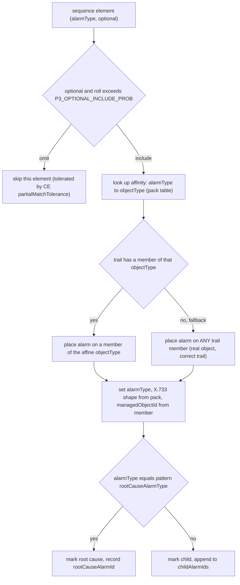

### P3 non-aligned remainder (OQ-P3-3, Task 16)

**Decision: a configurable MIX** of three sub-classes (proportions env-tunable, defaults sum to 1.0
of the non-aligned budget):
- **`partial-cascade`** (`P3_PARTIAL_CASCADE_FRACTION`, default 0.4): start a **real** approved
  pattern's cascade on its real trail but **stop before the decisive condition** (emit fewer than
  `sequenceLen − partialMatchTolerance` elements, and/or omit the root). CE opens a `(trailId,
  patternId)` instance that then **expires without a match → destroyed, no incident,
  `AlarmStatusChange(reverted-open)`** — this is exactly the realistic "opened then reverted" traffic
  the CE design describes. Labeled `scenarioType:"partial-cascade"`.
- **`non-aligned`** (`P3_RANDOM_ALARM_FRACTION`, default 0.4): random **single** alarms on real
  topology objects (trail members) with a random canonical `alarmType`, **not** forming any approved
  pattern sequence. Labeled `scenarioType:"non-aligned"`.
- **`noise`** (`P3_NOISE_FRACTION`, default 0.2): the **existing** `engine/noise.py` noise machinery
  (flapping / self-clearing / chatty), placed on real moids. Labeled `scenarioType:"noise"`.

All non-aligned alarms carry a **canonical `alarmType`** token from the pack vocabulary and a
`managedObjectId` that is a real trail member (AC 39). Every non-aligned alarm is labeled with its
`scenarioType` so it is **excluded from the aligned-fraction count** (AC 43). The three fractions are
validated to sum to 1.0 (±ε) at startup, else fail fast.

### Aligned-fraction controller (Task 16, AC 38)

`aligned_controller.plan(settings, patterns)`:
- Inputs `P3_TOTAL_ALARMS` (T) and `P3_ALIGNED_FRACTION` (f, default 0.65, range 0.0–1.0).
- Target aligned alarms `A = round(f · T)`; non-aligned `= T − A`.
- Aligned cascades are whole (a cascade emits its retained sequence length L_i alarms), so the
  controller greedily instantiates cascades (round-robin over the available approved patterns, seeded
  order) accumulating alarm counts until within the **±5-percentage-point tolerance** band of A;
  it picks the cascade set whose total lands closest to A. Non-aligned alarms fill the remainder via
  the mix.
- **Edge cases (AC 38):** `f=0.0` → zero aligned cascades (all non-aligned); `f=1.0` → zero
  non-aligned (subject to available patterns — if patterns can't fill T exactly, cascades repeat
  until ≥ T, then truncate at a cascade boundary). If **no** approved patterns exist the run already
  failed fast at fetch (AC 32).
- The realized `alignedFraction` is written to `P3RunSummary` and asserted within tolerance (AC 38).

### P3 emit + interleave (Task 17)

Aligned cascade alarms + non-aligned alarms are merged into one stream **ordered by `raisedAt`**,
then handed to the **existing** `engine/replay:LiveReplay` (topic `alarms.live`, `PACING_MULTIPLIER`
wall-clock pacing, fresh `eventId` per emit, frozen `AlarmEvent` payload). **Zero** alarms go to
`alarms.history` (AC 40). Every emitted payload validates against the frozen `libs/event-model`
`AlarmEvent` binding (all required fields incl. `alarmType`) — reusing `replay.synth_to_event`.

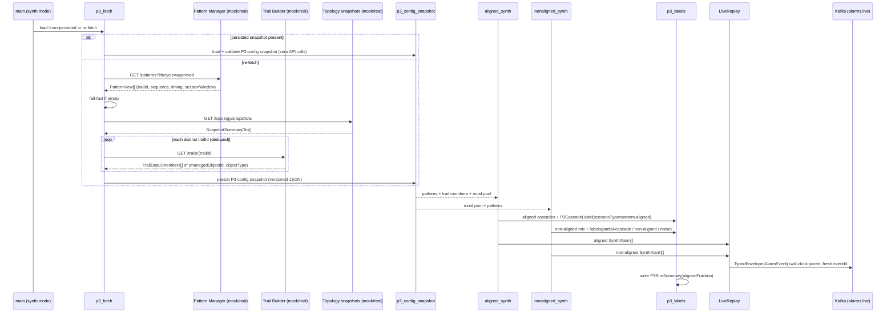

### P3 ground-truth labels + KPI verification (Task 18)

`P3LabelStore` holds two record types, both persisted as JSONL under `SIM_OUTPUT_DIR` and served via
the existing FastAPI label surface:

```jsonc
// P3CascadeLabel (one per synthesized cascade)
{ "patternId": "pat-01", "trailId": "trail-A",
  "rootCauseAlarmId": "alm-…", "rootCauseAlarmType": "IPLinkDown",
  "childAlarmIds": ["alm-…", "alm-…"], "scenarioType": "pattern-aligned" }
// P3RunSummary (one per run)
{ "totalAlarms": 200, "alignedAlarms": 132, "nonAlignedAlarms": 68, "alignedFraction": 0.66 }
```

`alignedFraction == alignedAlarms / totalAlarms` computed from the per-cascade records (AC 43). Both
are retrievable without extra config: `GET /labels` returns the cascade labels (the existing frozen
shape is extended with the P3 fields for `synth`-mode records — same endpoint, additive fields) and a
new `GET /labels/p3-summary` returns the `P3RunSummary`.

**How the 60-70% KPI is verified end-to-end.** The oracle (integration harness) computes the
**achieved auto-correlation + RCA fraction** by joining the Simulator's P3 labels with the
Correlation Engine's read APIs on the shared `alarmId`/`alarmType` join space:
- CE `GET /stats` yields `correlatedAlarmCount / totalAlarmsProcessed` — the **auto-correlation
  rate**; asserted ≈ the Simulator's `alignedFraction` (within the CE's partial-match tolerance),
  i.e. in the **0.60–0.70** band.
- CE `GET /incidents` yields each incident's tagged `rootCauseAlarmId`/`rootCauseAlarmType`; the
  oracle checks it against the P3 label's `rootCauseAlarmType` for the same cascade → **RCA
  accuracy** (the §10 `≥0.80` threshold on the canonical `alarmType` token space).
- Because every aligned cascade lands on a real trail, inside the session window, with the root type
  present, an aligned cascade **should** produce exactly one CE incident with the correct root cause;
  the non-aligned remainder (esp. `partial-cascade`) should **not** produce incidents (it should
  revert-open), which is what makes the achieved fraction match the configured one.

### P3 reproducibility + seeding (Task 19 / OQ-3)

A single `random.Random` is seeded from `P3_RNG_SEED` when present; absent → seeded from
`random.randrange(1<<30)` and the chosen seed is **logged** so a fresh run is reproducible by
re-supplying it. The RNG drives: cascade ordering, optional-element inclusion rolls, placement member
picks (incl. fallback), non-aligned sampling, and per-alarm `alarmId`/`raisedAt` jitter. With the
**same seed + same persisted P3 config snapshot** two runs produce **identical** `alarmId`,
`alarmType`, `managedObjectId`, `raisedAt`, and ordering (AC 41). No seed / distinct seeds → different
`alarmId`s + ordering with high probability. The seed **never** touches the persisted config snapshot
(that is pure fetched state — Task 19).

### P3 CLI + config surface (Task 20)

`synth` is selected by `SIM_MODE=synth` (or `--synth`), pinned to phase P3 (emit target is
`alarms.live`). New options (all with `P3_*` env equivalents, all overridable, no hard-coded URL or
fraction — spec Non-functional):

| CLI flag | Env | Default | Meaning |
|---|---|---|---|
| `--synth` | `SIM_MODE=synth` | (mode selector) | select P3 topology-and-pattern-driven synthesis |
| `--p3-aligned-fraction` | `P3_ALIGNED_FRACTION` | `0.65` (range 0.0–1.0) | target pattern-aligned fraction |
| `--p3-total-alarms` | `P3_TOTAL_ALARMS` | `500` (or `p3-demo` profile) | total alarm volume |
| `--p3-rng-seed` | `P3_RNG_SEED` | unset → fresh (logged) | reproducibility seed |
| `--p3-config-snapshot-path` | `P3_CONFIG_SNAPSHOT_PATH` | `{SIM_OUTPUT_DIR}/p3-config-snapshot.json` | load-from-persisted vs. re-fetch + persist |
| (fetch clients) | `PATTERN_MANAGER_API_MODE`/`_BASE_URL`, `TRAIL_BUILDER_API_MODE`/`_BASE_URL`, `TOPOLOGY_API_MODE`/`_BASE_URL` | `mock` / unset | config-switchable collaborators |
| (mix) | `P3_PARTIAL_CASCADE_FRACTION`/`P3_RANDOM_ALARM_FRACTION`/`P3_NOISE_FRACTION` | `0.4`/`0.4`/`0.2` | non-aligned mix proportions |
| (optional) | `P3_OPTIONAL_INCLUDE_PROB` | `1.0` | probability an optional sequence element is emitted |

**Fail-fast (AC 46):** starting `synth` with `PATTERN_MANAGER_API_MODE=real` and **no**
`PATTERN_MANAGER_API_BASE_URL` (or a `real` Trail Builder / Topology mode without its base URL) →
structured JSON config error `config.invalid` + non-zero exit **before any alarm**. Same for
`P3_ALIGNED_FRACTION` outside `[0,1]`, a non-existent `P3_CONFIG_SNAPSHOT_PATH` when
load-from-persisted is requested with no live services reachable, or mix fractions not summing to 1.
Validation is added to `config/settings.py::_validate` (extends the existing pattern). `--help`
documents the `synth` sub-command with all P3 options (standalone vs. full-cycle use).

### P3 data model (owned artifacts)

No new datastore. P3 owns two **files** under `SIM_OUTPUT_DIR` (the same file model as
snapshot/corpus/labels): the **P3 config snapshot** (`p3-config-snapshot.json`, versioned — schema
above) and the **P3 labels** (`p3-labels-{runId}.jsonl` + `p3-summary-{runId}.json`). Both are
Simulator-owned artifacts, not Kafka, not shared with other services (spec "Data owned"). The wire
output is the frozen `AlarmEvent` on `alarms.live` — nothing new.

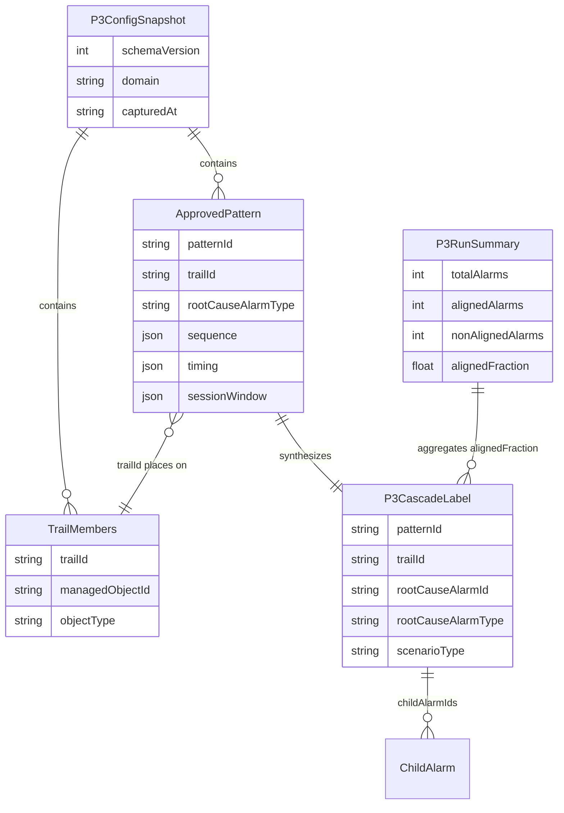

### P3 error handling

| Failure mode | Handling |
|---|---|
| No approved patterns (empty `PatternView[]`) | Fail fast `p3.no_approved_patterns`, exit 3, zero alarms (AC 32). |
| A pattern's trail 404s | Structured **warning** `p3.trail_not_found`; drop that pattern; continue if ≥1 pattern remains; fail fast only if all trails are gone (AC 33). |
| Collaborator unreachable / 5xx (real mode) | Bounded retry (mirrors `topology_client`); on exhaustion, structured error `p3.dependency_failure`, exit 4, zero alarms; `/health` non-200. |
| Missing base URL when `*_API_MODE=real` | Config-invalid fail-fast (exit 3) before any call (AC 44/46). |
| Stale/corrupt persisted config snapshot | `p3.config_snapshot_stale` on unknown `schemaVersion` or unresolvable `trailId`; exit 3, zero alarms. |
| `P3_ALIGNED_FRACTION` out of `[0,1]` / mix fractions not summing to 1 | Config-invalid fail-fast (exit 3). |
| Affine objectType missing on a trail | **Not an error** — fallback to any trail member (logged, counted); synthesis continues (OQ-P3-1). |
| Kafka produce error | Logged + `simulator_produce_errors_total`; `/health` non-200; run exits non-zero; no silent drop (as existing replay). |

No inbound Kafka in P3 either, so **no DLQ**; the P3 reads are HTTP GETs (bounded retry, no DLQ).
`schemaVersion` rejection applies to the **P3 config snapshot file** (own versioned artifact) — the
`AlarmEvent` schema is unchanged.

### P3 design alternatives

| Consideration | Alternatives considered | Chosen + rationale |
|---|---|---|
| alarmType→objectType placement authorship (OQ-P3-1) | (a) Knowledge Service vocabulary; (b) derive from `managedObjectId` prefix; (c) **pack-authored affinity table** | **(c)** — the pack already owns alarm shapes + object types; keeps the engine/synth domain-generic (AC-19). (b) would couple to the moid encoding (forbidden by OQ-P3-5). (a) adds a Knowledge round-trip + contract surface for pure generation-side data. |
| Placement fallback when affine objectType absent | (a) skip the element; (b) fabricate a new object; (c) **place on ANY trail member** | **(c)** — keeps the alarm on a **real** object (AC 35) on the **pattern's own trail** so CE still matches on trail+sequence. (a) shrinks the cascade below tolerance (miss); (b) violates "no fabricated identities". |
| P3 config persistence format (OQ-P3-2) | (a) multiple files; (b) SQLite; (c) **single versioned JSON file** | **(c)** — matches the existing snapshot/corpus/labels file model, human-diffable, trivially shareable/reusable across runs + inputs, simple fail-fast load. SQLite adds a dependency + opacity for a read-mostly config. |
| Non-aligned strategy (OQ-P3-3) | (a) noise only; (b) random singles only; (c) **configurable MIX** (partial cascades + random singles + noise) | **(c, user-resolved)** — partial cascades exercise CE's reverted-open path (realistic "opened-then-expired"), random singles model unrelated traffic, noise reuses existing machinery; proportions are env-tunable so the non-correlated tail is representative and controllable. |
| Optional-element emission (OQ-P3-4) | (a) always omit; (b) always emit; (c) **configurable include-prob, default include (1.0)** | **(c/default-b)** — CE treats optional as non-mandatory and fires within `partialMatchTolerance` (default N-1); including optionals keeps the tolerance budget for a real dropped mandatory symptom, so aligned cascades **reliably** auto-correlate; lowering the prob deliberately models incomplete cascades that still match. |
| P3 emit path | (a) new synthesis-specific producer; (b) **reuse `engine/replay:LiveReplay`** | **(b)** — same topic, pacing, fresh-`eventId` envelope, frozen `AlarmEvent`; no new code path, no contract change, guaranteed identical wire behaviour to existing P3 replay. |
| Fetch vs. persist decoupling | (a) always re-fetch; (b) **persist once, load-from-file for repeated runs** | **(b)** — spec Task 14/AC 34/42: repeated randomized runs must align without re-fetching and must run standalone/offline; the persisted snapshot isolates synthesis from service availability. |

## UI wireframes

N/A — backend/CLI service (no web-ui surface).
