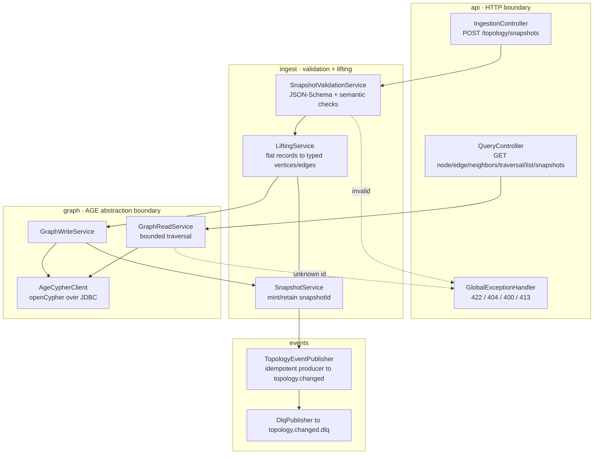
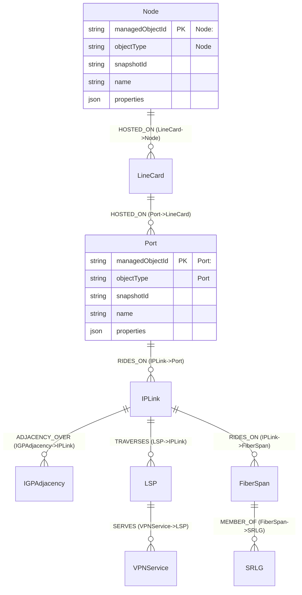
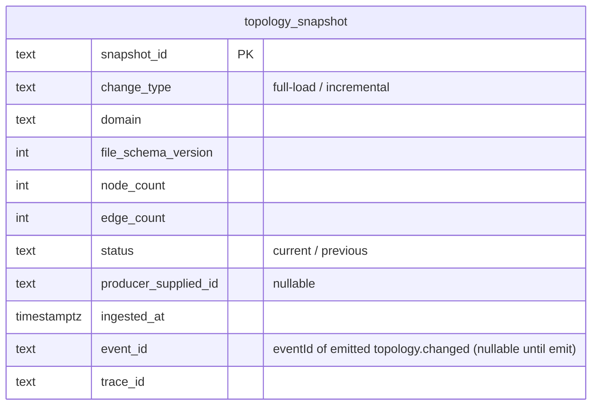
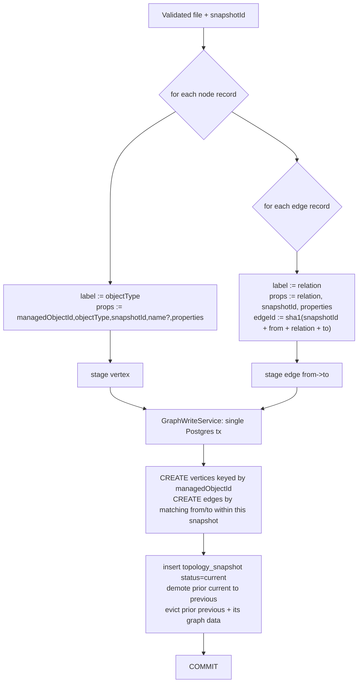

# topology — Design

Buildable design for the **Topology Service** — the sole owner of the network topology graph in
Apache AGE. Derived from the approved, merged `services/topology/spec.md` (PR #21) and
`docs/architecture.md` (inventory row, "Topology snapshot file & ingestion API", "Runtime phases",
invariants). Implements the spec's six Tasks and all nineteen acceptance criteria.

> **Contract status.** No contract change is introduced by this design. The emitted event binds to
> the **frozen** `com.acp.eventmodel.generated.TopologyChangedEvent` from `libs/event-model`; the
> ingestion/query HTTP surface is exactly the one enumerated in the spec Contract section; the
> topology-snapshot file schema (`services/topology/schema/snapshot.schema.json`) is the
> service-owned, contract-gated artifact whose field-level definition is already fixed in the spec.
> The design only decides *how* (module layout, AGE persistence, lifting algorithm, traversal). No
> new topic/payload/field/OpenAPI surface is invented. (See "Design-stage notes" for the one
> genuine ambiguity, resolved as a documented design decision, not a contract change.)

---

## Stack

| Concern | Choice | License |
|---|---|---|
| Language / runtime | **Java 17** (`eclipse-temurin:17-jdk`) | — |
| Framework | **Spring Boot 3.3.x** (Web MVC, Actuator, Validation) | Apache-2.0 |
| Build | **Gradle** (wrapper, matching `libs/event-model/java`) | Apache-2.0 |
| Event model | **`com.acp:event-model:0.1.0`** (frozen lib; `EventCodec`, `TypedEnvelope`, generated `TopologyChangedEvent`, `ManagedObjectId`) | repo-internal |
| Messaging | **Spring for Apache Kafka** (`spring-kafka`), idempotent producer | Apache-2.0 |
| Graph store | **Apache AGE** (Postgres extension) over **PostgreSQL 16**; openCypher via JDBC (PostgreSQL JDBC driver) | Apache-2.0 / BSD-2 |
| Migrations | **Flyway** (create AGE extension, graph, side-tables) | Apache-2.0 |
| JSON Schema validation | **`com.networknt:json-schema-validator` 1.4.x** (already used by event-model) — validates the snapshot file against `snapshot.schema.json` | Apache-2.0 |
| OpenAPI | **springdoc-openapi 2.x** (`/openapi.json` + Swagger UI); generated doc checked in at `services/topology/openapi.json` | Apache-2.0 |
| Metrics | **Micrometer + Prometheus** registry via Actuator | Apache-2.0 |
| Logging | Logback **JSON** encoder (`logstash-logback-encoder`) | Apache-2.0 / MIT |
| Tests | **JUnit 5** (unit/contract), **Testcontainers** (AGE/Postgres + Kafka) for integration; Awaitility for async event assertions | EPL-2.0 / MIT / Apache-2.0 |

All dependencies are permissive (Apache-2.0 / MIT / BSD / EPL-2.0). No GPL/AGPL.

---

## Task breakdown (from the spec)

Every spec Task is realized below; nothing is dropped or re-scoped.

| Spec task | Realized by (modules / flow) |
|---|---|
| **1. Validate and ingest a snapshot file** | `IngestionController.POST /topology/snapshots` → `SnapshotValidationService` (JSON-Schema validation against `snapshot.schema.json` + semantic checks) → on success `LiftingService` + `GraphWriteService` persist under a minted `snapshotId`. Schema-invalid ⇒ 422, **no AGE write**. (Key flow A; Error handling EH-1..EH-6.) |
| **2. Lift flat records into the typed multi-layer graph** | `LiftingService` maps each `nodes[]` record to a typed AGE vertex (label = `objectType`, `managedObjectId` preserved as a property) and each `edges[]` record to a typed AGE edge (label = `relation`). Domain-agnostic: types come from the file/schema, not hard-coded business logic. (Key flow A; Algorithm flow §A.) |
| **3. Maintain snapshot versioning** | `SnapshotService` mints `snapshotId` (honours producer-supplied, else mints UUID-based), tags every vertex/edge with `snapshotId`, records the snapshot in the `topology_snapshot` side-table, and enforces **current + previous** retention (evicts older). (Key flow A; Data model.) |
| **4. Emit `topology.changed`** | `TopologyEventPublisher` builds a `TypedEnvelope<TopologyChangedEvent>` (envelope `eventId` = idempotency key) and produces to `topology.changed` via the idempotent Kafka producer; `changeType` ∈ {`full-load`,`incremental`}; emit failure ⇒ `topology.changed.dlq`. (Key flow A; Event handling.) |
| **5. Serve the query API** | `QueryController` exposes get-node, get-edge, neighbors, bounded traversal, resolve managedObjectId→object+layer, list-by-type, list-snapshots, current-snapshot → `GraphReadService` (openCypher reads) → typed DTOs. (Key flow B; Algorithm flow §B.) |
| **6. Manage the AGE abstraction boundary** | AGE access is confined to the `graph/` package (`AgeCypherClient`); no AGE credentials/endpoint/openCypher result leaks through any controller, DTO, env-exposed surface, or log line. Responses are typed DTOs only. (Error handling EH-9; AC-19.) |

---

## Phase applicability (design view)

Matches the canonical phase map (`architecture.md` → "Runtime phases") and the spec's Phase
applicability table.

| Phase | Active/Passive/Idle | Modules/handlers exercised | Inputs/Outputs |
|---|---|---|---|
| **P1 — Topology onboarding** | **Active** (primary phase) | `IngestionController`, `SnapshotValidationService`, `LiftingService`, `GraphWriteService`, `SnapshotService`, `TopologyEventPublisher`. Full ingest→lift→persist→mint→emit pipeline. | **In:** topology snapshot file via `POST /topology/snapshots`. **Out:** `topology.changed` (Kafka); `topology.changed.dlq` on emit failure. |
| **P2 — Pattern learning** | **Passive** | `QueryController` + `GraphReadService` only (get/neighbors/traversal/resolve/list/snapshots). Ingestion + publisher dormant (no new files expected, but endpoints remain available). | **In:** query API calls from Trail Builder / Codebook Generator / Enrichment / Web UI. **Out:** typed query responses. **No topic I/O.** |
| **P3 — Real-time correlation** | **Idle** | None on the critical path. Query API physically remains up but no real-time consumer queries it (topology context is already materialized into trails + codebook in P1). No handler is driven. | **In:** — . **Out:** — . |

Phase is a *runtime-mode* property, not a deploy switch: the same process serves all three; P2/P3
simply exercise fewer (or no) handlers. Tests assert per-phase behaviour (e.g. P1 emits exactly one
event; P3 drives no event).

---

## Module breakdown



| Package | Responsibility |
|---|---|
| `com.acp.topology.api` | REST controllers (`IngestionController`, `QueryController`), request/response DTOs, `GlobalExceptionHandler` (maps validation/not-found to structured errors). |
| `com.acp.topology.ingest` | `SnapshotValidationService` (schema + semantic validation), `LiftingService` (record→typed-graph mapping), `SnapshotService` (mint + retention). |
| `com.acp.topology.graph` | **AGE abstraction boundary.** `GraphWriteService`, `GraphReadService` (incl. bounded traversal), `AgeCypherClient` (the only class issuing openCypher). No AGE detail escapes this package. |
| `com.acp.topology.events` | `TopologyEventPublisher` (build `TypedEnvelope<TopologyChangedEvent>`, idempotent produce), `DlqPublisher`. |
| `com.acp.topology.config` | `@ConfigurationProperties` beans (Kafka, AGE/Postgres, limits, integration toggles), idempotent Kafka producer config, JSON Schema loader. |
| `com.acp.topology.observability` | Health indicators (AGE reachable, Kafka reachable), Micrometer meters, MDC enrichment (`snapshotId`, `traceId`). |

---

## Data model / DB schema

Topology lives in **Apache AGE** (a graph inside PostgreSQL). The graph is the system of record for
nodes/edges; two **relational side-tables** (in a separate schema) track snapshot versioning and the
producer-supplied id mapping. AGE internals are never exposed beyond the `graph/` package.

### Graph model (AGE)

One AGE graph named `topology`. **Vertex labels = the nine `objectType` values**; **edge labels =
the six typed relations**. Every vertex carries `managedObjectId`, `objectType`, `snapshotId`,
`name?`, and `properties` (free-form). Every edge carries `relation`, `snapshotId`, and `properties`.



> The ER diagram is illustrative of the §5 layering and **typical** edge directions; the service is
> **domain-agnostic** — it persists whatever typed nodes/edges the conforming file declares (any of
> the 9 labels, any of the 6 relations, in any valid `from`/`to` arrangement). It does **not**
> hard-code which relation may connect which layer. The nine vertex labels and six edge labels are
> the complete vocabulary (frozen via the `managedObjectId` scheme + spec edge vocabulary).

**Vertex properties (all labels):** `managedObjectId` (string, unique within a snapshot),
`objectType` (string, = label), `snapshotId` (string), `name` (string, optional),
`properties` (map → stored as agtype/JSON). **Edge properties (all labels):** `relation` (string,
= label), `snapshotId` (string), `properties` (map). The application also stamps a synthetic
`edgeId` (deterministic `sha1(snapshotId|from|relation|to)`) property so `GET /topology/edges/{edgeId}`
is addressable without leaking AGE's internal vertex/edge ids.

**Indexes** (btree on AGE's underlying property tables, created by Flyway via AGE property-index DDL):
`(snapshotId, managedObjectId)` for resolve/get-node; `(snapshotId, objectType)` for list-by-type;
edge `(snapshotId, edgeId)` for get-edge.

### Relational side-tables (schema `topology_meta`)



- `topology_snapshot` — one row per ingest. Constrained to **at most one `current`** and **at most
  one `previous`**; on a new ingest the prior `current` is demoted to `previous`, and the prior
  `previous` row + its graph data are evicted (retention = current + previous, per Task 3 / AC-14).
  A re-ingest **always** inserts a new row with a new `snapshot_id`, even if content is identical
  (AC-14).
- No alarm/incident/template data here — out of scope. No AGE credentials in any row.

**Atomicity:** graph writes and the side-table insert/demote/evict run in **one Postgres
transaction** (AGE is in the same Postgres) — a failure leaves no partial snapshot (EH-10).

**Why a side-table (not "just the graph"):** snapshot status/retention and producer-vs-minted id
mapping are cheap relational, indexed, transactional concerns; keeping them out of the graph avoids
extra openCypher and gives an indexed source for `GET /topology/snapshots` (see Design alternatives).

---

## Event handling

- **Consumers:** **none.** The Topology Service subscribes to no Kafka topic (spec: ingestion is
  file/API only). There is therefore no inbound idempotency/dedupe concern and no inbound DLQ.

- **Producers:**

  | Topic | Payload (from `libs/event-model`) | When | Key | Idempotency / failure |
  |---|---|---|---|---|
  | `topology.changed` | `TopologyChangedEvent` (`snapshotId`, `changeType`, `nodes[]`, `edges[]`) in `TypedEnvelope` (`eventId`,`type=TopologyChangedEvent`,`schemaVersion=1`,`occurredAt`,`source=topology`,`traceId`,`payload`) | after every successful ingest+persist | envelope `eventId` (UUID) = idempotency key; Kafka message key = `snapshotId` | Producer idempotent (`enable.idempotence=true`, `acks=all`, `max.in.flight<=5`, retries). On unrecoverable send failure → `topology.changed.dlq`. |
  | `topology.changed.dlq` | the same envelope JSON + failure metadata headers (`x-error`, `x-original-topic`, `x-trace-id`) | when the `topology.changed` send ultimately fails | — | terminal; logged ERROR with `snapshotId`/`traceId`. |

  **Dedupe semantics (spec-aligned):** Kafka is at-least-once, so a single emitted event may be
  *delivered* more than once; consumers dedupe on `eventId`. A **re-ingest** of identical content is
  a *new* ingest → new `snapshotId` → new `eventId` → a new event (not a duplicate). The dedupe
  guarantee is per-delivery of a given `eventId`, not per-ingest-operation (AC-14, AC-15).

  **`changeType` rule:** the **first** successful ingest into an empty graph emits `full-load`
  (AC-15). Subsequent ingests emit `full-load` for a complete replacement and `incremental` for a
  partial update; the value is **never** outside `{full-load, incremental}` (AC-16) — `delete` is
  not emitted in the MVP. (How a file signals full vs. incremental: see "Design-stage notes".)

The publisher uses `EventCodec.serialize(TypedEnvelope<TopologyChangedEvent>)` from the frozen lib,
so the wire payload is exactly the frozen binding (AC-15, AC-17).

---

## API contracts / API schema

OpenAPI 3.1 is generated by **springdoc** from the annotated controllers/DTOs and served at
`/openapi.json` (+ Swagger UI). The generated document is **checked in** at
`services/topology/openapi.json` and is the single source of truth for the HTTP surface; a
**contract test** (AC-18) validates live responses against the checked-in document, so the
implementation cannot drift. A change to this surface is a contract change (architecture.md/spec +
human approval).

All error responses use one structured shape:

```jsonc
// ApiError
{ "status": 422, "error": "UNPROCESSABLE_ENTITY",
  "message": "snapshot file failed validation",
  "violations": [ { "path": "$.nodes[3].managedObjectId", "rule": "pattern",
                    "detail": "does not match ^(Node|...|SRLG):[^:]+$" } ],
  "traceId": "..." }
```

### Ingestion API

**`POST /topology/snapshots`** — `Content-Type: application/json` (the snapshot file body). Optional
`?changeType=full-load|incremental` hint; defaults per the replacement convention (Design-stage notes).

Request body = the **topology-snapshot file**, validated against
`services/topology/schema/snapshot.schema.json`. Shape (fields fixed by the spec):

```jsonc
{
  "schemaVersion": 1,                 // integer, required (topology-file schema version)
  "snapshotId": "SNAP-...",           // string, optional (producer-supplied; else minted)
  "domain": "core-ip",                // string, required
  "nodes": [                          // array, required
    { "managedObjectId": "Node:PE1",  // required, pattern ^(Node|LineCard|Port|IPLink|IGPAdjacency|LSP|VPNService|FiberSpan|SRLG):[^:]+$
      "objectType": "Node",           // required, must equal the prefix of managedObjectId
      "name": "PE1",                  // optional
      "properties": { } }             // optional, free-form
  ],
  "edges": [                          // array, required
    { "from": "Port:PE1-LC2-P3",      // required, must reference a node in nodes[]
      "to": "Node:PE1",               // required, must reference a node in nodes[]
      "relation": "HOSTED_ON",        // required, one of HOSTED_ON|RIDES_ON|ADJACENCY_OVER|TRAVERSES|SERVES|MEMBER_OF
      "properties": { } }             // optional, free-form
  ]
}
```

Responses:

| Status | When | Body |
|---|---|---|
| **200** | accepted, lifted, persisted, event emitted | `{ "snapshotId": "...", "changeType": "full-load", "nodeCount": N, "edgeCount": M, "status": "current" }` |
| **422** | schema-invalid or semantic-invalid (missing required field; bad `managedObjectId` pattern; inconsistent `objectType`; dangling edge ref; unknown `relation`) | `ApiError` with `violations[]`; **no AGE write, no event** |
| **413** | body exceeds `topology.ingest.max-file-bytes` | `ApiError` |
| **415** | non-JSON content type | `ApiError` |
| **500** | persistence/transaction failure (AGE down mid-write) | `ApiError`; transaction rolled back → no partial snapshot |

### Query API (read-only; typed DTOs only — never AGE structures)

| Operation | Method + path | Response (200) | Errors |
|---|---|---|---|
| Resolve / get node + layer | `GET /topology/nodes/{managedObjectId}` | `NodeDto { managedObjectId, objectType (layer), name?, properties, snapshotId }` | 404 unknown id; 400 malformed id |
| Get edge | `GET /topology/edges/{edgeId}` | `EdgeDto { edgeId, from, to, relation, properties, snapshotId }` | 404 unknown |
| Neighbors | `GET /topology/nodes/{managedObjectId}/neighbors?relation=RIDES_ON` (relation optional, repeatable) | `NeighborsDto { managedObjectId, neighbors: [ { node: NodeDto, via: EdgeDto } ] }` | 404 unknown start |
| Bounded traversal | `GET /topology/traversal?start={moId}&relation=RIDES_ON&relation=...&maxDepth=K` | `TraversalDto { start, relations[], maxDepth, reached: NodeDto[] }` | 400 missing start/relation/maxDepth or maxDepth out of `[1..max]`; 404 unknown start |
| List by type | `GET /topology/nodes?objectType=Port&snapshotId=current` | `NodeListDto { objectType?, snapshotId, count, nodes: NodeDto[] }` | 400 unknown objectType |
| List snapshots | `GET /topology/snapshots` | `SnapshotListDto { snapshots: [ { snapshotId, changeType, status, nodeCount, edgeCount, ingestedAt } ] }` (>= current + previous) | — |
| Current snapshot | `GET /topology/snapshots/current` | `SnapshotSummaryDto { snapshotId, changeType, nodeCount, edgeCount, ingestedAt }` | 404 if no snapshot yet |

`managedObjectId` resolution (spec Task 5) is satisfied by `GET /topology/nodes/{managedObjectId}`,
which returns the object **and its layer** (`objectType`). Queries default to the **current**
snapshot; `?snapshotId=current|previous` selects either retained snapshot.

---

## Integration points (mock vs. real)

The Topology Service is primarily a **server**, not a client.

| Direction | Collaborator + operation | Config key(s) | mock vs real |
|---|---|---|---|
| **Inbound (server)** | Producers (Simulator) call `POST /topology/snapshots`; consumers (Trail Builder, Codebook Generator, Enrichment, Web UI) call the query API. They build clients from **this service's** published `openapi.json`. | n/a (we publish; they consume) | n/a |
| **Outbound (optional, off by default)** | **Knowledge Service** — *only if* lifting ever needs an externally-authored edge/type vocabulary. **Not required for MVP.** | `topology.knowledge.enabled` (default `false`), `topology.knowledge.base-url`, `topology.knowledge.mode=mock|real` | **mock** = WireMock stub generated from Knowledge's published OpenAPI (unit tests); **real** = live Knowledge on the integration Compose network. No hard-coded URL. |
| **Outbound (infra)** | Kafka broker; AGE/Postgres | `topology.kafka.bootstrap-servers`; `topology.age.jdbc-url` / `.username` / `.password` (secret) | real in all envs; Testcontainers in integration tests; embedded/mock in unit tests. |

For the MVP the vocabulary (9 object types, 6 relations) is fixed by the spec + `managedObjectId`
scheme, so the Knowledge integration point ships **disabled**; it exists as a config-switchable hook
only (honours the platform's "configurable integration points" invariant) and adds no startup
dependency.

---

## Key flows (sequence / data-flow diagrams)

### Flow A — Ingestion: file → validate → lift → AGE persist → mint snapshotId → emit `topology.changed` (P1)

```mermaid
sequenceDiagram
  autonumber
  participant Prod as Producer (Simulator)
  participant IC as IngestionController
  participant SV as SnapshotValidationService
  participant LF as LiftingService
  participant SS as SnapshotService
  participant GW as GraphWriteService
  participant AGE as Apache AGE (Postgres tx)
  participant EP as TopologyEventPublisher
  participant K as Kafka topology.changed

  Prod->>IC: POST /topology/snapshots (snapshot file)
  IC->>SV: validate(file)
  SV->>SV: JSON-Schema (snapshot.schema.json)
  SV->>SV: semantic: moId pattern, objectType==prefix,\nedge refs resolve, relation in vocab
  alt invalid
    SV-->>IC: ValidationException(violations)
    IC-->>Prod: 422 ApiError (no AGE write, no event)
  else valid
    SV-->>IC: ok
    IC->>SS: mint/resolve snapshotId (producer-supplied or UUID)
    SS-->>IC: snapshotId
    IC->>LF: lift(file, snapshotId)
    LF-->>GW: typed vertices[] + edges[]
    GW->>AGE: BEGIN; CREATE vertices/edges; insert topology_snapshot(current); demote prior current to previous; evict old previous; COMMIT
    AGE-->>GW: committed
    GW-->>IC: persisted (nodeCount, edgeCount)
    IC->>EP: publish(snapshotId, changeType, nodes[], edges[])
    EP->>K: TypedEnvelope of TopologyChangedEvent (eventId, key=snapshotId)
    alt send fails
      EP->>K: route to topology.changed.dlq (+ error headers)
    end
    EP-->>IC: emitted (eventId)
    IC-->>Prod: 200 { snapshotId, changeType, nodeCount, edgeCount }
  end
```

### Flow B — Query: bounded traversal / managedObjectId resolution (P2)

```mermaid
sequenceDiagram
  autonumber
  participant C as Caller (Trail Builder / Enrichment / Web UI)
  participant QC as QueryController
  participant GR as GraphReadService
  participant AC as AgeCypherClient
  participant AGE as Apache AGE

  C->>QC: GET /topology/nodes/Port:PE1-LC2-P3   (resolve)
  QC->>GR: getNode(moId, snapshot=current)
  GR->>AC: MATCH (n {managedObjectId,snapshotId}) RETURN n
  AC->>AGE: openCypher (inside graph/ only)
  AGE-->>AC: agtype row
  AC-->>GR: internal vertex
  GR-->>QC: NodeDto (typed; no AGE detail)
  alt not found
    QC-->>C: 404 ApiError
  else
    QC-->>C: 200 NodeDto { managedObjectId, objectType=layer, ... }
  end

  C->>QC: GET /topology/traversal?start=Node:PE1&relation=RIDES_ON&maxDepth=3
  QC->>QC: validate maxDepth in [1..max]; relation in vocab
  QC->>GR: traverse(start, {RIDES_ON}, depth)
  GR->>AC: MATCH path = (s)-[:RIDES_ON*1..3]-(m) WHERE s.managedObjectId=... RETURN distinct m
  AC->>AGE: openCypher
  AGE-->>AC: agtype rows
  AC-->>GR: vertices
  GR-->>QC: TraversalDto { reached: NodeDto[] }  (only RIDES_ON-reachable)
  QC-->>C: 200 TraversalDto
```

---

## Algorithm logical flow

### §A — Lifting rules (flat records → typed multi-layer graph)

Inputs: the validated snapshot file + the resolved `snapshotId`. Parameters: none hard-coded (the
type/relation vocabulary comes from the `managedObjectId` scheme and the spec edge list; the file
declares the actual instances). Output: typed AGE vertices + edges.



Decision rules:
- **Label selection is data-driven**, not a `switch` over Core-IP semantics: vertex label = the
  record's `objectType`; edge label = the record's `relation`. New domains add no code
  (domain-agnostic invariant, AC-10).
- **`managedObjectId` is the natural key** within a snapshot; vertices are matched by
  `(snapshotId, managedObjectId)` so edges link the correct snapshot's vertices (no cross-snapshot
  bleed).
- **All-or-nothing:** validation runs to completion *before* any write; the write is one transaction
  → schema-invalid files never produce a partial graph (AC-3..AC-7, EH-1..EH-6, EH-10).

### §B — Bounded traversal by edge type(s)

Inputs: `start` managedObjectId, a non-empty set of relations, `maxDepth K` (1..configured max).
Output: the set of nodes reachable from `start` using **only** the named relation labels within K
hops (and no node reachable solely via other relations).

```mermaid
flowchart TD
  A[start, relations[], maxDepth K] --> B{start resolves in current snapshot?}
  B -- no --> N[404]
  B -- yes --> C{K in 1..maxConfigured?}
  C -- no --> E[400 ApiError]
  C -- yes --> D[openCypher: MATCH path =\n start -[:R1 or R2 ...*1..K]- m\n RETURN distinct m]
  D --> F[map vertices to NodeDto, dedupe by managedObjectId]
  F --> G[200 TraversalDto reached: NodeDto[]]
```

The relation label set is injected into the variable-length pattern (`[:R1|R2*1..K]`), so only the
requested edge types are traversed (AC-11). `maxDepth` is bounded by `topology.traversal.max-depth`
(config, not hard-coded) to keep traversal cost finite.

---

## Seed data & examples

**N/A — why.** Topology is a backend graph service; it does **not** generate topology data (spec
Out-of-scope). The topology *file* it ingests is produced by the **Simulator** and validated against
this service's `snapshot.schema.json`. The service ships **test fixtures only** — small conforming
and deliberately-malformed snapshot files used by the unit/contract tests
(`src/test/resources/snapshots/*.json`): e.g. `valid-min.json`, `valid-all-nine-types.json`,
`missing-domain.json`, `bad-moid-pattern.json`, `objecttype-mismatch.json`, `dangling-edge.json`,
`unknown-relation.json`, `riding-chain.json` (for traversal). These are test fixtures, not seed data
the service emits or persists.

---

## UI wireframes

**N/A — why.** Topology has **no UI**; it is a backend graph service. Topology/trail visualization
is owned by **web-ui** (Angular 20), which consumes this service's query API. The only human-facing
HTML surface is the auto-generated Swagger UI for the OpenAPI doc (developer aid, not a product UI).

---

## Error handling

First-class. Every failure mode has a defined outcome; nothing silently drops.

| # | Failure mode | Handling | Caller sees | Logged | Side effects |
|---|---|---|---|---|---|
| EH-1 | Non-conforming file (JSON-Schema fails) | reject in `SnapshotValidationService` before any write | **422** `ApiError` + `violations[]` | WARN with violations, `traceId` | **none** — no AGE write, **no event** (AC-3) |
| EH-2 | Missing required top-level field (`schemaVersion`/`domain`/`nodes`) | schema validation 422 | 422 | WARN | none (AC-3) |
| EH-3 | `managedObjectId` pattern violation | semantic check (mirrors `ManagedObjectId.PATTERN`) | 422 | WARN with offending path | none (AC-4) |
| EH-4 | `objectType` inconsistent with id prefix | semantic check | 422 | WARN | none (AC-5) |
| EH-5 | Dangling edge `from`/`to` (not in `nodes[]`) | semantic check | 422 | WARN | none (AC-6) |
| EH-6 | Unknown edge `relation` (outside the 6) | semantic check | 422 | WARN | none (AC-7) |
| EH-7 | Body too large | `topology.ingest.max-file-bytes` guard | **413** | WARN | none |
| EH-8 | `topology.changed` send ultimately fails | `DlqPublisher` → `topology.changed.dlq` (envelope + error headers) | ingest already 200 (persist succeeded); failure is async | ERROR with `snapshotId`,`traceId` | snapshot persisted; event on DLQ for replay |
| EH-9 | AGE abstraction leak attempt | AGE access confined to `graph/`; controllers/DTOs/logs never carry connection string, port, or raw agtype | typed DTOs only | n/a | none (AC-19) |
| EH-10 | AGE/Postgres down mid-write | transaction rolls back | **500** `ApiError` | ERROR | **no partial snapshot** (atomic tx) |
| EH-11 | AGE/Postgres or Kafka unreachable at startup | readiness probe DOWN; not ready until reachable | 503 from probe | ERROR | service does not accept ingests until ready |
| EH-12 | Unknown `managedObjectId` on query | `GraphReadService` returns empty → 404 | **404** `ApiError` | INFO | none (AC-12) |
| EH-13 | `maxDepth` out of range / missing `start`/`relation` on traversal | request validation | **400** `ApiError` | WARN | none |
| EH-14 | Re-ingest of identical content | **not** treated as a duplicate — new `snapshotId`, new `eventId`, new event | 200 with new `snapshotId` | INFO | new snapshot; prior becomes previous (AC-14) |
| EH-15 | Consumed event with `schemaVersion` major >= 2 | n/a — **this service consumes no topic**; the event-model reject policy applies only to consumers. Producer always emits `schemaVersion=1`. | n/a | n/a | none |

`changeType` is constrained at the publisher (enum-checked in code) to `{full-load, incremental}`
so `delete` can never be emitted (AC-16), even though the frozen event-model schema leaves it a
free-form string.

---

## Design alternatives

| Consideration | Alternatives considered | Chosen + rationale |
|---|---|---|
| AGE access layer | (a) raw JDBC + openCypher in `AgeCypherClient`; (b) a third-party AGE ORM/driver; (c) Spring Data Neo4j | **(a)**. AGE is a Postgres extension queried via `cypher(...)` over the PostgreSQL JDBC driver; mature, permissive AGE-native ORMs are scarce. Raw JDBC keeps deps permissive, keeps the abstraction boundary in one class, and avoids coupling to a graph ORM. Neo4j tooling targets a different store. |
| Snapshot isolation in the graph | (a) **`snapshotId` property on every vertex/edge** in one graph; (b) a separate AGE graph per snapshot; (c) a separate Postgres schema per snapshot | **(a)**. With retention = current+previous, a property tag is simplest, lets traversal scope by `snapshotId`, and makes eviction a `DELETE … WHERE snapshotId=<old previous>`. Per-graph (b) multiplies DDL; (c) is heavy for two versions. |
| Snapshot versioning bookkeeping | (a) **relational side-table `topology_snapshot`**; (b) snapshot metadata as graph vertices; (c) infer from distinct `snapshotId` in the graph | **(a)**. Status/retention/producer-id mapping are relational, indexed, transactional concerns; co-locating with the graph write in one Postgres tx gives atomicity (EH-10) and a cheap `GET /topology/snapshots` without graph scans. |
| Snapshot validation | (a) **JSON-Schema (`networknt`) for structural + code for semantic** (refs / objectType-prefix); (b) all-in-bean-validation; (c) all-in-code | **(a)**. The structural contract already lives in `snapshot.schema.json` (the owned contract) — validate against it directly so the file schema is the source of truth; cross-record semantics (dangling refs, `objectType`==prefix) aren't expressible in plain JSON-Schema, so a thin semantic pass follows. `networknt` is already a repo dependency. |
| `changeType` derivation | (a) **explicit query hint, default full-load (first ingest always full-load)**; (b) diff current vs incoming graph to auto-classify | **(a)**. MVP only distinguishes full-load vs incremental and the spec freezes the convention; auto-diff (b) is costly and unnecessary pre-`delete`. Recorded as a design decision (see notes). |
| `edgeId` for `GET /edges/{edgeId}` | (a) **deterministic synthetic `edgeId` = sha1(snapshotId\|from\|relation\|to)**; (b) expose AGE's internal edge graphid | **(a)**. (b) would leak AGE internals (violates AC-19) and isn't stable across re-ingest; a deterministic content-hash id is reproducible, opaque, and abstraction-safe. |
| Producer-supplied vs minted `snapshotId` | (a) **honour producer-supplied if present, else mint UUID-based**; (b) always mint | **(a)** — spec AC-8/AC-9 require honouring a supplied id and minting when absent. |

---

## Test plan

### Acceptance criterion → test (JUnit 5 unit/contract)

| # | Acceptance criterion | Test (class#method) | Asserts |
|---|---|---|---|
| 1 | Snapshot load + queryability; AGE not reachable externally | `IngestionQueryIT#loadThenQueryReturnsNodesAndEdges_andAgeNotExternallyReachable` | POST valid N-node/M-edge file → 200 + `snapshotId`; query API returns correct nodes/edges; no endpoint/env exposes AGE conn/port. |
| 2 | Accept fully-conforming file | `SnapshotValidationServiceTest#acceptsConformingFile` + `IngestionControllerTest#postValidFileReturns200AndPersists` | validation passes; persist invoked; 200 with `snapshotId`. |
| 3 | Reject missing required top-level field | `SnapshotValidationServiceTest#rejectsMissingDomain_schemaVersion_or_nodes` | 422 `ApiError`; `GraphWriteService` never called; `TopologyEventPublisher` never called. |
| 4 | Reject invalid `managedObjectId` scheme | `SnapshotValidationServiceTest#rejectsBadManagedObjectIdPattern` | 422 before any write; violation path points at the node. |
| 5 | Reject inconsistent `objectType` | `SnapshotValidationServiceTest#rejectsObjectTypeNotMatchingPrefix` | 422 before any write (`Port:p1`+`objectType=Node` ⇒ reject). |
| 6 | Reject dangling edge reference | `SnapshotValidationServiceTest#rejectsDanglingEdgeReference` | 422 before any write when `from`/`to` not in `nodes[]`. |
| 7 | Reject unknown edge relation | `SnapshotValidationServiceTest#rejectsUnknownRelation` | 422 before any write when `relation` ∉ the 6. |
| 8 | Producer-supplied `snapshotId` honoured | `SnapshotServiceTest#usesProducerSuppliedSnapshotId` + `IngestionQueryIT#suppliedIdFlowsToResponseAndEvent` | response + emitted event carry the supplied id. |
| 9 | Service mints `snapshotId` when absent | `SnapshotServiceTest#mintsUniqueSnapshotIdWhenAbsent` | non-empty, unique id returned in 200. |
| 10 | Lifting → typed multi-layer graph | `LiftingServiceTest#liftsAllNineTypesWithCorrectLabels` + `IngestionQueryIT#allNineTypesAndSixRelationsQueryable` | each node returns correct `objectType`; each edge correct typed relation. |
| 11 | Bounded traversal by edge type | `GraphReadServiceTest#traversalReturnsOnlyRidesOnReachableWithinDepth` (Testcontainers) | exactly the expected RIDES_ON-reachable set within K; excludes nodes reachable only via other relations. |
| 12 | `managedObjectId` resolution | `QueryControllerTest#getNodeReturnsObjectAndLayer_404WhenUnknown` | valid id → NodeDto with layer; unknown → 404. |
| 13 | List by type + neighbors | `QueryControllerTest#listByTypeReturnsOnlyThatType` + `#neighborsReturnsDirectlyConnected` | `?objectType=Port` → only Ports; neighbors returns all directly connected. |
| 14 | New `snapshotId` on re-ingest | `SnapshotServiceTest#reingestMintsNewSnapshotId` + `IngestionQueryIT#currentAndPreviousBothListed` | second ingest ≠ first id; both listed by `GET /topology/snapshots`. |
| 15 | First ingest emits `full-load`; payload conforms; ids match | `TopologyEventPublisherTest#firstIngestEmitsFullLoad_payloadDeserialises_idMatches` | exactly one event, `changeType=full-load`, deserialises to frozen `TopologyChangedEvent`, `snapshotId` == API response. |
| 16 | `changeType` within approved set | `TopologyEventPublisherTest#neverEmitsChangeTypeOutsideFullLoadOrIncremental` | publisher rejects / never produces `delete` or any other value. |
| 17 | `topology.changed` event-model conformance | `TopologyEventConformanceTest#emittedEventValidatesAgainstFrozenSchema` | envelope + payload validate against `envelope.schema.json` + `TopologyChangedEvent.schema.json` (all required fields present). |
| 18 | OpenAPI 3.1 contract | `OpenApiContractTest#liveResponsesMatchCheckedInOpenApi` | `/openapi.json` includes ingestion + all query ops; each live response validates against checked-in `services/topology/openapi.json`. |
| 19 | AGE abstraction boundary | `AgeAbstractionBoundaryTest#noEndpointEnvLogOrBodyLeaksAgeInternals` | no controller/DTO/env/log exposes AGE conn string/port/raw agtype; ArchUnit-style check that only `graph/` issues openCypher. |

(Unit tests mock AGE + Kafka; `…IT` and the traversal test use Testcontainers AGE/Postgres + Kafka.)

### E2E scenarios (from the Topology Service's point of view)

| # | Scenario | Trigger → path | Expected outcome |
|---|---|---|---|
| E1 | **Happy path P1 onboarding** | Simulator-style client POSTs a valid Core-IP snapshot (all 9 types, 6 relations) → validate → lift → AGE persist (tx) → mint id → emit `topology.changed` | 200 + `snapshotId`; current snapshot queryable; exactly one `full-load` event whose `snapshotId` matches; payload deserialises to the frozen binding. |
| E2 | **Reject malformed, no side effects** | POST a file with a dangling edge ref (sibling run: bad moId pattern) | 422 `ApiError`; **nothing** in AGE; **no** event on `topology.changed`. |
| E3 | **Re-ingest versioning** | POST snapshot v1 (full-load) → POST snapshot v2 (incremental) | two distinct `snapshotId`s; `GET /topology/snapshots` lists current(v2)+previous(v1); v2 event `changeType=incremental`; oldest beyond previous evicted. |
| E4 | **Query path for consumers (P2)** | After E1, a consumer does resolve → neighbors → bounded RIDES_ON traversal (depth 2) | typed DTOs only; traversal returns exactly RIDES_ON-reachable nodes; unknown id → 404; no AGE internals in any body/log. |
| E5 | **Event emit failure → DLQ (partial/failure path)** | Persist succeeds, then `topology.changed` broker send fails (broker injected-down) | snapshot remains current + queryable; envelope lands on `topology.changed.dlq` with error headers; ERROR log with `snapshotId`/`traceId`; no data loss. |
| E6 | **Atomic write under AGE failure** | AGE made to fail mid-write during ingest | transaction rolls back → no partial graph, no snapshot row, no event; 500 `ApiError`; retry of the same POST succeeds cleanly. |
| E7 | **OpenAPI contract integrity** | Build generates `openapi.json`; contract test runs live | checked-in `services/topology/openapi.json` matches live `/openapi.json`; all 8 operations present; drift fails CI. |

These run on the `integration` branch against the Compose stack (real AGE/Postgres + Kafka);
E2/E5/E6 are the failure/partial paths.

---

## Config & observability

**Config (env, no hard-coded URLs/thresholds):**

| Env var / property | Purpose | Default |
|---|---|---|
| `TOPOLOGY_KAFKA_BOOTSTRAP_SERVERS` | Kafka brokers | (required) |
| `TOPOLOGY_AGE_JDBC_URL` / `_USERNAME` / `_PASSWORD` | AGE/Postgres connection (secret) | (required) |
| `TOPOLOGY_INGEST_MAX_FILE_BYTES` | max snapshot body size (→ 413) | `10485760` |
| `TOPOLOGY_TRAVERSAL_MAX_DEPTH` | upper bound for `maxDepth` | `8` |
| `TOPOLOGY_SNAPSHOT_RETENTION` | retained snapshots (current+previous) | `2` |
| `TOPOLOGY_KNOWLEDGE_ENABLED` / `_BASE_URL` / `_MODE` | optional Knowledge hook (off) | `false` / — / `mock` |

Kafka producer is explicitly idempotent: `enable.idempotence=true`, `acks=all`,
`max.in.flight.requests.per.connection<=5`, `retries` set. Emitted `schemaVersion`=1.

**Observability:**
- `/health` (Actuator) — liveness + **readiness** gated on AGE reachable + Kafka reachable (EH-11).
- `/metrics` (Prometheus via Micrometer) — counters/timers: `topology_ingest_total{result}`,
  `topology_validation_failures_total{rule}`, `topology_snapshot_minted_total`,
  `topology_events_emitted_total`, `topology_events_dlq_total`, `topology_query_seconds{op}`.
- **Structured JSON logs** (Logback JSON), MDC carries `snapshotId` + `traceId` where in scope; one
  log line per significant op (ingest received, validation result, snapshot minted, event emitted,
  query served, error). Logs never carry AGE connection details (AC-19/EH-9).

---

## Build & run

- **Build:** `./gradlew build` (Java 17). A Gradle task generates the OpenAPI doc and **fails the
  build if the checked-in `services/topology/openapi.json` drifts** (backs AC-18). Depends on
  `com.acp:event-model:0.1.0`.
- **Migrations:** Flyway on startup creates the AGE extension (`CREATE EXTENSION age`), the
  `topology` graph, the property indexes, and the `topology_meta.topology_snapshot` side-table.
- **Container:** `eclipse-temurin:17-jdk` base; Dockerfile + Docker Compose entry (depends on
  `postgres-age` + `kafka`). Exposes the HTTP port; env-driven config per the table above.
- **Local run:** `docker compose up topology postgres-age kafka` then
  `curl -X POST :8080/topology/snapshots -H 'Content-Type: application/json' --data @snapshot.json`.
- **Tests:** `./gradlew test` (unit/contract, mocked AGE/Kafka) and `./gradlew integrationTest`
  (Testcontainers AGE/Postgres + Kafka).

---

## Design-stage notes (genuine ambiguities — resolved as design decisions, not contract changes)

1. **How a file signals `full-load` vs `incremental`.** The spec fixes the *vocabulary* (and that
   the first ingest is `full-load`) but not the *signal*. Decision: accept an optional
   `?changeType=full-load|incremental` query parameter on `POST /topology/snapshots`, defaulting to
   `full-load` when the graph is empty and otherwise to `full-load` unless the producer asks for
   `incremental`. This is a request-shape detail captured in the published OpenAPI; it adds **no**
   Kafka payload/field (the event `changeType` remains the existing free-form string) and is **not**
   a contract change. A future richer signal would be revisited then.
2. The fixture `TopologyChangedEvent.json` in `libs/event-model` uses an illustrative
   `relation:"contains"` and node-only `objectType`; the spec restricts emitted edge relations to
   the six typed values and is authoritative for the service's behaviour. The event-model payload
   arrays are `additionalProperties:true`, so emitting the spec's typed descriptors validates
   against the frozen schema — no schema change needed.
