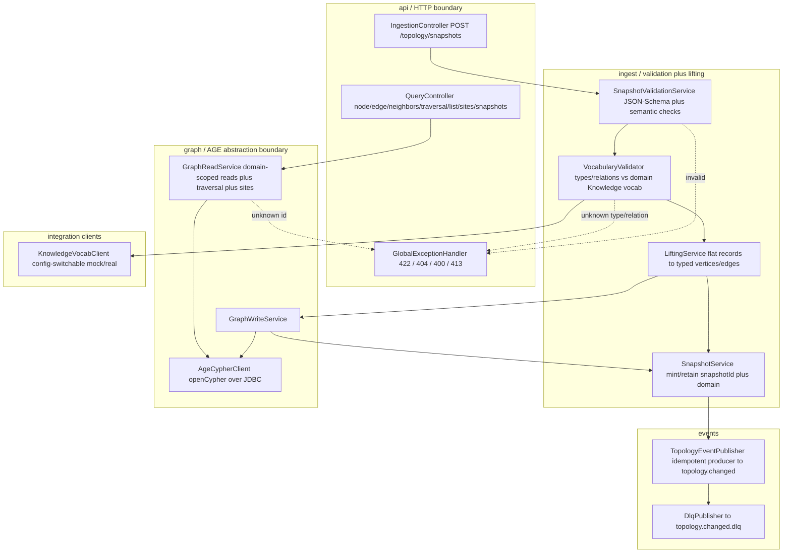
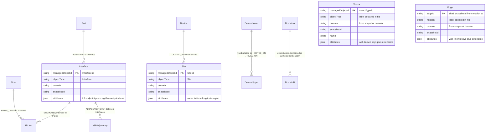
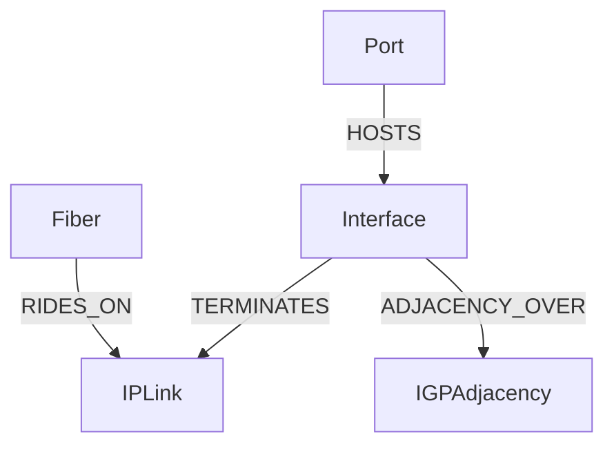
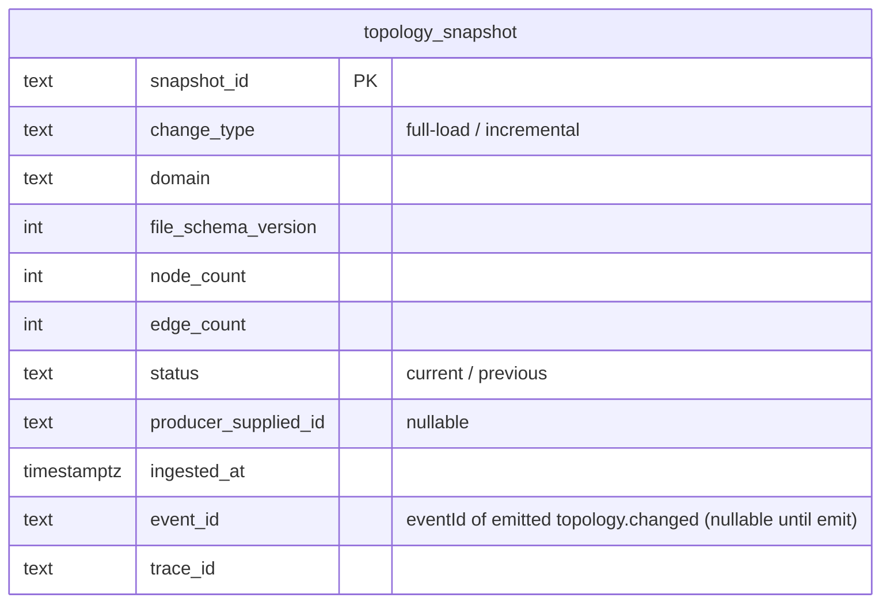
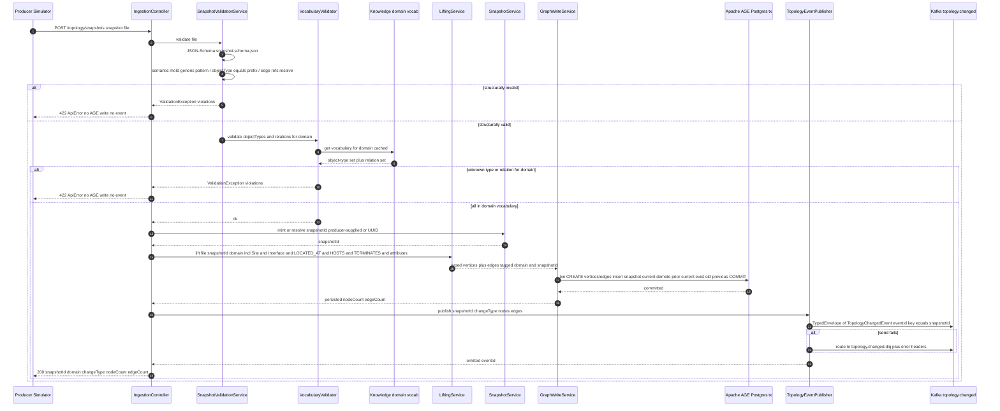
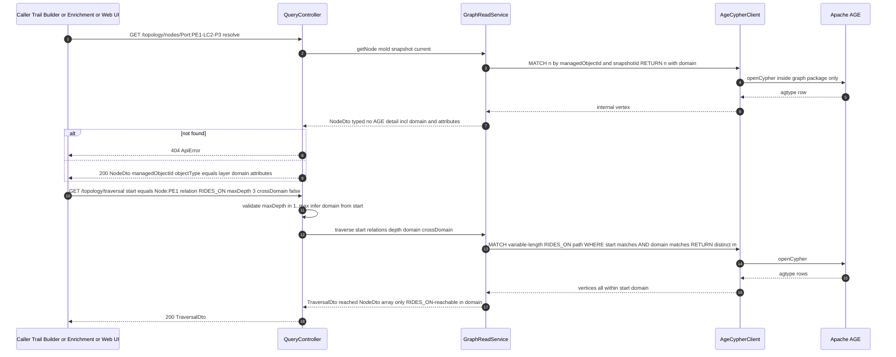
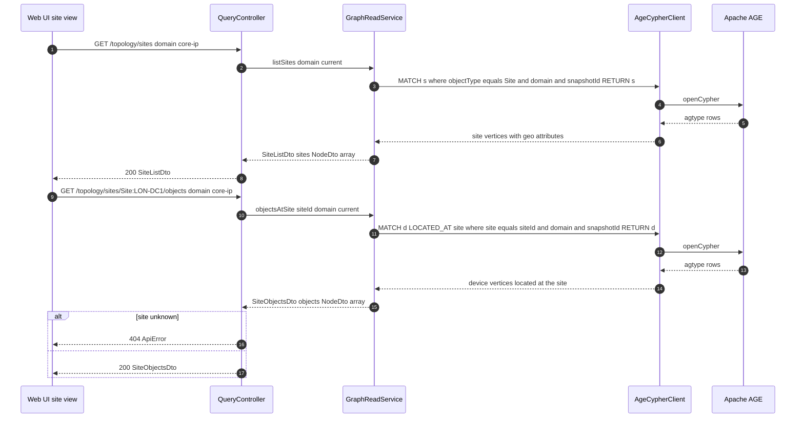
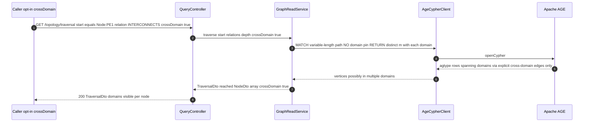
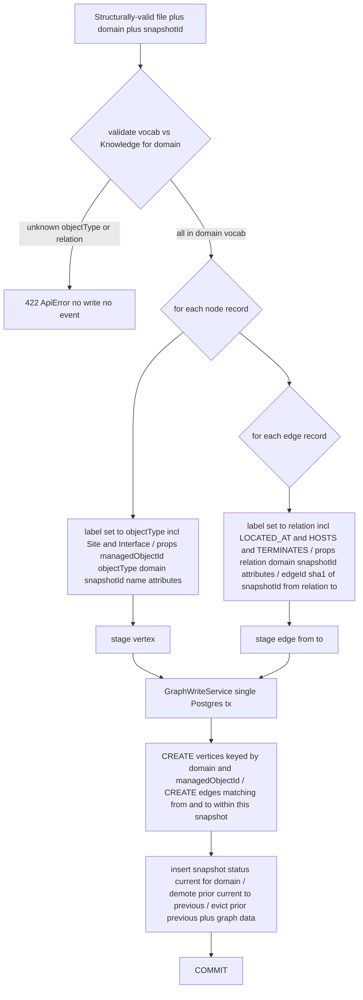
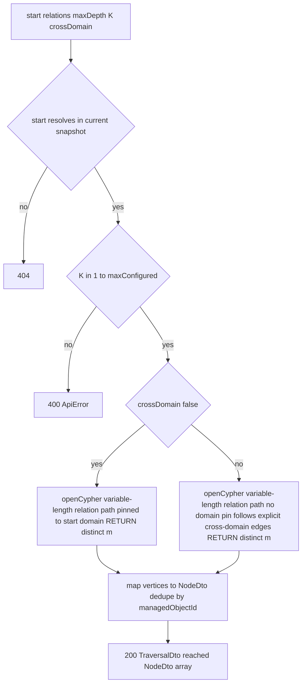

# topology — Design

Buildable design for the **Topology Service** — the sole owner of the network topology graph in
Apache AGE. Derived from the approved, merged `services/topology/spec.md` (PR #21) and
`docs/architecture.md` (inventory row, the updated **Invariants**, "Topology snapshot file &
ingestion API" — now including **Site** / **LOCATED_AT** / structured **attributes** —, "Domain
extensibility", and "Runtime phases"). Implements the spec's six Tasks and all acceptance criteria.

> **Domain-agnostic contract (multi-domain #81).** This design realizes the **merged multi-domain
> contract** in `architecture.md`. The `managedObjectId` scheme is the generic
> `^[A-Za-z][A-Za-z0-9]*:[^:]+$` (`<objectType>:<id>`); a domain's valid **object-type set** and
> **edge-relation vocabulary** are **authored in the Knowledge Service** (domain-scoped), **not
> frozen** in the event-model or this service. There is no global frozen vocabulary: the vertex
> labels are the `objectType`s and the edge labels are the `relation`s **declared in the conforming
> snapshot file**, **validated at ingest against the snapshot's `domain` vocabulary from Knowledge**.
> `Site` (geo) and `LOCATED_AT` are **domain-agnostic** object/edge types present in every domain.
> The Core IP set (Node/LineCard/Port/**Interface**/IPLink/IGPAdjacency/LSP/VPNService/FiberSpan/SRLG/Site +
> HOSTED_ON/**HOSTS**/**TERMINATES**/RIDES_ON/ADJACENCY_OVER/TRAVERSES/SERVES/MEMBER_OF/LOCATED_AT) is the
> **MVP domain's** vocabulary, **not a frozen global set**. **`Interface`** (the L3 endpoint on a
> `Port`) and its relations **`HOSTS`** (Port HOSTS Interface) / **`TERMINATES`** (Interface TERMINATES
> IPLink) — with `ADJACENCY_OVER` running between Interfaces — are part of that Core-IP Knowledge
> vocabulary (merged §5 Interface model, #91), **not** a frozen addition to this service.

> **Spec-vs-contract note (no new contract change).** The approved `spec.md` is worded for Core IP
> and lists a *fixed* nine object types / six relations and a Core-IP-anchored `managedObjectId`
> pattern. That predates the merged multi-domain contract (#81). **Where the spec's Core-IP-specific
> wording contradicts the merged contract, this design follows the contract** (domain-agnostic
> `managedObjectId`, Knowledge-authored per-domain vocabulary, Site/LOCATED_AT, structured
> attributes, domain isolation). Every spec acceptance criterion is still realized and mapped to a
> test below — the Core-IP set is exercised as the MVP domain's Knowledge vocabulary. This is a
> documented re-reading against an *already-merged* contract, **not a new contract change**: Site,
> LOCATED_AT, the `attributes` map, the domain-agnostic typing and the `domain` field are all
> already in `architecture.md`. No new topic/payload/field/OpenAPI surface is invented.

> **Contract status.** No contract change is introduced by this design. The emitted event binds to
> `com.acp.eventmodel.generated.TopologyChangedEvent` from `libs/event-model`; the ingestion/query
> HTTP surface is the one in the spec Contract section **plus the Site query operations already
> backed by the contract's "Topology query API supports listing sites and the objects located at a
> site"**; the topology-snapshot file schema (`services/topology/schema/snapshot.schema.json`) is the
> service-owned, contract-gated artifact (its **structure** is contract-gated; adding a domain's
> *types/relations* is Knowledge data, not a schema change). The design decides *how* (module layout,
> AGE persistence, lifting algorithm, traversal, domain isolation). (See "Design-stage notes".)

---

## Stack

| Concern | Choice | License |
|---|---|---|
| Language / runtime | **Java 17** (`eclipse-temurin:17-jdk`) | — |
| Framework | **Spring Boot 3.3.x** (Web MVC, Actuator, Validation) | Apache-2.0 |
| Build | **Gradle** (wrapper, matching `libs/event-model/java`) | Apache-2.0 |
| Event model | **`com.acp:event-model:0.1.0`** (frozen lib; `EventCodec`, `TypedEnvelope`, generated `TopologyChangedEvent`, `ManagedObjectId`) | repo-internal |
| Messaging | **Spring for Apache Kafka** (`spring-kafka`), idempotent producer | Apache-2.0 |
| Graph store | **Apache AGE** (Postgres extension) over **PostgreSQL 16**; openCypher via JDBC (PostgreSQL JDBC driver) | Apache-2.0 / BSD-2 |
| Migrations | **Flyway** (create AGE extension, graph, side-tables) | Apache-2.0 |
| JSON Schema validation | **`com.networknt:json-schema-validator` 1.4.x** (already used by event-model) — validates the snapshot file against `snapshot.schema.json` | Apache-2.0 |
| OpenAPI | **springdoc-openapi 2.x** (`/openapi.json` + Swagger UI); generated doc checked in at `services/topology/openapi.json` | Apache-2.0 |
| Metrics | **Micrometer + Prometheus** registry via Actuator | Apache-2.0 |
| Logging | Logback **JSON** encoder (`logstash-logback-encoder`) | Apache-2.0 / MIT |
| Tests | **JUnit 5** (unit/contract), **Testcontainers** (AGE/Postgres + Kafka) for integration; Awaitility for async event assertions | EPL-2.0 / MIT / Apache-2.0 |

All dependencies are permissive (Apache-2.0 / MIT / BSD / EPL-2.0). No GPL/AGPL.

---

## Task breakdown (from the spec)

Every spec Task is realized below; nothing is dropped or re-scoped.

| Spec task | Realized by (modules / flow) |
|---|---|
| **1. Validate and ingest a snapshot file** | `IngestionController.POST /topology/snapshots` → `SnapshotValidationService` (JSON-Schema validation against `snapshot.schema.json` + semantic checks + **`VocabularyValidator`** which checks every node `objectType` and every edge `relation` against the snapshot `domain`'s **Knowledge-authored vocabulary**) → on success `LiftingService` + `GraphWriteService` persist under a minted `snapshotId`. Schema-invalid or unknown-type/relation-for-the-domain ⇒ 422, **no AGE write**. (Key flow A; Error handling EH-1..EH-6, EH-6b.) |
| **2. Lift flat records into the typed multi-layer graph** | `LiftingService` maps each `nodes[]` record to a typed AGE vertex (label = `objectType`, `managedObjectId` + `domain` + `attributes` preserved as properties) and each `edges[]` record to a typed AGE edge (label = `relation`, `domain` + `attributes` preserved). **`Site` lifts like any typed node** (geo `attributes`: name/latitude/longitude/region); **`LOCATED_AT`** lifts like any typed edge (device LOCATED_AT Site). **`Interface` lifts like any typed node** (an L3 endpoint with its own `attributes`) and **`HOSTS`/`TERMINATES` lift like any typed edge** (Port HOSTS Interface, Interface TERMINATES IPLink) — no special-casing, exactly the generic typed-node/edge path. Fully domain-agnostic: types/relations come from the file and are validated against the domain's Knowledge vocabulary, not hard-coded business logic. (Key flow A; Algorithm flow §A.) |
| **3. Maintain snapshot versioning** | `SnapshotService` mints `snapshotId` (honours producer-supplied, else mints UUID-based), tags every vertex/edge with `snapshotId` **and `domain`**, records the snapshot in the `topology_snapshot` side-table (with its `domain`), and enforces **current + previous** retention (evicts older). (Key flow A; Data model.) |
| **4. Emit `topology.changed`** | `TopologyEventPublisher` builds a `TypedEnvelope<TopologyChangedEvent>` (envelope `eventId` = idempotency key) and produces to `topology.changed` via the idempotent Kafka producer; `changeType` ∈ {`full-load`,`incremental`}; emit failure ⇒ `topology.changed.dlq`. (Key flow A; Event handling.) |
| **5. Serve the query API** | `QueryController` exposes get-node, get-edge, neighbors, bounded traversal, resolve managedObjectId→object+layer, list-by-type, **list-sites, list-objects-at-site**, list-snapshots, current-snapshot → `GraphReadService` (openCypher reads) → typed DTOs. **All node/neighbor/traversal/list/site queries are domain-scoped** (carry or infer a single `domain`); a traversal crosses into another domain **only** via an explicit cross-domain edge **and** only when the caller opts in. (Key flow B; Algorithm flow §B, §C.) |
| **6. Manage the AGE abstraction boundary** | AGE access is confined to the `graph/` package (`AgeCypherClient`); no AGE credentials/endpoint/openCypher result leaks through any controller, DTO, env-exposed surface, or log line. Responses are typed DTOs only. (Error handling EH-9; AC-19.) |

---

## Phase applicability (design view)

Matches the canonical phase map (`architecture.md` → "Runtime phases") and the spec's Phase
applicability table.

| Phase | Active/Passive/Idle | Modules/handlers exercised | Inputs/Outputs |
|---|---|---|---|
| **P1 — Topology onboarding** | **Active** (primary phase) | `IngestionController`, `SnapshotValidationService`, **`VocabularyValidator` + `KnowledgeVocabClient`** (validate types/relations vs the domain's Knowledge vocabulary), `LiftingService` (incl. Site/LOCATED_AT/attributes/domain), `GraphWriteService`, `SnapshotService`, `TopologyEventPublisher`. Full ingest→validate-vocab→lift→persist→mint→emit pipeline. | **In:** topology snapshot file via `POST /topology/snapshots`; domain vocabulary read from Knowledge. **Out:** `topology.changed` (Kafka); `topology.changed.dlq` on emit failure. |
| **P2 — Pattern learning** | **Passive** | `QueryController` + `GraphReadService` only — **domain-scoped** get/neighbors/traversal/resolve/list + **sites** + snapshots. Ingestion + publisher + vocab client dormant (no new files expected, but endpoints remain available). | **In:** query API calls from Trail Builder / Codebook Generator / Enrichment / Web UI (each carrying/inferring a `domain`). **Out:** typed query responses. **No topic I/O.** |
| **P3 — Real-time correlation** | **Idle** | None on the critical path. Query API physically remains up but no real-time consumer queries it (topology context is already materialized into trails + codebook in P1). No handler is driven. | **In:** — . **Out:** — . |

Phase is a *runtime-mode* property, not a deploy switch: the same process serves all three; P2/P3
simply exercise fewer (or no) handlers. Tests assert per-phase behaviour (e.g. P1 emits exactly one
event; P3 drives no event).

---

## Module breakdown



| Package | Responsibility |
|---|---|
| `com.acp.topology.api` | REST controllers (`IngestionController`, `QueryController` incl. the **site** operations), request/response DTOs, `GlobalExceptionHandler` (maps validation/not-found to structured errors). |
| `com.acp.topology.ingest` | `SnapshotValidationService` (schema + structural/semantic validation), **`VocabularyValidator`** (validates each node `objectType` + edge `relation` against the snapshot `domain`'s Knowledge-authored vocabulary), `LiftingService` (record→typed-graph mapping incl. Site/LOCATED_AT + `domain` + `attributes`), `SnapshotService` (mint + retention). |
| `com.acp.topology.graph` | **AGE abstraction boundary.** `GraphWriteService`, `GraphReadService` (**domain-scoped** reads incl. bounded traversal, site queries, cross-domain opt-in), `AgeCypherClient` (the only class issuing openCypher). No AGE detail escapes this package. |
| `com.acp.topology.integration` | **`KnowledgeVocabClient`** — config-switchable client for the Knowledge Service's domain-vocabulary API (object-type set + relation vocabulary per `domain`); short-TTL cache; mock from Knowledge's OpenAPI in unit tests, real in integration. |
| `com.acp.topology.events` | `TopologyEventPublisher` (build `TypedEnvelope<TopologyChangedEvent>`, idempotent produce), `DlqPublisher`. |
| `com.acp.topology.config` | `@ConfigurationProperties` beans (Kafka, AGE/Postgres, limits, Knowledge integration toggles), idempotent Kafka producer config, JSON Schema loader. |
| `com.acp.topology.observability` | Health indicators (AGE reachable, Kafka reachable), Micrometer meters, MDC enrichment (`snapshotId`, `domain`, `traceId`). |

---

## Data model / DB schema

Topology lives in **Apache AGE** (a graph inside PostgreSQL). The graph is the system of record for
nodes/edges; two **relational side-tables** (in a separate schema) track snapshot versioning and the
producer-supplied id mapping. AGE internals are never exposed beyond the `graph/` package.

### Graph model (AGE)

One AGE graph named `topology` (**one graph, domain-tagged** — mirrors the existing
`snapshotId`-property isolation approach). **Vertex labels = the `objectType`s declared in the
conforming snapshot file**; **edge labels = the `relation`s declared in that file** — there is **no
frozen global vocabulary**. Both are **validated at ingest against the snapshot `domain`'s
Knowledge-authored object-type + relation vocabulary** (unknown type/relation for that domain ⇒ 422,
no write). Every vertex carries `managedObjectId`, `objectType`, **`domain`**, `snapshotId`, `name?`,
and **`attributes`** (the structured properties map). Every edge carries `relation`, **`domain`**,
`snapshotId`, and **`attributes`**. **`Site`** is a vertex label like any other (geo attributes);
**`LOCATED_AT`** is an edge relation like any other (device LOCATED_AT Site). Both are
**domain-agnostic** — present in every domain's Knowledge vocabulary.



The Core-IP layering the Interface model adds reads **Port HOSTS Interface TERMINATES IPLink**, with
**ADJACENCY_OVER** running **between Interfaces** (and `Fiber RIDES_ON IPLink` unchanged):



> The diagram is illustrative. The service is **domain-agnostic** — it persists whatever typed
> nodes/edges the conforming file declares, in any valid `from`/`to` arrangement, **provided each
> `objectType` and `relation` is in the snapshot `domain`'s Knowledge vocabulary**. It does **not**
> hard-code which relation may connect which layer, and it does **not** treat any fixed list as the
> complete vocabulary. The Core IP set
> (Node/LineCard/Port/**Interface**/IPLink/IGPAdjacency/LSP/VPNService/FiberSpan/SRLG/**Site** +
> HOSTED_ON/**HOSTS**/**TERMINATES**/RIDES_ON/ADJACENCY_OVER/TRAVERSES/SERVES/MEMBER_OF/**LOCATED_AT**)
> is the **MVP domain's** Knowledge-authored vocabulary, not a frozen global set. **`Interface`** and
> its relations **`HOSTS`** (Port HOSTS Interface) and **`TERMINATES`** (Interface TERMINATES IPLink)
> are just more members of that Core-IP vocabulary — Topology persists and validates them through the
> same generic typed-node/edge path, with **no Interface-specific code** (it does not encode that a
> Port HOSTS an Interface or that an Interface TERMINATES an IPLink; that layering is the file plus the
> domain vocabulary, not service logic).

**Vertex properties (all labels):** `managedObjectId` (string, unique within a snapshot+domain),
`objectType` (string, = label), **`domain`** (string), `snapshotId` (string), `name` (string,
optional), **`attributes`** (map → stored as agtype/JSON; carries the well-known device keys — see
"Structured attributes"). **Edge properties (all labels):** `relation` (string, = label),
**`domain`** (string), `snapshotId` (string), **`attributes`** (map; carries the well-known
connection keys). The application also stamps a synthetic `edgeId` (deterministic
`sha1(snapshotId|from|relation|to)`) property so `GET /topology/edges/{edgeId}` is addressable
without leaking AGE's internal vertex/edge ids.

**Structured attributes (stored verbatim, returned in queries).** The `attributes` map carries
the contract's **well-known, extensible keys** — on devices: `vendor`, `model`, `equipmentType`,
`role`, `capacity`; on connections: `linkType`, `capacity`, `protectionRole`; on `Site` nodes:
`name`, `latitude`, `longitude`, `region`. Topology **stores them verbatim and returns them
unchanged** in every node/edge query response, so downstream consumers (Noise Filter, Trail Builder,
Codebook Generator) can read them. Topology performs **no validation of attribute *values*** — value
cataloguing/validation is a Knowledge concern; Topology only stores and serves. The map is open (a
domain may add keys).

**Domain isolation.** `domain` is a **first-class property on every vertex and edge** (taken from
the snapshot file's `domain`). **All queries are domain-scoped by default**: a node/neighbor/
traversal/list/site query operates within a single `domain` (the query carries the `domain` or
infers it from the start `managedObjectId`'s stored `domain`), so a single-domain traversal **never
wanders into another domain**. **Cross-domain** is supported only via **explicit cross-domain edges**
— an edge whose `from`/`to` objects are in different domains, authored deliberately in the snapshot
file; a traversal crosses domains **only** when the caller explicitly opts in (`crossDomain=true`).
The MVP builds and tests **single-domain Core IP**; the property-tag structure supports cross-domain
later with no schema change (see Design alternatives).

**Indexes** (btree on AGE's underlying property tables, created by Flyway via AGE property-index DDL):
`(domain, snapshotId, managedObjectId)` for resolve/get-node; `(domain, snapshotId, objectType)` for
list-by-type and **list-sites** (`objectType='Site'`); edge `(domain, snapshotId, edgeId)` for
get-edge. The leading `domain` column makes domain-scoped reads index-efficient.

### Relational side-tables (schema `topology_meta`)



- `topology_snapshot` — one row per ingest; `domain` is recorded per row (taken from the snapshot
  file). Constrained **per domain** to **at most one `current`** and **at most one `previous`**
  (partial unique index on `(domain, status)` where `status in (current, previous)`); on a new
  ingest **for that domain** the prior `current` is demoted to `previous`, and the prior `previous`
  row + its graph data (the vertices/edges with that `snapshotId`) are evicted (retention = current +
  previous **per domain**, per Task 3 / AC-14). A re-ingest **always** inserts a new row with a new
  `snapshot_id`, even if content is identical (AC-14). The MVP runs a single domain (`core-ip`); the
  per-domain scoping is what lets a future second domain version independently without disturbing
  Core IP's snapshots.
- No alarm/incident/template data here — out of scope. No AGE credentials in any row.

**Atomicity:** graph writes and the side-table insert/demote/evict run in **one Postgres
transaction** (AGE is in the same Postgres) — a failure leaves no partial snapshot (EH-10).

**Why a side-table (not "just the graph"):** snapshot status/retention and producer-vs-minted id
mapping are cheap relational, indexed, transactional concerns; keeping them out of the graph avoids
extra openCypher and gives an indexed source for `GET /topology/snapshots` (see Design alternatives).

---

## Event handling

- **Consumers:** **none.** The Topology Service subscribes to no Kafka topic (spec: ingestion is
  file/API only). There is therefore no inbound idempotency/dedupe concern and no inbound DLQ.

- **Producers:**

  | Topic | Payload (from `libs/event-model`) | When | Key | Idempotency / failure |
  |---|---|---|---|---|
  | `topology.changed` | `TopologyChangedEvent` (`snapshotId`, `changeType`, `nodes[]`, `edges[]`) in `TypedEnvelope` (`eventId`,`type=TopologyChangedEvent`,`schemaVersion=1`,`occurredAt`,`source=topology`,`traceId`,`payload`) | after every successful ingest+persist | envelope `eventId` (UUID) = idempotency key; Kafka message key = `snapshotId` | Producer idempotent (`enable.idempotence=true`, `acks=all`, `max.in.flight<=5`, retries). On unrecoverable send failure → `topology.changed.dlq`. |
  | `topology.changed.dlq` | the same envelope JSON + failure metadata headers (`x-error`, `x-original-topic`, `x-trace-id`) | when the `topology.changed` send ultimately fails | — | terminal; logged ERROR with `snapshotId`/`traceId`. |

  **Dedupe semantics (spec-aligned):** Kafka is at-least-once, so a single emitted event may be
  *delivered* more than once; consumers dedupe on `eventId`. A **re-ingest** of identical content is
  a *new* ingest → new `snapshotId` → new `eventId` → a new event (not a duplicate). The dedupe
  guarantee is per-delivery of a given `eventId`, not per-ingest-operation (AC-14, AC-15).

  **`changeType` rule:** the **first** successful ingest into an empty graph emits `full-load`
  (AC-15). Subsequent ingests emit `full-load` for a complete replacement and `incremental` for a
  partial update; the value is **never** outside `{full-load, incremental}` (AC-16) — `delete` is
  not emitted in the MVP. (How a file signals full vs. incremental: see "Design-stage notes".)

The publisher uses `EventCodec.serialize(TypedEnvelope<TopologyChangedEvent>)` from the frozen lib,
so the wire payload is exactly the frozen binding (AC-15, AC-17).

---

## API contracts / API schema

OpenAPI 3.1 is generated by **springdoc** from the annotated controllers/DTOs and served at
`/openapi.json` (+ Swagger UI). The generated document is **checked in** at
`services/topology/openapi.json` and is the single source of truth for the HTTP surface; a
**contract test** (AC-18) validates live responses against the checked-in document, so the
implementation cannot drift. A change to this surface is a contract change (architecture.md/spec +
human approval).

All error responses use one structured shape:

```jsonc
// ApiError
{ "status": 422, "error": "UNPROCESSABLE_ENTITY",
  "message": "snapshot file failed validation",
  "violations": [ { "path": "$.nodes[3].managedObjectId", "rule": "pattern",
                    "detail": "does not match the generic objectType:id scheme" },
                  { "path": "$.edges[5].relation", "rule": "domain-vocabulary",
                    "detail": "relation FOO not in domain core-ip vocabulary" } ],
  "traceId": "..." }
```

### Ingestion API

**`POST /topology/snapshots`** — `Content-Type: application/json` (the snapshot file body). Optional
`?changeType=full-load|incremental` hint; defaults per the replacement convention (Design-stage notes).

Request body = the **topology-snapshot file**, validated against
`services/topology/schema/snapshot.schema.json` (structural) **and** against the snapshot `domain`'s
Knowledge-authored object-type + relation vocabulary (semantic). The `managedObjectId` uses the
**domain-agnostic generic scheme** `^[A-Za-z][A-Za-z0-9]*:[^:]+$`. Shape:

```jsonc
{
  "schemaVersion": 1,                 // integer, required (topology-file schema version)
  "snapshotId": "SNAP-...",           // string, optional (producer-supplied; else minted)
  "domain": "core-ip",                // string, required — selects the Knowledge vocabulary to validate against
  "nodes": [                          // array, required
    { "managedObjectId": "Node:PE1",  // required, generic pattern ^[A-Za-z][A-Za-z0-9]*:[^:]+$
      "objectType": "Node",           // required, equals the prefix; must be in the domain's Knowledge object-type set
      "name": "PE1",                  // optional
      "attributes": {                 // optional, structured + extensible; stored verbatim, returned in queries
        "vendor": "acme", "model": "X9", "equipmentType": "router",
        "role": "PE", "capacity": "400G" } },
    { "managedObjectId": "Interface:PE1-LC2-P3-100",  // Core-IP L3 endpoint hosted on a Port
      "objectType": "Interface",      // must be in the domain's Knowledge object-type set
      "name": "ge-0/0/3.100",
      "attributes": { "ipAddress": "10.0.0.1", "adminState": "up" } },
    { "managedObjectId": "Site:LON-DC1",   // Site is a domain-agnostic object type
      "objectType": "Site",
      "name": "London DC1",
      "attributes": { "latitude": 51.5, "longitude": -0.12, "region": "EU-West" } }
  ],
  "edges": [                          // array, required
    { "from": "Port:PE1-LC2-P3",      // required, references a node in nodes[]
      "to": "Node:PE1",               // required, references a node in nodes[]
      "relation": "HOSTED_ON",        // required, must be in the domain's Knowledge relation vocabulary
      "attributes": { "linkType": "internal" } },
    { "from": "Port:PE1-LC2-P3", "to": "Interface:PE1-LC2-P3-100",
      "relation": "HOSTS",            // Core-IP: Port HOSTS Interface (L3 endpoint on the port)
      "attributes": { } },
    { "from": "Interface:PE1-LC2-P3-100", "to": "IPLink:PE1-PE2-1",
      "relation": "TERMINATES",       // Core-IP: Interface TERMINATES IPLink (links are between interfaces)
      "attributes": { } },
    { "from": "Node:PE1", "to": "Site:LON-DC1",
      "relation": "LOCATED_AT",       // domain-agnostic placement relation (device LOCATED_AT Site)
      "attributes": { } }
  ]
}
```

Responses:

| Status | When | Body |
|---|---|---|
| **200** | accepted, lifted, persisted, event emitted | `{ "snapshotId": "...", "domain": "core-ip", "changeType": "full-load", "nodeCount": N, "edgeCount": M, "status": "current" }` |
| **422** | schema-invalid or semantic-invalid (missing required field; bad generic `managedObjectId` pattern; `objectType` ≠ prefix; dangling edge ref; **`objectType` not in the domain's Knowledge object-type set**; **`relation` not in the domain's Knowledge relation vocabulary**) | `ApiError` with `violations[]`; **no AGE write, no event** |
| **413** | body exceeds `topology.ingest.max-file-bytes` | `ApiError` |
| **415** | non-JSON content type | `ApiError` |
| **502** | Knowledge vocabulary unavailable for the `domain` (and no cached vocabulary) — cannot validate | `ApiError`; **no AGE write, no event** (fail closed; see Error handling EH-6c) |
| **500** | persistence/transaction failure (AGE down mid-write) | `ApiError`; transaction rolled back → no partial snapshot |

### Query API (read-only; typed DTOs only — never AGE structures; **domain-scoped**)

Every node/neighbor/traversal/list/site query is **scoped to a single `domain`** — supplied as
`?domain=` or inferred from the start object's stored `domain`. `NodeDto`/`EdgeDto` carry `domain`
and the `attributes` map (returned verbatim).

| Operation | Method + path | Response (200) | Errors |
|---|---|---|---|
| Resolve / get node + layer | `GET /topology/nodes/{managedObjectId}` | `NodeDto { managedObjectId, objectType (layer), domain, name?, attributes, snapshotId }` | 404 unknown id; 400 malformed id |
| Get edge | `GET /topology/edges/{edgeId}` | `EdgeDto { edgeId, from, to, relation, domain, attributes, snapshotId }` | 404 unknown |
| Neighbors | `GET /topology/nodes/{managedObjectId}/neighbors?relation=RIDES_ON` (relation optional, repeatable; domain inferred from start) | `NeighborsDto { managedObjectId, domain, neighbors: [ { node: NodeDto, via: EdgeDto } ] }` (same-domain only unless `crossDomain=true`) | 404 unknown start |
| Bounded traversal | `GET /topology/traversal?start={moId}&relation=RIDES_ON&relation=...&maxDepth=K&crossDomain=false` | `TraversalDto { start, domain, relations[], maxDepth, crossDomain, reached: NodeDto[] }` | 400 missing start/relation/maxDepth or maxDepth out of `[1..max]`; 404 unknown start |
| List by type | `GET /topology/nodes?objectType=Port&domain=core-ip&snapshotId=current` | `NodeListDto { domain, objectType?, snapshotId, count, nodes: NodeDto[] }` | 400 unknown objectType |
| **List sites** | `GET /topology/sites?domain=core-ip&snapshotId=current` | `SiteListDto { domain, snapshotId, count, sites: NodeDto[] }` (each `objectType=Site` with geo attributes) | 400 unknown domain |
| **List objects at a site** | `GET /topology/sites/{siteId}/objects?domain=core-ip` | `SiteObjectsDto { siteId, domain, snapshotId, count, objects: NodeDto[] }` (objects with a `LOCATED_AT` edge to the site) | 404 unknown site |
| List snapshots | `GET /topology/snapshots?domain=core-ip` | `SnapshotListDto { snapshots: [ { snapshotId, domain, changeType, status, nodeCount, edgeCount, ingestedAt } ] }` (>= current + previous per domain) | — |
| Current snapshot | `GET /topology/snapshots/current?domain=core-ip` | `SnapshotSummaryDto { snapshotId, domain, changeType, nodeCount, edgeCount, ingestedAt }` | 404 if no snapshot yet for that domain |

`managedObjectId` resolution (spec Task 5) is satisfied by `GET /topology/nodes/{managedObjectId}`,
which returns the object **and its layer** (`objectType`) **and its `domain`**. Queries default to
the **current** snapshot (`?snapshotId=current|previous`) and to a single `domain` (explicit or
inferred). The **site** operations back the web-ui's site-level visualization (list sites, then
expand a site into its device-level graph). `{siteId}` is a `managedObjectId` of `objectType=Site`.

**Interface-aware queries (no new endpoints — Interface is just another typed object).** Because
`Interface`, `HOSTS` and `TERMINATES` are ordinary typed vertices/edges, the existing operations
already serve them: `GET /topology/nodes?objectType=Interface&domain=core-ip` lists interfaces;
`GET /topology/nodes/{Interface:id}` resolves one (returning `objectType=Interface` as its layer);
`GET /topology/nodes/{Port:id}/neighbors?relation=HOSTS` returns the interfaces on a port;
`GET /topology/nodes/{Interface:id}/neighbors?relation=TERMINATES` returns the IPLink an interface
terminates; and a bounded traversal `start=Port:...&relation=HOSTS&relation=TERMINATES&maxDepth=2`
walks Port→Interface→IPLink. No interface-specific operation is added — these are the generic
node/neighbor/traversal/list calls with Interface-typed labels.

---

## Integration points (mock vs. real)

The Topology Service is primarily a **server**, not a client.

| Direction | Collaborator + operation | Config key(s) | mock vs real |
|---|---|---|---|
| **Inbound (server)** | Producers (Simulator) call `POST /topology/snapshots`; consumers (Trail Builder, Codebook Generator, Enrichment, Web UI) call the query API (incl. the **site** operations). They build clients from **this service's** published `openapi.json`. | n/a (we publish; they consume) | n/a |
| **Outbound (required) — Knowledge domain vocabulary** | **Knowledge Service** — fetch the **object-type set + edge-relation vocabulary** for a `domain` (used by `VocabularyValidator` at ingest to accept/reject node `objectType`s and edge `relation`s). `KnowledgeVocabClient` caches the vocabulary with a short TTL; refreshes on miss/expiry. **This is now an active MVP integration point** (de-frozen vocabulary). | `topology.knowledge.base-url`, `topology.knowledge.mode=mock|real`, `topology.knowledge.vocab-ttl-seconds`, `topology.knowledge.vocab-path` | **mock** = WireMock/Prism stub **generated from Knowledge's published OpenAPI** (unit tests, isolated); **real** = live Knowledge on the integration Compose network. No hard-coded URL. |
| **Outbound (infra)** | Kafka broker; AGE/Postgres | `topology.kafka.bootstrap-servers`; `topology.age.jdbc-url` / `.username` / `.password` (secret) | real in all envs; Testcontainers in integration tests; embedded/mock in unit tests. |

The vocabulary is **not** frozen in this service: each domain's object-type set + relation
vocabulary is **authored in Knowledge** and fetched per `domain` at ingest. Knowledge's
domain-vocabulary API shape is **design-stage on Knowledge's side**; this service builds its
`KnowledgeVocabClient` and the unit-test mock against Knowledge's **published OpenAPI** (the
contract), never against Knowledge's source — honouring the configurable-integration-point and
no-cross-service-coupling invariants. The Core IP vocabulary
(Node/LineCard/Port/IPLink/IGPAdjacency/LSP/VPNService/FiberSpan/SRLG/Site +
HOSTED_ON/RIDES_ON/ADJACENCY_OVER/TRAVERSES/SERVES/MEMBER_OF/LOCATED_AT) is just the MVP domain's
authored data, used as the mock fixture in unit tests.

---

## Key flows (sequence / data-flow diagrams)

### Flow A — Ingestion: file → validate → lift → AGE persist → mint snapshotId → emit `topology.changed` (P1)



### Flow B — Query: domain-scoped bounded traversal / managedObjectId resolution (P2)



The traversal openCypher pins `domain` on every matched vertex (`WHERE all nodes share start
domain`) unless `crossDomain=true`, so a single-domain traversal cannot escape its domain even where
an explicit cross-domain edge exists. With `crossDomain=true` the domain pin is dropped and the
traversal may follow cross-domain edges (see Flow D).

### Flow C — Site queries: list sites / list objects located at a site (P1 and P2)



### Flow D — Cross-domain edge traversal (opt-in; MVP single-domain, structure-ready)



Cross-domain reach is possible **only** because an explicit cross-domain edge was authored in a
snapshot file. The MVP ingests and tests one domain (`core-ip`) only, so by default no cross-domain
edge exists and `crossDomain=true` returns the same single-domain result; the path is designed and
tested for the structure, not exercised in MVP data.

---

## Algorithm logical flow

### §A — Lifting rules (flat records → typed domain-tagged graph, incl. vocab validation + Site)

Inputs: the structurally-valid snapshot file, its `domain`, the resolved `snapshotId`, and the
**domain's Knowledge-authored vocabulary** (object-type set + relation set). Parameters: **none
hard-coded** — the vocabulary is Knowledge data per `domain`; the file declares the instances.
Output: typed, domain-tagged AGE vertices + edges (including `Site` nodes and `LOCATED_AT` edges
when present).



Decision rules:
- **Vocabulary is Knowledge-driven, not frozen:** before lifting, `VocabularyValidator` checks every
  node `objectType` and every edge `relation` against the snapshot `domain`'s Knowledge vocabulary;
  an unknown type/relation for that domain ⇒ 422, no write (AC-7, AC-7b, EH-6b).
- **Label selection is data-driven**, not a `switch` over Core-IP semantics: vertex label = the
  record's `objectType` (incl. `Site`); edge label = the record's `relation` (incl. `LOCATED_AT`).
  New domains add no code (domain-agnostic invariant, AC-10).
- **`(domain, managedObjectId)` is the natural key** within a snapshot; vertices are matched by
  `(domain, snapshotId, managedObjectId)` so edges link the correct snapshot's vertices and never
  bleed across snapshots or domains.
- **`Site` + `LOCATED_AT` lift identically** to any other typed node/edge — no special-casing in
  code; they are just (domain-agnostic) members of the domain's vocabulary, with `Site` carrying geo
  `attributes` and `LOCATED_AT` connecting a device to its `Site`.
- **`Interface` + `HOSTS` + `TERMINATES` lift identically** too — an `Interface` is staged as a typed
  vertex (label `Interface`, its own `attributes`) and `HOSTS`/`TERMINATES` as typed edges, exactly
  like any other Core-IP type/relation. The Port→Interface→IPLink layering and `ADJACENCY_OVER`
  between interfaces emerge purely from the file's `from`/`to` plus the domain vocabulary; the lifter
  encodes **no** Interface semantics. New protocol-adjacency layers (BGP/OSPF) would arrive the same
  way — added to the Knowledge vocabulary, lifted with no code change.
- **Attributes stored verbatim:** the node/edge `attributes` map (well-known + extensible keys) is
  persisted unchanged and returned in queries; no attribute-value validation here (AC-20).
- **All-or-nothing:** validation (schema + vocab) runs to completion *before* any write; the write is
  one transaction → invalid files never produce a partial graph (AC-3..AC-7b, EH-1..EH-6b, EH-10).

### §B — Domain-scoped bounded traversal by edge type(s)

Inputs: `start` managedObjectId, a non-empty set of relations, `maxDepth K` (1..configured max), the
`domain` inferred from `start`, and a `crossDomain` flag (default `false`). Output: the set of nodes
reachable from `start` using **only** the named relation labels within K hops, **within the start's
domain** unless `crossDomain=true` (and no node reachable solely via other relations).



The relation label set is injected into the variable-length pattern so only the requested edge
types are traversed (AC-11). When `crossDomain=false` (default) the pattern also pins every matched
vertex to the start's `domain`, so the traversal **cannot wander into another domain** even if an
explicit cross-domain edge exists (AC-21). `maxDepth` is bounded by `topology.traversal.max-depth`
(config, not hard-coded) to keep traversal cost finite.

### §C — Site queries (list sites / objects located at a site)

Inputs: `domain` (and optionally `siteId`), the current snapshot. Output: the domain's `Site` nodes,
or the devices with a `LOCATED_AT` edge to a given site.

- **List sites:** match vertices where `objectType='Site'` AND `domain=<domain>` AND
  `snapshotId=<current>`; return each as a `NodeDto` with its geo `attributes` (AC-22).
- **Objects at a site:** match `(d)-[:LOCATED_AT]->(s)` where `s.managedObjectId=<siteId>` AND
  `s.domain=<domain>` AND snapshot current; return the `d` devices as `NodeDto[]` (AC-22). Unknown
  site ⇒ 404. Both are domain-scoped.

---

## Seed data & examples

**N/A — why.** Topology is a backend graph service; it does **not** generate topology data (spec
Out-of-scope). The topology *file* it ingests is produced by the **Simulator** and validated against
this service's `snapshot.schema.json`. The service ships **test fixtures only** — small conforming
and deliberately-malformed snapshot files used by the unit/contract tests
(`src/test/resources/snapshots/*.json`): e.g. `valid-min.json`,
`valid-all-core-ip-types.json` (the MVP domain's full vocabulary incl. `Site` + `LOCATED_AT` and
`Interface` + `HOSTS` + `TERMINATES`),
`with-interfaces.json` (Port HOSTS Interface TERMINATES IPLink with `ADJACENCY_OVER` between
interfaces), `with-sites.json` (devices LOCATED_AT sites with geo attributes), `with-attributes.json` (well-known
device/connection attribute keys), `missing-domain.json`, `bad-moid-pattern.json`,
`objecttype-mismatch.json`, `dangling-edge.json`, `unknown-objecttype-for-domain.json`,
`unknown-relation-for-domain.json`, `cross-domain-edge.json` (an explicit cross-domain edge, for the
isolation tests), `riding-chain.json` (for traversal). A Knowledge-vocabulary **mock fixture**
(generated from Knowledge's published OpenAPI) supplies the `core-ip` object-type + relation sets to
unit tests. These are test fixtures, not seed data the service emits or persists.

---

## UI wireframes

**N/A — why.** Topology has **no UI**; it is a backend graph service. Topology/trail visualization
is owned by **web-ui** (Angular 20), which consumes this service's query API. The only human-facing
HTML surface is the auto-generated Swagger UI for the OpenAPI doc (developer aid, not a product UI).

---

## Error handling

First-class. Every failure mode has a defined outcome; nothing silently drops.

| # | Failure mode | Handling | Caller sees | Logged | Side effects |
|---|---|---|---|---|---|
| EH-1 | Non-conforming file (JSON-Schema fails) | reject in `SnapshotValidationService` before any write | **422** `ApiError` + `violations[]` | WARN with violations, `traceId` | **none** — no AGE write, **no event** (AC-3) |
| EH-2 | Missing required top-level field (`schemaVersion`/`domain`/`nodes`) | schema validation 422 | 422 | WARN | none (AC-3) |
| EH-3 | `managedObjectId` generic-pattern violation (`^[A-Za-z][A-Za-z0-9]*:[^:]+$`) | semantic check (mirrors `ManagedObjectId.PATTERN`) | 422 | WARN with offending path | none (AC-4) |
| EH-4 | `objectType` inconsistent with id prefix | semantic check | 422 | WARN | none (AC-5) |
| EH-5 | Dangling edge `from`/`to` (not in `nodes[]`) | semantic check | 422 | WARN | none (AC-6) |
| EH-6 | Unknown edge `relation` **for the snapshot's `domain`** (not in the domain's Knowledge relation vocabulary) | `VocabularyValidator` vs Knowledge vocab | 422 | WARN with offending path + domain | none (AC-7) |
| EH-6b | Unknown node `objectType` **for the snapshot's `domain`** (not in the domain's Knowledge object-type set) | `VocabularyValidator` vs Knowledge vocab | **422** | WARN with offending path + domain | **none** — no AGE write, **no event** (AC-7b) |
| EH-6c | Knowledge domain-vocabulary unavailable (and no cached vocab for the domain) | **fail closed** — cannot validate ⇒ reject; `KnowledgeVocabClient` retries with backoff, serves a non-expired cached vocab if present | **502** `ApiError` | ERROR with domain, `traceId` | **none** — no AGE write, **no event** |
| EH-7 | Body too large | `topology.ingest.max-file-bytes` guard | **413** | WARN | none |
| EH-8 | `topology.changed` send ultimately fails | `DlqPublisher` → `topology.changed.dlq` (envelope + error headers) | ingest already 200 (persist succeeded); failure is async | ERROR with `snapshotId`,`traceId` | snapshot persisted; event on DLQ for replay |
| EH-9 | AGE abstraction leak attempt | AGE access confined to `graph/`; controllers/DTOs/logs never carry connection string, port, or raw agtype | typed DTOs only | n/a | none (AC-19) |
| EH-10 | AGE/Postgres down mid-write | transaction rolls back | **500** `ApiError` | ERROR | **no partial snapshot** (atomic tx) |
| EH-11 | AGE/Postgres or Kafka unreachable at startup | readiness probe DOWN; not ready until reachable | 503 from probe | ERROR | service does not accept ingests until ready |
| EH-12 | Unknown `managedObjectId` on query | `GraphReadService` returns empty → 404 | **404** `ApiError` | INFO | none (AC-12) |
| EH-13 | `maxDepth` out of range / missing `start`/`relation` on traversal | request validation | **400** `ApiError` | WARN | none |
| EH-14 | Re-ingest of identical content | **not** treated as a duplicate — new `snapshotId`, new `eventId`, new event | 200 with new `snapshotId` | INFO | new snapshot; prior becomes previous (AC-14) |
| EH-15 | Consumed event with `schemaVersion` major >= 2 | n/a — **this service consumes no topic**; the event-model reject policy applies only to consumers. Producer always emits `schemaVersion=1`. | n/a | n/a | none |

`changeType` is constrained at the publisher (enum-checked in code) to `{full-load, incremental}`
so `delete` can never be emitted (AC-16), even though the frozen event-model schema leaves it a
free-form string.

---

## Design alternatives

| Consideration | Alternatives considered | Chosen + rationale |
|---|---|---|
| AGE access layer | (a) raw JDBC + openCypher in `AgeCypherClient`; (b) a third-party AGE ORM/driver; (c) Spring Data Neo4j | **(a)**. AGE is a Postgres extension queried via `cypher(...)` over the PostgreSQL JDBC driver; mature, permissive AGE-native ORMs are scarce. Raw JDBC keeps deps permissive, keeps the abstraction boundary in one class, and avoids coupling to a graph ORM. Neo4j tooling targets a different store. |
| Snapshot isolation in the graph | (a) **`snapshotId` property on every vertex/edge** in one graph; (b) a separate AGE graph per snapshot; (c) a separate Postgres schema per snapshot | **(a)**. With retention = current+previous, a property tag is simplest, lets traversal scope by `snapshotId`, and makes eviction a `DELETE … WHERE snapshotId=<old previous>`. Per-graph (b) multiplies DDL; (c) is heavy for two versions. |
| **Domain isolation** | (a) **`domain` property on every vertex/edge in ONE AGE graph, domain-tagged** (queries domain-scoped by default; cross-domain only via explicit cross-domain edges + opt-in); (b) a separate AGE graph per domain; (c) a separate Postgres schema per domain | **(a) — chosen.** A property tag exactly mirrors the proven `snapshotId`-property isolation approach: it is the **simplest** (no extra DDL, one graph), it makes every query domain-scoped with a `WHERE domain=…` predicate (index-backed), and — critically — it **supports cross-domain** out of the box, since an explicit cross-domain edge can connect two domain-tagged vertices and a `crossDomain=true` traversal simply drops the domain pin. A graph-per-domain (b) or schema-per-domain (c) would **hard-partition** the store, multiplying DDL/migrations and making the contract's intended cross-domain edges impossible (or requiring cross-graph joins AGE does not support cleanly). MVP runs single-domain Core IP; the property tag is structure-ready for more domains with no schema change. |
| **Object-type / relation vocabulary** | (a) **de-frozen, Knowledge-authored per `domain`, validated at ingest** via `KnowledgeVocabClient`; (b) frozen hard-coded set in this service / the file schema; (c) accept any token with no validation | **(a) — chosen, per merged contract #81.** The contract makes each domain's vocabulary Knowledge data so a new domain needs no event-model or topology code change; Topology validates ingest against it (fail closed if unavailable). (b) is exactly the old frozen framing this update removes — it would block multi-domain and contradict the merged invariant. (c) loses the spec's reject-unknown-relation guarantee (AC-7) and would let typos pollute the graph. A short-TTL cache keeps the dependency cheap. |
| Snapshot versioning bookkeeping | (a) **relational side-table `topology_snapshot`**; (b) snapshot metadata as graph vertices; (c) infer from distinct `snapshotId` in the graph | **(a)**. Status/retention/producer-id mapping are relational, indexed, transactional concerns; co-locating with the graph write in one Postgres tx gives atomicity (EH-10) and a cheap `GET /topology/snapshots` without graph scans. |
| Snapshot validation | (a) **JSON-Schema (`networknt`) for structural + code for semantic** (refs / objectType-prefix); (b) all-in-bean-validation; (c) all-in-code | **(a)**. The structural contract already lives in `snapshot.schema.json` (the owned contract) — validate against it directly so the file schema is the source of truth; cross-record semantics (dangling refs, `objectType`==prefix) aren't expressible in plain JSON-Schema, so a thin semantic pass follows. `networknt` is already a repo dependency. |
| `changeType` derivation | (a) **explicit query hint, default full-load (first ingest always full-load)**; (b) diff current vs incoming graph to auto-classify | **(a)**. MVP only distinguishes full-load vs incremental and the spec freezes the convention; auto-diff (b) is costly and unnecessary pre-`delete`. Recorded as a design decision (see notes). |
| `edgeId` for `GET /edges/{edgeId}` | (a) **deterministic synthetic `edgeId` = sha1(snapshotId\|from\|relation\|to)**; (b) expose AGE's internal edge graphid | **(a)**. (b) would leak AGE internals (violates AC-19) and isn't stable across re-ingest; a deterministic content-hash id is reproducible, opaque, and abstraction-safe. |
| Producer-supplied vs minted `snapshotId` | (a) **honour producer-supplied if present, else mint UUID-based**; (b) always mint | **(a)** — spec AC-8/AC-9 require honouring a supplied id and minting when absent. |

---

## Test plan

### Acceptance criterion → test (JUnit 5 unit/contract)

| # | Acceptance criterion | Test (class#method) | Asserts |
|---|---|---|---|
| 1 | Snapshot load + queryability; AGE not reachable externally | `IngestionQueryIT#loadThenQueryReturnsNodesAndEdges_andAgeNotExternallyReachable` | POST valid N-node/M-edge file → 200 + `snapshotId`; query API returns correct nodes/edges; no endpoint/env exposes AGE conn/port. |
| 2 | Accept fully-conforming file | `SnapshotValidationServiceTest#acceptsConformingFile` + `IngestionControllerTest#postValidFileReturns200AndPersists` | validation passes; persist invoked; 200 with `snapshotId`. |
| 3 | Reject missing required top-level field | `SnapshotValidationServiceTest#rejectsMissingDomain_schemaVersion_or_nodes` | 422 `ApiError`; `GraphWriteService` never called; `TopologyEventPublisher` never called. |
| 4 | Reject invalid `managedObjectId` scheme | `SnapshotValidationServiceTest#rejectsBadManagedObjectIdPattern` | 422 before any write; violation path points at the node. |
| 5 | Reject inconsistent `objectType` | `SnapshotValidationServiceTest#rejectsObjectTypeNotMatchingPrefix` | 422 before any write (`Port:p1`+`objectType=Node` ⇒ reject). |
| 6 | Reject dangling edge reference | `SnapshotValidationServiceTest#rejectsDanglingEdgeReference` | 422 before any write when `from`/`to` not in `nodes[]`. |
| 7 | Reject unknown edge relation **for the domain** | `VocabularyValidatorTest#rejectsRelationNotInDomainVocabulary` (mock Knowledge vocab) | 422 before any write when `relation` ∉ the snapshot `domain`'s Knowledge relation vocabulary; no event. |
| 7b | Reject unknown node `objectType` **for the domain** (de-frozen vocab) | `VocabularyValidatorTest#rejectsObjectTypeNotInDomainVocabulary` (mock Knowledge vocab) | 422 before any write when `objectType` ∉ the domain's Knowledge object-type set; no AGE write, no event; violation cites path + domain. |
| 8 | Producer-supplied `snapshotId` honoured | `SnapshotServiceTest#usesProducerSuppliedSnapshotId` + `IngestionQueryIT#suppliedIdFlowsToResponseAndEvent` | response + emitted event carry the supplied id. |
| 9 | Service mints `snapshotId` when absent | `SnapshotServiceTest#mintsUniqueSnapshotIdWhenAbsent` | non-empty, unique id returned in 200. |
| 10 | Lifting → typed graph (full MVP-domain vocabulary incl. Site + Interface) | `LiftingServiceTest#liftsAllCoreIpTypesWithCorrectLabels` + `IngestionQueryIT#allTypesAndRelationsQueryable` | each node (Node…SRLG **and Site and Interface**) returns correct `objectType` + `domain`; each edge correct typed relation (incl. **LOCATED_AT**, **HOSTS**, **TERMINATES**); types/relations come from the file, not hard-coded. |
| 11 | Bounded traversal by edge type | `GraphReadServiceTest#traversalReturnsOnlyRidesOnReachableWithinDepth` (Testcontainers) | exactly the expected RIDES_ON-reachable set within K; excludes nodes reachable only via other relations. |
| 12 | `managedObjectId` resolution | `QueryControllerTest#getNodeReturnsObjectAndLayer_404WhenUnknown` | valid id → NodeDto with layer; unknown → 404. |
| 13 | List by type + neighbors | `QueryControllerTest#listByTypeReturnsOnlyThatType` + `#neighborsReturnsDirectlyConnected` | `?objectType=Port` → only Ports; neighbors returns all directly connected. |
| 14 | New `snapshotId` on re-ingest | `SnapshotServiceTest#reingestMintsNewSnapshotId` + `IngestionQueryIT#currentAndPreviousBothListed` | second ingest ≠ first id; both listed by `GET /topology/snapshots`. |
| 15 | First ingest emits `full-load`; payload conforms; ids match | `TopologyEventPublisherTest#firstIngestEmitsFullLoad_payloadDeserialises_idMatches` | exactly one event, `changeType=full-load`, deserialises to frozen `TopologyChangedEvent`, `snapshotId` == API response. |
| 16 | `changeType` within approved set | `TopologyEventPublisherTest#neverEmitsChangeTypeOutsideFullLoadOrIncremental` | publisher rejects / never produces `delete` or any other value. |
| 17 | `topology.changed` event-model conformance | `TopologyEventConformanceTest#emittedEventValidatesAgainstFrozenSchema` | envelope + payload validate against `envelope.schema.json` + `TopologyChangedEvent.schema.json` (all required fields present). |
| 18 | OpenAPI 3.1 contract | `OpenApiContractTest#liveResponsesMatchCheckedInOpenApi` | `/openapi.json` includes ingestion + all query ops; each live response validates against checked-in `services/topology/openapi.json`. |
| 19 | AGE abstraction boundary | `AgeAbstractionBoundaryTest#noEndpointEnvLogOrBodyLeaksAgeInternals` | no controller/DTO/env/log exposes AGE conn string/port/raw agtype; ArchUnit-style check that only `graph/` issues openCypher. |
| 20 | **Structured attributes stored + returned** (contract well-known keys, extensible) | `LiftingServiceTest#preservesAttributesVerbatim` + `IngestionQueryIT#attributesRoundTripUnchanged` | device/connection/Site `attributes` (vendor/model/equipmentType/role/capacity, linkType/protectionRole, lat/long/region) persist verbatim and are returned unchanged in `NodeDto`/`EdgeDto`; no attribute-value validation performed. |
| 21 | **Domain-scoped query isolation + explicit cross-domain edge** | `GraphReadServiceTest#traversalStaysWithinDomainByDefault` + `#crossDomainEdgeFollowedOnlyWhenOptIn` (Testcontainers; fixture has two domains joined by one explicit cross-domain edge) | default traversal/neighbors/list never returns another domain's nodes even across an explicit cross-domain edge; with `crossDomain=true` the cross-domain edge is followed and the other-domain node is reached; list/site queries are domain-filtered. |
| 22 | **Site + LOCATED_AT lift + site query API** | `LiftingServiceTest#liftsSiteAndLocatedAt` + `QueryControllerTest#listSitesAndObjectsAtSite_404WhenUnknownSite` (with `IngestionQueryIT#siteVisualizationPath`) | `Site` nodes + `LOCATED_AT` edges lift like any typed node/edge; `GET /topology/sites` returns the domain's sites with geo attributes; `GET /topology/sites/{siteId}/objects` returns devices LOCATED_AT that site; unknown site → 404; all domain-scoped. |
| 23 | **objectType/relation validated vs Knowledge vocabulary** (de-frozen) | `VocabularyValidatorTest#acceptsTypesAndRelationsInDomainVocab_rejectsOthers` + `KnowledgeVocabClientTest#fetchesAndCachesVocabFromMock` + `IngestionControllerTest#failsClosedWhenVocabUnavailable` | accepted file uses only domain-vocab types/relations; unknown ones → 422 (cross-refs AC-7/7b); client built/mocked from Knowledge's published OpenAPI, vocab cached with TTL; Knowledge unavailable + no cache → 502, no write, no event (EH-6c). |
| 24 | **`Interface` + `HOSTS`/`TERMINATES` lift, query + domain-vocab validation** (merged §5 model) | `LiftingServiceTest#liftsInterfaceAndHostsAndTerminates` + `QueryControllerTest#interfacesOnPortAndIpLinkTerminatedByInterface` + `VocabularyValidatorTest#acceptsInterfaceHostsTerminatesInCoreIpVocab` (with `IngestionQueryIT#interfaceLayeringQueryable`, Testcontainers) | a snapshot with `Interface` nodes + `HOSTS`/`TERMINATES` edges lifts via the generic typed path (label `Interface`/`HOSTS`/`TERMINATES`, `domain`+`attributes` preserved, no special-casing); `Interface`/`HOSTS`/`TERMINATES` validate **as members of the `core-ip` Knowledge vocabulary** (an Interface/relation absent from the vocab → 422, cross-refs AC-7/7b); `GET /nodes?objectType=Interface` lists interfaces, `neighbors?relation=HOSTS` from a Port returns its interfaces, `neighbors?relation=TERMINATES` from an Interface returns its IPLink, and a `HOSTS`+`TERMINATES` traversal walks Port→Interface→IPLink — all domain-scoped. Existing criteria (domain isolation, Site, attributes) remain unchanged. |

(Unit tests mock AGE + Kafka **+ the Knowledge vocabulary endpoint (stub from Knowledge's published
OpenAPI)**; `…IT` and the traversal/cross-domain tests use Testcontainers AGE/Postgres + Kafka.
The Core-IP object-type + relation set is supplied to these tests as the `core-ip` Knowledge-vocab
fixture, so the spec's original "nine types / six relations" criteria are exercised as the MVP
domain's authored vocabulary.)

### E2E scenarios (from the Topology Service's point of view)

| # | Scenario | Trigger → path | Expected outcome |
|---|---|---|---|
| E1 | **Happy path P1 onboarding** | Simulator-style client POSTs a valid Core-IP snapshot (full MVP-domain vocabulary incl. **Site** + **LOCATED_AT** + structured **attributes**) → validate schema → **validate types/relations vs the `core-ip` Knowledge vocabulary** → lift (domain-tagged) → AGE persist (tx) → mint id → emit `topology.changed` | 200 + `snapshotId` + `domain`; current snapshot queryable; attributes round-trip; exactly one `full-load` event whose `snapshotId` matches; payload deserialises to the frozen binding. |
| E2 | **Reject malformed / unknown-for-domain, no side effects** | POST files with: a dangling edge ref; a bad generic moId; an `objectType` **not in the `core-ip` vocabulary**; a `relation` **not in the `core-ip` vocabulary** | each ⇒ 422 `ApiError`; **nothing** in AGE; **no** event on `topology.changed`. |
| E3 | **Re-ingest versioning** | POST snapshot v1 (full-load) → POST snapshot v2 (incremental) | two distinct `snapshotId`s; `GET /topology/snapshots` lists current(v2)+previous(v1); v2 event `changeType=incremental`; oldest beyond previous evicted. |
| E4 | **Query path for consumers (P2)** | After E1, a consumer does resolve → neighbors → bounded RIDES_ON traversal (depth 2), all domain-scoped | typed DTOs only (incl. `domain` + `attributes`); traversal returns exactly RIDES_ON-reachable nodes within the domain; unknown id → 404; no AGE internals in any body/log. |
| E5 | **Event emit failure → DLQ (partial/failure path)** | Persist succeeds, then `topology.changed` broker send fails (broker injected-down) | snapshot remains current + queryable; envelope lands on `topology.changed.dlq` with error headers; ERROR log with `snapshotId`/`traceId`; no data loss. |
| E6 | **Atomic write under AGE failure** | AGE made to fail mid-write during ingest | transaction rolls back → no partial graph, no snapshot row, no event; 500 `ApiError`; retry of the same POST succeeds cleanly. |
| E7 | **OpenAPI contract integrity** | Build generates `openapi.json`; contract test runs live | checked-in `services/topology/openapi.json` matches live `/openapi.json`; ingestion + all query ops (incl. the two **site** ops) present; drift fails CI. |
| E8 | **Site-level visualization path** | After E1, web-ui-style caller: `GET /topology/sites?domain=core-ip` then `GET /topology/sites/{siteId}/objects` | sites returned with geo attributes; objects-at-site returns exactly the devices LOCATED_AT that site (domain-scoped); unknown site → 404. |
| E9 | **Domain isolation + explicit cross-domain (structure path)** | Ingest a two-domain snapshot joined by one explicit cross-domain edge; traverse from a node default vs `crossDomain=true` | default traversal stays in the start domain (other-domain node **not** reached); `crossDomain=true` reaches the other-domain node only via the explicit cross-domain edge. (MVP data is single-domain; this exercises the isolation structure on the integration stack.) |
| E10 | **Vocabulary fail-closed (failure path)** | Knowledge domain-vocabulary endpoint made unavailable (no cached vocab), then POST a valid file | ingest rejected **502** `ApiError`; **no** AGE write, **no** event; ERROR logged with domain/`traceId`; succeeds once Knowledge is reachable again. |
| E11 | **Interface layering path (merged §5 model)** | Ingest `with-interfaces.json` (Port HOSTS Interface TERMINATES IPLink, ADJACENCY_OVER between interfaces) → validate vs `core-ip` vocab → lift → persist; then query the layering | 200 + `snapshotId`; `Interface` nodes and `HOSTS`/`TERMINATES` edges lift like any typed object and validate as Core-IP vocab; `GET /nodes?objectType=Interface` lists them; `neighbors?relation=HOSTS` from a Port returns its interfaces; `neighbors?relation=TERMINATES` from an Interface returns its IPLink; a `HOSTS`+`TERMINATES` traversal walks Port→Interface→IPLink — all domain-scoped, typed DTOs only. |

These run on the `integration` branch against the Compose stack (real AGE/Postgres + Kafka + real
Knowledge for vocabulary); E2/E5/E6/E10 are the failure/partial paths.

---

## Config & observability

**Config (env, no hard-coded URLs/thresholds):**

| Env var / property | Purpose | Default |
|---|---|---|
| `TOPOLOGY_KAFKA_BOOTSTRAP_SERVERS` | Kafka brokers | (required) |
| `TOPOLOGY_AGE_JDBC_URL` / `_USERNAME` / `_PASSWORD` | AGE/Postgres connection (secret) | (required) |
| `TOPOLOGY_INGEST_MAX_FILE_BYTES` | max snapshot body size (→ 413) | `10485760` |
| `TOPOLOGY_TRAVERSAL_MAX_DEPTH` | upper bound for `maxDepth` | `8` |
| `TOPOLOGY_SNAPSHOT_RETENTION` | retained snapshots per domain (current+previous) | `2` |
| `TOPOLOGY_KNOWLEDGE_BASE_URL` | Knowledge Service base URL (domain-vocabulary API) | (required) |
| `TOPOLOGY_KNOWLEDGE_MODE` | `mock` (stub from Knowledge OpenAPI) or `real` | `real` |
| `TOPOLOGY_KNOWLEDGE_VOCAB_PATH` | path of the domain-vocabulary operation on Knowledge | (from Knowledge OpenAPI) |
| `TOPOLOGY_KNOWLEDGE_VOCAB_TTL_SECONDS` | TTL for the cached per-domain vocabulary | `300` |

Kafka producer is explicitly idempotent: `enable.idempotence=true`, `acks=all`,
`max.in.flight.requests.per.connection<=5`, `retries` set. Emitted `schemaVersion`=1.

**Observability:**
- `/health` (Actuator) — liveness + **readiness** gated on AGE reachable + Kafka reachable (EH-11).
- `/metrics` (Prometheus via Micrometer) — counters/timers: `topology_ingest_total{result,domain}`,
  `topology_validation_failures_total{rule,domain}` (incl. `rule=domain-vocabulary`),
  `topology_knowledge_vocab_fetch_total{result}`, `topology_knowledge_vocab_unavailable_total`,
  `topology_snapshot_minted_total`, `topology_events_emitted_total`, `topology_events_dlq_total`,
  `topology_query_seconds{op}`.
- **Structured JSON logs** (Logback JSON), MDC carries `snapshotId` + `domain` + `traceId` where in scope; one
  log line per significant op (ingest received, validation result, snapshot minted, event emitted,
  query served, error). Logs never carry AGE connection details (AC-19/EH-9).

---

## Build & run

- **Build:** `./gradlew build` (Java 17). A Gradle task generates the OpenAPI doc and **fails the
  build if the checked-in `services/topology/openapi.json` drifts** (backs AC-18). Depends on
  `com.acp:event-model:0.1.0`.
- **Migrations:** Flyway on startup creates the AGE extension (`CREATE EXTENSION age`), the
  `topology` graph, the property indexes, and the `topology_meta.topology_snapshot` side-table.
- **Container:** `eclipse-temurin:17-jdk` base; Dockerfile + Docker Compose entry (depends on
  `postgres-age` + `kafka`). Exposes the HTTP port; env-driven config per the table above.
- **Local run:** `docker compose up topology postgres-age kafka` then
  `curl -X POST :8080/topology/snapshots -H 'Content-Type: application/json' --data @snapshot.json`.
- **Tests:** `./gradlew test` (unit/contract, mocked AGE/Kafka) and `./gradlew integrationTest`
  (Testcontainers AGE/Postgres + Kafka).

---

## Design-stage notes (genuine ambiguities — resolved as design decisions, not contract changes)

1. **How a file signals `full-load` vs `incremental`.** The contract fixes the `changeType` set
   (and that the first ingest is `full-load`) but not the *signal*. Decision: accept an optional
   `?changeType=full-load|incremental` query parameter on `POST /topology/snapshots`, defaulting to
   `full-load` when the graph is empty and otherwise to `full-load` unless the producer asks for
   `incremental`. This is a request-shape detail captured in the published OpenAPI; it adds **no**
   Kafka payload/field (the event `changeType` remains the existing free-form string) and is **not**
   a contract change. A future richer signal would be revisited then.
2. **Emitted node/edge descriptors are domain-driven, not a fixed list.** The fixture
   `TopologyChangedEvent.json` in `libs/event-model` uses an illustrative `relation:"contains"` and
   node-only `objectType`; the emitted `nodes[]`/`edges[]` descriptors carry whatever `objectType`s
   and `relation`s the (vocab-validated) snapshot declared for its `domain`. The event-model payload
   arrays are `additionalProperties:true`, so emitting the typed descriptors (incl. `Site`,
   `LOCATED_AT`, and the `attributes`/`domain` fields) validates against the (frozen) event-model
   schema — no schema change needed.
3. **Knowledge domain-vocabulary API shape is design-stage on Knowledge's side.** This design depends
   on Knowledge exposing a domain-scoped object-type-set + relation-vocabulary operation, but does
   not invent its exact path/shape. The `KnowledgeVocabClient` and its unit-test mock are built
   against Knowledge's **published OpenAPI** once available; `topology.knowledge.vocab-path` is
   config so the design is resilient to the final operation name. This is an existing-contract
   dependency (the invariant already says Topology validates against the domain's Knowledge
   vocabulary), **not** a new contract change.
