# topology — Design

Buildable design for the **Topology Service** — the sole owner of the network topology graph in
**NebulaGraph** (a standalone distributed graph database). Derived from the approved, merged
`services/topology/spec.md` and `docs/architecture.md` (inventory row, the **Invariants**, "Data
stores & ownership" — **NebulaGraph graph + PostgreSQL snapshot metadata**, "Topology snapshot file &
ingestion API" — including **Site** / **LOCATED_AT** / structured **attributes** —, "Domain
extensibility", and "Runtime phases"). Implements the spec's six Tasks and all acceptance criteria.

> **Domain-agnostic contract (multi-domain).** This design realizes the **merged multi-domain
> contract** in `architecture.md`. The `managedObjectId` scheme is the generic
> `<objectType>:<id>`; a domain's valid **object-type set** and **edge-relation vocabulary** are
> **authored in the Knowledge Service** (domain-scoped), **not frozen** in the event-model or this
> service. The NebulaGraph TAGs (vertex types) are the `objectType`s and the EDGE types are the
> `relation`s **declared in the conforming snapshot file**, **validated at ingest against the
> snapshot's `domain` vocabulary from Knowledge**. `Site` (geo) and `LOCATED_AT` are
> **domain-agnostic** object/edge types present in every domain. The Core IP set
> (Node/LineCard/Port/**Interface**/IPLink/IGPAdjacency/LSP/VPNService/FiberSpan/SRLG/Site +
> HOSTED_ON/**HOSTS**/**TERMINATES**/RIDES_ON/ADJACENCY_OVER/TRAVERSES/SERVES/MEMBER_OF/LOCATED_AT) is
> the **MVP domain's** vocabulary, **not a frozen global set**. **`Interface`** (the L3 endpoint on a
> `Port`) and its relations **`HOSTS`** (Port HOSTS Interface) / **`TERMINATES`** (Interface TERMINATES
> IPLink) — with `ADJACENCY_OVER` running between Interfaces — are part of that Core-IP Knowledge
> vocabulary, **not** a frozen addition to this service.

> **Spec-vs-contract note (no new contract change).** The approved `spec.md` is worded for Core IP
> and lists a nine object-type / six-relation MVP set. The merged multi-domain contract makes the
> per-domain vocabulary Knowledge-authored. **Where the spec's Core-IP-specific wording is narrower
> than the merged contract, this design follows the contract** (domain-agnostic `managedObjectId`,
> Knowledge-authored per-domain vocabulary, Site/LOCATED_AT, structured attributes, domain isolation).
> Every spec acceptance criterion is still realized and mapped to a test below — the Core-IP set is
> exercised as the MVP domain's Knowledge vocabulary. This is a documented re-reading against an
> *already-merged* contract, **not a new contract change**.

> **Contract status (no contract / event-model change).** No contract change is introduced by this
> design. The graph backend (NebulaGraph) and query language (nGQL) are
> **internal implementation details** behind an unchanged API surface — they were merged on
> `architecture.md` + `docker-compose.yml` already and are not new here. The emitted event still binds
> to `com.acp.eventmodel.generated.TopologyChangedEvent` from `libs/event-model`; the ingestion/query
> HTTP surface, the topology-snapshot file schema (`services/topology/schema/snapshot.schema.json`),
> the `topology.changed` payload, and the `managedObjectId` scheme are **all unchanged**. The design
> decides only *how* (module layout, NebulaGraph persistence + PostgreSQL metadata split, lifting
> algorithm, traversal, domain isolation). If any of this implied a new topic/payload/field/OpenAPI
> surface, it would be **stopped and flagged** — it does not.

> **Data-integration API-shape freeze (this revision — no contract / event-model change).** A
> data-integration verification (`docs/design-gaps.md`) found five places (**P1-G1, P1-G2, P1-G7,
> P1-G8, P1-G9**) where Topology's *published API shape / schema home* and its consumers' (Simulator,
> web-ui) expectations diverged. Topology **owns** the ingestion + query HTTP surface and the
> topology-snapshot file schema, so it is the **single source of truth**: this revision **freezes**
> each shape in the design and pins them in the checked-in **`services/topology/openapi.json`** (the
> ingestion response, `SiteListDto`, `SiteObjectsDto` incl. edges, `NodeDto`), and **pins the one
> canonical** snapshot-file JSON Schema home at **`services/topology/schema/snapshot.schema.json`**.
> These are **producer-contract freezes within Topology's own ownership** — no Kafka topic, no
> `event-model` binding, no `managedObjectId` scheme, and no new HTTP *operation* is added or
> changed (the operations already existed in the merged design; only their response *shapes* are now
> frozen exactly). Consumers (Simulator's upload client, web-ui's typed clients) **align to** these
> frozen shapes; that consumer-side alignment is handled in their own later fixes. The frozen shapes
> are tabulated under "Frozen API shapes (data-integration freeze)" below.

---

## Stack

| Concern | Choice | License |
|---|---|---|
| Language / runtime | **Java 17** (`eclipse-temurin:17-jdk`) | — |
| Framework | **Spring Boot 3.3.x** (Web MVC, Actuator, Validation) | Apache-2.0 |
| Build | **Gradle** (wrapper, matching `libs/event-model/java`) | Apache-2.0 |
| Event model | **`com.acp:event-model:0.1.0`** (frozen lib; `EventCodec`, `TypedEnvelope`, generated `TopologyChangedEvent`, `ManagedObjectId`) | repo-internal |
| Messaging | **Spring for Apache Kafka** (`spring-kafka`), idempotent producer | Apache-2.0 |
| **Graph store** | **NebulaGraph** (standalone distributed graph DB: metad + storaged + graphd; nGQL on port 9669) — a **separate service**, not a Postgres extension | Apache-2.0 |
| **Graph driver** | **nebula-java** client (`com.vesoft:client`) — the official driver + connection pool (`NebulaPool`, `Session`); the only thing that speaks nGQL | Apache-2.0 |
| **Metadata store** | **PostgreSQL 16** (`postgres:16`) — snapshot version **metadata only** (no graph data); accessed via Spring Data JDBC / `JdbcTemplate` over the PostgreSQL JDBC driver | PostgreSQL / BSD-2 |
| Migrations | **Flyway** (PostgreSQL `snapshot` metadata table + indexes). The **NebulaGraph SPACE + schema** are bootstrapped idempotently on startup (not Flyway — Nebula is a separate DB). | Apache-2.0 |
| JSON Schema validation | **`com.networknt:json-schema-validator` 1.4.x** (already used by event-model) — validates the snapshot file against `snapshot.schema.json` | Apache-2.0 |
| OpenAPI | **springdoc-openapi 2.x** (`/openapi.json` + Swagger UI); generated doc checked in at `services/topology/openapi.json` | Apache-2.0 |
| Metrics | **Micrometer + Prometheus** registry via Actuator | Apache-2.0 |
| Logging | Logback **JSON** encoder (`logstash-logback-encoder`) | Apache-2.0 / MIT |
| Tests | **JUnit 5** (unit/contract), **Testcontainers** (NebulaGraph + PostgreSQL + Kafka) for integration; Awaitility for async event assertions | EPL-2.0 / MIT / Apache-2.0 |

All dependencies are permissive (Apache-2.0 / MIT / BSD / EPL-2.0). No GPL/AGPL. The **nebula-java**
client and the **vesoft/nebula-{metad,storaged,graphd}** images are all Apache-2.0.

---

## Task breakdown (from the spec)

Every spec Task is realized below; nothing is dropped or re-scoped.

| Spec task | Realized by (modules / flow) |
|---|---|
| **1. Validate and ingest a snapshot file** | `IngestionController.POST /topology/snapshots` to `SnapshotValidationService` (JSON-Schema validation against `snapshot.schema.json` + semantic checks + **`VocabularyValidator`** which checks every node `objectType` and every edge `relation` against the snapshot `domain`'s **Knowledge-authored vocabulary**) to on success `LiftingService` + `GraphWriteService` persist vertices/edges into **NebulaGraph** under a minted `snapshotId`, and `SnapshotMetadataService` records the snapshot row in **PostgreSQL**. Schema-invalid or unknown-type/relation-for-the-domain yields 422, **no NebulaGraph write, no PostgreSQL row**. (Key flow A; Error handling EH-1..EH-6c.) |
| **2. Lift flat records into the typed multi-layer graph** | `LiftingService` maps each `nodes[]` record to a typed NebulaGraph vertex (**TAG = `objectType`**, VID = `managedObjectId`, with `domain` + `snapshotId` + `name?` + `attributes` as TAG properties) and each `edges[]` record to a typed NebulaGraph edge (**EDGE type = `relation`**, with `domain` + `snapshotId` + `attributes` as edge properties). **`Site` lifts like any typed node** (TAG `Site`, geo `attributes`); **`LOCATED_AT`** lifts like any typed edge. **`Interface` lifts like any typed node** (TAG `Interface`) and **`HOSTS`/`TERMINATES` lift like any typed edge** — no special-casing, the generic typed-vertex/edge path. Fully domain-agnostic: TAGs/EDGE types come from the file and are validated against the domain's Knowledge vocabulary, not hard-coded. (Key flow A; Algorithm flow §A.) |
| **3. Maintain snapshot versioning** | `SnapshotMetadataService` mints `snapshotId` (honours producer-supplied, else mints UUID-based), stamps every vertex/edge with a `snapshotId` property, writes the **PostgreSQL `snapshot` row** (system-of-record for the current/previous pointers), and enforces **current + previous** retention per domain (demote prior current, evict prior previous + its NebulaGraph vertices/edges). (Key flow A; Data model.) |
| **4. Emit `topology.changed`** | `TopologyEventPublisher` builds a `TypedEnvelope<TopologyChangedEvent>` (envelope `eventId` = idempotency key) and produces to `topology.changed` via the idempotent Kafka producer; `changeType` in {`full-load`,`incremental`}; emit failure routes to `topology.changed.dlq`. (Key flow A; Event handling.) |
| **5. Serve the query API** | `QueryController` exposes get-node, get-edge, neighbors, bounded traversal, resolve managedObjectId-to-object+layer, list-by-type, **list-sites, list-objects-at-site**, list-snapshots, current-snapshot to `GraphReadService` (nGQL reads via `NebulaGraphRepository`) for graph data and `SnapshotMetadataService` (PostgreSQL) for snapshot listings to typed DTOs. The **frozen response shapes** (data-integration freeze, see "Frozen API shapes"): get-node returns `NodeDto` with `layer == objectType` (P1-G9); list-sites returns `SiteListDto` with flat `SiteDto` geo (P1-G7); list-objects-at-site returns `SiteObjectsDto` with **nodes AND edges** (P1-G8) — all pinned in `services/topology/openapi.json`. **All node/neighbor/traversal/list/site queries are domain-scoped**; a traversal crosses into another domain **only** via an explicit cross-domain edge **and** only when the caller opts in. (Key flow B; Algorithm flow §B, §C.) |
| **6. Manage the NebulaGraph abstraction boundary** | nGQL + NebulaGraph access is confined behind the **`GraphRepository` port** with a single **`NebulaGraphRepository`** implementation in the `graph/` package; no NebulaGraph credentials/endpoint/space/nGQL result leaks through any controller, DTO, env-exposed surface, or log line. Responses are typed DTOs only. The query language is an implementation detail invisible to callers. (Error handling EH-9; AC-19.) |

---

## Phase applicability (design view)

Matches the canonical phase map (`architecture.md` to "Runtime phases") and the spec's Phase
applicability table.

| Phase | Active/Passive/Idle | Modules/handlers exercised | Inputs/Outputs |
|---|---|---|---|
| **P1 — Topology onboarding** | **Active** (primary phase) | `IngestionController`, `SnapshotValidationService`, **`VocabularyValidator` + `KnowledgeVocabClient`**, `LiftingService` (incl. Site/LOCATED_AT/Interface/attributes/domain), `GraphWriteService` + `NebulaGraphRepository` (NebulaGraph writes), `SnapshotMetadataService` (PostgreSQL row), `TopologyEventPublisher`. Full ingest then validate-vocab then lift then persist (NebulaGraph + PostgreSQL) then mint then emit pipeline. | **In:** topology snapshot file via `POST /topology/snapshots`; domain vocabulary read from Knowledge. **Out:** `topology.changed` (Kafka); `topology.changed.dlq` on emit failure. |
| **P2 — Pattern learning** | **Passive** | `QueryController` + `GraphReadService` + `NebulaGraphRepository` (reads) + `SnapshotMetadataService` (snapshot listings) only — domain-scoped get/neighbors/traversal/resolve/list + sites + snapshots. Ingestion, publisher, vocab client dormant (endpoints remain available). | **In:** query API calls from Trail Builder / Codebook Generator / Enrichment / Web UI (each carrying/inferring a `domain`). **Out:** typed query responses. **No topic I/O.** |
| **P3 — Real-time correlation** | **Idle** | None on the critical path. Query API physically remains up but no real-time consumer queries it (topology context is already materialized into trails + codebook in P1). No handler is driven. | **In:** — . **Out:** — . |

Phase is a *runtime-mode* property, not a deploy switch: the same process serves all three; P2/P3
simply exercise fewer (or no) handlers. Tests assert per-phase behaviour (e.g. P1 emits exactly one
event; P3 drives no event).

---

## Module breakdown

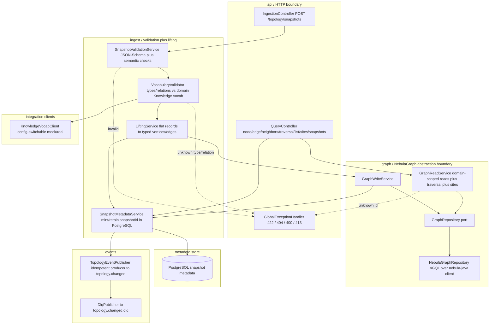

| Package | Responsibility |
|---|---|
| `com.acp.topology.api` | REST controllers (`IngestionController`, `QueryController` incl. the **site** operations), request/response DTOs, `GlobalExceptionHandler` (maps validation/not-found to structured errors). |
| `com.acp.topology.ingest` | `SnapshotValidationService` (schema + structural/semantic validation), **`VocabularyValidator`** (validates each node `objectType` + edge `relation` against the snapshot `domain`'s Knowledge-authored vocabulary), `LiftingService` (record-to-typed-graph mapping incl. Site/LOCATED_AT/Interface + `domain` + `attributes`), `SnapshotMetadataService` (mint + PostgreSQL bookkeeping + retention). |
| `com.acp.topology.graph` | **NebulaGraph abstraction boundary.** The **`GraphRepository`** port (interface) + its single **`NebulaGraphRepository`** implementation (the only class issuing nGQL, over the **nebula-java** `NebulaPool`/`Session`); `GraphWriteService`, `GraphReadService` (domain-scoped reads incl. bounded traversal, site queries, cross-domain opt-in). The space/schema bootstrap (`NebulaSchemaBootstrap`). No NebulaGraph detail (space, host, nGQL, raw result rows) escapes this package. |
| `com.acp.topology.meta` | `SnapshotRepository` (Spring Data JDBC over PostgreSQL) for the `snapshot` metadata table — the system-of-record for the current/previous `snapshotId` pointers and the ingest audit. |
| `com.acp.topology.integration` | **`KnowledgeVocabClient`** — config-switchable client for the Knowledge Service's **frozen** domain-vocabulary operation **`GET /domains/{domain}/vocabulary`** → `{domain, objectTypes[], relations[], version}` (object-type set + relation vocabulary per `domain`, gap P1-G11); short-TTL cache; mock (WireMock/Prism stub from Knowledge's published OpenAPI, same frozen path/shape) in unit tests, real Knowledge in integration. Path defaults to `/domains/{domain}/vocabulary` (no override needed to start in isolation). |
| `com.acp.topology.events` | `TopologyEventPublisher` (build `TypedEnvelope<TopologyChangedEvent>`, idempotent produce), `DlqPublisher`. |
| `com.acp.topology.config` | `@ConfigurationProperties` beans (Kafka, **NebulaGraph** connection, **PostgreSQL** connection, limits, Knowledge integration toggles), idempotent Kafka producer config, `NebulaPool` bean, JSON Schema loader. |
| `com.acp.topology.observability` | Health indicators (**NebulaGraph graphd reachable**, **PostgreSQL reachable**, Kafka reachable), Micrometer meters, MDC enrichment (`snapshotId`, `domain`, `traceId`). |

---

## Data model / DB schema

Topology owns **two stores**, by the merged "Data stores & ownership" contract:

1. **NebulaGraph** — the typed multi-layer topology graph (system of record for nodes/edges).
2. **PostgreSQL** — snapshot version **metadata only** (no graph data); the **system-of-record for
   the current/previous `snapshotId` pointers** and the ingest audit.

A single snapshot **spans both stores**: every NebulaGraph vertex and edge carries a `snapshotId`
property; the PostgreSQL `snapshot` row carries that same `snapshotId` plus its status/counts/audit.
The PostgreSQL row is authoritative for *which* `snapshotId` is `current` vs `previous`; the
NebulaGraph data is resolved *by* `snapshotId`. NebulaGraph internals (space, VID, nGQL) are never
exposed beyond the `graph/` package.

> **Why snapshotId-as-a-property (one space), not space-per-snapshot — decision.** NebulaGraph
> `CREATE SPACE` is a relatively heavy, asynchronous metad operation (it allocates partitions and
> must propagate to storaged before the space is usable). With retention = current + previous, a
> **`snapshotId` property on every vertex/edge inside one stable space** is simplest: a snapshot is
> written by stamping the property, queries scope with a `WHERE …snapshotId == $sid` predicate, and
> eviction is a bounded delete of the old `snapshotId`. A space-per-snapshot would pay the
> space-creation/propagation cost on every ingest and double the schema bootstrap. (See Design
> alternatives.) The PostgreSQL `snapshot` row remains the authoritative current/previous pointer.

### Graph model (NebulaGraph)

One NebulaGraph SPACE named **`topology`** (one space, `domain`-tagged and `snapshotId`-tagged). The
space uses a **`FIXED_STRING` VID** because `managedObjectId` (the natural VID) is a string. **TAGs
(vertex types) = the `objectType`s declared in the conforming snapshot file**; **EDGE types =
the `relation`s declared in that file** — there is **no frozen global vocabulary**. Both are
**validated at ingest against the snapshot `domain`'s Knowledge-authored object-type + relation
vocabulary** (unknown type/relation for that domain yields 422, no write). Every vertex carries (on a
common TAG) `objectType`, **`domain`**, `snapshotId`, `name?`, and **`attributes`** (the structured
properties map, stored as a JSON string property). Every edge carries `relation`, **`domain`**,
`snapshotId`, and **`attributes`**. **`Site`** is a TAG like any other (geo attributes);
**`LOCATED_AT`** is an EDGE type like any other. Both are **domain-agnostic** — present in every
domain's Knowledge vocabulary.

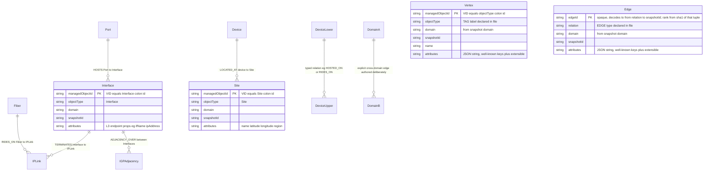

The Core-IP layering the Interface model adds reads **Port HOSTS Interface TERMINATES IPLink**, with
**ADJACENCY_OVER** running **between Interfaces** (and `Fiber RIDES_ON IPLink` unchanged):

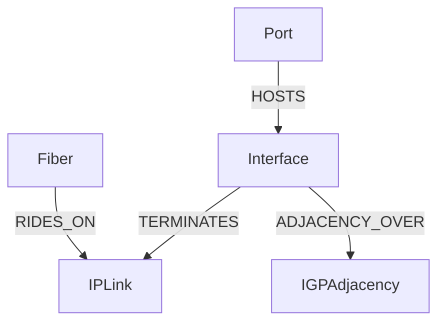

> The diagram is illustrative. The service is **domain-agnostic** — it persists whatever typed
> nodes/edges the conforming file declares, in any valid `from`/`to` arrangement, **provided each
> `objectType` and `relation` is in the snapshot `domain`'s Knowledge vocabulary**. It does **not**
> hard-code which relation may connect which layer. The Core IP set
> (Node/LineCard/Port/**Interface**/IPLink/IGPAdjacency/LSP/VPNService/FiberSpan/SRLG/**Site** +
> HOSTED_ON/**HOSTS**/**TERMINATES**/RIDES_ON/ADJACENCY_OVER/TRAVERSES/SERVES/MEMBER_OF/**LOCATED_AT**)
> is the **MVP domain's** Knowledge-authored vocabulary, not a frozen global set. **`Interface`** and
> its relations **`HOSTS`** / **`TERMINATES`** are just more members of that Core-IP vocabulary —
> Topology persists and validates them through the same generic typed-vertex/edge path, with **no
> Interface-specific code**.

#### NebulaGraph SPACE + schema (nGQL)

The SPACE and schema are created **idempotently on startup** by `NebulaSchemaBootstrap` (Nebula is a
separate DB, so this is not Flyway). `IF NOT EXISTS` makes the bootstrap re-runnable across restarts.
Because the TAG/EDGE-type vocabulary is Knowledge-authored per domain (not frozen in code), the
bootstrap registers the **MVP Core-IP domain's** TAGs/EDGE types from the loaded Knowledge vocabulary;
ingesting a future domain registers any of *its* not-yet-present TAGs/EDGE types the same idempotent
way before the first write of that type.

```ngql
-- One-time / idempotent space (FIXED_STRING VID because managedObjectId is a string).
CREATE SPACE IF NOT EXISTS topology (partition_num = 10, replica_factor = 1, vid_type = FIXED_STRING(128));
USE topology;

-- Vertex TAGs (one per objectType in the domain's Knowledge vocabulary). Each TAG carries the
-- common bookkeeping + the structured attributes map (stored as a JSON string).
CREATE TAG IF NOT EXISTS Node       (objectType string, domain string, snapshotId string, name string, attributes string);
CREATE TAG IF NOT EXISTS LineCard   (objectType string, domain string, snapshotId string, name string, attributes string);
CREATE TAG IF NOT EXISTS Port       (objectType string, domain string, snapshotId string, name string, attributes string);
CREATE TAG IF NOT EXISTS Interface  (objectType string, domain string, snapshotId string, name string, attributes string);
CREATE TAG IF NOT EXISTS IPLink     (objectType string, domain string, snapshotId string, name string, attributes string);
CREATE TAG IF NOT EXISTS IGPAdjacency (objectType string, domain string, snapshotId string, name string, attributes string);
CREATE TAG IF NOT EXISTS LSP        (objectType string, domain string, snapshotId string, name string, attributes string);
CREATE TAG IF NOT EXISTS VPNService (objectType string, domain string, snapshotId string, name string, attributes string);
CREATE TAG IF NOT EXISTS FiberSpan  (objectType string, domain string, snapshotId string, name string, attributes string);
CREATE TAG IF NOT EXISTS SRLG       (objectType string, domain string, snapshotId string, name string, attributes string);
CREATE TAG IF NOT EXISTS Site       (objectType string, domain string, snapshotId string, name string, attributes string);

-- Edge types (one per relation in the domain's Knowledge vocabulary).
CREATE EDGE IF NOT EXISTS HOSTED_ON      (relation string, domain string, snapshotId string, attributes string);
CREATE EDGE IF NOT EXISTS HOSTS          (relation string, domain string, snapshotId string, attributes string);
CREATE EDGE IF NOT EXISTS TERMINATES     (relation string, domain string, snapshotId string, attributes string);
CREATE EDGE IF NOT EXISTS RIDES_ON       (relation string, domain string, snapshotId string, attributes string);
CREATE EDGE IF NOT EXISTS ADJACENCY_OVER (relation string, domain string, snapshotId string, attributes string);
CREATE EDGE IF NOT EXISTS TRAVERSES      (relation string, domain string, snapshotId string, attributes string);
CREATE EDGE IF NOT EXISTS SERVES         (relation string, domain string, snapshotId string, attributes string);
CREATE EDGE IF NOT EXISTS MEMBER_OF      (relation string, domain string, snapshotId string, attributes string);
CREATE EDGE IF NOT EXISTS LOCATED_AT     (relation string, domain string, snapshotId string, attributes string);

-- TAG indexes enable LOOKUP-by-property (NebulaGraph requires an index for property predicates).
-- These back resolve / list-by-type / list-sites / domain + snapshot scoping.
CREATE TAG INDEX IF NOT EXISTS idx_node_scope       ON Node(domain(32), snapshotId(48));
CREATE TAG INDEX IF NOT EXISTS idx_port_scope       ON Port(domain(32), snapshotId(48));
CREATE TAG INDEX IF NOT EXISTS idx_interface_scope  ON Interface(domain(32), snapshotId(48));
CREATE TAG INDEX IF NOT EXISTS idx_site_scope       ON Site(domain(32), snapshotId(48));
-- (one idx_<tag>_scope per TAG; objectType is implied by the TAG itself)

-- Edge indexes back get-edge and edge eviction by snapshot.
CREATE EDGE INDEX IF NOT EXISTS idx_located_at_scope ON LOCATED_AT(domain(32), snapshotId(48));
CREATE EDGE INDEX IF NOT EXISTS idx_rides_on_scope   ON RIDES_ON(domain(32), snapshotId(48));
-- (one idx_<edge>_scope per EDGE type)
REBUILD TAG INDEX; REBUILD EDGE INDEX;   -- run once after creating indexes
```

> **nGQL note — LOOKUP needs an index.** Unlike a VID lookup (which addresses a vertex directly by its
> VID), any read that filters by a *property* (`domain`, `snapshotId`, `objectType`-by-TAG) requires a
> TAG or EDGE index in NebulaGraph. The `idx_*_scope` indexes above are exactly those; `REBUILD` is run
> once after creation so LOOKUP can use them.

#### Inserting lifted nodes/edges (nGQL)

VID is the `managedObjectId` (the natural key). The lifter stages one batched `INSERT VERTEX` per TAG
and one batched `INSERT EDGE` per EDGE type. `attributes` is serialized to a JSON string.

```ngql
USE topology;

-- Insert lifted vertices (TAG = objectType; VID = managedObjectId).
INSERT VERTEX Node (objectType, domain, snapshotId, name, attributes) VALUES
  "Node:PE1":("Node", "core-ip", "SNAP-2026-001", "PE1",
              "{\"vendor\":\"acme\",\"model\":\"X9\",\"role\":\"PE\"}");
INSERT VERTEX Interface (objectType, domain, snapshotId, name, attributes) VALUES
  "Interface:PE1-LC2-P3-100":("Interface", "core-ip", "SNAP-2026-001", "ge-0/0/3.100",
              "{\"ipAddress\":\"10.0.0.1\",\"adminState\":\"up\"}");
INSERT VERTEX Site (objectType, domain, snapshotId, name, attributes) VALUES
  "Site:LON-DC1":("Site", "core-ip", "SNAP-2026-001", "London DC1",
              "{\"latitude\":51.5,\"longitude\":-0.12,\"region\":\"EU-West\"}");

-- Insert lifted edges (EDGE type = relation; rank = deterministic hash so re-insert is stable).
INSERT EDGE HOSTS (relation, domain, snapshotId, attributes) VALUES
  "Port:PE1-LC2-P3"->"Interface:PE1-LC2-P3-100"@0:("HOSTS", "core-ip", "SNAP-2026-001", "{}");
INSERT EDGE TERMINATES (relation, domain, snapshotId, attributes) VALUES
  "Interface:PE1-LC2-P3-100"->"IPLink:PE1-PE2-1"@0:("TERMINATES", "core-ip", "SNAP-2026-001", "{}");
INSERT EDGE LOCATED_AT (relation, domain, snapshotId, attributes) VALUES
  "Node:PE1"->"Site:LON-DC1"@0:("LOCATED_AT", "core-ip", "SNAP-2026-001", "{}");
```

#### Query-API reads (nGQL)

```ngql
-- Get node by managedObjectId (resolve + layer). VID lookup, then read its TAG props.
FETCH PROP ON * "Node:PE1" YIELD vertex AS v;

-- Get edge by edgeId. The opaque edgeId base64url-decodes to (snapshotId, from, relation, to);
-- rank = sha1(from, relation, to). Direct keyed FETCH on the decoded (src, dst, rank, edgetype) —
-- no scan/index needed (realizable from the defined edge key). Example decodes to
-- ("SNAP-2026-001", "Port:PE1-LC2-P3", "HOSTS", "Interface:PE1-LC2-P3-100"):
FETCH PROP ON HOSTS "Port:PE1-LC2-P3" -> "Interface:PE1-LC2-P3-100"@0 YIELD edge AS e;

-- Resolve managedObjectId to object + layer for the current snapshot (domain-scoped).
LOOKUP ON Node WHERE Node.domain == "core-ip" AND Node.snapshotId == "SNAP-2026-001" AND id(vertex) == "Node:PE1"
  YIELD id(vertex) AS moid, Node.objectType AS layer, Node.attributes AS attrs;

-- List nodes by type (domain + snapshot scoped) — LOOKUP on the TAG.
LOOKUP ON Port WHERE Port.domain == "core-ip" AND Port.snapshotId == "SNAP-2026-001"
  YIELD id(vertex) AS moid, Port.name AS name, Port.attributes AS attrs;

-- Direct neighbors over a given relation (domain-scoped via the start vertex's domain).
GO FROM "Port:PE1-LC2-P3" OVER HOSTS WHERE HOSTS.snapshotId == "SNAP-2026-001"
  YIELD dst(edge) AS neighbor, properties(edge) AS via;

-- Bounded traversal over one or more edge types (RIDES_ON here), depth 1 to K, same-domain.
GO 1 TO 3 STEPS FROM "Node:PE1" OVER RIDES_ON
  WHERE RIDES_ON.snapshotId == "SNAP-2026-001" AND RIDES_ON.domain == "core-ip"
  YIELD DISTINCT dst(edge) AS reached;

-- List sites (objectType == Site), domain + snapshot scoped.
LOOKUP ON Site WHERE Site.domain == "core-ip" AND Site.snapshotId == "SNAP-2026-001"
  YIELD id(vertex) AS siteId, Site.name AS name, Site.attributes AS geo;

-- List objects located at a site (devices with a LOCATED_AT edge to the site).
GO FROM "Site:LON-DC1" OVER LOCATED_AT REVERSELY WHERE LOCATED_AT.snapshotId == "SNAP-2026-001"
  YIELD src(edge) AS device;

-- Evict an old snapshot's data (retention): delete vertices/edges tagged with the evicted snapshotId.
LOOKUP ON Node WHERE Node.snapshotId == "SNAP-OLD" YIELD id(vertex) AS v | DELETE VERTEX $-.v WITH EDGE;
```

> **Cross-domain traversal** drops the `domain` predicate when the caller opts in (`crossDomain=true`),
> so a `GO … OVER <relation>` may follow an explicit cross-domain edge; by default the `domain ==`
> predicate pins the traversal to the start vertex's domain (Algorithm §B).

**Structured attributes (stored verbatim, returned in queries).** The `attributes` map carries the
contract's **well-known, extensible keys** — on devices: `vendor`, `model`, `equipmentType`, `role`,
`capacity`; on connections: `linkType`, `capacity`, `protectionRole`; on `Site` nodes: `name`,
`latitude`, `longitude`, `region`. The lifter serializes the map to a JSON **string** property
(NebulaGraph has no native map property type); `GraphReadService` parses it back into the map on the
way out, so consumers get the attributes **unchanged**. Topology performs **no validation of attribute
values** — that is a Knowledge concern; Topology only stores and serves. The map is open.

**Domain isolation.** `domain` is a **first-class property on every vertex and edge** (from the
snapshot file's `domain`) and is part of every `idx_*_scope` index. **All queries are domain-scoped by
default**: a node/neighbor/traversal/list/site query operates within a single `domain` (the query
carries the `domain` or infers it from the start `managedObjectId`'s stored `domain`), so a
single-domain traversal **never wanders into another domain**. **Cross-domain** is supported only via
**explicit cross-domain edges** — authored deliberately in the snapshot file; a traversal crosses
domains **only** when the caller explicitly opts in (`crossDomain=true`). MVP builds and tests
single-domain Core IP; the property-tag structure supports cross-domain later with no schema change.

### PostgreSQL — snapshot version metadata (schema `topology_meta`)

The PostgreSQL store holds **only** snapshot bookkeeping — **no graph data**. It is the
**system-of-record for the current/previous `snapshotId`**.

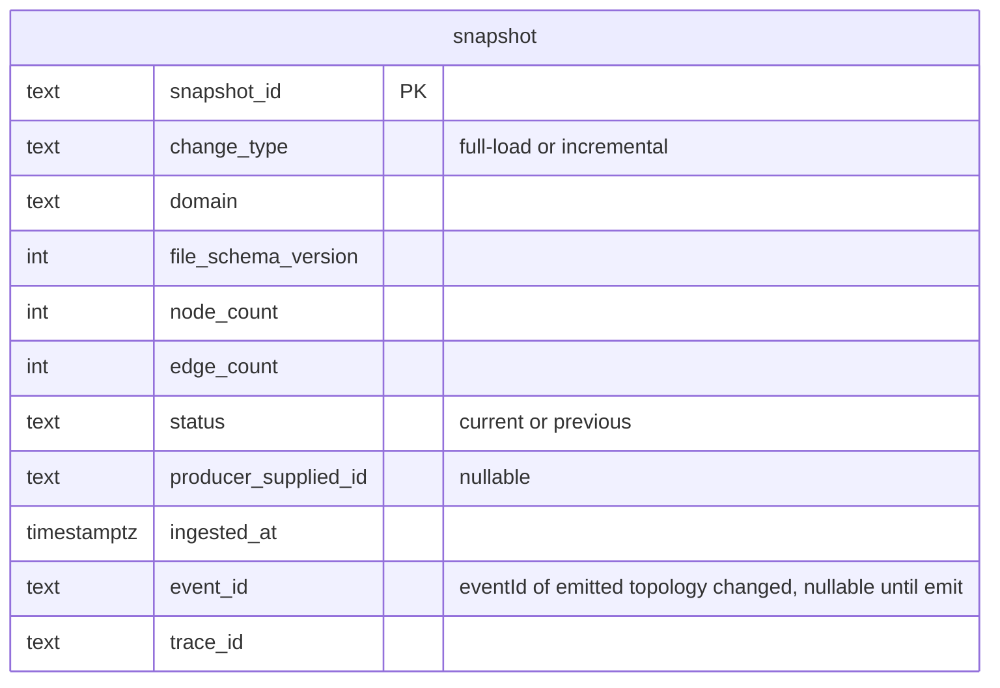

```sql
-- Flyway V1__snapshot.sql
CREATE SCHEMA IF NOT EXISTS topology_meta;
CREATE TABLE topology_meta.snapshot (
  snapshot_id          text PRIMARY KEY,
  change_type          text NOT NULL CHECK (change_type IN ('full-load','incremental')),
  domain               text NOT NULL,
  file_schema_version  int  NOT NULL,
  node_count           int  NOT NULL,
  edge_count           int  NOT NULL,
  status               text NOT NULL CHECK (status IN ('current','previous')),
  producer_supplied_id text,
  ingested_at          timestamptz NOT NULL DEFAULT now(),
  event_id             text,
  trace_id             text
);
-- At most one current and at most one previous PER DOMAIN.
CREATE UNIQUE INDEX uq_snapshot_status_per_domain
  ON topology_meta.snapshot(domain, status) WHERE status IN ('current','previous');
CREATE INDEX idx_snapshot_domain_ingested ON topology_meta.snapshot(domain, ingested_at DESC);
```

- One row per ingest. `change_type` constrained to `{full-load, incremental}` at the DB level (DB-side
  guard for AC-16, in addition to the publisher guard). Constrained **per domain** to **at most one
  `current`** and **at most one `previous`**; on a new ingest **for that domain** the prior `current`
  is demoted to `previous`, and the prior `previous` row **plus its NebulaGraph data** (vertices/edges
  with that `snapshotId`) are evicted (retention = current + previous **per domain**; Task 3 / AC-14).
  A re-ingest **always** inserts a new row with a new `snapshot_id`, even if content is identical
  (AC-14). MVP runs a single domain (`core-ip`).
- No alarm/incident/template data. No NebulaGraph credentials in any row.

**Cross-store atomicity (two stores, no shared transaction).** NebulaGraph and PostgreSQL are
**separate databases**, so a single ACID transaction cannot span both (a graph store and a separate
relational store, unlike a single-database extension model). The ingest is ordered to make the
**PostgreSQL row the commit point** and to leave **no observable partial snapshot**:

1. Write all NebulaGraph vertices/edges for the new `snapshotId` (data is present but **not yet
   `current`** — no PostgreSQL row points at it, and all reads scope by the `current` snapshotId from
   PostgreSQL, so the new data is invisible).
2. In **one PostgreSQL transaction**: insert the new `snapshot` row as `current`, demote the prior
   `current` to `previous`, delete the prior `previous` row. This commit is the **atomic cut-over**.
3. After the PostgreSQL commit, delete the now-evicted prior-`previous` NebulaGraph data (a bounded
   `DELETE VERTEX … WITH EDGE`), and emit `topology.changed`.

If step 1 fails, no PostgreSQL row is written, orphan NebulaGraph data is unreferenced and swept by a
startup/periodic **orphan-snapshot reaper** (deletes NebulaGraph `snapshotId`s with no matching
PostgreSQL row). If step 2 fails, the PostgreSQL tx is rolled back; the new NebulaGraph data stays
unreferenced (reaper-swept); the prior snapshot remains `current`; ingest returns 500 (EH-10). The
reader **never** sees half a snapshot because visibility is gated solely on the PostgreSQL
`current` pointer (see Design alternatives and Error handling EH-10).

**Why a separate metadata store (not just the graph):** status/retention/producer-id mapping are
cheap relational, indexed, transactional concerns; the merged contract assigns them to PostgreSQL.
Keeping them out of NebulaGraph avoids extra nGQL for `GET /topology/snapshots` and gives an indexed,
transactional current/previous pointer that is the cross-store commit point.

---

## Event handling

- **Consumers:** **none.** The Topology Service subscribes to no Kafka topic (spec: ingestion is
  file/API only). There is therefore no inbound idempotency/dedupe concern and no inbound DLQ.

- **Producers:**

  | Topic | Payload (from `libs/event-model`) | When | Key | Idempotency / failure |
  |---|---|---|---|---|
  | `topology.changed` | `TopologyChangedEvent` (`snapshotId`, `changeType`, `nodes[]`, `edges[]`) in `TypedEnvelope` (`eventId`,`type=TopologyChangedEvent`,`schemaVersion=1`,`occurredAt`,`source=topology`,`traceId`,`payload`) | after every successful ingest+persist (NebulaGraph write + PostgreSQL cut-over) | envelope `eventId` (UUID) = idempotency key; Kafka message key = `snapshotId` | Producer idempotent (`enable.idempotence=true`, `acks=all`, `max.in.flight<=5`, retries). On unrecoverable send failure routes to `topology.changed.dlq`. |
  | `topology.changed.dlq` | the same envelope JSON + failure metadata headers (`x-error`, `x-original-topic`, `x-trace-id`) | when the `topology.changed` send ultimately fails | — | terminal; logged ERROR with `snapshotId`/`traceId`. |

  **Dedupe semantics (spec-aligned):** Kafka is at-least-once, so a single emitted event may be
  *delivered* more than once; consumers dedupe on `eventId`. A **re-ingest** of identical content is a
  *new* ingest yielding a new `snapshotId`, a new `eventId`, and a new event (not a duplicate). The
  dedupe guarantee is per-delivery of a given `eventId`, not per-ingest-operation (AC-14, AC-15).

  **`changeType` rule:** the **first** successful ingest into an empty graph emits `full-load`
  (AC-15). Subsequent ingests emit `full-load` for a complete replacement and `incremental` for a
  partial update; the value is **never** outside `{full-load, incremental}` (AC-16) — `delete` is not
  emitted in the MVP. (How a file signals full vs. incremental: see "Design-stage notes".)

The publisher uses `EventCodec.serialize(TypedEnvelope<TopologyChangedEvent>)` from the frozen lib, so
the wire payload is exactly the frozen binding (AC-15, AC-17).

---

## API contracts / API schema

OpenAPI 3.1 is generated by **springdoc** from the annotated controllers/DTOs and served at
`/openapi.json` (+ Swagger UI). The generated document is **checked in** at
`services/topology/openapi.json` and is the **single source of truth** for the HTTP surface; a
**contract test** (AC-18) validates live responses against the checked-in document, so the
implementation cannot drift. A change to this surface is a contract change. **The HTTP surface is
identical to the previous design — the backend swap does not touch it; nGQL/NebulaGraph are invisible
to callers.**

### Frozen API shapes (data-integration freeze — P1-G1, P1-G7, P1-G8, P1-G9)

The data-integration verification (`docs/design-gaps.md`) flagged five places where Topology's
**published** API shape / schema home and its consumers' expectations diverged. Topology owns this
surface, so the shapes below are **frozen here and pinned in `services/topology/openapi.json`**; the
consumers (Simulator upload client, web-ui typed clients) **align to** these frozen producer shapes.
None of these adds a Kafka topic, an `event-model` change, or a new HTTP *operation* — only the exact
response shapes are now frozen.

| Gap | Surface | Frozen shape (single source of truth = `services/topology/openapi.json`) |
|---|---|---|
| **P1-G1** | `POST /topology/snapshots` response | **`200` (synchronous)** — `SnapshotIngestResponse { snapshotId: string, domain: string, status: string, nodeCount: integer, edgeCount: integer, changeType: string }`. `snapshotId` is minted **inline during the lift**, so the call is synchronous (not 202/async). `snapshotId` + `status` are the mandatory minimum; `domain`, `nodeCount`, `edgeCount`, `changeType` are the justified richer fields a producer can ignore. |
| **P1-G7** | `GET /topology/sites` response | **`SiteListDto { domain: string, snapshotId: string, count: integer, sites: SiteDto[] }`** where **`SiteDto { siteId: string, name: string, latitude: number, longitude: number, region: string }`** — the **envelope** form with **flat per-site geo fields** (`siteId` is the `Site` node's `managedObjectId`; `latitude`/`longitude`/`region` lifted out of `attributes` into flat fields). |
| **P1-G8** | `GET /topology/sites/{siteId}/objects` response | **`SiteObjectsDto { siteId: string, domain: string, snapshotId: string, nodeCount: integer, edgeCount: integer, nodes: NodeDto[], edges: EdgeDto[] }`** — **nodes AND edges** (the intra-site and site-incident edges), so web-ui can render the device-level graph from one call. |
| **P1-G9** | `GET /topology/nodes/{managedObjectId}` response | **`NodeDto { managedObjectId: string, objectType: string, domain: string, snapshotId: string, name?: string, attributes: object }`** — **no separate `layer` field**; `layer` is **derived as `layer == objectType`**. The frozen NodeDto is the single shape; the rule "`layer` is `objectType`" is documented so web-ui maps `objectType` to `layer` (no duplicated field). |

> **P1-G1 producer-vs-consumer resolution (200 over 202).** The Simulator's current upload-client
> design reads `202 {snapshotId}` (async, bare body). Topology **owns** the ingestion operation and
> the lift is **synchronous** — the `snapshotId` is minted inline and the graph is persisted + the
> `topology.changed` event emitted **before** the response returns — so the truthful, frozen response
> is **`200`** with the `SnapshotIngestResponse` body above. The Simulator rebuilds its upload client
> from this published `openapi.json` (its consumer-side change is a later Simulator fix); it must read
> `snapshotId` from the `200` body, not a `202`. A producer only needs `snapshotId` (and `status`);
> the extra fields are additive and ignorable.

> **P1-G2 snapshot-file schema home (one canonical file).** The topology-snapshot JSON Schema — the
> file the Simulator **produces** and Topology **validates** against — has **exactly one canonical
> home: `services/topology/schema/snapshot.schema.json`**, owned by Topology (see "Snapshot-file
> schema — single canonical home" below). There is **no** independent Simulator copy; the Simulator
> validates its generated file against this **same** checked-in schema.

All error responses use one structured shape:

```jsonc
// ApiError
{ "status": 422, "error": "UNPROCESSABLE_ENTITY",
  "message": "snapshot file failed validation",
  "violations": [ { "path": "$.nodes[3].managedObjectId", "rule": "pattern",
                    "detail": "does not match the generic objectType colon id scheme" },
                  { "path": "$.edges[5].relation", "rule": "domain-vocabulary",
                    "detail": "relation FOO not in domain core-ip vocabulary" } ],
  "traceId": "..." }
```

### Snapshot-file schema — single canonical home (P1-G2)

The **topology-snapshot JSON Schema** — the file the **Simulator produces** and **Topology validates**
against at ingest — has **exactly ONE canonical, checked-in home**, and this resolves the
`architecture.md` open item *"where it lives (event-model vs. a `schema/` dir) is a design decision"*:

> **Ownership (unambiguous, single owner — Q2/P1-G2).** There is **exactly one** canonical
> topology-snapshot schema file: **`services/topology/schema/snapshot.schema.json`** (JSON Schema,
> draft 2020-12), **owned solely by the Topology Service** (the validating owner). It is the **single
> source of truth**, validated by **both** Topology (at ingest) **and** the Simulator (the producer,
> which references this **same** file). There is **no** independent or lockstep copy — **not** in
> `libs/event-model/`, **not** under `services/simulator/schema/`, and **not** anywhere else. A CI
> lockstep guard fails the build on any second copy, fork, or drift.

**Decision + justification (architecture.md says the home is a design decision):** Topology **owns
ingestion + validation**, so the schema lives **co-located with the validating owner**, not in
`libs/event-model` and **not** duplicated under `services/simulator/`. Rationale:

- **Single owner, single source of truth.** Topology is the only service that *validates* against the
  schema; locating the schema with the validator keeps the contract and its enforcement together and
  removes any risk of two copies drifting.
- **It is not a Kafka payload.** The snapshot file is an HTTP-upload body, not an event-model payload,
  so `libs/event-model/` (the home for envelope + topic payloads) is the wrong home — putting it there
  would conflate the file contract with the Kafka contract.
- **Contract-gated like a topic.** A change to this file is still a contract change (an
  `architecture.md`/spec update + human approval, exactly as for a new Kafka topic/payload), even
  though the file physically lives under `services/topology/`.

**Single source — no independent Simulator copy.** The **Simulator (producer)** validates its
**generated** snapshot file against **this same** `services/topology/schema/snapshot.schema.json`
(referenced from its build/CI, not a forked copy). There is **no** `services/simulator/schema/...`
lockstep duplicate. A **CI lockstep guard** asserts there is exactly one canonical schema file and
that the Simulator references it, so producer and validator can never diverge. This is the **P1-G2**
resolution: one schema, one home, both sides reference it.

**Snapshot-file structure (confirmed; not a new shape).** The schema validates the structure the
ingestion API already documents (below): top-level `schemaVersion` (int), optional `snapshotId`,
required `domain`, required `nodes[]` (`{ managedObjectId, objectType, name?, attributes? }`, incl.
`Site` nodes), required `edges[]` (`{ from, to, relation, attributes? }`, incl. `LOCATED_AT`). The
`managedObjectId` uses the generic `^[A-Za-z][A-Za-z0-9]*:[^:]+$` scheme; per-domain `objectType` /
`relation` vocabulary (incl. `Site` / `LOCATED_AT`) is the semantic layer validated against Knowledge
(not the JSON Schema). The checked-in schema file body is authored at the path above; it is a
**schema-home + single-source decision, not a new data shape**.

### Ingestion API

**`POST /topology/snapshots`** — `Content-Type: application/json` (the snapshot file body). Optional
`?changeType=full-load|incremental` hint; defaults per the replacement convention (Design-stage notes).

Request body = the **topology-snapshot file**, validated against
`services/topology/schema/snapshot.schema.json` (structural) **and** against the snapshot `domain`'s
Knowledge-authored object-type + relation vocabulary (semantic). The `managedObjectId` uses the
**domain-agnostic generic scheme** `^[A-Za-z][A-Za-z0-9]*:[^:]+$`. Shape:

```jsonc
{
  "schemaVersion": 1,                 // integer, required (topology-file schema version)
  "snapshotId": "SNAP-...",           // string, optional (producer-supplied; else minted)
  "domain": "core-ip",                // string, required — selects the Knowledge vocabulary to validate against
  "nodes": [                          // array, required
    { "managedObjectId": "Node:PE1",  // required, generic pattern ^[A-Za-z][A-Za-z0-9]*:[^:]+$
      "objectType": "Node",           // required, equals the prefix; must be in the domain's Knowledge object-type set
      "name": "PE1",                  // optional
      "attributes": {                 // optional, structured + extensible; stored verbatim, returned in queries
        "vendor": "acme", "model": "X9", "equipmentType": "router",
        "role": "PE", "capacity": "400G" } },
    { "managedObjectId": "Interface:PE1-LC2-P3-100",  // Core-IP L3 endpoint hosted on a Port
      "objectType": "Interface",      // must be in the domain's Knowledge object-type set
      "name": "ge-0/0/3.100",
      "attributes": { "ipAddress": "10.0.0.1", "adminState": "up" } },
    { "managedObjectId": "Site:LON-DC1",   // Site is a domain-agnostic object type
      "objectType": "Site",
      "name": "London DC1",
      "attributes": { "latitude": 51.5, "longitude": -0.12, "region": "EU-West" } }
  ],
  "edges": [                          // array, required
    { "from": "Port:PE1-LC2-P3",      // required, references a node in nodes[]
      "to": "Node:PE1",               // required, references a node in nodes[]
      "relation": "HOSTED_ON",        // required, must be in the domain's Knowledge relation vocabulary
      "attributes": { "linkType": "internal" } },
    { "from": "Port:PE1-LC2-P3", "to": "Interface:PE1-LC2-P3-100",
      "relation": "HOSTS",            // Core-IP: Port HOSTS Interface (L3 endpoint on the port)
      "attributes": { } },
    { "from": "Interface:PE1-LC2-P3-100", "to": "IPLink:PE1-PE2-1",
      "relation": "TERMINATES",       // Core-IP: Interface TERMINATES IPLink (links are between interfaces)
      "attributes": { } },
    { "from": "Node:PE1", "to": "Site:LON-DC1",
      "relation": "LOCATED_AT",       // domain-agnostic placement relation (device LOCATED_AT Site)
      "attributes": { } }
  ]
}
```

Responses:

| Status | When | Body |
|---|---|---|
| **200** (frozen, synchronous — P1-G1) | accepted, lifted, persisted (NebulaGraph + PostgreSQL cut-over), event emitted; `snapshotId` minted **inline** | **`SnapshotIngestResponse`** = `{ "snapshotId": "...", "domain": "core-ip", "status": "current", "nodeCount": N, "edgeCount": M, "changeType": "full-load" }`. **Frozen**: `200` (not `202`) because the lift is synchronous; `snapshotId` + `status` are the mandatory minimum, the rest additive. The Simulator reads `snapshotId` from this `200` body. |
| **422** | schema-invalid or semantic-invalid (missing required field; bad generic `managedObjectId` pattern; `objectType` not equal to prefix; dangling edge ref; **`objectType` not in the domain's Knowledge object-type set**; **`relation` not in the domain's Knowledge relation vocabulary**) | `ApiError` with `violations[]`; **no NebulaGraph write, no PostgreSQL row, no event** |
| **413** | body exceeds `topology.ingest.max-file-bytes` | `ApiError` |
| **415** | non-JSON content type | `ApiError` |
| **502** | Knowledge vocabulary unavailable for the `domain` (and no cached vocabulary) — cannot validate | `ApiError`; **no write, no event** (fail closed; see Error handling EH-6c) |
| **500** | persistence failure (NebulaGraph write fails, or PostgreSQL cut-over tx fails) | `ApiError`; PostgreSQL tx rolled back so prior snapshot stays `current`; orphan NebulaGraph data reaper-swept so no partial snapshot |

### Query API (read-only; typed DTOs only — never NebulaGraph structures; **domain-scoped**)

Every node/neighbor/traversal/list/site query is **scoped to a single `domain`** — supplied as
`?domain=` or inferred from the start object's stored `domain`. `NodeDto`/`EdgeDto` carry `domain` and
the `attributes` map (returned verbatim).

| Operation | Method + path | Response (200) | Errors |
|---|---|---|---|
| Resolve / get node + layer **(frozen — P1-G9)** | `GET /topology/nodes/{managedObjectId}` | **`NodeDto { managedObjectId, objectType, domain, snapshotId, name?, attributes }`** — **no separate `layer` field**; `layer == objectType` (documented derivation). | 404 unknown id; 400 malformed id |
| Get edge **(realizable lookup — see "Edge identity & lookup")** | `GET /topology/edges/{edgeId}` where `edgeId` is the **opaque composite key** that **decodes to `(from, relation, to, snapshotId)`** | `EdgeDto { edgeId, from, to, relation, domain, attributes, snapshotId }` | 400 malformed `edgeId` (does not decode); 404 unknown (decodes but no such edge in the snapshot) |
| Neighbors | `GET /topology/nodes/{managedObjectId}/neighbors?relation=RIDES_ON` (relation optional, repeatable; domain inferred from start) | `NeighborsDto { managedObjectId, domain, neighbors: [ { node: NodeDto, via: EdgeDto } ] }` (same-domain only unless `crossDomain=true`) | 404 unknown start |
| Bounded traversal | `GET /topology/traversal?start={moId}&relation=RIDES_ON&relation=...&maxDepth=K&crossDomain=false` | `TraversalDto { start, domain, relations[], maxDepth, crossDomain, reached: NodeDto[] }` | 400 missing start/relation/maxDepth or maxDepth out of `[1..max]`; 404 unknown start |
| List by type | `GET /topology/nodes?objectType=Port&domain=core-ip&snapshotId=current` | `NodeListDto { domain, objectType?, snapshotId, count, nodes: NodeDto[] }` | 400 unknown objectType |
| **List sites (frozen — P1-G7)** | `GET /topology/sites?domain=core-ip&snapshotId=current` | **`SiteListDto { domain, snapshotId, count, sites: SiteDto[] }`** where **`SiteDto { siteId, name, latitude, longitude, region }`** — envelope with **flat per-site geo fields** (`siteId` = the Site node's `managedObjectId`; geo lifted out of `attributes`). | 400 unknown domain |
| **List objects at a site (frozen — P1-G8)** | `GET /topology/sites/{siteId}/objects?domain=core-ip` | **`SiteObjectsDto { siteId, domain, snapshotId, nodeCount, edgeCount, nodes: NodeDto[], edges: EdgeDto[] }`** — **nodes AND edges** (devices `LOCATED_AT` the site + their intra-site / site-incident edges), so web-ui draws the device graph from one call. | 404 unknown site |
| List snapshots | `GET /topology/snapshots?domain=core-ip` | `SnapshotListDto { snapshots: [ { snapshotId, domain, changeType, status, nodeCount, edgeCount, ingestedAt } ] }` (at least current + previous per domain) | — |
| Current snapshot | `GET /topology/snapshots/current?domain=core-ip` | `SnapshotSummaryDto { snapshotId, domain, changeType, nodeCount, edgeCount, ingestedAt }` | 404 if no snapshot yet for that domain |

`managedObjectId` resolution (spec Task 5) is satisfied by `GET /topology/nodes/{managedObjectId}`,
which returns the object **and its layer** — where **`layer` is `objectType`** (P1-G9: there is no
separate `layer` field; the `objectType`, sourced from the vertex's NebulaGraph TAG, **is** the layer
indicator, so web-ui maps `objectType` to `layer` with no duplicated data) — **and its `domain`**.
Graph reads hit NebulaGraph (via `GraphReadService`); the two snapshot-listing operations read the
**PostgreSQL** `snapshot` table (system-of-record for current/previous). Queries default to the
**current** snapshot (`?snapshotId=current|previous`) and to a single `domain`. The **site**
operations back the web-ui's site-level visualization. `{siteId}` is a `managedObjectId` of
`objectType=Site` (returned as the flat `siteId` field in `SiteDto`).

> **P1-G7 (`SiteDto` flat geo).** `GET /topology/sites` returns the **`SiteListDto` envelope** (keeps
> `domain`/`snapshotId`/`count` so the caller knows the scope), but **each site is a `SiteDto` with
> flat fields** `{ siteId, name, latitude, longitude, region }` — not a raw `NodeDto`. `siteId` is the
> Site node's `managedObjectId`; `GraphReadService` lifts `latitude`/`longitude`/`region` out of the
> stored `Site.attributes` JSON into the flat fields web-ui binds to. This resolves the divergence
> (web-ui expected flat `siteId` + flat geo) **on Topology's side as the producer**.

> **P1-G8 (`SiteObjectsDto` with edges).** `GET /topology/sites/{siteId}/objects` returns **both
> `nodes` and `edges`**. `nodes` = the devices with a `LOCATED_AT` edge to the site (as before, but
> the field is renamed from `objects` to `nodes` to match the device-graph shape); `edges` = the
> intra-site edges among those devices **plus** their `LOCATED_AT` edges to the site, each as an
> `EdgeDto { edgeId, from, to, relation, domain, attributes, snapshotId }`. web-ui draws the
> device-level site graph from this **single** response (no per-node neighbors fan-out). `GraphReadService`
> computes the edge set via `GO FROM <siteId> OVER LOCATED_AT REVERSELY` to get the device set, then
> selects the edges whose `from` and `to` are both in that set (intra-site) union the `LOCATED_AT`
> edges to the site — all snapshot- and domain-scoped (Algorithm §C).

#### Edge identity & lookup — making `GET /topology/edges/{edgeId}` realizable (Q6)

**Problem.** A NebulaGraph edge has **no standalone `edgeId` key**: it is addressed only by the
composite **`(src, dst, rank, edgetype)`**. The previous design defined `edgeId = sha1(snapshotId,
from, relation, to)` *and* used that same hash as the edge **rank** — but a bare sha1 in the URL is a
**one-way** value: there is no index from a rank-only hash back to `(src, dst, edgetype)`, so
`GET /topology/edges/{edgeId}` could not actually be resolved to a NebulaGraph fetch. The published
operation was unrealizable from the defined keys.

**Decision (chosen — option (a): make `edgeId` the resolvable key, not a one-way hash).** `edgeId` is
redefined as an **opaque-to-callers but service-decodable composite token** that **encodes the full
NebulaGraph addressing tuple**:

> **`edgeId = base64url( "<snapshotId><from><relation><to>" )`** — a URL-safe,
> reversible encoding of the four-field key `(snapshotId, from, relation, to)`.

- **It decodes to a NebulaGraph key.** `GET /topology/edges/{edgeId}` base64url-**decodes** the token
  back to `(snapshotId, from, relation, to)`, derives the deterministic **`rank = sha1(from,
  relation, to)`** (stable so re-insert overwrites the same edge), and issues a **direct keyed fetch**
  — no scan, no index needed: `FETCH PROP ON <relation> "<from>" -> "<to>"@<rank> YIELD edge AS e`,
  scoped to the decoded `snapshotId`. This is realizable from the **defined edge key** `(src, dst,
  rank, edgetype)`: `src=from`, `dst=to`, `edgetype=relation`, `rank` derived from the same tuple.
- **It is the same `edgeId` every other response already carries.** `EdgeDto.edgeId` returned by
  neighbors, traversal, and `GET /topology/sites/{siteId}/objects` is this exact token, so a caller
  that saw an edge in any list can round-trip it straight back into `GET /topology/edges/{edgeId}` —
  the published operation is now closed and resolvable end-to-end.
- **Abstraction-safe (AC-19).** The token is opaque to callers and leaks **no** NebulaGraph internals
  (no host/space/raw rank/nGQL); only `GraphReadService`/`NebulaGraphRepository` decode it and form the
  fetch. Encoding/decoding lives behind the `graph/` boundary.
- **Errors.** A token that does not base64url-decode to the four-field shape yields **400** (malformed
  `edgeId`); a well-formed token whose edge is absent in the (decoded) snapshot yields **404**.

> Why not keep a sha1 `edgeId` plus an edge index to reverse-resolve it? A sha1 is not reversible, so a
> reverse lookup would require persisting a separate `edgeId -> (src,dst,relation)` mapping (extra
> store, extra write, drift risk) **and** an index NebulaGraph would have to scan. The reversible
> composite token needs **no** extra store or index and resolves by a **direct keyed FETCH**, which is
> why it is chosen. (See Design alternatives — `edgeId` row.)

**Interface-aware queries (no new endpoints — Interface is just another typed object).** Because
`Interface`, `HOSTS` and `TERMINATES` are ordinary TAGs/EDGE types, the existing operations already
serve them: `GET /topology/nodes?objectType=Interface&domain=core-ip` lists interfaces;
`GET /topology/nodes/{Interface:id}` resolves one (returning `objectType=Interface` as its layer);
`GET /topology/nodes/{Port:id}/neighbors?relation=HOSTS` returns the interfaces on a port;
`GET /topology/nodes/{Interface:id}/neighbors?relation=TERMINATES` returns the IPLink an interface
terminates; and a bounded traversal `start=Port:...&relation=HOSTS&relation=TERMINATES&maxDepth=2`
walks Port to Interface to IPLink. No interface-specific operation is added.

---

## Integration points (mock vs. real)

The Topology Service is primarily a **server**, not a client.

| Direction | Collaborator + operation | Config key(s) | mock vs real |
|---|---|---|---|
| **Inbound (server)** | Producers (Simulator) call `POST /topology/snapshots`; consumers (Trail Builder, Codebook Generator, Enrichment, Web UI) call the query API (incl. the **site** operations). They build clients from **this service's** published `openapi.json`. | n/a (we publish; they consume) | n/a |
| **Outbound (required) — Knowledge domain vocabulary** | **Knowledge Service** — fetch the **object-type set + edge-relation vocabulary** for a `domain` via the **frozen** `GET /domains/{domain}/vocabulary` operation (Knowledge design §A, gap P1-G11), used by `VocabularyValidator` at ingest. `KnowledgeVocabClient` caches the per-domain `{domain, objectTypes[], relations[], version}` response with a short TTL; refreshes on miss/expiry. | `topology.knowledge.base-url`, `topology.knowledge.mode=mock|real`, `topology.knowledge.vocab-ttl-seconds`, `topology.knowledge.vocab-path` (default the frozen `GET /domains/{domain}/vocabulary`) | **mock** = WireMock/Prism stub **generated from Knowledge's published OpenAPI** (unit tests, isolated, against the same frozen path/shape); **real** = live Knowledge on the integration Compose network. No hard-coded URL; the path has a real, startable default. |
| **Outbound (infra) — graph** | **NebulaGraph** graphd (nGQL on port 9669) via the **nebula-java** `NebulaPool`/`Session` | `topology.nebula.hosts` (host:port list), `topology.nebula.space=topology`, `topology.nebula.username` / `.password` (secret), pool sizing | real in all envs; **Testcontainers NebulaGraph** in integration tests; mocked `GraphRepository` in unit tests. Internal-only; never forwarded to callers. |
| **Outbound (infra) — metadata** | **PostgreSQL** (snapshot metadata) via JDBC | `topology.postgres.jdbc-url` / `.username` / `.password` (secret) | real in all envs; **Testcontainers PostgreSQL** in integration; mocked `SnapshotRepository` in unit tests. Internal-only. |
| **Outbound (infra) — bus** | Kafka broker | `topology.kafka.bootstrap-servers` | real in all envs; Testcontainers Kafka in integration; embedded/mock in unit tests. |

The vocabulary is **not** frozen in this service: each domain's object-type set + relation vocabulary
is **authored in Knowledge** and fetched per `domain` at ingest, against Knowledge's **published
OpenAPI** (never its source). The Core IP vocabulary is the MVP domain's authored data, used as the
mock fixture in unit tests.

**Pinned Knowledge endpoint (Q3/Q11 — frozen, concrete path).** The placeholder
`(from Knowledge OpenAPI)` is replaced with the **frozen concrete operation** Knowledge publishes for
exactly this purpose:

> **`GET /domains/{domain}/vocabulary`** → **`200 { domain, objectTypes[], relations[], version }`**;
> **`404`** for an unknown domain. (Knowledge design §A "Topology snapshot pre-validation", gap
> **P1-G11, FROZEN**.)

`KnowledgeVocabClient` calls this single operation (substituting `{domain}` with the snapshot's
`domain`), reads `objectTypes[]` as the domain's object-type set and `relations[]` as its relation
vocabulary, and caches the response keyed by `(domain, version)` with TTL
`topology.knowledge.vocab-ttl-seconds`. The default of `topology.knowledge.vocab-path` is the literal
frozen path template `/domains/{domain}/vocabulary` — a **real, resolvable default**, not a
placeholder — so the client is fully wired with **no per-environment override required**.

**Startable in isolation / test (real default path + mock|real mode).** Because the path default is
concrete, the service is **startable in isolation** without any Knowledge override:
- **`topology.knowledge.mode=mock`** (unit/isolated): `KnowledgeVocabClient` resolves the **same**
  `GET /domains/{domain}/vocabulary` operation against a **WireMock/Prism stub generated from
  Knowledge's published OpenAPI**, seeded with the `core-ip` `{objectTypes, relations}` fixture. No
  live Knowledge process is needed; the path, request, and response shape are identical to real.
- **`topology.knowledge.mode=real`** (integration/prod, the default mode): the client resolves the
  same path against the live Knowledge base URL on the Compose network.

The mode only switches **where** the request goes (stub vs live), never the **path or response
shape** — both are the one frozen contract — so a test, CI, and prod all exercise the same operation.
Fail-closed semantics are unchanged: if the operation is unavailable for the `domain` and no
non-expired cache entry exists, ingest is rejected `502` (EH-6c) with no write and no event.

---

## Key flows (sequence / data-flow diagrams)

### Flow A — Ingestion: file then validate then lift then NebulaGraph persist then PostgreSQL cut-over then emit (P1)

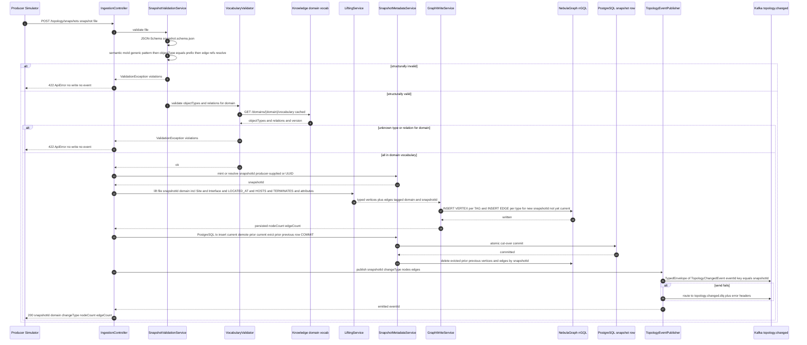

### Flow B — Query: domain-scoped bounded traversal / managedObjectId resolution (P2)

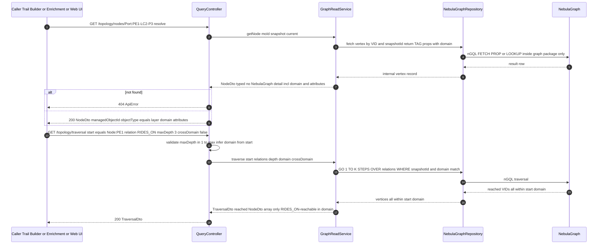

The traversal nGQL pins `domain` on every matched vertex/edge unless `crossDomain=true`, so a
single-domain traversal cannot escape its domain even where an explicit cross-domain edge exists. With
`crossDomain=true` the domain pin is dropped and the traversal may follow cross-domain edges (Flow D).

### Flow C — Site queries: list sites / list objects located at a site (P1 and P2)

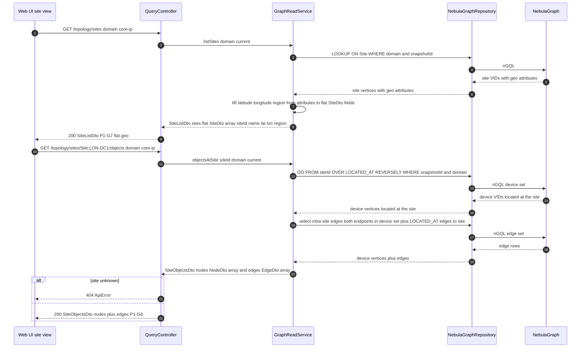

### Flow D — Cross-domain edge traversal (opt-in; MVP single-domain, structure-ready)

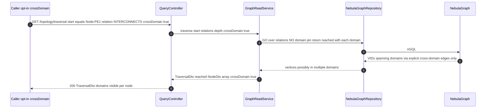

Cross-domain reach is possible **only** because an explicit cross-domain edge was authored in a
snapshot file. The MVP ingests and tests one domain (`core-ip`) only; the path is designed and tested
for the structure, not exercised in MVP data.

### Flow E — Startup bootstrap: NebulaGraph storaged registration + idempotent space/schema (P1 readiness)

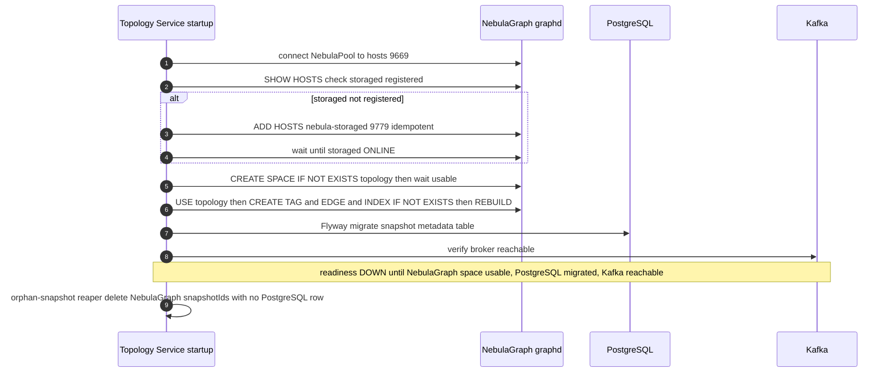

> **storaged ADD HOSTS bootstrap.** NebulaGraph requires the storaged daemon(s) to be **registered with
> metad** (`ADD HOSTS "nebula-storaged":9779;`) before any space is usable — the same one-shot the
> deferred `nebula-init` Compose job would run. The service performs this **idempotently** on startup
> (check `SHOW HOSTS`, run `ADD HOSTS` only if absent), so it is robust whether or not a separate init
> job ran first. The space/schema/index creation is likewise idempotent (`IF NOT EXISTS`). Readiness is
> not reported UP until the space is usable, PostgreSQL is migrated, and Kafka is reachable (EH-11).

---

## Algorithm logical flow

### §A — Lifting rules (flat records to typed domain-tagged graph, incl. vocab validation + Site)

Inputs: the structurally-valid snapshot file, its `domain`, the resolved `snapshotId`, and the
**domain's Knowledge-authored vocabulary** (object-type set + relation set). Parameters: **none
hard-coded** — the vocabulary is Knowledge data per `domain`; the file declares the instances. Output:
typed, domain-tagged NebulaGraph vertices + edges (including `Site` nodes and `LOCATED_AT` edges when
present), persisted under `snapshotId`, then made `current` by the PostgreSQL cut-over.

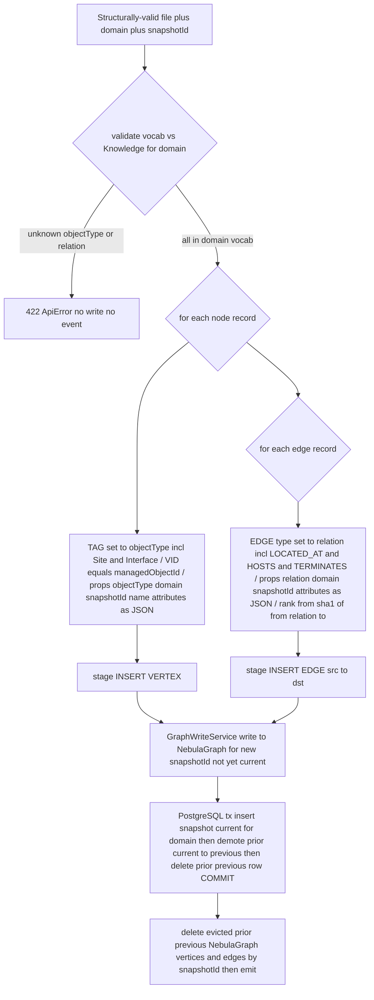

Decision rules:
- **Vocabulary is Knowledge-driven, not frozen:** before lifting, `VocabularyValidator` checks every
  node `objectType` and every edge `relation` against the snapshot `domain`'s Knowledge vocabulary;
  an unknown type/relation for that domain yields 422, no write (AC-7, AC-7b, EH-6b).
- **TAG / EDGE-type selection is data-driven**, not a `switch` over Core-IP semantics: vertex TAG = the
  record's `objectType` (incl. `Site`); edge type = the record's `relation` (incl. `LOCATED_AT`). New
  domains add no code (domain-agnostic invariant, AC-10). A not-yet-present TAG/EDGE type for a new
  domain is created idempotently (`CREATE TAG/EDGE IF NOT EXISTS`) before its first insert.
- **VID is the `managedObjectId`** (the natural NebulaGraph VID); vertices are addressed directly by
  VID, and `snapshotId`+`domain` properties scope reads so edges link the correct snapshot's vertices
  and never bleed across snapshots or domains.
- **`Site` + `LOCATED_AT` lift identically** to any other typed node/edge — no special-casing; `Site`
  carries geo `attributes` and `LOCATED_AT` connects a device to its `Site`.
- **`Interface` + `HOSTS` + `TERMINATES` lift identically** too — `Interface` is staged as a typed
  vertex (TAG `Interface`) and `HOSTS`/`TERMINATES` as typed edges, exactly like any other Core-IP
  type/relation. The Port to Interface to IPLink layering and `ADJACENCY_OVER` between interfaces
  emerge purely from the file's `from`/`to` plus the domain vocabulary; the lifter encodes **no**
  Interface semantics.
- **Attributes stored verbatim:** the node/edge `attributes` map is serialized to a JSON string
  property, persisted unchanged, and parsed back + returned in queries; no attribute-value validation
  here (AC-20).
- **No partial snapshot:** validation (schema + vocab) runs to completion *before* any write; the new
  NebulaGraph data is invisible until the PostgreSQL cut-over commits, so invalid or half-written files
  never produce a visible partial graph (AC-3..AC-7b, EH-1..EH-6b, EH-10).

### §B — Domain-scoped bounded traversal by edge type(s)

Inputs: `start` managedObjectId, a non-empty set of relations, `maxDepth K` (1 to configured max), the
`domain` inferred from `start`, and a `crossDomain` flag (default `false`). Output: the set of nodes
reachable from `start` using **only** the named relation edge types within K hops, **within the
start's domain** unless `crossDomain=true` (and no node reachable solely via other edge types).

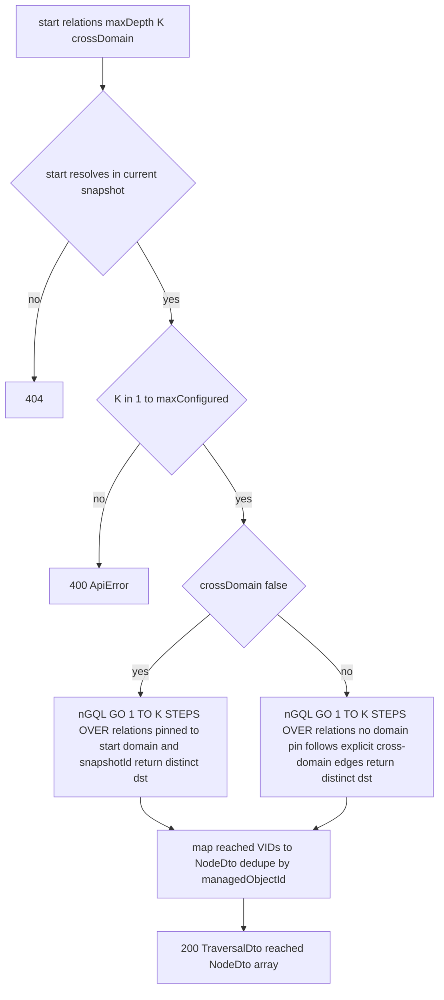

The relation set is passed as the `OVER <relation>,<relation>...` clause so only the requested edge
types are traversed (AC-11). When `crossDomain=false` (default) the `WHERE` clause also pins every
matched edge/vertex to the start's `domain`, so the traversal **cannot wander into another domain**
even if an explicit cross-domain edge exists (AC-21). `maxDepth` is bounded by
`topology.traversal.max-depth` (config, not hard-coded — maps to `GO 1 TO K STEPS`).

### §C — Site queries (list sites / objects located at a site, incl. edges)

Inputs: `domain` (and optionally `siteId`), the current snapshot. Output: the domain's `Site` nodes
(flat `SiteDto`), or the devices `LOCATED_AT` a given site **plus the edges** for the device graph.

- **List sites (P1-G7 flat `SiteDto`):** `LOOKUP ON Site WHERE Site.domain == <domain> AND
  Site.snapshotId == <current>`; for each `Site` vertex, lift `name`/`latitude`/`longitude`/`region`
  out of the stored `Site.attributes` JSON into a **flat `SiteDto { siteId, name, latitude, longitude,
  region }`** (`siteId` = the Site vertex VID/`managedObjectId`); wrap in `SiteListDto { domain,
  snapshotId, count, sites: SiteDto[] }` (AC-22).
- **Objects at a site (P1-G8 nodes AND edges):** two-step, snapshot- and domain-scoped:
  1. **Devices:** `GO FROM <siteId> OVER LOCATED_AT REVERSELY WHERE LOCATED_AT.snapshotId == <current>
     AND LOCATED_AT.domain == <domain>` to get the device VID set; fetch each as a `NodeDto` to form
     `nodes`.
  2. **Edges:** the **intra-site** edges (both `from` and `to` in the device set) **plus** the
     `LOCATED_AT` edges connecting each device to the site — fetched over the device set for the
     current snapshot/domain and mapped to `EdgeDto { edgeId, from, to, relation, domain, attributes,
     snapshotId }`.
  Return `SiteObjectsDto { siteId, domain, snapshotId, nodeCount, edgeCount, nodes: NodeDto[], edges:
  EdgeDto[] }` so web-ui draws the device-level graph from a **single** call (AC-22). Unknown site
  yields 404. Both operations are domain-scoped.

---

## Seed data & examples

**N/A — why.** Topology is a backend graph service; it does **not** generate topology data (spec
Out-of-scope). The topology *file* it ingests is produced by the **Simulator** and validated against
this service's `snapshot.schema.json`. The service ships **test fixtures only** — small conforming and
deliberately-malformed snapshot files used by the unit/contract tests
(`src/test/resources/snapshots/*.json`): e.g. `valid-min.json`,
`valid-all-core-ip-types.json` (the MVP domain's full vocabulary incl. `Site` + `LOCATED_AT` and
`Interface` + `HOSTS` + `TERMINATES`), `with-interfaces.json`, `with-sites.json`,
`with-attributes.json`, `missing-domain.json`, `bad-moid-pattern.json`, `objecttype-mismatch.json`,
`dangling-edge.json`, `unknown-objecttype-for-domain.json`, `unknown-relation-for-domain.json`,
`cross-domain-edge.json`, `riding-chain.json` (for traversal). A Knowledge-vocabulary **mock fixture**
(generated from Knowledge's published OpenAPI) supplies the `core-ip` object-type + relation sets to
unit tests. These are test fixtures, not seed data the service emits or persists.

---

## UI wireframes

**N/A — why.** Topology has **no UI**; it is a backend graph service. Topology/trail visualization is
owned by **web-ui** (Angular 20), which consumes this service's query API. The only human-facing HTML
surface is the auto-generated Swagger UI for the OpenAPI doc (developer aid, not a product UI).

---

## Error handling

First-class. Every failure mode has a defined outcome; nothing silently drops.

| # | Failure mode | Handling | Caller sees | Logged | Side effects |
|---|---|---|---|---|---|
| EH-1 | Non-conforming file (JSON-Schema fails) | reject in `SnapshotValidationService` before any write | **422** `ApiError` + `violations[]` | WARN with violations, `traceId` | **none** — no NebulaGraph write, no PostgreSQL row, **no event** (AC-3) |
| EH-2 | Missing required top-level field (`schemaVersion`/`domain`/`nodes`) | schema validation 422 | 422 | WARN | none (AC-3) |
| EH-3 | `managedObjectId` generic-pattern violation (`^[A-Za-z][A-Za-z0-9]*:[^:]+$`) | semantic check (mirrors `ManagedObjectId.PATTERN`) | 422 | WARN with offending path | none (AC-4) |
| EH-4 | `objectType` inconsistent with id prefix | semantic check | 422 | WARN | none (AC-5) |
| EH-5 | Dangling edge `from`/`to` (not in `nodes[]`) | semantic check | 422 | WARN | none (AC-6) |
| EH-6 | Unknown edge `relation` **for the snapshot's `domain`** (not in the domain's Knowledge relation vocabulary) | `VocabularyValidator` vs Knowledge vocab | 422 | WARN with offending path + domain | none (AC-7) |
| EH-6b | Unknown node `objectType` **for the snapshot's `domain`** (not in the domain's Knowledge object-type set) | `VocabularyValidator` vs Knowledge vocab | **422** | WARN with offending path + domain | **none** — no write, **no event** (AC-7b) |
| EH-6c | Knowledge domain-vocabulary unavailable (and no cached vocab for the domain) | **fail closed** — cannot validate so reject; `KnowledgeVocabClient` retries with backoff, serves a non-expired cached vocab if present | **502** `ApiError` | ERROR with domain, `traceId` | **none** — no write, **no event** |
| EH-7 | Body too large | `topology.ingest.max-file-bytes` guard | **413** | WARN | none |
| EH-8 | `topology.changed` send ultimately fails | `DlqPublisher` to `topology.changed.dlq` (envelope + error headers) | ingest already 200 (persist + cut-over succeeded); failure is async | ERROR with `snapshotId`,`traceId` | snapshot persisted + current; event on DLQ for replay |
| EH-9 | NebulaGraph abstraction leak attempt | nGQL/NebulaGraph access confined to `graph/` behind the `GraphRepository` port; controllers/DTOs/logs never carry NebulaGraph host/port/space/raw nGQL result rows | typed DTOs only | n/a | none (AC-19) |
| EH-10 | NebulaGraph write fails, or PostgreSQL cut-over tx fails (cross-store, no shared tx) | NebulaGraph-write failure means no PostgreSQL row written (data unreferenced, reaper-swept). PostgreSQL-tx failure means tx rolled back, prior snapshot stays `current`, new NebulaGraph data unreferenced (reaper-swept). Visibility is gated solely on the PostgreSQL `current` pointer. | **500** `ApiError` | ERROR | **no visible partial snapshot**; orphan NebulaGraph data swept by the orphan-snapshot reaper |
| EH-11 | NebulaGraph (space not usable / storaged not registered) or PostgreSQL or Kafka unreachable at startup | readiness probe DOWN; bootstrap (ADD HOSTS, CREATE SPACE, Flyway) retries; not ready until all reachable | 503 from probe | ERROR | service does not accept ingests until ready |
| EH-12 | Unknown `managedObjectId` on query | `GraphReadService` returns empty so 404 | **404** `ApiError` | INFO | none (AC-12) |
| EH-13 | `maxDepth` out of range / missing `start`/`relation` on traversal | request validation | **400** `ApiError` | WARN | none |
| EH-14 | Re-ingest of identical content | **not** treated as a duplicate — new `snapshotId`, new `eventId`, new event | 200 with new `snapshotId` | INFO | new snapshot; prior becomes previous (AC-14) |
| EH-15 | Consumed event with `schemaVersion` major at least 2 | n/a — **this service consumes no topic**; the event-model reject policy applies only to consumers. Producer always emits `schemaVersion=1`. | n/a | n/a | none |

`changeType` is constrained at the publisher (enum-checked in code) **and** at the PostgreSQL
`snapshot.change_type` CHECK constraint to `{full-load, incremental}` so `delete` can never be emitted
or persisted (AC-16), even though the frozen event-model schema leaves it a free-form string.

---

## Design alternatives

| Consideration | Alternatives considered | Chosen + rationale |
|---|---|---|
| **Graph backend** | (a) **NebulaGraph** (standalone distributed graph DB, nGQL); (b) Apache AGE (Postgres extension, openCypher); (c) Neo4j Community | **(a) — fixed by the merged contract** (`architecture.md` "Data stores & ownership" + `docker-compose.yml`). NebulaGraph is a purpose-built, horizontally scalable graph store and is the platform's chosen, Apache-2.0 backend. (b) was the prior design's backend; the platform moved off it. (c) Community edition's licensing (GPLv3) fails the permissive-only invariant. This design treats the backend as an implementation detail behind `GraphRepository`. |
| **Graph driver** | (a) **nebula-java** official client (`NebulaPool`/`Session`); (b) a generic socket/Thrift client; (c) a third-party ORM | **(a)**. nebula-java is the official, Apache-2.0 driver with connection pooling and prepared nGQL execution; mature ORMs for NebulaGraph are scarce and would couple us to a graph ORM. The driver lives only inside `NebulaGraphRepository`, keeping the abstraction boundary in one class. |
| **Persistence split (graph vs. metadata)** | (a) **NebulaGraph for graph + PostgreSQL for snapshot metadata** (the contract's two-store split); (b) snapshot metadata as NebulaGraph vertices; (c) snapshot metadata inferred from distinct `snapshotId` in NebulaGraph | **(a) — fixed by the merged contract.** Status/retention/producer-id mapping are relational, indexed, transactional concerns; the contract assigns them to PostgreSQL. PostgreSQL gives a transactional current/previous pointer (the cross-store commit point) and a cheap `GET /topology/snapshots` without graph scans. (b)/(c) would push transactional bookkeeping into the graph and lose the relational guarantees. |
| **Snapshot spanning two stores** | (a) **`snapshotId` property on every NebulaGraph vertex/edge inside ONE stable space, with the PostgreSQL row as the authoritative current/previous pointer**; (b) a NebulaGraph SPACE per snapshot; (c) a PostgreSQL row only, graph untagged | **(a) — chosen.** `CREATE SPACE` is heavy and async in NebulaGraph (partition allocation + propagation to storaged); a property tag inside one space makes a write a stamped insert, a read a `WHERE …snapshotId ==` predicate, and eviction a bounded delete. The PostgreSQL row remains system-of-record for which `snapshotId` is current. (b) pays space-creation cost per ingest and doubles bootstrap; (c) cannot isolate current vs previous in the graph. |
| **Cross-store atomicity** | (a) **order writes so the PostgreSQL current-pointer commit is the cut-over, NebulaGraph data invisible until then, orphan reaper sweeps unreferenced graph data**; (b) a distributed/2-phase transaction across NebulaGraph + PostgreSQL; (c) write the graph as current first, then PostgreSQL | **(a) — chosen.** NebulaGraph and PostgreSQL are separate DBs with no shared transaction (a graph store + a separate relational store cannot share one tx). Gating visibility on the PostgreSQL current pointer means a reader never sees half a snapshot; a failed ingest leaves only unreferenced NebulaGraph data the reaper deletes. (b) NebulaGraph has no XA/2PC support. (c) would briefly expose a partial/uncommitted snapshot as current. |
| **NebulaGraph space/schema bootstrap** | (a) **idempotent on service startup (`SHOW HOSTS` then `ADD HOSTS`, `CREATE SPACE/TAG/EDGE/INDEX IF NOT EXISTS`, wait-until-usable, readiness-gated)**; (b) a separate `nebula-init` one-shot Compose job only; (c) manual operator step | **(a) — chosen.** The service must work whether or not the deferred `nebula-init` job ran, so it performs the `ADD HOSTS` + space/schema creation idempotently itself and gates readiness on the space being usable. It cooperates with (b) if present (all `IF NOT EXISTS`), but does not depend on it. (c) is not automatable/testable. |
| **LOOKUP-by-property indexing** | (a) **TAG/EDGE indexes on `(domain, snapshotId)` per type, `REBUILD` once**; (b) no index, MATCH-scan; (c) index on every property | **(a)**. NebulaGraph **requires** an index for any property predicate (`domain`/`snapshotId`/list-by-type); without one, LOOKUP fails. Indexing the scope keys makes domain+snapshot reads index-efficient; objectType is implied by the TAG so needs no separate index. (b) is not even valid for property filters. (c) over-indexes (write cost) with no read benefit for unused keys. |
| **Domain isolation** | (a) **`domain` property on every vertex/edge in ONE space, domain-tagged** (queries domain-scoped by default; cross-domain only via explicit edges + opt-in); (b) a SPACE per domain; (c) a separate graph store per domain | **(a) — chosen.** Mirrors the `snapshotId`-property isolation: simplest (one space), every query domain-scoped via `WHERE domain ==` (index-backed), and supports cross-domain out of the box (an explicit cross-domain edge connects two domain-tagged vertices; `crossDomain=true` drops the pin). (b)/(c) hard-partition the store, multiply bootstrap, and make the contract's cross-domain edges impossible without cross-space joins NebulaGraph does not support cleanly. |
| **Object-type / relation vocabulary** | (a) **de-frozen, Knowledge-authored per `domain`, validated at ingest** via `KnowledgeVocabClient`; (b) frozen hard-coded set; (c) accept any token | **(a) — chosen, per merged contract.** Each domain's vocabulary is Knowledge data so a new domain needs no event-model or topology code change; Topology validates ingest against it (fail closed if unavailable). (b) blocks multi-domain and contradicts the merged invariant. (c) loses the reject-unknown-relation guarantee (AC-7). A short-TTL cache keeps the dependency cheap. |
| Snapshot validation | (a) **JSON-Schema (`networknt`) for structural + code for semantic** (refs / objectType-prefix); (b) all-in-bean-validation; (c) all-in-code | **(a)**. The structural contract lives in `snapshot.schema.json` (the owned contract) — validate against it directly; cross-record semantics (dangling refs, `objectType` equals prefix) aren't expressible in plain JSON-Schema, so a thin semantic pass follows. `networknt` is already a repo dependency. |
| `changeType` derivation | (a) **explicit query hint, default full-load (first ingest always full-load)**; (b) diff current vs incoming graph to auto-classify | **(a)**. MVP only distinguishes full-load vs incremental and the spec freezes the convention; auto-diff (b) is costly and unnecessary pre-`delete`. |
| **`edgeId` for `GET /edges/{edgeId}` — realizable lookup (Q6)** | (a) **opaque but service-decodable composite token `edgeId = base64url("<snapshotId> <from> <relation> <to>")`** — decodes to the NebulaGraph edge key `(src=from, dst=to, edgetype=relation, rank=sha1(from,relation,to))`, resolved by a **direct keyed FETCH**; (b) a **one-way sha1** `edgeId` (the prior design) used as the edge rank; (c) sha1 `edgeId` plus a persisted `edgeId -> (src,dst,relation)` reverse-map + index; (d) drop the operation and fold edge retrieval into neighbors/traversal; (e) expose a NebulaGraph internal handle | **(a) — chosen.** NebulaGraph edges are keyed only by `(src, dst, rank, edgetype)`, so the URL id must be **resolvable back to that tuple**. **(b) is unrealizable** — a sha1 is one-way, there is no index from a rank-only hash to `(src,dst,edgetype)`, so `GET /topology/edges/{edgeId}` could never resolve (the gap). (a) makes `edgeId` a reversible encoding of exactly that key, so the fetch is a direct keyed `FETCH PROP ON <relation> "<from>" -> "<to>"@<rank>` — no scan, no extra store. The same token is the `edgeId` every `EdgeDto` already carries, so list responses round-trip into this op. It stays opaque to callers (AC-19). (c) needs an extra store/index + adds drift risk; (d) drops a published operation the spec lists; (e) leaks NebulaGraph internals. The `rank` is still the deterministic `sha1(from, relation, to)` so re-insert overwrites the same edge. |
| Producer-supplied vs minted `snapshotId` | (a) **honour producer-supplied if present, else mint UUID-based**; (b) always mint | **(a)** — spec AC-8/AC-9 require honouring a supplied id and minting when absent. |
| **Ingestion response status (P1-G1)** | (a) **`200` synchronous, `SnapshotIngestResponse { snapshotId, domain, status, nodeCount, edgeCount, changeType }`**; (b) `202` accepted with a bare `{ snapshotId }` (the Simulator's prior assumption); (c) `201` created | **(a) — chosen + frozen.** The lift is synchronous — `snapshotId` is minted inline, the graph is persisted and the event emitted **before** the response returns — so the truthful status is `200`, not `202` (which implies async/queued). The richer body is additive over the bare `{ snapshotId }`; a producer needs only `snapshotId` + `status`. The Simulator aligns its upload client to the published `openapi.json`. (b) misrepresents a synchronous operation; (c) `201`/`Location` semantics don't fit (the resource is queried by `snapshotId`, not a created URL). |
| **Snapshot-file schema home (P1-G2)** | (a) **one canonical `services/topology/schema/snapshot.schema.json` owned by Topology (the validator), referenced by the Simulator producer**; (b) the schema under `libs/event-model/`; (c) two lockstep copies (one in `services/topology/`, one in `services/simulator/`) | **(a) — chosen + frozen.** Co-locating the schema with its validating owner gives a single source of truth and contract-gated changes; the Simulator references the same file (CI lockstep guard). (b) wrongly conflates the HTTP-upload file contract with the Kafka event-model payloads. (c) is exactly the drift risk the gap flagged — two copies inevitably diverge. |
| **`GET /topology/sites` shape (P1-G7)** | (a) **`SiteListDto` envelope with flat per-site `SiteDto { siteId, name, latitude, longitude, region }`**; (b) a bare top-level array `[{ siteId, ... }]`; (c) `SiteListDto` with each site a raw `NodeDto` (geo nested under `attributes`) | **(a) — chosen + frozen.** The envelope keeps `domain`/`snapshotId`/`count` so the caller knows the scope, while the **flat per-site geo** is exactly what web-ui's geo map binds to (`siteId` + top-level lat/lon/region). (c) is the prior shape that diverged from the consumer (geo nested, identity under `managedObjectId`). (b) loses the scope metadata. |
| **`GET /topology/sites/{siteId}/objects` edges (P1-G8)** | (a) **return `nodes` AND `edges` (`SiteObjectsDto` with `edges: EdgeDto[]`)**; (b) `objects: NodeDto[]` only, web-ui composes the graph via per-node `neighbors` calls | **(a) — chosen + frozen.** The web-ui draws a device-level **graph**, which needs edges; returning them in one response is cleaner and avoids an N+1 `neighbors` fan-out that is not in the documented flow. The edge set is the intra-site edges plus the `LOCATED_AT` edges to the site. (b) pushes graph composition onto every consumer and multiplies round-trips. |
| **Node `layer` representation (P1-G9)** | (a) **document `layer == objectType`; no separate field on `NodeDto`** (web-ui maps `objectType` to `layer`); (b) add an explicit `layer` field duplicating `objectType` | **(a) — chosen + frozen.** `objectType` already **is** the layer indicator (sourced from the vertex TAG); adding a separate `layer` field duplicates data and risks the two drifting. The frozen `NodeDto { managedObjectId, objectType, domain, snapshotId, name?, attributes }` documents the derivation, so web-ui maps `objectType` to `layer` with no duplicated field. (b) is redundant storage + a drift hazard. |

---

## Test plan

### Acceptance criterion to test (JUnit 5 unit/contract)

| # | Acceptance criterion | Test (class#method) | Asserts |
|---|---|---|---|
| 1 | Snapshot load + queryability; NebulaGraph not reachable externally | `IngestionQueryIT#loadThenQueryReturnsNodesAndEdges_andNebulaNotExternallyReachable` | POST valid N-node/M-edge file yields 200 + `snapshotId`; query API returns correct nodes/edges; no endpoint/env exposes a NebulaGraph host/port/space/nGQL endpoint. |
| 2 | Accept fully-conforming file | `SnapshotValidationServiceTest#acceptsConformingFile` + `IngestionControllerTest#postValidFileReturns200AndPersistsToNebula` | validation passes; NebulaGraph persist + PostgreSQL row written; 200 with `snapshotId`. |
| 3 | Reject missing required top-level field | `SnapshotValidationServiceTest#rejectsMissingDomain_schemaVersion_or_nodes` | 422 `ApiError`; `GraphWriteService` never called; `SnapshotRepository` never writes; `TopologyEventPublisher` never called. |
| 4 | Reject invalid `managedObjectId` scheme | `SnapshotValidationServiceTest#rejectsBadManagedObjectIdPattern` | 422 before any write; violation path points at the node. |
| 5 | Reject inconsistent `objectType` | `SnapshotValidationServiceTest#rejectsObjectTypeNotMatchingPrefix` | 422 before any write (`Port:p1`+`objectType=Node` yields reject). |
| 6 | Reject dangling edge reference | `SnapshotValidationServiceTest#rejectsDanglingEdgeReference` | 422 before any write when `from`/`to` not in `nodes[]`. |
| 7 | Reject unknown edge relation **for the domain** | `VocabularyValidatorTest#rejectsRelationNotInDomainVocabulary` (mock Knowledge vocab) | 422 before any NebulaGraph write when `relation` not in the snapshot `domain`'s Knowledge relation vocabulary; no event. |
| 7b | Reject unknown node `objectType` **for the domain** (de-frozen vocab) | `VocabularyValidatorTest#rejectsObjectTypeNotInDomainVocabulary` (mock Knowledge vocab) | 422 before any NebulaGraph write when `objectType` not in the domain's Knowledge object-type set; no PostgreSQL row, no event; violation cites path + domain. |
| 8 | Producer-supplied `snapshotId` honoured | `SnapshotMetadataServiceTest#usesProducerSuppliedSnapshotId` + `IngestionQueryIT#suppliedIdFlowsToResponseAndEvent` | response + emitted event + PostgreSQL row carry the supplied id. |
| 9 | Service mints `snapshotId` when absent | `SnapshotMetadataServiceTest#mintsUniqueSnapshotIdWhenAbsent` | non-empty, unique id returned in 200 and stored in PostgreSQL. |
| 10 | Lifting to typed graph (full MVP-domain vocabulary incl. Site + Interface) | `LiftingServiceTest#liftsAllCoreIpTypesWithCorrectTagsAndEdges` + `IngestionQueryIT#allTypesAndRelationsQueryable` | each node (Node to SRLG **and Site and Interface**) lifts to the correct NebulaGraph TAG + returns correct `objectType` + `domain`; each edge lifts to the correct EDGE type (incl. **LOCATED_AT**, **HOSTS**, **TERMINATES**); types/relations come from the file, not hard-coded. |
| 11 | Bounded traversal by edge type | `NebulaGraphRepositoryTest#traversalReturnsOnlyRidesOnReachableWithinDepth` (Testcontainers NebulaGraph) | `GO 1 TO K STEPS OVER RIDES_ON` returns exactly the expected RIDES_ON-reachable set within K; excludes nodes reachable only via other edge types. |
| 12 | `managedObjectId` resolution | `QueryControllerTest#getNodeReturnsObjectAndLayer_404WhenUnknown` | valid id yields NodeDto with layer (from TAG); unknown yields 404. |
| 13 | List by type + neighbors | `QueryControllerTest#listByTypeReturnsOnlyThatType` + `#neighborsReturnsDirectlyConnected` | `?objectType=Port` (LOOKUP ON Port) yields only Ports; neighbors (GO OVER) returns all directly connected. |
| 13b | **Get edge by realizable `edgeId` (Q6)** | `GraphReadServiceTest#getEdgeDecodesEdgeIdToKeyedFetch` + `QueryControllerTest#getEdgeRoundTripsAndReturns404And400` + `NebulaGraphRepositoryTest#getEdgeResolvesByDirectKeyedFetch` (Testcontainers NebulaGraph) | the `edgeId` carried in an `EdgeDto` from neighbors/traversal/site-objects **round-trips** straight into `GET /topology/edges/{edgeId}` and returns the same edge; the service base64url-**decodes** `edgeId` to `(snapshotId, from, relation, to)` and resolves it by a **direct keyed `FETCH PROP ON <relation> "<from>" -> "<to>"@<rank>`** (no scan/index); a malformed token yields **400**, a well-formed token with no such edge yields **404**; no NebulaGraph internal/rank/nGQL leaks in the body. |
| 14 | New `snapshotId` on re-ingest | `SnapshotMetadataServiceTest#reingestMintsNewSnapshotId` + `IngestionQueryIT#currentAndPreviousBothListed` | second ingest is not equal to first id; both listed by `GET /topology/snapshots` (from PostgreSQL); prior current demoted to previous. |
| 15 | First ingest emits `full-load`; payload conforms; ids match | `TopologyEventPublisherTest#firstIngestEmitsFullLoad_payloadDeserialises_idMatches` | exactly one event, `changeType=full-load`, deserialises to frozen `TopologyChangedEvent`, `snapshotId` equals API response. |
| 16 | `changeType` within approved set | `TopologyEventPublisherTest#neverEmitsChangeTypeOutsideFullLoadOrIncremental` + `SnapshotRepositoryTest#changeTypeCheckConstraintRejectsDelete` | publisher never produces `delete`/other value; PostgreSQL CHECK constraint also rejects it. |
| 17 | `topology.changed` event-model conformance | `TopologyEventConformanceTest#emittedEventValidatesAgainstFrozenSchema` | envelope + payload validate against `envelope.schema.json` + `TopologyChangedEvent.schema.json` (all required fields present). |
| 18 | OpenAPI 3.1 contract | `OpenApiContractTest#liveResponsesMatchCheckedInOpenApi` | `/openapi.json` includes ingestion + all query ops; each live response validates against checked-in `services/topology/openapi.json`; surface unchanged by the backend swap. |
| 19 | NebulaGraph abstraction boundary | `NebulaAbstractionBoundaryTest#noEndpointEnvLogOrBodyLeaksNebulaInternals` | no controller/DTO/env/log exposes a NebulaGraph host/port/space/conn string or raw nGQL result row; ArchUnit-style check that **only** `com.acp.topology.graph.NebulaGraphRepository` issues nGQL / touches the nebula-java `Session`. |
| 20 | **Structured attributes stored + returned** (contract well-known keys, extensible) | `LiftingServiceTest#preservesAttributesVerbatim` + `IngestionQueryIT#attributesRoundTripUnchanged` | device/connection/Site `attributes` (vendor/model/equipmentType/role/capacity, linkType/protectionRole, lat/long/region) serialize to the NebulaGraph JSON-string property and round-trip unchanged in `NodeDto`/`EdgeDto`; no attribute-value validation performed. |
| 21 | **Domain-scoped query isolation + explicit cross-domain edge** | `NebulaGraphRepositoryTest#traversalStaysWithinDomainByDefault` + `#crossDomainEdgeFollowedOnlyWhenOptIn` (Testcontainers NebulaGraph; fixture has two domains joined by one explicit cross-domain edge) | default traversal/neighbors/list never returns another domain's nodes even across an explicit cross-domain edge; with `crossDomain=true` the cross-domain edge is followed and the other-domain node is reached; list/site queries are domain-filtered. |
| 22 | **Site + LOCATED_AT lift + site query API (frozen shapes — P1-G7/P1-G8)** | `LiftingServiceTest#liftsSiteAndLocatedAt` + `QueryControllerTest#listSitesReturnsFlatSiteDto` + `QueryControllerTest#objectsAtSiteReturnsNodesAndEdges_404WhenUnknownSite` (with `IngestionQueryIT#siteVisualizationPath`) | `Site` TAG + `LOCATED_AT` EDGE lift like any typed node/edge; `GET /topology/sites` returns **`SiteListDto { domain, snapshotId, count, sites: SiteDto[] }`** with each **flat `SiteDto { siteId, name, latitude, longitude, region }`** (geo lifted out of attributes); `GET /topology/sites/{siteId}/objects` returns **`SiteObjectsDto { siteId, domain, snapshotId, nodeCount, edgeCount, nodes: NodeDto[], edges: EdgeDto[] }`** (nodes AND edges); unknown site yields 404; all domain-scoped. |
| 23 | **objectType/relation validated vs Knowledge vocabulary** (de-frozen) | `VocabularyValidatorTest#acceptsTypesAndRelationsInDomainVocab_rejectsOthers` + `KnowledgeVocabClientTest#fetchesAndCachesVocabFromMock` + `IngestionControllerTest#failsClosedWhenVocabUnavailable` | accepted file uses only domain-vocab types/relations; unknown ones yield 422 (cross-refs AC-7/7b); client built/mocked from Knowledge's published OpenAPI, vocab cached with TTL; Knowledge unavailable + no cache yields 502, no write, no event (EH-6c). |
| 24 | **`Interface` + `HOSTS`/`TERMINATES` lift, query + domain-vocab validation** (merged §5 model) | `LiftingServiceTest#liftsInterfaceAndHostsAndTerminates` + `QueryControllerTest#interfacesOnPortAndIpLinkTerminatedByInterface` + `VocabularyValidatorTest#acceptsInterfaceHostsTerminatesInCoreIpVocab` (with `IngestionQueryIT#interfaceLayeringQueryable`, Testcontainers) | a snapshot with `Interface` nodes + `HOSTS`/`TERMINATES` edges lifts via the generic typed path (TAG `Interface`, EDGE `HOSTS`/`TERMINATES`, `domain`+`attributes` preserved, no special-casing); they validate as members of the `core-ip` Knowledge vocabulary (absent from vocab yields 422); `GET /nodes?objectType=Interface` lists interfaces, `neighbors?relation=HOSTS` from a Port returns its interfaces, `neighbors?relation=TERMINATES` from an Interface returns its IPLink, and a `HOSTS`+`TERMINATES` traversal walks Port to Interface to IPLink — all domain-scoped. |
| 25 | **Cross-store persistence split + atomic cut-over + no partial snapshot** | `IngestionPersistenceIT#nebulaWrittenThenPostgresCutOverMakesCurrent` + `IngestionPersistenceIT#postgresCutOverFailureLeavesPriorCurrentAndNoVisiblePartial` + `OrphanReaperTest#sweepsNebulaSnapshotIdsWithNoPostgresRow` (Testcontainers NebulaGraph + PostgreSQL) | graph data lands in NebulaGraph and becomes visible only after the PostgreSQL current-pointer commit; a forced PostgreSQL-tx failure leaves the prior snapshot `current`, the new graph data unreferenced and invisible, and 500 returned; the orphan reaper deletes NebulaGraph `snapshotId`s with no PostgreSQL row. |
| 26 | **NebulaGraph bootstrap idempotent (storaged ADD HOSTS + space/schema)** | `NebulaSchemaBootstrapIT#idempotentSpaceSchemaAndAddHostsAcrossRestarts` (Testcontainers NebulaGraph) | on a fresh NebulaGraph, startup runs `ADD HOSTS` (only if storaged unregistered) then `CREATE SPACE/TAG/EDGE/INDEX IF NOT EXISTS` + `REBUILD`, waits until the space is usable, and re-running the bootstrap is a no-op (no errors, no duplicate schema); readiness reports UP only once the space is usable. |
| 27 | **Ingestion returns the frozen `200 SnapshotIngestResponse` (P1-G1)** | `IngestionControllerTest#postValidFileReturns200WithFrozenSnapshotIngestResponse` + `OpenApiContractTest#ingestionResponseMatchesFrozenSchema` | a valid POST yields **HTTP 200** (not 202) with body `{ snapshotId, domain, status, nodeCount, edgeCount, changeType }`; `snapshotId` non-empty + equals the value carried in the emitted event; the live response validates against the `SnapshotIngestResponse` schema in the checked-in `services/topology/openapi.json`. |
| 28 | **`GET /topology/sites` returns the frozen flat `SiteDto` shape (P1-G7)** | `QueryControllerTest#listSitesReturnsFlatSiteDto` + `OpenApiContractTest#siteListMatchesFrozenSchema` | response is `SiteListDto { domain, snapshotId, count, sites: [...] }` and **each site is `{ siteId, name, latitude, longitude, region }`** with **flat** top-level geo (not nested under `attributes`, not a raw NodeDto); `siteId` equals the Site node's `managedObjectId`; validates against the checked-in `openapi.json`. |
| 29 | **`GET /topology/sites/{siteId}/objects` returns nodes AND edges (P1-G8)** | `QueryControllerTest#objectsAtSiteReturnsNodesAndEdges_404WhenUnknownSite` + `GraphReadServiceTest#objectsAtSiteEdgesAreIntraSiteAndLocatedAt` + `OpenApiContractTest#siteObjectsMatchesFrozenSchema` | response is `SiteObjectsDto { siteId, domain, snapshotId, nodeCount, edgeCount, nodes: NodeDto[], edges: EdgeDto[] }`; `nodes` = devices `LOCATED_AT` the site; `edges` = intra-site edges (both endpoints in the device set) plus the `LOCATED_AT` edges to the site, each an `EdgeDto { edgeId, from, to, relation, domain, attributes, snapshotId }`; unknown site yields 404; validates against the checked-in `openapi.json`. |
| 30 | **`GET /topology/nodes/{managedObjectId}` returns the frozen `NodeDto`; `layer == objectType` (P1-G9)** | `QueryControllerTest#getNodeReturnsFrozenNodeDto_layerEqualsObjectType` + `OpenApiContractTest#nodeDtoMatchesFrozenSchema` | response is exactly `NodeDto { managedObjectId, objectType, domain, snapshotId, name?, attributes }` with **no separate `layer` field**; the design + `openapi.json` document that `layer` is `objectType`; validates against the checked-in `openapi.json`. |
| 31 | **Snapshot file validates against the single canonical schema; one home, no Simulator copy (P1-G2)** | `SnapshotSchemaCanonicalTest#validatesAgainstSingleCheckedInSchema` + `SnapshotSchemaCanonicalTest#exactlyOneCanonicalSchemaFileExists` (+ CI lockstep guard) | a conforming snapshot file validates against **`services/topology/schema/snapshot.schema.json`** and a malformed one fails; the canonical schema exists at that single path; **no** `services/simulator/schema/...` lockstep duplicate exists; the Simulator references this same file (CI lockstep guard fails the build on drift or a forked copy). |
| 32 (spec **AC-25**) | **Interface model lifts and is queryable end-to-end — Port HOSTS Interface TERMINATES IPLink, ADJACENCY_OVER between interfaces (Core-IP §5 layering)** | `InterfaceModelTest#liftsInterfaceWithHostsTerminatesAndAdjacencyOver` + `InterfaceModelTest#listsInterfacesByObjectType` + `InterfaceModelTest#neighborsResolvePortHostsInterfaceTerminatesIpLink` + `InterfaceModelTest#adjacencyOverResolvesBetweenInterfaces` + `InterfaceModelTest#resolvesInterfaceManagedObjectIdToTypedNodeDto` + `InterfaceModelTest#interfaceTypeAndRelationsRejectedWhenAbsentFromDomainVocab` (with `IngestionQueryIT#interfaceLayeringQueryable`, Testcontainers NebulaGraph) | a small Port/Interface/IPLink/IGPAdjacency snapshot (`with-interfaces.json`) lifts via the generic typed path: each `Interface` becomes a typed `Interface` vertex (objectType `Interface`) and the `HOSTS` (Port to Interface), `TERMINATES` (Interface to IPLink), and `ADJACENCY_OVER` (Interface to IGPAdjacency) edges are all created on the correct endpoints — `domain`+`attributes` preserved, **no Interface-specific code path**. `GET /topology/nodes?objectType=Interface` lists exactly the interfaces; `GET /topology/nodes/{port}/neighbors?relation=HOSTS` returns the port's Interface and `GET /topology/nodes/{interface}/neighbors?relation=TERMINATES` returns its IPLink (so a HOSTS+TERMINATES traversal walks **Port to Interface to IPLink**); `GET /topology/nodes/{interface}/neighbors?relation=ADJACENCY_OVER` resolves **between interfaces** — an interface's ADJACENCY_OVER neighbor is the IGPAdjacency (adjacencies run between interfaces, not nodes). `GET /topology/nodes/{Interface:*}` returns the object as a typed `NodeDto` with `objectType == Interface` (layer == objectType). `Interface`/`HOSTS`/`TERMINATES`/`ADJACENCY_OVER` validate as members of the `core-ip` Knowledge vocabulary; an interface type/relation absent from the domain vocabulary yields **422** (cross-refs AC-7/7b). All domain-scoped, typed DTOs only. |

(Unit tests mock the `GraphRepository`/`SnapshotRepository` ports + Kafka **+ the Knowledge
vocabulary endpoint (stub from Knowledge's published OpenAPI)**; the `…IT` and the
traversal/cross-domain/persistence/bootstrap tests use Testcontainers **NebulaGraph + PostgreSQL +
Kafka**. The Core-IP object-type + relation set is supplied as the `core-ip` Knowledge-vocab fixture,
so the spec's original nine-types / six-relations criteria are exercised as the MVP domain's authored
vocabulary. **Every spec acceptance criterion (1..25) maps 1:1 to a named test above** — spec **AC-25**
(the Interface model end-to-end) maps to row **32** (`InterfaceModelTest` + `IngestionQueryIT`).)

### E2E scenarios (from the Topology Service's point of view)

| # | Scenario | Trigger to path | Expected outcome |
|---|---|---|---|
| E1 | **Happy path P1 onboarding** | Simulator-style client POSTs a valid Core-IP snapshot (full MVP-domain vocabulary incl. **Site** + **LOCATED_AT** + structured **attributes**) then validate schema then validate types/relations vs the `core-ip` Knowledge vocabulary then lift (domain-tagged) then NebulaGraph persist then PostgreSQL current cut-over then emit `topology.changed` | 200 + `snapshotId` + `domain`; current snapshot queryable from NebulaGraph; attributes round-trip; exactly one `full-load` event whose `snapshotId` matches; payload deserialises to the frozen binding. |
| E2 | **Reject malformed / unknown-for-domain, no side effects** | POST files with: a dangling edge ref; a bad generic moId; an `objectType` not in the `core-ip` vocabulary; a `relation` not in the `core-ip` vocabulary | each yields 422 `ApiError`; **nothing** in NebulaGraph; **no** PostgreSQL row; **no** event on `topology.changed`. |
| E3 | **Re-ingest versioning** | POST snapshot v1 (full-load) then POST snapshot v2 (incremental) | two distinct `snapshotId`s; `GET /topology/snapshots` (PostgreSQL) lists current(v2)+previous(v1); v2 event `changeType=incremental`; oldest beyond previous evicted from NebulaGraph + PostgreSQL. |
| E4 | **Query path for consumers (P2)** | After E1, a consumer does resolve then neighbors then bounded RIDES_ON traversal (depth 2), all domain-scoped | typed DTOs only (incl. `domain` + `attributes`); traversal returns exactly RIDES_ON-reachable nodes within the domain; unknown id yields 404; no NebulaGraph internals/nGQL in any body/log. |
| E5 | **Event emit failure to DLQ (partial/failure path)** | Persist + cut-over succeed, then `topology.changed` broker send fails (broker injected-down) | snapshot remains current + queryable; envelope lands on `topology.changed.dlq` with error headers; ERROR log with `snapshotId`/`traceId`; no data loss. |
| E6 | **Atomic cross-store write under NebulaGraph/PostgreSQL failure** | Force a PostgreSQL cut-over failure (or NebulaGraph write failure) mid-ingest | no visible partial snapshot; prior snapshot stays `current`; orphan NebulaGraph data reaper-swept; 500 `ApiError`; retry of the same POST succeeds cleanly. |
| E7 | **OpenAPI contract integrity** | Build generates `openapi.json`; contract test runs live | checked-in `services/topology/openapi.json` matches live `/openapi.json`; ingestion + all query ops (incl. the two **site** ops) present; surface unchanged by the backend swap; drift fails CI. |
| E8 | **Site-level visualization path (frozen shapes — P1-G7/P1-G8)** | After E1, web-ui-style caller: `GET /topology/sites?domain=core-ip` then `GET /topology/sites/{siteId}/objects` | sites returned as **flat `SiteDto { siteId, name, latitude, longitude, region }`** inside `SiteListDto`; objects-at-site returns **`nodes` AND `edges`** (devices LOCATED_AT the site plus their intra-site / LOCATED_AT edges), so a device graph renders from one call; domain-scoped; unknown site yields 404. |
| E9 | **Domain isolation + explicit cross-domain (structure path)** | Ingest a two-domain snapshot joined by one explicit cross-domain edge; traverse from a node default vs `crossDomain=true` | default traversal stays in the start domain (other-domain node **not** reached); `crossDomain=true` reaches the other-domain node only via the explicit cross-domain edge. (MVP data is single-domain; exercises the isolation structure on the integration stack.) |
| E10 | **Vocabulary fail-closed (failure path)** | Knowledge domain-vocabulary endpoint made unavailable (no cached vocab), then POST a valid file | ingest rejected **502** `ApiError`; **no** NebulaGraph write, **no** PostgreSQL row, **no** event; ERROR logged with domain/`traceId`; succeeds once Knowledge is reachable again. |
| E11 | **Interface layering path (merged §5 model — spec AC-25)** | Ingest `with-interfaces.json` (Port HOSTS Interface TERMINATES IPLink, ADJACENCY_OVER between interfaces) then validate vs `core-ip` vocab then lift then persist; then query the layering | 200 + `snapshotId`; `Interface` TAG and `HOSTS`/`TERMINATES`/`ADJACENCY_OVER` EDGEs lift like any typed object and validate as Core-IP vocab; `GET /nodes?objectType=Interface` lists them; `neighbors?relation=HOSTS` from a Port returns its interfaces; `neighbors?relation=TERMINATES` from an Interface returns its IPLink; `neighbors?relation=ADJACENCY_OVER` from an Interface returns the IGPAdjacency (adjacency resolves **between interfaces**, not nodes); a `HOSTS`+`TERMINATES` traversal walks Port to Interface to IPLink; `GET /nodes/{Interface:*}` resolves to a typed `NodeDto` with `objectType == Interface` — all domain-scoped, typed DTOs only. |
| E12 | **Fresh-stack bootstrap path** | Bring up NebulaGraph (metad+storaged+graphd) + PostgreSQL + Kafka, then start Topology with no pre-existing space | startup registers storaged (`ADD HOSTS`) if needed, creates the space/schema/indexes idempotently, migrates PostgreSQL, gates readiness until the space is usable; first ingest then succeeds. Restarting Topology re-runs the bootstrap as a no-op. |
| E13 | **Frozen producer-contract integrity (data-integration freeze — P1-G1/G2/G7/G8/G9)** | Build generates `openapi.json`; a Simulator-style upload client + a web-ui-style query client (both generated from the published `openapi.json`) run against the live service; a producer validates a generated snapshot file against the single canonical schema | ingestion returns **200 `SnapshotIngestResponse`** (the generated upload client reads `snapshotId` from the 200 body); `GET /topology/sites` returns flat `SiteDto`; `GET /topology/sites/{siteId}/objects` returns nodes+edges; `GET /topology/nodes/{moId}` returns the frozen `NodeDto` (layer == objectType); the snapshot file validates against the one canonical `services/topology/schema/snapshot.schema.json`; all live shapes match the checked-in `openapi.json` (drift fails CI). |

These run on the `integration` branch against the Compose stack (real NebulaGraph + PostgreSQL + Kafka
+ real Knowledge for vocabulary); E2/E5/E6/E10 are the failure/partial paths, E12 the
bootstrap/readiness path, and E13 the frozen producer-contract integrity path consumers build against.

---

## Config & observability

**Config (env, no hard-coded URLs/thresholds; NebulaGraph + PostgreSQL configs are internal-only and
never forwarded to callers):**

| Env var / property | Purpose | Default |
|---|---|---|
| `TOPOLOGY_KAFKA_BOOTSTRAP_SERVERS` | Kafka brokers | (required) |
| `TOPOLOGY_NEBULA_HOSTS` | NebulaGraph graphd host:port list (e.g. `nebula-graphd:9669`) | (required) |
| `TOPOLOGY_NEBULA_SPACE` | NebulaGraph space name | `topology` |
| `TOPOLOGY_NEBULA_USERNAME` / `_PASSWORD` | NebulaGraph credentials (secret) | (required) |
| `TOPOLOGY_NEBULA_POOL_MAX` / `_MIN` | nebula-java `NebulaPool` sizing | `20` / `2` |
| `TOPOLOGY_NEBULA_STORAGED_HOST` | storaged host:port for the idempotent `ADD HOSTS` bootstrap (e.g. `nebula-storaged:9779`) | (required) |
| `TOPOLOGY_POSTGRES_JDBC_URL` / `_USERNAME` / `_PASSWORD` | PostgreSQL snapshot-metadata connection (secret) | (required) |
| `TOPOLOGY_INGEST_MAX_FILE_BYTES` | max snapshot body size (yields 413) | `10485760` |
| `TOPOLOGY_TRAVERSAL_MAX_DEPTH` | upper bound for `maxDepth` (maps to `GO 1 TO K STEPS`) | `8` |
| `TOPOLOGY_SNAPSHOT_RETENTION` | retained snapshots per domain (current+previous) | `2` |
| `TOPOLOGY_KNOWLEDGE_BASE_URL` | Knowledge Service base URL (domain-vocabulary API) | (required) |
| `TOPOLOGY_KNOWLEDGE_MODE` | `mock` (stub from Knowledge OpenAPI) or `real` | `real` |
| `TOPOLOGY_KNOWLEDGE_VOCAB_PATH` | path template of the **frozen** Knowledge domain-vocabulary operation; `{domain}` is substituted at call time | `/domains/{domain}/vocabulary` |
| `TOPOLOGY_KNOWLEDGE_VOCAB_TTL_SECONDS` | TTL for the cached per-domain vocabulary | `300` |

Kafka producer is explicitly idempotent: `enable.idempotence=true`, `acks=all`,
`max.in.flight.requests.per.connection<=5`, `retries` set. Emitted `schemaVersion`=1.

**Observability:**
- `/health` (Actuator) — liveness + **readiness** gated on **NebulaGraph space usable** + **PostgreSQL
  reachable** + Kafka reachable (EH-11). Readiness DOWN until the bootstrap (ADD HOSTS, CREATE SPACE,
  Flyway) completes.
- `/metrics` (Prometheus via Micrometer) — counters/timers: `topology_ingest_total{result,domain}`,
  `topology_validation_failures_total{rule,domain}` (incl. `rule=domain-vocabulary`),
  `topology_knowledge_vocab_fetch_total{result}`, `topology_knowledge_vocab_unavailable_total`,
  `topology_snapshot_minted_total`, `topology_nebula_write_seconds`, `topology_nebula_orphan_reaped_total`,
  `topology_events_emitted_total`, `topology_events_dlq_total`, `topology_query_seconds{op}`.
- **Structured JSON logs** (Logback JSON), MDC carries `snapshotId` + `domain` + `traceId` where in
  scope; one log line per significant op (ingest received, validation result, snapshot minted, NebulaGraph
  write, PostgreSQL cut-over, event emitted, query served, error). Logs never carry NebulaGraph
  connection details or nGQL result rows (AC-19/EH-9).

---

## Build & run

- **Build:** `./gradlew build` (Java 17). A Gradle task generates the OpenAPI doc and **fails the build
  if the checked-in `services/topology/openapi.json` drifts** (backs AC-18). Depends on
  `com.acp:event-model:0.1.0` and the **nebula-java** client (`com.vesoft:client`, Apache-2.0).
- **Migrations / bootstrap:**
  - **PostgreSQL:** Flyway on startup creates the `topology_meta.snapshot` table + indexes.
  - **NebulaGraph:** `NebulaSchemaBootstrap` on startup registers storaged
    (`ADD HOSTS "nebula-storaged":9779;` if not already registered via `SHOW HOSTS`), then
    `CREATE SPACE/TAG/EDGE/INDEX IF NOT EXISTS` + `REBUILD`, waiting until the space is usable.
    Idempotent across restarts and cooperative with the deferred `nebula-init` Compose job.
- **Container / Compose:** `eclipse-temurin:17-jdk` base; Dockerfile + Docker Compose entry that
  `depends_on` the merged infra services — **`nebula-graphd`** (port 9669), `nebula-metad`,
  `nebula-storaged` (vesoft/nebula-* v3.8.0, Apache-2.0), **`postgres:16`** (snapshot metadata), and
  `kafka`. Reuses the merged `docker-compose.yml` wiring; env-driven config per the table above.
- **Local run:** `docker compose up nebula-metad nebula-storaged nebula-graphd postgres kafka topology`
  then `curl -X POST :8080/topology/snapshots -H 'Content-Type: application/json' --data @snapshot.json`.
- **Tests:** `./gradlew test` (unit/contract, mocked `GraphRepository`/`SnapshotRepository`/Kafka) and
  `./gradlew integrationTest` (Testcontainers **NebulaGraph + PostgreSQL + Kafka**).

---

## Design-stage notes (genuine ambiguities — resolved as design decisions, not contract changes)

1. **How a file signals `full-load` vs `incremental`.** The contract fixes the `changeType` set (and
   that the first ingest is `full-load`) but not the *signal*. Decision: accept an optional
   `?changeType=full-load|incremental` query parameter on `POST /topology/snapshots`, defaulting to
   `full-load` when the graph is empty and otherwise to `full-load` unless the producer asks for
   `incremental`. This is a request-shape detail in the published OpenAPI; it adds **no** Kafka
   payload/field and is **not** a contract change.
2. **Emitted node/edge descriptors are domain-driven, not a fixed list.** The emitted `nodes[]`/`edges[]`
   descriptors carry whatever `objectType`s and `relation`s the (vocab-validated) snapshot declared for
   its `domain`. The event-model payload arrays are `additionalProperties:true`, so emitting the typed
   descriptors (incl. `Site`, `LOCATED_AT`, and the `attributes`/`domain` fields) validates against the
   frozen event-model schema — no schema change needed.
3. **Knowledge domain-vocabulary API shape is now FROZEN (was design-stage).** The earlier open item
   *"exact path/shape is design-stage on Knowledge's side"* is **resolved**: Knowledge has frozen the
   operation as **`GET /domains/{domain}/vocabulary`** → **`200 { domain, objectTypes[], relations[],
   version }`** (`404` unknown domain) — Knowledge design §A, gap **P1-G11**. The `KnowledgeVocabClient`
   and its unit-test mock are built against this frozen shape (and validated by Knowledge's provider-side
   `VocabularyEndpointContractTest`); `topology.knowledge.vocab-path` defaults to that concrete path
   template. This is an **existing-contract dependency** on an already-frozen Knowledge surface, **not** a
   new contract change.
4. **NebulaGraph attribute storage as a JSON string.** NebulaGraph has no native map/JSON property type,
   so the open `attributes` map is stored as a serialized JSON **string** property and parsed back on
   read. This is purely internal (behind `GraphRepository`); it does not change the API `attributes`
   shape callers see, the snapshot file schema, or the event payload — not a contract change.
