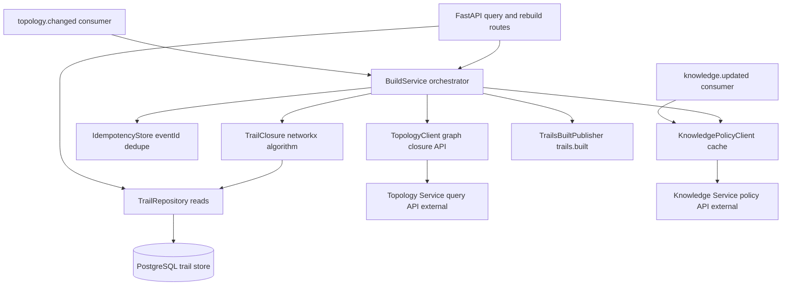
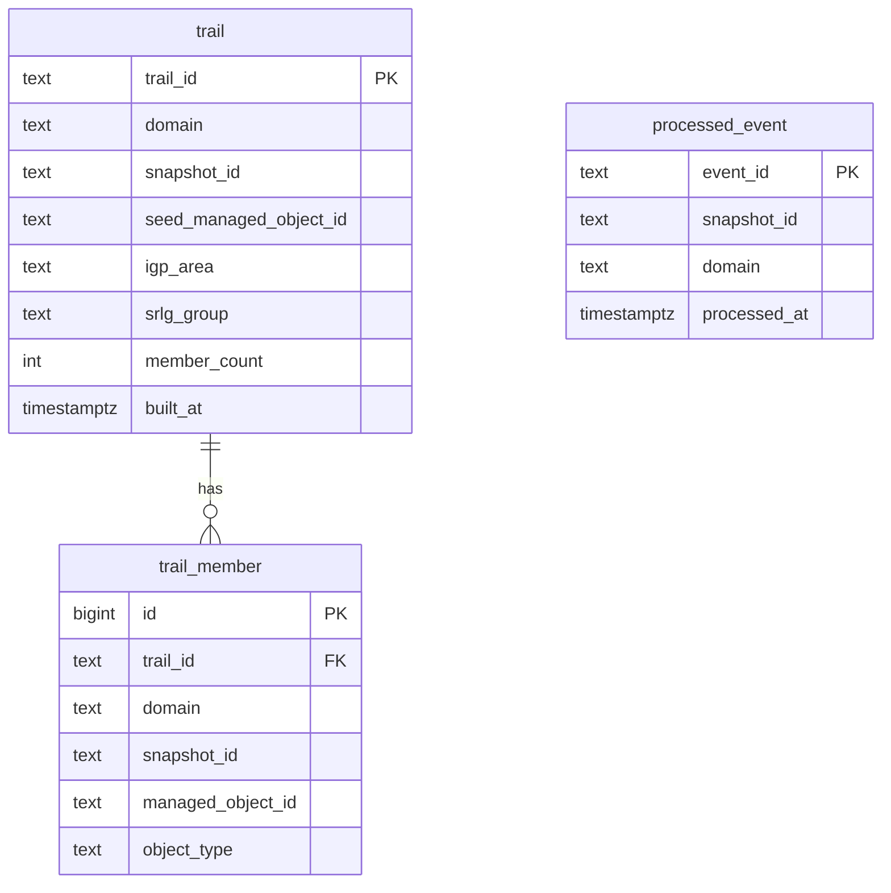
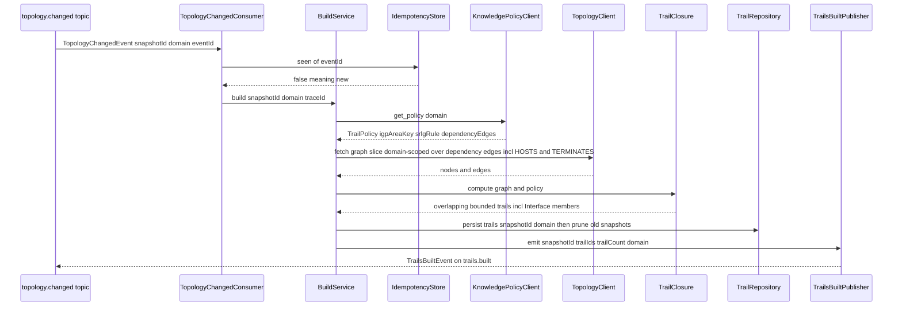
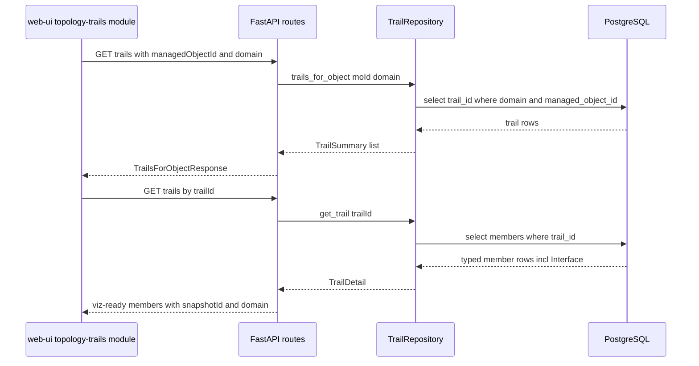
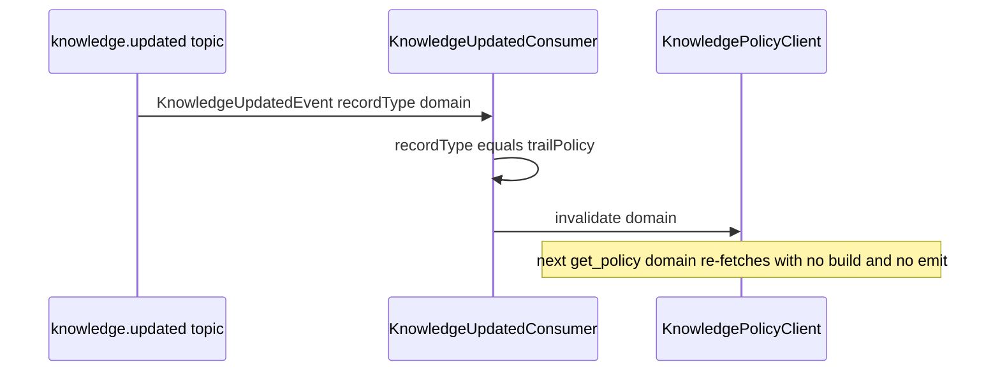
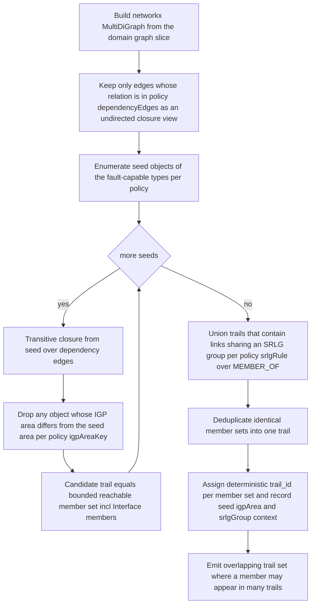

# trail-builder — Design

Buildable design for the Trail Builder Service, derived from the approved, merged
`services/trail-builder/spec.md` (PRs #33, #88, #93) on the `trail-builder` branch. Honours
the contract-first, single-owner, idempotency, DLQ, `/health`+`/metrics`, and
permissive-license invariants. Reads the Topology graph via its query API only (never AGE).

The contract surface this design builds against (`topology.changed` carrying `domain`,
`TrailsBuiltEvent` carrying `domain`, the §5 Interface model with `HOSTS` / `TERMINATES`) is
already FROZEN in `libs/event-model` and merged into `docs/architecture.md`. No contract change
is proposed here.

## Stack

- **Language / runtime:** Python 3.13 (pinned to the local toolchain per `CLAUDE.md`).
- **Graph closure:** `networkx` (BSD-3-Clause) — in-memory directed multigraph for the
  per-snapshot graph slice and the transitive-closure traversal.
- **Query API:** FastAPI (MIT) + Uvicorn (BSD-3-Clause); Pydantic v2 (MIT) for request/response
  models and for the `acp_event_model` payload bindings. OpenAPI 3.1 is generated by FastAPI.
- **Kafka client:** `confluent-kafka` (Apache-2.0) consumer/producer.
- **Persistence:** PostgreSQL (PostgreSQL License) via SQLAlchemy Core (MIT) +
  `psycopg` (LGPL-with-linking-exception, permissive in practice) driver; Alembic (MIT) for
  schema migrations.
- **HTTP client (integration points):** `httpx` (BSD-3-Clause); `respx` (BSD-3-Clause) for
  OpenAPI-stub mocking in unit tests.
- **Event contract:** `acp_event_model` (the repo's `libs/event-model` Python/Pydantic binding)
  — `TopologyChangedEvent`, `KnowledgeUpdatedEvent`, `TrailsBuiltEvent`, `Envelope`,
  `ManagedObjectId`, `deserialize`/`serialize`.
- **Metrics:** `prometheus-client` (Apache-2.0). **Logging:** stdlib `logging` with a JSON
  formatter. **Tests:** `pytest` (MIT) — the fixed Python-cohort unit/contract framework.

All licenses above are MIT / BSD / Apache-2.0 / PostgreSQL — permissive only.

## Task breakdown (from the spec)

Every spec Task (1–8) is realized below; no task is dropped or re-scoped.

| Spec task | Realized by (modules / flow) |
|---|---|
| **1. Consume `topology.changed` and trigger a domain-scoped build (+ on-demand API).** | `kafka_consumer.TopologyChangedConsumer` decodes the envelope, reads `domain` directly from the payload, calls `idempotency.IdempotencyStore.seen(eventId)`, and on a new event invokes `build_service.BuildService.build(snapshotId, domain, traceId)`. On-demand path: `api.routes.rebuild` (`POST /trails/rebuild`) calls the same `BuildService.build`. Key flow A. |
| **2. React to `knowledge.updated` for trail-policy changes.** | `kafka_consumer.KnowledgeUpdatedConsumer` decodes `KnowledgeUpdatedEvent`; when `recordType == "trailPolicy"` it calls `policy_client.invalidate(domain)` so `KnowledgePolicyClient` re-fetches on next access. No build is triggered, no `trails.built` emitted. |
| **3. Fetch graph closures from the Topology Service.** | `topology_client.TopologyClient` calls the Topology query API (`GET /topology/nodes?objectType=&domain=` to enumerate seeds, `GET /topology/nodes/{moId}/neighbors`, `GET /topology/traversal?start=&relation=&maxDepth=`) over `httpx`, domain-scoped, traversing the dependency-edge relations from the policy (incl. `HOSTS`/`TERMINATES`). Never touches AGE. |
| **4. Fetch trail policy from Knowledge (domain-parameterized).** | `policy_client.KnowledgePolicyClient.get_policy(domain)` calls the Knowledge read API for the `trailPolicy` record scoped to `domain`, returning a `TrailPolicy` value object (IGP-area key, SRLG-union rule, dependency-edge set). Cached per-domain; invalidated by Task 2. No hard-coded policy values. |
| **5. Compute trails per domain, traversing Interface objects.** | `closure.TrailClosure` builds a `networkx.MultiDiGraph` slice and computes overlapping, IGP-area-bounded transitive closures over the policy's dependency-edge set (which includes `HOSTS` Port to Interface and `TERMINATES` Interface to IPLink, so `Interface:*` objects are natural members), then unions SRLG-co-member links into shared trails. Algorithm logical flow below. |
| **6. Persist trail definitions with domain.** | `repository.TrailRepository` writes `trail` + `trail_member` rows in one transaction tagged with `snapshotId` and `domain`; a rebuild for the same `domain`+`snapshotId` supersedes prior rows for that pair; older snapshots retained per the retention rule (Data model). |
| **7. Serve domain-scoped queries + browse via API.** | `api.routes`: `GET /trails?managedObjectId=&domain=` (getTrailsForObject), `GET /trails/{trailId}` (getTrail, viz-ready typed members), `GET /trails?snapshotId=&domain=` (listTrails summaries). FastAPI publishes OpenAPI 3.1 at `/openapi.json`; the generated `openapi.json` is checked into `services/trail-builder/`. |
| **8. Emit `trails.built` with `domain`.** | `event_publisher.TrailsBuiltPublisher` builds a `TrailsBuiltEvent` (`snapshotId`, `trailIds`, `trailCount == len(trailIds)`, `domain` taken from the triggering event — no Topology lookup) wrapped in an `Envelope`, serialized via `acp_event_model.serialize`, produced to `trails.built`. |

## Phase applicability (design view)

Consistent with the spec's Phase applicability table and the canonical phase map in
`docs/architecture.md` (trail-builder row: P1 Active, P2 Passive, P3 Passive). A
`knowledge.updated` trail-policy refresh or a new `topology.changed` may fire a P1-style Active
rebuild at any wall-clock time; such a rebuild is classified as P1 work.

| Phase | Active/Passive/Idle | Modules/handlers exercised | Inputs/Outputs |
|---|---|---|---|
| P1 — Topology onboarding | **Active** | `TopologyChangedConsumer`, `IdempotencyStore`, `BuildService`, `TopologyClient`, `KnowledgePolicyClient`, `TrailClosure`, `TrailRepository`, `TrailsBuiltPublisher`. **Concurrently** the query API (`api.routes` getTrailsForObject / getTrail / listTrails) serves the web-ui topology-trails module. `KnowledgeUpdatedConsumer` active as a refresh trigger. | In: `topology.changed` (domain read from event), Topology graph-closure API (domain-scoped), Knowledge trail-policy API (domain-parameterized), `knowledge.updated`. Out: `trails.built` (carrying `domain`); `topology.changed.dlq` on poison; query API responses. |
| P2 — Pattern learning | **Passive** | `api.routes` query endpoints only (getTrailsForObject / getTrail / listTrails). `KnowledgeUpdatedConsumer` may refresh policy. Build pipeline dormant unless a rebuild is triggered (then P1 work). | In: query API calls from Enrichment / Noise Filter / Pattern Miner / web-ui. Out: query responses. No topic output of its own. |
| P3 — Real-time correlation | **Passive** | `api.routes` query endpoints only (live-path Enrichment trail-tagging via getTrailsForObject). Build pipeline dormant unless triggered. | In: query API calls (e.g. Enrichment live path). Out: query responses. No topic output of its own. |

## Module breakdown

- **`kafka_consumer`** — `TopologyChangedConsumer` (build trigger, dedupe, DLQ routing) and
  `KnowledgeUpdatedConsumer` (policy-refresh trigger only). Each rejects unknown major
  `schemaVersion` and routes poison messages to `topology.changed.dlq`.
- **`build_service`** — orchestrates a build: idempotency check, policy fetch, graph fetch,
  closure compute, persist, emit. Shared by the Kafka path and the `POST /trails/rebuild` path.
- **`idempotency`** — `IdempotencyStore` backed by the `processed_event` table; `seen(eventId)`
  is an atomic insert-if-absent.
- **`topology_client`** — `TopologyClient` against the Topology Service published OpenAPI;
  config-switchable mock/real; domain-scoped traversal over the policy dependency edges.
- **`policy_client`** — `KnowledgePolicyClient` against the Knowledge Service published OpenAPI;
  per-domain `TrailPolicy` cache; `invalidate(domain)`.
- **`closure`** — `TrailClosure`: networkx graph build + IGP-area-bounded transitive closure +
  SRLG union (the algorithm).
- **`repository`** — `TrailRepository`: transactional persist + supersession + the three read
  queries.
- **`event_publisher`** — `TrailsBuiltPublisher`: builds + serializes + produces `TrailsBuiltEvent`.
- **`api`** — FastAPI app, routes, request/response models, `/health`, `/metrics`, `/openapi.json`.
- **`config`** — env-driven settings (base URLs, modes, DB DSN, Kafka brokers, default-domain
  fallback). **`observability`** — JSON logging + Prometheus metrics.

## Data model / DB schema

Trail Builder owns a PostgreSQL schema (`trailbuilder`). Three tables: `trail` (one row per
trail), `trail_member` (trail-to-`managedObjectId`, including `Interface:*` members), and
`processed_event` (`eventId` dedupe). Columns lead with `domain` and `snapshot_id` so the
domain/snapshot scoping is the primary access path.

**`trail`** — `trail_id TEXT PRIMARY KEY` (deterministic, content-derived: a stable hash of
`domain` + `snapshot_id` + sorted member set, so a re-run for the identical slice is
reproducible and idempotent). `domain TEXT NOT NULL`, `snapshot_id TEXT NOT NULL`,
`seed_managed_object_id TEXT NOT NULL`, `igp_area TEXT NULL`, `srlg_group TEXT NULL` (the
seed/bounds context surfaced in `listTrails`), `member_count INT NOT NULL CHECK member_count
greater than 0`, `built_at TIMESTAMPTZ NOT NULL`. Indexes: `idx_trail_domain_snapshot` on
(domain, snapshot_id) for `listTrails`; PK covers `getTrail`.

**`trail_member`** — `id BIGSERIAL PRIMARY KEY`, `trail_id TEXT NOT NULL REFERENCES trail
ON DELETE CASCADE`, `domain TEXT NOT NULL`, `snapshot_id TEXT NOT NULL`, `managed_object_id
TEXT NOT NULL` (typed `<objectType>:<id>`), `object_type TEXT NOT NULL` (parsed prefix, lets
the web-ui filter Interface vs Port without re-parsing). Unique constraint
`uq_member` on (trail_id, managed_object_id). Indexes: `idx_member_domain_object` on
(domain, managed_object_id) for `getTrailsForObject`; `idx_member_trail` on (trail_id) for
`getTrail`.

**`processed_event`** — `event_id TEXT PRIMARY KEY` (envelope `eventId`), `snapshot_id`,
`domain`, `processed_at`. The PK gives at-least-once idempotency (Task 1 / AC-7).

**Supersession + retention (resolves Open question 4).** A build for `(domain, snapshot_id)`
runs in one transaction that first deletes any existing `trail` rows for that exact pair
(`trail_member` cascades) then inserts the new set — so re-delivery or rebuild for the same
pair never duplicates rows. **Retention: keep the current + the immediately previous
`snapshot_id` per domain**; older snapshots' trail rows are pruned at the end of a successful
build (delete trail rows for the domain whose snapshot_id is neither current nor previous).
This matches the spec "retained until explicitly superseded" intent while bounding growth;
configurable via `TRAIL_RETENTION_SNAPSHOTS` (default 2).

## Event handling

- **Consumers:**
  - `topology.changed` → `TopologyChangedConsumer` → `BuildService.build`. **Idempotency key:**
    envelope `eventId` (`processed_event` PK). **DLQ:** deserialization failure, unknown major
    `schemaVersion`, or non-retryable processing error → re-produce the raw message (with a
    `dlqReason` header) to `topology.changed.dlq`; offset committed so subsequent messages flow.
  - `knowledge.updated` → `KnowledgeUpdatedConsumer`. When `recordType == "trailPolicy"`, call
    `policy_client.invalidate(domain)`. No build, no emission. Poison messages on this topic are
    logged and skipped (refresh-only; a missed refresh self-heals on the next event), not DLQ'd,
    to avoid coupling the build path to refresh-trigger noise.
- **Producers:**
  - `trails.built` → `TrailsBuiltEvent` from `acp_event_model` (`snapshotId`, `trailIds`,
    `trailCount`, `domain`), wrapped in `Envelope` (`type = TrailsBuiltEvent`, `schemaVersion = 1`,
    `traceId` propagated from the triggering event, `source = "trail-builder"`). Emitted once per
    successful build (idempotency guarantees one emission per `eventId`).

## API contracts / API schema

FastAPI generates OpenAPI 3.1 at `/openapi.json`; the generated document is checked into
`services/trail-builder/openapi.json` and is the single source of truth for the HTTP surface.
The service's own contract/unit tests validate request inputs and response bodies against this
checked-in document (AC-16). All trail queries are domain-scoped. The two `GET /trails`
operations are distinguished by query parameter (`managedObjectId` vs `snapshotId`), per the
spec permitted shape.

| Operation | Method + path | Request | Response 200 | Errors |
|---|---|---|---|---|
| getTrailsForObject | `GET /trails?managedObjectId={moId}&domain={domain}` | both query params required | `TrailsForObjectResponse { managedObjectId, domain, trailIds: string[], trails: TrailSummary[] }` | 400 missing/malformed param; 422 bad `managedObjectId` shape |
| listTrails | `GET /trails?snapshotId={snapshotId}&domain={domain}` | both query params required, optional `limit`/`offset` | `ListTrailsResponse { snapshotId, domain, count, trails: TrailSummary[] }` | 400 missing param |
| getTrail | `GET /trails/{trailId}` | path param | `TrailDetail { trailId, snapshotId, domain, igpArea?, srlgGroup?, members: TrailMember[] }` | 404 unknown trailId |
| rebuild | `POST /trails/rebuild` | `RebuildRequest { snapshotId, domain }` (both required) | `TrailsBuiltSummary { snapshotId, domain, trailIds: string[], trailCount }` | 400 missing field; 502 if Topology/Knowledge unavailable |
| health | `GET /health` | — | `{ status, dependencies: { topology, knowledge, db, kafka } }` | 503 if not ready |
| metrics | `GET /metrics` | — | Prometheus text | — |
| openapi | `GET /openapi.json` | — | OpenAPI 3.1 document | — |

Shared schemas:
- `TrailSummary { trailId, domain, memberCount, igpArea?, srlgGroup? }`.
- `TrailMember { managedObjectId, objectType }` — `managedObjectId` is the typed
  `<objectType>:<id>` string (viz-ready; AC-5/18); `objectType` is the parsed prefix so the
  web-ui distinguishes `Interface` from `Port`/`IPLink`/`Node` without an extra call.
- `TrailDetail.members` includes any `Interface:*` members in the closure (AC-19).
- `TrailsBuiltSummary` mirrors the `TrailsBuiltEvent` payload (`trailCount == len(trailIds)`).

`POST /trails/rebuild` (resolves Open question 3): for the MVP it is an **internal-only** endpoint
— guarded by a shared bearer token from `REBUILD_API_TOKEN` (env). When the var is unset
(local/CI) the guard is disabled. No public auth surface is in MVP scope; richer authz is
deferred.

## Integration points (mock vs. real)

No hard-coded URLs; every collaborator base URL and mock/real toggle resolves from env at
startup. Clients are built against the collaborator's **published OpenAPI spec**, never source.

| Collaborator + operation | Config keys | Mock (unit) | Real (integration) |
|---|---|---|---|
| **Topology Service** — graph closure: list seeds by type, neighbors, bounded traversal over `HOSTS`/`TERMINATES`/`RIDES_ON`/`ADJACENCY_OVER`/`TRAVERSES`/`SERVES`/`MEMBER_OF` (domain-scoped) | `TOPOLOGY_SERVICE_BASE_URL`, `TOPOLOGY_SERVICE_MODE` (`mock`/`real`) | `respx` stubs generated from Topology published `openapi.json` returning fixture graph slices | live Topology Service on the `integration` Compose network |
| **Knowledge Service** — read the domain-scoped `trailPolicy` record (IGP-area bound, SRLG-union rule, dependency-edge set) | `KNOWLEDGE_SERVICE_BASE_URL`, `KNOWLEDGE_SERVICE_MODE` (`mock`/`real`) | `respx` stubs from Knowledge published `openapi.json` returning per-domain policy | live Knowledge Service |
| **web-ui** (inbound consumer) | n/a (we publish) | builds its client from **our** checked-in `openapi.json` | calls our query API |

The exact Topology traversal endpoint shapes and the Knowledge trail-policy record shape are
design-stage items tracked in issues #24 and #25; this design pins the operations and
domain-scoping semantics, and the dev agent finalizes the client against each producer's
checked-in `openapi.json`.

## Key flows (sequence / data-flow diagrams)

### Flow A — topology.changed to trails.built (domain-scoped build)

### Flow B — query path (getTrailsForObject / getTrail / listTrails)

### Flow C — knowledge.updated policy refresh

## Algorithm logical flow

The core algorithm computes **overlapping, policy-bounded trails** as the transitive closure
over the policy's **dependency-edge set** from each seed, bounded by IGP area, then unions
SRLG-co-member links into shared trails. All bounds come from the domain's Knowledge trail
policy — nothing is hard-coded.

**Inputs:** the per-snapshot graph slice (nodes + typed edges from `TopologyClient`, domain-
scoped); `TrailPolicy { dependencyEdges, igpAreaKey, srlgRule }` from Knowledge.

**Why Interface is in the closure:** the policy `dependencyEdges` includes `HOSTS`
(Port to Interface) and `TERMINATES` (Interface to IPLink). Closure over those edges therefore
spans Port then Interface then IPLink, so `Interface:*` is a natural member sitting between the
`Port:*` and `IPLink:*` members (AC-19). Interfaces are never filtered out.

**Steps (dev-implementable):**
1. Build a `networkx.MultiDiGraph`; each node keyed by `managedObjectId` with `objectType` and
   the `igpArea` attribute (from node attributes / area-membership edges per `policy.igpAreaKey`).
2. Restrict to edges whose `relation` is in `policy.dependencyEdges` and treat that edge view as
   undirected for reachability (a Port and its IPLink correlate regardless of edge direction).
3. Enumerate **seeds** = the fault-capable object types named by policy (Core IP: Node,
   LineCard, Port, Interface, Fiber). For each seed, compute the connected reachable set over the
   dependency-edge view.
4. **Bound by IGP area:** prune members whose `igpArea` differs from the seed area, so no
   trail spans two areas (AC-2). There is no unbounded whole-network trail.
5. **SRLG union (AC-3):** for each SRLG group (edges of relation `MEMBER_OF`), merge the trails
   containing its co-member links into one trail so fate-shared links land together.
6. Deduplicate identical member sets; assign a deterministic `trail_id`; record `seed`,
   `igpArea`, `srlgGroup` for `listTrails` context.
7. Output the overlapping trail set — a seed on two LSP paths and one SRLG yields membership in
   at least three trails (AC-1).

**Outputs:** a list of trails (member sets + bounds context) persisted by `TrailRepository`;
their ids go into the `trails.built` event.

## Seed data & examples

**N/A — consumes upstream.** Trail Builder owns no seed data; the graph slice comes from the
Topology Service and the policy from Knowledge. Unit tests use small fixture graph slices and a
fixture `trailPolicy` (served by the Topology/Knowledge OpenAPI mocks) — e.g. a slice with
`Port:PE1-LC2-P3 HOSTS Interface:PE1-LC2-P3.100 TERMINATES IPLink:PE1-PE2`, two LSP
paths through a shared device, and two `IPLink`s in one `SRLG` — to exercise overlap, area
bound, SRLG union, and Interface membership.

## UI wireframes

**N/A — web-ui renders trail viz.** Trail Builder serves the viz-ready trail API
(`listTrails`, `getTrail` with typed members incl. Interface, `getTrailsForObject`); the web-ui
topology-trails module overlays trail membership on the Topology-supplied multi-layer graph.

## Error handling

| Failure mode | Handling |
|---|---|
| Poison `topology.changed` (malformed JSON, fails Pydantic validation) | Routed to `topology.changed.dlq` with a `dlqReason` header; offset committed; consumer continues with subsequent messages (AC-14). Never silently dropped. |
| Unknown major `schemaVersion` (at least 2) on `topology.changed` | Rejected by the envelope check, routed to `topology.changed.dlq` as poison (AC-14). |
| Topology Service unavailable / errors during a build | Bounded retry with exponential backoff (`httpx`); on exhaustion the build is **held, not dropped** — the `eventId` is NOT marked processed (so a later redelivery retries), the error is logged with `traceId`/`snapshotId`/`domain`, a `build_failures_total{reason="topology"}` metric increments, and `/health` reports the dependency degraded. `POST /trails/rebuild` returns 502. |
| Knowledge Service unavailable / errors during policy fetch | Same retry/hold policy as Topology (`build_failures_total{reason="knowledge"}`); a previously cached policy for the domain may be used if present and `KNOWLEDGE_STALE_OK=true`, else the build holds. |
| `domain` missing on the `topology.changed` event (backward-compat) | Default to the MVP domain `core-ip` (per the event-model optional-`domain` backward-compat note); logged at WARN. The `trails.built` and persisted records carry the resolved `core-ip`. |
| Snapshot supersession / re-delivery | Idempotency on `eventId` (one emission, no duplicate rows; AC-7). A new `snapshotId` for the domain supersedes that domain+snapshot pair and prunes per retention; older snapshots records remain until pruned (AC-15). |
| Bad query request (missing `domain`, malformed `managedObjectId`) | 400/422 with a structured JSON error body; no partial result. |
| `getTrail` unknown `trailId` | 404 with structured error. |
| Empty closure (a seed with no dependency neighbours) | Produces a singleton trail (the seed itself), never an error; logged at DEBUG. |
| `knowledge.updated` poison | Logged and skipped (refresh-only path); not DLQ'd, since a missed refresh self-heals on the next event/build. |

All paths emit structured JSON logs including `traceId`, `snapshotId`, and `domain` where
applicable. No build is ever silently dropped: it is either completed, retried, or held with a
metric + health signal.

## Design alternatives

| Consideration | Alternatives considered | Chosen + rationale |
|---|---|---|
| Closure engine | (a) `networkx` in-memory; (b) push traversal into Topology via repeated API calls; (c) graph queries in our own store | **(a)** — networkx (BSD) is the Solution-Design-mandated library; pulling the domain slice once and closing in-memory minimizes Topology round-trips and keeps the algorithm testable in isolation. (b) is chatty; (c) violates single-owner (Topology owns the graph). |
| Interface membership | (a) traverse `HOSTS`/`TERMINATES` as dependency edges so Interface is a natural member; (b) treat Interface as a pass-through and stitch Port to IPLink directly | **(a)** — §5 makes Interface first-class and fault-capable (InterfaceDown originates a cascade); (b) would drop a real fault origin from the trail and break AC-19. |
| `trailId` scheme | (a) deterministic content hash of (domain, snapshot, member set); (b) random UUID per build | **(a)** — reproducible across re-runs of an identical slice, so re-delivery/rebuild is naturally idempotent and diff-able; (b) churns ids on every build. |
| Supersession granularity | (a) per `(domain, snapshotId)` pair; (b) global per `snapshotId`; (c) never delete | **(a)** — domains are independent; superseding by domain+snapshot preserves other domains trails and matches the spec. (b) would cross-domain-leak; (c) grows unbounded. |
| Query path shape | (a) two `GET /trails` distinguished by query param; (b) nested `GET /domains/{d}/snapshots/{s}/trails` | **(a)** — matches the spec primary shape and keeps a flat, cache-friendly surface; the spec permits either, and (a) is simpler for the web-ui client. |
| Idempotency store | (a) dedicated `processed_event` table; (b) rely on deterministic `trailId` upsert only | **(a)** — explicit `eventId` PK guarantees exactly-one `trails.built` emission (AC-7), which a member-set hash alone cannot (two different events could yield the same trails). |
| Policy cache invalidation | (a) `knowledge.updated`-driven invalidate + lazy re-fetch; (b) TTL cache; (c) fetch every build | **(a)** — event-driven freshness with no per-build latency (Task 2); (c) adds latency to every build; (b) risks stale policy between TTL ticks. |

## Test plan

### Acceptance criterion to test (unit/contract — `pytest`)

| # | Acceptance criterion | Test | Asserts |
|---|---|---|---|
| 1 | Multi-trail overlap | `test_object_on_two_lsps_one_srlg_yields_three_trails` | `getTrailsForObject(X, domain)` returns at least 3 distinct trail ids. |
| 2 | Policy-bounded (IGP area) | `test_no_trail_spans_two_igp_areas` | every trail members share one IGP area; no whole-network trail. |
| 3 | SRLG union | `test_two_links_sharing_srlg_in_same_trail` | both `IPLink`s of one SRLG appear in the same trail. |
| 4 | `getTrailsForObject` completeness | `test_get_trails_for_object_exact_set` | per object, returned trail ids equal the persisted set, no more, no fewer. |
| 5 | `getTrail` correctness + domain + viz readiness | `test_get_trail_returns_members_snapshot_domain_typed` | returns full members, matching `snapshotId` + `domain`; every member matches the `<objectType>:<id>` scheme. |
| 6 | `topology.changed` triggers build + emits `trails.built` with domain | `test_topology_changed_emits_trails_built_with_domain` | emitted payload deserializes as `TrailsBuiltEvent`; `trailCount == len(trailIds)`; `snapshotId`/`domain` match the trigger; Topology mock records zero domain-resolution calls. |
| 7 | Idempotency | `test_duplicate_event_id_one_emission_no_dup_rows` | same `eventId` twice gives exactly one `trails.built` and no duplicate trail rows. |
| 8 | `knowledge.updated` refresh trigger | `test_knowledge_updated_trailpolicy_refetches_no_emit` | `recordType == "trailPolicy"` re-fetches policy for that domain; no `trails.built`; next `topology.changed` uses the new policy. |
| 9 | Trail policy fetched per domain | `test_policy_fetched_per_domain` | two snapshots (domain-A, domain-B) give two Knowledge calls, each parameterized with its domain. |
| 10 | Trails carry domain + queries domain-scoped | `test_listtrails_domain_isolation` | every `getTrail` has non-empty `domain`; `listTrails(S, A)` and `listTrails(S, B)` never leak across domains. |
| 11 | Domain-agnostic computation (new domain, no code change) | `test_non_core_ip_domain_builds_with_its_policy` | mocked non-Core-IP policy gives trails built and tagged with that domain, no code change. |
| 12 | Config-switchable integration points | `test_mock_mode_runs_with_no_live_dependency` | with both `*_MODE=mock` all unit tests pass offline against OpenAPI stubs; same code path used with `real`. |
| 13 | No hard-coded URLs / policy / domain defaults | `test_base_url_env_change_redirects_calls` + `test_domain_never_defaulted_in_config` | changing `*_BASE_URL` redirects calls without code change; the domain in policy fetch derives from the event/request. |
| 14 | Poison message handling | `test_poison_topology_changed_routed_to_dlq` | malformed or unknown-major-`schemaVersion` message goes to `topology.changed.dlq`, consumer survives, next message processed. |
| 15 | `snapshotId` + `domain` alignment | `test_new_snapshot_creates_new_records_keeps_prior` | new-snapshot build tags new rows with the new `snapshotId`; prior snapshot records intact. |
| 16 | OpenAPI contract compliance | `test_responses_validate_against_checked_in_openapi` | requests/responses for the three GETs + rebuild validate against `openapi.json`, incl. `domain`. |
| 17 | `listTrails` enumerates all trails for snapshot+domain | `test_listtrails_returns_all_n_with_counts` | `listTrails(S, D)` returns exactly N summaries, each with `trailId`/`domain`/member-count over zero; union of ids equals the `trails.built` `trailIds`. |
| 18 | `getTrail` members typed + viz-sufficient | `test_get_trail_members_all_typed_no_extra_call` | every member matches `<objectType>:<id>`; response carries `snapshotId`+`domain`; no per-member call needed. |
| 19 | Closure traverses through Interface | `test_trail_includes_interface_between_port_and_iplink` | a Port HOSTS Interface TERMINATES IPLink path gives a trail member list containing the `Interface:*` entry. |
| 20 | `trails.built` domain matches event without lookup | `test_trails_built_domain_from_event_no_topology_lookup` | trigger `domain="core-ip"` gives emitted `domain="core-ip"`; Topology mock records zero domain-resolution calls. |

### E2E scenarios (from this design unit's point of view)

Service-scoped end-to-end paths the integration stage exercises (Trail Builder + real Topology
+ real Knowledge + Kafka + PostgreSQL), including failure/partial paths.

| # | Scenario | Trigger to path | Expected outcome |
|---|---|---|---|
| 1 | Happy path Core IP build | `topology.changed (core-ip)` then fetch policy + graph slice then compute then persist then emit | `trails.built (core-ip)` with `trailCount == len(trailIds)`; `getTrail`/`listTrails`/`getTrailsForObject` return the persisted, viz-ready trails incl. Interface members. |
| 2 | Overlap + SRLG + area bound together | snapshot with a device on 2 LSPs, 2 links in 1 SRLG, 2 IGP areas | `getTrailsForObject` returns at least 3 trails; SRLG links co-trailed; no trail crosses areas. |
| 3 | Interface-in-trail end to end | snapshot with Port then Interface then IPLink | the built trail `getTrail` member list contains the `Interface:*` entry between Port and IPLink. |
| 4 | Idempotent redelivery | duplicate `topology.changed` (same `eventId`) | exactly one `trails.built`; no duplicate trail/member rows. |
| 5 | Policy refresh then rebuild | `knowledge.updated (trailPolicy, core-ip)` then next `topology.changed (core-ip)` | first event causes no emission; the rebuild uses the refreshed policy bounds. |
| 6 | Two domains, isolation | builds for `core-ip` and a synthetic `domain-B` on the same `snapshotId` | separate Knowledge policy calls; `listTrails` per domain returns only that domain trails; no leakage. |
| 7 | Poison message (failure path) | malformed `topology.changed` then a valid one | poison goes to `topology.changed.dlq`; the valid event still builds + emits; consumer never crashes. |
| 8 | Dependency-down (partial path) | Topology Service down during a build | build held (eventId not marked processed), error logged, `/health` degraded, `build_failures_total` increments; on recovery a redelivery completes the build. |
| 9 | Snapshot supersession | build snapshot S1 then S2 for `core-ip` | S2 trails persisted + emitted; S1 retained as previous; older-than-previous pruned per retention. |
| 10 | web-ui viz consumption | web-ui calls `listTrails` then `getTrail` against the live service | typed members (incl. Interface) returned; web-ui overlays trails without a per-member call. |

## Config & observability

**Config (env only; no hard-coded URLs/thresholds/domain defaults):**
`TOPOLOGY_SERVICE_BASE_URL`, `TOPOLOGY_SERVICE_MODE` (`mock`/`real`),
`KNOWLEDGE_SERVICE_BASE_URL`, `KNOWLEDGE_SERVICE_MODE`, `KNOWLEDGE_STALE_OK`,
`DATABASE_URL`, `KAFKA_BOOTSTRAP_SERVERS`, `KAFKA_CONSUMER_GROUP`,
`TOPOLOGY_CHANGED_TOPIC` / `KNOWLEDGE_UPDATED_TOPIC` / `TRAILS_BUILT_TOPIC` / `*_DLQ_TOPIC`,
`TRAIL_RETENTION_SNAPSHOTS` (default 2), `DEFAULT_DOMAIN` (backward-compat fallback `core-ip`,
applied only when an event omits `domain`), `REBUILD_API_TOKEN` (optional),
`HTTP_RETRY_MAX` / `HTTP_RETRY_BACKOFF_MS`, `LOG_LEVEL`. All trail-policy bounds (IGP-area,
SRLG, dependency-edge set) come from Knowledge at build time — never from config.

**Observability:**
- `GET /health` — liveness/readiness incl. DB, Kafka, and Topology/Knowledge reachability;
  503 when not ready.
- `GET /metrics` — Prometheus: `builds_total{domain}`, `build_duration_seconds`,
  `trails_built{domain}`, `build_failures_total{reason}`, `dlq_messages_total`,
  `policy_refreshes_total{domain}`, `query_requests_total{op}`.
- Structured JSON logs on every path (incl. errors) carrying `traceId`, `snapshotId`, `domain`.

## Build & run

- **Layout:** `services/trail-builder/src/` (modules above), `tests/` (pytest), `pyproject.toml`
  (ruff + black + pytest config), `requirements.txt`, `openapi.json` (checked in), `Dockerfile`,
  `README.md`, Alembic `migrations/`.
- **Lint/format/test:** `ruff check . && black --check . && pytest` (CI gates per `CLAUDE.md`).
- **OpenAPI:** generated by FastAPI; a `make openapi` target dumps `/openapi.json` to the
  checked-in `services/trail-builder/openapi.json` (CI fails if it drifts).
- **Dockerfile:** `FROM python:3.13-slim` (pinned toolchain), install `requirements.txt`,
  `EXPOSE 8000`, run Uvicorn (API + `/health` + `/metrics`) and the Kafka consumer loop.
- **Local run:** `docker compose up trail-builder` on the integration network (real Topology /
  Knowledge / Kafka / PostgreSQL); unit tests run with `*_MODE=mock` and no live dependency.
