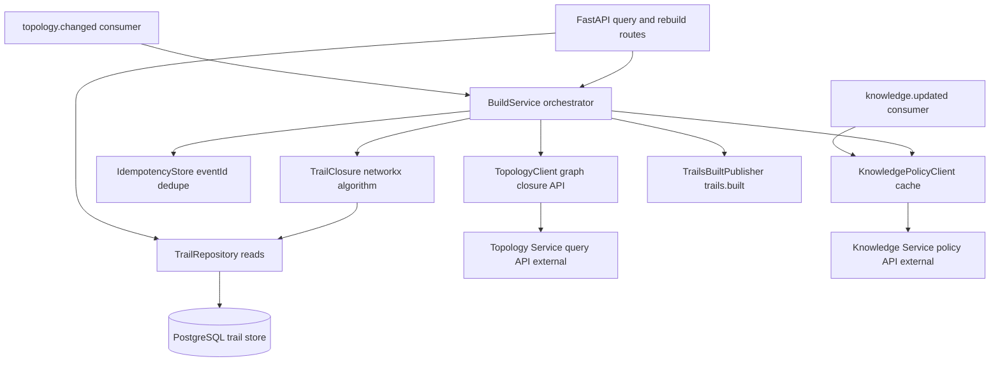
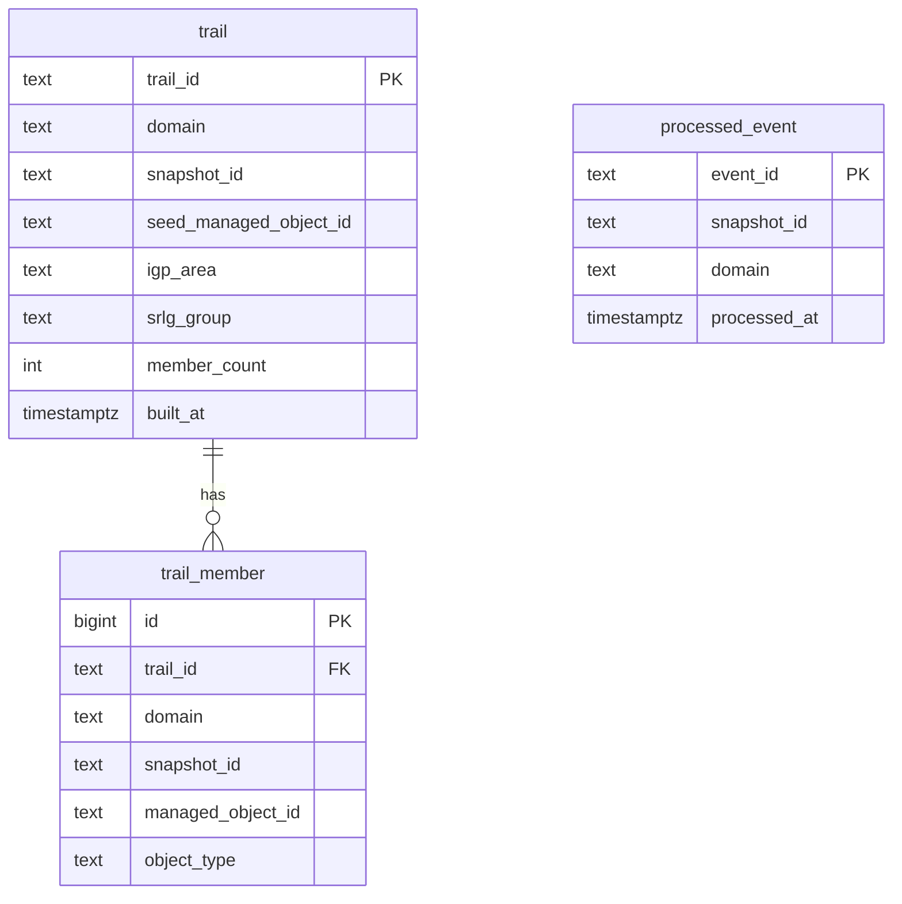
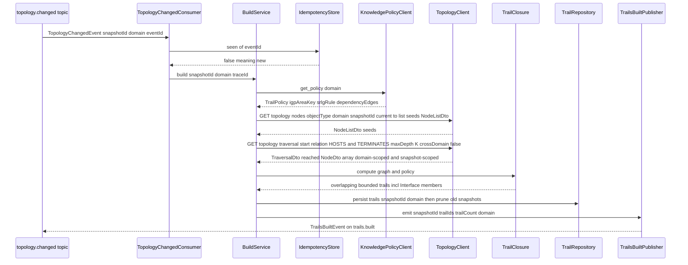
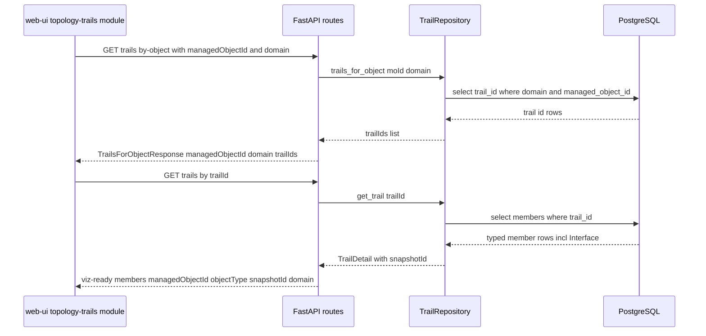
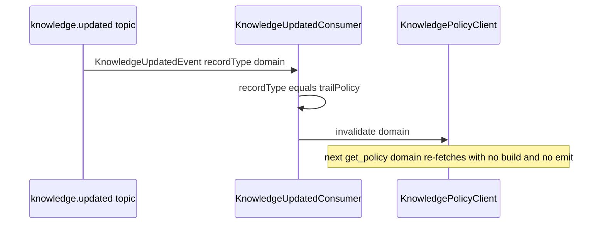
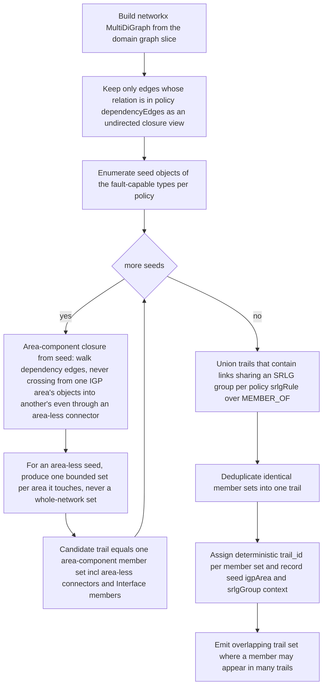

# trail-builder — Design

Buildable design for the Trail Builder Service, derived from the approved, merged
`services/trail-builder/spec.md` (PRs #33, #88, #93) on the `trail-builder` branch. Honours
the contract-first, single-owner, idempotency, DLQ, `/health`+`/metrics`, and
permissive-license invariants. Reads the Topology graph via its query API only (never the topology
graph store directly — Topology is the single owner of that store).

The contract surface this design builds against (`topology.changed` carrying `domain`,
`TrailsBuiltEvent` carrying `domain`, the §5 Interface model with `HOSTS` / `TERMINATES`) is
already FROZEN in `libs/event-model` and merged into `docs/architecture.md`. No contract change
is proposed here.

**Data-integration API freeze (prior revision).** Applies the producer-side fixes for three
data-integration gaps where Trail Builder's published query-API shape/paths diverged from its
consumers' (Codebook Generator, Enrichment, Noise Filter, web-ui) expectations. Trail Builder's
checked-in `openapi.json` is the **single source of truth**; that revision FROZE the paths and
response schemas of `getTrail`, `getTrailsForObject`, and `listTrails` so consumers align to them
(consumer-side alignment is handled in those services' own fixes). Gaps addressed: **P1-G4**
(getTrail/getTrailsForObject response schemas), **P1-G10** (getTrailsForObject endpoint path),
**P2-GAP-09** (`snapshotId` guaranteed on getTrail). This is **service-owned API surface only** —
no Kafka topic or event-model change; `TrailsBuiltEvent` is unchanged.

**Design-readiness fixes (this revision).** Two cross-service-consistency fixes, both
**service-owned, no contract change** (`TrailsBuiltEvent` and every topic unchanged):

- **Q1 + Q7 — `domain` required-param reconciliation (query API vs. event path).** The frozen
  `getTrailsForObject` (`GET /trails/by-object?managedObjectId=&domain=`) makes `domain` a
  **strictly REQUIRED** query parameter with a **clear 400** when missing. This revision removes
  the prior ambiguity where a `core-ip` default-domain fallback was described as if it applied
  broadly: the default-domain fallback is **scoped to the Kafka event-ingestion path only** (a
  legacy `topology.changed` whose optional `domain` is absent), and **never** to the HTTP query
  API. The query API has **no domain default** — a missing `domain` is a 400. This is exactly the
  call shape the live consumers now send: **Enrichment** (`enrichment-readiness-fixes`) and
  **Codebook Generator** (`codebook-readiness-fixes`) both pass `domain` on every
  `getTrailsForObject` call (both treat `domain` as required, sourcing it from their own resolved
  domain — Enrichment from `ENRICHMENT_DOMAIN`, Codebook from the event's resolved `domain`). The
  endpoint is therefore aligned with the actual consumer call shape and future-proof for
  multi-domain. The frozen by-object response shape `{ managedObjectId, domain, trailIds }` is
  unchanged.
- **Q3 — Topology call shapes pinned to the FROZEN Topology query API + snapshot pinning.** The
  graph-closure reads this service makes are pinned to Topology's **frozen** query-API paths,
  required params (incl. `snapshotId=current|previous` scoping), and DTOs (`NodeListDto`,
  `NeighborsDto`, `TraversalDto`, `NodeDto`). Trail Builder builds its Topology client against
  these frozen shapes; the producer's checked-in `services/topology/openapi.json` is the
  build-time artifact, and referencing the frozen shape here is sufficient. The `snapshotId`
  persisted on every trail and emitted on `trails.built` is the snapshot **carried by the
  triggering `topology.changed` event** (the in-scope snapshot), consistent with Topology's
  current/previous `snapshotId` model — never re-resolved by a Topology lookup.

**IGP-area-bounded-closure fix (this revision — gate-blocker #225). Supersedes the prior
"MVP-achievability fix" diagnosis, which was wrong.** The round-8 P1 live gate
(`reports/integration/20260614T172551Z.md`) proved the prior diagnosis incorrect: with `igpArea`
**fully populated on real data** (`{area-0:8, area-1:6, area-2:6}` on 20 Nodes), Trail Builder
still produced **one 181-member whole-network trail** (seed `FiberSpan:F-N0_N1`, spanning all 3
IGP areas, `igp_area`=NULL) plus 9 trivial 1-member SRLG trails. So the AC-2 no-whole-network-trail
guarantee still FAILS — the prune did not fire — even though the data dimension is real. The prior
revision's claim that the fix was purely upstream (Knowledge `attributeCatalogue` + Simulator emit)
and that "Trail Builder's closure already reads `igpArea` … the only missing piece was a test" is
**false**: the bug is in the **closure algorithm itself**, and its INT-IGPAREA "integration
assertion" was **never implemented as a runnable test** (it lives only in design prose + a
`test_closure.py` docstring) — so it never ran on real `igpArea`-bearing data and could not have
caught this.

**Pinned root cause (file:line evidence across the topology↔trail-builder seam).** Data flows
correctly end-to-end; the break is entirely in the closure's area-bounding semantics:

- **(a) Topology returns attributes on list/neighbors — NOT the cause.**
  `services/topology/src/main/java/com/acp/topology/graph/NebulaGraphRepository.java` `listNodes`
  (the `LOOKUP … YIELD … attributes AS attrs`) and `getNode` (`#213` `FETCH PROP … attributes AS
  attrs`) both select the `attributes` JSON property and parse it (`parseAttrs` → `toVertex`);
  `GraphReadService.toNode` maps `v.attributes()` onto `NodeDto`. `neighbors` resolves each
  neighbour via `getNode`, so neighbour DTOs also carry `attributes`. `igpArea` is stored **inside**
  the node `attributes` map by the Simulator
  (`services/simulator/.../coreip/topology_model.py` `_device_attrs` sets `"igpArea": igp_area`
  on each `Node`, and the `Interface` records set `"igpArea": node_area`) and is carried verbatim
  through `LiftingService.lift` → `INSERT VERTEX … attributes` → `parseAttrs`. So `igpArea` IS in
  `NodeDto.attributes` on list/neighbors responses. Not the break.
- **(b) Trail Builder's client/DTO preserves attributes — NOT the cause.**
  `services/trail-builder/src/trailbuilder/clients/topology_client.py` `_node_from_dto` copies
  `attributes=dict(dto.get("attributes") or {})` onto `GraphNode`; `closure._build_graph` sets the
  nx node's `igp_area` via `node.igp_area(policy.boundary.attribute_key)` which reads
  `attributes["igpArea"]` (`models.py` `GraphNode.igp_area`). So the grounded `igpArea` reaches the
  closure graph for every area-bearing node. Not the break.
- **(c) THE BUG — the closure's area-bound leaks across areas, and disables itself for area-less
  seeds** (`services/trail-builder/src/trailbuilder/closure.py` `_bounded_closure`, lines ~77-93).
  Two distinct defects, both rooted in the same wrong assumption that *only area-bearing nodes
  matter*:
  1. **Area-less seed → no prune at all.** `seed_area = graph.nodes[seed].get("igp_area")` is
     `None` for any area-less seed type (FiberSpan, LSP, IPLink, IGPAdjacency, VPNService, SRLG —
     the Simulator only puts `igpArea` on `Node` and `Interface`). The guard
     `if igp_key is not None and seed_area is not None:` then **skips pruning entirely**, so a
     `FiberSpan`-seeded closure walks the whole connected component → the 181-member whole-network
     trail observed in the gate. `FiberSpan` is an explicit seed type (`build_service.py`
     `SEED_OBJECT_TYPES`) and the spec lists "Fiber" as a seed — so this path is reached every
     build.
  2. **Area-less neighbours are never pruned, and they form a network-wide bridge.** Even from an
     **area-bearing** seed (e.g. `Node:N0` in area-0) the prune only drops a neighbour when
     `n_area is not None and n_area != seed_area`; an area-less neighbour (LineCard/Port/IPLink/
     FiberSpan/LSP/IGPAdjacency/SRLG) is **always kept**. In the real Core-IP graph these area-less
     objects form a **fully-connected mesh spanning all areas**: `IPLink:N0_N1 –MEMBER_OF→
     SRLG:SRLG-0 –MEMBER_OF→ IPLink:N1_N2 –MEMBER_OF→ SRLG:SRLG-1 → IPLink:N2_N3 …` plus the
     FiberSpan/IGPAdjacency/LSP/VPN layer riding each link. Once an area-0 seed's closure descends
     into this area-less mesh it reaches every area-less object network-wide; the SRLG-union step
     then merges these per-seed sets, and dedup collapses them — which is exactly why even the
     Node-seeded builds produced no area-bounded trails and everything fused into the one giant
     trail in the gate. The cross-area **interfaces/nodes** are pruned correctly, but pruning the
     area-bearing endpoints while keeping the area-less connectors that join them does not bound
     the trail.

**The fix (owning service: trail-builder only; no other service changes).** Replace the
"prune cross-area neighbour" semantics with **area-component bounding** that also bounds the
area-less mesh and resolves the area-less-seed semantics — see the revised Algorithm logical flow
(step 4) and Design alternatives. Briefly: (i) **derive each trail's area from the area-bearing
objects it reaches**, not from the seed's own (possibly absent) area; (ii) **do not allow a closure
to cross from one area's objects to another's through area-less connectors** — an area-less object
is admitted to a trail only as a connector *within* a single area's reachable set (a shared area-less
object that legitimately rides two areas appears in BOTH areas' trails as overlap, never fusing them
into one); (iii) an **area-less seed (FiberSpan/LSP/IPLink) yields one trail per area it touches**,
bounded to that area's objects — never a whole-network trail. This makes AC-2 hold by construction
on the real graph. **No contract change**: `igpArea` rides inside the already-frozen
`NodeDto.attributes` map; the Topology query API, `TrailsBuiltEvent`, and every topic are unchanged.

**Why the unit tests masked it (the present-but-mock-masking lesson).** `tests/test_closure.py`
runs the closure on **tiny hand-built fixtures** where every cross-area path is a **direct edge
between two area-bearing Nodes** (`test_no_trail_spans_two_igp_areas`: `Node:A area-0 –ADJACENCY_OVER→
Node:B area-0 –ADJACENCY_OVER→ Node:C area-1`). The prune fires there because the cross-area
neighbour (`Node:C`) carries `igpArea`. The fixtures **never reproduce the real-data shape** where
areas are joined only through an **area-less connector mesh** (IPLink/SRLG/FiberSpan), so they
cannot exercise defect (c)(2); and no fixture uses an **area-less seed**, so they cannot exercise
(c)(1). The "INT-IGPAREA integration assertion" that was supposed to cover real data was **never
coded** — it exists only as design text and a docstring. Net: the bug was *present but untested* on
realistic topology, and a green unit suite gave false confidence. This revision (1) **adds a real
unit test on a realistic full-topology fixture** that mirrors the Simulator's area-less-mesh shape
and **fails on the current closure**, and (2) **implements** INT-IGPAREA as an actual integration
test on Simulator-generated, `igpArea`-bearing topology — both detailed in the Test plan.

## Stack

- **Language / runtime:** Python 3.13 (pinned to the local toolchain per `CLAUDE.md`).
- **Graph closure:** `networkx` (BSD-3-Clause) — in-memory directed multigraph for the
  per-snapshot graph slice and the transitive-closure traversal.
- **Query API:** FastAPI (MIT) + Uvicorn (BSD-3-Clause); Pydantic v2 (MIT) for request/response
  models and for the `acp_event_model` payload bindings. OpenAPI 3.1 is generated by FastAPI.
- **Kafka client:** `confluent-kafka` (Apache-2.0) consumer/producer.
- **Persistence:** PostgreSQL (PostgreSQL License) via SQLAlchemy Core (MIT) +
  `psycopg` (LGPL-with-linking-exception, permissive in practice) driver; Alembic (MIT) for
  schema migrations.
- **HTTP client (integration points):** `httpx` (BSD-3-Clause); `respx` (BSD-3-Clause) for
  OpenAPI-stub mocking in unit tests.
- **Event contract:** `acp_event_model` (the repo's `libs/event-model` Python/Pydantic binding)
  — `TopologyChangedEvent`, `KnowledgeUpdatedEvent`, `TrailsBuiltEvent`, `Envelope`,
  `ManagedObjectId`, `deserialize`/`serialize`.
- **Metrics:** `prometheus-client` (Apache-2.0). **Logging:** stdlib `logging` with a JSON
  formatter. **Tests:** `pytest` (MIT) — the fixed Python-cohort unit/contract framework.

All licenses above are MIT / BSD / Apache-2.0 / PostgreSQL — permissive only.

## Task breakdown (from the spec)

Every spec Task (1–8) is realized below; no task is dropped or re-scoped.

| Spec task | Realized by (modules / flow) |
|---|---|
| **1. Consume `topology.changed` and trigger a domain-scoped build (+ on-demand API).** | `kafka_consumer.TopologyChangedConsumer` decodes the envelope, reads `domain` directly from the payload, calls `idempotency.IdempotencyStore.seen(eventId)`, and on a new event invokes `build_service.BuildService.build(snapshotId, domain, traceId)`. On-demand path: `api.routes.rebuild` (`POST /trails/rebuild`) calls the same `BuildService.build`. Key flow A. |
| **2. React to `knowledge.updated` for trail-policy changes.** | `kafka_consumer.KnowledgeUpdatedConsumer` decodes `KnowledgeUpdatedEvent`; when `recordType == "trailPolicy"` it calls `policy_client.invalidate(domain)` so `KnowledgePolicyClient` re-fetches on next access. No build is triggered, no `trails.built` emitted. |
| **3. Fetch graph closures from the Topology Service (FROZEN shapes, snapshot-scoped).** | `topology_client.TopologyClient` calls Topology's **frozen** query API over `httpx`, domain- and snapshot-scoped, traversing the dependency-edge relations from the policy (incl. `HOSTS`/`TERMINATES`): **list-by-type** `GET /topology/nodes?objectType={t}&domain={d}&snapshotId={current\|previous}` to `NodeListDto { domain, objectType?, snapshotId, count, nodes: NodeDto[] }` (enumerate seeds), **neighbors** `GET /topology/nodes/{moId}/neighbors?relation={r}` to `NeighborsDto { managedObjectId, domain, neighbors: [{ node: NodeDto, via: EdgeDto }] }`, **bounded traverse** `GET /topology/traversal?start={moId}&relation={r}&...&maxDepth={K}&crossDomain=false` to `TraversalDto { start, domain, relations[], maxDepth, crossDomain, reached: NodeDto[] }`. `NodeDto { managedObjectId, objectType, domain, snapshotId, name?, attributes }`. The `snapshotId` scoping token is `current` for the build's in-scope snapshot (the snapshot carried by the triggering event is Topology's current snapshot for the domain). Never touches the topology graph store directly (Topology is the single owner). |
| **4. Fetch trail policy from Knowledge (domain-parameterized).** | `policy_client.KnowledgePolicyClient.get_policy(domain)` calls the Knowledge read API for the `trailPolicy` record scoped to `domain`, returning a `TrailPolicy` value object (IGP-area key, SRLG-union rule, dependency-edge set). Cached per-domain; invalidated by Task 2. No hard-coded policy values. |
| **5. Compute trails per domain, traversing Interface objects.** | `closure.TrailClosure` builds a `networkx.MultiDiGraph` slice and computes overlapping, IGP-area-bounded transitive closures over the policy's dependency-edge set (which includes `HOSTS` Port to Interface and `TERMINATES` Interface to IPLink, so `Interface:*` objects are natural members), then unions SRLG-co-member links into shared trails. The IGP-area bound reads `igpArea` from each node's `NodeDto.attributes` map under the key named by the policy `boundary.attributeKey` (`igpArea`); step 4 bounds by **area component** (the #225 fix): an area-less connector (IPLink/SRLG/FiberSpan/LSP) is admitted only *within* one area's reachable set and never bridges into another area's objects, and an area-less seed yields one trail per area it touches — so no trail spans two areas and there is no whole-network trail on the real area-less-mesh graph. (The previous "prune neighbour whose area differs from the seed's" leaked across areas through the area-less mesh and did nothing for area-less seeds — the gate-blocker #225 whole-network trail.) Algorithm logical flow below. |
| **6. Persist trail definitions with domain.** | `repository.TrailRepository` writes `trail` + `trail_member` rows in one transaction tagged with `snapshotId` and `domain`; a rebuild for the same `domain`+`snapshotId` supersedes prior rows for that pair; older snapshots retained per the retention rule (Data model). |
| **7. Serve domain-scoped queries + browse via API.** | `api.routes`: **`GET /trails/by-object?managedObjectId=&domain=`** (getTrailsForObject → frozen `{ managedObjectId, domain, trailIds }`), `GET /trails/{trailId}` (getTrail → frozen `TrailDetail` with `members[{managedObjectId,objectType}]` + `snapshotId`), `GET /trails?snapshotId=&domain=` (listTrails summaries). FastAPI publishes OpenAPI 3.1 at `/openapi.json`; the generated `openapi.json` is checked into `services/trail-builder/` as the **frozen single source of truth** consumers build against (paths + response schemas frozen; P1-G4/P1-G10/P2-GAP-09). |
| **8. Emit `trails.built` with `domain`.** | `event_publisher.TrailsBuiltPublisher` builds a `TrailsBuiltEvent` (`snapshotId`, `trailIds`, `trailCount == len(trailIds)`, `domain` taken from the triggering event — no Topology lookup) wrapped in an `Envelope`, serialized via `acp_event_model.serialize`, produced to `trails.built`. |

## Phase applicability (design view)

Consistent with the spec's Phase applicability table and the canonical phase map in
`docs/architecture.md` (trail-builder row: P1 Active, P2 Passive, P3 Passive). A
`knowledge.updated` trail-policy refresh or a new `topology.changed` may fire a P1-style Active
rebuild at any wall-clock time; such a rebuild is classified as P1 work.

| Phase | Active/Passive/Idle | Modules/handlers exercised | Inputs/Outputs |
|---|---|---|---|
| P1 — Topology onboarding | **Active** | `TopologyChangedConsumer`, `IdempotencyStore`, `BuildService`, `TopologyClient`, `KnowledgePolicyClient`, `TrailClosure`, `TrailRepository`, `TrailsBuiltPublisher`. **Concurrently** the query API (`api.routes` getTrailsForObject / getTrail / listTrails) serves the web-ui topology-trails module. `KnowledgeUpdatedConsumer` active as a refresh trigger. | In: `topology.changed` (domain read from event), Topology graph-closure API (domain-scoped), Knowledge trail-policy API (domain-parameterized), `knowledge.updated`. Out: `trails.built` (carrying `domain`); `topology.changed.dlq` on poison; query API responses. |
| P2 — Pattern learning | **Passive** | `api.routes` query endpoints only (getTrailsForObject / getTrail / listTrails). `KnowledgeUpdatedConsumer` may refresh policy. Build pipeline dormant unless a rebuild is triggered (then P1 work). | In: query API calls from Enrichment / Noise Filter / Pattern Miner / web-ui. Out: query responses. No topic output of its own. |
| P3 — Real-time correlation | **Passive** | `api.routes` query endpoints only (live-path Enrichment trail-tagging via getTrailsForObject). Build pipeline dormant unless triggered. | In: query API calls (e.g. Enrichment live path). Out: query responses. No topic output of its own. |

## Module breakdown



- **`kafka_consumer`** — `TopologyChangedConsumer` (build trigger, dedupe, DLQ routing) and
  `KnowledgeUpdatedConsumer` (policy-refresh trigger only). Each rejects unknown major
  `schemaVersion` and routes poison messages to `topology.changed.dlq`.
- **`build_service`** — orchestrates a build: idempotency check, policy fetch, graph fetch,
  closure compute, persist, emit. Shared by the Kafka path and the `POST /trails/rebuild` path.
  **Snapshot pinning:** the `snapshotId` used to scope the Topology graph reads, persisted on every
  trail, and set on the emitted `trails.built` is the `snapshotId` carried by the triggering
  `topology.changed` event (or supplied on the `POST /trails/rebuild` request) — that is the
  in-scope snapshot. No Topology lookup re-resolves it; the Topology reads use the
  `snapshotId=current|previous` scoping token consistent with Topology's current/previous model.
- **`idempotency`** — `IdempotencyStore` backed by the `processed_event` table; `seen(eventId)`
  is an atomic insert-if-absent.
- **`topology_client`** — `TopologyClient` against the Topology Service's **frozen** published
  OpenAPI (`services/topology/openapi.json`); config-switchable mock/real; domain- **and
  snapshot-scoped** traversal over the policy dependency edges. Pins to the frozen paths/DTOs:
  list-by-type `GET /topology/nodes?objectType=&domain=&snapshotId=current|previous` (`NodeListDto`),
  neighbors `GET /topology/nodes/{moId}/neighbors?relation=` (`NeighborsDto`), bounded traverse
  `GET /topology/traversal?start=&relation=&maxDepth=&crossDomain=false` (`TraversalDto` with
  `reached: NodeDto[]`). Always passes the in-scope `snapshotId` token (`current`) so the graph
  slice matches the snapshot the build is for.
- **`policy_client`** — `KnowledgePolicyClient` against the Knowledge Service published OpenAPI;
  per-domain `TrailPolicy` cache; `invalidate(domain)`.
- **`closure`** — `TrailClosure`: networkx graph build + **area-component** IGP-area-bounded
  closure + SRLG union (the algorithm). The IGP-area bound reads the `igpArea` value from each
  node's `NodeDto.attributes` (key = policy `boundary.attributeKey`, `igpArea`); step 4 (the #225
  fix) runs a **per-area closure** that admits an area-less connector only within one area's reach
  and never lets it bridge into another area's area-bearing objects, and yields **one trail per
  area** for an area-less seed. **This is the module the dev fix lands in** — `_bounded_closure`'s
  single-`seed_area` short-circuit is replaced by target-area derivation + per-area traversal; the
  rest (`_build_graph` stamping `igp_area`, `_srlg_union`, `_materialize`) is unchanged. The grounded
  `igpArea` already reaches this module on real data (the seam is intact); the previous logic simply
  bounded incorrectly.
- **`repository`** — `TrailRepository`: transactional persist + supersession + the three read
  queries.
- **`event_publisher`** — `TrailsBuiltPublisher`: builds + serializes + produces `TrailsBuiltEvent`.
- **`api`** — FastAPI app, routes, request/response models, `/health`, `/metrics`, `/openapi.json`.
- **`config`** — env-driven settings (base URLs, modes, DB DSN, Kafka brokers, default-domain
  fallback). **`observability`** — JSON logging + Prometheus metrics.

## Data model / DB schema

Trail Builder owns a PostgreSQL schema (`trailbuilder`). Three tables: `trail` (one row per
trail), `trail_member` (trail-to-`managedObjectId`, including `Interface:*` members), and
`processed_event` (`eventId` dedupe). Columns lead with `domain` and `snapshot_id` so the
domain/snapshot scoping is the primary access path. All three tables (and the Alembic version
table) live **inside** the owned `trailbuilder` schema, created by an explicit first migration —
see "Schema creation & schema-binding" below.



**`trail`** — `trail_id TEXT PRIMARY KEY` (deterministic, content-derived: a stable hash of
`domain` + `snapshot_id` + sorted member set, so a re-run for the identical slice is
reproducible and idempotent). `domain TEXT NOT NULL`, `snapshot_id TEXT NOT NULL`,
`seed_managed_object_id TEXT NOT NULL`, `igp_area TEXT NULL`, `srlg_group TEXT NULL` (the
seed/bounds context surfaced in `listTrails`), `member_count INT NOT NULL CHECK member_count
greater than 0`, `built_at TIMESTAMPTZ NOT NULL`. Indexes: `idx_trail_domain_snapshot` on
(domain, snapshot_id) for `listTrails`; PK covers `getTrail`.

**`trail_member`** — `id BIGSERIAL PRIMARY KEY`, `trail_id TEXT NOT NULL REFERENCES trail
ON DELETE CASCADE`, `domain TEXT NOT NULL`, `snapshot_id TEXT NOT NULL`, `managed_object_id
TEXT NOT NULL` (typed `<objectType>:<id>`), `object_type TEXT NOT NULL` (parsed prefix, lets
the web-ui filter Interface vs Port without re-parsing). Unique constraint
`uq_member` on (trail_id, managed_object_id). Indexes: `idx_member_domain_object` on
(domain, managed_object_id) for `getTrailsForObject`; `idx_member_trail` on (trail_id) for
`getTrail`.

**`processed_event`** — `event_id TEXT PRIMARY KEY` (envelope `eventId`), `snapshot_id`,
`domain`, `processed_at`. The PK gives at-least-once idempotency (Task 1 / AC-7).

**Supersession + retention (resolves Open question 4).** A build for `(domain, snapshot_id)`
runs in one transaction that first deletes any existing `trail` rows for that exact pair
(`trail_member` cascades) then inserts the new set — so re-delivery or rebuild for the same
pair never duplicates rows. **Retention: keep the current + the immediately previous
`snapshot_id` per domain**; older snapshots' trail rows are pruned at the end of a successful
build (delete trail rows for the domain whose snapshot_id is neither current nor previous).
This matches the spec "retained until explicitly superseded" intent while bounding growth;
configurable via `TRAIL_RETENTION_SNAPSHOTS` (default 2).

### Schema creation & schema-binding (shared-DB readiness)

Per the `architecture.md` shared-infra conventions, all relational stores live in **one** shared
PostgreSQL instance/database, and each service owns exactly one named schema and **never** writes
`public`. Trail Builder owns **`trailbuilder`**. To compose without collision on a fresh shared DB,
both the migration tool and the ORM metadata are explicitly pinned to that schema — nothing is left
to PostgreSQL's default `public` placement.

- **First migration creates the schema (idempotent).** The very first Alembic revision
  (`0001_create_schema`) issues `CREATE SCHEMA IF NOT EXISTS trailbuilder`, so a fresh shared
  PostgreSQL succeeds on the first `alembic upgrade head` with no manual bootstrap. The `IF NOT
  EXISTS` makes it safe to re-run (re-deploy, or a second service instance racing the migration).
  This is Trail Builder's own first migration step — it touches **only** `trailbuilder`, never a
  global or `public`-schema migration and no shared baseline (single-owner rule).

  ```python
  # migrations/versions/0001_create_schema.py
  def upgrade() -> None:
      op.execute("CREATE SCHEMA IF NOT EXISTS trailbuilder")

  def downgrade() -> None:
      op.execute("DROP SCHEMA IF EXISTS trailbuilder CASCADE")
  ```

- **All tables pinned to `trailbuilder` in the ORM metadata.** The SQLAlchemy Core `MetaData` is
  constructed with `schema='trailbuilder'`, so `trail`, `trail_member`, and `processed_event` are
  created and addressed as `trailbuilder.<table>` — they never default into `public` and collide in
  the shared DB. Foreign keys are schema-qualified to the same schema (so
  `trail_member.trail_id` references `trailbuilder.trail`).

  ```python
  # db/metadata.py
  from sqlalchemy import MetaData
  metadata = MetaData(schema="trailbuilder")   # every Table below inherits schema='trailbuilder'
  ```

  The three tables are declared against this metadata (column/constraint definitions exactly as in
  the table descriptions above), e.g.:

  ```python
  # db/tables.py
  from sqlalchemy import (
      Table, Column, Text, BigInteger, Integer, TIMESTAMP,
      ForeignKey, CheckConstraint, UniqueConstraint, Index,
  )
  from .metadata import metadata

  trail = Table(
      "trail", metadata,                       # -> trailbuilder.trail
      Column("trail_id", Text, primary_key=True),
      Column("domain", Text, nullable=False),
      Column("snapshot_id", Text, nullable=False),
      Column("seed_managed_object_id", Text, nullable=False),
      Column("igp_area", Text, nullable=True),
      Column("srlg_group", Text, nullable=True),
      Column("member_count", Integer, nullable=False),
      Column("built_at", TIMESTAMP(timezone=True), nullable=False),
      CheckConstraint("member_count > 0", name="ck_trail_member_count_positive"),
      Index("idx_trail_domain_snapshot", "domain", "snapshot_id"),
  )

  trail_member = Table(
      "trail_member", metadata,                # -> trailbuilder.trail_member
      Column("id", BigInteger, primary_key=True, autoincrement=True),
      # FK schema-qualified to trailbuilder.trail
      Column("trail_id", Text,
             ForeignKey("trailbuilder.trail.trail_id", ondelete="CASCADE"),
             nullable=False),
      Column("domain", Text, nullable=False),
      Column("snapshot_id", Text, nullable=False),
      Column("managed_object_id", Text, nullable=False),
      Column("object_type", Text, nullable=False),
      UniqueConstraint("trail_id", "managed_object_id", name="uq_member"),
      Index("idx_member_domain_object", "domain", "managed_object_id"),
      Index("idx_member_trail", "trail_id"),
  )

  processed_event = Table(
      "processed_event", metadata,             # -> trailbuilder.processed_event
      Column("event_id", Text, primary_key=True),
      Column("snapshot_id", Text),
      Column("domain", Text),
      Column("processed_at", TIMESTAMP(timezone=True), nullable=False),
  )
  ```

- **Alembic version table pinned to `trailbuilder`.** Alembic's `env.py` runs with
  `version_table_schema='trailbuilder'` (so the per-service migration-history table lives **inside**
  `trailbuilder`, not `public`) and `include_schemas=True` (so autogenerate compares within the
  owned schema). The runtime connection also sets `search_path=trailbuilder` via
  `DATABASE_URL`/`currentSchema` per the shared-infra convention — belt-and-suspenders so even
  unqualified SQL resolves to the owned schema.

  ```python
  # migrations/env.py (online)
  context.configure(
      connection=connection,
      target_metadata=metadata,                  # MetaData(schema='trailbuilder')
      version_table="alembic_version",
      version_table_schema="trailbuilder",       # history table inside trailbuilder, not public
      include_schemas=True,                       # compare/operate within the owned schema
  )
  ```

The `0001_create_schema` revision is ordered **before** the table-creation revision(s) so the schema
exists when the tables (and the version table) are created. Net effect on a fresh shared DB:
`CREATE SCHEMA IF NOT EXISTS trailbuilder` then `trailbuilder.alembic_version` plus
`trailbuilder.trail`/`trail_member`/`processed_event`, with `public` left empty for Trail Builder.
(Libs: Alembic — MIT; SQLAlchemy — MIT; `psycopg` driver — permissive; all OSS.)

## Event handling

- **Consumers:**
  - `topology.changed` → `TopologyChangedConsumer` → `BuildService.build`. **Idempotency key:**
    envelope `eventId` (`processed_event` PK). **DLQ:** deserialization failure, unknown major
    `schemaVersion`, or non-retryable processing error → re-produce the raw message (with a
    `dlqReason` header) to `topology.changed.dlq`; offset committed so subsequent messages flow.
  - `knowledge.updated` → `KnowledgeUpdatedConsumer`. When `recordType == "trailPolicy"`, call
    `policy_client.invalidate(domain)`. No build, no emission. Poison messages on this topic are
    logged and skipped (refresh-only; a missed refresh self-heals on the next event), not DLQ'd,
    to avoid coupling the build path to refresh-trigger noise.
- **Producers:**
  - `trails.built` → `TrailsBuiltEvent` from `acp_event_model` (`snapshotId`, `trailIds`,
    `trailCount`, `domain`), wrapped in `Envelope` (`type = TrailsBuiltEvent`, `schemaVersion = 1`,
    `traceId` propagated from the triggering event, `source = "trail-builder"`). Emitted once per
    successful build (idempotency guarantees one emission per `eventId`).

## API contracts / API schema

FastAPI generates OpenAPI 3.1 at `/openapi.json`; the generated document is checked into
`services/trail-builder/openapi.json` and is **the single, frozen source of truth** for the HTTP
surface that every consumer (Codebook Generator, Enrichment, Noise Filter, web-ui) generates its
client against. The three trail-query operations — `getTrail`, `getTrailsForObject`,
`listTrails` — have **frozen paths and frozen response schemas** below; their shapes do not drift
without a contract change (data-integration fixes **P1-G4**, **P1-G10**, **P2-GAP-09**). The
service's own contract/unit tests validate request inputs and response bodies against this
checked-in document (AC-16). All trail queries are domain-scoped.

**Frozen path disambiguation (P1-G10).** `getTrailsForObject` and `listTrails` no longer share
`GET /trails` distinguished only by query param. `getTrailsForObject` is moved to the explicit
sub-resource **`GET /trails/by-object`**, chosen because: (a) it is the path the web-ui already
targets, removing the consumer-side mismatch; (b) it cleanly separates a per-object lookup from
the snapshot-scoped `listTrails` browse, so the two operations cannot collide on one path; (c) it
reads as a self-describing sub-resource. `listTrails` keeps `GET /trails?snapshotId=&domain=`.

**`domain` is a strictly REQUIRED query param on the query API — clear 400, no default (Q1 + Q7).**
On `getTrailsForObject` (`GET /trails/by-object?managedObjectId=&domain=`) **and** on `listTrails`
(`GET /trails?snapshotId=&domain=`), `domain` is required. A request missing `domain` returns
**400** with a structured error body (FastAPI/Pydantic `RequestValidationError` for the missing
required query parameter) — it is **never** silently defaulted to `core-ip`. The decision and its
justification:

- **Chosen: strictly required + clear 400 (no query-API domain default).** Rationale: (1) a trail
  belongs to exactly one domain, and `getTrailsForObject(moId, domain)` is meaningless without the
  domain that scopes which trails are wanted — defaulting would silently return Core-IP trails for
  a non-Core-IP query, a correctness hazard once a second domain exists; (2) it matches the spec's
  frozen contract ("Both query parameters are required for MVP"); (3) it matches **what the live
  consumers actually send today** — Enrichment (`enrichment-readiness-fixes`) passes `domain` on
  every call (sourced from `ENRICHMENT_DOMAIN`, MVP `core-ip`), and Codebook Generator
  (`codebook-readiness-fixes`) passes the event's resolved `domain` on every per-symptom-object
  call; neither relies on a server default. The endpoint is thus aligned with the real call shape
  and future-proof for multi-domain.
- **Rejected: server-side `core-ip` default-domain fallback on the query API (backward-compat).**
  This was considered for tolerance toward a consumer that historically called with
  `managedObjectId` only, but it is rejected: the consumers no longer call that way (both now send
  `domain`), so the fallback would be dead code that masks a genuine caller bug (a forgotten
  `domain`) and silently returns wrong-domain trails. A clear 400 surfaces the bug at the caller.

**Default-domain fallback is scoped to the event-ingestion path only — not the query API.** The
`DEFAULT_DOMAIN` (`core-ip`) fallback exists solely for a **legacy `topology.changed` event whose
optional `domain` field is absent** (the `TrailsBuiltEvent`/`TopologyChangedEvent` `domain` is
optional in the event model for backward-compat). On the inbound query API the `domain` is always
caller-supplied and required. The two paths are kept deliberately distinct so the query contract
stays strict while the consumer (Kafka) path remains tolerant of an older producer.

| Operation | Method + path (FROZEN) | Request | Response 200 (FROZEN) | Errors |
|---|---|---|---|---|
| getTrailsForObject | `GET /trails/by-object?managedObjectId={moId}&domain={domain}` | both query params required | `TrailsForObjectResponse { managedObjectId, domain, trailIds: string[] }` | 400 missing param; 422 bad `managedObjectId` shape |
| listTrails | `GET /trails?snapshotId={snapshotId}&domain={domain}` | both query params required, optional `limit`/`offset` | `ListTrailsResponse { snapshotId, domain, count, trails: TrailSummary[] }` | 400 missing param |
| getTrail | `GET /trails/{trailId}` | path param | `TrailDetail { trailId, domain, snapshotId, members: TrailMember[], memberCount, igpArea?, srlgGroup? }` | 404 unknown trailId |
| rebuild | `POST /trails/rebuild` | `RebuildRequest { snapshotId, domain }` (both required) | `TrailsBuiltSummary { snapshotId, domain, trailIds: string[], trailCount }` | 400 missing field; 502 if Topology/Knowledge unavailable |
| health | `GET /health` | — | `{ status, dependencies: { topology, knowledge, db, kafka } }` | 503 if not ready |
| metrics | `GET /metrics` | — | Prometheus text | — |
| openapi | `GET /openapi.json` | — | OpenAPI 3.1 document | — |

**Frozen response schemas (the contract consumers build against):**

- **`TrailsForObjectResponse` (getTrailsForObject — FROZEN, P1-G4).**
  `{ managedObjectId: string, domain: string, trailIds: string[] }`. `trailIds` is a
  (possibly empty) array of trail-id strings — the **canonical, intentionally minimal** shape:
  Enrichment sets `AlarmEvent.trailIds` directly from it, Codebook Generator unions `trailIds`
  across symptom objects, and web-ui reads `trailIds` to highlight member trails on device-select
  — none needs per-trail summaries here. A richer list variant is **not** added: no consumer
  requires trail summaries from the per-object lookup, and `listTrails` (summaries) / `getTrail`
  (detail) already serve those needs. This replaces the prior `{ ..., trails: TrailSummary[] }`
  variant so the producer shape exactly matches what the consumers read.
- **`TrailDetail` (getTrail — FROZEN, P1-G4 + P2-GAP-09).** `{ trailId: string, domain: string,
  snapshotId: string, members: TrailMember[], memberCount: integer, igpArea?: string,
  srlgGroup?: string }`.
  - `snapshotId` is **always present and guaranteed** (P2-GAP-09): the source `AlarmEvent` carries
    no `snapshotId`, so Noise Filter derives the REQUIRED `TransactionEvent.snapshotId` from
    `getTrail(trailId).snapshotId`. A contract test asserts the field is present and non-null on
    every `getTrail` 200 (AC-21).
  - `members: TrailMember[]` where **`TrailMember { managedObjectId: string, objectType: string }`**
    — each member carries **both** the typed `managedObjectId` (`<objectType>:<id>` scheme; AC-5/18)
    **and** the parsed `objectType`, so the web-ui distinguishes `Interface` from
    `Port`/`IPLink`/`Node` without an extra call or re-parse. `members` includes any `Interface:*`
    members in the closure (AC-19).
  - `memberCount == len(members)`.
- **`TrailSummary` (listTrails item).** `{ trailId, domain, memberCount, igpArea?, srlgGroup? }`.
- `TrailsBuiltSummary` mirrors the `TrailsBuiltEvent` payload (`trailCount == len(trailIds)`).

These frozen shapes are exactly what the consumer designs read: Enrichment / Codebook Generator
consume `TrailsForObjectResponse.trailIds[]`; Noise Filter consumes `TrailDetail.snapshotId` (and
`members`); web-ui consumes all three. This freeze is **service-owned API surface only** — it
introduces no Kafka topic and no event-model payload change; `TrailsBuiltEvent` is unchanged.

`POST /trails/rebuild` (resolves Open question 3): for the MVP it is an **internal-only** endpoint
— guarded by a shared bearer token from `REBUILD_API_TOKEN` (env). When the var is unset
(local/CI) the guard is disabled. No public auth surface is in MVP scope; richer authz is
deferred.

## Integration points (mock vs. real)

No hard-coded URLs; every collaborator base URL and mock/real toggle resolves from env at
startup. Clients are built against the collaborator's **published OpenAPI spec**, never source.

| Collaborator + operation | Config keys | Mock (unit) | Real (integration) |
|---|---|---|---|
| **Topology Service** — graph closure against the **FROZEN** query API, domain- and snapshot-scoped: list-by-type `GET /topology/nodes?objectType=&domain=&snapshotId=current|previous` to `NodeListDto`; neighbors `GET /topology/nodes/{moId}/neighbors?relation=` to `NeighborsDto`; bounded traverse `GET /topology/traversal?start=&relation=&...&maxDepth=&crossDomain=false` to `TraversalDto { ..., reached: NodeDto[] }` over `HOSTS`/`TERMINATES`/`RIDES_ON`/`ADJACENCY_OVER`/`TRAVERSES`/`SERVES`/`MEMBER_OF`. Each `NodeDto.attributes` map carries the grounded **`igpArea`** value (Simulator-emitted, Topology-carried) the closure reads for the step-4 area bound. | `TOPOLOGY_SERVICE_BASE_URL`, `TOPOLOGY_SERVICE_MODE` (`mock`/`real`) | `respx` stubs generated from Topology's **frozen** checked-in `services/topology/openapi.json`, returning fixture `NodeListDto`/`NeighborsDto`/`TraversalDto` graph slices. **Note:** unit-fixture `igpArea` values are injected and so do **not** prove the bound on real data — that is the role of the integration assertion INT-IGPAREA. | live Topology Service on the `integration` Compose network, fed a **Simulator-generated** multi-area topology carrying grounded `igpArea` |
| **Knowledge Service** — read the domain-scoped `trailPolicy` record (IGP-area bound, SRLG-union rule, dependency-edge set) | `KNOWLEDGE_SERVICE_BASE_URL`, `KNOWLEDGE_SERVICE_MODE` (`mock`/`real`) | `respx` stubs from Knowledge published `openapi.json` returning per-domain policy | live Knowledge Service |
| **Codebook Generator / Enrichment / Noise Filter / web-ui** (inbound consumers of our query API) | n/a (we publish) | each builds its client from **our** checked-in, **frozen** `openapi.json` (`getTrail`, `getTrailsForObject`, `listTrails` paths + response schemas frozen — P1-G4/P1-G10/P2-GAP-09; `domain` **required** on `getTrailsForObject` and `listTrails`) | call our query API with `domain` always supplied: Enrichment + Codebook call `GET /trails/by-object?managedObjectId=&domain=` and read `trailIds[]`; Noise Filter reads `getTrail.snapshotId` (+ `members`); web-ui reads all three |

The Topology graph-closure operations are now pinned to Topology's **frozen** query-API paths,
required params (incl. `snapshotId=current|previous` scoping), and DTOs — `NodeListDto`,
`NeighborsDto`, `TraversalDto`, `NodeDto` (Q3). The Knowledge trail-policy record shape remains a
design-stage item tracked in issue #25; the dev agent finalizes the Knowledge client against the
producer's checked-in `openapi.json`. (Former Topology issue #24 is resolved by the Topology
API-freeze: the shapes are frozen above.) All clients are built against each producer's checked-in
`openapi.json`, never against producer source.

## Key flows (sequence / data-flow diagrams)

### Flow A — topology.changed to trails.built (domain-scoped build)



### Flow B — query path (getTrailsForObject / getTrail / listTrails)



### Flow C — knowledge.updated policy refresh



## Algorithm logical flow

The core algorithm computes **overlapping, policy-bounded trails** as the transitive closure
over the policy's **dependency-edge set** from each seed, bounded by IGP area, then unions
SRLG-co-member links into shared trails. All bounds come from the domain's Knowledge trail
policy — nothing is hard-coded.

**Inputs:** the per-snapshot graph slice — `NodeDto`/`EdgeDto` data assembled from Topology's
frozen `NodeListDto` (seeds), `NeighborsDto`, and `TraversalDto` (`reached: NodeDto[]`) responses
via `TopologyClient`, **domain- and snapshot-scoped** (the `snapshotId=current` token for the
in-scope snapshot); `TrailPolicy { dependencyEdges, igpAreaKey, srlgRule }` from Knowledge. The
`igpArea` value for each member is read from that node's **`NodeDto.attributes` map under the key
`policy.igpAreaKey`** (`igpArea`) — the same grounded attribute the Simulator emits per
Node/Interface and Topology carries through unchanged.

**IGP-area bound — corrected semantics (#225 fix).** `igpArea` is present on real data
(`NodeDto.attributes[policy.igpAreaKey]`, grounded by the Simulator on `Node` + `Interface`), so
the input is correct. The defect was the **bounding logic**: the old "prune a neighbour whose area
differs from the seed's area" (a) **did nothing for area-less seeds** (FiberSpan/LSP/IPLink, whose
`igpArea` is `None`), and (b) **never pruned area-less neighbours**, which in the real graph form a
network-wide connector mesh (IPLink↔SRLG↔IPLink, FiberSpan/IGPAdjacency/LSP) that bridges every
area — so closure spanned the whole component anyway. The corrected algorithm bounds by **area
component** (step 4 below): an object is admitted to a trail only if it stays within a **single
area's reachable set**, where an area-less connector is allowed *inside* one area's set but is
**not** a bridge that lets the closure cross into another area's objects. An area-less seed yields
**one trail per area it touches** (never a whole-network trail). A shared area-less object that
legitimately rides two areas lands in **both** areas' trails (real overlap), never fusing them.
The guarantee rests on (1) a **realistic full-topology unit test** that reproduces the area-less-mesh
shape and would fail on the old closure, and (2) the now-**implemented** integration assertion
**INT-IGPAREA** over real Simulator-generated `igpArea`-bearing data (Test plan / E2E scenario 15)
— not on fixtures that merely inject `igpArea` on directly-adjacent area-bearing nodes.

**Why Interface is in the closure:** the policy `dependencyEdges` includes `HOSTS`
(Port to Interface) and `TERMINATES` (Interface to IPLink). Closure over those edges therefore
spans Port then Interface then IPLink, so `Interface:*` is a natural member sitting between the
`Port:*` and `IPLink:*` members (AC-19). Interfaces are never filtered out.



**Steps (dev-implementable):**
1. Build a `networkx.MultiDiGraph`; each node keyed by `managedObjectId` with `objectType` and
   the `igpArea` attribute read from **`NodeDto.attributes[policy.igpAreaKey]`** (the grounded
   per-Node/Interface `igpArea` the Simulator emits and Topology carries).
2. Restrict to edges whose `relation` is in `policy.dependencyEdges` and treat that edge view as
   undirected for reachability (a Port and its IPLink correlate regardless of edge direction).
3. Enumerate **seeds** = the fault-capable object types named by policy (Core IP: Node,
   LineCard, Port, Interface, Fiber/FiberSpan). For each seed, compute its **area-bounded
   reachable set(s)** per step 4 (not a raw connected component).
4. **Bound by IGP area (corrected — the #225 fix).** Bound by **area component**, not by a
   "differs-from-seed" prune. Concretely, for a seed:
   - **Determine the seed's target area(s).** If the seed itself carries `igpArea` (Node /
     Interface), its target-area set is that single area. If the seed is **area-less**
     (FiberSpan / LSP / IPLink / IGPAdjacency / SRLG / VPNService — none carry `igpArea`), its
     target-area set is **the set of areas of the area-bearing objects directly reachable from it**
     over the dependency-edge view (a FiberSpan riding the N0–N1 link touches the areas of N0 and
     N1). An area-less seed therefore produces **one trail per area it touches**, never one
     whole-network trail.
   - **Run an area-scoped closure per target area `A`.** From the seed, walk the undirected
     dependency-edge view admitting a neighbour `n` iff: `n` is area-bearing **and** `n.igpArea == A`;
     **or** `n` is area-less. Crucially, an **area-less object never extends the frontier into a
     *different* area's area-bearing objects**: when expanding from an area-less node, area-bearing
     neighbours are admitted **only** if their area equals `A` (cross-area area-bearing neighbours
     are pruned, as before), so the area-less connector mesh can no longer bridge areas. The
     resulting member set contains the area-`A` area-bearing objects plus the area-less connectors
     that sit within that area's reach.
   - This makes **AC-2 hold by construction on the real graph**: no single trail spans two areas,
     and there is no whole-network trail (the largest trail is strictly smaller than the whole
     connected component on any multi-area topology). A **shared area-less object** reachable within
     two areas appears in **both** areas' trails — that is legitimate overlap (AC-1), and the dedup
     step keeps them distinct because their member sets differ.
   - **Implementation note (dev):** the seed's target-area set and per-area closure replace the
     current `_bounded_closure`'s single `seed_area` short-circuit; `_build_graph` already stamps
     each nx node's `igp_area` from `NodeDto.attributes[policy.igpAreaKey]`, so no new input is
     needed — only the traversal rule changes. When `policy.boundary.type != "igp-area"` (no
     boundary), fall back to the existing whole-component closure unchanged (the
     `test_no_boundary_policy_does_not_prune` behaviour is preserved).
   - The no-whole-network-trail guarantee is verified on a **realistic full-topology unit fixture**
     (mirroring the Simulator's area-less mesh) **and** on Simulator-generated data by the
     **implemented** integration assertion **INT-IGPAREA** — not by `igpArea`-injecting
     directly-adjacent-node fixtures.
5. **SRLG union (AC-3):** for each SRLG group (edges of relation `MEMBER_OF`), merge the trails
   containing its co-member links into one trail so fate-shared links land together.
6. Deduplicate identical member sets; assign a deterministic `trail_id`; record `seed`,
   `igpArea`, `srlgGroup` for `listTrails` context.
7. Output the overlapping trail set — a seed on two LSP paths and one SRLG yields membership in
   at least three trails (AC-1).

**Outputs:** a list of trails (member sets + bounds context) persisted by `TrailRepository`;
their ids go into the `trails.built` event.

## Seed data & examples

**N/A — consumes upstream.** Trail Builder owns no seed data; the graph slice comes from the
Topology Service and the policy from Knowledge. Unit tests use small fixture graph slices and a
fixture `trailPolicy` (served by the Topology/Knowledge OpenAPI mocks) — e.g. a slice with
`Port:PE1-LC2-P3 HOSTS Interface:PE1-LC2-P3.100 TERMINATES IPLink:PE1-PE2`, two LSP
paths through a shared device, and two `IPLink`s in one `SRLG` — to exercise overlap, area
bound, SRLG union, and Interface membership. Beyond those small fixtures, the #225 fix adds a
**realistic full-topology fixture** (`tests/fixtures.py` → a builder that mirrors the Simulator's
Core-IP shape: N Nodes across `IGP_AREA_COUNT` areas, each with LineCard/Port/Interface, IPLinks
between consecutive nodes, **FiberSpan/IGPAdjacency/LSP riding each link, and SRLG groups bundling
adjacent IPLinks** — i.e. the **area-less connector mesh** that bridges areas in production). This
fixture is the one that **fails on the current closure** (it produces a whole-network trail) and
**passes only after the area-component fix** — it is the unit-level reproduction of the gate
defect. The earlier tiny fixtures inject `igpArea` only on directly-adjacent area-bearing nodes and
so cannot reproduce the area-less-mesh bridge; the IGP-area bound on real data is additionally
proven by the **implemented** integration assertion **INT-IGPAREA** over a **Simulator-generated**
multi-area topology (grounded, not injected `igpArea`) — see the Test plan.

## UI wireframes

**N/A — web-ui renders trail viz.** Trail Builder serves the viz-ready trail API
(`listTrails`, `getTrail` with typed members incl. Interface, `getTrailsForObject`); the web-ui
topology-trails module overlays trail membership on the Topology-supplied multi-layer graph.

## Error handling

| Failure mode | Handling |
|---|---|
| Poison `topology.changed` (malformed JSON, fails Pydantic validation) | Routed to `topology.changed.dlq` with a `dlqReason` header; offset committed; consumer continues with subsequent messages (AC-14). Never silently dropped. |
| Unknown major `schemaVersion` (at least 2) on `topology.changed` | Rejected by the envelope check, routed to `topology.changed.dlq` as poison (AC-14). |
| Topology Service unavailable / errors during a build | Bounded retry with exponential backoff (`httpx`); on exhaustion the build is **held, not dropped** — the `eventId` is NOT marked processed (so a later redelivery retries), the error is logged with `traceId`/`snapshotId`/`domain`, a `build_failures_total{reason="topology"}` metric increments, and `/health` reports the dependency degraded. `POST /trails/rebuild` returns 502. |
| Knowledge Service unavailable / errors during policy fetch | Same retry/hold policy as Topology (`build_failures_total{reason="knowledge"}`); a previously cached policy for the domain may be used if present and `KNOWLEDGE_STALE_OK=true`, else the build holds. |
| `domain` missing on the **`topology.changed` event** (event path only — legacy producer, backward-compat) | Default to the MVP domain `core-ip` via `DEFAULT_DOMAIN` (per the event-model optional-`domain` backward-compat note); logged at WARN. The `trails.built` and persisted records carry the resolved `core-ip`. **This fallback applies ONLY to the Kafka event path; it is NOT applied to the HTTP query API** (Q1 + Q7). |
| `domain` missing on the **query API** (`GET /trails/by-object`, `GET /trails`) | **400** with a structured JSON error body (required-query-param validation). **No `core-ip` default is applied** — the query contract is strict so a wrong/forgotten `domain` surfaces at the caller rather than silently returning Core-IP trails (Q1 + Q7). This matches the call shape the live consumers send (Enrichment + Codebook always pass `domain`). |
| Snapshot supersession / re-delivery | Idempotency on `eventId` (one emission, no duplicate rows; AC-7). A new `snapshotId` for the domain supersedes that domain+snapshot pair and prunes per retention; older snapshots records remain until pruned (AC-15). The `snapshotId` is always the one carried by the triggering event — never re-resolved from Topology. |
| Topology query returns an unexpected/non-frozen shape (e.g. version skew) | Treated as a build dependency error: validated against the frozen `NodeListDto`/`NeighborsDto`/`TraversalDto`/`NodeDto` shapes on decode; a decode failure logs with `traceId`/`snapshotId`/`domain`, increments `build_failures_total{reason="topology"}`, and holds the build (eventId not marked processed) rather than persisting a partial trail set. |
| Bad query request (malformed `managedObjectId`) | 422 with a structured JSON error body; no partial result. |
| `getTrail` unknown `trailId` | 404 with structured error. |
| Empty closure (a seed with no dependency neighbours) | Produces a singleton trail (the seed itself), never an error; logged at DEBUG. |
| `knowledge.updated` poison | Logged and skipped (refresh-only path); not DLQ'd, since a missed refresh self-heals on the next event/build. |

All paths emit structured JSON logs including `traceId`, `snapshotId`, and `domain` where
applicable. No build is ever silently dropped: it is either completed, retried, or held with a
metric + health signal.

## Design alternatives

| Consideration | Alternatives considered | Chosen + rationale |
|---|---|---|
| Closure engine | (a) `networkx` in-memory; (b) push traversal into Topology via repeated API calls; (c) graph queries in our own store | **(a)** — networkx (BSD) is the Solution-Design-mandated library; pulling the domain slice once and closing in-memory minimizes Topology round-trips and keeps the algorithm testable in isolation. (b) is chatty; (c) violates single-owner (Topology owns the graph). |
| Interface membership | (a) traverse `HOSTS`/`TERMINATES` as dependency edges so Interface is a natural member; (b) treat Interface as a pass-through and stitch Port to IPLink directly | **(a)** — §5 makes Interface first-class and fault-capable (InterfaceDown originates a cascade); (b) would drop a real fault origin from the trail and break AC-19. |
| `trailId` scheme | (a) deterministic content hash of (domain, snapshot, member set); (b) random UUID per build | **(a)** — reproducible across re-runs of an identical slice, so re-delivery/rebuild is naturally idempotent and diff-able; (b) churns ids on every build. |
| Supersession granularity | (a) per `(domain, snapshotId)` pair; (b) global per `snapshotId`; (c) never delete | **(a)** — domains are independent; superseding by domain+snapshot preserves other domains trails and matches the spec. (b) would cross-domain-leak; (c) grows unbounded. |
| getTrailsForObject path (P1-G10) | (a) overload `GET /trails?managedObjectId=` (distinguished from `listTrails` by query param); (b) explicit sub-resource `GET /trails/by-object?managedObjectId=`; (c) nested `GET /domains/{d}/snapshots/{s}/trails` | **(b)** — frozen. It is the path web-ui already targets (removing the consumer mismatch), and it prevents `getTrailsForObject` and `listTrails` colliding on one path. (a) overloads a single path on a query param (the prior divergence source); (c) is verbose and not what any consumer calls. |
| getTrailsForObject response shape (P1-G4) | (a) `{ managedObjectId, domain, trailIds: string[] }`; (b) `{ managedObjectId, domain, trailIds, trails: TrailSummary[] }` (richer) | **(a)** — frozen canonical. Enrichment, Codebook Generator and web-ui all consume only `trailIds[]`; `listTrails`/`getTrail` already cover summaries/detail, so a richer per-object variant is dead weight and would invite divergent consumer assumptions. |
| getTrail snapshotId (P2-GAP-09) | (a) guarantee `snapshotId` in `TrailDetail`; (b) make it optional | **(a)** — Noise Filter derives the REQUIRED `TransactionEvent.snapshotId` from `getTrail(trailId).snapshotId` (the source `AlarmEvent` has none), so the field is frozen as always-present and contract-tested. Optional would break a required downstream field. |
| Idempotency store | (a) dedicated `processed_event` table; (b) rely on deterministic `trailId` upsert only | **(a)** — explicit `eventId` PK guarantees exactly-one `trails.built` emission (AC-7), which a member-set hash alone cannot (two different events could yield the same trails). |
| Policy cache invalidation | (a) `knowledge.updated`-driven invalidate + lazy re-fetch; (b) TTL cache; (c) fetch every build | **(a)** — event-driven freshness with no per-build latency (Task 2); (c) adds latency to every build; (b) risks stale policy between TTL ticks. |
| `domain` on the query API (Q1 + Q7) | (a) strictly REQUIRED with a clear 400, no default; (b) server-side `core-ip` default-domain fallback for backward-compat; (c) required on `getTrailsForObject` but defaulted on `listTrails` | **(a)** — chosen. A trail belongs to exactly one domain, so a per-object/listing lookup is meaningless without it; the spec freezes both params as required; and the live consumers (Enrichment, Codebook Generator) **already pass `domain` on every call**, so a default would be dead code that masks a forgotten-`domain` caller bug and could silently return wrong-domain trails once a second domain exists. (b) is rejected for that masking hazard; (c) is inconsistent. The `core-ip` default is kept **only** on the Kafka event path (legacy optional-`domain` producer) — a deliberately different path from the strict query API. |
| Topology call shapes + snapshot scoping (Q3) | (a) pin to Topology's FROZEN query-API paths/params/DTOs (`NodeListDto`/`NeighborsDto`/`TraversalDto`/`NodeDto`) with `snapshotId=current|previous` scoping, snapshot taken from the triggering event; (b) treat Topology endpoints as TBD/design-stage and finalize later; (c) re-resolve the snapshot via a Topology lookup at build time | **(a)** — chosen. Topology's query API is now frozen (its API-freeze closed issue #24), so pinning the exact paths/DTOs removes the build-time ambiguity and lets the dev agent generate the client + mock directly from `services/topology/openapi.json`. Scoping every read to `snapshotId=current` (the in-scope snapshot the event carries) guarantees the graph slice matches the snapshot the trails are persisted under. (b) leaves a buildable gap; (c) adds a redundant lookup and risks reading a different snapshot than the event named. |
| IGP-area bounding semantics (the #225 fix) — how to keep the area-less connector mesh and area-less seeds from producing a whole-network trail | (a) **prune-cross-area-neighbour** (status quo): keep a member iff it is area-less or shares the seed's area; disable the prune when the seed is area-less. (b) **area-component closure**: bound per area — admit an area-less connector only *within* one area's reachable set, never as a bridge into another area's area-bearing objects; an area-less seed yields one trail per area it touches (shared area-less objects appear in multiple areas' trails as overlap). (c) **drop area-less object types from the closure graph entirely** (only Node/Interface participate). (d) **fabricate/default an area** on area-less objects (e.g. inherit from a neighbour). | **(b)** — chosen. It is the only option that bounds the **real** Core-IP graph, where areas are joined only through the area-less IPLink/SRLG/FiberSpan mesh: (a) is the shipped bug the gate caught — area-less seeds get no prune (the 181-member FiberSpan trail) and the area-less mesh bridges every area even from area-bearing seeds (rejected). (c) would **delete real fault-propagation members** (FiberSpan/IPLink/LSP are first-class cascade carriers and trail members per §5) and break AC-3 SRLG-union (which keys off the area-less SRLG/IPLink mesh) and the Fiber-seed requirement — rejected. (d) **invents data Trail Builder does not own** (the area partition belongs to the Simulator/topology) and would mis-assign a shared connector to a single area, dropping legitimate cross-area overlap — a correctness hazard, rejected. (b) keeps every member, honours overlap (AC-1) and SRLG-union (AC-3), and makes AC-2 hold by construction. **No contract change**: `igpArea` rides inside the already-frozen `NodeDto.attributes`; the Topology query API, `TrailsBuiltEvent`, and topics are unchanged. |
| Proving the fix on real data + closing the mock-masking gap | (a) keep relying on the tiny `igpArea`-injecting fixtures (status quo — the gate found these mask the gap; the "INT-IGPAREA" assertion was never coded); (b) add a realistic full-topology unit fixture (mirroring the Simulator area-less mesh) that fails on the buggy closure, AND implement INT-IGPAREA as a real integration test on Simulator-generated data | **(b)** — chosen. The tiny fixtures join areas only by a direct area-bearing-to-area-bearing edge, which the old prune handled, so they pass while the real graph fails — classic present-but-untested masking. We add (1) a unit fixture reproducing the area-less-mesh bridge + an area-less seed, asserting multiple area-bounded trails and no whole-network trail (this is the unit reproduction that turns red on the current closure), and (2) the actually-implemented INT-IGPAREA integration test over real `igpArea`-bearing Simulator topology with a grounding precondition that fails loudly if `igpArea` ever reverts to unpopulated. (a) is the masking status quo — rejected. |

## Test plan

### Acceptance criterion to test (unit/contract — `pytest`)

| # | Acceptance criterion | Test | Asserts |
|---|---|---|---|
| 1 | Multi-trail overlap | `test_object_on_two_lsps_one_srlg_yields_three_trails` | `getTrailsForObject(X, domain)` returns at least 3 distinct trail ids. |
| 2 | Policy-bounded (IGP area) | `test_no_trail_spans_two_igp_areas` (unit, small) **+ `test_area_less_mesh_does_not_fuse_areas` (unit, realistic full-topology — the #225 reproduction) + `test_area_less_seed_yields_per_area_trails_not_whole_network` (unit) + `INT-IGPAREA` (integration, the load-bearing guarantee on real data — see below)** | unit (small): every trail's members share one IGP area; no whole-network trail. unit (realistic): on the full-topology fixture that mirrors the Simulator's **area-less connector mesh** (IPLink/SRLG/FiberSpan/LSP across `IGP_AREA_COUNT` areas), the build yields **multiple** area-bounded trails and **no** trail equals the whole connected component — this test **fails on the current closure** and passes only after the area-component fix. unit (area-less seed): a `FiberSpan`/`IPLink` seed produces **one trail per area it touches**, each single-area, never one whole-network trail (directly covers root-cause defect (c)(1)). **The AC-2 guarantee on real data** additionally rests on integration assertion `INT-IGPAREA`, now **implemented** (not prose), running on **Simulator-generated** topology (grounded `igpArea`, no injection) and asserting a multi-area topology yields multiple area-bounded trails rather than one whole-network trail. |
| 3 | SRLG union | `test_two_links_sharing_srlg_in_same_trail` | both `IPLink`s of one SRLG appear in the same trail. |
| 4 | `getTrailsForObject` completeness + frozen path/shape (P1-G4, P1-G10) | `test_get_trails_for_object_exact_set` | served at the frozen path `GET /trails/by-object?managedObjectId=&domain=`; returns the frozen shape `{ managedObjectId, domain, trailIds: string[] }`; `trailIds` equals the persisted set for the object, no more no fewer; empty `[]` when none. |
| 5 | `getTrail` correctness + domain + viz readiness + frozen member shape (P1-G4) | `test_get_trail_returns_members_snapshot_domain_typed` | returns frozen `TrailDetail`: full `members` where **every member is `{ managedObjectId, objectType }`** (both fields present), `managedObjectId` matches `<objectType>:<id>` and `objectType` equals its parsed prefix; matching `snapshotId` + `domain`; `memberCount == len(members)`. |
| 6 | `topology.changed` triggers build + emits `trails.built` with domain | `test_topology_changed_emits_trails_built_with_domain` | emitted payload deserializes as `TrailsBuiltEvent`; `trailCount == len(trailIds)`; `snapshotId`/`domain` match the trigger; Topology mock records zero domain-resolution calls. |
| 7 | Idempotency | `test_duplicate_event_id_one_emission_no_dup_rows` | same `eventId` twice gives exactly one `trails.built` and no duplicate trail rows. |
| 8 | `knowledge.updated` refresh trigger | `test_knowledge_updated_trailpolicy_refetches_no_emit` | `recordType == "trailPolicy"` re-fetches policy for that domain; no `trails.built`; next `topology.changed` uses the new policy. |
| 9 | Trail policy fetched per domain | `test_policy_fetched_per_domain` | two snapshots (domain-A, domain-B) give two Knowledge calls, each parameterized with its domain. |
| 10 | Trails carry domain + queries domain-scoped | `test_listtrails_domain_isolation` | every `getTrail` has non-empty `domain`; `listTrails(S, A)` and `listTrails(S, B)` never leak across domains. |
| 11 | Domain-agnostic computation (new domain, no code change) | `test_non_core_ip_domain_builds_with_its_policy` | mocked non-Core-IP policy gives trails built and tagged with that domain, no code change. |
| 12 | Config-switchable integration points | `test_mock_mode_runs_with_no_live_dependency` | with both `*_MODE=mock` all unit tests pass offline against OpenAPI stubs; same code path used with `real`. |
| 13 | No hard-coded URLs / policy / domain defaults | `test_base_url_env_change_redirects_calls` + `test_domain_never_defaulted_in_config` | changing `*_BASE_URL` redirects calls without code change; the domain in policy fetch derives from the event/request. |
| 14 | Poison message handling | `test_poison_topology_changed_routed_to_dlq` | malformed or unknown-major-`schemaVersion` message goes to `topology.changed.dlq`, consumer survives, next message processed. |
| 15 | `snapshotId` + `domain` alignment | `test_new_snapshot_creates_new_records_keeps_prior` | new-snapshot build tags new rows with the new `snapshotId`; prior snapshot records intact. |
| 16 | OpenAPI contract compliance (frozen surface published) | `test_responses_validate_against_checked_in_openapi` | requests/responses for the three GETs + rebuild validate against the checked-in frozen `openapi.json`, incl. `domain`; the document declares `getTrail`, `getTrailsForObject` (at `/trails/by-object`), `listTrails` with their frozen response schemas. |
| 17 | `listTrails` enumerates all trails for snapshot+domain | `test_listtrails_returns_all_n_with_counts` | `listTrails(S, D)` returns exactly N summaries, each with `trailId`/`domain`/member-count over zero; union of ids equals the `trails.built` `trailIds`. |
| 18 | `getTrail` members typed + viz-sufficient | `test_get_trail_members_all_typed_no_extra_call` | every member matches `<objectType>:<id>`; response carries `snapshotId`+`domain`; no per-member call needed. |
| 19 | Closure traverses through Interface | `test_trail_includes_interface_between_port_and_iplink` | a Port HOSTS Interface TERMINATES IPLink path gives a trail member list containing the `Interface:*` entry. |
| 20 | `trails.built` domain matches event without lookup | `test_trails_built_domain_from_event_no_topology_lookup` | trigger `domain="core-ip"` gives emitted `domain="core-ip"`; Topology mock records zero domain-resolution calls. |
| 21 | `getTrail` guarantees `snapshotId` for Noise-Filter provenance (P2-GAP-09) | `test_get_trail_response_always_includes_snapshot_id` | every `getTrail` 200 includes a non-null `snapshotId` matching the build snapshot; a consumer can resolve `TransactionEvent.snapshotId` from it; the field is asserted present in the checked-in `openapi.json` `TrailDetail` schema. |
| 22 | `getTrailsForObject` lives at the frozen path, not on `GET /trails` (P1-G10) | `test_get_trails_for_object_path_is_by_object` | `GET /trails/by-object?managedObjectId=&domain=` returns 200 with the frozen shape; `GET /trails?managedObjectId=&domain=` does NOT serve getTrailsForObject (it is not the frozen per-object operation); the path collision with `listTrails` is gone. |
| 23 | Frozen consumer-facing shapes match what consumers read | `test_frozen_shapes_match_consumer_contracts` | `getTrailsForObject` exposes `trailIds: string[]` (Enrichment/Codebook consume it); `getTrail.members[i]` exposes both `managedObjectId` and `objectType`; `getTrail` exposes `snapshotId` (Noise Filter) — all asserted against the checked-in `openapi.json`. |
| 24 | `domain` strictly required on the query API, clear 400, no default (Q1 + Q7) | `test_query_api_missing_domain_is_400_not_defaulted` | `GET /trails/by-object?managedObjectId=X` (no `domain`) and `GET /trails?snapshotId=S` (no `domain`) each return **400** with a structured error; **no** `core-ip` default is applied (no trails returned as if for `core-ip`); the call shape consumers send (`?managedObjectId=&domain=`) returns 200. |
| 25 | Default-domain fallback applies to the event path only, not the query API (Q1 + Q7) | `test_default_domain_only_on_event_path` | a `topology.changed` with `domain` absent resolves to `core-ip` (records + `trails.built` carry `core-ip`, WARN logged); the same run's query API still returns 400 for a `domain`-less request — the two paths are independent. |
| 26 | Topology reads pinned to FROZEN shapes + snapshot scoping (Q3) | `test_topology_client_uses_frozen_paths_and_snapshot_scope` | the Topology mock (stubbed from `services/topology/openapi.json`) asserts the client calls `GET /topology/nodes?objectType=&domain=&snapshotId=current` (list-by-type, `NodeListDto`) and `GET /topology/traversal?start=&relation=&maxDepth=&crossDomain=false` (`TraversalDto`); responses decode against the frozen `NodeListDto`/`TraversalDto`/`NodeDto`; the `snapshotId` token passed equals the build's in-scope snapshot. |
| 27 | Persisted + emitted `snapshotId` comes from the triggering event, not a Topology lookup (Q3) | `test_persisted_snapshot_id_from_event_no_topology_resolution` | a `topology.changed (snapshotId=S, core-ip)` build persists trails tagged `snapshotId=S` and emits `trails.built` with `snapshotId=S`; the Topology mock records zero snapshot-resolution calls (only `snapshotId=current`-scoped graph reads). |
| 28 | First migration creates the owned schema idempotently (shared-DB readiness) | `test_schema_created_idempotently` | running `alembic upgrade head` against a fresh DB with no `trailbuilder` schema succeeds and creates `trailbuilder` (the `0001_create_schema` `CREATE SCHEMA IF NOT EXISTS` runs first); a second `upgrade`/re-run against an existing schema is a no-op and does not error. |
| 29 | Tables + version table land in `trailbuilder`, not `public` (no shared-DB collision) | `test_tables_in_trailbuilder_schema` | after migration, `trail`, `trail_member`, `processed_event`, and the Alembic `alembic_version` table all exist in schema `trailbuilder` (queried via `information_schema.tables`) and **none** exists in `public`; the `trail_member.trail_id` FK targets `trailbuilder.trail`; the `member_count > 0` CHECK is present. |

### Integration assertion on Simulator-generated data (#225 — the load-bearing AC-2 guarantee, now IMPLEMENTED)

The small unit tests exercise the closure on tiny fixtures whose areas are joined by a **direct
area-bearing edge**; they pass on the buggy closure and so **masked** #225. The realistic
full-topology unit test (`test_area_less_mesh_does_not_fuse_areas`) reproduces the gate defect at
unit level. The remaining guarantee — that the fix holds on the **real** Topology + Knowledge +
Simulator wiring, and that `igpArea` truly flows list/neighbors → client → closure on live data —
rests on the integration assertion below, which is **implemented as a runnable test** in this
revision (it was previously prose only and never ran — that is why it could not catch #225).

**Where it lives + how it runs (no longer prose).** `tests/integration/test_int_igparea.py`,
marked `@pytest.mark.integration`, run on the `integration` Compose stack (real Topology + real
Knowledge + Kafka + PostgreSQL) with `TOPOLOGY_SERVICE_MODE=real`, `KNOWLEDGE_SERVICE_MODE=real`.
It is **not** in the default unit gate (which is mock-only per AC-12) — it runs in the
integration-test stage. The test: (1) drives the Simulator P1 oracle to generate + ingest a
multi-area snapshot (`IGP_AREA_COUNT≥2`, e.g. `p1-demo`/`IGP_AREA_COUNT=3`); (2) lets Trail Builder
build via `topology.changed` (or `POST /trails/rebuild`); (3) reads every built trail back via
`GET /trails?snapshotId=&domain=` + `GET /trails/{trailId}`, and for each member resolves its
`igpArea` via Topology `GET /topology/nodes/{id}` (or the snapshot read), then asserts the three
clauses below. The grounding precondition (c) makes it **fail loudly** rather than re-mask if
`igpArea` ever stops flowing (the seam-regression guard the gate lesson demands).

| ID | Assertion (on Simulator-generated, multi-area topology — integration stack) | Asserts |
|---|---|---|
| **INT-IGPAREA** | Drive a P1 build from a **Simulator-generated** snapshot with multiple IGP areas (`IGP_AREA_COUNT` ≥ 2, e.g. `p1-demo`, `IGP_AREA_COUNT=3`) — real Topology serves `NodeDto.attributes.igpArea` (grounded, not injected) on **both** list (`GET /topology/nodes`) and neighbors responses; Trail Builder runs the real closure over the real Knowledge `trailPolicy/default` (`boundary.attributeKey=igpArea`). | (a) **Area-bounded:** for every built trail, all area-bearing members resolve to a **single** `igpArea` — no trail spans two `igpArea` values. (b) **No whole-network trail (AC-2 on real data):** the multi-area topology yields **multiple** trails and **no** single trail contains the full connected dependency component / all areas; the largest trail's member count is **strictly less** than the whole connected-component size (directly catches the round-8 181-member whole-network trail). (c) **Grounding + seam precondition:** at least two distinct `igpArea` values are present in the snapshot the build consumed AND a sampled `GET /topology/nodes?objectType=Node` response carries `attributes.igpArea` (proves the attribute flows list/neighbors → client → closure end-to-end). (d) **Area-less-seed bound:** the trails seeded from `FiberSpan`/`IPLink` are each single-area, not whole-network. |

If a future change drops `igpArea` from the Simulator emission, the Knowledge catalogue/policy, or
the Topology list/neighbors responses, INT-IGPAREA fails (precondition (c) or area-bound (a)/(b)/(d))
rather than the gap silently re-masking behind `igpArea`-injecting unit fixtures.

### E2E scenarios (from this design unit's point of view)

Service-scoped end-to-end paths the integration stage exercises (Trail Builder + real Topology
+ real Knowledge + Kafka + PostgreSQL), including failure/partial paths.

| # | Scenario | Trigger to path | Expected outcome |
|---|---|---|---|
| 1 | Happy path Core IP build | `topology.changed (core-ip)` then fetch policy + graph slice then compute then persist then emit | `trails.built (core-ip)` with `trailCount == len(trailIds)`; `getTrail`/`listTrails`/`getTrailsForObject` return the persisted, viz-ready trails incl. Interface members. |
| 2 | Overlap + SRLG + area bound together | snapshot with a device on 2 LSPs, 2 links in 1 SRLG, 2 IGP areas | `getTrailsForObject` returns at least 3 trails; SRLG links co-trailed; no trail crosses areas. |
| 3 | Interface-in-trail end to end | snapshot with Port then Interface then IPLink | the built trail `getTrail` member list contains the `Interface:*` entry between Port and IPLink. |
| 4 | Idempotent redelivery | duplicate `topology.changed` (same `eventId`) | exactly one `trails.built`; no duplicate trail/member rows. |
| 5 | Policy refresh then rebuild | `knowledge.updated (trailPolicy, core-ip)` then next `topology.changed (core-ip)` | first event causes no emission; the rebuild uses the refreshed policy bounds. |
| 6 | Two domains, isolation | builds for `core-ip` and a synthetic `domain-B` on the same `snapshotId` | separate Knowledge policy calls; `listTrails` per domain returns only that domain trails; no leakage. |
| 7 | Poison message (failure path) | malformed `topology.changed` then a valid one | poison goes to `topology.changed.dlq`; the valid event still builds + emits; consumer never crashes. |
| 8 | Dependency-down (partial path) | Topology Service down during a build | build held (eventId not marked processed), error logged, `/health` degraded, `build_failures_total` increments; on recovery a redelivery completes the build. |
| 9 | Snapshot supersession | build snapshot S1 then S2 for `core-ip` | S2 trails persisted + emitted; S1 retained as previous; older-than-previous pruned per retention. |
| 10 | web-ui viz consumption | web-ui calls `listTrails` then `getTrail` against the live service | typed members (incl. Interface) returned; web-ui overlays trails without a per-member call. |
| 11 | Enrichment / Codebook trail-tag against frozen path (P1-G4/P1-G10) | Enrichment + Codebook clients (generated from our `openapi.json`) call `GET /trails/by-object?managedObjectId=&domain=` | 200 with `{ managedObjectId, domain, trailIds }`; Enrichment sets `AlarmEvent.trailIds` and Codebook unions `trailIds` — no shape/path adapter needed. |
| 12 | Noise Filter snapshotId provenance (P2-GAP-09) | Noise Filter client calls `getTrail(trailId)` to populate `TransactionEvent.snapshotId` | `getTrail` 200 carries `snapshotId`; Noise Filter resolves the REQUIRED `TransactionEvent.snapshotId` for every emitted transaction; no hold/retry for a missing field. |
| 13 | Consumer query with `domain` (Q1 + Q7) vs. without | Enrichment/Codebook clients call `GET /trails/by-object?managedObjectId=&domain=`; a malformed caller omits `domain` | the `domain`-bearing calls (the real consumer shape) return 200 with `{ managedObjectId, domain, trailIds }`; the `domain`-less call returns 400, never silently scoped to `core-ip`. |
| 14 | Build pinned to frozen Topology shapes + event snapshot (Q3) | `topology.changed (snapshotId=S, core-ip)` against the live Topology Service | the build's graph reads hit the frozen `GET /topology/nodes` (list-by-type, `snapshotId=current`) and `GET /topology/traversal` paths and decode `NodeListDto`/`TraversalDto`; persisted trails and `trails.built` carry `snapshotId=S` taken from the event, with no Topology snapshot-resolution call. |
| 15 | **IGP-area bound on Simulator-generated data (#225 fix; implemented assertion INT-IGPAREA)** | A **Simulator-generated** multi-area snapshot (`IGP_AREA_COUNT` ≥ 2, grounded `igpArea` per Node/Interface — NOT injected fixtures) flows `topology.changed` then build against real Topology + real Knowledge `trailPolicy/default` (`boundary.attributeKey=igpArea`) | every built trail's area-bearing members share one `igpArea` (no cross-area trail); the multi-area topology yields **multiple** area-bounded trails, **not one whole-network trail** (**AC-2 on real data** — the exact round-8 failure); FiberSpan/IPLink-seeded trails are single-area; a sampled `GET /topology/nodes` carries `attributes.igpArea` (seam proof); at least two distinct `igpArea` values are in the consumed snapshot. Regression guard that the area-component bound fires on real, `igpArea`-bearing data and that `igpArea` flows the full seam. |
| 16 | Fresh shared-DB migration readiness (AC-28/AC-29) | Trail Builder starts against a **fresh shared PostgreSQL** with no `trailbuilder` schema; startup runs `alembic upgrade head` then handles the first `topology.changed` | startup succeeds: `trailbuilder` is created, all three tables + `alembic_version` land in `trailbuilder` (nothing in `public`), and the first build persists/serves trails — proving the service composes on a clean shared DB without collision. |

## Config & observability

**Config (env only; no hard-coded URLs/thresholds/domain defaults):**
`TOPOLOGY_SERVICE_BASE_URL`, `TOPOLOGY_SERVICE_MODE` (`mock`/`real`),
`KNOWLEDGE_SERVICE_BASE_URL`, `KNOWLEDGE_SERVICE_MODE`, `KNOWLEDGE_STALE_OK`,
`DATABASE_URL`, `KAFKA_BOOTSTRAP_SERVERS`, `KAFKA_CONSUMER_GROUP`,
`TOPOLOGY_CHANGED_TOPIC` / `KNOWLEDGE_UPDATED_TOPIC` / `TRAILS_BUILT_TOPIC` / `*_DLQ_TOPIC`,
`TRAIL_RETENTION_SNAPSHOTS` (default 2), `DEFAULT_DOMAIN` (backward-compat fallback `core-ip`,
applied **only on the Kafka event path** when a legacy `topology.changed` omits `domain` — **never
applied to the HTTP query API**, where `domain` is strictly required with a 400; Q1 + Q7),
`REBUILD_API_TOKEN` (optional),
`HTTP_RETRY_MAX` / `HTTP_RETRY_BACKOFF_MS`, `LOG_LEVEL`. All trail-policy bounds (IGP-area,
SRLG, dependency-edge set) come from Knowledge at build time — never from config.

**Observability:**
- `GET /health` — liveness/readiness incl. DB, Kafka, and Topology/Knowledge reachability;
  503 when not ready.
- `GET /metrics` — Prometheus: `builds_total{domain}`, `build_duration_seconds`,
  `trails_built{domain}`, `build_failures_total{reason}`, `dlq_messages_total`,
  `policy_refreshes_total{domain}`, `query_requests_total{op}`,
  `trail_distinct_igp_areas{domain}` (the count of distinct `igpArea` values seen across the
  built trails — a non-trivial value on a multi-area topology is the runtime signal that the
  area-bound is firing on real data, complementing the INT-IGPAREA integration assertion).
- Structured JSON logs on every path (incl. errors) carrying `traceId`, `snapshotId`, `domain`.

## Build & run

- **Layout:** `services/trail-builder/src/` (modules above), `tests/` (pytest), `pyproject.toml`
  (ruff + black + pytest config), `requirements.txt`, `openapi.json` (checked in), `Dockerfile`,
  `README.md`, Alembic `migrations/` (first revision `0001_create_schema` issues
  `CREATE SCHEMA IF NOT EXISTS trailbuilder`; `env.py` pins `version_table_schema='trailbuilder'` +
  `include_schemas=True`). `alembic upgrade head` runs on startup before the consumer/API loop.
- **Lint/format/test:** `ruff check . && black --check . && pytest` (CI gates per `CLAUDE.md`).
- **OpenAPI:** generated by FastAPI; a `make openapi` target dumps `/openapi.json` to the
  checked-in `services/trail-builder/openapi.json` (CI fails if it drifts).
- **Dockerfile:** `FROM python:3.13-slim` (pinned toolchain), install `requirements.txt`,
  `EXPOSE 8000`, run Uvicorn (API + `/health` + `/metrics`) and the Kafka consumer loop.
- **Local run:** `docker compose up trail-builder` on the integration network (real Topology /
  Knowledge / Kafka / PostgreSQL); unit tests run with `*_MODE=mock` and no live dependency.
