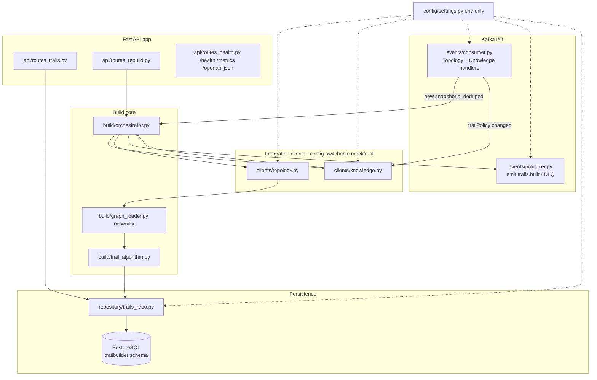
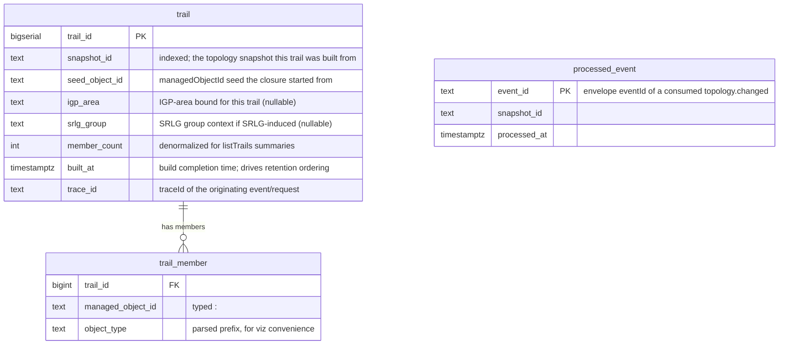
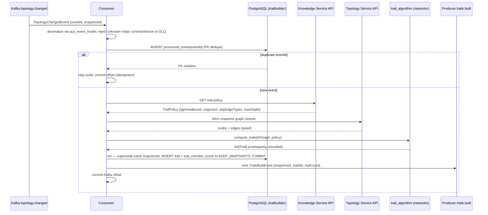
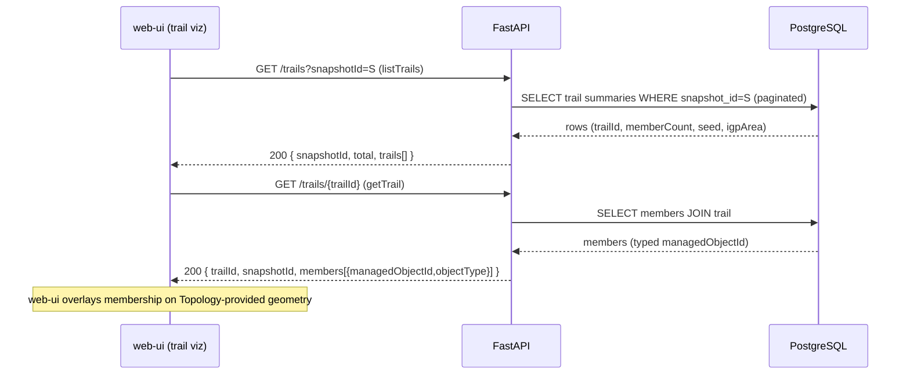
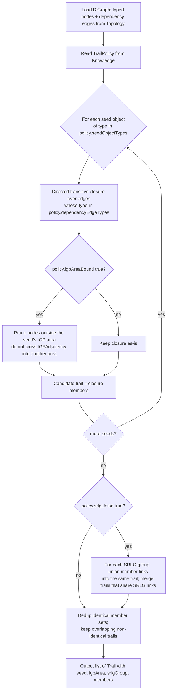

# trail-builder — Design

Buildable design for the Trail Builder Service, derived from the approved
`services/trail-builder/spec.md`. The dev agent implements directly from this document.

Trail Builder consumes `topology.changed`, fetches graph closures from the **Topology
Service API** (never Apache AGE directly) and the trail policy from the **Knowledge Service
API** (never hard-coded), computes **overlapping, policy-bounded correlation trails**
(transitive closure over dependency edges, bounded by IGP area, SRLG members unioned),
persists them in its own PostgreSQL schema, serves the trail-query/visualization API, and
emits `trails.built` (summary only).

---

## Stack

| Concern | Choice (permissive license) |
|---|---|
| Language / runtime | **Python 3.13** (repo-pinned) |
| HTTP API + OpenAPI 3.1 | **FastAPI** (MIT) + **uvicorn** (BSD-3) — FastAPI emits OpenAPI 3.1 natively |
| Graph closure | **networkx** (BSD-3) — in-memory directed graph + traversal |
| Event model | **acp-event-model** (repo lib; Pydantic v2 binding; `import acp_event_model as m`) |
| Kafka client | **confluent-kafka** (Apache-2.0) — consumer/producer with explicit offset commit |
| Datastore | **PostgreSQL** via **SQLAlchemy 2.x** (MIT) + **psycopg[binary]** driver + **Alembic** (MIT) migrations |
| HTTP client (integration points) | **httpx** (BSD-3); **respx** (BSD-3) for OpenAPI-stub mocking in unit tests |
| Metrics | **prometheus-client** (Apache-2.0) at `/metrics` |
| Logging | **structlog** (Apache-2.0/MIT) — structured JSON, `traceId`/`snapshotId` bound |
| Settings | **pydantic-settings** (MIT) — all config from env, no hard-coded URLs/values |
| Lint / format / test | **ruff**, **black**, **pytest** (+ `pytest-cov`) — per CLAUDE.md |

> psycopg note: psycopg3's C driver is LGPL but consumed as an unmodified runtime dependency
> (dynamic, separate process boundary to Postgres). If the LGPL classification is a concern at
> review, swap to **asyncpg** (Apache-2.0) — the repository layer is driver-agnostic behind
> SQLAlchemy. Recorded under Design alternatives.

---

## Task breakdown (from the spec)

Every spec task (§Tasks 1–8) is realized below and traceable to modules/flows.

| Spec task | Realized by (modules / flow) |
|---|---|
| **1. Consume `topology.changed` → trigger build (+ on-demand API build)** | `events/consumer.py` (`TopologyChangedHandler`) checks `processed_event` dedupe table on envelope `eventId`, then calls `build/orchestrator.py:build_trails(snapshotId)`. `POST /trails/rebuild` (`api/routes_rebuild.py`) calls the same orchestrator synchronously. |
| **2. React to `knowledge.updated` (trailPolicy) → re-fetch policy, no rebuild** | Same consumer, `KnowledgeUpdatedHandler`: if `recordType == "trailPolicy"`, calls `clients/knowledge.py:refresh_policy()` which repopulates the in-memory policy cache. No producer emission, no build. |
| **3. Fetch graph closures from Topology Service** | `clients/topology.py` — httpx client built against Topology's published OpenAPI; fetches snapshot nodes/edges (or bounded-traversal endpoints). Config-switchable mock/real. Never touches AGE. |
| **4. Fetch trail policy from Knowledge Service** | `clients/knowledge.py` — httpx client against Knowledge's published OpenAPI; returns a typed `TrailPolicy` (IGP-area bound, SRLG-union rule, dependency-edge types, depth bound). Cached; refreshed on event (Task 2) and at build start. |
| **5. Compute trails (closure bounded by IGP area + SRLG union, overlapping)** | `build/graph_loader.py` (networkx `DiGraph` from Topology data) + `build/trail_algorithm.py` (`compute_trails(graph, policy)`) — the core algorithm (see **Algorithm logical flow**). |
| **6. Persist trail definitions (member set + snapshotId; supersede per snapshot; retain prior)** | `repository/trails_repo.py` — writes `trail` + `trail_member` rows inside one transaction; supersedes the same `snapshotId`; retention policy keeps current + previous snapshot (see **Data model**). |
| **7. Serve queries + browse via API (`getTrailsForObject`, `getTrail`, `listTrails`) + OpenAPI** | `api/routes_trails.py` — `GET /trails?managedObjectId=`, `GET /trails/{trailId}`, `GET /trails?snapshotId=`. FastAPI publishes OpenAPI 3.1 at `/openapi.json`; generated `openapi.json` checked into `services/trail-builder/`. |
| **8. Emit `trails.built` (summary; trailCount == len(trailIds))** | `events/producer.py:emit_trails_built(snapshotId, trailIds)` — builds the envelope with the `TrailsBuiltEvent` payload via `acp_event_model`, asserts `trailCount == len(trailIds)`, produces to `trails.built`. |

---

## Phase applicability (design view)

Consistent with the canonical phase map (`architecture.md`) and the spec. Active work is P1
only; P2/P3 are passive query-serving. A `topology.changed` or trailPolicy `knowledge.updated`
arriving in any phase triggers **P1-style** Active build work (classified as P1).

| Phase | Active/Passive/Idle | Modules/handlers exercised | Inputs/Outputs |
|---|---|---|---|
| **P1 — Topology onboarding** | **Active** | `events/consumer.py` (topology + knowledge handlers), `clients/topology.py`, `clients/knowledge.py`, `build/*` (graph_loader, trail_algorithm, orchestrator), `repository/trails_repo.py`, `events/producer.py`, **and concurrently** `api/routes_trails.py` (web-ui visualizes as onboarding completes) | In: `topology.changed`; Topology graph API; Knowledge trail-policy API. Out: `trails.built`; serves `getTrailsForObject`/`getTrail`/`listTrails` |
| **P2 — Pattern learning** | **Passive** | `api/routes_trails.py` (query/browse only); DB read path; consumer **dormant for building** but stays subscribed so a late `topology.changed` re-enters P1-style Active work | In: — (no build driving). Out: serves `getTrailsForObject`/`getTrail`/`listTrails` to Enrichment / Noise Filter / Pattern Miner |
| **P3 — Real-time correlation** | **Passive** | `api/routes_trails.py` (query only) | In: —. Out: serves trail-membership queries to Enrichment live-path trail-tagging |

---

## Module breakdown



| Module | Responsibility |
|---|---|
| `config/settings.py` | Pydantic-settings: Kafka brokers/topics, DB URL, `TOPOLOGY_SERVICE_BASE_URL`/`_MODE`, `KNOWLEDGE_SERVICE_BASE_URL`/`_MODE`, retention `KEEP_SNAPSHOTS` (default 2). No literal URLs/thresholds in code. |
| `events/consumer.py` | confluent-kafka consumer loop; dedupe; dispatch to handlers; manual offset commit after success; DLQ routing. |
| `events/producer.py` | Builds + serializes `trails.built` envelope; produces DLQ records. |
| `clients/topology.py` | Topology graph-closure client (httpx, against Topology OpenAPI). |
| `clients/knowledge.py` | Knowledge trail-policy client + in-memory policy cache. |
| `build/orchestrator.py` | Coordinates one build: refresh policy → load graph → compute → persist → retention → emit. Idempotent per `snapshotId`. |
| `build/graph_loader.py` | Maps Topology nodes/edges → networkx `DiGraph` with typed attributes. |
| `build/trail_algorithm.py` | The trail computation (see Algorithm logical flow). Pure function: `(DiGraph, TrailPolicy) -> list[Trail]`. |
| `repository/trails_repo.py` | SQLAlchemy CRUD; transactional persist; supersede + retention; query methods. |
| `api/*` | FastAPI routers; Pydantic request/response models (reuse `acp_event_model` where applicable). |
| `domain/models.py` | Internal types: `TrailPolicy`, `Trail`, `TrailSummary`. |
| `main.py` | Wires FastAPI + starts consumer thread; `/health` reflects consumer + DB + integration health. |

---

## Data model / DB schema

Owns the PostgreSQL `trailbuilder` schema (single-owner invariant). Three tables: trail
definitions, trail membership, and a consumer dedupe ledger.

**Retention (resolves spec Open Question #4):** keep trails for the **current and immediately
preceding snapshot** (`KEEP_SNAPSHOTS=2`, configurable). After a successful build, prune trail
rows whose `snapshot_id` is not among the most-recent `KEEP_SNAPSHOTS` distinct snapshots
(ordered by `built_at`). A rebuild for the **same** `snapshot_id` supersedes it (delete-then-insert
in one transaction); rebuilds for a **new** `snapshot_id` leave prior snapshots intact until they
fall outside the retention window.



DDL summary (Alembic migration):

```sql
CREATE SCHEMA IF NOT EXISTS trailbuilder;

CREATE TABLE trailbuilder.trail (
  trail_id      BIGSERIAL PRIMARY KEY,
  snapshot_id   TEXT        NOT NULL,
  seed_object_id TEXT       NOT NULL,
  igp_area      TEXT,
  srlg_group    TEXT,
  member_count  INTEGER     NOT NULL DEFAULT 0,
  built_at      TIMESTAMPTZ NOT NULL DEFAULT now(),
  trace_id      TEXT
);
CREATE INDEX ix_trail_snapshot   ON trailbuilder.trail (snapshot_id);
CREATE INDEX ix_trail_builtat    ON trailbuilder.trail (built_at DESC);

CREATE TABLE trailbuilder.trail_member (
  trail_id          BIGINT NOT NULL
                    REFERENCES trailbuilder.trail(trail_id) ON DELETE CASCADE,
  managed_object_id TEXT   NOT NULL,
  object_type       TEXT   NOT NULL,
  PRIMARY KEY (trail_id, managed_object_id)
);
-- getTrailsForObject(managedObjectId): which trails contain this object
CREATE INDEX ix_member_object ON trailbuilder.trail_member (managed_object_id);

CREATE TABLE trailbuilder.processed_event (
  event_id     TEXT PRIMARY KEY,           -- envelope eventId; idempotency (criterion 7)
  snapshot_id  TEXT NOT NULL,
  processed_at TIMESTAMPTZ NOT NULL DEFAULT now()
);
```

`trailId` exposed via API is the string form of `trail.trail_id`. `snapshotId` alignment
(criterion 12) is carried on every `trail` row. Idempotency (criterion 7) is the
`processed_event` primary-key insert: a duplicate `eventId` violates the PK and the build is
skipped.

---

## Event handling

**Consumers**

| Topic | Handler | Idempotency / dedupe | DLQ |
|---|---|---|---|
| `topology.changed` | `TopologyChangedHandler` | Envelope `eventId` inserted into `processed_event` (PK). Duplicate `eventId` → skip (no rebuild, no emit). | Deserialization failure, unknown major `schemaVersion` (≥2), or non-retryable processing error → produce raw bytes + error metadata to `topology.changed.dlq`; commit offset. |
| `knowledge.updated` | `KnowledgeUpdatedHandler` | If `recordType == "trailPolicy"` → `refresh_policy()`. No dedupe ledger needed (idempotent cache refresh, no side-effecting emission). Other `recordType` ignored. | Malformed `knowledge.updated` → `knowledge.updated.dlq` (existing per-topic `.dlq` convention). |

> `knowledge.updated.dlq` and `topology.changed.dlq` follow the platform-wide `<topic>.dlq`
> convention already in `architecture.md` (Kafka topics: `*.dlq`). No new topic introduced — no
> contract change.

**Producers**

| Topic | Payload (from `acp_event_model`) | Notes |
|---|---|---|
| `trails.built` | `TrailsBuiltEvent` (`snapshotId`, `trailIds[]`, `trailCount`) | Emitted once per successful build. `trailCount == len(trailIds)` asserted before produce. `knowledge.updated` refresh does **not** emit; emission is tied to actual build completion. |

Offset commit is **manual, after** the full build+persist+emit (or DLQ routing) succeeds, so a
crash mid-build re-delivers and the `processed_event` ledger prevents a duplicate `trails.built`.

---

## API contracts / API schema

FastAPI generates **OpenAPI 3.1** at `/openapi.json`; the generated document is exported to
`services/trail-builder/openapi.json` (build step `python -m src.export_openapi`) and is the
single source of truth. Contract/unit tests validate request/response bodies against the
checked-in schema (criterion 13). The rebuild response reuses `acp_event_model.TrailsBuiltEvent`.

### `GET /trails?managedObjectId={managedObjectId}` — getTrailsForObject
Returns every trail the object belongs to.
- 200:
```json
{
  "managedObjectId": "Port:R1-Gi0/0",
  "trails": [
    { "trailId": "1042", "snapshotId": "snap-2026-06-08T10:00Z",
      "memberCount": 7, "igpArea": "0.0.0.0", "srlgGroup": null }
  ]
}
```
- 422 if `managedObjectId` malformed (fails `<objectType>:<id>` pattern); 200 with empty `trails` if the object is in no trail.

### `GET /trails?snapshotId={snapshotId}` — listTrails (browse for web-ui)
Returns all trail **summaries** for a snapshot. Supports pagination (`limit`, default 100;
`offset`) and optional `igpArea` filter.
- 200:
```json
{
  "snapshotId": "snap-2026-06-08T10:00Z",
  "total": 42,
  "limit": 100, "offset": 0,
  "trails": [
    { "trailId": "1042", "memberCount": 7, "seedObjectId": "Node:R1",
      "igpArea": "0.0.0.0", "srlgGroup": null }
  ]
}
```
- 404 if no build exists for `snapshotId`.

> `managedObjectId` and `snapshotId` variants of `GET /trails` are disambiguated by query
> parameter (per the spec's permission); exactly one of the two is required, else 422.

### `GET /trails/{trailId}` — getTrail (visualization-ready)
Full member list + snapshot context; members are typed `managedObjectId`s so web-ui resolves
each member's layer without another call (criteria 5, 15).
- 200:
```json
{
  "trailId": "1042",
  "snapshotId": "snap-2026-06-08T10:00Z",
  "seedObjectId": "Node:R1",
  "igpArea": "0.0.0.0",
  "srlgGroup": null,
  "members": [
    { "managedObjectId": "Node:R1", "objectType": "Node" },
    { "managedObjectId": "Port:R1-Gi0/0", "objectType": "Port" },
    { "managedObjectId": "IPLink:R1-R2", "objectType": "IPLink" }
  ]
}
```
- 404 if `trailId` unknown.

### `POST /trails/rebuild` — on-demand build
Body: `{ "snapshotId": "<optional>" }` (defaults to current/most-recent snapshot).
- 200: serialized `TrailsBuiltEvent` summary `{ "snapshotId", "trailIds": [...], "trailCount" }`.
- 409 if a build for the requested snapshot is already in progress (single-flight lock).
- 502 if Topology/Knowledge unavailable after retries (see Error handling).

**Auth (resolves spec Open Question #3):** `POST /trails/rebuild` is **internal-only**, gated by
a shared bearer token from `REBUILD_API_TOKEN` env (absent in `dev`/mock → open; required in
`real`/integration). Read endpoints are unauthenticated (internal cluster + web-ui). Rationale
under Design alternatives.

### Operational
`GET /health` (liveness/readiness: consumer thread alive, DB reachable, last build status),
`GET /metrics` (Prometheus), `GET /openapi.json`.

---

## Integration points (mock vs. real)

No hard-coded URLs. Both clients resolve base URL + mode from env at startup (criteria 9, 10).
Mocks are stubs generated from the collaborator's **published OpenAPI** (via `respx` route
tables seeded from their `openapi.json`).

| Collaborator | Operation used | Config keys | Mock (unit) | Real (integration) |
|---|---|---|---|---|
| **Topology Service** | graph closure / bounded traversal for a snapshot (neighbors, traverse-by-edge-type, resolve managedObjectId) | `TOPOLOGY_SERVICE_BASE_URL`, `TOPOLOGY_SERVICE_MODE` (`mock`\|`real`) | respx stubs from Topology `openapi.json` | live Topology on `integration` Compose address |
| **Knowledge Service** | get current trail policy (IGP-area bound, SRLG-union rule, dependency-edge types, depth bound) | `KNOWLEDGE_SERVICE_BASE_URL`, `KNOWLEDGE_SERVICE_MODE` (`mock`\|`real`) | respx stubs from Knowledge `openapi.json` | live Knowledge on `integration` |

> **Integration dependency (not a blocker):** the exact Topology query-API shapes (issue #24)
> and Knowledge trail-policy fields (issue #25) are **design-stage on the producers' side**. Per
> the contract-first invariant, this design builds both clients against the producers' **published
> `openapi.json`** once checked in. Until then, the dev agent codes each client behind an interface
> (`clients/topology.py`, `clients/knowledge.py`) and mocks from a provisional shape matching the
> spec's described semantics; the mock is regenerated from the real `openapi.json` when published.
> This is noted, not designed around — no contract is invented here.

---

## Key flows (sequence / data-flow diagrams)

### Flow A — `topology.changed` → build → persist → emit `trails.built`



### Flow B — query API call (web-ui visualization)



---

## Algorithm logical flow

**Goal:** from the snapshot graph + trail policy, produce **overlapping, policy-bounded trails**
— the transitive closure over **dependency edges** from each seed, **bounded by IGP area**, with
**SRLG members unioned** into a shared trail. All bounds come from the Knowledge `TrailPolicy`
(never hard-coded).

`TrailPolicy` fields read from Knowledge: `dependencyEdgeTypes` (which edge types are traversable,
e.g. `Node→LineCard→Port`, `Port→IPLink`, `IPLink→IGPAdjacency`, `IPLink→LSP`), `igpAreaBound`
(true → confine closure to a single IGP area), `srlgUnion` (true → union all members of a shared
SRLG group), `maxDepth` (optional traversal-depth cap), `seedObjectTypes` (which node types act
as closure seeds, e.g. `Node`, `IPLink`).



Step detail (implementable):

1. **Build graph.** `graph_loader` builds a networkx `DiGraph`; node id = `managedObjectId`,
   node attr `objectType` + `igpArea` (from Topology node descriptors); edge attr `edgeType`.
2. **Closure per seed.** For each node whose `objectType ∈ policy.seedObjectTypes`, compute the
   set of reachable nodes following only edges with `edgeType ∈ policy.dependencyEdgeTypes`
   (BFS/DFS via `networkx.descendants` on an edge-type-filtered subgraph; cap at `maxDepth` if set).
   This is the **dependency transitive closure** — the seed's trail.
3. **IGP-area bound.** If `policy.igpAreaBound`, traversal must not cross an `IGPAdjacency` edge
   into a different `igpArea`; equivalently, restrict the filtered subgraph to nodes sharing the
   seed's `igpArea` before closure. Guarantees **no trail spans two IGP areas** (criterion 2) and
   no unbounded whole-network trail.
4. **SRLG union.** If `policy.srlgUnion`, for each `SRLG` group node, take its member `IPLink`
   (and related) objects; **union them into the same trail** and merge any candidate trails that
   contain an SRLG-shared link. Two links sharing an SRLG land in one trail (criterion 3).
5. **Overlap is preserved.** A device on multiple LSP paths and/or in an SRLG group appears in
   **multiple** trails — trails are not partitioned; only **identical** member sets are deduped.
   An object on 2 LSPs + 1 SRLG yields ≥3 distinct trails (criterion 1).
6. **Output** `list[Trail]`, each with `seedObjectId`, `igpArea`, `srlgGroup` (nullable), and the
   typed member list — persisted by the repository.

Pure-function signature: `compute_trails(graph: nx.DiGraph, policy: TrailPolicy) -> list[Trail]`
— deterministic, unit-testable against synthetic fixtures with no I/O.

---

## Seed data & examples

**N/A — consumes upstream data.** Trail Builder builds from Topology Service graph data + the
Knowledge trail policy; it generates no seed data. Unit tests use small synthetic networkx graph
fixtures (`tests/fixtures/`) — e.g. an object `X` on two LSPs + one SRLG, and a two-IGP-area graph
— to exercise the algorithm; these are test fixtures, not shipped seed data.

## UI wireframes

**N/A — backend service.** The web-ui renders the trail visualization by consuming
`listTrails` / `getTrail` / `getTrailsForObject` and overlaying membership on
Topology-Service-provided geometry. Trail Builder supplies viz-ready membership data only.

---

## Error handling

| Failure mode | Handling | Surfaced as |
|---|---|---|
| **Poison `topology.changed`** — malformed JSON / deserialization failure | Catch in consumer; produce raw bytes + error to `topology.changed.dlq`; commit offset; continue (criterion 11) | DLQ record; `dlq_total` metric; ERROR log w/ traceId |
| **Unknown major `schemaVersion` (≥2)** | `acp_event_model` rejects on deserialize; treated as poison → `topology.changed.dlq` | DLQ; metric; log |
| **Topology Service unavailable / 5xx / timeout** | **Retry with exponential backoff** (e.g. 3 attempts, jittered). On exhaustion: **do not DLQ the event** (it is valid) — abort the build, **do not commit the offset** so the event re-delivers, mark `last_build_status=failed` (degraded `/health`), increment `topology_fetch_failures`. Build is held, not dropped. For `POST /trails/rebuild`: return **502**. | degraded `/health`; metric; WARN/ERROR log; (consumer path) re-delivery |
| **Knowledge Service unavailable** | Same retry-then-hold policy. If a **cached** policy exists, the orchestrator may proceed on the last-known-good policy and log a WARN (`knowledge_stale=true`); if no policy is cached at all, hold (abort + re-deliver) rather than build with no bounds. | degraded `/health`; metric; log |
| **Snapshot supersession** (same `snapshotId` rebuilt, or a newer snapshot arrives mid-build) | Per-snapshot single-flight lock; same-snapshot rebuild = delete-then-insert in one transaction (no duplicate rows). A newer `snapshotId` produces a separate set of trail rows; retention prunes the oldest beyond `KEEP_SNAPSHOTS`. | log; `builds_total`/`trails_superseded_total` metrics |
| **Idempotency** — duplicate `eventId` | `processed_event` PK insert fails → skip build, no second `trails.built` emit, commit offset (criterion 7) | `duplicate_events_total` metric; INFO log |
| **Validation failure** (bad request: malformed `managedObjectId`, missing both query params, unknown `trailId`) | FastAPI/Pydantic → **422** (validation) or **404** (unknown id) with structured error body; never a 500 | HTTP error response |
| **Algorithm empty result** (graph yields zero trails) | Not an error: persist zero trails, emit `trails.built` with empty `trailIds` + `trailCount=0`. Logged as INFO. | `trails.built` (count 0); INFO log |

Nothing silently drops: every dropped/failed item is either DLQ'd, re-delivered, or surfaced via
`/health` + `/metrics` + a structured JSON log carrying `traceId` and `snapshotId`.

---

## Design alternatives

| Consideration | Alternatives considered | Chosen + rationale |
|---|---|---|
| **Closure implementation** | (a) hand-rolled BFS over dicts; (b) **networkx** edge-type-filtered subgraph + `descendants`; (c) push closure into a Topology graph query (Cypher/AGE) | **(b) networkx** — CLAUDE.md mandates networkx for this cohort; in-memory, pure-function, trivially unit-testable; (c) would couple to AGE / violate single-owner; (a) reinvents networkx. |
| **Idempotency mechanism** | (a) Kafka transactional EOS; (b) **`processed_event` dedupe table on `eventId`**; (c) idempotent upsert keyed by snapshot only | **(b)** — matches the platform invariant (dedupe on `eventId`), simple with at-least-once + manual commit, and also guards the producer emit. EOS adds operational weight for little gain here. |
| **Retention policy** (OQ #4) | (a) keep all snapshots; (b) **keep current + previous (`KEEP_SNAPSHOTS=2`)**; (c) TTL by age | **(b)** — mirrors topology snapshot retention named in the spec; bounded storage; preserves the "leave prior intact" criterion (12); configurable to widen later. |
| **Rebuild auth** (OQ #3) | (a) fully open; (b) **bearer token, required in real/integration**; (c) full OAuth2/mTLS | **(b)** — `rebuild` is expensive; a config-driven bearer token is enough for an internal MVP service and keeps unit tests open in mock mode. Full OAuth/mTLS is post-MVP cluster policy. |
| **`listTrails`/`getTrailsForObject` path shape** | (a) **query-param `GET /trails?snapshotId=` / `?managedObjectId=`** (spec default); (b) `GET /snapshots/{id}/trails` + `GET /objects/{id}/trails` | **(a)** — keeps the spec's stated contract and a single `/trails` collection; disambiguated by required query param. Simpler OpenAPI surface; (b) deferred. |
| **Postgres driver license** | (a) **psycopg3** (LGPL C ext); (b) asyncpg (Apache-2.0) | **(a) behind SQLAlchemy**, used as an unmodified runtime dependency; swap to **(b)** if review flags LGPL. Repository layer is driver-agnostic so the swap is config-only. |
| **Build trigger on `knowledge.updated`** | (a) rebuild immediately; (b) **refresh policy cache only, rebuild on next `topology.changed`** | **(b)** — exactly the spec's Task 2 contract; avoids expensive rebuilds on every policy edit and keeps `trails.built` emissions tied to topology changes. |
| **Consumer concurrency** | (a) async FastAPI handler doing Kafka; (b) **dedicated consumer thread + FastAPI app in one process** | **(b)** — clean separation: HTTP query path stays responsive while a build runs; single Docker process; `/health` aggregates both. |

---

## Test plan

All tests are **pytest** (per CLAUDE.md). Integration points run in `mock` mode (respx stubs from
collaborator OpenAPI). Each acceptance criterion maps 1:1 to a named test (design-gate condition).

### Acceptance criterion → test (unit/contract)

| # | Acceptance criterion | Test | Asserts |
|---|---|---|---|
| 1 | Multi-trail overlap (X on 2 LSPs + 1 SRLG → ≥3 trails) | `test_multitrail_overlap_returns_at_least_three` | `getTrailsForObject("…X…")` returns ≥3 distinct `trailId`s on the overlap fixture |
| 2 | Policy-bounded (no trail spans >1 IGP area) | `test_trail_bounded_by_igp_area` | For multi-area fixture, every trail's members share one `igpArea`; no whole-network trail |
| 3 | SRLG union (two links sharing SRLG → same trail) | `test_srlg_members_unioned_into_one_trail` | Both SRLG-shared `IPLink`s appear in the same `trailId` |
| 4 | `getTrailsForObject` completeness | `test_get_trails_for_object_exact_membership` | Returned set == set computed from persisted `trail_member` rows, for each object |
| 5 | `getTrail` correctness + viz readiness | `test_get_trail_members_and_snapshot_match` | Response has full member list + `snapshotId`==trigger snapshot; every member matches `<objectType>:<id>` |
| 6 | `topology.changed` → build + emit | `test_topology_changed_triggers_build_and_emits` | After consuming event, a `trails.built` deserializes via `acp_event_model`, `trailCount==len(trailIds)`, `snapshotId` matches |
| 7 | Idempotency (same eventId twice → one emit, no dup rows) | `test_duplicate_event_id_single_emission` | Two deliveries → exactly one `trails.built`; `trail` row count unchanged on 2nd |
| 8 | `knowledge.updated` (trailPolicy) refresh, no build | `test_knowledge_updated_refreshes_policy_no_emit` | Policy re-fetched (client called); no `trails.built`; next `topology.changed` uses new policy |
| 9 | Config-switchable integration points | `test_mock_mode_runs_without_live_services` | Whole suite green with `*_MODE=mock`; same code path invoked with `real` toggle (call routed) |
| 10 | No hard-coded URLs/policy | `test_base_url_change_redirects_calls` | Changing `*_BASE_URL` env routes httpx call to new host (asserted via respx) without code change |
| 11 | Poison message → DLQ | `test_poison_topology_changed_to_dlq` | Malformed/`schemaVersion>=2` message produced to `topology.changed.dlq`; consumer keeps processing next message |
| 12 | `snapshotId` alignment + prior intact | `test_snapshot_alignment_preserves_prior` | New-snapshot build creates rows tagged new `snapshotId`; prior snapshot's `getTrail` still returns old `snapshotId` |
| 13 | OpenAPI contract compliance | `test_openapi_request_response_validation` | `GET /trails` (both variants), `GET /trails/{id}`, `POST /trails/rebuild` request+response validate against checked-in `openapi.json` |
| 14 | `listTrails` enumerates all trails for a snapshot | `test_list_trails_matches_trails_built` | `GET /trails?snapshotId=S` returns exactly N summaries (each `memberCount>0`); union of `trailId`s == `trailIds` in the `trails.built` for S |
| 15 | `getTrail` members typed + viz-sufficient | `test_get_trail_members_are_typed_managedobjectids` | For each `trailId` from `listTrails`/`getTrailsForObject`, members non-empty and all match `<objectType>:<id>`; no extra per-member call needed |

### E2E scenarios (from this design unit's point of view)

Exercised by the integration-test stage against the real Topology + Knowledge services on the
`integration` branch (Topology/Knowledge in `real` mode), plus failure paths.

| # | Scenario | Trigger → path | Expected outcome |
|---|---|---|---|
| 1 | Onboarding build happy path | Topology emits `topology.changed` (new `snapshotId`) → fetch real graph + real trail policy → compute → persist → emit `trails.built` | `trails.built` on bus with `trailCount==len(trailIds)`; web-ui `listTrails(S)` shows N clusters; `getTrail` members typed |
| 2 | Overlap visible end-to-end | Same build, query an object known on 2 LSPs + 1 SRLG via `getTrailsForObject` | ≥3 trails returned; web-ui can overlay all three |
| 3 | Policy refresh then rebuild | Knowledge emits `knowledge.updated{recordType=trailPolicy}` → policy refreshed (no emit) → next `topology.changed` → rebuild | No `trails.built` from the knowledge event; subsequent build reflects new policy bounds |
| 4 | Duplicate delivery | Topology `topology.changed` re-delivered (same `eventId`) | Exactly one `trails.built`; no duplicate trail rows |
| 5 | Poison input | Malformed bytes on `topology.changed` | Routed to `topology.changed.dlq`; service stays up; next valid event builds normally |
| 6 | Topology down (partial path) | `topology.changed` arrives while Topology API is unreachable | Build held (offset not committed), `/health` degraded, `topology_fetch_failures` rises; build completes on recovery + re-delivery |
| 7 | Snapshot supersession | Two `topology.changed` with different `snapshotId` | Both snapshots' trails queryable; oldest pruned once beyond `KEEP_SNAPSHOTS`; each `getTrail` carries correct `snapshotId` |
| 8 | On-demand rebuild | `POST /trails/rebuild` (with token in real mode) | Returns `TrailsBuiltEvent` summary; `trails.built` emitted; 502 if collaborators down; 409 if build in progress |

---

## Config & observability

**Config (all from env / `pydantic-settings`; none hard-coded):**
`KAFKA_BOOTSTRAP_SERVERS`, `KAFKA_CONSUMER_GROUP`, topic names
(`TOPIC_TOPOLOGY_CHANGED`, `TOPIC_KNOWLEDGE_UPDATED`, `TOPIC_TRAILS_BUILT`, `*_DLQ`),
`DATABASE_URL`, `TOPOLOGY_SERVICE_BASE_URL`, `TOPOLOGY_SERVICE_MODE`,
`KNOWLEDGE_SERVICE_BASE_URL`, `KNOWLEDGE_SERVICE_MODE`, `KEEP_SNAPSHOTS` (default 2),
`REBUILD_API_TOKEN`, `HTTP_PORT` (default 8000), `LOG_LEVEL`. Trail-policy values
(IGP-area/SRLG rules, edge types, depth) are read from Knowledge at build time — never in config.

**Observability:**
- `GET /health` — readiness aggregates consumer-thread liveness, DB connectivity, last-build
  status, and integration-point reachability (degraded when collaborators are down).
- `GET /metrics` — Prometheus: `builds_total`, `build_duration_seconds`, `trails_built_total`,
  `trails_superseded_total`, `duplicate_events_total`, `dlq_total{topic}`,
  `topology_fetch_failures`, `knowledge_fetch_failures`, `knowledge_stale`.
- Structured JSON logs (structlog) on all paths incl. errors, each bound with `traceId` (from
  envelope/header) and `snapshotId` where applicable.

## Build & run

- **Lint/format/test (cohort gate):** `ruff check . && black --check . && pytest --cov`.
- **OpenAPI export:** `python -m src.export_openapi > services/trail-builder/openapi.json`
  (checked in; CI verifies it is in sync with the FastAPI app).
- **Docker:** `python:3.13-slim` base; `pip install -r requirements.txt`; copy `src/`;
  `EXPOSE 8000`; `CMD ["python", "-m", "src.main"]` (starts FastAPI + uvicorn and the consumer
  thread). Compose entry depends on `kafka`, `postgres`, and (integration) `topology`/`knowledge`.
- **Local run:** `docker compose up trail-builder` with env from the compose file; or
  `python -m src.main` with the env vars above for a dev loop (mock mode needs no live deps).
- **Migrations:** `alembic upgrade head` against `DATABASE_URL` (creates the `trailbuilder` schema).
