# web-ui — Design

> Authored by `@designer` using the `design` skill, from the approved spec on `web-ui`
> (the streaming/dashboard spec rework: landing dashboard, real-time streaming view,
> incident-detail drill-down, noise-filter run-stats view, cross-navigation/deep-linking,
> plus the original four modules).
> Branch: `design/web-ui-streaming-dashboard`. **Supersedes the earlier design PR #112**
> (`design/web-ui-rework`): this document carries every part of that design forward and adds
> the five new views. Merges into `web-ui` — human gate, do not self-merge.
>
> The streaming view, dashboard, incident-detail page, and noise-stats view all read
> **already-published REST APIs only** (Alarm Manager `GET /alarms` + `GET /alarms/{id}`,
> Correlation Engine `GET /incidents` + `GET /incidents/{id}` + `GET /stats`, Pattern Manager
> `GET /patterns`, Noise Filter run-stats read API). **No new backend API surface, no Kafka
> consumer, no WebSocket/SSE, no contract change** is introduced by this design — real-time is
> delivered by **client-side polling** on a configurable interval.
>
> **Client-shape alignment update (consumer-side, closes the data-integration gap loop).** The
> producers have **frozen** their published OpenAPI 3.1 shapes (merged on their service branches);
> web-ui is the **consumer** and aligns every typed client + view-model to those frozen shapes —
> the producer's published OpenAPI is the single source of truth. This is a **client-shape
> alignment only**: the five views, the four modules, the geo to site to graph drill-down, pattern
> XAI/edit, config, cross-navigation, WCAG, the signal stores, and the mock/real Vitest/Playwright
> harness are all **unchanged**; only the typed client **request paths** and **response
> view-models** change to match the frozen producer contracts. **No backend change, no new API
> surface, and no contract change** is introduced. The frozen shapes consumed:
> - **Topology** (P1-G7/G8/G9): `SiteListDto` envelope with flat per-site geo; `SiteObjectsDto`
>   with **nodes AND edges** in one call; `NodeDto` with **`layer` derived from `objectType`**
>   (no separate `layer` field).
> - **Trail Builder** (P1-G4/G10): `getTrailsForObject` at `GET /trails/by-object` to
>   `{ managedObjectId, domain, trailIds[] }`; `getTrail` to `TrailDetail { trailId, domain,
>   snapshotId, members:[{managedObjectId, objectType}], memberCount }`.
> - **Knowledge** (P2-GAP-07): config reads/writes via `GET|PUT /domains/{domain}/model-params/{recordId}`
>   with the **versioned record payload** (`params[]` of `{key, value, min, max, ...}` with real
>   dotted keys); the invented flat `/knowledge/model-params` shape is removed.
> - **Pattern Manager** (P2-GAP-06/08, P3-G1): `GET /patterns` to `PatternPage { items, total,
>   limit, offset }` envelope; `PatternView` carries `trailId`, `rootCauseAlarmType` (vocab token),
>   `sessionWindow`, `structurallyValidated`/`structuralValidationReason`; `PATCH /patterns/{id}` to
>   `PatternEdit { sequenceFlags:[{index, optional}], reviewer, notes? }`.
> - **Correlation Engine** (P3-G3/G4): `GET /incidents` to the paginated envelope
>   `{ items, page, size, total }`; `GET /incidents/{id}` to a single `IncidentVM`;
>   `matchedCodebookId` is the codebook artifact id.
> - **Alarm Manager** (P3-G3): `GET /alarms` to the paginated envelope
>   `{ items, page, size, totalElements, totalPages }` with `page`/`size` params.
>
> **Note on the CE/AM page envelope** (consumer alignment to the producers' SSoT): the
> Correlation Engine and Alarm Manager froze a **`page`/`size`** pagination envelope (CE
> `{ items, page, size, total }`, AM `{ items, page, size, totalElements, totalPages }`), **not**
> `limit`/`offset`. web-ui aligns to the producers' frozen `page`/`size` envelopes (the consumer
> adapts to the published producer contract). The streaming/list views read **`.items`** from both
> uniformly, pagination request params are `page`/`size`. The Noise Filter and Pattern Manager
> envelopes keep their own published forms (Noise Filter `{items,total,limit,offset}`, Pattern
> Manager `PatternPage {items,total,limit,offset}`), each read uniformly via `.items`.

## Stack

- **Framework:** Angular 20, **standalone components only** (no NgModules). Bootstrapped via
  `bootstrapApplication` with `provideRouter`, `provideHttpClient(withFetch())`, and
  application-level providers.
- **Reactivity:** Angular **signals** (`signal`, `computed`, `effect`, `resource` /
  `httpResource` where it fits) as the primary state mechanism; `OnPush` change detection on
  every component. No NgRx — signal stores (plain injectable services exposing signals) are
  sufficient for a stateless client. The streaming view's poll loop is a signal-driven timer
  (see State management).
- **Typing:** strict TypeScript (`strict: true`, `noImplicitAny`, `strictNullChecks`). No `any`
  in application source. **Typed reactive forms** (`FormGroup` with typed controls) for the
  config-edit and pattern-edit forms, and for the streaming interval control.
- **HTTP clients:** one typed client service per collaborator, generated from each producer's
  **published OpenAPI 3.1** spec (`openapi-typescript` for models + a thin hand-written
  Angular `HttpClient` wrapper; no codegen against producer source). Base URL + mock/real toggle
  resolved from Angular environment config.
- **Graph & map rendering (permissive licenses only):**
  - **MapLibre GL JS** (BSD-3-Clause) for the geo-site map; **deck.gl** (MIT) optional overlay
    layer for site markers/clusters.
  - **Cytoscape.js** (MIT) for the site-level device graph and trail overlays.
  - Charts: a lightweight MIT chart lib (e.g. `ng2-charts`/Chart.js — MIT) for stats and the
    dashboard KPI sparklines.
- **Accessibility tooling:** `@angular/cdk/a11y` (FocusTrap, LiveAnnouncer), `@angular/cdk`
  virtual scroll for long lists (streaming, alarm-lifecycle, incidents), `axe-core` (dev-only
  test dependency — not shipped) for the a11y unit tests.
- **Test stack:** **Vitest + Angular TestBed** (jsdom) for unit/component tests; mock backends
  generated from each producer's OpenAPI spec (MSW — MIT — as the in-jsdom mock transport).
  Mock timers (Vitest `vi.useFakeTimers`) drive the streaming poll-cadence tests.
  **Playwright** (Apache-2.0) for E2E only, against the integration stack. Playwright is never
  the unit-test runner.
- **Build/serve:** Angular CLI (esbuild). Production build is a **static SPA**; no BFF. Served
  by nginx (BSD-2-Clause) in the container with a health route returning HTTP 200 on `/`.
- **Runtime:** Node 24 build stage (`node:24`), nginx serve stage.

License posture: Angular (MIT), MapLibre GL (BSD-3), deck.gl (MIT), Cytoscape.js (MIT), Chart.js
(MIT), MSW (MIT), axe-core (dev-only). No GPL/AGPL/BSL/source-available runtime dependency.

## Task breakdown (from the spec)

| Spec task | Realized by (modules / flow) |
|---|---|
| 1. Render the landing dashboard (home/default route) | `DashboardModule` to `DashboardComponent` + `KpiCardComponent` + `RecentIncidentsComponent` + `QuickLinksComponent`; `DashboardStore` (signals) fans out parallel reads to `CorrelationEngineClient.getStats()` + `listIncidents()`, `PatternManagerClient.listPatterns({lifecycle:'approved'})`, and `AlarmManagerClient.listAlarms()` (count). Default route `''` redirects to `/dashboard`. |
| 2. Real-time streaming view via configurable client polling | `StreamingModule` to `StreamingViewComponent` + `LivePollingService`; `LivePollingService` runs a signal-driven timer at `STREAMING_REFRESH_INTERVAL_MS`, polling `AlarmManagerClient.listAlarms()` + `CorrelationEngineClient.listIncidents()` — **both return the same-shaped `{ items, page, size, ... }` page envelope**; `DeltaDiffService` diffs previous-vs-new over the **`.items`** arrays keyed by `alarmId`/`incidentId`; new/changed rows get transient highlight classes; pause/resume toggle + interval control + live/last-updated indicator. |
| 3. Render the incident-detail drill-down page | `IncidentDetailModule` to `IncidentDetailComponent`; route `/incidents/:incidentId`; reads `CorrelationEngineClient.getIncident(incidentId)` (`GET /incidents/{id}` → a single `IncidentVM` with `rootCauseAlarmId`, `childAlarmIds[]`, `matchedPatternId?`/`matchedCodebookId?`, `confidence`, `trailId`) then `AlarmManagerClient.getAlarm(alarmId)` per member (root-cause + children) via parallel `forkJoin`/`Promise.all`; renders root cause, children, matched pattern/codebook (`matchedCodebookId` = codebook artifact id) + confidence, trail, per-member links into the streaming/alarm view. |
| 4. Render the noise-filter run-stats view | `CorrelationStatsModule` to `NoiseStatsComponent` (learning sub-view); reads `NoiseFilterClient.listRunStats({trailId, from, to, limit, offset})` (`GET /api/v1/run-stats`); renders one row per run with derived storm-reduction ratio; filterable by `trailId` and time range. |
| 5. Provide logical cross-navigation with deep-linkable routes | `NavigationService` builds `RouterLink`/`navigate` targets for every cross-link (pattern→`/topology?trailId=`, incident→`/incidents/:id`, member alarm→`/streaming?alarmId=`, site→`/streaming?siteId=` filtered, KPI→underlying view). All entity pages carry the ID in the URL (route param or query param) so links are shareable/bookmarkable. The **navigation map** below is the required deliverable. |
| 6. Render the geo-site topology view | `TopologyTrailsModule` to `GeoSiteMapComponent` (MapLibre GL) reads `TopologyClient.listSites()` (`GET /topology/sites`); the response is the **`SiteListDto` envelope** `{ domain, snapshotId, count, sites:[...] }`; the map reads the `sites[]` array (each a flat `SiteDto { siteId, name, latitude, longitude, region }`), rendering one marker per site; `SiteStore` signal holds the `sites[]` array (P1-G7). |
| 7. Expand a site into its device-level graph | `SiteGraphComponent` (Cytoscape.js); on marker select, `TopologyTrailsStore.selectSite(siteId)` calls `TopologyClient.objectsAtSite(siteId)` returning the **`SiteObjectsDto`** `{ siteId, domain, snapshotId, nodeCount, edgeCount, nodes:[NodeDto], edges:[EdgeDto] }`; the Cytoscape graph is built from **BOTH `nodes` and `edges`** in this single response (no per-node neighbour fan-out); view transitions map→graph (route `/topology/:siteId`); selected `siteId` passed in the request (P1-G8). |
| 8. Display device/connection attributes | `AttributeDetailPanelComponent` renders the `attributes` map from the selected `NodeDto`/`EdgeDto`; well-known keys labelled, unknown keys as generic key/value rows; `managedObjectId` always shown. The node's **`layer` is derived from `objectType`** (no separate `layer` field on `NodeDto`; P1-G9); edges carry `relation` + `attributes`. |
| 9. Visualize trail clusters & per-device membership | `TrailOverlayService` reads `TrailBuilderClient.listTrails(snapshotId, domain)` (`ListTrailsResponse { snapshotId, domain, count, trails:[...] }`) for cluster overlays and `getTrailsForObject(moid, domain)` on device select — `GET /trails/by-object?managedObjectId=&domain=` returning `{ managedObjectId, domain, trailIds:[] }` (P1-G4/G10); Cytoscape style highlights member trails. |
| 10. List & present discovered patterns with XAI | `PatternReviewModule` to `PatternListComponent` + `PatternXaiDetailComponent` read `PatternManagerClient.listPatterns()` returning the **`PatternPage` envelope** `{ items:[PatternView], total, limit, offset }` (render `items[]`, P2-GAP-08); each `PatternView` shows sequence (`SequenceElement[]`), support, confidence, lift, `rootCauseAlarmType` (vocab token), timing, `sessionWindow`, codebook overlap (`codebookMatchId`), `structurallyValidated`/`structuralValidationReason`, supporting instances, `trailId`. |
| 11. Accept approve/reject decisions | `PatternDecisionService.approve/reject(patternId)` posts `POST /patterns/{id}/approve` with `{decision}`; `PatternStore` updates the pattern lifecycle signal from the response. |
| 12. List active/approved patterns | `ActivePatternsComponent` reads `listPatterns({lifecycle:'approved'})`; tab/filter in `PatternReviewModule` (reused by the dashboard active-pattern count and the stats module). |
| 13. Read & edit Knowledge model params | `ConfigModule` to `ModelParamsFormComponent` (typed reactive form) reads `KnowledgeClient.getModelParams(domain, recordId)` (`GET /domains/{domain}/model-params/{recordId}`) and submits `KnowledgeClient.updateModelParams(domain, recordId, payload)` (`PUT /domains/{domain}/model-params/{recordId}`). The form maps the **versioned record payload** `{ domain, recordType, recordId, version, isCurrent, payload:{ paramSet, params:[{key, type, value, min, max, unit?}] } }` — real dotted keys (`dbscan.epsilon`, `dbscan.minSamples`, `window.sizeSeconds`, `prefixspan.minSupport`, ...); validates each param against its `min`/`max` client-side, submits the versioned record payload, and handles the new-version/`isCurrent` write semantics (P2-GAP-07). Confirmation toast. |
| 14. Display live correlation stats & incidents | `CorrelationStatsModule` to `IncidentListComponent` + `StatsDashboardComponent` read `CorrelationEngineClient.listIncidents()` (returns the **`{ items:[IncidentVM], page, size, total }` envelope** — render `items[]`, P3-G3/G4) and `getStats()`; ratio derived client-side. |
| 15. Display live alarm lifecycle | `AlarmLifecycleComponent` reads `AlarmManagerClient.listAlarms({state, page, size})` (returns the **`{ items:[AlarmSummary], page, size, totalElements, totalPages }` envelope** — render `items[]`, P3-G3); each `AlarmSummary` shows `lifecycleState` (`open`/`in-progress`/`correlated`/`cleared`; `reverted-open` is modelled as a transition back to `open`, surfaced from the detail's `transitions`), `role`, `incidentId`; filter by lifecycle state. |
| 16. Config-switchable backend integration | `ApiConfigService` resolves each base URL + `mock|real` toggle from `environment.ts`; `MockBackendProvider` (MSW) wired only when toggle is `mock`. Nine integration points (now +Noise Filter). |

Every spec task above maps to a named module/component; none dropped or re-scoped.

## Phase applicability (design view)

The web-ui is **Active in all three runtime phases** (a different set of modules is the focus of
each phase), matching the spec Phase applicability table and the canonical phase map. The app
shell is always loaded; the landing dashboard is reachable in every phase (it degrades each KPI
to "N/A"/empty when its source has no data yet). Phase-specific behaviour is which lazy module
the operator works in.

| Phase | Active/Passive/Idle | Modules/handlers exercised | Inputs/Outputs |
|---|---|---|---|
| P1 — Topology onboarding | Active | `DashboardModule` (topology KPIs available at this phase; incident/pattern KPIs show empty/N-A). `TopologyTrailsModule`: `GeoSiteMapComponent`, `SiteGraphComponent`, `AttributeDetailPanelComponent`, `LayerToggleComponent`, `TrailOverlayService`. Streaming/stats modules dormant (lazy, not loaded). | Reads: Topology site query API (`listSites` → `SiteListDto`, `objectsAtSite` → `SiteObjectsDto` with nodes+edges, neighbours, resolve `NodeDto` with `layer == objectType`); Trail Builder (`listTrails`, `getTrail` → `TrailDetail`, `getTrailsForObject` at `GET /trails/by-object`). Writes: none |
| P2 — Pattern learning | Active | `DashboardModule` (active-pattern count, learning KPIs). `PatternReviewModule`: `PatternListComponent`, `PatternXaiDetailComponent`, `PatternEditDialogComponent`, `PatternDecisionService`. `ConfigModule`: `ModelParamsFormComponent`. `CorrelationStatsModule` → `NoiseStatsComponent` (noise-filter run-stats / learning sub-view). | Reads: Pattern Manager read API (`GET /patterns` → `PatternPage` envelope, `GET /patterns/{id}` → `PatternView`); Knowledge model-params read API (`GET /domains/{domain}/model-params/{recordId}` → versioned record); Noise Filter run-stats read API (`GET /api/v1/run-stats`). Writes: Pattern Manager approval-intent (`POST /patterns/{id}/approve`), pattern-edit (`PATCH /patterns/{id}` → `PatternEdit` with `sequenceFlags`); Knowledge model-params edit API (`PUT /domains/{domain}/model-params/{recordId}`, versioned write). |
| P3 — Real-time correlation | Active | `DashboardModule` (live KPIs). `StreamingModule`: `StreamingViewComponent`, `LivePollingService`, `DeltaDiffService`. `IncidentDetailModule`: `IncidentDetailComponent`. `CorrelationStatsModule`: `IncidentListComponent`, `StatsDashboardComponent`, `AlarmLifecycleComponent`; `ActivePatternsComponent` (reused). | Reads: Correlation Engine (`GET /incidents` → `{items,page,size,total}`, `GET /incidents/{id}` → `IncidentVM`, `GET /stats`); Pattern Manager active-patterns (`GET /patterns?lifecycle=approved` → `PatternPage`); Alarm Manager (`GET /alarms` → `{items,page,size,totalElements,totalPages}`, `GET /alarms/{id}` → `AlarmDetail`). Writes: none |

## Module breakdown

Lazy-loaded feature modules behind a shared app shell. Each feature route is loaded with
`loadComponent` / `loadChildren` so a phase the operator is not using carries no bundle cost.

- **App shell (eager):** `AppShellComponent` (top nav with links to every page, module
  router-outlet, global error toast, `LiveAnnouncer` host), `ApiConfigService`, the nine typed
  API clients, `MockBackendProvider` (active only under the mock toggle), `ErrorBannerService`,
  `NavigationService` (builds all cross-navigation targets).
- **`DashboardModule` (lazy, default route `/dashboard`):** `DashboardComponent`,
  `KpiCardComponent`, `RecentIncidentsComponent`, `QuickLinksComponent`, `DashboardStore`
  (signals: `stats`, `incidents`, `activePatternCount`, `alarmCount`, `loading`, `error`).
- **`StreamingModule` (lazy, route `/streaming`):** `StreamingViewComponent`,
  `StreamingAlarmRowComponent`, `StreamingIncidentRowComponent`, `IntervalControlComponent`,
  `LivePollingService`, `DeltaDiffService`, `StreamingStore` (signals: `alarms`, `incidents`,
  `alarmDeltas`, `incidentDeltas`, `autoRefresh`, `intervalMs`, `lastUpdated`, `pollError`).
- **`IncidentDetailModule` (lazy, route `/incidents/:incidentId`):** `IncidentDetailComponent`,
  `MemberAlarmRowComponent`, `IncidentDetailStore` (signals: `incident`, `memberAlarms`,
  `loading`, `error`).
- **`TopologyTrailsModule` (lazy, routes `/topology`, `/topology/:siteId`):** `GeoSiteMapComponent`
  (MapLibre), `SiteGraphComponent` (Cytoscape), `LayerToggleComponent`,
  `AttributeDetailPanelComponent`, `TrailOverlayService`, `TopologyTrailsStore` (signals: `sites`,
  `selectedSite`, `graph`, `visibleLayers`, `selectedObject`, `trails`, `highlightedTrailIds`,
  `activeTrailId`).
- **`PatternReviewModule` (lazy, route `/patterns`):** `PatternListComponent`,
  `PatternXaiDetailComponent`, `PatternEditDialogComponent`, `ActivePatternsComponent`,
  `PatternDecisionService`, `PatternStore` (signals: `patterns`, `lifecycleFilter`,
  `selectedPattern`, `pendingDecision`).
- **`ConfigModule` (lazy, route `/config`):** `ModelParamsFormComponent`, `ConfigStore`
  (signals: `params`, `saveStatus`).
- **`CorrelationStatsModule` (lazy, route `/stats`):** `StatsDashboardComponent`,
  `IncidentListComponent`, `AlarmLifecycleComponent`, `NoiseStatsComponent` (learning sub-view),
  `ActivePatternsComponent` (reused), `StatsStore` (signals: `incidents`, `stats`, `alarms`,
  `alarmStateFilter`, `runStats`, `runStatsTrailFilter`).

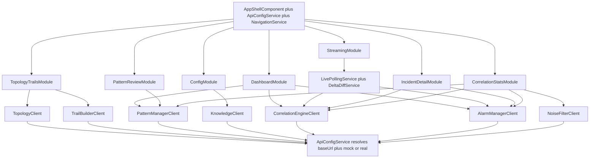

## Data model / DB schema

**N/A — no owned store.** The web-ui is a stateless SPA per spec (Data owned: none). It holds
no persistent store and caches no domain data beyond in-memory session state (the streaming
view's last-poll snapshot for delta computation is in-memory only and is discarded on navigate-
away). Below are the **client-side view-models** (TypeScript types) the UI projects from
collaborator API responses. **Field names are now aligned to each producer's FROZEN OpenAPI 3.1
shape** (closing gaps P1-G7/G8/G9/G10, P2-GAP-06/07/08, P3-G3 on the consumer side); the producer's
published `openapi.json` is the single source of truth and the `openapi-typescript`-generated
models match these exactly.

**Layer derivation (P1-G9):** `NodeDto` has **no `layer` field**; web-ui derives the logical layer
from `objectType` with a documented mapping. MVP Core IP mapping: `FiberSpan`/`OpticalLine` →
`fiber`; `Port`/`Interface` → `IP`; `Node`/`Router`/`IGPAdjacency` → `IGP`; `LSP` → `LSP`;
`Service`/`ServiceEndpoint` → `service`. The mapping table lives in `LayerMapper` (a pure function,
`objectType → layer`); an unmapped `objectType` falls back to a generic `other` layer and is still
rendered (never dropped). The `LayerToggleComponent` filters on this derived layer. The same
derivation labels each `EdgeDto` by the `relation`/endpoint objectType for the layer toggle.

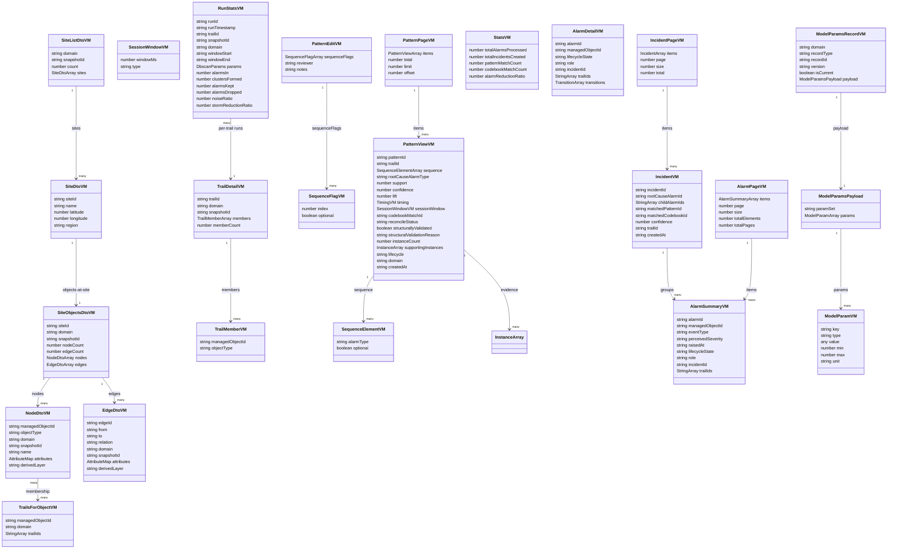

### Streaming delta / diff view-model

The streaming view keeps the **previous poll snapshot** and the **current poll snapshot** and
projects a per-row delta view-model. The diff is computed by `DeltaDiffService` (see Algorithm
logical flow + State management).

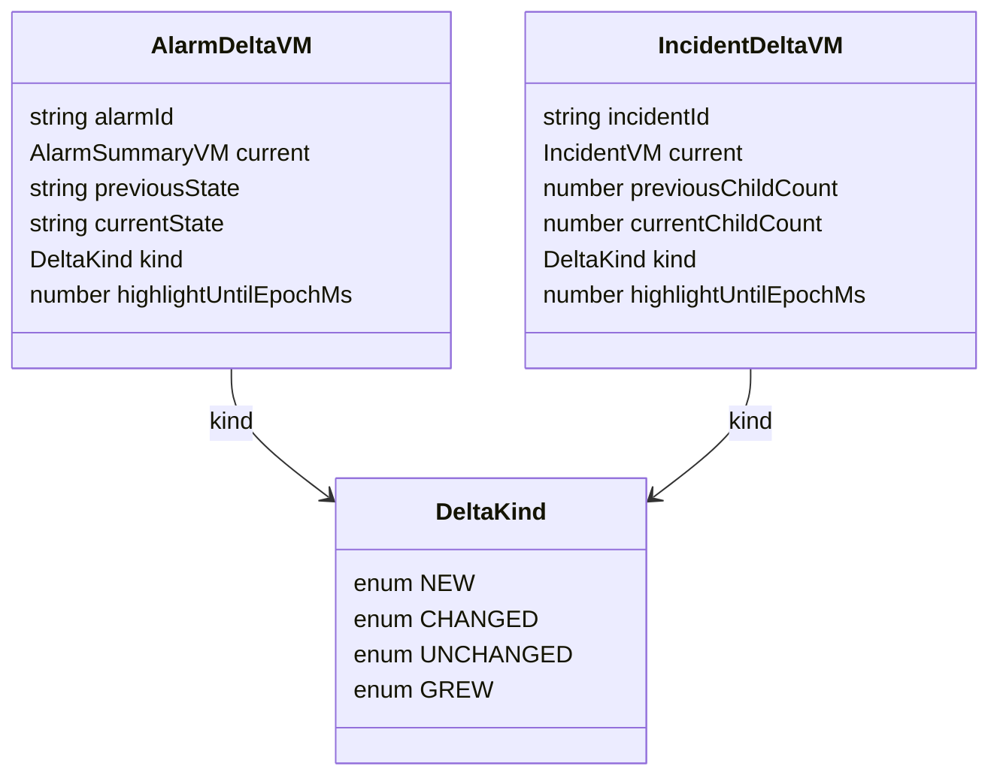

Notes:
- The diff runs over the **`.items`** array of each frozen page envelope: `AlarmManager` returns
  `{ items:[AlarmSummary], page, size, totalElements, totalPages }`, `CorrelationEngine` returns
  `{ items:[IncidentVM], page, size, total }`. `DeltaDiffService` reads `.items` from both and keys
  by `alarmId`/`incidentId` (it never assumes a bare array).
- `DeltaKind` for alarms: `NEW` (alarmId absent from previous snapshot), `CHANGED` (alarmId
  present in both but **`lifecycleState`** differs — covers `open` to `in-progress`, `in-progress`
  to `correlated`, a revert back to `open` (`reverted-open` is modelled on the producer side as a
  transition back to `open`), and to `cleared`), `UNCHANGED` (present in both, `lifecycleState`
  equal).
- `DeltaKind` for incidents: `NEW` (incidentId absent from previous), `GREW` (`childAlarmIds`
  length increased), `UNCHANGED` otherwise.
- `highlightUntilEpochMs` drives the transient highlight CSS class; once `Date.now()` passes it,
  the row drops back to its resting style (see Accessibility — prefers-reduced-motion).
- `attributes` is rendered as an open key/value map; well-known keys (`vendor`, `model`,
  `equipmentType`, `role`, `capacity` on nodes; `linkType`, `capacity`, `protectionRole` on
  edges) get friendly labels, all other keys render as generic rows. The UI never validates the
  attribute schema (Knowledge Service owns the catalogue).
- `alarmReductionRatio` is **computed client-side** as `totalAlarmsProcessed` divided by
  `totalIncidentsCreated` from the Correlation Engine `GET /stats` raw counts. RCA accuracy is
  not returned by the stats API (evaluated offline per the Correlation Engine spec); the
  dashboard/stats view show "evaluated offline" rather than fabricating a value.
- `stormReductionRatio` on `RunStatsVM` is computed client-side as `alarmsIn / clustersFormed`
  when the Noise Filter API does not return it directly (guarded for `clustersFormed` equal to 0).
- `domain` on `RunStatsVM` may be absent/null in some rows; the UI handles it gracefully.

## Event handling

- **Consumers:** **none.** The web-ui never subscribes to Kafka topics directly (spec: Consumes
  Kafka — none). All data arrives over collaborator REST APIs. The "real-time" streaming view is
  **client-side polling of existing REST endpoints**, not a Kafka consumer and not a WebSocket
  or SSE connection.
- **Producers:** **none.** The web-ui never publishes to Kafka. The architecture row "produces
  `patterns.approved` (via API)" is realized by `POST /patterns/{id}/approve` to the Pattern
  Manager, which owns the lifecycle transition and is the sole emitter of `PatternApprovedEvent`.

## API contracts / API schema

**Exposed:** N/A — no HTTP surface other than the static-asset server returning HTTP 200 on `/`
for liveness. The web-ui publishes **no** OpenAPI document (spec: APIs exposed — none).

**Consumed** (nine integration points; each typed client built from the producer published
**FROZEN** OpenAPI 3.1; no hard-coded URLs). Request/response shapes below are **aligned to each
producer's frozen `openapi.json`** — the producer is the single source of truth and the
`openapi-typescript` models match these exactly.

### Topology Service (P1) — FROZEN (P1-G7/G8/G9)
- `GET /topology/sites?domain=core-ip&snapshotId=current` (`listSites`) returns `200`
  **`SiteListDto { domain, snapshotId, count, sites: SiteDto[] }`** where
  **`SiteDto { siteId, name, latitude, longitude, region }`** (flat per-site geo). The geo map
  reads the `sites[]` array (P1-G7) — one marker per `SiteDto`; `siteId` is the Site node's
  `managedObjectId`.
- `GET /topology/sites/{siteId}/objects?domain=core-ip` (`objectsAtSite`) returns `200`
  **`SiteObjectsDto { siteId, domain, snapshotId, nodeCount, edgeCount, nodes: NodeDto[],
  edges: EdgeDto[] }`** (P1-G8). The Cytoscape site graph is built from **BOTH `nodes` and
  `edges`** of this single response — the edges come from this response (no per-node neighbour
  fan-out). `EdgeDto = { edgeId, from, to, relation, domain, attributes, snapshotId }`.
- `GET /topology/nodes/{managedObjectId}` (`resolve`) returns `200`
  **`NodeDto { managedObjectId, objectType, domain, snapshotId, name?, attributes }`** (P1-G9).
  **No separate `layer` field** — web-ui derives the layer from `objectType` via `LayerMapper`
  (`layer == objectType`, mapped to the logical fiber/IP/IGP/LSP/service layer; see Data model).
- `GET /topology/nodes/{managedObjectId}/neighbors` returns `200 NeighborsDto { managedObjectId,
  domain, neighbors:[{ node: NodeDto, via: EdgeDto }] }` (used only for ad-hoc expansion; the site
  graph itself comes from `objectsAtSite`).
- Errors: `404` (unknown object/site) shows empty-state in panel; `5xx` shows error banner.

### Trail Builder (P1) — FROZEN (P1-G4/G10)
- `GET /trails?snapshotId=X&domain=core-ip` (`listTrails`) returns `200`
  **`ListTrailsResponse { snapshotId, domain, count, trails: TrailSummary[] }`** — read `trails[]`
  for cluster overlays.
- `GET /trails/{trailId}` (`getTrail`) returns `200`
  **`TrailDetail { trailId, domain, snapshotId, members: TrailMember[], memberCount, igpArea?,
  srlgGroup? }`** where **`TrailMember { managedObjectId, objectType }`** (P1-G4; `snapshotId`
  guaranteed present, P2-GAP-09). web-ui distinguishes `Interface`/`Port`/`IPLink`/`Node` from the
  member `objectType` without re-parsing.
- `GET /trails/by-object?managedObjectId=X&domain=core-ip` (`getTrailsForObject`) returns `200`
  **`TrailsForObjectResponse { managedObjectId, domain, trailIds: string[] }`** (P1-G10 — the path
  is the frozen `GET /trails/by-object`, not a `GET /trails` query-param variant; P1-G4 — the
  response is `{ managedObjectId, domain, trailIds }`, not a bare `[{trailId}]`). On device select,
  the highlight set is `trailIds[]`.

### Pattern Manager (P2 + P3 active-patterns + dashboard active-pattern count) — FROZEN (P2-GAP-06/08, P3-G1)
- `GET /patterns?lifecycle=draft|approved|deprecated&limit=&offset=&sort=` returns `200`
  **`PatternPage { items: PatternView[], total, limit, offset }`** (the **envelope**, not a bare
  array; P2-GAP-08). web-ui renders `items[]` and uses `total`/`limit`/`offset` for review-progress
  and paging.
- `PatternView` (canonical item) = `{ patternId, trailId, sequence: SequenceElement[]
  (each {alarmType, optional}), rootCauseAlarmType (alarmType-vocabulary token, P2-GAP-04/P3-G1),
  support, confidence, lift, timing (open object), sessionWindow {windowMs, type}, codebookMatchId|null,
  reconcileStatus, structurallyValidated, structuralValidationReason|null, instanceCount,
  supportingInstances, lifecycle, domain|null, createdAt, updatedAt }`. The XAI view surfaces
  `trailId`, `rootCauseAlarmType`, `sessionWindow`, and `structurallyValidated` +
  `structuralValidationReason`.
- `GET /patterns/{patternId}` returns `200 PatternView` (full detail) or `404`.
- `POST /patterns/{patternId}/approve` body `{ decision, reviewer, notes? }` (decision =
  approve or reject) returns `200 PatternView` (updated lifecycle).
- `PATCH /patterns/{patternId}` body the **frozen `PatternEdit { sequenceFlags: [{ index, optional }],
  reviewer, notes? }`** (per-position optional markers; P2-GAP-06) returns `200 PatternView`
  (edited; `optional` reflected per `index`; `sessionWindow` is read-only/unchanged). Allowed only
  when `lifecycle` is `draft`; otherwise `409` (not draft) / `422` (bad `index`/missing reviewer),
  surfaced.
- The pattern "view trail" deep-link uses **`PatternView.trailId`** (P3-G1).

### Knowledge Service (P2 — config) — FROZEN (P2-GAP-07)
- `GET /domains/{domain}/model-params/{recordId}` (`getModelParams`) returns `200` the **versioned
  `modelParams` record** `{ domain, recordType, recordId, version, isCurrent, payload:{ paramSet,
  params:[{ key, type, value, min?, max?, unit? }] } }` with **real dotted keys** (`dbscan.epsilon`,
  `dbscan.minSamples`, `window.sizeSeconds`, `prefixspan.minSupport`, `prefixspan.maxPatternLength`,
  `window.adaptive.baseGapSeconds`, ...). There is **no** `/knowledge/model-params` path and **no**
  flat camelCase keys (`dbscanEps`, `sessionWindowGapSeconds`, ...) — those are removed (P2-GAP-07).
  Also `GET /domains/{domain}/model-params` to list and `.../versions/{version}` to pin.
- `PUT /domains/{domain}/model-params/{recordId}` (`updateModelParams`) body the **same versioned
  record payload** (dotted keys); returns `200` with a new immutable `version` (`isCurrent` flips —
  it does not mutate in place); `404` unknown record; `422` validation/out-of-bounds (e.g.
  `prefixspan.minSupport = 1.5`). The config form validates each param against its declared
  `min`/`max` client-side before submit.

### Correlation Engine (P3 + dashboard + streaming + incident-detail) — FROZEN (P3-G3/G4)
- `GET /incidents?trailId=X&from=Y&to=Z&matchType=W&page=&size=` (`listIncidents`) returns `200`
  the **paginated envelope `{ items: IncidentVM[], page, size, total }`** (P3-G3/G4; `page`/`size`,
  not `limit`/`offset`). web-ui renders `items[]`. `IncidentVM = { incidentId, rootCauseAlarmId,
  childAlarmIds[], matchedPatternId|null, matchedCodebookId|null, confidence, trailId, createdAt }`.
  Used by dashboard, streaming view, and stats module.
- `GET /incidents/{incidentId}` (`getIncident`) returns `200` a **single `IncidentVM`** (same shape
  as an `items[]` element) or `404`. **Used by the incident-detail page**; carries `rootCauseAlarmId`,
  `childAlarmIds[]`, `matchedPatternId`/`matchedCodebookId`, `confidence`, `trailId` — all fields
  the incident-detail page needs (no contract change).
- **`matchedCodebookId` is the codebook artifact id** on codebook-decode incidents (display/label
  it as the matched codebook id; `matchedPatternId` is the matched pattern id).
- `GET /stats` returns `200 { totalAlarmsProcessed, totalIncidentsCreated, patternMatchCount,
  codebookMatchCount, confidenceDistribution }`. UI computes `alarmReductionRatio`. RCA accuracy
  is not returned (evaluated offline) — UI surfaces a note.

### Alarm Manager (P3 + streaming + incident-detail) — FROZEN (P3-G3)
- `GET /alarms?state=open|in-progress|correlated|cleared&trailId=X&incidentId=Y&from=A&to=B&page=&size=`
  (`listAlarms`) returns `200` the **paginated envelope `{ items: AlarmSummary[], page, size,
  totalElements, totalPages }`** (P3-G3; `page`/`size` request params). web-ui renders `items[]`.
  `AlarmSummary = { alarmId, managedObjectId, eventType, perceivedSeverity, raisedAt, lifecycleState
  (open/in-progress/correlated/cleared; `reverted-open` modelled as a transition back to `open`),
  role (root-cause/child/none), incidentId, trailIds }`. Used by the streaming view and the
  alarm-lifecycle view.
- `GET /alarms/{alarmId}` (`getAlarm`) returns `200 AlarmDetail` — all `AlarmEvent` fields plus
  `lifecycleState`, `role`, `incidentId`, and ordered `transitions:[{ toState, reason, source,
  changedAt, occurredAt }]` (ascending `occurredAt`, UTC). Used by the incident-detail page per
  member alarm.

### Noise Filter (P2 — run-stats / learning sub-view) **[NEW client]**
- `GET /api/v1/run-stats?trailId=X&from=Y&to=Z&limit=L&offset=O` returns `200 RunStatsPage`
  `{ items: [RunStatsRow], total, limit, offset }`, newest first. Each `RunStatsRow`:
  `runId`, `runTimestamp`, `trailId`, `snapshotId`, `domain` (optional/null), `windowStart`,
  `windowEnd`, `eps`, `minSamples`, `windowSize`, `algorithm`, `alarmsIn`, `clustersFormed`,
  `alarmsKept`, `alarmsDropped`, `noiseRatio`. The UI computes the storm-reduction ratio
  (`alarmsIn / clustersFormed`) when not directly returned.
- `GET /api/v1/run-stats/{runId}` returns `200 RunStatsRow` or `404`.
- Validation errors (bad `limit`, malformed `from`/`to`) return `422`; surfaced as an error
  banner in the noise-stats sub-view. Exact paths/params confirmed against the Noise Filter
  `openapi.json` (open question #7).

**OpenAPI usage:** the web-ui generates TypeScript models from each producer checked-in
**FROZEN** `openapi.json` (`openapi-typescript`) and regenerates on a collaborator contract
change (a collaborator API change is a contract change — architecture.md update plus human
approval before the client is updated, per the spec Non-functional "API contract"). The shapes
above are now aligned to the producers' frozen contracts; the earlier design's open questions
#1-#7 on these shapes are resolved by the producer freezes (Topology P1-G7/G8/G9, Trail Builder
P1-G4/G10, Knowledge P2-GAP-07, Pattern Manager P2-GAP-06/08 + P3-G1, Correlation Engine P3-G3/G4,
Alarm Manager P3-G3).

## Integration points (mock vs. real)

Resolution is by Angular environment config — never a hard-coded URL. `ApiConfigService` reads a
per-service base URL and a `mock|real` toggle. Under `mock`, `MockBackendProvider` registers MSW
handlers generated from the producer OpenAPI; under `real`, calls go to the Compose address.

| Integration point | Client | Config key (base URL) | Mock (unit) | Real (integration) |
|---|---|---|---|---|
| Topology site query + objects-at-site + graph | `TopologyClient` | `TOPOLOGY_API_BASE_URL` | MSW from Topology `openapi.json` | Topology Service (Compose) |
| Trail Builder trail-viz | `TrailBuilderClient` | `TRAIL_BUILDER_API_BASE_URL` | MSW from Trail Builder `openapi.json` | Trail Builder (Compose) |
| Pattern Manager read | `PatternManagerClient` | `PATTERN_MANAGER_API_BASE_URL` | MSW from Pattern Manager `openapi.json` | Pattern Manager (Compose) |
| Pattern Manager approval-intent | `PatternManagerClient` | `PATTERN_MANAGER_API_BASE_URL` | MSW handler | Pattern Manager (Compose) |
| Pattern Manager pattern-edit (PATCH) | `PatternManagerClient` | `PATTERN_MANAGER_API_BASE_URL` | MSW handler | Pattern Manager (Compose) |
| Knowledge model-params | `KnowledgeClient` | `KNOWLEDGE_API_BASE_URL` | MSW from Knowledge `openapi.json` | Knowledge Service (Compose) |
| Correlation Engine incident/stats (+single incident) | `CorrelationEngineClient` | `CORRELATION_ENGINE_API_BASE_URL` | MSW from Correlation `openapi.json` | Correlation Engine (Compose) |
| Alarm Manager lifecycle query (+single alarm) | `AlarmManagerClient` | `ALARM_MANAGER_API_BASE_URL` | MSW from Alarm Manager `openapi.json` | Alarm Manager (Compose) |
| Noise Filter run-stats read | `NoiseFilterClient` | `NOISE_FILTER_API_BASE_URL` | MSW from Noise Filter `openapi.json` | Noise Filter (Compose) |

Pattern Manager read/approval/edit share one base URL but are three logical integration points;
nine total integration points per spec AC 50/51 (Topology, Trail Builder, Pattern read, Pattern
approval, Knowledge, Correlation Engine, Alarm Manager, Noise Filter — and the Pattern edit
shares the Pattern Manager URL). `INTEGRATION_MODE=mock|real`, the per-service base URLs, and
`STREAMING_REFRESH_INTERVAL_MS` are injected into `environment.ts` from Docker Compose
environment variables at build/serve time.

## State management

Signal-based injectable stores (no NgRx). Each feature has a store exposing `signal`s and
`computed`s; components are `OnPush` and read signals directly.

### LivePollingService (streaming)

The streaming poll loop is the only timer in the app. Design:

- **Interval source:** `intervalMs` signal, initialized from `STREAMING_REFRESH_INTERVAL_MS`
  (environment; default `3000`). The operator can change it at runtime via the
  `IntervalControlComponent`; writing the signal restarts the timer with the new period.
- **Timer:** rxjs `timer(0, intervalMs())` bridged to the poll, **or** a self-rescheduling
  `setTimeout`/`effect` loop keyed off `intervalMs` and `autoRefresh`. The first tick fires
  immediately, then every `intervalMs`. A `computed`/`effect` reacts to `autoRefresh` and
  `intervalMs` changes: when `autoRefresh()` is `false` (paused) the loop is torn down; when it
  flips back to `true` (resume) the loop restarts at the configured interval.
- **Per tick:** call `AlarmManagerClient.listAlarms()` and `CorrelationEngineClient.listIncidents()`
  in parallel. **Both return the frozen page envelope** (AM `{items, page, size, totalElements,
  totalPages}`, CE `{items, page, size, total}`); the service takes each response's **`.items`**
  array as the snapshot. On success: pass `(previousSnapshot.items, newSnapshot.items)` to
  `DeltaDiffService`, write the resulting `alarmDeltas`/`incidentDeltas` signals and the new
  snapshots, and set `lastUpdated = now`. On failure: set `pollError` (stale-data indicator), keep
  the previous snapshot, do not crash; the next tick retries.
- **No overlap:** a tick that is still in flight when the next would fire is skipped (a
  `pollInFlight` guard) so slow responses do not stack.
- **Pause/resume:** `autoRefresh` signal toggled by the pause/resume button. While paused, **no**
  HTTP call is made to Alarm Manager or Correlation Engine.
- **Cleanup:** the loop is torn down in the component's `ngOnDestroy`/`DestroyRef` so navigating
  away stops polling. The last snapshot is discarded (not persisted across sessions).

### DeltaDiffService

Pure function, no I/O. It receives the **`.items`** arrays (already unwrapped from the
`{items, page, size, ...}` page envelopes by `LivePollingService`), keys the previous and new
arrays by `alarmId`/`incidentId` into `Map`s, then for each current item computes a `DeltaKind`
(alarm change keyed off `lifecycleState`; see Algorithm logical flow). It produces a new array of
delta view-models; only the changed/new rows carry a non-expired `highlightUntilEpochMs`. This
keeps re-render scoped: the template `@for` tracks by `alarmId`/`incidentId`, so Angular updates
only changed rows (spec performance: no full-list re-render per poll). The diff is **agnostic to
the envelope** — it never assumes a bare top-level array.

### Other stores

- `DashboardStore`: parallel reads on load; each KPI is a `computed` over its source signal,
  degrading to "N/A"/empty when the source is zero/absent. No timer (one-shot load + manual
  refresh button).
- `IncidentDetailStore`: load incident by route param, then fan out member-alarm reads.
- `StatsStore`, `TopologyTrailsStore`, `PatternStore`, `ConfigStore`: one-shot reads + filter
  signals (carried forward from the prior design).

## Key flows (sequence / data-flow diagrams)

### Flow 1 — Real-time streaming (P3): poll, diff, animate deltas

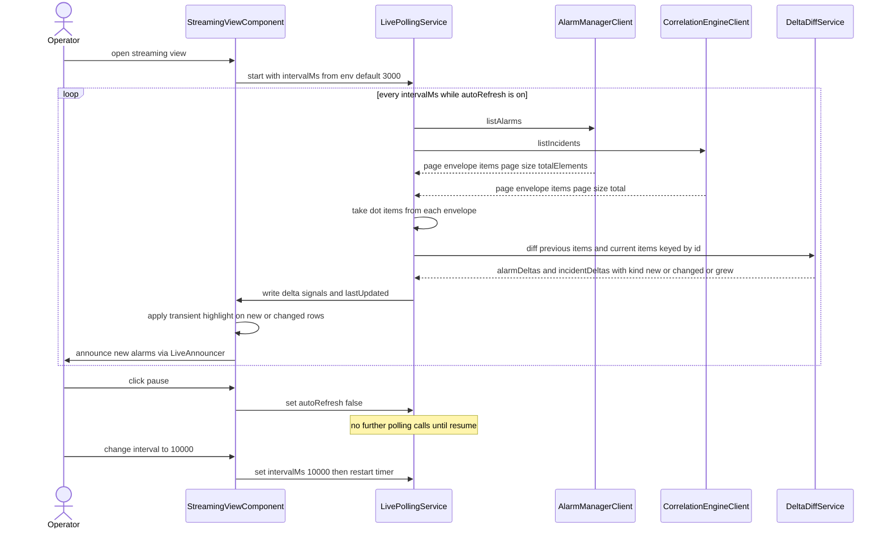

### Flow 2 — Landing dashboard (default route): parallel KPI load

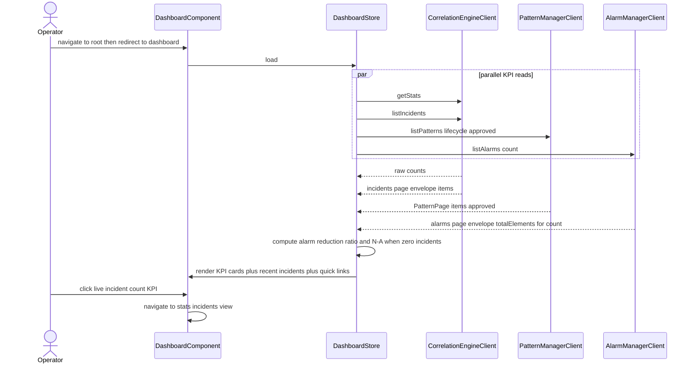

### Flow 3 — Incident-detail drill-down: incident plus member alarms

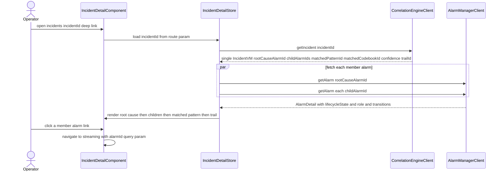

### Flow 4 — Cross-navigation deep-link: pattern to trail, incident to detail

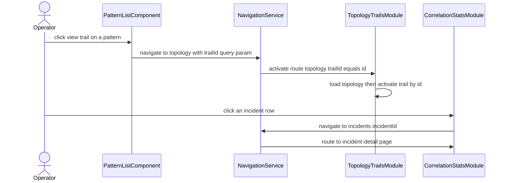

### Flow 5 — Topology & trails (P1): geo map to site graph to trail highlight

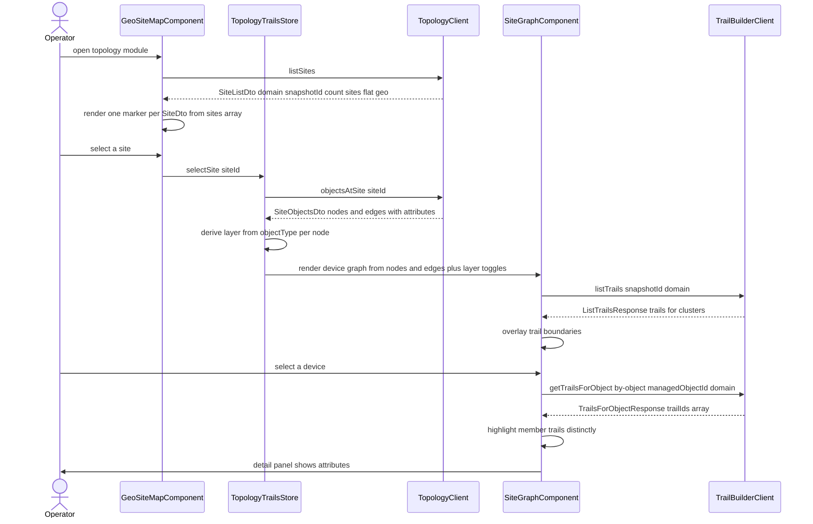

### Flow 6 — Pattern review & XAI (P2): review, edit optional alarm, approve

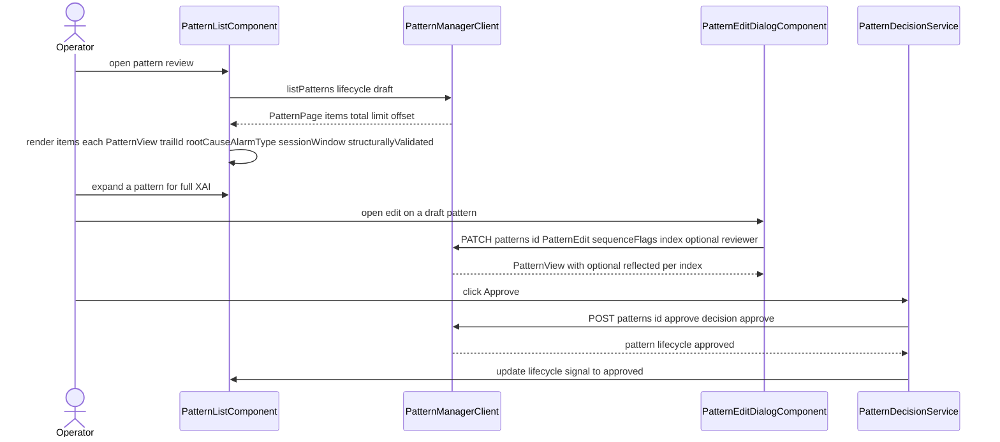

### Flow 7 — Config (P2): read and edit Knowledge model params

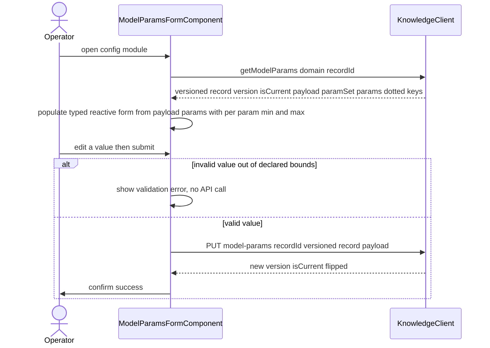

### Flow 8 — Correlation stats (P3): incidents, stats, alarm lifecycle, noise run-stats

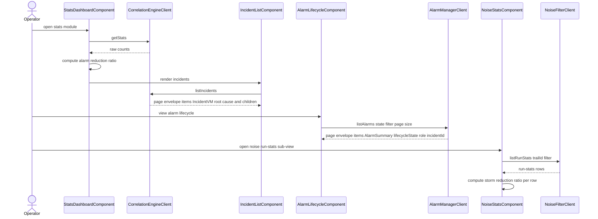

## Algorithm logical flow

The web-ui implements **no domain algorithm** (no matching, scoring, RCA, mining — all owned by
backend services). The only non-trivial client-side logic is presentation/diff logic:

1. **Streaming delta diff (AC 7, 8, 9):** unwrap each poll response's **`.items`** array, key the
   previous and current alarm `items` by `alarmId` into `Map`s. For each current alarm: if absent
   from previous then `NEW`; else if **`lifecycleState`** differs then `CHANGED`; else `UNCHANGED`.
   The same keyed-diff over incident `items` by `incidentId`: absent then `NEW`;
   `childAlarmIds.length` increased then `GREW`; else `UNCHANGED`. The `NEW`/`CHANGED`/`GREW` rows
   get `highlightUntilEpochMs = now + HIGHLIGHT_MS`. The template tracks by id so only the affected
   rows re-render.
2. **Layer-toggle filtering (AC 28):** `NodeDto` has no `layer` field — the layer is **derived from
   `objectType`** via `LayerMapper` (`objectType → fiber/IP/IGP/LSP/service`, fallback `other`);
   each `EdgeDto` is likewise labelled by its `relation`/endpoint objectType. `visibleLayers` is a
   signal set; the Cytoscape graph applies a style filter showing only nodes/edges whose **derived**
   layer is in the set. All layers off then only nodes render. Pure derived view.
3. **Trail highlight (AC 32):** on device select, `getTrailsForObject` (`GET /trails/by-object`)
   returns `{ managedObjectId, domain, trailIds:[] }`; the member `trailIds` set drives
   `highlightedTrailIds`, a Cytoscape class that styles member trails distinctly. A device may be in
   many overlapping trails.
4. **Alarm-reduction ratio (AC 1, 45):** ratio is `totalAlarmsProcessed / totalIncidentsCreated`;
   guard divide-by-zero then display "N/A" when `totalIncidentsCreated` is 0.
5. **Storm-reduction ratio (AC 18):** `alarmsIn / clustersFormed` per run; guard
   `clustersFormed` equal to 0.
6. **Lifecycle filter (AC 48):** `alarmStateFilter` signal; `computed` filters the `alarms.items`
   by **`lifecycleState`** (`open`/`in-progress`/`correlated`/`cleared`; `reverted-open` surfaces
   from the detail `transitions` as a return to `open`).

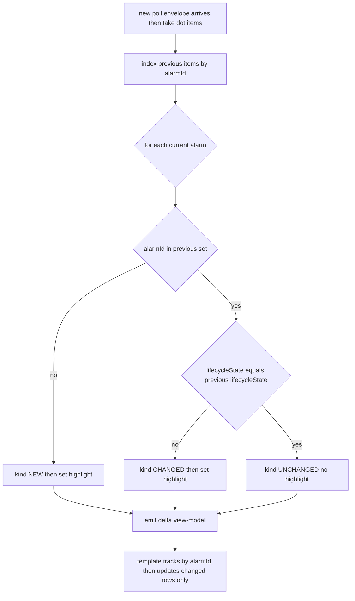

## Seed data & examples

The web-ui ships **test fixtures** (mock-backend responses) generated from each producer
published OpenAPI, used by Vitest/TestBed. Representative fixtures:

- `fixtures/topology/sites.json` — a **`SiteListDto`** `{ domain, snapshotId, count, sites:[...] }`
  with two `SiteDto`s e.g. London PoP (lat 51.5, lon -0.12, region EU-West) and Frankfurt PoP
  (at least 2 sites, AC 26).
- `fixtures/topology/objects-at-site-1.json` — a **`SiteObjectsDto`** `{ siteId, domain,
  snapshotId, nodeCount, edgeCount, nodes:[NodeDto], edges:[EdgeDto] }`: `nodes` incl. a device
  with attributes `vendor=Acme, model=R8000, equipmentType=router, slotCount=16` (three well-known
  keys plus one extra, AC 29) and varied `objectType`s exercising the layer derivation
  (fiber/IP/IGP/LSP/service); `edges` (from the SAME response) incl. one with attributes
  `linkType=fiber, capacity=100G, protectionRole=primary` (AC 30) and a `relation` spanning the
  derived layers (AC 28). `NodeDto` carries **no `layer` field** — the fixture proves the
  `objectType → layer` derivation.
- `fixtures/trails/list.json` (a `ListTrailsResponse`) + `fixtures/trails/by-object.json` (a
  **`TrailsForObjectResponse`** `{ managedObjectId, domain, trailIds:[...] }`) + a `TrailDetail`
  with `members:[{managedObjectId, objectType}]` — a device present in at least 2 trails (AC 31, 32).
- `fixtures/patterns/discovered.json` — a **`PatternPage`** `{ items:[PatternView], total, limit,
  offset }`; `items` with full XAI (`sequence:[{alarmType, optional}]`, `rootCauseAlarmType` vocab
  token, `sessionWindow`, `structurallyValidated`/`structuralValidationReason`); mixed `lifecycle`
  (draft/approved) for AC 34, 35, 38; one `draft` pattern editable for AC 54; each `PatternView`
  carries a `trailId` for the pattern→topology cross-link (AC 21).
- `fixtures/knowledge/model-params.json` — a **versioned `modelParams` record**
  `{ domain, recordType, recordId, version, isCurrent, payload:{ paramSet, params:[
  {key:"dbscan.epsilon",...}, {key:"dbscan.minSamples",...}, {key:"window.sizeSeconds",...},
  {key:"prefixspan.minSupport",...} ] } }` with real dotted keys + `min`/`max` bounds (AC 40); a
  variant with an out-of-bounds value to drive the client-side validation test (AC 42).
- `fixtures/correlation/stats.json` — known `totalAlarmsProcessed`/`totalIncidentsCreated` so the
  reduction ratio is a known value (AC 1, 45); a variant with `totalIncidentsCreated=0` for the
  N/A case (AC 1).
- `fixtures/correlation/incidents.json` (a **`{items:[IncidentVM], page, size, total}`** envelope)
  + `incident-detail.json` (a single `IncidentVM`) — incidents with root-cause plus children,
  `matchedPatternId`/`matchedCodebookId`, `confidence`, `trailId` (AC 14, 44).
- `fixtures/alarms/lifecycle.json` — an **`{items:[AlarmSummary], page, size, totalElements,
  totalPages}`** envelope with alarms across `lifecycleState` open/in-progress/correlated/cleared
  (plus a member whose detail `transitions` show a revert back to `open`, i.e. reverted-open) with
  role plus `incidentId` (AC 47, 48).
- `fixtures/streaming/poll-a.json` + `poll-b.json` — two successive poll snapshots, **each a page
  envelope** (`{items, page, size, totalElements, totalPages}` for alarms, `{items, page, size,
  total}` for incidents): `poll-b.items` adds one new alarm (AC 7), changes one alarm
  `lifecycleState` `open` to `in-progress` (AC 8), changes one `in-progress` to `correlated` and
  one back to `open` (the reverted-open case, AC 9), and grows one incident's `childAlarmIds`.
- `fixtures/alarms/alarm-{id}.json` — per-member single-alarm **`AlarmDetail`** records (with
  ordered `transitions`) for the incident-detail page (AC 15).
- `fixtures/noise/run-stats.json` — at least 2 run rows across two distinct `trailId` values, with
  `alarmsIn`, `clustersFormed`, `alarmsKept`, `alarmsDropped`, `noiseRatio` (AC 18, 19).

Example streaming delta (poll-a to poll-b):

```
poll-a .items lifecycleState: a-1 open,  a-2 open,        a-3 in-progress
poll-b .items lifecycleState: a-1 open,  a-2 in-progress, a-3 correlated, a-4 open, a-5 open(reverted)
delta: a-2 CHANGED (open to in-progress), a-3 CHANGED (in-progress to correlated),
       a-4 NEW, a-5 CHANGED (reverted back to open), a-1 UNCHANGED
(diff keys on lifecycleState over the .items array of the page envelope)
```

## UI wireframes

ASCII layouts (non-mermaid fenced blocks so they are not parsed as diagrams).

### New page — Landing dashboard (default route `/dashboard`)

```
+-------------------------------------------------------------------------+
| [Dashboard] [Streaming] [Topology] [Patterns] [Config] [Stats]  shell   |
+-------------------------------------------------------------------------+
| Platform overview                                       [Refresh]       |
| +------------------+ +------------------+ +------------------+           |
| | Live incidents   | | Active patterns  | | Alarm reduction  |           |
| |       12         | |        5         | |      8.3 : 1     |           |
| | (click to stats) | | (click patterns) | | (N/A if 0 inc.)  |           |
| +------------------+ +------------------+ +------------------+           |
| +------------------+ +------------------+                                |
| | Alarms processed | | RCA accuracy     |                                |
| |      1280        | | evaluated offline|                                |
| +------------------+ +------------------+                                |
+-------------------------------------------------------------------------+
| Recent incidents                          | Quick links                 |
|  INC-12 root LOS at FiberSpan  -> detail  |  -> Streaming (live)        |
|  INC-11 root LinkDown          -> detail  |  -> Topology + trails       |
|  INC-10 root AdjDown           -> detail  |  -> Pattern review          |
|                                           |  -> Config (Knowledge)      |
|                                           |  -> Correlation stats       |
+-------------------------------------------------------------------------+
```
Reads: Correlation Engine `getStats` + `listIncidents`; Pattern Manager `listPatterns?lifecycle=approved`;
Alarm Manager `listAlarms` (count). Each KPI card + recent-incident row is a deep link.

### New page — Real-time streaming view (`/streaming`)

```
+-------------------------------------------------------------------------+
| Streaming (live)   * LIVE   last updated 12:04:07                        |
|   interval [ 3000 ] ms   [Pause]   (env default; operator-adjustable)   |
+-------------------------------------------------------------------------+
| Alarms (newest highlighted)            | Incidents (forming)            |
|  alarmId state        role   inc       |  incidentId  root      childs  |
|  a-4*  open       (NEW)   --   --       |  INC-12* (GREW)  LOS    3 -> 4  |
|  a-2~  in-progress(CHG)   --   --       |  INC-11   LinkDown      2       |
|  a-3~  correlated (CHG)   child INC-12  |  INC-10   AdjDown       2       |
|  a-5~  open (reverted-open)(CHG) -- --  |                                |
|  a-1   open               --   --       |  -> click incident for detail  |
|  (* = new this poll, ~ = changed; transient highlight then fades;       |
|   respects prefers-reduced-motion: no animation, static badge instead)  |
+-------------------------------------------------------------------------+
```
Reads (polled every interval): Alarm Manager `GET /alarms` (`{items,page,size,totalElements,
totalPages}`), Correlation Engine `GET /incidents` (`{items,page,size,total}`); the view diffs over
each response's `.items`. No backend streaming. Pause stops all polling. Clicking deep-links out.

### New page — Incident-detail drill-down (`/incidents/:incidentId`)

```
+-------------------------------------------------------------------------+
| Incident INC-12          trail TR-7      confidence 0.91                 |
| Matched pattern PAT-3 (LOS, LinkDown, AdjDown)   [view pattern]         |
|   (or matched codebook CB-2 when matchedCodebookId is set)              |
+-------------------------------------------------------------------------+
| Root-cause alarm                                                        |
|  a-3  LOS at FiberSpan-9   state correlated   role root-cause           |
|       -> view in streaming/alarm view                                   |
+-------------------------------------------------------------------------+
| Child alarms (N-1)                                                       |
|  a-7  LinkDown   state correlated  role child   -> view alarm           |
|  a-8  AdjDown    state correlated  role child   -> view alarm           |
+-------------------------------------------------------------------------+
| trail TR-7  -> view trail in topology                                   |
+-------------------------------------------------------------------------+
```
Reads: Correlation Engine `GET /incidents/{incidentId}` (single `IncidentVM`); Alarm Manager
`GET /alarms/{alarmId}` (single `AlarmDetail`) per member. `matchedCodebookId` labels the matched
codebook artifact. Deep-linkable (loads directly from URL); every member alarm + the trail is a
cross-link.

### New view — Noise-filter run-stats (learning sub-view in `/stats`)

```
+-------------------------------------------------------------------------+
| Stats  tabs: [Incidents] [Alarm lifecycle] [Noise run-stats]            |
+-------------------------------------------------------------------------+
| Noise-filter run-stats           filter trailId [ TR-7 ] [from][to]     |
|  run     trail  in   clusters kept drop  noiseRatio  stormReduction     |
|  RUN-9   TR-7   240   12       180  60    0.25        20.0 : 1           |
|  RUN-8   TR-7   180   10       150  30    0.17        18.0 : 1           |
|  (stormReduction = alarmsIn / clustersFormed, computed if not returned; |
|   filtering by trailId hides rows for other trails; domain may be null) |
+-------------------------------------------------------------------------+
```
Reads: Noise Filter `GET /api/v1/run-stats?trailId=&from=&to=`.

### Existing — Topology & trails (`/topology`, `/topology/:siteId`)

```
+-------------------------------------------------------------+
| [Dashboard][Streaming][topology][patterns][config][stats]   |
+-------------------------------------------------------------+
| Geo-site map (MapLibre)                                     |
|   . London PoP        . Frankfurt PoP    . Madrid PoP       |
|   (markers, one per Site; click to expand)                  |
+-------------------------------------------------------------+
  (after selecting a site, transitions to /topology/:siteId)
+----------------------------------+--------------------------+
| Site graph (Cytoscape)           | Detail panel             |
|   o--o  o   trail cluster overlay | managedObjectId: ...     |
|   |    \                          | vendor: Acme             |
|   o     o                         | model: R8000             |
| Layers: [x]fiber [x]IP [ ]IGP     | equipmentType: router    |
|         [ ]LSP [ ]service         | slotCount: 16 (generic)  |
| (selected device highlights its   | --- trails ---           |
|  member trails distinctly)        | trail-A, trail-C         |
+----------------------------------+--------------------------+
| (deep link in: /topology?trailId=<id> activates that trail) |
+-------------------------------------------------------------+
```
Reads: Topology `listSites` (`SiteListDto.sites`), `objectsAtSite` (`SiteObjectsDto.nodes` +
`.edges`); layer derived from each node's `objectType`. Trail Builder `listTrails`,
`getTrailsForObject` (`GET /trails/by-object` → `trailIds[]`).

### Existing — Pattern review & XAI (`/patterns`)

```
+-------------------------------------------------------------+
| Patterns   tabs: [Discovered (draft)] [Active (approved)]   |
+-------------------------------------------------------------+
| seq            sup  conf lift RCA        codebook  lifecycle |
| LOS,LinkDown.. 0.12 0.90 4.2 LOS         match-7   draft  v  |
|   v expanded XAI: timing (median IAT, timeframe),           |
|     instanceCount, supportingInstances list                 |
|     [Approve] [Reject] [Edit] [View trail -> topology]      |
|     (Edit only for draft; View trail uses pattern.trailId)  |
+-------------------------------------------------------------+
  Edit dialog (placeholder):
  [ ] LOS  [x] LinkDown optional  [ ] AdjDown   reviewer:____
  notes:__________________________  [Submit PATCH] [Cancel]
  (Submit sends PatternEdit { sequenceFlags:[{index, optional}], reviewer, notes? })
```
Reads: Pattern Manager `GET /patterns` (`PatternPage.items`). Writes: `POST /patterns/{id}/approve`,
`PATCH /patterns/{id}` (frozen `PatternEdit` body with `sequenceFlags`).

### Existing — Config (`/config`)

```
+-------------------------------------------------------------+
| Model parameters (Knowledge Service)   paramSet: noise-filter|
|   record core-ip/modelParams/noise-filter   version v3      |
|   dbscan.epsilon       [ 0.5 ]  (min 0.0  max 100.0)        |
|   dbscan.minSamples    [ 3   ]  (min 1    max 1000)        |
|   window.sizeSeconds   [ 60  ]  s  (min 1  max 86400)      |
|   prefixspan.minSupport[ 0.3 ]  (min 0.0  max 1.0)         |
|                                   [Save]  status: saved v4  |
|   (out-of-bounds value shows inline error, no API call;     |
|    Save PUTs the versioned record, mints a new version)     |
+-------------------------------------------------------------+
```
Reads: Knowledge `GET /domains/{domain}/model-params/{recordId}` (versioned record, dotted keys).
Writes: `PUT /domains/{domain}/model-params/{recordId}` (versioned write, new version on success).

### Existing — Correlation stats (`/stats`, Incidents + Alarm-lifecycle tabs)

```
+-------------------------------------------------------------+
| Stats dashboard                                             |
|  alarm-reduction ratio: 8.3   RCA accuracy: evaluated offl. |
|  pattern matches: 42   codebook matches: 17                 |
+------------------------------+------------------------------+
| Incidents (.items)           | Alarm lifecycle (.items)     |
|  INC-1 root: LOS  -> detail  | filter: all open inprog corr |
|    children: LinkDown, AdjDn |        cleared               |
|  INC-2 root: ...  -> detail  | alarmId lifecycleState role i|
|                              | a-1  correlated      root INC1
|                              | a-2  in-progress     --   -- |
|                              | a-9  open (reverted) --   -- |
+------------------------------+------------------------------+
```
Reads: Correlation Engine `listIncidents` (`{items,...}`), `getStats`; Alarm Manager `listAlarms`
(`{items,...}`). Filter is over `lifecycleState` (open/in-progress/correlated/cleared); a
reverted-open alarm shows as `open` (its `transitions` record the revert). Each incident row
deep-links to `/incidents/:incidentId`.

## Navigation map (required deliverable)

The page graph below documents every page, its route, and the logical cross-navigation flows
between them. All entity pages carry the ID in the URL (route param or query param) so links are
shareable and bookmarkable.

### Route table

| Route | Page / component | Deep-link param | Reached from |
|---|---|---|---|
| `/` | redirect to `/dashboard` | — | app entry |
| `/dashboard` | `DashboardComponent` (default) | — | nav bar, any page |
| `/streaming` | `StreamingViewComponent` | `?alarmId=` (optional focus), `?siteId=` (optional filter) | nav bar, dashboard quick link, incident-detail member alarm, topology site |
| `/topology` | `GeoSiteMapComponent` | `?trailId=` (activate trail) | nav bar, pattern view trail, incident-detail trail |
| `/topology/:siteId` | `SiteGraphComponent` | `:siteId` | geo map site select |
| `/patterns` | `PatternReviewModule` | — | nav bar, dashboard active-pattern KPI, incident-detail matched pattern |
| `/incidents/:incidentId` | `IncidentDetailComponent` | `:incidentId` | dashboard recent incidents + incident KPI, stats incident row, streaming incident row, direct deep link |
| `/config` | `ModelParamsFormComponent` | — | nav bar, dashboard quick link |
| `/stats` | `CorrelationStatsModule` (Incidents / Alarm-lifecycle / Noise run-stats tabs) | — | nav bar, dashboard incident-count KPI, dashboard quick link |

### Page graph + logical flows

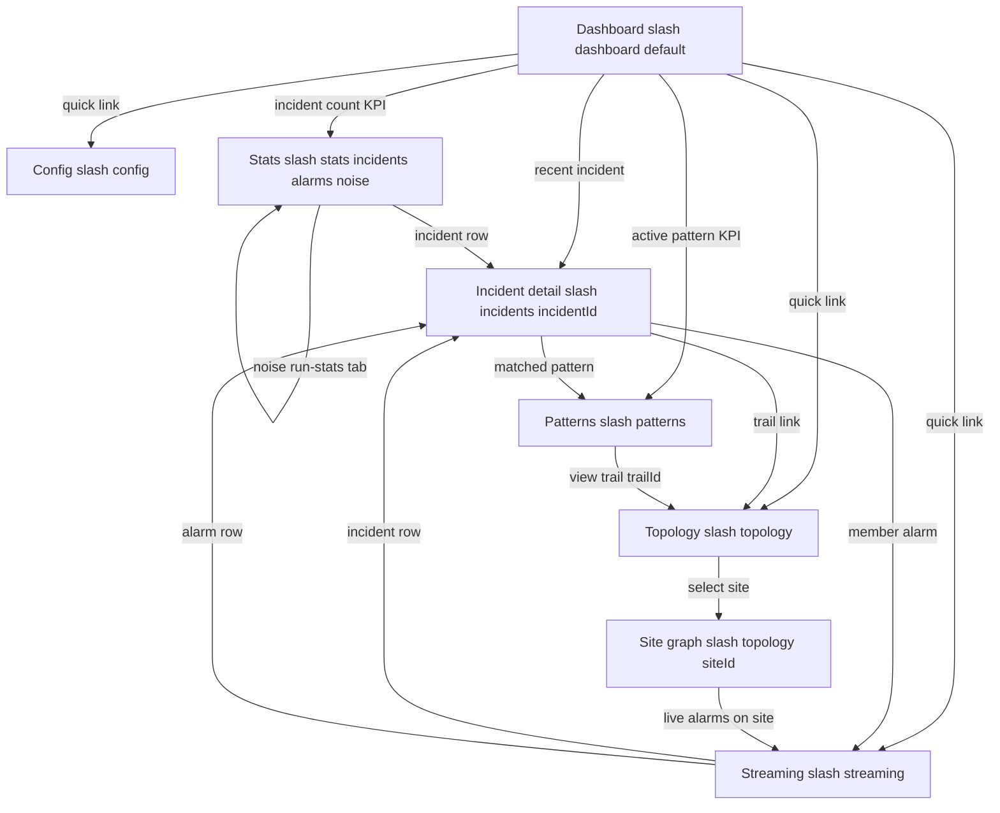

## Error handling

First-class. The SPA must never crash whole-app on one backend failure; each module degrades
independently.

- **No Kafka / no schemaVersion handling:** N/A — the web-ui consumes no Kafka topics, so there
  is no DLQ routing and no `schemaVersion` rejection in this service.
- **Backend 5xx / unreachable (AC 53):** each module wraps its client calls; on `5xx` or network
  error the `ErrorBannerService` renders a **structured error message identifying the service**
  (service name + HTTP status) inside that module; other modules are unaffected. An effect logs a
  structured JSON error (level from env) with service name, endpoint, status, and `traceId` if
  present. Nothing is silently dropped.
- **Streaming poll failure:** a failed poll (5xx/network) sets a **stale-data indicator** ("last
  updated" goes stale + a warning badge); the previous snapshot is retained and the next tick
  retries. The view does not crash and does not lose the last good data (spec Non-functional).
- **404 / empty result:** rendered as an explicit **empty state** (e.g. "No sites returned", "No
  discovered patterns", "No run-stats yet", "No incidents"). A `404` on `GET /incidents/{id}`,
  `GET /alarms/{id}`, or `GET /run-stats/{id}` shows a "not found" panel; the incident-detail
  page shows a not-found state when the `incidentId` deep link does not resolve.
- **Dashboard partial failure:** the dashboard reads are independent; if one source fails, that
  KPI card shows an inline error/N-A while the others still render (no whole-page failure).
- **Validation failure (config edit, AC 42):** the typed reactive form blocks submit and shows an
  inline field error; **no API call** is made for an invalid value (e.g. negative session-window
  gap). The streaming interval control likewise rejects non-positive intervals client-side.
- **Edit on non-draft pattern (AC 54):** the Edit action is offered only for `draft` patterns; a
  `409/422` from the Pattern Manager (race) surfaces the structured error and does not mutate
  local state.
- **Noise-stats query error (422):** a bad `limit`/`from`/`to` returns `422`; the noise-stats
  sub-view shows the structured validation error and keeps prior rows.
- **Double-submit guard (idempotency):** approval-intent and config-save buttons are disabled
  while a request is in flight (`pendingDecision`/`saveStatus` signals). Server-side idempotency
  is the owning service concern.
- **Loading state:** every async view shows a skeleton/spinner with an ARIA `aria-busy` region
  while the request is pending; `LiveAnnouncer` announces load completion.
- **RCA accuracy display:** the Correlation Engine `GET /stats` does **not** return RCA accuracy
  (evaluated by the offline oracle per its spec); the dashboard/stats show "evaluated offline"
  rather than fabricating a value. **Flagged design note** — not a contract change; consistent
  with the Correlation Engine spec.

## Design alternatives

| Consideration | Alternatives considered | Chosen plus rationale |
|---|---|---|
| Real-time delivery | WebSocket/SSE push vs. client-side polling vs. backend stream API | **Client-side polling** — fixed by the spec (no backend streaming, no new API surface). Polls existing `GET /alarms` + `GET /incidents` at a configurable interval. No contract change; works against the already-published REST APIs and the same mock/real toggle. |
| Streaming timer | rxjs `interval`/`timer` bridged to signals vs. self-rescheduling `setTimeout` in an `effect` vs. Angular `resource` polling | **Signal-driven timer (rxjs `timer` bridged, or `setTimeout` loop) keyed off `intervalMs`/`autoRefresh` signals.** Restartable on interval change, tearable on pause, testable with `vi.useFakeTimers`. `resource` re-fetch is less ergonomic for pause/resume + delta-diff. |
| Delta diffing | Full-list re-render each poll vs. keyed Map diff with per-row tracking vs. server-provided diffs | **Keyed Map diff over the page envelope's `.items`** keyed by `alarmId`/`incidentId` (alarm change keyed on `lifecycleState`), template `@for` tracked by id — only changed rows re-render (spec performance). The diff unwraps `.items` from the frozen CE/AM `{items, page, size, ...}` envelopes (never assumes a bare array). Server diffs are unavailable (no new API). Full re-render violates the perf requirement and loses highlight state. |
| CE/AM pagination envelope | Align to a `limit`/`offset` envelope vs. align to the producers' frozen `page`/`size` envelope | **Align to the producers' frozen `page`/`size` envelope** (CE `{items, page, size, total}`, AM `{items, page, size, totalElements, totalPages}`). web-ui is the consumer and adapts to the published producer contract (the producer is the SSoT); both list/streaming views read `.items` uniformly and page with `page`/`size`. |
| Topology node layer | A separate `layer` field on `NodeDto` vs. derive `layer` from `objectType` | **Derive from `objectType`** — the frozen `NodeDto` has no `layer` field (`layer == objectType`). web-ui maps `objectType` to the logical layer via a pure `LayerMapper` (fallback `other`), avoiding a duplicated field and matching the producer's single source of truth (P1-G9). |
| New-row animation | CSS keyframe animation vs. CSS class toggle with timed expiry vs. no animation | **Timed CSS class toggle** (`highlightUntilEpochMs`) — cheap, OnPush-friendly, and trivially disabled under `prefers-reduced-motion` (static badge instead of motion). Keyframe-only would not respect reduced motion without extra work. |
| Incident-detail member fetch | Sequential per-alarm vs. parallel fan-out vs. a single batch endpoint | **Parallel fan-out** (`forkJoin`/`Promise.all`) over `GET /alarms/{id}` — there is no batch endpoint (no new API), and parallel keeps the page responsive. Sequential is slow for large incidents. |
| Cross-navigation | Hard-coded `routerLink`s in each component vs. a central `NavigationService` | **Central `NavigationService`** builds every cross-link target from entity IDs — single place to keep deep-link URL shapes correct and shareable, and to satisfy the navigation-map contract. |
| State management | NgRx vs. signal-based injectable stores vs. component-local signals | **Signal-based injectable stores.** Stateless client, no complex shared-state graph; signals + `computed` give OnPush reactivity with far less boilerplate than NgRx. |
| API client generation | Full OpenAPI codegen client vs. models-only codegen + thin wrapper vs. hand-written | **Models-only codegen (`openapi-typescript`) + thin Angular `HttpClient` wrappers.** Contract-true types while keeping Angular DI, interceptors, and the env-driven base URL/toggle. |
| Mock backend transport | MSW vs. `HttpTestingController` vs. Prism mock server | **MSW for unit/component** (fetch-layer intercept in jsdom, same handlers from OpenAPI keep mock/real honest). Mock timers drive cadence tests. |
| Geo map / device graph | MapLibre + deck.gl vs. Leaflet; Cytoscape vs. d3-force | **MapLibre GL (BSD) + optional deck.gl (MIT); Cytoscape.js (MIT).** Permissive; purpose-built for vector basemap + typed multi-layer graphs with per-edge style classes. |
| Noise run-stats placement | Separate top-level route vs. sub-view/tab in `/stats` | **Tab within `/stats`** — the spec places noise run-stats in the correlation/learning stats area; a sub-view keeps the navigation map simple and matches the noise-filter spec's "presented in the existing correlation-stats module". |
| Alarm-reduction ratio source | Server-computed vs. client-computed from raw counts | **Client-computed** — `GET /stats` exposes raw counts only; UI divides `totalAlarmsProcessed` by `totalIncidentsCreated`, N/A when zero. No contract change. |
| BFF vs. direct-to-service | BFF proxy vs. direct SPA-to-service | **Direct-to-service (no BFF)** — fixed by the spec for MVP. |

## Test plan

### Acceptance criterion to test (unit/contract)

Unit/component tests use **Vitest + Angular TestBed** with **mock backends** (MSW from producer
OpenAPI) and **mock timers** for the streaming cadence. E2E tests use **Playwright** against the
integration stack (E2E only). All 54 acceptance criteria are mapped 1:1 to a named test.

| # | Acceptance criterion | Test | Asserts |
|---|---|---|---|
| 1 | Dashboard alarm-reduction ratio = processed/incidents; N/A when zero incidents | `dashboard-ratio.spec.ts` | ratio matches `totalAlarmsProcessed/totalIncidentsCreated`; N/A shown when `totalIncidentsCreated=0` |
| 2 | Dashboard live incident count + active-pattern count match fixtures | `dashboard-counts.spec.ts` | incident count = incidents fixture size; pattern count = approved patterns size |
| 3 | Root path renders dashboard as default route | `dashboard-route.spec.ts` (router) | navigating `/` (and `/dashboard`) renders `DashboardComponent` |
| 4 | Clicking incident-count KPI navigates to stats/incidents | `dashboard-kpi-nav.spec.ts` (router) | activating the KPI navigates to the stats/incidents view |
| 5 | E2E dashboard non-zero count + ratio after fiber-cut replay | `dashboard.e2e.ts` (Playwright) | integration stack: dashboard shows non-zero incident count and non-zero ratio from stats API |
| 6 | Streaming polls `GET /alarms` every T ms; no extra calls between | `streaming-cadence.spec.ts` (fake timers) | one call per interval at configured T; no call between ticks |
| 7 | New alarm between polls gets "new" indicator; unchanged none; diff over .items | `streaming-new-alarm.spec.ts` | fixture A then B page envelopes (one added alarm in `.items`) then added row has NEW indicator; unchanged row none |
| 8 | open to in-progress between polls updates row + "changed" indicator | `streaming-state-change.spec.ts` | second poll `items[].lifecycleState=in-progress` then row updates + CHANGED indicator |
| 9 | in-progress to correlated and reverted-back-to-open reflected without reload | `streaming-transitions.spec.ts` | all transition cases (keyed on `lifecycleState`) reflected; no page reload |
| 10 | Pause stops all polling to Alarm Manager + Correlation Engine | `streaming-pause.spec.ts` (fake timers) | after pause, no further calls to either client |
| 11 | Resume restarts polling at configured interval | `streaming-resume.spec.ts` (fake timers) | after resume, polling resumes at interval T |
| 12 | Env `STREAMING_REFRESH_INTERVAL_MS=10000` then polls at 10000 | `streaming-interval-config.spec.ts` | interval read from env config; cadence is 10000 not 3000 |
| 13 | E2E streaming shows updated state within two poll cycles | `streaming.e2e.ts` (Playwright) | integration stack: transition visible within two polls |
| 14 | Incident-detail renders root cause/children/pattern/confidence/trail | `incident-detail-render.spec.ts` | `getIncident(id)` returns a single `IncidentVM`; `rootCauseAlarmId`/`childAlarmIds`/`matchedPatternId`/`matchedCodebookId`/`confidence`/`trailId` all rendered |
| 15 | Incident-detail fetches each member alarm + renders state/role | `incident-detail-members.spec.ts` | `getAlarm` returns `AlarmDetail`; per member `lifecycleState` + `role` tag rendered from `transitions`-bearing record |
| 16 | Clicking a member alarm navigates to streaming/alarm view | `incident-detail-nav.spec.ts` (router) | activating an alarm link navigates to streaming with alarm focus/filter |
| 17 | E2E direct nav to `/incidents/<id>` renders root + at least one child | `incident-detail.e2e.ts` (Playwright) | integration stack: deep-link renders root cause + at least one child |
| 18 | Noise-stats renders each run row + derived storm-reduction ratio | `noise-stats-render.spec.ts` | rows show trailId/alarmsIn/clustersFormed/kept/dropped/noiseRatio + storm ratio = alarmsIn/clustersFormed |
| 19 | Noise-stats trailId filter shows only matching rows | `noise-stats-filter.spec.ts` | filter for one trailId then only its rows render; other-trail rows absent |
| 20 | E2E noise-stats shows at least one run with non-zero alarmsIn | `noise-stats.e2e.ts` (Playwright) | integration stack: at least one run-stats row with non-zero `alarmsIn` |
| 21 | Pattern "view trail" navigates to `/topology?trailId=<id>` | `xnav-pattern-trail.spec.ts` (router) | navigation carries pattern `trailId` as query param |
| 22 | Incident entry navigates to `/incidents/:incidentId` | `xnav-incident-detail.spec.ts` (router) | navigation to incident-detail with correct `incidentId` |
| 23 | Direct deep link `/incidents/:id` loads without prior nav | `xnav-deeplink-incident.spec.ts` (router) | direct route activation renders the incident |
| 24 | Direct deep link `/topology?trailId=<id>` activates the trail | `xnav-deeplink-trail.spec.ts` (router) | direct route activation with query param activates trail |
| 25 | E2E dashboard KPI to incident-detail path completes | `xnav.e2e.ts` (Playwright) | integration stack: dashboard KPI to incident-detail renders without error |
| 26 | Geo map renders a marker per Site, none for absent sites | `geo-site-map.spec.ts` | `listSites` returns `SiteListDto`; one marker per `sites[]` `SiteDto` (flat lat/lon/region), no extra markers |
| 27 | Selecting a site calls objects-at-site + renders device graph from nodes AND edges | `site-selection.spec.ts` | request carries correct `siteId`; graph built from `SiteObjectsDto.nodes` + `.edges` (edges from this one response); graph replaces map |
| 28 | Layer toggles independently show/hide; all off = nodes only; layer derived from objectType | `layer-toggle.spec.ts` | `LayerMapper` derives layer from `objectType` (no `layer` field); each toggle filters its derived layer; all-off shows only nodes |
| 29 | Node detail panel shows vendor/model/equipmentType + unknown keys | `attribute-panel-node.spec.ts` | `NodeDto` three well-known keys labelled; extra key generic; `managedObjectId` shown |
| 30 | Edge detail panel shows linkType/capacity + unknown keys | `attribute-panel-edge.spec.ts` | `EdgeDto` (from `SiteObjectsDto.edges`) well-known connection keys labelled; unknown generic; `relation` shown |
| 31 | Trail cluster boundaries overlaid from `listTrails` | `trail-overlay.spec.ts` | overlay rendered per `trails[]` entry of `ListTrailsResponse` |
| 32 | Multi-trail device highlights all its trails distinctly | `trail-highlight.spec.ts` | `getTrailsForObject` (`GET /trails/by-object`) returns `{trailIds:[...]}`; device in at least 2 trails, member trails highlighted, non-members not |
| 33 | E2E real Topology + Trail Builder render sites/graph/attrs/overlays | `topology.e2e.ts` (Playwright) | integration stack: sites, site graph, attributes, trail overlays render without error |
| 34 | Pattern list renders the PatternPage envelope items with all XAI fields | `pattern-list.spec.ts` | `listPatterns` returns `PatternPage`; `items[]` rendered; per `PatternView`: sequence(`{alarmType,optional}`)/support/confidence/lift/`rootCauseAlarmType`/timing/`sessionWindow`/`codebookMatchId`/`structurallyValidated`/instances/`trailId` |
| 35 | Operator can expand a pattern to full XAI | `pattern-expand.spec.ts` | expansion reveals all XAI fields |
| 36 | Approve posts approval-intent with correct id; lifecycle approved | `pattern-approve.spec.ts` | `POST /patterns/{id}/approve` decision approve, correct id; UI shows approved |
| 37 | Reject posts reject-intent; pattern removed/marked rejected | `pattern-reject.spec.ts` | reject POST correct id; pattern removed/marked rejected |
| 38 | Active/approved filter shows only approved | `active-patterns.spec.ts` | mixed-lifecycle `PatternPage.items`, only approved under filter |
| 39 | E2E approve; Pattern Manager reflects approved on re-read | `pattern-approve.e2e.ts` (Playwright) | integration stack: approve then re-read returns approved |
| 40 | Config shows current model params from the versioned Knowledge record | `config-load.spec.ts` | `GET /domains/{domain}/model-params/{recordId}` versioned record; form fields mapped from `payload.params[]` dotted keys (`dbscan.epsilon`, `dbscan.minSamples`, `window.sizeSeconds`, `prefixspan.minSupport`); `version`/`paramSet` shown |
| 41 | Valid edit submits the versioned record via PUT; new version confirmed | `config-save.spec.ts` | `PUT /domains/{domain}/model-params/{recordId}` sent with the versioned record payload (dotted keys, updated value); success toast reflects new `version` |
| 42 | Out-of-bounds value shows validation error, no API call | `config-validation.spec.ts` | value outside a param's declared `min`/`max` → inline error; Knowledge client not called |
| 43 | E2E config edit retrievable via Knowledge on re-read | `config-edit.e2e.ts` (Playwright) | integration stack: submitted versioned edit returned as the new current version on re-read |
| 44 | Incidents render with root-cause + child alarms from the page envelope | `incident-list.spec.ts` | `listIncidents` returns `{items,page,size,total}`; each `items[]` incident shows `rootCauseAlarmId` + `childAlarmIds` |
| 45 | Alarm-reduction ratio from stats shown as numeric | `stats-metrics.spec.ts` | computed ratio = `totalAlarmsProcessed/totalIncidentsCreated`, numeric |
| 46 | E2E fiber-cut: stats shows incident with root cause + children | `stats.e2e.ts` (Playwright) | integration stack: incident with tagged root cause + at least 1 child |
| 47 | Alarm-lifecycle lists lifecycleState + role + incidentId from the page envelope | `alarm-lifecycle.spec.ts` | `listAlarms` returns `{items,page,size,totalElements,totalPages}`; `items[]` show `lifecycleState` (open/in-progress/correlated/cleared) + role + incidentId; the reverted-open case shows via the detail `transitions` |
| 48 | Lifecycle filter filters by selected lifecycleState incl. in-progress | `alarm-filter.spec.ts` | filter on `lifecycleState` over `.items` shows only that state, incl. in-progress; reverted-open shown as a return to `open` |
| 49 | E2E fiber-cut: correlated alarm with incident association | `alarm-lifecycle.e2e.ts` (Playwright) | integration stack: correlated alarm with non-empty incidentId from Alarm Manager |
| 50 | Mock config: all nine integration points resolve to mocks, no real HTTP; MSW handlers serve the frozen shapes | `env-mock-switch.spec.ts` | each of 9 clients hits MSW handlers (generated from the producers' frozen `openapi.json`); responses match the frozen envelopes/DTOs; no outbound real request |
| 51 | Integration config: 9 base URLs from env, no URL literal in source | `no-hardcoded-url.spec.ts` (build-time grep) | no localhost/service-hostname URL in non-environment source |
| 52 | Keyboard nav cycles all controls; canvases ARIA-labelled (10 views) | `a11y.spec.ts` (axe-core per view) | dashboard/streaming/topology/site-graph/patterns/config/stats/alarm-lifecycle/incident-detail/noise-stats: keyboard reachable; canvas ARIA labels; no axe violations |
| 53 | Any backend 5xx: module shows service-named error, others unaffected | `error-boundary.spec.ts` (per integration point) | 5xx then error banner naming the service; other modules still render |
| 54 | Edit draft pattern: mark optional, PATCH sent, edit reflected; draft-only | `pattern-edit.spec.ts` | `PATCH /patterns/{id}` body the frozen `PatternEdit { sequenceFlags:[{index, optional}], reviewer, notes? }`; returned `PatternView` reflects the `optional` per `index`; edit action absent for non-draft |

All 54 acceptance criteria map 1:1 to a named test (45 Vitest/TestBed + 9 Playwright E2E:
AC 5, 13, 17, 20, 25, 33, 39, 43, 46, 49 are E2E — note AC 51 is a build-time grep check run
under the unit harness). The five new-view AC groups are covered: dashboard (AC 1-5), streaming
(AC 6-13), incident-detail (AC 14-17), noise-stats (AC 18-20), cross-nav/deep-link (AC 21-25).

### E2E scenarios (from this design unit's point of view — Playwright)

| # | Scenario | Trigger to path | Expected outcome |
|---|---|---|---|
| 1 | Dashboard after fiber-cut (AC 5) | Replay fiber-cut, open `/dashboard` against the real stack | Non-zero live incident count and non-zero alarm-reduction ratio from stats API |
| 2 | Streaming live transition (AC 13) | Open `/streaming` against the real stack while a replay drives an alarm transition | Updated lifecycle state visible within two poll cycles; new alarms highlighted |
| 3 | Incident-detail deep link (AC 17) | Navigate directly to `/incidents/<id>` after a fiber-cut replay | Root-cause alarm + at least one child rendered matching the Correlation Engine record |
| 4 | Noise run-stats after P2 (AC 20) | Replay P2 learning scenario, open `/stats` noise run-stats tab | At least one run-stats row with non-zero `alarmsIn` from the Noise Filter API |
| 5 | Cross-nav dashboard to detail (AC 25) | From dashboard incident-count KPI, navigate through to an incident-detail page | Full path completes without error; incident detail rendered |
| 6 | Topology browse (AC 33) | Open `/topology` against real Topology + Trail Builder, list sites, select a site, toggle layers, select a device | Sites listed, site graph + attributes + trail overlays render, no console/network error |
| 7 | Pattern approve round-trip (AC 39) | Open `/patterns`, approve a draft pattern, re-read | Pattern Manager returns approved on subsequent read; UI reflects it |
| 8 | Config edit round-trip (AC 43) | Open `/config`, edit a param, save, re-read | Edited value persisted and returned on re-read |
| 9 | Fiber-cut stats (AC 46) | Replay fiber-cut, open `/stats` | At least 1 incident with tagged root-cause alarm + at least 1 child |
| 10 | Fiber-cut alarm lifecycle (AC 49) | Same replay, open alarm-lifecycle view | At least 1 alarm in correlated state with non-empty incident association from Alarm Manager |
| 11 (failure path) | Backend-down degradation | Point one client (e.g. Knowledge) at an unavailable/5xx endpoint | Affected module shows a structured service-named error; other modules still function (no whole-app crash) |
| 12 (failure path) | Streaming poll failure | Make the Alarm Manager poll endpoint return 5xx mid-stream | Streaming view shows a stale-data indicator, retains last good data, retries next tick, does not crash |
| 13 (empty path) | No discovered patterns | Pattern Manager returns empty draft list | Pattern review shows an explicit empty state, not an error |

## Config & observability

- **Config:** `environment.ts` / `environment.integration.ts` carry the nine per-service base
  URLs, `INTEGRATION_MODE=mock|real`, `STREAMING_REFRESH_INTERVAL_MS` (default `3000`), and the
  client log level. Values are injected from Docker Compose environment variables at build/serve
  time. No URL, threshold, interval literal, or credential is hard-coded in application source
  (AC 51). The streaming refresh interval is operator-adjustable at runtime via the UI; the env
  value is its default. The 3 s default is the spec default (open question #10) and may be
  adjusted in `environment.ts` if the integration stack reveals a better value — not a contract
  change.
- **Observability:** served app root `/` returns HTTP 200 for liveness (nginx). Client-side
  **structured JSON logging** (configurable level from env) for API errors, navigation events,
  and poll failures. **No `/metrics`** endpoint — a static SPA has no BFF; per spec this is
  intentional.
- **Accessibility:** WCAG 2.1 AA — semantic landmarks, ARIA roles/labels on map and graph
  canvases and data tables, `@angular/cdk/a11y` focus management + `LiveAnnouncer`, keyboard
  navigation for all controls, contrast at least 4.5 to 1 (text) and at least 3 to 1 (large
  text + UI components). **Streaming-specific a11y:** the new/changed highlight respects
  `prefers-reduced-motion` (no animation — a static text/badge indicator instead); `LiveAnnouncer`
  announces newly-arrived alarms and lifecycle changes to screen readers via an ARIA live region
  (polite), so non-visual users are not excluded from the live view; the pause control is
  keyboard-operable and the interval control is a labelled numeric input. Verified by
  `a11y.spec.ts` (axe-core) per view across all ten views (AC 52).
- **Performance:** OnPush + signals throughout; lazy-loaded routes per module; CDK virtual scroll
  for long streaming/alarm/incident/pattern lists; streaming delta-render updates only changed
  rows (tracked by id) — never a full-list re-render per poll; Cytoscape kept responsive up to
  the configured max graph size.

## Build & run

- **Dev (mock):** `npm ci && npm start` — serves the SPA with `INTEGRATION_MODE=mock`; MSW
  handlers (from producer OpenAPI) back all calls; no live dependency. Streaming polls the mock
  endpoints at `STREAMING_REFRESH_INTERVAL_MS`.
- **Unit/component tests:** `npm test` (Vitest + Angular TestBed, jsdom, MSW mocks, fake timers
  for cadence). Lint: `npm run lint`. Build: `npm run build` (static bundle).
- **E2E:** `npm run e2e` (Playwright) against the integration stack (`INTEGRATION_MODE=real`,
  base URLs are Compose addresses).
- **Container:** multi-stage Dockerfile — build stage `node:24` (`npm ci && npm run build`),
  serve stage nginx serving `dist/` with `/` returning HTTP 200 liveness. Docker Compose entry
  sets the nine base-URL env vars, `INTEGRATION_MODE`, and `STREAMING_REFRESH_INTERVAL_MS`.
- **Client regeneration:** on a collaborator OpenAPI contract change (architecture.md update +
  human approval first), run `npm run generate:clients` to regenerate TypeScript models from the
  producers' checked-in `openapi.json` (now including the Noise Filter `openapi.json`).
