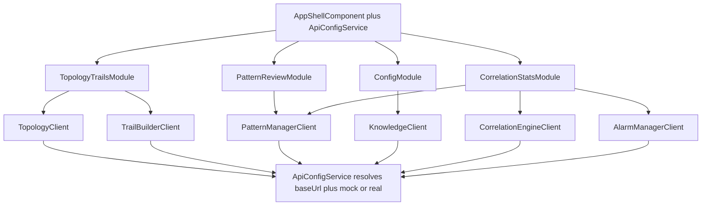
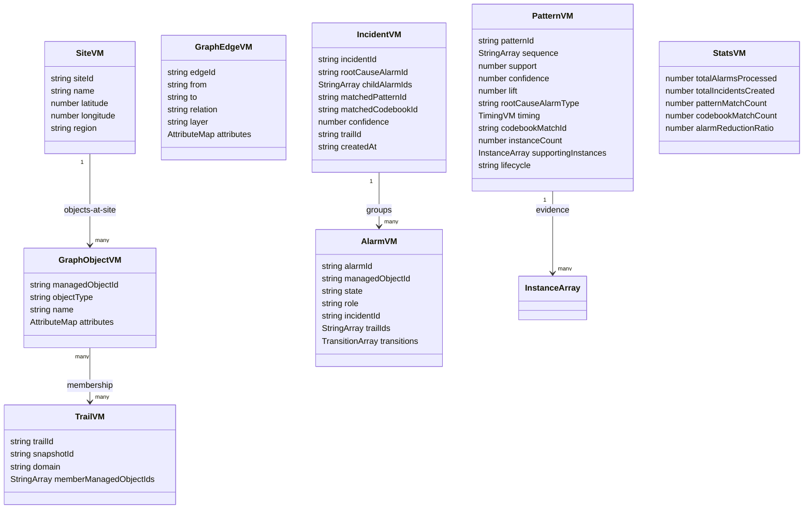
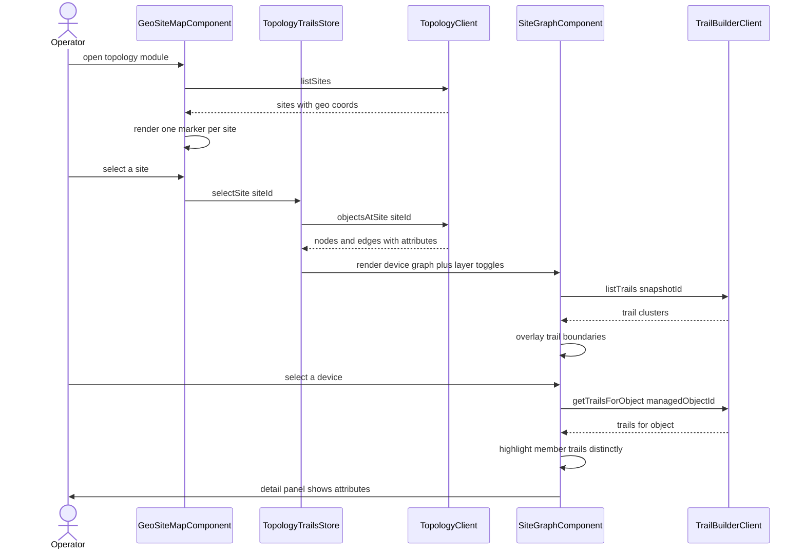
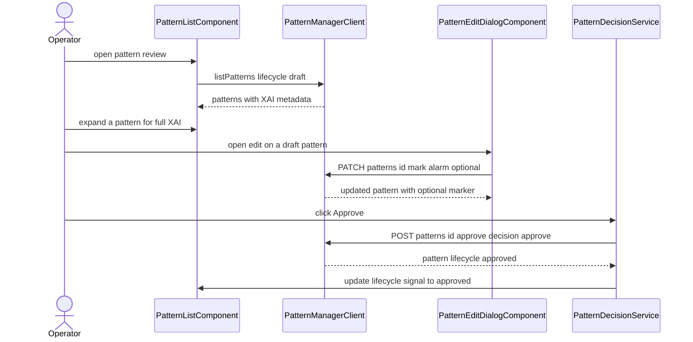
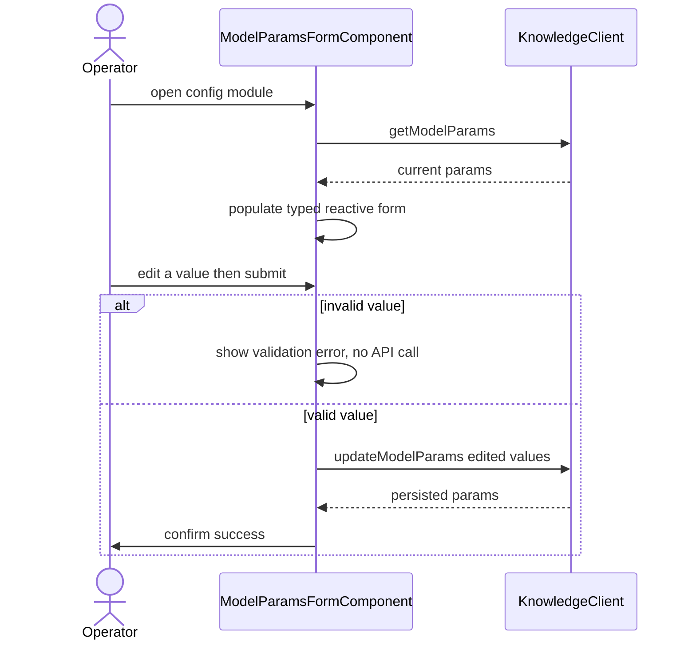
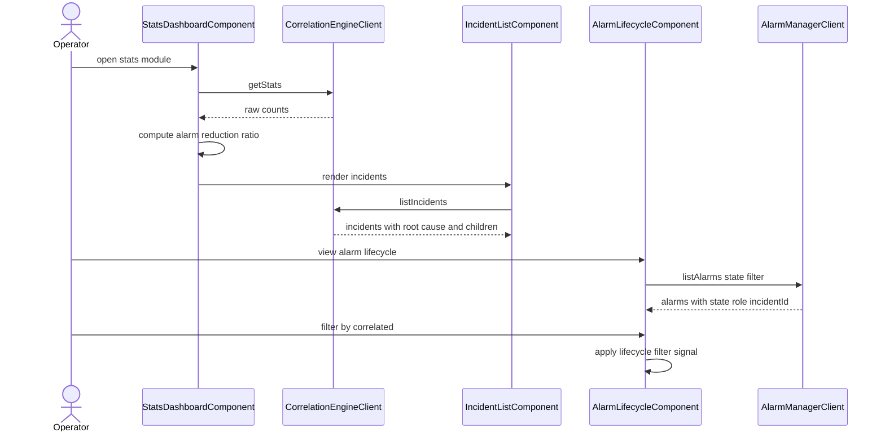
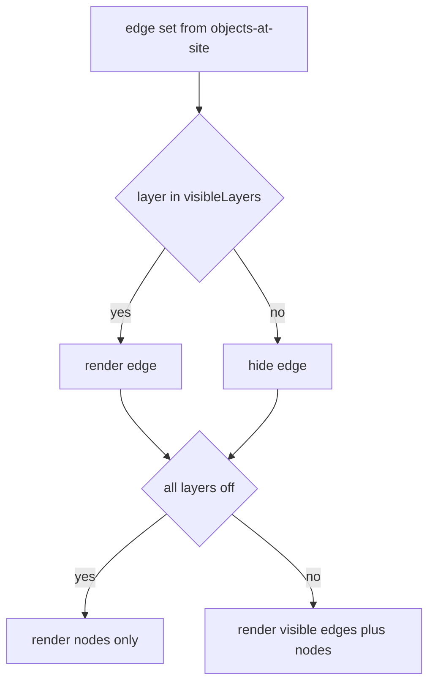

# web-ui — Design

> Authored by `@designer` using the `design` skill, from the approved spec on `web-ui`.
> Branch: `design/web-ui-rework` (the canonical `design/web-ui` name was already held by a
> stale local branch from a prior killed attempt; this rework uses `-rework` to avoid clobbering
> it). Merges into `web-ui` — human gate, do not self-merge.

## Stack

- **Framework:** Angular 20, **standalone components only** (no NgModules). Bootstrapped via
  `bootstrapApplication` with `provideRouter`, `provideHttpClient(withFetch())`, and
  application-level providers.
- **Reactivity:** Angular **signals** (`signal`, `computed`, `effect`, `resource` /
  `httpResource` where it fits) as the primary state mechanism; `OnPush` change detection on
  every component. No NgRx — signal stores (plain injectable services exposing signals) are
  sufficient for a stateless client.
- **Typing:** strict TypeScript (`strict: true`, `noImplicitAny`, `strictNullChecks`). No `any`
  in application source. **Typed reactive forms** (`FormGroup` with typed controls) for the
  config-edit and pattern-edit forms.
- **HTTP clients:** one typed client service per collaborator, generated from each producer's
  **published OpenAPI 3.1** spec (`openapi-typescript` for models + a thin hand-written
  Angular `HttpClient` wrapper; no codegen against producer source). Base URL + mock/real toggle
  resolved from Angular environment config.
- **Graph & map rendering (permissive licenses only):**
  - **MapLibre GL JS** (BSD-3-Clause) for the geo-site map; **deck.gl** (MIT) optional overlay
    layer for site markers/clusters.
  - **Cytoscape.js** (MIT) for the site-level device graph and trail overlays.
  - Charts: a lightweight MIT chart lib (e.g. `ng2-charts`/Chart.js — MIT) for stats.
- **Accessibility tooling:** `@angular/cdk/a11y` (FocusTrap, LiveAnnouncer), `axe-core` (dev-only
  test dependency — not shipped) for the a11y unit tests.
- **Test stack:** **Vitest + Angular TestBed** (jsdom) for unit/component tests; mock backends
  generated from each producer's OpenAPI spec (MSW — MIT — as the in-jsdom mock transport).
  **Playwright** (Apache-2.0) for E2E only, against the integration stack. Playwright is never
  the unit-test runner.
- **Build/serve:** Angular CLI (esbuild). Production build is a **static SPA**; no BFF. Served
  by nginx (BSD-2-Clause) in the container with a health route returning HTTP 200 on `/`.
- **Runtime:** Node 24 build stage (`node:24`), nginx serve stage.

License posture: Angular (MIT), MapLibre GL (BSD-3), deck.gl (MIT), Cytoscape.js (MIT), Chart.js
(MIT), MSW (MIT), axe-core (dev-only). No GPL/AGPL/BSL/source-available runtime dependency.

## Task breakdown (from the spec)

| Spec task | Realized by (modules / flow) |
|---|---|
| 1. Render geo-site topology view | `TopologyTrailsModule` to `GeoSiteMapComponent` (MapLibre GL) reads `TopologyClient.listSites()` (`GET /topology/sites`); renders one marker per `Site`; `SiteStore` signal holds the list. |
| 2. Expand a site into its device-level graph | `SiteGraphComponent` (Cytoscape.js); on marker select, `TopologyTrailsStore.selectSite(siteId)` calls `TopologyClient.objectsAtSite(siteId)`; view transitions from map to graph; selected `siteId` passed in the request. |
| 3. Display device/connection attributes | `AttributeDetailPanelComponent` renders the `attributes` map from the selected node/edge; well-known keys labelled, unknown keys as generic key/value rows; `managedObjectId` always shown. |
| 4. Visualize trail clusters & per-device membership | `TrailOverlayService` reads `TrailBuilderClient.listTrails(snapshotId)` for cluster overlays and `getTrailsForObject(moid)` on device select; Cytoscape style highlights member trails. |
| 5. List & present discovered patterns with XAI | `PatternReviewModule` to `PatternListComponent` plus `PatternXaiDetailComponent` read `PatternManagerClient.listPatterns()`; show sequence, support, confidence, lift, RCA, timing, codebook overlap, supporting instances. |
| 6. Accept approve/reject decisions | `PatternDecisionService.approve/reject(patternId)` posts `POST /patterns/{id}/approve` with `{decision}`; `PatternStore` updates the pattern lifecycle signal from the response. |
| 7. List active/approved patterns | `ActivePatternsComponent` reads `listPatterns({lifecycle:'approved'})`; tab/filter in `PatternReviewModule` (and reused in stats module). |
| 8. Read & edit Knowledge model params | `ConfigModule` to `ModelParamsFormComponent` (typed reactive form) reads `KnowledgeClient.getModelParams()`, submits `KnowledgeClient.updateModelParams()`; confirmation toast. |
| 9. Display live correlation stats & incidents | `CorrelationStatsModule` to `IncidentListComponent` plus `StatsDashboardComponent` read `CorrelationEngineClient.listIncidents()` and `getStats()`. |
| 10. Display live alarm lifecycle | `AlarmLifecycleComponent` reads `AlarmManagerClient.listAlarms({state})`; shows state, role, incidentId; filter by lifecycle state. |
| 11. Config-switchable backend integration | `ApiConfigService` resolves each base URL plus `mock|real` toggle from `environment.ts`; `MockBackendProvider` (MSW) wired only when toggle is `mock`. |

Every spec task above maps to a named module/component; none dropped or re-scoped.

## Phase applicability (design view)

The web-ui is **Active in all three runtime phases** (a different module is the focus of each
phase), matching the spec Phase applicability table and the canonical phase map. The app shell
is always loaded; phase-specific behaviour is which lazy module the operator works in.

| Phase | Active/Passive/Idle | Modules/handlers exercised | Inputs/Outputs |
|---|---|---|---|
| P1 — Topology onboarding | Active | `TopologyTrailsModule`: `GeoSiteMapComponent`, `SiteGraphComponent`, `AttributeDetailPanelComponent`, `LayerToggleComponent`, `TrailOverlayService`. Other modules dormant (lazy, not loaded). | Reads: Topology Service site query API (`listSites`, `objectsAtSite`, neighbours, resolve); Trail Builder (`listTrails`, `getTrail`, `getTrailsForObject`). Writes: none |
| P2 — Pattern learning | Active | `PatternReviewModule`: `PatternListComponent`, `PatternXaiDetailComponent`, `PatternEditDialogComponent`, `PatternDecisionService`. `ConfigModule`: `ModelParamsFormComponent`. | Reads: Pattern Manager read API (`GET /patterns`, `GET /patterns/{id}`); Knowledge model-params read API. Writes: Pattern Manager approval-intent (`POST /patterns/{id}/approve`), pattern-edit (`PATCH /patterns/{id}`); Knowledge model-params edit API. |
| P3 — Real-time correlation | Active | `CorrelationStatsModule`: `IncidentListComponent`, `StatsDashboardComponent`, `AlarmLifecycleComponent`; `ActivePatternsComponent` (reused). | Reads: Correlation Engine incident/stats API (`GET /incidents`, `GET /stats`); Pattern Manager active-patterns (`GET /patterns?lifecycle=approved`); Alarm Manager lifecycle query API (`GET /alarms`, `GET /alarms/{id}`). Writes: none |

## Module breakdown

Four lazy-loaded feature modules behind a shared app shell. Each feature route is loaded with
`loadComponent` / `loadChildren` so a phase the operator is not using carries no bundle cost.

- **App shell (eager):** `AppShellComponent` (top nav, module router-outlet, global error toast,
  `LiveAnnouncer` host), `ApiConfigService`, the eight typed API clients, `MockBackendProvider`
  (active only under the mock toggle), `ErrorBannerService`.
- **`TopologyTrailsModule` (lazy, route `/topology`):** `GeoSiteMapComponent` (MapLibre),
  `SiteGraphComponent` (Cytoscape), `LayerToggleComponent`, `AttributeDetailPanelComponent`,
  `TrailOverlayService`, `TopologyTrailsStore` (signals: `sites`, `selectedSite`, `graph`,
  `visibleLayers`, `selectedObject`, `trails`, `highlightedTrailIds`).
- **`PatternReviewModule` (lazy, route `/patterns`):** `PatternListComponent`,
  `PatternXaiDetailComponent`, `PatternEditDialogComponent`, `ActivePatternsComponent`,
  `PatternDecisionService`, `PatternStore` (signals: `patterns`, `lifecycleFilter`,
  `selectedPattern`, `pendingDecision`).
- **`ConfigModule` (lazy, route `/config`):** `ModelParamsFormComponent`, `ConfigStore`
  (signals: `params`, `saveStatus`).
- **`CorrelationStatsModule` (lazy, route `/stats`):** `StatsDashboardComponent`,
  `IncidentListComponent`, `AlarmLifecycleComponent`, `ActivePatternsComponent` (reused),
  `StatsStore` (signals: `incidents`, `stats`, `alarms`, `alarmStateFilter`).



## Data model / DB schema

**N/A — no owned store.** The web-ui is a stateless SPA per spec (Data owned: none). It holds
no persistent store and caches no domain data beyond in-memory session state. Below are the
**client-side view-models** (TypeScript types) the UI projects from collaborator API responses.
Field names are confirmed against each producer OpenAPI at design time (open questions
#60-#64 and the Alarm Manager dependency); the types below reflect the spec contracts.



Notes:
- `attributes` is rendered as an open key/value map; well-known keys (`vendor`, `model`,
  `equipmentType`, `role`, `capacity` on nodes; `linkType`, `capacity`, `protectionRole` on
  edges) get friendly labels, all other keys render as generic rows. The UI never validates the
  attribute schema (Knowledge Service owns the catalogue).
- `alarmReductionRatio` is **computed client-side** as `totalAlarmsProcessed` divided by
  `totalIncidentsCreated` from the Correlation Engine `GET /stats` raw counts (the engine does
  not return the ratio directly). RCA accuracy is surfaced only if the stats API exposes it;
  otherwise it is shown as "evaluated offline" per the Correlation Engine spec (it is computed
  by the evaluation oracle, not the engine). See the Error handling note.

## Event handling

- **Consumers:** **none.** The web-ui never subscribes to Kafka topics directly (spec: Consumes
  Kafka — none). All data arrives over collaborator REST APIs.
- **Producers:** **none.** The web-ui never publishes to Kafka. The architecture row "produces
  `patterns.approved` (via API)" is realized by `POST /patterns/{id}/approve` to the Pattern
  Manager, which owns the lifecycle transition and is the sole emitter of `PatternApprovedEvent`.

## API contracts / API schema

**Exposed:** N/A — no HTTP surface other than the static-asset server returning HTTP 200 on `/`
for liveness. The web-ui publishes **no** OpenAPI document (spec: APIs exposed — none).

**Consumed** (eight integration points; each typed client built from the producer published
OpenAPI 3.1; no hard-coded URLs). Request/response shapes below reflect the collaborator specs;
exact field names/pagination are reconciled against each producer `openapi.json` at design
time (open questions #60-#64 plus the Alarm Manager dependency).

### Topology Service (P1)
- `GET /topology/sites` returns `200 [{ siteId, name, latitude, longitude, region }]` — list sites.
  (Site listing endpoint shape is the Topology designer confirmation item, OQ1a.)
- `GET /topology/sites/{siteId}/objects` (objects-at-site) returns `200 { nodes, edges }` where
  each node/edge carries `managedObjectId` and `attributes`. (Objects-at-site endpoint, OQ1b.)
- `GET /topology/nodes/{managedObjectId}` returns `200 { managedObjectId, objectType, layer,
  attributes }` — resolve object plus layer.
- `GET /topology/nodes/{managedObjectId}/neighbors` returns `200 { neighbors }`.
- Errors surfaced: `404` (unknown object) shows empty-state in panel; `5xx` shows error banner.

### Trail Builder (P1)
- `GET /trails?snapshotId=X&domain=core-ip` (`listTrails`) returns `200 [{ trailId, memberCount,
  domain, snapshotId }]`.
- `GET /trails/{trailId}` (`getTrail`) returns `200 { trailId, snapshotId, domain, members }`.
- `GET /trails/by-object?managedObjectId=X&domain=core-ip` (`getTrailsForObject`) returns
  `200 [{ trailId }]`.

### Pattern Manager (P2 plus P3 active-patterns)
- `GET /patterns?lifecycle=draft|approved|deprecated` returns `200 [PatternVM]` (full XAI
  metadata: `sequence`, `support`, `confidence`, `lift`, `rootCauseAlarmType`, `timing`,
  `codebookMatchId`, `instanceCount`, `supportingInstances`, `lifecycle`).
- `GET /patterns/{patternId}` returns `200 PatternVM` (full detail) or `404`.
- `POST /patterns/{patternId}/approve` body `{ decision, reviewer, notes }` where decision is
  approve or reject, returns `200 PatternVM` (updated lifecycle). Approve transitions to
  `approved`; reject records the rejection.
- `PATCH /patterns/{patternId}` body `{ sequenceFlags, reviewer, notes }` where each flag is
  `{ index, optional }`, returns `200 PatternVM` (edited). Allowed only when `lifecycle` is
  `draft`; otherwise the service returns `409/422` and the UI surfaces it.

### Knowledge Service (P2 — config)
- `GET /knowledge/model-params` (or the path the Knowledge OpenAPI publishes) returns `200
  { dbscanEps, dbscanMinSamples, sessionWindowGapSeconds, minSupport }`.
- `PUT or PATCH /knowledge/model-params` body `{ editedParams }` returns `200 { persisted }` or
  `422` validation error. (Editable param set and validation rules are the Knowledge designer
  confirmation, OQ #63.)

### Correlation Engine (P3)
- `GET /incidents?trailId=X&from=Y&to=Z&matchType=W` returns `200 [IncidentVM]` (`incidentId`,
  `rootCauseAlarmId`, `childAlarmIds`, `matchedPatternId`, `matchedCodebookId`, `confidence`,
  `trailId`, `createdAt`).
- `GET /incidents/{incidentId}` returns `200 IncidentVM`.
- `GET /stats` returns `200 { totalAlarmsProcessed, totalIncidentsCreated, patternMatchCount,
  codebookMatchCount, confidenceDistribution }`. UI computes `alarmReductionRatio`.

### Alarm Manager (P3)
- `GET /alarms?state=open|correlated|cleared&trailId=X&incidentId=Y&from=A&to=B` returns
  `200 [AlarmVM]` (paginated) with `state`, `role` (root-cause/child/none), `incidentId`.
- `GET /alarms/{alarmId}` returns `200 AlarmVM` with ordered `transitions` (UTC timestamps).

**OpenAPI usage:** the web-ui generates TypeScript models from each producer checked-in
`openapi.json` (`openapi-typescript`) at design time and regenerates on a collaborator contract
change (a collaborator API change is a contract change — architecture.md update plus human
approval before the client is updated, per the spec Non-functional "API contract").

## Integration points (mock vs. real)

Resolution is by Angular environment config — never a hard-coded URL. `ApiConfigService` reads a
per-service base URL and a `mock|real` toggle. Under `mock`, `MockBackendProvider` registers MSW
handlers generated from the producer OpenAPI; under `real`, calls go to the Compose address.

| Integration point | Client | Config key (base URL) | Mock (unit) | Real (integration) |
|---|---|---|---|---|
| Topology site query plus objects-at-site plus graph | `TopologyClient` | `TOPOLOGY_API_BASE_URL` | MSW from Topology `openapi.json` | Topology Service (Compose) |
| Trail Builder trail-viz | `TrailBuilderClient` | `TRAIL_BUILDER_API_BASE_URL` | MSW from Trail Builder `openapi.json` | Trail Builder (Compose) |
| Pattern Manager read | `PatternManagerClient` | `PATTERN_MANAGER_API_BASE_URL` | MSW from Pattern Manager `openapi.json` | Pattern Manager (Compose) |
| Pattern Manager approval-intent | `PatternManagerClient` | `PATTERN_MANAGER_API_BASE_URL` | MSW handler | Pattern Manager (Compose) |
| Pattern Manager pattern-edit (PATCH) | `PatternManagerClient` | `PATTERN_MANAGER_API_BASE_URL` | MSW handler | Pattern Manager (Compose) |
| Knowledge model-params | `KnowledgeClient` | `KNOWLEDGE_API_BASE_URL` | MSW from Knowledge `openapi.json` | Knowledge Service (Compose) |
| Correlation Engine incident/stats | `CorrelationEngineClient` | `CORRELATION_ENGINE_API_BASE_URL` | MSW from Correlation `openapi.json` | Correlation Engine (Compose) |
| Alarm Manager lifecycle query | `AlarmManagerClient` | `ALARM_MANAGER_API_BASE_URL` | MSW from Alarm Manager `openapi.json` | Alarm Manager (Compose) |

Pattern Manager read/approval/edit share one base URL but are three logical integration points
(eight total per spec AC 26). The `INTEGRATION_MODE=mock|real` env var plus per-service base URLs
are injected into `environment.ts` from Docker Compose environment variables at build/serve time.

## Key flows (sequence / data-flow diagrams)

### Flow 1 — Topology & trails (P1): geo map to site graph to trail highlight



### Flow 2 — Pattern review & XAI (P2): review, edit optional alarm, approve



### Flow 3 — Config (P2): read and edit Knowledge model params



### Flow 4 — Correlation stats (P3): incidents, stats, alarm lifecycle



## Algorithm logical flow

The web-ui implements **no domain algorithm** (no matching, scoring, RCA, mining — all owned by
backend services). The only non-trivial client-side computations are presentation logic:

1. **Layer-toggle filtering (AC 3):** each edge carries a `layer` (fiber/IP/IGP/LSP/service).
   `visibleLayers` is a signal set; the Cytoscape graph applies a style filter showing only
   edges whose `layer` is in the set. All layers off then only nodes render. Pure derived view
   via `computed`.
2. **Trail highlight (AC 7):** on device select, `getTrailsForObject` returns the member
   `trailId` set; `highlightedTrailIds` signal drives a Cytoscape class that styles member
   trails distinctly from non-member trails. A device may be in many trails (overlapping).
3. **Alarm-reduction ratio (AC 20):** ratio is `totalAlarmsProcessed` divided by
   `totalIncidentsCreated` (guard divide-by-zero then display n/a when `totalIncidentsCreated`
   is 0).
4. **Lifecycle filter (AC 24):** `alarmStateFilter` signal; `computed` filters the `alarms`
   signal by `state`.



## Seed data & examples

The web-ui ships **test fixtures** (mock-backend responses) generated from each producer
published OpenAPI, used by Vitest/TestBed. Representative fixtures:

- `fixtures/topology/sites.json` — two sites e.g. London PoP (lat 51.5, lon -0.12, region
  EU-West) and Frankfurt PoP (at least 2 sites, AC 1).
- `fixtures/topology/objects-at-site-1.json` — nodes incl. a device with attributes
  `vendor=Acme, model=R8000, equipmentType=router, slotCount=16` (three well-known keys plus one
  extra, AC 4) and an edge with attributes `linkType=fiber, capacity=100G,
  protectionRole=primary` (AC 5); edges tagged with `layer` across fiber/IP/IGP/LSP/service
  (AC 3).
- `fixtures/trails/list.json` plus `fixtures/trails/by-object.json` — a device present in at
  least 2 trails (AC 6, 7).
- `fixtures/patterns/discovered.json` — patterns with full XAI; mixed `lifecycle`
  (draft/approved) for AC 9, 10, 13; one `draft` pattern editable for AC 30.
- `fixtures/knowledge/model-params.json` — `dbscanEps, dbscanMinSamples,
  sessionWindowGapSeconds, minSupport` (AC 15).
- `fixtures/correlation/incidents.json` plus `stats.json` — incidents with root-cause plus
  children, known ratio/accuracy (AC 19-21).
- `fixtures/alarms/lifecycle.json` — alarms in all three states (open/correlated/cleared) with
  role plus `incidentId` (AC 23, 24).

## UI wireframes

### Module 1 — Topology & trails

```
+-------------------------------------------------------------+
| [topology] [patterns] [config] [stats]        web-ui shell  |
+-------------------------------------------------------------+
| Geo-site map (MapLibre)                                     |
|   . London PoP        . Frankfurt PoP    . Madrid PoP       |
|   (markers, one per Site; click to expand)                  |
+-------------------------------------------------------------+
  (after selecting a site, transitions to)
+----------------------------------+--------------------------+
| Site graph (Cytoscape)           | Detail panel             |
|   o--o  o   trail cluster overlay | managedObjectId: ...     |
|   |    \                          | vendor: Acme             |
|   o     o                         | model: R8000             |
| Layers: [x]fiber [x]IP [ ]IGP     | equipmentType: router    |
|         [ ]LSP [ ]service         | slotCount: 16 (generic)  |
| (selected device highlights its   | --- trails ---           |
|  member trails distinctly)        | trail-A, trail-C         |
+----------------------------------+--------------------------+
```
Reads: Topology `listSites`, `objectsAtSite`; Trail Builder `listTrails`, `getTrailsForObject`.

### Module 2 — Pattern review & XAI

```
+-------------------------------------------------------------+
| Patterns   tabs: [Discovered (draft)] [Active (approved)]   |
+-------------------------------------------------------------+
| seq            sup  conf lift RCA        codebook  lifecycle |
| LOS,LinkDown.. 0.12 0.90 4.2 LOS         match-7   draft  v  |
|   v expanded XAI: timing (median IAT, timeframe),           |
|     instanceCount, supportingInstances list                 |
|     [Approve] [Reject] [Edit]  (Edit only for draft)        |
+-------------------------------------------------------------+
  Edit dialog (placeholder):
  [ ] LOS  [x] LinkDown optional  [ ] AdjDown   reviewer:____
  notes:__________________________  [Submit PATCH] [Cancel]
```
Reads: Pattern Manager `GET /patterns`. Writes: `POST /patterns/{id}/approve`,
`PATCH /patterns/{id}`.

### Module 3 — Config

```
+-------------------------------------------------------------+
| Model parameters (Knowledge Service)                        |
|   DBSCAN eps          [ 0.5  ]                               |
|   DBSCAN minSamples   [ 5    ]                               |
|   session-window gap  [ 300  ] seconds  (must be 0 or more) |
|   min-support         [ 0.05 ]                              |
|                                   [Save]  status: saved OK  |
|   (negative gap shows inline validation error, no API call) |
+-------------------------------------------------------------+
```
Reads: Knowledge `getModelParams`. Writes: `updateModelParams`.

### Module 4 — Correlation stats

```
+-------------------------------------------------------------+
| Stats dashboard                                             |
|  alarm-reduction ratio: 8.3   RCA accuracy: evaluated offl. |
|  pattern matches: 42   codebook matches: 17                 |
+------------------------------+------------------------------+
| Incidents                    | Alarm lifecycle              |
|  INC-1 root: LOS at FiberSpan| filter: all open corr clr    |
|    children: LinkDown, AdjDn | alarmId  state     role  inc |
|  INC-2 root: ...             | a-1     correlated root  INC1|
|                              | a-2     correlated child INC1|
|                              | a-9     open       none  --  |
+------------------------------+------------------------------+
```
Reads: Correlation Engine `listIncidents`, `getStats`; Alarm Manager `listAlarms`.

## Error handling

First-class. The SPA must never crash whole-app on one backend failure; each module degrades
independently.

- **No Kafka / no schemaVersion handling:** N/A — the web-ui consumes no Kafka topics, so there
  is no DLQ routing and no `schemaVersion` rejection in this service. (Stated for completeness;
  the responsibility sits with the producers.)
- **Backend 5xx / unreachable (AC 29):** each module wraps its client calls; on `5xx` or network
  error the `ErrorBannerService` renders a **structured error message identifying the service**
  (service name plus HTTP status) inside that module; other modules are unaffected. An effect
  logs a structured JSON error (level from env) with the service name, endpoint, status, and
  `traceId` if present. Nothing is silently dropped.
- **404 / empty result:** rendered as an explicit **empty state** (e.g. "No sites returned",
  "No discovered patterns") — distinct from an error. A `404` on `GET /patterns/{id}` or
  `GET /alarms/{id}` shows a "not found" panel.
- **Validation failure (config edit, AC 17):** the typed reactive form blocks submit and shows
  an inline field error; **no API call is made** for an invalid value (e.g. negative
  session-window gap).
- **Edit on non-draft pattern (AC 30):** the Edit action is offered only for `draft` patterns;
  if the Pattern Manager returns `409/422` (race where the pattern left `draft`), the dialog
  surfaces the structured error and does not mutate local state.
- **Double-submit guard (idempotency):** approval-intent and config-save buttons are disabled
  while a request is in flight (`pendingDecision` / `saveStatus` signals), preventing duplicate
  POSTs on the same user action. Server-side idempotency is the owning service concern.
- **Loading state:** every async view shows a skeleton/spinner with an ARIA `aria-busy` region
  while the request is pending; `LiveAnnouncer` announces load completion for screen readers.
- **RCA accuracy display:** the Correlation Engine `GET /stats` does **not** compute RCA accuracy
  (evaluated by the offline oracle per its spec). If the stats response omits it, the dashboard
  shows "evaluated offline" rather than fabricating a value. **Flagged design note** — not a
  contract change; consistent with the Correlation Engine spec.

## Design alternatives

| Consideration | Alternatives considered | Chosen plus rationale |
|---|---|---|
| State management | NgRx store vs. signal-based injectable stores vs. component-local signals | **Signal-based injectable stores.** The web-ui is a stateless client with no complex shared-state graph; signals plus `computed` give OnPush-friendly reactivity with far less boilerplate than NgRx. NgRx adds ceremony with no payoff for a client that owns no domain state. |
| API client generation | Full OpenAPI codegen client vs. models-only codegen plus thin HttpClient wrapper vs. hand-written | **Models-only codegen (`openapi-typescript`) plus thin Angular `HttpClient` wrappers.** Keeps types contract-true to each producer OpenAPI while letting clients use Angular DI, interceptors, and the env-driven base URL/toggle. Full generated clients fight Angular DI and the mock/real switch. |
| Mock backend transport | MSW (service-worker/jsdom) vs. Angular `HttpTestingController` vs. Prism mock server | **MSW for unit/component** (intercepts at fetch layer in jsdom, mirrors real network, reusable across components) and the **same MSW handlers from OpenAPI** keep the mock/real toggle honest. `HttpTestingController` is too low-level for whole-flow component tests; Prism is a separate process better suited to integration. |
| Geo map library | MapLibre GL vs. deck.gl alone vs. Leaflet | **MapLibre GL (BSD) as base, deck.gl (MIT) optional overlay.** Both permissive; MapLibre gives vector basemap plus markers out of the box, deck.gl adds GPU site-cluster layers if site counts grow. Leaflet (BSD) is viable but weaker for large overlays. |
| Device graph library | Cytoscape.js vs. deck.gl graph vs. d3-force | **Cytoscape.js (MIT).** Purpose-built for typed multi-layer graphs with per-edge style classes (ideal for layer toggles plus trail highlight) and virtualizable for large graphs. |
| BFF vs. direct-to-service | Introduce a BFF proxy vs. direct SPA-to-service calls | **Direct-to-service (no BFF)** — fixed by the spec for MVP. CORS is each producer design-stage concern. A BFF would be a new service needing its own spec/OpenAPI/contract approval. |
| Alarm-reduction ratio source | Server-computed vs. client-computed from raw counts | **Client-computed** — the Correlation Engine `GET /stats` exposes raw counts only (its spec); the UI divides `totalAlarmsProcessed` by `totalIncidentsCreated`. No contract change requested. |

## Test plan

### Acceptance criterion to test (unit/contract)

Unit/component tests use **Vitest plus Angular TestBed** with **mock backends** (MSW from
producer OpenAPI). E2E tests use **Playwright** against the integration stack (E2E only).

| # | Acceptance criterion | Test | Asserts |
|---|---|---|---|
| 1 | Geo map renders a marker per Site, none for absent sites | `geo-site-map.spec.ts` renders markers | mock `listSites` returns at least 2 sites, one marker per site, no extra markers |
| 2 | Selecting a site calls objects-at-site and renders device graph | `site-selection.spec.ts` site expand | request carries correct `siteId`; graph view replaces map; nodes/edges rendered |
| 3 | Layer toggles independently show/hide edges; all off shows nodes only | `layer-toggle.spec.ts` toggle each layer | each toggle filters its edge layer; all-off shows only nodes |
| 4 | Node detail panel shows attributes incl. vendor/model/equipmentType plus unknown keys | `attribute-panel-node.spec.ts` | three well-known keys labelled; extra key shown as generic row; `managedObjectId` shown |
| 5 | Edge detail panel shows linkType/capacity plus unknown keys | `attribute-panel-edge.spec.ts` | well-known connection keys labelled; unknown keys generic |
| 6 | Trail cluster boundaries overlaid from `listTrails` | `trail-overlay.spec.ts` | overlay rendered for each trail in fixture |
| 7 | Selecting a multi-trail device highlights all its trails distinctly | `trail-highlight.spec.ts` | device in at least 2 trails, all member trails get highlight class, non-members do not |
| 8 | E2E real Topology plus Trail Builder, sites, site graph, attrs, overlays render | `topology.e2e.ts` (Playwright) | against integration stack: sites listed, site graph plus attributes plus trail overlays render without error |
| 9 | Pattern list renders sequence/support/confidence/lift/RCA/timing/codebook/instances | `pattern-list.spec.ts` | all XAI columns present per pattern from mock |
| 10 | Operator can expand a pattern to full XAI before acting | `pattern-expand.spec.ts` | expansion reveals all XAI fields |
| 11 | Approve posts approval-intent with correct patternId; lifecycle becomes approved | `pattern-approve.spec.ts` | `POST /patterns/{id}/approve` body decision approve, correct id; UI shows approved |
| 12 | Reject posts reject-intent; pattern removed/marked rejected | `pattern-reject.spec.ts` | reject POST with correct id; pattern removed from discovered list or marked rejected |
| 13 | Active/approved filter shows only approved patterns | `active-patterns.spec.ts` | mixed-lifecycle fixture, only approved shown under filter |
| 14 | E2E approve a pattern; Pattern Manager reflects approved on re-read | `pattern-approve.e2e.ts` (Playwright) | integration stack: approve, subsequent read returns approved |
| 15 | Config shows current model params from Knowledge | `config-load.spec.ts` | DBSCAN params, session-window gap, min-support displayed from mock |
| 16 | Valid edit submits to Knowledge; success confirmed | `config-save.spec.ts` | edit request sent with updated values; success toast shown |
| 17 | Invalid value shows validation error, no API call | `config-validation.spec.ts` | negative gap shows inline error; Knowledge client not called |
| 18 | E2E config edit retrievable via Knowledge on re-read | `config-edit.e2e.ts` (Playwright) | integration stack: submitted edit returned on subsequent read |
| 19 | Incidents render with root-cause plus child alarms | `incident-list.spec.ts` | each incident shows `rootCauseAlarmId` plus `childAlarmIds` |
| 20 | Alarm-reduction ratio plus RCA accuracy shown as numeric | `stats-metrics.spec.ts` | computed ratio matches counts; RCA accuracy numeric or evaluated offline |
| 21 | Noise-filter effectiveness metric shown | `stats-noise.spec.ts` | noise-filter metric rendered from mock |
| 22 | E2E replayed fiber-cut shows at least one incident with root cause plus children | `stats.e2e.ts` (Playwright) | integration stack: incident with tagged root cause plus at least 1 child |
| 23 | Alarm-lifecycle view lists state plus role plus incidentId | `alarm-lifecycle.spec.ts` | alarms in all three states with role plus incidentId rendered |
| 24 | Lifecycle filter filters correctly by selected state | `alarm-filter.spec.ts` | selecting correlated shows only correlated alarms |
| 25 | E2E replayed fiber-cut shows at least one correlated alarm with incident association | `alarm-lifecycle.e2e.ts` (Playwright) | integration stack: correlated alarm with non-empty incidentId from Alarm Manager |
| 26 | Mock config, all eight integration points resolve to mocks, no real HTTP | `env-mock-switch.spec.ts` | each of 8 clients hits MSW; no outbound real request made |
| 27 | Integration config, 8 base URLs from env, no URL literal in source | `no-hardcoded-url.spec.ts` (build-time grep test) | no localhost or service hostname URL in non-environment source |
| 28 | Keyboard nav cycles all interactive elements; canvases have ARIA labels | `a11y.spec.ts` (axe-core per view) | each of 6 views: keyboard reachable controls; map/graph canvas ARIA label; no axe violations |
| 29 | Any backend 5xx, module shows structured service-named error, others unaffected | `error-boundary.spec.ts` (per integration point) | 5xx shows error banner naming the service; other modules still render |
| 30 | Edit draft pattern: mark alarm optional, PATCH sent, edited pattern reflected; edit only for draft | `pattern-edit.spec.ts` | `PATCH /patterns/{id}` with optional marker; UI reflects edit; edit action absent for non-draft |

All 30 acceptance criteria are mapped 1:1 to a named test (24 Vitest/TestBed plus 6 Playwright
E2E: AC 8, 14, 18, 22, 25 are E2E; AC 27 is a build-time grep check run under the unit harness).

### E2E scenarios (from this design unit point of view — Playwright)

| # | Scenario | Trigger to path | Expected outcome |
|---|---|---|---|
| 1 | Topology browse (AC 8) | Open `/topology` against real Topology plus Trail Builder, list sites, select a site, render device graph, toggle layers, select a device | Sites listed, site graph plus attributes render, trail overlays render, no console/network error |
| 2 | Pattern approve round-trip (AC 14) | Open `/patterns` against real Pattern Manager, approve a draft pattern, re-read | Pattern Manager returns approved on subsequent read; UI reflects it |
| 3 | Config edit round-trip (AC 18) | Open `/config` against real Knowledge, edit a param, save, re-read | Edited value persisted and returned on re-read |
| 4 | Fiber-cut stats (AC 22) | Replay fiber-cut scenario through integration stack, open `/stats` | At least 1 incident with tagged root-cause alarm plus at least 1 child alarm shown |
| 5 | Fiber-cut alarm lifecycle (AC 25) | Same replay, open alarm-lifecycle view | At least 1 alarm in correlated state with non-empty incident association from Alarm Manager |
| 6 (failure path) | Backend down degradation | Point one client (e.g. Knowledge) at an unavailable/5xx endpoint in the integration env | Affected module shows a structured service-named error; other modules continue to function (no whole-app crash) |
| 7 (empty path) | No discovered patterns | Pattern Manager returns empty draft list | Pattern review shows an explicit empty state, not an error |

## Config & observability

- **Config:** `environment.ts` / `environment.integration.ts` carry the eight per-service base
  URLs and `INTEGRATION_MODE=mock|real`, plus client log level. Values are injected from Docker
  Compose environment variables at build/serve time. No URL, threshold, or credential is
  hard-coded in application source (AC 27).
- **Observability:** served app root `/` returns HTTP 200 for liveness (nginx). Client-side
  **structured JSON logging** (configurable level from env) for API errors and navigation
  events. **No `/metrics`** endpoint — a static SPA has no BFF; per spec this is intentional.
- **Accessibility:** WCAG 2.1 AA — semantic landmarks, ARIA roles/labels on map and graph
  canvases and data tables, `@angular/cdk/a11y` focus management plus `LiveAnnouncer`, keyboard
  navigation for all controls, contrast at least 4.5 to 1 (text) and at least 3 to 1 (large text
  plus UI components). Verified by `a11y.spec.ts` (axe-core) per view (AC 28).
- **Performance:** OnPush plus signals throughout; lazy-loaded routes per module; CDK virtual
  scroll for long pattern/incident/alarm lists; Cytoscape kept responsive up to the configured
  max graph size.

## Build & run

- **Dev (mock):** `npm ci && npm start` — serves the SPA with `INTEGRATION_MODE=mock`; MSW
  handlers (from producer OpenAPI) back all calls; no live dependency.
- **Unit/component tests:** `npm test` (Vitest plus Angular TestBed, jsdom, MSW mocks). Lint:
  `npm run lint`. Build: `npm run build` (static bundle).
- **E2E:** `npm run e2e` (Playwright) against the integration stack (`INTEGRATION_MODE=real`,
  base URLs are Compose addresses).
- **Container:** multi-stage Dockerfile — build stage `node:24` (`npm ci && npm run build`),
  serve stage nginx serving `dist/` with `/` returning HTTP 200 liveness. Docker Compose entry
  sets the eight base-URL env vars plus `INTEGRATION_MODE`.
- **Client regeneration:** on a collaborator OpenAPI contract change (architecture.md update plus
  human approval first), run `npm run generate:clients` to regenerate TypeScript models from the
  producers' checked-in `openapi.json`.
