# web-ui — Design

> Authored by `@designer` using the `design` skill, from the approved spec on `web-ui`
> (the streaming/dashboard spec rework: landing dashboard, real-time streaming view,
> incident-detail drill-down, noise-filter run-stats view, cross-navigation/deep-linking,
> plus the original four modules).
> Branch: `design/web-ui-streaming-dashboard`. **Supersedes the earlier design PR #112**
> (`design/web-ui-rework`): this document carries every part of that design forward and adds
> the five new views. Merges into `web-ui` — human gate, do not self-merge.
>
> The streaming view, dashboard, incident-detail page, and noise-stats view all read
> **already-published REST APIs only** (Alarm Manager `GET /alarms` + `GET /alarms/{id}`,
> Correlation Engine `GET /incidents` + `GET /incidents/{id}` + `GET /stats`, Pattern Manager
> `GET /patterns`, Noise Filter run-stats read API). **No new backend API surface, no Kafka
> consumer, no WebSocket/SSE, no contract change** is introduced by this design — real-time is
> delivered by **client-side polling** on a configurable interval.
>
> **Client-shape alignment update (consumer-side, closes the data-integration gap loop).** The
> producers have **frozen** their published OpenAPI 3.1 shapes (merged on their service branches);
> web-ui is the **consumer** and aligns every typed client + view-model to those frozen shapes —
> the producer's published OpenAPI is the single source of truth. This is a **client-shape
> alignment only**: the five views, the four modules, the geo to site to graph drill-down, pattern
> XAI/edit, config, cross-navigation, WCAG, the signal stores, and the mock/real Vitest/Playwright
> harness are all **unchanged**; only the typed client **request paths** and **response
> view-models** change to match the frozen producer contracts. **No backend change, no new API
> surface, and no contract change** is introduced. The frozen shapes consumed:
> - **Topology** (P1-G7/G8/G9): `SiteListDto` envelope with flat per-site geo; `SiteObjectsDto`
>   with **nodes AND edges** in one call; `NodeDto` with **`layer` derived from `objectType`**
>   (no separate `layer` field).
> - **Trail Builder** (P1-G4/G10): `getTrailsForObject` at `GET /trails/by-object` to
>   `{ managedObjectId, domain, trailIds[] }`; `getTrail` to `TrailDetail { trailId, domain,
>   snapshotId, members:[{managedObjectId, objectType}], memberCount }`.
> - **Knowledge** (P2-GAP-07): config reads/writes via `GET|PUT /domains/{domain}/model-params/{recordId}`
>   with the **versioned record payload** (`params[]` of `{key, value, min, max, ...}` with real
>   dotted keys); the invented flat `/knowledge/model-params` shape is removed.
> - **Pattern Manager** (P2-GAP-06/08, P3-G1): `GET /patterns` to `PatternPage { items, total,
>   limit, offset }` envelope; `PatternView` carries `trailId`, `rootCauseAlarmType` (vocab token),
>   `sessionWindow`, `structurallyValidated`/`structuralValidationReason`; `PATCH /patterns/{id}` to
>   `PatternEdit { sequenceFlags:[{index, optional}], reviewer, notes? }`.
> - **Correlation Engine** (P3-G3/G4): `GET /incidents` to the canonical paginated envelope
>   `{ items, total, limit, offset }`; `GET /incidents/{id}` to a single `IncidentVM`;
>   `matchedCodebookId` is the codebook artifact id.
> - **Alarm Manager** (P3-G3): `GET /alarms` to the canonical paginated envelope
>   `{ items, total, limit, offset }` with `limit`/`offset` params.
>
> **MVP-achievability addendum (this revision — consumer-side, no backend/contract change).** Two
> fixes are added on top of the design above; everything else (the five views, the four modules, the
> geo to site to graph drill-down, pattern XAI/edit, config, streaming, incident-detail, the
> `{items,total,limit,offset}` client alignment, WCAG, signal stores, mock/real harness) is
> unchanged. This ADDS one view, two dashboard KPIs, and one client.
> - **FIX F-UI1 — Chatter-management page (new view `/chatter`, the noise to live feedback loop).**
>   A new `ChatterManagementComponent` + `ChatterStore` close the **learned-noise to live** loop:
>   the **Noise Filter** learns chatter/noise signatures during P2 and exposes them on a **read-only**
>   API (`GET /api/v1/observed-chatter`, PR #165 — frozen on the Noise Filter service branch); the
>   operator **reviews** these candidates and **promotes** selected ones into **Enrichment's**
>   per-source known-chatter list via Enrichment's **chatter edit API** (`GET`/`ADD`/`REMOVE`), so
>   the **live** enrichment path then suppresses that chatter deterministically. The page shows NF's
>   observed-chatter ranked by `occurrenceCount`, the current Enrichment chatter list for a
>   source/ruleset, which observed signatures are **already promoted** vs **candidates**, and
>   promote/remove actions. A new **`EnrichmentChatterClient`** is added (built against Enrichment's
>   **published chatter OpenAPI**); the **`NoiseFilterClient`** gains `listObservedChatter`. This is a
>   pure **consumer-side** addition — NF produces the observed-chatter read API, Enrichment produces
>   the chatter edit API; the web-ui only reads/writes them. **See the flagged dependency note below.**
> - **FIX F-UI2 — RCA accuracy + auto-correlation% on the dashboard (demonstrability).** The
>   Correlation Engine froze two read-API additions (PR #166): `GET /stats` now carries
>   **`correlatedAlarmCount`** (so **auto-correlation% = `correlatedAlarmCount / totalAlarmsProcessed`**
>   is derivable — the ~60% target) and an **eval-mode `rcaAccuracy`** field (populated only when the
>   engine runs with the Simulator labels oracle wired); each `GET /incidents` item now carries
>   **`rootCauseAlarmType`**. The dashboard now **shows RCA accuracy** — from `GET /stats.rcaAccuracy`
>   when present (eval/demo mode), else **computed client-side** by joining incidents'
>   `rootCauseAlarmId`/`rootCauseAlarmType` to the **Simulator `/labels`** ground truth in the demo —
>   instead of the old "evaluated offline" placeholder; and a new **auto-correlation%** KPI card. The
>   existing KPIs (alarm-reduction ratio, live incident count, active patterns, alarms processed) are
>   kept. This is read-only consumption of already-frozen producer fields — **no backend/contract change.**
>
> > **FLAGGED DEPENDENCY (for the human — missing/unpublished producer contract).** This design
> > consumes the Enrichment chatter edit API against the **expected** shape (described under
> > "Enrichment chatter edit API" in API contracts), consistent with Enrichment's existing
> > per-source `chatterList` entry shape `{ managedObjectId, eventType }`. At the time of writing,
> > the producer branch `design/enrichment-chatter-api` (which is to **add** this REST chatter edit
> > API to Enrichment — Enrichment currently exposes **no** REST business surface, only
> > Kafka + actuator endpoints) **was not yet published/merged**. Per the operating rules the web-ui
> > builds its typed `EnrichmentChatterClient` against the **producer's published chatter
> > `openapi.json`**; until that is published the client is built against the shape below and the
> > dependency is **flagged here, not fabricated**. **No web-ui-side contract is invented**; the
> > path/field names are pinned to Enrichment's published chatter OpenAPI when it lands (a
> > collaborator contract change = architecture.md update + human approval before the client is
> > finalized).
>
> **Note on the canonical list envelope** (consumer alignment to the producers' SSoT): the
> Correlation Engine and Alarm Manager froze the **platform-canonical** pagination envelope
> `{ items, total, limit, offset }` with `limit`/`offset` request params — the **same** envelope
> as Pattern Manager's `PatternPage` and the Noise Filter run-stats page (CE's `IncidentPage` and
> AM's `AlarmPage` share this exact key set, **not** a `page`/`size` envelope). web-ui aligns to
> the producers' frozen canonical envelope (the consumer adapts to the published producer
> contract). All of the platform's list APIs therefore use **one** envelope; the streaming/list
> views read **`.items`** (plus `.total`/`.limit`/`.offset`) from CE `/incidents`, AM `/alarms`,
> Pattern Manager `/patterns`, and Noise Filter run-stats uniformly, and page with `limit`/`offset`
> everywhere.

## Stack

- **Framework:** Angular 20, **standalone components only** (no NgModules). Bootstrapped via
  `bootstrapApplication` with `provideRouter`, `provideHttpClient(withFetch())`, and
  application-level providers.
- **Reactivity:** Angular **signals** (`signal`, `computed`, `effect`, `resource` /
  `httpResource` where it fits) as the primary state mechanism; `OnPush` change detection on
  every component. No NgRx — signal stores (plain injectable services exposing signals) are
  sufficient for a stateless client. The streaming view's poll loop is a signal-driven timer
  (see State management).
- **Typing:** strict TypeScript (`strict: true`, `noImplicitAny`, `strictNullChecks`). No `any`
  in application source. **Typed reactive forms** (`FormGroup` with typed controls) for the
  config-edit and pattern-edit forms, and for the streaming interval control.
- **HTTP clients:** one typed client service per collaborator, generated from each producer's
  **published OpenAPI 3.1** spec (`openapi-typescript` for models + a thin hand-written
  Angular `HttpClient` wrapper; no codegen against producer source). Base URL + mock/real toggle
  resolved from Angular environment config.
- **Graph & map rendering (permissive licenses only):**
  - **MapLibre GL JS** (BSD-3-Clause) for the geo-site map; **deck.gl** (MIT) optional overlay
    layer for site markers/clusters.
  - **Cytoscape.js** (MIT) for the site-level device graph and trail overlays.
  - Charts: a lightweight MIT chart lib (e.g. `ng2-charts`/Chart.js — MIT) for stats and the
    dashboard KPI sparklines.
- **Accessibility tooling:** `@angular/cdk/a11y` (FocusTrap, LiveAnnouncer), `@angular/cdk`
  virtual scroll for long lists (streaming, alarm-lifecycle, incidents), `axe-core` (dev-only
  test dependency — not shipped) for the a11y unit tests.
- **Test stack:** **Vitest + Angular TestBed** (jsdom) for unit/component tests; mock backends
  generated from each producer's OpenAPI spec (MSW — MIT — as the in-jsdom mock transport).
  Mock timers (Vitest `vi.useFakeTimers`) drive the streaming poll-cadence tests.
  **Playwright** (Apache-2.0) for E2E only, against the integration stack. Playwright is never
  the unit-test runner.
- **Build/serve:** Angular CLI (esbuild). Production build is a **static SPA**; no BFF. Served
  by nginx (BSD-2-Clause) in the container with a health route returning HTTP 200 on `/`.
- **Runtime:** Node 24 build stage (`node:24`), nginx serve stage.

License posture: Angular (MIT), MapLibre GL (BSD-3), deck.gl (MIT), Cytoscape.js (MIT), Chart.js
(MIT), MSW (MIT), axe-core (dev-only). No GPL/AGPL/BSL/source-available runtime dependency.

## Task breakdown (from the spec)

| Spec task | Realized by (modules / flow) |
|---|---|
| 1. Render the landing dashboard (home/default route) | `DashboardModule` to `DashboardComponent` + `KpiCardComponent` + `RecentIncidentsComponent` + `QuickLinksComponent`; `DashboardStore` (signals) fans out parallel reads to `CorrelationEngineClient.getStats()` + `listIncidents()`, `PatternManagerClient.listPatterns({lifecycle:'approved'})`, and `AlarmManagerClient.listAlarms()` (count). Default route `''` redirects to `/dashboard`. **FIX F-UI2:** the KPI set now also surfaces **RCA accuracy** (`RcaAccuracyService`: prefer `stats.rcaAccuracy` when non-null in eval/demo mode, else compute client-side by joining `listIncidents().items[].rootCauseAlarmType`/`rootCauseAlarmId` to `SimulatorLabelsClient.listLabels()` ground truth, else N/A) and **auto-correlation%** (`stats.correlatedAlarmCount / stats.totalAlarmsProcessed`). |
| 2. Real-time streaming view via configurable client polling | `StreamingModule` to `StreamingViewComponent` + `LivePollingService`; `LivePollingService` runs a signal-driven timer at `STREAMING_REFRESH_INTERVAL_MS`, polling `AlarmManagerClient.listAlarms()` + `CorrelationEngineClient.listIncidents()` — **both return the same canonical `{ items, total, limit, offset }` page envelope**; `DeltaDiffService` diffs previous-vs-new over the **`.items`** arrays keyed by `alarmId`/`incidentId`; new/changed rows get transient highlight classes; pause/resume toggle + interval control + live/last-updated indicator. |
| 3. Render the incident-detail drill-down page | `IncidentDetailModule` to `IncidentDetailComponent`; route `/incidents/:incidentId`; reads `CorrelationEngineClient.getIncident(incidentId)` (`GET /incidents/{id}` → a single `IncidentVM` with `rootCauseAlarmId`, `childAlarmIds[]`, `matchedPatternId?`/`matchedCodebookId?`, `confidence`, `trailId`) then `AlarmManagerClient.getAlarm(alarmId)` per member (root-cause + children) via parallel `forkJoin`/`Promise.all`; renders root cause, children, matched pattern/codebook (`matchedCodebookId` = codebook artifact id) + confidence, trail, per-member links into the streaming/alarm view. |
| 4. Render the noise-filter run-stats view | `CorrelationStatsModule` to `NoiseStatsComponent` (learning sub-view); reads `NoiseFilterClient.listRunStats({trailId, from, to, limit, offset})` (`GET /api/v1/run-stats`); renders one row per run with derived storm-reduction ratio; filterable by `trailId` and time range. |
| 5. Provide logical cross-navigation with deep-linkable routes | `NavigationService` builds `RouterLink`/`navigate` targets for every cross-link (pattern→`/topology?trailId=`, incident→`/incidents/:id`, member alarm→`/streaming?alarmId=`, site→`/streaming?siteId=` filtered, KPI→underlying view). All entity pages carry the ID in the URL (route param or query param) so links are shareable/bookmarkable. The **navigation map** below is the required deliverable. |
| 6. Render the geo-site topology view | `TopologyTrailsModule` to `GeoSiteMapComponent` (MapLibre GL) reads `TopologyClient.listSites()` (`GET /topology/sites`); the response is the **`SiteListDto` envelope** `{ domain, snapshotId, count, sites:[...] }`; the map reads the `sites[]` array (each a flat `SiteDto { siteId, name, latitude, longitude, region }`), rendering one marker per site; `SiteStore` signal holds the `sites[]` array (P1-G7). |
| 7. Expand a site into its device-level graph | `SiteGraphComponent` (Cytoscape.js); on marker select, `TopologyTrailsStore.selectSite(siteId)` calls `TopologyClient.objectsAtSite(siteId)` returning the **`SiteObjectsDto`** `{ siteId, domain, snapshotId, nodeCount, edgeCount, nodes:[NodeDto], edges:[EdgeDto] }`; the Cytoscape graph is built from **BOTH `nodes` and `edges`** in this single response (no per-node neighbour fan-out); view transitions map→graph (route `/topology/:siteId`); selected `siteId` passed in the request (P1-G8). |
| 8. Display device/connection attributes | `AttributeDetailPanelComponent` renders the `attributes` map from the selected `NodeDto`/`EdgeDto`; well-known keys labelled, unknown keys as generic key/value rows; `managedObjectId` always shown. The node's **`layer` is derived from `objectType`** (no separate `layer` field on `NodeDto`; P1-G9); edges carry `relation` + `attributes`. |
| 9. Visualize trail clusters & per-device membership | `TrailOverlayService` reads `TrailBuilderClient.listTrails(snapshotId, domain)` (`ListTrailsResponse { snapshotId, domain, count, trails:[...] }`) for cluster overlays and `getTrailsForObject(moid, domain)` on device select — `GET /trails/by-object?managedObjectId=&domain=` returning `{ managedObjectId, domain, trailIds:[] }` (P1-G4/G10); Cytoscape style highlights member trails. |
| 10. List & present discovered patterns with XAI | `PatternReviewModule` to `PatternListComponent` + `PatternXaiDetailComponent` read `PatternManagerClient.listPatterns()` returning the **`PatternPage` envelope** `{ items:[PatternView], total, limit, offset }` (render `items[]`, P2-GAP-08); each `PatternView` shows sequence (`SequenceElement[]`), support, confidence, lift, `rootCauseAlarmType` (vocab token), timing, `sessionWindow`, codebook overlap (`codebookMatchId`), `structurallyValidated`/`structuralValidationReason`, supporting instances, `trailId`. |
| 11. Accept approve/reject decisions | `PatternDecisionService.approve/reject(patternId)` posts `POST /patterns/{id}/approve` with `{decision}`; `PatternStore` updates the pattern lifecycle signal from the response. |
| 12. List active/approved patterns | `ActivePatternsComponent` reads `listPatterns({lifecycle:'approved'})`; tab/filter in `PatternReviewModule` (reused by the dashboard active-pattern count and the stats module). |
| 13. Read & edit Knowledge model params | `ConfigModule` to `ModelParamsFormComponent` (typed reactive form) reads `KnowledgeClient.getModelParams(domain, recordId)` (`GET /domains/{domain}/model-params/{recordId}`) and submits `KnowledgeClient.updateModelParams(domain, recordId, payload)` (`PUT /domains/{domain}/model-params/{recordId}`). The form maps the **versioned record payload** `{ domain, recordType, recordId, version, isCurrent, payload:{ paramSet, params:[{key, type, value, min, max, unit?}] } }` — real dotted keys (`dbscan.epsilon`, `dbscan.minSamples`, `window.sizeSeconds`, `prefixspan.minSupport`, ...); validates each param against its `min`/`max` client-side, submits the versioned record payload, and handles the new-version/`isCurrent` write semantics (P2-GAP-07). Confirmation toast. |
| 14. Display live correlation stats & incidents | `CorrelationStatsModule` to `IncidentListComponent` + `StatsDashboardComponent` read `CorrelationEngineClient.listIncidents()` (returns the canonical **`{ items:[IncidentVM], total, limit, offset }` envelope** — render `items[]`, P3-G3/G4) and `getStats()`; ratio derived client-side. |
| 15. Display live alarm lifecycle | `AlarmLifecycleComponent` reads `AlarmManagerClient.listAlarms({state, limit, offset})` (returns the canonical **`{ items:[AlarmSummary], total, limit, offset }` envelope** — render `items[]`, P3-G3); each `AlarmSummary` shows `lifecycleState` (`open`/`in-progress`/`correlated`/`cleared`; `reverted-open` is modelled as a transition back to `open`, surfaced from the detail's `transitions`), `role`, `incidentId`; filter by lifecycle state. |
| 16. Config-switchable backend integration | `ApiConfigService` resolves each base URL + `mock|real` toggle from `environment.ts`; `MockBackendProvider` (MSW) wired only when toggle is `mock`. **Eleven** integration points (the prior nine + Enrichment chatter edit + Simulator labels). |
| 17. (FIX F-UI1) Chatter-management page — noise to live promotion | `ChatterModule` (lazy, route `/chatter`) to `ChatterManagementComponent` + `ObservedChatterTableComponent` + `EnrichmentChatterTableComponent`; `ChatterStore` (signals) reads `NoiseFilterClient.listObservedChatter()` (ranked by `occurrenceCount`) and `EnrichmentChatterClient.listChatter(source)`, computes the **promoted-vs-candidate** join, and writes promotions via `EnrichmentChatterClient.addChatter(source, entry)` / removals via `removeChatter(source, entry)`. Closed loop: NF learned noise to operator review/promote to Enrichment applies live. Added to the nav map + cross-nav. |
| 18. (FIX F-UI2) Dashboard RCA accuracy + auto-correlation% | Realized within task 1's `DashboardModule` (see task 1) — two added `KpiCardComponent`s driven by `RcaAccuracyService` and the auto-correlation `computed`; the `/stats` `StatsDashboardComponent` reuses `RcaAccuracyService` so the same shown RCA number replaces its old "evaluated offline" note. |

Spec tasks 1-16 map to named modules/components (none dropped or re-scoped). Tasks 17-18 are the
two MVP-achievability fixes (F-UI1, F-UI2) added by this revision; both are consumer-side only.

## Phase applicability (design view)

The web-ui is **Active in all three runtime phases** (a different set of modules is the focus of
each phase), matching the spec Phase applicability table and the canonical phase map. The app
shell is always loaded; the landing dashboard is reachable in every phase (it degrades each KPI
to "N/A"/empty when its source has no data yet). Phase-specific behaviour is which lazy module
the operator works in.

| Phase | Active/Passive/Idle | Modules/handlers exercised | Inputs/Outputs |
|---|---|---|---|
| P1 — Topology onboarding | Active | `DashboardModule` (topology KPIs available at this phase; incident/pattern KPIs show empty/N-A). `TopologyTrailsModule`: `GeoSiteMapComponent`, `SiteGraphComponent`, `AttributeDetailPanelComponent`, `LayerToggleComponent`, `TrailOverlayService`. Streaming/stats modules dormant (lazy, not loaded). | Reads: Topology site query API (`listSites` → `SiteListDto`, `objectsAtSite` → `SiteObjectsDto` with nodes+edges, neighbours, resolve `NodeDto` with `layer == objectType`); Trail Builder (`listTrails`, `getTrail` → `TrailDetail`, `getTrailsForObject` at `GET /trails/by-object`). Writes: none |
| P2 — Pattern learning | Active | `DashboardModule` (active-pattern count, learning KPIs). `PatternReviewModule`: `PatternListComponent`, `PatternXaiDetailComponent`, `PatternEditDialogComponent`, `PatternDecisionService`. `ConfigModule`: `ModelParamsFormComponent`. `CorrelationStatsModule` → `NoiseStatsComponent` (noise-filter run-stats / learning sub-view). **`ChatterModule` (FIX F-UI1):** observed-chatter accumulates during P2, so this is where candidates appear; the operator can review/promote at any time. | Reads: Pattern Manager read API (`GET /patterns` → `PatternPage` envelope, `GET /patterns/{id}` → `PatternView`); Knowledge model-params read API (`GET /domains/{domain}/model-params/{recordId}` → versioned record); Noise Filter run-stats + **observed-chatter** read API (`GET /api/v1/run-stats`, `GET /api/v1/observed-chatter`); Enrichment chatter list (`GET` chatter for source). Writes: Pattern Manager approval-intent (`POST /patterns/{id}/approve`), pattern-edit (`PATCH /patterns/{id}` → `PatternEdit` with `sequenceFlags`); Knowledge model-params edit API (`PUT /domains/{domain}/model-params/{recordId}`, versioned write); **Enrichment chatter ADD/REMOVE** (promote/demote chatter for a source). |
| P3 — Real-time correlation | Active | `DashboardModule` (live KPIs incl. **RCA accuracy + auto-correlation%**, FIX F-UI2). `StreamingModule`: `StreamingViewComponent`, `LivePollingService`, `DeltaDiffService`. `IncidentDetailModule`: `IncidentDetailComponent`. `CorrelationStatsModule`: `IncidentListComponent`, `StatsDashboardComponent`, `AlarmLifecycleComponent`; `ActivePatternsComponent` (reused). **`ChatterModule` (FIX F-UI1):** the NF observed-chatter read API stays served in P3 (over P2-accumulated history) and the Enrichment chatter ADD/REMOVE writes take effect on the **live** enrichment path — so a promotion made here suppresses chatter on the live stream (the closed loop). | Reads: Correlation Engine (`GET /incidents` → `{items,total,limit,offset}` with `rootCauseAlarmType`, `GET /incidents/{id}` → `IncidentVM`, `GET /stats` with `correlatedAlarmCount` + eval-mode `rcaAccuracy`); Simulator `/labels` (eval/demo RCA join, when wired); Pattern Manager active-patterns (`GET /patterns?lifecycle=approved` → `PatternPage`); Alarm Manager (`GET /alarms` → `{items,total,limit,offset}`, `GET /alarms/{id}` → `AlarmDetail`); Noise Filter observed-chatter + Enrichment chatter list. Writes: **Enrichment chatter ADD/REMOVE** (chatter promotion to the live path). |

## Module breakdown

Lazy-loaded feature modules behind a shared app shell. Each feature route is loaded with
`loadComponent` / `loadChildren` so a phase the operator is not using carries no bundle cost.

- **App shell (eager):** `AppShellComponent` (top nav with links to every page, module
  router-outlet, global error toast, `LiveAnnouncer` host), `ApiConfigService`, the **eleven** typed
  API clients (the prior nine + `EnrichmentChatterClient` + `SimulatorLabelsClient`),
  `MockBackendProvider` (active only under the mock toggle), `ErrorBannerService`,
  `NavigationService` (builds all cross-navigation targets), `RcaAccuracyService` (shared by the
  dashboard and the stats view — resolves the shown RCA-accuracy value).
- **`DashboardModule` (lazy, default route `/dashboard`):** `DashboardComponent`,
  `KpiCardComponent`, `RecentIncidentsComponent`, `QuickLinksComponent`, `DashboardStore`
  (signals: `stats`, `incidents`, `activePatternCount`, `alarmCount`, **`rcaAccuracy`**,
  **`autoCorrelationPct`**, `loading`, `error`). **FIX F-UI2:** `rcaAccuracy` is a `computed` over
  `RcaAccuracyService` (eval-mode `stats.rcaAccuracy` or client-side label join or N/A);
  `autoCorrelationPct` is a `computed` `stats.correlatedAlarmCount / stats.totalAlarmsProcessed`.
- **`ChatterModule` (lazy, route `/chatter`) — FIX F-UI1:** `ChatterManagementComponent`,
  `ObservedChatterTableComponent` (NF candidates ranked by `occurrenceCount`),
  `EnrichmentChatterTableComponent` (current Enrichment list for the selected source),
  `SourceSelectorComponent`, `ChatterStore` (signals: `observed`, `enrichmentChatter`,
  `selectedSource`, `joinView`, `pendingPromotion`, `loading`, `error`). `joinView` is a `computed`
  marking each observed signature **already-promoted** vs **candidate** by keying on
  `(managedObjectId, eventType)` against the Enrichment list.
- **`StreamingModule` (lazy, route `/streaming`):** `StreamingViewComponent`,
  `StreamingAlarmRowComponent`, `StreamingIncidentRowComponent`, `IntervalControlComponent`,
  `LivePollingService`, `DeltaDiffService`, `StreamingStore` (signals: `alarms`, `incidents`,
  `alarmDeltas`, `incidentDeltas`, `autoRefresh`, `intervalMs`, `lastUpdated`, `pollError`).
- **`IncidentDetailModule` (lazy, route `/incidents/:incidentId`):** `IncidentDetailComponent`,
  `MemberAlarmRowComponent`, `IncidentDetailStore` (signals: `incident`, `memberAlarms`,
  `loading`, `error`).
- **`TopologyTrailsModule` (lazy, routes `/topology`, `/topology/:siteId`):** `GeoSiteMapComponent`
  (MapLibre), `SiteGraphComponent` (Cytoscape), `LayerToggleComponent`,
  `AttributeDetailPanelComponent`, `TrailOverlayService`, `TopologyTrailsStore` (signals: `sites`,
  `selectedSite`, `graph`, `visibleLayers`, `selectedObject`, `trails`, `highlightedTrailIds`,
  `activeTrailId`).
- **`PatternReviewModule` (lazy, route `/patterns`):** `PatternListComponent`,
  `PatternXaiDetailComponent`, `PatternEditDialogComponent`, `ActivePatternsComponent`,
  `PatternDecisionService`, `PatternStore` (signals: `patterns`, `lifecycleFilter`,
  `selectedPattern`, `pendingDecision`).
- **`ConfigModule` (lazy, route `/config`):** `ModelParamsFormComponent`, `ConfigStore`
  (signals: `params`, `saveStatus`).
- **`CorrelationStatsModule` (lazy, route `/stats`):** `StatsDashboardComponent`,
  `IncidentListComponent`, `AlarmLifecycleComponent`, `NoiseStatsComponent` (learning sub-view),
  `ActivePatternsComponent` (reused), `StatsStore` (signals: `incidents`, `stats`, `alarms`,
  `alarmStateFilter`, `runStats`, `runStatsTrailFilter`).

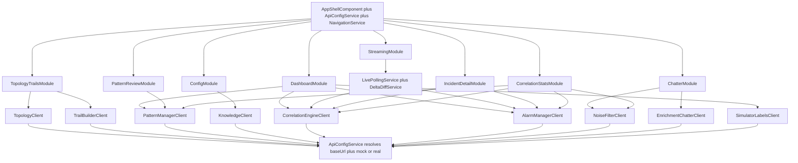
```mermaid
flowchart TD
  Shell[AppShellComponent plus ApiConfigService plus NavigationService]
  Shell --> DB[DashboardModule]
  Shell --> ST[StreamingModule]
  Shell --> ID[IncidentDetailModule]
  Shell --> TT[TopologyTrailsModule]
  Shell --> PR[PatternReviewModule]
  Shell --> CFG[ConfigModule]
  Shell --> CS[CorrelationStatsModule]
  Shell --> CH[ChatterModule]
  DB --> CEC[CorrelationEngineClient]
  DB --> PMC[PatternManagerClient]
  DB --> AMC[AlarmManagerClient]
  DB --> SLC[SimulatorLabelsClient]
  CH --> NFC[NoiseFilterClient]
  CH --> ECC[EnrichmentChatterClient]
  ST --> LPS[LivePollingService plus DeltaDiffService]
  LPS --> AMC
  LPS --> CEC
  ID --> CEC
  ID --> AMC
  TT --> TC[TopologyClient]
  TT --> TBC[TrailBuilderClient]
  PR --> PMC
  CFG --> KC[KnowledgeClient]
  CS --> CEC
  CS --> AMC
  CS --> PMC
  CS --> NFC
  TC --> Resolve[ApiConfigService resolves baseUrl plus mock or real]
  TBC --> Resolve
  PMC --> Resolve
  KC --> Resolve
  CEC --> Resolve
  AMC --> Resolve
  NFC --> Resolve
  ECC --> Resolve
  SLC --> Resolve
```

## Data model / DB schema

**N/A — no owned store.** The web-ui is a stateless SPA per spec (Data owned: none). It holds
no persistent store and caches no domain data beyond in-memory session state (the streaming
view's last-poll snapshot for delta computation is in-memory only and is discarded on navigate-
away). Below are the **client-side view-models** (TypeScript types) the UI projects from
collaborator API responses. **Field names are now aligned to each producer's FROZEN OpenAPI 3.1
shape** (closing gaps P1-G7/G8/G9/G10, P2-GAP-06/07/08, P3-G3 on the consumer side); the producer's
published `openapi.json` is the single source of truth and the `openapi-typescript`-generated
models match these exactly.

**Layer derivation (P1-G9):** `NodeDto` has **no `layer` field**; web-ui derives the logical layer
from `objectType` with a documented mapping. MVP Core IP mapping: `FiberSpan`/`OpticalLine` →
`fiber`; `Port`/`Interface` → `IP`; `Node`/`Router`/`IGPAdjacency` → `IGP`; `LSP` → `LSP`;
`Service`/`ServiceEndpoint` → `service`. The mapping table lives in `LayerMapper` (a pure function,
`objectType → layer`); an unmapped `objectType` falls back to a generic `other` layer and is still
rendered (never dropped). The `LayerToggleComponent` filters on this derived layer. The same
derivation labels each `EdgeDto` by the `relation`/endpoint objectType for the layer toggle.


```mermaid
classDiagram
  class SiteListDtoVM {
    string domain
    string snapshotId
    number count
    SiteDtoArray sites
  }
  class SiteDtoVM {
    string siteId
    string name
    number latitude
    number longitude
    string region
  }
  class SiteObjectsDtoVM {
    string siteId
    string domain
    string snapshotId
    number nodeCount
    number edgeCount
    NodeDtoArray nodes
    EdgeDtoArray edges
  }
  class NodeDtoVM {
    string managedObjectId
    string objectType
    string domain
    string snapshotId
    string name
    AttributeMap attributes
    string derivedLayer
  }
  class EdgeDtoVM {
    string edgeId
    string from
    string to
    string relation
    string domain
    string snapshotId
    AttributeMap attributes
    string derivedLayer
  }
  class TrailsForObjectVM {
    string managedObjectId
    string domain
    StringArray trailIds
  }
  class TrailDetailVM {
    string trailId
    string domain
    string snapshotId
    TrailMemberArray members
    number memberCount
  }
  class TrailMemberVM {
    string managedObjectId
    string objectType
  }
  class PatternViewVM {
    string patternId
    string trailId
    SequenceElementArray sequence
    string rootCauseAlarmType
    number support
    number confidence
    number lift
    TimingVM timing
    SessionWindowVM sessionWindow
    string codebookMatchId
    string reconcileStatus
    boolean structurallyValidated
    string structuralValidationReason
    number instanceCount
    InstanceArray supportingInstances
    string lifecycle
    string domain
    string createdAt
  }
  class SequenceElementVM {
    string alarmType
    boolean optional
  }
  class SessionWindowVM {
    number windowMs
    string type
  }
  class PatternPageVM {
    PatternViewArray items
    number total
    number limit
    number offset
  }
  class PatternEditVM {
    SequenceFlagArray sequenceFlags
    string reviewer
    string notes
  }
  class SequenceFlagVM {
    number index
    boolean optional
  }
  class IncidentVM {
    string incidentId
    string rootCauseAlarmId
    string rootCauseAlarmType
    StringArray childAlarmIds
    string matchedPatternId
    string matchedCodebookId
    number confidence
    string trailId
    string createdAt
  }
  class IncidentPageVM {
    IncidentArray items
    number total
    number limit
    number offset
  }
  class StatsVM {
    number totalAlarmsProcessed
    number correlatedAlarmCount
    number totalIncidentsCreated
    number patternMatchCount
    number codebookMatchCount
    number alarmReductionRatio
    number autoCorrelationPct
    number rcaAccuracy
  }
  class ObservedChatterSignatureVM {
    string managedObjectId
    string alarmType
    string eventType
    string trailId
    number occurrenceCount
    string firstSeen
    string lastSeen
  }
  class ObservedChatterPageVM {
    ObservedChatterArray items
    number total
    number limit
    number offset
  }
  class EnrichmentChatterEntryVM {
    string managedObjectId
    string eventType
  }
  class EnrichmentChatterListVM {
    string source
    EnrichmentChatterArray chatterList
  }
  class ChatterJoinRowVM {
    ObservedChatterSignatureVM observed
    boolean alreadyPromoted
    string status
  }
  class GroundTruthLabelVM {
    string scenarioId
    string scenarioType
    string rootCause
    string rootCauseManagedObjectId
    string rootCauseAlarmType
    StringArray children
  }
  class AlarmSummaryVM {
    string alarmId
    string managedObjectId
    string eventType
    string perceivedSeverity
    string raisedAt
    string lifecycleState
    string role
    string incidentId
    StringArray trailIds
  }
  class AlarmDetailVM {
    string alarmId
    string managedObjectId
    string lifecycleState
    string role
    string incidentId
    StringArray trailIds
    TransitionArray transitions
  }
  class AlarmPageVM {
    AlarmSummaryArray items
    number total
    number limit
    number offset
  }
  class ModelParamsRecordVM {
    string domain
    string recordType
    string recordId
    string version
    boolean isCurrent
    ModelParamsPayload payload
  }
  class ModelParamsPayload {
    string paramSet
    ModelParamArray params
  }
  class ModelParamVM {
    string key
    string type
    any value
    number min
    number max
    string unit
  }
  class RunStatsVM {
    string runId
    string runTimestamp
    string trailId
    string snapshotId
    string domain
    string windowStart
    string windowEnd
    DbscanParams params
    number alarmsIn
    number clustersFormed
    number alarmsKept
    number alarmsDropped
    number noiseRatio
    number stormReductionRatio
  }
  SiteListDtoVM "1" --> "many" SiteDtoVM : sites
  SiteDtoVM "1" --> "1" SiteObjectsDtoVM : objects-at-site
  SiteObjectsDtoVM "1" --> "many" NodeDtoVM : nodes
  SiteObjectsDtoVM "1" --> "many" EdgeDtoVM : edges
  NodeDtoVM "many" --> "many" TrailsForObjectVM : membership
  TrailDetailVM "1" --> "many" TrailMemberVM : members
  PatternPageVM "1" --> "many" PatternViewVM : items
  PatternViewVM "1" --> "many" SequenceElementVM : sequence
  PatternEditVM "1" --> "many" SequenceFlagVM : sequenceFlags
  IncidentPageVM "1" --> "many" IncidentVM : items
  AlarmPageVM "1" --> "many" AlarmSummaryVM : items
  IncidentVM "1" --> "many" AlarmSummaryVM : groups
  PatternViewVM "1" --> "many" InstanceArray : evidence
  ModelParamsRecordVM "1" --> "1" ModelParamsPayload : payload
  ModelParamsPayload "1" --> "many" ModelParamVM : params
  RunStatsVM "many" --> "1" TrailDetailVM : per-trail runs
  ObservedChatterPageVM "1" --> "many" ObservedChatterSignatureVM : items
  EnrichmentChatterListVM "1" --> "many" EnrichmentChatterEntryVM : chatterList
  ChatterJoinRowVM "1" --> "1" ObservedChatterSignatureVM : observed
  ChatterJoinRowVM "many" --> "many" EnrichmentChatterEntryVM : promoted-match
  IncidentVM "many" --> "1" GroundTruthLabelVM : rca-oracle-join
```

**Chatter view-models (FIX F-UI1).** `ObservedChatterSignatureVM` mirrors the **frozen** Noise Filter
`ObservedChatterSignature` `{ managedObjectId (nullable), alarmType, eventType, trailId (nullable),
occurrenceCount, firstSeen, lastSeen }`; the page envelope `ObservedChatterPageVM` is the same
canonical `{ items, total, limit, offset }`. `EnrichmentChatterEntryVM` `{ managedObjectId, eventType }`
mirrors Enrichment's per-source `chatterList` entry (the same key shape NF emits). `ChatterStore`
computes `ChatterJoinRowVM` per observed signature: `alreadyPromoted` is true when an Enrichment
chatter entry exists with the same `(managedObjectId, eventType)` for the selected source; `status`
is `promoted` or `candidate`. A signature with a **null** `managedObjectId` (source-level chatter) is
joined on `(null, eventType)` and rendered with a clear "source-level" label.

**RCA-accuracy view-models (FIX F-UI2).** `StatsVM` adds `correlatedAlarmCount` (raw, from CE
`/stats`), `autoCorrelationPct` (computed `correlatedAlarmCount / totalAlarmsProcessed`), and
`rcaAccuracy` (the **shown** value: eval-mode `stats.rcaAccuracy` when non-null, else the client-side
label-join fraction, else null to render N/A). `GroundTruthLabelVM` mirrors the **frozen** Simulator
`/labels` shape `{ scenarioId, scenarioType, rootCause, rootCauseManagedObjectId, rootCauseAlarmType,
children[] }`; `IncidentVM` adds `rootCauseAlarmType` (frozen CE read-API field) so the client-side
RCA join compares on the canonical `alarmType` token space (like-for-like with the label).

### Streaming delta / diff view-model

The streaming view keeps the **previous poll snapshot** and the **current poll snapshot** and
projects a per-row delta view-model. The diff is computed by `DeltaDiffService` (see Algorithm
logical flow + State management).

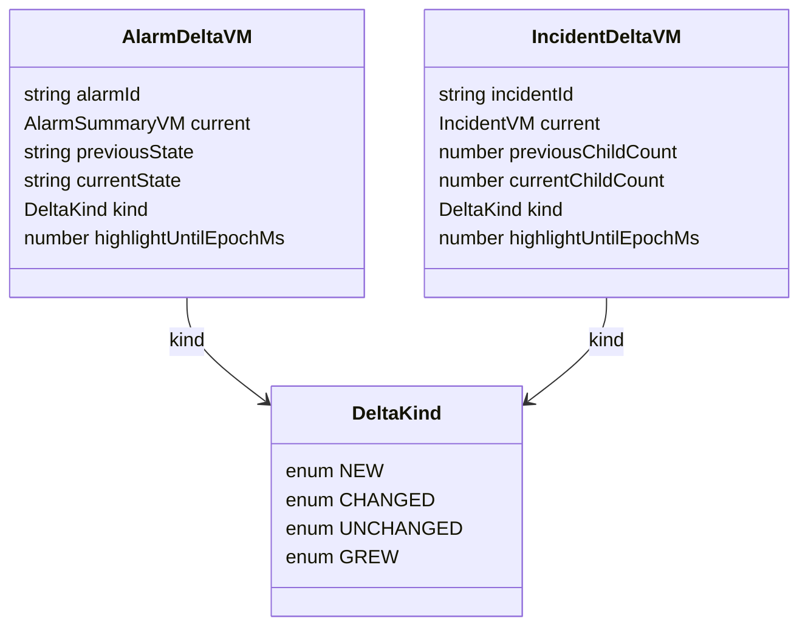
```mermaid
classDiagram
  class AlarmDeltaVM {
    string alarmId
    AlarmSummaryVM current
    string previousState
    string currentState
    DeltaKind kind
    number highlightUntilEpochMs
  }
  class IncidentDeltaVM {
    string incidentId
    IncidentVM current
    number previousChildCount
    number currentChildCount
    DeltaKind kind
    number highlightUntilEpochMs
  }
  class DeltaKind {
    enum NEW
    enum CHANGED
    enum UNCHANGED
    enum GREW
  }
  AlarmDeltaVM --> DeltaKind : kind
  IncidentDeltaVM --> DeltaKind : kind
```

Notes:
- The diff runs over the **`.items`** array of each frozen canonical page envelope: `AlarmManager`
  returns `{ items:[AlarmSummary], total, limit, offset }`, `CorrelationEngine` returns
  `{ items:[IncidentVM], total, limit, offset }`. `DeltaDiffService` reads `.items` from both and keys
  by `alarmId`/`incidentId` (it never assumes a bare array).
- `DeltaKind` for alarms: `NEW` (alarmId absent from previous snapshot), `CHANGED` (alarmId
  present in both but **`lifecycleState`** differs — covers `open` to `in-progress`, `in-progress`
  to `correlated`, a revert back to `open` (`reverted-open` is modelled on the producer side as a
  transition back to `open`), and to `cleared`), `UNCHANGED` (present in both, `lifecycleState`
  equal).
- `DeltaKind` for incidents: `NEW` (incidentId absent from previous), `GREW` (`childAlarmIds`
  length increased), `UNCHANGED` otherwise.
- `highlightUntilEpochMs` drives the transient highlight CSS class; once `Date.now()` passes it,
  the row drops back to its resting style (see Accessibility — prefers-reduced-motion).
- `attributes` is rendered as an open key/value map; well-known keys (`vendor`, `model`,
  `equipmentType`, `role`, `capacity` on nodes; `linkType`, `capacity`, `protectionRole` on
  edges) get friendly labels, all other keys render as generic rows. The UI never validates the
  attribute schema (Knowledge Service owns the catalogue).
- `alarmReductionRatio` is **computed client-side** as `totalAlarmsProcessed` divided by
  `totalIncidentsCreated` from the Correlation Engine `GET /stats` raw counts.
- **`autoCorrelationPct` (FIX F-UI2)** is **computed client-side** as `correlatedAlarmCount` divided
  by `totalAlarmsProcessed` from the same `GET /stats` response (the CE froze `correlatedAlarmCount`
  for exactly this; the ~60% target). It is **distinct from** `alarmReductionRatio` and must not be
  conflated with it (reduction is alarms/incidents; auto-correlation is the correlated fraction).
  Guarded for `totalAlarmsProcessed` equal to 0 (then N/A).
- **`rcaAccuracy` (FIX F-UI2)** is now **shown, not "evaluated offline"**. `RcaAccuracyService`
  resolves it in priority order: (1) **eval-mode** — `stats.rcaAccuracy` from CE `GET /stats` when
  the engine runs with the Simulator labels oracle wired (`RCA_EVAL` profile) and the field is
  non-null; (2) **demo client-side join** — fetch `SimulatorLabelsClient.listLabels()` and, for each
  incident from `GET /incidents`, compare the incident's `rootCauseAlarmType` (and/or resolve
  `rootCauseAlarmId`) to the scenario label's `rootCauseAlarmType` on the canonical `alarmType` token
  space, accuracy = matches / total incidents; (3) **N/A** — in production with no ground truth and
  null `stats.rcaAccuracy`, render "N/A (no ground truth)". The gating is explicit: production with
  no oracle shows N/A; eval/demo shows the number — the strongest power metric is VISIBLE, never
  fabricated.
- `stormReductionRatio` on `RunStatsVM` is computed client-side as `alarmsIn / clustersFormed`
  when the Noise Filter API does not return it directly (guarded for `clustersFormed` equal to 0).
- `domain` on `RunStatsVM` may be absent/null in some rows; the UI handles it gracefully.

## Event handling

- **Consumers:** **none.** The web-ui never subscribes to Kafka topics directly (spec: Consumes
  Kafka — none). All data arrives over collaborator REST APIs. The "real-time" streaming view is
  **client-side polling of existing REST endpoints**, not a Kafka consumer and not a WebSocket
  or SSE connection.
- **Producers:** **none.** The web-ui never publishes to Kafka. The architecture row "produces
  `patterns.approved` (via API)" is realized by `POST /patterns/{id}/approve` to the Pattern
  Manager, which owns the lifecycle transition and is the sole emitter of `PatternApprovedEvent`.

## API contracts / API schema

**Exposed:** N/A — no HTTP surface other than the static-asset server returning HTTP 200 on `/`
for liveness. The web-ui publishes **no** OpenAPI document (spec: APIs exposed — none).

**Consumed** (nine integration points; each typed client built from the producer published
**FROZEN** OpenAPI 3.1; no hard-coded URLs). Request/response shapes below are **aligned to each
producer's frozen `openapi.json`** — the producer is the single source of truth and the
`openapi-typescript` models match these exactly.

### Topology Service (P1) — FROZEN (P1-G7/G8/G9)
- `GET /topology/sites?domain=core-ip&snapshotId=current` (`listSites`) returns `200`
  **`SiteListDto { domain, snapshotId, count, sites: SiteDto[] }`** where
  **`SiteDto { siteId, name, latitude, longitude, region }`** (flat per-site geo). The geo map
  reads the `sites[]` array (P1-G7) — one marker per `SiteDto`; `siteId` is the Site node's
  `managedObjectId`.
- `GET /topology/sites/{siteId}/objects?domain=core-ip` (`objectsAtSite`) returns `200`
  **`SiteObjectsDto { siteId, domain, snapshotId, nodeCount, edgeCount, nodes: NodeDto[],
  edges: EdgeDto[] }`** (P1-G8). The Cytoscape site graph is built from **BOTH `nodes` and
  `edges`** of this single response — the edges come from this response (no per-node neighbour
  fan-out). `EdgeDto = { edgeId, from, to, relation, domain, attributes, snapshotId }`.
- `GET /topology/nodes/{managedObjectId}` (`resolve`) returns `200`
  **`NodeDto { managedObjectId, objectType, domain, snapshotId, name?, attributes }`** (P1-G9).
  **No separate `layer` field** — web-ui derives the layer from `objectType` via `LayerMapper`
  (`layer == objectType`, mapped to the logical fiber/IP/IGP/LSP/service layer; see Data model).
- `GET /topology/nodes/{managedObjectId}/neighbors` returns `200 NeighborsDto { managedObjectId,
  domain, neighbors:[{ node: NodeDto, via: EdgeDto }] }` (used only for ad-hoc expansion; the site
  graph itself comes from `objectsAtSite`).
- Errors: `404` (unknown object/site) shows empty-state in panel; `5xx` shows error banner.

### Trail Builder (P1) — FROZEN (P1-G4/G10)
- `GET /trails?snapshotId=X&domain=core-ip` (`listTrails`) returns `200`
  **`ListTrailsResponse { snapshotId, domain, count, trails: TrailSummary[] }`** — read `trails[]`
  for cluster overlays.
- `GET /trails/{trailId}` (`getTrail`) returns `200`
  **`TrailDetail { trailId, domain, snapshotId, members: TrailMember[], memberCount, igpArea?,
  srlgGroup? }`** where **`TrailMember { managedObjectId, objectType }`** (P1-G4; `snapshotId`
  guaranteed present, P2-GAP-09). web-ui distinguishes `Interface`/`Port`/`IPLink`/`Node` from the
  member `objectType` without re-parsing.
- `GET /trails/by-object?managedObjectId=X&domain=core-ip` (`getTrailsForObject`) returns `200`
  **`TrailsForObjectResponse { managedObjectId, domain, trailIds: string[] }`** (P1-G10 — the path
  is the frozen `GET /trails/by-object`, not a `GET /trails` query-param variant; P1-G4 — the
  response is `{ managedObjectId, domain, trailIds }`, not a bare `[{trailId}]`). On device select,
  the highlight set is `trailIds[]`.

### Pattern Manager (P2 + P3 active-patterns + dashboard active-pattern count) — FROZEN (P2-GAP-06/08, P3-G1)
- `GET /patterns?lifecycle=draft|approved|deprecated&limit=&offset=&sort=` returns `200`
  **`PatternPage { items: PatternView[], total, limit, offset }`** (the **envelope**, not a bare
  array; P2-GAP-08). web-ui renders `items[]` and uses `total`/`limit`/`offset` for review-progress
  and paging.
- `PatternView` (canonical item) = `{ patternId, trailId, sequence: SequenceElement[]
  (each {alarmType, optional}), rootCauseAlarmType (alarmType-vocabulary token, P2-GAP-04/P3-G1),
  support, confidence, lift, timing (open object), sessionWindow {windowMs, type}, codebookMatchId|null,
  reconcileStatus, structurallyValidated, structuralValidationReason|null, instanceCount,
  supportingInstances, lifecycle, domain|null, createdAt, updatedAt }`. The XAI view surfaces
  `trailId`, `rootCauseAlarmType`, `sessionWindow`, and `structurallyValidated` +
  `structuralValidationReason`.
- `GET /patterns/{patternId}` returns `200 PatternView` (full detail) or `404`.
- `POST /patterns/{patternId}/approve` body `{ decision, reviewer, notes? }` (decision =
  approve or reject) returns `200 PatternView` (updated lifecycle).
- `PATCH /patterns/{patternId}` body the **frozen `PatternEdit { sequenceFlags: [{ index, optional }],
  reviewer, notes? }`** (per-position optional markers; P2-GAP-06) returns `200 PatternView`
  (edited; `optional` reflected per `index`; `sessionWindow` is read-only/unchanged). Allowed only
  when `lifecycle` is `draft`; otherwise `409` (not draft) / `422` (bad `index`/missing reviewer),
  surfaced.
- The pattern "view trail" deep-link uses **`PatternView.trailId`** (P3-G1).

### Knowledge Service (P2 — config) — FROZEN (P2-GAP-07)
- `GET /domains/{domain}/model-params/{recordId}` (`getModelParams`) returns `200` the **versioned
  `modelParams` record** `{ domain, recordType, recordId, version, isCurrent, payload:{ paramSet,
  params:[{ key, type, value, min?, max?, unit? }] } }` with **real dotted keys** (`dbscan.epsilon`,
  `dbscan.minSamples`, `window.sizeSeconds`, `prefixspan.minSupport`, `prefixspan.maxPatternLength`,
  `window.adaptive.baseGapSeconds`, ...). There is **no** `/knowledge/model-params` path and **no**
  flat camelCase keys (`dbscanEps`, `sessionWindowGapSeconds`, ...) — those are removed (P2-GAP-07).
  Also `GET /domains/{domain}/model-params` to list and `.../versions/{version}` to pin.
- `PUT /domains/{domain}/model-params/{recordId}` (`updateModelParams`) body the **same versioned
  record payload** (dotted keys); returns `200` with a new immutable `version` (`isCurrent` flips —
  it does not mutate in place); `404` unknown record; `422` validation/out-of-bounds (e.g.
  `prefixspan.minSupport = 1.5`). The config form validates each param against its declared
  `min`/`max` client-side before submit.

### Correlation Engine (P3 + dashboard + streaming + incident-detail) — FROZEN (P3-G3/G4)
- `GET /incidents?trailId=X&from=Y&to=Z&matchType=W&limit=&offset=` (`listIncidents`) returns `200`
  the **canonical paginated envelope `{ items: IncidentVM[], total, limit, offset }`** (P3-G3/G4;
  `limit` default 50 max 500, `offset` default 0 — the platform-canonical envelope, **not**
  `page`/`size`). web-ui renders `items[]`. `IncidentVM = { incidentId, rootCauseAlarmId,
  rootCauseAlarmType, childAlarmIds[], matchedPatternId|null, matchedCodebookId|null, confidence,
  trailId, createdAt }`. **`rootCauseAlarmType` is the frozen CE read-API field (PR #166)** — the
  canonical `alarmType` token of the root-cause alarm, used by the dashboard's client-side RCA
  accuracy join (FIX F-UI2). Used by dashboard, streaming view, and stats module.
- `GET /incidents/{incidentId}` (`getIncident`) returns `200` a **single `IncidentVM`** (same shape
  as an `items[]` element) or `404`. **Used by the incident-detail page**; carries `rootCauseAlarmId`,
  `childAlarmIds[]`, `matchedPatternId`/`matchedCodebookId`, `confidence`, `trailId` — all fields
  the incident-detail page needs (no contract change).
- **`matchedCodebookId` is the codebook artifact id** on codebook-decode incidents (display/label
  it as the matched codebook id; `matchedPatternId` is the matched pattern id).
- `GET /stats` returns `200 { totalAlarmsProcessed, correlatedAlarmCount, totalIncidentsCreated,
  patternMatchCount, codebookMatchCount, confidenceDistribution, rcaAccuracy|null }` (frozen, PR #166).
  - **`correlatedAlarmCount` (new, PR #166)** — distinct alarms placed into a correlated incident;
    the UI computes **auto-correlation% = `correlatedAlarmCount / totalAlarmsProcessed`** (FIX F-UI2,
    the ~60% KPI), distinct from `alarmReductionRatio`.
  - **`rcaAccuracy` (new, eval-mode only, PR #166)** — populated server-side only when the engine
    runs with the Simulator labels oracle wired (`RCA_EVAL` profile); **null in production**. When
    null, the UI falls back to the client-side `/labels` join (FIX F-UI2). The UI still computes
    `alarmReductionRatio` client-side from the raw counts.

### Alarm Manager (P3 + streaming + incident-detail) — FROZEN (P3-G3)
- `GET /alarms?state=open|in-progress|correlated|cleared&trailId=X&incidentId=Y&from=A&to=B&limit=&offset=`
  (`listAlarms`) returns `200` the **canonical paginated envelope `{ items: AlarmSummary[], total,
  limit, offset }`** (P3-G3; `limit` default 50 max 500, `offset` default 0 request params — the
  platform-canonical envelope, **not** `page`/`size`). web-ui renders `items[]`.
  `AlarmSummary = { alarmId, managedObjectId, eventType, perceivedSeverity, raisedAt, lifecycleState
  (open/in-progress/correlated/cleared; `reverted-open` modelled as a transition back to `open`),
  role (root-cause/child/none), incidentId, trailIds }`. Used by the streaming view and the
  alarm-lifecycle view.
- `GET /alarms/{alarmId}` (`getAlarm`) returns `200 AlarmDetail` — all `AlarmEvent` fields plus
  `lifecycleState`, `role`, `incidentId`, and ordered `transitions:[{ toState, reason, source,
  changedAt, occurredAt }]` (ascending `occurredAt`, UTC). Used by the incident-detail page per
  member alarm.

### Noise Filter (P2 — run-stats / learning sub-view + observed-chatter for FIX F-UI1)
- `GET /api/v1/run-stats?trailId=X&from=Y&to=Z&limit=L&offset=O` returns `200 RunStatsPage`
  `{ items: [RunStatsRow], total, limit, offset }`, newest first. Each `RunStatsRow`:
  `runId`, `runTimestamp`, `trailId`, `snapshotId`, `domain` (optional/null), `windowStart`,
  `windowEnd`, `eps`, `minSamples`, `windowSize`, `algorithm`, `alarmsIn`, `clustersFormed`,
  `alarmsKept`, `alarmsDropped`, `noiseRatio`. The UI computes the storm-reduction ratio
  (`alarmsIn / clustersFormed`) when not directly returned.
- `GET /api/v1/run-stats/{runId}` returns `200 RunStatsRow` or `404`.
- **`GET /api/v1/observed-chatter?alarmType=&trailId=&minOccurrence=&limit=&offset=`** (`listObservedChatter`,
  FIX F-UI1; frozen, PR #165) returns `200 ObservedChatterPage` `{ items: ObservedChatterSignature[],
  total, limit, offset }`, **ranked by `occurrenceCount` descending** (most-frequent learned noise
  first). Each `ObservedChatterSignature = { managedObjectId|null, alarmType, eventType, trailId|null,
  occurrenceCount, firstSeen, lastSeen }`. These are the **candidate** chatter entries the operator
  reviews and promotes. **Read-only** on the Noise Filter side — NF writes signatures only from its own
  P2 clustering; a non-GET returns `405`. The chatter-management page reads this, ranked, as the left
  pane. `minOccurrence` lets the operator hide rarely-seen noise.
- Validation errors (bad `limit`, malformed `from`/`to`) return `422`; surfaced as an error
  banner in the noise-stats / chatter sub-view. Exact paths/params confirmed against the Noise Filter
  `openapi.json` (run-stats open question #7 resolved; observed-chatter shape is frozen per PR #165).

### Enrichment chatter edit API (FIX F-UI1 — **promotion target**; FLAGGED — see dependency note)
> Built against Enrichment's **published chatter `openapi.json`** when it lands (producer branch
> `design/enrichment-chatter-api`, not yet published at time of writing). The shapes below are the
> **expected** contract, pinned to Enrichment's existing per-source `chatterList` entry shape
> `{ managedObjectId, eventType }` (the same key NF emits). No web-ui-side contract is invented; on
> publication the `EnrichmentChatterClient` is regenerated from the producer's `openapi.json` (a
> collaborator contract change = architecture.md update + human approval).

- `GET /api/v1/sources/{source}/chatter` (`listChatter`) returns `200`
  `{ source, chatterList: [{ managedObjectId, eventType }] }` — the current known-chatter list for the
  named source/ruleset (the right pane). `source` is the Enrichment ruleset selector (the envelope
  `source` value, e.g. `nms-alpha`, `vendor-beta`, `default`).
- `POST /api/v1/sources/{source}/chatter` (`addChatter`) body `{ managedObjectId|null, eventType }`
  returns `200`/`201` with the updated list — **promotes** an observed signature into the live
  per-source chatter list. Idempotent on `(managedObjectId, eventType)` (re-adding an existing entry
  is a no-op, surfaced as already-promoted). A `409`/`422` (race / bad entry) is surfaced as a
  structured error.
- `DELETE /api/v1/sources/{source}/chatter` (`removeChatter`) body/query `{ managedObjectId|null,
  eventType }` returns `200`/`204` with the updated list — **demotes** (removes) a chatter entry.
- The promotion maps the NF observed signature's `(managedObjectId, eventType)` onto the Enrichment
  entry (the `alarmType`/`trailId`/counts on the NF signature are review context only; Enrichment's
  chatter key is `(managedObjectId, eventType)`). A null-`managedObjectId` source-level signature
  promotes as `{ managedObjectId: null, eventType }`.

### Simulator labels (FIX F-UI2 — RCA-accuracy ground-truth oracle, demo/eval only)
- `GET /labels?scenarioId=` (`listLabels`; frozen Simulator shape) returns `200 GroundTruthLabel[]`
  where `GroundTruthLabel = { scenarioId, scenarioType, rootCause, rootCauseManagedObjectId,
  rootCauseAlarmType, children[] }`; `GET /labels/{scenarioId}` returns one or `404`. Read in the
  **demo/eval** path only (when `RCA_LABELS_ENABLED` / the labels base URL is configured) to compute
  RCA accuracy client-side by comparing each incident's `rootCauseAlarmType` to the scenario label's
  `rootCauseAlarmType` on the canonical `alarmType` token space. In production this client is unused
  (RCA accuracy shows N/A unless the CE eval-mode `rcaAccuracy` is non-null). Read-only; no write.

**OpenAPI usage:** the web-ui generates TypeScript models from each producer checked-in
**FROZEN** `openapi.json` (`openapi-typescript`) and regenerates on a collaborator contract
change (a collaborator API change is a contract change — architecture.md update plus human
approval before the client is updated, per the spec Non-functional "API contract"). The shapes
above are now aligned to the producers' frozen contracts; the earlier design's open questions
#1-#7 on these shapes are resolved by the producer freezes (Topology P1-G7/G8/G9, Trail Builder
P1-G4/G10, Knowledge P2-GAP-07, Pattern Manager P2-GAP-06/08 + P3-G1, Correlation Engine P3-G3/G4,
Alarm Manager P3-G3).

## Integration points (mock vs. real)

Resolution is by Angular environment config — never a hard-coded URL. `ApiConfigService` reads a
per-service base URL and a `mock|real` toggle. Under `mock`, `MockBackendProvider` registers MSW
handlers generated from the producer OpenAPI; under `real`, calls go to the Compose address.

| Integration point | Client | Config key (base URL) | Mock (unit) | Real (integration) |
|---|---|---|---|---|
| Topology site query + objects-at-site + graph | `TopologyClient` | `TOPOLOGY_API_BASE_URL` | MSW from Topology `openapi.json` | Topology Service (Compose) |
| Trail Builder trail-viz | `TrailBuilderClient` | `TRAIL_BUILDER_API_BASE_URL` | MSW from Trail Builder `openapi.json` | Trail Builder (Compose) |
| Pattern Manager read | `PatternManagerClient` | `PATTERN_MANAGER_API_BASE_URL` | MSW from Pattern Manager `openapi.json` | Pattern Manager (Compose) |
| Pattern Manager approval-intent | `PatternManagerClient` | `PATTERN_MANAGER_API_BASE_URL` | MSW handler | Pattern Manager (Compose) |
| Pattern Manager pattern-edit (PATCH) | `PatternManagerClient` | `PATTERN_MANAGER_API_BASE_URL` | MSW handler | Pattern Manager (Compose) |
| Knowledge model-params | `KnowledgeClient` | `KNOWLEDGE_API_BASE_URL` | MSW from Knowledge `openapi.json` | Knowledge Service (Compose) |
| Correlation Engine incident/stats (+single incident) | `CorrelationEngineClient` | `CORRELATION_ENGINE_API_BASE_URL` | MSW from Correlation `openapi.json` | Correlation Engine (Compose) |
| Alarm Manager lifecycle query (+single alarm) | `AlarmManagerClient` | `ALARM_MANAGER_API_BASE_URL` | MSW from Alarm Manager `openapi.json` | Alarm Manager (Compose) |
| Noise Filter run-stats + **observed-chatter** read | `NoiseFilterClient` | `NOISE_FILTER_API_BASE_URL` | MSW from Noise Filter `openapi.json` | Noise Filter (Compose) |
| **Enrichment chatter edit** (GET/ADD/REMOVE) — FIX F-UI1 | `EnrichmentChatterClient` | `ENRICHMENT_CHATTER_API_BASE_URL` | MSW from Enrichment chatter `openapi.json` (when published; flagged) | Enrichment (Compose) |
| **Simulator labels** (RCA oracle, demo/eval) — FIX F-UI2 | `SimulatorLabelsClient` | `SIMULATOR_LABELS_API_BASE_URL` | MSW from Simulator `openapi.json` | Simulator (Compose, demo/eval profile) |

Pattern Manager read/approval/edit share one base URL but are three logical integration points.
With FIX F-UI1/F-UI2 there are now **eleven** integration points (the prior nine — Topology, Trail
Builder, Pattern read, Pattern approval, Knowledge, Correlation Engine, Alarm Manager, Noise Filter,
Pattern edit sharing the Pattern Manager URL — plus the **Enrichment chatter edit** and **Simulator
labels** clients). `INTEGRATION_MODE=mock|real`, the per-service base URLs (now incl.
`ENRICHMENT_CHATTER_API_BASE_URL` and `SIMULATOR_LABELS_API_BASE_URL`), and
`STREAMING_REFRESH_INTERVAL_MS` are injected into `environment.ts` from Docker Compose
environment variables at build/serve time. The Simulator-labels integration is **demo/eval-only**:
under `INTEGRATION_MODE=real` in production it may be unconfigured, and RCA accuracy then resolves to
N/A (or the CE eval-mode value) — its absence is not an error.

## State management

Signal-based injectable stores (no NgRx). Each feature has a store exposing `signal`s and
`computed`s; components are `OnPush` and read signals directly.

### LivePollingService (streaming)

The streaming poll loop is the only timer in the app. Design:

- **Interval source:** `intervalMs` signal, initialized from `STREAMING_REFRESH_INTERVAL_MS`
  (environment; default `3000`). The operator can change it at runtime via the
  `IntervalControlComponent`; writing the signal restarts the timer with the new period.
- **Timer:** rxjs `timer(0, intervalMs())` bridged to the poll, **or** a self-rescheduling
  `setTimeout`/`effect` loop keyed off `intervalMs` and `autoRefresh`. The first tick fires
  immediately, then every `intervalMs`. A `computed`/`effect` reacts to `autoRefresh` and
  `intervalMs` changes: when `autoRefresh()` is `false` (paused) the loop is torn down; when it
  flips back to `true` (resume) the loop restarts at the configured interval.
- **Per tick:** call `AlarmManagerClient.listAlarms()` and `CorrelationEngineClient.listIncidents()`
  in parallel. **Both return the frozen canonical page envelope** (AM `{items, total, limit,
  offset}`, CE `{items, total, limit, offset}`); the service takes each response's **`.items`**
  array as the snapshot. On success: pass `(previousSnapshot.items, newSnapshot.items)` to
  `DeltaDiffService`, write the resulting `alarmDeltas`/`incidentDeltas` signals and the new
  snapshots, and set `lastUpdated = now`. On failure: set `pollError` (stale-data indicator), keep
  the previous snapshot, do not crash; the next tick retries.
- **No overlap:** a tick that is still in flight when the next would fire is skipped (a
  `pollInFlight` guard) so slow responses do not stack.
- **Pause/resume:** `autoRefresh` signal toggled by the pause/resume button. While paused, **no**
  HTTP call is made to Alarm Manager or Correlation Engine.
- **Cleanup:** the loop is torn down in the component's `ngOnDestroy`/`DestroyRef` so navigating
  away stops polling. The last snapshot is discarded (not persisted across sessions).

### DeltaDiffService

Pure function, no I/O. It receives the **`.items`** arrays (already unwrapped from the
`{items, total, limit, offset}` page envelopes by `LivePollingService`), keys the previous and new
arrays by `alarmId`/`incidentId` into `Map`s, then for each current item computes a `DeltaKind`
(alarm change keyed off `lifecycleState`; see Algorithm logical flow). It produces a new array of
delta view-models; only the changed/new rows carry a non-expired `highlightUntilEpochMs`. This
keeps re-render scoped: the template `@for` tracks by `alarmId`/`incidentId`, so Angular updates
only changed rows (spec performance: no full-list re-render per poll). The diff is **agnostic to
the envelope** — it never assumes a bare top-level array.

### Other stores

- `DashboardStore`: parallel reads on load; each KPI is a `computed` over its source signal,
  degrading to "N/A"/empty when the source is zero/absent. No timer (one-shot load + manual
  refresh button). **FIX F-UI2:** `autoCorrelationPct` is a `computed` over `stats`
  (`correlatedAlarmCount / totalAlarmsProcessed`, guarded for 0); `rcaAccuracy` is a `computed` over
  `RcaAccuracyService` (eval-mode `stats.rcaAccuracy` else client-side label-join else N/A).
- `RcaAccuracyService` (FIX F-UI2, shared by `DashboardStore` and `StatsStore`): exposes a
  `computed`/`resource` `shownRcaAccuracy` resolving in priority order (eval-mode `stats.rcaAccuracy`
  to client-side `/labels` join to N/A). When the labels client is unconfigured (production), it
  short-circuits to the eval-mode value or N/A — no failed request. The label-join is a pure function
  over `incidents.items[]` (`rootCauseAlarmType`) and `GroundTruthLabel[]` (`rootCauseAlarmType`).
- `ChatterStore` (FIX F-UI1): on entering `/chatter`, loads `NoiseFilterClient.listObservedChatter()`
  (ranked) and `EnrichmentChatterClient.listChatter(selectedSource)` in parallel; `joinView` is a
  `computed` marking each observed signature `promoted`/`candidate` by `(managedObjectId, eventType)`
  match against the Enrichment list. `promote(sig)` calls `addChatter` then re-reads the Enrichment
  list; `remove(entry)` calls `removeChatter` then re-reads; `pendingPromotion` disables the row
  action while a write is in flight (double-submit guard). Changing `selectedSource` re-reads the
  Enrichment list and recomputes `joinView` (observed signatures are source-independent on the NF
  side; the join is per selected source). No timer (one-shot reads + manual refresh + post-write
  re-read).
- `IncidentDetailStore`: load incident by route param, then fan out member-alarm reads.
- `StatsStore`, `TopologyTrailsStore`, `PatternStore`, `ConfigStore`: one-shot reads + filter
  signals (carried forward from the prior design).

## Key flows (sequence / data-flow diagrams)

### Flow 1 — Real-time streaming (P3): poll, diff, animate deltas

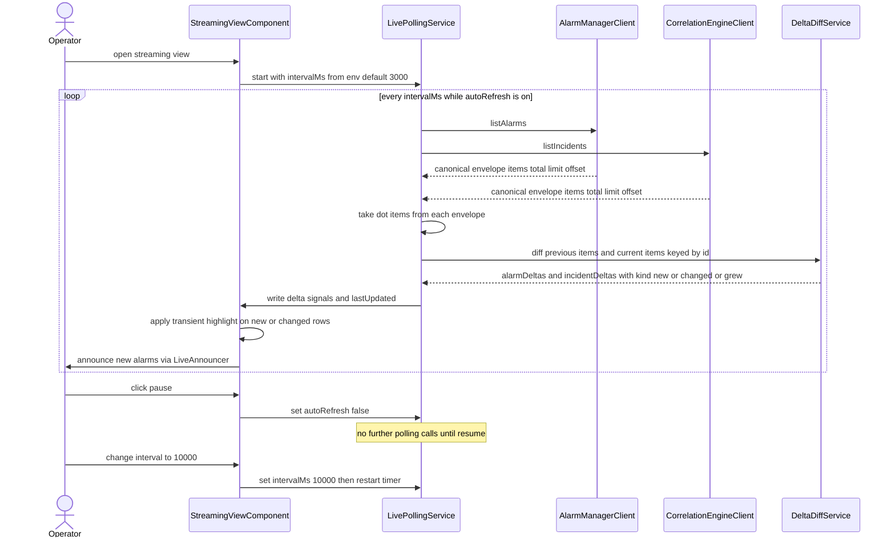
```mermaid
sequenceDiagram
  actor Operator
  participant View as StreamingViewComponent
  participant LPS as LivePollingService
  participant AMC as AlarmManagerClient
  participant CEC as CorrelationEngineClient
  participant Diff as DeltaDiffService
  Operator->>View: open streaming view
  View->>LPS: start with intervalMs from env default 3000
  loop every intervalMs while autoRefresh is on
    LPS->>AMC: listAlarms
    LPS->>CEC: listIncidents
    AMC-->>LPS: canonical envelope items total limit offset
    CEC-->>LPS: canonical envelope items total limit offset
    LPS->>LPS: take dot items from each envelope
    LPS->>Diff: diff previous items and current items keyed by id
    Diff-->>LPS: alarmDeltas and incidentDeltas with kind new or changed or grew
    LPS->>View: write delta signals and lastUpdated
    View->>View: apply transient highlight on new or changed rows
    View->>Operator: announce new alarms via LiveAnnouncer
  end
  Operator->>View: click pause
  View->>LPS: set autoRefresh false
  Note over LPS: no further polling calls until resume
  Operator->>View: change interval to 10000
  View->>LPS: set intervalMs 10000 then restart timer
```

### Flow 2 — Landing dashboard (default route): parallel KPI load

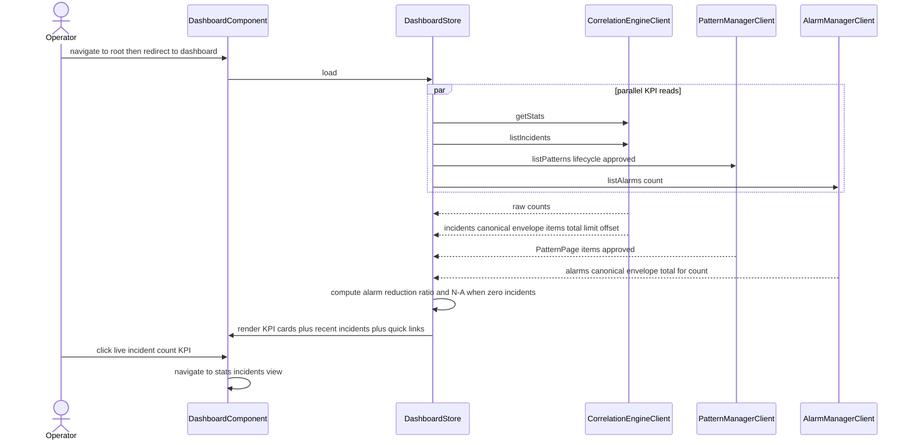
```mermaid
sequenceDiagram
  actor Operator
  participant Dash as DashboardComponent
  participant Store as DashboardStore
  participant CEC as CorrelationEngineClient
  participant PMC as PatternManagerClient
  participant AMC as AlarmManagerClient
  Operator->>Dash: navigate to root then redirect to dashboard
  Dash->>Store: load
  par parallel KPI reads
    Store->>CEC: getStats
    Store->>CEC: listIncidents
    Store->>PMC: listPatterns lifecycle approved
    Store->>AMC: listAlarms count
  end
  CEC-->>Store: raw counts
  CEC-->>Store: incidents canonical envelope items total limit offset
  PMC-->>Store: PatternPage items approved
  AMC-->>Store: alarms canonical envelope total for count
  Store->>Store: compute alarm reduction ratio and N-A when zero incidents
  Store->>Dash: render KPI cards plus recent incidents plus quick links
  Operator->>Dash: click live incident count KPI
  Dash->>Dash: navigate to stats incidents view
```

### Flow 3 — Incident-detail drill-down: incident plus member alarms

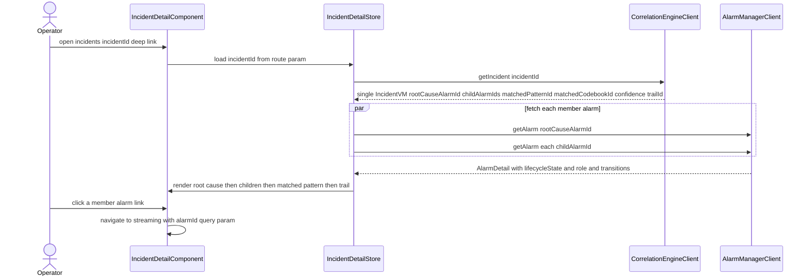
```mermaid
sequenceDiagram
  actor Operator
  participant Detail as IncidentDetailComponent
  participant Store as IncidentDetailStore
  participant CEC as CorrelationEngineClient
  participant AMC as AlarmManagerClient
  Operator->>Detail: open incidents incidentId deep link
  Detail->>Store: load incidentId from route param
  Store->>CEC: getIncident incidentId
  CEC-->>Store: single IncidentVM rootCauseAlarmId childAlarmIds matchedPatternId matchedCodebookId confidence trailId
  par fetch each member alarm
    Store->>AMC: getAlarm rootCauseAlarmId
    Store->>AMC: getAlarm each childAlarmId
  end
  AMC-->>Store: AlarmDetail with lifecycleState and role and transitions
  Store->>Detail: render root cause then children then matched pattern then trail
  Operator->>Detail: click a member alarm link
  Detail->>Detail: navigate to streaming with alarmId query param
```

### Flow 4 — Cross-navigation deep-link: pattern to trail, incident to detail

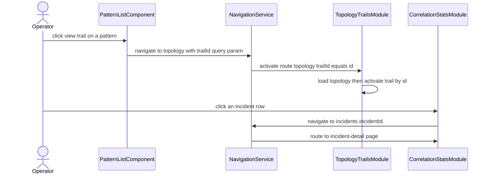
```mermaid
sequenceDiagram
  actor Operator
  participant Pat as PatternListComponent
  participant Nav as NavigationService
  participant Topo as TopologyTrailsModule
  participant Stats as CorrelationStatsModule
  Operator->>Pat: click view trail on a pattern
  Pat->>Nav: navigate to topology with trailId query param
  Nav->>Topo: activate route topology trailId equals id
  Topo->>Topo: load topology then activate trail by id
  Operator->>Stats: click an incident row
  Stats->>Nav: navigate to incidents incidentId
  Nav->>Stats: route to incident-detail page
```

### Flow 5 — Topology & trails (P1): geo map to site graph to trail highlight

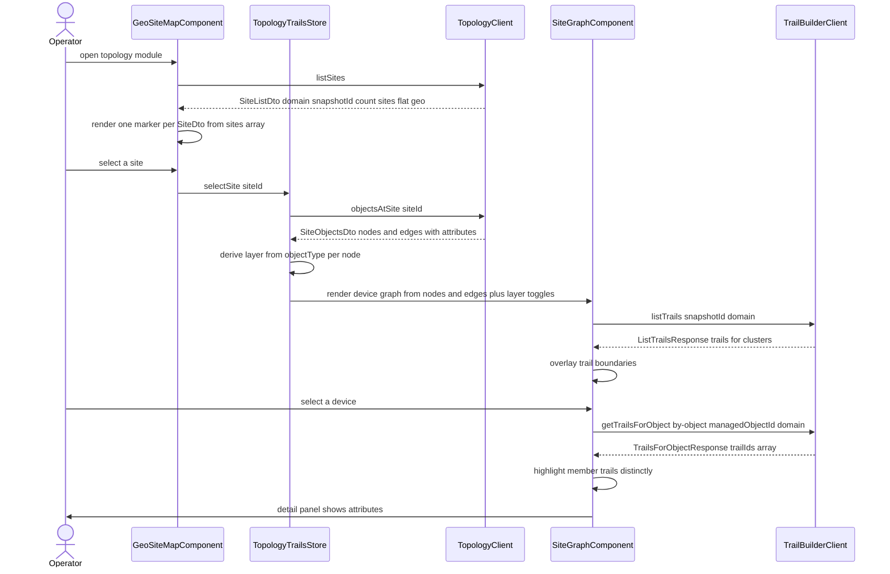
```mermaid
sequenceDiagram
  actor Operator
  participant Map as GeoSiteMapComponent
  participant Store as TopologyTrailsStore
  participant TC as TopologyClient
  participant Graph as SiteGraphComponent
  participant TBC as TrailBuilderClient
  Operator->>Map: open topology module
  Map->>TC: listSites
  TC-->>Map: SiteListDto domain snapshotId count sites flat geo
  Map->>Map: render one marker per SiteDto from sites array
  Operator->>Map: select a site
  Map->>Store: selectSite siteId
  Store->>TC: objectsAtSite siteId
  TC-->>Store: SiteObjectsDto nodes and edges with attributes
  Store->>Store: derive layer from objectType per node
  Store->>Graph: render device graph from nodes and edges plus layer toggles
  Graph->>TBC: listTrails snapshotId domain
  TBC-->>Graph: ListTrailsResponse trails for clusters
  Graph->>Graph: overlay trail boundaries
  Operator->>Graph: select a device
  Graph->>TBC: getTrailsForObject by-object managedObjectId domain
  TBC-->>Graph: TrailsForObjectResponse trailIds array
  Graph->>Graph: highlight member trails distinctly
  Graph->>Operator: detail panel shows attributes
```

### Flow 6 — Pattern review & XAI (P2): review, edit optional alarm, approve

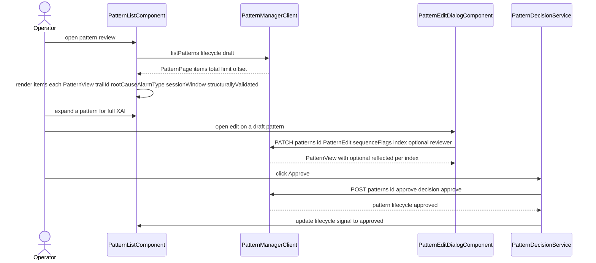
```mermaid
sequenceDiagram
  actor Operator
  participant List as PatternListComponent
  participant PMC as PatternManagerClient
  participant Edit as PatternEditDialogComponent
  participant Dec as PatternDecisionService
  Operator->>List: open pattern review
  List->>PMC: listPatterns lifecycle draft
  PMC-->>List: PatternPage items total limit offset
  List->>List: render items each PatternView trailId rootCauseAlarmType sessionWindow structurallyValidated
  Operator->>List: expand a pattern for full XAI
  Operator->>Edit: open edit on a draft pattern
  Edit->>PMC: PATCH patterns id PatternEdit sequenceFlags index optional reviewer
  PMC-->>Edit: PatternView with optional reflected per index
  Operator->>Dec: click Approve
  Dec->>PMC: POST patterns id approve decision approve
  PMC-->>Dec: pattern lifecycle approved
  Dec->>List: update lifecycle signal to approved
```

### Flow 7 — Config (P2): read and edit Knowledge model params

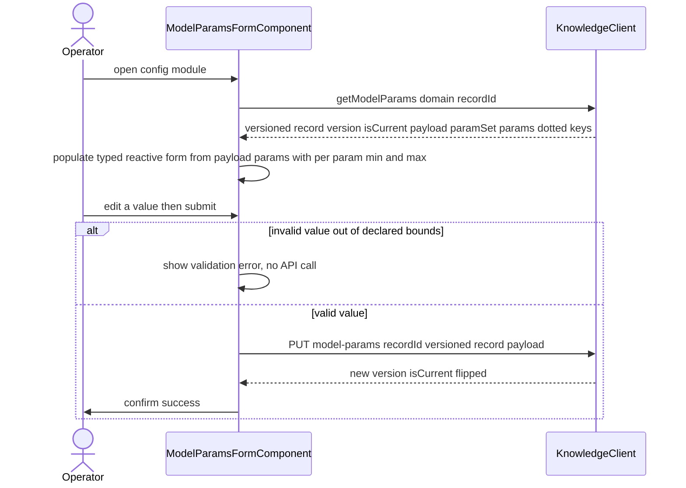
```mermaid
sequenceDiagram
  actor Operator
  participant Form as ModelParamsFormComponent
  participant KC as KnowledgeClient
  Operator->>Form: open config module
  Form->>KC: getModelParams domain recordId
  KC-->>Form: versioned record version isCurrent payload paramSet params dotted keys
  Form->>Form: populate typed reactive form from payload params with per param min and max
  Operator->>Form: edit a value then submit
  alt invalid value out of declared bounds
    Form->>Form: show validation error, no API call
  else valid value
    Form->>KC: PUT model-params recordId versioned record payload
    KC-->>Form: new version isCurrent flipped
    Form->>Operator: confirm success
  end
```

### Flow 8 — Correlation stats (P3): incidents, stats, alarm lifecycle, noise run-stats

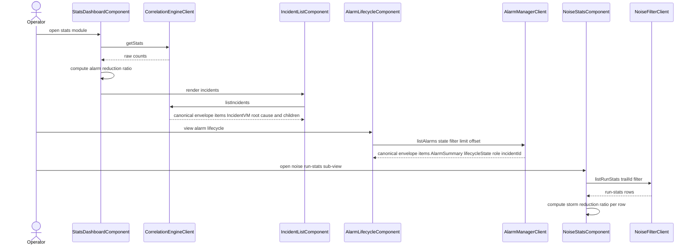
```mermaid
sequenceDiagram
  actor Operator
  participant Dash as StatsDashboardComponent
  participant CEC as CorrelationEngineClient
  participant Inc as IncidentListComponent
  participant ALC as AlarmLifecycleComponent
  participant AMC as AlarmManagerClient
  participant NS as NoiseStatsComponent
  participant NFC as NoiseFilterClient
  Operator->>Dash: open stats module
  Dash->>CEC: getStats
  CEC-->>Dash: raw counts
  Dash->>Dash: compute alarm reduction ratio
  Dash->>Inc: render incidents
  Inc->>CEC: listIncidents
  CEC-->>Inc: canonical envelope items IncidentVM root cause and children
  Operator->>ALC: view alarm lifecycle
  ALC->>AMC: listAlarms state filter limit offset
  AMC-->>ALC: canonical envelope items AlarmSummary lifecycleState role incidentId
  Operator->>NS: open noise run-stats sub-view
  NS->>NFC: listRunStats trailId filter
  NFC-->>NS: run-stats rows
  NS->>NS: compute storm reduction ratio per row
```

### Flow 9 — Chatter management (FIX F-UI1): NF learned noise to operator promote to Enrichment live

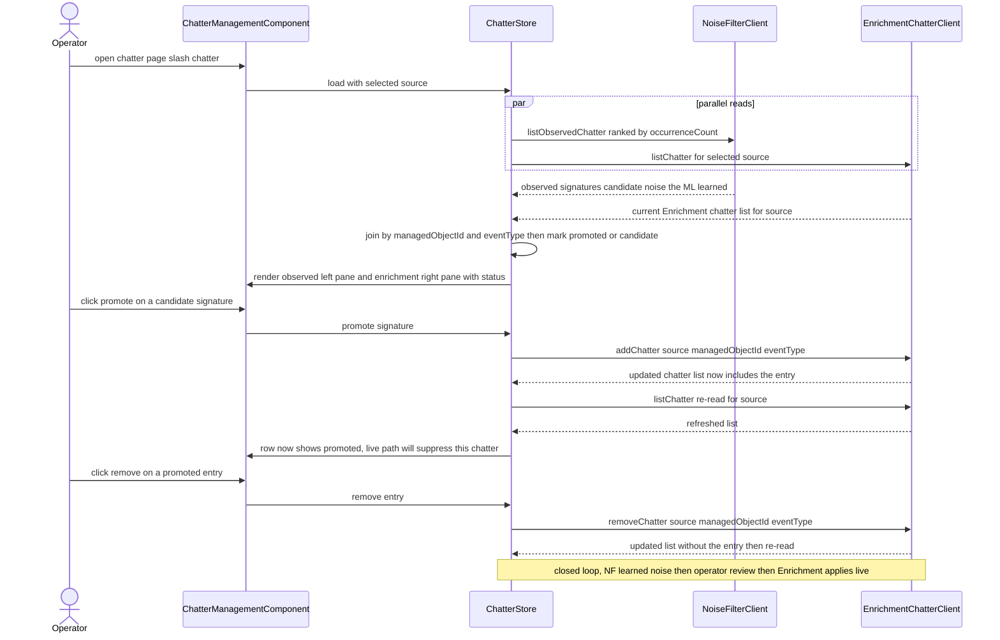
```mermaid
sequenceDiagram
  actor Operator
  participant Chat as ChatterManagementComponent
  participant Store as ChatterStore
  participant NFC as NoiseFilterClient
  participant ECC as EnrichmentChatterClient
  Operator->>Chat: open chatter page slash chatter
  Chat->>Store: load with selected source
  par parallel reads
    Store->>NFC: listObservedChatter ranked by occurrenceCount
    Store->>ECC: listChatter for selected source
  end
  NFC-->>Store: observed signatures candidate noise the ML learned
  ECC-->>Store: current Enrichment chatter list for source
  Store->>Store: join by managedObjectId and eventType then mark promoted or candidate
  Store->>Chat: render observed left pane and enrichment right pane with status
  Operator->>Chat: click promote on a candidate signature
  Chat->>Store: promote signature
  Store->>ECC: addChatter source managedObjectId eventType
  ECC-->>Store: updated chatter list now includes the entry
  Store->>ECC: listChatter re-read for source
  ECC-->>Store: refreshed list
  Store->>Chat: row now shows promoted, live path will suppress this chatter
  Operator->>Chat: click remove on a promoted entry
  Chat->>Store: remove entry
  Store->>ECC: removeChatter source managedObjectId eventType
  ECC-->>Store: updated list without the entry then re-read
  Note over Store,ECC: closed loop, NF learned noise then operator review then Enrichment applies live
```

### Flow 10 — Dashboard RCA accuracy + auto-correlation (FIX F-UI2)

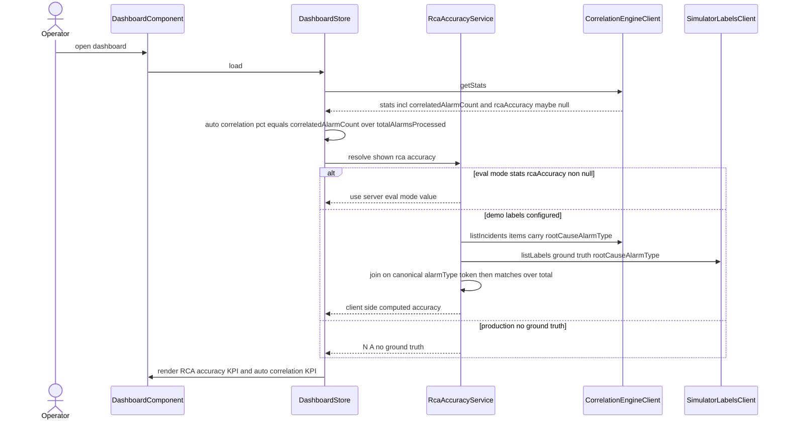
```mermaid
sequenceDiagram
  actor Operator
  participant Dash as DashboardComponent
  participant Store as DashboardStore
  participant Rca as RcaAccuracyService
  participant CEC as CorrelationEngineClient
  participant SLC as SimulatorLabelsClient
  Operator->>Dash: open dashboard
  Dash->>Store: load
  Store->>CEC: getStats
  CEC-->>Store: stats incl correlatedAlarmCount and rcaAccuracy maybe null
  Store->>Store: auto correlation pct equals correlatedAlarmCount over totalAlarmsProcessed
  Store->>Rca: resolve shown rca accuracy
  alt eval mode stats rcaAccuracy non null
    Rca-->>Store: use server eval mode value
  else demo labels configured
    Rca->>CEC: listIncidents items carry rootCauseAlarmType
    Rca->>SLC: listLabels ground truth rootCauseAlarmType
    Rca->>Rca: join on canonical alarmType token then matches over total
    Rca-->>Store: client side computed accuracy
  else production no ground truth
    Rca-->>Store: N A no ground truth
  end
  Store->>Dash: render RCA accuracy KPI and auto correlation KPI
```

## Algorithm logical flow

The web-ui implements **no domain algorithm** (no matching, scoring, RCA, mining — all owned by
backend services). The only non-trivial client-side logic is presentation/diff logic:

1. **Streaming delta diff (AC 7, 8, 9):** unwrap each poll response's **`.items`** array, key the
   previous and current alarm `items` by `alarmId` into `Map`s. For each current alarm: if absent
   from previous then `NEW`; else if **`lifecycleState`** differs then `CHANGED`; else `UNCHANGED`.
   The same keyed-diff over incident `items` by `incidentId`: absent then `NEW`;
   `childAlarmIds.length` increased then `GREW`; else `UNCHANGED`. The `NEW`/`CHANGED`/`GREW` rows
   get `highlightUntilEpochMs = now + HIGHLIGHT_MS`. The template tracks by id so only the affected
   rows re-render.
2. **Layer-toggle filtering (AC 28):** `NodeDto` has no `layer` field — the layer is **derived from
   `objectType`** via `LayerMapper` (`objectType → fiber/IP/IGP/LSP/service`, fallback `other`);
   each `EdgeDto` is likewise labelled by its `relation`/endpoint objectType. `visibleLayers` is a
   signal set; the Cytoscape graph applies a style filter showing only nodes/edges whose **derived**
   layer is in the set. All layers off then only nodes render. Pure derived view.
3. **Trail highlight (AC 32):** on device select, `getTrailsForObject` (`GET /trails/by-object`)
   returns `{ managedObjectId, domain, trailIds:[] }`; the member `trailIds` set drives
   `highlightedTrailIds`, a Cytoscape class that styles member trails distinctly. A device may be in
   many overlapping trails.
4. **Alarm-reduction ratio (AC 1, 45):** ratio is `totalAlarmsProcessed / totalIncidentsCreated`;
   guard divide-by-zero then display "N/A" when `totalIncidentsCreated` is 0.
5. **Storm-reduction ratio (AC 18):** `alarmsIn / clustersFormed` per run; guard
   `clustersFormed` equal to 0.
6. **Lifecycle filter (AC 48):** `alarmStateFilter` signal; `computed` filters the `alarms.items`
   by **`lifecycleState`** (`open`/`in-progress`/`correlated`/`cleared`; `reverted-open` surfaces
   from the detail `transitions` as a return to `open`).
7. **Chatter promoted-vs-candidate join (FIX F-UI1, AC 55, 56):** build a `Set` of the Enrichment
   list keys `(managedObjectId, eventType)` for the selected source; for each NF observed signature
   (already ranked by `occurrenceCount` by the producer), mark it `promoted` when its
   `(managedObjectId, eventType)` is in the set, else `candidate`. Null `managedObjectId` is a valid
   key value (source-level chatter); the join uses `(null, eventType)`. Pure derived view; `alarmType`,
   `trailId`, and counts on the NF signature are review context only (not part of the Enrichment key).
8. **Auto-correlation% (FIX F-UI2, AC 58):** `correlatedAlarmCount / totalAlarmsProcessed` from
   `GET /stats`; guard `totalAlarmsProcessed` equal to 0 (N/A). Distinct from alarm-reduction ratio.
9. **RCA accuracy resolution (FIX F-UI2, AC 57):** priority — (a) eval-mode `stats.rcaAccuracy` when
   non-null; (b) client-side join: matches / total where a match is `incident.rootCauseAlarmType`
   equal to the scenario label's `rootCauseAlarmType` on the canonical `alarmType` token space (the
   label is found via the incident-to-scenario mapping / the labels set); (c) N/A when neither
   available. Never fabricated.

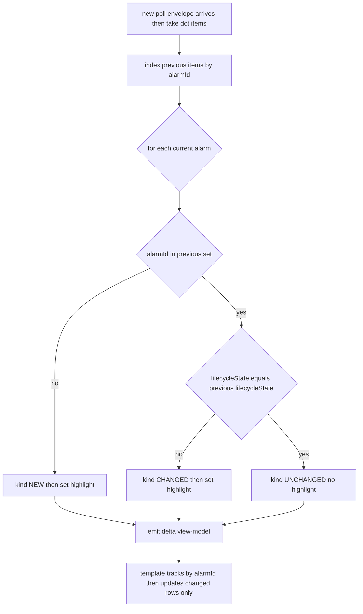
```mermaid
flowchart TD
  Start[new poll envelope arrives then take dot items] --> Key[index previous items by alarmId]
  Key --> Loop{for each current alarm}
  Loop --> Present{alarmId in previous set}
  Present -->|no| New[kind NEW then set highlight]
  Present -->|yes| Same{lifecycleState equals previous lifecycleState}
  Same -->|no| Changed[kind CHANGED then set highlight]
  Same -->|yes| Unchanged[kind UNCHANGED no highlight]
  New --> Emit[emit delta view-model]
  Changed --> Emit
  Unchanged --> Emit
  Emit --> Render[template tracks by alarmId then updates changed rows only]
```

## Seed data & examples

The web-ui ships **test fixtures** (mock-backend responses) generated from each producer
published OpenAPI, used by Vitest/TestBed. Representative fixtures:

- `fixtures/topology/sites.json` — a **`SiteListDto`** `{ domain, snapshotId, count, sites:[...] }`
  with two `SiteDto`s e.g. London PoP (lat 51.5, lon -0.12, region EU-West) and Frankfurt PoP
  (at least 2 sites, AC 26).
- `fixtures/topology/objects-at-site-1.json` — a **`SiteObjectsDto`** `{ siteId, domain,
  snapshotId, nodeCount, edgeCount, nodes:[NodeDto], edges:[EdgeDto] }`: `nodes` incl. a device
  with attributes `vendor=Acme, model=R8000, equipmentType=router, slotCount=16` (three well-known
  keys plus one extra, AC 29) and varied `objectType`s exercising the layer derivation
  (fiber/IP/IGP/LSP/service); `edges` (from the SAME response) incl. one with attributes
  `linkType=fiber, capacity=100G, protectionRole=primary` (AC 30) and a `relation` spanning the
  derived layers (AC 28). `NodeDto` carries **no `layer` field** — the fixture proves the
  `objectType → layer` derivation.
- `fixtures/trails/list.json` (a `ListTrailsResponse`) + `fixtures/trails/by-object.json` (a
  **`TrailsForObjectResponse`** `{ managedObjectId, domain, trailIds:[...] }`) + a `TrailDetail`
  with `members:[{managedObjectId, objectType}]` — a device present in at least 2 trails (AC 31, 32).
- `fixtures/patterns/discovered.json` — a **`PatternPage`** `{ items:[PatternView], total, limit,
  offset }`; `items` with full XAI (`sequence:[{alarmType, optional}]`, `rootCauseAlarmType` vocab
  token, `sessionWindow`, `structurallyValidated`/`structuralValidationReason`); mixed `lifecycle`
  (draft/approved) for AC 34, 35, 38; one `draft` pattern editable for AC 54; each `PatternView`
  carries a `trailId` for the pattern→topology cross-link (AC 21).
- `fixtures/knowledge/model-params.json` — a **versioned `modelParams` record**
  `{ domain, recordType, recordId, version, isCurrent, payload:{ paramSet, params:[
  {key:"dbscan.epsilon",...}, {key:"dbscan.minSamples",...}, {key:"window.sizeSeconds",...},
  {key:"prefixspan.minSupport",...} ] } }` with real dotted keys + `min`/`max` bounds (AC 40); a
  variant with an out-of-bounds value to drive the client-side validation test (AC 42).
- `fixtures/correlation/stats.json` — known `totalAlarmsProcessed`/`correlatedAlarmCount`/
  `totalIncidentsCreated` so the reduction ratio AND **auto-correlation%** are known values (AC 1, 45,
  58); a variant with `totalIncidentsCreated=0` for the reduction N/A case (AC 1) and a variant with
  `totalAlarmsProcessed=0` for the auto-correlation N/A case; an **eval-mode variant with non-null
  `rcaAccuracy`** (e.g. `0.86`) and a **production variant with `rcaAccuracy=null`** (AC 57).
- `fixtures/correlation/incidents.json` (a canonical **`{items:[IncidentVM], total, limit, offset}`** envelope)
  + `incident-detail.json` (a single `IncidentVM`) — incidents with root-cause plus children,
  **`rootCauseAlarmType`** (canonical `alarmType` token, for the RCA join, FIX F-UI2),
  `matchedPatternId`/`matchedCodebookId`, `confidence`, `trailId` (AC 14, 44, 57).
- `fixtures/simulator/labels.json` (FIX F-UI2) — a `GroundTruthLabel[]` `{scenarioId, scenarioType,
  rootCause, rootCauseManagedObjectId, rootCauseAlarmType, children[]}` whose `rootCauseAlarmType`
  values are arranged so the client-side join against `incidents.json` yields a known accuracy (some
  incidents matching, some not), exercising the demo RCA path (AC 57).
- `fixtures/noise/observed-chatter.json` (FIX F-UI1) — an `ObservedChatterPage`
  `{items:[ObservedChatterSignature], total, limit, offset}` ranked by `occurrenceCount` desc; at
  least one signature with a non-null `managedObjectId` and one **source-level** (null
  `managedObjectId`), each with `alarmType`, `eventType`, `trailId|null`, `occurrenceCount`,
  `firstSeen`, `lastSeen` (AC 55).
- `fixtures/enrichment/chatter-{source}.json` (FIX F-UI1) — `{source, chatterList:[{managedObjectId,
  eventType}]}` for at least two sources (e.g. `nms-alpha` with one entry, `default` empty), arranged
  so that one observed signature is **already promoted** (matches an existing entry) and the rest are
  **candidates** — driving the promoted-vs-candidate join test (AC 55, 56).
- `fixtures/alarms/lifecycle.json` — a canonical **`{items:[AlarmSummary], total, limit,
  offset}`** envelope with alarms across `lifecycleState` open/in-progress/correlated/cleared
  (plus a member whose detail `transitions` show a revert back to `open`, i.e. reverted-open) with
  role plus `incidentId` (AC 47, 48).
- `fixtures/streaming/poll-a.json` + `poll-b.json` — two successive poll snapshots, **each a
  canonical page envelope** (`{items, total, limit, offset}` for both alarms and incidents):
  `poll-b.items` adds one new alarm (AC 7), changes one alarm
  `lifecycleState` `open` to `in-progress` (AC 8), changes one `in-progress` to `correlated` and
  one back to `open` (the reverted-open case, AC 9), and grows one incident's `childAlarmIds`.
- `fixtures/alarms/alarm-{id}.json` — per-member single-alarm **`AlarmDetail`** records (with
  ordered `transitions`) for the incident-detail page (AC 15).
- `fixtures/noise/run-stats.json` — at least 2 run rows across two distinct `trailId` values, with
  `alarmsIn`, `clustersFormed`, `alarmsKept`, `alarmsDropped`, `noiseRatio` (AC 18, 19).

Example streaming delta (poll-a to poll-b):

```
poll-a .items lifecycleState: a-1 open,  a-2 open,        a-3 in-progress
poll-b .items lifecycleState: a-1 open,  a-2 in-progress, a-3 correlated, a-4 open, a-5 open(reverted)
delta: a-2 CHANGED (open to in-progress), a-3 CHANGED (in-progress to correlated),
       a-4 NEW, a-5 CHANGED (reverted back to open), a-1 UNCHANGED
(diff keys on lifecycleState over the .items array of the canonical {items,total,limit,offset} envelope)
```

## UI wireframes

ASCII layouts (non-mermaid fenced blocks so they are not parsed as diagrams).

### New page — Landing dashboard (default route `/dashboard`)

```
+-------------------------------------------------------------------------+
| [Dashboard][Streaming][Topology][Patterns][Chatter][Config][Stats] shell |
+-------------------------------------------------------------------------+
| Platform overview                                       [Refresh]       |
| +------------------+ +------------------+ +------------------+           |
| | Live incidents   | | Active patterns  | | Alarm reduction  |           |
| |       12         | |        5         | |      8.3 : 1     |           |
| | (click to stats) | | (click patterns) | | (N/A if 0 inc.)  |           |
| +------------------+ +------------------+ +------------------+           |
| +------------------+ +------------------+ +------------------+           |
| | Alarms processed | | RCA accuracy     | | Auto-correlation |           |
| |      1280        | |   0.86  (eval)   | |   60.0 percent   |           |
| |                  | | (N/A if no GT)   | | (target near 60) |           |
| +------------------+ +------------------+ +------------------+           |
|   RCA accuracy source: CE eval-mode stats.rcaAccuracy when set, else     |
|   computed from incidents rootCauseAlarmType joined to Simulator labels  |
|   in the demo, else N A in production with no ground truth.              |
|   Auto-correlation = correlatedAlarmCount / totalAlarmsProcessed.        |
+-------------------------------------------------------------------------+
| Recent incidents                          | Quick links                 |
|  INC-12 root LOS at FiberSpan  -> detail  |  -> Streaming (live)        |
|  INC-11 root LinkDown          -> detail  |  -> Topology + trails       |
|  INC-10 root AdjDown           -> detail  |  -> Pattern review          |
|                                           |  -> Chatter management      |
|                                           |  -> Config (Knowledge)      |
|                                           |  -> Correlation stats       |
+-------------------------------------------------------------------------+
```
Reads: Correlation Engine `getStats` (incl. `correlatedAlarmCount` + eval-mode `rcaAccuracy`) +
`listIncidents` (incl. `rootCauseAlarmType`); Pattern Manager `listPatterns?lifecycle=approved`;
Alarm Manager `listAlarms` (count); Simulator `/labels` (demo/eval RCA join only, when configured).
Each KPI card + recent-incident row is a deep link. **FIX F-UI2:** the RCA-accuracy card shows the
resolved number (not "evaluated offline"); the auto-correlation card shows the ~60% target metric.

### New page — Real-time streaming view (`/streaming`)

```
+-------------------------------------------------------------------------+
| Streaming (live)   * LIVE   last updated 12:04:07                        |
|   interval [ 3000 ] ms   [Pause]   (env default; operator-adjustable)   |
+-------------------------------------------------------------------------+
| Alarms (newest highlighted)            | Incidents (forming)            |
|  alarmId state        role   inc       |  incidentId  root      childs  |
|  a-4*  open       (NEW)   --   --       |  INC-12* (GREW)  LOS    3 -> 4  |
|  a-2~  in-progress(CHG)   --   --       |  INC-11   LinkDown      2       |
|  a-3~  correlated (CHG)   child INC-12  |  INC-10   AdjDown       2       |
|  a-5~  open (reverted-open)(CHG) -- --  |                                |
|  a-1   open               --   --       |  -> click incident for detail  |
|  (* = new this poll, ~ = changed; transient highlight then fades;       |
|   respects prefers-reduced-motion: no animation, static badge instead)  |
+-------------------------------------------------------------------------+
```
Reads (polled every interval): Alarm Manager `GET /alarms` (`{items,total,limit,offset}`),
Correlation Engine `GET /incidents` (`{items,total,limit,offset}`); the view diffs over
each response's `.items`. No backend streaming. Pause stops all polling. Clicking deep-links out.

### New page — Incident-detail drill-down (`/incidents/:incidentId`)

```
+-------------------------------------------------------------------------+
| Incident INC-12          trail TR-7      confidence 0.91                 |
| Matched pattern PAT-3 (LOS, LinkDown, AdjDown)   [view pattern]         |
|   (or matched codebook CB-2 when matchedCodebookId is set)              |
+-------------------------------------------------------------------------+
| Root-cause alarm                                                        |
|  a-3  LOS at FiberSpan-9   state correlated   role root-cause           |
|       -> view in streaming/alarm view                                   |
+-------------------------------------------------------------------------+
| Child alarms (N-1)                                                       |
|  a-7  LinkDown   state correlated  role child   -> view alarm           |
|  a-8  AdjDown    state correlated  role child   -> view alarm           |
+-------------------------------------------------------------------------+
| trail TR-7  -> view trail in topology                                   |
+-------------------------------------------------------------------------+
```
Reads: Correlation Engine `GET /incidents/{incidentId}` (single `IncidentVM`); Alarm Manager
`GET /alarms/{alarmId}` (single `AlarmDetail`) per member. `matchedCodebookId` labels the matched
codebook artifact. Deep-linkable (loads directly from URL); every member alarm + the trail is a
cross-link.

### New view — Noise-filter run-stats (learning sub-view in `/stats`)

```
+-------------------------------------------------------------------------+
| Stats  tabs: [Incidents] [Alarm lifecycle] [Noise run-stats]            |
+-------------------------------------------------------------------------+
| Noise-filter run-stats           filter trailId [ TR-7 ] [from][to]     |
|  run     trail  in   clusters kept drop  noiseRatio  stormReduction     |
|  RUN-9   TR-7   240   12       180  60    0.25        20.0 : 1           |
|  RUN-8   TR-7   180   10       150  30    0.17        18.0 : 1           |
|  (stormReduction = alarmsIn / clustersFormed, computed if not returned; |
|   filtering by trailId hides rows for other trails; domain may be null) |
+-------------------------------------------------------------------------+
```
Reads: Noise Filter `GET /api/v1/run-stats?trailId=&from=&to=`.

### New page — Chatter management (`/chatter`) — FIX F-UI1

```
+-------------------------------------------------------------------------+
| Chatter management        source [ nms-alpha v ]   [Refresh]            |
|  Purpose: NF learned noise  ->  operator review/promote  ->  Enrichment |
|  applies it live (the live path then suppresses promoted chatter).      |
+----------------------------------------+--------------------------------+
| Observed chatter (NF, ranked by count) | Enrichment chatter list        |
|  the candidate noise the ML observed   |  current live known-chatter    |
|  moId            type     evt  count   |  moId            evt           |
|  Interface:e1-12 LinkDown lnkD  142 P  |  Interface:e1-12 linkDown      |
|  (null src-lvl)  PortFlap pFlp   88 +  |                                |
|  Port:c1-3-7     CRCErr   crc    51 +  |  [+] promote moves a candidate |
|  ...                                   |      into this list (addChatter)|
|  P = already promoted   + = candidate  |  [x] remove demotes (rmChatter) |
|  [Promote] on a candidate row          |  [Remove] on a list entry      |
+----------------------------------------+--------------------------------+
|  status: promoting Port:c1-3-7 / crc ...   (row action disabled while    |
|  in flight; re-reads Enrichment list on success)                        |
+-------------------------------------------------------------------------+
```
Reads: Noise Filter `GET /api/v1/observed-chatter` (ranked by `occurrenceCount`); Enrichment
`GET /api/v1/sources/{source}/chatter`. Writes: Enrichment `POST .../chatter` (promote / `addChatter`),
`DELETE .../chatter` (remove / `removeChatter`). The `joinView` marks each observed signature
**promoted** (P) or **candidate** (+) by `(managedObjectId, eventType)` match against the Enrichment
list for the selected source; a null `managedObjectId` is a source-level signature. Closed loop: NF
learned noise to operator promote to Enrichment live suppression. The page is keyboard-operable, the
two tables are ARIA data tables, and `LiveAnnouncer` announces promote/remove outcomes.

### Existing — Topology & trails (`/topology`, `/topology/:siteId`)

> **Site-graph UX redesign (operator feedback on the live demo — refines the rendering/interaction
> of ACs 55-76; NO behaviour or contract change).** The **canvas is the interface**: the expand
> control lives **on the canvas** (a small, always-visible "+" affordance on/near each device node),
> nodes/labels are **bigger** with a layout spread to fill a **taller** canvas, and the
> Devices/Connections lists are **hidden by default** behind a collapsible **"List view" toggle**.
> Detail-on-click and the detail panel are unchanged. The accessible device/edge list (AC 52) and
> the `data-cy-*` test bridge are **preserved inside the toggle's expandable region** (rendered in
> the DOM, reachable by screen readers and tests; just not shown by default). See
> "Site-graph UX redesign (canvas-centric)" under the explorable-topology design unit.

```
+-------------------------------------------------------------+
| [Dashboard][Streaming][topology][patterns][config][stats]   |
+-------------------------------------------------------------+
| Geo-site map (MapLibre)                                     |
|   . London PoP        . Frankfurt PoP    . Madrid PoP       |
|   (markers, one per Site; click to expand)                  |
+-------------------------------------------------------------+
  (after selecting a site, transitions to /topology/:siteId)
+--------------------------------------+----------------------+
| Site graph (Cytoscape) — TALLER,     | Detail panel         |
|   bigger nodes + labels, spread       | managedObjectId: ... |
|                                       | vendor: Acme         |
|   (LON-RTR-1)(+)  (LON-LC-3)(+)       | model: R8000         |
|       \           /                   | equipmentType: router|
|        (LON-PORT-7)(+)                | slotCount: 16 (gen.) |
|   each device node carries an         | --- trails ---       |
|   always-visible (+) expand           | trail-A, trail-C     |
|   affordance; click (+) -> expandNode | (NO expand button    |
|   [type-icon legend]                  |  here)               |
| Layers:[x]fiber[x]IP[ ]IGP[ ]LSP[ ]svc| zoom: [+][-][Fit][R] |
|  crossDomain:[ ]                      |                      |
+--------------------------------------+----------------------+
| > List view  (collapsed by default — click to expand)       |
|   v Devices (accessible list + data-cy bridge)              |
|       LON-RTR-1  router   site:London                       |
|       LON-LC-3   linecard site:London                       |
|   v Connections (accessible edge list + data-cy bridge)     |
|       LON-RTR-1 -- IP_LINK -- LON-PORT-7                     |
+-------------------------------------------------------------+
| (deep link in: /topology?trailId=<id> activates that trail) |
+-------------------------------------------------------------+
```
Reads: Topology `listSites` (`SiteListDto.sites`), `objectsAtSite` (`SiteObjectsDto.nodes` +
`.edges`); layer derived from each node's `objectType`. Trail Builder `listTrails`,
`getTrailsForObject` (`GET /trails/by-object` → `trailIds[]`). The per-node "+" affordance binds
`expandNode(managedObjectId)`; the (collapsed-by-default) "List view" region carries the
accessible Devices/Connections lists + the `data-cy-*` bridge (AC 52, test source of truth).

### Existing — Pattern review & XAI (`/patterns`)

```
+-------------------------------------------------------------+
| Patterns   tabs: [Discovered (draft)] [Active (approved)]   |
+-------------------------------------------------------------+
| seq            sup  conf lift RCA        codebook  lifecycle |
| LOS,LinkDown.. 0.12 0.90 4.2 LOS         match-7   draft  v  |
|   v expanded XAI: timing (median IAT, timeframe),           |
|     instanceCount, supportingInstances list                 |
|     [Approve] [Reject] [Edit] [View trail -> topology]      |
|     (Edit only for draft; View trail uses pattern.trailId)  |
+-------------------------------------------------------------+
  Edit dialog (placeholder):
  [ ] LOS  [x] LinkDown optional  [ ] AdjDown   reviewer:____
  notes:__________________________  [Submit PATCH] [Cancel]
  (Submit sends PatternEdit { sequenceFlags:[{index, optional}], reviewer, notes? })
```
Reads: Pattern Manager `GET /patterns` (`PatternPage.items`). Writes: `POST /patterns/{id}/approve`,
`PATCH /patterns/{id}` (frozen `PatternEdit` body with `sequenceFlags`).

### Existing — Config (`/config`)

```
+-------------------------------------------------------------+
| Model parameters (Knowledge Service)   paramSet: noise-filter|
|   record core-ip/modelParams/noise-filter   version v3      |
|   dbscan.epsilon       [ 0.5 ]  (min 0.0  max 100.0)        |
|   dbscan.minSamples    [ 3   ]  (min 1    max 1000)        |
|   window.sizeSeconds   [ 60  ]  s  (min 1  max 86400)      |
|   prefixspan.minSupport[ 0.3 ]  (min 0.0  max 1.0)         |
|                                   [Save]  status: saved v4  |
|   (out-of-bounds value shows inline error, no API call;     |
|    Save PUTs the versioned record, mints a new version)     |
+-------------------------------------------------------------+
```
Reads: Knowledge `GET /domains/{domain}/model-params/{recordId}` (versioned record, dotted keys).
Writes: `PUT /domains/{domain}/model-params/{recordId}` (versioned write, new version on success).

### Existing — Correlation stats (`/stats`, Incidents + Alarm-lifecycle tabs)

```
+-------------------------------------------------------------+
| Stats dashboard                                             |
|  alarm-reduction ratio: 8.3   RCA accuracy: 0.86 (eval)     |
|  auto-correlation: 60.0 pct   (correlated / processed)      |
|  pattern matches: 42   codebook matches: 17                 |
+------------------------------+------------------------------+
| Incidents (.items)           | Alarm lifecycle (.items)     |
|  INC-1 root: LOS  -> detail  | filter: all open inprog corr |
|    children: LinkDown, AdjDn |        cleared               |
|  INC-2 root: ...  -> detail  | alarmId lifecycleState role i|
|                              | a-1  correlated      root INC1
|                              | a-2  in-progress     --   -- |
|                              | a-9  open (reverted) --   -- |
+------------------------------+------------------------------+
```
Reads: Correlation Engine `listIncidents` (`{items,...}`), `getStats`; Alarm Manager `listAlarms`
(`{items,...}`); the same `RcaAccuracyService` as the dashboard (FIX F-UI2) so the stats view shows
the resolved RCA-accuracy number and auto-correlation% instead of the old "evaluated offline" note.
Filter is over `lifecycleState` (open/in-progress/correlated/cleared); a reverted-open alarm shows
as `open` (its `transitions` record the revert). Each incident row deep-links to
`/incidents/:incidentId`.

## Navigation map (required deliverable)

The page graph below documents every page, its route, and the logical cross-navigation flows
between them. All entity pages carry the ID in the URL (route param or query param) so links are
shareable and bookmarkable.

### Route table

| Route | Page / component | Deep-link param | Reached from |
|---|---|---|---|
| `/` | redirect to `/dashboard` | — | app entry |
| `/dashboard` | `DashboardComponent` (default) | — | nav bar, any page |
| `/streaming` | `StreamingViewComponent` | `?alarmId=` (optional focus), `?siteId=` (optional filter) | nav bar, dashboard quick link, incident-detail member alarm, topology site |
| `/topology` | `GeoSiteMapComponent` | `?trailId=` (activate trail) | nav bar, pattern view trail, incident-detail trail |
| `/topology/:siteId` | `SiteGraphComponent` | `:siteId` | geo map site select |
| `/patterns` | `PatternReviewModule` | — | nav bar, dashboard active-pattern KPI, incident-detail matched pattern |
| `/incidents/:incidentId` | `IncidentDetailComponent` | `:incidentId` | dashboard recent incidents + incident KPI, stats incident row, streaming incident row, direct deep link |
| `/chatter` | `ChatterManagementComponent` (FIX F-UI1) | `?source=` (optional source selector) | nav bar, dashboard quick link, stats noise run-stats cross-link, deep link |
| `/config` | `ModelParamsFormComponent` | — | nav bar, dashboard quick link |
| `/stats` | `CorrelationStatsModule` (Incidents / Alarm-lifecycle / Noise run-stats tabs) | — | nav bar, dashboard incident-count KPI + RCA-accuracy/auto-correlation KPIs, dashboard quick link |

### Page graph + logical flows

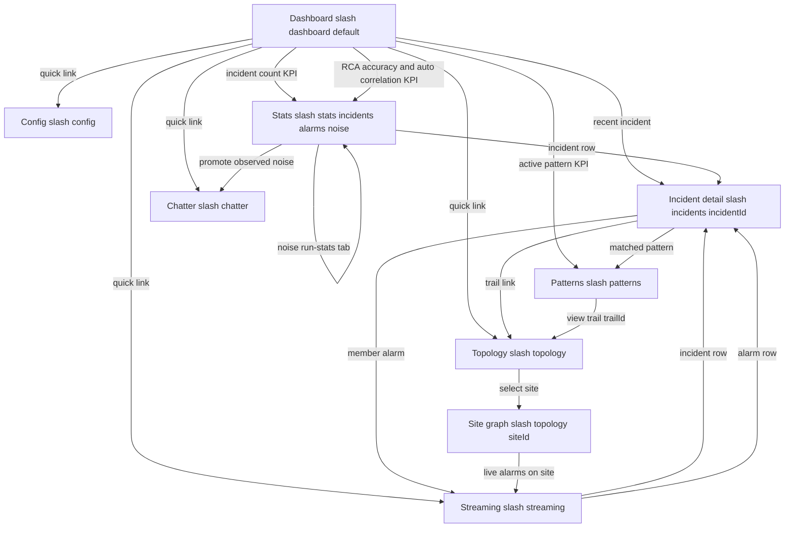
```mermaid
flowchart TD
  Dash[Dashboard slash dashboard default]
  Stream[Streaming slash streaming]
  Topo[Topology slash topology]
  Site[Site graph slash topology siteId]
  Pat[Patterns slash patterns]
  Inc[Incident detail slash incidents incidentId]
  Cfg[Config slash config]
  Stats[Stats slash stats incidents alarms noise]
  Chat[Chatter slash chatter]
  Dash -->|incident count KPI| Stats
  Dash -->|active pattern KPI| Pat
  Dash -->|recent incident| Inc
  Dash -->|RCA accuracy and auto correlation KPI| Stats
  Dash -->|quick link| Stream
  Dash -->|quick link| Topo
  Dash -->|quick link| Chat
  Dash -->|quick link| Cfg
  Stats -->|incident row| Inc
  Stream -->|incident row| Inc
  Stream -->|alarm row| Inc
  Inc -->|member alarm| Stream
  Inc -->|matched pattern| Pat
  Inc -->|trail link| Topo
  Pat -->|view trail trailId| Topo
  Topo -->|select site| Site
  Site -->|live alarms on site| Stream
  Stats -->|noise run-stats tab| Stats
  Stats -->|promote observed noise| Chat
```

## Error handling

First-class. The SPA must never crash whole-app on one backend failure; each module degrades
independently.

- **No Kafka / no schemaVersion handling:** N/A — the web-ui consumes no Kafka topics, so there
  is no DLQ routing and no `schemaVersion` rejection in this service.
- **Backend 5xx / unreachable (AC 53):** each module wraps its client calls; on `5xx` or network
  error the `ErrorBannerService` renders a **structured error message identifying the service**
  (service name + HTTP status) inside that module; other modules are unaffected. An effect logs a
  structured JSON error (level from env) with service name, endpoint, status, and `traceId` if
  present. Nothing is silently dropped.
- **Streaming poll failure:** a failed poll (5xx/network) sets a **stale-data indicator** ("last
  updated" goes stale + a warning badge); the previous snapshot is retained and the next tick
  retries. The view does not crash and does not lose the last good data (spec Non-functional).
- **404 / empty result:** rendered as an explicit **empty state** (e.g. "No sites returned", "No
  discovered patterns", "No run-stats yet", "No incidents"). A `404` on `GET /incidents/{id}`,
  `GET /alarms/{id}`, or `GET /run-stats/{id}` shows a "not found" panel; the incident-detail
  page shows a not-found state when the `incidentId` deep link does not resolve.
- **Dashboard partial failure:** the dashboard reads are independent; if one source fails, that
  KPI card shows an inline error/N-A while the others still render (no whole-page failure).
- **Validation failure (config edit, AC 42):** the typed reactive form blocks submit and shows an
  inline field error; **no API call** is made for an invalid value (e.g. negative session-window
  gap). The streaming interval control likewise rejects non-positive intervals client-side.
- **Edit on non-draft pattern (AC 54):** the Edit action is offered only for `draft` patterns; a
  `409/422` from the Pattern Manager (race) surfaces the structured error and does not mutate
  local state.
- **Noise-stats query error (422):** a bad `limit`/`from`/`to` returns `422`; the noise-stats
  sub-view shows the structured validation error and keeps prior rows.
- **Double-submit guard (idempotency):** approval-intent and config-save buttons are disabled
  while a request is in flight (`pendingDecision`/`saveStatus` signals). Server-side idempotency
  is the owning service concern.
- **Loading state:** every async view shows a skeleton/spinner with an ARIA `aria-busy` region
  while the request is pending; `LiveAnnouncer` announces load completion.
- **RCA accuracy display (FIX F-UI2):** the dashboard/stats now **show** RCA accuracy via
  `RcaAccuracyService`: eval-mode `stats.rcaAccuracy` when non-null, else a client-side join of
  `GET /incidents` `rootCauseAlarmType` to Simulator `/labels`, else **N/A (no ground truth)** in
  production. The value is **never fabricated** — the eval gating is explicit. If the Simulator
  labels client errors or is unconfigured in demo mode, the RCA card falls back to N/A (or the
  eval-mode value) and other KPIs are unaffected. Auto-correlation% comes from `correlatedAlarmCount /
  totalAlarmsProcessed` (N/A when `totalAlarmsProcessed=0`). Not a contract change (read-only of
  frozen CE/Simulator fields).
- **Chatter page errors (FIX F-UI1):** the observed-chatter read (Noise Filter) and the chatter list
  read/write (Enrichment) are independent — a failure in one shows a structured service-named error in
  that pane while the other still renders. A `409`/`422` from `addChatter`/`removeChatter` (race / bad
  entry) is surfaced and does not mutate local state; the row action is disabled while a write is in
  flight (`pendingPromotion`, double-submit guard) and the Enrichment list is re-read on success.
  Empty observed-chatter or empty Enrichment list renders an explicit empty state. **Flagged: until
  Enrichment's chatter `openapi.json` is published, the `EnrichmentChatterClient` is mock-only in unit
  tests and its real wiring is gated on the published contract.**

## Design alternatives

| Consideration | Alternatives considered | Chosen plus rationale |
|---|---|---|
| Real-time delivery | WebSocket/SSE push vs. client-side polling vs. backend stream API | **Client-side polling** — fixed by the spec (no backend streaming, no new API surface). Polls existing `GET /alarms` + `GET /incidents` at a configurable interval. No contract change; works against the already-published REST APIs and the same mock/real toggle. |
| Streaming timer | rxjs `interval`/`timer` bridged to signals vs. self-rescheduling `setTimeout` in an `effect` vs. Angular `resource` polling | **Signal-driven timer (rxjs `timer` bridged, or `setTimeout` loop) keyed off `intervalMs`/`autoRefresh` signals.** Restartable on interval change, tearable on pause, testable with `vi.useFakeTimers`. `resource` re-fetch is less ergonomic for pause/resume + delta-diff. |
| Delta diffing | Full-list re-render each poll vs. keyed Map diff with per-row tracking vs. server-provided diffs | **Keyed Map diff over the page envelope's `.items`** keyed by `alarmId`/`incidentId` (alarm change keyed on `lifecycleState`), template `@for` tracked by id — only changed rows re-render (spec performance). The diff unwraps `.items` from the frozen CE/AM canonical `{items, total, limit, offset}` envelopes (never assumes a bare array). Server diffs are unavailable (no new API). Full re-render violates the perf requirement and loses highlight state. |
| CE/AM pagination envelope | Align to a `page`/`size` envelope vs. align to the producers' frozen canonical `{items, total, limit, offset}` envelope | **Align to the producers' frozen canonical `{items, total, limit, offset}` envelope** (CE `IncidentPage` and AM `AlarmPage` both froze this exact key set — the same envelope as Pattern Manager's `PatternPage` and the Noise Filter run-stats page, **not** `page`/`size`). web-ui is the consumer and adapts to the published producer contract (the producer is the SSoT). One canonical envelope platform-wide means all list/streaming views read `.items` (plus `.total`/`.limit`/`.offset`) uniformly and page with `limit`/`offset` (default 50, max 500 / offset 0) everywhere — no per-service special-casing. |
| Topology node layer | A separate `layer` field on `NodeDto` vs. derive `layer` from `objectType` | **Derive from `objectType`** — the frozen `NodeDto` has no `layer` field (`layer == objectType`). web-ui maps `objectType` to the logical layer via a pure `LayerMapper` (fallback `other`), avoiding a duplicated field and matching the producer's single source of truth (P1-G9). |
| New-row animation | CSS keyframe animation vs. CSS class toggle with timed expiry vs. no animation | **Timed CSS class toggle** (`highlightUntilEpochMs`) — cheap, OnPush-friendly, and trivially disabled under `prefers-reduced-motion` (static badge instead of motion). Keyframe-only would not respect reduced motion without extra work. |
| Incident-detail member fetch | Sequential per-alarm vs. parallel fan-out vs. a single batch endpoint | **Parallel fan-out** (`forkJoin`/`Promise.all`) over `GET /alarms/{id}` — there is no batch endpoint (no new API), and parallel keeps the page responsive. Sequential is slow for large incidents. |
| Cross-navigation | Hard-coded `routerLink`s in each component vs. a central `NavigationService` | **Central `NavigationService`** builds every cross-link target from entity IDs — single place to keep deep-link URL shapes correct and shareable, and to satisfy the navigation-map contract. |
| State management | NgRx vs. signal-based injectable stores vs. component-local signals | **Signal-based injectable stores.** Stateless client, no complex shared-state graph; signals + `computed` give OnPush reactivity with far less boilerplate than NgRx. |
| API client generation | Full OpenAPI codegen client vs. models-only codegen + thin wrapper vs. hand-written | **Models-only codegen (`openapi-typescript`) + thin Angular `HttpClient` wrappers.** Contract-true types while keeping Angular DI, interceptors, and the env-driven base URL/toggle. |
| Mock backend transport | MSW vs. `HttpTestingController` vs. Prism mock server | **MSW for unit/component** (fetch-layer intercept in jsdom, same handlers from OpenAPI keep mock/real honest). Mock timers drive cadence tests. |
| Geo map / device graph | MapLibre + deck.gl vs. Leaflet; Cytoscape vs. d3-force | **MapLibre GL (BSD) + optional deck.gl (MIT); Cytoscape.js (MIT).** Permissive; purpose-built for vector basemap + typed multi-layer graphs with per-edge style classes. |
| Noise run-stats placement | Separate top-level route vs. sub-view/tab in `/stats` | **Tab within `/stats`** — the spec places noise run-stats in the correlation/learning stats area; a sub-view keeps the navigation map simple and matches the noise-filter spec's "presented in the existing correlation-stats module". |
| Alarm-reduction ratio source | Server-computed vs. client-computed from raw counts | **Client-computed** — `GET /stats` exposes raw counts only; UI divides `totalAlarmsProcessed` by `totalIncidentsCreated`, N/A when zero. No contract change. |
| BFF vs. direct-to-service | BFF proxy vs. direct SPA-to-service | **Direct-to-service (no BFF)** — fixed by the spec for MVP. |
| Chatter page placement (FIX F-UI1) | Sub-tab of `/stats` noise view vs. a dedicated top-level `/chatter` route | **Dedicated `/chatter` route** — it is a read+write operator workflow spanning two services (NF read + Enrichment write), distinct from the read-only noise run-stats view; a deep-linkable top-level route is clearer for the closed-loop task and keeps the nav map explicit. A `/stats` cross-link still bridges from the noise view. |
| Chatter promotion target / key (FIX F-UI1) | Write into Knowledge vs. write into Enrichment per-source `chatterList` keyed on `(managedObjectId, eventType)` | **Write into Enrichment** on `(managedObjectId, eventType)` — Enrichment owns the live per-source known-chatter list (its config-ownership invariant) and the live path consults it, so promotion there is what makes the live stream benefit from P2 learning. The NF observed signature carries `alarmType`/`trailId`/counts as review context; the Enrichment key is `(managedObjectId, eventType)`, matching Enrichment's existing entry shape — no new key invented. |
| RCA accuracy resolution (FIX F-UI2) | "evaluated offline" placeholder vs. eval-mode server field only vs. client-side label join only vs. priority of both with N/A gating | **Priority of both with explicit N/A gating** — prefer CE eval-mode `stats.rcaAccuracy` when wired, else compute client-side from `GET /incidents` `rootCauseAlarmType` joined to Simulator `/labels`, else N/A in production. Both server and demo paths make the strongest power metric VISIBLE without fabricating it or owning ground truth at runtime; the CE design explicitly offers these two interchangeable ways. |
| Auto-correlation vs. alarm-reduction (FIX F-UI2) | Reuse reduction ratio vs. add a distinct auto-correlation% KPI | **Distinct auto-correlation% KPI** = `correlatedAlarmCount / totalAlarmsProcessed` — the CE froze `correlatedAlarmCount` precisely because the correlated fraction (the ~60% target) is a different quantity from alarm-reduction (alarms/incidents) and must not be conflated. Two separate cards. |

# Explorable topology & network-element type icons (ACs 55-76)

> **Design unit added by `spec/web-ui-topology-explore` (PR #278, merged into `web-ui`).** This
> section is a self-contained, buildable design for the **new** acceptance criteria **55-76** and
> spec **Tasks 10-14** (Topology & trails module — neighbour expansion, site boundaries, trail
> navigation/explode, type icons, zoom/pan). It **extends** the existing topology & trails module
> (`## UI wireframes → Existing — Topology & trails`, `## API contracts → Topology Service`,
> `## Integration points`) and the in-progress explorer build
> `build/web-ui-explorable-topology @ 65f1b0c` — the dev **extends those files, does not rewrite
> them**. All other design sections above (dashboard, streaming, incident-detail, config, stats,
> chatter, etc.) are unchanged.
>
> **Numbering note.** The earlier design.md text refers to AC 55-58 as the chatter/RCA fixes
> (F-UI1/F-UI2). The merged spec on `web-ui` **renumbered**: AC 55-76 are now the explorable-topology
> ACs documented here; the chatter/RCA ACs are covered by their own tests under the existing
> `## Test plan` and are retained. The AC 55-76 test map below is the authoritative mapping for this
> design unit.

## Contract confirmation (NO contract change)

**All APIs consumed by ACs 55-76 already exist and are published — no new topic, payload, field, or
OpenAPI surface is introduced.** Verified against the checked-in producer specs:

- `GET /topology/sites` → `SiteListDto{sites:[SiteDto{siteId,name,latitude,longitude,region}]}` — published `services/topology/openapi.json`.
- `GET /topology/sites/{siteId}/objects` → `SiteObjectsDto{nodes:[NodeDto],edges:[EdgeDto]}` — published.
- `GET /topology/nodes/{managedObjectId}/neighbors` (`relation[]?`, `domain?`, `snapshotId?`, `crossDomain?`) → `NeighborsDto{managedObjectId,domain,neighbors:[{node:NodeDto,via:EdgeDto}]}` — published.
- `GET /topology/traversal` (`start`, `relation[]?`, `maxDepth≤32`, `crossDomain?`, `domain?`, `snapshotId?`) → `TraversalDto{reached:[NodeDto],edges:[EdgeDto]}` — published.
- `GET /topology/nodes/{managedObjectId}` → `NodeDto` — published (used only as an optional fallback; not required by the chosen site-attribution strategy).
- Trail Builder `GET /trails` (`listTrails`), `GET /trails/{trailId}` (`getTrail` → `TrailDetail`), `GET /trails/by-object` (`getTrailsForObject`) — published `services/trail-builder/openapi.json`.

**OQ-11 (site attribution for expanded nodes) — RESOLVED to option (c): infer site client-side from
`LOCATED_AT` edges. `NodeDto` is NOT changed; `architecture.md` and `services/topology/openapi.json`
are NOT touched.** Load-bearing fact that makes this work without a contract change: the Topology
`neighbors` query returns **every direct edge of the node** when no `relation` filter is passed
(`GraphReadService.neighbors` → `repository.neighbors(id, relations=∅, …)`), and a device's
`LOCATED_AT` edge to its `Site` is one of those direct edges — so expanding a device pulls in its
**Site node + the `LOCATED_AT` edge**, which is exactly what the `nodeSiteMap` derivation keys off.
The icon set is bundled inline SVG under `public/icons/` (offline, permissive, no CDN). **No item
in this design unit requires a contract change; nothing is designed around a missing contract.**

## Stack delta (this unit)

No new runtime dependency. Reuses the build's already-vendored, permissive libraries:
**Cytoscape.js (MIT)** for the device graph (compound parent nodes, `background-image` node icons),
**MapLibre GL JS (BSD-3-Clause)** for the geo map (`NavigationControl` zoom/pan), Angular 20
standalone + signals, `@angular/cdk/a11y` for focus/keyboard, **Vitest + Angular TestBed** (unit/
component) and **Playwright** (real-chromium E2E). Icon assets are **bundled inline SVG** authored in-
repo (or a permissive icon pack, license recorded) — see "Icon asset design".

## Task breakdown (spec Tasks 10-14 → realized by)

| Spec task | Realized by (modules / flow) |
|---|---|
| **10. Expand a device node to pull neighbours (additive, dedupe, cap, crossDomain)** | `TopologyStore.expandNode(id,{relation?,crossDomain?})` → `TopologyClient.neighbors(id,opts)` → `mergeGraph(nodes,edges)` (additive, dedupe by id, all-or-nothing `NODE_CAP` pre-check). **UX redesign:** the primary expand control is an **always-visible on-canvas "+" affordance on/near each device node** (`data-testid="expand-node"`), click → `expandNode(managedObjectId)`; the detail panel has **NO** expand button. The accessible Devices list (inside the collapsed-by-default "List view" toggle) keeps a keyboard-reachable expand control per row as the **non-visual equivalent** (a11y + test bridge), not the primary control. Cross-domain via a UI toggle bound to `expandNode(id,{crossDomain:true})`. `expandedNodeIds` tracks expanded nodes. (AC 55-58; relocates the control per UX feedback — same behaviour) |
| **11. Render site-boundary groupings** | `TopologyStore.nodeSiteMap` (computed from `LOCATED_AT` edges) + `distinctSiteIds`; `SiteGraphComponent` renders one **Cytoscape compound parent box per distinct site** (`data isSiteParent`, per-site border colour, name label) and parents each device node into its site box; site legend lists each site. (AC 60-62) |
| **12. Trail navigation + explode cross-site spans** | `TopologyStore.selectTrail(trailId)` → `TrailBuilderClient.getTrail` → `trailMemberIds` (full set) + **explode** (fetch missing members' subgraphs via `neighbors` → `mergeGraph`); `selectedTrailDetail` drives the **trail-detail panel** (`trailId`, `igpArea`, `srlgGroup`, interactive `members` → `selectNode`); `clearTrail()` removes highlight, keeps nodes; `getTrailsForObject` device-membership highlight preserved alongside. Trail-cluster list items are **buttons → `selectTrail`**. (AC 63-69) |
| **13. Network-element type icons** | New `objectType → icon` map (`type-icon-mapper.ts`) + bundled inline SVGs under `public/icons/`; `SiteGraphComponent` styles leaf nodes with `background-image` resolved via `document.baseURI` + a generic fallback; a `data-icon`/`background-image` bridge attribute makes the icon testable; type-icon legend. **UX redesign:** node glyphs + labels are rendered **larger** (icons legible at default zoom) — a sizing/layout refinement under AC 70-72, same icon mapping. (AC 70-72) |
| **14. Zoom/pan on both canvases** | `SiteGraphComponent` zoom controls (`+`/`−`/Fit/Reset, keyboard-reachable, `data-cy-zoom` bridge) over the Cytoscape API; `GeoSiteMapComponent` MapLibre `NavigationControl` + explicit fit/reset controls (`fitBounds(siteExtent)` / reset to default centre+zoom). All state local, not persisted. (AC 73-76) |

Every spec task 10-14 is realized above and traced to its ACs; no task is dropped or re-scoped.

## Phase applicability (design view — this unit)

This unit is entirely within the **P1 — Topology onboarding** role of web-ui (the spec's P1 row).
P2/P3 are unchanged by this unit.

| Phase | Active/Passive/Idle | Modules/handlers exercised | Inputs/Outputs |
|---|---|---|---|
| P1 — Topology onboarding | Active | `TopologyStore` (expand/selectTrail/nodeSiteMap/cap), `SiteGraphComponent` (compound site boxes, type icons, zoom), `GeoSiteMapComponent` (map zoom), `TopologyClient.neighbors`/`traversal`, `TrailBuilderClient.getTrail`/`getTrailsForObject` | Reads: Topology `sites`/objects-at-site/`neighbors`/`traversal`; Trail Builder `getTrail`/`getTrailsForObject`. Writes: — |
| P2 — Pattern learning | Passive | Topology & trails view remains browsable for reference; no work driven by this unit | Reads (on demand): same Topology/Trail APIs. Writes: — |
| P3 — Real-time correlation | Passive | Same — operators may explore topology; no new I/O in this unit | Reads (on demand): same. Writes: — |

## Module breakdown (this unit — extends existing files)

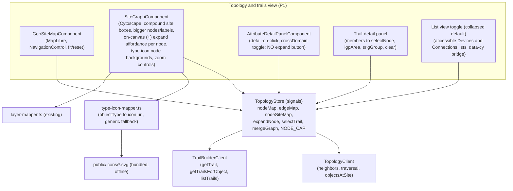
```mermaid
flowchart TB
  subgraph view["Topology and trails view (P1)"]
    geo["GeoSiteMapComponent<br/>(MapLibre, NavigationControl, fit/reset)"]
    sg["SiteGraphComponent<br/>(Cytoscape: compound site boxes, bigger nodes/labels,<br/>on-canvas (+) expand affordance per node,<br/>type-icon node backgrounds, zoom controls)"]
    panel["AttributeDetailPanelComponent<br/>(detail-on-click; crossDomain toggle; NO expand button)"]
    trailpanel["Trail-detail panel<br/>(members to selectNode, igpArea, srlgGroup, clear)"]
    listview["List view toggle (collapsed default)<br/>(accessible Devices and Connections lists, data-cy bridge)"]
  end
  store["TopologyStore (signals)<br/>nodeMap, edgeMap, nodeSiteMap,<br/>expandNode, selectTrail, mergeGraph, NODE_CAP"]
  iconmap["type-icon-mapper.ts<br/>(objectType to icon url, generic fallback)"]
  layer["layer-mapper.ts (existing)"]
  topoClient["TopologyClient<br/>(neighbors, traversal, objectsAtSite)"]
  trailClient["TrailBuilderClient<br/>(getTrail, getTrailsForObject, listTrails)"]
  assets["public/icons/*.svg (bundled, offline)"]

  geo --> store
  sg --> store
  panel --> store
  trailpanel --> store
  listview --> store
  sg --> iconmap
  sg --> layer
  iconmap --> assets
  store --> topoClient
  store --> trailClient
```

- **`TopologyStore` (extend `topology.store.ts`).** Already the accumulating-graph store
  (`nodeMap`/`edgeMap` signals; `hasGraph`; `derivedNodes`/`derivedEdges`/`visibleEdges` computed;
  `nodeSiteMap` from `LOCATED_AT`; `siteName`; `mergeGraph` additive+dedupe+`NODE_CAP`+`capReached`;
  `selectSite`, `expandNode`, `selectTrail`, `clearTrail`, `collapseToRoot`). **This unit's required
  edits:** (a) read `NODE_CAP` from env config (`TOPOLOGY_NODE_CAP`, default **250** — see
  "Node-cap default") instead of a module constant; (b) make `mergeGraph`/`expandNode` enforce
  **all-or-nothing** at the cap (AC 57 — no partial add); (c) add an optional `expandTraversal`
  action over `TopologyClient.traversal` for multi-hop pull. Names `derivedNodes`/`derivedEdges`/
  `visibleEdges`/`nodeSiteMap` are kept.
- **`SiteGraphComponent` (extend `site-graph.component.ts`).** Already does compound site boxes,
  structure/decoration effect split, breadthfirst→cose layout, zoom controls, and the `data-cy-*`
  bridge. **This unit's required edits:** (a) add `background-image` (type icon via
  `type-icon-mapper`) to the leaf-node Cytoscape style while **keeping the layer-colour fill**; (b)
  add a **type-icon legend**; (c) add an icon test bridge (`data-cy-icon-types` count + per-row
  `data-icon`) for AC 70/71; (d) a **crossDomain toggle** (binds `expandNode(id,{crossDomain:true})`).
  **UX redesign (rendering/interaction refinement of ACs 55-59, 70-72 — no behaviour change):**
  (e) **on-canvas expand affordance** — render an **always-visible small "+" affordance on/near each
  device leaf node** (a Cytoscape `tap` target: a small "+" child glyph/overlay node, or a
  hit-tested corner of the node, with `data-testid="expand-node"`); `tap` → `expandNode(node.data('managedObjectId'))`.
  This is now the **primary** expand control — the per-node row button in the (hidden) device list
  remains only as the accessible/test equivalent (see List view toggle). (f) **Bigger nodes +
  labels** — increase leaf-node `width`/`height` (~1.6× the current glyph) and `font-size`/label so
  device names and type icons are legible at the default zoom; the "+" affordance scales with the
  node. (g) **Layout spread to fill the canvas** — widen `cose` node-repulsion / ideal-edge-length
  (and `breadthfirst` spacing for the single-site case) so nodes spread across the larger canvas
  rather than clustering centre; deterministic `cose` settings (`animate:false, randomize:false`)
  are kept so the test bridge stays reliable. (h) **Moderate canvas-height bump** — increase the
  graph container height (CSS, e.g. min-height ~640px from the current ~480px) while keeping the
  **detail panel beside it** (the existing two-column layout / proportions — NOT a full-page graph).
- **List view toggle (extend `site-graph.component.ts` template + a new collapsible region).** **UX
  redesign:** the prominent Devices/Connections lists are **collapsed by default** behind a
  `cdkAccordion`/`<details>`-style **"List view" toggle** (a keyboard-operable disclosure button,
  `aria-expanded`, `aria-controls`). The lists themselves are **unchanged in markup** — they remain
  the WCAG non-visual equivalent of the `<canvas>` (AC 52) and the deterministic unit-test source of
  truth + `data-cy-*` bridge. They are **always present in the DOM** (rendered, not `*ngIf`-removed —
  use CSS `hidden`/collapse, never structural removal) so screen readers can reach the accessible
  list and Vitest/Playwright assertions still resolve the `data-cy-*`/per-row controls whether or not
  the region is visually expanded. The toggle defaults collapsed; visual operators see the canvas, a11y
  + tests see the list.
- **`GeoSiteMapComponent` (extend `geo-site-map.component.ts`).** Already adds MapLibre
  `NavigationControl` and `fitBounds(siteExtent)`. **This unit's required edits:** add explicit
  keyboard-reachable **fit** and **reset** controls (reset → default centre+zoom captured at init)
  and a `data-testid`/`data-cy-map-zoom` bridge for AC 74/76.
- **`type-icon-mapper.ts` (NEW, `src/app/topology/`).** Pure `objectType → icon url` map with a
  generic fallback (mirrors `layer-mapper.ts`'s pure-function shape).
- **`public/icons/*.svg` (NEW assets) + `public/icons/README.md` (license note).** Bundled inline
  SVG, one per objectType + a generic fallback; no CDN.

## Site-graph UX redesign (canvas-centric — presentation refinement of ACs 55-76)

Operator feedback on the live demo: make the **canvas the interface**. This is a
**rendering/interaction refinement of already-approved ACs** — it changes nothing in the store, the
APIs, the AC meaning, or any contract; no new topic/payload/field/endpoint. Confirmed decisions:

1. **Expand control on the canvas (refines AC 55-59).** A small, **always-visible "+" affordance on
   /near each device node**; clicking it calls `expandNode(managedObjectId)` — the same store action,
   same `neighbors` call, same additive/dedupe/cap/crossDomain behaviour the ACs already specify. The
   expand button is **removed as the primary control from the device-list rows** (those rows are now
   hidden by default) and the **detail panel does NOT get an expand button**. The accessible
   device-list row keeps a keyboard-reachable expand control purely as the **non-visual / test
   equivalent** (below). Net: the same `expandNode(id)` is reachable from the canvas affordance (visual
   operators) and from the accessible list row (screen-reader/keyboard + the `expand-node` test bridge).
2. **Bigger nodes + better real-estate use (refines AC 70-72 sizing).** Larger node glyphs/labels
   (icons legible at default zoom) and a layout spread (wider repulsion / ideal-edge-length / spacing)
   to fill the canvas; a **moderate canvas-height bump** (e.g. ~480px → ~640px min-height) keeping the
   **detail panel beside the graph** — the existing two-column proportions, **not** a full-page graph.
3. **Devices/Connections lists behind a "List view" toggle (preserves AC 52 + the test bridge).** The
   lists are **dropped from the default view** (collapsed) but kept in the DOM behind a keyboard-operable
   "List view" disclosure (`aria-expanded`/`aria-controls`). Because they are **CSS-hidden, never
   structurally removed**:
   - **AC 52 a11y still holds** — the `<canvas>` is opaque to screen readers, so the accessible
     Devices/Connections list (the canvas's non-visual equivalent) remains reachable in the DOM and
     is announced/focusable; the disclosure pattern is itself WCAG-conformant. The site-graph still
     exposes the canvas `aria-label` + the data-table equivalent that `a11y.spec.ts` (axe) checks.
   - **The deterministic test source of truth + `data-cy-*` bridge still works** — Vitest/TestBed and
     Playwright assertions resolve the same `data-cy-*` attributes and per-row controls regardless of
     the toggle's visual state (the redesign requires CSS-collapse, not `*ngIf`-removal, exactly so
     the existing AC→test assertions keep passing unchanged).
4. **Detail-on-click unchanged (AC 60-65, 70-72 attribute display).** Clicking a node or edge still
   populates the `AttributeDetailPanelComponent` with its attributes — existing behaviour, kept.

**ACs touched (presentation only) and traceability:** **AC 55-59** (expand) — control relocated to an
on-canvas affordance + accessible list-row equivalent; behaviour and the `expandNode`/`neighbors`
contract are unchanged. **AC 52** (a11y) — the device/edge list is now behind a default-collapsed
toggle but stays in the DOM and reachable. **AC 70-72** (icons/sizing) — bigger node glyphs/labels +
layout spread. **No new AC is required**, and **the AC→test map is unchanged**: every test asserts the
same behaviour — the expand test drives the on-canvas affordance (and the accessible list-row control
under the toggle), the a11y test still finds the list, and the icon/zoom/boundary tests are unaffected.

## Data model (client-side view-models — no owned store)

N/A — no owned datastore (web-ui owns no DB; see the top-level `## Data model / DB schema`). The
client-side state for this unit is the accumulating graph in `TopologyStore`:

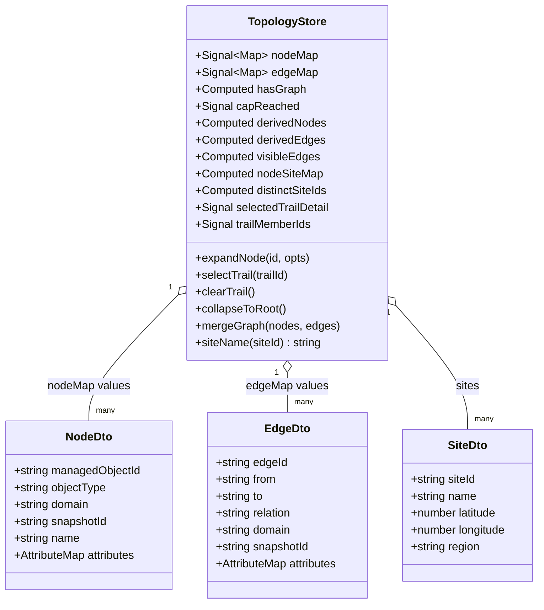
```mermaid
classDiagram
  class TopologyStore {
    +Signal~Map~ nodeMap
    +Signal~Map~ edgeMap
    +Computed hasGraph
    +Signal capReached
    +Computed derivedNodes
    +Computed derivedEdges
    +Computed visibleEdges
    +Computed nodeSiteMap
    +Computed distinctSiteIds
    +Signal selectedTrailDetail
    +Signal trailMemberIds
    +expandNode(id, opts)
    +selectTrail(trailId)
    +clearTrail()
    +collapseToRoot()
    +mergeGraph(nodes, edges)
    +siteName(siteId) string
  }
  class NodeDto {
    +string managedObjectId
    +string objectType
    +string domain
    +string snapshotId
    +string name
    +AttributeMap attributes
  }
  class EdgeDto {
    +string edgeId
    +string from
    +string to
    +string relation
    +string domain
    +string snapshotId
    +AttributeMap attributes
  }
  class SiteDto {
    +string siteId
    +string name
    +number latitude
    +number longitude
    +string region
  }
  TopologyStore "1" o-- "many" NodeDto : nodeMap values
  TopologyStore "1" o-- "many" EdgeDto : edgeMap values
  TopologyStore "1" o-- "many" SiteDto : sites
```

**`nodeSiteMap` derivation (the OQ-11 resolution).** A `computed` over `edgeMap`:
for each edge with `relation === 'LOCATED_AT'`, the **site endpoint** is whichever of `from`/`to` is
a known `siteId` (`siteId ∈ sites()`), and the **other endpoint is the device** — so
`map.set(deviceId, siteId)`. Because expanding a device returns its `LOCATED_AT` edge to its `Site`
(direct-edge fact above) and the `Site` node, a **cross-site** expanded device gains a `nodeSiteMap`
entry to its real site → its site box renders (AC 61). Devices whose `LOCATED_AT` edge has not (yet)
been pulled have no entry; they render in the **rooting site's** box by fetch context (the
objects-at-site response for the rooted site already carried `LOCATED_AT` edges for its own devices,
so AC 60 holds for the single-site case). Site nodes themselves are excluded from `derivedNodes`
(they are boundary containers, not devices).

## Key flows (Mermaid)

### Flow A — Expand a device node (AC 55-58)

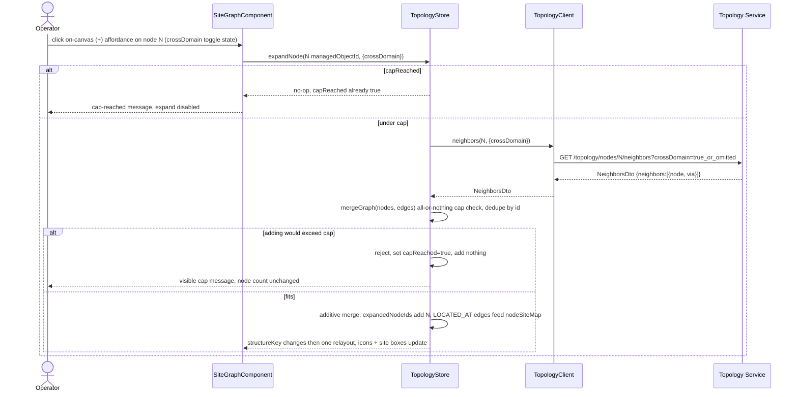
```mermaid
sequenceDiagram
  actor Op as Operator
  participant SG as SiteGraphComponent
  participant ST as TopologyStore
  participant TC as TopologyClient
  participant TP as Topology Service
  Op->>SG: click on-canvas (+) affordance on node N (crossDomain toggle state)
  SG->>ST: expandNode(N managedObjectId, {crossDomain})
  alt capReached
    ST-->>SG: no-op, capReached already true
    SG-->>Op: cap-reached message, expand disabled
  else under cap
    ST->>TC: neighbors(N, {crossDomain})
    TC->>TP: GET /topology/nodes/N/neighbors?crossDomain=true_or_omitted
    TP-->>TC: NeighborsDto {neighbors:[{node, via}]}
    TC-->>ST: NeighborsDto
    ST->>ST: mergeGraph(nodes, edges) all-or-nothing cap check, dedupe by id
    alt adding would exceed cap
      ST->>ST: reject, set capReached=true, add nothing
      ST-->>Op: visible cap message, node count unchanged
    else fits
      ST->>ST: additive merge, expandedNodeIds add N, LOCATED_AT edges feed nodeSiteMap
      ST-->>SG: structureKey changes then one relayout, icons + site boxes update
    end
  end
```

### Flow B — Select a trail and explode a cross-site span (AC 63-69)

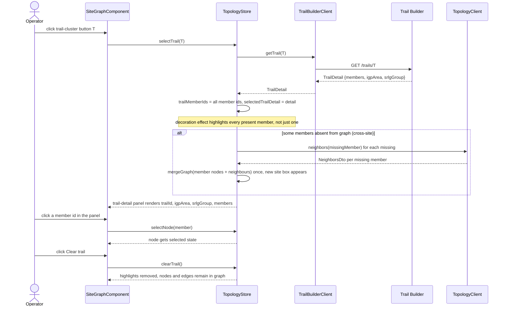
```mermaid
sequenceDiagram
  actor Op as Operator
  participant SG as SiteGraphComponent
  participant ST as TopologyStore
  participant TB as TrailBuilderClient
  participant TS as Trail Builder
  participant TC as TopologyClient
  Op->>SG: click trail-cluster button T
  SG->>ST: selectTrail(T)
  ST->>TB: getTrail(T)
  TB->>TS: GET /trails/T
  TS-->>TB: TrailDetail {members, igpArea, srlgGroup}
  TB-->>ST: TrailDetail
  ST->>ST: trailMemberIds = all member ids, selectedTrailDetail = detail
  Note over ST: decoration effect highlights every present member, not just one
  alt some members absent from graph (cross-site)
    ST->>TC: neighbors(missingMember) for each missing
    TC-->>ST: NeighborsDto per missing member
    ST->>ST: mergeGraph(member nodes + neighbours) once, new site box appears
  end
  ST-->>SG: trail-detail panel renders trailId, igpArea, srlgGroup, members
  Op->>SG: click a member id in the panel
  SG->>ST: selectNode(member)
  ST-->>SG: node gets selected state
  Op->>SG: click Clear trail
  SG->>ST: clearTrail()
  ST-->>SG: highlights removed, nodes and edges remain in graph
```

## Algorithm logical flow — `mergeGraph` all-or-nothing cap (AC 56, 57)

The existing `mergeGraph` adds nodes up to the cap and drops the rest (partial add). **AC 57 requires
all-or-nothing**: if an expansion's *new* nodes would push the total over `TOPOLOGY_NODE_CAP`, reject
the whole expansion, add nothing, and surface a visible message. The refined logic:

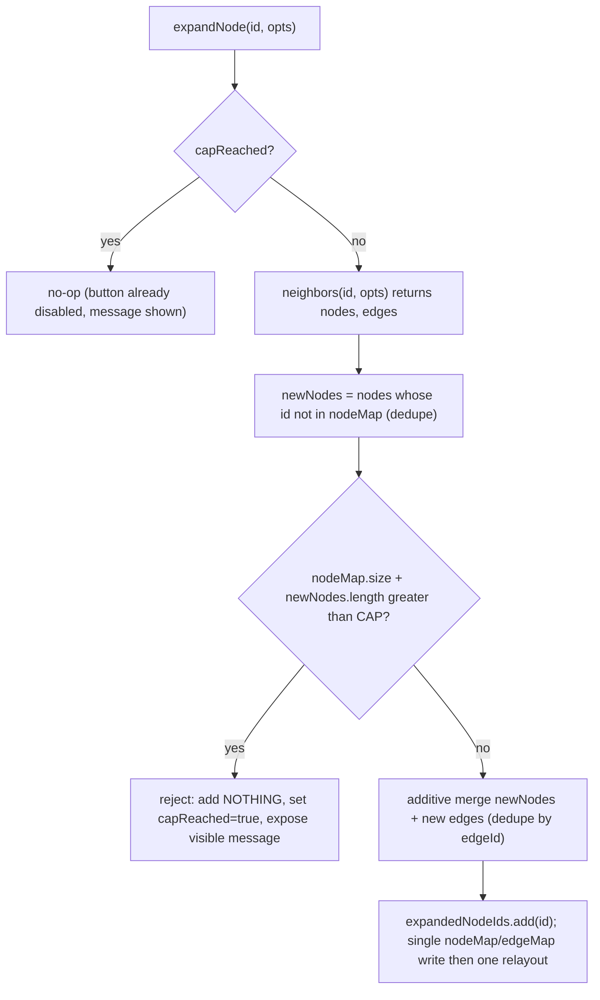
```mermaid
flowchart TD
  A["expandNode(id, opts)"] --> B{capReached?}
  B -- yes --> Z["no-op (button already disabled, message shown)"]
  B -- no --> C["neighbors(id, opts) returns nodes, edges"]
  C --> D["newNodes = nodes whose id not in nodeMap (dedupe)"]
  D --> E{"nodeMap.size + newNodes.length greater than CAP?"}
  E -- yes --> F["reject: add NOTHING, set capReached=true, expose visible message"]
  E -- no --> G["additive merge newNodes + new edges (dedupe by edgeId)"]
  G --> H["expandedNodeIds.add(id); single nodeMap/edgeMap write then one relayout"]
```

- **Inputs:** `neighbors` response, current `nodeMap.size`, `TOPOLOGY_NODE_CAP` (env).
- **Dedupe:** new nodes by `managedObjectId`, new edges by `edgeId`; re-expanding a fully-present
  node yields zero new nodes/edges → count unchanged (AC 56).
- **All-or-nothing:** the count check is on the **deduped new** set; on overflow, **no partial add**
  (AC 57) — distinct from the current per-node cap loop, which must be replaced by this pre-check.
- **Edges-only merge still allowed at cap:** an expansion that adds **only edges** between
  already-present nodes (zero new nodes) is permitted even at the cap.

## Icon asset design (AC 70-72)

- **`objectType → icon file` map** (in `type-icon-mapper.ts`; generic fallback for any unknown type):

  | `objectType` | icon file (`public/icons/`) |
  |---|---|
  | `Node` (Router) | `router.svg` |
  | `LineCard` | `linecard.svg` |
  | `Port` | `port.svg` |
  | `Interface` | `interface.svg` |
  | `FiberSpan` | `fiber-span.svg` |
  | `IPLink` | `ip-link.svg` |
  | `IGPAdjacency` | `igp-adjacency.svg` |
  | `LSP` | `lsp.svg` |
  | `VPNService` | `vpn-service.svg` |
  | `SRLG` | `srlg.svg` |
  | *(anything else)* | `generic.svg` (fallback — AC 71; no node is ever icon-less) |

- **Where they live:** `services/web-ui/public/icons/*.svg` — copied verbatim into the build output
  by the Angular `public/` asset pipeline; served from the app origin. **No CDN, no external URL**
  (AC 72).
- **How Cytoscape references them:** the leaf-node style sets
  `'background-image': (n) => iconUrlFor(n.data('objectType'))`, `'background-fit':'contain'`,
  `'background-opacity':1` over the existing **layer-colour fill** (fill stays as the node
  `background-color`; the icon sits on top). `iconUrlFor` builds an **absolute same-origin URL** via
  `new URL('icons/router.svg', document.baseURI).href` so it resolves correctly under the app's
  served base path and never points off-origin.
- **Offline guarantee (AC 72):** all icons are bundle assets; `iconUrlFor` only ever produces
  same-origin URLs (asserted by the test intercepting requests → zero external-hostname requests).
- **Testability bridge:** each accessible node row carries `data-icon="<objectType-key>"` (the
  resolved icon key, `generic` for fallback), and the canvas carries `data-cy-icon-types` (count of
  distinct icon keys rendered). AC 70 asserts the correct `data-icon` per type; AC 71 asserts a
  fallback `data-icon="generic"` for an unknown type.
- **License note (`public/icons/README.md`):** records the icon source and its **permissive license**
  (MIT / Apache-2.0 / CC0 / CC-BY with attribution). If the icons are authored in-repo, the README
  states they are original and MIT-licensed with the project. Permissive-only per the golden rules.

## Node-cap default (OQ-12)

`TOPOLOGY_NODE_CAP` default = **250** (carried in `environment.model.ts` + `environment.ts`;
overridable per deployment via `env.js`/Compose env). Rationale: large enough to hold a multi-site
exploded trail and several expansions of the synthetic Core IP topology, small enough to keep
Cytoscape layout/redraw responsive in-browser; documented and adjustable (not a contract change).
The existing build hard-codes `NODE_CAP = 250` — this unit moves it to env config (same default).

## Test data (mock fixtures — AC-enabling, this unit)

New/extended fixtures in `mock-fixtures.ts` (MSW unit handlers) and the Playwright contract-mocks,
called out so the dev builds them up front:

- **Per-site DISTINCT graphs** — each site's objects-at-site response is a **different** subgraph
  (no London-clone): distinct device ids and topology per site so multi-site assertions are real.
- **`LOCATED_AT` edges** in every objects-at-site response (device → its Site) so `nodeSiteMap` and
  the single-site boundary box (AC 60) work from the rooted fetch.
- **A `neighbors` handler that crosses sites** — expanding a designated border device returns a
  neighbour **in a second site**, *including that neighbour's `LOCATED_AT` edge to the second Site
  and the second `Site` node*, so cross-site boundary grouping (AC 61) and trail explode (AC 64) are
  exercised end-to-end through `nodeSiteMap`.
- **A `traversal` handler** returning `{reached, edges}` for the optional `expandTraversal` path.
- **A `TRAIL_DETAIL` spanning sites** — `getTrail` returns members across **two** sites, at least one
  member absent from the initially-rooted graph (drives AC 64 explode), with `igpArea` and
  `srlgGroup` populated (AC 65/69).
- **Fixtures covering ALL 10 objectTypes** — a site (or expansion) whose nodes include one of each
  `Node, LineCard, Port, Interface, FiberSpan, IPLink, IGPAdjacency, LSP, VPNService, SRLG` **plus**
  one unknown type (e.g. `UnknownFutureThing`) so AC 70 (icon per type) and AC 71 (generic fallback)
  are both testable.
- **A cap fixture** — a graph pre-seeded to `TOPOLOGY_NODE_CAP` and a `neighbors` response with one
  unseen node (AC 57), and a `neighbors` response echoing already-present ids (AC 56).

## Error handling (this unit)

- **`neighbors`/`getTrail` 5xx or network error:** caught (`catchError`) → no graph mutation; the
  Topology/Trail-Builder error banner (`ErrorBannerService`, AC 53) names the service; other modules
  unaffected; the operator can retry. No partial/garbage merge.
- **Cap exceeded (AC 57):** not an error — a **defined rejection**: nothing added, `capReached=true`,
  a visible `role="status"` cap message, expand buttons disabled. Reset/collapse re-enables.
- **`crossDomain` off:** the `crossDomain` query param is **omitted (or false)**; on (AC 58) it is
  `true`. The client strips `undefined` params so "off" sends no param.
- **Stale objects-at-site response:** the existing `pendingObjectsSiteId` guard drops a superseded
  site response (no clobber).
- **Trail member absent + objects-at-site/neighbors fails during explode:** the member is still added
  as a synthesized node from its `TrailMember` (so it is present + highlightable) even if its
  neighbours can't be fetched — the trail highlight degrades gracefully rather than dropping the
  member.
- **Unknown `objectType` (AC 71):** never an error — falls back to `generic.svg`; the node always
  renders.
- **`maxDepth > 32` on traversal:** clamped client-side to 32 (server limit) before the call.

## Design alternatives (this unit)

| Consideration | Alternatives considered | Chosen + rationale |
|---|---|---|
| **Site attribution for expanded nodes (OQ-11)** | (a) follow-up `GET /topology/nodes/{id}` per expanded node; (b) add `siteId` to `NodeDto` (**contract change**); (c) infer client-side from `LOCATED_AT` edges already in the graph | **(c) infer from `LOCATED_AT`** — LOCKED. The `neighbors` response already carries the device's `LOCATED_AT` edge + its `Site` node (no relation filter), so `nodeSiteMap` derives the site with **no extra call and no contract change**. (a) adds N round-trips per expand and a partial-render window; (b) is a contract change the spec forbids absent human approval. |
| **Icon delivery** | bundled inline SVG under `public/icons/` vs. an icon-font vs. a CDN sprite | **Bundled inline SVG** — LOCKED. Offline (AC 72), permissive, per-type, crisp at any zoom; CDN violates offline + adds an external dependency; an icon font is awkward as a Cytoscape `background-image` and worse for per-type theming. |
| **Icon rendering in Cytoscape** | `background-image` over the layer-colour fill vs. replacing the fill with the icon vs. an HTML overlay layer | **`background-image` over the fill** — keeps the operator's layer colour-coding (AC 28 semantics) AND shows the type icon; an HTML overlay desyncs from Cytoscape pan/zoom. |
| **Cap enforcement (AC 57)** | per-node cap loop (current build: partial add) vs. all-or-nothing pre-check on the deduped new set | **All-or-nothing pre-check** — AC 57 mandates "no partial add". The current build's loop adds up to the cap then stops, which would partially add; this unit replaces it with a pre-check. |
| **`NODE_CAP` source** | module constant (current build) vs. env config `TOPOLOGY_NODE_CAP` | **Env config** — the spec requires a *configurable* cap; default 250 retained. |
| **Expand control placement (UX redesign)** | (a) +expand button in the detail panel + per-node list row (prior build); (b) double-click the canvas node; (c) an **always-visible on-canvas "+" affordance per node** + keep an accessible list-row control | **(c) on-canvas "+" affordance** (primary) + accessible list-row equivalent — LOCKED by operator feedback. The canvas should BE the interface, so the control belongs on the node; the detail panel loses its expand button and the device-list rows are hidden by default. Double-click is undiscoverable and clashes with select. The list-row control is retained behind the List-view toggle as the keyboard/screen-reader + test equivalent. Same `expandNode(id)` behaviour — presentation refinement of AC 55-59, no contract change. |
| **Devices/Connections lists (UX redesign)** | (a) always-shown lists below the canvas (prior build); (b) drop them entirely; (c) move them behind a default-collapsed "List view" toggle, kept in the DOM | **(c) collapsible toggle, kept in DOM** — LOCKED. (b) would break AC 52 (the `<canvas>` has no non-visual equivalent) and remove the deterministic test source of truth + `data-cy-*` bridge. (c) declutters the default view for operators while preserving a11y and the existing AC→test assertions (CSS-collapse, never `*ngIf`-removal). |
| **Node sizing + canvas height (UX redesign)** | keep current small nodes / ~480px height vs. bigger node glyphs/labels + layout spread + moderate height bump | **Bigger nodes + spread + ~640px height** — operator feedback: better real-estate use and legible type icons (AC 70-72). Moderate height keeps the detail panel beside the graph (existing proportions, not a full-page graph). Rendering refinement, no behaviour change. |
| **Trail explode missing-member fetch** | synthesize member node only vs. synthesize + fetch its neighbours (edges) | **Synthesize + fetch neighbours** — the member must not just appear but **connect** to the path; fetching its neighbours brings the connecting edges (and its `LOCATED_AT` → its site box). Degrades to synthesize-only if the fetch fails. |
| **Site boundary rendering** | Cytoscape **compound parent nodes** (labelled boxes) vs. a `bounding-box`/hull overlay vs. background convex-hull plugin | **Compound parent nodes** — first-class in Cytoscape, layout-aware (cose nests children), gives a labelled, per-site-coloured box for free; hull overlays desync on relayout. |
| **Multi-site layout** | keep breadthfirst vs. switch to deterministic `cose` when ≥2 site boxes | **Deterministic `cose` (`animate:false, randomize:false`) for ≥2 sites**, breadthfirst for one — `cose` is compound-aware so boxes don't overlap; deterministic settings keep `layoutstop`/the test bridge reliable. |
| **Re-fit on expand** | always `fit()` after each merge vs. `firstFit` gate + re-fit only on new site box | **`firstFit` gate + re-fit only when a new site box appears** — preserves the operator's manual zoom/pan on same-site expands (AC: zoom state local, not reset), while still surfacing a newly-arrived cross-site box. |
| **Map zoom controls** | rely on MapLibre `NavigationControl` only vs. add explicit fit/reset controls | **`NavigationControl` + explicit fit/reset** — `NavigationControl` gives zoom-in/out + keyboard; fit (`fitBounds(siteExtent)`) and reset-to-default (AC 74) need explicit controls. |

## Test plan

### Acceptance criterion to test (unit/contract)

Unit/component tests use **Vitest + Angular TestBed** with **mock backends** (MSW from producer
OpenAPI) and **mock timers** for the streaming cadence. E2E tests use **Playwright** against the
integration stack (E2E only). All acceptance criteria are mapped 1:1 to a named test — the prior 54
plus the four added by FIX F-UI1/F-UI2 (AC 55-58).

| # | Acceptance criterion | Test | Asserts |
|---|---|---|---|
| 1 | Dashboard alarm-reduction ratio = processed/incidents; N/A when zero incidents | `dashboard-ratio.spec.ts` | ratio matches `totalAlarmsProcessed/totalIncidentsCreated`; N/A shown when `totalIncidentsCreated=0` |
| 2 | Dashboard live incident count + active-pattern count match fixtures | `dashboard-counts.spec.ts` | incident count = incidents fixture size; pattern count = approved patterns size |
| 3 | Root path renders dashboard as default route | `dashboard-route.spec.ts` (router) | navigating `/` (and `/dashboard`) renders `DashboardComponent` |
| 4 | Clicking incident-count KPI navigates to stats/incidents | `dashboard-kpi-nav.spec.ts` (router) | activating the KPI navigates to the stats/incidents view |
| 5 | E2E dashboard non-zero count + ratio after fiber-cut replay | `dashboard.e2e.ts` (Playwright) | integration stack: dashboard shows non-zero incident count and non-zero ratio from stats API |
| 6 | Streaming polls `GET /alarms` every T ms; no extra calls between | `streaming-cadence.spec.ts` (fake timers) | one call per interval at configured T; no call between ticks |
| 7 | New alarm between polls gets "new" indicator; unchanged none; diff over .items | `streaming-new-alarm.spec.ts` | fixture A then B canonical `{items,total,limit,offset}` envelopes (one added alarm in `.items`) then added row has NEW indicator; unchanged row none |
| 8 | open to in-progress between polls updates row + "changed" indicator | `streaming-state-change.spec.ts` | second poll `items[].lifecycleState=in-progress` then row updates + CHANGED indicator |
| 9 | in-progress to correlated and reverted-back-to-open reflected without reload | `streaming-transitions.spec.ts` | all transition cases (keyed on `lifecycleState`) reflected; no page reload |
| 10 | Pause stops all polling to Alarm Manager + Correlation Engine | `streaming-pause.spec.ts` (fake timers) | after pause, no further calls to either client |
| 11 | Resume restarts polling at configured interval | `streaming-resume.spec.ts` (fake timers) | after resume, polling resumes at interval T |
| 12 | Env `STREAMING_REFRESH_INTERVAL_MS=10000` then polls at 10000 | `streaming-interval-config.spec.ts` | interval read from env config; cadence is 10000 not 3000 |
| 13 | E2E streaming shows updated state within two poll cycles | `streaming.e2e.ts` (Playwright) | integration stack: transition visible within two polls |
| 14 | Incident-detail renders root cause/children/pattern/confidence/trail | `incident-detail-render.spec.ts` | `getIncident(id)` returns a single `IncidentVM`; `rootCauseAlarmId`/`childAlarmIds`/`matchedPatternId`/`matchedCodebookId`/`confidence`/`trailId` all rendered |
| 15 | Incident-detail fetches each member alarm + renders state/role | `incident-detail-members.spec.ts` | `getAlarm` returns `AlarmDetail`; per member `lifecycleState` + `role` tag rendered from `transitions`-bearing record |
| 16 | Clicking a member alarm navigates to streaming/alarm view | `incident-detail-nav.spec.ts` (router) | activating an alarm link navigates to streaming with alarm focus/filter |
| 17 | E2E direct nav to `/incidents/<id>` renders root + at least one child | `incident-detail.e2e.ts` (Playwright) | integration stack: deep-link renders root cause + at least one child |
| 18 | Noise-stats renders each run row + derived storm-reduction ratio | `noise-stats-render.spec.ts` | rows show trailId/alarmsIn/clustersFormed/kept/dropped/noiseRatio + storm ratio = alarmsIn/clustersFormed |
| 19 | Noise-stats trailId filter shows only matching rows | `noise-stats-filter.spec.ts` | filter for one trailId then only its rows render; other-trail rows absent |
| 20 | E2E noise-stats shows at least one run with non-zero alarmsIn | `noise-stats.e2e.ts` (Playwright) | integration stack: at least one run-stats row with non-zero `alarmsIn` |
| 21 | Pattern "view trail" navigates to `/topology?trailId=<id>` | `xnav-pattern-trail.spec.ts` (router) | navigation carries pattern `trailId` as query param |
| 22 | Incident entry navigates to `/incidents/:incidentId` | `xnav-incident-detail.spec.ts` (router) | navigation to incident-detail with correct `incidentId` |
| 23 | Direct deep link `/incidents/:id` loads without prior nav | `xnav-deeplink-incident.spec.ts` (router) | direct route activation renders the incident |
| 24 | Direct deep link `/topology?trailId=<id>` activates the trail | `xnav-deeplink-trail.spec.ts` (router) | direct route activation with query param activates trail |
| 25 | E2E dashboard KPI to incident-detail path completes | `xnav.e2e.ts` (Playwright) | integration stack: dashboard KPI to incident-detail renders without error |
| 26 | Geo map renders a marker per Site, none for absent sites | `geo-site-map.spec.ts` | `listSites` returns `SiteListDto`; one marker per `sites[]` `SiteDto` (flat lat/lon/region), no extra markers |
| 27 | Selecting a site calls objects-at-site + renders device graph from nodes AND edges | `site-selection.spec.ts` | request carries correct `siteId`; graph built from `SiteObjectsDto.nodes` + `.edges` (edges from this one response); graph replaces map |
| 28 | Layer toggles independently show/hide; all off = nodes only; layer derived from objectType | `layer-toggle.spec.ts` | `LayerMapper` derives layer from `objectType` (no `layer` field); each toggle filters its derived layer; all-off shows only nodes |
| 29 | Node detail panel shows vendor/model/equipmentType + unknown keys | `attribute-panel-node.spec.ts` | `NodeDto` three well-known keys labelled; extra key generic; `managedObjectId` shown |
| 30 | Edge detail panel shows linkType/capacity + unknown keys | `attribute-panel-edge.spec.ts` | `EdgeDto` (from `SiteObjectsDto.edges`) well-known connection keys labelled; unknown generic; `relation` shown |
| 31 | Trail cluster boundaries overlaid from `listTrails` | `trail-overlay.spec.ts` | overlay rendered per `trails[]` entry of `ListTrailsResponse` |
| 32 | Multi-trail device highlights all its trails distinctly | `trail-highlight.spec.ts` | `getTrailsForObject` (`GET /trails/by-object`) returns `{trailIds:[...]}`; device in at least 2 trails, member trails highlighted, non-members not |
| 33 | E2E real Topology + Trail Builder render sites/graph/attrs/overlays | `topology.e2e.ts` (Playwright) | integration stack: sites, site graph, attributes, trail overlays render without error |
| 34 | Pattern list renders the PatternPage envelope items with all XAI fields | `pattern-list.spec.ts` | `listPatterns` returns `PatternPage`; `items[]` rendered; per `PatternView`: sequence(`{alarmType,optional}`)/support/confidence/lift/`rootCauseAlarmType`/timing/`sessionWindow`/`codebookMatchId`/`structurallyValidated`/instances/`trailId` |
| 35 | Operator can expand a pattern to full XAI | `pattern-expand.spec.ts` | expansion reveals all XAI fields |
| 36 | Approve posts approval-intent with correct id; lifecycle approved | `pattern-approve.spec.ts` | `POST /patterns/{id}/approve` decision approve, correct id; UI shows approved |
| 37 | Reject posts reject-intent; pattern removed/marked rejected | `pattern-reject.spec.ts` | reject POST correct id; pattern removed/marked rejected |
| 38 | Active/approved filter shows only approved | `active-patterns.spec.ts` | mixed-lifecycle `PatternPage.items`, only approved under filter |
| 39 | E2E approve; Pattern Manager reflects approved on re-read | `pattern-approve.e2e.ts` (Playwright) | integration stack: approve then re-read returns approved |
| 40 | Config shows current model params from the versioned Knowledge record | `config-load.spec.ts` | `GET /domains/{domain}/model-params/{recordId}` versioned record; form fields mapped from `payload.params[]` dotted keys (`dbscan.epsilon`, `dbscan.minSamples`, `window.sizeSeconds`, `prefixspan.minSupport`); `version`/`paramSet` shown |
| 41 | Valid edit submits the versioned record via PUT; new version confirmed | `config-save.spec.ts` | `PUT /domains/{domain}/model-params/{recordId}` sent with the versioned record payload (dotted keys, updated value); success toast reflects new `version` |
| 42 | Out-of-bounds value shows validation error, no API call | `config-validation.spec.ts` | value outside a param's declared `min`/`max` → inline error; Knowledge client not called |
| 43 | E2E config edit retrievable via Knowledge on re-read | `config-edit.e2e.ts` (Playwright) | integration stack: submitted versioned edit returned as the new current version on re-read |
| 44 | Incidents render with root-cause + child alarms from the page envelope | `incident-list.spec.ts` | `listIncidents` returns the canonical `{items,total,limit,offset}` envelope (request params `limit`/`offset`, not `page`/`size`); each `items[]` incident shows `rootCauseAlarmId` + `childAlarmIds` |
| 45 | Alarm-reduction ratio from stats shown as numeric | `stats-metrics.spec.ts` | computed ratio = `totalAlarmsProcessed/totalIncidentsCreated`, numeric |
| 46 | E2E fiber-cut: stats shows incident with root cause + children | `stats.e2e.ts` (Playwright) | integration stack: incident with tagged root cause + at least 1 child |
| 47 | Alarm-lifecycle lists lifecycleState + role + incidentId from the page envelope | `alarm-lifecycle.spec.ts` | `listAlarms` returns the canonical `{items,total,limit,offset}` envelope (request params `limit`/`offset`, not `page`/`size`); `items[]` show `lifecycleState` (open/in-progress/correlated/cleared) + role + incidentId; the reverted-open case shows via the detail `transitions` |
| 48 | Lifecycle filter filters by selected lifecycleState incl. in-progress | `alarm-filter.spec.ts` | filter on `lifecycleState` over `.items` shows only that state, incl. in-progress; reverted-open shown as a return to `open` |
| 49 | E2E fiber-cut: correlated alarm with incident association | `alarm-lifecycle.e2e.ts` (Playwright) | integration stack: correlated alarm with non-empty incidentId from Alarm Manager |
| 50 | Mock config: all integration points resolve to mocks, no real HTTP; MSW handlers serve the frozen shapes | `env-mock-switch.spec.ts` | each client (the prior 9 + `EnrichmentChatterClient` + `SimulatorLabelsClient`) hits MSW handlers (from the producers' frozen `openapi.json`; Enrichment chatter mock against the expected/flagged shape until its `openapi.json` lands); responses match the frozen envelopes/DTOs; no outbound real request |
| 51 | Integration config: all base URLs from env, no URL literal in source | `no-hardcoded-url.spec.ts` (build-time grep) | no localhost/service-hostname URL in non-environment source (incl. `ENRICHMENT_CHATTER_API_BASE_URL`, `SIMULATOR_LABELS_API_BASE_URL`) |
| 52 | Keyboard nav cycles all controls; canvases ARIA-labelled (11 views) | `a11y.spec.ts` (axe-core per view) | dashboard/streaming/topology/site-graph/patterns/config/stats/alarm-lifecycle/incident-detail/noise-stats/**chatter**: keyboard reachable; canvas + data-table ARIA labels; no axe violations. **Site-graph (UX redesign):** the accessible Devices/Connections data-table is the `<canvas>`'s non-visual equivalent — it lives behind the default-collapsed "List view" disclosure but is **kept in the DOM** (CSS-hidden, not removed), so axe still finds it and the disclosure (`aria-expanded`/`aria-controls`) is keyboard-operable. |
| 53 | Any backend 5xx: module shows service-named error, others unaffected | `error-boundary.spec.ts` (per integration point) | 5xx then error banner naming the service; other modules still render |
| 54 | Edit draft pattern: mark optional, PATCH sent, edit reflected; draft-only | `pattern-edit.spec.ts` | `PATCH /patterns/{id}` body the frozen `PatternEdit { sequenceFlags:[{index, optional}], reviewer, notes? }`; returned `PatternView` reflects the `optional` per `index`; edit action absent for non-draft |
| 55 | (F-UI1) Chatter page reads NF observed-chatter ranked + marks promoted vs candidate | `chatter-load.spec.ts` | `listObservedChatter` returns `ObservedChatterPage` ranked by `occurrenceCount`; rows render `(managedObjectId or src-level, alarmType, eventType, occurrenceCount)`; each row marked `promoted`/`candidate` by `(managedObjectId, eventType)` match against `listChatter` for the selected source; null-MO source-level signature handled |
| 56 | (F-UI1) Promote posts addChatter, remove posts removeChatter, list re-read | `chatter-promote.spec.ts` | clicking Promote calls `EnrichmentChatterClient.addChatter(source, {managedObjectId, eventType})`, then re-reads; row flips to `promoted`. Remove calls `removeChatter` then re-reads; row flips to `candidate`. Action disabled while in flight (double-submit guard); `409`/`422` surfaces a structured error without mutating local state |
| 57 | (F-UI2) Dashboard shows RCA accuracy: eval-mode value, else client-side label join, else N/A | `dashboard-rca.spec.ts` | with `stats.rcaAccuracy` non-null then that value shown (eval); with `stats.rcaAccuracy=null` + labels fixture then computed = matches/total joining incidents' `rootCauseAlarmType` to `/labels` `rootCauseAlarmType`; with null + no labels then "N/A (no ground truth)"; never the old "evaluated offline" text |
| 58 | (F-UI2) Dashboard shows auto-correlation% = correlatedAlarmCount/totalAlarmsProcessed | `dashboard-autocorr.spec.ts` | KPI = `correlatedAlarmCount/totalAlarmsProcessed` from `GET /stats` (e.g. 768/1280 = 60.0%); N/A when `totalAlarmsProcessed=0`; distinct from the alarm-reduction ratio card |

All 58 acceptance criteria map 1:1 to a named test (49 Vitest/TestBed + 9 Playwright E2E:
AC 5, 13, 17, 20, 25, 33, 39, 43, 46, 49 are E2E — note AC 51 is a build-time grep check run
under the unit harness). The new-view AC groups are covered: dashboard (AC 1-5, **+57-58** for the
new KPIs), streaming (AC 6-13), incident-detail (AC 14-17), noise-stats (AC 18-20), cross-nav/deep-link
(AC 21-25), and the **chatter-management page (FIX F-UI1)**.

### Acceptance criterion to test — Explorable topology & type icons (AC 55-76, this design unit)

**Authoritative mapping for ACs 55-76.** Vitest/TestBed unit/component tests use MSW mocks (from the
producers' frozen `openapi.json`) and a Cytoscape/MapLibre spy or jsdom-guarded init; Playwright
tests run **real chromium** against the integration stack. The method per row matches the AC's stated
method. New/extended spec files live under `services/web-ui/src/app/topology/` (Vitest) and
`services/web-ui/e2e/topology-explore.e2e.ts` (Playwright).

| # | Acceptance criterion (abridged) | Test | Asserts |
|---|---|---|---|
| 55 | Expand calls `neighbors(id)`; unseen nodes + connecting edges added | `expand-node.spec.ts` (TestBed) | activating the **on-canvas "+" affordance** (`data-testid="expand-node"`) for node `N` — and equivalently the accessible List-view row control — calls `TopologyClient.neighbors` with `N`'s id; both fixture neighbour nodes appear in `derivedNodes` and their `via` edges in `derivedEdges`/`visibleEdges`. (UX redesign relocates the control; assertion/behaviour unchanged.) |
| 56 | Re-expand with all neighbours present adds no duplicates | `expand-dedupe.spec.ts` (TestBed) | mock returns ids already in `nodeMap`; `nodeMap.size`/`edgeMap.size` unchanged before vs. after re-expand |
| 57 | At `TOPOLOGY_NODE_CAP`, expansion adding a new node is rejected all-or-nothing + visible message | `expand-cap.spec.ts` (TestBed) | graph pre-seeded to cap; `neighbors` returns one unseen node; node count unchanged, **nothing** added, `capReached()===true`, cap `role="status"` message present |
| 58 | `crossDomain` opt-in → `crossDomain=true` param; off → omitted/false | `expand-crossdomain.spec.ts` (TestBed) | captured request query: `crossDomain=true` when toggle on; param absent (or false) when off |
| 59 | E2E: expand a node, a neighbour + edge appears without reload | `topology-explore.e2e.ts` → `expand neighbour` (Playwright) | against real stack: `data-cy-node-count` increases and a connecting edge appears after clicking the **on-canvas "+" affordance** (`data-testid="expand-node"`); no page reload (SPA). (UX redesign: control is on the canvas; assertion unchanged.) |
| 60 | Single-site graph: every node in one labelled site-boundary box | `site-boundary-single.spec.ts` (TestBed) | objects-at-site fixture all one `siteId` (with `LOCATED_AT` edges); exactly one site-parent box, labelled with the site name; no ungrouped device |
| 61 | Two-site graph: exactly two labelled boundary boxes, no device ungrouped | `site-boundary-cross.spec.ts` (TestBed) | after a cross-site expand fixture (neighbour + its `LOCATED_AT` + 2nd `Site`), `distinctSiteIds().length===2`; two site-parent boxes each labelled; every device parented |
| 62 | E2E: cross-site expansion shows ≥2 labelled boundary groups | `topology-explore.e2e.ts` → `cross-site boundaries` (Playwright) | real stack: trigger cross-site expand; `data-cy-site-count` ≥ 2 and two labelled boxes render |
| 63 | Trail select calls `getTrail`; present members highlighted, non-members not | `trail-select-highlight.spec.ts` (TestBed) | `getTrail` returns 3 members; graph has all 3 + 1 non-member; all 3 get the trail-member highlight class, the non-member does not |
| 64 | Trail member in an unloaded site → that subgraph fetched + member highlighted | `trail-explode.spec.ts` (TestBed) | `getTrail` member absent from graph; mock its `neighbors`/objects-at-site; member node appears in `derivedNodes` and carries the trail-member highlight |
| 65 | Trail-detail panel shows `trailId`, `igpArea`, `srlgGroup`, members | `trail-detail-panel.spec.ts` (TestBed) | `TrailDetail` with both fields populated → each rendered in the panel; each member shows its `managedObjectId`; null shows an absent indicator |
| 66 | Activating a member id in the panel selects that node in the graph | `trail-member-activate.spec.ts` (TestBed) | click/Enter on a member → `selectedObjectId()` equals that member; node gets selected state |
| 67 | Clear-trail removes highlights but keeps exploded nodes/edges | `trail-clear.spec.ts` (TestBed) | after explode then `clearTrail()`: zero nodes carry the trail-highlight class; `nodeMap.size` not reduced to pre-explode count |
| 68 | Device-select + trail-select highlights coexist | `trail-device-coexist.spec.ts` (TestBed) | mock `getTrailsForObject` + `getTrail`; with both active, both highlight sets present simultaneously |
| 69 | E2E: select a trail → members highlighted + panel shows id/area/SRLG | `topology-explore.e2e.ts` → `trail navigation` (Playwright) | real stack: pick a trail from the list; visible members get `data-cy-highlight-count` > 0; panel renders `trailId`, `igpArea`, `srlgGroup` |
| 70 | Each Core IP `objectType` renders its corresponding icon | `type-icon.spec.ts` (TestBed) | render a node per objectType; each row's `data-icon` equals the expected icon key (router/linecard/.../srlg); `data-cy-icon-types` counts all 10 |
| 71 | Unknown `objectType` → generic fallback icon, node still rendered | `type-icon-fallback.spec.ts` (TestBed) | node with `objectType="UnknownFutureThing"` → exists in DOM with `data-icon="generic"`; not hidden |
| 72 | Offline: all icon assets loaded from bundle, no external request | `icon-offline.spec.ts` (TestBed) | intercept requests during render; zero requests to any external hostname for icons; `iconUrlFor` URLs are same-origin (`document.baseURI`) |
| 73 | Graph zoom in/out/fit/reset call the Cytoscape methods | `graph-zoom.spec.ts` (TestBed, cy spy) | zoom-in → `cy.zoom()` increases; zoom-out → decreases; Fit → `cy.fit()`; Reset → `collapseToRoot()` + re-fit (firstFit reset) |
| 74 | Map zoom in/out/fit/reset call the MapLibre methods | `map-zoom.spec.ts` (TestBed, map spy) | zoom-in → map `zoomIn`/`setZoom` up; zoom-out down; Fit → `fitBounds(siteExtent)`; Reset → default centre+zoom restored |
| 75 | Graph zoom controls reachable + activatable by keyboard alone | `graph-zoom-a11y.spec.ts` (TestBed, axe + keyboard) | each of zoom-in/out/fit/reset is focusable (Tab) and activatable (Enter/Space), has an `aria-label`; no axe violations on the controls group |
| 76 | E2E: activating graph zoom-in demonstrably increases the visual zoom | `topology-explore.e2e.ts` → `graph zoom in` (Playwright) | real stack: read `data-cy-zoom` before/after clicking zoom-in → strictly larger |

All 22 ACs (55-76) map 1:1 to a named test: **18 Vitest/TestBed** (55-58, 60-61, 63-68, 70-75) +
**4 Playwright E2E** (59, 62, 69, 76) — matching each AC's stated method.

### E2E scenarios (from this design unit's point of view — Playwright)

| # | Scenario | Trigger to path | Expected outcome |
|---|---|---|---|
| 1 | Dashboard after fiber-cut (AC 5) | Replay fiber-cut, open `/dashboard` against the real stack | Non-zero live incident count and non-zero alarm-reduction ratio from stats API |
| 2 | Streaming live transition (AC 13) | Open `/streaming` against the real stack while a replay drives an alarm transition | Updated lifecycle state visible within two poll cycles; new alarms highlighted |
| 3 | Incident-detail deep link (AC 17) | Navigate directly to `/incidents/<id>` after a fiber-cut replay | Root-cause alarm + at least one child rendered matching the Correlation Engine record |
| 4 | Noise run-stats after P2 (AC 20) | Replay P2 learning scenario, open `/stats` noise run-stats tab | At least one run-stats row with non-zero `alarmsIn` from the Noise Filter API |
| 5 | Cross-nav dashboard to detail (AC 25) | From dashboard incident-count KPI, navigate through to an incident-detail page | Full path completes without error; incident detail rendered |
| 6 | Topology browse (AC 33) | Open `/topology` against real Topology + Trail Builder, list sites, select a site, toggle layers, select a device | Sites listed, site graph + attributes + trail overlays render, no console/network error |
| 7 | Pattern approve round-trip (AC 39) | Open `/patterns`, approve a draft pattern, re-read | Pattern Manager returns approved on subsequent read; UI reflects it |
| 8 | Config edit round-trip (AC 43) | Open `/config`, edit a param, save, re-read | Edited value persisted and returned on re-read |
| 9 | Fiber-cut stats (AC 46) | Replay fiber-cut, open `/stats` | At least 1 incident with tagged root-cause alarm + at least 1 child |
| 10 | Fiber-cut alarm lifecycle (AC 49) | Same replay, open alarm-lifecycle view | At least 1 alarm in correlated state with non-empty incident association from Alarm Manager |
| 11 (failure path) | Backend-down degradation | Point one client (e.g. Knowledge) at an unavailable/5xx endpoint | Affected module shows a structured service-named error; other modules still function (no whole-app crash) |
| 12 (failure path) | Streaming poll failure | Make the Alarm Manager poll endpoint return 5xx mid-stream | Streaming view shows a stale-data indicator, retains last good data, retries next tick, does not crash |
| 13 (empty path) | No discovered patterns | Pattern Manager returns empty draft list | Pattern review shows an explicit empty state, not an error |
| 14 (F-UI1) | Chatter promote round-trip | Open `/chatter` against the real stack (NF observed-chatter populated from a P2 replay), select a source, promote a candidate signature | Enrichment `listChatter` returns the promoted `(managedObjectId, eventType)` on re-read; the row shows `promoted`; closing the loop (Enrichment now suppresses that chatter on the live path) |
| 15 (F-UI2) | Dashboard RCA accuracy + auto-correlation shown | Replay a labeled scenario in the eval/demo profile, open `/dashboard` | RCA-accuracy card shows a numeric value (eval-mode `stats.rcaAccuracy` or the `/labels` client-side join), not "evaluated offline"; auto-correlation card shows `correlatedAlarmCount/totalAlarmsProcessed` near the ~60% target |
| 16 (AC 59) | Explore by expanding a device | Real Topology stack; root a site, click the **on-canvas "+" affordance** on a device | A neighbour node + connecting edge appears (`data-cy-node-count` up); no page reload. (UX redesign: control on the canvas; Devices/Connections lists confirmed reachable via the "List view" toggle.) |
| 17 (AC 62) | Cross-site expansion shows two site boxes | Real stack; expand a border device whose neighbour is in another site | `data-cy-site-count` ≥ 2; two distinct labelled site-boundary boxes render |
| 18 (AC 69) | Trail navigation + detail | Real Trail Builder; select a trail from the trail list in the topology view | Visible members highlighted (`data-cy-highlight-count` > 0); trail-detail panel shows `trailId`, `igpArea`, `srlgGroup` |
| 19 (AC 76) | Graph zoom-in increases visual zoom | Real stack; on the site graph, click zoom-in | `data-cy-zoom` strictly increases after the control activation |
| 20 (failure path, AC 53/57) | Expand at cap / Topology 5xx | Drive the graph to `TOPOLOGY_NODE_CAP` then expand; separately make `neighbors` return 5xx | At cap: visible cap message, node count unchanged, nothing partially added. On 5xx: Topology-named error banner, graph unchanged, other modules unaffected, retry works |
| 21 (offline path, AC 72) | Icons load offline | Serve with no external network; render the site graph | All device-type icons render from the bundle; no request to any external hostname for an icon asset |

## Config & observability

- **Config:** `environment.ts` / `environment.integration.ts` carry the **eleven** per-service base
  URLs (the prior nine + `ENRICHMENT_CHATTER_API_BASE_URL` + `SIMULATOR_LABELS_API_BASE_URL`),
  `INTEGRATION_MODE=mock|real`, `STREAMING_REFRESH_INTERVAL_MS` (default `3000`), an optional
  `RCA_LABELS_ENABLED` flag (gates the demo/eval Simulator-labels RCA join; off in production), and the
  client log level. The Simulator-labels base URL may be unset in production — RCA accuracy then
  resolves to the CE eval-mode value or N/A (not an error). Values are injected from Docker Compose environment variables at build/serve
  time. No URL, threshold, interval literal, or credential is hard-coded in application source
  (AC 51). The streaming refresh interval is operator-adjustable at runtime via the UI; the env
  value is its default. The 3 s default is the spec default (open question #10) and may be
  adjusted in `environment.ts` if the integration stack reveals a better value — not a contract
  change.
- **Explorable-topology config (ACs 55-76):** `TOPOLOGY_NODE_CAP` (default **250**, in
  `environment.model.ts` + `environment.ts`, overridable via `env.js`/Compose) bounds the
  accumulating explorer graph; `crossDomain` expand is a per-view UI toggle (not env). Bundled
  type icons are static `public/icons/*.svg` assets (offline, no env). None are contract changes.
- **Observability:** served app root `/` returns HTTP 200 for liveness (nginx). Client-side
  **structured JSON logging** (configurable level from env) for API errors, navigation events,
  and poll failures. **No `/metrics`** endpoint — a static SPA has no BFF; per spec this is
  intentional.
- **Accessibility:** WCAG 2.1 AA — semantic landmarks, ARIA roles/labels on map and graph
  canvases and data tables, `@angular/cdk/a11y` focus management + `LiveAnnouncer`, keyboard
  navigation for all controls, contrast at least 4.5 to 1 (text) and at least 3 to 1 (large
  text + UI components). **Streaming-specific a11y:** the new/changed highlight respects
  `prefers-reduced-motion` (no animation — a static text/badge indicator instead); `LiveAnnouncer`
  announces newly-arrived alarms and lifecycle changes to screen readers via an ARIA live region
  (polite), so non-visual users are not excluded from the live view; the pause control is
  keyboard-operable and the interval control is a labelled numeric input. Verified by
  `a11y.spec.ts` (axe-core) per view across all ten views (AC 52).
- **Performance:** OnPush + signals throughout; lazy-loaded routes per module; CDK virtual scroll
  for long streaming/alarm/incident/pattern lists; streaming delta-render updates only changed
  rows (tracked by id) — never a full-list re-render per poll; Cytoscape kept responsive up to
  the configured max graph size.

## Build & run

- **Dev (mock):** `npm ci && npm start` — serves the SPA with `INTEGRATION_MODE=mock`; MSW
  handlers (from producer OpenAPI) back all calls; no live dependency. Streaming polls the mock
  endpoints at `STREAMING_REFRESH_INTERVAL_MS`.
- **Unit/component tests:** `npm test` (Vitest + Angular TestBed, jsdom, MSW mocks, fake timers
  for cadence). Lint: `npm run lint`. Build: `npm run build` (static bundle).
- **E2E:** `npm run e2e` (Playwright) against the integration stack (`INTEGRATION_MODE=real`,
  base URLs are Compose addresses).
- **Container:** multi-stage Dockerfile — build stage `node:24` (`npm ci && npm run build`),
  serve stage nginx serving `dist/` with `/` returning HTTP 200 liveness. Docker Compose entry
  sets the **eleven** base-URL env vars, `INTEGRATION_MODE`, `RCA_LABELS_ENABLED`, and
  `STREAMING_REFRESH_INTERVAL_MS`.
- **Client regeneration:** on a collaborator OpenAPI contract change (architecture.md update +
  human approval first), run `npm run generate:clients` to regenerate TypeScript models from the
  producers' checked-in `openapi.json` (now including the Noise Filter `openapi.json` with the
  observed-chatter schema, the Simulator `openapi.json` for `/labels`, and the **Enrichment chatter
  `openapi.json` once published** — until then the `EnrichmentChatterClient` models are hand-pinned to
  the flagged expected shape and the dependency is tracked for the human).
